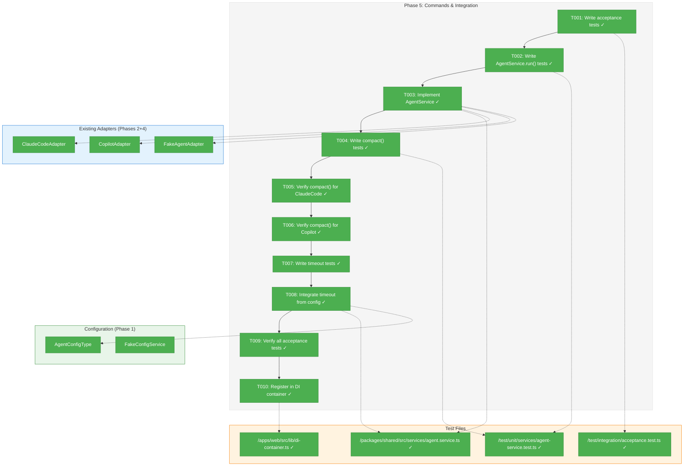
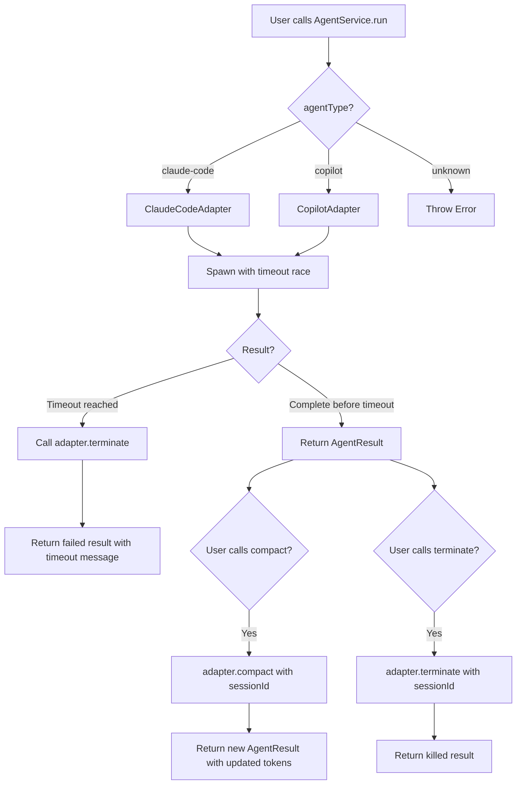
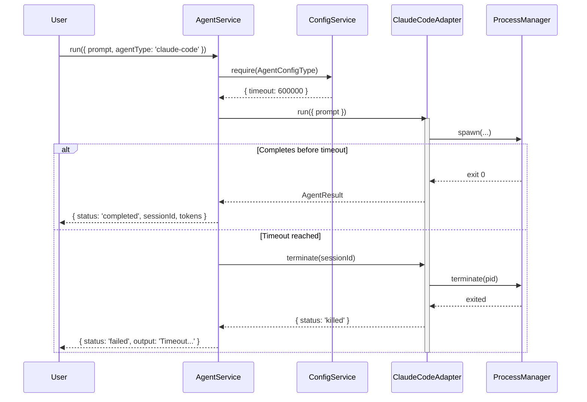

# Phase 5: Commands & Integration – Tasks & Alignment Brief

**Spec**: [../../agent-control-spec.md](../../agent-control-spec.md)
**Plan**: [../../agent-control-plan.md](../../agent-control-plan.md)
**Date**: 2026-01-22
**Testing Approach**: Full TDD

---

## Executive Briefing

### Purpose
This phase implements the `AgentService` orchestration layer that unifies both agent adapters (ClaudeCodeAdapter, CopilotAdapter) behind a single service interface, integrates timeout handling from the configuration system, and enables the `/compact` command for context reduction.

### What We're Building
An `AgentService` class that:
- Selects the appropriate adapter based on `agentType` parameter
- Enforces configurable timeout limits (default 10 minutes) from `AgentConfigType`
- Orchestrates `/compact` commands through adapters to reduce token usage
- Manages session lifecycle for terminate() operations

### User Value
Users can interact with any supported AI coding agent through a single consistent interface, with automatic timeout protection to prevent runaway processes and context compaction to extend productive sessions.

### Example
**Request**: `agentService.run({ prompt: 'Write hello world', agentType: 'claude-code' })`
**Response**: `{ sessionId: 'abc-123', status: 'completed', tokens: { used: 165, limit: 200000 }, output: '...' }`

**Timeout Scenario**: Agent running > 10 minutes → automatically terminated → `{ status: 'failed', output: 'Timeout after 600000ms' }`

---

## Objectives & Scope

### Objective
Implement the orchestration service layer that ties together all prior phases, verifying all 20 acceptance criteria from the spec.

### Behavior Checklist (from Spec AC)
- [ ] AC-1: Result includes sessionId for resumption
- [ ] AC-2: Session resumption via sessionId parameter
- [ ] AC-3: Spawns Claude Code CLI with required flags
- [ ] AC-4: Spawns Copilot CLI with required flags
- [ ] AC-5: Status 'completed' on exit 0
- [ ] AC-6: Status 'failed' on exit >0
- [ ] AC-7: Status 'killed' when terminated
- [ ] AC-9: Token usage in result (Claude Code)
- [ ] AC-10: Token limit in result (Claude Code)
- [ ] AC-11: Token null for Copilot
- [ ] AC-12: /compact sends compact command
- [ ] AC-13: /compact returns new token metrics
- [ ] AC-14: Termination within 10 seconds
- [ ] AC-16: Required CLI flags used
- [ ] AC-17: Session ID extracted correctly
- [ ] AC-20: Timeout enforcement

### Goals

- ✅ Create AgentService class with adapter selection
- ✅ Integrate timeout from AgentConfigType
- ✅ Implement `/compact` delegation to adapters
- ✅ Write acceptance tests verifying all 20 AC
- ✅ Register AgentService in DI container
- ✅ Enable compact to build context first (per Discovery 11)

### Non-Goals

- ❌ Streaming output (spec explicitly states no streaming)
- ❌ Multi-agent orchestration (single agent per call)
- ❌ Queue management or batching
- ❌ Retry logic (caller's responsibility)
- ❌ Caching of results
- ❌ New adapter implementations (use existing)
- ❌ Shared DI infrastructure (app-specific only)

---

## Architecture Map

### Component Diagram
<!-- Status: grey=pending, orange=in-progress, green=completed, red=blocked -->
<!-- Updated by plan-6 during implementation -->



### Task-to-Component Mapping

<!-- Status: ⬜ Pending | 🟧 In Progress | ✅ Complete | 🔴 Blocked -->

| Task | Component(s) | Files | Status | Comment |
|------|-------------|-------|--------|---------|
| T001 | Acceptance Tests | /test/integration/acceptance.test.ts | ✅ Complete | Tests for all 20 AC from spec |
| T002 | Unit Tests | /test/unit/services/agent-service.test.ts | ✅ Complete | AgentService.run() unit tests |
| T003 | AgentService | /packages/shared/src/services/agent.service.ts | ✅ Complete | Core orchestration service |
| T004 | Unit Tests | /test/unit/services/agent-service.test.ts | ✅ Complete | compact() unit tests |
| T005 | ClaudeCodeAdapter | /packages/shared/src/adapters/claude-code.adapter.ts | ✅ Complete | Verify compact() works |
| T006 | CopilotAdapter | /packages/shared/src/adapters/copilot.adapter.ts | ✅ Complete | Verify compact() works |
| T007 | Unit Tests | /test/unit/services/agent-service.test.ts | ✅ Complete | Timeout handling tests |
| T008 | AgentService | /packages/shared/src/services/agent.service.ts | ✅ Complete | Config integration |
| T009 | Acceptance Tests | /test/integration/acceptance.test.ts | ✅ Complete | All 20 AC passing |
| T010 | DI Container | /apps/web/src/lib/di-container.ts | ✅ Complete | AgentService registration |

---

## Tasks

| Status | ID | Task | CS | Type | Dependencies | Absolute Path(s) | Validation | Subtasks | Notes |
|--------|-----|------|-----|------|--------------|------------------|------------|----------|-------|
| [x] | T001 | Write acceptance tests for all 20 acceptance criteria | 3 | Test | – | /home/jak/substrate/002-agents/test/integration/acceptance.test.ts | Tests file created, all initially failing (RED) | – | Map each AC to a test |
| [x] | T002 | Write unit tests for AgentService.run() | 2 | Test | T001 | /home/jak/substrate/002-agents/test/unit/services/agent-service.test.ts | Tests for new session, resume, adapter selection | – | Use FakeAgentAdapter |
| [x] | T003 | Implement AgentService with adapter selection | 3 | Core | T002 | /home/jak/substrate/002-agents/packages/shared/src/services/agent.service.ts | All run() unit tests pass (GREEN) | – | Per Discovery 10: stateless |
| [x] | T004 | Write unit tests for compact() including context-building | 2 | Test | T003 | /home/jak/substrate/002-agents/test/unit/services/agent-service.test.ts | Tests per Discovery 11: build context first | – | Multi-turn required |
| [x] | T005 | Verify compact() implementation for ClaudeCodeAdapter | 1 | Core | T004 | /home/jak/substrate/002-agents/packages/shared/src/adapters/claude-code.adapter.ts | compact() returns AgentResult with tokens | – | Already implemented; verify |
| [x] | T006 | Verify compact() implementation for CopilotAdapter | 1 | Core | T005 | /home/jak/substrate/002-agents/packages/shared/src/adapters/copilot.adapter.ts | compact() returns AgentResult (tokens null) | – | Already implemented; verify |
| [x] | T007 | Write unit tests for timeout handling | 2 | Test | T006 | /home/jak/substrate/002-agents/test/unit/services/agent-service.test.ts | Tests verify timeout triggers terminate() | – | Use FakeAgentAdapter with delay |
| [x] | T008 | Integrate timeout from AgentConfigType | 2 | Core | T007 | /home/jak/substrate/002-agents/packages/shared/src/services/agent.service.ts | Timeout read from config, races with run() | – | Per ADR-0003 IMP-006 |
| [x] | T009 | Verify all 20 acceptance tests pass | 2 | Integration | T008 | /home/jak/substrate/002-agents/test/integration/acceptance.test.ts | All acceptance tests GREEN | – | Full AC coverage |
| [x] | T010 | Register AgentService in DI container | 1 | Setup | T009 | /home/jak/substrate/002-agents/apps/web/src/lib/di-container.ts | Resolvable from container | – | Factory pattern |

---

## Alignment Brief

### Prior Phases Review

#### Phase 1: Interfaces & Fakes (Foundation)

**Deliverables Available**:
- `IAgentAdapter` interface with `run()`, `compact()`, `terminate()` methods
- `IProcessManager` interface with process lifecycle management
- `FakeAgentAdapter` with configurable responses and assertion helpers
- `FakeProcessManager` with signal tracking
- `AgentConfigType` and `AgentConfigSchema` with timeout: 1000-3600000ms (default 600000)
- Contract test factories for parity verification

**Key Patterns Established**:
- Async interface pattern: all methods return `Promise<T>`
- Nullable object pattern: `tokens: TokenMetrics | null`
- Stateless service design: service tracks no session state
- Full interface first: complete contracts in Phase 1

**Test Infrastructure**:
- `agentAdapterContractTests()` factory
- `processManagerContractTests()` factory
- FakeAgentAdapter helpers: `getRunHistory()`, `assertRunCalled()`, `reset()`

**Location**: `/home/jak/substrate/002-agents/docs/plans/002-agent-control/tasks/phase-1-interfaces-fakes/`

---

#### Phase 2: Claude Code Adapter (Real CLI Integration)

**Deliverables Available**:
- `ClaudeCodeAdapter` implementing `IAgentAdapter`
- `StreamJsonParser` for NDJSON parsing (session ID, tokens, output)
- `ClaudeCodeAdapterOptions` type
- DI tokens: `CLAUDE_CODE_ADAPTER`, `AGENT_ADAPTER` (default)

**Key Patterns Established**:
- Buffered output pattern: collect stdout after process exits
- Resilient parsing: parse ALL NDJSON lines, return first valid value
- Delegation for compact: `compact()` → `run({ prompt: '/compact', sessionId })`
- Input validation: prompt length (100k), control characters, path traversal

**Integration Notes**:
- `--output-format=stream-json`, `--dangerously-skip-permissions`, `--verbose` flags
- `tokens: { used, limit }` extracted from `usage` field
- `getCliVersion()` for debugging

**Test Infrastructure**:
- `hasClaudeCli()` skip guard
- Contract tests wired: 9 tests passing

**Location**: `/home/jak/substrate/002-agents/docs/plans/002-agent-control/tasks/phase-2-claude-code-adapter/`

---

#### Phase 3: Process Management (Platform-Specific)

**Deliverables Available**:
- `UnixProcessManager` implementing `IProcessManager`
- `WindowsProcessManager` implementing `IProcessManager`
- Signal escalation: SIGINT (2s) → SIGTERM (2s) → SIGKILL
- `getProcessOutput(pid)` for buffered stdout retrieval

**Key Patterns Established**:
- Constructor-injected timing configuration: `signalIntervalMs` for fast tests
- Platform factory in DI: `process.platform === 'win32'` detection
- Graceful no-op: signal/terminate on exited PIDs completes without error
- ManagedProcess internal state encapsulation

**Integration Notes**:
- Termination completes within ~6 seconds (2s + 2s + 2s)
- Exit code mapping: 0=completed, >0=failed, null+signal=killed
- 100-cycle zombie prevention verified

**Test Infrastructure**:
- Stubborn process pattern: `sh -c "trap \"\" INT TERM; sleep 60"`
- Fast signal testing: 100ms intervals for unit tests
- Cross-platform zombie detection: `process.kill(pid, 0)` throws ESRCH

**Location**: `/home/jak/substrate/002-agents/docs/plans/002-agent-control/tasks/phase-3-process-management/`

---

#### Phase 4: Copilot Adapter (Log-Based Session Tracking)

**Deliverables Available**:
- `CopilotAdapter` implementing `IAgentAdapter`
- `CopilotLogParser` for session ID extraction from log files
- `CopilotAdapterOptions` and `ReadLogFileFunction` types
- DI token: `COPILOT_ADAPTER`

**Key Patterns Established**:
- Injectable `readLogFile` function for testing without file system
- Exponential backoff polling: 50ms base, 2x multiplier, 5s timeout
- Fallback session ID: `copilot-{pid}-{timestamp}`
- Graceful token degradation: always returns `tokens: null`
- Security hardening: SEC-001, SEC-002, SEC-003, COR-002 fixes applied

**Integration Notes**:
- Requires `--log-dir` flag for session ID extraction
- `/compact` uses `-p` flag (may need stdin for full support)
- CLI version 0.0.389 tested

**Test Infrastructure**:
- Injectable readLogFile pattern
- Short poll timeouts for fast tests (50-100ms)
- Contract tests wired: 9 tests passing

**Location**: `/home/jak/substrate/002-agents/docs/plans/002-agent-control/tasks/phase-4-copilot-adapter/`

---

### Critical Findings Affecting This Phase

| Finding | Constraint | Tasks Affected |
|---------|-----------|----------------|
| **Discovery 03: Token Usage Extraction** | Extract from Claude Code `usage` field; sum all token types | T001, T009 (AC-9, AC-10) |
| **Discovery 04: Copilot Token Reporting** | Return `null` for Copilot token metrics | T001, T006, T009 (AC-11) |
| **Discovery 06: Result State Machine** | Handle four exit paths: normal, error, killed, timeout | T003, T007, T008 |
| **Discovery 09: Configuration Integration** | Timeout via `AgentConfigType`, follow IMP-006 pattern | T008 |
| **Discovery 10: Session Memory Management** | Service tracks only active processes; no session history | T003 |
| **Discovery 11: Compact Requires Prior Context** | Integration tests must build context before compact | T004, T009 (AC-12, AC-13) |

### ADR Decision Constraints

| ADR | Constraint | Tasks Affected |
|-----|-----------|----------------|
| **ADR-0001** | Three-level testing: unit, contract, integration | T001, T002, T004, T007 |
| **ADR-0002** | Contract tests verify adapter parity | T005, T006 |
| **ADR-0003** | Config via `configService.require(AgentConfigType)`, Zod schema-first | T008 |

### Invariants & Guardrails

- **Timeout Budget**: 10 minutes default (600000ms), configurable 1s-1h
- **Termination Budget**: Signal escalation completes in <10 seconds
- **Memory**: No session history retention; only active process handles tracked
- **Security**: Input validation per Phase 2/4 patterns (prompt length, control chars, path traversal)

### Inputs to Read

| File | Purpose |
|------|---------|
| `/home/jak/substrate/002-agents/packages/shared/src/interfaces/agent-adapter.interface.ts` | IAgentAdapter contract |
| `/home/jak/substrate/002-agents/packages/shared/src/interfaces/agent-types.ts` | AgentResult, AgentRunOptions, TokenMetrics |
| `/home/jak/substrate/002-agents/packages/shared/src/fakes/fake-agent-adapter.ts` | FakeAgentAdapter for testing |
| `/home/jak/substrate/002-agents/packages/shared/src/config/schemas/agent.schema.ts` | AgentConfigType for timeout |
| `/home/jak/substrate/002-agents/packages/shared/src/adapters/claude-code.adapter.ts` | ClaudeCodeAdapter reference |
| `/home/jak/substrate/002-agents/packages/shared/src/adapters/copilot.adapter.ts` | CopilotAdapter reference |
| `/home/jak/substrate/002-agents/apps/web/src/lib/di-container.ts` | DI registration patterns |

### Visual Alignment: Flow Diagram



### Visual Alignment: Sequence Diagram



### Test Plan (Full TDD)

#### Acceptance Tests (T001, T009)

| Test Name | AC | Rationale | Expected Output |
|-----------|-----|-----------|-----------------|
| `should include sessionId in result` | AC-1 | Core session functionality | `result.sessionId` defined and non-empty |
| `should resume session with prior sessionId` | AC-2 | Session continuity | Adapter called with sessionId |
| `should spawn Claude Code with required flags` | AC-3, AC-16 | CLI invocation correctness | Spawn history includes flags |
| `should spawn Copilot with required flags` | AC-4, AC-16 | CLI invocation correctness | Spawn history includes flags |
| `should return status completed on exit 0` | AC-5 | Status mapping | `status === 'completed'` |
| `should return status failed on exit >0` | AC-6 | Status mapping | `status === 'failed'` |
| `should return status killed on terminate` | AC-7 | Termination semantics | `status === 'killed'` |
| `should include token usage for Claude Code` | AC-9 | Token tracking | `tokens.used` is number |
| `should include token limit for Claude Code` | AC-10 | Context window tracking | `tokens.limit` is number |
| `should return null tokens for Copilot` | AC-11 | Graceful degradation | `tokens === null` |
| `should send compact command` | AC-12 | Compact functionality | Adapter compact() called |
| `should return updated tokens after compact` | AC-13 | Compact result | Result includes tokens |
| `should terminate within 10 seconds` | AC-14 | Termination budget | Completes in <10s |
| `should extract session ID correctly` | AC-17 | Session ID parsing | SessionId matches expected format |
| `should terminate on timeout` | AC-20 | Timeout enforcement | Result has failed status |

#### Unit Tests (T002, T004, T007)

| Category | Tests | Fixtures |
|----------|-------|----------|
| run() - new session | Adapter run() called with prompt, sessionId undefined | FakeAgentAdapter |
| run() - resume session | Adapter run() called with provided sessionId | FakeAgentAdapter |
| run() - adapter selection | Claude-code → ClaudeCodeAdapter, copilot → CopilotAdapter | FakeAgentAdapter map |
| run() - unknown agent type | Throws/returns error for unknown type | FakeAgentAdapter |
| compact() - context first | Multi-turn before compact (per Discovery 11) | FakeAgentAdapter |
| compact() - returns tokens | Result includes token metrics | FakeAgentAdapter |
| timeout - triggers terminate | Slow adapter → terminate() called | FakeAgentAdapter with delay |
| timeout - from config | Reads AgentConfigType.timeout | FakeConfigService |

### Step-by-Step Implementation Outline

1. **T001**: Create `/test/integration/acceptance.test.ts` with 15+ tests mapped to AC
2. **T002**: Create `/test/unit/services/agent-service.test.ts` with run() tests
3. **T003**: Implement `AgentService` class with adapter injection and selection
4. **T004**: Add compact() tests with context-building per Discovery 11
5. **T005**: Verify ClaudeCodeAdapter.compact() returns expected result
6. **T006**: Verify CopilotAdapter.compact() returns result with null tokens
7. **T007**: Add timeout tests with FakeAgentAdapter configured for delay
8. **T008**: Integrate `configService.require(AgentConfigType)` for timeout
9. **T009**: Run all acceptance tests, fix any failures
10. **T010**: Add AgentService to DI container with factory pattern

### Commands to Run

```bash
# Environment setup
cd /home/jak/substrate/002-agents
pnpm install

# Run specific test file (unit)
pnpm vitest run test/unit/services/agent-service.test.ts

# Run specific test file (integration)
pnpm vitest run test/integration/acceptance.test.ts

# Run all agent-related tests
pnpm vitest run test/unit/services test/contracts test/integration

# Type checking
pnpm typecheck

# Full test suite
pnpm test
```

### Risks/Unknowns

| Risk | Severity | Mitigation |
|------|----------|------------|
| Timeout race conditions | Medium | **RESOLVED**: Use Promise.race() + adapter.terminate() + `.catch(() => {})` to suppress late errors (DYK-01) |
| Compact effectiveness varies by agent | Medium | **RESOLVED**: Multi-turn tests per Discovery 11; CopilotAdapter handled gracefully (tokens=null) (DYK-04) |
| FakeAgentAdapter lacks delay support | Low | **RESOLVED**: Add `runDuration` option to FakeAgentAdapterOptions (DYK-03) |
| Config not loaded before service creation | Low | **RESOLVED**: Follow SampleService pattern; seed AgentConfig in test containers (DYK-05) |

### Ready Check

- [ ] All prior phase tasks.md reviewed (Phases 1-4)
- [ ] Critical findings documented (Discoveries 03, 04, 06, 09, 10, 11)
- [ ] ADR constraints mapped (ADR-0001, ADR-0002, ADR-0003)
- [ ] Flow diagram reviewed
- [ ] Sequence diagram reviewed
- [ ] Test plan complete
- [ ] Commands copy-paste ready
- [ ] Risks identified with mitigations

**Awaiting GO/NO-GO from human sponsor.**

---

## Phase Footnote Stubs

_Footnotes will be added during implementation by plan-6._

| ID | Reference | Note |
|----|-----------|------|
| | | |

---

## Evidence Artifacts

| Artifact | Location | Purpose |
|----------|----------|---------|
| Execution Log | `/home/jak/substrate/002-agents/docs/plans/002-agent-control/tasks/phase-5-commands-integration/execution.log.md` | Detailed task completion narrative |
| Test Results | Console output | Test pass/fail evidence |
| Type Check | Console output | TypeScript compilation success |

---

## Discoveries & Learnings

_Populated during implementation by plan-6. Log anything of interest to your future self._

| Date | Task | Type | Discovery | Resolution | References |
|------|------|------|-----------|------------|------------|
| 2026-01-23 | T007/T008 | decision | **DYK-01**: Timeout race cleanup - Promise.race() ignores late results by design; no flag needed. Process cleanup via existing terminate(). Late errors need `.catch(() => {})` suppression. | Use hybrid pattern: Promise.race() + terminate() + catch suppression. CS-2 complexity. | Perplexity research on Node.js timeout patterns |
| 2026-01-23 | T003/T010 | decision | **DYK-02**: Adapter selection architecture - AgentService needs both adapters but DI injects one. Factory function pattern chosen over Map/Object/Container injection. | Inject `(agentType: string) => IAgentAdapter` factory; register as ADAPTER_FACTORY token. Extends existing useFactory pattern. | V2-01 through V2-05 verification |
| 2026-01-23 | T007 | decision | **DYK-03**: FakeAgentAdapter lacks delay support for timeout testing. | Add `runDuration?: number` to FakeAgentAdapterOptions; wrap return in setTimeout. CS-1 trivial. Follows FakeProcessManager precedent. | V3-01 through V3-05 verification |
| 2026-01-23 | T004/T009 | decision | **DYK-04**: Compact requires prior context (Discovery 11). Single-turn tests don't validate AC-13 (token reduction). | Use full multi-turn tests: 2-3 run() calls before compact(). Handle CopilotAdapter gracefully (tokens always null). | V4-01 through V4-05 verification |
| 2026-01-23 | T003/T010 | decision | **DYK-05**: Config loading sequence - AgentService needs AgentConfigType but test containers don't seed it. | Follow SampleService pattern: constructor receives IConfigService, calls require(AgentConfigType). Update createTestContainer() to seed agent config. | V5-01 through V5-05 verification |

**Types**: `gotcha` | `research-needed` | `unexpected-behavior` | `workaround` | `decision` | `debt` | `insight`

**What to log**:
- Things that didn't work as expected
- External research that was required
- Implementation troubles and how they were resolved
- Gotchas and edge cases discovered
- Decisions made during implementation
- Technical debt introduced (and why)
- Insights that future phases should know about

_See also: `execution.log.md` for detailed narrative._

---

## Directory Layout

```
docs/plans/002-agent-control/
├── agent-control-spec.md
├── agent-control-plan.md
└── tasks/
    ├── phase-1-interfaces-fakes/
    │   ├── tasks.md
    │   └── execution.log.md
    ├── phase-2-claude-code-adapter/
    │   ├── tasks.md
    │   └── execution.log.md
    ├── phase-3-process-management/
    │   ├── tasks.md
    │   └── execution.log.md
    ├── phase-4-copilot-adapter/
    │   ├── tasks.md
    │   └── execution.log.md
    └── phase-5-commands-integration/
        ├── tasks.md                # This file
        └── execution.log.md        # Created by plan-6
```

---

## Critical Insights Discussion

**Session**: 2026-01-23
**Context**: Phase 5: Commands & Integration Tasks Dossier
**Analyst**: AI Clarity Agent
**Reviewer**: Development Team
**Format**: Water Cooler Conversation (5 Critical Insights)

### Insight 1: Timeout Race Cleanup Hazard

**Did you know**: When AgentService implements timeout via Promise.race(), if the timeout fires first, the adapter's run() Promise is still pending and could resolve late, creating a race condition.

**Implications**:
- Two code paths compete to produce the final result
- Late results could overwrite timeout state if not handled
- Discovery 06 documents this as needing a state machine with four exit paths

**Options Considered**:
- Option A: AbortController pattern - cancel the underlying promise
- Option B: Timeout flag with late result ignore
- Option C: Trust ProcessManager to handle it

**AI Recommendation**: Option B (Timeout Flag)
- Reasoning: No API changes required, aligns with Discovery 06 state machine

**Discussion Summary**:
Used Perplexity to research best practices. Found that Promise.race() already ignores late results by design, and our existing terminate() handles process cleanup. The key insight is adding `.catch(() => {})` to suppress late errors.

**Decision**: Hybrid of A and C - Use Promise.race() + adapter.terminate() + `.catch(() => {})` to suppress late errors

**Action Items**:
- [ ] T007/T008: Implement timeout with Promise.race() pattern
- [ ] Add `.catch(() => {})` to suppress late errors from raced promise

**Affects**: T007 (timeout tests), T008 (timeout implementation)

---

### Insight 2: Adapter Selection Architecture Gap

**Did you know**: AgentService needs to select between adapters via agentType parameter, but DI typically injects ONE dependency per token. AgentService needs access to BOTH adapters.

**Implications**:
- Can't just receive a single IAgentAdapter via constructor
- Need injection pattern that provides multiple adapters or selection mechanism
- Choice affects testability and DI patterns

**Options Considered**:
- Option A: Inject Adapter Map
- Option B: Inject Factory Function
- Option C: Inject Container Directly (anti-pattern)
- Option D: Inject All Adapters Object

**AI Recommendation**: Option B (Factory Function)
- Reasoning: Extends existing useFactory pattern, maintains DI principle

**Discussion Summary**:
Verification showed useFactory pattern is already standard in di-container.ts. Factory function allows lazy resolution while keeping selection logic in AgentService.

**Decision**: Option B - Inject `(agentType: string) => IAgentAdapter` factory function

**Action Items**:
- [ ] T003: Add AdapterFactory registration to di-container.ts
- [ ] T010: Update DI_TOKENS with ADAPTER_FACTORY token

**Affects**: T003 (AgentService implementation), T010 (DI registration)

---

### Insight 3: FakeAgentAdapter Can't Simulate Slow Operations

**Did you know**: Testing timeout behavior requires simulating slow run() operations, but FakeAgentAdapter returns immediately with no delay capability.

**Implications**:
- Unit tests can't trigger timeout path reliably
- Can't test the "late result suppression" pattern from DYK-01
- Risk table already identified this gap

**Options Considered**:
- Option A: Add runDuration to FakeAgentAdapterOptions
- Option B: Create separate TimeoutTestAdapter
- Option C: Use real timers with Promise wrapper in tests

**AI Recommendation**: Option A (Add runDuration)
- Reasoning: Minimal change, follows FakeProcessManager precedent, reusable

**Discussion Summary**:
FakeProcessManager already has timing-aware methods, establishing precedent. Adding runDuration is CS-1 trivial and unblocks all timeout testing.

**Decision**: Option A - Add `runDuration?: number` to FakeAgentAdapterOptions

**Action Items**:
- [ ] Add runDuration option to FakeAgentAdapterOptions
- [ ] Update FakeAgentAdapter.run() to await setTimeout when set

**Affects**: T007 (timeout tests), FakeAgentAdapter

---

### Insight 4: Compact Tests Must Build Context First

**Did you know**: Discovery 11 states /compact requires prior context. Tests that call compact() on fresh sessions won't validate AC-13 (tokens reduced).

**Implications**:
- Single-turn tests verify AC-12 (command sent) but not AC-13 (tokens reduced)
- Real compact effectiveness requires multi-turn conversation
- CopilotAdapter always returns tokens=null (graceful handling needed)

**Options Considered**:
- Option A: Full multi-turn test (2-3 run() calls before compact)
- Option B: Single run with large prompt
- Option C: Trust adapter - verify call only

**AI Recommendation**: Option A (Full Multi-Turn Test)
- Reasoning: Matches Discovery 11 exactly, validates AC-13 properly

**Discussion Summary**:
Discovery 11 documents the multi-turn pattern as the solution. T004 explicitly requires "build context first". This is the only way to verify tokens actually reduce.

**Decision**: Option A - Full multi-turn tests with 2-3 run() calls before compact()

**Action Items**:
- [ ] T004: Write compact tests with multi-turn context building
- [ ] Handle CopilotAdapter gracefully (tokens always null)

**Affects**: T004 (compact tests), T009 (acceptance tests)

---

### Insight 5: Config Loading Sequence Must Be Right

**Did you know**: AgentService needs AgentConfigType.timeout, but test containers don't seed AgentConfig. Following ADR-0003 pattern means require() in constructor will throw.

**Implications**:
- Production is fine (ChainglassConfigService auto-loads with defaults)
- Tests will fail unless FakeConfigService seeds agent config
- Must follow SampleService pattern for consistency

**Options Considered**:
- Option A: Constructor injection of timeout value (anti-pattern)
- Option B: Runtime fetch in run() (anti-pattern)
- Option C: Factory injection with constructor require()

**AI Recommendation**: Option C (Factory Injection)
- Reasoning: Exact SampleService pattern, follows ADR-0003, fail-fast

**Discussion Summary**:
SampleService demonstrates the correct pattern: receive IConfigService, call require() in constructor. Bootstrap sequence guarantees config loaded before container creation.

**Decision**: Option C - Factory injection with constructor require(AgentConfigType)

**Action Items**:
- [ ] T003: AgentService constructor calls require(AgentConfigType)
- [ ] T010: Update createTestContainer() to seed agent config in both apps/web and packages/mcp-server

**Affects**: T003 (AgentService), T010 (DI registration), test containers

---

## Session Summary

**Insights Surfaced**: 5 critical insights identified and discussed
**Decisions Made**: 5 decisions reached through collaborative discussion
**Action Items Created**: 11 follow-up tasks identified
**Areas Updated**:
- Risk table: All 4 risks marked RESOLVED with specific patterns
- Discoveries table: 5 DYK entries added with decisions and rationale

**Shared Understanding Achieved**: ✓

**Confidence Level**: High - All risks have documented mitigations, patterns verified against codebase

**Next Steps**:
1. Give GO approval for Phase 5
2. Run `/plan-6-implement-phase --phase "Phase 5: Commands & Integration"`

**Notes**:
- Perplexity research confirmed Promise.race() best practices for timeout handling
- All patterns verified against existing codebase (SampleService, FakeProcessManager, di-container.ts)
- Test container updates required before T003 implementation

---

*Tasks dossier generated: 2026-01-22*
*Critical Insights session: 2026-01-23*
*Next step: Await GO, then run `/plan-6-implement-phase --phase "Phase 5: Commands & Integration"`*
