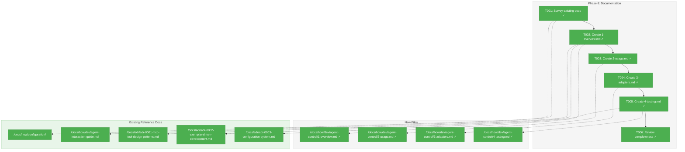
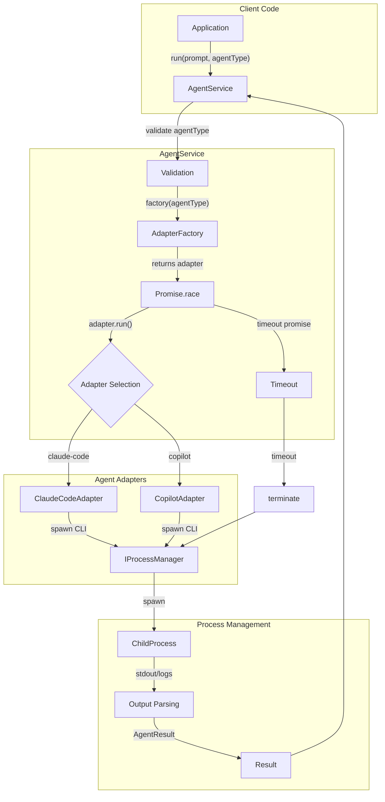
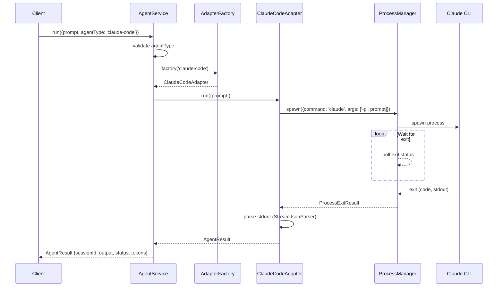

# Phase 6: Documentation – Tasks & Alignment Brief

**Spec**: [../agent-control-spec.md](../../agent-control-spec.md)
**Plan**: [../agent-control-plan.md](../../agent-control-plan.md)
**Date**: 2026-01-23
**Testing Approach**: Lightweight (documentation phase)

---

## Executive Briefing

### Purpose

This phase creates developer documentation for the Agent Control Service, enabling future developers to understand, use, extend, and test the agent orchestration system without reading implementation code.

### What We're Building

A comprehensive documentation suite in `docs/how/dev/agent-control/` containing:
- Architecture overview with diagrams
- Step-by-step usage guide for common tasks
- Adapter implementation guide for adding new agents
- Testing patterns guide with FakeAgentAdapter examples

### User Value

Developers can quickly onboard to the Agent Control Service, run prompts through agents, extend the system with new adapters, and write tests following established patterns—all without reading source code.

### Example

**Before**: Developer wants to run a prompt through Claude Code, must read 500+ lines of adapter/service code.
**After**: Developer reads `2-usage.md`, copies 10-line example, has working code in minutes.

---

## Objectives & Scope

### Objective

Create developer documentation that enables:
- Understanding the architecture (AC-16 compliance, adapter pattern)
- Using the AgentService API (run, compact, terminate)
- Adding new agent adapters (following ClaudeCodeAdapter pattern)
- Testing with fakes (following FakeAgentAdapter pattern)

### Goals

- ✅ Create `docs/how/dev/agent-control/` directory structure
- ✅ Document architecture overview with Mermaid diagrams
- ✅ Document usage patterns with working code examples
- ✅ Document adapter implementation guide
- ✅ Document testing patterns with FakeAgentAdapter
- ✅ Cross-link to ADRs and existing docs

### Non-Goals

- ❌ API reference documentation (generated from JSDoc)
- ❌ End-user documentation (this is developer docs)
- ❌ CLI usage documentation (not yet implemented)
- ❌ MCP tool documentation (future phase)
- ❌ Updating existing docs outside `docs/how/dev/agent-control/`

---

## Architecture Map

### Component Diagram

<!-- Status: grey=pending, orange=in-progress, green=completed, red=blocked -->
<!-- Updated by plan-6 during implementation -->



### Task-to-Component Mapping

<!-- Status: ⬜ Pending | 🟧 In Progress | ✅ Complete | 🔴 Blocked -->

| Task | Component(s) | Files | Status | Comment |
|------|-------------|-------|--------|---------|
| T001 | Discovery | docs/how/ | ✅ Complete | Survey existing docs structure for consistency |
| T002 | Overview | 1-overview.md | ✅ Complete | Architecture, interfaces, DI pattern |
| T003 | Usage | 2-usage.md | ✅ Complete | Step-by-step guides with code examples |
| T004 | Adapters | 3-adapters.md | ✅ Complete | How to add new agent adapters |
| T005 | Testing | 4-testing.md | ✅ Complete | FakeAgentAdapter patterns |
| T006 | Review | All docs | ✅ Complete | Verify completeness and links |

---

## Tasks

| Status | ID | Task | CS | Type | Dependencies | Absolute Path(s) | Validation | Subtasks | Notes |
|--------|------|-----------------------------------|-----|------|--------------|-------------------------------|-------------------------------|----------|-------------------|
| [x] | T001 | Survey existing docs/how/ directories for structure patterns | 1 | Setup | – | /home/jak/substrate/002-agents/docs/how/ | Structure documented in brief | – | Match configuration/ style |
| [x] | T002 | Create 1-overview.md with architecture, motivation, interfaces | 2 | Doc | T001 | /home/jak/substrate/002-agents/docs/how/dev/agent-control/1-overview.md | Mermaid diagram renders, links valid | – | Reference ADR-0001, ADR-0002 |
| [x] | T003 | Create 2-usage.md with step-by-step usage examples | 2 | Doc | T002 | /home/jak/substrate/002-agents/docs/how/dev/agent-control/2-usage.md | Code examples tested, copy-paste works | – | Include DI patterns |
| [x] | T004 | Create 3-adapters.md with adapter implementation guide | 2 | Doc | T003 | /home/jak/substrate/002-agents/docs/how/dev/agent-control/3-adapters.md | References ClaudeCodeAdapter, CopilotAdapter patterns | – | Per Discovery 01 I/O pattern |
| [x] | T005 | Create 4-testing.md with FakeAgentAdapter testing patterns | 2 | Doc | T004 | /home/jak/substrate/002-agents/docs/how/dev/agent-control/4-testing.md | Links to ADR-0003 testing patterns | – | Per ADR-0002 fakes policy |
| [x] | T006 | Review documentation for completeness and broken links | 1 | QA | T005 | /home/jak/substrate/002-agents/docs/how/dev/agent-control/ | All links resolve, no broken refs | – | Peer review checklist |

---

## Alignment Brief

### Prior Phases Review

This section synthesizes the complete implementation across Phases 1-5, providing context for documentation.

#### Phase-by-Phase Summary

**Phase 1: Interfaces & Fakes** (2026-01-22)
- Established foundational contracts: `IAgentAdapter`, `IProcessManager`
- Created `FakeAgentAdapter` and `FakeProcessManager` following FakeLogger exemplar
- Introduced contract test factory pattern for fake-real parity
- Key pattern: Async interfaces for long-running operations
- 53 new tests, 14 tasks completed

**Phase 2: Claude Code Adapter** (2026-01-22)
- Implemented `StreamJsonParser` for NDJSON parsing
- Created `ClaudeCodeAdapter` with buffered output pattern
- Session ID extraction from stream-json output
- Token extraction with cache token handling
- 53 new tests, 9 tasks completed

**Phase 3: Process Management** (2026-01-22)
- Implemented `UnixProcessManager` with signal escalation (SIGINT → SIGTERM → SIGKILL)
- Created `WindowsProcessManager` with taskkill fallback
- Platform detection in DI container
- Zombie prevention integration tests
- 34 new tests, 9 tasks completed

**Phase 4: Copilot Adapter** (2026-01-22)
- Implemented `CopilotAdapter` with log file polling
- Created `CopilotLogParser` for session ID extraction
- Exponential backoff for log polling (50ms base, 5s max)
- Graceful token degradation (always null)
- Security hardening (path traversal, log size limits)
- 38 new tests, 9 tasks completed

**Phase 5: Commands & Integration** (2026-01-22 - 2026-01-23)
- Implemented `AgentService` orchestration layer
- Factory function pattern for adapter selection
- Promise.race() timeout with cancellable timer
- Fixed 4 HIGH severity issues from code review (COR-001, COR-002, PERF-001, SEC-001)
- 463 tests passing after fixes

#### Cumulative Deliverables (by Phase)

**Interfaces (Phase 1)**:
- `/home/jak/substrate/002-agents/packages/shared/src/interfaces/agent-adapter.interface.ts`
- `/home/jak/substrate/002-agents/packages/shared/src/interfaces/agent-types.ts`
- `/home/jak/substrate/002-agents/packages/shared/src/interfaces/process-manager.interface.ts`

**Fakes (Phase 1)**:
- `/home/jak/substrate/002-agents/packages/shared/src/fakes/fake-agent-adapter.ts`
- `/home/jak/substrate/002-agents/packages/shared/src/fakes/fake-process-manager.ts`

**Adapters (Phases 2-4)**:
- `/home/jak/substrate/002-agents/packages/shared/src/adapters/stream-json-parser.ts`
- `/home/jak/substrate/002-agents/packages/shared/src/adapters/claude-code.adapter.ts`
- `/home/jak/substrate/002-agents/packages/shared/src/adapters/unix-process-manager.ts`
- `/home/jak/substrate/002-agents/packages/shared/src/adapters/windows-process-manager.ts`
- `/home/jak/substrate/002-agents/packages/shared/src/adapters/copilot-log-parser.ts`
- `/home/jak/substrate/002-agents/packages/shared/src/adapters/copilot.adapter.ts`

**Services (Phase 5)**:
- `/home/jak/substrate/002-agents/packages/shared/src/services/agent.service.ts`

**Configuration (Phase 1)**:
- `/home/jak/substrate/002-agents/packages/shared/src/config/schemas/agent.schema.ts`

#### Pattern Evolution

| Pattern | Introduced | Evolution |
|---------|------------|-----------|
| Async Interface | Phase 1 | Gold standard for long-running operations |
| Contract Test Factory | Phase 1 | Extended to all adapters in Phases 2-4 |
| Buffered Output | Phase 2 | Used by both ClaudeCodeAdapter and CopilotAdapter |
| Platform Strategy | Phase 3 | Unix/Windows process managers via DI |
| Injectable Function | Phase 4 | readLogFile injection for testability |
| Factory Function | Phase 5 | AdapterFactory for adapter selection |
| Cancellable Timeout | Phase 5 | Promise.race() with cancel() function |

#### Recurring Issues / Cross-Phase Learnings

1. **ESM Mocking Limitation** (Phase 3): vi.spyOn() doesn't work with ESM exports; use dependency injection or real processes
2. **Timer Cleanup** (Phase 5): Always return cancel() function from timeout promises (FIX-001)
3. **Session Tracking** (Phase 5): Don't track completed sessions; cleanup prevents memory leaks (FIX-003)
4. **Input Validation** (Phases 4-5): Validate in service, not factory; fail-fast before adapter creation

#### Reusable Test Infrastructure

| Component | File | Usage |
|-----------|------|-------|
| `FakeAgentAdapter` | `fake-agent-adapter.ts` | Unit tests for services/orchestration |
| `FakeProcessManager` | `fake-process-manager.ts` | Unit tests for adapters |
| `agentAdapterContractTests()` | `agent-adapter.contract.ts` | Verify fake-real parity |
| `processManagerContractTests()` | `process-manager.contract.ts` | Verify fake-real parity |
| `serviceTest` fixture | Service tests | Pre-baked FakeLogger + FakeConfigService |

#### Critical Findings Timeline

| Finding | Phase Applied | Impact on Documentation |
|---------|---------------|------------------------|
| Discovery 01: Dual I/O Pattern | Phase 2, 4 | Document adapter differences (stdout vs log files) |
| Discovery 03: Token Extraction | Phase 2 | Document token parsing from stream-json |
| Discovery 04: Copilot Tokens | Phase 4 | Document graceful null handling |
| Discovery 06: Result State Machine | Phase 2, 3 | Document status values (completed, failed, killed) |
| Discovery 08: Contract Tests | All phases | Document contract test pattern |
| Discovery 09: Config Integration | Phase 1, 5 | Document AgentConfigType usage |

### Critical Findings Affecting This Phase

Phase 6 (Documentation) documents the implementation. All Critical Findings from the plan inform what must be documented:

| Finding | Documentation Impact |
|---------|---------------------|
| **Discovery 01**: Dual I/O Pattern | Document ClaudeCodeAdapter (stdout) vs CopilotAdapter (log files) in adapters guide |
| **Discovery 03**: Token Extraction | Document token parsing patterns in usage guide |
| **Discovery 04**: Copilot Tokens | Document null token handling in testing guide |
| **Discovery 06**: Result State Machine | Document AgentStatus values in overview |
| **Discovery 08**: Contract Tests | Document contract test factory pattern in testing guide |
| **Discovery 09**: Config Integration | Document AgentConfigType in usage guide |
| **Discovery 11**: Compact Context | Document multi-turn requirements in usage guide |

### ADR Decision Constraints

| ADR | Constraint | Impact on Documentation |
|-----|------------|------------------------|
| **ADR-0001**: MCP Tool Design | `verb_object` naming, semantic responses | Document if MCP tools added; not applicable to current service API |
| **ADR-0002**: Exemplar-Driven Dev | Fakes-only testing, contract tests | Document testing patterns following FakeAgentAdapter exemplar |
| **ADR-0003**: Configuration System | Zod schemas, FakeConfigService | Document AgentConfigType usage and testing patterns |

### Invariants & Guardrails

Documentation must ensure developers understand:
- **Timeout Budget**: Default 10 minutes (600000ms), configurable via AgentConfigType
- **Allowed Agent Types**: 'claude-code' and 'copilot' only (SEC-001 whitelist)
- **Session Statelessness**: Service tracks only active processes, not session history
- **Signal Escalation**: SIGINT → SIGTERM → SIGKILL with 2-second intervals

### Inputs to Read

| File | Purpose |
|------|---------|
| `/home/jak/substrate/002-agents/packages/shared/src/interfaces/agent-adapter.interface.ts` | IAgentAdapter contract |
| `/home/jak/substrate/002-agents/packages/shared/src/interfaces/agent-types.ts` | AgentResult, AgentRunOptions |
| `/home/jak/substrate/002-agents/packages/shared/src/services/agent.service.ts` | AgentService implementation |
| `/home/jak/substrate/002-agents/packages/shared/src/adapters/claude-code.adapter.ts` | ClaudeCodeAdapter exemplar |
| `/home/jak/substrate/002-agents/packages/shared/src/adapters/copilot.adapter.ts` | CopilotAdapter patterns |
| `/home/jak/substrate/002-agents/packages/shared/src/fakes/fake-agent-adapter.ts` | FakeAgentAdapter API |
| `/home/jak/substrate/002-agents/docs/how/configuration/` | Documentation style exemplar |
| `/home/jak/substrate/002-agents/docs/how/dev/agent-interaction-guide.md` | CLI usage reference |

### Visual Alignment Aids

#### System Flow Diagram



#### Sequence Diagram: Run Operation



### Test Plan (Lightweight Approach)

Documentation phase uses lightweight validation:

| Validation | Method | Expected Result |
|------------|--------|-----------------|
| Mermaid diagrams render | Visual inspection in GitHub | Diagrams display correctly |
| Code examples compile | Copy-paste to test file | No TypeScript errors |
| Internal links resolve | Manual click-through | All links work |
| External ADR links valid | Manual click-through | ADR files exist |
| Style consistency | Compare with configuration/ docs | Same heading structure, tone |

### Step-by-Step Implementation Outline

1. **T001 - Survey Existing Docs**
   - Read `/home/jak/substrate/002-agents/docs/how/configuration/` structure
   - Note heading levels, code block format, link patterns
   - Read `/home/jak/substrate/002-agents/docs/how/dev/agent-interaction-guide.md` for dev docs style

2. **T002 - Create 1-overview.md**
   - Architecture overview with Mermaid diagram
   - Key interfaces: IAgentAdapter, IProcessManager, AgentResult
   - DI integration pattern
   - Cross-links to ADR-0001 (MCP patterns), ADR-0002 (exemplar-driven)

3. **T003 - Create 2-usage.md**
   - Running a prompt through AgentService
   - Session resumption pattern
   - Timeout configuration via AgentConfigType
   - DI container setup
   - Working code examples

4. **T004 - Create 3-adapters.md**
   - How IAgentAdapter contract works
   - ClaudeCodeAdapter implementation walkthrough
   - CopilotAdapter implementation walkthrough (different I/O pattern)
   - Adding a new adapter checklist

5. **T005 - Create 4-testing.md**
   - FakeAgentAdapter usage
   - FakeProcessManager usage
   - Contract test factory pattern
   - Test fixtures and assertion helpers

6. **T006 - Review Documentation**
   - Check all internal links
   - Check all ADR references
   - Verify code examples compile
   - Verify Mermaid diagrams render

### Commands to Run

```bash
# Verify documentation structure
ls -la /home/jak/substrate/002-agents/docs/how/dev/agent-control/

# Test Mermaid diagrams (view in GitHub or VS Code preview)
# Open each .md file in VS Code with Markdown Preview Enhanced

# Verify TypeScript code examples
# Copy code blocks to a test file and run:
pnpm typecheck

# Run full test suite to ensure no regressions
pnpm test
```

### Risks / Unknowns

| Risk | Severity | Mitigation |
|------|----------|------------|
| Code examples become stale | LOW | Reference actual test files where possible |
| Mermaid diagrams not rendering | LOW | Test in GitHub preview; use simple syntax |
| Missing edge cases | LOW | Link to test files for comprehensive examples |

### Ready Check

- [ ] Prior phases review complete (Phases 1-5)
- [ ] Critical findings documented
- [ ] ADR constraints mapped to tasks
- [ ] Flow diagram reviewed
- [ ] Sequence diagram reviewed
- [ ] Test plan complete (lightweight)
- [ ] Commands copy-paste ready
- [ ] Risks identified with mitigations

---

## Phase Footnote Stubs

**NOTE**: Footnote entries will be added during implementation by plan-6a-update-progress.

| Diff File | Footnote | Plan Ledger Entry |
|-----------|----------|-------------------|
| docs/how/dev/agent-control/1-overview.md | - | To be added |
| docs/how/dev/agent-control/2-usage.md | - | To be added |
| docs/how/dev/agent-control/3-adapters.md | - | To be added |
| docs/how/dev/agent-control/4-testing.md | - | To be added |

---

## Evidence Artifacts

Implementation will produce:
- `execution.log.md` - Written to this directory during plan-6 execution
- Documentation files in `/home/jak/substrate/002-agents/docs/how/dev/agent-control/`

---

## Discoveries & Learnings

_Populated during implementation by plan-6. Log anything of interest to your future self._

| Date | Task | Type | Discovery | Resolution | References |
|------|------|------|-----------|------------|------------|
| | | | | | |

**Types**: `gotcha` | `research-needed` | `unexpected-behavior` | `workaround` | `decision` | `debt` | `insight`

**What to log**:
- Things that didn't work as expected
- External research that was required
- Implementation troubles and how they were resolved
- Gotchas and edge cases discovered
- Decisions made during implementation
- Technical debt introduced (and why)
- Insights that future phases should know about

_See also: `execution.log.md` for detailed narrative._

---

## Directory Layout

```
docs/plans/002-agent-control/
  ├── agent-control-plan.md
  ├── agent-control-spec.md
  ├── reviews/
  │   ├── review.phase-5-commands-integration.md
  │   └── fix-tasks.phase-5-commands-integration.md
  └── tasks/
      ├── phase-1-interfaces-fakes/
      │   ├── tasks.md
      │   └── execution.log.md
      ├── phase-2-claude-code-adapter/
      │   ├── tasks.md
      │   └── execution.log.md
      ├── phase-3-process-management/
      │   ├── tasks.md
      │   └── execution.log.md
      ├── phase-4-copilot-adapter/
      │   ├── tasks.md
      │   └── execution.log.md
      ├── phase-5-commands-integration/
      │   ├── tasks.md
      │   └── execution.log.md
      └── phase-6-documentation/
          ├── tasks.md                  # This file
          └── execution.log.md          # Created by plan-6
```

---

*Tasks dossier generated: 2026-01-23*
*Next: Run `/plan-6-implement-phase --phase "Phase 6: Documentation"` after approval*
