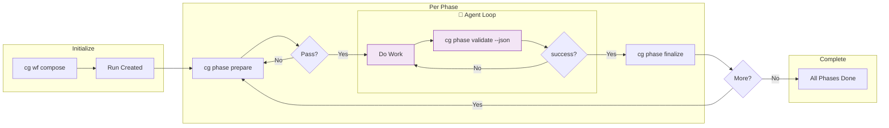

# Research Report: WF Basics - Workflow Fundamentals

**Generated**: 2026-01-21T09:30:00Z
**Research Query**: "WF Basics - Filesystem-based workflow system with phases, inputs/outputs, CLI and MCP integration"
**Mode**: Pre-Plan Research
**Location**: docs/plans/003-wf-basics/research-dossier.md
**FlowSpace**: Available
**Findings**: 45 total

---

## Executive Summary

### What It Does
WF Basics establishes the foundational workflow system for Chainglass - a filesystem-based orchestration layer where workflows are YAML definitions, phases (stages) have explicit inputs/outputs, and both CLI and MCP server provide tooling for composing, validating, and managing workflow execution.

### Business Purpose
Enable deterministic, multi-phase workflow execution by coding agents with:
1. Schema-validated outputs ensuring data integrity
2. Explicit input/output contracts between phases
3. Clear separation between orchestration (system) and execution (agents)
4. Full auditability via filesystem-based state

### Key Insights
1. **Filesystem is the database** - All workflow state lives in files; no database required; git provides versioning
2. **Phases are self-contained** - Each phase has run/inputs/, commands/, run/outputs/, run/wf-data/ directories with explicit contracts
3. **Data publishing is explicit** - Phases must declare output_parameters; validation fails until all declared outputs exist and pass schema validation
4. **JSON-first output** - All CLI commands support `--json`; JSON is PRIMARY interface for systems, human output is secondary

### Quick Stats
- **Reference Implementation**: `/Users/jordanknight/github/tools/enhance/src/chainglass/` (Python/typer, ~95K bytes)
- **Current Chainglass**: TypeScript monorepo with CLI + MCP + Web (Node.js/Commander.js)
- **Integration Points**: CLI commands, MCP tools, both serving same workflow operations
- **Output Format**: JSON (primary, `--json` flag) + Human-readable (secondary, default)
- **Prior Work**: 001-project-setup (monorepo foundation), 002-agent-control (agent session management research)
- **Template Location**: `.chainglass/templates/<slug>/` (project-local workflow templates)
- **Run Location**: `.chainglass/runs/` (workflow run instances)
- **Sample Workflow**: 3-phase "hello-workflow" for validation (simple accept → work → close cycle)

---

## Concept Mapping: User Description → Technical Design

### Concept 1: Filesystem-Based System
**User Said**: "This is entirely file system based system"

**What This Means**:
- No database required
- All state is files on disk
- Git provides version control and history
- Portable - copy a folder, you have the workflow
- Debuggable - inspect any file with standard tools

**Design Implications**:
- Service layer operates on `Path` objects
- State changes = file writes
- Validation = file existence + schema checks
- Locking may be needed for concurrent access (future)

### Concept 2: Many Workflows
**User Said**: "We will have many workflows"

**What This Means**:
- Workflows are templates that can be composed into runs
- Workflow templates stored in `.chainglass/templates/<slug>/`
- A "run" is an instantiated workflow with working directories

**Template Location** (DECIDED):
```
.chainglass/
└── templates/
    ├── hello-workflow/      # Simple 3-phase validation workflow
    ├── plan-workflow/       # Future: planning workflow
    └── research-workflow/   # Future: codebase research
```

**Design Implications**:
- Project-local templates (versioned with project)
- Workflows identified by slug (folder name)
- `cg wf compose <slug>` finds template in `.chainglass/templates/<slug>/`
- Compose operation creates run instance from template

### Concept 3: Workflow Definition (wf.yaml)
**User Said**: "Workflows are files on the file system (e.g. wf.yaml)", "Phases defined in that yaml"

**Reference Pattern** (from prototype):
```yaml
version: "1.0"
metadata:
  name: "explore-specify"
  description: "Two-stage workflow"
stages:  # Note: user says "phases", prototype says "stages"
  - id: "explore"
    inputs:
      required: [...]
      optional: [...]
    outputs:
      files: [...]
      data: [...]
    output_parameters: [...]
    prompt:
      entry: "commands/wf.md"
      main: "commands/main.md"
```

**Design Implications**:
- YAML for human readability
- JSON Schema for validation
- Single source of truth for entire workflow
- Phases defined inline with full config

### Concept 4: Phases with Inputs/Outputs
**User Said**: "Stage has inputs and outputs"

**Decided Structure** (Three-tier):
```
phase-folder/
├── inputs/           # Required/optional input files
├── commands/         # Agent instructions
│   ├── wf.md         # Standard workflow prompt (same for all phases)
│   └── main.md       # Phase-specific instructions
├── run/
│   ├── output-files/ # Agent work: human-readable (markdown, text)
│   ├── output-data/  # Agent work: structured data (JSON)
│   └── wf/           # System internals (wf-result, output-params, accept, handback)
└── schemas/          # JSON Schemas for validation
```

**Ownership**:
- `output-files/` = Agent's human-readable work
- `output-data/` = Agent's structured data work (validated against schemas)
- `wf/` = System-owned (status, params, control state)

**Design Implications**:
- Clear boundary: agent owns `output-*`, system owns `wf/`
- Schemas validate `output-data/` contents
- Agent writes `wf-result.json` to `wf/` (schema-enforced handoff point)
- **Workflow ≠ sandbox**: Agent may work anywhere (e.g., modify source code); workflow folders track artifacts, not constrain the agent

### Concept 5: CLI + MCP Server Operations
**User Said**: "All operations can be done via cli and MCP server"

**Operations Identified**:
| Operation | CLI Command | MCP Tool | Purpose |
|-----------|-------------|----------|---------|
| Create workflow run | `cg wf compose` | `wf_compose` | Hydrate wf-spec to target location |
| Prepare phase | `cg phase prepare` | `phase_prepare` | Check inputs ready, copy from prior phases |
| Validate phase | `cg phase validate` | `phase_validate` | Check outputs exist, pass schemas |
| Finalize phase | `cg phase finalize` | `phase_finalize` | Extract output params, mark complete |

**Design Implications**:
- Shared service layer for business logic
- CLI = thin wrapper calling services
- MCP server = thin wrapper calling same services
- Services are the source of truth

### Concept 5a: JSON Output Framework (Primary Interface)

**User Said**: "Every operation here must support --json... JSON is the main way our systems interact. The regular output is secondary requirement for humans."

**What This Means**:
- JSON output is PRIMARY interface (agents, MCP, tooling)
- Human-readable output is SECONDARY
- All commands support `--json` flag
- `--json` suppresses all other output (no progress, no colors)
- Consistent response envelope across all commands

**Response Envelope**:
```typescript
interface CommandResponse<T> {
  success: boolean;        // true if operation succeeded
  command: string;         // e.g., "phase.prepare", "wf.compose"
  timestamp: string;       // ISO 8601
  data?: T;                // Payload on success
  error?: ErrorDetail;     // Error on failure
}

interface ErrorDetail {
  code: string;            // E001, E010, etc.
  message: string;         // Human-readable
  action?: string;         // Suggested fix
  details?: ErrorItem[];   // Multiple errors
}
```

**Design Implications**:
- **Services return domain objects** - `PrepareResult`, `ValidateResult`, etc. with `errors[]` array
- **Adapters format output** - `IOutputAdapter.format(command, result)` transforms to string
- **DI selects adapter** - `--json` flag → `JsonOutputAdapter`, else → `ConsoleOutputAdapter`
- **Composable** - Easy to add `TableOutputAdapter`, `QuietOutputAdapter`, etc.
- **MCP reuses services** - Same `IPhaseService`, different output handling

**File Locations**:
- Result interfaces: `@chainglass/shared/interfaces/results/`
- `IOutputAdapter`: `@chainglass/shared/interfaces/output-adapter.interface.ts`
- Adapters: `@chainglass/shared/adapters/`
- Fakes: `@chainglass/shared/fakes/fake-output.adapter.ts`

### Concept 6: Compose/Hydrate Operation
**User Said**: "You 'compose' a workflow which then 'hydrates' it to a target location, files copied across from template"

**Reference Pattern** (A.10 Compose Algorithm):
```python
def compose(wf_spec_path: Path, output_path: Path) -> Path:
    # 1. Load and validate wf.yaml against schema
    # 2. Create run folder: output_path/run-{date}-{ordinal}/
    # 3. Write wf-run.json with initial metadata
    # 4. For each phase in wf.yaml.stages:
    #    a. Create phase folder with subdirs
    #    b. Extract phase config from wf.yaml → phase-config.yaml
    #    c. Copy prompt files, schemas, templates
    # 5. Return path to created run folder
```

**Design Implications**:
- Idempotent (running twice = same result)
- Templates are source, run folders are instances
- Run folder is fully self-contained

### Concept 7: Phase Output Destinations (DECIDED)
**User Said**:
- "Save 'the work they do' to run/output-files/*"
- "Save wf data 'workflow details and information like errors, status etc' to run/wf/*"

**Final Structure** (Three-tier):
```
phase/run/
├── output-files/     # Agent work: human-readable (acknowledgment.md, report.md)
├── output-data/      # Agent work: structured JSON (gather-data.json, findings.json)
└── wf/               # System: wf-result.json, output-params.json, accept.json, handback.json
```

**What Goes Where**:
| File Type | Location | Example |
|-----------|----------|---------|
| Human-readable agent output | `output-files/` | `acknowledgment.md`, `final-report.md` |
| Structured agent data | `output-data/` | `gather-data.json`, `process-data.json` |
| Execution status | `wf/` | `wf-result.json` (agent writes, system validates) |
| Published parameters | `wf/` | `output-params.json` (system extracts from output-data) |
| Control state | `wf/` | `accept.json`, `handback.json` (system only) |

### Concept 8: Schema Validation
**User Said**: "Can save json (output data and wf data), and it must be validated by schemas that are provided in the phase template"

**Three-tier Output Pattern in wf.yaml**:
```yaml
# In wf.yaml phase definition
outputs:
  files:                              # Agent work: human-readable (no schema)
    - name: "acknowledgment.md"
      path: "run/output-files/acknowledgment.md"
  data:                               # Agent work: JSON (schema validated)
    - name: "gather-data.json"
      path: "run/output-data/gather-data.json"
      schema: "schemas/gather-data.schema.json"
      required: true
  wf:                                 # System: JSON (schema validated)
    - name: "wf-result.json"
      path: "run/wf/wf-result.json"
      schema: "schemas/wf-result.schema.json"
      required: true
```

**Validation Algorithm**:
1. Load phase config
2. For each output in `files`: check exists, not empty (no schema)
3. For each output in `data`: check exists, not empty, validate against schema
4. For each output in `wf`: check exists, not empty, validate against schema
5. Extract output_parameters from `output-data/` sources on success

**Design Implications**:
- Schemas live in phase templates
- `output-files/` = no schema (human-readable)
- `output-data/` = schema-validated (agent's structured output)
- `wf/` = schema-validated (system files)
- Validation is blocking - phase incomplete until all pass
- Error messages must be actionable for agents

### Concept 9: Input from Prior Phases
**User Said**: "Can request input files from prior phases (e.g. phase: explore, file: dossier.md)"

**Reference Pattern**:
```yaml
inputs:
  required:
    - name: "research-dossier.md"
      path: "inputs/research-dossier.md"
      from_phase: "explore"          # Source phase
      source: "run/output-files/research-dossier.md"  # Path in source
```

**Prepare Algorithm**:
1. For each input with `from_phase`:
   - source_path = `run_dir/phases/{from_phase}/{source}`
   - target_path = `run_dir/phases/{current_phase}/{path}`
   - Check source exists (FAIL with actionable message)
   - Copy source → target

**Design Implications**:
- Phase dependencies are explicit in wf.yaml
- Prepare command handles file copying
- Agents don't need to know where inputs came from

### Concept 10: Data from Prior Phases
**User Said**: "Can request data from prior phases (phase: explore, name: 'some-value')"

**Reference Pattern** (output_parameters):
```yaml
# Source phase declares what it publishes
output_parameters:
  - name: "total_findings"
    source: "run/wf/metrics.json"
    query: "summary.total"

# Consumer phase references by name
parameters:
  - name: "total_findings"
    from_phase: "explore"
    output_parameter: "total_findings"  # By name!
```

**Resolution Methods**:
1. **output_parameter (preferred)**: Look up by name in source phase's `output-params.json`
2. **source + query (fallback)**: Direct JSON path query with dot notation

**Design Implications**:
- Decoupled - consumer doesn't know internal JSON structure
- Phase publishes data explicitly via output_parameters
- System extracts and writes to `output-params.json` during finalize

### Concept 11: Explicit Data Publishing
**User Said**: "Data must be published explicitly. Phase yaml will demand it, and phase will not validate until its present etc."

**Reference Pattern**:
- Phase declares `output_parameters` in wf.yaml
- `validate` command checks all declared outputs exist
- `finalize` command extracts output_parameters → `output-params.json`
- Only after finalize can downstream phases access the data

**Design Implications**:
- No implicit data sharing
- Validation enforces completeness
- Clear contract between phases

---

## Architecture Integration with Current Chainglass

### Current State
Based on 001-project-setup spec:
```
chainglass/
├── apps/
│   ├── web/              # Next.js app
│   └── cli/              # Commander.js CLI
├── packages/
│   ├── shared/           # ILogger, fakes, interfaces
│   └── mcp-server/       # MCP server (check_health tool exists)
└── test/                 # Centralized test suite
```

### Proposed WF Basics Integration

```
packages/
├── shared/
│   └── interfaces/
│       ├── workflow.interface.ts     # IWorkflowService
│       ├── phase.interface.ts        # IPhaseService
│       └── validation.interface.ts   # IValidationService
└── workflow/                         # NEW: @chainglass/workflow
    ├── src/
    │   ├── interfaces/               # Re-exported from shared
    │   ├── services/
    │   │   ├── workflow.service.ts   # compose, list workflows
    │   │   ├── phase.service.ts      # prepare, validate, finalize
    │   │   └── validation.service.ts # schema validation
    │   ├── fakes/                    # For testing
    │   └── adapters/                 # File system adapters
    └── schemas/
        └── wf.schema.json            # Workflow definition schema
```

### CLI Command Structure

```typescript
// apps/cli/src/commands/wf.command.ts - Workflow-level commands
cg wf                                # Workflow commands group
cg wf compose <slug> -o <output>     # Create run from template
cg wf list                           # List available workflows
cg wf status <run>                   # Show run status

// apps/cli/src/commands/phase.command.ts - Phase-level commands
cg phase                             # Phase commands group
cg phase prepare <phase> -r <run>    # Check inputs ready, copy from prior phases
cg phase validate <phase> -r <run>   # Validate phase outputs
cg phase finalize <phase> -r <run>   # Extract params, mark complete
```

### MCP Tool Structure

```typescript
// packages/mcp-server/src/tools/workflow/
wf_compose           // Same as CLI: cg wf compose
wf_list              // Same as CLI: cg wf list
wf_status            // Same as CLI: cg wf status

// packages/mcp-server/src/tools/phase/
phase_prepare        // Same as CLI: cg phase prepare
phase_validate       // Same as CLI: cg phase validate
phase_finalize       // Same as CLI: cg phase finalize
```

---

## Prior Learnings (From Current Chainglass Plans)

### PL-01: Clean Architecture Pattern (001-project-setup)
**Source**: docs/rules/architecture.md
**Type**: decision

**What They Established**:
- Services depend on interfaces, not implementations
- Fakes over mocks for testing
- DI container with `useFactory` pattern

**Relevance**:
- Workflow services MUST follow this pattern
- `IWorkflowService` interface in shared, implementation in workflow package
- `FakeWorkflowService` for testing

**Action**:
- Define interfaces in `@chainglass/shared/interfaces/`
- Implement services following existing SampleService pattern
- Create fakes with assertion helpers

### PL-02: MCP Tool Design (001-project-setup ADR-0001)
**Source**: docs/adr/adr-0001-mcp-tool-design-patterns.md
**Type**: decision

**What They Established**:
- `verb_object` naming (snake_case)
- 3-4 sentence descriptions
- STDIO discipline (stdout = JSON-RPC only)
- Annotations: readOnlyHint, destructiveHint, idempotentHint

**Relevance**:
- All workflow MCP tools must follow this pattern
- `workflow_compose`, `workflow_validate` naming

**Action**:
- Follow check_health exemplar in packages/mcp-server/src/server.ts

### PL-03: DI Container Pattern (001-project-setup)
**Source**: apps/web/src/lib/di-container.ts
**Type**: decision

**What They Established**:
- Child containers for test isolation
- `useFactory` instead of `useClass` (RSC compatibility)
- Token constants for type-safe resolution

**Relevance**:
- Workflow services need DI registration
- Test containers need fake registrations

**Action**:
- Add DI_TOKENS for workflow services
- Register in production and test containers

### PL-04: Test Structure (001-project-setup)
**Source**: test/ directory structure
**Type**: decision

**What They Established**:
- Centralized test suite
- test/unit/, test/integration/, test/contracts/
- Contract tests ensure fake/real parity

**Relevance**:
- Workflow tests go in test/unit/workflow/
- Contract tests for IWorkflowService implementations

**Action**:
- Create contract test suite for workflow services

---

## Critical Discoveries

### CD-01: Output Directory Naming (DECIDED)
**Impact**: High
**Finding**: Need clear separation between agent work and workflow system internals

**Decision**: Three-tier structure (Option B)
```
phase/run/
├── output-files/     # Agent work: human-readable (markdown, text)
├── output-data/      # Agent work: structured data (JSON)
└── wf/               # System internals (agent doesn't write here directly)
```

**Ownership Rules**:
| Location | Owner | Contents |
|----------|-------|----------|
| `output-files/` | Agent | `acknowledgment.md`, `result.md`, `final-report.md` |
| `output-data/` | Agent | `gather-data.json`, `process-data.json`, `findings.json` |
| `wf/` | System | `wf-result.json`, `output-params.json`, `accept.json`, `handback.json` |

**Note**: Agent writes `wf-result.json` to `wf/` but it's schema-enforced by system. All other `wf/` files are system-managed.

**Important Clarification**: The workflow folders track *workflow artifacts* (inputs, outputs, status), but agents may do work *outside* these folders entirely. For example, a coding agent's task might be to modify source code in the main project - the workflow just tracks "what was the task" (inputs) and "what was the outcome" (outputs/report), not the actual code changes. The workflow system orchestrates and validates phase completion, it doesn't sandbox the agent's actual work.

### CD-02: Phase vs Stage Terminology
**Impact**: Medium
**Finding**: User says "phases", prototype says "stages"

**Decision Needed**: Consistent terminology
- "phase" more natural for workflow steps
- "stage" used in reference implementation

**Recommendation**: Use "phase" in user-facing surfaces, internally consistent

### CD-03: TypeScript Port Scope
**Impact**: High
**Finding**: Reference implementation is Python/typer. Must port to TypeScript.

**Key Porting Considerations**:
- YAML parsing: Use `yaml` or `js-yaml` package
- JSON Schema validation: Use `ajv` (fastest) or `@cfworker/json-schema`
- Path operations: Use Node.js `path` and `fs/promises`
- CLI: Use Commander.js (already in project)

**Recommendation**: Phase 1 = core services + CLI, Phase 2 = MCP tools

### CD-04: Workflow Template Location (DECIDED)
**Impact**: Medium
**Finding**: Need to decide where workflow templates live

**Decision**: `.chainglass/templates/<slug>/`
- Templates stored in project-local `.chainglass/templates/` directory
- Each workflow is a folder identified by slug (e.g., `hello-workflow/`)
- Contains `wf.yaml` + phase assets (prompts, schemas)

**Structure**:
```
.chainglass/
└── templates/
    ├── hello-workflow/           # Sample 3-phase workflow
    │   ├── wf.yaml
    │   ├── schemas/
    │   └── phases/
    │       ├── gather/
    │       ├── process/
    │       └── report/
    └── plan-workflow/            # Future: planning workflow
        └── ...
```

**Rationale**:
- Project-local keeps templates versioned with the project
- `.chainglass/` follows dotfile convention (like `.github/`, `.vscode/`)
- Slug-based folders allow multiple workflows per project

### CD-05: Development Exemplar Location (DECIDED)
**Impact**: High (for development)
**Finding**: Need pre-made examples to build against during development

**Decision**: `dev/examples/wf/`
- Contains complete exemplars for development reference
- Includes template AND fully-executed run folders with outputs
- Developers can see "what good looks like" before writing code

**Structure** (Three-tier: output-files / output-data / wf):
```
dev/
└── examples/
    └── wf/
        ├── template/                    # The hello-workflow template
        │   └── hello-workflow/
        │       ├── wf.yaml
        │       ├── schemas/
        │       ├── templates/
        │       └── phases/
        │
        └── runs/                        # Pre-made executed examples
            └── run-example-001/         # A completed workflow run
                ├── wf-run.json          # Run metadata
                └── phases/
                    ├── gather/          # Phase 1 - COMPLETE
                    │   ├── wf-phase.yaml
                    │   ├── commands/
                    │   ├── schemas/
                    │   └── run/
                    │       ├── inputs/
                    │       │   ├── files/           # User-provided input files
                    │       │   └── data/            # Structured input data
                    │       ├── outputs/             # Agent outputs
                    │       │   ├── acknowledgment.md
                    │       │   └── gather-data.json
                    │       └── wf-data/             # System: status, params
                    │           ├── wf-phase.json
                    │           └── output-params.json
                    │
                    ├── process/         # Phase 2 - COMPLETE
                    │   ├── inputs/
                    │   │   ├── acknowledgment.md    # From gather/output-files
                    │   │   ├── gather-data.json     # From gather/output-data
                    │   │   └── params.json          # Resolved parameters
                    │   ├── commands/
                    │   ├── schemas/
                    │   ├── phase-config.yaml
                    │   └── run/
                    │       ├── output-files/
                    │       │   └── result.md
                    │       ├── output-data/
                    │       │   └── process-data.json
                    │       └── wf/
                    │           ├── wf-result.json
                    │           └── output-params.json
                    │
                    └── report/          # Phase 3 - COMPLETE
                        ├── inputs/
                        │   ├── result.md            # From process/output-files
                        │   ├── process-data.json    # From process/output-data
                        │   └── params.json
                        ├── commands/
                        ├── schemas/
                        ├── phase-config.yaml
                        └── run/
                            ├── output-files/
                            │   └── final-report.md
                            └── wf/
                                └── wf-result.json   # No output-data (report has no JSON output)
```

**Why This Matters**:
- **Build against real data**: Tests can use these fixtures
- **Visual reference**: Developers see exact folder structure expected
- **Validation target**: Compare compose output against exemplar
- **Documentation by example**: Better than describing structure in prose

**Phase 0 Responsibility**: Create this exemplar with realistic sample data in all files

---

## Sample Workflow Design: "hello-workflow"

### Purpose
A minimal 3-phase workflow to validate the WF Basics implementation. No complex logic (no code research, no AI reasoning) - just the mechanics of:
1. Accept phase → do isolated work → report data/files → close phase
2. Move to next phase
3. Repeat until workflow complete

### Workflow Definition

**File**: `.chainglass/templates/hello-workflow/wf.yaml`

```yaml
version: "1.0"

metadata:
  name: "hello-workflow"
  description: "Simple 3-phase workflow for WF Basics validation"
  author: "chainglass"

phases:
  # ============================================================
  # PHASE 1: gather
  # ============================================================
  - id: "gather"
    name: "Gather Information"
    description: "Collect basic input and acknowledge receipt"

    inputs:
      required:
        - name: "user-request.md"
          path: "run/inputs/files/user-request.md"
          description: "User's request or question"
      optional: []

    outputs:
      files:
        - name: "acknowledgment.md"
          path: "run/output-files/acknowledgment.md"
          description: "Acknowledgment of received input"
      data:
        - name: "gather-data.json"
          path: "run/output-data/gather-data.json"
          schema: "schemas/gather-data.schema.json"
          required: true
      wf:
        - name: "wf-result.json"
          path: "run/wf/wf-result.json"
          schema: "schemas/wf-result.schema.json"
          required: true

    output_parameters:
      - name: "item_count"
        description: "Number of items identified in request"
        source: "run/output-data/gather-data.json"
        query: "items.length"
      - name: "request_type"
        description: "Classified type of request"
        source: "run/output-data/gather-data.json"
        query: "classification.type"

    prompt:
      entry: "commands/wf.md"
      main: "commands/main.md"

  # ============================================================
  # PHASE 2: process
  # ============================================================
  - id: "process"
    name: "Process Request"
    description: "Do the main work based on gathered information"

    inputs:
      required:
        - name: "acknowledgment.md"
          path: "inputs/acknowledgment.md"
          from_phase: "gather"
          source: "run/output-files/acknowledgment.md"
        - name: "gather-data.json"
          path: "inputs/gather-data.json"
          from_phase: "gather"
          source: "run/output-data/gather-data.json"
      optional: []

    parameters:
      - name: "item_count"
        from_phase: "gather"
        output_parameter: "item_count"
      - name: "request_type"
        from_phase: "gather"
        output_parameter: "request_type"

    outputs:
      files:
        - name: "result.md"
          path: "run/output-files/result.md"
          description: "Processing result document"
      data:
        - name: "process-data.json"
          path: "run/output-data/process-data.json"
          schema: "schemas/process-data.schema.json"
          required: true
      wf:
        - name: "wf-result.json"
          path: "run/wf/wf-result.json"
          schema: "schemas/wf-result.schema.json"
          required: true

    output_parameters:
      - name: "success"
        source: "run/output-data/process-data.json"
        query: "status.success"
      - name: "processed_count"
        source: "run/output-data/process-data.json"
        query: "metrics.processed"

    prompt:
      entry: "commands/wf.md"
      main: "commands/main.md"

  # ============================================================
  # PHASE 3: report
  # ============================================================
  - id: "report"
    name: "Generate Report"
    description: "Summarize workflow execution and produce final output"

    inputs:
      required:
        - name: "result.md"
          path: "inputs/result.md"
          from_phase: "process"
          source: "run/output-files/result.md"
        - name: "process-data.json"
          path: "inputs/process-data.json"
          from_phase: "process"
          source: "run/output-data/process-data.json"
      optional: []

    parameters:
      - name: "success"
        from_phase: "process"
        output_parameter: "success"
      - name: "processed_count"
        from_phase: "process"
        output_parameter: "processed_count"
      - name: "item_count"
        from_phase: "gather"
        output_parameter: "item_count"

    outputs:
      files:
        - name: "final-report.md"
          path: "run/output-files/final-report.md"
          description: "Complete workflow report"
      wf:
        - name: "wf-result.json"
          path: "run/wf/wf-result.json"
          schema: "schemas/wf-result.schema.json"
          required: true

    prompt:
      entry: "commands/wf.md"
      main: "commands/main.md"

shared_templates:
  - source: "templates/wf.md"
    target: "commands/wf.md"
  - source: "schemas/wf-result.schema.json"
    target: "schemas/wf-result.schema.json"
```

### Phase Flow Diagram

```
┌─────────────────────────────────────────────────────────────────────────┐
│                         hello-workflow                                   │
└─────────────────────────────────────────────────────────────────────────┘

     ┌──────────┐         ┌──────────┐         ┌──────────┐
     │  gather  │────────▶│ process  │────────▶│  report  │
     └──────────┘         └──────────┘         └──────────┘
          │                    │                    │
          ▼                    ▼                    ▼
    ┌───────────┐        ┌───────────┐        ┌───────────┐
    │user-request│       │acknowledgment│     │ result.md │
    │   (user)  │        │gather-data │        │process-data│
    └───────────┘        └───────────┘        └───────────┘
          │                    │                    │
          ▼                    ▼                    ▼
    ┌───────────┐        ┌───────────┐        ┌───────────┐
    │acknowledgment│     │ result.md │        │final-report│
    │gather-data│        │process-data│       │   (end)   │
    └───────────┘        └───────────┘        └───────────┘
```

### What Each Phase Does (Simple, Isolated Work)

| Phase | Input | Work | Output (files) | Output (data) |
|-------|-------|------|----------------|---------------|
| **gather** | User-provided inputs (e.g., user-request.md) | Read input, acknowledge it, classify type, count items | `outputs/acknowledgment.md` | `outputs/gather-data.json` |
| **process** | acknowledgment + gather-data | "Process" the items (stub: just transform data) | `output-files/result.md` | `output-data/process-data.json` |
| **report** | result + process-data | Compile final report summarizing the workflow | `output-files/final-report.md` | (none) |

**Plus**: Each phase writes `wf/wf-result.json` (status) and system extracts `wf/output-params.json` on finalize.

---

## Manual Execution Pattern

### Overview
Workflows are executed manually for now. This means:
- **Human or orchestrator** runs CLI commands to progress workflow
- **Agent** executes each phase when invoked with the phase prompt
- **No automatic phase transitions** - explicit commands move between phases

### Execution Flow (Manual)

Based on the reference: `/Users/jordanknight/github/tools/docs/plans/010-first-wf-build/manual-test/`



**Key Point**: Agent runs `validate --json` and iterates until `success: true`, then calls `finalize`.

**Command Sequence:**
```
compose → [prepare → (work → validate)* → finalize] × N phases → done
                     ↑___agent loop___↑
```

**Shell Example:**
```bash
# 1. Compose workflow from template
cg wf compose hello-workflow

# Output: Created .chainglass/runs/run-2026-01-21-001/
# Save RUN_DIR=.chainglass/runs/run-2026-01-21-001

# 2. Create initial user input
echo "Please process items A, B, and C" > $RUN_DIR/phases/gather/run/inputs/files/user-request.md

# 3. Prepare phase 1 (check inputs ready)
cg phase prepare gather --run-dir $RUN_DIR
# Output: PASS - inputs ready

# 4. Give agent the phase prompt
# Agent reads: $RUN_DIR/phases/gather/commands/wf.md + main.md
# Agent executes phase work
# Agent writes outputs to run/output-files/ and run/wf/

# 5. Validate phase 1 outputs
cg phase validate gather --run-dir $RUN_DIR
# Output: PASS or FAIL with actionable errors

# 6. Finalize phase 1 (extract params)
cg phase finalize gather --run-dir $RUN_DIR
# Output: Published parameters: item_count=3, request_type=processing

# 7. Prepare phase 2 (check inputs + copy from phase 1)
cg phase prepare process --run-dir $RUN_DIR
# Output: Copied acknowledgment.md, gather-data.json; resolved parameters

# 8. Give agent phase 2 prompt... (repeat pattern)

# ... continue through phase 3 (report)
```

### Manual Test Scripts

Following the reference pattern, create helper scripts:

**`manual-test/01-compose-and-start.sh`**:
```bash
#!/bin/bash
# Compose workflow and start phase 1

set -e
cd "$(dirname "$0")/.."

RUN_DIR=$(cg wf compose hello-workflow)
echo "Created: $RUN_DIR"

# Create sample input
cat > "$RUN_DIR/phases/gather/run/inputs/files/user-request.md" << 'EOF'
# Sample Request

Please process the following items:
1. Item Alpha
2. Item Beta
3. Item Gamma

Expected outcome: All items processed successfully.
EOF

echo "Input created: $RUN_DIR/phases/gather/run/inputs/files/user-request.md"
echo ""
echo "Next: Prepare phase and start agent"
echo "  cg phase prepare gather --run-dir $RUN_DIR"
echo "  # Then give agent: $RUN_DIR/phases/gather/commands/wf.md + main.md"
```

**`manual-test/02-transition-to-process.sh`**:
```bash
#!/bin/bash
# Transition from gather to process phase

set -e
RUN_DIR=$1

if [ -z "$RUN_DIR" ]; then
  echo "Usage: $0 <run-dir>"
  exit 1
fi

echo "=== Finalizing gather phase ==="
cg phase finalize gather --run-dir "$RUN_DIR"

echo ""
echo "=== Preparing process phase ==="
cg phase prepare process --run-dir "$RUN_DIR"

echo ""
echo "Next: Give agent the process phase prompt"
echo "  $RUN_DIR/phases/process/commands/wf.md + main.md"
```

### Why Manual First?

1. **Validate the mechanics** - Ensure compose, prepare, validate, finalize work correctly
2. **Debug visibility** - Can inspect filesystem state between phases
3. **No orchestration complexity** - Focus on phase contracts, not automation
4. **Foundation for automation** - Once manual works, orchestration is straightforward

---

## Recommendations

### If Implementing WF Basics

1. **Phase 0 first** - Create sample template before writing any code
2. **Schema-driven** - Define wf.schema.json, use it to validate template
3. **CLI validates design** - Implement CLI commands to test filesystem operations
4. **Manual test early** - Use manual-test scripts to validate end-to-end
5. **MCP last** - Add MCP tools once CLI is proven

### Suggested Implementation Phases

**Phase 0: Sample Template Setup** ← NEW
- Create `.chainglass/templates/` directory structure
- Create `hello-workflow/` template with all files:
  - `wf.yaml` (workflow definition)
  - `schemas/wf.schema.json` (validates wf.yaml)
  - `schemas/wf-result.schema.json` (shared result schema)
  - `schemas/gather-data.schema.json`, `process-data.schema.json`
  - `phases/gather/commands/main.md` (simple instructions)
  - `phases/process/commands/main.md`
  - `phases/report/commands/main.md`
  - `templates/wf.md` (standard workflow prompt, copied to each phase's commands/)
- Create `manual-test/` scripts
- **Validation**: Template files exist, YAML parses, schemas are valid JSON Schema

**Phase 1: Core Services + Compose**
- `@chainglass/workflow` package structure
- `IWorkflowService` interface
- `WorkflowService.compose()` implementation
- CLI: `cg wf compose <template> --output <dir>`
- **Validation**: `cg wf compose hello-workflow` creates correct folder structure in `.chainglass/runs/`

**Phase 2: Phase Operations (prepare, validate)**
- `IPhaseService` interface
- `PhaseService.prepare()` for input checking + copying from prior phases
- `PhaseService.validate()` with schema checks
- CLI: `cg phase prepare <phase> -r <run>`, `cg phase validate <phase> -r <run>`
- **Validation**: validate detects missing/empty/invalid outputs with actionable errors

**Phase 3: Phase Lifecycle (finalize)**
- `PhaseService.finalize()` - extract output_parameters
- CLI: `cg phase finalize <phase> -r <run>`
- **Validation**: Full manual-test flow works (compose → gather → process → report)

**Phase 4: MCP Integration**
- MCP tools wrapping services (same operations as CLI)
- `wf_compose`, `phase_prepare`, `phase_validate`, `phase_finalize`
- Tool annotations per ADR-0001
- **Validation**: Agent can execute workflow via MCP tools

### Phase 0 Deliverables (Detailed)

**Primary: Development Exemplar** (`dev/examples/wf/`)
```
dev/examples/wf/
├── template/
│   └── hello-workflow/
│       ├── wf.yaml                           # Workflow definition
│       ├── templates/
│       │   └── wf.md                         # Standard workflow prompt (copied to each phase)
│       ├── schemas/
│       │   ├── wf.schema.json                # Validates wf.yaml
│       │   ├── wf-result.schema.json         # Shared result schema
│       │   ├── gather-data.schema.json       # gather phase output-data
│       │   └── process-data.schema.json      # process phase output-data
│       └── phases/
│           ├── gather/commands/main.md
│           ├── process/commands/main.md
│           └── report/commands/main.md
│
└── runs/
    └── run-example-001/                      # ← FULLY POPULATED EXEMPLAR
        ├── wf-run.json                       # Run metadata (workflow source, timestamps)
        └── phases/
            ├── gather/
            │   ├── run/inputs/files/         # User-provided input files
            │   ├── commands/wf.md, main.md   # wf.md copied from templates/, main.md from phases/
            │   ├── schemas/*.json            # Copied from template
            │   ├── phase-config.yaml         # Extracted from wf.yaml
            │   └── run/
            │       ├── output-files/         # Agent work: human-readable
            │       │   └── acknowledgment.md
            │       ├── output-data/          # Agent work: structured JSON
            │       │   └── gather-data.json  # {"items": [...], "classification": {...}}
            │       └── wf/                   # System internals
            │           ├── wf-result.json    # {"status": "success", ...}
            │           └── output-params.json # {"item_count": 3, "request_type": "processing"}
            ├── process/
            │   ├── inputs/                   # Copied from gather
            │   │   ├── acknowledgment.md     # From gather/output-files
            │   │   ├── gather-data.json      # From gather/output-data
            │   │   └── params.json           # Resolved parameters
            │   ├── commands/, schemas/, wf-phase.yaml
            │   └── run/
            │       ├── output-files/result.md
            │       ├── output-data/process-data.json
            │       └── wf/
            │           ├── wf-result.json
            │           └── output-params.json
            └── report/
                ├── inputs/                   # Copied from process
                │   ├── result.md             # From process/output-files
                │   ├── process-data.json     # From process/output-data
                │   └── params.json
                ├── commands/, schemas/, wf-phase.yaml
                └── run/
                    ├── output-files/final-report.md
                    └── wf/wf-result.json     # No output-data (report has no JSON output)
```

**Secondary: Production Template Location** (empty until Phase 1+ copies from exemplar)
```
.chainglass/templates/hello-workflow/  # Created by copying from dev/examples/wf/template/
```

**Tertiary: Manual Test Scripts**
```
manual-test/
├── MANUAL-TEST-GUIDE.md
├── 01-compose-and-start.sh
├── 02-transition-to-process.sh
├── 03-transition-to-report.sh
└── sample-input.md
```

### Phase 0 Validation Criteria

1. **Template is valid**: `wf.yaml` parses, schemas are valid JSON Schema
2. **Exemplar is complete**: Every file that compose/prepare/validate would create exists
3. **JSON validates**: All `.json` files in exemplar pass their declared schemas
4. **Structure matches design**: Folder hierarchy matches what code will produce
5. **Manual test ready**: Scripts reference correct paths, guide is accurate

---

## File Inventory

### Reference Implementation (Python)
| File | Purpose | Lines |
|------|---------|-------|
| cli.py | Typer CLI commands | ~500 |
| composer.py | Compose algorithm | ~200 |
| validator.py | Validation logic | ~650 |
| preparer.py | Prepare algorithm | ~240 |
| stage.py | Stage class | ~390 |
| parser.py | YAML parsing | ~80 |

### Current Chainglass (TypeScript)
| File | Purpose |
|------|---------|
| apps/cli/src/bin/cg.ts | CLI entry point |
| packages/mcp-server/src/server.ts | MCP server |
| packages/shared/src/interfaces/ | Interface definitions |

### Proposed New Files

**Phase 0: Development Exemplar (First Priority)**
| Location | Purpose |
|----------|---------|
| `dev/examples/wf/template/hello-workflow/` | Complete workflow template to build against |
| `dev/examples/wf/template/hello-workflow/wf.yaml` | 3-phase workflow definition |
| `dev/examples/wf/template/hello-workflow/schemas/*.json` | JSON Schemas for validation |
| `dev/examples/wf/template/hello-workflow/phases/*/commands/main.md` | Phase instructions |
| `dev/examples/wf/runs/run-example-001/` | Fully-executed run exemplar |
| `dev/examples/wf/runs/run-example-001/phases/gather/run/wf/*.json` | Example gather outputs |
| `dev/examples/wf/runs/run-example-001/phases/process/run/wf/*.json` | Example process outputs |
| `dev/examples/wf/runs/run-example-001/phases/report/run/wf/*.json` | Example report outputs |
| `manual-test/MANUAL-TEST-GUIDE.md` | Step-by-step testing guide |
| `manual-test/*.sh` | Helper scripts for manual execution |

**Phase 1+: Package & CLI**
| Location | Purpose |
|----------|---------|
| `packages/workflow/` | New @chainglass/workflow package |
| `packages/shared/src/interfaces/workflow.interface.ts` | IWorkflowService |
| `packages/shared/src/interfaces/phase.interface.ts` | IPhaseService |
| `apps/cli/src/commands/wf.command.ts` | CLI wf subcommand group |
| `.chainglass/templates/hello-workflow/` | Production template (copied from dev/examples) |

---

## External Research Opportunities

### Research Opportunity 1: JSON Schema Validation in TypeScript

**Why Needed**: Need to pick the best JSON Schema validator for Node.js
**Impact on Plan**: Affects validation service implementation
**Source Findings**: CD-03

**Ready-to-use prompt:**
```
/deepresearch "Compare JSON Schema validators for Node.js/TypeScript in 2024-2025:
- ajv
- @cfworker/json-schema
- jsonschema
- zod (alternative approach)

Focus on:
- Draft 2020-12 support
- Performance benchmarks
- Bundle size for CLI
- TypeScript type inference
- Error message quality"
```

### Research Opportunity 2: YAML Parsing with Schema Validation

**Why Needed**: wf.yaml needs parsing + validation against JSON Schema
**Impact on Plan**: Affects parser implementation

**Ready-to-use prompt:**
```
/deepresearch "Best practices for YAML parsing with JSON Schema validation in Node.js 2024:
- yaml vs js-yaml packages
- Combining YAML parse with JSON Schema validate
- Custom error messages for YAML parse failures
- TypeScript type generation from JSON Schema"
```

---

## Next Steps

1. **Run `/plan-1b-specify`** to create formal specification with:
   - Phase 0 detailed (dev/examples/wf/ exemplar creation)
   - Acceptance criteria for each phase
   - wf.yaml structure finalized
   - Output directory naming confirmed (`run/wf/` per user preference)

2. **Decisions confirmed**:
   - **Output structure**: Three-tier (`output-files/`, `output-data/`, `wf/`) ✓
   - **JSON output**: Primary interface (`--json` flag), human output secondary ✓
   - **Output adapter architecture**: Services → Results → Adapters → Output ✓
   - Dev exemplar location: `dev/examples/wf/` ✓
   - Template location (production): `.chainglass/templates/<slug>/` ✓
   - Run folder location: `.chainglass/runs/` ✓
   - Sample workflow: 3-phase "hello-workflow" ✓
   - Execution: Manual (CLI commands, no orchestration) ✓
   - Terminology: "phase" (not "stage") ✓

3. **Phase 0 is foundational**:
   - Build `dev/examples/wf/` FIRST
   - All subsequent phases validate against this exemplar
   - Tests use exemplar fixtures
   - Code produces output matching exemplar structure

4. **External research** (optional):
   - JSON Schema validator choice (ajv vs alternatives)
   - YAML parsing library

---

## External Research Results

### Research Result 1: JSON Schema Validation in TypeScript

**Research Date**: 2026-01-21
**Source**: Perplexity Deep Research
**Status**: Complete ✅

#### Recommendation: **AJV** (Another JSON Validator)

**Why AJV**:
1. **Performance**: ~17,000 validations/second vs ~198 for `jsonschema` (100x faster)
2. **Draft 2020-12 Support**: Full compliance via `Ajv2020` class
3. **Code Generation**: Compiles schemas to optimized JS functions
4. **TypeScript Support**: `JSONSchemaType` utility type enables type guards
5. **Standalone Mode**: Can pre-compile validators at build time (good for CLI cold start)

**Bundle Size Comparison** (gzipped):
| Library | Size | Notes |
|---------|------|-------|
| Valibot | ~0.7KB | Smallest, modular tree-shaking |
| AJV | ~35KB | Larger but fastest runtime |
| Zod | ~13KB | Good DX, TypeScript-first |
| TypeBox | ~8KB | JSON Schema builder + types |

**Key Implementation Notes**:

```typescript
// Use Ajv2020 for Draft 2020-12 support
import Ajv2020 from 'ajv/dist/2020';
const ajv = new Ajv2020();

// Load and compile schemas at startup
const validator = ajv.compile(schema);

// Use ajv-errors for custom error messages
import ajvErrors from 'ajv-errors';
ajvErrors(ajv);
```

**Error Message Strategy**:
- AJV's default errors are technical; need post-processing for user-facing messages
- Options: `ajv-errors` package for schema-embedded messages, OR custom error formatter
- Recommended: Build error formatting utility that transforms AJV errors to actionable messages

**Alternatives Considered**:
- **Valibot**: Best bundle size, but no native JSON Schema support (schema-as-code only)
- **Zod**: Good TypeScript DX, recent JSON Schema conversion via `z.toJSONSchema()`, but 5-7x slower than AJV
- **@cfworker/json-schema**: Lightweight, works in Workers, but slower than AJV
- **TypeBox**: Good middle ground (JSON Schema + TypeScript), but adds abstraction layer

**Decision for WF Basics**: **AJV** is the clear choice for server-side/CLI JSON Schema validation. Performance matters for validating multiple files per workflow, and Draft 2020-12 compliance is required.

---

### Research Result 2: YAML Parsing with Schema Validation

**Research Date**: 2026-01-21
**Source**: Perplexity Deep Research
**Status**: Complete ✅

#### Recommendation: **yaml** (eemeli/yaml)

**Why `yaml` package**:
1. **YAML 1.2 Compliance**: Eliminates "Norway problem" (`no` → `false` coercion)
2. **Comprehensive Error Reporting**: Document `#errors` array with detailed info
3. **Source Location Tracking**: Supports `keepCstNodes` for source mapping
4. **Zero Dependencies**: Clean for bundling
5. **TypeScript Support**: Built-in types, TS 3.9+ compatible
6. **Layered API**: Simple parse → Documents → Lexer/Parser/Composer

**CRITICAL SECURITY NOTE**:
⚠️ **js-yaml has CVE-2025-64718** (prototype pollution vulnerability)
- Affects all versions ≤4.1.0
- Must use js-yaml 4.1.1+ if using js-yaml
- `yaml` package is NOT affected

**Performance Comparison**:
| Library | Read Speed | Notes |
|---------|------------|-------|
| js-yaml | ~500ms (faster) | YAML 1.1, security concerns |
| yaml | ~2100ms | YAML 1.2, safer, more features |

Note: For typical workflow files (tens-hundreds of lines), difference is negligible.

**YAML 1.1 vs 1.2 - Key Differences**:

| Feature | YAML 1.1 | YAML 1.2 |
|---------|----------|----------|
| Boolean `yes`/`no` | `true`/`false` | String literals |
| Octal `0755` | Number (493) | String "0755" |
| Null variations | `~`, `null`, `Null`, `NULL`, empty | `~`, `null` only |
| Sexagesimal `22:22` | Number (1342) | String "22:22" |

**Integration Pattern** (YAML → JSON Schema validation):

```typescript
import { parseDocument } from 'yaml';
import Ajv2020 from 'ajv/dist/2020';

// 1. Parse YAML with error info and CST for source mapping
const doc = parseDocument(yamlContent, { keepCstNodes: true });

if (doc.errors.length > 0) {
  // Report YAML parse errors with line/column
  throw new YamlParseError(doc.errors);
}

// 2. Convert to JS object
const data = doc.toJS();

// 3. Validate against JSON Schema
const validate = ajv.compile(schema);
if (!validate(data)) {
  // Map validation errors back to YAML source locations
  // using yaml-source-map library
}
```

**Source Location Mapping**:
- Use `yaml-source-map` library with `keepCstNodes: true`
- Provides `lookup(['path', 'to', 'field'])` → `{ line, column }`
- Essential for actionable error messages: "Line 15, column 3: Missing required field 'name'"

**Alternatives Considered**:
- **js-yaml**: Faster but YAML 1.1 only, recent security vulnerability, less detailed errors
- Recommendation: Use `yaml` for new projects; migrate from `js-yaml` if currently using

**Decision for WF Basics**: **yaml** is the clear choice. YAML 1.2 compliance prevents subtle bugs, security is better, and source location tracking enables excellent error messages.

---

## Final Library Stack

| Purpose | Library | Version | Notes |
|---------|---------|---------|-------|
| YAML Parsing | `yaml` | Latest | YAML 1.2, source location support |
| JSON Schema Validation | `ajv` | 8.x | Use `Ajv2020` class for Draft 2020-12 |
| Custom Errors | `ajv-errors` | Latest | Optional, for schema-embedded messages |
| Source Mapping | `yaml-source-map` | Latest | Maps validation errors to YAML lines |

**Installation**:
```bash
pnpm add yaml ajv ajv-errors yaml-source-map
```

---

**Research Complete**: 2026-01-21T10:30:00Z
**Report Location**: docs/plans/003-wf-basics/research-dossier.md
**Updates**:
- Added dev/examples/wf/ exemplar structure for development
- Confirmed three-tier output structure: `output-files/` + `output-data/` + `wf/`
- Added external research results for JSON Schema validators (AJV recommended)
- Added external research results for YAML parsing (yaml package recommended)
