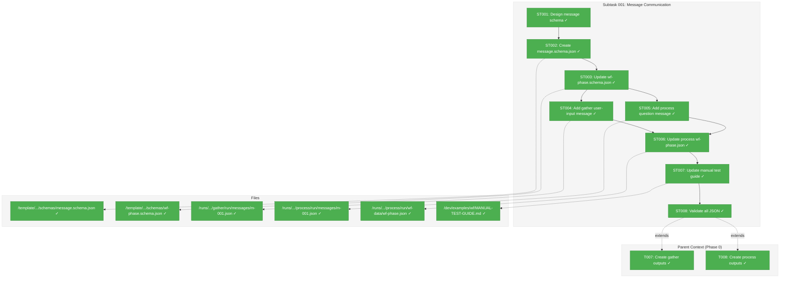
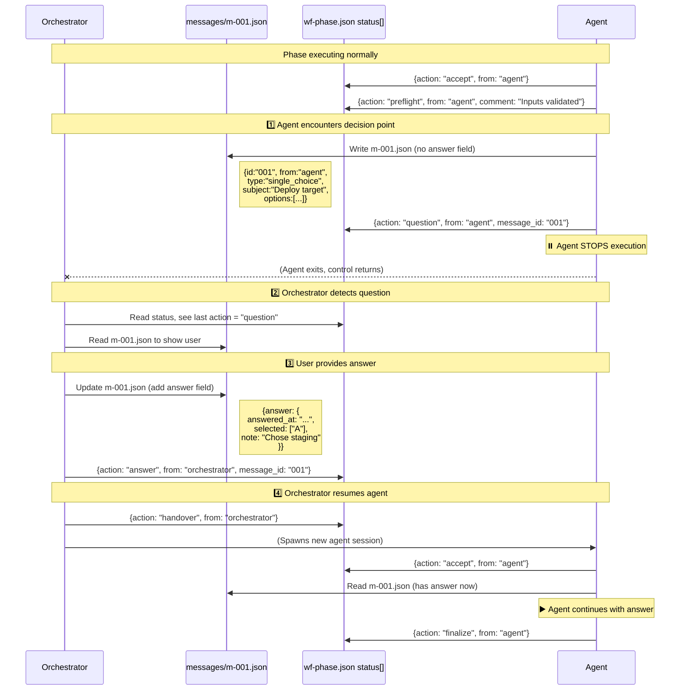
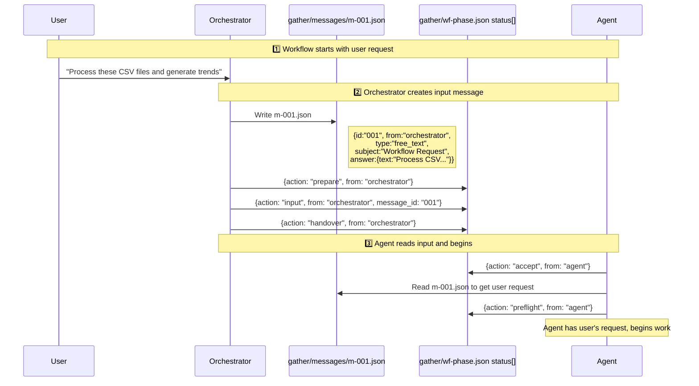
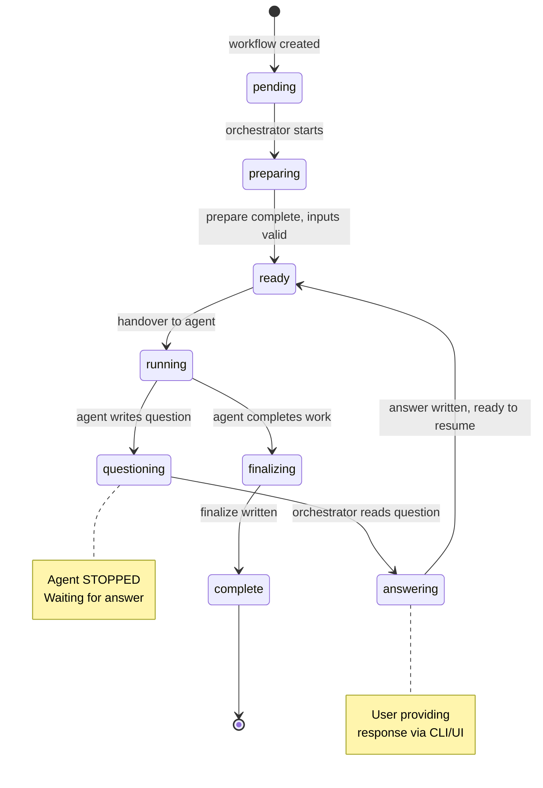

# Subtask 001: Message Communication System Exemplar

**Parent Plan:** [View Plan](../../wf-basics-plan.md)
**Parent Phase:** Phase 0: Development Exemplar
**Parent Task(s):** [T007: Create gather outputs](../tasks.md#task-t007), [T008: Create process outputs](../tasks.md#task-t008)
**Plan Task Reference:** [Task 0.7 and 0.8 in Plan](../../wf-basics-plan.md#phase-0-development-exemplar)

**Why This Subtask:**
During exemplar review, discovered that the workflow system needs a structured communication channel between agent and orchestrator. Current exemplar demonstrates the happy path (prepare → finalize) but doesn't demonstrate the question/answer flow that enables dynamic user input. This subtask adds the `messages/` directory pattern and updates an example phase to show a complete question turn.

**Created:** 2026-01-22
**Requested By:** Development Team (workshop session)

---

## Executive Briefing

### Purpose
This subtask adds the message-based communication pattern to the Phase 0 exemplar, enabling agents to ask questions mid-workflow and receive structured answers from the orchestrator. This also unifies "user input" (the initial request) with "mid-workflow questions" under a single messaging abstraction.

### What We're Building
A complete `messages/` directory structure within phase runs, containing:
- **Message schema** (`message.schema.json`): Defines the structure for all messages between agent and orchestrator
- **Example messages**: Demonstrates both orchestrator→agent (user input) and agent→orchestrator (question with answer) flows
- **Updated wf-phase.json**: Shows the question/answer status entries with message_id references

### Unblocks
- Enables dynamic user input during workflow execution
- Unifies initial user request with mid-workflow questions
- Provides exemplar for Phase 3+ CLI commands (`cg phase ask`, `cg phase answer`)

### Example

**Message file** (`phases/process/run/messages/m-001.json`):
```json
{
  "id": "m-001",
  "created_at": "2026-01-21T10:07:00Z",
  "from": "agent",
  "type": "multi_choice",
  "subject": "Output format selection",
  "body": "The gathered data contains both summary and detailed records. How should I structure the processed output?",
  "options": [
    { "key": "A", "label": "Summary only", "description": "Aggregate metrics, no individual records" },
    { "key": "B", "label": "Detailed only", "description": "All records with full details" },
    { "key": "C", "label": "Both", "description": "Summary section plus detailed appendix" }
  ],
  "answer": {
    "answered_at": "2026-01-21T10:08:30Z",
    "selected": ["C"],
    "note": "Include both - stakeholders need summary, devs need details"
  }
}
```

**Updated status log entry** (in `wf-phase.json`):
```json
{
  "timestamp": "2026-01-21T10:07:00Z",
  "from": "agent",
  "action": "question",
  "message_id": "m-001",
  "comment": "Need clarification on output format"
}
```

---

## Objectives & Scope

### Objective
Add message-based communication exemplar to Phase 0 so that subsequent phases have a concrete reference for implementing the `cg phase ask` and `cg phase answer` commands.

### Goals

- ✅ Design message schema covering all message types (single_choice, multi_choice, free_text, confirm)
- ✅ Create `message.schema.json` in template schemas directory
- ✅ Add `messages/` directory to process phase run example
- ✅ Create example message showing multi_choice question with answer
- ✅ Update process phase `wf-phase.json` to include question/answer status entries
- ✅ Add user input message to gather phase (demonstrates orchestrator→agent)
- ✅ Update wf-phase.schema.json to include message_id field in status entries
- ✅ **NEW**: Update wf.yaml to include `inputs.messages` declarations per phase
- ✅ **NEW**: Update wf-phase.yaml files with extracted message declarations
- ✅ **NEW**: Update wf.schema.json to support message input declarations
- ✅ Document the message protocol in the manual test guide

### Non-Goals

- ❌ Implementing CLI commands (`cg phase message create/ask/answer/read/list`) - that's Phase 3+
- ❌ Creating partial/blocked state exemplar runs - just add messages to existing complete run
- ❌ Message threading or conversation history beyond the status log - keep simple
- ❌ Auto-discovery or routing of messages - orchestrator explicitly handles messages
- ❌ Updating wf.md to instruct agent to read messages - OOS, figure out later

---

## Architecture Map

### Component Diagram
<!-- Status: grey=pending, orange=in-progress, green=completed, red=blocked -->
<!-- Updated by plan-6 during implementation -->



### Task-to-Component Mapping

<!-- Status: ⬜ Pending | 🟧 In Progress | ✅ Complete | 🔴 Blocked -->

| Task | Component(s) | Files | Status | Comment |
|------|-------------|-------|--------|---------|
| ST001 | Message Schema Design | N/A (design doc) | ✅ Complete | Design captured in Alignment Brief |
| ST002 | JSON Schema | message.schema.json | ✅ Complete | Draft 2020-12 compliance |
| ST003 | wf-phase Schema Update | wf-phase.schema.json | ✅ Complete | Add message_id to status |
| ST004 | Gather User Input | messages/m-001.json | ✅ Complete | Orchestrator→agent free_text |
| ST005 | Process Question | messages/m-001.json | ✅ Complete | Agent→orchestrator multi_choice |
| ST006 | Process Status Update | wf-phase.json | ✅ Complete | Add question/answer entries |
| ST007 | wf.schema.json | wf.schema.json | ✅ Complete | Add messageInput definition |
| ST008 | Template wf.yaml | wf.yaml | ✅ Complete | Add message declarations |

---

## Tasks

| Status | ID | Task | CS | Type | Dependencies | Absolute Path(s) | Validation | Subtasks | Notes |
|--------|------|------|-----|------|--------------|------------------|------------|----------|-------|
| [x] | ST001 | Design message schema with types: single_choice, multi_choice, free_text, confirm | 2 | Design | – | N/A (design captured below) | Schema design documented | – | Workshop output captured in this dossier |
| [x] | ST002 | Create `message.schema.json` in template schemas directory | 2 | Core | ST001 | `/home/jak/substrate/003-wf-basics/dev/examples/wf/template/hello-workflow/schemas/message.schema.json` | Schema valid Draft 2020-12 | – | Covers all message types |
| [x] | ST003 | Update `wf-phase.schema.json` to add optional `message_id` field to status entries | 1 | Core | ST001 | `/home/jak/substrate/003-wf-basics/dev/examples/wf/template/hello-workflow/schemas/wf-phase.schema.json` | Schema valid, backward compatible | – | Optional field for question/answer actions |
| [x] | ST004 | Create gather phase user input message `m-001.json` | 2 | Core | ST002 | `/home/jak/substrate/003-wf-basics/dev/examples/wf/runs/run-example-001/phases/gather/run/messages/m-001.json` | Validates against message.schema.json | – | Type: free_text, from: orchestrator |
| [x] | ST005 | Create process phase question message `m-001.json` with multi_choice and answer | 2 | Core | ST002 | `/home/jak/substrate/003-wf-basics/dev/examples/wf/runs/run-example-001/phases/process/run/messages/m-001.json` | Validates against message.schema.json | – | Shows complete question/answer flow |
| [x] | ST006 | Update process phase `wf-phase.json` to include question and answer status entries with message_id references | 2 | Core | ST003, ST005 | `/home/jak/substrate/003-wf-basics/dev/examples/wf/runs/run-example-001/phases/process/run/wf-data/wf-phase.json` | Validates against wf-phase.schema.json | – | Insert between preflight and finalize |
| [x] | ST007 | Update `wf.schema.json` to support `inputs.messages` declarations | 2 | Core | ST001 | `/home/jak/substrate/003-wf-basics/dev/examples/wf/template/hello-workflow/schemas/wf.schema.json` | Schema valid, supports message declarations | – | New messages array in inputs |
| [x] | ST008 | Update template `wf.yaml` with message declarations for gather and process phases | 2 | Core | ST007 | `/home/jak/substrate/003-wf-basics/dev/examples/wf/template/hello-workflow/wf.yaml` | YAML valid, has inputs.messages | – | Per design above |
| [x] | ST009 | Update run `wf.yaml` with message declarations (copy from template) | 1 | Core | ST008 | `/home/jak/substrate/003-wf-basics/dev/examples/wf/runs/run-example-001/wf.yaml` | YAML matches template | – | Keep in sync |
| [x] | ST010 | Update gather `wf-phase.yaml` with extracted message declaration | 1 | Core | ST008 | `/home/jak/substrate/003-wf-basics/dev/examples/wf/runs/run-example-001/phases/gather/wf-phase.yaml` | YAML valid | – | Extract from wf.yaml |
| [x] | ST011 | Update process `wf-phase.yaml` with extracted message declaration | 1 | Core | ST008 | `/home/jak/substrate/003-wf-basics/dev/examples/wf/runs/run-example-001/phases/process/wf-phase.yaml` | YAML valid | – | Extract from wf.yaml |
| [x] | ST012 | Update MANUAL-TEST-GUIDE.md with message protocol documentation | 1 | Doc | ST006, ST011 | `/home/jak/substrate/003-wf-basics/dev/examples/wf/MANUAL-TEST-GUIDE.md` | Documentation complete | – | Explain message flow |
| [x] | ST013 | Validate all new/updated JSON/YAML files against their schemas | 1 | Validation | ST004, ST005, ST006, ST010, ST011 | N/A (validation step) | All ajv validate commands pass | – | Final validation gate |

---

## Alignment Brief

### Message Schema Design (ST001)

Based on workshop session, the message schema design is:

#### Message Types Reference

| Type | Use Case | Has Options | Answer Fields | Example |
|------|----------|-------------|---------------|---------|
| `single_choice` | Pick exactly one option (radio) | ✅ Required | `selected: ["A"]` (exactly 1) | Deployment target, environment selection |
| `multi_choice` | Pick one or more options (checkbox) | ✅ Required | `selected: ["A", "C"]` (1+) | Features to enable, files to include |
| `free_text` | Open text response | ❌ None | `text: "response"` | User request, detailed feedback |
| `confirm` | Yes/No confirmation | ❌ None | `confirmed: true/false` | Proceed with action, approve change |

#### Message Structure

```json
{
  "id": "001",
  "created_at": "2026-01-21T10:07:00Z",
  "from": "agent | orchestrator",
  "type": "single_choice | multi_choice | free_text | confirm",
  "subject": "Brief subject line",
  "body": "Full message text with context",
  "note": "Optional creator note for audit/context",
  "options": [
    {
      "key": "A",
      "label": "Option label",
      "description": "Optional longer description"
    }
  ],
  "answer": {
    "answered_at": "2026-01-21T10:08:30Z",
    "selected": ["A", "C"],
    "text": "Free text response",
    "confirmed": true,
    "note": "Optional answerer note with rationale"
  }
}
```

#### Key Design Decisions

1. **Message direction via `from` field**:
   - `from: "orchestrator"` = input to agent (instructions, answers, user requests)
   - `from: "agent"` = output from agent needing response (questions, clarifications)

2. **Answer embedded in message file**:
   - The message file is mutable - starts with question, gets `answer` field added when orchestrator responds
   - Keeps question and answer together for audit trail
   - For orchestrator→agent messages (user input): The answer is pre-filled because the Q&A already happened outside the workflow boundary (e.g., orchestrator UI asked user, got response, then created message with both)

3. **Status log references message by ID**:
   - `"action": "question", "message_id": "m-001"` - agent asked
   - `"action": "answer", "message_id": "m-001"` - orchestrator answered

4. **No special "awaiting" state**:
   - The status log tells the story (question action → answer action)
   - Orchestrator detects question and handles it; no meta-state needed

5. **Per-phase message sequence**:
   - Each phase has its own `messages/` directory
   - Message IDs are per-phase (m-001, m-002, etc.)

6. **User input as first message**:
   - Initial user request = `m-001` from orchestrator to first phase
   - Unifies user input with mid-workflow questions

7. **Phase declares required messages in template** (Workshop 2026-01-22):
   - Template wf.yaml defines `inputs.messages` with shape/prompt/options
   - Orchestrator reads template to know what message to create
   - `prepare` validates required messages exist before handover
   - First phase can mark input message as `required: true` or `required: false`

### Phase Message Input Declaration (NEW - Workshop 2026-01-22)

Phases declare required messages in `wf.yaml` alongside files and parameters:

```yaml
# In wf.yaml phase definition
gather:
  description: "Collect and acknowledge input data"
  order: 1

  inputs:
    files:
      - name: request.md
        required: true
        description: "Initial request file"
    parameters: []
    messages:                              # NEW: Message input declarations
      - id: "001"                          # Expected message ID (without m- prefix)
        type: "free_text"                  # Expected type
        from: "orchestrator"               # Who provides it
        required: true                     # Must exist before prepare passes
        subject: "Workflow Request"        # Subject line for the message
        prompt: "What would you like to accomplish in this workflow?"  # Guidance for orchestrator UI
        description: "The user's initial request that kicks off this workflow"

process:
  description: "Process and transform the gathered data"
  order: 2

  inputs:
    files:
      - name: acknowledgment.md
        required: true
        from_phase: gather
    parameters:
      - name: item_count
        required: true
        from_phase: gather
    messages:                              # Process phase expects optional question capability
      - id: "001"
        type: "multi_choice"
        from: "agent"                      # Agent will CREATE this message
        required: false                    # Optional - agent may or may not ask
        subject: "Output Format Selection"
        prompt: "How should the processed output be structured?"
        options:
          - key: "A"
            label: "Summary only"
            description: "Aggregate metrics, no individual records"
          - key: "B"
            label: "Detailed only"
            description: "All records with full details"
          - key: "C"
            label: "Both"
            description: "Summary section plus detailed appendix"
        description: "Agent may ask user to clarify output format preference"
```

**Key aspects of message declarations:**

| Field | Required | Description |
|-------|----------|-------------|
| `id` | ✅ | Message ID without prefix (becomes m-001) |
| `type` | ✅ | `single_choice`, `multi_choice`, `free_text`, `confirm` |
| `from` | ✅ | Who creates it: `orchestrator` or `agent` |
| `required` | ✅ | Whether message must exist for prepare to pass |
| `subject` | ✅ | Subject line for the message |
| `prompt` | Optional | Guidance text for orchestrator UI or agent |
| `options` | For choice types | Pre-defined options for choice messages |
| `description` | Optional | Documentation for humans |

**Validation during `cg phase prepare`:**
- If `required: true` and `from: "orchestrator"`: Message m-{id} must exist
- If `required: true` and `from: "agent"`: No check (agent creates during execution)
- New error codes: E060 (message not found), E061 (wrong type), E062 (awaiting answer)

> **⚠️ "Required" Field Asymmetry**: The `required` field has different semantics based on `from`:
> - **Orchestrator messages**: `required: true` = MUST exist before prepare passes (validated)
> - **Agent messages**: `required: true` = agent MAY create this during execution (NOT validated)
>
> This asymmetry exists because orchestrator messages are **inputs** (provided before execution) while agent messages are **conditional outputs** (created if needed during execution). There is no post-finalize validation that required agent messages were created. See TD-ST001-02.

### CLI Commands Reference (OOS - Phase 3+)

Commands: `create`, `answer`, `list`, `read`

#### `cg phase message create`

Creates a new message file. Validates JSON against type-specific schema.

```bash
# Create a free_text message (user input)
cg phase message create \
  --phase gather \
  --run-dir ./runs/run-001 \
  --type free_text \
  --content '{"subject":"Workflow Request","body":"What would you like to accomplish?"}' \
  --note "Initial user input from web UI"
```

**Resulting `m-001.json`:**
```json
{
  "id": "001",
  "created_at": "2026-01-21T10:00:00Z",
  "from": "orchestrator",
  "type": "free_text",
  "subject": "Workflow Request",
  "body": "What would you like to accomplish?",
  "note": "Initial user input from web UI",
  "answer": {
    "answered_at": "2026-01-21T10:00:05Z",
    "text": "Process these CSV files and generate a summary report with trends",
    "note": null
  }
}
```

```bash
# Create a single_choice message (agent question)
cg phase message create \
  --phase process \
  --run-dir ./runs/run-001 \
  --type single_choice \
  --content '{"subject":"Deployment Target","body":"Which environment?","options":[{"key":"A","label":"Staging"},{"key":"B","label":"Production"}]}' \
  --note "Agent needs deployment target"
```

**Resulting `m-001.json`:**
```json
{
  "id": "001",
  "created_at": "2026-01-21T10:07:00Z",
  "from": "agent",
  "type": "single_choice",
  "subject": "Deployment Target",
  "body": "Which environment should I deploy to?",
  "note": "Agent needs deployment target",
  "options": [
    { "key": "A", "label": "Staging", "description": "Test environment" },
    { "key": "B", "label": "Production", "description": "Live environment" }
  ]
}
```

```bash
# Create a confirm message
cg phase message create \
  --phase process \
  --run-dir ./runs/run-001 \
  --type confirm \
  --content '{"subject":"Delete Old Files","body":"Found 47 files older than 30 days. Delete them?"}'
```

**Resulting `m-002.json`:**
```json
{
  "id": "002",
  "created_at": "2026-01-21T10:08:00Z",
  "from": "agent",
  "type": "confirm",
  "subject": "Delete Old Files",
  "body": "Found 47 files older than 30 days. Delete them?",
  "note": null
}
```

#### `cg phase message answer`

Adds answer to an existing message. Validates answer matches message type.

```bash
# Answer single_choice
cg phase message answer \
  --phase process \
  --run-dir ./runs/run-001 \
  --id 001 \
  --select A \
  --note "Staging chosen - prod is under change freeze"

# Answer multi_choice (multiple --select flags)
cg phase message answer \
  --phase process \
  --run-dir ./runs/run-001 \
  --id 001 \
  --select A \
  --select C \
  --note "Include both summary and appendix"

# Answer free_text
cg phase message answer \
  --phase gather \
  --run-dir ./runs/run-001 \
  --id 001 \
  --text "Process these CSV files and generate a summary report" \
  --note "User request via CLI"

# Answer confirm
cg phase message answer \
  --phase process \
  --run-dir ./runs/run-001 \
  --id 002 \
  --confirm \
  --note "Approved deletion of stale files"

# Deny confirm (explicit false)
cg phase message answer \
  --phase process \
  --run-dir ./runs/run-001 \
  --id 002 \
  --deny \
  --note "Keep old files for audit"
```

**Updated `m-001.json` after answer:**
```json
{
  "id": "001",
  "created_at": "2026-01-21T10:07:00Z",
  "from": "agent",
  "type": "single_choice",
  "subject": "Deployment Target",
  "body": "Which environment should I deploy to?",
  "note": "Agent needs deployment target",
  "options": [
    { "key": "A", "label": "Staging", "description": "Test environment" },
    { "key": "B", "label": "Production", "description": "Live environment" }
  ],
  "answer": {
    "answered_at": "2026-01-21T10:08:30Z",
    "selected": ["A"],
    "note": "Staging chosen - prod is under change freeze"
  }
}
```

#### `cg phase message list`

Lists all messages in a phase.

```bash
cg phase message list --phase process --run-dir ./runs/run-001
```

**Output:**
```
ID    TYPE           FROM          SUBJECT                    ANSWERED
001   single_choice  agent         Deployment Target          ✓ 2026-01-21T10:08:30Z
002   confirm        agent         Delete Old Files           -
```

#### `cg phase message read`

Reads a specific message with full details.

```bash
cg phase message read --phase process --run-dir ./runs/run-001 --id 001
```

**Output (JSON by default):**
```json
{
  "id": "001",
  "created_at": "2026-01-21T10:07:00Z",
  "from": "agent",
  "type": "single_choice",
  "subject": "Deployment Target",
  "body": "Which environment should I deploy to?",
  "options": [...],
  "answer": {...}
}
```

#### Error Codes

| Code | Name | When |
|------|------|------|
| E060 | MESSAGE_NOT_FOUND | Message ID doesn't exist |
| E061 | MESSAGE_TYPE_MISMATCH | Answer doesn't match message type (e.g., --select on free_text) |
| E062 | MESSAGE_AWAITING_ANSWER | Message exists but has no answer yet (for operations requiring answer) |
| E063 | MESSAGE_ALREADY_ANSWERED | Attempting to answer an already-answered message |
| E064 | MESSAGE_VALIDATION_FAILED | Content JSON doesn't match schema for type |

#### Status Log Actions for Messages

| Action | From | Description | Has message_id |
|--------|------|-------------|----------------|
| `input` | orchestrator | Provides initial user input | ✅ Yes |
| `question` | agent | Agent asks question | ✅ Yes |
| `answer` | orchestrator | Orchestrator provides answer | ✅ Yes (same as question) |

### Critical Findings Affecting This Subtask

| Finding | What It Constrains | Tasks Affected |
|---------|-------------------|----------------|
| **Critical Discovery 09**: Development Exemplar as Testing Foundation | Exemplar must demonstrate all core patterns - including message flow | ALL (ST001-ST008) |
| **Workshop Decision**: Messages unify user input and questions | First phase gets user input as m-001 from orchestrator | ST004 |

### ADR Decision Constraints

**ADR-0002: Exemplar-Driven Development** (Accepted)
- **Constraint**: Exemplars must demonstrate concrete file structures
- **Affects**: ST002-ST006 (all file creation tasks)
- **Compliance**: Creating concrete message files in exemplar

### Invariants & Guardrails

1. **JSON Schema Version**: message.schema.json MUST use Draft 2020-12
2. **Backward Compatibility**: wf-phase.schema.json update must not break existing wf-phase.json files (message_id is optional)
3. **Status Log Append-Only**: Only ADD entries to wf-phase.json status array, don't modify existing entries
4. **Message ID Format**: Sequential m-NNN within each phase (m-001, m-002, etc.)

### Visual Alignment Aids

#### Mermaid Flow: Agent Asks Question (Complete Flow)



#### Status Log Timeline (wf-phase.json)

After the above flow, `wf-phase.json` status array contains:

```json
{
  "status": [
    {"timestamp": "T1", "from": "orchestrator", "action": "prepare"},
    {"timestamp": "T2", "from": "orchestrator", "action": "handover"},
    {"timestamp": "T3", "from": "agent", "action": "accept"},
    {"timestamp": "T4", "from": "agent", "action": "preflight"},
    {"timestamp": "T5", "from": "agent", "action": "question", "message_id": "001", "comment": "Need deployment target"},
    {"timestamp": "T6", "from": "orchestrator", "action": "answer", "message_id": "001", "comment": "User selected staging"},
    {"timestamp": "T7", "from": "orchestrator", "action": "handover", "comment": "Resuming after Q&A"},
    {"timestamp": "T8", "from": "agent", "action": "accept", "comment": "Resuming with answer"},
    {"timestamp": "T9", "from": "agent", "action": "finalize", "comment": "Phase complete"}
  ]
}
```

#### Mermaid Flow: User Input as First Message



#### Phase State Machine (with Messages)



### Test Plan

**Approach**: Manual ajv validation (consistent with Phase 0 pattern)

| Test | Method | Expected Result |
|------|--------|-----------------|
| message.schema.json validity | `npx ajv compile -s message.schema.json` | Compiles |
| gather m-001.json validation | `npx ajv validate -s message.schema.json -d gather/.../m-001.json` | Valid |
| process m-001.json validation | `npx ajv validate -s message.schema.json -d process/.../m-001.json` | Valid |
| Updated wf-phase.json validation | `npx ajv validate -s wf-phase.schema.json -d process/.../wf-phase.json` | Valid |

### Commands to Run

```bash
# Create messages directories
mkdir -p dev/examples/wf/runs/run-example-001/phases/gather/run/messages
mkdir -p dev/examples/wf/runs/run-example-001/phases/process/run/messages

# Validate message schema compiles
npx ajv compile -s dev/examples/wf/template/hello-workflow/schemas/message.schema.json

# Validate gather user input message
npx ajv validate \
  -s dev/examples/wf/template/hello-workflow/schemas/message.schema.json \
  -d dev/examples/wf/runs/run-example-001/phases/gather/run/messages/m-001.json

# Validate process question message
npx ajv validate \
  -s dev/examples/wf/template/hello-workflow/schemas/message.schema.json \
  -d dev/examples/wf/runs/run-example-001/phases/process/run/messages/m-001.json

# Validate updated wf-phase.json
npx ajv validate \
  -s dev/examples/wf/template/hello-workflow/schemas/wf-phase.schema.json \
  -d dev/examples/wf/runs/run-example-001/phases/process/run/wf-data/wf-phase.json
```

### Risks/Unknowns

| Risk | Severity | Mitigation |
|------|----------|------------|
| Schema design may need revision when CLI commands implemented | Medium | Design flexibly; schema can evolve |
| Backward compatibility with existing wf-phase.json files | Low | message_id is optional field |

### Technical Debt

| ID | Description | Rationale | Future Phase | Reference |
|----|-------------|-----------|--------------|-----------|
| TD-ST001-01 | Agent bootstrap (wf.md) and phase commands (main.md) don't mention messages | Explicitly OOS per line 94; Phase 3+ CLI implementation will have better context for agent instructions | Phase 3+ | didyouknow session 2026-01-22 |
| TD-ST001-02 | No post-finalize validation that required agent messages were created | Asymmetry is intentional (inputs vs outputs); add if enforcement needed later | Phase 3+ | didyouknow session 2026-01-22 |

### Ready Check

- [x] Message schema design documented (ST001 captured above)
- [x] All file paths specified as absolute paths
- [x] Validation commands documented
- [x] Parent phase context reviewed
- [x] Invariants documented
- [ ] **AWAITING GO** to begin implementation

---

## Phase Footnote Stubs

_This section will be populated during implementation by plan-6a-update-progress._

| Footnote | Date | Description |
|----------|------|-------------|
| | | |

---

## Evidence Artifacts

Implementation will produce:
- **Execution Log**: `docs/plans/003-wf-basics/tasks/phase-0-development-exemplar/001-subtask-message-communication.execution.log.md`
- **All files listed in Absolute Path(s) column of Tasks table**

---

## Discoveries & Learnings

_Populated during implementation by plan-6. Log anything of interest to your future self._

| Date | Task | Type | Discovery | Resolution | References |
|------|------|------|-----------|------------|------------|
| | | | | | |

**Types**: `gotcha` | `research-needed` | `unexpected-behavior` | `workaround` | `decision` | `debt` | `insight`

---

## After Subtask Completion

**This subtask extends:**
- Parent Task: [T007: Create gather outputs](../tasks.md#task-t007)
- Parent Task: [T008: Create process outputs](../tasks.md#task-t008)
- Plan Task: [0.7 and 0.8 in Plan](../../wf-basics-plan.md#phase-0-development-exemplar)

**When all ST### tasks complete:**

1. **Record completion** in parent execution log:
   ```
   ### Subtask 001-subtask-message-communication Complete

   Resolved: Added message communication pattern to exemplar
   See detailed log: [subtask execution log](./001-subtask-message-communication.execution.log.md)
   ```

2. **Update parent task** (if it was blocked):
   - Open: [`tasks.md`](./tasks.md)
   - T007 and T008 were already complete - add note about message extension
   - Update Notes: Add "Extended by 001-subtask-message-communication"

3. **Resume parent phase work:**
   ```bash
   /plan-6-implement-phase --phase "Phase 0: Development Exemplar" \
     --plan "/Users/jordanknight/substrate/chainglass-004-config/docs/plans/003-wf-basics/wf-basics-plan.md"
   ```
   (Note: NO `--subtask` flag to resume main phase)

**Quick Links:**
- [Parent Dossier](./tasks.md)
- [Parent Plan](../../wf-basics-plan.md)
- [Parent Execution Log](./execution.log.md)

---

## Directory Layout

```
docs/plans/003-wf-basics/tasks/phase-0-development-exemplar/
├── tasks.md                                           # Parent phase dossier
├── execution.log.md                                   # Parent execution log
├── 001-subtask-message-communication.md               # This subtask dossier
└── 001-subtask-message-communication.execution.log.md # Created by /plan-6

dev/examples/wf/
├── template/hello-workflow/schemas/
│   ├── message.schema.json       # NEW: Message schema
│   └── wf-phase.schema.json      # UPDATED: Add message_id
└── runs/run-example-001/phases/
    ├── gather/run/messages/
    │   └── m-001.json            # NEW: User input message
    └── process/run/
        ├── messages/
        │   └── m-001.json        # NEW: Question + answer message
        └── wf-data/
            └── wf-phase.json     # UPDATED: Add question/answer status
```

---

**Subtask Status**: ⬜ NOT STARTED
**Prerequisite**: Parent Phase 0 complete ✅
**Next Step**: Await human **GO** to begin implementation with `/plan-6-implement-phase --subtask 001-subtask-message-communication`

---

## Critical Insights Discussion

**Session**: 2026-01-22
**Context**: Subtask 001 Message Communication System - pre-implementation review
**Analyst**: AI Clarity Agent
**Reviewer**: Jordan Knight
**Format**: Water Cooler Conversation (5 Critical Insights)

### Insight 1: Agent Instruction Gap

**Did you know**: After ST001 implementation, the exemplar will have message files but wf.md and main.md provide zero guidance on how agents discover or read them.

**Implications**:
- User input exists as m-001.json but agents don't know to read it
- Phase 3+ CLI implementation will hit this gap
- Exemplar shows "what" but not "how to find it"

**Options Considered**:
- Option A: Accept the gap - defer to Phase 3+
- Option B: Add minimal message awareness to wf.md now
- Option C: Create agent-messages-guide.md alongside exemplar

**AI Recommendation**: Option A (Accept the gap)
- Reasoning: Respects documented scope (line 94 explicitly marks OOS); Phase 3+ will have better context

**Discussion Summary**: User agreed to accept the gap and ensure it's logged as technical debt.

**Decision**: Accept gap, log as TD-ST001-01

**Action Items**:
- [x] Add TD-ST001-01 to Technical Debt table

**Affects**: Phase 3+ CLI implementation

---

### Insight 2: "Required" Field Asymmetry

**Did you know**: The `required: true` field on message declarations has completely different validation behavior depending on the `from` field - orchestrator messages are validated at prepare, agent messages are never validated.

**Implications**:
- "Required" is misleading for agent messages
- No post-finalize check ensures required agent messages were created
- Developers might assume validation that doesn't exist

**Options Considered**:
- Option A: Accept asymmetry - document clearly
- Option B: Remove "required" field for agent messages
- Option C: Add post-finalize validation

**AI Recommendation**: Option A (Accept asymmetry, document clearly)
- Reasoning: Asymmetry reflects real semantics (inputs vs outputs); documentation prevents confusion

**Discussion Summary**: User recognized this as a great finding. Agreed to document clearly.

**Decision**: Accept asymmetry, add callout box explaining semantics

**Action Items**:
- [x] Add callout box to subtask explaining asymmetry
- [x] Add TD-ST001-02 for potential future post-finalize validation

**Affects**: ST001 documentation, Phase 3+ validation decisions

---

### Insight 3: Orchestrator "Pre-Answered Question" Pattern

**Did you know**: Orchestrator input messages have the answer pre-filled at creation time, making them look like questions that answer themselves.

**Implications**:
- Schema treats fundamentally different concepts identically
- `body` for orchestrator messages is really a "prompt template"
- Reading code needs to understand this implicit pattern

**Options Considered**:
- Option A: Keep current design - document the pattern
- Option B: Introduce message "role" field
- Option C: Orchestrator messages use body only (no answer)

**AI Recommendation**: Option A (Keep current design)
- Reasoning: Unified validation is simpler; pattern is intentional for audit trail

**Discussion Summary**: User pointed out the Q&A DID happen - just outside the workflow boundary. The orchestrator UI asked the user and got the answer before creating the message. The message captures that completed exchange.

**Decision**: Keep design, add clarification that Q&A happened outside workflow boundary

**Action Items**:
- [x] Add clarification to design decisions section

**Affects**: ST001 documentation

---

### Insight 4: Per-Phase Message IDs Are Correct

**Did you know**: Message IDs like m-001 are scoped per-phase (both gather and process can have m-001), but this is actually correct because messages are phase-local Q&A, not cross-phase data flow.

**Implications**:
- No collision risk - cross-phase data uses outputs/parameters, not message IDs
- Messages stay simple and scoped
- Design is sound as-is

**Options Considered**:
- Option A: Keep per-phase IDs (current design)
- Option B: Global workflow-level message IDs
- Option C: UUID-based message IDs

**AI Recommendation**: Option A (Keep per-phase IDs)
- Reasoning: Messages are phase-local; cross-phase uses established file/parameter pattern

**Discussion Summary**: User confirmed this matches their mental model.

**Decision**: No change - design validated as correct

**Action Items**: None

**Affects**: Nothing - design confirmed

---

### Insight 5: Mutable Message Files Are Safe

**Did you know**: The mutable message file pattern (answer written back to same file) looks like a race condition risk, but the single-writer constraint and facilitator model provide implicit safety.

**Implications**:
- Single writer per workflow run = no concurrent access
- Facilitator field IS the lock mechanism (implicit)
- Sequential handoffs prevent simultaneous access

**Options Considered**:
- Option A: Keep mutable message file (current design)
- Option B: Separate question and answer files
- Option C: Message file with versioning/locking

**AI Recommendation**: Option A (Keep mutable)
- Reasoning: Single-writer constraint makes it safe; no locks needed

**Discussion Summary**: User confirmed the design is fine as-is.

**Decision**: No change - design validated as safe under current constraints

**Action Items**: None

**Affects**: Nothing - architecture confirmed

---

## Session Summary

**Insights Surfaced**: 5 critical insights identified and discussed
**Decisions Made**: 5 decisions reached through collaborative discussion
**Action Items Created**: 2 technical debt items logged
**Areas Updated**:
- Technical Debt table (TD-ST001-01, TD-ST001-02)
- "Required" field asymmetry callout box
- Pre-answered question clarification in design decisions

**Shared Understanding Achieved**: ✓

**Confidence Level**: High - Design validated, gaps documented, ready for implementation

**Next Steps**:
1. Await **GO** to begin ST001 implementation
2. Run `/plan-6-implement-phase --subtask 001-subtask-message-communication`

**Notes**:
- Two design aspects validated as correct (per-phase IDs, mutable files)
- Two gaps accepted and logged as debt (agent instructions, post-finalize validation)
- One clarification added (pre-answered question rationale)
