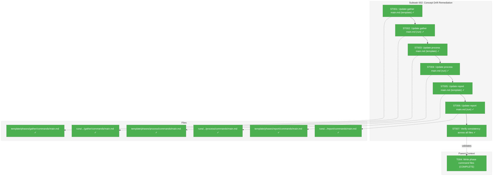
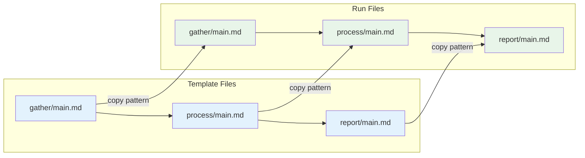
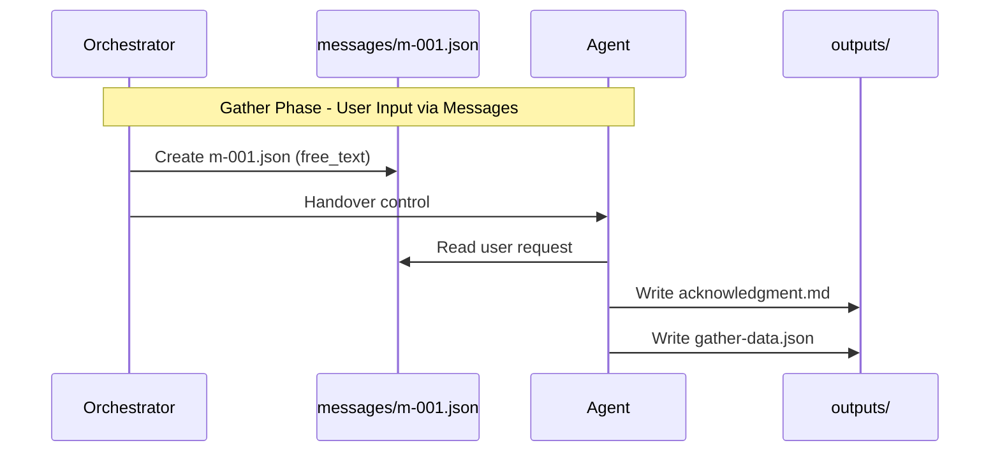
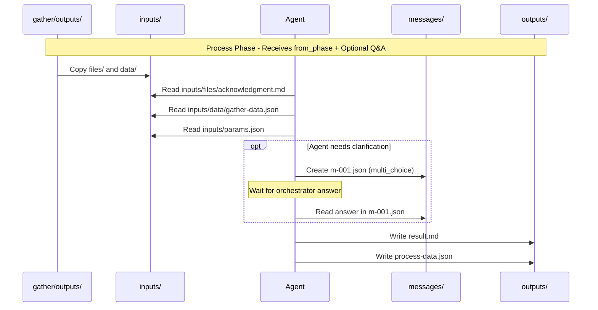

# Subtask 002: Remediate Concept Drift in commands/main.md Files

**Parent Plan:** [View Plan](../../wf-basics-plan.md)
**Parent Phase:** Phase 0: Development Exemplar
**Parent Task(s):** [T004: Write phase command files](./tasks.md#task-t004)
**Plan Task Reference:** [Task 0.4 in Plan](../../wf-basics-plan.md#phase-0-development-exemplar)

**Why This Subtask:**
Research revealed that all 6 `commands/main.md` files reference an obsolete flat directory structure (`inputs/<filename>`) while the actual exemplar uses a structured subdirectory pattern (`inputs/files/` and `inputs/data/`). Additionally, the new `messages/` directory system implemented in Subtask 001 is completely undocumented in these files.

**Created:** 2026-01-22
**Requested By:** Development Team (post-implementation QA)

---

## Executive Briefing

### Purpose
This subtask updates all 6 `commands/main.md` files to accurately reflect the actual exemplar directory structure, eliminating concept drift that would confuse agents attempting to follow the instructions. The files serve as agent command prompts and must accurately describe available inputs, outputs, and the new message communication system.

### What We're Building
Updated agent command documentation for all three phases (gather, process, report) in both template and run locations that:
- Correctly references the structured `inputs/files/` and `inputs/data/` subdirectories
- Documents the new `messages/` directory for agent↔orchestrator Q&A
- Documents the `wf-data/` directory for status tracking
- Removes incorrect references (e.g., `inputs/request.md` for gather phase)
- Provides a clear directory structure overview for each phase

### Unblocks
- Future agent implementations that rely on accurate command documentation
- Prevents confusion when agents attempt to follow main.md instructions

### Example
**Before (Process main.md)**:
```markdown
## Inputs Available
- `inputs/acknowledgment.md` - Acknowledgment from gather phase
- `inputs/gather-data.json` - Structured data from gather phase
```

**After (Process main.md)**:
```markdown
## Directory Structure
run/
├── inputs/
│   ├── files/          # Human-readable files from prior phase
│   │   └── acknowledgment.md
│   ├── data/           # Structured data from prior phase
│   │   └── gather-data.json
│   └── params.json     # {item_count, request_type}
├── messages/           # Agent ↔ Orchestrator communication
├── outputs/
└── wf-data/

## Inputs Available
- `inputs/files/acknowledgment.md` - Acknowledgment from gather phase
- `inputs/data/gather-data.json` - Structured data from gather phase
- `inputs/params.json` - Parameters: `{item_count, request_type}`
```

---

## Objectives & Scope

### Objective
Update all `commands/main.md` files to accurately document the current exemplar directory structure, including the message communication system added in Subtask 001.

### Goals

- ✅ Update gather main.md (template + run) with correct structure
- ✅ Update process main.md (template + run) with correct paths and messages
- ✅ Update report main.md (template + run) with correct paths
- ✅ Add directory structure overview to each file
- ✅ Document messages/ directory for applicable phases
- ✅ Document wf-data/ directory purpose
- ✅ Verify all updated files are consistent

### Non-Goals

- ❌ Changing the CLI commands referenced (cg phase validate/finalize) - separate verification
- ❌ Creating new main.md files - only updating existing
- ❌ Modifying any non-main.md files
- ❌ Adding new functionality to the exemplar

---

## Architecture Map

### Component Diagram
<!-- Status: grey=pending, orange=in-progress, green=completed, red=blocked -->
<!-- Updated by plan-6 during implementation -->



### Task-to-Component Mapping

<!-- Status: ⬜ Pending | 🟧 In Progress | ✅ Complete | 🔴 Blocked -->

| Task | Component(s) | Files | Status | Comment |
|------|-------------|-------|--------|---------|
| ST001 | Gather Template | template/.../gather/commands/main.md | ✅ Complete | Removed inputs/request.md ref, added messages/, wf-data/ |
| ST002 | Gather Run | runs/.../gather/commands/main.md | ✅ Complete | Matches template |
| ST003 | Process Template | template/.../process/commands/main.md | ✅ Complete | Fixed paths, added messages/, files/ vs data/ explanation |
| ST004 | Process Run | runs/.../process/commands/main.md | ✅ Complete | Matches template |
| ST005 | Report Template | template/.../report/commands/main.md | ✅ Complete | Fixed paths, added "no messages" note |
| ST006 | Report Run | runs/.../report/commands/main.md | ✅ Complete | Matches template |
| ST007 | All Files | N/A | ✅ Complete | All diffs pass |

---

## Tasks

| Status | ID | Task | CS | Type | Dependencies | Absolute Path(s) | Validation | Subtasks | Notes |
|--------|------|------|-----|------|--------------|------------------|------------|----------|-------|
| [x] | ST001 | Update gather main.md (template): Remove `inputs/request.md` reference, add directory structure overview, document `messages/` for user input, document `wf-data/` | 2 | Core | – | /home/jak/substrate/003-wf-basics/dev/examples/wf/template/hello-workflow/phases/gather/commands/main.md | File contains messages/ reference; no inputs/ reference | – | Gather has no run/inputs/ directory |
| [x] | ST002 | Update gather main.md (run): Same updates as ST001 | 1 | Core | ST001 | /home/jak/substrate/003-wf-basics/dev/examples/wf/runs/run-example-001/phases/gather/commands/main.md | Matches template version | – | Copy structure from ST001 |
| [x] | ST003 | Update process main.md (template): Fix input paths to `inputs/files/` and `inputs/data/`, add directory structure overview, document `messages/` for agent Q&A, document `wf-data/` | 2 | Core | ST002 | /home/jak/substrate/003-wf-basics/dev/examples/wf/template/hello-workflow/phases/process/commands/main.md | Paths reference files/ and data/ subdirs; messages/ documented | – | Process receives from_phase inputs |
| [x] | ST004 | Update process main.md (run): Same updates as ST003 | 1 | Core | ST003 | /home/jak/substrate/003-wf-basics/dev/examples/wf/runs/run-example-001/phases/process/commands/main.md | Matches template version | – | Copy structure from ST003 |
| [x] | ST005 | Update report main.md (template): Fix input paths to `inputs/files/` and `inputs/data/`, add directory structure overview, document `wf-data/` | 2 | Core | ST004 | /home/jak/substrate/003-wf-basics/dev/examples/wf/template/hello-workflow/phases/report/commands/main.md | Paths reference files/ and data/ subdirs | – | Report has no messages |
| [x] | ST006 | Update report main.md (run): Same updates as ST005 | 1 | Core | ST005 | /home/jak/substrate/003-wf-basics/dev/examples/wf/runs/run-example-001/phases/report/commands/main.md | Matches template version | – | Copy structure from ST005 |
| [x] | ST007 | Verify consistency: Confirm all 6 files follow same structure pattern, template matches run for each phase | 1 | Validation | ST006 | N/A | Manual review confirms consistency | – | Final verification step |

---

## Alignment Brief

### Prior Subtask Review

**Subtask 001: Message Communication System** (Complete)
- Added `messages/` directory pattern to gather and process phases
- Created `message.schema.json` for message validation
- Updated `wf-phase.schema.json` with `message_id` field
- Updated `wf.yaml` and `wf-phase.yaml` with `inputs.messages` declarations
- **Impact on this subtask**: main.md files must now document the messages/ directory

### Critical Findings Affecting This Subtask

From Research Report (2026-01-22):

| Finding | What It Constrains | Tasks Affected |
|---------|-------------------|----------------|
| Flat vs Structured inputs/ | Paths must use `inputs/files/` and `inputs/data/` not `inputs/<filename>` | ST002-ST006 |
| Gather has no run/inputs/ | Remove `inputs/request.md` reference; user input comes via messages/ | ST001, ST002 |
| messages/ undocumented | Must add messages/ documentation to applicable phases | ST001-ST004 |
| wf-data/ undocumented | Must add wf-data/ explanation to all phases | ST001-ST006 |

### Concept Drift Details

**Actual Directory Structure (CURRENT)**:
```
phases/<phase>/
├── commands/main.md      # Agent command (has concept drift)
├── schemas/              # Phase schemas
├── wf-phase.yaml         # Canonical config
└── run/
    ├── inputs/           # Only phases 2+ (receives from_phase)
    │   ├── files/        # Human-readable (.md) from prior phase
    │   ├── data/         # Structured data (.json) from prior phase
    │   └── params.json   # Output parameters from prior phase
    ├── messages/         # Message communication (new system)
    │   └── m-001.json
    ├── outputs/          # Phase output files
    └── wf-data/          # Workflow metadata
        ├── wf-phase.json
        └── output-params.json
```

**Drift Items**:

| File | OLD Reference | SHOULD BE | Impact |
|------|---------------|-----------|--------|
| gather/main.md | `inputs/request.md` | No `run/inputs/` for gather; use messages/ | High |
| process/main.md | `inputs/acknowledgment.md` | `inputs/files/acknowledgment.md` | Medium |
| process/main.md | `inputs/gather-data.json` | `inputs/data/gather-data.json` | Medium |
| report/main.md | `inputs/result.md` | `inputs/files/result.md` | Medium |
| report/main.md | `inputs/process-data.json` | `inputs/data/process-data.json` | Medium |

### Invariants & Guardrails

1. **Template = Run**: Template main.md and run main.md must match for each phase
2. **Paths are relative**: All paths in main.md are relative to the phase's `run/` directory
3. **No code changes**: This is documentation-only remediation
4. **Preserve CLI commands**: Keep `cg phase validate` and `cg phase finalize` references unchanged

### Inputs to Read

| Input | Location | Purpose |
|-------|----------|---------|
| Current gather main.md | dev/examples/wf/runs/.../gather/commands/main.md | Understand current state |
| Current process main.md | dev/examples/wf/runs/.../process/commands/main.md | Understand current state |
| Current report main.md | dev/examples/wf/runs/.../report/commands/main.md | Understand current state |
| gather wf-phase.yaml | dev/examples/wf/runs/.../gather/wf-phase.yaml | Reference for inputs.messages |
| process wf-phase.yaml | dev/examples/wf/runs/.../process/wf-phase.yaml | Reference for inputs.messages |

### Visual Alignment Aids

#### Mermaid Flow: File Update Sequence



#### Mermaid Sequence: Gather Phase (No inputs/)



#### Mermaid Sequence: Process Phase (Has inputs/)



### Test Plan

**Approach**: Manual verification (no automated tests for documentation)

| Test | Method | Expected Result |
|------|--------|-----------------|
| Gather template paths | Read file | No `inputs/` references; messages/ documented |
| Gather run paths | Read file | Matches template |
| Process template paths | Read file | Uses `inputs/files/` and `inputs/data/` |
| Process run paths | Read file | Matches template |
| Report template paths | Read file | Uses `inputs/files/` and `inputs/data/` |
| Report run paths | Read file | Matches template |
| Directory structure sections | All files | Each has Directory Structure section |
| Messages documentation | gather + process | Documents messages/ directory |
| wf-data documentation | All files | Documents wf-data/ purpose |

### Step-by-Step Implementation Outline

1. **ST001**: Update template gather main.md
   - Remove `inputs/request.md` reference
   - Add Directory Structure section showing: messages/, outputs/, wf-data/
   - Document that user input comes via `messages/m-001.json`
   - Document `wf-data/` directory purpose

2. **ST002**: Copy template gather main.md to run directory

3. **ST003**: Update template process main.md
   - Fix paths: `inputs/acknowledgment.md` → `inputs/files/acknowledgment.md`
   - Fix paths: `inputs/gather-data.json` → `inputs/data/gather-data.json`
   - Add Directory Structure section showing: inputs/, messages/, outputs/, wf-data/
   - **Explain files/ vs data/ split**: "Human-readable content in files/, structured JSON in data/"
   - Document optional `messages/` for agent Q&A
   - Document `wf-data/` directory purpose

4. **ST004**: Copy template process main.md to run directory

5. **ST005**: Update template report main.md
   - Fix paths: `inputs/result.md` → `inputs/files/result.md`
   - Fix paths: `inputs/process-data.json` → `inputs/data/process-data.json`
   - Add Directory Structure section showing: inputs/, outputs/, wf-data/
   - **Explain files/ vs data/ split**: "Human-readable content in files/, structured JSON in data/"
   - **Explain no messages**: "Report is a terminal phase - no messages/ directory (no agent↔orchestrator Q&A needed)"
   - Document `wf-data/` directory purpose

6. **ST006**: Copy template report main.md to run directory

7. **ST007**: Verify all 6 files are consistent
   - Template matches run for each phase
   - All have Directory Structure sections
   - All paths are correct

### Commands to Run

```bash
# Verify files exist before editing
ls -la dev/examples/wf/template/hello-workflow/phases/*/commands/main.md
ls -la dev/examples/wf/runs/run-example-001/phases/*/commands/main.md

# After updates, verify template matches run
diff dev/examples/wf/template/hello-workflow/phases/gather/commands/main.md \
     dev/examples/wf/runs/run-example-001/phases/gather/commands/main.md

diff dev/examples/wf/template/hello-workflow/phases/process/commands/main.md \
     dev/examples/wf/runs/run-example-001/phases/process/commands/main.md

diff dev/examples/wf/template/hello-workflow/phases/report/commands/main.md \
     dev/examples/wf/runs/run-example-001/phases/report/commands/main.md
```

### Risks/Unknowns

| Risk | Severity | Mitigation |
|------|----------|------------|
| CLI commands may be outdated | Low | Defer CLI command verification to separate task |
| Template/run drift after update | Low | Final verification step ST007 |
| Missing edge cases | Low | Main.md is guidance, not contract |

### Technical Debt

| ID | Description | Rationale | Future Phase |
|----|-------------|-----------|--------------|
| TD-ST002-01 | 28 files require manual sync between template and run | Exemplar is reference fixture for CLI development; once CLI generates structures, manual copies become irrelevant | Phase 2+ (CLI implementation) |

---

### Ready Check

- [x] Research findings documented above
- [x] Concept drift items mapped to tasks
- [x] All 6 files identified with absolute paths
- [x] Validation criteria specified
- [x] Template-to-run consistency requirement noted
- [ ] **READY FOR IMPLEMENTATION** - Awaiting GO

---

## Phase Footnote Stubs

_This section will be populated during implementation by plan-6a-update-progress._

| Footnote | Date | Description |
|----------|------|-------------|
| | | |

---

## Evidence Artifacts

Implementation will produce:
- **Execution Log**: `002-subtask-commands-main-concept-drift-remediation.execution.log.md`
- **Updated Files**: All 6 main.md files listed in Tasks table

---

## Discoveries & Learnings

_Populated during implementation by plan-6. Log anything of interest to your future self._

| Date | Task | Type | Discovery | Resolution | References |
|------|------|------|-----------|------------|------------|
| | | | | | |

**Types**: `gotcha` | `research-needed` | `unexpected-behavior` | `workaround` | `decision` | `debt` | `insight`

**What to log**:
- Things that didn't work as expected
- External research that was required
- Implementation troubles and how they were resolved
- Gotchas and edge cases discovered
- Decisions made during implementation
- Technical debt introduced (and why)
- Insights that future phases should know about

_See also: `execution.log.md` for detailed narrative._

---

## After Subtask Completion

**This subtask resolves concept drift affecting:**
- Parent Task: [T004: Write phase command files](./tasks.md#task-t004)
- Plan Task: [Task 0.4 in Plan](../../wf-basics-plan.md#phase-0-development-exemplar)

**When all ST### tasks complete:**

1. **Record completion** in parent execution log:
   ```
   ### Subtask 002-subtask-commands-main-concept-drift-remediation Complete

   Resolved: Updated all 6 commands/main.md files to reflect actual directory structure
   See detailed log: [subtask execution log](./002-subtask-commands-main-concept-drift-remediation.execution.log.md)
   ```

2. **Update parent task** (if it was blocked):
   - Open: [`tasks.md`](./tasks.md)
   - Find: T004
   - Update Notes: Add "Subtask 002 complete - concept drift remediated"

3. **Resume parent phase work:**
   ```bash
   /plan-6-implement-phase --phase "Phase 0: Development Exemplar" \
     --plan "/home/jak/substrate/003-wf-basics/docs/plans/003-wf-basics/wf-basics-plan.md"
   ```
   (Note: NO `--subtask` flag to resume main phase)

**Quick Links:**
- [Parent Dossier](./tasks.md)
- [Parent Plan](../../wf-basics-plan.md)
- [Parent Execution Log](./execution.log.md)

---

## Directory Layout

```
docs/plans/003-wf-basics/
├── wf-basics-spec.md
├── wf-basics-plan.md
├── research-dossier.md
└── tasks/
    └── phase-0-development-exemplar/
        ├── tasks.md
        ├── execution.log.md
        ├── 001-subtask-message-communication.md
        ├── 001-subtask-message-communication.execution.log.md
        ├── 002-subtask-commands-main-concept-drift-remediation.md     # This file
        └── 002-subtask-commands-main-concept-drift-remediation.execution.log.md  # Created by plan-6
```

---

**Subtask Status**: [x] COMPLETE
**Completed**: 2026-01-22
**Next Step**: Resume parent phase work with `/plan-6-implement-phase --phase "Phase 0: Development Exemplar" --plan "/home/jak/substrate/003-wf-basics/docs/plans/003-wf-basics/wf-basics-plan.md"`

---

## Critical Insights Discussion

**Session**: 2026-01-22
**Context**: Subtask 002 - Remediate Concept Drift in commands/main.md Files
**Analyst**: AI Clarity Agent
**Reviewer**: Development Team
**Format**: Water Cooler Conversation (5 Critical Insights)

### Insight 1: The wf.yaml Has a Ghost Input

**Did you know**: The wf.yaml declared `request.md` as a required input for gather phase, but this file doesn't exist - user input now flows via messages/m-001.json.

**Implications**:
- wf.yaml said "gather requires request.md" while exemplar used messages
- Subtask 002 only fixed main.md, leaving wf.yaml inconsistent
- Future validation code might check for non-existent files

**Options Considered**:
- Option A: Remove the ghost declaration - Clean, eliminates contradiction
- Option B: Add request.md as placeholder - Creates unwanted inputs/ directory
- Option C: Defer to Phase 2 - Technical debt risk

**AI Recommendation**: Option A - Remove the ghost
- Reasoning: The contradiction is understood now; CS-1 fix prevents future gotchas

**Discussion Summary**: User agreed. Ghost declaration removed immediately from 3 files.

**Decision**: Remove ghost `request.md` declaration; add clarifying comment

**Action Items**:
- [x] Updated template/hello-workflow/wf.yaml
- [x] Updated runs/run-example-001/wf.yaml
- [x] Updated gather/wf-phase.yaml

**Affects**: wf.yaml (template + run), wf-phase.yaml (gather)

---

### Insight 2: The 6-File Problem is Actually a 28-File Problem

**Did you know**: The exemplar has 28 files that must stay synchronized between template and run directories, not just 6 main.md files.

**Implications**:
- 9 command files, 20 schema copies, 2 wf.yaml files
- All syncing is manual copy/paste with no automation
- Code review F02 already flagged this as technical debt

**Options Considered**:
- Option A: Accept and document the debt - Clear path forward
- Option B: Consolidate schemas via $ref - Reduces duplication
- Option C: Create sync automation - Script-based solution
- Option D: Use symlinks - Not feasible (cross-platform issues)

**AI Recommendation**: Option A - Accept and document
- Reasoning: Exemplar is temporary reference for CLI development

**Discussion Summary**: User confirmed exemplar is a fixture for CLI comparison, not long-lived artifact. Once CLI generates structures, manual copies become irrelevant.

**Decision**: Accept 28-file sync burden as technical debt (TD-ST002-01)

**Action Items**:
- [x] Added TD-ST002-01 to subtask dossier

**Affects**: Subtask 002 Risks section

---

### Insight 3: The CLI Commands Are Ghosts Too

**Did you know**: All main.md files reference `cg phase validate` and `cg phase finalize`, but only `cg web` and `cg mcp` exist in the CLI.

**Implications**:
- 12+ references to non-existent commands
- Agents following docs would hit errors

**Options Considered**:
- Option A: Keep forward refs, add "Future" label
- Option B: Remove CLI commands entirely
- Option C: Keep as-is (current Non-Goal)

**AI Recommendation**: Option A - Label and provide fallback

**Discussion Summary**: User clarified these are intentional alignment aids for Phase 2+ CLI development, not current execution guides.

**Decision**: Keep CLI commands as forward references (intentional design)

**Action Items**: None - working as intended

**Affects**: No changes needed

---

### Insight 4: The files/ vs data/ Split is Invisible Convention

**Did you know**: The `inputs/files/` vs `inputs/data/` split follows a semantic rule (human-readable vs structured JSON) that isn't documented.

**Implications**:
- wf-phase.yaml calls them all "files" but filesystem separates by content type
- Developers might wonder why JSON isn't in files/
- Convention is implicit, not explicit

**Options Considered**:
- Option A: Add brief explanation in main.md
- Option B: Just document paths, skip explanation
- Option C: Document in central location

**AI Recommendation**: Option A - Brief inline explanation

**Discussion Summary**: User agreed to make exemplar self-documenting.

**Decision**: Add brief inline explanation of files/ vs data/ split

**Action Items**:
- [x] Updated ST003 implementation steps
- [x] Updated ST005 implementation steps

**Affects**: Process and report main.md updates

---

### Insight 5: Report Phase is Intentionally Silent (But Should Say So)

**Did you know**: Report phase has no messages capability by design (terminal phase), but this isn't explicitly documented.

**Implications**:
- Gather and process have messages docs; report doesn't
- Absence could seem like an oversight
- Design intent is implicit

**Options Considered**:
- Option A: Add explicit "no messages" note
- Option B: Stay silent (current plan)

**AI Recommendation**: Option A - Explicit note

**Discussion Summary**: User agreed to make terminal phase design explicit.

**Decision**: Add explicit "terminal phase, no messages" note to report main.md

**Action Items**:
- [x] Updated ST005 implementation steps

**Affects**: Report main.md updates

---

## Session Summary

**Insights Surfaced**: 5 critical insights identified and discussed
**Decisions Made**: 5 decisions reached through collaborative discussion
**Action Items Created**: 7 items (all completed during session)
**Files Updated During Session**:
- wf.yaml (template) - removed ghost request.md
- wf.yaml (run) - removed ghost request.md
- wf-phase.yaml (gather) - removed ghost request.md
- 002-subtask-commands-main-concept-drift-remediation.md - added TD, updated ST003/ST005

**Shared Understanding Achieved**: ✓

**Confidence Level**: High - Subtask scope clarified, edge cases addressed

**Next Steps**:
Run `/plan-6-implement-phase --subtask 002-subtask-commands-main-concept-drift-remediation` to implement the remediation with the refined guidance from this session.
