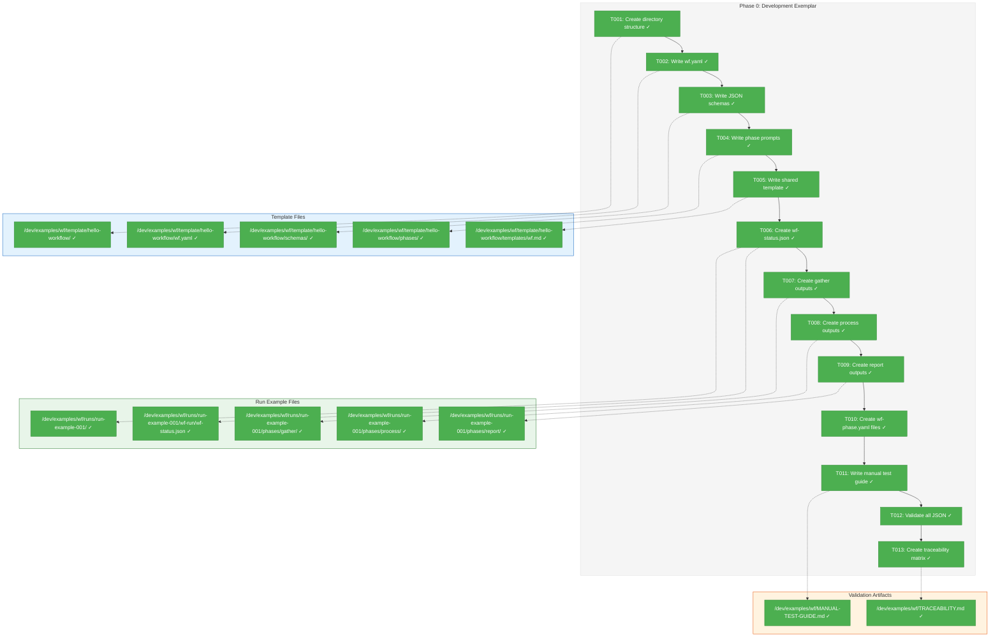
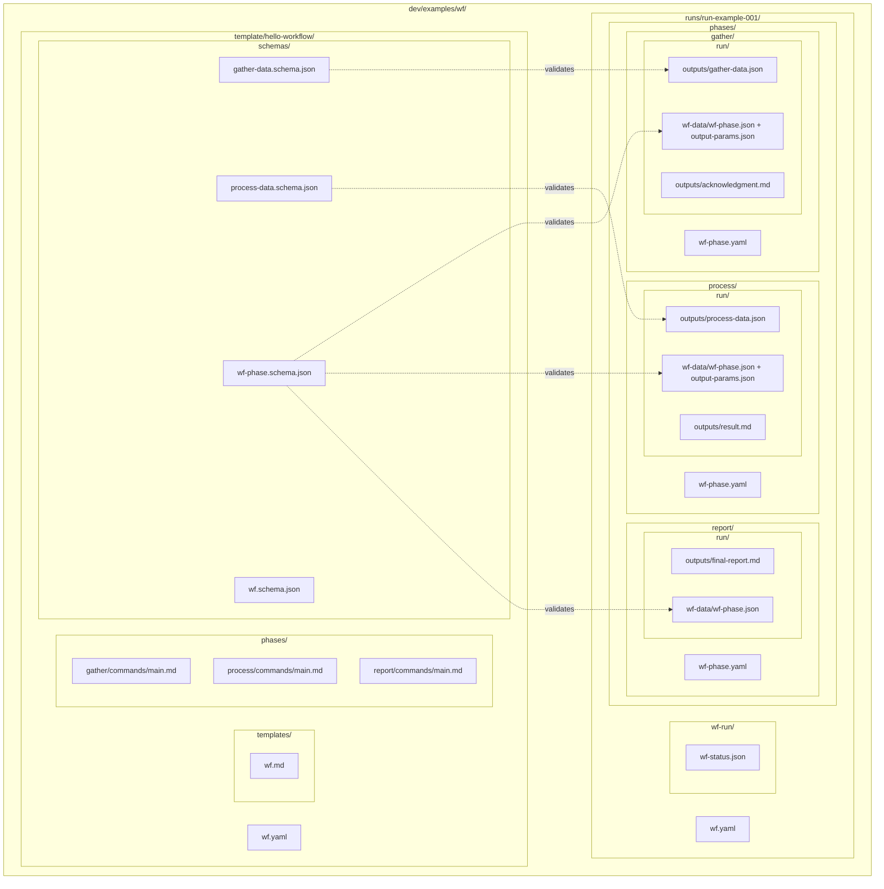
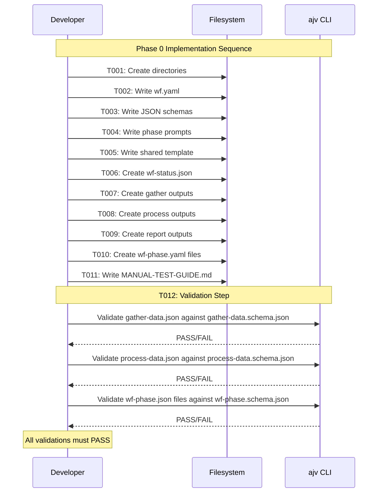
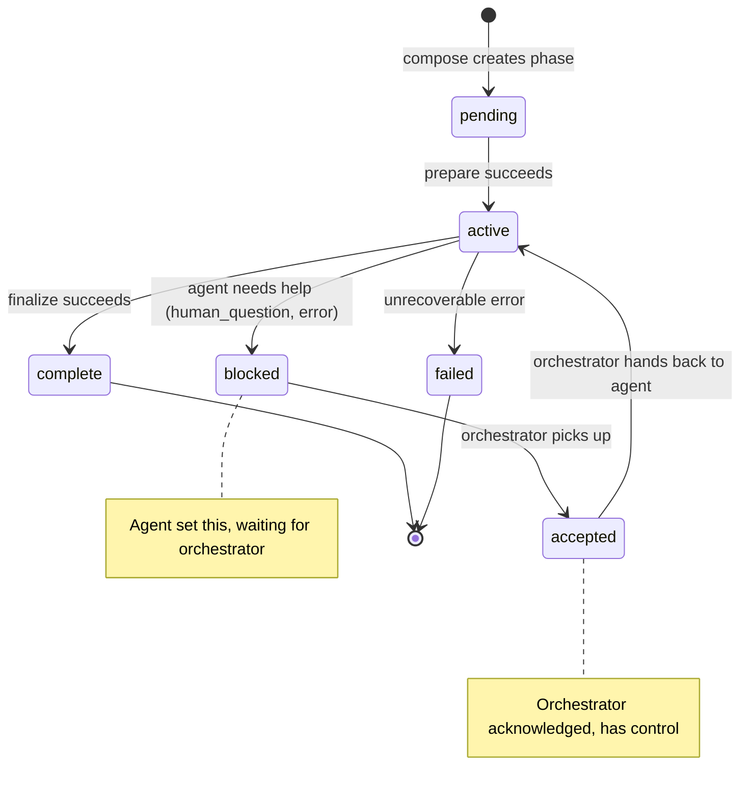
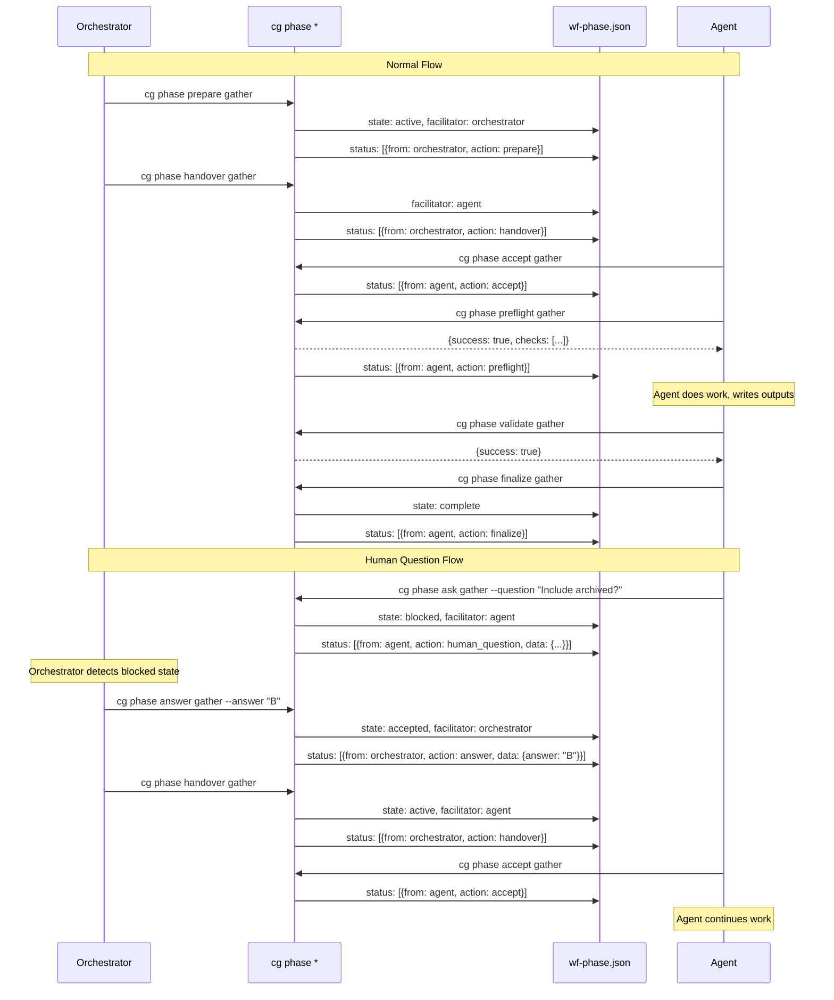

# Phase 0: Development Exemplar – Tasks & Alignment Brief

**Spec**: [../../wf-basics-spec.md](../../wf-basics-spec.md)
**Plan**: [../../wf-basics-plan.md](../../wf-basics-plan.md)
**Date**: 2026-01-21

---

## Executive Briefing

### Purpose
This phase creates the filesystem exemplar that serves as the foundation for ALL subsequent development and testing. The exemplar provides a concrete, working reference of both a workflow template and a completed workflow run that developers can inspect, test against, and use as fixtures.

### What We're Building
A complete `dev/examples/wf/` directory structure containing:
- **Template**: `hello-workflow/` with `wf.yaml`, JSON schemas, phase prompts, and shared templates
- **Completed Run**: `run-example-001/` with all three phases (gather, process, report) fully completed including outputs, data files, and workflow result files

### User Value
Developers and tests have a golden reference to validate against. The exemplar answers "what should a workflow look like?" concretely rather than abstractly. All subsequent code will create structures matching this exemplar, and tests will validate against it.

### Example
After Phase 0 completion:
```
dev/examples/wf/
├── template/hello-workflow/
│   ├── wf.yaml                    # 3-phase workflow definition
│   ├── schemas/                   # JSON Schemas for validation
│   ├── templates/wf.md            # Standard workflow prompt (copied to each phase's commands/)
│   └── phases/                    # Per-phase commands
│       ├── gather/commands/main.md
│       ├── process/commands/main.md
│       └── report/commands/main.md
└── runs/run-example-001/
    ├── wf.yaml                    # Workflow definition (copied from template)
    ├── wf-run/
    │   └── wf-status.json         # Workflow run metadata
    └── phases/
        ├── gather/
        │   ├── wf-phase.yaml      # Phase config (extracted from wf.yaml)
        │   ├── commands/          # Agent commands (copied from template)
        │   ├── schemas/           # Schemas (copied from template)
        │   └── run/
        │       ├── inputs/        # files/, data/, params.json
        │       ├── outputs/       # all outputs (schema validation per wf.yaml)
        │       └── wf-data/       # wf-phase.json, output-params.json
        ├── process/               # Same structure
        └── report/                # Same structure
```

---

## Objectives & Scope

### Objective
Create a complete, valid filesystem exemplar that demonstrates the workflow structure and serves as the testing foundation for Phases 1-5.

**Behavior Checklist (from Plan)**:
- [x] AC-01: Template at `dev/examples/wf/template/hello-workflow/` with wf.yaml, schemas/, templates/, phases/
- [x] AC-02: wf.yaml parses without errors, contains 3 phases: gather, process, report
- [x] AC-03: All schemas are valid JSON Schema Draft 2020-12
- [x] AC-04: Each phase in run-example-001 has complete structure: wf-phase.yaml, commands/, schemas/, run/ (with inputs/, outputs/, wf-data/)
- [x] AC-05: All JSON files pass schema validation

### Goals

- ✅ Create `dev/examples/wf/template/hello-workflow/` directory structure
- ✅ Write valid `wf.yaml` with 3 phases (gather, process, report)
- ✅ Create JSON Schema files (Draft 2020-12): wf.schema.json, wf-phase.schema.json, gather-data.schema.json, process-data.schema.json
- ✅ Create phase command files with agent instructions
- ✅ Create shared bootstrap template `templates/wf.md`
- ✅ Create complete run example at `runs/run-example-001/`
- ✅ Populate all phase outputs (outputs/, wf-data/)
- ✅ Create `wf-phase.yaml` for each phase
- ✅ Validate all JSON against schemas
- ✅ Document manual test steps
- ✅ Create spec-to-exemplar traceability matrix

### Non-Goals

- ❌ Writing TypeScript code (this is file creation only)
- ❌ Creating CLI commands (Phase 2+)
- ❌ Implementing services (Phase 1+)
- ❌ Creating complex multi-conditional workflows (simple 3-phase linear workflow only)
- ❌ Schema migration tooling (not needed for v1)
- ❌ Parameterized template variations (single hello-workflow template only)
- ❌ Run folder naming automation (manual naming: run-example-001)
- ❌ Error state exemplars (deferred per ADR-0002 ALT-007/ALT-008 YAGNI rationale - Phase 1+ tests use Fakes)

---

## Architecture Map

### Component Diagram
<!-- Status: grey=pending, orange=in-progress, green=completed, red=blocked -->
<!-- Updated by plan-6 during implementation -->



### Task-to-Component Mapping

<!-- Status: ⬜ Pending | 🟧 In Progress | ✅ Complete | 🔴 Blocked -->

| Task | Component(s) | Files | Status | Comment |
|------|-------------|-------|--------|---------|
| T001 | Directory Structure | /dev/examples/wf/** | ✅ Complete | Foundation for all other tasks |
| T002 | Workflow Definition | wf.yaml | ✅ Complete | 3 phases with inputs/outputs/params |
| T003 | JSON Schemas | schemas/*.schema.json | ✅ Complete | Draft 2020-12 compliance required |
| T004 | Phase Commands | phases/*/commands/main.md | ✅ Complete | Agent instructions per phase |
| T005 | Shared Template | templates/wf.md | ✅ Complete | Standard workflow prompt, copied to each phase's commands/ |
| T006 | Run Metadata | wf-run/wf-status.json | ✅ Complete | Workflow run tracking |
| T007 | Gather Outputs | gather/run/** | ✅ Complete | First phase complete outputs |
| T008 | Process Outputs | process/run/** | ✅ Complete | Second phase complete outputs |
| T009 | Report Outputs | report/run/** | ✅ Complete | Final phase complete outputs |
| T010 | Phase Configs | wf-phase.yaml files | ✅ Complete | Extracted from wf.yaml per phase |
| T011 | Test Guide | MANUAL-TEST-GUIDE.md | ✅ Complete | Step-by-step validation instructions |
| T012 | Schema Validation | N/A (validation step) | ✅ Complete | All JSON must pass schema validation |
| T013 | Traceability Matrix | TRACEABILITY.md | ✅ Complete | Maps spec ACs to exemplar files |

---

## Tasks

| Status | ID | Task | CS | Type | Dependencies | Path(s) | Validation | Subtasks | Notes |
|--------|------|------|-----|------|--------------|------------------|------------|----------|-------|
| [x] | T001 | Create `dev/examples/wf/` directory structure with template/ and runs/ subdirectories | 1 | Setup | – | `dev/examples/wf/`, `dev/examples/wf/template/`, `dev/examples/wf/runs/` | `ls -la dev/examples/wf/` shows template/ and runs/ | – | Foundation step |
| [x] | T002 | Write `wf.yaml` for hello-workflow template with 3 phases (gather, process, report) including inputs, outputs, output_parameters declarations | 2 | Core | T001 | `dev/examples/wf/template/hello-workflow/wf.yaml` | YAML parses without errors; contains phases: gather, process, report | – | Per spec; follow research-dossier format |
| [x] | T003 | Write JSON Schema files: `wf.schema.json`, `wf-phase.schema.json`, `gather-data.schema.json`, `process-data.schema.json` | 2 | Core | T002 | `dev/examples/wf/template/hello-workflow/schemas/wf.schema.json`, `dev/examples/wf/template/hello-workflow/schemas/wf-phase.schema.json`, `dev/examples/wf/template/hello-workflow/schemas/gather-data.schema.json`, `dev/examples/wf/template/hello-workflow/schemas/process-data.schema.json` | All schemas valid Draft 2020-12 (AC-03) | – | Use $schema: "https://json-schema.org/draft/2020-12/schema" |
| [x] | T004 | Write phase command files for gather, process, report phases | 1 | Core | T001 | `dev/examples/wf/template/hello-workflow/phases/gather/commands/main.md`, `dev/examples/wf/template/hello-workflow/phases/process/commands/main.md`, `dev/examples/wf/template/hello-workflow/phases/report/commands/main.md` | Each phase has commands/main.md with agent instructions | – | Simple placeholder instructions |
| [x] | T005 | Write shared template `templates/wf.md` with standard workflow prompt | 1 | Core | T001 | `dev/examples/wf/template/hello-workflow/templates/wf.md` | File exists with standard workflow prompt content | – | `wf.md` is copied to each phase's `commands/` alongside `main.md`; same content for every phase |
| [x] | T006 | Create `run-example-001/wf-run/wf-status.json` with workflow metadata | 1 | Core | T002 | `dev/examples/wf/runs/run-example-001/wf-run/wf-status.json` | Valid JSON with template ref, timestamp, phases array (AC-08 equivalent) | – | All phases marked 'complete' |
| [x] | T007 | Create gather phase complete outputs: outputs/acknowledgment.md, outputs/gather-data.json, wf-data/wf-phase.json, wf-data/output-params.json | 2 | Core | T003, T006 | `dev/examples/wf/runs/run-example-001/phases/gather/run/outputs/acknowledgment.md`, `dev/examples/wf/runs/run-example-001/phases/gather/run/outputs/gather-data.json`, `dev/examples/wf/runs/run-example-001/phases/gather/run/wf-data/wf-phase.json`, `dev/examples/wf/runs/run-example-001/phases/gather/run/wf-data/output-params.json` | All files exist, JSON validates against schemas | 001-subtask-message-communication | Must validate against gather-data.schema.json |
| [x] | T008 | Create process phase complete outputs: outputs/result.md, outputs/process-data.json, wf-data/wf-phase.json, wf-data/output-params.json | 2 | Core | T003, T007 | `dev/examples/wf/runs/run-example-001/phases/process/run/outputs/result.md`, `dev/examples/wf/runs/run-example-001/phases/process/run/outputs/process-data.json`, `dev/examples/wf/runs/run-example-001/phases/process/run/wf-data/wf-phase.json`, `dev/examples/wf/runs/run-example-001/phases/process/run/wf-data/output-params.json` | All files exist, JSON validates against schemas | 001-subtask-message-communication | Must validate against process-data.schema.json |
| [x] | T009 | Create report phase complete outputs: outputs/final-report.md, wf-data/wf-phase.json | 2 | Core | T003, T008 | `dev/examples/wf/runs/run-example-001/phases/report/run/outputs/final-report.md`, `dev/examples/wf/runs/run-example-001/phases/report/run/wf-data/wf-phase.json` | All files exist, JSON validates against wf-phase.schema.json | – | Report has no JSON outputs |
| [x] | T010 | Create `wf-phase.yaml` for each phase (gather, process, report) extracted from wf.yaml | 2 | Core | T002 | `dev/examples/wf/runs/run-example-001/phases/gather/wf-phase.yaml`, `dev/examples/wf/runs/run-example-001/phases/process/wf-phase.yaml`, `dev/examples/wf/runs/run-example-001/phases/report/wf-phase.yaml` | Each config has inputs, outputs, parameters from wf.yaml (AC-09) | – | Extract phase-specific config |
| [x] | T011 | Write manual test guide `MANUAL-TEST-GUIDE.md` with step-by-step validation instructions | 1 | Doc | T010 | `dev/examples/wf/MANUAL-TEST-GUIDE.md` | Guide includes YAML parse test, schema validation commands, expected outputs | – | References Commands Reference in plan |
| [x] | T012 | Validate all JSON files against their schemas using ajv CLI | 1 | Validation | T007, T008, T009 | N/A (validation step, no files created) | `npx ajv validate -s <schema> -d <file>` passes for ALL JSON files | – | See Commands Reference in plan for exact commands |
| [x] | T013 | Create spec-to-exemplar traceability matrix | 1 | Doc | T012 | `dev/examples/wf/TRACEABILITY.md` | Matrix maps each spec AC (AC-01 through AC-05) to exact exemplar file/line that satisfies it | – | Per didyouknow insight #1; exemplars are fungible - update matrix as implementation evolves |

---

## Alignment Brief

### Prior Phases Review

**N/A** - This is Phase 0, the first phase. There are no prior phases to review.

### Critical Findings Affecting This Phase

From plan § 3 "Critical Research Findings":

| Finding | What It Constrains | Tasks Affected |
|---------|-------------------|----------------|
| **Critical Discovery 09**: Development Exemplar as Testing Foundation | Exemplar must be complete and correct - ALL subsequent phases depend on it | ALL (T001-T012) |

**Critical Discovery 09 Details**:
- Problem: Filesystem-based system needs concrete exemplar to build and test against
- Impact: Without exemplar, developers can't see expected folder structure; tests have no golden reference
- This Phase IS the solution to Discovery 09

### ADR Decision Constraints

**ADR-0002: Exemplar-Driven Development** (Accepted)
- **Location**: `docs/adr/adr-0002-exemplar-driven-development.md`
- **Status**: Accepted (2026-01-21)
- **Affects**: Phase 0, All subsequent phases

| Decision | Constraint | Tasks Affected |
|----------|------------|----------------|
| Exemplars as golden references | Static committed files serve as canonical "ground truth" | T001-T012 (all) |
| Exemplar completeness | Must cover complete runs (partial/failed deferred) | T006-T009 |
| Bidirectional validation | Code validates exemplars AND exemplars validate code | T012 |
| Exemplar-first sequence | Create exemplars BEFORE implementation code | Phase 0 is this work |

**Implementation Notes from ADR-0002**:
- **IMP-004**: Exemplar creation is Phase 0 work for any filesystem-based feature. Implementation cannot begin until exemplars exist and pass schema validation.
- **IMP-005**: Test documentation (Test Doc format) must reference which exemplar the test validates against, creating traceability between tests and expected structures.
- **IMP-006**: When code changes break exemplar validation, developer must decide: update exemplar (expected change) or fix code (regression).

**Phase 0 Compliance**: This phase IS the implementation of ADR-0002's exemplar-first mandate. All tasks create the golden reference that subsequent phases validate against.

### Invariants & Guardrails

1. **JSON Schema Version**: All schemas MUST use Draft 2020-12 (`$schema: "https://json-schema.org/draft/2020-12/schema"`)
2. **File Encoding**: All files UTF-8
3. **YAML Version**: wf.yaml should be YAML 1.2 compatible (avoid YAML 1.1 quirks like "Norway problem")
4. **No Executable Code**: This phase creates static files only - no TypeScript, no scripts

### Inputs to Read

| Input | Location | Purpose |
|-------|----------|---------|
| Spec: Workflow Lifecycle diagram | wf-basics-spec.md § Workflow Lifecycle | Understand phase flow |
| Spec: AC-01 through AC-05 | wf-basics-spec.md § Acceptance Criteria | Validation requirements |
| Spec: Error Codes table | wf-basics-spec.md § Error Codes | Reference for wf-phase.json schema |
| Research: JSON Schema selection | research-dossier.md | AJV + Draft 2020-12 selected |
| Research: YAML parser selection | research-dossier.md | `yaml` package selected |

### Visual Alignment Aids

#### Mermaid Flow Diagram: Exemplar File Structure



#### Mermaid Sequence Diagram: Validation Order



### Test Plan

**Approach**: Manual validation in Phase 0; automated unit tests in Phase 1+

Phase 0 uses manual `ajv` CLI commands for initial validation. Phase 1 will add unit tests that validate exemplars against schemas as part of `just test`, ensuring exemplar integrity is verified on every test run.

**Phase 1 Expectation**: Create `test/unit/workflow/exemplar-validation.test.ts` with tests that:
- Validate all JSON files against their schemas
- Verify directory structure matches spec
- Confirm wf.yaml parses correctly
- Use Test Doc format documenting why exemplar validation matters

| Test | Method | Expected Result |
|------|--------|-----------------|
| YAML syntax | `cat dev/examples/wf/template/hello-workflow/wf.yaml | yq` | Parses without errors |
| Schema validity | `npx ajv compile -s <schema>` | All schemas compile |
| gather-data.json validation | `npx ajv validate -s gather-data.schema.json -d gather-data.json` | Valid |
| process-data.json validation | `npx ajv validate -s process-data.schema.json -d process-data.json` | Valid |
| wf-phase.json validation (x3) | `npx ajv validate -s wf-phase.schema.json -d wf-data/wf-phase.json` | Valid for all phases |
| Directory structure | `tree dev/examples/wf/` | Matches Architecture Map |

### Step-by-Step Implementation Outline

1. **T001**: Create `dev/examples/wf/` with `template/` and `runs/` subdirectories
2. **T002**: Write `wf.yaml` defining:
   - name: hello-workflow
   - version: "1.0.0"
   - phases: [gather, process, report]
   - Per phase: inputs, outputs, output_parameters
3. **T003**: Write 4 JSON schemas:
   - `wf.schema.json`: Workflow definition schema
   - `wf-phase.schema.json`: Phase result status schema
   - `gather-data.schema.json`: Gather phase data output schema
   - `process-data.schema.json`: Process phase data output schema
4. **T004**: Write agent prompts for each phase
5. **T005**: Write shared bootstrap template
6. **T006**: Create `wf-status.json` with complete workflow state
7. **T007**: Create gather phase outputs with valid data
8. **T008**: Create process phase outputs (depends on gather params)
9. **T009**: Create report phase outputs (final deliverable)
10. **T010**: Extract wf-phase.yaml from wf.yaml for each phase
11. **T011**: Document validation steps in MANUAL-TEST-GUIDE.md
12. **T012**: Run all validations to confirm correctness

### Commands to Run

```bash
# Directory creation (T001)
mkdir -p dev/examples/wf/template/hello-workflow/{schemas,templates,phases/{gather,process,report}/commands}
mkdir -p dev/examples/wf/runs/run-example-001/wf-run
mkdir -p dev/examples/wf/runs/run-example-001/phases/{gather,process,report}/{commands,schemas,run/{inputs/{files,data},outputs,wf-data}}

# Schema validation (T012)
# Install ajv-cli if not present
npm install -g ajv-cli

# Validate all JSON files
npx ajv validate -s dev/examples/wf/template/hello-workflow/schemas/gather-data.schema.json \
  -d dev/examples/wf/runs/run-example-001/phases/gather/run/outputs/gather-data.json

npx ajv validate -s dev/examples/wf/template/hello-workflow/schemas/process-data.schema.json \
  -d dev/examples/wf/runs/run-example-001/phases/process/run/outputs/process-data.json

npx ajv validate -s dev/examples/wf/template/hello-workflow/schemas/wf-phase.schema.json \
  -d dev/examples/wf/runs/run-example-001/phases/gather/run/wf-data/wf-phase.json

npx ajv validate -s dev/examples/wf/template/hello-workflow/schemas/wf-phase.schema.json \
  -d dev/examples/wf/runs/run-example-001/phases/process/run/wf-data/wf-phase.json

npx ajv validate -s dev/examples/wf/template/hello-workflow/schemas/wf-phase.schema.json \
  -d dev/examples/wf/runs/run-example-001/phases/report/run/wf-data/wf-phase.json

# YAML syntax check
cat dev/examples/wf/template/hello-workflow/wf.yaml | npx yaml

# Directory structure verification
tree dev/examples/wf/
```

### wf-phase.json Design

The `wf-data/` directory contains workflow system state. The primary file is `wf-phase.json` which tracks phase state and interaction history between agent and orchestrator.

#### Core Concepts

1. **Facilitator Model**: Control passes between `agent` ↔ `orchestrator`. Only one has control at a time.
2. **Status Log**: Append-only history of all interactions - provides audit trail and enables multi-turn conversations.
3. **CLI-Only Mutations**: Agents and orchestrators NEVER write to wf files directly. All mutations go through `cg phase *` commands or MCP tools.

#### wf-data/ Directory Contents

```
run/wf-data/
├── wf-phase.json      # Phase state + interaction history
└── output-params.json # Extracted parameters (on finalize) - separate for jq simplicity
```

#### wf-phase.json Schema

```json
{
  "phase": "gather",
  "facilitator": "agent | orchestrator",
  "state": "pending | active | blocked | accepted | complete | failed",
  "status": [
    {
      "timestamp": "ISO-8601",
      "from": "agent | orchestrator",
      "action": "action_type",
      "comment": "Human-readable description",
      "data": { "arbitrary": "payload" }
    }
  ]
}
```

#### State Machine



#### Facilitator Flow Sequence



#### Action Types

| Action | From | Description | State After |
|--------|------|-------------|-------------|
| `prepare` | orchestrator | Phase prepared, inputs resolved | active |
| `handover` | orchestrator | Control given to agent | active |
| `accept` | agent | Agent acknowledges control | (unchanged) |
| `preflight` | agent | Agent verified ready to work | (unchanged) |
| `human_question` | agent | Agent needs human input | blocked |
| `error` | agent | Error occurred (code in data) | blocked |
| `answer` | orchestrator | Human response to question | accepted |
| `handover` | orchestrator | Control returned to agent | active |
| `finalize` | agent | Phase finalized | complete |

#### Example: Complete wf-phase.json

```json
{
  "phase": "gather",
  "facilitator": "orchestrator",
  "state": "complete",
  "status": [
    {
      "timestamp": "2026-01-21T10:00:00Z",
      "from": "orchestrator",
      "action": "prepare",
      "comment": "Phase prepared, inputs resolved"
    },
    {
      "timestamp": "2026-01-21T10:00:01Z",
      "from": "orchestrator",
      "action": "handover",
      "comment": "Control passed to agent"
    },
    {
      "timestamp": "2026-01-21T10:00:02Z",
      "from": "agent",
      "action": "accept",
      "comment": "Agent acknowledges control"
    },
    {
      "timestamp": "2026-01-21T10:00:03Z",
      "from": "agent",
      "action": "preflight",
      "comment": "Preflight passed: config OK, inputs OK, params resolved"
    },
    {
      "timestamp": "2026-01-21T10:05:00Z",
      "from": "agent",
      "action": "human_question",
      "comment": "Need clarification on scope",
      "data": {
        "question": "Should I include archived items?",
        "options": {
          "A": "Yes, include all items",
          "B": "No, active items only"
        }
      }
    },
    {
      "timestamp": "2026-01-21T10:10:00Z",
      "from": "orchestrator",
      "action": "answer",
      "comment": "Human response received",
      "data": { "answer": "B", "note": "Active only for now" }
    },
    {
      "timestamp": "2026-01-21T10:10:01Z",
      "from": "orchestrator",
      "action": "handover",
      "comment": "Control returned to agent"
    },
    {
      "timestamp": "2026-01-21T10:10:02Z",
      "from": "agent",
      "action": "accept",
      "comment": "Acknowledged, continuing with active items only"
    },
    {
      "timestamp": "2026-01-21T10:15:00Z",
      "from": "agent",
      "action": "finalize",
      "comment": "Phase complete"
    }
  ]
}
```

#### CLI Commands

**Current Scope (Phase 1-4):**
```bash
cg phase prepare <phase> --run-dir <run>   # Sets state: active, facilitator: orchestrator
cg phase handover <phase> --run-dir <run>  # Sets facilitator: agent (orchestrator hands over)
cg phase accept <phase> --run-dir <run>    # Agent acknowledges control, logged
cg phase preflight <phase> --run-dir <run> # Agent verifies ready (requires accept first!)
cg phase validate <phase> --run-dir <run>  # Read-only, checks outputs against schemas
cg phase finalize <phase> --run-dir <run>  # Sets state: complete
```

**Preflight Checks (Two-Phase Pattern from enhance project):**
- **Phase 1 (Fast)**: Config exists, commands/ files exist, user-provided inputs exist
- **Phase 2 (Upstream)**: Prior phases finalized, from_phase files exist, parameters can resolve
- **Prerequisite**: If accept not called, returns error: "Run `cg phase accept` first"
- **Returns**: Structured JSON with actionable errors if preflight fails

**Future Scope (OOS):**
```bash
cg phase ask <phase> --run-dir <run> --question "..." --options "A:...,B:..."
cg phase answer <phase> --run-dir <run> --answer "B" --note "..."
cg phase error <phase> --run-dir <run> --code E001 --message "..."
```

#### Key Design Decisions

1. **No "system" actor**: Only `agent` and `orchestrator` in the `from` field
2. **Blocked → Accepted flow**: When agent sets `blocked`, orchestrator picks it up and sets `accepted` to acknowledge
3. **output-params.json separate**: Kept separate from wf-phase.json for `jq` simplicity and single-purpose files
4. **Validation not logged**: `cg phase validate` is a read-only operation, no status entry created
5. **Simple parameter resolution**: Dot-notation lookups only (e.g., `items.length`) - no expressions or computed values

---

### Risks/Unknowns

| Risk | Severity | Mitigation |
|------|----------|------------|
| Schema design may need adjustment in later phases | Medium | Design schemas flexibly; they can evolve |
| ajv-cli not installed globally | Low | Include installation command in guide |
| YAML 1.2 vs 1.1 parsing differences | Low | Test with `yaml` package behavior |
| Exemplar drift before Phase 1 tests | Low | Manual validation in Phase 0; unit tests added in Phase 1 |

### Technical Debt

| ID | Description | Rationale | Future Phase | Reference |
|----|-------------|-----------|--------------|-----------|
| TD-001 | Add failure state exemplars (run-missing-input-001, run-schema-failure-001, etc.) | Deferred per YAGNI - Phase 1+ tests use Fakes for error scenarios | Phase 2+ when integration tests need golden failure references | ADR-0002 Decision Point 2, ALT-007/ALT-008 |
| TD-002 | Add partial completion exemplars (run-gather-complete-001 with process/report pending) | Deferred per YAGNI - current ACs only need success path | When testing phase state transitions | ADR-0002 Decision Point 2 |
| TD-003 | CI pipeline to block merge on exemplar validation failure | IMP-002 requires CI validation; no CI infrastructure exists yet | When CI/CD infrastructure is established | ADR-0002 IMP-002 |

**Note**: ADR-0002 mandates exemplars for "complete, partial, and failed states." The YAGNI principle (ALT-007/ALT-008) defers partial/failed exemplars until proven necessary. This is intentional scope management, not an oversight.

### Ready Check

- [x] ADR-0002 constraints documented above
- [x] **ADR-0002 reviewed** (docs/adr/adr-0002-exemplar-driven-development.md)
- [x] No prior phases to review (Phase 0)
- [x] All acceptance criteria mapped to tasks
- [x] Relative paths specified for all files
- [x] Validation commands documented
- [x] **IMPLEMENTATION COMPLETE** (2026-01-21)

---

## Phase Footnote Stubs

_This section will be populated during implementation by plan-6a-update-progress._

| Footnote | Date | Description |
|----------|------|-------------|
| | | |

---

## Evidence Artifacts

Implementation will produce:
- **Execution Log**: `docs/plans/003-wf-basics/tasks/phase-0-development-exemplar/execution.log.md`
- **All files listed in Path(s) column of Tasks table**

---

## Discoveries & Learnings

_Populated during implementation by plan-6. Log anything of interest to your future self._

| Date | Task | Type | Discovery | Resolution | References |
|------|------|------|-----------|------------|------------|
| | | | | | |

**Types**: `gotcha` | `research-needed` | `unexpected-behavior` | `workaround` | `decision` | `debt` | `insight`

**What to log**:
- Things that didn't work as expected
- External research that was required
- Implementation troubles and how they were resolved
- Gotchas and edge cases discovered
- Decisions made during implementation
- Technical debt introduced (and why)
- Insights that future phases should know about

_See also: `execution.log.md` for detailed narrative._

---

## Directory Layout

```
docs/plans/003-wf-basics/
├── wf-basics-spec.md
├── wf-basics-plan.md
├── research-dossier.md
└── tasks/
    └── phase-0-development-exemplar/
        ├── tasks.md                    # This file
        └── execution.log.md            # Created by /plan-6
```

---

**Phase Status**: ✅ COMPLETE (2026-01-21)
**Next Step**: Run `/plan-7-code-review --phase "Phase 0: Development Exemplar" --plan "docs/plans/003-wf-basics/wf-basics-plan.md"` for code review, or proceed to Phase 1.
