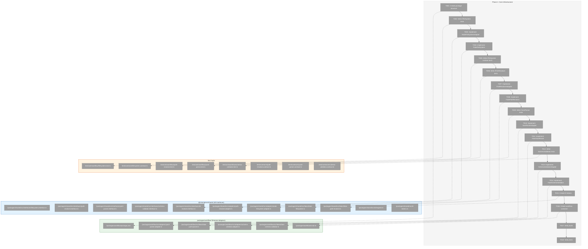
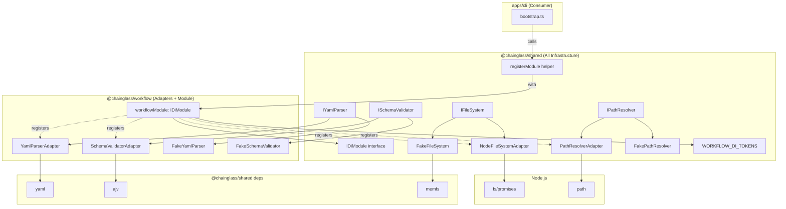
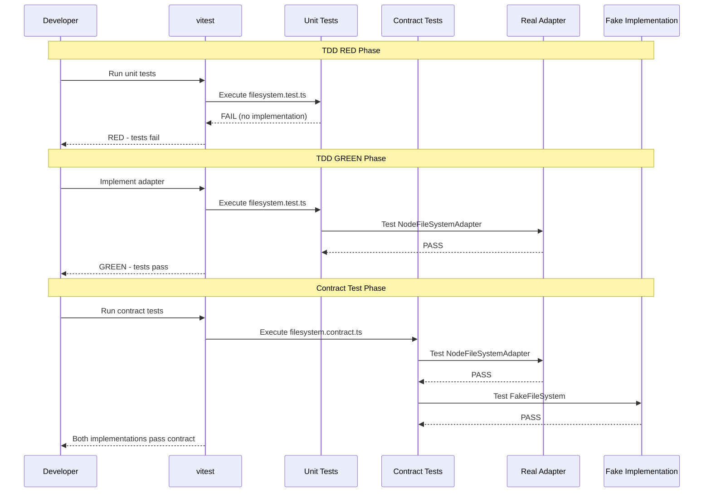

# Phase 1: Core Infrastructure – Tasks & Alignment Brief

**Spec**: [../../wf-basics-spec.md](../../wf-basics-spec.md)
**Plan**: [../../wf-basics-plan.md](../../wf-basics-plan.md)
**Date**: 2026-01-21

---

## Executive Briefing

### Purpose
This phase builds the foundational infrastructure that ALL subsequent workflow phases depend on. It establishes the core interfaces, adapters, and fakes for filesystem operations, path resolution, YAML parsing, and JSON Schema validation. Without these building blocks, no workflow services can be implemented.

### What We're Building
Infrastructure split across two packages:

**@chainglass/shared** (all infrastructure):
- **Interfaces**: `IFileSystem`, `IPathResolver`, `IYamlParser`, `ISchemaValidator`
- **Adapters**: `NodeFileSystemAdapter`, `PathResolverAdapter`
- **Fakes**: `FakeFileSystem`, `FakePathResolver`
- **DI Tokens**: `WORKFLOW_DI_TOKENS`
- **Dependencies**: `yaml`, `ajv`, `memfs` (dev)

**@chainglass/workflow** (workflow-specific implementations):
- **Adapters**: `YamlParserAdapter`, `SchemaValidatorAdapter`
- **Fakes**: `FakeYamlParser`, `FakeSchemaValidator`
- **DI Container**: `createWorkflowContainer()`

### User Value
Developers get a clean, testable foundation for building workflow services. The `FakeFileSystem` enables fast, isolated unit tests without disk I/O. The `IPathResolver` prevents directory traversal security vulnerabilities. The YAML/JSON Schema adapters provide actionable error messages with line/column information for agent consumption.

### Example
After Phase 1 completion:
```typescript
// Production code uses real adapters
const fs = container.resolve<IFileSystem>(WORKFLOW_DI_TOKENS.FILE_SYSTEM);
const content = await fs.readFile('/path/to/wf.yaml');

// Test code uses fakes for isolation
const fakeFs = new FakeFileSystem();
fakeFs.setFile('/test/wf.yaml', 'name: test-workflow');
const content = await fakeFs.readFile('/test/wf.yaml');
// → 'name: test-workflow'
```

---

## Objectives & Scope

### Objective
Create the foundational infrastructure for the workflow package, enabling all subsequent phases to build on tested, reliable adapters and fakes.

**Behavior Checklist (from Plan § Phase 1 Acceptance Criteria)**:
- [ ] `packages/workflow/` builds without errors
- [ ] All interface contracts have tests
- [ ] All adapters pass contract tests
- [ ] All fakes pass same contract tests
- [ ] DI container resolves all adapters correctly
- [ ] Security: Path traversal attacks are blocked

### Goals

- ✅ Create `packages/workflow/` package structure following `packages/shared/` pattern
- ✅ Implement `IFileSystem` interface with `NodeFileSystemAdapter` and `FakeFileSystem`
- ✅ Implement `IPathResolver` interface with `PathResolverAdapter` and `FakePathResolver`
- ✅ Implement `IYamlParser` interface with `YamlParserAdapter` and `FakeYamlParser`
- ✅ Implement `ISchemaValidator` interface with `SchemaValidatorAdapter` and `FakeSchemaValidator`
- ✅ Create contract tests for all interfaces (run against both real and fake implementations)
- ✅ Define `WORKFLOW_DI_TOKENS` and container registration
- ✅ Verify package builds and tests pass

### Non-Goals

- ❌ Implementing workflow services (Phase 2+)
- ❌ Implementing output adapters (Phase 1a)
- ❌ Creating CLI commands (Phase 2+)
- ❌ Creating MCP tools (Phase 5)
- ❌ Complex YAML features (anchors, aliases) – simple parsing only
- ❌ Custom JSON Schema formats – use Draft 2020-12 built-in formats
- ❌ Cross-platform path handling edge cases (Windows paths) – Unix-first
- ❌ File watching or change detection – read/write operations only

---

## Architecture Map

### Component Diagram
<!-- Status: grey=pending, orange=in-progress, green=completed, red=blocked -->
<!-- Updated by plan-6 during implementation -->



### Task-to-Component Mapping

<!-- Status: ⬜ Pending | 🟧 In Progress | ✅ Complete | 🔴 Blocked -->

| Task | Component(s) | Files | Status | Comment |
|------|-------------|-------|--------|---------|
| T001 | Package Setup | packages/workflow/* | ⬜ Pending | Foundation: package.json, tsconfig, src/index.ts |
| T002 | IFileSystem Tests | test/unit/workflow/filesystem.test.ts | ⬜ Pending | TDD: tests first |
| T003 | NodeFileSystemAdapter | packages/shared/src/adapters/node-filesystem.adapter.ts | ⬜ Pending | Real fs implementation |
| T004 | FakeFileSystem | packages/shared/src/fakes/fake-filesystem.ts, docs/how/dev/memfs-guide.md | ⬜ Pending | Wrap memfs package; create dev guide |
| T005 | IFileSystem Contract | test/contracts/filesystem.contract.ts | ⬜ Pending | Run against both impls |
| T006 | IPathResolver Tests | test/unit/workflow/path-resolver.test.ts | ⬜ Pending | TDD: tests first |
| T007 | PathResolverAdapter | packages/shared/src/adapters/path-resolver.adapter.ts | ⬜ Pending | Path validation with security |
| T008 | FakePathResolver | packages/shared/src/fakes/fake-path-resolver.ts | ⬜ Pending | Configurable fake for tests |
| T009 | IYamlParser Tests | test/unit/workflow/yaml-parser.test.ts | ⬜ Pending | TDD: tests first; interface in shared |
| T010 | YamlParserAdapter | packages/workflow/src/adapters/yaml-parser.adapter.ts, packages/shared/src/interfaces/yaml-parser.interface.ts | ⬜ Pending | yaml package with location info |
| T011 | FakeYamlParser | packages/workflow/src/fakes/fake-yaml-parser.ts | ⬜ Pending | Preset responses for tests |
| T012 | ISchemaValidator Tests | test/unit/workflow/schema-validator.test.ts | ⬜ Pending | TDD: tests first; interface in shared |
| T013 | SchemaValidatorAdapter | packages/workflow/src/adapters/schema-validator.adapter.ts, packages/shared/src/interfaces/schema-validator.interface.ts | ⬜ Pending | AJV with actionable errors |
| T014 | FakeSchemaValidator | packages/workflow/src/fakes/fake-schema-validator.ts | ⬜ Pending | Configurable validation results |
| T015 | IDiModule + DI Tokens | packages/shared/src/interfaces/di-module.interface.ts, packages/shared/src/di/register.ts, packages/shared/src/di-tokens.ts | ⬜ Pending | IDiModule interface, registerModule() helper, WORKFLOW_DI_TOKENS |
| T016 | Workflow Module | packages/workflow/src/di.ts | ⬜ Pending | workflowModule: IDiModule |
| T017 | Build Verification | N/A (verification step) | ⬜ Pending | pnpm -F @chainglass/workflow build |
| T018 | Test Verification | N/A (verification step) | ⬜ Pending | pnpm -F @chainglass/workflow test |

---

## Tasks

| Status | ID | Task | CS | Type | Dependencies | Absolute Path(s) | Validation | Subtasks | Notes |
|--------|------|------|-----|------|--------------|------------------|------------|----------|-------|
| [ ] | T001 | Create `packages/workflow/` package structure with package.json, tsconfig.json, src/index.ts following `packages/shared/` pattern | 2 | Setup | – | `/Users/jordanknight/substrate/chainglass-004-config/packages/workflow/package.json`, `/Users/jordanknight/substrate/chainglass-004-config/packages/workflow/tsconfig.json`, `/Users/jordanknight/substrate/chainglass-004-config/packages/workflow/src/index.ts`, `/Users/jordanknight/substrate/chainglass-004-config/packages/workflow/src/interfaces/index.ts`, `/Users/jordanknight/substrate/chainglass-004-config/packages/workflow/src/adapters/index.ts`, `/Users/jordanknight/substrate/chainglass-004-config/packages/workflow/src/fakes/index.ts` | Package builds with `pnpm -F @chainglass/workflow build` | – | Per Discovery 12 |
| [ ] | T002 | Write unit tests for `IFileSystem` interface covering exists, readFile, writeFile, mkdir, copyFile, readDir, stat | 2 | Test | T001 | `/Users/jordanknight/substrate/chainglass-004-config/test/unit/workflow/filesystem.test.ts` | Tests fail (TDD RED) | – | Test Doc format required |
| [ ] | T003 | Implement `NodeFileSystemAdapter` using Node.js fs/promises | 2 | Core | T002 | `/Users/jordanknight/substrate/chainglass-004-config/packages/shared/src/adapters/node-filesystem.adapter.ts`, `/Users/jordanknight/substrate/chainglass-004-config/packages/shared/src/interfaces/filesystem.interface.ts` | All T002 tests pass (TDD GREEN) | – | Per Discovery 04 |
| [ ] | T004 | Implement `FakeFileSystem` using `memfs` package wrapped to implement `IFileSystem` interface, with test helpers (setFile, getFile, simulateError). Research memfs via Perplexity and create `docs/how/dev/memfs-guide.md` | 2 | Core | T003 | `/Users/jordanknight/substrate/chainglass-004-config/packages/shared/src/fakes/fake-filesystem.ts`, `/Users/jordanknight/substrate/chainglass-004-config/docs/how/dev/memfs-guide.md` | Fake passes same tests as real adapter | – | Use memfs npm package; create dev guide |
| [ ] | T005 | Write contract tests for `IFileSystem` that run against both NodeFileSystemAdapter and FakeFileSystem | 2 | Test | T004 | `/Users/jordanknight/substrate/chainglass-004-config/test/contracts/filesystem.contract.ts`, `/Users/jordanknight/substrate/chainglass-004-config/test/contracts/filesystem.contract.test.ts` | Both implementations pass contract tests | – | Follow logger.contract.ts pattern exactly |
| [ ] | T006 | Write unit tests for `IPathResolver` interface covering resolvePath, path traversal security | 2 | Test | T001 | `/Users/jordanknight/substrate/chainglass-004-config/test/unit/workflow/path-resolver.test.ts` | Tests fail (TDD RED) | – | Test Doc format required |
| [ ] | T007 | Implement `PathResolverAdapter` with directory traversal prevention (throws PathSecurityError) | 2 | Core | T006 | `/Users/jordanknight/substrate/chainglass-004-config/packages/shared/src/adapters/path-resolver.adapter.ts`, `/Users/jordanknight/substrate/chainglass-004-config/packages/shared/src/interfaces/path-resolver.interface.ts` | All T006 tests pass, `../../../etc/passwd` throws | – | Per Discovery 11 |
| [ ] | T008 | Implement `FakePathResolver` with configurable behavior for testing | 1 | Core | T007 | `/Users/jordanknight/substrate/chainglass-004-config/packages/shared/src/fakes/fake-path-resolver.ts` | Contract tests pass | – | Simple fake |
| [ ] | T009 | Write unit tests for `IYamlParser` interface covering parse success, parse error with line/column | 2 | Test | T001 | `/Users/jordanknight/substrate/chainglass-004-config/test/unit/workflow/yaml-parser.test.ts` | Tests fail (TDD RED) | – | Per Discovery 06 |
| [ ] | T010 | Implement `YamlParserAdapter` using yaml package with `keepCstNodes: true` for location info | 2 | Core | T009 | `/Users/jordanknight/substrate/chainglass-004-config/packages/workflow/src/adapters/yaml-parser.adapter.ts`, `/Users/jordanknight/substrate/chainglass-004-config/packages/shared/src/interfaces/yaml-parser.interface.ts` | All T009 tests pass, errors include line/column | – | Per Discovery 06; interface in shared |
| [ ] | T011 | Implement `FakeYamlParser` with configurable parse results and error simulation | 1 | Core | T010 | `/Users/jordanknight/substrate/chainglass-004-config/packages/workflow/src/fakes/fake-yaml-parser.ts` | Contract tests pass | – | Simple fake |
| [ ] | T012 | Write unit tests for `ISchemaValidator` interface covering validate success, actionable error messages | 2 | Test | T001 | `/Users/jordanknight/substrate/chainglass-004-config/test/unit/workflow/schema-validator.test.ts` | Tests fail (TDD RED) | – | Per Discovery 07 |
| [ ] | T013 | Implement `SchemaValidatorAdapter` using AJV (Ajv2020) with actionable error formatting | 3 | Core | T012 | `/Users/jordanknight/substrate/chainglass-004-config/packages/workflow/src/adapters/schema-validator.adapter.ts`, `/Users/jordanknight/substrate/chainglass-004-config/packages/shared/src/interfaces/schema-validator.interface.ts` | All T012 tests pass, errors include path/expected/actual | – | Per Discovery 07; interface in shared |
| [ ] | T014 | Implement `FakeSchemaValidator` with configurable validation results for testing | 1 | Core | T013 | `/Users/jordanknight/substrate/chainglass-004-config/packages/workflow/src/fakes/fake-schema-validator.ts` | Contract tests pass | – | Simple fake |
| [ ] | T015 | Create `IDiModule` interface, `registerModule()` helper, and `WORKFLOW_DI_TOKENS` in shared package | 2 | Core | T001 | `/Users/jordanknight/substrate/chainglass-004-config/packages/shared/src/interfaces/di-module.interface.ts`, `/Users/jordanknight/substrate/chainglass-004-config/packages/shared/src/di/register.ts`, `/Users/jordanknight/substrate/chainglass-004-config/packages/shared/src/di-tokens.ts` | IDiModule and helpers exported from @chainglass/shared | – | New DI module pattern |
| [ ] | T016 | Create `workflowModule: IDiModule` in workflow package that registers all adapters | 2 | Core | T015 | `/Users/jordanknight/substrate/chainglass-004-config/packages/workflow/src/di.ts` | `registerModule(container, workflowModule)` registers all services | – | Implements IDiModule |
| [ ] | T017 | Verify `pnpm -F @chainglass/workflow build` succeeds without errors | 1 | Validation | T016 | N/A (verification step) | Build completes successfully | – | Integration check |
| [ ] | T018 | Verify `pnpm -F @chainglass/workflow test` passes all tests | 1 | Validation | T017 | N/A (verification step) | All tests pass | – | Integration check |

---

## Alignment Brief

### Prior Phases Review

#### Phase 0: Development Exemplar (COMPLETE - 2026-01-21)

**A. Deliverables Created**:
| Deliverable | Path |
|-------------|------|
| Template directory structure | `/Users/jordanknight/substrate/chainglass-004-config/dev/examples/wf/template/hello-workflow/` |
| Workflow definition | `/Users/jordanknight/substrate/chainglass-004-config/dev/examples/wf/template/hello-workflow/wf.yaml` |
| JSON Schemas (4 files) | `/Users/jordanknight/substrate/chainglass-004-config/dev/examples/wf/template/hello-workflow/schemas/*.schema.json` |
| Phase commands | `/Users/jordanknight/substrate/chainglass-004-config/dev/examples/wf/template/hello-workflow/phases/*/commands/main.md` |
| Shared template (standard workflow prompt) | `/Users/jordanknight/substrate/chainglass-004-config/dev/examples/wf/template/hello-workflow/templates/wf.md` |
| Run example | `/Users/jordanknight/substrate/chainglass-004-config/dev/examples/wf/runs/run-example-001/` |
| Run status | `/Users/jordanknight/substrate/chainglass-004-config/dev/examples/wf/runs/run-example-001/wf-run/wf-status.json` |
| Gather phase outputs | `/Users/jordanknight/substrate/chainglass-004-config/dev/examples/wf/runs/run-example-001/phases/gather/run/` |
| Process phase outputs | `/Users/jordanknight/substrate/chainglass-004-config/dev/examples/wf/runs/run-example-001/phases/process/run/` |
| Report phase outputs | `/Users/jordanknight/substrate/chainglass-004-config/dev/examples/wf/runs/run-example-001/phases/report/run/` |
| Manual test guide | `/Users/jordanknight/substrate/chainglass-004-config/dev/examples/wf/MANUAL-TEST-GUIDE.md` |
| Traceability matrix | `/Users/jordanknight/substrate/chainglass-004-config/dev/examples/wf/TRACEABILITY.md` |

**B. Lessons Learned**:
- All JSON files validated successfully against schemas using `ajv --spec=draft2020 --strict=false`
- The `--strict=false` flag is needed for AJV due to date-time format warnings (informational, not errors)
- JSON Schema Draft 2020-12 works well with `$schema: "https://json-schema.org/draft/2020-12/schema"`

**C. Technical Discoveries**:
- AJV `--strict=false` needed because AJV doesn't validate date-time format by default (warning only)
- `ajv-cli` must be installed globally or via npx for schema validation
- YAML parsing with `npx yaml` works for syntax validation

**D. Dependencies Exported**:
| Export | For Phase(s) |
|--------|--------------|
| `dev/examples/wf/template/hello-workflow/schemas/*.schema.json` | Phase 1+ (test fixtures) |
| `dev/examples/wf/runs/run-example-001/` structure | Phase 1+ (test fixtures, integration tests) |
| wf-phase.json structure with facilitator model | Phase 1 (ISchemaValidator test data) |
| gather-data.json, process-data.json structure | Phase 1 (schema validation tests) |

**E. Critical Findings Applied**:
- Phase 0 IS the implementation of Critical Discovery 09 (exemplar as testing foundation)
- ADR-0002 (Exemplar-Driven Development) fully implemented

**F. Incomplete/Blocked Items**: None

**G. Test Infrastructure**:
- Manual test guide created (`MANUAL-TEST-GUIDE.md`)
- AJV CLI commands documented for validation
- No automated tests yet (Phase 1 adds unit tests)

**H. Technical Debt**:
| ID | Description | Future Phase |
|----|-------------|--------------|
| TD-001 | Add failure state exemplars | Phase 2+ |
| TD-002 | Add partial completion exemplars | Phase 2+ |
| TD-003 | CI pipeline for exemplar validation | When CI established |

**I. Architectural Decisions**:
- Facilitator model: `agent` ↔ `orchestrator` with status log
- State machine: pending → active → complete (with blocked/accepted for human questions)
- Parameter resolution: simple dot-notation only (no expressions)
- Separate files: wf-phase.json for state, output-params.json for extracted parameters

**J. Scope Changes**: None

**K. Key Log References**:
- See `docs/plans/003-wf-basics/tasks/phase-0-development-exemplar/execution.log.md` for complete implementation narrative

### Critical Findings Affecting This Phase

From plan § 3 "Critical Research Findings":

| Finding | What It Constrains | Tasks Affected |
|---------|-------------------|----------------|
| **Critical Discovery 01**: Output Adapter Architecture | Services return domain objects, adapters format output | Phase 1a (not this phase) |
| **Critical Discovery 04**: IFileSystem for Test Isolation | All services use IFileSystem, never fs directly | T002-T005 |
| **Critical Discovery 05**: DI Token Naming Pattern | Use WORKFLOW_DI_TOKENS, useFactory for registration | T015-T016 |
| **Critical Discovery 06**: YAML Source Location | Use `keepCstNodes: true` for line/column in errors | T009-T011 |
| **Critical Discovery 07**: Actionable JSON Schema Errors | Transform AJV errors to actionable messages | T012-T014 |
| **Critical Discovery 08**: Contract Tests for Fakes | Run same tests against real and fake | T005, all contract tests |
| **Critical Discovery 10**: Service Implementation Order | Implement in dependency order | Task ordering T001→T018 |
| **Critical Discovery 11**: Path Security | Validate paths to prevent traversal | T006-T008 |
| **Critical Discovery 12**: Package Integration | Follow packages/shared pattern | T001 |

### ADR Decision Constraints

**ADR-0001: MCP Tool Design Patterns** (Affects Phase 5, not this phase)
- Not directly applicable to Phase 1 infrastructure

**ADR-0002: Exemplar-Driven Development** (Accepted)
- Constraint: Use exemplar files from Phase 0 as test fixtures
- Addressed by: All tests can reference `dev/examples/wf/` for realistic test data
- Per IMP-005: Test Doc format must reference which exemplar tests validate against

### Invariants & Guardrails

1. **TDD Required**: Write tests BEFORE implementation (RED-GREEN-REFACTOR)
2. **Fakes Only**: No `vi.mock()` or `jest.mock()` - use Fake implementations
3. **Contract Tests**: All interfaces must have contract tests running against both real and fake
4. **Test Doc Format**: All tests must include Test Doc comment block
5. **Security**: IPathResolver MUST prevent directory traversal attacks
6. **No Console**: Adapters must use ILogger, not console.log

### Inputs to Read

| Input | Location | Purpose |
|-------|----------|---------|
| Shared package structure | `/Users/jordanknight/substrate/chainglass-004-config/packages/shared/` | Pattern to follow |
| Logger contract tests | `/Users/jordanknight/substrate/chainglass-004-config/test/contracts/logger.contract.ts` | Contract test pattern |
| Exemplar schemas | `/Users/jordanknight/substrate/chainglass-004-config/dev/examples/wf/template/hello-workflow/schemas/` | Test fixtures |
| Exemplar run data | `/Users/jordanknight/substrate/chainglass-004-config/dev/examples/wf/runs/run-example-001/` | Integration test fixtures |

### Visual Alignment Aids

#### Mermaid Flow Diagram: Interface Dependencies



#### Mermaid Sequence Diagram: Test Execution Flow



### Test Plan

**Approach**: Full TDD with Contract Tests (per project testing philosophy)

**Test Organization**:
```
test/
├── unit/
│   └── workflow/
│       ├── filesystem.test.ts      # NodeFileSystemAdapter unit tests
│       ├── path-resolver.test.ts   # PathResolverAdapter unit tests
│       ├── yaml-parser.test.ts     # YamlParserAdapter unit tests
│       └── schema-validator.test.ts # SchemaValidatorAdapter unit tests
└── contracts/
    ├── filesystem.contract.ts       # IFileSystem contract
    ├── filesystem.contract.test.ts  # Runs contract against both impls
    ├── path-resolver.contract.ts    # IPathResolver contract
    ├── yaml-parser.contract.ts      # IYamlParser contract
    └── schema-validator.contract.ts # ISchemaValidator contract
```

**Test Coverage Requirements**:

| Interface | Happy Path | Error Cases | Security |
|-----------|------------|-------------|----------|
| IFileSystem | readFile, writeFile, exists, mkdir, copyFile, readDir, stat | File not found, permission denied | N/A |
| IPathResolver | resolvePath | Invalid path | Directory traversal blocked |
| IYamlParser | parse | Syntax error with line/column | N/A |
| ISchemaValidator | validate pass | Validation errors with path/expected/actual | N/A |

**Exemplar Usage in Tests**:
- Use `dev/examples/wf/template/hello-workflow/wf.yaml` for YAML parsing tests
- Use `dev/examples/wf/template/hello-workflow/schemas/*.schema.json` for schema validation tests
- Use `dev/examples/wf/runs/run-example-001/phases/*/run/outputs/*.json` for validation data tests

### Step-by-Step Implementation Outline

1. **T001**: Create package structure
   - Create `packages/workflow/package.json` (copy from shared, update name)
   - Create `packages/workflow/tsconfig.json` (extend root config)
   - Create `packages/workflow/src/index.ts` (empty barrel export)
   - Create src/interfaces/, src/adapters/, src/fakes/ directories

2. **T002-T005**: IFileSystem implementation
   - Write tests first (T002) → RED
   - Implement NodeFileSystemAdapter (T003) → GREEN
   - Research memfs via Perplexity, create `docs/how/dev/memfs-guide.md`
   - Implement FakeFileSystem wrapping memfs (T004)
   - Write contract tests (T005) → verify both pass

3. **T006-T008**: IPathResolver implementation
   - Write tests first (T006) → RED
   - Implement PathResolverAdapter with security (T007) → GREEN
   - Implement FakePathResolver (T008)

4. **T009-T011**: IYamlParser implementation
   - Write tests first (T009) → RED
   - Implement YamlParserAdapter with yaml package (T010) → GREEN
   - Implement FakeYamlParser (T011)

5. **T012-T014**: ISchemaValidator implementation
   - Write tests first (T012) → RED
   - Implement SchemaValidatorAdapter with AJV (T013) → GREEN
   - Implement FakeSchemaValidator (T014)

6. **T015-T016**: DI Integration
   - Create `IDiModule` interface in shared (T015)
   - Create `registerModule()` and `registerIfModule()` helpers (T015)
   - Create `WORKFLOW_DI_TOKENS` in shared (T015)
   - Create `workflowModule: IDiModule` in workflow (T016)

7. **T017-T018**: Verification
   - Run build (T017)
   - Run tests (T018)

### Commands to Run

```bash
# Package creation (T001)
mkdir -p packages/workflow/src/{interfaces,adapters,fakes}
cd packages/workflow
# Create package.json, tsconfig.json, src/index.ts

# Test directory setup
mkdir -p test/unit/workflow
mkdir -p test/contracts

# Install shared package dependencies (infrastructure libraries)
pnpm -F @chainglass/shared add yaml ajv
pnpm -F @chainglass/shared add -D memfs

# Run tests (T018)
pnpm -F @chainglass/workflow test

# Build verification (T017)
pnpm -F @chainglass/workflow build

# Run all project tests
just test
# OR: pnpm test

# Type checking
just typecheck
# OR: pnpm typecheck

# Full quality check
just check
```

### Risks/Unknowns

| Risk | Severity | Mitigation |
|------|----------|------------|
| AJV bundle size affects CLI cold start | Medium | Monitor bundle size; consider lazy loading if needed |
| yaml package YAML 1.2 edge cases | Low | Test with exemplar files; YAML 1.2 eliminates most quirks |
| Path traversal edge cases | Medium | Comprehensive security tests; use Node.js path.resolve |
| DI container integration with tsyringe | Low | Follow existing patterns in mcp-server package |

### Ready Check

- [ ] Prior phase (Phase 0) review complete
- [ ] ADR-0002 constraints mapped to test fixtures usage
- [ ] Critical Findings 04, 05, 06, 07, 08, 10, 11, 12 mapped to tasks
- [ ] All acceptance criteria from plan mapped to validation criteria
- [ ] TDD approach documented
- [ ] Contract test approach documented (per Discovery 08)
- [ ] Exemplar usage for test fixtures documented

---

## Phase Footnote Stubs

_This section will be populated during implementation by plan-6a-update-progress._

| Footnote | Date | Description |
|----------|------|-------------|
| | | |

---

## Evidence Artifacts

Implementation will produce:
- **Execution Log**: `docs/plans/003-wf-basics/tasks/phase-1-core-infrastructure/execution.log.md`
- **All files listed in Absolute Path(s) column of Tasks table**

---

## Discoveries & Learnings

_Populated during implementation by plan-6. Log anything of interest to your future self._

| Date | Task | Type | Discovery | Resolution | References |
|------|------|------|-----------|------------|------------|
| | | | | | |

**Types**: `gotcha` | `research-needed` | `unexpected-behavior` | `workaround` | `decision` | `debt` | `insight`

**What to log**:
- Things that didn't work as expected
- External research that was required
- Implementation troubles and how they were resolved
- Gotchas and edge cases discovered
- Decisions made during implementation
- Technical debt introduced (and why)
- Insights that future phases should know about

_See also: `execution.log.md` for detailed narrative._

---

## Directory Layout

```
docs/plans/003-wf-basics/
├── wf-basics-spec.md
├── wf-basics-plan.md
├── research-dossier.md
└── tasks/
    ├── phase-0-development-exemplar/
    │   ├── tasks.md
    │   └── execution.log.md
    └── phase-1-core-infrastructure/
        ├── tasks.md                    # This file
        └── execution.log.md            # Created by /plan-6
```

---

**Phase Status**: ⬜ NOT STARTED
**Prerequisite**: Phase 0 complete ✅
**Next Step**: Await human **GO** to begin implementation with `/plan-6-implement-phase`

---

## Critical Insights Discussion

**Session**: 2026-01-22
**Context**: Phase 1: Core Infrastructure tasks review before implementation
**Analyst**: AI Clarity Agent
**Reviewer**: Development Team
**Format**: Water Cooler Conversation (5 Critical Insights)

### Insight 1: Interface Location Split

**Did you know**: The original plan split infrastructure interfaces across two packages - `IFileSystem`/`IPathResolver` in shared, `IYamlParser`/`ISchemaValidator` in workflow.

**Implications**:
- Developers must remember which package exports which interface
- Two import sources for related infrastructure
- Conceptually sound but adds cognitive load

**Options Considered**:
- Option A: Keep split as designed
- Option B: Move all infrastructure interfaces to @chainglass/shared
- Option C: Create @chainglass/workflow-core package

**AI Recommendation**: Option A (Keep Split)
- Reasoning: Conceptually clean architecture with infrastructure/domain boundary

**Discussion Summary**: User rejected the split rationale - "all utilities go in shared, always" is a simpler, more consistent rule.

**Decision**: **Option B** - Move ALL infrastructure interfaces to `@chainglass/shared`

**Action Items**:
- [x] Update tasks.md to show IYamlParser and ISchemaValidator in shared
- [x] Update Architecture Map diagram
- [x] Update absolute paths in Tasks table

**Affects**: T009-T014 file locations, Architecture Map, Visual diagrams

---

### Insight 2: FakeFileSystem Complexity Underestimated

**Did you know**: FakeFileSystem was marked CS-2 but needs 7+ methods, test helpers, and path normalization - significantly more complex than indicated.

**Implications**:
- 150-200+ lines of implementation vs simple fake
- Contract tests add another 100+ lines
- Comparable to FakeLogger (106 lines) but more methods

**Options Considered**:
- Option A: Use memfs npm package with wrapper
- Option B: Build minimal FakeFileSystem, extend later
- Option C: Build complete custom implementation, adjust CS to 3

**AI Recommendation**: Option C (Complete custom implementation)
- Reasoning: Follow FakeLogger pattern, avoid technical debt

**Discussion Summary**: User preferred using established library to reduce implementation burden.

**Decision**: **Option A** - Use `memfs` npm package wrapped in FakeFileSystem class

**Action Items**:
- [x] Update T004 to use memfs with wrapper
- [x] Add memfs as dev dependency in shared
- [ ] During implementation: Research memfs via Perplexity, create `docs/how/dev/memfs-guide.md`

**Affects**: T004 implementation approach, shared package dependencies

---

### Insight 3: yaml/ajv Dependency Location

**Did you know**: The plan installed yaml and ajv in packages/workflow, but these are cross-cutting infrastructure libraries that should follow the interfaces.

**Implications**:
- Config system (Phase 004) also needs yaml
- Potential duplication if added separately later
- Interfaces now in shared, libraries should follow

**Options Considered**:
- Option A: Keep yaml/ajv in packages/workflow
- Option B: Move yaml/ajv to packages/shared
- Option C: Hoist to root workspace

**AI Recommendation**: Option B (Move to shared)
- Reasoning: Infrastructure libraries live with infrastructure interfaces

**Discussion Summary**: User agreed - libraries should follow interfaces to shared.

**Decision**: **Option B** - Install yaml and ajv in `@chainglass/shared`

**Action Items**:
- [x] Update Commands section to install in shared
- [x] Update Executive Briefing to show dependencies in shared
- [x] Update Visual Alignment diagram

**Affects**: Package dependencies, install commands

---

### Insight 4: Contract Test Pattern Already Exists

**Did you know**: The codebase already has a working contract test pattern in `logger.contract.ts` - just follow it exactly.

**Implications**:
- Export function from *.contract.ts, call twice in *.contract.test.ts
- No new infrastructure needed
- Vitest runs sequentially, no race conditions

**Options Considered**:
- Option A: Follow exact logger.contract.ts pattern
- Option B: Auto-discovery test runner
- Option C: Vitest parameterized tests (test.each)

**AI Recommendation**: Option A (Follow existing pattern)
- Reasoning: Proven, simple, culturally consistent

**Discussion Summary**: User confirmed - follow the established pattern.

**Decision**: **Option A** - Follow exact `logger.contract.ts` pattern

**Action Items**:
- [x] Update T005 notes to reference logger.contract.ts pattern

**Affects**: T005 and all contract test implementations

---

### Insight 5: DI Container Architecture

**Did you know**: The original plan created a new container per package (`createWorkflowContainer()`), but this fragments the DI system.

**Implications**:
- Each package owning a container creates fragmentation
- Only apps (CLI, Web) should own containers
- Packages should expose "how to register" in a standardized way

**Options Considered**:
- Option A: createWorkflowContainer() in workflow (original plan)
- Option B: Add to central container
- Option C: Tokens only, let consumers register

**AI Recommendation**: Option A initially, then workshopped

**Discussion Summary**: User wanted a better pattern where packages export registration logic, not containers. Researched tsyringe - it has no built-in module concept. Designed `IDiModule` interface pattern where packages implement the interface and apps call `registerModule()`.

**Decision**: **New Pattern** - `IDiModule` interface with `registerModule()` helper

**Action Items**:
- [x] Create IDiModule interface in shared
- [x] Create registerModule() and registerIfModule() helpers
- [x] Update T015 to create IDiModule + helpers + tokens
- [x] Update T016 to create workflowModule: IDiModule
- [x] Update Architecture Map and Visual diagrams

**Affects**: T015, T016, DI architecture across entire project

---

## Session Summary

**Insights Surfaced**: 5 critical insights identified and discussed
**Decisions Made**: 5 decisions reached through collaborative discussion
**Action Items Created**: All completed during session (immediate updates)
**Areas Updated**:
- Executive Briefing (interface and dependency locations)
- Architecture Map (interface locations, IDiModule)
- Tasks table (T004, T005, T010, T013, T015, T016)
- Task-to-Component Mapping
- Visual Alignment diagrams
- Commands to Run
- Implementation Outline

**Shared Understanding Achieved**: ✓

**Confidence Level**: High - All decisions grounded in codebase verification and user preferences

**Next Steps**:
1. Await **GO** approval
2. Run `/plan-6-implement-phase --phase "Phase 1: Core Infrastructure"`
3. During T004: Research memfs via Perplexity, create docs/how/dev/memfs-guide.md

**Notes**:
- New `IDiModule` pattern should be documented as project standard
- All infrastructure now consolidated in @chainglass/shared for simplicity
- memfs usage will be documented during implementation
