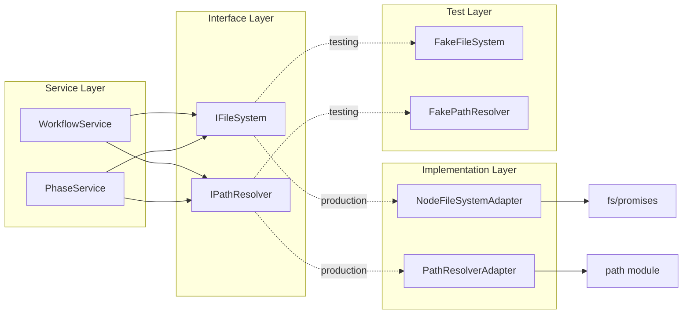
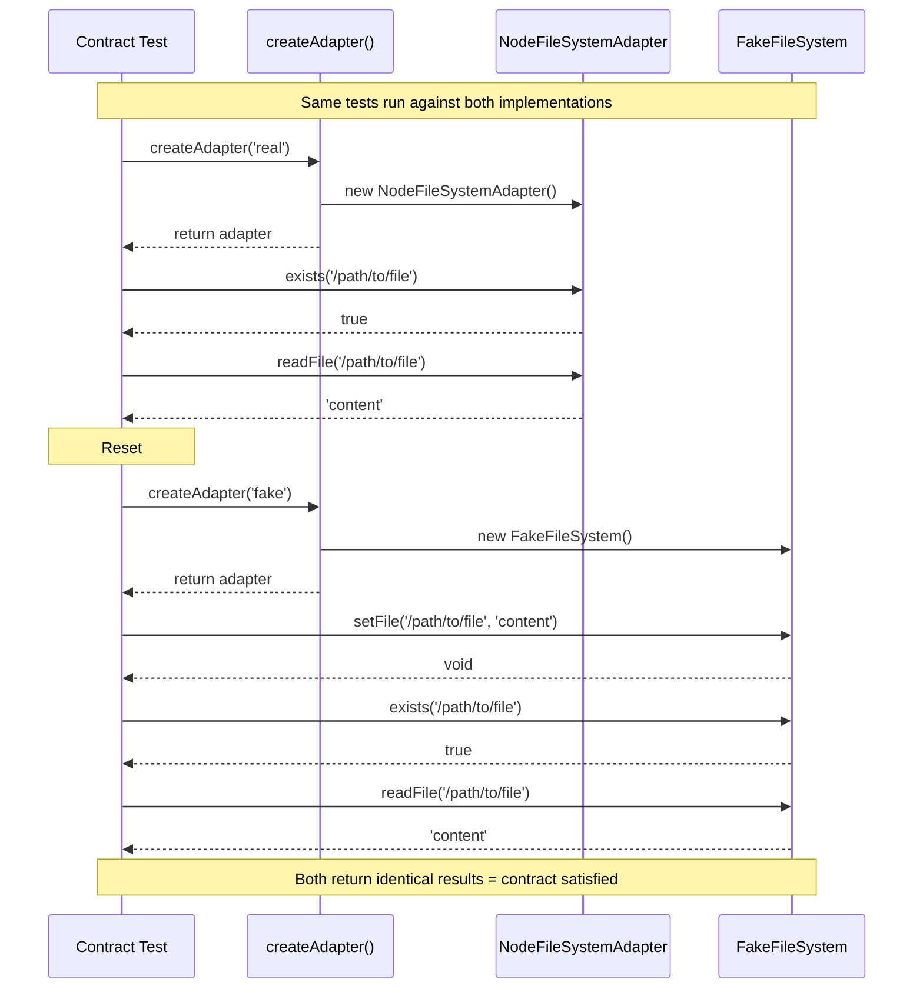

# Phase 1: Core Infrastructure – Tasks & Alignment Brief

**Spec**: [../../wf-basics-spec.md](../../wf-basics-spec.md)
**Plan**: [../../wf-basics-plan.md](../../wf-basics-plan.md)
**Date**: 2026-01-22
**Phase Slug**: `phase-1-core-infrastructure`

---

## Executive Briefing

### Purpose
This phase creates the foundational infrastructure that all subsequent workflow phases build upon: filesystem abstraction, path security, YAML parsing with error locations, and JSON Schema validation with actionable error messages. Without these infrastructure components, the workflow services (Phase 2+) cannot be implemented safely or testably.

### What We're Building
A set of core interfaces, schemas, and their implementations:
- **Core JSON Schemas**: The system schemas (`wf.schema.json`, `wf-phase.schema.json`, `message.schema.json`) that ship with the CLI and get copied into runs during compose
- **TypeScript Types**: Type definitions matching core schemas (`WfDefinition`, `WfPhaseState`, `Message`, etc.)
- **IFileSystem**: Async filesystem operations with both real (`NodeFileSystemAdapter`) and fake (`FakeFileSystem`) implementations
- **IPathResolver**: Secure path resolution that prevents directory traversal attacks
- **IYamlParser**: YAML parsing that preserves line/column information for agent-friendly error messages
- **ISchemaValidator**: JSON Schema validation with actionable error formatting

Plus the `packages/workflow/` package structure that houses workflow-specific implementations.

### User Value
AI agents consuming workflow system output will receive actionable error messages that include file paths, line numbers, expected values, and specific fix instructions. This enables autonomous error recovery without human intervention.

### Example
**Before** (typical AJV error): `"must be equal to one of the allowed values"`

**After** (with ISchemaValidator):
```json
{
  "code": "E012",
  "path": "/status",
  "message": "Expected /status to be one of: pending, active, complete",
  "expected": "pending | active | complete",
  "actual": "invalid",
  "action": "Update /status to use one of the allowed values"
}
```

---

## Objectives & Scope

### Objective
Implement the foundational interfaces and adapters specified in plan tasks 1.1–1.18, ensuring all components have contract tests, fakes pass the same tests as real implementations, and the packages/workflow structure integrates with the pnpm workspace.

### Goals

- ✅ Create `packages/workflow/` package structure following `packages/shared/` patterns
- ✅ Create core JSON schemas in `packages/workflow/schemas/` (wf, wf-phase, message, wf-status)
- ✅ Create TypeScript types matching core schemas in `packages/workflow/src/types/`
- ✅ Implement `IFileSystem` interface with `NodeFileSystemAdapter` and `FakeFileSystem`
- ✅ Implement `IPathResolver` interface with security validation (directory traversal prevention)
- ✅ Implement `IYamlParser` interface with line/column error reporting
- ✅ Implement `ISchemaValidator` interface with actionable AJV error transformation
- ✅ Create contract tests for all interfaces (run against both real and fake)
- ✅ Define `WORKFLOW_DI_TOKENS` and create `createWorkflowContainer()` factory
- ✅ Verify `pnpm -F @chainglass/workflow build` and `test` pass

### Non-Goals (Scope Boundaries)

- ❌ Implementing workflow services (`IWorkflowService`, `IPhaseService`) — that's Phase 2-4
- ❌ Output adapter architecture (`IOutputAdapter`, `JsonOutputAdapter`) — that's Phase 1a
- ❌ CLI commands — Phase 2+
- ❌ MCP tools — Phase 5
- ❌ Message communication commands (`cg phase message`) — Phase 3+
- ❌ Performance optimization (memory-mapped files, caching) — premature
- ❌ Comprehensive error state exemplars — use Fakes for error scenarios per ADR-0002 YAGNI

---

## Architecture Map

### Component Diagram

```mermaid
flowchart TD
    classDef pending fill:#9E9E9E,stroke:#757575,color:#fff
    classDef inprogress fill:#FF9800,stroke:#F57C00,color:#fff
    classDef completed fill:#4CAF50,stroke:#388E3C,color:#fff
    classDef blocked fill:#F44336,stroke:#D32F2F,color:#fff

    style PkgSetup fill:#E3F2FD,stroke:#1976D2
    style CoreSchemas fill:#E1F5FE,stroke:#0288D1
    style FileSystem fill:#E8F5E9,stroke:#388E3C
    style PathResolver fill:#FFF3E0,stroke:#F57C00
    style YamlParser fill:#F3E5F5,stroke:#7B1FA2
    style SchemaValidator fill:#FFEBEE,stroke:#C62828
    style DI fill:#ECEFF1,stroke:#546E7A

    subgraph PkgSetup["Package Setup"]
        T001["T001: Create packages/workflow/ ✓"]:::completed
    end

    subgraph CoreSchemas["Core Schemas & Types"]
        T002["T002: Create core JSON schemas ✓"]:::completed
        T003["T003: Create TypeScript types ✓"]:::completed

        T002 --> T003
    end

    subgraph FileSystem["IFileSystem Domain"]
        T004["T004: Write IFileSystem tests ✓"]:::completed
        T005["T005: Implement NodeFileSystemAdapter ✓"]:::completed
        T006["T006: Implement FakeFileSystem ✓"]:::completed
        T007["T007: Write IFileSystem contract tests ✓"]:::completed

        T004 --> T005 --> T006 --> T007
    end

    subgraph PathResolver["IPathResolver Domain"]
        T008["T008: Write IPathResolver tests ✓"]:::completed
        T009["T009: Implement PathResolverAdapter ✓"]:::completed
        T010["T010: Implement FakePathResolver ✓"]:::completed

        T008 --> T009 --> T010
    end

    subgraph YamlParser["IYamlParser Domain"]
        T011["T011: Write IYamlParser tests ✓"]:::completed
        T012["T012: Implement YamlParserAdapter ✓"]:::completed
        T013["T013: Implement FakeYamlParser ✓"]:::completed

        T011 --> T012 --> T013
    end

    subgraph SchemaValidator["ISchemaValidator Domain"]
        T014["T014: Write ISchemaValidator tests ✓"]:::completed
        T015["T015: Implement SchemaValidatorAdapter ✓"]:::completed
        T016["T016: Implement FakeSchemaValidator ✓"]:::completed

        T014 --> T015 --> T016
    end

    subgraph DI["DI & Integration"]
        T017["T017: Create DI tokens ✓"]:::completed
        T018["T018: Create workflow container ✓"]:::completed
        T019["T019: Verify build ✓"]:::completed
        T020["T020: Verify tests ✓"]:::completed

        T017 --> T018 --> T019 --> T020
    end

    %% Cross-domain dependencies
    T001 --> T002
    T001 --> T004
    T001 --> T008
    T001 --> T011
    T001 --> T014
    T001 --> T017

    T003 --> T014
    T007 --> T018
    T010 --> T018
    T013 --> T018
    T016 --> T018

    %% File nodes
    subgraph Files["Key Files"]
        F1["/packages/workflow/package.json ✓"]:::completed
        F2["/packages/workflow/schemas/wf.schema.json ✓"]:::completed
        F2a["/packages/workflow/schemas/wf-phase.schema.json ✓"]:::completed
        F2b["/packages/workflow/schemas/message.schema.json ✓"]:::completed
        F3["/packages/workflow/src/types/wf.types.ts ✓"]:::completed
        F3a["/packages/workflow/src/types/wf-phase.types.ts ✓"]:::completed
        F4["/packages/shared/src/interfaces/filesystem.interface.ts ✓"]:::completed
        F5["/packages/shared/src/adapters/node-filesystem.adapter.ts ✓"]:::completed
        F6["/packages/shared/src/fakes/fake-filesystem.ts ✓"]:::completed
        F7["/packages/shared/src/interfaces/path-resolver.interface.ts ✓"]:::completed
        F8["/packages/shared/src/adapters/path-resolver.adapter.ts ✓"]:::completed
        F9["/packages/workflow/src/interfaces/yaml-parser.interface.ts ✓"]:::completed
        F10["/packages/workflow/src/adapters/yaml-parser.adapter.ts ✓"]:::completed
        F11["/packages/workflow/src/interfaces/schema-validator.interface.ts ✓"]:::completed
        F12["/packages/workflow/src/adapters/schema-validator.adapter.ts ✓"]:::completed
        F13["/packages/shared/src/di-tokens.ts ✓"]:::completed
        F14["/packages/workflow/src/container.ts ✓"]:::completed
        F15["/test/contracts/filesystem.contract.ts ✓"]:::completed
    end

    T001 -.-> F1
    T002 -.-> F2
    T002 -.-> F2a
    T002 -.-> F2b
    T003 -.-> F3
    T003 -.-> F3a
    T004 -.-> F4
    T005 -.-> F5
    T006 -.-> F6
    T007 -.-> F15
    T008 -.-> F7
    T009 -.-> F8
    T011 -.-> F9
    T012 -.-> F10
    T014 -.-> F11
    T015 -.-> F12
    T017 -.-> F13
    T018 -.-> F14
```

<!-- Status: grey=pending, orange=in-progress, green=completed, red=blocked -->
<!-- Updated by plan-6 during implementation -->



### Task-to-Component Mapping

<!-- Status: ⬜ Pending | 🟧 In Progress | ✅ Complete | 🔴 Blocked -->

| Task | Component(s) | Files | Status | Comment |
|------|-------------|-------|--------|---------|
| T001 | Package Setup | packages/workflow/{package.json, tsconfig.json, src/index.ts} | ✅ Complete | Foundation for all workflow code |
| T002 | Core JSON Schemas | packages/workflow/schemas/{wf, wf-phase, message, wf-status}.schema.json | ✅ Complete | System schemas that ship with CLI |
| T003 | TypeScript Types | packages/workflow/src/types/{wf, wf-phase, message}.types.ts | ✅ Complete | Type definitions matching core schemas |
| T004 | IFileSystem Interface | packages/shared/src/interfaces/filesystem.interface.ts, test/unit/workflow/filesystem.test.ts | ✅ Complete | TDD: Define interface through tests |
| T005 | NodeFileSystemAdapter | packages/shared/src/adapters/node-filesystem.adapter.ts | ✅ Complete | Real implementation using fs/promises |
| T006 | FakeFileSystem | packages/shared/src/fakes/fake-filesystem.ts | ✅ Complete | In-memory implementation for tests |
| T007 | IFileSystem Contract | test/contracts/filesystem.contract.ts | ✅ Complete | Ensures fake matches real behavior |
| T008 | IPathResolver Interface | packages/shared/src/interfaces/path-resolver.interface.ts, test/unit/workflow/path-resolver.test.ts | ✅ Complete | TDD: Security-focused interface |
| T009 | PathResolverAdapter | packages/shared/src/adapters/path-resolver.adapter.ts | ✅ Complete | Directory traversal prevention |
| T010 | FakePathResolver | packages/shared/src/fakes/fake-path-resolver.ts | ✅ Complete | Configurable path resolution |
| T011 | IYamlParser Interface | packages/workflow/src/interfaces/yaml-parser.interface.ts, test/unit/workflow/yaml-parser.test.ts | ✅ Complete | TDD: Error location interface |
| T012 | YamlParserAdapter | packages/workflow/src/adapters/yaml-parser.adapter.ts | ✅ Complete | yaml package with keepCstNodes |
| T013 | FakeYamlParser | packages/workflow/src/fakes/fake-yaml-parser.ts | ✅ Complete | Configurable parse results |
| T014 | ISchemaValidator Interface | packages/workflow/src/interfaces/schema-validator.interface.ts, test/unit/workflow/schema-validator.test.ts | ✅ Complete | TDD: Actionable error interface |
| T015 | SchemaValidatorAdapter | packages/workflow/src/adapters/schema-validator.adapter.ts | ✅ Complete | AJV with error transformation |
| T016 | FakeSchemaValidator | packages/workflow/src/fakes/fake-schema-validator.ts | ✅ Complete | Preset validation results |
| T017 | DI Tokens | packages/shared/src/di-tokens.ts | ✅ Complete | WORKFLOW_DI_TOKENS constant |
| T018 | Workflow Container | packages/workflow/src/container.ts | ✅ Complete | createWorkflowContainer() factory |
| T019 | Build Verification | - | ✅ Complete | pnpm -F @chainglass/workflow build |
| T020 | Test Verification | - | ✅ Complete | pnpm -F @chainglass/workflow test |

---

## Tasks

| Status | ID | Task | CS | Type | Dependencies | Absolute Path(s) | Validation | Subtasks | Notes |
|--------|------|------|-----|------|--------------|------------------|------------|----------|-------|
| [x] | T001 | Create `packages/workflow/` package structure with package.json, tsconfig.json, and src/index.ts barrel | 2 | Setup | – | /home/jak/substrate/003-wf-basics/packages/workflow/package.json, /home/jak/substrate/003-wf-basics/packages/workflow/tsconfig.json, /home/jak/substrate/003-wf-basics/packages/workflow/src/index.ts | `pnpm install` resolves @chainglass/workflow; tsconfig extends root | – | Follow packages/shared/ pattern exactly |
| [x] | T002 | Create core JSON schemas in `packages/workflow/schemas/` — copy from exemplar, these are the **source of truth** that compose copies into runs | 2 | Setup | T001 | /home/jak/substrate/003-wf-basics/packages/workflow/schemas/wf.schema.json, /home/jak/substrate/003-wf-basics/packages/workflow/schemas/wf-phase.schema.json, /home/jak/substrate/003-wf-basics/packages/workflow/schemas/message.schema.json, /home/jak/substrate/003-wf-basics/packages/workflow/schemas/wf-status.schema.json | All schemas pass `ajv compile --spec=draft2020`; match exemplar schemas | – | Core system schemas; template authors don't create these |
| [x] | T003 | Create TypeScript types matching core schemas in `packages/workflow/src/types/` — `WfDefinition`, `WfPhaseState`, `Message`, `StatusEntry`, etc. | 2 | Setup | T002 | /home/jak/substrate/003-wf-basics/packages/workflow/src/types/wf.types.ts, /home/jak/substrate/003-wf-basics/packages/workflow/src/types/wf-phase.types.ts, /home/jak/substrate/003-wf-basics/packages/workflow/src/types/message.types.ts, /home/jak/substrate/003-wf-basics/packages/workflow/src/types/index.ts | Types exported from @chainglass/workflow; match schema structure | – | Used by services in Phase 2+ |
| [x] | T004 | Write tests for `IFileSystem` interface covering exists, readFile, writeFile, readDir, mkdir, copyFile, stat | 2 | Test | T001 | /home/jak/substrate/003-wf-basics/test/unit/workflow/filesystem.test.ts | Tests exist and fail (RED phase); cover happy path + error cases | – | Supports plan task 1.2 |
| [x] | T005 | Implement `NodeFileSystemAdapter` using fs/promises | 2 | Core | T004 | /home/jak/substrate/003-wf-basics/packages/shared/src/adapters/node-filesystem.adapter.ts, /home/jak/substrate/003-wf-basics/packages/shared/src/adapters/index.ts | All IFileSystem tests pass for NodeFileSystemAdapter | – | Supports plan task 1.3 |
| [x] | T006 | Implement `FakeFileSystem` with in-memory Map<string, string> storage and test helpers | 2 | Core | T004 | /home/jak/substrate/003-wf-basics/packages/shared/src/fakes/fake-filesystem.ts, /home/jak/substrate/003-wf-basics/packages/shared/src/fakes/index.ts | FakeFileSystem passes same tests as NodeFileSystemAdapter | – | Supports plan task 1.4; add setFile(), getFile(), simulateError() |
| [x] | T007 | Write contract tests for `IFileSystem` running against both NodeFileSystemAdapter and FakeFileSystem | 2 | Test | T005, T006 | /home/jak/substrate/003-wf-basics/test/contracts/filesystem.contract.ts, /home/jak/substrate/003-wf-basics/test/contracts/filesystem.contract.test.ts | Contract test suite passes for both implementations | – | Supports plan task 1.5; per Critical Discovery 08 |
| [x] | T008 | Write tests for `IPathResolver` interface covering resolvePath and security validation | 2 | Test | T001 | /home/jak/substrate/003-wf-basics/test/unit/workflow/path-resolver.test.ts | Tests exist and fail; include directory traversal attack scenarios | – | Supports plan task 1.6; per Critical Discovery 11 |
| [x] | T009 | Implement `PathResolverAdapter` with directory traversal prevention | 2 | Core | T008 | /home/jak/substrate/003-wf-basics/packages/shared/src/adapters/path-resolver.adapter.ts, /home/jak/substrate/003-wf-basics/packages/shared/src/adapters/index.ts | All IPathResolver tests pass; ../../../etc/passwd throws PathSecurityError | – | Supports plan task 1.7 |
| [x] | T010 | Implement `FakePathResolver` with configurable path resolution | 1 | Core | T008 | /home/jak/substrate/003-wf-basics/packages/shared/src/fakes/fake-path-resolver.ts, /home/jak/substrate/003-wf-basics/packages/shared/src/fakes/index.ts | Contract tests pass | – | Supports plan task 1.8 |
| [x] | T011 | Write tests for `IYamlParser` interface covering parse success and error with line/column location | 2 | Test | T001 | /home/jak/substrate/003-wf-basics/test/unit/workflow/yaml-parser.test.ts | Tests exist and fail; error tests verify line/column presence | – | Supports plan task 1.9; per Critical Discovery 06 |
| [x] | T012 | Implement `YamlParserAdapter` using yaml package with keepCstNodes: true for error locations | 2 | Core | T011 | /home/jak/substrate/003-wf-basics/packages/workflow/src/adapters/yaml-parser.adapter.ts, /home/jak/substrate/003-wf-basics/packages/workflow/src/adapters/index.ts | All IYamlParser tests pass; parse errors include line/column | – | Supports plan task 1.10 |
| [x] | T013 | Implement `FakeYamlParser` with preset results and configurable errors | 1 | Core | T011 | /home/jak/substrate/003-wf-basics/packages/workflow/src/fakes/fake-yaml-parser.ts, /home/jak/substrate/003-wf-basics/packages/workflow/src/fakes/index.ts | Contract tests pass | – | Supports plan task 1.11 |
| [x] | T014 | Write tests for `ISchemaValidator` interface covering validate success and actionable error messages | 2 | Test | T001, T003 | /home/jak/substrate/003-wf-basics/test/unit/workflow/schema-validator.test.ts | Tests exist and fail; error tests verify code, path, expected, actual, action fields | – | Supports plan task 1.12; per Critical Discovery 07; use core schemas |
| [x] | T015 | Implement `SchemaValidatorAdapter` using AJV with error transformation to actionable ResultError format | 3 | Core | T014 | /home/jak/substrate/003-wf-basics/packages/workflow/src/adapters/schema-validator.adapter.ts, /home/jak/substrate/003-wf-basics/packages/workflow/src/adapters/index.ts | All ISchemaValidator tests pass; errors are agent-actionable | – | Supports plan task 1.13; complexity from error mapping |
| [x] | T016 | Implement `FakeSchemaValidator` with preset validation results | 1 | Core | T014 | /home/jak/substrate/003-wf-basics/packages/workflow/src/fakes/fake-schema-validator.ts, /home/jak/substrate/003-wf-basics/packages/workflow/src/fakes/index.ts | Contract tests pass | – | Supports plan task 1.14 |
| [x] | T017 | Create `WORKFLOW_DI_TOKENS` in shared package extending existing DI token pattern | 1 | Setup | T001 | /home/jak/substrate/003-wf-basics/packages/shared/src/di-tokens.ts, /home/jak/substrate/003-wf-basics/packages/shared/src/index.ts | WORKFLOW_DI_TOKENS exported from @chainglass/shared | – | Supports plan task 1.15; per Critical Discovery 05 |
| [x] | T018 | Create `createWorkflowContainer()` factory in workflow package registering all adapters | 2 | Setup | T007, T010, T013, T016, T017 | /home/jak/substrate/003-wf-basics/packages/workflow/src/container.ts, /home/jak/substrate/003-wf-basics/packages/workflow/src/index.ts | Container resolves all WORKFLOW_DI_TOKENS correctly | – | Supports plan task 1.16; use useFactory pattern |
| [x] | T019 | Verify `pnpm -F @chainglass/workflow build` succeeds | 1 | Integration | T018 | – | Build command exits 0; dist/ contains .js and .d.ts files | – | Supports plan task 1.17 |
| [x] | T020 | Verify `pnpm -F @chainglass/workflow test` passes all tests | 1 | Integration | T019 | – | Test command exits 0; all unit and contract tests pass | – | Supports plan task 1.18 |

---

## Alignment Brief

### Prior Phases Review

#### Phase 0: Development Exemplar — Summary

Phase 0 created the complete filesystem exemplar that Phase 1 must test against:

**Deliverables Created**:
1. **Template** at `/home/jak/substrate/003-wf-basics/dev/examples/wf/template/hello-workflow/`:
   - `wf.yaml` — 3-phase workflow definition with `inputs.messages` declarations
   - `schemas/` — 6 JSON Schemas (wf, wf-phase, gather-data, process-data, message)
   - `phases/*/commands/` — Agent instruction files (main.md + wf.md per phase)

2. **Run Example** at `/home/jak/substrate/003-wf-basics/dev/examples/wf/runs/run-example-001/`:
   - Complete workflow execution with all 3 phases finalized
   - All JSON files pass schema validation
   - Message communication examples (orchestrator→agent in gather, agent→orchestrator in process)

3. **Documentation**:
   - `MANUAL-TEST-GUIDE.md` — 9 validation test cases
   - `TRACEABILITY.md` — AC-01 through AC-05 mapped to files

**Lessons Learned**:
- **Subtask 001**: Message communication system added to support agent↔orchestrator Q&A
- **Subtask 002**: Concept drift remediated — `inputs/files/` and `inputs/data/` split documented in all main.md files

**Technical Discoveries**:
- Gather phase has no `run/inputs/` directory (first phase receives user input via messages)
- Report phase has no `run/messages/` directory (terminal phases don't need Q&A)
- `required: true` + `from: "agent"` = NOT validated at prepare (agent creates during execution)

**Dependencies Exported**:
| Schema | Purpose | Phase 1 Usage |
|--------|---------|---------------|
| `wf.schema.json` | Workflow definition | **Copy to packages/workflow/schemas/** — source of truth for compose |
| `wf-phase.schema.json` | Phase state tracking | **Copy to packages/workflow/schemas/** — source of truth for phase commands |
| `message.schema.json` | Agent-orchestrator messages | **Copy to packages/workflow/schemas/** — source of truth for message commands |

**Schema Architecture** (established in workshop):

```
SOURCES (where compose gets schemas)           DESTINATION (self-contained run)
────────────────────────────────────           ────────────────────────────────

packages/workflow/schemas/     ← CORE         runs/run-001/phases/gather/schemas/
├── wf.schema.json            (ship with CLI)  ├── wf.schema.json           (from core)
├── wf-phase.schema.json      (ship with CLI)  ├── wf-phase.schema.json     (from core)
├── message.schema.json       (ship with CLI)  ├── message.schema.json      (from core)
└── wf-status.schema.json     (ship with CLI)  ├── gather-data.schema.json  (from template)
                                               └── process-data.schema.json (from template)
templates/hello-workflow/schemas/  ← TEMPLATE
├── gather-data.schema.json   (author creates)
└── process-data.schema.json  (author creates)
```

- **Core schemas** (T002): Define "how the workflow system works" — universal, ship with CLI
- **Template schemas**: Define "what this specific workflow outputs" — per-template, author creates
- **Phase 2 compose** will merge both into self-contained runs

**Reusable Test Infrastructure**:
- All JSON files in `runs/run-example-001/` can be used as test fixtures
- YAML files can test IYamlParser
- Directory structure can test IFileSystem operations

**Technical Debt from Phase 0**:
| ID | Description | Impact on Phase 1 |
|----|-------------|-------------------|
| TD-001 | No error state exemplars | Use FakeFileSystem to simulate errors instead |
| TD-002 | No partial completion exemplars | Use Fakes for state transition testing |
| TD-ST002-01 | 28 files require template↔run sync | Phase 2+ CLI will generate; not Phase 1 concern |

**Architectural Decisions to Maintain**:
1. **Facilitator Model**: State machine with `agent`/`orchestrator` control
2. **Status Log Pattern**: Append-only history in wf-phase.json
3. **files/ vs data/ Split**: Human-readable in `inputs/files/`, JSON in `inputs/data/`

### Design Decisions for Phase 2+ (Workshopped)

The following decisions were made during Phase 1 planning and should be referenced when implementing Phase 2 (WorkflowService).

#### Template Slug Resolution

**Rule (KISS)**:
```
Contains "/" OR starts with "." OR "~" OR is absolute path?
  → YES: Treat as PATH, resolve directly
  → NO:  Treat as NAME, search template libraries
```

**Search Order for Names**:
1. `.chainglass/templates/<name>/` — Project-local
2. `~/.config/chainglass/templates/<name>/` — User-global
3. Config-defined template libraries — From chainglass config system

**Config-defined libraries** (future enhancement):
```yaml
# .chainglass/config.yaml
templates:
  libraries:
    - ~/company-templates/
    - /shared/team-workflows/
```

**Validation**: A valid template directory MUST contain `wf.yaml` at root.

**Error Handling** (E020: TEMPLATE_NOT_FOUND):
```
Error E020: Template 'hello-workflow' not found

Searched:
  - .chainglass/templates/hello-workflow/wf.yaml (not found)
  - ~/.config/chainglass/templates/hello-workflow/wf.yaml (not found)

Action: Create the template directory with a wf.yaml file, or use an
explicit path: cg wf compose ./path/to/template
```

**Examples**:
| Input | Type | Resolution |
|-------|------|------------|
| `hello-workflow` | Name | Search paths for `hello-workflow/wf.yaml` |
| `./my-templates/custom` | Path | `./my-templates/custom/wf.yaml` |
| `~/templates/foo` | Path | `~/templates/foo/wf.yaml` |
| `/abs/path/template` | Path | `/abs/path/template/wf.yaml` |

---

### Critical Findings Affecting This Phase

| Finding | Constraint | Addressed By |
|---------|------------|--------------|
| **CD-04: IFileSystem Isolation** | All services must use IFileSystem, never `fs` directly | T004, T005, T006, T007 |
| **CD-05: DI Token Pattern** | Use `useFactory` for all registrations | T017, T018 |
| **CD-06: YAML Error Locations** | Parse errors must include line/column | T011, T012 |
| **CD-07: Actionable JSON Schema Errors** | AJV errors must be transformed to ResultError format | T014, T015 |
| **CD-08: Contract Tests** | All interfaces need contract tests running against both implementations | T007 |
| **CD-11: Path Security** | Directory traversal must be prevented | T008, T009 |
| **CD-12: pnpm Workspace Integration** | Follow packages/shared pattern exactly | T001 |
| **NEW: Core Schema Separation** | Core schemas ship with CLI; template schemas authored per-workflow | T002, T003 |

### ADR Decision Constraints

**ADR-0002: Exemplar-Driven Development**
- **Decision**: Static, committed exemplar files serve as canonical "ground truth"
- **Constraint**: Test against exemplar files in `dev/examples/wf/`; bidirectional validation required
- **Addressed by**: T002 (IFileSystem tests can use exemplar files), T012 (ISchemaValidator tests use exemplar schemas)

### Invariants & Guardrails

- **No mocks**: Per project rules, use fakes only (`vi.mock()` banned)
- **Contract test coverage**: Every interface needs contract tests per Critical Discovery 08
- **Deterministic tests**: All tests must be reproducible per ADR-0002

### Inputs to Read

| File | Purpose |
|------|---------|
| `/home/jak/substrate/003-wf-basics/packages/shared/package.json` | Pattern for package.json structure |
| `/home/jak/substrate/003-wf-basics/packages/shared/tsconfig.json` | Pattern for tsconfig |
| `/home/jak/substrate/003-wf-basics/packages/shared/src/index.ts` | Pattern for barrel exports |
| `/home/jak/substrate/003-wf-basics/packages/shared/src/interfaces/logger.interface.ts` | Pattern for interface definition |
| `/home/jak/substrate/003-wf-basics/packages/shared/src/fakes/fake-logger.ts` | Pattern for fake implementation |
| `/home/jak/substrate/003-wf-basics/test/contracts/logger.contract.ts` | Pattern for contract tests |
| `/home/jak/substrate/003-wf-basics/dev/examples/wf/template/hello-workflow/wf.yaml` | Exemplar for YAML parsing tests |
| `/home/jak/substrate/003-wf-basics/dev/examples/wf/template/hello-workflow/schemas/wf.schema.json` | **Source for T002** — copy to packages/workflow/schemas/ |
| `/home/jak/substrate/003-wf-basics/dev/examples/wf/template/hello-workflow/schemas/wf-phase.schema.json` | **Source for T002** — copy to packages/workflow/schemas/ |
| `/home/jak/substrate/003-wf-basics/dev/examples/wf/template/hello-workflow/schemas/message.schema.json` | **Source for T002** — copy to packages/workflow/schemas/ |
| `/home/jak/substrate/003-wf-basics/dev/examples/wf/runs/run-example-001/wf-run/wf-status.json` | Reference for wf-status.schema.json (T002) |

### Visual Alignment Aids

#### System State Flow (IFileSystem Operations)



#### Contract Test Sequence



### Test Plan (Full TDD Approach)

Per project rules: TDD with fakes-only policy, Test Doc format required.

#### IFileSystem Tests (`test/unit/workflow/filesystem.test.ts`)

| Test | Rationale | Fixture | Expected Output |
|------|-----------|---------|-----------------|
| `exists() returns true for existing file` | Core read operation | Temp file created in beforeEach | `true` |
| `exists() returns false for non-existent file` | Negative case | No file | `false` |
| `readFile() returns file content` | Core read operation | Temp file with known content | Content string |
| `readFile() throws for non-existent file` | Error handling | No file | Error with path |
| `writeFile() creates new file` | Core write operation | Empty dir | File exists after |
| `writeFile() overwrites existing file` | Overwrite behavior | Existing file | New content |
| `mkdir() creates nested directories` | Recursive creation | Empty dir | All dirs exist |
| `mkdir() succeeds if directory exists` | Idempotent | Existing dir | No error |
| `copyFile() copies content` | Core operation | Source file | Dest has same content |
| `copyFile() throws for non-existent source` | Error handling | No source | Error with source path |
| `readDir() returns directory contents` | Listing | Dir with files | Array of names |
| `stat() returns isFile/isDirectory` | Metadata | File and dir | Correct flags |

#### IPathResolver Tests (`test/unit/workflow/path-resolver.test.ts`)

| Test | Rationale | Fixture | Expected Output |
|------|-----------|---------|-----------------|
| `resolvePath() joins base and relative` | Normal operation | `/base`, `sub/file.txt` | `/base/sub/file.txt` |
| `resolvePath() throws on ../` traversal | Security | `/base`, `../etc/passwd` | PathSecurityError |
| `resolvePath() throws on absolute path` | Security | `/base`, `/etc/passwd` | PathSecurityError |
| `resolvePath() normalizes . and ..` | Path normalization | `/base/sub`, `./file.txt` | `/base/sub/file.txt` |
| `resolvePath() handles trailing slashes` | Edge case | `/base/`, `file.txt` | `/base/file.txt` |

#### IYamlParser Tests (`test/unit/workflow/yaml-parser.test.ts`)

| Test | Rationale | Fixture | Expected Output |
|------|-----------|---------|-----------------|
| `parse() returns parsed object` | Normal operation | Valid YAML string | Parsed object |
| `parse() preserves types (string, number, boolean, array, object)` | Type fidelity | YAML with mixed types | Correct JS types |
| `parse() throws YamlParseError with line/column on syntax error` | Agent-friendly errors | Invalid YAML | Error with line, column, path |
| `parse() handles empty document` | Edge case | Empty string | `null` or `{}` |
| `parse() uses exemplar wf.yaml` | Exemplar validation | `dev/examples/wf/template/hello-workflow/wf.yaml` | Parsed workflow definition |

#### ISchemaValidator Tests (`test/unit/workflow/schema-validator.test.ts`)

| Test | Rationale | Fixture | Expected Output |
|------|-----------|---------|-----------------|
| `validate() returns success for valid data` | Normal operation | Valid JSON + schema | `{ valid: true, errors: [] }` |
| `validate() returns E010 for missing required field` | Missing field | JSON missing required | Error with code E010 |
| `validate() returns E012 for invalid enum value` | Wrong value | Invalid status | Error with expected/actual |
| `validate() returns actionable error with code, path, message, action` | Agent-friendly | Invalid data | Full ResultError object |
| `validate() handles multiple errors` | Multiple issues | Multiple violations | Array of errors |
| `validate() uses exemplar schema` | Exemplar validation | wf-phase.schema.json + test data | Correct validation result |

#### Contract Tests (`test/contracts/filesystem.contract.ts`)

| Test | Rationale |
|------|-----------|
| Run all IFileSystem tests against NodeFileSystemAdapter | Real implementation passes |
| Run all IFileSystem tests against FakeFileSystem | Fake matches real behavior |

### Step-by-Step Implementation Outline

1. **T001: Package Setup**
   - Create `packages/workflow/` directory
   - Write `package.json` with name `@chainglass/workflow`, dependencies on `@chainglass/shared`, `yaml`, `ajv`
   - Write `tsconfig.json` extending root config
   - Write `src/index.ts` with placeholder export
   - Run `pnpm install` to link workspace

2. **T002-T003: Core Schemas & TypeScript Types**
   - Create `packages/workflow/schemas/` directory
   - Copy core schemas from exemplar (`wf.schema.json`, `wf-phase.schema.json`, `message.schema.json`)
   - Create `wf-status.schema.json` for run-level status
   - Validate all schemas with `ajv compile --spec=draft2020`
   - Create TypeScript types in `packages/workflow/src/types/` matching schema structure:
     * `wf.types.ts` — `WfDefinition`, `PhaseDefinition`, `InputDeclaration`, etc.
     * `wf-phase.types.ts` — `WfPhaseState`, `StatusEntry`, `Facilitator`, `PhaseStatus`
     * `message.types.ts` — `Message`, `MessageType`, `MessageAnswer`
   - Export types from barrel `packages/workflow/src/types/index.ts`

3. **T004-T007: IFileSystem Domain** (TDD)
   - Write failing tests in `test/unit/workflow/filesystem.test.ts`
   - Define `IFileSystem` interface in `packages/shared/src/interfaces/filesystem.interface.ts`
   - Implement `NodeFileSystemAdapter` to pass tests
   - Implement `FakeFileSystem` to pass same tests
   - Write contract tests verifying both pass

4. **T008-T010: IPathResolver Domain** (TDD)
   - Write failing tests including security scenarios
   - Define `IPathResolver` interface
   - Implement `PathResolverAdapter` with traversal prevention
   - Implement `FakePathResolver`

5. **T011-T013: IYamlParser Domain** (TDD)
   - Write failing tests including error location verification
   - Define `IYamlParser` interface with `YamlParseError` type
   - Implement `YamlParserAdapter` using `yaml` package with `keepCstNodes: true`
   - Implement `FakeYamlParser`

6. **T014-T016: ISchemaValidator Domain** (TDD)
   - Write failing tests including actionable error verification
   - Use core schemas from T002 as test fixtures
   - Define `ISchemaValidator` interface with `ValidationResult` and `ResultError` types
   - Implement `SchemaValidatorAdapter` using AJV with error transformation
   - Implement `FakeSchemaValidator`

7. **T017-T018: DI Integration**
   - Add `WORKFLOW_DI_TOKENS` to shared package
   - Create `createWorkflowContainer()` factory registering all adapters

8. **T019-T020: Verification**
   - Run `pnpm -F @chainglass/workflow build`
   - Run `pnpm -F @chainglass/workflow test`

### Commands to Run

```bash
# Environment setup
cd /home/jak/substrate/003-wf-basics
pnpm install

# Create package structure (T001)
mkdir -p packages/workflow/src/{interfaces,adapters,fakes,types}
mkdir -p packages/workflow/schemas

# Validate schemas (T002)
npx ajv compile --spec=draft2020 -s packages/workflow/schemas/wf.schema.json
npx ajv compile --spec=draft2020 -s packages/workflow/schemas/wf-phase.schema.json
npx ajv compile --spec=draft2020 -s packages/workflow/schemas/message.schema.json

# Run tests (after implementing)
pnpm -F @chainglass/workflow test

# Run specific test file
pnpm -F @chainglass/workflow test -- test/unit/workflow/filesystem.test.ts

# Build package
pnpm -F @chainglass/workflow build

# Run all tests including contracts
pnpm test

# Type checking
pnpm typecheck

# Linting
pnpm lint

# Full quality check
just check
```

### Risks/Unknowns

| Risk | Severity | Likelihood | Mitigation |
|------|----------|------------|------------|
| `yaml` package API changes | Low | Low | Pin version in package.json; write integration test |
| AJV error format changes | Medium | Low | Pin AJV version; error transformation is isolated to adapter |
| Contract test complexity | Medium | Medium | Start with simple cases; follow logger.contract.ts pattern |
| FakeFileSystem edge cases (permissions, symlinks) | Low | Medium | Document limitations; these scenarios can use real fs in integration tests |

### Ready Check

- [ ] Prior phase (Phase 0) reviewed — deliverables, lessons, discoveries documented above
- [ ] Critical findings mapped to tasks — CD-04, CD-05, CD-06, CD-07, CD-08, CD-11, CD-12
- [ ] Core schema separation documented — core vs template schemas, source locations clear
- [ ] ADR constraints mapped to tasks — ADR-0002 (exemplar-driven development)
- [ ] Non-goals explicitly stated — no services, no CLI, no MCP
- [ ] Test plan covers all interfaces and error paths
- [ ] Implementation order respects dependencies (T001 → schemas/types → domains → DI → verification)
- [ ] Commands documented and copy-pasteable

---

## Phase Footnote Stubs

_Populated during implementation by plan-6a-update-progress._

| Footnote | Task | Description | FlowSpace Node IDs |
|----------|------|-------------|-------------------|
| | | | |

---

## Evidence Artifacts

Implementation will produce:
- **Execution Log**: `/home/jak/substrate/003-wf-basics/docs/plans/003-wf-basics/tasks/phase-1-core-infrastructure/execution.log.md`
- **Test Output**: Captured in execution log
- **Build Output**: Captured in execution log

---

## Discoveries & Learnings

_Populated during implementation by plan-6. Log anything of interest to your future self._

| Date | Task | Type | Discovery | Resolution | References |
|------|------|------|-----------|------------|------------|
| | | | | | |

**Types**: `gotcha` | `research-needed` | `unexpected-behavior` | `workaround` | `decision` | `debt` | `insight`

**What to log**:
- Things that didn't work as expected
- External research that was required
- Implementation troubles and how they were resolved
- Gotchas and edge cases discovered
- Decisions made during implementation
- Technical debt introduced (and why)
- Insights that future phases should know about

_See also: `execution.log.md` for detailed narrative._

---

## Directory Layout

```
docs/plans/003-wf-basics/
├── wf-basics-plan.md
├── wf-basics-spec.md
├── research-dossier.md
└── tasks/
    ├── phase-0-development-exemplar/
    │   ├── tasks.md
    │   ├── execution.log.md
    │   ├── 001-subtask-message-communication.md
    │   ├── 001-subtask-message-communication.execution.log.md
    │   ├── 002-subtask-commands-main-concept-drift-remediation.md
    │   └── 002-subtask-commands-main-concept-drift-remediation.execution.log.md
    └── phase-1-core-infrastructure/
        ├── tasks.md                # This file
        └── execution.log.md        # Created by /plan-6
```
