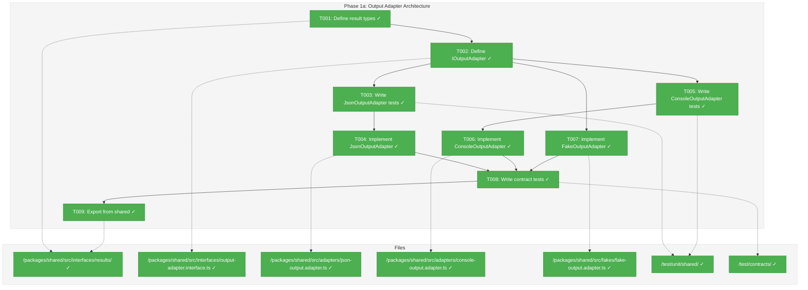
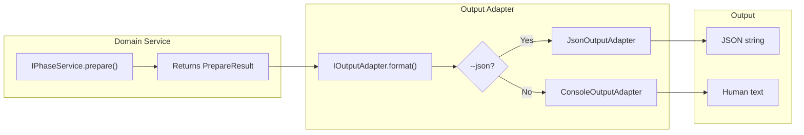
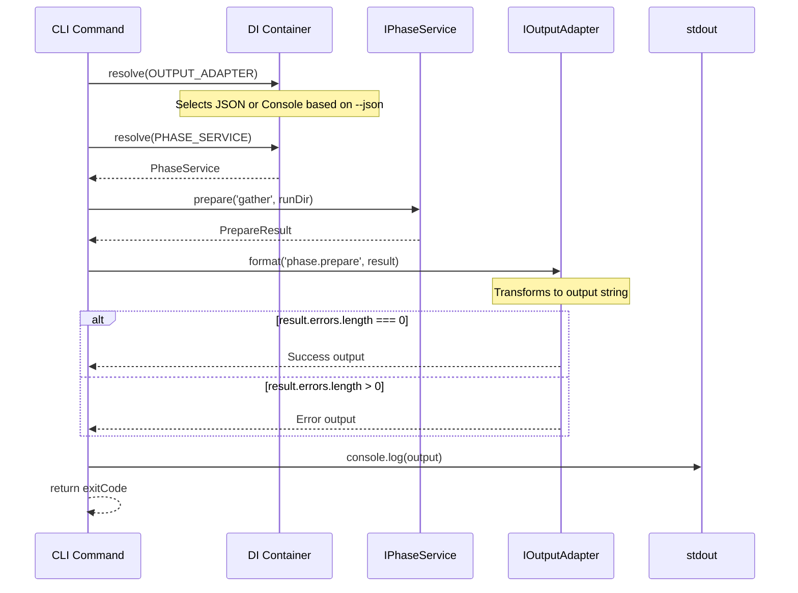

# Phase 1a: Output Adapter Architecture – Tasks & Alignment Brief

**Spec**: [../../wf-basics-spec.md](../../wf-basics-spec.md)
**Plan**: [../../wf-basics-plan.md](../../wf-basics-plan.md)
**Date**: 2026-01-22
**Testing Approach**: Full TDD
**Mock Usage Policy**: Fakes only (per R-TEST-007)

---

## Executive Briefing

### Purpose
This phase implements the Output Adapter Architecture that enables consistent formatting of service results for both JSON (agent) and Console (human) outputs. This is the critical bridge between domain services and CLI presentation, ensuring agents receive machine-parseable JSON while humans get readable feedback.

### What We're Building
An `IOutputAdapter` interface with three implementations:
- **JsonOutputAdapter**: Wraps results in `CommandResponse<T>` envelope with `success`, `command`, `timestamp`, and either `data` (on success) or `error` (on failure)
- **ConsoleOutputAdapter**: Produces human-readable text with icons (✓/✗), status messages, and actionable error guidance
- **FakeOutputAdapter**: Test implementation that captures output for inspection

Plus the domain result types that services will return:
- **BaseResult**: Base interface with `errors: ResultError[]` (empty = success)
- **PrepareResult**, **ValidateResult**, **FinalizeResult**, **ComposeResult**: Command-specific result types

### User Value
- Agents can parse JSON output programmatically and handle errors autonomously
- Humans get clear, actionable feedback when running commands manually
- Consistent output structure across all workflow commands enables reliable automation

### Example
**Service returns**:
```typescript
const result: PrepareResult = {
  phase: 'gather',
  runDir: '/path/to/run',
  status: 'ready',
  inputs: { required: [], resolved: [{ name: 'user-request.md', path: '...', exists: true }] },
  copiedFromPrior: [],
  errors: [],
};
```

**JsonOutputAdapter formats as**:
```json
{
  "success": true,
  "command": "phase.prepare",
  "timestamp": "2026-01-22T14:30:00.000Z",
  "data": {
    "phase": "gather",
    "runDir": "/path/to/run",
    "status": "ready",
    "inputs": { "required": [], "resolved": [{ "name": "user-request.md", "path": "...", "exists": true }] },
    "copiedFromPrior": []
  }
}
```

**ConsoleOutputAdapter formats as**:
```
✓ Phase 'gather' is ready
  Inputs resolved: user-request.md
```

---

## Objectives & Scope

### Objective
Implement the Output Adapter Architecture per Critical Discovery 01 and spec § Output Adapter Architecture, enabling services to return domain objects while adapters handle formatting.

**Behavior Checklist**:
- [ ] `BaseResult` interface with `errors[]` array exported from @chainglass/shared
- [ ] All command-specific result types extend `BaseResult`
- [ ] `IOutputAdapter.format()` accepts any `BaseResult` subtype
- [ ] `JsonOutputAdapter` produces valid JSON with `CommandResponse<T>` envelope
- [ ] `ConsoleOutputAdapter` produces human-readable output with icons
- [ ] `FakeOutputAdapter` captures output for test assertions
- [ ] DI token exists for runtime adapter selection

### Goals

- ✅ Define `BaseResult`, `ResultError`, and all command-specific result interfaces
- ✅ Define `IOutputAdapter` interface with `format<T>(command, result)` method
- ✅ Implement `JsonOutputAdapter` with `CommandResponse<T>` envelope
- ✅ Implement `ConsoleOutputAdapter` with human-readable formatting
- ✅ Implement `FakeOutputAdapter` with test inspection methods
- ✅ Write contract tests ensuring JSON and Console produce equivalent semantic content
- ✅ Export all types and adapters from `@chainglass/shared`
- ✅ Add DI token for `OUTPUT_ADAPTER`

### Non-Goals

- ❌ CLI command implementations (Phase 2-4)
- ❌ Service implementations (Phase 2-4)
- ❌ Color/styling for Console output (can be added later)
- ❌ Table formatting for Console output (keep it simple for now)
- ❌ Progress indicators or spinners (out of scope)
- ❌ Localization/internationalization (not needed)

---

## Architecture Map

### Component Diagram
<!-- Status: grey=pending, orange=in-progress, green=completed, red=blocked -->
<!-- Updated by plan-6 during implementation -->



### Task-to-Component Mapping

<!-- Status: ⬜ Pending | 🟧 In Progress | ✅ Complete | 🔴 Blocked -->

| Task | Component(s) | Files | Status | Comment |
|------|-------------|-------|--------|---------|
| T001 | Result Types | results/*.ts | ✅ Complete | BaseResult, PrepareResult, ValidateResult, etc. |
| T002 | IOutputAdapter | output-adapter.interface.ts | ✅ Complete | format() method signature |
| T003 | JsonOutputAdapter Tests | json-output-adapter.test.ts | ✅ Complete | TDD: tests first |
| T004 | JsonOutputAdapter | json-output.adapter.ts | ✅ Complete | CommandResponse envelope |
| T005 | ConsoleOutputAdapter Tests | console-output-adapter.test.ts | ✅ Complete | TDD: tests first |
| T006 | ConsoleOutputAdapter | console-output.adapter.ts | ✅ Complete | Human-readable formatting |
| T007 | FakeOutputAdapter | fake-output.adapter.ts | ✅ Complete | Test inspection methods |
| T008 | Contract Tests | output-adapter.contract.test.ts | ✅ Complete | JSON/Console equivalence |
| T009 | Barrel Exports | index.ts files | ✅ Complete | Export all from @chainglass/shared |

---

## Tasks

| Status | ID   | Task                                            | CS  | Type | Dependencies | Absolute Path(s)                                                                                   | Validation                                      | Subtasks | Notes |
|--------|------|-------------------------------------------------|-----|------|--------------|----------------------------------------------------------------------------------------------------|-------------------------------------------------|----------|-------|
| [x]    | T001 | Define result type interfaces in shared         | 2   | Core | –            | /home/jak/substrate/003-wf-basics/packages/shared/src/interfaces/results/base.types.ts, /home/jak/substrate/003-wf-basics/packages/shared/src/interfaces/results/command.types.ts, /home/jak/substrate/003-wf-basics/packages/shared/src/interfaces/results/index.ts | TypeScript compiles, all types exported | – | **Decision**: Relocate ResultError from workflow to shared (per DYK Insight #1). Re-export from workflow for backward compat. Use spec's optional-field version. |
| [x]    | T002 | Define IOutputAdapter interface                 | 1   | Core | T001         | /home/jak/substrate/003-wf-basics/packages/shared/src/interfaces/output-adapter.interface.ts       | Interface exported, format<T> signature correct | – | Single method: format<T extends BaseResult> |
| [x]    | T003 | Write tests for JsonOutputAdapter               | 2   | Test | T002         | /home/jak/substrate/003-wf-basics/test/unit/shared/json-output-adapter.test.ts                     | Tests fail initially (RED)                      | – | Cover success envelope, error envelope, multiple errors |
| [x]    | T004 | Implement JsonOutputAdapter                     | 2   | Core | T003         | /home/jak/substrate/003-wf-basics/packages/shared/src/adapters/json-output.adapter.ts              | All tests pass (GREEN)                          | – | **Decision**: Use `Omit<T, 'errors'>` type + runtime destructure (per DYK Insight #5). Private `omitErrors()` helper with safe cast. |
| [x]    | T005 | Write tests for ConsoleOutputAdapter            | 2   | Test | T002         | /home/jak/substrate/003-wf-basics/test/unit/shared/console-output-adapter.test.ts                  | Tests fail initially (RED)                      | – | Cover success format, error format with icons |
| [x]    | T006 | Implement ConsoleOutputAdapter                  | 2   | Core | T005         | /home/jak/substrate/003-wf-basics/packages/shared/src/adapters/console-output.adapter.ts           | All tests pass (GREEN)                          | – | **Decision**: Use command dispatch pattern (per DYK Insight #2). Switch on command param, dedicated formatXxxSuccess/Failure methods per type. Pattern from SchemaValidatorAdapter. |
| [x]    | T007 | Implement FakeOutputAdapter                     | 2   | Core | T002         | /home/jak/substrate/003-wf-basics/packages/shared/src/fakes/fake-output.adapter.ts                 | Fake has inspection methods                     | – | getLastOutput(), getLastCommand(), getFormattedResults() |
| [x]    | T008 | Write contract tests for IOutputAdapter         | 2   | Test | T004, T006, T007 | /home/jak/substrate/003-wf-basics/test/contracts/output-adapter.contract.test.ts               | Contract tests pass for all adapters            | – | **Decision**: KISS - minimal semantic assertions (per DYK Insight #3). Test success/failure agreement only: JSON `success` field vs Console `✓`/`✗`. Don't test detailed formatting. |
| [x]    | T009 | Export all adapters from @chainglass/shared     | 1   | Core | T008         | /home/jak/substrate/003-wf-basics/packages/shared/src/index.ts, /home/jak/substrate/003-wf-basics/packages/shared/src/interfaces/index.ts, /home/jak/substrate/003-wf-basics/packages/shared/src/adapters/index.ts, /home/jak/substrate/003-wf-basics/packages/shared/src/fakes/index.ts | All exports importable from @chainglass/shared | – | Add OUTPUT_ADAPTER to SHARED_DI_TOKENS. **Decision**: DI uses factory pattern with options (per DYK Insight #4). CLI calls `createCliContainer({ json })` after arg parsing. |

---

## Alignment Brief

### Prior Phases Review

#### Phase 1: Core Infrastructure (Complete)

**A. Deliverables Created**:
- **packages/workflow/**: Full package with types, interfaces, adapters, fakes
- **Core Schemas**: wf.schema.json, wf-phase.schema.json, message.schema.json, wf-status.schema.json
- **TypeScript Types**: WfDefinition, WfPhaseState, Message, WfStatus and related types
- **Interfaces**: IFileSystem, IPathResolver, IYamlParser, ISchemaValidator
- **Adapters**: NodeFileSystemAdapter, PathResolverAdapter, YamlParserAdapter, SchemaValidatorAdapter
- **Fakes**: FakeFileSystem, FakePathResolver, FakeYamlParser, FakeSchemaValidator
- **DI**: SHARED_DI_TOKENS, WORKFLOW_DI_TOKENS, createWorkflowProductionContainer(), createWorkflowTestContainer()

**B. Lessons Learned**:
- tsconfig.json project references required for @chainglass/shared resolution
- AJV strict mode requires properties redeclared in if/then blocks
- Full TDD approach drove clean interface design (193 tests passing)

**C. Technical Discoveries**:
- FakeFileSystem handles implicit directories (directories exist when files under them exist)
- Path security validation requires path.resolve() comparison, not just `../` detection
- yaml package error locations come from `linePos` array

**D. Dependencies Exported for Phase 1a**:
| Export | From Package | Usage in Phase 1a |
|--------|--------------|-------------------|
| `ResultError` | `@chainglass/workflow` | **May need to relocate to shared** or redefine for BaseResult.errors[] |
| `ValidationErrorCodes` | `@chainglass/workflow` | Reference for error code format |
| All test infrastructure | `test/contracts/` | Pattern for contract tests |

**E. Critical Findings Applied**:
- CD-04 (IFileSystem): All file ops abstracted ✅
- CD-05 (DI Token Pattern): useFactory pattern used ✅
- CD-06 (YAML Error Locations): YamlParseError includes line/column ✅
- CD-07 (Actionable JSON Schema Errors): ResultError with code, path, expected, actual, action ✅
- CD-08 (Contract Tests): fileSystemContractTests established ✅
- CD-11 (Path Security): PathResolverAdapter validates paths ✅

**F. Incomplete/Blocked Items**: None - all 20 tasks completed

**G. Test Infrastructure**:
- 149 unit tests + 44 contract tests = 193 total passing
- Contract test pattern: `fileSystemContractTests(name, contextFactory)`
- vitest config includes @chainglass/workflow alias

**H. Technical Debt**:
- No contract tests yet for IPathResolver, IYamlParser, ISchemaValidator (Low impact)

**I. Architectural Decisions Established**:
1. Interface + Adapter + Fake triplet pattern
2. Contract test pattern for fake/real parity
3. Error classes with context (FileSystemError, PathSecurityError, YamlParseError)
4. DI container factory pattern (production/test containers)

### Critical Findings Affecting This Phase

| Finding | Impact | Addressed By |
|---------|--------|--------------|
| **CD-01: Output Adapter Architecture** | Critical - defines the entire pattern | All tasks (T001-T009) implement this pattern |
| **CD-05: DI Token Pattern** | Must add OUTPUT_ADAPTER token | T009 adds to SHARED_DI_TOKENS |

**CD-01 Detail**: Services return domain result objects, adapters format for output. JSON is PRIMARY interface. Pattern per spec § Output Adapter Architecture:
```typescript
// Service returns domain object
IPhaseService.prepare() → PrepareResult

// Adapter formats for output
IOutputAdapter.format('phase.prepare', result) → string
```

### ADR Decision Constraints

| ADR | Status | Constraints | Addressed By |
|-----|--------|-------------|--------------|
| ADR-0002 | Accepted | Exemplar-driven development | Test fixtures can use exemplar data |

### Invariants & Guardrails

- **JSON Output**: Must be valid, parseable JSON - no extra text, no colors
- **Error Semantics**: `errors.length === 0` means success, `errors.length > 0` means failure
- **CommandResponse Envelope**: All JSON responses share `success`, `command`, `timestamp` fields
- **No Side Effects**: Adapters only format, never modify state or call services

### Inputs to Read

| File | Purpose |
|------|---------|
| `/home/jak/substrate/003-wf-basics/packages/shared/src/index.ts` | Current shared exports |
| `/home/jak/substrate/003-wf-basics/packages/shared/src/interfaces/index.ts` | Interface barrel |
| `/home/jak/substrate/003-wf-basics/packages/shared/src/adapters/index.ts` | Adapter barrel |
| `/home/jak/substrate/003-wf-basics/packages/shared/src/fakes/index.ts` | Fakes barrel |
| `/home/jak/substrate/003-wf-basics/packages/workflow/src/interfaces/schema-validator.interface.ts` | Existing ResultError definition |
| `/home/jak/substrate/003-wf-basics/docs/plans/003-wf-basics/wf-basics-spec.md` § JSON Output Framework | Response envelope structure |
| `/home/jak/substrate/003-wf-basics/docs/plans/003-wf-basics/wf-basics-spec.md` § Output Adapter Architecture | Full architecture spec |

### Visual Alignment Aids

#### System State Flow



#### Sequence Diagram: CLI Command Flow



### Test Plan (Full TDD)

**Named Tests for JsonOutputAdapter** (`test/unit/shared/json-output-adapter.test.ts`):

| Test Name | Purpose | Fixture | Expected Output |
|-----------|---------|---------|-----------------|
| `should format successful result with envelope` | Verify success envelope structure | PrepareResult with empty errors | `{ success: true, command: "...", timestamp: "...", data: {...} }` |
| `should omit errors array from data on success` | Verify errors not in data | PrepareResult with empty errors | `data` has no `errors` property |
| `should format single error result` | Verify error envelope structure | PrepareResult with 1 error | `{ success: false, error: { code, message, action, details: [...] } }` |
| `should format multiple errors` | Verify details array | PrepareResult with 3 errors | `error.details` has 3 items |
| `should include expected/actual for validation errors` | Verify validation detail | Error with expected/actual | `details[0].expected` and `details[0].actual` present |
| `should produce valid JSON` | Verify JSON.parse succeeds | Any result | No parse errors |
| `should include ISO timestamp` | Verify timestamp format | Any result | Matches ISO 8601 pattern |

**Named Tests for ConsoleOutputAdapter** (`test/unit/shared/console-output-adapter.test.ts`):

| Test Name | Purpose | Fixture | Expected Output |
|-----------|---------|---------|-----------------|
| `should format success with checkmark icon` | Verify success icon | PrepareResult with empty errors | Output contains `✓` |
| `should include phase name in success` | Verify phase in output | PrepareResult for 'gather' | Output contains `gather` |
| `should list resolved inputs on success` | Verify inputs listed | PrepareResult with resolved inputs | Output contains input names |
| `should format failure with X icon` | Verify failure icon | PrepareResult with errors | Output contains `✗` |
| `should include error code in failure` | Verify code shown | Error with code E001 | Output contains `E001` |
| `should list each error path` | Verify paths listed | Multiple errors with paths | Each path appears |
| `should include action suggestion` | Verify action shown | Error with action | Output contains action text |

**Named Tests for FakeOutputAdapter** (`test/unit/shared/fake-output-adapter.test.ts`):

| Test Name | Purpose | Fixture | Expected |
|-----------|---------|---------|----------|
| `should capture last formatted output` | Verify capture works | Call format() | getLastOutput() returns string |
| `should capture last command` | Verify command captured | Call format('phase.prepare', ...) | getLastCommand() returns 'phase.prepare' |
| `should capture all results in order` | Verify history | Multiple format() calls | getFormattedResults() returns array |
| `should reset captured state` | Verify reset works | Call reset() | All getters return empty/null |

**Contract Tests** (`test/contracts/output-adapter.contract.test.ts`):

| Test Name | Purpose | Adapters |
|-----------|---------|----------|
| `should indicate success when errors empty` | Semantic equivalence | JSON (check success:true), Console (check ✓) |
| `should indicate failure when errors present` | Semantic equivalence | JSON (check success:false), Console (check ✗) |
| `should include command name` | Both reference command | JSON (command field), Console (contains command) |
| `should include error details` | Both show error info | JSON (error.details), Console (error lines) |

### Step-by-Step Implementation Outline

1. **T001**: Create `packages/shared/src/interfaces/results/` directory
   - **Relocate** `ResultError` from workflow to `base.types.ts` (use spec's optional-field version)
   - Define `BaseResult` with `errors: ResultError[]`
   - Define `PrepareResult`, `ValidateResult`, `FinalizeResult`, `ComposeResult` in `command.types.ts`
   - Create `index.ts` barrel exporting all types
   - Update workflow to re-export: `export type { ResultError } from '@chainglass/shared'`
   - Update ~12 internal workflow imports to use `@chainglass/shared`

2. **T002**: Create `output-adapter.interface.ts`
   - Define `IOutputAdapter` with `format<T extends BaseResult>(command: string, result: T): string`
   - Define `CommandResponse<T>` type for JSON envelope
   - Define `ErrorDetail` and `ErrorItem` types

3. **T003**: Write tests for JsonOutputAdapter (RED phase)
   - Create `test/unit/shared/json-output-adapter.test.ts`
   - Write tests per Test Plan above
   - Verify tests fail (adapter not implemented yet)

4. **T004**: Implement JsonOutputAdapter (GREEN phase)
   - Create `packages/shared/src/adapters/json-output.adapter.ts`
   - Define `CommandResponse<T>` with `data?: Omit<T, 'errors'>` for type safety
   - Implement private `omitErrors()` helper:
     ```typescript
     private omitErrors<T extends BaseResult>(result: T): Omit<T, 'errors'> {
       const { errors, ...data } = result;
       return data as Omit<T, 'errors'>;
     }
     ```
   - Use in success case: `data: this.omitErrors(result)`
   - Verify all tests pass including `expect(parsed.data.errors).toBeUndefined()`

5. **T005**: Write tests for ConsoleOutputAdapter (RED phase)
   - Create `test/unit/shared/console-output-adapter.test.ts`
   - Write tests per Test Plan above
   - Verify tests fail

6. **T006**: Implement ConsoleOutputAdapter (GREEN phase)
   - Create `packages/shared/src/adapters/console-output.adapter.ts`
   - Implement `format()` with command dispatch pattern:
     ```typescript
     format<T>(command: string, result: T): string {
       return result.errors.length === 0
         ? this.formatSuccess(command, result)
         : this.formatFailure(command, result);
     }
     private formatSuccess(command: string, result: BaseResult): string {
       switch (command) {
         case 'phase.prepare': return this.formatPrepareSuccess(result as PrepareResult);
         case 'phase.validate': return this.formatValidateSuccess(result as ValidateResult);
         case 'phase.finalize': return this.formatFinalizeSuccess(result as FinalizeResult);
         case 'wf.compose': return this.formatComposeSuccess(result as ComposeResult);
         default: return this.formatGenericSuccess(result);
       }
     }
     ```
   - Use icons (✓/✗) and structured text per type
   - Verify all tests pass

7. **T007**: Implement FakeOutputAdapter
   - Create `packages/shared/src/fakes/fake-output.adapter.ts`
   - Add `getLastOutput()`, `getLastCommand()`, `getFormattedResults()`, `reset()`
   - Write unit tests for fake

8. **T008**: Write contract tests (KISS approach)
   - Create `test/contracts/output-adapter.contract.test.ts`
   - Keep tests minimal - only verify success/failure agreement:
     ```typescript
     it('should agree on success when errors empty', () => {
       expect(JSON.parse(jsonOut).success).toBe(true);
       expect(consoleOut).toContain('✓');
     });
     it('should agree on failure when errors present', () => {
       expect(JSON.parse(jsonOut).success).toBe(false);
       expect(consoleOut).toContain('✗');
     });
     ```
   - Don't test detailed formatting - that's what unit tests are for

9. **T009**: Export from @chainglass/shared
   - Update `packages/shared/src/interfaces/index.ts` to export result types and IOutputAdapter
   - Update `packages/shared/src/adapters/index.ts` to export JsonOutputAdapter and ConsoleOutputAdapter
   - Update `packages/shared/src/fakes/index.ts` to export FakeOutputAdapter
   - Update `packages/shared/src/index.ts` main barrel
   - Add `OUTPUT_ADAPTER` to `SHARED_DI_TOKENS` in `di-tokens.ts`
   - Verify imports work: `import { JsonOutputAdapter, IOutputAdapter, PrepareResult } from '@chainglass/shared'`

### Commands to Run

```bash
# Run unit tests for shared package
pnpm exec vitest run test/unit/shared --config test/vitest.config.ts

# Run contract tests
pnpm exec vitest run test/contracts/output-adapter.contract.test.ts --config test/vitest.config.ts

# Type checking
pnpm typecheck

# Linting
pnpm lint

# Build shared package
pnpm -F @chainglass/shared build

# Full quality check
just check
```

### Risks/Unknowns

| Risk | Severity | Mitigation |
|------|----------|------------|
| ~~**ResultError duplication** - Already defined in @chainglass/workflow~~ | ~~Low~~ | **RESOLVED** (DYK Insight #1): Relocate to shared, re-export from workflow for backward compatibility |
| ~~**ConsoleOutputAdapter complexity** - Different result types need different formatting~~ | ~~Medium~~ | **RESOLVED** (DYK Insight #2): Use command dispatch pattern with dedicated format methods per type. Only 4 types - not complex. Pattern proven in SchemaValidatorAdapter. |
| **Timestamp testing** - ISO timestamps are time-sensitive | Low | Use `expect.any(String)` with ISO pattern matcher in tests |

### Ready Check

- [x] Phase 1 complete with all deliverables documented
- [x] Critical Discovery 01 (Output Adapter Architecture) understood
- [x] Spec § JSON Output Framework and § Output Adapter Architecture reviewed
- [x] Result type structure defined (BaseResult, CommandResponse)
- [x] Test plan covers all ACs (AC-23 through AC-36)
- [ ] ADR constraints mapped to tasks - N/A (ADR-0002 doesn't constrain this phase directly)

**Status**: Ready for implementation

---

## Phase Footnote Stubs

_Populated during implementation by plan-6. Do not create footnote tags during planning._

| Footnote | Node ID | Description |
|----------|---------|-------------|
| | | |

---

## Evidence Artifacts

| Artifact | Location | Purpose |
|----------|----------|---------|
| Execution Log | `./execution.log.md` | Task-by-task implementation narrative |
| Unit Tests | `/home/jak/substrate/003-wf-basics/test/unit/shared/*.test.ts` | TDD test files |
| Contract Tests | `/home/jak/substrate/003-wf-basics/test/contracts/output-adapter.contract.test.ts` | Adapter equivalence tests |

---

## Discoveries & Learnings

_Populated during implementation by plan-6. Log anything of interest to your future self._

| Date | Task | Type | Discovery | Resolution | References |
|------|------|------|-----------|------------|------------|
| | | | | | |

**Types**: `gotcha` | `research-needed` | `unexpected-behavior` | `workaround` | `decision` | `debt` | `insight`

**What to log**:
- Things that didn't work as expected
- External research that was required
- Implementation troubles and how they were resolved
- Gotchas and edge cases discovered
- Decisions made during implementation
- Technical debt introduced (and why)
- Insights that future phases should know about

_See also: `execution.log.md` for detailed narrative._

---

## Directory Layout

```
docs/plans/003-wf-basics/
├── wf-basics-plan.md
├── wf-basics-spec.md
└── tasks/
    ├── phase-0-development-exemplar/
    │   ├── tasks.md
    │   └── execution.log.md
    ├── phase-1-core-infrastructure/
    │   ├── tasks.md
    │   └── execution.log.md
    └── phase-1a-output-adapter-architecture/
        ├── tasks.md              # This file
        └── execution.log.md      # Created by /plan-6
```

---

## Critical Insights Discussion

**Session**: 2026-01-22
**Context**: Phase 1a: Output Adapter Architecture tasks.md dossier
**Analyst**: AI Clarity Agent
**Reviewer**: Development Team
**Format**: Water Cooler Conversation (5 Critical Insights)

### Insight 1: ResultError Lives in the Wrong Package

**Did you know**: ResultError is defined in `@chainglass/workflow`, but Phase 1a needs it in `@chainglass/shared` - creating a circular dependency risk if shared tried to import from workflow.

**Implications**:
- Workflow already depends on shared (workflow → shared)
- Shared cannot depend on workflow without circular dependency
- The spec's ResultError has optional fields; workflow's has all required

**Options Considered**:
- Option A: Relocate to shared, re-export from workflow - **Selected**
- Option B: Define separate ResultError in shared
- Option C: Have shared depend on workflow - Not Feasible (circular)

**AI Recommendation**: Option A
- Reasoning: Respects package hierarchy, single source of truth, established re-export pattern

**Decision**: Relocate ResultError from workflow to shared, re-export from workflow for backward compatibility

**Action Items**:
- [x] T001 updated to include relocation steps
- [x] Update ~12 workflow imports to use @chainglass/shared

**Affects**: T001, workflow package imports

---

### Insight 2: ConsoleOutputAdapter Doesn't Need to Be Complex

**Did you know**: The concern about a "massive switch statement" is overblown - there are only 4 result types, and SchemaValidatorAdapter already handles 10+ types with this pattern.

**Implications**:
- Only 4 result types: PrepareResult, ValidateResult, FinalizeResult, ComposeResult
- The `command` parameter is the natural discriminator
- SchemaValidatorAdapter proves the pattern at schema-validator.adapter.ts:75-111

**Options Considered**:
- Option A: Generic formatting - loses user-relevant detail
- Option B: Type-specific formatting with command dispatch - **Selected**
- Option C: Result types implement toConsoleString() - Violates clean architecture

**AI Recommendation**: Option B
- Reasoning: Follows established codebase pattern, 4 cases is trivial, rich output

**Decision**: Use command dispatch pattern with dedicated format methods per type

**Action Items**:
- [x] T006 updated with command dispatch pattern

**Affects**: T006 implementation approach

---

### Insight 3: Semantic Equivalence Testing is Simpler Than It Sounds

**Did you know**: Testing "semantic equivalence" between JSON and Console doesn't require fancy parsing - just verify both agree on success/failure state.

**Implications**:
- Single source of truth: `errors.length === 0` means success
- JSON expresses as `success: true/false`, Console as `✓`/`✗`
- Existing contract tests verify behavior, not output format

**Options Considered**:
- Option A: Minimal semantic assertions - **Selected**
- Option B: Compare extracted data against expected values
- Option C: Test each adapter independently

**AI Recommendation**: Option A
- Reasoning: KISS - catches real bugs without brittle formatting tests

**Decision**: KISS approach - only test success/failure agreement between adapters

**Action Items**:
- [x] T008 updated with simple test examples

**Affects**: T008 contract test approach

---

### Insight 4: The DI Pattern Already Exists

**Did you know**: The question of how DI knows about `--json` flag is already solved - pass options to a container factory function.

**Implications**:
- Spec lines 967-988 already prescribe the pattern
- `createCliContainer({ json: options.json })` called after CLI parsing
- tsyringe's useFactory captures options in closure

**Options Considered**:
- Option A: Factory function with options - **Selected**
- Option B: Separate containers for JSON vs Console modes
- Option C: tsyringe predicateAwareClassFactory

**AI Recommendation**: Option A
- Reasoning: Already documented in spec, matches existing codebase patterns

**Decision**: Use factory function with options pattern (follow existing documentation)

**Action Items**:
- [x] T009 updated to confirm DI pattern

**Affects**: T009, CLI container creation

---

### Insight 5: Omitting Errors Requires Type AND Runtime Handling

**Did you know**: The spec's "omit errors from data" requirement needs BOTH TypeScript typing (`Omit<T, 'errors'>`) AND runtime destructuring to actually remove the field from JSON output.

**Implications**:
- Type-level only: TypeScript happy but JSON.stringify still includes `errors: []`
- Runtime only: Field removed but lose type safety
- Test explicitly validates: `expect(parsed.data.errors).toBeUndefined()`

**Options Considered**:
- Option A: Omit type + runtime destructure - **Selected**
- Option B: Runtime only, lose type safety
- Option C: Separate "stripped" result types - Over-engineering

**AI Recommendation**: Option A
- Reasoning: Type-safe AND actually removed, safe cast is truthful

**Decision**: Use `Omit<T, 'errors'>` type combined with runtime destructure in `omitErrors()` helper

**Action Items**:
- [x] T004 updated with omitErrors() pattern

**Affects**: T004, CommandResponse type definition

---

## Session Summary

**Insights Surfaced**: 5 critical insights identified and discussed
**Decisions Made**: 5 decisions reached through collaborative discussion
**Action Items Created**: All integrated into task updates
**Areas Updated**:
- T001: ResultError relocation decision
- T004: omitErrors() pattern
- T006: Command dispatch pattern
- T008: KISS contract test approach
- T009: DI factory pattern confirmation
- Risks table: 2 risks marked RESOLVED
- Step-by-step outline: Multiple sections updated with code examples

**Shared Understanding Achieved**: ✓

**Confidence Level**: High - All architectural decisions now documented with code patterns

**Next Steps**: Proceed to `/plan-6-implement-phase` for Phase 1a implementation

---

*Generated by /plan-5-phase-tasks-and-brief*
