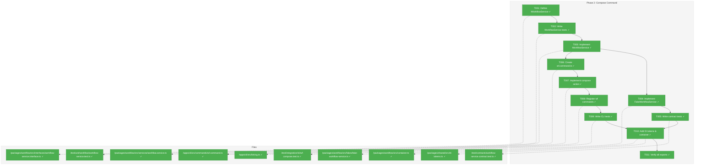
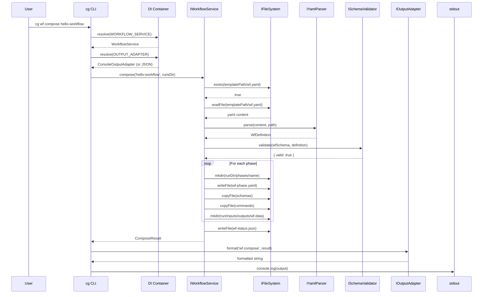

# Phase 2: Compose Command – Tasks & Alignment Brief

**Spec**: [../../wf-basics-spec.md](../../wf-basics-spec.md)
**Plan**: [../../wf-basics-plan.md](../../wf-basics-plan.md)
**Date**: 2026-01-22
**Phase Slug**: `phase-2-compose-command`
**Testing Approach**: Full TDD
**Mock Usage Policy**: Fakes only (per R-TEST-007)

---

## Executive Briefing

### Purpose
This phase implements the `cg wf compose` command, the entry point for all workflow execution. Compose takes a workflow template and creates a self-contained run folder with all necessary structure for phase-by-phase execution. Without this command, agents cannot start new workflow runs.

### What We're Building
The core compose functionality:
- **IWorkflowService** interface with `compose(template, runsDir)` method
- **WorkflowService** implementation that:
  - Resolves template slugs to paths (name vs path detection)
  - Parses and validates `wf.yaml` against core schema
  - Creates dated, ordinal-numbered run folder (`run-2026-01-22-001/`)
  - Copies core schemas from `packages/workflow/schemas/` to each phase
  - Copies template schemas to phase `schemas/` directories
  - Extracts per-phase `wf-phase.yaml` from root `wf.yaml`
  - Copies `commands/` (main.md + wf.md) per phase
  - Creates `wf-run/wf-status.json` with initial metadata
- **FakeWorkflowService** for testing downstream consumers
- **CLI command** `cg wf compose <slug>` with `--json` support

### User Value
Users (orchestrators and agents) can initialize new workflow runs from templates with a single command. The run folder is completely self-contained - all schemas, instructions, and metadata are copied in so the run can be processed even if the original template changes.

### Example
**Command**: `cg wf compose hello-workflow`

**Creates**:
```
.chainglass/runs/run-2026-01-22-001/
├── wf.yaml                    # Copied from template
├── wf-run/
│   └── wf-status.json         # Created with initial state
└── phases/
    ├── gather/
    │   ├── wf-phase.yaml      # Extracted from wf.yaml
    │   ├── commands/
    │   │   ├── main.md        # From template
    │   │   └── wf.md          # Standard workflow prompt
    │   ├── schemas/
    │   │   ├── wf.schema.json       # Core (from CLI)
    │   │   ├── wf-phase.schema.json # Core (from CLI)
    │   │   ├── message.schema.json  # Core (from CLI)
    │   │   └── gather-data.schema.json # Template-specific
    │   └── run/
    │       ├── inputs/
    │       │   ├── files/
    │       │   └── data/
    │       ├── outputs/
    │       └── wf-data/
    ├── process/
    │   └── ...
    └── report/
        └── ...
```

**JSON Output** (`--json`):
```json
{
  "success": true,
  "command": "wf.compose",
  "timestamp": "2026-01-22T14:30:00.000Z",
  "data": {
    "runDir": ".chainglass/runs/run-2026-01-22-001",
    "template": "hello-workflow",
    "phases": [
      { "name": "gather", "status": "pending", "order": 1 },
      { "name": "process", "status": "pending", "order": 2 },
      { "name": "report", "status": "pending", "order": 3 }
    ]
  }
}
```

---

## Objectives & Scope

### Objective
Implement `cg wf compose` command and `IWorkflowService.compose()` per plan tasks 2.1-2.11, ensuring complete run folder creation with self-contained schemas and phase structure.

**Behavior Checklist**:
- [ ] `IWorkflowService` interface exported from `@chainglass/workflow`
- [ ] `WorkflowService.compose()` creates complete run folder structure
- [ ] Template slug resolution: name (search paths) vs path (direct)
- [ ] Core schemas copied from `packages/workflow/schemas/` to each phase
- [ ] Template schemas copied to appropriate phase `schemas/` directories
- [ ] `wf-phase.yaml` extracted per phase from root `wf.yaml`
- [ ] `wf-run/wf-status.json` created with correct metadata
- [ ] Run folder naming: `run-{date}-{ordinal}` format
- [ ] CLI command `cg wf compose` registered and working
- [ ] JSON output via `--json` flag with `CommandResponse` envelope
- [ ] Error E020 for template not found with actionable message

### Goals

- ✅ Define `IWorkflowService` interface with `compose()` method
- ✅ Implement `WorkflowService` using `IFileSystem`, `IYamlParser`, `ISchemaValidator`
- ✅ Implement `FakeWorkflowService` with configurable results
- ✅ Create `cg wf` command group in CLI
- ✅ Implement `cg wf compose <slug>` action with `--json` support
- ✅ Write contract tests ensuring fake/real service parity
- ✅ Export `IWorkflowService` and `WorkflowService` from `@chainglass/workflow`
- ✅ Register `wf` commands in CLI main

### Non-Goals (Scope Boundaries)

- ❌ Phase operations (`cg phase prepare/validate/finalize`) — Phase 3
- ❌ Parameter extraction (`output_parameters`) — Phase 3
- ❌ Inter-phase file copying (`from_phase`) — Phase 3
- ❌ Message system operations — Phase 3+
- ❌ MCP tools — Phase 5
- ❌ Remote templates (all templates are local) — Out of scope
- ❌ Template versioning/migration — Out of scope
- ❌ Concurrent access handling — Out of scope initially
- ❌ Color/styling for console output (using ConsoleOutputAdapter as-is)

---

## Architecture Map

### Component Diagram
<!-- Status: grey=pending, orange=in-progress, green=completed, red=blocked -->
<!-- Updated by plan-6 during implementation -->



### Task-to-Component Mapping

<!-- Status: ⬜ Pending | 🟧 In Progress | ✅ Complete | 🔴 Blocked -->

| Task | Component(s) | Files | Status | Comment |
|------|-------------|-------|--------|---------|
| T001 | IWorkflowService | interfaces/workflow-service.interface.ts | ✅ Complete | compose() method signature |
| T002 | WorkflowService Tests | test/unit/workflow/workflow-service.test.ts | ✅ Complete | TDD: tests first |
| T003 | WorkflowService | services/workflow.service.ts | ✅ Complete | compose() implementation |
| T004 | FakeWorkflowService | fakes/fake-workflow-service.ts | ✅ Complete | Test double |
| T005 | Contract Tests | test/contracts/workflow-service.contract.test.ts | ✅ Complete | Fake/real parity |
| T006 | WF Command Module | apps/cli/src/commands/wf.command.ts | ✅ Complete | Command group setup |
| T007 | Compose Action | apps/cli/src/commands/wf.command.ts | ✅ Complete | cg wf compose handler |
| T008 | CLI Registration | apps/cli/src/bin/cg.ts | ✅ Complete | Register wf commands |
| T009 | CLI Integration Tests | test/integration/cli/wf-compose.test.ts | ✅ Complete | E2E compose tests (10 tests) |
| T010 | DI Integration | di-tokens.ts, container.ts | ✅ Complete | WORKFLOW_SERVICE token |
| T011 | Export Verification | index.ts files | ✅ Complete | All exports work |

---

## Tasks

| Status | ID | Task | CS | Type | Dependencies | Absolute Path(s) | Validation | Subtasks | Notes |
|--------|------|------|-----|------|--------------|------------------|------------|----------|-------|
| [x] | T001 | Define `IWorkflowService` interface with `compose()` method | 1 | Core | – | /home/jak/substrate/003-wf-basics/packages/workflow/src/interfaces/workflow-service.interface.ts, /home/jak/substrate/003-wf-basics/packages/workflow/src/interfaces/index.ts | Interface exported from @chainglass/workflow | – | `compose(template: string, runsDir: string): Promise<ComposeResult>` |
| [x] | T002 | Write tests for `WorkflowService.compose()` (TDD: tests first) | 3 | Test | T001 | /home/jak/substrate/003-wf-basics/test/unit/workflow/workflow-service.test.ts | Tests exist and fail (RED phase); cover success, invalid template, validation errors | – | Per plan test examples; use FakeFileSystem |
| [x] | T003 | Implement `WorkflowService.compose()` | 4 | Core | T002 | /home/jak/substrate/003-wf-basics/packages/workflow/src/services/workflow.service.ts, /home/jak/substrate/003-wf-basics/packages/workflow/src/services/index.ts, /home/jak/substrate/003-wf-basics/packages/workflow/src/schemas/index.ts | All tests pass (GREEN phase) | – | Uses IFileSystem, IYamlParser, ISchemaValidator, IPathResolver; **DYK-01**: Create src/schemas/index.ts to embed core schemas as TS modules |
| [x] | T004 | Implement `FakeWorkflowService` with preset results | 2 | Core | T003 | /home/jak/substrate/003-wf-basics/packages/workflow/src/fakes/fake-workflow-service.ts, /home/jak/substrate/003-wf-basics/packages/workflow/src/fakes/index.ts | Fake has setComposeResult(), getLastComposeCall(), getComposeCallCount(), reset() | – | **DYK-04**: Follow FakeOutputAdapter pattern (call capture + preset results); use ComposeCall interface for typed call tracking |
| [x] | T005 | Write contract tests for `IWorkflowService` | 2 | Test | T003, T004 | /home/jak/substrate/003-wf-basics/test/contracts/workflow-service.contract.test.ts | Contract tests pass for both WorkflowService and FakeWorkflowService | – | Follows filesystem.contract.ts pattern |
| [x] | T006 | Create `wf.command.ts` with command group skeleton | 2 | Core | – | /home/jak/substrate/003-wf-basics/apps/cli/src/commands/wf.command.ts, /home/jak/substrate/003-wf-basics/apps/cli/src/commands/index.ts | `registerWfCommands()` function exported | – | Per Critical Discovery 02; follows web.command.ts pattern |
| [x] | T007 | Implement `cg wf compose <slug>` action handler | 2 | Core | T003, T006 | /home/jak/substrate/003-wf-basics/apps/cli/src/commands/wf.command.ts | Compose command works with both console and --json output | – | **DYK-05**: Pure wiring - ConsoleOutputAdapter already has wf.compose case; resolve service/adapter from DI, call compose, format, print |
| [x] | T008 | Register wf commands in cg.ts main | 1 | Core | T006 | /home/jak/substrate/003-wf-basics/apps/cli/src/bin/cg.ts | `cg wf --help` shows compose subcommand | – | Call registerWfCommands(program) |
| [x] | T009 | Write CLI integration tests for compose | 2 | Test | T007, T008 | /home/jak/substrate/003-wf-basics/test/integration/cli/wf-compose.test.ts | Integration tests pass against exemplar template | – | AC-06, AC-07, AC-07a, AC-08, AC-09 |
| [x] | T010 | Add WORKFLOW_SERVICE DI token and update containers | 2 | Core | T003, T004 | /home/jak/substrate/003-wf-basics/packages/shared/src/di-tokens.ts, /home/jak/substrate/003-wf-basics/packages/workflow/src/container.ts | Container resolves IWorkflowService correctly | – | Production and test containers |
| [x] | T011 | Verify all exports from @chainglass/workflow | 1 | Integration | T010 | /home/jak/substrate/003-wf-basics/packages/workflow/src/index.ts | `import { IWorkflowService, WorkflowService } from '@chainglass/workflow'` works | – | Final verification |

---

## Alignment Brief

### Prior Phases Review

#### Phase 0: Development Exemplar — Summary

**Deliverables Created**:
- **Template** at `/home/jak/substrate/003-wf-basics/dev/examples/wf/template/hello-workflow/`:
  - `wf.yaml` — 3-phase workflow definition with `inputs.messages` declarations
  - `schemas/` — 6 JSON Schemas (wf, wf-phase, gather-data, process-data, message)
  - `phases/*/commands/` — Agent instruction files (main.md + wf.md per phase)
  - `templates/wf.md` — Standard workflow prompt

- **Run Example** at `/home/jak/substrate/003-wf-basics/dev/examples/wf/runs/run-example-001/`:
  - Complete workflow execution with all 3 phases finalized
  - All JSON files pass schema validation
  - Directory structure as reference for compose output

**Dependencies Exported for Phase 2**:
| Artifact | Path | Usage |
|----------|------|-------|
| Template `wf.yaml` | `dev/examples/wf/template/hello-workflow/wf.yaml` | Test fixture for compose |
| Core schemas | `dev/examples/wf/template/hello-workflow/schemas/wf.schema.json` etc. | Verified during Phase 0 |
| Run structure | `dev/examples/wf/runs/run-example-001/` | Reference for expected output |
| `templates/wf.md` | `dev/examples/wf/template/hello-workflow/templates/wf.md` | Standard workflow prompt to copy |

**Key Architectural Patterns**:
1. **Core vs Template Schemas**: Core schemas (wf, wf-phase, message) ship with CLI; template schemas (gather-data, process-data) are per-template
2. **Schema Merge at Compose**: Compose copies BOTH core and template schemas into each phase's `schemas/` directory
3. **Standard wf.md**: The `templates/wf.md` file is copied to each phase's `commands/` alongside `main.md`

---

#### Phase 1: Core Infrastructure — Summary

**Deliverables Created**:
- **packages/workflow/** with types, interfaces, adapters, fakes
- **Core Schemas** at `/home/jak/substrate/003-wf-basics/packages/workflow/schemas/`:
  - `wf.schema.json` — Workflow definition validation
  - `wf-phase.schema.json` — Phase state tracking
  - `message.schema.json` — Agent-orchestrator messages
  - `wf-status.schema.json` — Run-level status

- **TypeScript Types** at `/home/jak/substrate/003-wf-basics/packages/workflow/src/types/`:
  - `WfDefinition`, `PhaseDefinition`, `InputDeclaration`, `FileInput`, `ParameterInput`, `MessageInput`, `Output`, `OutputParameter`
  - `WfPhaseState`, `StatusEntry`, `Facilitator`, `PhaseState`
  - `WfStatus`, `WfStatusWorkflow`, `WfStatusRun`, `WfStatusPhase`

- **Interfaces & Adapters**:
  - `IFileSystem` / `NodeFileSystemAdapter` / `FakeFileSystem`
  - `IPathResolver` / `PathResolverAdapter` / `FakePathResolver`
  - `IYamlParser` / `YamlParserAdapter` / `FakeYamlParser`
  - `ISchemaValidator` / `SchemaValidatorAdapter` / `FakeSchemaValidator`

- **DI Infrastructure**:
  - `SHARED_DI_TOKENS`, `WORKFLOW_DI_TOKENS`
  - `createWorkflowProductionContainer()`, `createWorkflowTestContainer()`

**Dependencies Exported for Phase 2**:
| Interface | Usage in Phase 2 |
|-----------|------------------|
| `IFileSystem` | Read template, create run folder, copy files |
| `IPathResolver` | Secure path resolution for template and run paths |
| `IYamlParser` | Parse wf.yaml template |
| `ISchemaValidator` | Validate wf.yaml against wf.schema.json |
| `WfDefinition` | Type for parsed wf.yaml |
| `WfStatus` | Type for wf-run/wf-status.json |
| Contract test pattern | `fileSystemContractTests()` as template for `workflowServiceContractTests()` |

**Technical Discoveries Relevant to Phase 2**:
- FakeFileSystem handles implicit directories (directories exist when files under them exist)
- AJV strict mode requires properties redeclared in if/then blocks
- yaml package error locations come from `linePos` array

---

#### Phase 1a: Output Adapter Architecture — Summary

**Deliverables Created**:
- **Result Types** at `/home/jak/substrate/003-wf-basics/packages/shared/src/interfaces/results/`:
  - `BaseResult`, `ResultError`
  - `ComposeResult`, `PrepareResult`, `ValidateResult`, `FinalizeResult`
  - `PhaseInfo`, `ResolvedInput`, `CopiedFile`, `ValidatedOutput`

- **Output Adapters** at `/home/jak/substrate/003-wf-basics/packages/shared/src/adapters/`:
  - `JsonOutputAdapter` — JSON envelope with CommandResponse
  - `ConsoleOutputAdapter` — Human-readable with icons
  - `FakeOutputAdapter` — Test inspection methods

- **DI Token**: `SHARED_DI_TOKENS.OUTPUT_ADAPTER`

**Dependencies Exported for Phase 2**:
| Export | Usage in Phase 2 |
|--------|------------------|
| `ComposeResult` | Return type from WorkflowService.compose() |
| `PhaseInfo` | Part of ComposeResult.phases[] |
| `IOutputAdapter` | CLI uses to format output |
| `JsonOutputAdapter` / `ConsoleOutputAdapter` | DI selects based on --json flag |
| `SHARED_DI_TOKENS.OUTPUT_ADAPTER` | DI token for output adapter |

**Key Patterns Established**:
1. **Command dispatch in ConsoleOutputAdapter**: Add case for 'wf.compose' command
2. **Error-length-determines-success**: `errors.length === 0` means success
3. **Omit errors from data**: JSON success response omits `errors` array

---

### Cross-Phase Synthesis

**Complete Dependency Tree for Phase 2**:
```
Phase 2: Compose Command
├── Phase 0: Development Exemplar
│   ├── Template structure reference
│   ├── Run folder structure reference
│   └── Test fixtures (wf.yaml, schemas)
├── Phase 1: Core Infrastructure
│   ├── IFileSystem → read/write/mkdir/copy
│   ├── IPathResolver → secure path resolution
│   ├── IYamlParser → parse wf.yaml
│   ├── ISchemaValidator → validate wf.yaml
│   ├── WfDefinition type → parsed workflow
│   ├── WfStatus type → wf-status.json
│   └── DI container pattern
└── Phase 1a: Output Adapter Architecture
    ├── ComposeResult type
    ├── PhaseInfo type
    ├── IOutputAdapter → format output
    └── Error handling pattern
```

**Pattern Evolution**:
- Phase 1 established Interface + Adapter + Fake triplet → Phase 2 continues with IWorkflowService
- Phase 1a established Output Adapter pattern → Phase 2 uses for CLI output
- Phase 0 established exemplar structure → Phase 2 creates this structure programmatically

**Reusable Test Infrastructure**:
- `FakeFileSystem` for simulating template and run directories
- `FakeYamlParser` for preset wf.yaml content
- `FakeSchemaValidator` for validation results
- Contract test pattern from `filesystem.contract.ts`

---

### Critical Findings Affecting This Phase

| Finding | Impact | Addressed By |
|---------|--------|--------------|
| **CD-01: Output Adapter Architecture** | CLI uses IOutputAdapter for formatting | T007 uses adapters |
| **CD-04: IFileSystem Isolation** | WorkflowService uses IFileSystem, never fs | T003 injects IFileSystem |
| **CD-05: DI Token Pattern** | Add WORKFLOW_SERVICE token | T010 |
| **CD-06: YAML Error Locations** | compose() returns actionable errors | T003 returns YamlParseError details |
| **CD-07: Actionable JSON Schema Errors** | wf.yaml validation returns actionable errors | T003 uses ISchemaValidator |
| **Template Slug Resolution** | Name vs path detection per plan § Design Decisions | T003 implements KISS resolution |
| **DYK-01: Schema Embedding** | Core schemas must be embedded as TS modules (not file reads) because esbuild bundles JS only | T003 imports from `src/schemas/index.ts` |
| **DYK-02: Tilde Expansion** | Node.js path module does NOT expand `~`; must use `os.homedir()` before path detection | T003 implements expandTilde() utility |
| **DYK-03: Ordinal Discovery** | IFileSystem.readDir() has no glob; must regex-filter entries to find max ordinal for date | T003 implements getNextRunOrdinal() with regex pattern |
| **DYK-04: Fake Pattern** | FakeWorkflowService needs call capture (like FakeOutputAdapter), not just state storage (like FakeFileSystem) | T004 implements setComposeResult() + getLastComposeCall() + getComposeCallCount() + reset() |
| **DYK-05: Adapter Ready** | ConsoleOutputAdapter already has wf.compose case (Phase 1a); T007 is pure wiring, no adapter changes needed | T007 uses existing adapter.format('wf.compose', result) |

**Template Slug Resolution Logic** (from plan, enhanced with DYK-02):
```
1. Expand tilde: if starts with "~", replace with os.homedir()
2. Check KISS indicators:
   Contains "/" OR starts with "." OR path.isAbsolute()?
   → YES: Treat as PATH, resolve directly
   → NO:  Treat as NAME, search template libraries
```

Search Order for Names:
1. `.chainglass/templates/<name>/` — Project-local
2. `~/.config/chainglass/templates/<name>/` — User-global

---

### ADR Decision Constraints

| ADR | Status | Constraints | Addressed By |
|-----|--------|-------------|--------------|
| ADR-0002 | Accepted | Exemplar-driven development | Test against exemplar in `dev/examples/wf/` |

---

### Invariants & Guardrails

- **Run folder naming**: `run-{YYYY-MM-DD}-{NNN}` where NNN is zero-padded ordinal (DYK-03: ordinal is date-scoped, found via regex filter of readDir() results, handles gaps by finding max+1)
- **All schemas copied**: Each phase gets core + template schemas in `schemas/`
- **wf-status.json structure**: Per WfStatus type from Phase 1
- **Phase extraction**: Each phase folder gets `wf-phase.yaml` with only that phase's definition
- **Commands copied**: `main.md` from template, `wf.md` from template's `templates/` or package default
- **No side effects on template**: Compose reads template, never writes to it

---

### Inputs to Read

| File | Purpose |
|------|---------|
| `/home/jak/substrate/003-wf-basics/packages/workflow/src/types/wf.types.ts` | WfDefinition, PhaseDefinition types |
| `/home/jak/substrate/003-wf-basics/packages/workflow/src/types/wf-status.types.ts` | WfStatus type for wf-status.json |
| `/home/jak/substrate/003-wf-basics/packages/workflow/src/container.ts` | DI container pattern |
| `/home/jak/substrate/003-wf-basics/packages/workflow/schemas/wf.schema.json` | Core schema for validation |
| `/home/jak/substrate/003-wf-basics/dev/examples/wf/template/hello-workflow/wf.yaml` | Exemplar for testing |
| `/home/jak/substrate/003-wf-basics/dev/examples/wf/runs/run-example-001/` | Reference run folder structure |
| `/home/jak/substrate/003-wf-basics/apps/cli/src/commands/web.command.ts` | CLI command pattern |
| `/home/jak/substrate/003-wf-basics/apps/cli/src/bin/cg.ts` | Main CLI setup |
| `/home/jak/substrate/003-wf-basics/packages/shared/src/interfaces/results/command.types.ts` | ComposeResult, PhaseInfo types |
| `/home/jak/substrate/003-wf-basics/test/contracts/filesystem.contract.ts` | Contract test pattern |

---

### Visual Alignment Aids

#### System State Flow (Compose Operation)

```mermaid
flowchart LR
    subgraph Input["Input"]
        SLUG["Template Slug<br/>'hello-workflow'"]
    end

    subgraph Resolution["Template Resolution"]
        DETECT{"Is path<br/>or name?"}
        SEARCH["Search paths:<br/>1. .chainglass/templates/<br/>2. ~/.config/chainglass/templates/"]
        RESOLVE["Resolve path<br/>directly"]
    end

    subgraph Validation["Template Validation"]
        READ["Read<br/>wf.yaml"]
        PARSE["Parse<br/>YAML"]
        VALIDATE["Validate vs<br/>wf.schema.json"]
    end

    subgraph Creation["Run Folder Creation"]
        MKDIR["Create<br/>run-{date}-{ord}"]
        COPY_WF["Copy<br/>wf.yaml"]
        STATUS["Create<br/>wf-status.json"]
        PHASES["For each phase:"]
        PHASE_DIR["Create phase dir"]
        EXTRACT["Extract<br/>wf-phase.yaml"]
        COPY_SCHEMAS["Copy schemas<br/>(core + template)"]
        COPY_CMDS["Copy commands<br/>(main.md + wf.md)"]
        MAKE_RUN["Create run/<br/>inputs/outputs/wf-data"]
    end

    subgraph Output["Output"]
        RESULT["ComposeResult<br/>runDir, phases"]
    end

    SLUG --> DETECT
    DETECT -->|"has /, ., ~"| RESOLVE
    DETECT -->|"name only"| SEARCH
    SEARCH --> READ
    RESOLVE --> READ
    READ --> PARSE
    PARSE --> VALIDATE
    VALIDATE --> MKDIR
    MKDIR --> COPY_WF
    COPY_WF --> STATUS
    STATUS --> PHASES
    PHASES --> PHASE_DIR
    PHASE_DIR --> EXTRACT
    EXTRACT --> COPY_SCHEMAS
    COPY_SCHEMAS --> COPY_CMDS
    COPY_CMDS --> MAKE_RUN
    MAKE_RUN -->|"next phase"| PHASES
    PHASES -->|"done"| RESULT
```



#### Sequence Diagram: CLI Compose Flow



---

### Test Plan (Full TDD)

**Named Tests for WorkflowService.compose()** (`test/unit/workflow/workflow-service.test.ts`):

| Test Name | Purpose | Fixture | Expected Output |
|-----------|---------|---------|-----------------|
| `should create run folder from template` | Core happy path | FakeFileSystem with template | ComposeResult with runDir, 3 phases |
| `should return E020 for non-existent template` | Missing template | Empty FakeFileSystem | `errors[0].code === 'E020'` |
| `should return E021 for invalid wf.yaml syntax` | YAML parse error | FakeFileSystem with bad YAML | `errors[0].code === 'E021'` |
| `should return E022 for wf.yaml schema validation failure` | Invalid schema | FakeFileSystem with invalid wf.yaml | `errors[0].code === 'E022'` |
| `should copy core schemas to each phase` | Schema copying | Template with phases | Core schemas in each phase/schemas/ |
| `should copy template schemas to phases` | Template schemas | Template with gather-data.schema.json | Template schema in gather/schemas/ |
| `should extract wf-phase.yaml per phase` | Phase extraction | Template with 3 phases | Each phase has wf-phase.yaml |
| `should copy commands (main.md + wf.md)` | Command copying | Template with commands | Each phase has commands/ |
| `should create wf-status.json with metadata` | Status creation | Any valid template | wf-status.json exists with phases |
| `should use date-ordinal naming for run folder` | Naming convention | Multiple composes | run-YYYY-MM-DD-001, 002, etc. |
| `should resolve template name via search paths` | Name resolution | Template at .chainglass/templates/ | Finds and uses template |
| `should resolve template path directly` | Path resolution | Template at ./custom/path | Uses path directly |

**Named Tests for FakeWorkflowService** (`test/unit/workflow/fake-workflow-service.test.ts`):

| Test Name | Purpose | Fixture | Expected Output |
|-----------|---------|---------|-----------------|
| `should return preset ComposeResult` | Preset results | setComposeResult() called | Returns preset result |
| `should capture last compose call` | Call tracking | compose() called | getLastComposeCall() returns args |
| `should reset state` | State reset | Multiple calls then reset() | getLastComposeCall() returns null |

**Contract Tests** (`test/contracts/workflow-service.contract.test.ts`):

| Test Name | Purpose |
|-----------|---------|
| `should return success for valid template` | Both implementations return ComposeResult with empty errors |
| `should return E020 for missing template` | Both implementations return error with code E020 |
| `should create correct phase structure` | Both implementations create same folder structure |

**CLI Integration Tests** (`test/integration/cli/wf-compose.test.ts`):

| Test Name | Purpose |
|-----------|---------|
| `cg wf --help shows compose subcommand` | AC-06 verification |
| `cg wf compose hello-workflow creates run folder` | AC-07 verification |
| `cg wf compose --json returns valid envelope` | AC-07a verification |
| `wf-status.json contains correct metadata` | AC-08 verification |
| `each phase folder has wf-phase.yaml` | AC-09 verification |

---

### Step-by-Step Implementation Outline

1. **T001: Define IWorkflowService Interface**
   - Create `packages/workflow/src/interfaces/workflow-service.interface.ts`
   - Define `IWorkflowService` with `compose(template: string, runsDir: string): Promise<ComposeResult>`
   - Export from `packages/workflow/src/interfaces/index.ts`

2. **T002: Write WorkflowService Tests (RED Phase)**
   - Create `test/unit/workflow/workflow-service.test.ts`
   - Write tests per Test Plan above using FakeFileSystem, FakeYamlParser, FakeSchemaValidator
   - Verify tests fail (WorkflowService doesn't exist yet)

3. **T003: Implement WorkflowService.compose() (GREEN Phase)**
   - Create `packages/workflow/src/services/workflow.service.ts`
   - Inject `IFileSystem`, `IYamlParser`, `ISchemaValidator`, `IPathResolver`
   - Implement template resolution logic (name vs path)
   - Implement compose algorithm:
     1. Resolve template path
     2. Read and parse wf.yaml
     3. Validate against wf.schema.json
     4. Generate run folder name (date + ordinal)
     5. Create run folder structure
     6. Copy wf.yaml to run
     7. Create wf-status.json
     8. For each phase: create phase dir, extract wf-phase.yaml, copy schemas, copy commands, create run/ subdirs
   - Return ComposeResult with runDir, template slug, phases array
   - Handle errors: E020 (not found), E021 (parse error), E022 (validation error)
   - Create barrel `packages/workflow/src/services/index.ts`

4. **T004: Implement FakeWorkflowService**
   - Create `packages/workflow/src/fakes/fake-workflow-service.ts`
   - Add `setComposeResult(result: ComposeResult)` for presets
   - Add `getLastComposeCall(): { template: string, runsDir: string } | null`
   - Add `reset()` method
   - Export from `packages/workflow/src/fakes/index.ts`

5. **T005: Write Contract Tests**
   - Create `test/contracts/workflow-service.contract.test.ts`
   - Follow `filesystem.contract.ts` pattern
   - Create `workflowServiceContractTests(name, contextFactory)` function
   - Run against both WorkflowService (with real FakeFileSystem setup) and FakeWorkflowService

6. **T006: Create wf.command.ts**
   - Create `apps/cli/src/commands/wf.command.ts`
   - Define `registerWfCommands(program: Command)` function
   - Add `wf` command group with description
   - Export from `apps/cli/src/commands/index.ts`

7. **T007: Implement Compose Action**
   - Add `wf compose <slug>` subcommand in `wf.command.ts`
   - Options: `--json` flag, `--runs-dir` (default `.chainglass/runs`)
   - Get IWorkflowService from DI container
   - Get IOutputAdapter from DI container (JSON or Console based on flag)
   - Call `service.compose(slug, runsDir)`
   - Format result with `adapter.format('wf.compose', result)`
   - Print output, set exit code based on `errors.length`

8. **T008: Register WF Commands in cg.ts**
   - Import `registerWfCommands` from commands/wf.command.ts
   - Call `registerWfCommands(program)` in createProgram()
   - Update help examples to include wf commands

9. **T009: Write CLI Integration Tests**
   - Create `test/integration/cli/wf-compose.test.ts`
   - Set up test template using exemplar structure
   - Test `cg wf --help` shows compose
   - Test `cg wf compose <template>` creates correct structure
   - Test `cg wf compose --json` returns valid JSON envelope
   - Verify AC-06, AC-07, AC-07a, AC-08, AC-09

10. **T010: Add DI Token and Update Containers**
    - Add `WORKFLOW_SERVICE: 'IWorkflowService'` to `WORKFLOW_DI_TOKENS` in `di-tokens.ts`
    - Update `createWorkflowProductionContainer()` to register WorkflowService
    - Update `createWorkflowTestContainer()` to register FakeWorkflowService

11. **T011: Verify All Exports**
    - Ensure `@chainglass/workflow` exports IWorkflowService, WorkflowService, FakeWorkflowService
    - Verify imports work from external package
    - Run `pnpm -F @chainglass/workflow build`
    - Run full test suite

---

### Commands to Run

```bash
# Environment setup
cd /home/jak/substrate/003-wf-basics
pnpm install

# Run unit tests during development
pnpm exec vitest run test/unit/workflow/workflow-service.test.ts --config test/vitest.config.ts

# Run contract tests
pnpm exec vitest run test/contracts/workflow-service.contract.test.ts --config test/vitest.config.ts

# Run CLI integration tests
pnpm exec vitest run test/integration/cli/wf-compose.test.ts --config test/vitest.config.ts

# Run all tests
pnpm test

# Type checking
pnpm typecheck

# Linting
pnpm lint

# Build workflow package
pnpm -F @chainglass/workflow build

# Build CLI
pnpm -F @chainglass/cli build

# Test CLI manually
pnpm -F @chainglass/cli exec cg wf --help
pnpm -F @chainglass/cli exec cg wf compose hello-workflow --json

# Full quality check
just check
```

---

### Risks/Unknowns

| Risk | Severity | Likelihood | Mitigation |
|------|----------|------------|------------|
| Template discovery edge cases | Medium | Low | Keep KISS: check exists(), don't glob |
| Run folder ordinal collision | Low | Low | Read existing run-* folders, find max ordinal |
| Schema path resolution | Medium | Medium | Use IPathResolver consistently |
| CLI DI container setup | Medium | Medium | Follow existing MCP command pattern |
| ConsoleOutputAdapter needs wf.compose case | Low | High | Add case in formatSuccess/formatFailure switches |

---

### Ready Check

- [x] Phase 0, 1, 1a reviewed — deliverables, lessons, discoveries documented above
- [x] Critical findings mapped to tasks — CD-01, CD-04, CD-05, CD-06, CD-07
- [x] Template resolution logic documented — KISS name vs path detection
- [x] ADR constraints mapped — ADR-0002 (exemplar-driven development)
- [x] Non-goals explicitly stated — no phase operations, no MCP
- [x] Test plan covers all plan tasks and ACs
- [x] Implementation order respects dependencies
- [x] Commands documented and copy-pasteable

---

## Phase Footnote Stubs

_Populated during implementation by plan-6. Do not create footnote tags during planning._

| Footnote | Task | Description | FlowSpace Node IDs |
|----------|------|-------------|-------------------|
| | | | |

---

## Evidence Artifacts

| Artifact | Location | Purpose |
|----------|----------|---------|
| Execution Log | `./execution.log.md` | Task-by-task implementation narrative |
| Unit Tests | `/home/jak/substrate/003-wf-basics/test/unit/workflow/workflow-service.test.ts` | TDD test file |
| Contract Tests | `/home/jak/substrate/003-wf-basics/test/contracts/workflow-service.contract.test.ts` | Service parity tests |
| Integration Tests | `/home/jak/substrate/003-wf-basics/test/integration/cli/wf-compose.test.ts` | CLI E2E tests |

---

## Discoveries & Learnings

_Populated during implementation by plan-6. Log anything of interest to your future self._

| Date | Task | Type | Discovery | Resolution | References |
|------|------|------|-----------|------------|------------|
| | | | | | |

**Types**: `gotcha` | `research-needed` | `unexpected-behavior` | `workaround` | `decision` | `debt` | `insight`

**What to log**:
- Things that didn't work as expected
- External research that was required
- Implementation troubles and how they were resolved
- Gotchas and edge cases discovered
- Decisions made during implementation
- Technical debt introduced (and why)
- Insights that future phases should know about

_See also: `execution.log.md` for detailed narrative._

---

## Directory Layout

```
docs/plans/003-wf-basics/
├── wf-basics-plan.md
├── wf-basics-spec.md
└── tasks/
    ├── phase-0-development-exemplar/
    │   ├── tasks.md
    │   └── execution.log.md
    ├── phase-1-core-infrastructure/
    │   ├── tasks.md
    │   └── execution.log.md
    ├── phase-1a-output-adapter-architecture/
    │   ├── tasks.md
    │   └── execution.log.md
    └── phase-2-compose-command/
        ├── tasks.md              # This file
        └── execution.log.md      # Created by /plan-6
```

---

*Generated by /plan-5-phase-tasks-and-brief*

---

## Critical Insights Discussion

**Session**: 2026-01-22
**Context**: Phase 2: Compose Command tasks.md dossier pre-implementation review
**Analyst**: AI Clarity Agent (Claude Opus 4.5)
**Reviewer**: Development Team
**Format**: Water Cooler Conversation (5 Critical Insights)

### Insight 1: Core Schemas Have a Packaging Gap

**Did you know**: The `packages/workflow/schemas/` directory with 4 core schema files won't ship to the CLI at runtime because esbuild bundles JavaScript only - not raw JSON files.

**Implications**:
- Tests pass (run against source files)
- Production CLI fails (schemas not in bundle)
- package.json exports field is misleading after bundling

**Options Considered**:
- Option A: Add esbuild post-build copy step - Feasible, follows copyNextjsAssets pattern
- Option B: Embed schemas as TypeScript modules - Feasible, zero runtime I/O
- Option C: Use require.resolve at runtime - Not Feasible, esbuild bundles eliminate separate packages

**AI Recommendation**: Option B (Embed Schemas as TypeScript Modules)
- Reasoning: Eliminates entire category of "file not found" bugs, build-time validation catches schema errors

**Discussion Summary**: User agreed that embedding schemas is cleaner than managing esbuild copy steps.

**Decision**: Embed schemas as TypeScript modules in `src/schemas/index.ts`

**Action Items**:
- [ ] Create `packages/workflow/src/schemas/index.ts` exporting all 4 schemas as const objects
- [ ] T003 imports schemas from module instead of file reads

**Affects**: T003 implementation, no esbuild changes needed

---

### Insight 2: Template Slug Resolution Has Hidden Edge Cases

**Did you know**: The KISS template resolution logic doesn't handle tilde expansion - Node.js `path` module does NOT expand `~` to the user's home directory automatically.

**Implications**:
- Linux/Mac users expect `~` to work (shell convention)
- `IFileSystem.exists('~/path')` fails because tilde is literal
- Windows paths need `path.isAbsolute()` for drive letter detection

**Options Considered**:
- Option A: KISS as specified + tilde expansion - Feasible, matches user expectations
- Option B: Require explicit protocol prefixes (path: vs name:) - Partial, more verbose
- Option C: Use CLI flags --path vs --name - Feasible, adds complexity

**AI Recommendation**: Option A (KISS + Tilde Expansion)
- Reasoning: Matches spec, user expectations, uses battle-tested path module

**Discussion Summary**: User agreed that tilde expansion is necessary for expected UX.

**Decision**: Implement KISS detection + `expandTilde()` utility using `os.homedir()`

**Action Items**:
- [ ] Implement `expandTilde()` utility in T003
- [ ] Use `path.isAbsolute()` for Windows drive letter detection

**Affects**: T003 template resolution logic

---

### Insight 3: Run Folder Ordinal Discovery Needs Explicit Algorithm

**Did you know**: `IFileSystem.readDir()` returns raw entry names with no pattern matching - compose must manually filter and parse to find the next ordinal.

**Implications**:
- No glob library in dependencies - must use regex filtering
- Algorithm handles: empty dir (→001), gaps (find max+1), different dates
- Concurrent compose: last writer wins (acceptable per low likelihood)

**Options Considered**:
- Option A: Date-scoped ordinal with regex (current spec) - Feasible, human-readable
- Option B: Global ordinal counter file - Feasible, would contradict spec
- Option C: Millisecond timestamps - Feasible, would contradict spec

**AI Recommendation**: Option A (Date-Scoped Ordinal)
- Reasoning: This IS the explicit design per plan, handles edge cases correctly

**Discussion Summary**: User confirmed this is the specified approach.

**Decision**: Implement date-scoped ordinal discovery with regex pattern `^run-YYYY-MM-DD-(\d{3})$`

**Action Items**:
- [ ] Implement `getNextRunOrdinal(fs, runsDir, date)` utility in T003

**Affects**: T003 run folder creation

---

### Insight 4: FakeWorkflowService Must Follow Established Fake Patterns

**Did you know**: FakeWorkflowService needs call capture (like FakeOutputAdapter) rather than just state storage (like FakeFileSystem) to enable CLI testing.

**Implications**:
- Tasks.md specifies `getLastComposeCall()` - need to track method invocations
- FakeOutputAdapter is the template to follow (private calls array + accessors)
- Contract tests validate fake matches real implementation

**Options Considered**:
- Option A: Follow FakeOutputAdapter pattern (preset + call capture) - Feasible, matches spec
- Option B: State-only fake - Partial, can't verify CLI arguments
- Option C: Use vi.fn() mock - Not Feasible, violates "fakes only" policy

**AI Recommendation**: Option A (FakeOutputAdapter Pattern)
- Reasoning: Task spec requires it, CLI testing needs it, pattern is established

**Discussion Summary**: User agreed that call capture is necessary for testing.

**Decision**: Implement with `setComposeResult()`, `getLastComposeCall()`, `getComposeCallCount()`, `reset()`

**Action Items**:
- [ ] T004: Follow FakeOutputAdapter structure with ComposeCall interface

**Affects**: T004, T005 (contract tests)

---

### Insight 5: ConsoleOutputAdapter Already Has wf.compose Support

**Did you know**: Phase 1a already implemented the `wf.compose` case in ConsoleOutputAdapter - T007 is simpler than it might appear (pure wiring, no adapter changes).

**Implications**:
- `formatComposeSuccess()` and `formatComposeFailure()` already exist
- Test coverage exists in console-output-adapter.test.ts
- Phase 1a review confirmed this work with APPROVE verdict

**Options Considered**:
- Option A: Use existing adapter as-is - Feasible, leverages completed work
- Option B: Enhance output formatting - Feasible but unnecessary scope creep
- Option C: Create WF-specific adapter - Not Feasible, violates architecture

**AI Recommendation**: Option A (Use Existing Adapter)
- Reasoning: Work already done and tested, T007 becomes simple wiring

**Discussion Summary**: User agreed to leverage existing Phase 1a work.

**Decision**: T007 is pure wiring - resolve service/adapter, call compose, format, print

**Action Items**:
- [ ] T007: No adapter changes needed, reduced complexity from CS-3 to CS-2

**Affects**: T007 scope is simpler than originally estimated

---

## Session Summary

**Insights Surfaced**: 5 critical insights identified and discussed
**Decisions Made**: 5 decisions reached through collaborative discussion
**Action Items Created**: 8 follow-up tasks identified (incorporated into existing tasks)
**Areas Updated**:
- Critical Findings table: Added DYK-01 through DYK-05
- T003 notes: Schema embedding, tilde expansion, ordinal discovery
- T004 notes: Fake pattern guidance
- T007: Reduced complexity CS-3→CS-2, clarified scope
- Template Resolution Logic: Enhanced with tilde expansion step
- Invariants: Run folder naming algorithm details

**Shared Understanding Achieved**: ✓

**Confidence Level**: High - All insights verified against codebase, decisions align with existing patterns

**Next Steps**:
When ready, run `/plan-6-implement-phase --phase "Phase 2: Compose Command"` to begin implementation.

**Notes**:
- Verification used FlowSpace MCP for codebase exploration
- All 5 insights were verified with 3-5 findings each before presentation
- Phase 1a completion means less work than originally scoped for output formatting
