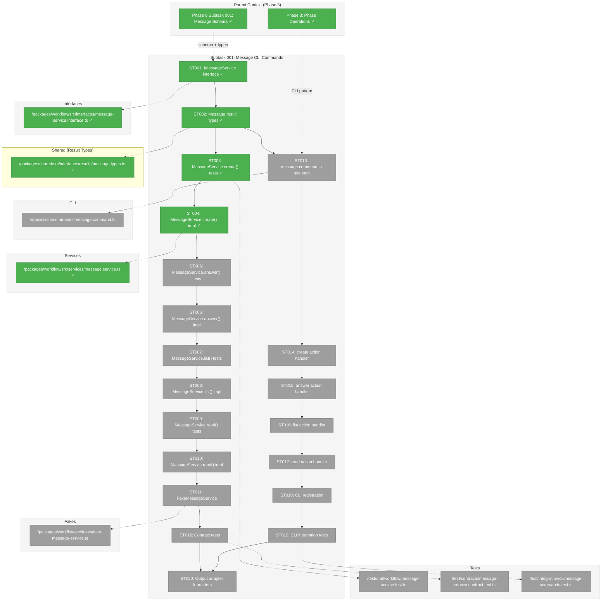
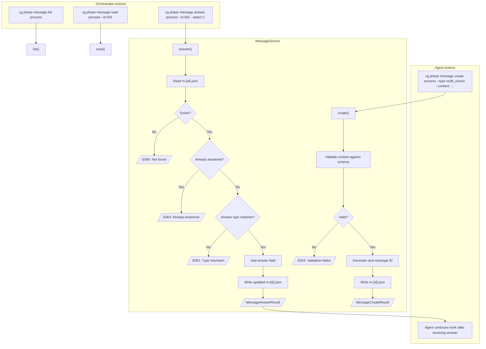
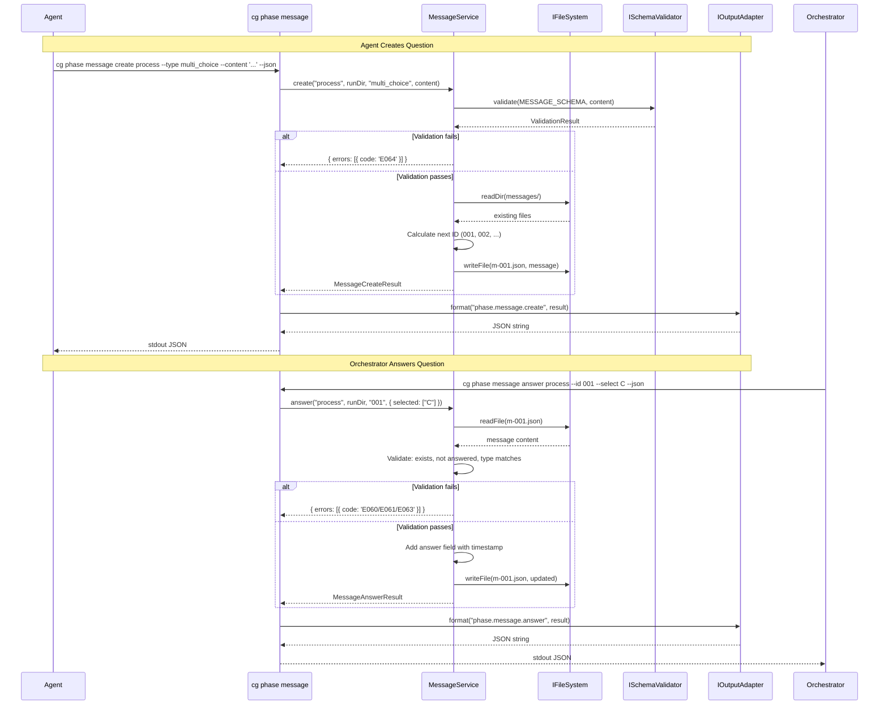

# Subtask 001: Implement Message CLI Commands

**Parent Plan:** [View Plan](../../wf-basics-plan.md)
**Parent Phase:** Phase 3: Phase Operations
**Parent Task(s):** Phase 3 Non-Goals explicitly deferred message commands
**Plan Task Reference:** [Phase 3+ Message Commands in Plan](../../wf-basics-plan.md#cli-commands) (lines 266-288)

**Why This Subtask:**
Message CLI commands (`cg phase message create/answer/list/read`) were explicitly marked as "Future Scope (Phase 3+)" in the plan. The message data model was fully implemented in Phase 0 (Subtask 001: Message Communication), including schema, TypeScript types, and exemplar files. This subtask implements the CLI commands that enable agents and orchestrators to create, answer, list, and read messages during workflow execution.

**Created:** 2026-01-23
**Requested By:** Development Team

---

## Executive Briefing

### Purpose
This subtask implements the four message CLI commands that enable structured communication between agents and orchestrators during workflow execution. Agents can ask clarifying questions mid-phase; orchestrators can provide answers. This completes the facilitator model communication loop.

### What We're Building
Four CLI commands under `cg phase message`:
- **create**: Agent creates a message (question) in a phase's `messages/` directory
- **answer**: Orchestrator provides an answer to an existing message
- **list**: Lists all messages in a phase with their answer status
- **read**: Reads a specific message's full content

Plus supporting infrastructure:
- `IMessageService` interface with `create()`, `answer()`, `list()`, `read()` methods
- `MessageService` implementation with file I/O and validation
- Result types: `MessageCreateResult`, `MessageAnswerResult`, `MessageListResult`, `MessageReadResult`
- `FakeMessageService` for testing with call capture pattern
- Contract tests verifying fake/real parity

### Unblocks
- Enables agent↔orchestrator communication during phase execution
- Completes the facilitator model communication loop
- Supports the `blocked → accepted → active` state transitions
- Required for manual test harness (Subtask 001 in Phase 6)

### Example

**Create a question** (agent asking orchestrator):
```bash
$ cg phase message create process \
    --run-dir .chainglass/runs/run-2026-01-23-001 \
    --type multi_choice \
    --content '{"subject":"Output Format","body":"How should I structure the output?","options":[{"key":"A","label":"Summary"},{"key":"B","label":"Detailed"},{"key":"C","label":"Both"}]}' \
    --json
{
  "success": true,
  "command": "phase.message.create",
  "data": {
    "phase": "process",
    "messageId": "001",
    "filePath": ".../phases/process/run/messages/m-001.json"
  }
}
```

**Answer the question** (orchestrator responding):
```bash
$ cg phase message answer process \
    --run-dir .chainglass/runs/run-2026-01-23-001 \
    --id 001 \
    --select C \
    --note "Include both - stakeholders need summary, devs need details" \
    --json
{
  "success": true,
  "command": "phase.message.answer",
  "data": {
    "phase": "process",
    "messageId": "001",
    "answer": { "selected": ["C"], "note": "..." }
  }
}
```

---

## Objectives & Scope

### Objective
Implement the four message CLI commands (`cg phase message create/answer/list/read`) following the existing CLI patterns established in Phase 3, enabling agent↔orchestrator communication during workflow execution.

### Goals

- ✅ Define `IMessageService` interface with `create()`, `answer()`, `list()`, `read()` methods
- ✅ Implement `MessageService` with full TDD (RED-GREEN-REFACTOR)
- ✅ Implement `FakeMessageService` with call capture pattern
- ✅ Create result types: `MessageCreateResult`, `MessageAnswerResult`, `MessageListResult`, `MessageReadResult`
- ✅ Create `cg phase message create` command with `--type`, `--content`, `--note`, `--json` support
- ✅ Create `cg phase message answer` command with `--id`, `--select/--text/--confirm/--deny`, `--note`, `--json` support
- ✅ Create `cg phase message list` command with `--json` support
- ✅ Create `cg phase message read` command with `--id`, `--json` support
- ✅ Validate messages against existing `message.schema.json`
- ✅ Use error codes E060-E064 for message-specific errors
- ✅ Ensure all operations are idempotent where applicable
- ✅ Write contract tests verifying fake/real parity

### Non-Goals

- ❌ MCP tools for messages (can be added later following Phase 5 pattern)
- ❌ State machine transitions (blocked/accepted states)
- ❌ Message threading or conversation history beyond status log
- ❌ Auto-discovery or message routing
- ❌ `cg phase handover`, `cg phase accept` commands (separate future work)
- ❌ Performance optimization or caching

### Clarification: Status Log Integration IS In Scope

Per DYK session (2026-01-23): MessageService.create() and MessageService.answer() **must** write signpost entries to `wf-phase.json` status array. This is the established pattern from Phase 0 exemplar:

```json
// wf-phase.json status entry (signpost - does NOT repeat message content)
{ "timestamp": "...", "from": "agent", "action": "question", "message_id": "001" }
{ "timestamp": "...", "from": "orchestrator", "action": "answer", "message_id": "001" }
```

The `message_id` references the detailed message file at `messages/m-{id}.json`. This enables:
- Audit trail (status log shows timeline)
- Discoverability (orchestrator can find unanswered questions)
- Separation of concerns (status = timeline, message = content)

See: `docs/how/workflows/1-overview.md`, `dev/examples/wf/runs/run-example-001/phases/process/run/wf-data/wf-phase.json`

---

## Architecture Map

### Component Diagram
<!-- Status: grey=pending, orange=in-progress, green=completed, red=blocked -->
<!-- Updated by plan-6 during implementation -->



### Task-to-Component Mapping

<!-- Status: ⬜ Pending | 🟧 In Progress | ✅ Complete | 🔴 Blocked -->

| Task | Component(s) | Files | Status | Comment |
|------|-------------|-------|--------|---------|
| ST001 | Interface | message-service.interface.ts | ✅ Complete | Define IMessageService contract |
| ST002 | Types | message.types.ts in @chainglass/shared | ✅ Complete | Message result types |
| ST003 | Unit Test | message-service.test.ts | ✅ Complete | TDD RED: create() tests |
| ST004 | Service | message.service.ts | ✅ Complete | TDD GREEN: create() impl |
| ST005 | Unit Test | message-service.test.ts | ⬜ Pending | TDD RED: answer() tests |
| ST006 | Service | message.service.ts | ⬜ Pending | TDD GREEN: answer() impl |
| ST007 | Unit Test | message-service.test.ts | ⬜ Pending | TDD RED: list() tests |
| ST008 | Service | message.service.ts | ⬜ Pending | TDD GREEN: list() impl |
| ST009 | Unit Test | message-service.test.ts | ⬜ Pending | TDD RED: read() tests |
| ST010 | Service | message.service.ts | ⬜ Pending | TDD GREEN: read() impl |
| ST011 | Fake | fake-message-service.ts | ⬜ Pending | Call capture pattern |
| ST012 | Contract Test | message-service.contract.test.ts | ⬜ Pending | Verify fake/real parity |
| ST013 | CLI | message.command.ts | ⬜ Pending | Command skeleton |
| ST014 | CLI | message.command.ts | ⬜ Pending | create action handler |
| ST015 | CLI | message.command.ts | ⬜ Pending | answer action handler |
| ST016 | CLI | message.command.ts | ⬜ Pending | list action handler |
| ST017 | CLI | message.command.ts | ⬜ Pending | read action handler |
| ST018 | CLI | phase.command.ts, cg.ts | ⬜ Pending | Register message subcommand group |
| ST019 | Integration Test | message-commands.test.ts | ⬜ Pending | CLI integration tests |
| ST020 | Adapters | console-output.adapter.ts, json-output.adapter.ts | ⬜ Pending | Add message formatters |

---

## Tasks

| Status | ID | Task | CS | Type | Dependencies | Absolute Path(s) | Validation | Subtasks | Notes |
|--------|------|------|-----|------|--------------|------------------|------------|----------|-------|
| [x] | ST001 | Define `IMessageService` interface with create(), answer(), list(), read() signatures AND `MessageErrorCodes` constants (E060-E064) | 1 | Setup | – | /home/jak/substrate/003-wf-basics/packages/workflow/src/interfaces/message-service.interface.ts | Interface + error codes exported from @chainglass/workflow | – | Per existing IPhaseService + PhaseErrorCodes pattern |
| [x] | ST002 | Add message result types: MessageCreateResult, MessageAnswerResult, MessageListResult, MessageReadResult | 2 | Setup | ST001 | /home/jak/substrate/003-wf-basics/packages/shared/src/interfaces/results/message.types.ts | Types exported, extend BaseResult | – | Per PrepareResult/ValidateResult pattern |
| [x] | ST003 | Write tests for MessageService.create() including validation and idempotency | 3 | Test | ST002 | /home/jak/substrate/003-wf-basics/test/unit/workflow/message-service.test.ts | Tests fail (RED phase) | – | Cover all 4 message types, E064 |
| [x] | ST004 | Implement MessageService.create() | 3 | Core | ST003 | /home/jak/substrate/003-wf-basics/packages/workflow/src/services/message.service.ts | All create tests pass (GREEN) | – | Validates against message schema, writes m-{id}.json |
| [ ] | ST005 | Write tests for MessageService.answer() including type matching and E060-E063 | 3 | Test | ST004 | /home/jak/substrate/003-wf-basics/test/unit/workflow/message-service.test.ts | Tests fail (RED phase) | – | Cover all answer types, existing answer error |
| [ ] | ST006 | Implement MessageService.answer() | 3 | Core | ST005 | /home/jak/substrate/003-wf-basics/packages/workflow/src/services/message.service.ts | All answer tests pass (GREEN) | – | Updates m-{id}.json with answer field |
| [ ] | ST007 | Write tests for MessageService.list() | 2 | Test | ST006 | /home/jak/substrate/003-wf-basics/test/unit/workflow/message-service.test.ts | Tests fail (RED phase) | – | Cover empty, multiple, with/without answers |
| [ ] | ST008 | Implement MessageService.list() | 2 | Core | ST007 | /home/jak/substrate/003-wf-basics/packages/workflow/src/services/message.service.ts | All list tests pass (GREEN) | – | Returns summary of all messages |
| [ ] | ST009 | Write tests for MessageService.read() including E060 for not found | 2 | Test | ST008 | /home/jak/substrate/003-wf-basics/test/unit/workflow/message-service.test.ts | Tests fail (RED phase) | – | Cover found, not found |
| [ ] | ST010 | Implement MessageService.read() | 2 | Core | ST009 | /home/jak/substrate/003-wf-basics/packages/workflow/src/services/message.service.ts | All read tests pass (GREEN) | – | Returns full message content |
| [ ] | ST011 | Implement FakeMessageService with call capture pattern | 2 | Fake | ST010 | /home/jak/substrate/003-wf-basics/packages/workflow/src/fakes/fake-message-service.ts | Fake tests pass | – | Per FakePhaseService pattern |
| [ ] | ST012 | Write contract tests for IMessageService | 2 | Test | ST011 | /home/jak/substrate/003-wf-basics/test/contracts/message-service.contract.test.ts | Both real and fake pass | – | Per CD-08 |
| [ ] | ST013 | Create message.command.ts with registerMessageCommands() or extend phase.command.ts | 2 | CLI | ST002 | /home/jak/substrate/003-wf-basics/apps/cli/src/commands/message.command.ts | Type check passes | – | Subcommand under `cg phase message` |
| [ ] | ST014 | Implement `cg phase message create` action handler | 2 | CLI | ST013 | /home/jak/substrate/003-wf-basics/apps/cli/src/commands/message.command.ts | Action handler wired | – | --type, --content, --note, --json, --run-dir, --from (default: agent) |
| [ ] | ST015 | Implement `cg phase message answer` action handler | 3 | CLI | ST014 | /home/jak/substrate/003-wf-basics/apps/cli/src/commands/message.command.ts | Action handler wired | – | --id, --select/--text/--confirm/--deny, --note, --json, --from (default: orchestrator for status entry). Strict validation: read message type first, reject mismatched flags with actionable E061 error |
| [ ] | ST016 | Implement `cg phase message list` action handler | 2 | CLI | ST015 | /home/jak/substrate/003-wf-basics/apps/cli/src/commands/message.command.ts | Action handler wired | – | --json, --run-dir |
| [ ] | ST017 | Implement `cg phase message read` action handler | 2 | CLI | ST016 | /home/jak/substrate/003-wf-basics/apps/cli/src/commands/message.command.ts | Action handler wired | – | --id, --json, --run-dir |
| [ ] | ST018 | Register message commands in phase.command.ts or cg.ts | 1 | CLI | ST017 | /home/jak/substrate/003-wf-basics/apps/cli/src/commands/phase.command.ts, /home/jak/substrate/003-wf-basics/apps/cli/src/bin/cg.ts | Help shows message commands | – | `cg phase message --help` works |
| [ ] | ST019 | Write CLI integration tests for all 4 message commands | 2 | Test | ST018 | /home/jak/substrate/003-wf-basics/test/integration/cli/message-commands.test.ts | All CLI tests pass | – | Uses exemplar run folder |
| [ ] | ST020 | Add message command formatters to output adapters | 2 | Adapter | ST012, ST019 | /home/jak/substrate/003-wf-basics/packages/shared/src/adapters/console-output.adapter.ts, /home/jak/substrate/003-wf-basics/packages/shared/src/adapters/json-output.adapter.ts | Formatters dispatch correctly | – | Per Phase 1a pattern |

---

## Alignment Brief

### Prior Work Review

This subtask builds on completed work from multiple phases:

**Phase 0 Subtask 001: Message Communication** (Complete)
- Created `message.schema.json` with Draft 2020-12 compliance
- Defined TypeScript types in `message.types.ts` (Message, MessageAnswer, MessageOption, MessageType)
- Created exemplar messages in `dev/examples/wf/runs/run-example-001/phases/*/run/messages/`
- Updated `wf-phase.schema.json` to support `message_id` in status entries
- Error codes E060-E064 pre-defined in plan

**Phase 3: Phase Operations** (Complete)
- Established IPhaseService pattern with prepare(), validate() methods
- Established CLI command pattern in `phase.command.ts`
- Established FakePhaseService with call capture pattern
- Established contract test pattern in `phase-service.contract.test.ts`

### Critical Findings Affecting This Subtask

| Finding | Constraint/Requirement | Addressed By |
|---------|------------------------|--------------|
| **CD-01: Output Adapter Architecture** | Services return domain objects, adapters format output | ST020 adds message formatters |
| **CD-02: CLI Command Pattern** | Follow registerXCommands() pattern | ST013 creates message.command.ts |
| **CD-04: IFileSystem Isolation** | Never import fs directly | ST004-ST010 take IFileSystem in constructor |
| **CD-07: Actionable Error Messages** | Errors include action field | ST004-ST010 format errors per E060-E064 |
| **CD-08: Contract Tests** | Both real and fake pass same tests | ST012 creates contract tests |
| **PL-02: Required Field Asymmetry** | Different validation for orchestrator vs agent messages | ST004 validates based on `from` field |
| **PL-09: Idempotency via Re-computation** | Operations are pure functions | ST004-ST010 designed for idempotency |
| **PL-12: Error Action Fields** | Every error needs actionable fix advice | All error codes include action |
| **PL-13: Facilitator Model** | Only agent and orchestrator, never system | `from` field enforced in validation |
| **PL-15: Mutable Files Safe** | Single-writer constraint | Message files updated in-place |

### ADR Decision Constraints

**ADR-0001: MCP Tool Design Patterns** (Not directly applicable - MCP tools out of scope for this subtask)

**ADR-0002: Exemplar-Driven Development**
- Constraints: Tests must use exemplar files, not generated fixtures
- Addressed by: ST019 uses actual exemplar run folder with existing messages

### Invariants & Guardrails

- **Message ID format**: Must be 3-digit string (e.g., "001", "002")
- **Per-phase scoping**: Message IDs are scoped per-phase (no global uniqueness)
- **Schema validation**: All messages validated against `message.schema.json`
- **Answer type matching**: Answer must match message type (single_choice gets selected, free_text gets text, etc.)
- **No duplicate answers**: E063 if message already has answer field
- **JSON purity**: `--json` output must be ONLY valid JSON

### Inputs to Read

| File | Purpose |
|------|---------|
| `/home/jak/substrate/003-wf-basics/packages/workflow/src/services/phase.service.ts` | Pattern for service implementation |
| `/home/jak/substrate/003-wf-basics/packages/workflow/src/fakes/fake-phase-service.ts` | Pattern for fake implementation |
| `/home/jak/substrate/003-wf-basics/apps/cli/src/commands/phase.command.ts` | Pattern for CLI command |
| `/home/jak/substrate/003-wf-basics/test/contracts/phase-service.contract.test.ts` | Pattern for contract tests |
| `/home/jak/substrate/003-wf-basics/packages/workflow/src/types/message.types.ts` | Existing message types |
| `/home/jak/substrate/003-wf-basics/dev/examples/wf/template/hello-workflow/schemas/message.schema.json` | Message schema |
| `/home/jak/substrate/003-wf-basics/dev/examples/wf/runs/run-example-001/phases/process/run/messages/m-001.json` | Exemplar message |

### Visual Alignment Aids

#### Message Command Flow Diagram



#### Sequence Diagram (create + answer cycle)



### Test Plan (Full TDD, Fakes-Only)

#### MessageService.create() Tests

| Test Name | Description | Fixtures | Expected Output |
|-----------|-------------|----------|-----------------|
| `should create message and return MessageCreateResult` | Happy path, valid content | FakeFileSystem with phase | `{ messageId: '001', errors: [] }` |
| `should assign sequential message IDs` | Multiple creates | FakeFileSystem with existing messages | IDs increment: 001, 002, 003 |
| `should return E064 for invalid content structure` | Missing required fields | Invalid content JSON | `{ errors: [{ code: 'E064' }] }` |
| `should return E064 for missing options on choice types` | single_choice without options | Content missing options | `{ errors: [{ code: 'E064' }] }` |
| `should create message for all 4 types` | single_choice, multi_choice, free_text, confirm | Valid content per type | All succeed |
| `should include `from` field based on message type` | Agent question vs orchestrator input | Different from values | Correct `from` in file |

#### MessageService.answer() Tests

| Test Name | Description | Fixtures | Expected Output |
|-----------|-------------|----------|-----------------|
| `should add answer to existing message` | Happy path | Message without answer | `{ errors: [] }`, file updated |
| `should return E060 for non-existent message` | Message ID doesn't exist | Empty messages dir | `{ errors: [{ code: 'E060' }] }` |
| `should return E063 for already-answered message` | Message has answer | Message with answer field | `{ errors: [{ code: 'E063' }] }` |
| `should return E061 for type mismatch (selected on free_text)` | Wrong answer type | free_text message | `{ errors: [{ code: 'E061' }] }` |
| `should validate single_choice has exactly 1 selection` | Multiple selections | single_choice message | `{ errors: [{ code: 'E061' }] }` |
| `should validate multi_choice has 1+ selections` | Empty selections | multi_choice message | `{ errors: [{ code: 'E061' }] }` |
| `should validate selected keys exist in options` | Invalid key | Message with options A,B,C | `{ errors: [{ code: 'E061' }] }` |

#### MessageService.list() Tests

| Test Name | Description | Fixtures | Expected Output |
|-----------|-------------|----------|-----------------|
| `should return empty list for no messages` | No messages in phase | Empty messages dir | `{ messages: [], count: 0 }` |
| `should list all messages with summary` | Multiple messages | Multiple m-*.json files | `{ messages: [...], count: N }` |
| `should indicate answered status` | Mix of answered/unanswered | Messages with/without answer | `answered_at` present or null |

#### MessageService.read() Tests

| Test Name | Description | Fixtures | Expected Output |
|-----------|-------------|----------|-----------------|
| `should return full message content` | Happy path | m-001.json exists | Full Message object |
| `should return E060 for non-existent message` | Missing ID | Empty messages dir | `{ errors: [{ code: 'E060' }] }` |

#### CLI Integration Tests

| Test Name | Command | Expected Behavior |
|-----------|---------|-------------------|
| `help shows message subcommands` | `cg phase message --help` | Shows create, answer, list, read |
| `create success with exemplar` | `cg phase message create ...` | Exit 0, message created |
| `create JSON output format` | `cg phase message create ... --json` | Valid JSON with success |
| `answer success` | `cg phase message answer ...` | Exit 0, answer added |
| `list success with exemplar` | `cg phase message list ...` | Exit 0, lists messages |
| `read success with exemplar` | `cg phase message read ...` | Exit 0, full message |
| `error for missing message` | `cg phase message read ... --id 999` | E060 error |

### Step-by-Step Implementation Outline

1. **ST001**: Define IMessageService interface
   - Create `/packages/workflow/src/interfaces/message-service.interface.ts`
   - Define `create(phase, runDir, type, content, note?): Promise<MessageCreateResult>`
   - Define `answer(phase, runDir, id, answer): Promise<MessageAnswerResult>`
   - Define `list(phase, runDir): Promise<MessageListResult>`
   - Define `read(phase, runDir, id): Promise<MessageReadResult>`
   - Export from interfaces/index.ts and main index.ts

2. **ST002**: Add message result types
   - Create `/packages/shared/src/interfaces/results/message.types.ts`
   - Define `MessageCreateResult extends BaseResult` with `messageId`, `filePath`
   - Define `MessageAnswerResult extends BaseResult` with `messageId`, `answer`
   - Define `MessageListResult extends BaseResult` with `messages[]`, `count`
   - Define `MessageReadResult extends BaseResult` with full Message content
   - Export from results/index.ts

3. **ST003-ST010**: TDD RED-GREEN cycle for each method
   - Follow PhaseService pattern
   - Tests first, then implementation

4. **ST011**: Implement FakeMessageService
   - Follow FakePhaseService pattern
   - Add call capture: `getLastCreateCall()`, `getCreateCalls()`, etc.
   - Add result presets: `setCreateResult()`, `setAnswerResult()`, etc.

5. **ST012**: Write contract tests
   - Follow phase-service.contract.test.ts pattern

6. **ST013-ST017**: Create CLI commands
   - Either new file `message.command.ts` or extend `phase.command.ts`
   - Register as `cg phase message <subcommand>`

7. **ST018**: Register commands
   - Ensure `cg phase message --help` works

8. **ST019**: Write integration tests

9. **ST020**: Add output adapter formatters
   - Add `formatMessageCreateSuccess()`, `formatMessageCreateError()`, etc. to ConsoleOutputAdapter
   - Add dispatch cases to JsonOutputAdapter

### Commands to Run

```bash
# Type check workflow package
pnpm -F @chainglass/workflow exec tsc --noEmit

# Run specific test file
pnpm test -- --run test/unit/workflow/message-service.test.ts

# Run contract tests
pnpm test -- --run test/contracts/message-service.contract.test.ts

# Run CLI integration tests
pnpm test -- --run test/integration/cli/message-commands.test.ts

# Build CLI (required for integration tests)
pnpm -F @chainglass/cli build

# Run full test suite
pnpm test

# Quick pre-commit check
just fft
```

### Risks/Unknowns

| Risk | Severity | Mitigation |
|------|----------|------------|
| Message ID collision on concurrent creates | Low | Single-writer model per facilitator; document constraint |
| Answer validation complexity for choice types | Medium | Thorough test coverage for all 4 types × answer combinations |
| CLI argument parsing for --content JSON | Medium | Use single-quoted JSON or file input pattern |
| Integration with status log (question/answer actions) | Medium | Initially skip status log integration; add in future |

### Ready Check

- [ ] Phase 0 Subtask 001 reviewed (message schema, types, exemplar)
- [ ] Phase 3 patterns reviewed (IPhaseService, CLI, contract tests)
- [ ] Critical discoveries noted and will be applied
- [ ] ADR-0002 constraints understood (exemplar-based testing)
- [ ] Message types verified in message.types.ts
- [ ] Exemplar messages understood for testing
- [ ] TDD approach planned (RED-GREEN-REFACTOR)
- [ ] Error codes E060-E064 understood

**Awaiting GO/NO-GO from human sponsor.**

---

## Phase Footnote Stubs

<!-- Footnotes will be added during implementation by plan-6 -->
<!-- Numbering authority: plan-6a-update-progress -->

| Tag | FlowSpace Node ID | Description |
|-----|-------------------|-------------|
| | | |

---

## Evidence Artifacts

Implementation will produce:
- `/home/jak/substrate/003-wf-basics/docs/plans/003-wf-basics/tasks/phase-3-phase-operations/001-subtask-implement-message-cli-commands.execution.log.md` - Detailed execution narrative
- Test output captured in execution log per TDD RED-GREEN-REFACTOR cycle

---

## Discoveries & Learnings

_Populated during implementation by plan-6. Log anything of interest to your future self._

| Date | Task | Type | Discovery | Resolution | References |
|------|------|------|-----------|------------|------------|
| | | | | | |

**Types**: `gotcha` | `research-needed` | `unexpected-behavior` | `workaround` | `decision` | `debt` | `insight`

**What to log**:
- Things that didn't work as expected
- External research that was required
- Implementation troubles and how they were resolved
- Gotchas and edge cases discovered
- Decisions made during implementation
- Technical debt introduced (and why)
- Insights that future phases should know about

_See also: `execution.log.md` for detailed narrative._

---

## After Subtask Completion

**This subtask resolves a deferred scope item for:**
- Parent Phase: Phase 3: Phase Operations (Non-Goals: "Message communication commands")
- Plan Reference: [Phase 3+ Message Commands](../../wf-basics-plan.md#cli-commands) (lines 266-288)

**When all ST### tasks complete:**

1. **Record completion** in parent execution log:
   ```
   ### Subtask 001-subtask-implement-message-cli-commands Complete

   Resolved: Implemented 4 message CLI commands (create/answer/list/read)
   See detailed log: [subtask execution log](./001-subtask-implement-message-cli-commands.execution.log.md)
   ```

2. **Update plan progress tracking**:
   - Note message commands are now implemented (deferred scope complete)

3. **Unblocks**:
   - Phase 6 Subtask 001: Manual Test Harness (requires message commands)
   - Future MCP tools for messages (can follow Phase 5 pattern)

**Quick Links:**
- 📋 [Parent Phase Dossier](./tasks.md)
- 📄 [Parent Plan](../../wf-basics-plan.md)
- 📊 [Parent Execution Log](./execution.log.md)

---

## Directory Layout

```
docs/plans/003-wf-basics/
├── wf-basics-plan.md
├── wf-basics-spec.md
└── tasks/
    ├── phase-0-development-exemplar/
    │   ├── tasks.md
    │   ├── 001-subtask-message-communication.md        # Message schema/exemplar
    │   └── 001-subtask-message-communication.execution.log.md
    ├── phase-3-phase-operations/
    │   ├── tasks.md                                    # Parent phase
    │   ├── execution.log.md
    │   ├── 001-subtask-implement-message-cli-commands.md        # This subtask
    │   └── 001-subtask-implement-message-cli-commands.execution.log.md  # Created by plan-6
    └── phase-6-documentation/
        └── 001-subtask-create-manual-test-harness.md   # Depends on this subtask
```


---

## Critical Insights Discussion

**Session**: 2026-01-23 05:18 UTC
**Context**: Message CLI Commands Subtask Pre-Implementation Review
**Analyst**: AI Clarity Agent
**Reviewer**: Development Team
**Format**: Water Cooler Conversation (5 Critical Insights)

### Insight 1: CLI Content Input UX

**Did you know**: The `--content` flag requires complex JSON that could be awkward for shell input.

**Options Considered**:
- Option A: Keep --content as single JSON blob
- Option B: Split into separate flags (--subject, --body, --options)
- Option C: Support both --content JSON and --content-file path

**AI Recommendation**: Option C (dual support)
- Reasoning: File-based input enables IDE support and better schema validation feedback.

**Discussion Summary**: User pointed out CLI is agent-facing, not human-facing. Agents construct JSON programmatically and iterate on schema errors quickly.

**Decision**: Option A - Keep `--content` as single JSON blob. Agent-facing CLI.

**Affects**: ST014

---

### Insight 2: Status Log Integration is Required

**Did you know**: Status log integration was listed as "non-goal" but is actually essential for the communication loop - the schema already has `question`/`answer` actions with `message_id` signposts.

**Options Considered**:
- Option A: Skip status log entirely (pure file-based)
- Option B: Minimal status log (question/answer actions as signposts)
- Option C: Full status log with state transitions

**AI Recommendation**: Option B (minimal status log)
- Reasoning: Matches exemplar pattern, enables discovery and audit trail.

**Discussion Summary**: Clarified the signpost pattern - status entry references message file via `message_id`, doesn't duplicate content.

**Decision**: Option B - Add status log signpost entries. Updated Non-Goals section to clarify.

**Affects**: ST004 (create), ST006 (answer), Non-Goals section

---

### Insight 3: Error Codes Don't Exist Yet

**Did you know**: Error codes E060-E064 are defined in plan docs but not implemented in code.

**Options Considered**:
- Option A: Add error codes in ST001 (interface phase)
- Option B: Add error codes in ST003 (first test phase)
- Option C: Assume they exist from Phase 0 (they don't)

**AI Recommendation**: Option A
- Reasoning: Error codes are part of interface contract, follows PhaseErrorCodes pattern.

**Decision**: Option A - Add `MessageErrorCodes` in ST001 alongside `IMessageService`.

**Affects**: ST001 scope expanded

---

### Insight 4: The `from` Field is Role-Based

**Did you know**: The `from` field (agent/orchestrator) is implicit in the action, not explicit in CLI flags.

**Options Considered**:
- Option A: Implicit `from` based on command (create=agent, answer=orchestrator)
- Option B: Add optional `--from` override with smart defaults

**AI Recommendation**: Option A
- Reasoning: Enforces facilitator model, simpler CLI.

**Discussion Summary**: User wanted flexibility since we don't know who will send messages in the future.

**Decision**: Option B - Add optional `--from` flag with defaults (create=agent, answer status=orchestrator).

**Affects**: ST014, ST015

---

### Insight 5: Answer Validation Has 4 Code Paths

**Did you know**: The `answer` command needs different validation for each message type (single_choice, multi_choice, free_text, confirm).

**Options Considered**:
- Option A: Strict validation per type with actionable errors
- Option B: Loose validation, let schema catch mismatches

**AI Recommendation**: Option A
- Reasoning: Better agent UX with clear error messages.

**Decision**: Option A - Strict validation. Bumped ST015 from CS-2 to CS-3.

**Affects**: ST015 (complexity bumped), ST006 (service validation)

---

## Session Summary

**Insights Surfaced**: 5 critical insights identified and discussed
**Decisions Made**: 5 decisions reached
**Action Items Created**: 0 (all captured in task updates)
**Areas Updated**:
- ST001: Added MessageErrorCodes (E060-E064)
- ST014: Added --from flag (default: agent)
- ST015: Added --from flag, bumped CS-2→CS-3, added strict validation note
- Non-Goals section: Clarified status log signpost pattern IS in scope

**Shared Understanding Achieved**: ✓

**Confidence Level**: High - Key ambiguities resolved, complexity accurately scored.

**Next Steps**: Ready for `/plan-6-implement-phase` to begin ST001-ST020

**Notes**: Session surfaced that this subtask is agent-facing (not human-facing), which informed several design decisions.
