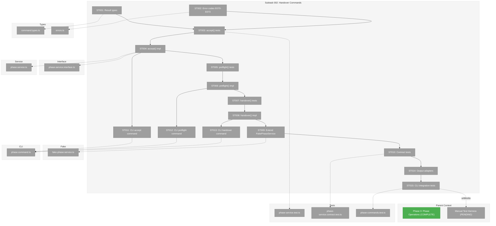
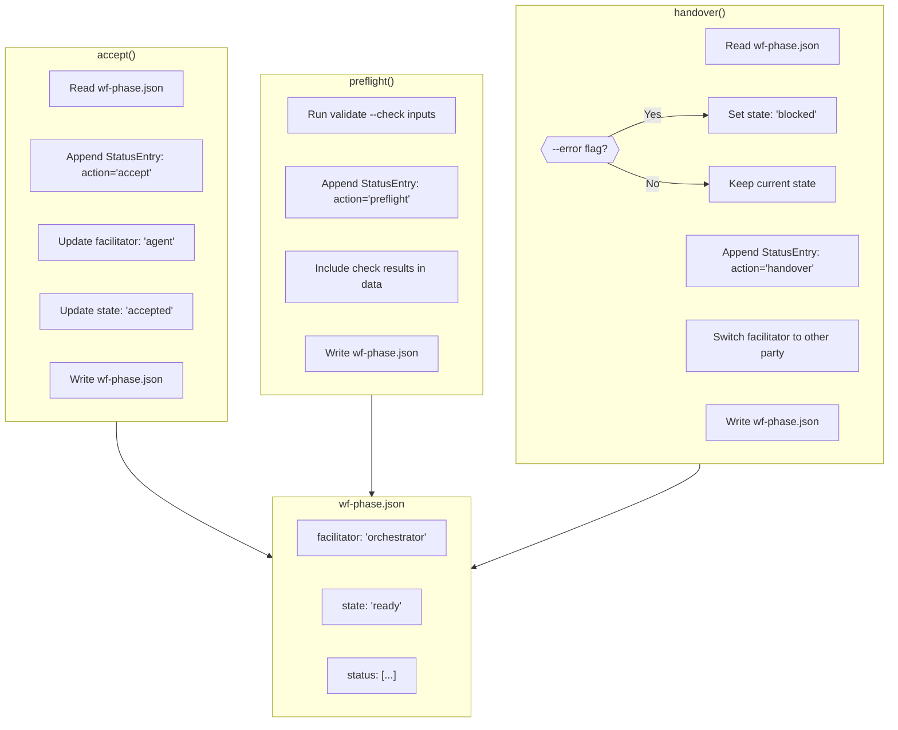
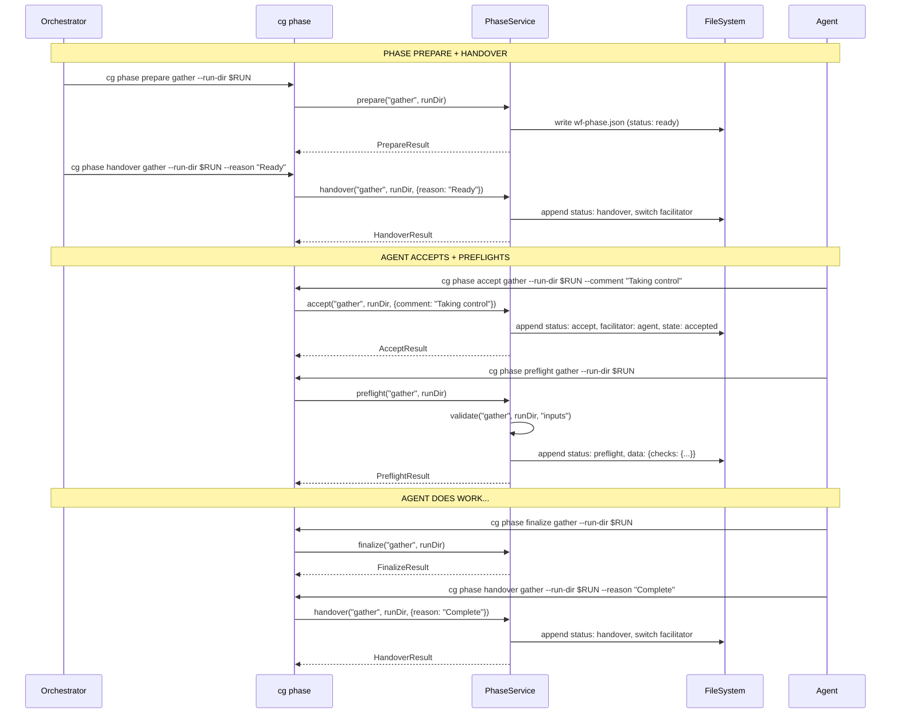

# Subtask 002: Implement Accept/Handover/Preflight CLI Commands

**Parent Plan:** [View Plan](../../wf-basics-plan.md)
**Parent Phase:** Phase 3: Phase Operations
**Parent Task(s):** Non-Goals (deferred scope)
**Plan Task Reference:** [Non-Goals § handover/accept/preflight](../../wf-basics-plan.md#phase-3-phase-operations)

**Why This Subtask:**
The exemplar shows a complete agent↔orchestrator handover dance (`accept` → `preflight` → work → `finalize` → `handover`) but no CLI commands exist to log these actions. The manual test harness (Phase 6 Subtask 001) requires these commands to properly test the full workflow pattern.

**Created:** 2026-01-23
**Requested By:** User

---

## Executive Briefing

### Purpose
This subtask implements the missing phase lifecycle CLI commands that enable proper agent↔orchestrator control transfer. These commands complete the workflow interaction model documented in the exemplar and are prerequisites for validating prompts work correctly in Mode 2 of the manual test harness.

### What We're Building
Three new CLI commands with corresponding service methods:

- **`cg phase accept <phase>`** — Agent logs taking control of a phase
- **`cg phase preflight <phase>`** — Agent validates readiness (wraps validate --check inputs)
- **`cg phase handover <phase>`** — Either party transfers control to the other

Plus:
- `IPhaseService` method additions: `accept()`, `preflight()`, `handover()`
- Result types: `AcceptResult`, `PreflightResult`, `HandoverResult`
- Error codes E070-E073 for facilitator/state validation
- FakePhaseService extensions with call capture
- Unit tests, contract tests, integration tests
- Output adapter formatters

### Unblocks
- **Phase 6 Subtask 001**: Manual Test Harness — currently documents workarounds for missing commands
- **Mode 2 Validation**: External agent testing requires proper status logging

### Example

**Accept Phase (after orchestrator hands over):**
```bash
$ cg phase accept gather --run-dir ./runs/test-001 --comment "Agent taking control" --json
{
  "success": true,
  "command": "phase.accept",
  "timestamp": "2026-01-23T12:00:00.000Z",
  "data": {
    "phase": "gather",
    "facilitator": "agent",
    "state": "accepted",
    "statusEntry": {
      "from": "agent",
      "action": "accept",
      "comment": "Agent taking control"
    }
  }
}
```

**Preflight Check:**
```bash
$ cg phase preflight gather --run-dir ./runs/test-001 --json
{
  "success": true,
  "command": "phase.preflight",
  "data": {
    "phase": "gather",
    "checks": {
      "configValid": true,
      "inputsExist": true,
      "schemasValid": true
    }
  }
}
```

**Handover with Error:**
```bash
$ cg phase handover process --run-dir ./runs/test-001 --error --reason "Preflight failed" --json
{
  "success": true,
  "command": "phase.handover",
  "data": {
    "phase": "process",
    "fromFacilitator": "agent",
    "toFacilitator": "orchestrator",
    "state": "blocked"
  }
}
```

---

## Objectives & Scope

### Objective
Implement the accept/preflight/handover CLI commands that complete the agent↔orchestrator control transfer model, enabling proper status logging and full workflow validation.

### Goals

- ✅ Add `accept()`, `preflight()`, `handover()` methods to `IPhaseService`
- ✅ Implement methods in `PhaseService` with proper status logging to wf-phase.json
- ✅ Add result types: `AcceptResult`, `PreflightResult`, `HandoverResult`
- ✅ Add error codes E070-E073 for facilitator/state validation
- ✅ Extend `FakePhaseService` with new methods + call capture
- ✅ Create `cg phase accept` CLI command with `--comment` and `--json`
- ✅ Create `cg phase preflight` CLI command with `--json`
- ✅ Create `cg phase handover` CLI command with `--reason`, `--error`, and `--json`
- ✅ Write unit tests for all new methods (TDD)
- ✅ Write contract tests verifying fake/real parity
- ✅ Add output adapter formatters for new result types

### Non-Goals

- ❌ `cg phase error` command (can log errors via handover --error for now)
- ❌ Automatic facilitator validation (caller must pass correct --from if needed)
- ❌ State machine enforcement beyond basic checks
- ❌ MCP tools (Phase 5)
- ❌ Re-running manual test harness (separate task after this completes)

---

## Architecture Map

### Component Diagram
<!-- Status: grey=pending, orange=in-progress, green=completed, red=blocked -->
<!-- Updated by plan-6 during implementation -->



### Task-to-Component Mapping

<!-- Status: ⬜ Pending | 🟧 In Progress | ✅ Complete | 🔴 Blocked -->

| Task | Component(s) | Files | Status | Comment |
|------|-------------|-------|--------|---------|
| ST001 | Types | command.types.ts | ⬜ Pending | AcceptResult, PreflightResult, HandoverResult |
| ST002 | Types | errors.ts or phase-service.interface.ts | ⬜ Pending | E070-E073 error codes |
| ST003 | Unit Test | phase-service.test.ts | ⬜ Pending | TDD RED: accept() tests |
| ST004 | Service | phase.service.ts, phase-service.interface.ts | ⬜ Pending | TDD GREEN: accept() impl |
| ST005 | Unit Test | phase-service.test.ts | ⬜ Pending | TDD RED: preflight() tests |
| ST006 | Service | phase.service.ts | ⬜ Pending | TDD GREEN: preflight() impl |
| ST007 | Unit Test | phase-service.test.ts | ⬜ Pending | TDD RED: handover() tests |
| ST008 | Service | phase.service.ts | ⬜ Pending | TDD GREEN: handover() impl |
| ST009 | Fake | fake-phase-service.ts | ⬜ Pending | Add accept/preflight/handover with call capture |
| ST010 | Contract Test | phase-service.contract.test.ts | ⬜ Pending | Verify fake/real parity for new methods |
| ST011 | CLI | phase.command.ts | ⬜ Pending | cg phase accept command |
| ST012 | CLI | phase.command.ts | ⬜ Pending | cg phase preflight command |
| ST013 | CLI | phase.command.ts | ⬜ Pending | cg phase handover command |
| ST014 | Output | console-output.adapter.ts | ⬜ Pending | Formatters for new result types |
| ST015 | Integration Test | phase-commands.test.ts | ⬜ Pending | CLI integration tests |

---

## Tasks

| Status | ID | Task | CS | Type | Dependencies | Absolute Path(s) | Validation | Subtasks | Notes |
|--------|------|-----------------------------------|-----|------|--------------|----------------------------------|-------------------------------|----------|-------------------|
| [ ] | ST001 | Add AcceptResult, PreflightResult, HandoverResult types | 1 | Setup | – | /home/jak/substrate/003-wf-basics/packages/shared/src/interfaces/results/command.types.ts | Types exported from @chainglass/shared | – | Follow existing result patterns |
| [ ] | ST002 | Add error codes E070-E073 | 1 | Setup | – | /home/jak/substrate/003-wf-basics/packages/workflow/src/interfaces/phase-service.interface.ts | Codes documented in interface | – | WRONG_FACILITATOR, INVALID_STATE, PREFLIGHT_FAILED, HANDOVER_REJECTED |
| [ ] | ST003 | Write tests for PhaseService.accept() | 2 | Test | ST001, ST002 | /home/jak/substrate/003-wf-basics/test/unit/workflow/phase-service.test.ts | Tests fail (RED phase) | – | Cover E070, facilitator switch, state update |
| [ ] | ST004 | Implement PhaseService.accept() and add to IPhaseService | 3 | Core | ST003 | /home/jak/substrate/003-wf-basics/packages/workflow/src/services/phase.service.ts, /home/jak/substrate/003-wf-basics/packages/workflow/src/interfaces/phase-service.interface.ts | All accept tests pass (GREEN) | – | Logs status entry, updates facilitator |
| [ ] | ST005 | Write tests for PhaseService.preflight() | 2 | Test | ST004 | /home/jak/substrate/003-wf-basics/test/unit/workflow/phase-service.test.ts | Tests fail (RED phase) | – | Wraps validate --check inputs, logs action |
| [ ] | ST006 | Implement PhaseService.preflight() | 2 | Core | ST005 | /home/jak/substrate/003-wf-basics/packages/workflow/src/services/phase.service.ts | All preflight tests pass (GREEN) | – | Returns checks object, logs status |
| [ ] | ST007 | Write tests for PhaseService.handover() | 2 | Test | ST006 | /home/jak/substrate/003-wf-basics/test/unit/workflow/phase-service.test.ts | Tests fail (RED phase) | – | Cover E073, --error flag, state transitions |
| [ ] | ST008 | Implement PhaseService.handover() | 3 | Core | ST007 | /home/jak/substrate/003-wf-basics/packages/workflow/src/services/phase.service.ts | All handover tests pass (GREEN) | – | Switches facilitator, sets blocked if --error |
| [ ] | ST009 | Extend FakePhaseService with accept/preflight/handover | 2 | Fake | ST008 | /home/jak/substrate/003-wf-basics/packages/workflow/src/fakes/fake-phase-service.ts | Fake tests pass, call capture works | – | Follow existing pattern |
| [ ] | ST010 | Add contract tests for new methods | 2 | Test | ST009 | /home/jak/substrate/003-wf-basics/test/contracts/phase-service.contract.test.ts | Both real and fake pass | – | Per CD-08 |
| [ ] | ST011 | Implement `cg phase accept` CLI command | 2 | CLI | ST004 | /home/jak/substrate/003-wf-basics/apps/cli/src/commands/phase.command.ts | Help shows command, --json works | – | --comment optional |
| [ ] | ST012 | Implement `cg phase preflight` CLI command | 2 | CLI | ST006 | /home/jak/substrate/003-wf-basics/apps/cli/src/commands/phase.command.ts | Help shows command, --json works | – | Simple wrapper |
| [ ] | ST013 | Implement `cg phase handover` CLI command | 2 | CLI | ST008 | /home/jak/substrate/003-wf-basics/apps/cli/src/commands/phase.command.ts | Help shows command, --json works | – | --reason, --error flags |
| [ ] | ST014 | Add output adapter formatters | 2 | Core | ST010 | /home/jak/substrate/003-wf-basics/packages/shared/src/adapters/console-output.adapter.ts | Console output formatted nicely | – | phase.accept, phase.preflight, phase.handover |
| [ ] | ST015 | Write CLI integration tests | 2 | Test | ST011-ST014 | /home/jak/substrate/003-wf-basics/test/integration/cli/phase-commands.test.ts | All CLI tests pass | – | Uses exemplar run folder |

---

## Alignment Brief

### Objective Recap
Complete the phase lifecycle CLI commands so that agents and orchestrators can properly log control transfers during workflow execution. This enables the full handover dance documented in the exemplar and is required for Mode 2 validation in the manual test harness.

### Key Patterns to Follow

| # | Pattern | Source | How to Apply |
|---|---------|--------|--------------|
| 1 | Interface + Service + Fake | Phase 3 T001-T008 | Add methods to IPhaseService, implement in PhaseService, extend FakePhaseService |
| 2 | TDD (RED-GREEN-REFACTOR) | Phase 3 T003-T006 | Write failing tests first, then implement |
| 3 | CLI Command Pattern | phase.command.ts | Add action handlers with --json support |
| 4 | Output Adapter | console-output.adapter.ts | Add formatters for new result types |
| 5 | Contract Tests | phase-service.contract.test.ts | Verify fake/real parity |

### Critical Findings Affecting This Subtask

| Finding | Constraint/Requirement | Addressed By |
|---------|------------------------|--------------|
| **CD-01: Output Adapter Architecture** | Services return domain objects, adapters format output | ST014 adds formatters |
| **CD-04: IFileSystem Isolation** | Never import fs directly | Existing pattern in PhaseService |
| **CD-07: Actionable Error Messages** | All errors include remediation | ST002 defines E070-E073 with actions |
| **CD-08: Contract Tests** | Both real and fake pass same tests | ST010 extends contract tests |

### ADR Decision Constraints

**ADR-0002: Exemplar-Driven Development**
- Constraints: Tests must use exemplar patterns
- Addressed by: ST003, ST005, ST007 use exemplar wf-phase.json structure; ST015 uses exemplar run folder

### Invariants & Guardrails

- **Status Logging**: All actions MUST append StatusEntry to wf-phase.json status array
- **Facilitator Tracking**: accept() MUST update facilitator field in wf-phase.json
- **State Transitions**: handover --error MUST set state to "blocked"
- **Preflight = Validate + Log**: preflight() wraps validate --check inputs AND logs action
- **Idempotency**: Repeated calls should not corrupt state

### Inputs to Read

| File | Purpose |
|------|---------|
| `/home/jak/substrate/003-wf-basics/docs/plans/003-wf-basics/research/handover-workflow-research.md` | Full design documentation |
| `/home/jak/substrate/003-wf-basics/dev/examples/wf/runs/run-example-001/phases/*/run/wf-data/wf-phase.json` | Exemplar showing intended flow |
| `/home/jak/substrate/003-wf-basics/packages/workflow/src/services/phase.service.ts` | Existing PhaseService to extend |
| `/home/jak/substrate/003-wf-basics/packages/workflow/src/interfaces/phase-service.interface.ts` | Interface to extend |
| `/home/jak/substrate/003-wf-basics/apps/cli/src/commands/phase.command.ts` | Existing CLI commands to extend |

### Visual Alignment Aids

#### Status Entry Flow



#### Sequence Diagram (Full Handover Dance)



### Test Plan (TDD)

#### PhaseService.accept() Tests

| Test Name | Description | Fixtures | Expected Output |
|-----------|-------------|----------|-----------------|
| `should return AcceptResult with facilitator=agent` | Happy path | FakeFileSystem with wf-phase.json | `{ facilitator: 'agent', state: 'accepted' }` |
| `should append accept status entry to wf-phase.json` | Status logging | FakeFileSystem | StatusEntry in status array |
| `should include comment in status entry when provided` | Comment option | FakeFileSystem | StatusEntry has comment |
| `should return E070 if facilitator is already agent` | Wrong facilitator | wf-phase.json with facilitator: agent | `{ errors: [{ code: 'E070' }] }` |

#### PhaseService.preflight() Tests

| Test Name | Description | Fixtures | Expected Output |
|-----------|-------------|----------|-----------------|
| `should return PreflightResult with checks` | Happy path | Valid inputs | `{ checks: { configValid: true, ... } }` |
| `should append preflight status entry` | Status logging | FakeFileSystem | StatusEntry in status array |
| `should return validation errors if inputs invalid` | Wraps validate | Missing inputs | `{ errors: [{ code: 'E001' }] }` |

#### PhaseService.handover() Tests

| Test Name | Description | Fixtures | Expected Output |
|-----------|-------------|----------|-----------------|
| `should return HandoverResult switching facilitator` | Happy path | FakeFileSystem | `{ fromFacilitator: 'agent', toFacilitator: 'orchestrator' }` |
| `should append handover status entry` | Status logging | FakeFileSystem | StatusEntry in status array |
| `should set state to blocked when --error` | Error flag | handover with dueToError: true | `{ state: 'blocked' }` |
| `should include reason in status entry` | Reason option | FakeFileSystem | StatusEntry has comment with reason |

### Implementation Outline

1. **ST001-ST002**: Add types and error codes (foundation)
2. **ST003-ST004**: accept() with TDD
3. **ST005-ST006**: preflight() with TDD
4. **ST007-ST008**: handover() with TDD
5. **ST009-ST010**: Fake + contract tests
6. **ST011-ST013**: CLI commands
7. **ST014**: Output formatters
8. **ST015**: Integration tests

### Commands to Run

```bash
# Build
cd /home/jak/substrate/003-wf-basics
just build

# Run unit tests during development
pnpm test -- --filter workflow test/unit/workflow/phase-service.test.ts

# Run contract tests
pnpm test -- --filter workflow test/contracts/phase-service.contract.test.ts

# Run CLI integration tests
pnpm test -- --filter cli test/integration/cli/phase-commands.test.ts

# Full test suite
just test

# Lint
just lint
```

### Risks/Unknowns

| Risk | Severity | Mitigation |
|------|----------|------------|
| State machine complexity | Medium | Keep simple: log actions, update facilitator, optionally set blocked |
| Facilitator validation | Low | Don't enforce strictly — trust caller knows who they are |
| Breaking existing tests | Low | New methods are additive; run full suite after each change |
| wf-phase.json format changes | Medium | Follow exact exemplar structure |

### Ready Check

- [ ] Research document reviewed (`research/handover-workflow-research.md`)
- [ ] Exemplar wf-phase.json structure understood
- [ ] Existing PhaseService implementation reviewed
- [ ] Output adapter pattern understood
- [ ] Test files located and ready to extend

---

## Phase Footnote Stubs

_To be populated during implementation by plan-6a-update-progress._

| Footnote | Task | Description |
|----------|------|-------------|
| | | |

---

## Evidence Artifacts

| Artifact | Path |
|----------|------|
| Execution Log | `/home/jak/substrate/003-wf-basics/docs/plans/003-wf-basics/tasks/phase-3-phase-operations/002-subtask-implement-handover-cli-commands.execution.log.md` |
| Research Document | `/home/jak/substrate/003-wf-basics/docs/plans/003-wf-basics/research/handover-workflow-research.md` |
| Unit Tests | `/home/jak/substrate/003-wf-basics/test/unit/workflow/phase-service.test.ts` |
| Contract Tests | `/home/jak/substrate/003-wf-basics/test/contracts/phase-service.contract.test.ts` |
| CLI Tests | `/home/jak/substrate/003-wf-basics/test/integration/cli/phase-commands.test.ts` |

---

## Discoveries & Learnings

_Populated during implementation by plan-6. Log anything of interest to your future self._

| Date | Task | Type | Discovery | Resolution | References |
|------|------|------|-----------|------------|------------|
| | | | | | |

**Types**: `gotcha` | `research-needed` | `unexpected-behavior` | `workaround` | `decision` | `debt` | `insight`

**What to log**:
- Things that didn't work as expected
- External research that was required
- Implementation troubles and how they were resolved
- Gotchas and edge cases discovered
- Decisions made during implementation
- Technical debt introduced (and why)
- Insights that future phases should know about

_See also: `execution.log.md` for detailed narrative._

---

## After Subtask Completion

**This subtask resolves blockers for:**
- Phase 6 Subtask 001: [Manual Test Harness](../phase-6-documentation/001-subtask-create-manual-test-harness.md)

**When all ST### tasks complete:**

1. **Record completion** in parent execution log:
   ```
   ### Subtask 002-subtask-implement-handover-cli-commands Complete

   Resolved: Added cg phase accept/preflight/handover CLI commands
   See detailed log: [subtask execution log](./002-subtask-implement-handover-cli-commands.execution.log.md)
   ```

2. **Update Manual Test Harness subtask**:
   - Open: [`001-subtask-create-manual-test-harness.md`](../phase-6-documentation/001-subtask-create-manual-test-harness.md)
   - Update "Appendix: Intended Handover Workflow" to mark commands as ✅ Implemented
   - Update "Commands Not Yet Implemented" table
   - Remove workaround notes about manual JSON edits

3. **Resume manual test harness work:**
   ```bash
   /plan-6-implement-phase --phase "Phase 6: Documentation" \
     --plan "/home/jak/substrate/003-wf-basics/docs/plans/003-wf-basics/wf-basics-plan.md" \
     --subtask "001-subtask-create-manual-test-harness"
   ```

**Quick Links:**
- 📋 [Parent Dossier](./tasks.md)
- 📄 [Parent Plan](../../wf-basics-plan.md)
- 📊 [Parent Execution Log](./execution.log.md)
- 📚 [Research Document](../../research/handover-workflow-research.md)
- 🧪 [Manual Test Harness](../phase-6-documentation/001-subtask-create-manual-test-harness.md)

---

## Directory Layout

```
docs/plans/003-wf-basics/
├── wf-basics-plan.md
├── wf-basics-spec.md
├── research/
│   └── handover-workflow-research.md           # Design documentation
└── tasks/
    ├── phase-3-phase-operations/
    │   ├── tasks.md                            # Parent dossier
    │   ├── execution.log.md
    │   ├── 001-subtask-implement-message-cli-commands.md       # Complete
    │   ├── 001-subtask-implement-message-cli-commands.execution.log.md
    │   ├── 002-subtask-implement-handover-cli-commands.md      # This file
    │   └── 002-subtask-implement-handover-cli-commands.execution.log.md  # Created by plan-6
    └── phase-6-documentation/
        ├── 001-subtask-create-manual-test-harness.md           # Blocked until this completes
        └── ...
```
