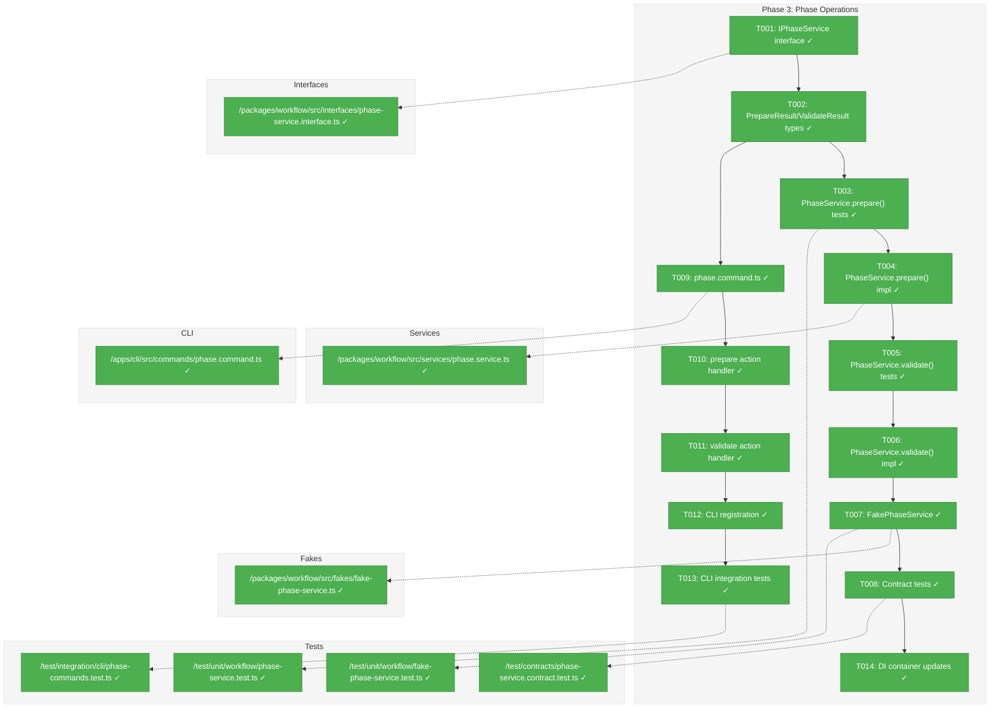
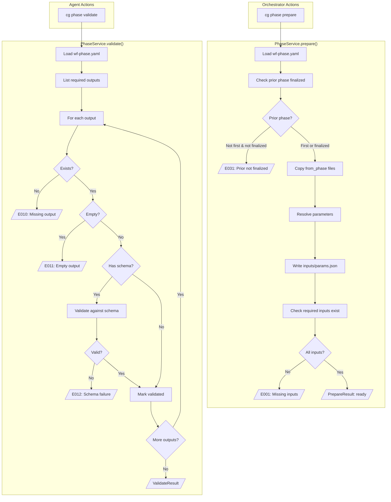
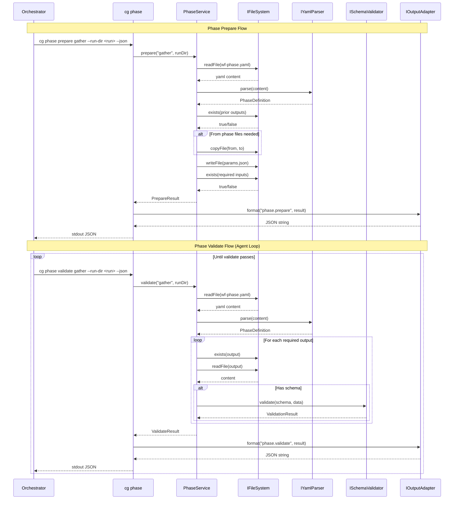

# Phase 3: Phase Operations – Tasks & Alignment Brief

**Spec**: [../../wf-basics-spec.md](../../wf-basics-spec.md)
**Plan**: [../../wf-basics-plan.md](../../wf-basics-plan.md)
**Date**: 2026-01-22

---

## Executive Briefing

### Purpose
This phase implements the `cg phase prepare` and `cg phase validate` commands that enable orchestrators and agents to manage phase lifecycle. These commands are the core interaction points for workflow execution after compose creates a run folder.

### What We're Building
An `IPhaseService` interface with two key methods:
- **prepare()**: Validates inputs, copies files from prior phases, resolves parameters, and transitions phase to `ready` status (NOT `active` — agent acceptance sets active)
- **validate()**: Checks inputs OR outputs based on mode — validates existence, non-empty, and schema compliance

Plus CLI commands:
- `cg phase prepare <phase> --run-dir <path>` with `--json` support
- `cg phase validate <phase> --run-dir <path> --check {inputs,outputs}` with `--json` support (--check is REQUIRED)

### User Value
Orchestrators can prepare phases for execution with confidence that all prerequisites are met. Agents can validate their work programmatically and iterate until outputs are correct. The JSON output enables autonomous agent operation.

### Example
**Prepare Success**:
```bash
$ cg phase prepare gather --run-dir .chainglass/runs/run-2026-01-22-001 --json
{
  "success": true,
  "command": "phase.prepare",
  "timestamp": "2026-01-22T10:30:00.000Z",
  "data": {
    "phase": "gather",
    "runDir": ".chainglass/runs/run-2026-01-22-001",
    "status": "ready",
    "inputs": { "required": ["request.md"], "resolved": [...] },
    "copiedFromPrior": []
  }
}
```

**Validate Inputs** (before agent accepts):
```bash
$ cg phase validate gather --run-dir .chainglass/runs/run-2026-01-22-001 --check inputs --json
{
  "success": true,
  "command": "phase.validate",
  "timestamp": "2026-01-22T10:31:00.000Z",
  "data": {
    "phase": "gather",
    "check": "inputs",
    "validated": ["request.md"]
  }
}
```

**Validate Outputs Failure** (missing output):
```bash
$ cg phase validate gather --run-dir .chainglass/runs/run-2026-01-22-001 --check outputs --json
{
  "success": false,
  "command": "phase.validate",
  "error": {
    "code": "E010",
    "message": "1 validation error occurred",
    "details": [{ "code": "E010", "path": "run/outputs/gather-data.json", "message": "Missing required output" }]
  }
}
```

---

## Objectives & Scope

### Objective
Implement phase prepare and validate operations per plan acceptance criteria AC-10 through AC-15a, AC-37, and AC-38.

### Behavior Checklist
- [ ] AC-10: Missing input returns E001 with actionable message
- [ ] AC-10a: JSON output has error.details[] with each missing input
- [ ] AC-11: Successful prepare copies from_phase inputs
- [ ] AC-11a: JSON output has data.copiedFromPrior[]
- [ ] AC-11b: Successful prepare sets status to `ready` (NOT `active`)
- [ ] AC-12: Missing output returns E010 (validate --check outputs)
- [ ] AC-13: Empty output returns E011 (validate --check outputs)
- [ ] AC-14: Schema failure returns E012 with details (both --check modes)
- [ ] AC-14a: JSON includes expected/actual
- [ ] AC-15: Successful validate lists validated files
- [ ] AC-15a: JSON output has data.validated[] array
- [ ] AC-15b: validate --check inputs validates input files exist and schema-valid
- [ ] AC-15c: validate --check outputs validates output files exist, non-empty, schema-valid
- [ ] AC-37: prepare called twice returns same success (idempotent)
- [ ] AC-38: validate called multiple times returns identical results

### Goals

- ✅ Define `IPhaseService` interface with prepare() and validate() signatures
- ✅ Implement `PhaseService` with full TDD (RED-GREEN-REFACTOR)
- ✅ Implement `FakePhaseService` with call capture pattern
- ✅ Create `cg phase prepare` CLI command with --json support
- ✅ Create `cg phase validate` CLI command with --check {inputs,outputs} (required flag)
- ✅ Ensure idempotency for both commands (AC-37, AC-38)
- ✅ Write contract tests verifying fake/real parity

### Non-Goals (Scope Boundaries)

- ❌ `cg phase finalize` command (Phase 4)
- ❌ Parameter extraction from outputs (Phase 4)
- ❌ Message communication commands (Phase 3+ per plan) → **Now addressed by [Subtask 001](./001-subtask-implement-message-cli-commands.md)**
- ❌ `cg phase handover`, `cg phase accept`, `cg phase preflight` (future phases)
- ❌ State machine enforcement beyond prepare idempotency
- ❌ MCP tools (Phase 5)
- ❌ Performance optimization
- ❌ Caching of validation results

---

## Architecture Map

### Component Diagram
<!-- Status: grey=pending, orange=in-progress, green=completed, red=blocked -->
<!-- Updated by plan-6 during implementation -->



### Task-to-Component Mapping

<!-- Status: ⬜ Pending | 🟧 In Progress | ✅ Complete | 🔴 Blocked -->

| Task | Component(s) | Files | Status | Comment |
|------|-------------|-------|--------|---------|
| T001 | Interface | phase-service.interface.ts | ✅ Complete | Define IPhaseService contract |
| T002 | Types | Verify existing types in command.types.ts | ✅ Complete | PrepareResult, ValidateResult already exist |
| T003 | Unit Test | phase-service.test.ts | ✅ Complete | TDD RED: prepare() tests fail |
| T004 | Service | phase.service.ts | ✅ Complete | TDD GREEN: make tests pass |
| T005 | Unit Test | phase-service.test.ts | ✅ Complete | TDD RED: validate() tests fail |
| T006 | Service | phase.service.ts | ✅ Complete | TDD GREEN: make tests pass |
| T007 | Fake | fake-phase-service.ts | ✅ Complete | Call capture pattern |
| T008 | Contract Test | phase-service.contract.test.ts | ✅ Complete | Verify fake/real parity |
| T009 | CLI | phase.command.ts | ✅ Complete | Command skeleton |
| T010 | CLI | phase.command.ts | ✅ Complete | prepare action handler |
| T011 | CLI | phase.command.ts | ✅ Complete | validate action handler |
| T012 | CLI | cg.ts | ✅ Complete | Register phase commands |
| T013 | Integration Test | phase-commands.test.ts | ✅ Complete | CLI integration tests |
| T014 | DI | container.ts, di-tokens.ts | ✅ Complete | Add PHASE_SERVICE token |

---

## Tasks

| Status | ID | Task | CS | Type | Dependencies | Absolute Path(s) | Validation | Subtasks | Notes |
|--------|------|-----------------------------------|-----|------|--------------|----------------------------------|-------------------------------|----------|-------------------|
| [x] | T001 | Define `IPhaseService` interface with prepare() and validate() signatures | 1 | Setup | – | /home/jak/substrate/003-wf-basics/packages/workflow/src/interfaces/phase-service.interface.ts | Interface exported from @chainglass/workflow | – | Per CD-05 |
| [x] | T002 | Verify PrepareResult and ValidateResult types; add `ready` to PhaseRunStatus | 1 | Setup | T001 | /home/jak/substrate/003-wf-basics/packages/shared/src/interfaces/results/command.types.ts, /home/jak/substrate/003-wf-basics/packages/workflow/src/types/wf-status.types.ts, /home/jak/substrate/003-wf-basics/packages/workflow/src/schemas/index.ts | Types match spec, `ready` status exists | – | Add `ready` to PhaseRunStatus type AND schema enum |
| [x] | T003 | Write tests for PhaseService.prepare() including idempotency (AC-37) | 3 | Test | T002 | /home/jak/substrate/003-wf-basics/test/unit/workflow/phase-service.test.ts | Tests fail (RED phase) | – | Cover E001, E031, from_phase, idempotency |
| [x] | T004 | Implement PhaseService.prepare() | 3 | Core | T003 | /home/jak/substrate/003-wf-basics/packages/workflow/src/services/phase.service.ts | All prepare tests pass (GREEN), writes status: ready | – | Uses IFileSystem, IYamlParser, ISchemaValidator |
| [x] | T005 | Write tests for PhaseService.validate() with --check modes and idempotency (AC-38) | 3 | Test | T004 | /home/jak/substrate/003-wf-basics/test/unit/workflow/phase-service.test.ts | Tests fail (RED phase) | – | Cover E010, E011, E012, inputs mode, outputs mode, idempotency |
| [x] | T006 | Implement PhaseService.validate() | 3 | Core | T005 | /home/jak/substrate/003-wf-basics/packages/workflow/src/services/phase.service.ts | All validate tests pass (GREEN) | – | Per CD-07 actionable errors |
| [x] | T007 | Implement FakePhaseService with call capture pattern | 2 | Fake | T006 | /home/jak/substrate/003-wf-basics/packages/workflow/src/fakes/fake-phase-service.ts | Fake tests pass | – | Follow FakeWorkflowService pattern |
| [x] | T008 | Write contract tests for IPhaseService | 2 | Test | T007 | /home/jak/substrate/003-wf-basics/test/contracts/phase-service.contract.test.ts | Both real and fake pass | – | Per CD-08 |
| [x] | T009 | Create phase.command.ts with registerPhaseCommands() | 2 | CLI | T002 | /home/jak/substrate/003-wf-basics/apps/cli/src/commands/phase.command.ts | Type check passes | – | Per CD-02 |
| [x] | T010 | Implement `cg phase prepare` action handler with --json and --run-dir | 2 | CLI | T009 | /home/jak/substrate/003-wf-basics/apps/cli/src/commands/phase.command.ts | Action handler wired | – | Uses output adapter |
| [x] | T011 | Implement `cg phase validate` action handler with --json, --run-dir, --check {inputs,outputs} | 2 | CLI | T010 | /home/jak/substrate/003-wf-basics/apps/cli/src/commands/phase.command.ts | Action handler wired, --check required | – | Uses output adapter |
| [x] | T012 | Register phase commands in cg.ts | 1 | CLI | T011 | /home/jak/substrate/003-wf-basics/apps/cli/src/bin/cg.ts | Help shows phase commands | – | Call registerPhaseCommands |
| [x] | T013 | Write CLI integration tests for prepare and validate | 2 | Test | T012 | /home/jak/substrate/003-wf-basics/test/integration/cli/phase-commands.test.ts | All CLI tests pass | – | Uses exemplar run folder |
| [x] | T014 | Add PHASE_SERVICE DI token and container registrations | 1 | DI | T008 | /home/jak/substrate/003-wf-basics/packages/shared/src/di-tokens.ts, /home/jak/substrate/003-wf-basics/packages/workflow/src/container.ts | DI resolution works | – | Per CD-05 |

---

## Alignment Brief

### Prior Phases Review

This phase builds on the complete foundation established by Phases 0, 1, 1a, and 2.

#### Phase-by-Phase Summary

**Phase 0: Development Exemplar** (Complete)
- Created `dev/examples/wf/` with complete hello-workflow template and run-example-001
- Established directory structure: `phases/<name>/run/{inputs,outputs,wf-data,messages}`
- Added message communication pattern (m-001.json files)
- Fixed concept drift in commands/main.md files (Subtask 002)
- All JSON files validate against their schemas

**Phase 1: Core Infrastructure** (Complete)
- Created `packages/workflow/` package structure
- Implemented 4 core interfaces: IFileSystem, IPathResolver, IYamlParser, ISchemaValidator
- Implemented adapters: NodeFileSystemAdapter, PathResolverAdapter, YamlParserAdapter, SchemaValidatorAdapter
- Implemented fakes: FakeFileSystem, FakeYamlParser, FakeSchemaValidator
- Established DI tokens: WORKFLOW_DI_TOKENS in di-tokens.ts
- 193 tests passing (149 unit + 44 contract)

**Phase 1a: Output Adapter Architecture** (Complete)
- Implemented IOutputAdapter interface with format<T>() method
- Implemented JsonOutputAdapter, ConsoleOutputAdapter, FakeOutputAdapter
- Defined result types: BaseResult, ResultError, PrepareResult, ValidateResult, FinalizeResult, ComposeResult
- Command dispatch pattern in ConsoleOutputAdapter
- 66 tests passing (51 unit + 15 contract)

**Phase 2: Compose Command** (Complete)
- Implemented IWorkflowService with compose() method
- Implemented WorkflowService with template resolution, tilde expansion, ordinal discovery
- Implemented FakeWorkflowService with call capture pattern
- Created wf.command.ts with `cg wf compose` command
- Embedded core schemas as TypeScript modules (schemas/index.ts)
- Discovered: wf-status.json phases is Record<string,WfStatusPhase>, wf-phase.yaml uses `phase:` key
- 52 Phase 2 tests, 201 total workflow tests passing

#### Cumulative Deliverables Available

| Component | Location | Usage for Phase 3 |
|-----------|----------|-------------------|
| IFileSystem | @chainglass/shared | Read/write phase files |
| IYamlParser | @chainglass/workflow | Parse wf-phase.yaml |
| ISchemaValidator | @chainglass/workflow | Validate outputs against schemas |
| PrepareResult | @chainglass/shared | Return type for prepare() |
| ValidateResult | @chainglass/shared | Return type for validate() |
| ResultError | @chainglass/shared | Actionable error structure |
| IOutputAdapter | @chainglass/shared | Format CLI output |
| Embedded schemas | @chainglass/workflow/schemas | WF_SCHEMA, WF_PHASE_SCHEMA for validation |
| FakeWorkflowService | @chainglass/workflow | Pattern for FakePhaseService |
| Contract test pattern | test/contracts/ | Pattern for phase-service.contract.test.ts |
| Exemplar run | dev/examples/wf/runs/run-example-001 | Test fixture for CLI tests |

#### Pattern Evolution

1. **Interface + Adapter + Fake Pattern**: Established in Phase 1, refined in Phase 2
   - Interface defines contract
   - Adapter implements for production
   - Fake implements for testing with call capture
   - Contract tests verify parity

2. **CLI Command Pattern**: Established in Phase 2
   - `registerXCommands(program)` function
   - Action handlers call service, format output via adapter
   - `--json` flag selects JsonOutputAdapter
   - `--run-dir` required option for phase commands

3. **DI Container Pattern**: Established in Phase 1
   - Use `useFactory` for all registrations
   - Create child containers per test
   - Separate production and test container factories

#### Reusable Test Infrastructure

- **FakeFileSystem**: In-memory filesystem with `setFile()`, `setDir()`, `simulateError()`
- **FakeYamlParser**: Preset results with `setParseResult()`, `setParseError()`
- **FakeSchemaValidator**: Preset validation with `setValidationResult()`, `setDefaultResult()`
- **FakeOutputAdapter**: Capture output with `getLastOutput()`, `getFormattedResults()`
- **Exemplar template**: `/home/jak/substrate/003-wf-basics/dev/examples/wf/template/hello-workflow/`
- **Exemplar run**: `/home/jak/substrate/003-wf-basics/dev/examples/wf/runs/run-example-001/`

### Critical Findings Affecting This Phase

| Finding | Constraint/Requirement | Addressed By |
|---------|------------------------|--------------|
| **CD-01: Output Adapter Architecture** | Services return domain objects, adapters format output | T010, T011 use IOutputAdapter |
| **CD-02: CLI Command Pattern** | Follow registerXCommands() pattern | T009 creates phase.command.ts |
| **CD-04: IFileSystem Isolation** | Never import fs directly | T004, T006 take IFileSystem in constructor |
| **CD-05: DI Container Pattern** | Use useFactory, child containers, WORKFLOW_DI_TOKENS | T014 adds PHASE_SERVICE token |
| **CD-07: Actionable Error Messages** | AJV errors transformed to ResultError | T006 formats validation errors |
| **CD-08: Contract Tests** | Both real and fake pass same tests | T008 creates contract tests |

### ADR Decision Constraints

**ADR-0002: Exemplar-Driven Development**
- Constraints: Tests must use exemplar files, not generated fixtures
- Addressed by: T003, T005 use exemplar structure patterns; T013 uses actual exemplar run folder

### Invariants & Guardrails

- **Idempotency**: prepare() and validate() must be idempotent (AC-37, AC-38)
- **No state corruption**: Calling commands multiple times must not corrupt phase state
- **Actionable errors**: All errors must include `action` field suggesting remediation
- **JSON purity**: `--json` output must be ONLY valid JSON (no progress, no colors)

### Inputs to Read

| File | Purpose |
|------|---------|
| `/home/jak/substrate/003-wf-basics/packages/workflow/src/services/workflow.service.ts` | Pattern for service implementation |
| `/home/jak/substrate/003-wf-basics/packages/workflow/src/fakes/fake-workflow-service.ts` | Pattern for fake implementation |
| `/home/jak/substrate/003-wf-basics/apps/cli/src/commands/wf.command.ts` | Pattern for CLI command |
| `/home/jak/substrate/003-wf-basics/test/contracts/workflow-service.contract.test.ts` | Pattern for contract tests |
| `/home/jak/substrate/003-wf-basics/dev/examples/wf/runs/run-example-001/` | Exemplar structure |

### Visual Alignment Aids

#### System Flow Diagram



#### Sequence Diagram (prepare + validate cycle)



### Test Plan (Full TDD, Fakes-Only)

#### PhaseService.prepare() Tests

| Test Name | Description | Fixtures | Expected Output |
|-----------|-------------|----------|-----------------|
| `should return PrepareResult with resolved inputs` | Happy path, all inputs present | FakeFileSystem with phase files | `{ status: 'ready', errors: [] }` |
| `should return E001 for missing required input` | Missing file in inputs/files/ | FakeFileSystem missing file | `{ errors: [{ code: 'E001' }] }` |
| `should return E031 for prior phase not finalized` | Prior phase exists but incomplete | FakeFileSystem without output-params.json | `{ errors: [{ code: 'E031' }] }` |
| `should copy from_phase files to inputs/ (always overwrite)` | Input with from_phase declaration | FakeFileSystem with prior outputs | `{ copiedFromPrior: [...] }` |
| `should overwrite existing from_phase files on re-prepare` | File exists, prepare called again | FakeFileSystem with existing file | File overwritten, same result |
| `should resolve parameters to inputs/params.json` | Parameter with source and query | FakeFileSystem with prior params | params.json written |
| `should return same result when called twice (AC-37)` | Idempotency test | Prepared phase | Both calls return identical success |
| `should handle first phase with no prior` | First phase prepare | FakeFileSystem gather phase | `{ status: 'ready' }` |

#### PhaseService.validate() Tests

| Test Name | Description | Fixtures | Expected Output |
|-----------|-------------|----------|-----------------|
| `should return ValidateResult with validated outputs` | Happy path, all valid | FakeFileSystem with outputs | `{ outputs: { validated: [...] } }` |
| `should return E010 for missing required output` | Output file doesn't exist | FakeFileSystem missing output | `{ errors: [{ code: 'E010' }] }` |
| `should return E011 for empty output file` | Output exists but empty | FakeFileSystem with empty file | `{ errors: [{ code: 'E011' }] }` |
| `should return E012 for schema validation failure` | Output fails schema | FakeSchemaValidator failing | `{ errors: [{ code: 'E012', expected, actual }] }` |
| `should validate multiple outputs` | Multiple output files | FakeFileSystem with multiple | All validated in result |
| `should return identical results on repeated calls (AC-38)` | Idempotency test | Valid phase outputs | All calls return same result |
| `should skip schema validation if no schema declared` | Output without schema | FakeFileSystem output only | Output validated (no schema check) |

#### CLI Integration Tests

| Test Name | Command | Expected Behavior |
|-----------|---------|-------------------|
| `help shows prepare command` | `cg phase --help` | Shows prepare with options |
| `help shows validate command` | `cg phase --help` | Shows validate with options |
| `prepare success with exemplar` | `cg phase prepare gather --run-dir <exemplar>` | Exit 0, outputs ready |
| `prepare JSON output format` | `cg phase prepare gather --json --run-dir <exemplar>` | Valid JSON with success |
| `prepare error for invalid phase` | `cg phase prepare nonexistent --run-dir <exemplar>` | E020 or similar |
| `validate success with exemplar` | `cg phase validate gather --run-dir <exemplar>` | Exit 0, outputs valid |
| `validate JSON output format` | `cg phase validate gather --json --run-dir <exemplar>` | Valid JSON with success |
| `validate error for missing output` | `cg phase validate gather --run-dir <empty-run>` | E010 error |

### Step-by-Step Implementation Outline

1. **T001**: Define IPhaseService interface
   - Create `/packages/workflow/src/interfaces/phase-service.interface.ts`
   - Define `prepare(phase: string, runDir: string): Promise<PrepareResult>`
   - Define `validate(phase: string, runDir: string): Promise<ValidateResult>`
   - Export from interfaces/index.ts and main index.ts

2. **T002**: Update result types and add `ready` status
   - Add `ready` to PhaseRunStatus in wf-status.types.ts
   - Add `ready` to schema enum in schemas/index.ts
   - Update ValidateResult: add `check: 'inputs' | 'outputs'` field
   - Rename `outputs` → `files` in ValidateResult
   - Rename `ValidatedOutput` → `ValidatedFile`
   - Structure: `{ phase, runDir, check, files: { required: string[], validated: ValidatedFile[] } }`

3. **T003**: Write prepare() tests (TDD RED)
   - Create `/test/unit/workflow/phase-service.test.ts`
   - Write tests for happy path, E001, E031, from_phase copying, idempotency
   - All tests should fail (PhaseService not implemented)

4. **T004**: Implement prepare()
   - Create `/packages/workflow/src/services/phase.service.ts`
   - Constructor takes IFileSystem, IYamlParser, ISchemaValidator
   - Implement prepare algorithm: load phase → check prior → copy files → resolve params → check inputs
   - Handle idempotency: if already prepared, return success without re-doing work

5. **T005**: Write validate() tests (TDD RED)
   - Add tests to phase-service.test.ts
   - Write tests for happy path, E010, E011, E012, multiple outputs, idempotency
   - All tests should fail (validate not implemented)

6. **T006**: Implement validate()
   - Add validate() to PhaseService
   - Implement algorithm: load phase → list outputs → check each (exists, non-empty, schema)
   - Format errors with expected/actual per CD-07

7. **T007**: Implement FakePhaseService
   - Create `/packages/workflow/src/fakes/fake-phase-service.ts`
   - Follow FakeWorkflowService pattern
   - Add call capture: `getLastPrepareCall()`, `getLastValidateCall()`, `getPrepareCalls()`, etc.
   - Add result presets: `setPrepareResult()`, `setValidateResult()`, `setPrepareError()`, etc.
   - Write tests for fake

8. **T008**: Write contract tests
   - Create `/test/contracts/phase-service.contract.test.ts`
   - Follow workflow-service.contract.test.ts pattern
   - Run same tests against PhaseService and FakePhaseService
   - Verify both pass

9. **T009**: Create phase.command.ts
   - Create `/apps/cli/src/commands/phase.command.ts`
   - Export `registerPhaseCommands(program: Command)`
   - Add `phase` command group with description

10. **T010**: Implement prepare action handler
    - Add `prepare <phase>` subcommand
    - Add `--json` and `--run-dir` options
    - Action calls createPhaseService(), then service.prepare(), then adapter.format()

11. **T011**: Implement validate action handler
    - Add `validate <phase>` subcommand
    - Same options as prepare
    - Action calls service.validate(), then adapter.format()

12. **T012**: Register phase commands
    - Import registerPhaseCommands in cg.ts
    - Call registerPhaseCommands(program)
    - Verify `cg phase --help` works

13. **T013**: Write CLI integration tests
    - Create `/test/integration/cli/phase-commands.test.ts`
    - Test help output, prepare, validate with exemplar
    - Test JSON output format
    - Test error scenarios

14. **T014**: Add DI container updates
    - Add `PHASE_SERVICE: 'IPhaseService'` to WORKFLOW_DI_TOKENS
    - Update createWorkflowProductionContainer() to register PhaseService
    - Update createWorkflowTestContainer() to register FakePhaseService

### Commands to Run

```bash
# Type check workflow package
pnpm -F @chainglass/workflow exec tsc --noEmit

# Run specific test file
pnpm test -- --run test/unit/workflow/phase-service.test.ts

# Run all workflow tests
pnpm test -- --run test/unit/workflow/

# Run contract tests
pnpm test -- --run test/contracts/phase-service.contract.test.ts

# Run CLI integration tests
pnpm test -- --run test/integration/cli/phase-commands.test.ts

# Build CLI (required for integration tests)
pnpm -F @chainglass/cli build

# Run full test suite
pnpm test

# Quick pre-commit check
just fft
```

### Risks/Unknowns

| Risk | Severity | Mitigation |
|------|----------|------------|
| from_phase file path resolution complexity | Medium | Use same path resolution pattern from WorkflowService |
| Parameter query (dot-notation) implementation | Medium | Simple lodash.get-style implementation; keep to spec (no expressions) |
| Idempotency state detection | Low | Check wf-phase.json state field; if active, skip re-preparation |
| Schema path resolution for outputs | Low | Use embedded schemas pattern from Phase 2 |

### Ready Check

- [ ] Prior phases reviewed (Phase 0, 1, 1a, 2) - covered in Prior Phases Review section
- [ ] Critical discoveries noted and will be applied
- [ ] ADR-0002 constraints understood (exemplar-based testing)
- [ ] PrepareResult and ValidateResult types verified in command.types.ts
- [ ] Exemplar run folder structure understood for testing
- [ ] TDD approach planned (RED-GREEN-REFACTOR)
- [ ] Idempotency requirements clear (AC-37, AC-38)

**Awaiting GO/NO-GO from human sponsor.**

---

## Phase Footnote Stubs

<!-- Footnotes will be added during implementation by plan-6 -->
<!-- Numbering authority: plan-6a-update-progress -->

| Tag | FlowSpace Node ID | Description |
|-----|-------------------|-------------|
| | | |

---

## Evidence Artifacts

Implementation will produce:
- `/home/jak/substrate/003-wf-basics/docs/plans/003-wf-basics/tasks/phase-3-phase-operations/execution.log.md` - Detailed execution narrative
- Test output captured in execution log per TDD RED-GREEN-REFACTOR cycle

---

## Discoveries & Learnings

_Populated during implementation by plan-6. Log anything of interest to your future self._

| Date | Task | Type | Discovery | Resolution | References |
|------|------|------|-----------|------------|------------|
| | | | | | |

**Types**: `gotcha` | `research-needed` | `unexpected-behavior` | `workaround` | `decision` | `debt` | `insight`

**What to log**:
- Things that didn't work as expected
- External research that was required
- Implementation troubles and how they were resolved
- Gotchas and edge cases discovered
- Decisions made during implementation
- Technical debt introduced (and why)
- Insights that future phases should know about

_See also: `execution.log.md` for detailed narrative._

---

## Directory Layout

```
docs/plans/003-wf-basics/
├── wf-basics-plan.md
├── wf-basics-spec.md
└── tasks/
    ├── phase-0-development-exemplar/
    │   ├── tasks.md
    │   └── execution.log.md
    ├── phase-1-core-infrastructure/
    │   ├── tasks.md
    │   └── execution.log.md
    ├── phase-1a-output-adapter-architecture/
    │   ├── tasks.md
    │   └── execution.log.md
    ├── phase-2-compose-command/
    │   ├── tasks.md
    │   └── execution.log.md
    └── phase-3-phase-operations/       # This phase
        ├── tasks.md                    # This file
        └── execution.log.md            # Created by /plan-6
```

---

## Critical Insights Discussion

**Session**: 2026-01-22 ~11:30 UTC
**Context**: Phase 3: Phase Operations tasks.md pre-implementation review
**Analyst**: AI Clarity Agent
**Reviewer**: Development Team
**Format**: Water Cooler Conversation (5 Critical Insights)

### Insight 1: The "ready-to-execute" Status Doesn't Exist

**Did you know**: The `ready-to-execute` status we planned for prepare() doesn't exist in the type system — PhaseRunStatus only has `pending | active | blocked | accepted | complete | failed`.

**Implications**:
- T002 becomes more than verification — need to add new status
- Two files need updates: wf-status.types.ts AND embedded schema
- Schema change required

**Options Considered**:
- Option A: Add `ready-to-execute` status - explicit, longer name
- Option B: Use `pending` + metadata flag - backward compatible
- Option C: Use `ready` as shorter name - fits single-word pattern

**AI Recommendation**: Option C (`ready`)
- Follows existing naming pattern (single-word statuses)
- Clean transition: `pending → ready → active → complete`

**Decision**: Use `ready` as the new phase status value

**Action Items**:
- [x] Update tasks.md references from `ready-to-execute` → `ready`
- [ ] Add `ready` to PhaseRunStatus type (T002)
- [ ] Add `ready` to schema enum (T002)

**Affects**: T002, T004

---

### Insight 2: ValidateResult Needs a `check` Field

**Did you know**: The existing ValidateResult type has no way to indicate what was validated (inputs or outputs) — and the field is misleadingly named `outputs`.

**Implications**:
- Agent receiving JSON can't tell what was checked
- Field name `outputs` is misleading when validating inputs
- Type needs restructuring

**Options Considered**:
- Option A: Add `check` field, rename `outputs` → `files` - clean API
- Option B: Add `check` field, keep both `inputs` and `outputs` - backward compatible
- Option C: Separate types - more complex

**AI Recommendation**: Option A
- Clean, unambiguous API
- New project, no backward compatibility needed

**Decision**: Option A — Add `check: 'inputs' | 'outputs'`, rename to `files`

**Action Items**:
- [ ] Update ValidateResult type in command.types.ts (T002)
- [ ] Rename ValidatedOutput → ValidatedFile (T002)

**Affects**: T002, T005, T006

---

### Insight 3: WorkflowService Has No Update Method for wf-status.json

**Did you know**: `WorkflowService.compose()` creates wf-status.json but there's no method to update it — PhaseService will need to implement its own status update logic.

**Implications**:
- PhaseService must read/update/write wf-status.json directly
- Pattern may repeat in future services (finalize, accept)
- Decision: keep self-contained vs shared utility

**Options Considered**:
- Option A: PhaseService handles own updates - simple, self-contained
- Option B: Add updatePhaseStatus() to WorkflowService - centralized
- Option C: Create shared StatusManager utility - over-engineering

**AI Recommendation**: Option A
- YAGNI — refactor when pattern repeats
- Keep Phase 3 self-contained

**Decision**: Option A — PhaseService handles wf-status.json updates internally

**Affects**: T004 implementation approach

---

### Insight 4: from_phase Copy Logic is More Complex Than It Looks

**Did you know**: Copying from_phase files involves resolving paths across the entire run folder structure, with edge cases for idempotency.

**Implications**:
- Path resolution: `{runDir}/phases/{from_phase}/run/outputs/{filename}` → `{runDir}/phases/{current}/run/inputs/files/{filename}`
- Edge cases: missing source (E001), prior not finalized (E031), destination exists
- Idempotency decision needed

**Options Considered**:
- Option A: Skip if destination exists - fast, idempotent
- Option B: Always overwrite - ensures fresh data
- Option C: Compare timestamps - smart but complex

**AI Recommendation**: Option A (skip if exists)

**Decision**: Option B — Always overwrite on from_phase copy

**Rationale**: Ensures agent always gets latest data; finalized outputs shouldn't change anyway

**Action Items**:
- [x] Update test plan to specify "always overwrite" behavior

**Affects**: T004 implementation, test plan

---

### Insight 5: The `cg phase accept` Gap Creates an Incomplete Flow

**Did you know**: After Phase 3, orchestrators can prepare phases but agents have no way to accept them (transition `ready` → `active`) until Phase 4.

**Implications**:
- Lifecycle incomplete: `prepare → [gap] → validate`
- Agents can't formally "start" until Phase 4
- For testing: manually set status to `active`

**Options Considered**:
- Option A: Accept the gap (Phase 4 will complete it) - scope discipline
- Option B: Add minimal `cg phase accept` in Phase 3 - complete flow
- Option C: Add `--activate` flag to prepare - conflates actions

**AI Recommendation**: Option A
- Scope discipline
- prepare + validate are independently useful

**Decision**: Option A — Accept the gap; `accept` comes in Phase 4

**Affects**: None (acknowledged scope boundary)

---

## Session Summary

**Insights Surfaced**: 5 critical insights identified and discussed
**Decisions Made**: 5 decisions reached through collaborative discussion
**Action Items Created**: 4 follow-up tasks integrated into T002
**Areas Updated**:
- tasks.md: T002 expanded, test plan updated, status value changed

**Shared Understanding Achieved**: ✓

**Confidence Level**: High — Key risks identified and mitigated before implementation

**Next Steps**:
Proceed to implementation with `/plan-6-implement-phase`

**Notes**:
- New `ready` status must be added to type AND schema
- ValidateResult restructured for dual-mode validation
- from_phase copy always overwrites (no skip-if-exists)
- PhaseService is self-contained for status updates
