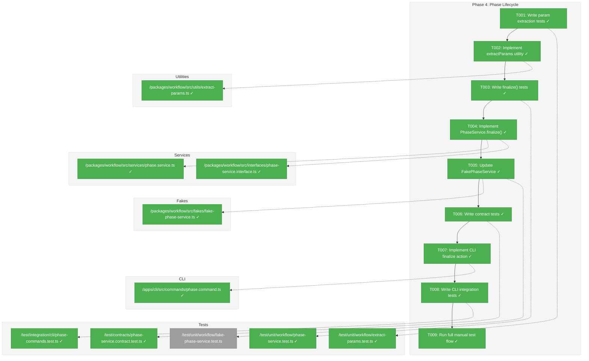
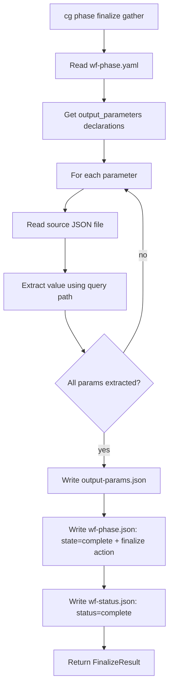
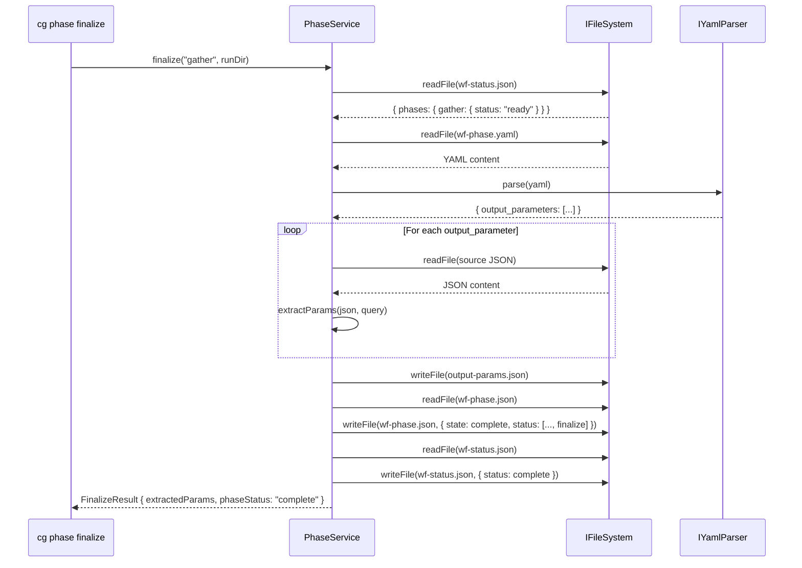

# Phase 4: Phase Lifecycle – Tasks & Alignment Brief

**Spec**: [../../wf-basics-spec.md](../../wf-basics-spec.md)
**Plan**: [../../wf-basics-plan.md](../../wf-basics-plan.md)
**Date**: 2026-01-22

---

## Executive Briefing

### Purpose
This phase completes the workflow lifecycle by implementing `cg phase finalize` — the command that marks a phase as complete and extracts parameters for downstream phases. Without finalize, phases cannot publish data to subsequent phases, and workflows cannot progress.

### What We're Building
A `PhaseService.finalize()` method and corresponding CLI command that:
- Validates all outputs exist and pass schema validation
- Extracts parameters from output JSON files using dot-notation queries
- Writes `output-params.json` with extracted values
- Updates `wf-status.json` to mark phase as `complete`
- Supports idempotent re-execution (calling twice returns same result)

### User Value
Orchestrators and agents can complete phases programmatically, making extracted data available to downstream phases. The JSON output enables autonomous multi-phase workflows where each phase builds on the outputs of previous phases.

### Example
**Input**: Phase `gather` with `gather-data.json` containing `{ items: [1,2,3], classification: { type: "processing" } }`

**Command**:
```bash
$ cg phase finalize gather --run-dir .chainglass/runs/run-2026-01-22-001 --json
```

**Output**:
```json
{
  "success": true,
  "command": "phase.finalize",
  "timestamp": "2026-01-22T12:00:00.000Z",
  "data": {
    "phase": "gather",
    "runDir": ".chainglass/runs/run-2026-01-22-001",
    "extractedParams": {
      "item_count": 3,
      "request_type": "processing"
    },
    "phaseStatus": "complete"
  }
}
```

**Side Effects**:
- Creates `phases/gather/run/wf-data/output-params.json` with `{ item_count: 3, request_type: "processing" }`
- Updates `phases/gather/run/wf-data/wf-phase.json` with `state: "complete"` and adds finalize action to status[]
- Updates `wf-run/wf-status.json` with `phases.gather.status: "complete"`

---

## Objectives & Scope

### Objective
Implement the finalize command per plan acceptance criteria AC-16 through AC-19a, AC-39, and AC-40.

### Behavior Checklist
- [ ] AC-16: from_phase inputs copied from finalized phases (validated in prepare, but requires finalized status)
- [ ] AC-17: params.json created with resolved parameters (prepare uses finalized output-params.json)
- [ ] AC-18: finalize creates output-params.json with extracted values
- [ ] AC-18a: JSON output includes extractedParams object
- [ ] AC-19: Full manual test flow succeeds (compose → gather → process → report)
- [ ] AC-19a: Full flow works with --json
- [ ] AC-39: finalize called twice returns same success result (always re-extracts, overwrites)
- [ ] AC-40: Commands retry after failure without manual cleanup (re-entrant)

### Goals

- ✅ Implement parameter extraction using simple dot-notation queries
- ✅ Add `finalize()` method to `PhaseService` and `IPhaseService`
- ✅ Update `FakePhaseService` with finalize support
- ✅ Create `cg phase finalize` CLI command with --json support
- ✅ Ensure idempotency: always do full extraction and overwrite (same inputs → same outputs)
- ✅ Write contract tests verifying fake/real parity
- ✅ Complete full manual test flow: compose → gather cycle → process cycle → report cycle

### Non-Goals (Scope Boundaries)

- ❌ MCP tools (Phase 5)
- ❌ Message system operations (`cg phase message *` commands) — future phases
- ❌ State checking before finalize (just do the job if phase exists)
- ❌ Performance optimization for parameter extraction
- ❌ Complex query syntax (JSONPath, JMESPath) — dot-notation only per spec
- ❌ Computed parameters or cross-references between parameters
- ❌ `cg phase handover`, `cg phase accept`, `cg phase preflight` commands — future phases

---

## Architecture Map

### Component Diagram
<!-- Status: grey=pending, orange=in-progress, green=completed, red=blocked -->
<!-- Updated by plan-6 during implementation -->



### Task-to-Component Mapping

<!-- Status: ⬜ Pending | 🟧 In Progress | ✅ Complete | 🔴 Blocked -->

| Task | Component(s) | Files | Status | Comment |
|------|-------------|-------|--------|---------|
| T001 | Unit Test | extract-params.test.ts | ✅ Complete | TDD RED: 18 tests for dot-notation extraction |
| T002 | Utility | extract-params.ts | ✅ Complete | TDD GREEN: extractValue() passes 18 tests |
| T003 | Unit Test | phase-service.test.ts | ✅ Complete | TDD RED: 12 finalize tests |
| T004 | Service | phase.service.ts, phase-service.interface.ts | ✅ Complete | TDD GREEN: finalize() passes 12 tests |
| T005 | Fake | fake-phase-service.ts | ✅ Complete | finalize() call capture added |
| T006 | Contract Test | phase-service.contract.test.ts | ✅ Complete | 6 finalize contract tests, both pass |
| T007 | CLI | phase.command.ts | ✅ Complete | finalize action handler added |
| T008 | Integration Test | phase-commands.test.ts | ✅ Complete | 7 finalize integration tests |
| T009 | Manual Test | manual-test-evidence.md | ✅ Complete | All 6 ACs verified |

---

## Tasks

| Status | ID | Task | CS | Type | Dependencies | Absolute Path(s) | Validation | Subtasks | Notes |
|--------|------|-----------------------------------|-----|------|--------------|----------------------------------|-------------------------------|----------|-------------------|
| [x] | T001 | Write tests for parameter extraction utility | 2 | Test | – | /home/jak/substrate/003-wf-basics/test/unit/workflow/extract-params.test.ts | Tests fail (RED phase) | – | Cover dot-notation, nested, arrays, edge cases |
| [x] | T002 | Implement `extractParams()` utility function | 2 | Core | T001 | /home/jak/substrate/003-wf-basics/packages/workflow/src/utils/extract-params.ts, /home/jak/substrate/003-wf-basics/packages/workflow/src/utils/index.ts | All extraction tests pass (GREEN) | – | Simple lodash.get style |
| [x] | T003 | Write tests for PhaseService.finalize() including idempotency (AC-39) | 3 | Test | T002 | /home/jak/substrate/003-wf-basics/test/unit/workflow/phase-service.test.ts | Tests fail (RED phase) | – | 12 tests: extraction, state update, idempotency |
| [x] | T004 | Implement PhaseService.finalize() | 3 | Core | T003 | /home/jak/substrate/003-wf-basics/packages/workflow/src/services/phase.service.ts, /home/jak/substrate/003-wf-basics/packages/workflow/src/interfaces/phase-service.interface.ts | All finalize tests pass (GREEN), writes output-params.json | – | Updates wf-status.json to complete |
| [x] | T005 | Update FakePhaseService with finalize() support | 2 | Fake | T004 | /home/jak/substrate/003-wf-basics/packages/workflow/src/fakes/fake-phase-service.ts, /home/jak/substrate/003-wf-basics/test/unit/workflow/fake-phase-service.test.ts | Fake tests pass | – | Call capture pattern, createFinalizeSuccessResult helper |
| [x] | T006 | Write contract tests for finalize() | 2 | Test | T005 | /home/jak/substrate/003-wf-basics/test/contracts/phase-service.contract.test.ts | Both real and fake pass | – | 6 finalize contract tests added |
| [x] | T007 | Implement `cg phase finalize` action handler | 2 | CLI | T006 | /home/jak/substrate/003-wf-basics/apps/cli/src/commands/phase.command.ts | Action handler wired, --json works | – | Per CD-02 |
| [x] | T008 | Write CLI integration tests for finalize | 2 | Test | T007 | /home/jak/substrate/003-wf-basics/test/integration/cli/phase-commands.test.ts | All CLI tests pass | – | 7 finalize tests added |
| [x] | T009 | Run full manual test flow and document | 3 | Test | T008 | /home/jak/substrate/003-wf-basics/docs/plans/003-wf-basics/tasks/phase-4-phase-lifecycle/manual-test-evidence.md | compose → gather → process → report succeeds (AC-19) | – | All 6 ACs verified |

---

## Alignment Brief

### Prior Phases Review

This phase builds on the complete foundation established by Phases 0, 1, 1a, 2, and 3.

#### Phase-by-Phase Summary

**Phase 0: Development Exemplar** (Complete)
- Created `dev/examples/wf/` with complete hello-workflow template and run-example-001
- Established directory structure: `phases/<name>/run/{inputs,outputs,wf-data,messages}`
- **Key for Phase 4**: `output_parameters` declarations in wf.yaml show how finalize should extract parameters
- Example: gather phase declares `item_count` from `gather-data.json` via query `items.length`

**Phase 1: Core Infrastructure** (Complete)
- 4 core interfaces: IFileSystem, IPathResolver, IYamlParser, ISchemaValidator
- DI tokens and container factories
- **Key for Phase 4**: Uses IFileSystem to read output JSON files, IYamlParser to read phase config

**Phase 1a: Output Adapter Architecture** (Complete)
- Result types including `FinalizeResult` with `extractedParams: Record<string, unknown>` and `phaseStatus: 'complete'`
- **Key for Phase 4**: FinalizeResult already defined — just implement service method

**Phase 2: Compose Command** (Complete)
- IWorkflowService, WorkflowService with compose()
- Run folder structure with wf-status.json
- **Key for Phase 4**: wf-status.json structure to update phase status to `complete`

**Phase 3: Phase Operations** (Complete)
- IPhaseService with prepare() and validate()
- PhaseService implementation with idempotency patterns
- FakePhaseService with call capture
- CLI: `cg phase prepare` and `cg phase validate`
- **Key for Phase 4**: Add finalize() method to existing IPhaseService/PhaseService/FakePhaseService

#### Cumulative Dependencies Available

From all prior phases, these are available for Phase 4:

| Phase | Deliverable | Path | Usage in Phase 4 |
|-------|-------------|------|------------------|
| Phase 1 | IFileSystem | @chainglass/shared | Read output JSON files |
| Phase 1 | IYamlParser | @chainglass/workflow | Read wf-phase.yaml for output_parameters |
| Phase 1 | FakeFileSystem | @chainglass/shared | Test fixture setup |
| Phase 1a | FinalizeResult | @chainglass/shared | Return type for finalize() |
| Phase 2 | wf-status.json | run folder | Update phase status to complete |
| Phase 3 | IPhaseService | @chainglass/workflow | Add finalize() signature |
| Phase 3 | PhaseService | @chainglass/workflow | Add finalize() implementation |
| Phase 3 | FakePhaseService | @chainglass/workflow | Add finalize call capture |
| Phase 3 | phase.command.ts | apps/cli | Add finalize action handler |

#### Test Infrastructure Available

- `FakeFileSystem` for unit tests (set files, simulate errors)
- `FakeYamlParser` for stubbing phase YAML
- `FakeSchemaValidator` for stubbing validation
- Contract test pattern from Phase 3
- CLI integration test pattern from Phase 3
- Exemplar run folder at `dev/examples/wf/runs/run-example-001/`

### Critical Findings Affecting This Phase

**Critical Discovery 01: Output Adapter Architecture** (Phase 1a)
- FinalizeResult type already exists with correct structure
- Constrains: Must return `extractedParams` and `phaseStatus: 'complete'`
- Addressed by: T004

**Critical Discovery 04: Filesystem Test Isolation via IFileSystem** (Phase 1)
- All file operations must go through IFileSystem
- Constrains: Parameter extraction reads files via IFileSystem.readFile()
- Addressed by: T002, T004

**Critical Discovery 05: DI Container Token Naming Pattern** (Phase 1)
- PHASE_SERVICE token already registered (Phase 3)
- No new tokens needed for Phase 4

**Spec § Parameter Resolution** (Simple Dot-Notation)
- Parameter queries are pure dot-notation path lookups (e.g., `count`, `classification.type`, `summary.total`)
- No computed properties (`.length`), expressions, or cross-references
- Agents write explicit values in output JSON; extraction just reads paths
- Constrains: extractParams is simple path traversal - split by `.`, walk object
- Addressed by: T001, T002
- Note: Exemplar may need update to use explicit values instead of `items.length` (DYK #2)

**DYK Critical Discovery: Dual State File Updates** (Phase 4 Pre-Implementation)
- finalize() MUST update BOTH wf-phase.json (phase-local) AND wf-status.json (run-level)
- Rationale: Phases must be self-contained from a data perspective; PhaseService won't have outside context
- wf-phase.json gets: `state: "complete"` + finalize action appended to `status[]` array
- wf-status.json gets: `phases.{name}.status: "complete"`
- Constrains: T003 tests must verify both files, T004 must implement both writes
- Note: This extends beyond original spec which only mentioned wf-status.json
- Addressed by: T003, T004

### Invariants & Guardrails

1. **Idempotency**: finalize() always does full extraction and writes all files - same inputs produce same outputs (AC-39)
2. **Re-entrancy**: Retry after partial failure MUST complete successfully (AC-40)
3. **No Status Checks**: Don't check if already complete - just do the job every time (DYK #4)
4. **Overwrite All Targets**: Always write output-params.json, wf-phase.json, wf-status.json
5. **Error Codes**: Reuse domain codes per DYK #3:
   - E020: Phase not found in wf.yaml
   - E010: Source file for parameter extraction missing
   - E012: Source file contains invalid JSON
   - Query returning undefined → store null (not an error)
   - Note: No E030 state check - just do the job if phase exists
6. **Dual State Update**: MUST update both wf-phase.json (phase-local) AND wf-status.json (run-level) for data independence (DYK #1)

### Inputs to Read

| File | Purpose | Example Path |
|------|---------|--------------|
| wf-phase.yaml | Get output_parameters declarations | `{runDir}/phases/{phase}/wf-phase.yaml` |
| wf-status.json | Check current phase status | `{runDir}/wf-run/wf-status.json` |
| wf-phase.json | Read current state for update | `{runDir}/phases/{phase}/run/wf-data/wf-phase.json` |
| Output JSON files | Extract parameter values | `{runDir}/phases/{phase}/run/outputs/{source}` |

### Outputs to Write

| File | Purpose | Example Path |
|------|---------|--------------|
| output-params.json | Extracted parameters for downstream phases | `{runDir}/phases/{phase}/run/wf-data/output-params.json` |
| wf-phase.json | Update state to complete + add finalize action | `{runDir}/phases/{phase}/run/wf-data/wf-phase.json` |
| wf-status.json | Update phase status to complete | `{runDir}/wf-run/wf-status.json` |

### Visual Alignment Aids

#### Finalize Flow Diagram



#### Parameter Extraction Sequence



### Test Plan (Full TDD)

Following plan Testing Strategy: **Full TDD** with **Avoid Mocks** (use FakeFileSystem with real data).

#### T001: Parameter Extraction Tests

| Test Name | Description | Fixture | Expected |
|-----------|-------------|---------|----------|
| extracts top-level | `count` from `{ count: 3 }` | inline JSON | 3 |
| extracts nested path | `classification.type` from `{ classification: { type: "x" } }` | inline JSON | "x" |
| extracts deep nested | `a.b.c` from `{ a: { b: { c: "deep" } } }` | inline JSON | "deep" |
| extracts array index | `items.0` from `{ items: ["a","b"] }` | inline JSON | "a" |
| extracts nested in array | `items.0.name` from `{ items: [{ name: "first" }] }` | inline JSON | "first" |
| returns undefined for missing | `foo.bar` from `{}` | inline JSON | undefined |
| returns undefined for null chain | `x.y` from `{ x: null }` | inline JSON | undefined |
| handles number values | `total` from `{ total: 42 }` | inline JSON | 42 |
| handles boolean values | `active` from `{ active: true }` | inline JSON | true |

#### T003: PhaseService.finalize() Tests

| Test Name | Description | Setup | Expected |
|-----------|-------------|-------|----------|
| extracts output_parameters | gather phase with gather-data.json | FakeFileSystem with exemplar data | extractedParams has item_count, request_type |
| updates wf-phase.json state and status | phase state transition + audit log | FakeFileSystem | state: complete, status[] has finalize action |
| updates wf-status.json | phase status transition | FakeFileSystem | status changes to complete |
| writes output-params.json | creates wf-data file | FakeFileSystem | file contains extracted params |
| returns E020 for unknown phase | phase not in wf.yaml | FakeFileSystem | error code E020 |
| returns E010 for missing source file | output_parameter source doesn't exist | FakeFileSystem | error code E010 |
| returns E012 for invalid JSON source | source file has malformed JSON | FakeFileSystem | error code E012 |
| stores null for missing query path | query path returns undefined | FakeFileSystem | extractedParams has null value |
| overwrites on re-finalize | call finalize twice, same result | FakeFileSystem | both calls succeed, files overwritten |
| handles phase with no output_parameters | terminal phase like report | FakeFileSystem | extractedParams is {} |
| returns existing params if complete | phase already complete | FakeFileSystem with output-params.json | returns existing without re-extraction |
| handles phase with no output_parameters | terminal phase like report | FakeFileSystem | extractedParams is {} |

#### T006: Contract Tests

| Test Name | Applies To |
|-----------|------------|
| finalize returns FinalizeResult shape | Both |
| finalize success has extractedParams | Both |
| finalize success has phaseStatus complete | Both |
| finalize error has code | Both |

### Implementation Outline

1. **T001**: Create `test/unit/workflow/extract-params.test.ts`
   - Write 6+ tests for dot-notation extraction
   - Tests fail (RED)

2. **T002**: Create `packages/workflow/src/utils/extract-params.ts`
   - Implement `extractValue(obj: unknown, path: string): unknown`
   - Split path by `.`, traverse object
   - Handle arrays with numeric indices
   - Export from utils/index.ts
   - Tests pass (GREEN)

3. **T003**: Add to `test/unit/workflow/phase-service.test.ts`
   - Add `describe('finalize')` block
   - Write 8+ tests covering happy path, errors, idempotency
   - Tests fail (RED)

4. **T004**: Update `packages/workflow/src/services/phase.service.ts`
   - Add `finalize()` method signature to IPhaseService
   - Implement finalize() in PhaseService:
     1. Load wf-status.json, check phase exists (E020) and status valid (E030)
     2. If already complete, read existing output-params.json and return
     3. Load wf-phase.yaml, get output_parameters
     4. For each param: read source, extract value
     5. Write output-params.json
     6. Update wf-status.json status to complete
     7. Return FinalizeResult
   - Tests pass (GREEN)

5. **T005**: Update `packages/workflow/src/fakes/fake-phase-service.ts`
   - Add `FinalizeCall` type
   - Add `finalizeCalls` array
   - Add `getLastFinalizeCall()`, `setFinalizeResult()`, `setFinalizeError()`
   - Add `createFinalizeSuccessResult()` static helper
   - Write tests in fake-phase-service.test.ts

6. **T006**: Update `test/contracts/phase-service.contract.test.ts`
   - Add 4+ finalize contract tests
   - Run against both real and fake

7. **T007**: Update `apps/cli/src/commands/phase.command.ts`
   - Add `handleFinalize()` action handler
   - Register `phase finalize <phase> --run-dir <path> [--json]`

8. **T008**: Update `test/integration/cli/phase-commands.test.ts`
   - Add `describe('finalize execution')` block
   - Test help, JSON output, idempotency

9. **T009**: Manual test flow
   - compose hello-workflow
   - For each phase: prepare → validate → finalize
   - Document output in manual-test-evidence.md

### Commands to Run

```bash
# Build packages
pnpm -F @chainglass/shared build && pnpm -F @chainglass/workflow build

# Run specific tests
pnpm test -- --run test/unit/workflow/extract-params.test.ts
pnpm test -- --run test/unit/workflow/phase-service.test.ts
pnpm test -- --run test/unit/workflow/fake-phase-service.test.ts
pnpm test -- --run test/contracts/phase-service.contract.test.ts
pnpm test -- --run test/integration/cli/phase-commands.test.ts

# Run all tests
pnpm test

# Build CLI
pnpm -F @chainglass/cli build

# Manual test flow
node apps/cli/dist/cli.cjs wf compose dev/examples/wf/template/hello-workflow --runs-dir /tmp/test-runs --json
node apps/cli/dist/cli.cjs phase prepare gather --run-dir /tmp/test-runs/run-2026-01-22-001 --json
node apps/cli/dist/cli.cjs phase validate gather --run-dir /tmp/test-runs/run-2026-01-22-001 --check outputs --json
node apps/cli/dist/cli.cjs phase finalize gather --run-dir /tmp/test-runs/run-2026-01-22-001 --json
```

### Risks/Unknowns

| Risk | Severity | Mitigation |
|------|----------|------------|
| Parameter extraction query complexity | Low | Spec explicitly limits to dot-notation; no complex queries |
| Missing source files during finalize | Medium | Return clear E0XX error with path |
| State transition edge cases | Low | Check status before finalize; if complete, return existing |
| Terminal phases with no output_parameters | Low | Handle empty declarations; return `extractedParams: {}` |

### Ready Check

- [ ] FinalizeResult type exists in @chainglass/shared ✓ (Phase 1a)
- [ ] IPhaseService interface ready for finalize() addition ✓ (Phase 3)
- [ ] PhaseService class ready for finalize() implementation ✓ (Phase 3)
- [ ] FakePhaseService ready for finalize call capture ✓ (Phase 3)
- [ ] phase.command.ts ready for finalize handler ✓ (Phase 3)
- [ ] Exemplar has output_parameters to test against ✓ (Phase 0)
- [ ] ADR constraints mapped to tasks - N/A (no relevant ADRs for Phase 4)

**Awaiting GO/NO-GO before implementation.**

---

## Phase Footnote Stubs

| Footnote | Task | Description |
|----------|------|-------------|
| | | _To be populated by plan-6 during implementation_ |

---

## Evidence Artifacts

**Execution Log**: `./execution.log.md` (created by plan-6)

**Manual Test Evidence**: `./manual-test-evidence.md` (created by T009)

---

## Discoveries & Learnings

_Populated during implementation by plan-6. Log anything of interest to your future self._

| Date | Task | Type | Discovery | Resolution | References |
|------|------|------|-----------|------------|------------|
| | | | | | |

**Types**: `gotcha` | `research-needed` | `unexpected-behavior` | `workaround` | `decision` | `debt` | `insight`

**What to log**:
- Things that didn't work as expected
- External research that was required
- Implementation troubles and how they were resolved
- Gotchas and edge cases discovered
- Decisions made during implementation
- Technical debt introduced (and why)
- Insights that future phases should know about

_See also: `execution.log.md` for detailed narrative._

---

## Directory Layout

```
docs/plans/003-wf-basics/
├── wf-basics-plan.md
├── wf-basics-spec.md
└── tasks/
    └── phase-4-phase-lifecycle/
        ├── tasks.md                    # This dossier
        ├── execution.log.md            # Created by plan-6
        └── manual-test-evidence.md     # Created by T009
```

---

## Critical Insights Discussion

**Session**: 2026-01-22
**Context**: Phase 4: Phase Lifecycle - Tasks & Alignment Brief pre-implementation review
**Analyst**: AI Clarity Agent
**Reviewer**: Development Team
**Format**: Water Cooler Conversation (5 Critical Insights)

### Insight 1: Dual State File Updates

**Did you know**: finalize() needs to update both wf-status.json (run-level) AND wf-phase.json (phase-local) for data independence.

**Implications**:
- Phases must be self-contained from a data perspective
- PhaseService won't have outside context when reading phase state
- Currently no code writes wf-phase.json - it only exists in manually-created exemplars

**Options Considered**:
- Option A: Update both files atomically - **SELECTED**
- Option B: wf-status.json as single source of truth
- Option C: Derive from wf-phase.json

**AI Recommendation**: Option B (single source, matches existing pattern)

**Discussion Summary**: User clarified phases must be self-contained. PhaseService shouldn't need to look outside phase's wf-data/ directory.

**Decision**: Option A - Update both wf-phase.json and wf-status.json in finalize()

**Action Items**:
- [x] Update tasks.md with dual file write requirement
- [ ] Consider backfilling prepare() to write wf-phase.json (future task)

**Affects**: T003, T004, flow diagrams, sequence diagrams

---

### Insight 2: Parameter Extraction Simplicity

**Did you know**: The exemplar's `query: "items.length"` pattern requires special handling that goes beyond simple path traversal.

**Implications**:
- `.length` is a computed property on arrays, not a JSON field
- lodash.get() doesn't support this
- Would need custom mapping logic

**Options Considered**:
- Option A: Use lodash.get() - needs wrapping for .length
- Option B: Custom utility without .length - **NOT VIABLE**
- Option C: Custom utility with .length mapping

**AI Recommendation**: Option C (custom with .length support)

**Discussion Summary**: User clarified this is a bad example. Agents should write explicit values (e.g., `count: 3`) instead of requiring computed extraction.

**Decision**: Pure dot-notation path traversal only. Agents write explicit values. Exemplar needs update.

**Action Items**:
- [x] Update T001 tests to reflect pure path traversal
- [ ] Update exemplar wf.yaml to use simple queries (e.g., `query: "count"`)

**Affects**: T001, T002, exemplar files

---

### Insight 3: Error Code Coverage

**Did you know**: The tasks document only specified E020 and E030, but finalize() has 5+ failure scenarios.

**Implications**:
- Missing source file, invalid JSON, query path not found all need handling
- Need consistent error code strategy

**Options Considered**:
- Option A: Collapse all to E030 - poor agent UX
- Option B: Add new codes E032-E035 - breaks spec
- Option C: Reuse existing domain codes - **SELECTED**

**AI Recommendation**: Option C

**Discussion Summary**: User agreed - reuse existing codes, keep it simple.

**Decision**: E020 (phase not found), E010 (missing source), E012 (invalid JSON). Query returning undefined stores null.

**Action Items**:
- [x] Update error codes in Invariants section
- [x] Add test cases for E010, E012, null handling

**Affects**: T003, T004

---

### Insight 4: Idempotency Simplification

**Did you know**: AC-39's "no re-extraction" language was overcomplicating the implementation with status checks and cached results.

**Implications**:
- Original design had branching logic for "already complete" phases
- Added complexity without clear benefit

**Options Considered**:
- Option A: Return cached result if complete
- Option B: Re-extract and verify match
- Option C: Always re-extract and overwrite

**AI Recommendation**: Option A (per spec language)

**Discussion Summary**: User pushed back - "just do the job". No need to check status or return cached results. Same inputs produce same outputs naturally.

**Decision**: Always do full extraction and overwrite all files. No status checks.

**Action Items**:
- [x] Simplify flow diagram (remove status check branch)
- [x] Update Invariants to reflect "just do it" approach
- [x] Remove E030 (no state checking)
- [x] Update test cases

**Affects**: T003, T004, flow diagrams, Invariants

---

### Insight 5: CLI Handler Pattern

**Did you know**: The prepare/validate handlers follow an identical 6-step pattern that finalize must match exactly.

**Implications**:
- Output adapters already support finalize formatting
- No DI container - uses factory functions
- Integration tests expect this exact pattern

**Options Considered**:
- Option A: Copy-paste adapt - **SELECTED**
- Option B: Extract common helper
- Option C: Build from scratch

**AI Recommendation**: Option A

**Discussion Summary**: User agreed - straightforward, follow the pattern.

**Decision**: Copy prepare handler pattern exactly for finalize.

**Action Items**:
- [ ] Implement T007 following established pattern

**Affects**: T007

---

## Session Summary

**Insights Surfaced**: 5 critical insights identified and discussed
**Decisions Made**: 5 decisions reached through collaborative discussion
**Action Items Created**: 8 follow-up tasks identified (6 completed inline)
**Areas Updated**:
- Flow diagrams simplified
- Test cases updated (T001, T003)
- Error codes clarified
- Invariants rewritten
- Critical Findings added

**Shared Understanding Achieved**: Yes

**Confidence Level**: High - Key design decisions made, scope clarified, complexity reduced

**Next Steps**:
- Proceed with `/plan-6-implement-phase` for Phase 4
- Note: Exemplar may need minor updates for parameter query simplification
```
