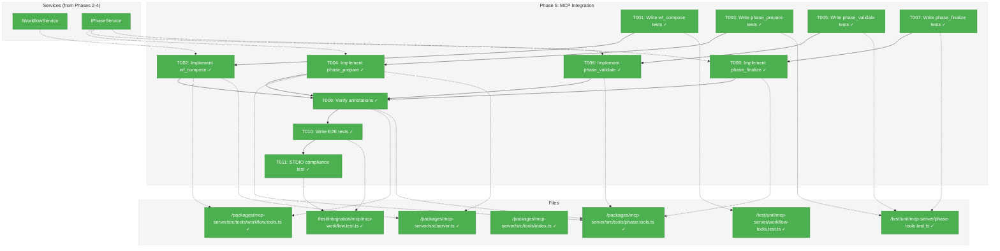
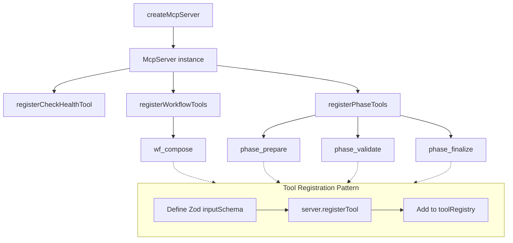
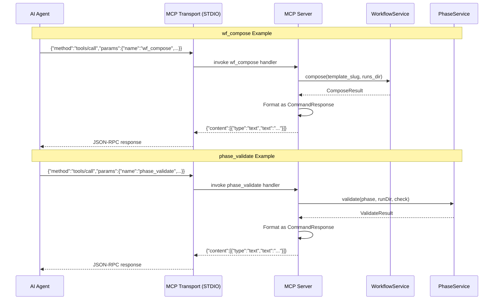

# Phase 5: MCP Integration – Tasks & Alignment Brief

**Spec**: [wf-basics-spec.md](../../wf-basics-spec.md)
**Plan**: [wf-basics-plan.md](../../wf-basics-plan.md)
**Date**: 2026-01-23

---

## Executive Briefing

### Purpose
This phase wraps the existing workflow services (`IWorkflowService`, `IPhaseService`) as MCP tools, enabling AI agents to execute workflows via the Model Context Protocol. MCP tools are the primary interface for AI agents interacting with Chainglass.

### What We're Building
Four MCP tools following ADR-0001 patterns:
- `wf_compose` - Creates new workflow runs from templates
- `phase_prepare` - Prepares a phase for execution
- `phase_validate` - Validates phase inputs/outputs
- `phase_finalize` - Finalizes a phase, extracting parameters

### User Value
AI agents gain programmatic access to workflow operations with the same semantics as CLI commands. Agents can autonomously execute multi-phase workflows, validate outputs, and recover from errors using structured JSON responses.

### Example
**Tool Call**: `wf_compose({ template_slug: "hello-workflow", runs_dir: ".chainglass/runs" })`
**Response**:
```json
{
  "success": true,
  "command": "wf.compose",
  "timestamp": "2026-01-23T10:00:00Z",
  "data": {
    "runDir": ".chainglass/runs/run-2026-01-23-001",
    "template": "hello-workflow",
    "phases": [{ "name": "gather", "order": 1, "status": "pending" }]
  }
}
```

---

## Objectives & Scope

### Objective
Implement MCP tools for all workflow operations, meeting AC-20 through AC-22 and AC-28 from the specification.

### Goals

- ✅ Implement `wf_compose` MCP tool wrapping `IWorkflowService.compose()`
- ✅ Implement `phase_prepare` MCP tool wrapping `IPhaseService.prepare()`
- ✅ Implement `phase_validate` MCP tool wrapping `IPhaseService.validate()`
- ✅ Implement `phase_finalize` MCP tool wrapping `IPhaseService.finalize()`
- ✅ All tools follow ADR-0001 patterns (naming, descriptions, annotations, error handling)
- ✅ MCP responses use same `CommandResponse<T>` envelope as CLI `--json` output
- ✅ STDIO compliance maintained (no stdout pollution)

### Non-Goals (Scope Boundaries)

- ❌ New lifecycle commands (`accept`, `handover`, `preflight`) - Future phase
- ❌ Message communication MCP tools - Future phase
- ❌ MCP resources or prompts - Tools only
- ❌ Performance optimization for large workflows - Premature
- ❌ Batch/bulk operations - Single operations only
- ❌ WebSocket or HTTP transport - STDIO only for this phase
- ❌ Tool search/filtering mechanisms - Under 25-tool threshold (ADR-0001 IMP-005)

---

## Architecture Map

### Component Diagram
<!-- Status: grey=pending, orange=in-progress, green=completed, red=blocked -->
<!-- Updated by plan-6 during implementation -->



### Task-to-Component Mapping

<!-- Status: ⬜ Pending | 🟧 In Progress | ✅ Complete | 🔴 Blocked -->

| Task | Component(s) | Files | Status | Comment |
|------|-------------|-------|--------|---------|
| T001 | wf_compose unit tests | /test/unit/mcp-server/workflow-tools.test.ts | ✅ Complete | TDD: Write failing tests first |
| T002 | wf_compose tool | /packages/mcp-server/src/tools/workflow.tools.ts, server.ts | ✅ Complete | Wrap WorkflowService.compose() |
| T003 | phase_prepare unit tests | /test/unit/mcp-server/phase-tools.test.ts | ✅ Complete | TDD: Write failing tests first |
| T004 | phase_prepare tool | /packages/mcp-server/src/tools/phase.tools.ts, server.ts | ✅ Complete | Wrap PhaseService.prepare() |
| T005 | phase_validate unit tests | /test/unit/mcp-server/phase-tools.test.ts | ✅ Complete | TDD: Write failing tests first |
| T006 | phase_validate tool | /packages/mcp-server/src/tools/phase.tools.ts | ✅ Complete | Wrap PhaseService.validate() |
| T007 | phase_finalize unit tests | /test/unit/mcp-server/phase-tools.test.ts | ✅ Complete | TDD: Write failing tests first |
| T008 | phase_finalize tool | /packages/mcp-server/src/tools/phase.tools.ts | ✅ Complete | Wrap PhaseService.finalize() |
| T009 | Annotation verification | workflow.tools.ts, phase.tools.ts | ✅ Complete | Verify all 4 hints per ADR-0001 |
| T010 | E2E integration tests | /test/integration/mcp/mcp-workflow.test.ts | ✅ Complete | Full workflow via MCP |
| T011 | STDIO compliance | /test/integration/mcp/mcp-workflow.test.ts | ✅ Complete | Verify no stdout pollution |

---

## Tasks

| Status | ID | Task | CS | Type | Dependencies | Absolute Path(s) | Validation | Subtasks | Notes |
|--------|------|------|-----|------|--------------|------------------|------------|----------|-------|
| [x] | T001 | Write unit tests for wf_compose tool | 2 | Test | – | /home/jak/substrate/003-wf-basics/test/unit/mcp-server/workflow-tools.test.ts | Tests fail (RED phase) | – | TDD first |
| [x] | T002 | Implement wf_compose MCP tool | 3 | Core | T001 | /home/jak/substrate/003-wf-basics/packages/mcp-server/src/tools/workflow.tools.ts, /home/jak/substrate/003-wf-basics/packages/mcp-server/src/server.ts | Tests pass (GREEN phase), tool registered | – | Per CD-03, follows check_health exemplar |
| [x] | T003 | Write unit tests for phase_prepare tool | 2 | Test | – | /home/jak/substrate/003-wf-basics/test/unit/mcp-server/phase-tools.test.ts | Tests fail (RED phase) | – | TDD first |
| [x] | T004 | Implement phase_prepare MCP tool | 2 | Core | T003 | /home/jak/substrate/003-wf-basics/packages/mcp-server/src/tools/phase.tools.ts, /home/jak/substrate/003-wf-basics/packages/mcp-server/src/server.ts | Tests pass, idempotentHint: true | – | Per CD-03 |
| [x] | T005 | Write unit tests for phase_validate tool | 2 | Test | – | /home/jak/substrate/003-wf-basics/test/unit/mcp-server/phase-tools.test.ts | Tests fail (RED phase) | – | TDD first |
| [x] | T006 | Implement phase_validate MCP tool | 2 | Core | T005 | /home/jak/substrate/003-wf-basics/packages/mcp-server/src/tools/phase.tools.ts | Tests pass, readOnlyHint: true | – | Pure read operation |
| [x] | T007 | Write unit tests for phase_finalize tool | 2 | Test | – | /home/jak/substrate/003-wf-basics/test/unit/mcp-server/phase-tools.test.ts | Tests fail (RED phase) | – | TDD first |
| [x] | T008 | Implement phase_finalize MCP tool | 2 | Core | T007 | /home/jak/substrate/003-wf-basics/packages/mcp-server/src/tools/phase.tools.ts | Tests pass, idempotentHint: true | – | Per CD-03 |
| [x] | T009 | Verify all tools have complete annotations | 1 | Integration | T002, T004, T006, T008 | /home/jak/substrate/003-wf-basics/packages/mcp-server/src/tools/workflow.tools.ts, /home/jak/substrate/003-wf-basics/packages/mcp-server/src/tools/phase.tools.ts | All 4 hints present per ADR-0001 | – | AC-22 |
| [x] | T010 | Write MCP integration tests (E2E) | 3 | Integration | T009 | /home/jak/substrate/003-wf-basics/test/integration/mcp/mcp-workflow.test.ts | Full compose→finalize flow works | – | Uses subprocess |
| [x] | T011 | Test STDIO compliance (no stdout pollution) | 1 | Integration | T010 | /home/jak/substrate/003-wf-basics/test/integration/mcp/mcp-workflow.test.ts | stdout contains only JSON-RPC | – | Three-layer defense |

---

## Alignment Brief

### Prior Phases Review

#### Phase-by-Phase Summary

**Phase 0: Development Exemplar** (2026-01-21)
- Created complete `dev/examples/wf/` with template and run structures
- Established filesystem patterns: `run/inputs/{files,data}`, `run/outputs/`, `run/wf-data/`, `run/messages/`
- All JSON schemas validate against exemplar data
- Subtasks added message communication system and fixed concept drift in main.md files

**Phase 1: Core Infrastructure** (2026-01-21)
- Created `packages/workflow/` with 4 interface domains: IFileSystem, IPathResolver, IYamlParser, ISchemaValidator
- Established Interface + Adapter + Fake triple pattern with contract tests
- 193 tests providing comprehensive coverage
- DI infrastructure with tokens and container factories ready for service registration

**Phase 1a: Output Adapter Architecture** (2026-01-21)
- Implemented `IOutputAdapter` with `JsonOutputAdapter`, `ConsoleOutputAdapter`, `FakeOutputAdapter`
- Established `CommandResponse<T>` envelope pattern: `{ success, command, timestamp, data/error }`
- Services return domain objects, adapters format output - clean separation
- 66 tests verifying semantic equivalence across adapters

**Phase 2: Compose Command** (2026-01-22)
- Implemented `IWorkflowService.compose()` with `WorkflowService` and `FakeWorkflowService`
- Created `wf.command.ts` CLI with `cg wf compose <slug>` command
- Schema embedding as TypeScript modules (DYK-01) - schemas available at runtime
- 52 tests covering compose operations
- Key insight: Direct service instantiation in CLI (TODO for DI container)

**Phase 3: Phase Operations** (2026-01-22)
- Implemented `IPhaseService` with `prepare()`, `validate()`, `finalize()` methods
- Created `phase.command.ts` CLI with prepare/validate commands
- Established idempotency patterns: prepare checks status, validate is pure read
- 56 tests including contract tests for fake/real parity
- FakePhaseService with call capture pattern for test verification

**Phase 4: Phase Lifecycle** (2026-01-22)
- Implemented `PhaseService.finalize()` with parameter extraction
- Created `extractValue()` utility for dot-notation path traversal
- Established dual state file update pattern (wf-phase.json + wf-status.json)
- Added `cg phase finalize` CLI command
- 43 tests including full manual workflow verification
- Key insight: Always re-extract and overwrite (no status checks per DYK-04)

#### Cumulative Deliverables (by phase of origin)

**From Phase 0:**
- Exemplar template: `/home/jak/substrate/003-wf-basics/dev/examples/wf/template/hello-workflow/`
- Exemplar run: `/home/jak/substrate/003-wf-basics/dev/examples/wf/runs/run-example-001/`
- JSON Schemas: wf.schema.json, wf-phase.schema.json, message.schema.json

**From Phase 1:**
- Interfaces: `IFileSystem`, `IPathResolver`, `IYamlParser`, `ISchemaValidator`
- Adapters: `NodeFileSystemAdapter`, `PathResolverAdapter`, `YamlParserAdapter`, `SchemaValidatorAdapter`
- Fakes: `FakeFileSystem`, `FakePathResolver`, `FakeYamlParser`, `FakeSchemaValidator`
- DI Tokens: `SHARED_DI_TOKENS`, `WORKFLOW_DI_TOKENS`
- Container: `createWorkflowProductionContainer()`, `createWorkflowTestContainer()`

**From Phase 1a:**
- Types: `BaseResult`, `ResultError`, `ComposeResult`, `PrepareResult`, `ValidateResult`, `FinalizeResult`
- Interface: `IOutputAdapter`
- Adapters: `JsonOutputAdapter`, `ConsoleOutputAdapter`, `FakeOutputAdapter`
- Token: `SHARED_DI_TOKENS.OUTPUT_ADAPTER`

**From Phase 2:**
- Interface: `IWorkflowService` with `compose()` method
- Service: `WorkflowService`
- Fake: `FakeWorkflowService` with call capture
- CLI: `registerWfCommands()` in `wf.command.ts`
- Token: `WORKFLOW_DI_TOKENS.WORKFLOW_SERVICE`
- Embedded Schemas: `WF_SCHEMA`, `WF_PHASE_SCHEMA`, `MESSAGE_SCHEMA`, `WF_STATUS_SCHEMA`

**From Phase 3:**
- Interface: `IPhaseService` with `prepare()`, `validate()`, `finalize()` signatures
- Service: `PhaseService`
- Fake: `FakePhaseService` with call capture
- CLI: `registerPhaseCommands()` in `phase.command.ts`
- Token: `WORKFLOW_DI_TOKENS.PHASE_SERVICE`
- Error Codes: E001, E010, E011, E012, E020, E031

**From Phase 4:**
- Utility: `extractValue(obj, path)` for parameter extraction
- Updated: `PhaseService.finalize()` implementation
- Updated: `FakePhaseService` with finalize support
- CLI: `cg phase finalize` command

#### Reusable Test Infrastructure

| Phase | Test Infrastructure | Location |
|-------|---------------------|----------|
| Phase 1 | FakeFileSystem with `setFile()`, `setDir()`, `simulateError()` | `@chainglass/shared/fakes` |
| Phase 1 | Contract test pattern for interface verification | `test/contracts/*.contract.test.ts` |
| Phase 1a | FakeOutputAdapter with `getLastOutput()`, `getFormattedResults()` | `@chainglass/shared/fakes` |
| Phase 2 | FakeWorkflowService with call capture | `@chainglass/workflow/fakes` |
| Phase 3 | FakePhaseService with call capture | `@chainglass/workflow/fakes` |

#### Pattern Evolution

1. **Call Capture Pattern**: Established in Phase 1a (FakeOutputAdapter) → refined in Phase 2 (FakeWorkflowService) → finalized in Phase 3 (FakePhaseService). MCP tools should use the same pattern for testing.

2. **Idempotency Pattern**: Evolved from "check status first" (Phase 3) → "always execute, same inputs = same outputs" (Phase 4). MCP tools inherit this from underlying services.

3. **Error Code Pattern**: Consistent E0XX codes across phases. MCP tools should pass through error codes from services.

4. **Output Formatting**: Services return domain objects, adapters format. MCP tools should format responses identically to CLI `--json` output.

### Critical Findings Affecting This Phase

| Finding | What It Constrains/Requires | Tasks Addressing |
|---------|---------------------------|------------------|
| **CD-03: MCP Tool Registration Pattern** | All tools must follow check_health exemplar with Zod schema, annotations, async handler | T002, T004, T006, T008 |
| **ADR-0001 Naming** | Tools use `verb_object` snake_case format | All tool tasks |
| **ADR-0001 Descriptions** | 3-4 sentences covering action, context, return, alternatives | All tool tasks |
| **ADR-0001 Annotations** | All 4 hints required: readOnlyHint, destructiveHint, idempotentHint, openWorldHint | T009 |
| **ADR-0001 STDIO** | stdout reserved for JSON-RPC; all logging to stderr | T011 |
| **CD-01 Output Pattern** | MCP responses must match CLI `--json` CommandResponse envelope | All tool tasks |

### ADR Decision Constraints

**ADR-0001: MCP Tool Design Patterns** (Accepted)

Constraints affecting Phase 5:
- **Naming**: Tools must use snake_case `verb_object` format (e.g., `wf_compose`, `phase_prepare`)
- **Descriptions**: 3-4 sentences per ADR-0001 §3
- **Parameters**: Use Zod schemas with explicit constraints, not natural language
- **Responses**: JSON with semantic fields and mandatory `summary` field
- **Errors**: Translated errors with actionable `action` field
- **Annotations**: Complete MCP annotations per table in plan § Critical Discovery 03:

| Tool | readOnlyHint | destructiveHint | idempotentHint | openWorldHint |
|------|--------------|-----------------|----------------|---------------|
| `wf_compose` | false | false | **false** | false |
| `phase_prepare` | false | false | **true** | false |
| `phase_validate` | **true** | false | **true** | false |
| `phase_finalize` | false | false | **true** | false |

**Constrains**: T002, T004, T006, T008, T009
**Addressed by**: All tool implementation tasks must include complete annotations

### Invariants & Guardrails

1. **STDIO Compliance**: stdout reserved exclusively for JSON-RPC messages. Logger must be configured for stderr before any imports.
2. **Tool Count Budget**: Currently 1 tool (check_health). Adding 4 tools = 5 total. Well under 25-tool limit (ADR-0001 IMP-005).
3. **Response Consistency**: MCP tool responses must be parseable identically to CLI `--json` output.

### Inputs to Read

| File | Purpose |
|------|---------|
| `/home/jak/substrate/003-wf-basics/packages/mcp-server/src/server.ts` | Existing check_health exemplar, McpServer setup |
| `/home/jak/substrate/003-wf-basics/packages/mcp-server/src/tools/index.ts` | Tool export barrel |
| `/home/jak/substrate/003-wf-basics/packages/workflow/src/services/workflow.service.ts` | WorkflowService.compose() implementation |
| `/home/jak/substrate/003-wf-basics/packages/workflow/src/services/phase.service.ts` | PhaseService prepare/validate/finalize |
| `/home/jak/substrate/003-wf-basics/packages/workflow/src/fakes/fake-workflow-service.ts` | Test double pattern |
| `/home/jak/substrate/003-wf-basics/packages/workflow/src/fakes/fake-phase-service.ts` | Test double pattern |
| `/home/jak/substrate/003-wf-basics/docs/adr/adr-0001-mcp-tool-design-patterns.md` | Mandatory design constraints |

### Visual Alignment Aids

#### MCP Tool Registration Flow



#### MCP Tool Invocation Sequence



### Test Plan (Full TDD)

**Testing Approach**: Full TDD per spec mock preference (fakes only, no mocks)

**Test Levels** (per ADR-0001 IMP-003):

1. **Unit Tests** - Test tool handlers with FakeWorkflowService/FakePhaseService
2. **Integration Tests** - Test full tool registration and invocation via McpServer
3. **E2E Tests** - Test complete workflow via subprocess with STDIO transport

#### Named Tests with Rationale

**Unit Tests: workflow-tools.test.ts**

| Test Name | Rationale | Fixture | Expected Output |
|-----------|-----------|---------|-----------------|
| `wf_compose returns ComposeResult on success` | Happy path verification | FakeWorkflowService with preset result | `{ success: true, data: { runDir, template, phases } }` |
| `wf_compose returns error for missing template` | Error handling | FakeWorkflowService with E020 error | `{ success: false, error: { code: 'E020' } }` |
| `wf_compose has correct annotations` | ADR-0001 compliance | Tool registration | `idempotentHint: false, destructiveHint: false` |

**Unit Tests: phase-tools.test.ts**

| Test Name | Rationale | Fixture | Expected Output |
|-----------|-----------|---------|-----------------|
| `phase_prepare returns PrepareResult on success` | Happy path | FakePhaseService with preset result | `{ success: true, data: { phase, status, inputs } }` |
| `phase_prepare returns error for missing phase` | E020 error | FakePhaseService with error | `{ success: false, error: { code: 'E020' } }` |
| `phase_prepare has idempotentHint true` | ADR-0001 compliance | Tool registration | `idempotentHint: true` |
| `phase_validate returns ValidateResult on success` | Happy path | FakePhaseService | `{ success: true, data: { phase, check, files } }` |
| `phase_validate has readOnlyHint true` | Pure read operation | Tool registration | `readOnlyHint: true` |
| `phase_finalize returns FinalizeResult on success` | Happy path | FakePhaseService | `{ success: true, data: { phase, extractedParams } }` |
| `phase_finalize has idempotentHint true` | ADR-0001 compliance | Tool registration | `idempotentHint: true` |

**Integration Tests: mcp-workflow.test.ts**

| Test Name | Rationale | Setup | Expected Outcome |
|-----------|-----------|-------|------------------|
| `full workflow via MCP tools` | AC-20, AC-21 | Real services + temp dir | compose→prepare→validate→finalize all succeed |
| `MCP produces same result as CLI` | AC-20 | Compare MCP vs CLI output | JSON responses equivalent |
| `STDIO has no pollution` | ADR-0001 IMP-001 | Capture stdout | Only JSON-RPC messages on stdout |

### Step-by-Step Implementation Outline

1. **T001**: Write failing tests for wf_compose tool
   - Create `/test/unit/mcp-server/workflow-tools.test.ts`
   - Test success case with FakeWorkflowService
   - Test error case with E020
   - Test annotation values

2. **T002**: Implement wf_compose tool
   - Create `/packages/mcp-server/src/tools/workflow.tools.ts`
   - Define Zod schema for inputs (template_slug, runs_dir optional)
   - Implement handler calling WorkflowService.compose()
   - Format response as CommandResponse envelope
   - Register tool in server.ts
   - Run tests until GREEN

3. **T003**: Write failing tests for phase_prepare tool
   - Add to `/test/unit/mcp-server/phase-tools.test.ts`
   - Test success case
   - Test E020 error
   - Test annotation (idempotentHint: true)

4. **T004**: Implement phase_prepare tool
   - Create `/packages/mcp-server/src/tools/phase.tools.ts`
   - Define Zod schema (phase, run_dir)
   - Implement handler calling PhaseService.prepare()
   - Register tool in server.ts

5. **T005**: Write failing tests for phase_validate tool
   - Add to phase-tools.test.ts
   - Test success case
   - Test E010 error
   - Test annotation (readOnlyHint: true)

6. **T006**: Implement phase_validate tool
   - Add to phase.tools.ts
   - Define schema (phase, run_dir, check)
   - Implement handler calling PhaseService.validate()

7. **T007**: Write failing tests for phase_finalize tool
   - Add to phase-tools.test.ts
   - Test success case
   - Test E020 error
   - Test annotation (idempotentHint: true)

8. **T008**: Implement phase_finalize tool
   - Add to phase.tools.ts
   - Define schema (phase, run_dir)
   - Implement handler calling PhaseService.finalize()

9. **T009**: Verify all annotations
   - Check each tool has all 4 annotation hints
   - Verify values match table in plan

10. **T010**: Write E2E integration tests
    - Create `/test/integration/mcp/mcp-workflow.test.ts`
    - Test full workflow via subprocess

11. **T011**: Test STDIO compliance
    - Verify stdout contains only JSON-RPC
    - Verify logging goes to stderr

### Commands to Run

```bash
# Environment setup
cd /home/jak/substrate/003-wf-basics
pnpm install

# Run unit tests (during development)
pnpm exec vitest run test/unit/mcp-server --config test/vitest.config.ts

# Run integration tests
pnpm exec vitest run test/integration/mcp --config test/vitest.config.ts

# Run all tests
just test

# Type checking
just typecheck

# Linting
just lint

# Build all packages
just build

# Quick pre-commit check
just fft

# Manual MCP testing (STDIO mode)
pnpm -F @chainglass/cli exec cg mcp --stdio

# Full quality check
just check
```

### Risks/Unknowns

| Risk | Severity | Mitigation |
|------|----------|------------|
| DI container not wired in MCP server | Medium | Follow Phase 2 pattern - direct instantiation first, TODO for DI |
| STDIO pollution from transitive dependencies | Medium | Follow three-layer defense: 1) stderr logger, 2) console redirect, 3) E2E test verification |
| Zod schema version mismatch with @modelcontextprotocol/sdk | Low | Use same Zod version as SDK; check peer dependencies |
| Service errors not formatted consistently | Low | Use JsonOutputAdapter.format() pattern for all responses |

### Ready Check

- [x] ADR-0001 constraints understood (naming, descriptions, annotations)
- [x] check_health exemplar pattern reviewed in server.ts
- [x] Service interfaces understood (IWorkflowService, IPhaseService)
- [x] Fake services available for testing
- [x] CommandResponse envelope pattern understood
- [x] STDIO compliance requirements understood (stderr logging)
- [x] ADR constraints mapped to tasks (IDs noted in Notes column) - Per ADR-0001

---

## Phase Footnote Stubs

<!-- plan-6 will add footnotes here during implementation -->

| Footnote | Description | Added By |
|----------|-------------|----------|
| | | |

---

## Evidence Artifacts

| Artifact | Location | Purpose |
|----------|----------|---------|
| Execution log | `./execution.log.md` | Task-by-task narrative |
| Unit test results | `test/unit/mcp-server/workflow-tools.test.ts` (8 tests) | wf_compose unit tests |
| Unit test results | `test/unit/mcp-server/phase-tools.test.ts` (11 tests) | phase tools unit tests |
| Integration test results | `test/integration/mcp/mcp-workflow.test.ts` (7 tests) | E2E workflow tests |
| STDIO compliance evidence | `mcp-workflow.test.ts > STDIO compliance` | ADR-0001 verification |
| Full test suite | 657 tests passing | Complete regression verification |

---

## Discoveries & Learnings

_Populated during implementation by plan-6. Log anything of interest to your future self._

| Date | Task | Type | Discovery | Resolution | References |
|------|------|------|-----------|------------|------------|
| 2026-01-23 | T002 | decision | PathResolverAdapter requires no constructor args | Corrected direct instantiation | workflow.tools.ts:97 |
| 2026-01-23 | T002-T008 | debt | Direct service instantiation instead of DI | Added TODO comment; ADR-0004 IMP-005 known violation | workflow.tools.ts, phase.tools.ts |
| 2026-01-23 | T002 | insight | Zod schemas work natively with MCP SDK | Used z.string(), z.enum() - SDK converts to JSON Schema | WF-01 discovery |
| 2026-01-23 | T010 | insight | E2E tests can use exemplar template path | Used dev/examples/wf/template/hello-workflow for reliable success | mcp-workflow.test.ts |

**Types**: `gotcha` | `research-needed` | `unexpected-behavior` | `workaround` | `decision` | `debt` | `insight`

**What to log**:
- Things that didn't work as expected
- External research that was required
- Implementation troubles and how they were resolved
- Gotchas and edge cases discovered
- Decisions made during implementation
- Technical debt introduced (and why)
- Insights that future phases should know about

_See also: `execution.log.md` for detailed narrative._

---

## Directory Layout

```
docs/plans/003-wf-basics/
├── wf-basics-spec.md
├── wf-basics-plan.md
└── tasks/
    ├── phase-0-development-exemplar/
    ├── phase-1-core-infrastructure/
    ├── phase-1a-output-adapter-architecture/
    ├── phase-2-compose-command/
    ├── phase-3-phase-operations/
    ├── phase-4-phase-lifecycle/
    └── phase-5-mcp-integration/
        ├── tasks.md                    # This file
        └── execution.log.md            # Created by plan-6
```
