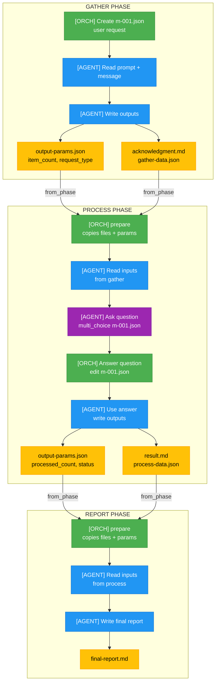
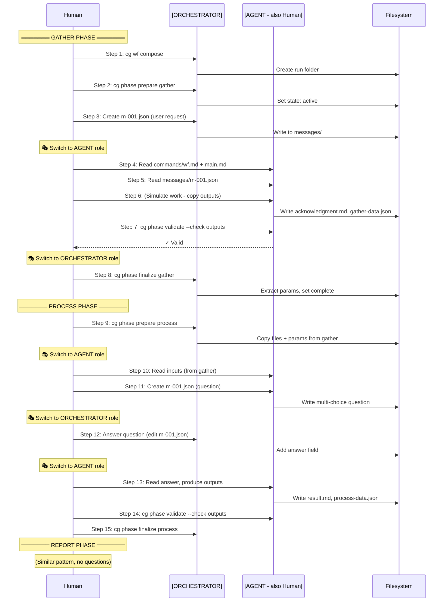
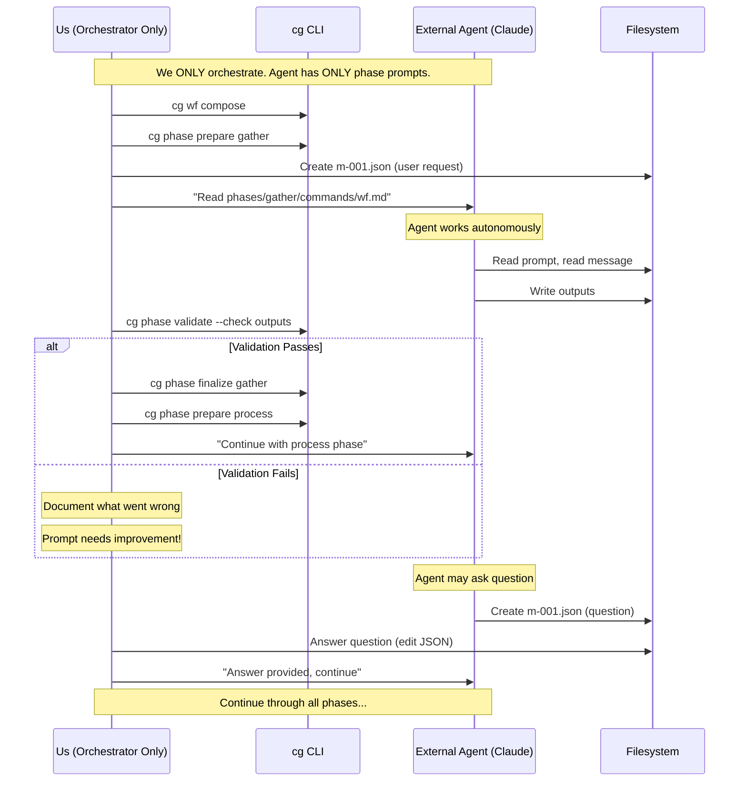

# Subtask 001: Create Manual Test Harness

**Parent Plan:** [View Plan](../../wf-basics-plan.md)
**Parent Phase:** Phase 6: Documentation
**Parent Task(s):** [T007: Finalize manual test guide](../phase-6-documentation/tasks.md#task-t007)
**Plan Task Reference:** [Task 6.7 in Plan](../../wf-basics-plan.md#phase-6-documentation)

**Why This Subtask:**
Create a comprehensive manual test harness that validates the ENTIRE workflow system by role-playing orchestrator and agent, testing all interaction patterns (user input, file passing, parameter extraction, agent questions), and ultimately validating that phase prompts are self-sufficient for real external agents.

**Created:** 2026-01-23
**Requested By:** User

---

## Executive Briefing

### Purpose
This subtask creates a **two-mode manual test** that validates the workflow system works correctly:

**Mode 1: Learning Mode (We are BOTH orchestrator and agent)**
- Walk through each phase playing both roles
- Understand how the handover dance works
- Verify files/parameters flow correctly between phases
- Test the agent-asks-question pattern

**Mode 2: Validation Mode (We are ONLY orchestrator, external agent does the work)**
- We provide inputs and answer questions as orchestrator
- A real external agent (Claude, etc.) uses ONLY the phase prompts
- **Critical test**: Are the prompts self-sufficient? Can an agent succeed with just what's in the phase folders?

### What We're Testing

| Pattern | Phase | How It Works |
|---------|-------|--------------|
| **User input via message** | gather | Orchestrator creates `messages/m-001.json` with user request |
| **Agent reads input** | gather | Agent reads message, produces outputs |
| **Files from prior phase** | process | `from_phase: gather` copies to inputs/files/ (.md) and inputs/data/ (.json) |
| **Parameters from prior phase** | process | `item_count` extracted from gather's output-params.json |
| **Agent asks question** | process | Agent creates `messages/m-001.json` with multi_choice |
| **Orchestrator answers** | process | Orchestrator adds `answer` to the message JSON |
| **Phase prompts are self-sufficient** | all | External agent can succeed using ONLY phase prompts |

### The Two Modes

```
┌─────────────────────────────────────────────────────────────────────────────┐
│ MODE 1: LEARNING MODE (Training Wheels)                                      │
│                                                                              │
│ YOU play BOTH roles - understand the dance before letting real agents in    │
│                                                                              │
│ [YOU as ORCH]  compose → prepare → (create input message)                   │
│                     ↓                                                        │
│ [YOU as AGENT] (read prompt) → (do work) → (write outputs) → validate       │
│                     ↓                                                        │
│ [YOU as AGENT] (ask question via message)                                    │
│                     ↓                                                        │
│ [YOU as ORCH]  (answer question) → finalize → prepare next phase            │
│                                                                              │
└─────────────────────────────────────────────────────────────────────────────┘

┌─────────────────────────────────────────────────────────────────────────────┐
│ MODE 2: VALIDATION MODE (Real Test)                                          │
│                                                                              │
│ YOU are ONLY orchestrator - external agent has ONLY the phase prompts       │
│                                                                              │
│ [YOU as ORCH]  compose → prepare → (create input message)                   │
│                     ↓                                                        │
│ [EXTERNAL AGENT] reads: phases/gather/commands/wf.md + main.md              │
│                  writes: outputs/, messages/ (if questions)                  │
│                     ↓                                                        │
│ [YOU as ORCH]  validate → (answer any questions) → finalize → next phase    │
│                                                                              │
│ CRITICAL: Does the agent succeed with ONLY the prompt files?                │
│ If not, the prompts need improvement!                                        │
└─────────────────────────────────────────────────────────────────────────────┘
```

### What Success Looks Like

1. **Mode 1 completes** - All 3 phases work when we play both roles
2. **Mode 2 completes** - External agent succeeds using only phase prompts
3. **Prompts are validated** - Agent didn't get confused or go off track
4. **All patterns tested** - User input, file passing, parameters, questions all work

---

## Objectives & Scope

### Objective
Create a test harness that proves the workflow system works end-to-end, validates all interaction patterns, and confirms that phase prompts are self-sufficient for external agents.

### Goals

- ✅ Create `manual-test/` directory with comprehensive structure
- ✅ Create `MODE-1-LEARNING.md` - Step-by-step guide playing both roles
- ✅ Create `MODE-2-VALIDATION.md` - Guide for testing with external agent
- ✅ Create `AGENT-STARTER-PROMPT.md` - What to give external agent in Mode 2
- ✅ Test all interaction patterns:
  - Orchestrator provides user input (message)
  - Files copied from prior phases
  - Parameters extracted and passed
  - Agent asks multi-choice question
  - Orchestrator answers question
- ✅ Create sample message files (orchestrator inputs, agent questions)
- ✅ Create simulated outputs for Mode 1
- ✅ Create `check-state.sh` to verify state at checkpoints
- ✅ Run Mode 1 end-to-end and document results
- ✅ Run Mode 2 with external agent and document prompt effectiveness

### Non-Goals

- ❌ Implementing missing CLI commands (handover/accept/preflight/message)
- ❌ Automated test suite integration
- ❌ Multiple workflow templates (hello-workflow only)
- ❌ Performance testing

### Deferred Items (From Other Subtasks)

The following items were deferred to this subtask for inclusion in the manual test harness:

| From | Item | Description |
|------|------|-------------|
| Phase 3 Subtask 001 (ST019) | Message CLI Integration Tests | Test `cg phase message create/answer/list/read` against exemplar run folder |

These should be incorporated into the manual test harness scenarios where appropriate.

---

## Architecture Map

### The Interaction Patterns (All Must Be Tested)



### Test Artifacts Structure

```
manual-test/
├── MODE-1-LEARNING.md              # Full walkthrough, we play both roles
├── MODE-2-VALIDATION.md            # External agent test, we only orchestrate
├── AGENT-STARTER-PROMPT.md         # What to give external agent
├── check-state.sh                  # Verify wf-phase.json state
├── orchestrator-inputs/            # What orchestrator provides
│   ├── gather/
│   │   └── m-001-user-request.json # User's initial request
│   └── process/
│       └── m-001-answer.json       # Answer to agent's question (just the answer part)
├── simulated-agent-work/           # Pre-made outputs for Mode 1
│   ├── gather/
│   │   ├── acknowledgment.md
│   │   ├── gather-data.json
│   │   └── m-001-question.json     # (not needed for gather)
│   ├── process/
│   │   ├── m-001-question.json     # Agent's multi-choice question
│   │   ├── result.md
│   │   └── process-data.json
│   └── report/
│       └── final-report.md
└── results/                        # Capture actual test runs
    ├── mode-1-run-YYYY-MM-DD/
    └── mode-2-run-YYYY-MM-DD/
```

### Task-to-Component Mapping

| Task | Component(s) | Files | Status | Comment |
|------|-------------|-------|--------|---------|
| ST001 | Directory Setup | manual-test/ | ⬜ Pending | Full structure with subdirs |
| ST002 | Mode 1 Guide | MODE-1-LEARNING.md | ⬜ Pending | Both roles, all patterns |
| ST003 | Mode 2 Guide | MODE-2-VALIDATION.md | ⬜ Pending | External agent test |
| ST004 | Agent Prompt | AGENT-STARTER-PROMPT.md | ⬜ Pending | What external agent sees |
| ST005 | State Checker | check-state.sh | ⬜ Pending | Verify phase states |
| ST006 | Orchestrator Inputs | orchestrator-inputs/ | ⬜ Pending | User request, answers |
| ST007 | Simulated Work | simulated-agent-work/ | ⬜ Pending | Pre-made agent outputs |
| ST008 | Execute Mode 1 | – | ⬜ Pending | Run full walkthrough |
| ST009 | Execute Mode 2 | – | ⬜ Pending | Test with real external agent |

---

## Tasks

| Status | ID | Task | CS | Type | Dependencies | Absolute Path(s) | Validation | Subtasks | Notes |
|--------|------|-----------------------------------|-----|------|--------------|-------------------------------|-------------------------------|----------|-------------------|
| [ ] | ST001 | Create manual-test directory structure | 1 | Setup | – | /home/jak/substrate/003-wf-basics/docs/plans/003-wf-basics/manual-test/ | All subdirs exist | – | Foundation |
| [ ] | ST002 | Create MODE-1-LEARNING.md guide | 3 | Doc | ST001 | .../manual-test/MODE-1-LEARNING.md | Covers all 3 phases, all patterns, [ORCH]/[AGENT] markers | – | Core deliverable |
| [ ] | ST003 | Create MODE-2-VALIDATION.md guide | 2 | Doc | ST001 | .../manual-test/MODE-2-VALIDATION.md | External agent instructions, prompt validation checklist | – | Real test |
| [ ] | ST004 | Create AGENT-STARTER-PROMPT.md | 2 | Doc | ST001 | .../manual-test/AGENT-STARTER-PROMPT.md | Self-contained prompt for external agent | – | What Claude sees |
| [ ] | ST005 | Create check-state.sh script | 2 | Core | ST001 | .../manual-test/check-state.sh | Reads all phases, reports state | – | Checkpoint tool |
| [ ] | ST006 | Create orchestrator input files | 2 | Setup | ST001 | .../manual-test/orchestrator-inputs/ | User request JSON, answer JSON | – | What orch provides |
| [ ] | ST007 | Create simulated agent work files | 2 | Setup | ST001 | .../manual-test/simulated-agent-work/ | All outputs match schemas | – | For Mode 1 |
| [ ] | ST008 | Execute Mode 1 and document results | 2 | Test | ST002-ST007 | .../manual-test/results/mode-1-run-*/ | All 3 phases complete | – | Prove it works |
| [ ] | ST009 | Execute Mode 2 with external agent | 3 | Test | ST003, ST004, ST008 | .../manual-test/results/mode-2-run-*/ | External agent succeeds, prompts validated | – | The real validation |

---

## Alignment Brief

### Objective Recap
Validate the workflow system by testing all interaction patterns in two modes: first as both orchestrator and agent (learning), then with an external agent using only phase prompts (validation).

### Key Patterns to Validate

| # | Pattern | Phase | Validation Criteria |
|---|---------|-------|---------------------|
| 1 | Orchestrator provides user input | gather | m-001.json created, agent reads it |
| 2 | Agent produces outputs | gather | Files match schema, params extracted |
| 3 | Files copied from prior phase | process | from_phase files appear in inputs/files/ (.md) and inputs/data/ (.json) |
| 4 | Parameters from prior phase | process | params.json contains item_count |
| 5 | Agent asks multi-choice question | process | m-001.json created with options |
| 6 | Orchestrator answers question | process | answer field added to message |
| 7 | Agent uses answer | process | Output reflects selected option |
| 8 | Terminal phase works | report | Final output produced |
| 9 | **Prompts are self-sufficient** | all | External agent succeeds with ONLY phase prompts |

### Critical Findings Affecting This Subtask

**Implementation Status:**
- ✅ Files and parameters: Fully implemented (prepare/validate/finalize)
- ✅ Message data model: Exists (JSON files in messages/)
- ✅ Message CLI commands: **IMPLEMENTED** (cg phase message create/answer/list/read) — Phase 3 Subtask 001
- ❌ Handover commands: NOT implemented (cg phase handover/accept/preflight)

> **REMAINING PREREQUISITE:**
>
> **Fix wf.md copying** - compose should copy root `wf.md`, not `templates/wf.md`
>    - Root `wf.md` = agent instructions ("Workflow Phase Execution")
>    - `templates/wf.md` = workflow overview (rename to `README.md`)
>    - Fix in: `packages/workflow/src/services/workflow.service.ts:238-241`

### Implementation References (If Commands Don't Work)

If message CLI commands behave unexpectedly, consult these files:

| Component | File | Key Lines | Purpose |
|-----------|------|-----------|---------|
| **IMessageService interface** | `packages/workflow/src/interfaces/message-service.interface.ts` | 1-80 | Contract definition, error codes E060-E064 |
| **MessageService implementation** | `packages/workflow/src/services/message.service.ts` | full | create/answer/list/read logic |
| **CLI command handlers** | `apps/cli/src/commands/message.command.ts` | full | CLI argument parsing, service calls |
| **Output formatters** | `packages/shared/src/adapters/console-output.adapter.ts` | 280-400 | Human-readable output formatting |
| **Unit tests** | `test/unit/workflow/message-service.test.ts` | full | Expected behavior documentation |
| **Contract tests** | `test/contracts/message-service.contract.test.ts` | full | Real/Fake parity verification |
| **FakeMessageService** | `packages/workflow/src/fakes/fake-message-service.ts` | full | Test double with call capture |

**Error Codes:**
- `E060`: Message not found
- `E061`: Message type mismatch (answer doesn't match question type)
- `E062`: Missing required field
- `E063`: Message already answered
- `E064`: Message validation failed (schema or path traversal)

**Security Validations (added 2026-01-23):**
- Phase names must be alphanumeric with hyphen/underscore only (no `../`)
- Message IDs must be 3-digit strings only (e.g., `001`, `002`)
- JSON parse errors are caught gracefully (won't crash on malformed files)

**Message CLI Commands (assumed available):**
```bash
# Orchestrator provides user input
cg phase message create --phase gather --run-dir $RUN_DIR \
  --type free_text --from orchestrator \
  --content '{"subject":"Workflow Request","body":"What would you like?"}'

# Agent asks question
cg phase message create --phase process --run-dir $RUN_DIR \
  --type multi_choice --from agent \
  --content '{"subject":"Format?","body":"How should output be structured?","options":[...]}'

# Orchestrator answers question
cg phase message answer --phase process --run-dir $RUN_DIR \
  --id 001 --select C --note "Include both summary and details"

# List/read messages
cg phase message list --phase process --run-dir $RUN_DIR
cg phase message read --phase process --run-dir $RUN_DIR --id 001
```

### The Mode 2 Critical Test

**The question we're answering:**
> If we give an external agent (Claude, GPT, etc.) ONLY the phase prompt files, can it successfully complete the workflow?

**What the agent sees in Mode 2:**
```
# Gather phase (no prior inputs)
phases/gather/commands/wf.md      # Standard workflow prompt
phases/gather/commands/main.md    # Phase-specific instructions
phases/gather/run/messages/       # m-001.json with user request
phases/gather/schemas/            # Output schemas

# Process phase (has inputs from gather)
phases/process/run/inputs/
├── files/                        # Human-readable (.md) from prior phase
│   └── acknowledgment.md
├── data/                         # Structured (.json) from prior phase
│   └── gather-data.json
└── params.json                   # Extracted parameters from prior phase
```

**Success criteria:**
1. Agent doesn't get confused about what to do
2. Agent produces valid outputs (pass schema validation)
3. Agent knows to check for messages
4. Agent knows output file locations
5. Agent doesn't try to do orchestrator's job

**If Mode 2 fails:**
- Document WHERE the agent got confused
- Note which prompt needs improvement
- This is valuable feedback for improving the prompts!

### Inputs to Read

| File | Purpose |
|------|---------|
| `dev/examples/wf/template/hello-workflow/wf.yaml` | Phase definitions |
| `dev/examples/wf/template/hello-workflow/phases/*/commands/*.md` | Actual prompts agent will use |
| `dev/examples/wf/runs/run-example-001/` | Expected structure |
| `dev/examples/wf/template/hello-workflow/schemas/*.json` | Output schemas |

### Visual Alignment Aids

#### Mode 1 Flow (Learning - We Play Both Roles)


#### Mode 2 Flow (Validation - External Agent)


### Commands to Run

```bash
# Build first
cd /home/jak/substrate/003-wf-basics
just build

# Navigate to manual test
cd docs/plans/003-wf-basics/manual-test

# Mode 1 commands (follow MODE-1-LEARNING.md)
node ../../../../apps/cli/dist/cli.cjs wf compose \
  ../../../../dev/examples/wf/template/hello-workflow \
  --runs-dir ./results/mode-1-run-$(date +%Y-%m-%d)

# Check state at any point
./check-state.sh ./results/mode-1-run-*/

# Validate phase outputs
node ../../../../apps/cli/dist/cli.cjs phase validate gather \
  --run-dir ./results/mode-1-run-*/ --check outputs --json
```

### Risks/Unknowns

| Risk | Severity | Mitigation |
|------|----------|------------|
| ~~Missing message CLI commands~~ | ~~Medium~~ | ✅ **RESOLVED** - Commands implemented (Phase 3 Subtask 001) |
| Missing handover commands | Medium | Document where they'd go |
| External agent may fail Mode 2 | Expected | This is the TEST - document failures |
| Phase prompts may be insufficient | Expected | Improve prompts based on findings |
| wf.md copying is wrong | Medium | Fix before Mode 2 (copies templates/wf.md not root wf.md) |

### Ready Check

- [ ] Project builds successfully (`just build`)
- [ ] hello-workflow template exists and works
- [ ] Understand message JSON format
- [ ] Understand all 3 phase structures
- [ ] Phase prompts reviewed (commands/wf.md, main.md)

---

## Phase Footnote Stubs

_To be populated during implementation by plan-6a-update-progress._

| Footnote | Task | Description |
|----------|------|-------------|
| | | |

---

## Evidence Artifacts

| Artifact | Path |
|----------|------|
| Execution Log | `.../tasks/phase-6-documentation/001-subtask-create-manual-test-harness.execution.log.md` |
| Manual Test Folder | `.../docs/plans/003-wf-basics/manual-test/` |
| Mode 1 Guide | `.../manual-test/MODE-1-LEARNING.md` |
| Mode 2 Guide | `.../manual-test/MODE-2-VALIDATION.md` |
| Agent Starter | `.../manual-test/AGENT-STARTER-PROMPT.md` |
| State Checker | `.../manual-test/check-state.sh` |
| Orchestrator Inputs | `.../manual-test/orchestrator-inputs/` |
| Simulated Work | `.../manual-test/simulated-agent-work/` |
| Test Results | `.../manual-test/results/` |

---

## Discoveries & Learnings

_Populated during implementation by plan-6. Log anything of interest to your future self._

| Date | Task | Type | Discovery | Resolution | References |
|------|------|------|-----------|------------|------------|
| 2026-01-23 | Research | insight | CLI only has prepare/validate/finalize - handover/accept/preflight not implemented | Test simplified flow, document gaps | Plan Technical Context |
| 2026-01-23 | Research | decision | Message CLI commands (create/answer/list/read) are prerequisite for this subtask | Implement before running manual test | 001-subtask-message-communication.md |
| 2026-01-23 | /didyouknow | insight | Message data model + exemplar already complete (subtask ran 2026-01-22) | CLI commands are fully specified, just need implementation | Execution log reviewed |
| 2026-01-23 | /didyouknow | gotcha | Input directory uses split structure: inputs/files/ (.md), inputs/data/ (.json), inputs/params.json | Updated subtask docs to show correct structure | phase.service.ts:162-169 |
| 2026-01-23 | /didyouknow | gotcha | wf.md copying is wrong - code copies templates/wf.md (overview) instead of root wf.md (agent instructions) | Fix code + rename templates/wf.md to README.md | workflow.service.ts:238-241 |
| 2026-01-23 | Pre-impl | insight | **Message CLI commands fully implemented** - 748 tests passing, security hardened (path traversal prevention, JSON error handling) | Ready for manual test harness | Phase 3 Subtask 001, commit d5f8d89 |

**Types**: `gotcha` | `research-needed` | `unexpected-behavior` | `workaround` | `decision` | `debt` | `insight`

---

## After Subtask Completion

**This subtask extends:**
- Parent Task: [T007: Finalize manual test guide](../phase-6-documentation/tasks.md#task-t007)

**When all ST### tasks complete:**

1. **Record completion** in parent execution log
2. **Document Mode 2 findings** - Did prompts work for external agent?
3. **Create follow-up tasks** if prompts need improvement
4. **Consider new phase** if handover/message commands are needed

**Quick Links:**
- [Parent Dossier](../phase-6-documentation/tasks.md)
- [Parent Plan](../../wf-basics-plan.md)
- [Parent Execution Log](../phase-6-documentation/execution.log.md)

---

## Directory Layout

```
docs/plans/003-wf-basics/
├── wf-basics-plan.md
├── wf-basics-spec.md
├── manual-test/                              # Created by this subtask
│   ├── MODE-1-LEARNING.md                    # Full walkthrough, both roles
│   ├── MODE-2-VALIDATION.md                  # External agent test
│   ├── AGENT-STARTER-PROMPT.md               # What to give external agent
│   ├── check-state.sh                        # State verification script
│   ├── orchestrator-inputs/
│   │   ├── gather/
│   │   │   └── m-001-user-request.json       # User's initial request
│   │   └── process/
│   │       └── m-001-answer.json             # Answer to agent question
│   ├── simulated-agent-work/
│   │   ├── gather/
│   │   │   ├── acknowledgment.md
│   │   │   └── gather-data.json
│   │   ├── process/
│   │   │   ├── m-001-question.json           # Agent's question
│   │   │   ├── result.md
│   │   │   └── process-data.json
│   │   └── report/
│   │       └── final-report.md
│   └── results/                              # Actual test run outputs
│       ├── mode-1-run-YYYY-MM-DD/
│       └── mode-2-run-YYYY-MM-DD/
└── tasks/
    └── phase-6-documentation/
        ├── tasks.md
        ├── execution.log.md
        └── 001-subtask-create-manual-test-harness.md  # This file
```
