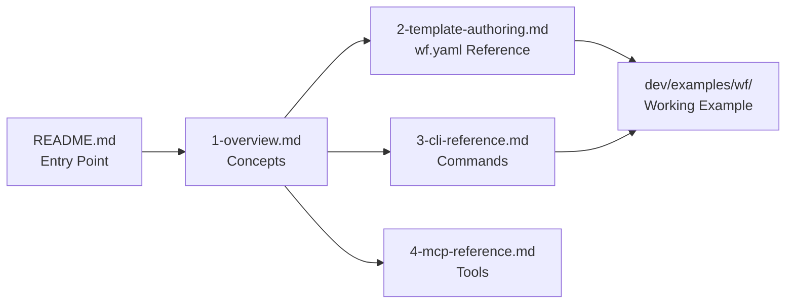
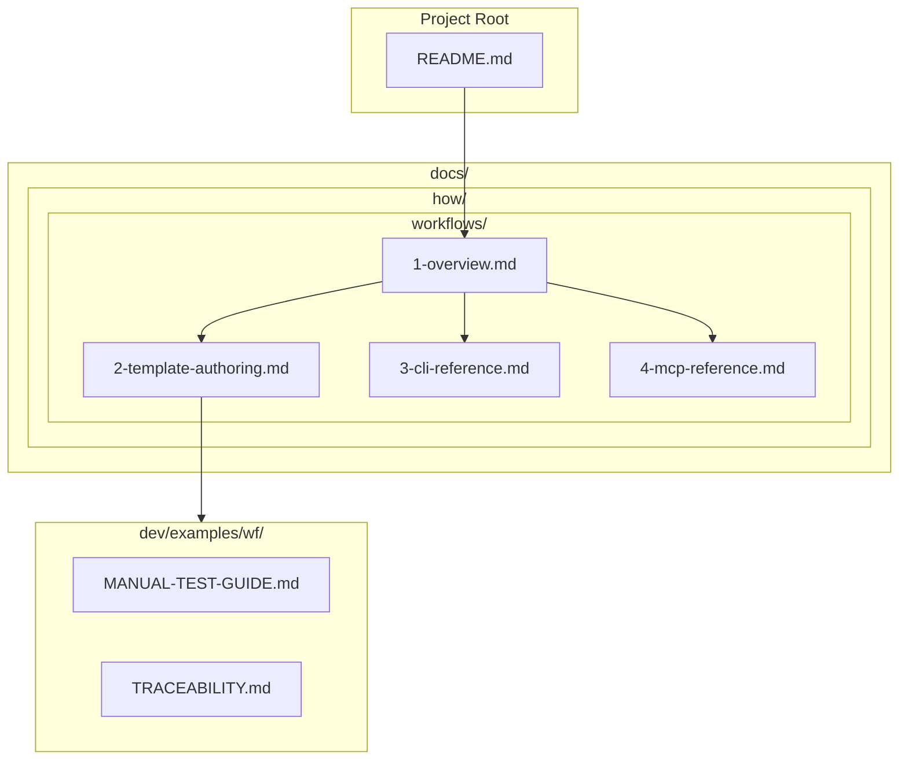

# Phase 6: Documentation – Tasks & Alignment Brief

**Spec**: [wf-basics-spec.md](../../wf-basics-spec.md)
**Plan**: [wf-basics-plan.md](../../wf-basics-plan.md)
**Date**: 2026-01-23

---

## Executive Briefing

### Purpose
This phase documents the workflow system for users and developers, creating comprehensive guides that enable effective use of the `cg wf` and `cg phase` commands, workflow template authoring, and MCP tool integration.

### What We're Building
A complete documentation suite for the workflow system:
- Updated README.md with workflow command overview
- Dedicated `docs/how/workflows/` directory with 4 guide files
- Finalized manual test guide with real CLI examples
- Link verification across all documentation

### User Value
Users (both human developers and AI agents) gain:
- Clear entry point for understanding workflow capabilities
- Step-by-step guides for common workflows
- Template authoring reference for creating custom workflows
- CLI and MCP reference documentation for integration

### Example
**Before**: User asks "How do I create a workflow?" → No documentation exists
**After**: User follows `docs/how/workflows/1-overview.md` → Creates and runs first workflow

---

## Objectives & Scope

### Objective
Complete documentation deliverables specified in the plan:
- Updated README.md with workflow section
- 4 guide files in docs/how/workflows/
- Finalized manual test guide
- All links verified functional

### Goals

- ✅ Update README.md with workflow commands (`cg wf`, `cg phase`)
- ✅ Create docs/how/workflows/ directory with 4 guides
- ✅ Document CLI commands with working examples
- ✅ Document MCP tools with examples
- ✅ Finalize manual test guide with real CLI commands
- ✅ Verify all internal links work
- ✅ Ensure code examples are tested and working

### Non-Goals

- ❌ API documentation generation (automated jsdoc/typedoc)
- ❌ Video tutorials or interactive guides
- ❌ Internationalization of documentation
- ❌ Detailed schema reference (schemas are self-documenting)
- ❌ Contribution guidelines beyond existing project standards
- ❌ Versioned documentation (single current version)

---

## Architecture Map

### Component Diagram

```mermaid
flowchart TD
    classDef pending fill:#9E9E9E,stroke:#757575,color:#fff
    classDef inprogress fill:#FF9800,stroke:#F57C00,color:#fff
    classDef completed fill:#4CAF50,stroke:#388E3C,color:#fff
    classDef blocked fill:#F44336,stroke:#D32F2F,color:#fff

    style Phase fill:#F5F5F5,stroke:#E0E0E0
    style Files fill:#F5F5F5,stroke:#E0E0E0

    subgraph Phase["Phase 6: Documentation"]
        T001["T001: Survey docs structure ✓"]:::completed
        T002["T002: Update README.md ✓"]:::completed
        T003["T003: Create 1-overview.md ✓"]:::completed
        T004["T004: Create 2-template-authoring.md ✓"]:::completed
        T005["T005: Create 3-cli-reference.md ✓"]:::completed
        T006["T006: Create 4-mcp-reference.md ✓"]:::completed
        T007["T007: Finalize manual test guide ✓"]:::completed
        T008["T008: Review all documentation ✓"]:::completed

        T001 --> T002
        T001 --> T003
        T003 --> T004
        T003 --> T005
        T003 --> T006
        T002 --> T008
        T004 --> T008
        T005 --> T008
        T006 --> T008
        T007 --> T008
    end

    subgraph Files["Files"]
        F1["/README.md ✓"]:::completed
        F2["/docs/how/workflows/1-overview.md ✓"]:::completed
        F3["/docs/how/workflows/2-template-authoring.md ✓"]:::completed
        F4["/docs/how/workflows/3-cli-reference.md ✓"]:::completed
        F5["/docs/how/workflows/4-mcp-reference.md ✓"]:::completed
        F6["/dev/examples/wf/MANUAL-TEST-GUIDE.md ✓"]:::completed
    end

    T002 -.-> F1
    T003 -.-> F2
    T004 -.-> F3
    T005 -.-> F4
    T006 -.-> F5
    T007 -.-> F6
```

<!-- Status: grey=pending, orange=in-progress, green=completed, red=blocked -->
<!-- Updated by plan-6 during implementation -->



### Task-to-Component Mapping

<!-- Status: ⬜ Pending | 🟧 In Progress | ✅ Complete | 🔴 Blocked -->

| Task | Component(s) | Files | Status | Comment |
|------|-------------|-------|--------|---------|
| T001 | Discovery | docs/how/* | ✅ Complete | Survey existing structure for pattern consistency |
| T002 | README | /README.md | ✅ Complete | Add workflow section with command overview |
| T003 | Overview Guide | docs/how/workflows/ | ✅ Complete | Introduction, concepts, quick start |
| T004 | Authoring Guide | docs/how/workflows/ | ✅ Complete | wf.yaml schema, phase structure |
| T005 | CLI Reference | docs/how/workflows/ | ✅ Complete | All commands with examples |
| T006 | MCP Reference | docs/how/workflows/ | ✅ Complete | All MCP tools with examples |
| T007 | Manual Test Guide | dev/examples/wf/ | ✅ Complete | Update with real CLI commands |
| T008 | Review | All doc files | ✅ Complete | Link verification, quality check |

---

## Tasks

| Status | ID | Task | CS | Type | Dependencies | Absolute Path(s) | Validation | Subtasks | Notes |
|--------|------|-----------------------------------|-----|------|--------------|-------------------------------|-------------------------------|----------|-------------------|
| [x] | T001 | Survey existing docs/how/ structure and document patterns | 1 | Setup | – | /home/jak/substrate/003-wf-basics/docs/how/ | Patterns documented in execution log | – | Follow existing structure |
| [x] | T002 | Update README.md with workflow commands section | 2 | Doc | T001 | /home/jak/substrate/003-wf-basics/README.md | README contains cg wf and cg phase examples | – | Add to CLI Commands table |
| [x] | T003 | Create docs/how/workflows/1-overview.md | 2 | Doc | T001 | /home/jak/substrate/003-wf-basics/docs/how/workflows/1-overview.md | File exists with intro, concepts, quick start | – | Include Mermaid lifecycle |
| [x] | T004 | Create docs/how/workflows/2-template-authoring.md | 3 | Doc | T003 | /home/jak/substrate/003-wf-basics/docs/how/workflows/2-template-authoring.md | Complete wf.yaml reference with examples | – | Cover phases, inputs, outputs, parameters |
| [x] | T005 | Create docs/how/workflows/3-cli-reference.md | 2 | Doc | T003 | /home/jak/substrate/003-wf-basics/docs/how/workflows/3-cli-reference.md | All 5 commands documented with examples | – | cg wf compose + 4 cg phase commands |
| [x] | T006 | Create docs/how/workflows/4-mcp-reference.md | 2 | Doc | T003 | /home/jak/substrate/003-wf-basics/docs/how/workflows/4-mcp-reference.md | All 4 MCP tools documented with examples | – | wf_compose + 3 phase tools |
| [x] | T007 | Finalize manual test guide with real CLI commands | 2 | Doc | – | /home/jak/substrate/003-wf-basics/dev/examples/wf/MANUAL-TEST-GUIDE.md | Guide uses actual cg wf/phase commands | 001-subtask-create-manual-test-harness | Replace ajv examples with CLI |
| [x] | T008 | Review all documentation for quality and links | 1 | Review | T002, T003, T004, T005, T006, T007 | /home/jak/substrate/003-wf-basics/docs/, /home/jak/substrate/003-wf-basics/README.md | All links functional, no broken refs | – | Verify internal links |

---

## Alignment Brief

### Prior Phases Review

#### Phase 0: Development Exemplar (COMPLETE 2026-01-21)

**Deliverables Created**:
- Template at `/home/jak/substrate/003-wf-basics/dev/examples/wf/template/hello-workflow/`
- Run example at `/home/jak/substrate/003-wf-basics/dev/examples/wf/runs/run-example-001/`
- 5 JSON schemas: wf.schema.json, wf-phase.schema.json, gather-data.schema.json, process-data.schema.json, message.schema.json
- MANUAL-TEST-GUIDE.md with 9 test cases
- TRACEABILITY.md mapping AC-01 through AC-05

**Key Patterns for Documentation**:
- Directory structure: `template/` + `runs/run-{date}-{ordinal}/`
- Phase structure: `phases/{name}/wf-phase.yaml`, `commands/`, `schemas/`, `run/{inputs/,outputs/,messages/,wf-data/}`
- wf.yaml with 3 phases: gather, process, report
- Message communication: `messages/m-{id}.json`

**Technical Debt Impacting Docs**:
- TD-ST001-01: Agent instructions don't mention messages (document in authoring guide)
- TD-ST002-01: 28 files manual sync (not relevant now that CLI generates structures)

---

#### Phase 1: Core Infrastructure (COMPLETE 2026-01-21)

**Deliverables Created**:
- `packages/workflow/` package with 4 core interfaces
- Interfaces: IFileSystem, IPathResolver, IYamlParser, ISchemaValidator
- Adapters: NodeFileSystemAdapter, PathResolverAdapter, YamlParserAdapter, SchemaValidatorAdapter
- Fakes: FakeFileSystem, FakePathResolver, FakeYamlParser, FakeSchemaValidator
- DI tokens: SHARED_DI_TOKENS, WORKFLOW_DI_TOKENS
- 193 tests

**Key Patterns for Documentation**:
- Interface + Adapter + Fake trio pattern
- Contract tests for fake/real parity
- DI container with useFactory pattern

---

#### Phase 1a: Output Adapter Architecture (COMPLETE 2026-01-21)

**Deliverables Created**:
- Result types: BaseResult, ResultError, ComposeResult, PrepareResult, ValidateResult, FinalizeResult
- IOutputAdapter interface
- JsonOutputAdapter, ConsoleOutputAdapter, FakeOutputAdapter
- CommandResponse envelope types
- 43 new tests

**Key Patterns for Documentation**:
- JSON output structure: `{ success, command, timestamp, data/error }`
- Error structure: `{ code, message, path?, expected?, actual?, action? }`
- --json flag semantics

---

#### Phase 2: Compose Command (COMPLETE 2026-01-22)

**Deliverables Created**:
- IWorkflowService interface with compose() method
- WorkflowService implementation
- FakeWorkflowService with call capture pattern
- `cg wf compose <slug>` CLI command
- Embedded schemas in packages/workflow/src/schemas/
- 52 new tests

**Key Patterns for Documentation**:
- Template resolution: slug, relative path, absolute path, tilde expansion
- Run folder naming: `run-{YYYY-MM-DD}-{NNN}`
- Options: --runs-dir, --json

**Error Codes**:
- E020: Template not found or invalid

---

#### Phase 3: Phase Operations (COMPLETE 2026-01-22)

**Deliverables Created**:
- IPhaseService interface with prepare(), validate() methods
- PhaseService implementation (677 lines)
- FakePhaseService with call capture pattern
- `cg phase prepare <phase>` CLI command
- `cg phase validate <phase>` CLI command
- 56 new tests

**Key Patterns for Documentation**:
- prepare: Resolves inputs, copies from prior phases, creates params.json
- validate: Checks outputs against schema, --check required (inputs|outputs)
- Options: --run-dir, --json, --check

**Error Codes**:
- E001: Missing required input
- E010: Missing required output
- E011: Empty output file
- E012: Schema validation failure
- E020: Phase not found
- E031: Prior phase not finalized

---

#### Phase 4: Phase Lifecycle (COMPLETE 2026-01-22)

**Deliverables Created**:
- PhaseService.finalize() method
- extractValue() utility for dot-notation parameter extraction
- `cg phase finalize <phase>` CLI command
- output-params.json generation
- 43 new tests

**Key Patterns for Documentation**:
- finalize: Extracts parameters from outputs, writes output-params.json, updates status
- Parameter extraction: Simple dot-notation paths (e.g., "items.length", "classification.type")
- Idempotency: All commands safe to retry

**Error Codes**:
- E010: Missing source file for parameter extraction
- E012: Invalid JSON in source file

---

#### Phase 5: MCP Integration (COMPLETE 2026-01-23)

**Deliverables Created**:
- wf_compose MCP tool
- phase_prepare MCP tool
- phase_validate MCP tool
- phase_finalize MCP tool
- 26 new tests (657 total)

**Key Patterns for Documentation**:
- Tool naming: verb_object snake_case (wf_compose, phase_prepare, etc.)
- Zod schemas for input validation
- CommandResponse envelope for all responses
- Annotations: readOnlyHint, destructiveHint, idempotentHint, openWorldHint

**MCP Tool Annotations**:
| Tool | readOnlyHint | destructiveHint | idempotentHint | openWorldHint |
|------|--------------|-----------------|----------------|---------------|
| wf_compose | false | false | false | false |
| phase_prepare | false | false | true | false |
| phase_validate | true | false | true | false |
| phase_finalize | false | false | true | false |

---

### Critical Findings Affecting This Phase

**None directly** - Phase 6 is documentation-only. However, the following patterns from prior phases must be accurately documented:

1. **CD-01: Output Adapter Architecture** - Document JSON output format
2. **CD-02: CLI Command Registration Pattern** - Document all commands correctly
3. **CD-03: MCP Tool Registration Pattern** - Document tool schemas and annotations

---

### ADR Decision Constraints

**ADR-0001: MCP Tool Design Patterns** (Accepted)
- Affects: T006 (MCP Reference)
- Constrains: Tool documentation must show correct Zod schemas and 4 annotation hints
- Addressed by: T006

**ADR-0002: Exemplar-Driven Development** (Accepted)
- Affects: T007 (Manual Test Guide)
- Constrains: Examples should reference dev/examples/wf/ exemplar
- Addressed by: T003, T007

---

### Invariants & Guardrails

- No code changes in Phase 6 - documentation only
- All CLI examples must be tested and working
- All MCP tool examples must match actual schemas
- Links must use relative paths for portability

---

### Inputs to Read

| File | Purpose |
|------|---------|
| `/home/jak/substrate/003-wf-basics/README.md` | Current README to update |
| `/home/jak/substrate/003-wf-basics/docs/how/configuration/*.md` | Pattern for docs/how structure |
| `/home/jak/substrate/003-wf-basics/dev/examples/wf/MANUAL-TEST-GUIDE.md` | Current manual test guide |
| `/home/jak/substrate/003-wf-basics/docs/plans/003-wf-basics/wf-basics-spec.md` | Lifecycle diagrams, error codes |
| `/home/jak/substrate/003-wf-basics/apps/cli/src/commands/wf.command.ts` | CLI command signatures |
| `/home/jak/substrate/003-wf-basics/apps/cli/src/commands/phase.command.ts` | CLI command signatures |
| `/home/jak/substrate/003-wf-basics/packages/mcp-server/src/tools/workflow.tools.ts` | MCP tool schemas |
| `/home/jak/substrate/003-wf-basics/packages/mcp-server/src/tools/phase.tools.ts` | MCP tool schemas |

---

### Visual Alignment Aids

#### Documentation Flow


#### Documentation Structure


---

### Test Plan (Lightweight - Documentation Phase)

No automated tests for documentation. Validation is manual:

1. **Link Verification**: Click all internal links to verify targets exist
2. **Code Example Testing**: Run each CLI example and verify output matches documentation
3. **MCP Schema Verification**: Compare documented schemas with actual tool registrations
4. **Peer Review**: Review for clarity, accuracy, and completeness

---

### Step-by-Step Implementation Outline

1. **T001: Survey docs structure**
   - Read existing docs/how/configuration/*.md files
   - Note heading styles, code block formatting, link patterns
   - Document findings in execution log

2. **T002: Update README.md**
   - Add workflow section after existing CLI Commands table
   - Include: `cg wf compose`, `cg phase prepare/validate/finalize`
   - Add link to docs/how/workflows/

3. **T003: Create 1-overview.md**
   - Introduction to workflow system
   - Core concepts (template, run, phase, inputs/outputs)
   - Quick start example using hello-workflow template
   - Link to other guides

4. **T004: Create 2-template-authoring.md**
   - wf.yaml structure and schema
   - Phase definition fields
   - Input declarations (files, parameters, messages)
   - Output declarations with schemas
   - output_parameters for parameter extraction
   - Complete example from exemplar

5. **T005: Create 3-cli-reference.md**
   - cg wf compose with all options
   - cg phase prepare with all options
   - cg phase validate with all options
   - cg phase finalize with all options
   - Error codes and troubleshooting
   - JSON output examples

6. **T006: Create 4-mcp-reference.md**
   - wf_compose tool with schema
   - phase_prepare tool with schema
   - phase_validate tool with schema
   - phase_finalize tool with schema
   - Annotations explanation
   - Response envelope format

7. **T007: Finalize manual test guide**
   - Add CLI-based tests (cg wf compose, cg phase commands)
   - Update existing ajv tests to use built commands where applicable
   - Ensure commands match current implementation

8. **T008: Review all documentation**
   - Verify all internal links work
   - Run CLI examples to verify output
   - Check for consistency across guides
   - Spell check and grammar review

---

### Commands to Run

```bash
# Build before testing CLI commands
just build

# Test cg wf compose
pnpm -F @chainglass/cli exec cg wf compose hello-workflow --json

# Test cg phase commands (requires run folder)
pnpm -F @chainglass/cli exec cg phase prepare gather --run-dir .chainglass/runs/run-2026-01-23-001 --json
pnpm -F @chainglass/cli exec cg phase validate gather --run-dir .chainglass/runs/run-2026-01-23-001 --check outputs --json
pnpm -F @chainglass/cli exec cg phase finalize gather --run-dir .chainglass/runs/run-2026-01-23-001 --json

# Verify links work (manual inspection)
# Open docs in browser/editor and click links

# Full quality check after documentation complete
just check
```

---

### Risks/Unknowns

| Risk | Severity | Mitigation |
|------|----------|------------|
| CLI examples may not match current implementation | Medium | Test each example before documenting |
| MCP tool schemas may have changed | Low | Cross-reference with actual tool files |
| Links may break if files move | Low | Use relative paths, verify in review |

---

### Ready Check

- [ ] Prior phase reviews synthesized (Phases 0-5 complete)
- [ ] docs/how/ pattern understood from existing configuration/ docs
- [ ] CLI command signatures verified in source files
- [ ] MCP tool schemas verified in source files
- [ ] ADR constraints noted (ADR-0001, ADR-0002)

---

## Phase Footnote Stubs

_To be populated during implementation by plan-6a-update-progress._

| Footnote | Task | Description |
|----------|------|-------------|
| | | |

---

## Evidence Artifacts

Implementation artifacts will be written to:

| Artifact | Path |
|----------|------|
| Execution Log | `/home/jak/substrate/003-wf-basics/docs/plans/003-wf-basics/tasks/phase-6-documentation/execution.log.md` |
| Documentation Files | `/home/jak/substrate/003-wf-basics/docs/how/workflows/*.md` |
| Updated README | `/home/jak/substrate/003-wf-basics/README.md` |
| Updated Manual Test Guide | `/home/jak/substrate/003-wf-basics/dev/examples/wf/MANUAL-TEST-GUIDE.md` |

---

## Discoveries & Learnings

_Populated during implementation by plan-6. Log anything of interest to your future self._

| Date | Task | Type | Discovery | Resolution | References |
|------|------|------|-----------|------------|------------|
| | | | | | |

**Types**: `gotcha` | `research-needed` | `unexpected-behavior` | `workaround` | `decision` | `debt` | `insight`

**What to log**:
- Things that didn't work as expected
- External research that was required
- Implementation troubles and how they were resolved
- Gotchas and edge cases discovered
- Decisions made during implementation
- Technical debt introduced (and why)
- Insights that future phases should know about

_See also: `execution.log.md` for detailed narrative._

---

## Directory Layout

```
docs/plans/003-wf-basics/
├── wf-basics-plan.md
├── wf-basics-spec.md
└── tasks/
    └── phase-6-documentation/
        ├── tasks.md              # This file
        └── execution.log.md      # Created by plan-6

docs/how/workflows/               # Created by this phase
├── 1-overview.md
├── 2-template-authoring.md
├── 3-cli-reference.md
└── 4-mcp-reference.md
```
