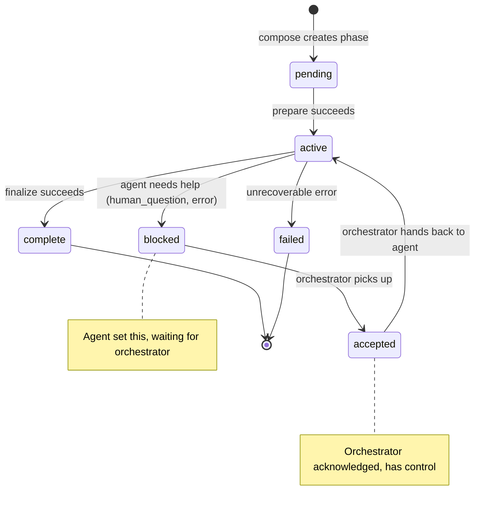
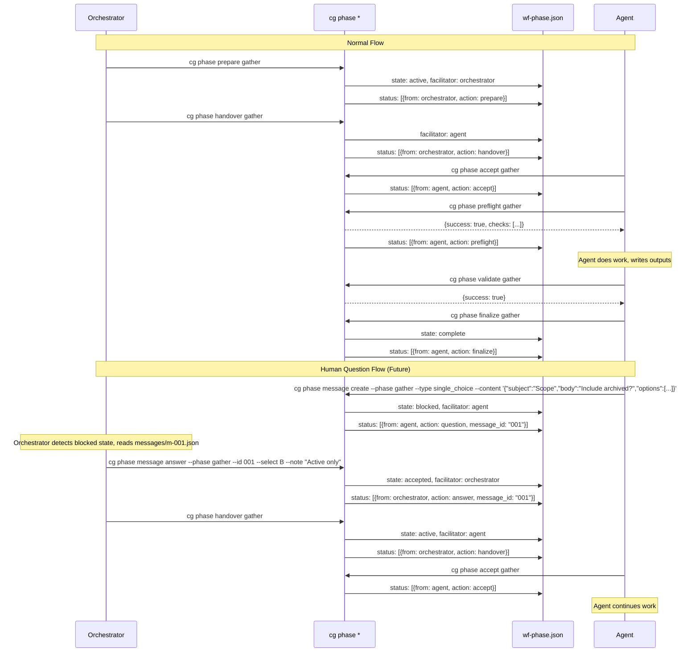

# WF Basics Implementation Plan

**Plan Version**: 1.0.0
**Created**: 2026-01-21
**Spec**: [./wf-basics-spec.md](./wf-basics-spec.md)
**Status**: DRAFT

---

## Table of Contents

1. [Executive Summary](#executive-summary)
2. [Technical Context](#technical-context)
3. [Critical Research Findings](#critical-research-findings)
4. [Testing Philosophy](#testing-philosophy)
5. [Implementation Phases](#implementation-phases)
   - [Phase 0: Development Exemplar](#phase-0-development-exemplar)
   - [Phase 1: Core Infrastructure](#phase-1-core-infrastructure)
   - [Phase 1a: Output Adapter Architecture](#phase-1a-output-adapter-architecture)
   - [Phase 2: Compose Command](#phase-2-compose-command)
   - [Phase 3: Phase Operations](#phase-3-phase-operations)
   - [Phase 4: Phase Lifecycle](#phase-4-phase-lifecycle)
   - [Phase 5: MCP Integration](#phase-5-mcp-integration)
   - [Phase 6: Documentation](#phase-6-documentation)
6. [Cross-Cutting Concerns](#cross-cutting-concerns)
7. [Complexity Tracking](#complexity-tracking)
8. [Progress Tracking](#progress-tracking)
9. [Change Footnotes Ledger](#change-footnotes-ledger)

---

## Executive Summary

**Problem Statement**: Chainglass needs a filesystem-based workflow system that enables multi-phase task execution with explicit input/output contracts, schema validation, and parameter passing between phases. This system will be the foundation for AI agent orchestration.

**Solution Approach**:
- Create `packages/workflow/` package with core workflow services (`IWorkflowService`, `IPhaseService`, `IValidationService`)
- Implement Output Adapter Architecture: Services return domain result objects, adapters format for JSON or Console output
- Add CLI commands: `cg wf compose`, `cg phase prepare|validate|finalize`
- Add MCP tools: `wf_compose`, `phase_prepare`, `phase_validate`, `phase_finalize`
- Use filesystem as database: all workflow state in files, git provides versioning
- JSON-first output: `--json` flag is PRIMARY interface for agent integration

**Expected Outcomes**:
- Deterministic, auditable workflow execution by coding agents
- Clear phase contracts with typed inputs/outputs
- Consistent CLI and MCP interfaces
- Comprehensive test coverage with exemplar-based fixtures

**Success Metrics**:
- All acceptance criteria from spec pass (AC-01 through AC-40, including idempotency ACs)
- Manual test flow works: compose → gather → process → report
- JSON output parses correctly and provides actionable errors
- MCP tools follow ADR-0001 patterns

---

## Technical Context

### Current System State

```
chainglass/
├── apps/
│   ├── web/              # Next.js app (SampleService exemplar)
│   └── cli/              # Commander.js CLI (web, mcp commands)
├── packages/
│   ├── shared/           # ILogger, FakeLogger, PinoLoggerAdapter
│   └── mcp-server/       # MCP server (check_health tool exemplar)
└── test/                 # Centralized test suite (contracts/, unit/, integration/)
```

### Integration Requirements

1. **New Package**: `packages/workflow/` with workflow services
2. **Shared Extensions**: New interfaces in `@chainglass/shared` (IOutputAdapter, IFileSystem, IPathResolver, result types)
3. **CLI Extension**: Add `cg wf` and `cg phase` command groups
4. **MCP Extension**: Add workflow and phase tools
5. **Test Fixtures**: `dev/examples/wf/` exemplar for testing

### Constraints and Limitations

- No database - filesystem is the storage layer
- No automated orchestration - manual phase transitions only
- No multi-user concurrency - single writer per workflow run
- Libraries locked: AJV (JSON Schema), yaml package (YAML parsing)

### Assumptions

1. 001-project-setup patterns are established and working
2. Commander.js supports nested subcommand groups
3. MCP server can register additional tools without breaking existing tools
4. Node.js `fs/promises` is sufficient for file operations
5. YAML 1.2 compliance via `yaml` package prevents parsing issues

### Design Principles: Idempotency and Re-Entrancy

**CRITICAL**: All phase commands MUST be idempotent and re-entrant. Agents may retry commands due to network issues, timeouts, or error recovery. The system must handle repeated invocations gracefully.

| Command | Idempotent | Re-Entrant | Behavior on Repeat |
|---------|------------|------------|-------------------|
| `cg wf compose` | No | N/A | Creates NEW run folder each time (by design - outputs to unique `run-{date}-{ordinal}/`) |
| `cg phase prepare` | **Yes** | **Yes** | If already prepared, returns success with same result. Re-copies from_phase files if source changed. |
| `cg phase validate` | **Yes** | **Yes** | Pure read operation - always returns current validation state. Safe to run unlimited times. |
| `cg phase finalize` | **Yes** | **Yes** | If already finalized, returns success with existing extracted params. Does not re-extract or corrupt state. |

**Implementation Requirements**:

1. **prepare**: Check if phase is already in `active` state. If so, verify inputs are still valid and return success. Only transition from `pending` → `active` if not already active.

2. **validate**: Read-only operation. Never modifies state. Returns current validation status every time.

3. **finalize**: Check if phase is already `complete`. If so, read existing `output-params.json` and return success. Only transition from `active` → `complete` if not already complete.

**Why This Matters**:
- Agents running `validate` in a loop must not corrupt state
- Network retries on `prepare` or `finalize` must not cause errors
- Recovery from partial failures requires safe re-execution
- MCP tool `idempotentHint: true` annotation requires this behavior

**Test Requirements**:
- Every command must have a "call twice, same result" test
- State must be unchanged after second invocation
- No "already prepared" or "already finalized" errors on re-run

### Design Principles: Phase State & Facilitator Model

The `wf-data/` directory contains workflow system state. The primary file is `wf-phase.json` which tracks phase state and interaction history between agent and orchestrator.

#### Core Concepts

1. **Facilitator Model**: Control passes between `agent` ↔ `orchestrator`. Only one has control at a time.
2. **Status Log**: Append-only history of all interactions - provides audit trail and enables multi-turn conversations.
3. **CLI-Only Mutations**: Agents and orchestrators NEVER write to wf files directly. All mutations go through `cg phase *` commands or MCP tools.

#### wf-data/ Directory Contents

```
run/wf-data/
├── wf-phase.json      # Phase state + interaction history
└── output-params.json # Extracted parameters (on finalize) - separate for jq simplicity
```

#### State Machine



#### Facilitator Flow Sequence



#### wf-phase.json Schema

```json
{
  "phase": "gather",
  "facilitator": "agent | orchestrator",
  "state": "pending | active | blocked | accepted | complete | failed",
  "status": [
    {
      "timestamp": "ISO-8601",
      "from": "agent | orchestrator",
      "action": "action_type",
      "message_id": "001",
      "comment": "Human-readable description",
      "data": { "arbitrary": "payload" }
    }
  ]
}
```

**Note**: `message_id` is optional and present only for message-related actions (`input`, `question`, `answer`). References files in `run/messages/m-{id}.json`.

#### Action Types

| Action | From | Description | State After | Has message_id |
|--------|------|-------------|-------------|----------------|
| `prepare` | orchestrator | Phase prepared, inputs resolved | active | No |
| `input` | orchestrator | Provides initial user input message | active | **Yes** |
| `handover` | orchestrator | Control given to agent | active | No |
| `accept` | agent | Agent acknowledges control | (unchanged) | No |
| `preflight` | agent | Agent verified ready to work | (unchanged) | No |
| `question` | agent | Agent asks question (creates message) | blocked | **Yes** |
| `error` | agent | Error occurred (code in data) | blocked | No |
| `answer` | orchestrator | Orchestrator provides answer to question | accepted | **Yes** |
| `finalize` | agent | Phase finalized | complete | No |

#### CLI Commands

**Current Scope (Phase 1-4):**
```bash
cg phase prepare <phase> --run-dir <run>   # Sets state: active, facilitator: orchestrator
cg phase handover <phase> --run-dir <run>  # Sets facilitator: agent (orchestrator hands over)
cg phase accept <phase> --run-dir <run>    # Agent acknowledges control, logged
cg phase preflight <phase> --run-dir <run> # Agent verifies ready (requires accept first!)
cg phase validate <phase> --run-dir <run>  # Read-only, checks outputs against schemas
cg phase finalize <phase> --run-dir <run>  # Sets state: complete
```

**Preflight Checks (Two-Phase Pattern from enhance project):**
- **Phase 1 (Fast)**: Config exists, commands/ files (wf.md + main.md) exist, user-provided inputs exist
- **Phase 2 (Upstream)**: Prior phases finalized, from_phase files exist, parameters can resolve
- **Prerequisite**: If accept not called, returns error: "Run `cg phase accept` first"
- **Returns**: Structured JSON with actionable errors if preflight fails

**Future Scope (Phase 3+ Message Commands):**
```bash
# Message subcommand group
cg phase message create --phase <phase> --run-dir <run> --type <type> --content '<json>'
cg phase message answer --phase <phase> --run-dir <run> --id <id> --select <key> [--note "..."]
cg phase message list --phase <phase> --run-dir <run>
cg phase message read --phase <phase> --run-dir <run> --id <id>

# Error reporting (OOS)
cg phase error <phase> --run-dir <run> --code E001 --message "..."
```

**Message Types**: `single_choice`, `multi_choice`, `free_text`, `confirm`

**Message Error Codes**:
| Code | Name | When |
|------|------|------|
| E060 | MESSAGE_NOT_FOUND | Message ID doesn't exist |
| E061 | MESSAGE_TYPE_MISMATCH | Answer doesn't match message type |
| E062 | MESSAGE_AWAITING_ANSWER | Message exists but has no answer yet |
| E063 | MESSAGE_ALREADY_ANSWERED | Attempting to answer already-answered message |
| E064 | MESSAGE_VALIDATION_FAILED | Content JSON doesn't match schema for type |

#### Key Design Decisions

1. **No "system" actor**: Only `agent` and `orchestrator` in the `from` field
2. **Blocked → Accepted flow**: When agent sets `blocked`, orchestrator picks it up and sets `accepted` to acknowledge
3. **output-params.json separate**: Kept separate from wf-phase.json for `jq` simplicity and single-purpose files
4. **Validation not logged**: `cg phase validate` is a read-only operation, no status entry created
5. **Simple parameter resolution**: Dot-notation lookups only (e.g., `items.length`) - no expressions or computed values. See spec § Parameter Resolution.

#### Phase Message Input Declarations

Phases declare required messages in `wf.yaml` alongside files and parameters in the `inputs` section:

```yaml
# In wf.yaml phase definition
gather:
  description: "Collect and acknowledge input data"
  order: 1
  inputs:
    files:
      - name: request.md
        required: true
    parameters: []
    messages:                              # Message input declarations
      - id: "001"                          # Expected message ID (becomes m-001.json)
        type: "free_text"                  # single_choice | multi_choice | free_text | confirm
        from: "orchestrator"               # Who creates it
        required: true                     # Must exist before prepare passes
        subject: "Workflow Request"
        prompt: "What would you like to accomplish?"
        description: "The user's initial request"

process:
  inputs:
    messages:
      - id: "001"
        type: "multi_choice"
        from: "agent"                      # Agent will CREATE this message
        required: false                    # Optional - agent may or may not ask
        subject: "Output Format"
        options:
          - key: "A"
            label: "Summary only"
          - key: "B"
            label: "Detailed"
          - key: "C"
            label: "Both"
```

**Message Declaration Fields**:
| Field | Required | Description |
|-------|----------|-------------|
| `id` | ✅ | Message ID without prefix (becomes m-{id}.json) |
| `type` | ✅ | `single_choice`, `multi_choice`, `free_text`, `confirm` |
| `from` | ✅ | Who creates it: `orchestrator` or `agent` |
| `required` | ✅ | Whether message must exist for prepare to pass |
| `subject` | ✅ | Subject line for the message |
| `prompt` | Optional | Guidance for orchestrator UI or agent |
| `options` | For choice types | Pre-defined options |
| `description` | Optional | Documentation |

**Validation during `cg phase prepare`**:
- If `required: true` and `from: "orchestrator"`: Message m-{id}.json must exist
- If `required: true` and `from: "agent"`: No check (agent creates during execution)

---

## Critical Research Findings

### ADR Ledger

| ADR | Status | Affects Phases | Notes |
|-----|--------|----------------|-------|
| ADR-0001 | Accepted | Phase 5 (MCP) | MCP tools must follow check_health exemplar |
| ADR-0002 | Accepted | Phase 0, All | Exemplar-driven development pattern |

### Deviation Ledger

| Principle | Why Needed | Simpler Alternative Rejected | Risk Mitigation |
|-----------|------------|------------------------------|-----------------|
| None | N/A | N/A | N/A |

### Synthesized Discoveries (Numbered Sequentially)

---

### 🚨 Critical Discovery 01: Output Adapter Architecture Pattern
**Impact**: Critical
**Sources**: [I1-04, R1-06]

**Problem**: Services must return domain result objects, not formatted strings. Multiple output formats (JSON, Console) require clean separation.

**Root Cause**: JSON is PRIMARY interface for agents; human output is secondary. Mixing formatting into services creates tight coupling.

**Solution**:
```typescript
// ✅ CORRECT - Service returns domain object
interface IPhaseService {
  prepare(phase: string, runDir: string): Promise<PrepareResult>;
}

// ✅ CORRECT - Adapter formats for output
interface IOutputAdapter {
  format<T extends BaseResult>(command: string, result: T): string;
}

// ✅ CORRECT - DI selects adapter based on --json flag
container.register(DI_TOKENS.OUTPUT_ADAPTER, {
  useFactory: () => options.json ? new JsonOutputAdapter() : new ConsoleOutputAdapter()
});
```

**Action Required**: Implement `IOutputAdapter` interface with `JsonOutputAdapter`, `ConsoleOutputAdapter`, and `FakeOutputAdapter` in Phase 1a before any CLI commands.

**Affects Phases**: 1a, 2, 3, 4

---

### 🚨 Critical Discovery 02: CLI Command Registration Pattern
**Impact**: Critical
**Sources**: [I1-01, R1-04]

**Problem**: Adding `cg wf` and `cg phase` command groups must follow existing `registerWebCommand()` pattern.

**Root Cause**: Inconsistent CLI patterns break help text, argument parsing, and testing.

**Solution**:
```typescript
// apps/cli/src/commands/wf.command.ts
export function registerWfCommands(program: Command): void {
  const wf = program
    .command('wf')
    .description('Workflow management commands');

  wf.command('compose <slug>')
    .description('Create a new workflow run from template')
    .option('--json', 'Output JSON format')
    .option('-o, --output <path>', 'Output directory', '.chainglass/runs')
    .action(runWfComposeCommand);
}

// apps/cli/src/commands/phase.command.ts
export function registerPhaseCommands(program: Command): void {
  const phase = program
    .command('phase')
    .description('Phase lifecycle commands');

  phase.command('prepare <phase>')
    .description('Prepare a phase for execution')
    .option('--json', 'Output JSON format')
    .requiredOption('-r, --run-dir <path>', 'Run directory')
    .action(runPhasePrepareCommand);
}
```

**Action Required**: Create `wf.command.ts` and `phase.command.ts` following exact pattern of existing commands. Export from `commands/index.ts`. Register in `cg.ts`.

**Affects Phases**: 2, 3, 4

---

### 🚨 Critical Discovery 03: MCP Tool Registration Pattern
**Impact**: Critical
**Sources**: [I1-06]

**Problem**: MCP tools must follow `check_health` exemplar with Zod schema, annotations, and async handler.

**Root Cause**: ADR-0001 mandates pattern for agent accuracy. Deviation breaks agent interaction.

**Solution**:
```typescript
// packages/mcp-server/src/tools/workflow.tools.ts
export function registerWorkflowTools(
  server: Server,
  toolRegistry: Map<string, ToolHandler>,
  logger: ILogger
): void {
  const wfComposeSchema = z.object({
    template_slug: z.string().describe('Workflow template slug'),
    output_path: z.string().optional().describe('Output directory'),
  });

  server.tool('wf_compose', wfComposeSchema, {
    description: 'Create a new workflow run from a template. Returns the run directory path and initial phase status.',
    annotations: {
      readOnlyHint: false,
      destructiveHint: false,
      idempotentHint: false,
      openWorldHint: false,
    },
  });

  toolRegistry.set('wf_compose', async (args) => {
    logger.debug({ args }, 'wf_compose called');
    // Call workflow service
    const result = await workflowService.compose(args.template_slug, args.output_path);
    return {
      content: [{ type: 'text', text: JSON.stringify(result) }],
    };
  });
}
```

**Action Required**: Create `workflow.tools.ts` and `phase.tools.ts` in `packages/mcp-server/src/tools/`. Follow `check_health` exemplar exactly.

**MCP Tool Annotations** (per idempotency design principle):

| Tool | readOnlyHint | destructiveHint | idempotentHint | openWorldHint |
|------|--------------|-----------------|----------------|---------------|
| `wf_compose` | false | false | **false** | false |
| `phase_prepare` | false | false | **true** | false |
| `phase_validate` | **true** | false | **true** | false |
| `phase_finalize` | false | false | **true** | false |

**Affects Phases**: 5

---

### 🚨 Critical Discovery 04: Filesystem Test Isolation via IFileSystem
**Impact**: Critical
**Sources**: [R1-08, R1-01]

**Problem**: Workflow services make extensive file operations. Real disk I/O in tests is slow and fragile.

**Root Cause**: Node.js `fs` operations hit real disk. No abstraction layer exists yet.

**Solution**:
```typescript
// @chainglass/shared/interfaces/filesystem.interface.ts
export interface IFileSystem {
  exists(path: string): Promise<boolean>;
  readFile(path: string): Promise<string>;
  writeFile(path: string, content: string): Promise<void>;
  readDir(path: string): Promise<string[]>;
  mkdir(path: string, options?: { recursive?: boolean }): Promise<void>;
  copyFile(source: string, dest: string): Promise<void>;
  stat(path: string): Promise<{ isDirectory: boolean; isFile: boolean }>;
}

// @chainglass/shared/fakes/fake-filesystem.ts
export class FakeFileSystem implements IFileSystem {
  private files = new Map<string, string>();
  private dirs = new Set<string>();

  // Test helpers
  setFile(path: string, content: string): void { /* ... */ }
  getFile(path: string): string | undefined { /* ... */ }
  simulateError(path: string, error: Error): void { /* ... */ }
}
```

**Action Required**: Implement `IFileSystem` interface and `FakeFileSystem` in Phase 1 before any services. All services depend on `IFileSystem`, never `fs` directly.

**Affects Phases**: 1, 2, 3, 4

---

### 🚨 Critical Discovery 05: DI Container Token Naming Pattern
**Impact**: Critical
**Sources**: [I1-02, R1-05]

**Problem**: New workflow services need DI registration. Token naming must follow existing pattern.

**Root Cause**: Inconsistent tokens cause resolution failures. Test state leakage from singleton misuse.

**Solution**:
```typescript
// packages/shared/src/interfaces/di-tokens.ts (extend existing)
export const WORKFLOW_DI_TOKENS = {
  WORKFLOW_SERVICE: 'IWorkflowService',
  PHASE_SERVICE: 'IPhaseService',
  VALIDATION_SERVICE: 'IValidationService',
  FILE_SYSTEM: 'IFileSystem',
  PATH_RESOLVER: 'IPathResolver',
  YAML_PARSER: 'IYamlParser',
  SCHEMA_VALIDATOR: 'ISchemaValidator',
  OUTPUT_ADAPTER: 'IOutputAdapter',
} as const;

// Container registration - always use useFactory
container.register(WORKFLOW_DI_TOKENS.PHASE_SERVICE, {
  useFactory: (c) => new PhaseService(
    c.resolve(WORKFLOW_DI_TOKENS.FILE_SYSTEM),
    c.resolve(WORKFLOW_DI_TOKENS.VALIDATION_SERVICE),
    c.resolve(DI_TOKENS.LOGGER)
  )
});
```

**Action Required**: Define tokens early in Phase 1. Use `useFactory` for all registrations. Create child containers per test.

**Affects Phases**: 1, 1a, 2, 3, 4, 5

---

### High Impact Discovery 06: YAML Source Location for Error Messages
**Impact**: High
**Sources**: [R1-02]

**Problem**: YAML parse errors without line/column info are unhelpful for agents.

**Root Cause**: Default `yaml` usage loses location info. Must use `keepCstNodes: true`.

**Solution**:
```typescript
// packages/workflow/src/adapters/yaml-parser.adapter.ts
import { parseDocument } from 'yaml';

export class YamlParserAdapter implements IYamlParser {
  parse<T>(content: string, filePath: string): T {
    const doc = parseDocument(content, { keepCstNodes: true });

    if (doc.errors.length > 0) {
      const error = doc.errors[0];
      throw new YamlParseError({
        message: error.message,
        line: error.linePos?.[0]?.line ?? 1,
        column: error.linePos?.[0]?.col ?? 1,
        path: filePath,
      });
    }

    return doc.toJS() as T;
  }
}
```

**Action Required**: Create `IYamlParser` interface and `YamlParserAdapter`. Include line/column in all parse errors.

**Affects Phases**: 1, 2

---

### High Impact Discovery 07: JSON Schema Actionable Error Messages
**Impact**: High
**Sources**: [R1-03]

**Problem**: AJV errors are technical. Agents need actionable messages.

**Root Cause**: AJV defaults like "must be equal to one of the allowed values" don't help agents fix issues.

**Solution**:
```typescript
// packages/workflow/src/services/validation.service.ts
export class ValidationService implements IValidationService {
  private formatError(error: ErrorObject, schema: JSONSchema): ResultError {
    const path = error.instancePath || '/';

    switch (error.keyword) {
      case 'enum':
        return {
          code: 'E012',
          path,
          message: `Expected ${path} to be one of: ${error.params.allowedValues.join(', ')}`,
          expected: error.params.allowedValues.join(' | '),
          actual: String(error.data),
          action: `Update ${path} to use one of the allowed values`,
        };
      case 'required':
        return {
          code: 'E010',
          path,
          message: `Missing required field: ${error.params.missingProperty}`,
          action: `Add the missing field '${error.params.missingProperty}'`,
        };
      // ... more cases
    }
  }
}
```

**Action Required**: Build error formatter in `ValidationService` that transforms AJV errors to actionable `ResultError` objects.

**Affects Phases**: 3

---

### High Impact Discovery 08: Contract Tests for Service Implementations
**Impact**: High
**Sources**: [I1-05]

**Problem**: Fakes must behave identically to real implementations.

**Root Cause**: Without contract tests, fakes drift and tests become unreliable.

**Solution**:
```typescript
// test/contracts/phase-service.contract.ts
export function phaseServiceContractTests(
  name: string,
  createService: () => IPhaseService,
  createFixtures: () => { runDir: string; phase: string }
): void {
  describe(`${name} implements IPhaseService contract`, () => {
    let service: IPhaseService;
    let fixtures: { runDir: string; phase: string };

    beforeEach(() => {
      service = createService();
      fixtures = createFixtures();
    });

    it('should return PrepareResult with errors array', async () => {
      const result = await service.prepare(fixtures.phase, fixtures.runDir);
      expect(result).toHaveProperty('errors');
      expect(Array.isArray(result.errors)).toBe(true);
    });

    // ... more contract tests
  });
}

// Run against both implementations
phaseServiceContractTests('PhaseService',
  () => container.resolve(DI_TOKENS.PHASE_SERVICE),
  () => createRealFixtures());
phaseServiceContractTests('FakePhaseService',
  () => new FakePhaseService(),
  () => createFakeFixtures());
```

**Action Required**: Create contract tests in `test/contracts/` for all service interfaces. Run against both real and fake implementations.

**Affects Phases**: 1, 2, 3, 4

---

### High Impact Discovery 09: Development Exemplar as Testing Foundation
**Impact**: High
**Sources**: [I1-07]

**Problem**: Filesystem-based system needs concrete exemplar to build and test against.

**Root Cause**: Without exemplar, developers can't see expected folder structure. Tests have no golden reference.

**Solution**: Create complete `dev/examples/wf/` with:
```
dev/examples/wf/
├── template/hello-workflow/
│   ├── wf.yaml              # 3-phase workflow definition (includes inputs.messages)
│   ├── schemas/             # JSON Schemas (includes message.schema.json)
│   ├── templates/           # Shared template files (wf.md)
│   └── phases/              # Phase command files (commands/main.md + wf.md)
└── runs/run-example-001/
    ├── wf.yaml              # Workflow definition (copied from template)
    ├── wf-run/
    │   └── wf-status.json   # Run metadata
    └── phases/
        ├── gather/
        │   ├── wf-phase.yaml      # Phase config (extracted from wf.yaml)
        │   ├── commands/          # Agent commands (copied from template)
        │   ├── schemas/           # Schemas (copied from template)
        │   └── run/
        │       ├── inputs/        # files/, data/, params.json
        │       ├── outputs/       # all outputs (schema validation per wf.yaml)
        │       ├── messages/      # m-001.json, m-002.json (agent↔orchestrator Q&A)
        │       └── wf-data/       # wf-phase.json, output-params.json
        ├── process/run/     # Same structure (with messages/)
        └── report/run/      # Same structure
```

**Action Required**: Create exemplar in Phase 0 BEFORE any implementation. Tests validate against exemplar structure.

**Affects Phases**: 0, 1, 2, 3, 4

---

### Medium Impact Discovery 10: Service Implementation Order
**Impact**: Medium
**Sources**: [I1-03]

**Problem**: Phase dependencies create strict implementation order.

**Root Cause**: Services depend on each other. CLI/MCP depend on services.

**Solution**: Implement in this order:
1. Interfaces (shared)
2. Infrastructure adapters (IFileSystem, IYamlParser, ISchemaValidator)
3. Core services (ValidationService, then WorkflowService, then PhaseService)
4. Fakes (for each interface)
5. Output adapters
6. CLI commands
7. MCP tools

**Action Required**: Follow dependency order strictly. Don't skip ahead.

**Affects Phases**: All

---

### Medium Impact Discovery 11: Path Validation for Security
**Impact**: Medium
**Sources**: [R1-01]

**Problem**: User-supplied paths could cause directory traversal attacks.

**Root Cause**: No path validation exists yet. `../../../etc/passwd` could be accessed.

**Solution**:
```typescript
// packages/shared/src/adapters/path-resolver.adapter.ts
export class PathResolverAdapter implements IPathResolver {
  resolvePath(base: string, relative: string): string {
    const resolved = path.resolve(base, relative);
    const normalizedBase = path.normalize(base);

    if (!resolved.startsWith(normalizedBase)) {
      throw new PathSecurityError({
        message: 'Path traversal attempt detected',
        base,
        requested: relative,
      });
    }

    return resolved;
  }
}
```

**Action Required**: Implement `IPathResolver` with validation. All path operations use resolver.

**Affects Phases**: 1, 2, 3

---

### Medium Impact Discovery 12: Package Integration with pnpm Workspace
**Impact**: Medium
**Sources**: [R1-07]

**Problem**: New `packages/workflow/` must integrate with monorepo.

**Root Cause**: pnpm workspace patterns must be followed for discoverability.

**Solution**: Create package structure matching `packages/shared/`:
```
packages/workflow/
├── src/
│   ├── interfaces/    # Re-export from @chainglass/shared
│   ├── services/      # WorkflowService, PhaseService, ValidationService
│   ├── adapters/      # YamlParserAdapter, SchemaValidatorAdapter
│   ├── fakes/         # FakeWorkflowService, FakePhaseService
│   └── index.ts       # Barrel exports
├── package.json       # name: @chainglass/workflow
├── tsconfig.json      # extends ../../tsconfig.json
└── README.md
```

**Action Required**: Create package structure in Phase 1. Verify `pnpm -F @chainglass/workflow build` works.

**Affects Phases**: 1

---

## Testing Philosophy

### Testing Approach

**Selected Approach**: Full TDD (inherited from 001-project-setup)

**Rationale**: Workflow services require comprehensive testing. Phase contracts must be enforced. Filesystem operations need isolation.

**Focus Areas**:
- YAML parsing with error location
- JSON Schema validation with actionable errors
- Phase state transitions (pending → active → complete)
- Input/output contract enforcement
- Output adapter formatting (JSON and Console)
- Service/adapter separation

### Test-Driven Development

All phases follow RED-GREEN-REFACTOR cycle:

1. **RED**: Write test first, verify it fails
2. **GREEN**: Implement minimal code to pass test
3. **REFACTOR**: Improve code quality while keeping tests green

### Test Documentation

Every test includes Test Doc format:

```typescript
it('should return PrepareResult with resolved inputs', async () => {
  /*
  Test Doc:
  - Why: Agents need to know which inputs were resolved to debug prepare failures
  - Contract: prepare() returns PrepareResult with inputs.resolved[] containing all found files
  - Usage Notes: Call after compose. Inputs must exist in phase inputs/ folder.
  - Quality Contribution: Prevents silent missing input errors that confuse agents
  - Worked Example: prepare('gather', runDir) → { inputs: { files: [{ name: 'user-request.md', exists: true }], parameters: [] } }
  */
  // test implementation
});
```

### Mock Usage

**Policy**: Fakes only, avoid mocks (inherited from 001-project-setup)

- Create `FakeFileSystem` for filesystem operations
- Create `FakeYamlParser` for YAML parsing
- Create `FakeSchemaValidator` for JSON Schema validation
- Create `FakeWorkflowService`, `FakePhaseService` for service operations
- Create `FakeOutputAdapter` for output formatting
- All fakes live in `@chainglass/shared/fakes/` or `packages/workflow/src/fakes/`
- No `vi.mock()`, `jest.mock()`, or similar
- Contract tests verify fake/real parity

### Commands Reference

**Quality Gates** (run before each phase completion):
```bash
# Run all tests for workflow package
just test
# OR: pnpm -F @chainglass/workflow test

# Run linting
just lint
# OR: pnpm lint

# Run type checking
just typecheck
# OR: pnpm typecheck

# Build all packages
just build
# OR: pnpm -F @chainglass/workflow build

# Quick pre-commit check (fix, format, test)
just fft

# Full quality suite
just check
```

**JSON Schema Validation** (for Phase 0 exemplar):
```bash
# Validate a single JSON file against schema
npx ajv validate -s dev/examples/wf/template/hello-workflow/schemas/wf.schema.json \
  -d dev/examples/wf/runs/run-example-001/wf-run/wf-status.json

# Validate all exemplar JSON files (run from repo root)
for f in dev/examples/wf/runs/run-example-001/**/wf-data/*.json; do
  npx ajv validate -s dev/examples/wf/template/hello-workflow/schemas/wf-phase.schema.json -d "$f"
done
```

**CLI Testing** (for Phases 2-4):
```bash
# Test workflow compose
pnpm -F @chainglass/cli exec cg wf compose hello-workflow --json

# Test phase commands
pnpm -F @chainglass/cli exec cg phase prepare gather --run-dir .chainglass/runs/run-001 --json
pnpm -F @chainglass/cli exec cg phase validate gather --run-dir .chainglass/runs/run-001 --json
pnpm -F @chainglass/cli exec cg phase finalize gather --run-dir .chainglass/runs/run-001 --json
```

**MCP Testing** (for Phase 5):
```bash
# Start MCP server for manual testing
pnpm -F @chainglass/cli exec cg mcp --stdio

# Run MCP integration tests
pnpm -F @chainglass/mcp-server test
```

---

## Implementation Phases

### Phase 0: Development Exemplar

**Objective**: Create the filesystem exemplar that all subsequent phases build and test against.

**Deliverables**:
- Complete `dev/examples/wf/template/hello-workflow/` with wf.yaml, schemas, commands
- Complete `dev/examples/wf/runs/run-example-001/` with all phase outputs
- All JSON files validate against their schemas
- Manual test guide

**Dependencies**: None (foundational phase)

**Risks**:
| Risk | Likelihood | Impact | Mitigation |
|------|------------|--------|------------|
| Exemplar structure changes later | Medium | Medium | Design exemplar carefully from spec; changes propagate to all tests |
| JSON Schema errors in exemplar | Low | Low | Validate all JSON files with ajv during creation |

### Tasks (Full TDD Approach)

| #   | Status | Task | CS | Success Criteria | Log | Notes |
|-----|--------|------|----|------------------|-----|-------|
| 0.1 | [ ] | Create `dev/examples/wf/` directory structure | 1 | Directories exist per spec | - | Foundation |
| 0.2 | [ ] | Write `wf.yaml` for hello-workflow template | 2 | Valid YAML with 3 phases (gather, process, report) | - | Per research dossier |
| 0.3 | [ ] | Write JSON Schema files for validation | 2 | `wf.schema.json` (supports inputs.messages), `wf-phase.schema.json`, `gather-data.schema.json`, `process-data.schema.json`, `message.schema.json` | - | Draft 2020-12 |
| 0.4 | [ ] | Write phase command files | 1 | `phases/*/commands/main.md` with agent instructions | - | Simple placeholders |
| 0.5 | [ ] | Write shared template `wf.md` | 1 | Standard workflow prompt in `templates/wf.md`, copied to each phase's `commands/` folder | - | `wf.md` = standard kick-off prompt (same for all phases); `main.md` = phase-specific instructions |
| 0.6 | [ ] | Create `run-example-001/wf-run/wf-status.json` | 1 | Valid run metadata | - | In wf-run/ subfolder |
| 0.7 | [ ] | Create gather phase complete outputs | 2 | `outputs/acknowledgment.md`, `outputs/gather-data.json`, `wf-data/wf-phase.json`, `wf-data/output-params.json` | - | All files valid |
| 0.8 | [ ] | Create process phase complete outputs | 2 | `outputs/result.md`, `outputs/process-data.json`, `wf-data/wf-phase.json`, `wf-data/output-params.json` | - | All files valid |
| 0.9 | [ ] | Create report phase complete outputs | 2 | `outputs/final-report.md`, `wf-data/wf-phase.json` | - | Report has no JSON outputs |
| 0.10 | [ ] | Create `wf-phase.yaml` for each phase | 2 | Extracted phase config per spec | - | Matches wf.yaml structure |
| 0.11 | [ ] | Create manual test guide | 1 | `dev/examples/wf/MANUAL-TEST-GUIDE.md` | - | Step-by-step instructions |
| 0.12 | [ ] | Validate all JSON against schemas | 1 | `npx ajv validate -s <schema> -d <file>` passes for all JSON files | - | See Commands Reference for exact commands |
| 0.13 | [ ] | Create spec-to-exemplar traceability matrix | 1 | `dev/examples/wf/TRACEABILITY.md` maps AC-01 through AC-05 to exemplar files | - | Exemplars are fungible; update as implementation evolves |

### Acceptance Criteria
- [ ] `dev/examples/wf/template/hello-workflow/wf.yaml` parses without errors
- [ ] All JSON Schema files are valid Draft 2020-12
- [ ] All JSON files in `runs/run-example-001/` pass schema validation
- [ ] Directory structure matches spec AC-01 through AC-05

---

### Phase 1: Core Infrastructure

**Objective**: Create the foundational interfaces, adapters, and package structure for workflow services.

**Deliverables**:
- `packages/workflow/` package with structure
- Core interfaces: `IFileSystem`, `IPathResolver`, `IYamlParser`, `ISchemaValidator`
- Adapters: `NodeFileSystemAdapter`, `PathResolverAdapter`, `YamlParserAdapter`, `SchemaValidatorAdapter`
- Fakes: `FakeFileSystem`, `FakeYamlParser`, `FakeSchemaValidator`
- DI tokens and container setup

**Dependencies**: Phase 0 complete (exemplar exists for reference)

**Risks**:
| Risk | Likelihood | Impact | Mitigation |
|------|------------|--------|------------|
| pnpm workspace integration issues | Low | Medium | Follow packages/shared pattern exactly |
| YAML/AJV library integration | Low | Medium | Libraries already researched and validated |

### Tasks (Full TDD Approach)

| #   | Status | Task | CS | Success Criteria | Log | Notes |
|-----|--------|------|----|------------------|-----|-------|
| 1.1 | [ ] | Create `packages/workflow/` package structure | 2 | package.json, tsconfig.json, src/index.ts | - | Follow shared pattern |
| 1.2 | [ ] | Write tests for `IFileSystem` interface | 2 | Tests cover exists, readFile, writeFile, mkdir, copyFile | - | `test/unit/workflow/filesystem.test.ts` |
| 1.3 | [ ] | Implement `NodeFileSystemAdapter` | 2 | All IFileSystem tests pass | - | `packages/shared/src/adapters/node-filesystem.adapter.ts` |
| 1.4 | [ ] | Implement `FakeFileSystem` | 2 | Contract tests pass, in-memory storage | - | `packages/shared/src/fakes/fake-filesystem.ts` |
| 1.5 | [ ] | Write contract tests for IFileSystem | 2 | Run against both real and fake | - | `test/contracts/filesystem.contract.ts` |
| 1.6 | [ ] | Write tests for `IPathResolver` interface | 2 | Tests cover resolvePath, validatePath security | - | `test/unit/workflow/path-resolver.test.ts` |
| 1.7 | [ ] | Implement `PathResolverAdapter` | 2 | All tests pass, prevents directory traversal | - | `packages/shared/src/adapters/path-resolver.adapter.ts` |
| 1.8 | [ ] | Implement `FakePathResolver` | 1 | Contract tests pass | - | `packages/shared/src/fakes/fake-path-resolver.ts` |
| 1.9 | [ ] | Write tests for `IYamlParser` interface | 2 | Tests cover parse success and error with location | - | `test/unit/workflow/yaml-parser.test.ts` |
| 1.10 | [ ] | Implement `YamlParserAdapter` | 2 | All tests pass, errors include line/column | - | `packages/workflow/src/adapters/yaml-parser.adapter.ts` |
| 1.11 | [ ] | Implement `FakeYamlParser` | 1 | Contract tests pass | - | `packages/workflow/src/fakes/fake-yaml-parser.ts` |
| 1.12 | [ ] | Write tests for `ISchemaValidator` interface | 2 | Tests cover validate success and actionable errors | - | `test/unit/workflow/schema-validator.test.ts` |
| 1.13 | [ ] | Implement `SchemaValidatorAdapter` | 3 | All tests pass, errors are actionable | - | `packages/workflow/src/adapters/schema-validator.adapter.ts` |
| 1.14 | [ ] | Implement `FakeSchemaValidator` | 1 | Contract tests pass | - | `packages/workflow/src/fakes/fake-schema-validator.ts` |
| 1.15 | [ ] | Create DI tokens in shared | 1 | `WORKFLOW_DI_TOKENS` exported | - | `packages/shared/src/di-tokens.ts` |
| 1.16 | [ ] | Create workflow package DI container | 2 | `createWorkflowContainer()` registers all adapters | - | `packages/workflow/src/container.ts` |
| 1.17 | [ ] | Verify `pnpm -F @chainglass/workflow build` | 1 | Build succeeds | - | Integration check |
| 1.18 | [ ] | Verify `pnpm -F @chainglass/workflow test` | 1 | All tests pass | - | Integration check |

### Test Examples (Write First!)

```typescript
// test/unit/workflow/filesystem.test.ts
describe('IFileSystem', () => {
  describe('NodeFileSystemAdapter', () => {
    it('should read file contents', async () => {
      /*
      Test Doc:
      - Why: Workflow services need to read wf.yaml and phase configs
      - Contract: readFile() returns file content as string
      - Usage Notes: Path must be absolute. Throws if file not found.
      - Quality Contribution: Ensures file operations work correctly
      - Worked Example: readFile('/path/to/wf.yaml') → 'version: "1.0"...'
      */
      const fs = new NodeFileSystemAdapter();
      const content = await fs.readFile(path.join(fixturesDir, 'sample.txt'));
      expect(content).toBe('sample content');
    });
  });

  describe('FakeFileSystem', () => {
    it('should return preset file content', async () => {
      /*
      Test Doc:
      - Why: Tests need isolated file operations without disk I/O
      - Contract: FakeFileSystem returns content set via setFile()
      - Usage Notes: Call setFile() before readFile()
      - Quality Contribution: Enables fast, isolated testing
      - Worked Example: setFile('/a.txt', 'hello'); readFile('/a.txt') → 'hello'
      */
      const fs = new FakeFileSystem();
      fs.setFile('/test.txt', 'hello world');
      const content = await fs.readFile('/test.txt');
      expect(content).toBe('hello world');
    });
  });
});
```

### File Locations (Phase 1)

| Component | File Path |
|-----------|-----------|
| **Interfaces** | |
| `IFileSystem` | `packages/shared/src/interfaces/filesystem.interface.ts` |
| `IPathResolver` | `packages/shared/src/interfaces/path-resolver.interface.ts` |
| `IYamlParser` | `packages/workflow/src/interfaces/yaml-parser.interface.ts` |
| `ISchemaValidator` | `packages/workflow/src/interfaces/schema-validator.interface.ts` |
| **Adapters** | |
| `NodeFileSystemAdapter` | `packages/shared/src/adapters/node-filesystem.adapter.ts` |
| `PathResolverAdapter` | `packages/shared/src/adapters/path-resolver.adapter.ts` |
| `YamlParserAdapter` | `packages/workflow/src/adapters/yaml-parser.adapter.ts` |
| `SchemaValidatorAdapter` | `packages/workflow/src/adapters/schema-validator.adapter.ts` |
| **Fakes** | |
| `FakeFileSystem` | `packages/shared/src/fakes/fake-filesystem.ts` |
| `FakePathResolver` | `packages/shared/src/fakes/fake-path-resolver.ts` |
| `FakeYamlParser` | `packages/workflow/src/fakes/fake-yaml-parser.ts` |
| `FakeSchemaValidator` | `packages/workflow/src/fakes/fake-schema-validator.ts` |
| **Tests** | |
| Unit tests | `test/unit/workflow/*.test.ts` |
| Contract tests | `test/contracts/filesystem.contract.ts`, etc. |
| **DI** | |
| Tokens | `packages/shared/src/di-tokens.ts` (extend `WORKFLOW_DI_TOKENS`) |
| Container | `packages/workflow/src/container.ts` |

### Non-Happy-Path Coverage
- [ ] readFile on non-existent file throws appropriate error
- [ ] mkdir with nested paths creates parent directories
- [ ] copyFile to non-existent directory fails gracefully
- [ ] Path traversal attempt throws PathSecurityError
- [ ] YAML parse error includes line/column
- [ ] Schema validation error includes path and expected/actual

### Acceptance Criteria
- [ ] `packages/workflow/` builds without errors
- [ ] All interface contracts have tests
- [ ] All adapters pass contract tests
- [ ] All fakes pass same contract tests
- [ ] DI container resolves all adapters correctly
- [ ] Security: Path traversal attacks are blocked

---

### Phase 1a: Output Adapter Architecture

**Objective**: Implement the output adapter pattern for JSON and Console output formatting.

**Deliverables**:
- `IOutputAdapter` interface in shared
- `BaseResult`, `PrepareResult`, `ValidateResult`, `FinalizeResult`, `ComposeResult` types
- `JsonOutputAdapter`, `ConsoleOutputAdapter`, `FakeOutputAdapter`
- Contract tests for output adapters

**Dependencies**: Phase 1 complete (interfaces exist)

**Risks**:
| Risk | Likelihood | Impact | Mitigation |
|------|------------|--------|------------|
| Result type design changes | Medium | Low | Design from spec examples; types are additive |

### Tasks (Full TDD Approach)

| #   | Status | Task | CS | Success Criteria | Log | Notes |
|-----|--------|------|----|------------------|-----|-------|
| 1a.1 | [ ] | Define result type interfaces in shared | 2 | BaseResult, ResultError, all command result types | - | Per spec § JSON Output |
| 1a.2 | [ ] | Define `IOutputAdapter` interface | 1 | `format<T>(command, result): string` method | - | Single responsibility |
| 1a.3 | [ ] | Write tests for `JsonOutputAdapter` | 2 | Tests cover success envelope, error envelope, multiple errors | - | TDD: tests first |
| 1a.4 | [ ] | Implement `JsonOutputAdapter` | 2 | All tests pass, valid JSON output | - | Per spec examples |
| 1a.5 | [ ] | Write tests for `ConsoleOutputAdapter` | 2 | Tests cover success format, error format with icons | - | TDD: tests first |
| 1a.6 | [ ] | Implement `ConsoleOutputAdapter` | 2 | All tests pass, human-readable output | - | Per spec examples |
| 1a.7 | [ ] | Implement `FakeOutputAdapter` | 2 | Captures output, provides inspection methods | - | For testing CLI |
| 1a.8 | [ ] | Write contract tests for IOutputAdapter | 2 | Both JSON and Console produce equivalent semantic content | - | test/contracts/ |
| 1a.9 | [ ] | Export adapters from shared | 1 | All adapters importable from @chainglass/shared | - | Barrel exports |

### Test Examples (Write First!)

```typescript
// test/unit/shared/json-output-adapter.test.ts
describe('JsonOutputAdapter', () => {
  it('should format successful result with envelope', () => {
    /*
    Test Doc:
    - Why: Agents parse JSON output; envelope structure must be consistent
    - Contract: format() wraps result in { success: true, command, timestamp, data }
    - Usage Notes: data contains result without errors array
    - Quality Contribution: Ensures agent-parseable JSON responses
    - Worked Example: format('phase.prepare', { phase: 'gather', errors: [] }) → { success: true, data: { phase: 'gather' } }
    */
    const adapter = new JsonOutputAdapter();
    const result: PrepareResult = {
      phase: 'gather',
      runDir: '/path/to/run',
      status: 'ready',
      inputs: { required: [], resolved: [] },
      copiedFromPrior: [],
      errors: [],
    };

    const output = adapter.format('phase.prepare', result);
    const parsed = JSON.parse(output);

    expect(parsed.success).toBe(true);
    expect(parsed.command).toBe('phase.prepare');
    expect(parsed.data.phase).toBe('gather');
    expect(parsed.data.errors).toBeUndefined(); // errors omitted on success
  });

  it('should format error result with details', () => {
    /*
    Test Doc:
    - Why: Agents need actionable error details to fix issues
    - Contract: format() wraps errors in { success: false, error: { code, message, details } }
    - Usage Notes: Multiple errors appear in details array
    - Quality Contribution: Enables autonomous agent error recovery
    - Worked Example: format(..., { errors: [{ code: 'E001', message: 'Missing input' }] }) → { success: false, error: { ... } }
    */
    const adapter = new JsonOutputAdapter();
    const result: PrepareResult = {
      phase: 'gather',
      runDir: '/path/to/run',
      status: 'failed',
      inputs: { files: [], parameters: [] },
      copiedFromPrior: [],
      errors: [{
        code: 'E001',
        path: 'run/inputs/files/user-request.md',
        message: 'Missing required input file',
        action: 'Create the file before running prepare',
      }],
    };

    const output = adapter.format('phase.prepare', result);
    const parsed = JSON.parse(output);

    expect(parsed.success).toBe(false);
    expect(parsed.error.code).toBe('E001');
    expect(parsed.error.details).toHaveLength(1);
    expect(parsed.error.details[0].action).toBeDefined();
  });
});
```

### Acceptance Criteria
- [ ] AC-23: `BaseResult` with `errors[]` array exported
- [ ] AC-24: All command result types exported
- [ ] AC-25: `ResultError` with all fields exported
- [ ] AC-26: `IOutputAdapter` interface exported
- [ ] AC-27: `JsonOutputAdapter` produces valid JSON envelope
- [ ] AC-28: `ConsoleOutputAdapter` produces human-readable output
- [ ] AC-29: `FakeOutputAdapter` available for testing
- [ ] Contract tests pass for all adapters

---

### Phase 2: Compose Command

**Objective**: Implement `cg wf compose` command and `IWorkflowService.compose()`.

**Deliverables**:
- `IWorkflowService` interface with compose method
- `WorkflowService` implementation
- `FakeWorkflowService` for testing
- `cg wf compose` CLI command
- DI integration

**Dependencies**: Phase 1, Phase 1a complete

**Risks**:
| Risk | Likelihood | Impact | Mitigation |
|------|------------|--------|------------|
| Template discovery logic complex | Medium | Medium | Keep simple: scan templates/ for wf.yaml |
| Run folder naming collisions | Low | Low | Use date + ordinal (run-2026-01-21-001) |

### Tasks (Full TDD Approach)

| #   | Status | Task | CS | Success Criteria | Log | Notes |
|-----|--------|------|----|------------------|-----|-------|
| 2.1 | [ ] | Define `IWorkflowService` interface | 1 | compose() method signature | - | In shared |
| 2.2 | [ ] | Define `ComposeResult` type | 1 | Extends BaseResult with runDir, phases | - | In shared |
| 2.3 | [ ] | Write tests for WorkflowService.compose() | 3 | Tests cover success, invalid template, folder creation | - | TDD: tests first |
| 2.4 | [ ] | Implement `WorkflowService.compose()` | 3 | All tests pass, creates run folder structure | - | Uses IFileSystem |
| 2.5 | [ ] | Implement `FakeWorkflowService` | 2 | Contract tests pass | - | Returns preset results |
| 2.6 | [ ] | Write contract tests for IWorkflowService | 2 | Both real and fake pass | - | test/contracts/ |
| 2.7 | [ ] | Create `wf.command.ts` in CLI | 2 | registerWfCommands() function | - | Per Discovery 02 |
| 2.8 | [ ] | Implement `cg wf compose` action | 2 | Calls service, formats output | - | Uses output adapter |
| 2.9 | [ ] | Write CLI integration tests | 2 | `cg wf compose hello-workflow` succeeds | - | Uses exemplar template |
| 2.10 | [ ] | Register wf commands in cg.ts | 1 | Help shows wf commands | - | Call registerWfCommands |
| 2.11 | [ ] | Test JSON output format | 2 | `--json` produces valid envelope | - | AC-07a |

### Test Examples (Write First!)

```typescript
// test/unit/workflow/workflow-service.test.ts
describe('WorkflowService', () => {
  describe('compose', () => {
    it('should create run folder from template', async () => {
      /*
      Test Doc:
      - Why: compose() is the entry point for workflow execution
      - Contract: Creates run folder at specified path with phase structure
      - Usage Notes: Template must exist at templates/<slug>/wf.yaml
      - Quality Contribution: Ensures workflow initialization works correctly
      - Worked Example: compose('hello-workflow') → run-2026-01-21-001/ with phases/
      */
      const fs = new FakeFileSystem();
      // Set up template files
      fs.setFile('.chainglass/templates/hello-workflow/wf.yaml', wfYamlContent);

      const service = new WorkflowService(fs, yamlParser, logger);
      const result = await service.compose('hello-workflow', '.chainglass/runs');

      expect(result.errors).toHaveLength(0);
      expect(result.runDir).toMatch(/run-\d{4}-\d{2}-\d{2}-\d{3}$/);
      expect(fs.exists(`${result.runDir}/wf-run/wf-status.json`)).resolves.toBe(true);
      expect(fs.exists(`${result.runDir}/phases/gather`)).resolves.toBe(true);
    });

    it('should return error for non-existent template', async () => {
      /*
      Test Doc:
      - Why: Agents need actionable errors when template is missing
      - Contract: Returns ComposeResult with E020 error
      - Usage Notes: Check templates/ for valid slugs before compose
      - Quality Contribution: Prevents confusing errors for missing templates
      - Worked Example: compose('nonexistent') → { errors: [{ code: 'E020' }] }
      */
      const fs = new FakeFileSystem();
      const service = new WorkflowService(fs, yamlParser, logger);

      const result = await service.compose('nonexistent', '.chainglass/runs');

      expect(result.errors).toHaveLength(1);
      expect(result.errors[0].code).toBe('E020');
      expect(result.errors[0].action).toBeDefined();
    });
  });
});
```

### Non-Happy-Path Coverage
- [ ] Template wf.yaml has invalid YAML syntax
- [ ] Template wf.yaml fails schema validation
- [ ] Output directory doesn't exist
- [ ] Output directory is not writable
- [ ] Template has no phases defined

### Acceptance Criteria
- [ ] AC-06: `cg wf --help` shows subcommands
- [ ] AC-07: `cg wf compose hello-workflow` creates run folder
- [ ] AC-07a: `--json` outputs JSON envelope
- [ ] AC-08: `wf-run/wf-status.json` contains correct metadata
- [ ] AC-09: Each phase folder has `wf-phase.yaml`

---

### Phase 3: Phase Operations

**Objective**: Implement `cg phase prepare` and `cg phase validate` commands.

**Deliverables**:
- `IPhaseService` interface with prepare, validate methods
- `PhaseService` implementation
- `FakePhaseService` for testing
- `cg phase prepare` and `cg phase validate` CLI commands

**Dependencies**: Phase 2 complete (compose works, run folders exist)

**Risks**:
| Risk | Likelihood | Impact | Mitigation |
|------|------------|--------|------------|
| from_phase file copying complex | Medium | Medium | Clear algorithm per spec |
| Schema validation error messages | Medium | Medium | Per Discovery 07 |

### Tasks (Full TDD Approach)

| #   | Status | Task | CS | Success Criteria | Log | Notes |
|-----|--------|------|----|------------------|-----|-------|
| 3.1 | [x] | Define `IPhaseService` interface | 1 | prepare(), validate() signatures | T001 | In workflow pkg |
| 3.2 | [x] | Add `ready` status, update ValidateResult types | 2 | All fields per spec | T002 | Added check field |
| 3.3 | [x] | Write tests for PhaseService.prepare() **including idempotency (AC-37)** | 3 | Tests cover input checking, from_phase copying, params, **and calling prepare twice returns same result** | T003 | 13 tests |
| 3.4 | [x] | Implement `PhaseService.prepare()` | 3 | All tests pass, copies files, writes params.json, idempotent | T004 | Uses IFileSystem |
| 3.5 | [x] | Write tests for PhaseService.validate() **including idempotency (AC-38)** | 3 | Tests cover missing, empty, schema validation, **and calling validate N times returns identical result** | T005 | 8 tests |
| 3.6 | [x] | Implement `PhaseService.validate()` | 3 | All tests pass, validates all outputs, idempotent | T006 | Uses ISchemaValidator |
| 3.7 | [x] | Implement `FakePhaseService` | 2 | Contract tests pass | T007 | Call capture pattern |
| 3.8 | [x] | Write contract tests for IPhaseService | 2 | Both real and fake pass | T008 | 14 contract tests |
| 3.9 | [x] | Create `phase.command.ts` in CLI | 2 | registerPhaseCommands() function | T009 | Per CD-02 |
| 3.10 | [x] | Implement `cg phase prepare` action | 2 | Calls service, formats output | T010 | Uses output adapter |
| 3.11 | [x] | Implement `cg phase validate` action | 2 | Calls service, formats output | T011 | --check required |
| 3.12 | [x] | Register phase commands in cg.ts | 1 | Help shows phase commands | T012 | Called registerPhaseCommands |
| 3.13 | [x] | Write CLI integration tests | 2 | Both commands work with exemplar | T013 | 10 integration tests |
| 3.14 | [x] | Add DI container updates | 1 | `--json` produces valid envelope | T014 | PHASE_SERVICE token |

### Test Examples (Write First!)

```typescript
// test/unit/workflow/phase-service.test.ts
describe('PhaseService', () => {
  describe('prepare', () => {
    it('should copy from_phase inputs', async () => {
      /*
      Test Doc:
      - Why: Phases depend on outputs from prior phases
      - Contract: prepare() copies files declared with from_phase
      - Usage Notes: Prior phase must be finalized first
      - Quality Contribution: Ensures phase dependencies are satisfied
      - Worked Example: prepare('process', runDir) copies gather's acknowledgment.md
      */
      const fs = new FakeFileSystem();
      // Set up prior phase outputs
      fs.setFile(`${runDir}/phases/gather/run/outputs/acknowledgment.md`, 'Acknowledged');
      fs.setFile(`${runDir}/phases/gather/run/wf-data/output-params.json`, JSON.stringify({ item_count: 3 }));

      const service = new PhaseService(fs, validator, logger);
      const result = await service.prepare('process', runDir);

      expect(result.errors).toHaveLength(0);
      expect(result.copiedFromPrior).toContainEqual({
        from: 'phases/gather/run/outputs/acknowledgment.md',
        to: 'phases/process/inputs/acknowledgment.md',
      });
    });
  });

  describe('validate', () => {
    it('should return E010 for missing required output', async () => {
      /*
      Test Doc:
      - Why: Agents need to know which outputs are missing
      - Contract: validate() returns E010 error for each missing file
      - Usage Notes: Check error.path for the missing file location
      - Quality Contribution: Enables targeted fixes by agents
      - Worked Example: validate('gather', runDir) with missing wf-phase.json → E010
      */
      const fs = new FakeFileSystem();
      // Missing required output

      const service = new PhaseService(fs, validator, logger);
      const result = await service.validate('gather', runDir);

      expect(result.errors.some(e => e.code === 'E010')).toBe(true);
      expect(result.errors[0].action).toContain('Write');
    });

    it('should return E012 for schema validation failure', async () => {
      /*
      Test Doc:
      - Why: Agents need actionable errors for schema failures
      - Contract: validate() returns E012 with expected/actual for type mismatches
      - Usage Notes: Check error.expected and error.actual for details
      - Quality Contribution: Enables autonomous schema error fixes
      - Worked Example: validate with { status: 'invalid' } → E012 with enum values
      */
      const fs = new FakeFileSystem();
      fs.setFile(`${runDir}/phases/gather/run/wf-data/wf-phase.json`,
        JSON.stringify({ status: 'invalid' })); // Invalid enum value

      const service = new PhaseService(fs, validator, logger);
      const result = await service.validate('gather', runDir);

      const schemaError = result.errors.find(e => e.code === 'E012');
      expect(schemaError).toBeDefined();
      expect(schemaError?.expected).toBeDefined();
      expect(schemaError?.actual).toBe('invalid');
    });
  });

  describe('idempotency', () => {
    it('should return same result when prepare called twice', async () => {
      /*
      Test Doc:
      - Why: Agents may retry commands; system must be re-entrant
      - Contract: Second prepare() call returns success without state corruption
      - Usage Notes: Phase status should remain 'active' after both calls
      - Quality Contribution: Enables safe agent retries and error recovery
      - Worked Example: prepare('gather') twice → both return { status: 'ready', errors: [] }
      */
      const fs = new FakeFileSystem();
      setupPhaseInputs(fs, runDir, 'gather');

      const service = new PhaseService(fs, validator, logger);

      // First call
      const result1 = await service.prepare('gather', runDir);
      expect(result1.errors).toHaveLength(0);
      expect(result1.status).toBe('ready');

      // Second call - should succeed with same result
      const result2 = await service.prepare('gather', runDir);
      expect(result2.errors).toHaveLength(0);
      expect(result2.status).toBe('ready');

      // Results should be equivalent
      expect(result1.inputs.resolved).toEqual(result2.inputs.resolved);
    });

    it('should return identical validation results on repeated calls', async () => {
      /*
      Test Doc:
      - Why: Validate is called in agent loop until success
      - Contract: validate() is pure read operation, never modifies state
      - Usage Notes: Safe to call unlimited times
      - Quality Contribution: Enables agent validate-fix-validate loop
      - Worked Example: validate() 10 times → all return identical result
      */
      const fs = new FakeFileSystem();
      setupPhaseOutputs(fs, runDir, 'gather');

      const service = new PhaseService(fs, validator, logger);

      const results = await Promise.all([
        service.validate('gather', runDir),
        service.validate('gather', runDir),
        service.validate('gather', runDir),
      ]);

      // All results should be identical
      expect(results[0]).toEqual(results[1]);
      expect(results[1]).toEqual(results[2]);
    });
  });
});
```

### Non-Happy-Path Coverage
- [ ] prepare with missing from_phase source
- [ ] prepare with prior phase not finalized (E031)
- [ ] validate with empty output file (E011)
- [ ] validate with multiple schema errors
- [ ] validate with malformed JSON
- [ ] **Idempotency**: prepare called twice on same phase returns same success
- [ ] **Idempotency**: validate called N times returns identical results
- [ ] **Re-entrancy**: prepare after partial failure completes successfully

### Acceptance Criteria
- [ ] AC-10: Missing input returns E001 with actionable message
- [ ] AC-10a: JSON output has error.details[]
- [ ] AC-11: Successful prepare copies from_phase inputs
- [ ] AC-11a: JSON output has data.copiedFromPrior[]
- [ ] AC-12: Missing output returns E010
- [ ] AC-13: Empty output returns E011
- [ ] AC-14: Schema failure returns E012 with details
- [ ] AC-14a: JSON includes expected/actual
- [ ] AC-15: Successful validate lists validated outputs
- [ ] AC-15a: JSON output has data.outputs.validated[]
- [ ] AC-37: prepare called twice returns same success result
- [ ] AC-38: validate called multiple times returns identical results

---

### Phase 4: Phase Lifecycle

**Objective**: Implement `cg phase finalize` command with parameter extraction.

**Deliverables**:
- `PhaseService.finalize()` implementation
- Parameter extraction from output JSON files (per wf.yaml declarations)
- `cg phase finalize` CLI command
- Full manual test flow working

**Dependencies**: Phase 3 complete (prepare and validate work)

**Risks**:
| Risk | Likelihood | Impact | Mitigation |
|------|------------|--------|------------|
| Parameter extraction query syntax | Medium | Medium | Use simple dot notation per spec |
| State transition validation | Low | Low | Check phase status in wf-status.json |

### Tasks (Full TDD Approach)

| #   | Status | Task | CS | Success Criteria | Log | Notes |
|-----|--------|------|----|------------------|-----|-------|
| 4.1 | [ ] | Define `FinalizeResult` type | 1 | Extends BaseResult with extractedParams | - | In shared |
| 4.2 | [ ] | Write tests for parameter extraction | 2 | Tests cover query paths, nested objects | - | TDD: tests first |
| 4.3 | [ ] | Implement parameter extraction utility | 2 | Extracts values using dot notation | - | e.g., "items.length" |
| 4.4 | [ ] | Write tests for PhaseService.finalize() **including idempotency (AC-39) and retry-after-failure (AC-40)** | 3 | Tests cover extraction, state update, **calling finalize twice returns same result, retry after partial failure succeeds** | - | TDD: tests first, includes re-entrancy |
| 4.5 | [ ] | Implement `PhaseService.finalize()` | 3 | All tests pass, writes output-params.json, idempotent | - | Updates wf-status.json |
| 4.6 | [ ] | Add finalize to FakePhaseService | 1 | Contract tests pass | - | Extend fake |
| 4.7 | [ ] | Implement `cg phase finalize` action | 2 | Calls service, formats output | - | `apps/cli/src/commands/phase.command.ts` |
| 4.8 | [ ] | Write CLI integration tests | 2 | Finalize works with exemplar | - | End-to-end |
| 4.9 | [ ] | Test full manual flow | 3 | compose → gather cycle → process cycle → report cycle | - | AC-19 |
| 4.10 | [ ] | Test JSON output for finalize | 2 | `--json` produces valid envelope | - | AC-18a |
| 4.11 | [ ] | Test full flow with --json | 2 | All commands work with JSON output | - | AC-19a |

### Test Examples (Write First!)

```typescript
// test/unit/workflow/finalize.test.ts
describe('PhaseService.finalize', () => {
  it('should extract output_parameters from outputs', async () => {
    /*
    Test Doc:
    - Why: Published parameters are used by downstream phases
    - Contract: finalize() extracts parameters per output_parameters declarations
    - Usage Notes: Source file must exist and be valid JSON
    - Quality Contribution: Enables phase-to-phase data flow
    - Worked Example: finalize('gather') with gather-data.json → output-params.json with item_count
    */
    const fs = new FakeFileSystem();
    fs.setFile(`${runDir}/phases/gather/run/outputs/gather-data.json`,
      JSON.stringify({ items: [1, 2, 3], classification: { type: 'processing' } }));

    const service = new PhaseService(fs, validator, logger);
    const result = await service.finalize('gather', runDir);

    expect(result.errors).toHaveLength(0);
    expect(result.extractedParams).toEqual({
      item_count: 3,
      request_type: 'processing',
    });
  });

  it('should update wf-status.json with complete status', async () => {
    /*
    Test Doc:
    - Why: Workflow state must be persisted for downstream phases
    - Contract: finalize() sets phase status to 'complete' in wf-status.json
    - Usage Notes: Phase must be in 'active' status to finalize
    - Quality Contribution: Enables state machine enforcement
    - Worked Example: finalize('gather') → wf-status.json has gather.status: 'complete'
    */
    // ... test implementation
  });
});
```

### Non-Happy-Path Coverage
- [ ] finalize on phase not in active state (E030)
- [ ] finalize with missing parameter source file
- [ ] finalize with invalid query path
- [ ] finalize with non-JSON source file
- [ ] **Idempotency**: finalize called twice on same phase returns same success (no re-extraction)
- [ ] **Idempotency**: finalize on already-complete phase returns existing params
- [ ] **Re-entrancy**: finalize after partial failure completes successfully

### Acceptance Criteria
- [ ] AC-16: from_phase inputs copied from finalized phases
- [ ] AC-17: params.json created with resolved parameters
- [ ] AC-18: finalize creates output-params.json
- [ ] AC-18a: JSON output includes extractedParams
- [ ] AC-19: Full manual test flow succeeds
- [ ] AC-19a: Full flow works with --json
- [ ] AC-39: finalize called twice returns same success result
- [ ] AC-40: Commands retry after failure without manual cleanup

---

### Phase 5: MCP Integration

**Objective**: Add MCP tools that wrap workflow services.

**Deliverables**:
- `wf_compose` MCP tool
- `phase_prepare`, `phase_validate`, `phase_finalize` MCP tools
- Tool annotations per ADR-0001
- Integration tests for MCP tools

**Dependencies**: Phase 4 complete (all CLI commands work)

**Risks**:
| Risk | Likelihood | Impact | Mitigation |
|------|------------|--------|------------|
| MCP tool count approaching limit | Low | Medium | ADR-0001 notes 25 tool limit; we add 4 |
| STDIO compliance | Low | High | Follow three-layer defense pattern |

### Tasks (Full TDD Approach)

| #   | Status | Task | CS | Success Criteria | Log | Notes |
|-----|--------|------|----|------------------|-----|-------|
| 5.1 | [ ] | Write tests for wf_compose tool | 2 | Tests cover success, error cases | - | TDD: tests first |
| 5.2 | [ ] | Implement `wf_compose` tool | 2 | All tests pass, follows check_health exemplar | - | Per Discovery 03 |
| 5.3 | [ ] | Write tests for phase_prepare tool | 2 | Tests cover success, error cases | - | TDD: tests first |
| 5.4 | [ ] | Implement `phase_prepare` tool | 2 | All tests pass | - | Wraps PhaseService |
| 5.5 | [ ] | Write tests for phase_validate tool | 2 | Tests cover success, error cases | - | TDD: tests first |
| 5.6 | [ ] | Implement `phase_validate` tool | 2 | All tests pass | - | Wraps PhaseService |
| 5.7 | [ ] | Write tests for phase_finalize tool | 2 | Tests cover success, error cases | - | TDD: tests first |
| 5.8 | [ ] | Implement `phase_finalize` tool | 2 | All tests pass | - | Wraps PhaseService |
| 5.9 | [ ] | Verify all tools have annotations | 1 | readOnlyHint, destructiveHint, idempotentHint, openWorldHint | - | ADR-0001 |
| 5.10 | [ ] | Write MCP integration tests | 2 | Full flow via MCP | - | E2E with subprocess |
| 5.11 | [ ] | Test STDIO compliance | 1 | No stdout pollution | - | Three-layer defense |

### Test Examples (Write First!)

```typescript
// test/unit/mcp-server/workflow-tools.test.ts
describe('MCP Workflow Tools', () => {
  describe('wf_compose', () => {
    it('should return compose result as JSON', async () => {
      /*
      Test Doc:
      - Why: Agents invoke MCP tools and parse JSON responses
      - Contract: wf_compose returns { content: [{ type: 'text', text: JSON }] }
      - Usage Notes: template_slug is required; output_path is optional
      - Quality Contribution: Enables agent-driven workflow creation
      - Worked Example: wf_compose({ template_slug: 'hello-workflow' }) → { content: ... }
      */
      const server = createTestMcpServer();
      const result = await server.invokeTool('wf_compose', {
        template_slug: 'hello-workflow',
      });

      expect(result.content).toHaveLength(1);
      expect(result.content[0].type).toBe('text');
      const parsed = JSON.parse(result.content[0].text);
      expect(parsed.success).toBe(true);
      expect(parsed.data.runDir).toBeDefined();
    });
  });
});
```

### Acceptance Criteria
- [ ] AC-20: MCP wf_compose produces same result as CLI
- [ ] AC-21: MCP phase tools produce same results as CLI
- [ ] AC-22: All tools have proper annotations per ADR-0001
- [ ] AC-28: MCP responses use CommandResponse structure

---

### Phase 6: Documentation

**Objective**: Document the workflow system for users and developers.

**Deliverables**:
- Updated README.md with workflow commands
- `docs/how/workflows.md` detailed guide
- Manual test guide finalized

**Dependencies**: All implementation phases complete

**Risks**:
| Risk | Likelihood | Impact | Mitigation |
|------|------------|--------|------------|
| Documentation drift | Medium | Low | Update docs in same PR as code changes |

### Tasks (Lightweight Approach for Documentation)

| #   | Status | Task | CS | Success Criteria | Log | Notes |
|-----|--------|------|----|------------------|-----|-------|
| 6.1 | [ ] | Survey existing docs/how/ structure | 1 | Documented existing directories | - | Discovery step |
| 6.2 | [ ] | Update README.md with workflow commands | 2 | `cg wf` and `cg phase` documented | - | Getting started |
| 6.3 | [ ] | Create `docs/how/workflows/1-overview.md` | 2 | Introduction, concepts, when to use | - | New feature dir |
| 6.4 | [ ] | Create `docs/how/workflows/2-template-authoring.md` | 2 | wf.yaml schema, phase structure | - | For template authors |
| 6.5 | [ ] | Create `docs/how/workflows/3-cli-reference.md` | 2 | All commands with examples | - | CLI documentation |
| 6.6 | [ ] | Create `docs/how/workflows/4-mcp-reference.md` | 2 | All MCP tools with examples | - | MCP documentation |
| 6.7 | [ ] | Finalize manual test guide | 1 | `dev/examples/wf/MANUAL-TEST-GUIDE.md` complete | - | Updated with real commands |
| 6.8 | [ ] | Review all documentation | 1 | Peer review, no broken links | - | Quality check |

### Acceptance Criteria
- [ ] README.md updated with workflow section
- [ ] All docs/how/workflows/ files complete
- [ ] Code examples tested and working
- [ ] Manual test guide matches actual commands
- [ ] Links all functional

---

## Cross-Cutting Concerns

### Security Considerations

- **Path Validation**: All user-supplied paths validated via `IPathResolver` to prevent directory traversal
- **File Permissions**: No elevated permissions required; operates within user's filesystem
- **Input Validation**: YAML and JSON validated before processing
- **No Secrets**: Workflow system doesn't handle credentials or sensitive data

### Observability

- **Logging**: All services use `ILogger` interface
- **Error Codes**: Standardized E001-E041 codes for programmatic handling
- **JSON Output**: Structured responses for agent parsing
- **Debug Mode**: Future `--verbose` flag (out of scope for initial implementation)

### Documentation

- **Location**: Hybrid (README + docs/how/workflows/)
- **Content Structure**: Overview → Template Authoring → CLI Reference → MCP Reference
- **Target Audience**: Developers creating and running workflows
- **Maintenance**: Update docs in same PR as code changes

---

## Complexity Tracking

| Component | CS | Label | Breakdown (S,I,D,N,F,T) | Justification | Mitigation |
|-----------|-----|-------|------------------------|---------------|------------|
| Output Adapter Architecture | 3 | Medium | S=1,I=1,D=0,N=1,F=0,T=2 | New pattern, affects all commands | Contract tests, exemplar-based testing |
| WorkflowService.compose | 3 | Medium | S=2,I=1,D=1,N=0,F=0,T=1 | Creates folder structure, copies templates | Use FakeFileSystem in tests |
| PhaseService.validate | 3 | Medium | S=2,I=1,D=0,N=1,F=0,T=2 | Schema validation, actionable errors | Error formatter with clear patterns |
| MCP Tool Integration | 3 | Medium | S=2,I=1,D=0,N=0,F=1,T=2 | 4 new tools, ADR-0001 compliance | Follow check_health exemplar exactly |

---

## Progress Tracking

### Phase Completion Checklist
- [x] Phase 0: Development Exemplar - COMPLETE (2026-01-21)
- [x] Phase 1: Core Infrastructure - COMPLETE (2026-01-21)
- [x] Phase 1a: Output Adapter Architecture - COMPLETE (2026-01-21)
- [x] Phase 2: Compose Command - COMPLETE (2026-01-22)
- [x] Phase 3: Phase Operations - COMPLETE (2026-01-22)
- [ ] Phase 4: Phase Lifecycle - NOT STARTED
- [ ] Phase 5: MCP Integration - NOT STARTED
- [ ] Phase 6: Documentation - NOT STARTED

### STOP Rule
**IMPORTANT**: This plan must be complete before creating tasks. After writing this plan:
1. Run `/plan-4-complete-the-plan` to validate readiness
2. Only proceed to `/plan-5-phase-tasks-and-brief` after validation passes

---

## Subtasks Registry

Mid-implementation detours requiring structured tracking.

| ID | Created | Phase | Parent Task | Reason | Status | Dossier |
|----|---------|-------|-------------|--------|--------|---------|
| 001-subtask-message-communication | 2026-01-22 | Phase 0: Development Exemplar | T007, T008 | Add message communication pattern to exemplar for agent↔orchestrator Q&A flow | [x] Complete | [Link](tasks/phase-0-development-exemplar/001-subtask-message-communication.md) |
| 002-subtask-commands-main-concept-drift-remediation | 2026-01-22 | Phase 0: Development Exemplar | T004 | Remediate concept drift in commands/main.md files - fix paths and add messages/wf-data documentation | [x] Complete | [Link](tasks/phase-0-development-exemplar/002-subtask-commands-main-concept-drift-remediation.md) |
| 001-subtask-create-manual-test-harness | 2026-01-23 | Phase 6: Documentation | T007 | Two-mode manual test: (1) learning mode playing both roles, (2) validation mode with external agent using only phase prompts | [x] Complete | [Link](tasks/phase-6-documentation/001-subtask-create-manual-test-harness.md) |
| 001-subtask-implement-message-cli-commands | 2026-01-23 | Phase 3: Phase Operations | Non-Goals (deferred) | Implement `cg phase message create/answer/list/read` CLI commands for agent↔orchestrator communication | [x] Complete | [Link](tasks/phase-3-phase-operations/001-subtask-implement-message-cli-commands.md) |
| 002-subtask-implement-handover-cli-commands | 2026-01-23 | Phase 3: Phase Operations | Non-Goals (deferred) | Implement `cg phase accept/preflight/handover` CLI commands for agent↔orchestrator control transfer | [x] Complete | [Link](tasks/phase-3-phase-operations/002-subtask-implement-handover-cli-commands.md) |

---

## Change Footnotes Ledger

**NOTE**: This section will be populated during implementation by plan-6a-update-progress.

**Footnote Numbering Authority**: plan-6a-update-progress is the **single source of truth** for footnote numbering across the entire plan.

**Initial State** (before implementation begins):
```markdown
[^1]: [To be added during implementation via plan-6a]
[^2]: [To be added during implementation via plan-6a]
...
```

---

**Plan Version**: 1.0.0
**Created**: 2026-01-21
**Ready for**: /plan-4-complete-the-plan validation
