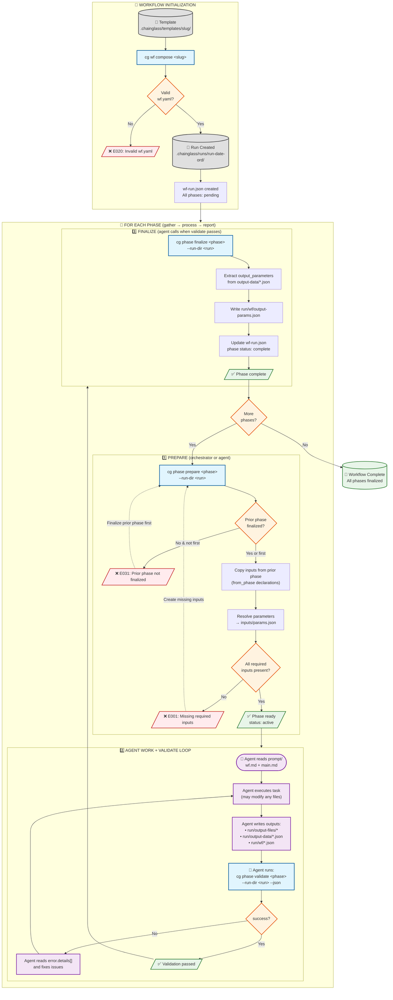
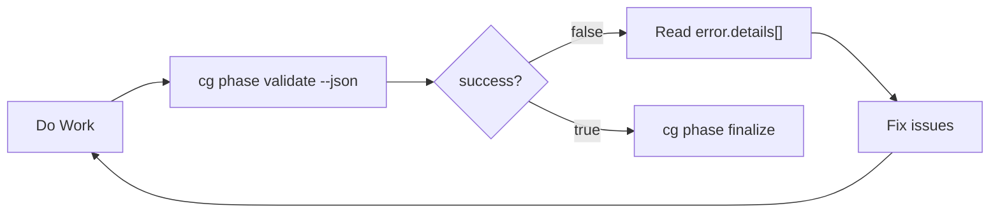
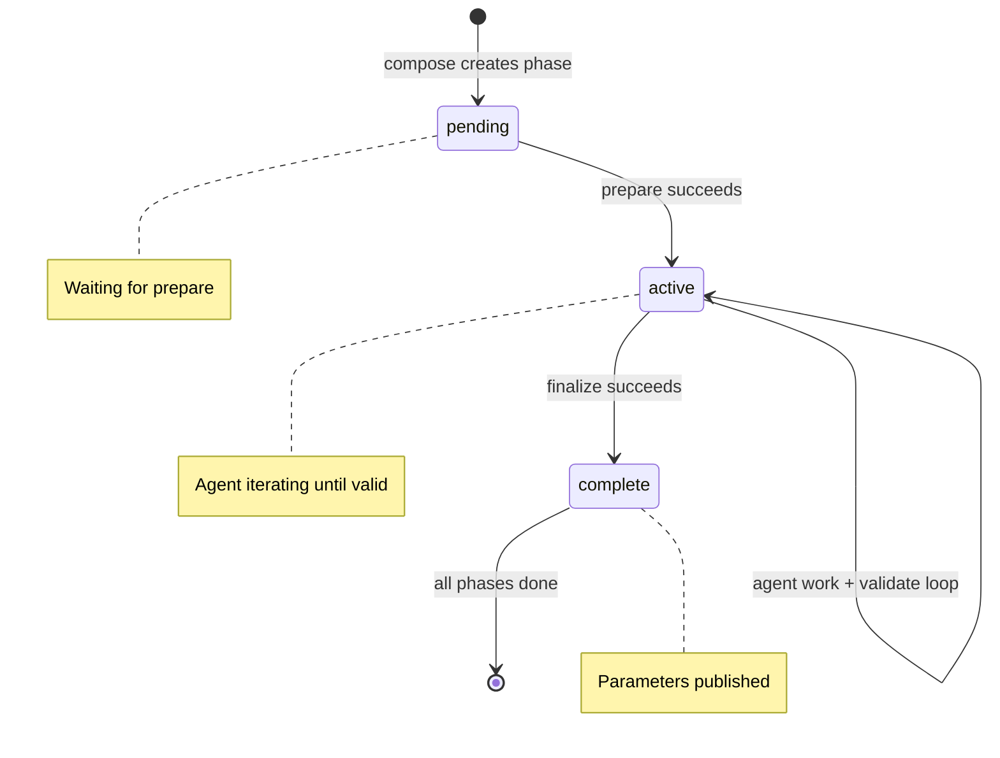

# WF Basics - Workflow Fundamentals

**Mode**: Full

📚 This specification incorporates findings from `research-dossier.md`

✅ **External Research Complete**
The following external research topics have been addressed (see research-dossier.md for full details):
- **JSON Schema Validation**: AJV selected (Draft 2020-12 via `Ajv2020`, 100x faster than alternatives)
- **YAML Parsing**: `yaml` package selected (YAML 1.2 compliance, security, source location tracking)

---

## Research Context

Extensive research was conducted mapping user requirements to technical design. Key findings:

- **Components affected**: CLI (`apps/cli`), new `@chainglass/workflow` package, MCP server (`packages/mcp-server`), `@chainglass/shared` (CLI response interfaces)
- **Critical dependencies**: Must follow clean architecture from 001-project-setup (interfaces in shared, fakes for testing, DI container pattern)
- **Modification risks**: Low - this is new functionality, but must integrate with existing CLI and MCP patterns
- **Decisions confirmed**:
  - Three-tier output structure: `output-files/` + `output-data/` + `wf/`
  - JSON-first output: `--json` flag primary, human output secondary
  - Template location: `.chainglass/templates/<slug>/`
  - Run folder location: `.chainglass/runs/`
  - Development exemplar: `dev/examples/wf/`
  - Terminology: "phase" (not "stage")
  - Execution: Manual (CLI commands, no orchestration)
- **Link**: See `research-dossier.md` for full analysis (45 findings, 11 concept mappings)

---

## Summary

**WHAT**: Implement a filesystem-based workflow system that enables multi-phase task execution with explicit input/output contracts, schema validation, and parameter passing between phases.

**WHY**:
- Enable deterministic, auditable workflow execution by coding agents
- Provide explicit contracts between workflow phases (inputs, outputs, parameters)
- Support both CLI and MCP interfaces for workflow operations
- Create a foundation for orchestrated agent workflows without database dependencies
- Allow agents to work on any files while tracking workflow artifacts separately

---

## Workflow Lifecycle



### Lifecycle Summary

| Step | Command | Who Runs | Input | Output | Errors |
|------|---------|----------|-------|--------|--------|
| **Compose** | `cg wf compose <slug>` | Orchestrator | Template slug | Run folder + wf-run.json | E020 (invalid YAML) |
| **Prepare** | `cg phase prepare <phase>` | Orchestrator/Agent | Run dir, phase | inputs/params.json, copied files | E001, E031 |
| **Work+Validate** | `cg phase validate <phase>` | **Agent (loop)** | Run dir, phase | Validation result (JSON) | E010, E011, E012 |
| **Finalize** | `cg phase finalize <phase>` | Agent | Run dir, phase | wf/output-params.json | E030 (wrong state) |

### Agent Validate Loop Detail

The agent's work cycle includes validation - they iterate until outputs are correct:



**Key Point**: The agent uses `--json` output to programmatically determine what needs fixing. The `error.details[]` array tells them exactly which files are missing, empty, or failing schema validation.

### Phase State Transitions



---

## Goals

1. **Filesystem-First**: All workflow state lives in files - no database required; git provides versioning and history
2. **Explicit Contracts**: Phases declare their inputs, outputs, and published parameters in `wf.yaml`
3. **Schema Validation**: JSON outputs are validated against schemas; phases cannot complete until validation passes
4. **Phase Independence**: Each phase is self-contained with its own inputs/, prompt/, run/, and schemas/ directories
5. **CLI Operations**: Provide `cg wf compose` and `cg phase prepare|validate|finalize` commands for workflow management
6. **JSON-First Output**: All commands support `--json` for machine-readable output; JSON is the primary interface for system integration
7. **MCP Integration**: Same operations available via MCP tools for agent-driven workflows
8. **Development Exemplar**: Create complete working examples in `dev/examples/wf/` to build and test against
9. **Manual Execution**: Support manual workflow execution before implementing orchestration

---

## Non-Goals

1. **Automated Orchestration**: No automatic phase transitions - this is for later phases
2. **Database Backend**: No database; filesystem is the storage layer
3. **Agent Sandboxing**: Workflow folders track artifacts, not constrain where agents can work
4. **Complex Workflow Logic**: No conditionals, loops, or branching between phases
5. **Real-time Status**: No live updates or WebSocket streaming of workflow state
6. **Multi-user Concurrency**: No file locking or concurrent access handling initially
7. **Workflow Versioning**: No migration between wf.yaml schema versions
8. **Remote Templates**: Templates are project-local only; no remote registry

---

## Complexity

**Score**: CS-3 (Medium)

**Breakdown**:
| Dimension | Score | Rationale |
|-----------|-------|-----------|
| Surface Area (S) | 2 | Multiple packages: workflow, shared/interfaces, cli, mcp-server |
| Integration (I) | 1 | Internal only - integrates with existing CLI and MCP patterns |
| Data/State (D) | 1 | New file structures (wf.yaml, phase folders) but no database/migrations |
| Novelty (N) | 1 | Well-specified from research, but novel to this codebase |
| Non-Functional (F) | 0 | Standard performance expectations; no strict requirements |
| Testing/Rollout (T) | 1 | Integration tests needed; manual testing with exemplar fixtures |

**Total**: S(2) + I(1) + D(1) + N(1) + F(0) + T(1) = **6 → CS-3**

**Confidence**: 0.85

**Assumptions**:
- Reference implementation patterns from Python prototype translate well to TypeScript
- YAML/JSON Schema libraries work well together in Node.js
- Existing CLI (Commander.js) and MCP patterns support new command groups
- Manual execution is sufficient for initial validation

**Dependencies**:
- 001-project-setup complete (monorepo, clean architecture, DI patterns)
- YAML parsing library: `yaml` (eemeli/yaml) ✅ Selected
- JSON Schema validation library: `ajv` with `Ajv2020` ✅ Selected

**Risks**:
- ~~Library choice for YAML/JSON Schema may affect error message quality~~ ✅ Mitigated - libraries selected with source mapping support
- Phase 0 exemplar creation is critical path - delays here block all development
- Manual testing approach may miss edge cases that automation would catch

**Phases**:
1. Phase 0: Development Exemplar (`dev/examples/wf/` with template + completed run)
2. Phase 1: Core Services + Compose (`cg wf compose` command)
3. Phase 2: Phase Operations (`cg phase prepare`, `cg phase validate` commands)
4. Phase 3: Phase Lifecycle (`cg phase finalize` command with parameter extraction)
5. Phase 4: MCP Integration (MCP tools wrapping services)

---

## Acceptance Criteria

### Phase 0: Development Exemplar

**AC-01**: Given a fresh clone of the repository, when I navigate to `dev/examples/wf/template/hello-workflow/`, then I find a complete workflow template with `wf.yaml`, `schemas/`, `templates/`, and `phases/` directories.

**AC-02**: Given the template in `dev/examples/wf/template/hello-workflow/wf.yaml`, when I parse it with a YAML parser, then it parses without errors and contains 3 phases: gather, process, report.

**AC-03**: Given JSON Schema files in `dev/examples/wf/template/hello-workflow/schemas/`, when I validate them, then each is valid JSON Schema Draft 2020-12.

**AC-04**: Given the exemplar run in `dev/examples/wf/runs/run-example-001/`, then each phase (gather, process, report) has complete folder structure: inputs/, prompt/, schemas/, phase-config.yaml, and run/ with output-files/, output-data/, and wf/ subdirectories.

**AC-05**: Given JSON files in the exemplar run's `run/output-data/` and `run/wf/` directories, when I validate them against their declared schemas, then all pass validation.

### Phase 1: Core Services + Compose

**AC-06**: Given the `cg` CLI, when I run `cg wf --help`, then I see a workflow command group with available subcommands including `--json` flag documentation.

**AC-07**: Given a workflow template at `.chainglass/templates/hello-workflow/`, when I run `cg wf compose hello-workflow`, then a new run folder is created at `.chainglass/runs/run-{date}-{ordinal}/` with correct structure.

**AC-07a**: Given the same command with `--json` flag, when I run `cg wf compose hello-workflow --json`, then it outputs a JSON response with `success: true`, `command: "wf.compose"`, and `data` containing `runDir`, `template`, and `phases` array.

**AC-08**: Given a composed run folder, when I inspect `wf-run.json`, then it contains workflow metadata including source template path, creation timestamp, and phase list with "pending" status.

**AC-09**: Given a composed run folder, when I inspect any phase folder, then it contains `phase-config.yaml` extracted from `wf.yaml` with that phase's inputs, outputs, and parameters.

### Phase 1a: JSON Output Framework

**AC-23**: Given any workflow command, when I add `--json` flag, then stdout contains ONLY valid JSON (no progress indicators, no colors, no other text).

**AC-24**: Given `@chainglass/shared`, then it exports `CommandResponse<T>`, `ErrorDetail`, and `ErrorItem` interfaces for consistent JSON response typing.

**AC-25**: Given a successful command with `--json`, then the response includes `success: true`, `command: string`, `timestamp: string`, and `data: T`.

**AC-26**: Given a failed command with `--json`, then the response includes `success: false`, `command: string`, `timestamp: string`, and `error: ErrorDetail` with `code`, `message`, and optional `action` and `details[]`.

**AC-27**: Given multiple validation errors (e.g., several missing files), when I run with `--json`, then `error.details[]` contains one `ErrorItem` per individual error with specific `code`, `path`, and `message`.

### Phase 2: Phase Operations (prepare, validate)

**AC-10**: Given a phase with missing required inputs, when I run `cg phase prepare <phase> --run-dir <run>`, then it returns FAIL with error code E001 and actionable message listing which inputs are missing.

**AC-10a**: Given the same scenario with `--json`, then the response has `success: false`, `error.code: "E001"`, and `error.details[]` listing each missing input with its expected path.

**AC-11**: Given a phase with all required inputs present, when I run `cg phase prepare <phase> --run-dir <run>`, then it returns PASS and copies any inputs declared with `from_phase` from prior phases.

**AC-11a**: Given the same scenario with `--json`, then the response has `success: true` and `data` containing `phase`, `status: "ready"`, `inputs.resolved[]`, and `copiedFromPrior[]`.

**AC-12**: Given a phase with missing required outputs, when I run `cg phase validate <phase> --run-dir <run>`, then it returns FAIL with error code E010 and actionable message: "Missing required output: {path}. Action: Write this file before completing the phase."

**AC-13**: Given a phase with an empty output file, when I run `cg phase validate <phase> --run-dir <run>`, then it returns FAIL with error code E011 and actionable message: "Output file is empty: {path}. Action: Write content to this file."

**AC-14**: Given a phase with JSON output that fails schema validation, when I run `cg phase validate <phase> --run-dir <run>`, then it returns FAIL with error code E012 showing schema violation details and path to schema file.

**AC-14a**: Given schema validation failure with `--json`, then `error.details[]` includes `expected` and `actual` fields showing the type mismatch.

**AC-15**: Given a phase with all outputs present and valid, when I run `cg phase validate <phase> --run-dir <run>`, then it returns PASS listing all validated outputs.

**AC-15a**: Given the same scenario with `--json`, then `data` contains `outputs.validated[]` with each output's path and schema used.

### Phase 3: Phase Lifecycle (finalize)

**AC-16**: Given a finalized prior phase with output_parameters, when I run `cg phase prepare <next-phase> --run-dir <run>`, then inputs declared with `from_phase` are copied from the source phase's output directories.

**AC-17**: Given a phase with parameter declarations, when I run `cg phase prepare <phase> --run-dir <run>`, then `inputs/params.json` is created with resolved parameter values from prior phases.

**AC-18**: Given a validated phase, when I run `cg phase finalize <phase> --run-dir <run>`, then `run/wf/output-params.json` is created with extracted parameter values per output_parameters declarations.

**AC-18a**: Given finalize with `--json`, then `data` contains `extractedParams` object with the parameter names and values that were published.

**AC-19**: Given the full manual test flow (compose → gather prepare/validate/finalize → process prepare/validate/finalize → report prepare/validate/finalize), when executed against the hello-workflow template, then all commands succeed and produce outputs matching the exemplar structure.

**AC-19a**: Given the same flow executed entirely with `--json` flags, then every command returns valid JSON and the `success` field accurately reflects pass/fail status.

### Phase 4: MCP Integration

**AC-20**: Given the MCP server running, when I call `wf_compose` with template slug and output path, then it produces the same result as `cg wf compose`.

**AC-21**: Given the MCP server running, when I call `phase_prepare`, `phase_validate`, or `phase_finalize`, then each produces the same result as its CLI counterpart.

**AC-22**: Given MCP tool definitions, then each tool includes proper annotations: `readOnlyHint`, `destructiveHint`, `idempotentHint` per ADR-0001.

**AC-28**: Given MCP tool responses, then they use the same `CommandResponse<T>` structure as CLI `--json` output for consistency.

---

## Risks & Assumptions

### Risks

| Risk | Likelihood | Impact | Mitigation |
|------|------------|--------|------------|
| **YAML/JSON Schema library integration issues** | Medium | Medium | Research libraries early; prototype validation flow in Phase 0 |
| **Phase 0 exemplar blocks development** | Medium | High | Prioritize exemplar creation; it's the foundation for all testing |
| **Error messages not actionable enough** | Medium | Low | Follow reference implementation patterns; iterate based on testing |
| **File path handling edge cases** | Low | Medium | Use Node.js `path` module consistently; test cross-platform if needed |
| **Large files in output-data/ cause performance issues** | Low | Low | Not a concern for initial implementation; optimize if observed |

### Assumptions

1. **Clean architecture patterns are established** - 001-project-setup is complete and patterns are documented
2. **Commander.js supports subcommand groups** - `cg wf <subcommand>` and `cg phase <subcommand>` patterns are feasible
3. **MCP server can register new tools** - Adding workflow tools follows existing check_health pattern
4. **YAML is human-writable** - Users will author wf.yaml by hand or from templates
5. **JSON Schema Draft 2020-12 is sufficient** - No need for custom validation logic beyond schema
6. **File operations are synchronous-safe** - No concurrent access to same run folder initially

---

## Open Questions

1. ~~**[NEEDS CLARIFICATION: wf-run.json location]**~~ ✅ **RESOLVED**: Run root (`.chainglass/runs/run-001/wf-run.json`)

2. ~~**[NEEDS CLARIFICATION: Error code standardization]**~~ ✅ **RESOLVED**: Yes, use standardized codes (E001, E002, etc.)

3. **[DEFERRED: Partial validation]** - Should there be a way to validate only specific outputs, or always validate all?

---

## ADR Seeds (Optional)

### ADR Seed 1: JSON Schema Validator Selection ✅ DECIDED

**Decision**: AJV with `Ajv2020` class

**Decision Drivers**:
- Must support JSON Schema Draft 2020-12 ✅ Full support via Ajv2020
- Error messages should be human-readable and actionable ✅ Via ajv-errors + custom formatter
- Bundle size matters for CLI distribution ✅ ~35KB gzipped, acceptable for performance gain
- TypeScript type inference is a nice-to-have ✅ JSONSchemaType utility

**Rationale**: AJV is 100x faster than alternatives (17,000 vs 198 validations/sec), has full Draft 2020-12 support, and provides standalone code generation for CLI cold start optimization.

**Stakeholders**: CLI developers, MCP server developers

### ADR Seed 2: YAML Parser Selection ✅ DECIDED

**Decision**: `yaml` package (eemeli/yaml)

**Decision Drivers**:
- Must parse wf.yaml reliably ✅ Full YAML 1.2 compliance
- Error messages for parse failures should indicate line/column ✅ Document #errors array
- Should integrate cleanly with JSON Schema validation ✅ Source location via yaml-source-map

**Rationale**: YAML 1.2 eliminates "Norway problem" and other 1.1 quirks. Zero dependencies, built-in TypeScript support. Note: js-yaml has CVE-2025-64718 security vulnerability.

**Stakeholders**: Workflow package developers

---

## Research Complete

**Topics** (from research-dossier.md External Research Results):

### JSON Schema Validation ✅
**Selected**: AJV (Another JSON Validator) with `Ajv2020` class
- Draft 2020-12 full compliance
- ~17,000 validations/second (100x faster than alternatives)
- Standalone code generation for CLI cold start optimization
- TypeScript type guard support via `JSONSchemaType`
- Custom error messages via `ajv-errors` package

### YAML Parsing ✅
**Selected**: `yaml` package (eemeli/yaml)
- YAML 1.2 compliance (eliminates "Norway problem")
- Zero dependencies, clean bundling
- Source location tracking via `keepCstNodes` option
- Built-in TypeScript support
- ⚠️ Note: js-yaml has CVE-2025-64718 - do not use

**Library Stack**:
| Purpose | Library | Version |
|---------|---------|---------|
| YAML Parsing | `yaml` | Latest |
| JSON Schema | `ajv` | 8.x |
| Custom Errors | `ajv-errors` | Latest |
| Source Mapping | `yaml-source-map` | Latest |

---

## Testing Strategy

**Approach**: Full TDD (inherited from 001-project-setup)

**Rationale**: Consistent with project foundation; workflow services require comprehensive testing to ensure phase contracts are enforced correctly.

**Test Suite Organization**: Centralized at repository root (per 001-project-setup)
```
test/
├── unit/
│   └── workflow/              # Tests for @chainglass/workflow
├── integration/
│   └── workflow/              # Workflow integration tests
└── fixtures/
    └── workflow/              # Exemplar-based test fixtures
```

**Focus Areas**:
- YAML parsing and validation (wf.yaml, phase-config.yaml)
- JSON Schema validation of outputs
- Phase state transitions (pending → active → complete)
- Input/output contract enforcement
- Error message quality and standardized codes
- CLI command execution and output

**Excluded**:
- MCP transport layer (covered by existing MCP tests)
- File system edge cases beyond standard Node.js path handling

**Mock Usage**: Fakes only, avoid mocks (inherited from 001-project-setup)
- Create `FakeFileSystem` for testing without real disk I/O
- Create `FakeValidator` implementing `IValidator` interface
- Fakes live in `@chainglass/shared/fakes/`
- No `vi.mock()`, `jest.mock()`, or similar

---

## Documentation Strategy

**Location**: Hybrid (README.md + docs/) - inherited from 001-project-setup

**Rationale**: Workflow commands need quick reference in README, but wf.yaml schema and phase contracts need detailed documentation.

**Content Split**:
- **README.md**: Add `cg wf` and `cg phase` command examples to CLI section
- **docs/how/workflows.md**: Detailed guide on creating workflows, wf.yaml schema, phase structure
- **docs/rules/architecture.md**: Update with workflow package patterns if needed

**Target Audience**:
- README: Developers running workflow commands
- docs/how/: Developers creating custom workflows or understanding the system

**Maintenance**: Update docs when wf.yaml schema changes or new commands added

---

## Error Codes

Standardized error codes for programmatic handling:

| Code | Category | Description |
|------|----------|-------------|
| E001 | Input | Missing required input file |
| E002 | Input | Input file is empty |
| E003 | Input | Input fails schema validation |
| E010 | Output | Missing required output file |
| E011 | Output | Output file is empty |
| E012 | Output | Output fails schema validation |
| E020 | Config | Invalid wf.yaml syntax |
| E021 | Config | Invalid phase-config.yaml |
| E022 | Config | Missing required schema file |
| E030 | State | Phase not in expected state |
| E031 | State | Prior phase not finalized |
| E040 | Param | Missing required parameter |
| E041 | Param | Parameter type mismatch |

---

## JSON Output Framework

**Priority**: JSON output is the PRIMARY interface for system integration. Human-readable output is SECONDARY.

### Design Principles

1. **All commands support `--json`**: Every CLI operation produces structured JSON when `--json` flag is present
2. **JSON suppresses other output**: When `--json` is used, only the JSON response is written to stdout (no progress, no colors)
3. **Consistent envelope**: All JSON responses share a common wrapper structure
4. **Error codes in JSON**: The standardized error codes (E001, E010, etc.) are included in JSON responses
5. **Exit codes align**: Exit code 0 = success, non-zero = failure (matches JSON `success` field)

### Response Envelope

All JSON responses use this common wrapper:

```typescript
// Base response interface - all commands return this shape
interface CommandResponse<T = unknown> {
  success: boolean;           // true if operation succeeded
  command: string;            // e.g., "phase.prepare", "wf.compose"
  timestamp: string;          // ISO 8601 timestamp
  data?: T;                   // Command-specific payload (on success)
  error?: ErrorDetail;        // Error details (on failure)
}

interface ErrorDetail {
  code: string;               // Standardized code: E001, E010, etc.
  message: string;            // Human-readable error message
  action?: string;            // Suggested remediation action
  details?: ErrorItem[];      // Multiple errors (e.g., multiple missing files)
}

interface ErrorItem {
  code: string;               // Error code for this specific item
  path?: string;              // File path or JSON path where error occurred
  message: string;            // Specific error message
  expected?: string;          // What was expected (for validation errors)
  actual?: string;            // What was found (for validation errors)
}
```

### Example: `cg phase prepare` Success

```bash
cg phase prepare gather --run-dir .chainglass/runs/run-001 --json
```

```json
{
  "success": true,
  "command": "phase.prepare",
  "timestamp": "2026-01-21T14:30:00.000Z",
  "data": {
    "phase": "gather",
    "runDir": ".chainglass/runs/run-001",
    "status": "ready",
    "inputs": {
      "required": ["request.md"],
      "resolved": [
        { "name": "request.md", "path": "phases/gather/inputs/request.md", "exists": true }
      ]
    },
    "copiedFromPrior": []
  }
}
```

### Example: `cg phase prepare` Failure

```bash
cg phase prepare gather --run-dir .chainglass/runs/run-001 --json
```

```json
{
  "success": false,
  "command": "phase.prepare",
  "timestamp": "2026-01-21T14:30:00.000Z",
  "error": {
    "code": "E001",
    "message": "Missing required input files",
    "action": "Create the missing input files before running prepare",
    "details": [
      {
        "code": "E001",
        "path": "phases/gather/inputs/request.md",
        "message": "Required input file not found"
      }
    ]
  }
}
```

### Example: `cg phase validate` Failure (Multiple Errors)

```json
{
  "success": false,
  "command": "phase.validate",
  "timestamp": "2026-01-21T14:35:00.000Z",
  "error": {
    "code": "E012",
    "message": "Output validation failed",
    "action": "Fix the schema violations listed below",
    "details": [
      {
        "code": "E011",
        "path": "phases/gather/run/output-data/items.json",
        "message": "Output file is empty"
      },
      {
        "code": "E012",
        "path": "phases/gather/run/wf/gather-result.json",
        "message": "Schema validation failed",
        "expected": "array",
        "actual": "object"
      }
    ]
  }
}
```

### Example: `cg wf compose` Success

```json
{
  "success": true,
  "command": "wf.compose",
  "timestamp": "2026-01-21T14:25:00.000Z",
  "data": {
    "template": "hello-workflow",
    "runDir": ".chainglass/runs/run-2026-01-21-001",
    "phases": [
      { "id": "gather", "status": "pending" },
      { "id": "process", "status": "pending" },
      { "id": "report", "status": "pending" }
    ],
    "wfRunFile": ".chainglass/runs/run-2026-01-21-001/wf-run.json"
  }
}
```

### Implementation Notes

1. **Shared package location**: Response interfaces live in `@chainglass/shared/interfaces/cli-response.interface.ts`
2. **Builder pattern**: Use `CommandResponseBuilder` for constructing responses consistently
3. **Stdout only**: JSON output goes to stdout; any errors/warnings to stderr (when not in JSON mode)
4. **No pretty-print by default**: Compact JSON for piping; consider `--json-pretty` for debugging (OOS)
5. **Schema validation**: JSON response schemas should be defined and validated in tests

### Human Output (Default)

When `--json` is NOT specified, commands output human-friendly text:

```bash
$ cg phase prepare gather --run-dir .chainglass/runs/run-001
✓ Phase 'gather' is ready
  Inputs resolved: request.md

$ cg phase prepare gather --run-dir .chainglass/runs/run-001
✗ Phase 'gather' preparation failed [E001]
  Missing required inputs:
    - request.md (phases/gather/inputs/request.md)

  Action: Create the missing input files before running prepare
```

---

## Clarifications

### Session 2026-01-21

**Q1: Strategy Inheritance**
- **Answer**: Yes, inherit all from 001-project-setup
- **Rationale**: Full TDD, fakes only, hybrid docs - consistent with project foundation
- **Impact**: Testing Strategy and Documentation Strategy sections added, inheriting patterns

**Q2: wf-run.json Location**
- **Answer**: Run root (`.chainglass/runs/run-001/wf-run.json`)
- **Rationale**: Visible at top level, easy to find
- **Impact**: Updated Open Questions; AC-08 already correct

**Q3: Error Code Standardization**
- **Answer**: Yes, use standardized codes (E001, E002, etc.)
- **Rationale**: Enables programmatic error handling by agents and tooling
- **Impact**: Added Error Codes section with categorized codes

**Q4: Workflow Package Location**
- **Answer**: `packages/workflow/` (new package)
- **Rationale**: Shared library - can be used by CLI, MCP server, and future apps
- **Impact**: Confirms Research Context; new @chainglass/workflow package

**Q5: Phase 0 Exemplar Approach**
- **Answer**: Static files (committed to repo)
- **Rationale**: Simple, version controlled, always available
- **Impact**: dev/examples/wf/ contains committed exemplar files

**Q6: Run Folder Location**
- **Answer**: `.chainglass/runs/` (not `./runs/`)
- **Rationale**: Keep all chainglass files together under `.chainglass/`
- **Impact**: Updated AC-07; default output is `.chainglass/runs/run-{date}-{ordinal}/`

**Q7: JSON Output Framework**
- **Answer**: All commands support `--json`; JSON is PRIMARY interface
- **Rationale**: Systems (agents, MCP, tooling) are primary consumers; human output is secondary
- **Impact**: Added JSON Output Framework section with:
  - `CommandResponse<T>` envelope: `success`, `command`, `timestamp`, `data`/`error`
  - `ErrorDetail` with `code`, `message`, `action`, `details[]`
  - Added AC-23 through AC-28 for JSON output requirements
  - Updated existing ACs with `--json` variants (AC-07a, AC-10a, AC-11a, etc.)
  - Interfaces live in `@chainglass/shared/interfaces/cli-response.interface.ts`

---

## Clarification Coverage Summary

| Category | Status | Notes |
|----------|--------|-------|
| Workflow Mode | ✅ Resolved | Full (already set, CS-3 complexity) |
| Testing Strategy | ✅ Resolved | Full TDD, fakes only (inherited from 001) |
| Mock/Stub Policy | ✅ Resolved | Fakes only (inherited from 001) |
| Documentation Strategy | ✅ Resolved | Hybrid (inherited from 001) |
| wf-run.json Location | ✅ Resolved | Run root |
| Error Code Standardization | ✅ Resolved | Yes, E001-E041 format |
| Workflow Package Location | ✅ Resolved | packages/workflow/ |
| Phase 0 Approach | ✅ Resolved | Static committed files |
| Run Folder Location | ✅ Resolved | `.chainglass/runs/` |
| JSON Output Framework | ✅ Resolved | `--json` flag, `CommandResponse<T>` envelope |
| Partial Validation | ⏸️ Deferred | Not needed for initial implementation |

---

## Next Steps

1. ~~Run `/plan-2-clarify` for high-impact questions~~ ✅ Complete
2. ~~Consider running `/deepresearch` for library selection~~ ✅ Complete - AJV + yaml selected
3. **Proceed to `/plan-3-architect`** for implementation planning

---

**Spec Created**: 2026-01-21
**Plan Folder**: docs/plans/003-wf-basics/
**Clarifications Complete**: 2026-01-21
