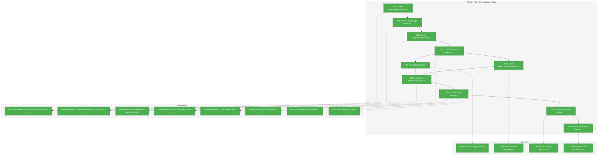
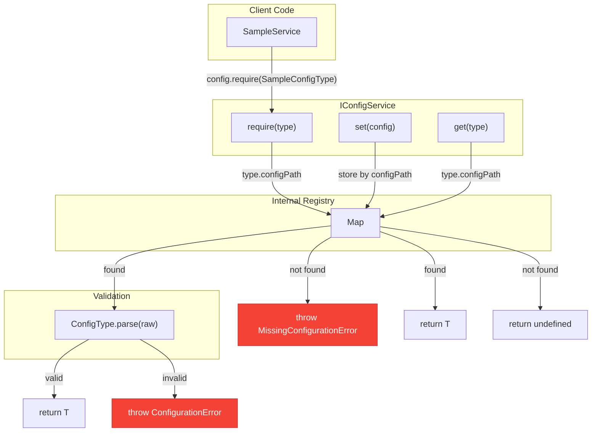
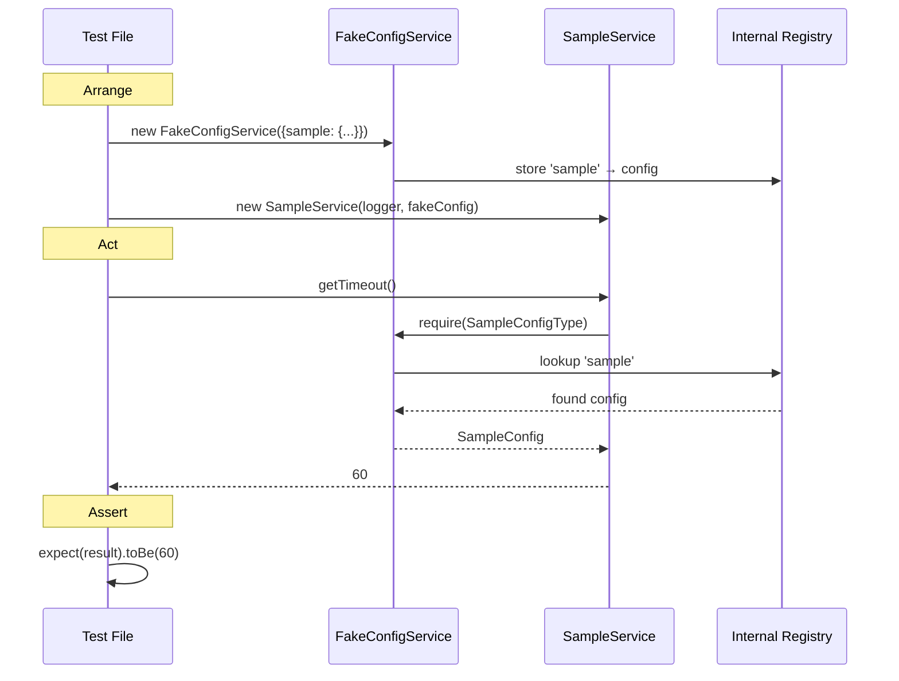

# Phase 1: Core Interfaces and Fakes – Tasks & Alignment Brief

**Spec**: [../../config-system-spec.md](../../config-system-spec.md)
**Plan**: [../../config-system-plan.md](../../config-system-plan.md)
**Date**: 2026-01-21
**Phase Slug**: `phase-1-core-interfaces-and-fakes`

---

## Executive Briefing

### Purpose

This phase establishes the foundational contracts for Chainglass's configuration system by defining the `IConfigService` interface and its test double `FakeConfigService`. This is the critical first step that enables all subsequent phases - without these interfaces, no config loading, validation, or DI integration can proceed.

### What We're Building

A **typed object registry pattern** for configuration that provides:

1. **`IConfigService` interface** - The contract that all config service implementations must follow, with `get<T>()`, `require<T>()`, and `set<T>()` methods
2. **`ConfigType<T>` interface** - A type-safe registry pattern that associates config paths with their Zod schemas
3. **`FakeConfigService`** - A test double that accepts pre-set configurations via constructor, enabling deterministic testing without file I/O
4. **`SampleConfig`** - An exemplar Zod schema demonstrating the pattern for future config types
5. **Exception classes** - `ConfigurationError`, `MissingConfigurationError`, `LiteralSecretError`
6. **Test fixtures** - Pre-baked Vitest fixtures for zero-boilerplate service testing

### User Value

Developers can:
- Test services that depend on configuration deterministically using `FakeConfigService`
- Define new config types using Zod schemas with automatic TypeScript type inference
- Access configs type-safely via `config.require(SampleConfigType)` returning `SampleConfig`
- Use pre-baked test fixtures that provide `fakeLogger` and `fakeConfig` automatically

### Example

**Before** (no config system):
```typescript
// Service has no way to receive configuration
class MyService {
  private timeout = 30; // Hardcoded, untestable
}
```

**After** (with IConfigService):
```typescript
// Service receives typed configuration via DI
class MyService {
  constructor(private logger: ILogger, private config: IConfigService) {}

  getTimeout(): number {
    return this.config.require(SampleConfigType).timeout; // Type-safe: number
  }
}

// Test with deterministic config
const fakeConfig = new FakeConfigService({
  sample: { enabled: true, timeout: 60, name: 'test' }
});
```

---

## Objectives & Scope

### Objective

Define `IConfigService` interface and `FakeConfigService` test double following the established `ILogger`/`FakeLogger` pattern, with `SampleConfig` as the exemplar schema (per Plan Phase 1 tasks 1.1-1.10).

**Behavior Checklist** (from Plan acceptance criteria):
- [ ] `get<T>()` returns `T | undefined` for unset config types
- [ ] `require<T>()` throws `MissingConfigurationError` if config type not available
- [ ] `set<T>()` stores config objects for later retrieval
- [ ] Contract tests pass for both `FakeConfigService` and (later) `ChainglassConfigService`
- [ ] `FakeConfigService` accepts pre-populated configs via constructor
- [ ] `SampleConfig` schema validates: `enabled` (boolean), `timeout` (1-300), `name` (string)

### Goals

- ✅ Define `IConfigService` interface in `@chainglass/shared/interfaces/`
- ✅ Define `ConfigType<T>` interface for typed object registry
- ✅ Create `FakeConfigService` with constructor injection and assertion helpers
- ✅ Define `SampleConfig` Zod schema with `z.infer<>` type derivation
- ✅ Create config exception classes (`ConfigurationError`, `MissingConfigurationError`, `LiteralSecretError`)
- ✅ Create contract test factory for IConfigService implementations
- ✅ Create `createTestConfigService()` helper for common test scenarios
- ✅ Create `serviceTest` Vitest fixture with pre-baked fakes
- ✅ Update barrel exports for clean public API

### Non-Goals (Scope Boundaries)

- ❌ **Path resolution** - `getUserConfigDir()`, `getProjectConfigDir()` deferred to Phase 2
- ❌ **YAML loading** - `loadYamlConfig()` deferred to Phase 2
- ❌ **Environment parsing** - `parseEnvVars()` deferred to Phase 2
- ❌ **Production service** - `ChainglassConfigService` deferred to Phase 3
- ❌ **DI registration** - `DI_TOKENS.CONFIG` deferred to Phase 4
- ❌ **Secret detection logic** - Pattern matching deferred to Phase 3 (only define exception class here)
- ❌ **Config file templates** - `templates/config.yaml` deferred to Phase 2
- ❌ **Documentation** - ADRs, how-to guides deferred to Phase 5

---

## Architecture Map

### Component Diagram

<!-- Status: grey=pending, orange=in-progress, green=completed, red=blocked -->
<!-- Updated by plan-6 during implementation -->



### Task-to-Component Mapping

<!-- Status: ⬜ Pending | 🟧 In Progress | ✅ Complete | 🔴 Blocked -->

| Task | Component(s) | Files | Status | Comment |
|------|-------------|-------|--------|---------|
| T003 | IConfigService Interface | /packages/shared/src/interfaces/config.interface.ts | ✅ Complete | **START HERE**: Core contract: get, require, set methods |
| T004 | ConfigType<T> Interface | /packages/shared/src/interfaces/config.interface.ts | ✅ Complete | Type-safe registry pattern |
| T005 | SampleConfig Schema | /packages/shared/src/config/schemas/sample.schema.ts | ✅ Complete | Zod schema with z.infer<> type |
| T007 | Exception Classes | /packages/shared/src/config/exceptions.ts | ✅ Complete | Moved up: tests import MissingConfigurationError |
| T001 | Contract Test Factory | /test/contracts/config.contract.ts | ✅ Complete | RED phase: Now interfaces exist, tests can compile |
| T002 | FakeConfigService Unit Tests | /test/unit/shared/fake-config.test.ts | ✅ Complete | RED phase: Test constructor injection, helpers |
| T006 | FakeConfigService | /packages/shared/src/fakes/fake-config.service.ts | ✅ Complete | GREEN phase: Pass tests from T001/T002 |
| T008 | Barrel Exports | Multiple index.ts files | ✅ Complete | Clean public API exports |
| T009 | Test Config Helper | /test/helpers/config-fixtures.ts | ✅ Complete | createTestConfigService() factory |
| T010 | serviceTest Fixture | /test/fixtures/service-test.fixture.ts | ✅ Complete | Vitest test.extend() with pre-baked fakes |

---

## Tasks

| Status | ID | Task | CS | Type | Dependencies | Absolute Path(s) | Validation | Subtasks | Notes |
|--------|------|------|-----|------|--------------|------------------|------------|----------|-------|
| [x] | T003 | Define IConfigService interface with get, require, set methods | 1 | Core | – | /Users/jordanknight/substrate/chainglass/packages/shared/src/interfaces/config.interface.ts | Interface compiles; JSDoc documents each method | – | Per Critical Discovery 08; START HERE |
| [x] | T004 | Define ConfigType<T> interface with configPath and parse method | 1 | Core | T003 | /Users/jordanknight/substrate/chainglass/packages/shared/src/interfaces/config.interface.ts | Generic type works with SampleConfig in tests | – | Per Critical Discovery 01 |
| [x] | T005 | Define SampleConfig schema with Zod (enabled, timeout, name) | 2 | Core | T004 | /Users/jordanknight/substrate/chainglass/packages/shared/src/config/schemas/sample.schema.ts | z.infer<> derives SampleConfig type; validation rules: enabled (boolean), timeout (1-300), name (string) | – | Per Critical Discovery 01 |
| [x] | T007 | Create config exception classes | 1 | Core | T005 | /Users/jordanknight/substrate/chainglass/packages/shared/src/config/exceptions.ts | ConfigurationError, MissingConfigurationError, LiteralSecretError extend Error with descriptive messages | – | Moved up: tests need exceptions |
| [x] | T001 | Write contract tests for IConfigService (get, require, set behavior) | 2 | Test | T007 | /Users/jordanknight/substrate/chainglass/test/contracts/config.contract.ts | Tests compile and fail (no implementation yet); covers 5+ behavioral scenarios | – | RED phase - now interfaces exist |
| [x] | T002 | Write unit tests for FakeConfigService (constructor injection, assertion helpers) | 2 | Test | T007 | /Users/jordanknight/substrate/chainglass/test/unit/shared/fake-config.test.ts | Tests compile and fail; covers constructor injection, getSetConfigs(), has(), assertConfigSet() | – | RED phase - now interfaces exist |
| [x] | T006 | Implement FakeConfigService to pass tests from T001/T002 | 2 | Core | T001, T002 | /Users/jordanknight/substrate/chainglass/packages/shared/src/fakes/fake-config.service.ts | All tests from T001/T002 pass; implements IConfigService | – | GREEN phase |
| [x] | T008 | Update barrel exports (interfaces, fakes, config) AND package.json | 1 | Setup | T006 | /Users/jordanknight/substrate/chainglass/packages/shared/src/interfaces/index.ts, /Users/jordanknight/substrate/chainglass/packages/shared/src/fakes/index.ts, /Users/jordanknight/substrate/chainglass/packages/shared/src/config/index.ts, /Users/jordanknight/substrate/chainglass/packages/shared/src/index.ts, /Users/jordanknight/substrate/chainglass/packages/shared/package.json | `import { IConfigService, FakeConfigService, SampleConfigType } from '@chainglass/shared'` AND `from '@chainglass/shared/config'` both work | – | Add "./config" subpath export to package.json (DYK-03) |
| [x] | T009 | Create createTestConfigService() helper with defaults | 1 | Setup | T008 | /Users/jordanknight/substrate/chainglass/test/helpers/config-fixtures.ts | Factory returns FakeConfigService with SampleConfig defaults; accepts override partial | – | mkdir -p test/helpers/ first (DYK-04) |
| [x] | T010 | Create serviceTest fixture with Vitest test.extend() | 2 | Setup | T009 | /Users/jordanknight/substrate/chainglass/test/fixtures/service-test.fixture.ts | Provides fakeLogger, fakeConfig, defaultSampleConfig; re-exports describe, expect | – | mkdir -p test/fixtures/ first (DYK-04) |

---

## Alignment Brief

### Prior Phases Review

**N/A** - This is Phase 1 (foundational). No prior phases to review.

### Critical Findings Affecting This Phase

**Critical Discovery 01: TypeScript Zod Pattern Replaces Pydantic** (from Plan § 3)

- **What it constrains**: Must use Zod schemas with `z.infer<>` for type derivation, not separate interface definitions
- **Addressed by**: T005 (SampleConfig schema defines both validation and type)

**Code pattern to follow**:
```typescript
// ✅ CORRECT - Single source of truth
const SampleConfigSchema = z.object({
  enabled: z.boolean().default(true),
  timeout: z.coerce.number().min(1).max(300).default(30),
  name: z.string().default('default'),
});
type SampleConfig = z.infer<typeof SampleConfigSchema>;

// ❌ WRONG - Separate type definition risks drift
interface SampleConfig { enabled: boolean; timeout: number; name: string; }
```

**Critical Discovery 08: IConfigService Interface Design** (from Plan § 3)

- **What it constrains**: Interface must follow the existing `ILogger`/`FakeLogger` pattern with typed object registry
- **Addressed by**: T003, T004, T006

### ADR Decision Constraints

**ADR-SEED-001: Configuration Service Pattern** (from Spec)
- Decision: Typed object registry (Option A) - `config.require(ConfigType)` returns typed object
- Constrains: Interface design, return types
- Addressed by: T003, T004

**ADR-SEED-002: Configuration Schema Definition** (from Spec)
- Decision: Zod schemas with `z.infer<>` (Option A) - schema defines both validation and types
- Constrains: No separate interface definitions; all config types use Zod
- Addressed by: T005

### Design Decisions (from DYK Session 2026-01-21)

**DYK-01: FakeConfigService Does NOT Validate**

Per FakeLogger pattern, `FakeConfigService` trusts the type system:
- Constructor stores objects directly without calling `ConfigType.parse()`
- TypeScript catches type mismatches at compile time
- Validation is `ChainglassConfigService`'s job (Phase 3), not the fake's
- `parse()` method exists for real implementations to declare their schema

```typescript
// ✅ CORRECT - Trust types, no validation
constructor(configs: Record<string, unknown> = {}) {
  for (const [key, value] of Object.entries(configs)) {
    this.registry.set(key, value);  // Just store it
  }
}

// ❌ WRONG - Don't validate in fake
constructor(configs: Record<string, unknown> = {}) {
  for (const [key, value] of Object.entries(configs)) {
    const validated = SampleConfigType.parse(value);  // Unnecessary
    this.registry.set(key, validated);
  }
}
```

**DYK-02: Add Zod Explicitly with Version Pin**

Zod exists as transitive dep via MCP SDK, but add explicitly to @chainglass/shared:
- Use `zod@^4.3.5` to match mcp-server version
- Explicit > implicit for package dependencies
- Allows independent version control

**DYK-03: Add /config Subpath Export to package.json**

Follow the established pattern for /interfaces, /fakes, /adapters:
```json
"./config": {
  "import": "./dist/config/index.js",
  "types": "./dist/config/index.d.ts"
}
```
- Enables `import { ... } from '@chainglass/shared/config'`
- Main barrel re-exports key items for common usage
- **Watch for diverging patterns** - all feature directories should follow this idiom

**DYK-04: Create /test/helpers/ and /test/fixtures/ Directories**

New test infrastructure directories with semantic separation:
- `/test/base/` = Generic Vitest fixtures (container, logger) - **existing**
- `/test/helpers/` = Service-specific test factories (config overrides) - **new**
- `/test/fixtures/` = Extended test functions (serviceTest, mcpTest, cliTest) - **new**

T009 and T010 must `mkdir -p` before creating files. `@test/*` alias already configured.

### Invariants & Guardrails

| Invariant | Enforcement |
|-----------|-------------|
| `get()` never throws for missing config | Contract test T001 |
| `require()` always throws for missing config | Contract test T001 |
| Zod schema is single source of type truth | Code review; no separate `interface SampleConfig` |
| FakeConfigService does NOT validate (DYK-01) | Code review; follows FakeLogger pattern |
| Exception messages include config type name | Unit test T002 |

### Inputs to Read (Exact File Paths)

| Path | Purpose |
|------|---------|
| `/Users/jordanknight/substrate/chainglass/packages/shared/src/interfaces/logger.interface.ts` | Pattern to follow for interface definition |
| `/Users/jordanknight/substrate/chainglass/packages/shared/src/fakes/fake-logger.ts` | Pattern to follow for fake implementation |
| `/Users/jordanknight/substrate/chainglass/test/contracts/logger.contract.ts` | Pattern to follow for contract tests |
| `/Users/jordanknight/substrate/chainglass/packages/shared/src/interfaces/index.ts` | Barrel export pattern |
| `/Users/jordanknight/substrate/chainglass/packages/shared/src/fakes/index.ts` | Barrel export pattern |
| `/Users/jordanknight/substrate/chainglass/packages/shared/src/index.ts` | Main barrel export pattern |

### Visual Alignment Aids

#### Flow Diagram: Config Service Operations



#### Sequence Diagram: Test Setup with FakeConfigService



### Test Plan (Full TDD per Spec)

#### Contract Tests (T001)

**File**: `/Users/jordanknight/substrate/chainglass/test/contracts/config.contract.ts`

| Test Name | Rationale | Expected Output |
|-----------|-----------|-----------------|
| `should return undefined for unset config type` | Verify get() doesn't throw | `get(SampleConfigType)` → `undefined` |
| `should throw MissingConfigurationError on require() for unset type` | Verify require() fails fast | `require(SampleConfigType)` → throws `MissingConfigurationError` |
| `should return config after set()` | Verify round-trip | `set(sample); get(type)` → `sample` |
| `should validate config on set()` | Verify Zod validation runs | `set({timeout: -1})` → throws `ConfigurationError` |
| `should include config type in error messages` | Verify actionable errors | Error message contains `'sample'` |

**Fixtures**: None (pure unit tests)

#### FakeConfigService Unit Tests (T002)

**File**: `/Users/jordanknight/substrate/chainglass/test/unit/shared/fake-config.test.ts`

| Test Name | Rationale | Expected Output |
|-----------|-----------|-----------------|
| `should accept pre-populated configs in constructor` | Enable easy test setup | Constructor injection works |
| `should return pre-populated config via get()` | Verify constructor configs are accessible | `get(type)` → constructor value |
| `should provide getSetConfigs() test helper` | Enable test assertions | Returns `Map<string, unknown>` |
| `should provide has() test helper` | Quick existence check | `has(type)` → `true/false` |
| `should provide assertConfigSet() test helper` | Assertion-style check | Throws if type not set |
| `should reject null/undefined in set()` | Type safety | `set(null)` → throws `TypeError` |

**Fixtures**: None (pure unit tests)

### Step-by-Step Implementation Outline

**Interface-First TDD Cycle** (matches proven logger pattern):

> **Note**: Tasks reordered per DYK session 2026-01-21. Interfaces must exist before tests can compile. This matches the established `ILogger`/`FakeLogger` pattern in the codebase.

1. **T003 (INTERFACE)**: Define IConfigService interface
   - Create `/packages/shared/src/interfaces/config.interface.ts`
   - Add JSDoc for each method
   - TypeScript compiles

2. **T004 (INTERFACE)**: Define ConfigType<T> interface
   - Add to same file
   - Define `configPath: string` and `parse(raw: unknown): T`

3. **T005 (SCHEMA)**: Define SampleConfig schema
   - Create `/packages/shared/src/config/schemas/sample.schema.ts`
   - Define Zod schema with defaults
   - Export `SampleConfigType` implementing `ConfigType<SampleConfig>`

4. **T007 (SUPPORT)**: Create exception classes
   - Create `/packages/shared/src/config/exceptions.ts`
   - Define three exception classes extending Error
   - Include config type name in messages
   - *Moved up: Tests need to import MissingConfigurationError*

5. **T001 (RED)**: Write contract tests that define expected behavior
   - Create `/test/contracts/config.contract.ts`
   - Define `configServiceContractTests(name, createService)` factory
   - Add 5 behavioral test cases
   - Tests fail (no implementation yet)

6. **T002 (RED)**: Write FakeConfigService unit tests
   - Create `/test/unit/shared/fake-config.test.ts`
   - Test constructor injection, helpers
   - Tests fail (no implementation yet)

7. **T006 (GREEN)**: Implement FakeConfigService
   - Create `/packages/shared/src/fakes/fake-config.service.ts`
   - Implement IConfigService
   - Add test helper methods
   - All tests from T001 and T002 pass

8. **T008 (WIRING)**: Update barrel exports
   - Update `/packages/shared/src/interfaces/index.ts`
   - Update `/packages/shared/src/fakes/index.ts`
   - Create `/packages/shared/src/config/index.ts`
   - Update `/packages/shared/src/index.ts`
   - Contract tests pass (run against FakeConfigService)

9. **T009 (HELPER)**: Create test config helper
   - Create `/test/helpers/config-fixtures.ts`
   - Define `createTestConfigService()` with defaults + overrides

10. **T010 (FIXTURE)**: Create serviceTest fixture
    - Create `/test/fixtures/` directory
    - Create `/test/fixtures/service-test.fixture.ts`
    - Use Vitest `test.extend()` pattern
    - Provide `fakeLogger`, `fakeConfig`, `defaultSampleConfig`

### Commands to Run (Copy/Paste)

```bash
# Environment setup (one-time)
cd /Users/jordanknight/substrate/chainglass
pnpm install

# Add Zod dependency to shared package (use ^4.3.5 to match mcp-server)
pnpm --filter @chainglass/shared add zod@^4.3.5

# Run tests in watch mode during development
pnpm test --filter @chainglass/shared -- --watch

# Run specific test file
pnpm test --filter @chainglass/shared -- test/contracts/config.contract.ts
pnpm test --filter @chainglass/shared -- test/unit/shared/fake-config.test.ts

# Type check
pnpm typecheck

# Lint
pnpm lint

# Full quality check before commit
just check
```

### Risks/Unknowns

| Risk | Severity | Likelihood | Mitigation |
|------|----------|------------|------------|
| Zod schema type inference edge cases | Low | Low | Use explicit `z.infer<typeof Schema>` pattern |
| ConfigType generics complexity | Medium | Low | Start simple, iterate if needed |
| Vitest `test.extend()` unfamiliar API | Low | Medium | Reference Vitest docs; fallback to simple approach |
| Barrel export circular dependencies | Low | Low | Follow existing ILogger export pattern exactly |

### Ready Check

- [x] Plan Phase 1 tasks mapped to detailed T001-T010 tasks
- [x] Critical Discovery 01 (Zod pattern) addressed in T005
- [x] Critical Discovery 08 (interface design) addressed in T003, T004
- [x] ADR-SEED-001, ADR-SEED-002 constraints documented
- [x] Test plan includes Test Doc comments for all test cases
- [x] Implementation outline follows RED-GREEN-REFACTOR cycle
- [x] Commands to run are correct and copy/paste ready
- [x] Risks identified with mitigations
- [x] ADR constraints mapped to tasks - N/A (ADR-SEED only, formal ADR in Phase 5)

**Phase 1 Implementation: ✅ COMPLETE (2026-01-21)**

---

## Phase Footnote Stubs

_To be populated by plan-6 during implementation._

| # | Change | Reason | Tasks Affected |
|---|--------|--------|----------------|
| | | | |

---

## Evidence Artifacts

**Execution Log**: `execution.log.md` (created by /plan-6 in this directory)

**Test Output**: Captured in execution log during test runs

**Supporting Files**:
- Contract test results showing FakeConfigService passes
- TypeScript compilation output (clean)
- `just check` output showing no regressions

---

## Discoveries & Learnings

_Populated during implementation by plan-6. Log anything of interest to your future self._

| Date | Task | Type | Discovery | Resolution | References |
|------|------|------|-----------|------------|------------|
| | | | | | |

**Types**: `gotcha` | `research-needed` | `unexpected-behavior` | `workaround` | `decision` | `debt` | `insight`

**What to log**:
- Things that didn't work as expected
- External research that was required
- Implementation troubles and how they were resolved
- Gotchas and edge cases discovered
- Decisions made during implementation
- Technical debt introduced (and why)
- Insights that future phases should know about

_See also: `execution.log.md` for detailed narrative._

---

## Directory Layout

```
docs/plans/004-config/
├── config-system-spec.md
├── config-system-plan.md
├── research-dossier.md
└── tasks/
    └── phase-1-core-interfaces-and-fakes/
        ├── tasks.md                    # This file
        └── execution.log.md            # Created by /plan-6
```

**Note**: Phase 6 writes `execution.log.md` and any other evidence directly into this directory.

---

## Critical Insights Discussion

**Session**: 2026-01-21
**Context**: Phase 1 Tasks & Alignment Brief - Config System Implementation
**Analyst**: AI Clarity Agent
**Reviewer**: Development Team
**Format**: Water Cooler Conversation (5 Critical Insights)

### Insight 1: Task Ordering Is Backwards - Tests Can't Compile First

**Did you know**: The TDD task ordering had T001 (write contract tests) before T003 (define interfaces), but tests can't compile without importing the interfaces they test.

**Implications**:
- TypeScript errors if tests written before interfaces exist
- Mermaid diagram showed correct order but task table showed wrong dependencies
- Existing logger pattern uses interface-first, test-second approach

**Options Considered**:
- Option A: Reorder tasks - interfaces first (T003 → T004 → T005 → T001 → T002)
- Option B: Interface stubs with TODO bodies
- Option C: Use @ts-expect-error (violated project rules)

**AI Recommendation**: Option A - Reorder Tasks
- Reasoning: Matches proven logger pattern; TypeScript compiles at every step

**Decision**: ✅ **Option A adopted** - Tasks reordered to T003 → T004 → T005 → T007 → T001 → T002 → T006

**Action Items**:
- [x] Reorder tasks table
- [x] Update Mermaid diagram
- [x] Update Step-by-Step Implementation Outline

---

### Insight 2: FakeConfigService Shouldn't Validate - Just Trust Types

**Did you know**: ConfigType<T> has a parse() method for validation, but FakeConfigService should NOT use it - matching the FakeLogger pattern of trusting the type system.

**Implications**:
- FakeLogger constructor accepts objects without validation
- Validation is ChainglassConfigService's job (Phase 3)
- parse() exists for real implementations to declare their schema

**Options Considered**:
- Option A: FakeConfigService validates via parse()
- Option B: FakeConfigService trusts type system (no validation)
- Option C: Two constructors/factories

**AI Recommendation**: Option B - Trust Type System
- Reasoning: Matches FakeLogger pattern; fakes aren't validators

**Decision**: ✅ **Option B adopted** - FakeConfigService stores objects directly, no parse() calls

**Action Items**:
- [x] Document as DYK-01 in Design Decisions section

---

### Insight 3: Zod Is Already Installed - Add Explicitly Anyway

**Did you know**: Zod v4.3.5 is already installed as a transitive dependency via MCP SDK, but should be added explicitly to @chainglass/shared.

**Implications**:
- Transitive dependencies are fragile
- Explicit dependencies allow independent versioning
- MCP server already uses ^4.3.5

**Options Considered**:
- Option A: Add Zod explicitly to @chainglass/shared
- Option B: Rely on transitive dependency
- Option C: Use different validation library

**AI Recommendation**: Option A - Add Explicitly
- Reasoning: Explicit > implicit; version control independence

**Decision**: ✅ **Option A adopted** - Add zod@^4.3.5 explicitly

**Action Items**:
- [x] Update commands section with version pin
- [x] Document as DYK-02 in Design Decisions section

---

### Insight 4: The /config/ Subpath Export Needs Wiring in package.json

**Did you know**: Creating packages/shared/src/config/ directory isn't enough - package.json needs a "./config" export entry to match the /interfaces, /fakes, /adapters pattern.

**Implications**:
- Without export entry, `@chainglass/shared/config` imports fail
- Existing pattern has subpath exports for all feature directories
- Pattern consistency prevents codebase divergence

**Options Considered**:
- Option A: Add /config subpath export to package.json
- Option B: Export only from main barrel
- Option C: Export config items from existing subpaths

**AI Recommendation**: Option A - Add /config Subpath
- Reasoning: Matches established idiom; consistency across codebase

**Decision**: ✅ **Option A adopted** - Add "./config" export to package.json

**Action Items**:
- [x] Update T008 to include package.json in file paths
- [x] Document as DYK-03 in Design Decisions section
- [x] Note about watching for diverging patterns

---

### Insight 5: Test Directories /test/helpers/ and /test/fixtures/ Don't Exist Yet

**Did you know**: T009 and T010 create files in directories that don't exist yet (/test/helpers/ and /test/fixtures/), though the @test/* path alias is already configured.

**Implications**:
- Need to mkdir before creating files
- Semantic separation: base/ for generic, helpers/ for service-specific, fixtures/ for extended tests
- Scales better as more services are added

**Options Considered**:
- Option A: Create /test/helpers/ and /test/fixtures/ as planned
- Option B: Put everything in existing /test/base/
- Option C: Put helpers alongside config tests

**AI Recommendation**: Option A - Create New Directories
- Reasoning: Semantic clarity; scales better; plan is sound

**Decision**: ✅ **Option A adopted** - Create new directories as planned

**Action Items**:
- [x] Update T009/T010 notes with mkdir instructions
- [x] Document as DYK-04 in Design Decisions section

---

## Session Summary

**Insights Surfaced**: 5 critical insights identified and discussed
**Decisions Made**: 5 decisions reached through collaborative discussion
**Action Items Created**: All completed during session
**Areas Updated**:
- Tasks table reordered
- Mermaid diagram updated
- Step-by-Step Implementation Outline reordered
- 4 Design Decisions (DYK-01 through DYK-04) documented
- T008, T009, T010 notes updated

**Shared Understanding Achieved**: ✓

**Confidence Level**: High - All insights verified against codebase, decisions align with established patterns

**Next Steps**: Proceed with `/plan-6-implement-phase --phase "Phase 1: Core Interfaces and Fakes"` when ready
