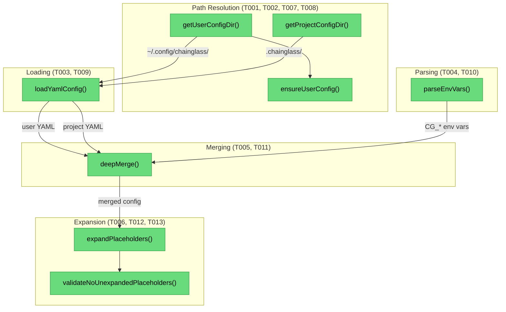
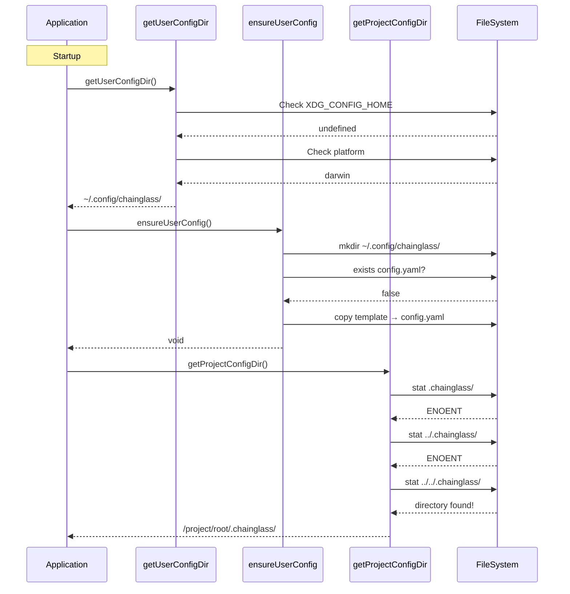

# Phase 2: Loading Infrastructure – Tasks & Alignment Brief

**Spec**: [../../config-system-spec.md](../../config-system-spec.md)
**Plan**: [../../config-system-plan.md](../../config-system-plan.md)
**Date**: 2026-01-21
**Phase Slug**: `phase-2-loading-infrastructure`

---

## Executive Briefing

### Purpose

This phase builds the **loading infrastructure** that enables Chainglass to discover and load configuration from multiple sources. Without these utilities, the production `ChainglassConfigService` (Phase 3) cannot find config files, parse YAML, read environment variables, merge sources, or expand placeholders. This is the foundational I/O and transformation layer.

### What We're Building

Seven interconnected utilities that form the **seven-phase loading pipeline**:

1. **Path Resolution** (`getUserConfigDir()`, `getProjectConfigDir()`) - Cross-platform config file discovery
2. **YAML Loader** (`loadYamlConfig()`) - Parse YAML files with error handling
3. **Environment Parser** (`parseEnvVars()`) - Convert `CG_*` env vars to nested objects
4. **Deep Merge** (`deepMerge()`) - Combine config sources with correct precedence
5. **Placeholder Expansion** (`expandPlaceholders()`) - Resolve `${VAR}` syntax
6. **Placeholder Validation** (`validateNoUnexpandedPlaceholders()`) - Fail if any remain unexpanded
7. **Starter Template** - Default `config.yaml` copied on first run

### User Value

Developers and operators can:
- Place config files in standard XDG locations (`~/.config/chainglass/`)
- Override any setting via `CG_*` environment variables
- Use `${SECRET}` placeholders in YAML that resolve from `.env` files
- Trust that missing placeholder variables fail fast with clear errors
- Get sensible defaults on first run via auto-created starter config

### Example

**Config loading pipeline (what Phase 2 enables)**:

```
~/.config/chainglass/config.yaml     → loadYamlConfig() → { sample: { timeout: 30 } }
.chainglass/config.yaml              → loadYamlConfig() → { sample: { timeout: 60 } }
CG_SAMPLE__TIMEOUT=90                → parseEnvVars()   → { sample: { timeout: '90' } }
                                     ↓
                              deepMerge(userConfig, projectConfig, envConfig)
                                     ↓
                              { sample: { timeout: '90' } }  # env wins
                                     ↓
                              expandPlaceholders() → resolve ${VAR} tokens
                                     ↓
                              validateNoUnexpandedPlaceholders() → fail if ${...} remains
```

---

## Objectives & Scope

### Objective

Implement the loading infrastructure utilities specified in Plan Phase 2 tasks 2.1-2.14, enabling config discovery, parsing, merging, and validation following the seven-phase pipeline.

**Behavior Checklist** (from Plan acceptance criteria):
- [ ] `getUserConfigDir()` returns XDG-compliant paths (Linux: `$XDG_CONFIG_HOME/chainglass`, macOS: `~/.config/chainglass`, Windows: `%APPDATA%\chainglass`)
- [ ] `getUserConfigDir()` auto-creates directory with mode 0755 on first access
- [ ] `getProjectConfigDir()` walks up from CWD to find `.chainglass/` (git-style discovery)
- [ ] `getProjectConfigDir()` returns null if no `.chainglass/` found (not an error)
- [ ] `loadYamlConfig()` parses valid YAML, returns empty object for missing files
- [ ] `parseEnvVars()` handles `CG_SECTION__FIELD` nesting with depth limit
- [ ] `deepMerge()` combines sources with later sources winning
- [ ] `expandPlaceholders()` resolves `${VAR}` from `process.env`
- [ ] `validateNoUnexpandedPlaceholders()` throws if `${...}` patterns remain
- [ ] Starter config template copied to `~/.config/chainglass/config.yaml` on first run

### Goals

- ✅ Create `getUserConfigDir()` with cross-platform XDG-compliant path resolution
- ✅ Create `getProjectConfigDir()` with git-style walk-up discovery
- ✅ Create `ensureUserConfig()` to auto-create directory and copy starter template
- ✅ Create `loadYamlConfig()` with error handling for invalid YAML
- ✅ Create `parseEnvVars()` with `CG_*` prefix handling and depth limits
- ✅ Create `deepMerge()` with circular reference protection
- ✅ Create `expandPlaceholders()` with `process.env` resolution
- ✅ Create `validateNoUnexpandedPlaceholders()` with actionable error messages
- ✅ Add dependencies: yaml, dotenv, dotenv-expand
- ✅ Full test coverage with platform mocking for path resolution

### Non-Goals (Scope Boundaries)

- ❌ **Production config service** - `ChainglassConfigService` deferred to Phase 3
- ❌ **Secret loading** - `loadSecretsToEnv()` deferred to Phase 3
- ❌ **Secret detection** - `detectLiteralSecret()` deferred to Phase 3
- ❌ **DI registration** - Container updates deferred to Phase 4
- ❌ **MCP/CLI integration** - Entry point updates deferred to Phase 4
- ❌ **Config file creation CLI** - No `cg config init` command
- ❌ **Hot reloading** - Config loads once at startup
- ❌ **Windows testing** - Verify on macOS; Windows tested via CI (unit tests mock platform)

---

## Architecture Map

### Component Diagram

```mermaid
flowchart TD
    classDef pending fill:#9E9E9E,stroke:#757575,color:#fff
    classDef inprogress fill:#FF9800,stroke:#F57C00,color:#fff
    classDef completed fill:#4CAF50,stroke:#388E3C,color:#fff
    classDef blocked fill:#F44336,stroke:#D32F2F,color:#fff

    style Phase2 fill:#F5F5F5,stroke:#E0E0E0
    style Paths fill:#F5F5F5,stroke:#E0E0E0
    style Loaders fill:#F5F5F5,stroke:#E0E0E0
    style Tests fill:#F5F5F5,stroke:#E0E0E0

    subgraph Phase2["Phase 2: Loading Infrastructure"]
        T001["T001: Write getUserConfigDir tests ✓"]:::completed
        T002["T002: Write getProjectConfigDir tests ✓"]:::completed
        T003["T003: Write loadYamlConfig tests ✓"]:::completed
        T004["T004: Write parseEnvVars tests ✓"]:::completed
        T005["T005: Write deepMerge tests ✓"]:::completed
        T006["T006: Write expandPlaceholders tests ✓"]:::completed
        T007["T007: Implement getUserConfigDir ✓"]:::completed
        T007A["T007A: Create config.yaml template ✓"]:::completed
        T007B["T007B: Implement ensureUserConfig ✓"]:::completed
        T008["T008: Implement getProjectConfigDir ✓"]:::completed
        T009["T009: Implement loadYamlConfig ✓"]:::completed
        T010["T010: Implement parseEnvVars ✓"]:::completed
        T011["T011: Implement deepMerge ✓"]:::completed
        T012["T012: Implement expandPlaceholders ✓"]:::completed
        T013["T013: Implement validateNoUnexpandedPlaceholders ✓"]:::completed
        T014["T014: Add npm dependencies ✓"]:::completed

        T001 --> T007
        T002 --> T008
        T003 --> T009
        T004 --> T010
        T005 --> T011
        T006 --> T012
        T007 --> T007A
        T007A --> T007B
        T012 --> T013
        T014 --> T009
    end

    subgraph Paths["Path Resolution"]
        F1["/packages/shared/src/config/paths/user-config.ts ✓"]:::completed
        F2["/packages/shared/src/config/paths/project-config.ts ✓"]:::completed
        F3["/packages/shared/src/config/templates/config.yaml ✓"]:::completed
    end

    subgraph Loaders["Loaders & Utilities"]
        F4["/packages/shared/src/config/loaders/yaml.loader.ts ✓"]:::completed
        F5["/packages/shared/src/config/loaders/env.parser.ts ✓"]:::completed
        F6["/packages/shared/src/config/loaders/deep-merge.ts ✓"]:::completed
        F7["/packages/shared/src/config/loaders/expand-placeholders.ts ✓"]:::completed
    end

    subgraph Tests["Test Files"]
        TU1["/test/unit/config/user-config.test.ts ✓"]:::completed
        TU2["/test/unit/config/project-config.test.ts ✓"]:::completed
        TU3["/test/unit/config/yaml-loader.test.ts ✓"]:::completed
        TU4["/test/unit/config/env-parser.test.ts ✓"]:::completed
        TU5["/test/unit/config/deep-merge.test.ts ✓"]:::completed
        TU6["/test/unit/config/expand-placeholders.test.ts ✓"]:::completed
    end

    T001 -.-> TU1
    T002 -.-> TU2
    T003 -.-> TU3
    T004 -.-> TU4
    T005 -.-> TU5
    T006 -.-> TU6
    T007 -.-> F1
    T007A -.-> F3
    T007B -.-> F1
    T008 -.-> F2
    T009 -.-> F4
    T010 -.-> F5
    T011 -.-> F6
    T012 -.-> F7
    T013 -.-> F7
```

<!-- Status: grey=pending, orange=in-progress, green=completed, red=blocked -->
<!-- Updated by plan-6 during implementation -->



### Task-to-Component Mapping

<!-- Status: ⬜ Pending | 🟧 In Progress | ✅ Complete | 🔴 Blocked -->

| Task | Component(s) | Files | Status | Comment |
|------|-------------|-------|--------|---------|
| T001 | User Config Tests | /test/unit/config/user-config.test.ts | ✅ Complete | RED: Test XDG, macOS, Windows paths; auto-create |
| T002 | Project Config Tests | /test/unit/config/project-config.test.ts | ✅ Complete | RED: Test walk-up discovery, no-cache (DYK-06), not-found |
| T003 | YAML Loader Tests | /test/unit/config/yaml-loader.test.ts | ✅ Complete | RED: Test valid/invalid/missing YAML |
| T004 | Env Parser Tests | /test/unit/config/env-parser.test.ts | ✅ Complete | RED: Test CG_ prefix, nesting, depth limit |
| T005 | Deep Merge Tests | /test/unit/config/deep-merge.test.ts | ✅ Complete | RED: Test nested merge, arrays, circular refs |
| T006 | Placeholder Tests | /test/unit/config/expand-placeholders.test.ts | ✅ Complete | RED: Test ${VAR}, missing vars, nested |
| T007 | getUserConfigDir | /packages/shared/src/config/paths/user-config.ts | ✅ Complete | GREEN: Cross-platform path resolution |
| T007A | Config Template | /packages/shared/src/config/templates/config.yaml | ✅ Complete | Create starter template with comments |
| T007B | ensureUserConfig | /packages/shared/src/config/paths/user-config.ts | ✅ Complete | GREEN: Auto-create dir and copy template |
| T008 | getProjectConfigDir | /packages/shared/src/config/paths/project-config.ts | ✅ Complete | GREEN: Walk-up discovery (no cache per DYK-06) |
| T009 | loadYamlConfig | /packages/shared/src/config/loaders/yaml.loader.ts | ✅ Complete | GREEN: YAML parsing with error handling |
| T010 | parseEnvVars | /packages/shared/src/config/loaders/env.parser.ts | ✅ Complete | GREEN: CG_* parsing per Critical Discovery 03 |
| T011 | deepMerge | /packages/shared/src/config/loaders/deep-merge.ts | ✅ Complete | GREEN: Recursive merge with WeakSet protection |
| T012 | expandPlaceholders | /packages/shared/src/config/loaders/expand-placeholders.ts | ✅ Complete | GREEN: ${VAR} resolution per Critical Discovery 04 |
| T013 | validateNoUnexpandedPlaceholders | /packages/shared/src/config/loaders/expand-placeholders.ts | ✅ Complete | GREEN: Validation per Critical Discovery 04 |
| T014 | Dependencies | /packages/shared/package.json | ✅ Complete | Add yaml, dotenv, dotenv-expand |

---

## Tasks

| Status | ID | Task | CS | Type | Dependencies | Absolute Path(s) | Validation | Subtasks | Notes |
|--------|------|------|-----|------|--------------|------------------|------------|----------|-------|
| [x] | T001 | Write tests for getUserConfigDir() covering XDG, macOS, Windows, auto-create | 2 | Test | – | /Users/jordanknight/substrate/chainglass/test/unit/config/user-config.test.ts | Tests compile and fail (RED phase); 6+ test cases | – | Mock process.platform and env vars |
| [x] | T002 | Write tests for getProjectConfigDir() covering walk-up discovery, no-cache behavior, not-found | 2 | Test | – | /Users/jordanknight/substrate/chainglass/test/unit/config/project-config.test.ts | Tests compile and fail (RED phase); 5+ test cases | – | Use temp directories; DYK-06 |
| [x] | T003 | Write tests for loadYamlConfig() covering valid, invalid, missing YAML | 2 | Test | – | /Users/jordanknight/substrate/chainglass/test/unit/config/yaml-loader.test.ts | Tests compile and fail (RED phase); 4+ test cases | – | Use test fixtures |
| [x] | T004 | Write tests for parseEnvVars() covering CG_ prefix, nesting, depth limit, strict validation | 2 | Test | – | /Users/jordanknight/substrate/chainglass/test/unit/config/env-parser.test.ts | Tests compile and fail (RED phase); 12+ test cases | – | Per Critical Discovery 03 + DYK-05 |
| [x] | T005 | Write tests for deepMerge() covering nested objects, array replacement, circular refs | 2 | Test | – | /Users/jordanknight/substrate/chainglass/test/unit/config/deep-merge.test.ts | Tests compile and fail (RED phase); 6+ test cases | – | WeakSet-based detection |
| [x] | T006 | Write tests for expandPlaceholders() covering ${VAR}, missing vars, nested values | 2 | Test | – | /Users/jordanknight/substrate/chainglass/test/unit/config/expand-placeholders.test.ts | Tests compile and fail (RED phase); 6+ test cases | – | Per Critical Discovery 04 |
| [x] | T007 | Implement getUserConfigDir() with XDG, macOS, Windows support and auto-create | 2 | Core | T001 | /Users/jordanknight/substrate/chainglass/packages/shared/src/config/paths/user-config.ts | All tests from T001 pass; creates dir with mode 0755 | – | Per Critical Discovery 07 |
| [x] | T007A | Create config.yaml starter template with all options documented | 1 | Core | T007 | /Users/jordanknight/substrate/chainglass/packages/shared/src/config/templates/config.yaml | Template has sample section with comments | – | Versioned in git |
| [x] | T007B | Implement ensureUserConfig() to copy template on first run | 2 | Core | T007A | /Users/jordanknight/substrate/chainglass/packages/shared/src/config/paths/user-config.ts | Copies template if missing; logs warning + continues on failure (DYK-09) | – | Does not overwrite existing; fallback to Zod defaults |
| [x] | T008 | Implement getProjectConfigDir() with walk-up discovery (no cache) | 2 | Core | T002 | /Users/jordanknight/substrate/chainglass/packages/shared/src/config/paths/project-config.ts | All tests from T002 pass; returns null if not found | – | Per Critical Discovery 06 + DYK-06 |
| [x] | T009 | Implement loadYamlConfig() with error handling for invalid YAML | 2 | Core | T003, T014 | /Users/jordanknight/substrate/chainglass/packages/shared/src/config/loaders/yaml.loader.ts | All tests from T003 pass; throws on invalid YAML | – | Use yaml library |
| [x] | T010 | Implement parseEnvVars() with CG_* handling and MAX_DEPTH=4 | 2 | Core | T004 | /Users/jordanknight/substrate/chainglass/packages/shared/src/config/loaders/env.parser.ts | All tests from T004 pass; throws on depth > 4 | – | Per Critical Discovery 03 |
| [x] | T011 | Implement deepMerge() with circular reference detection | 2 | Core | T005 | /Users/jordanknight/substrate/chainglass/packages/shared/src/config/loaders/deep-merge.ts | All tests from T005 pass; uses WeakSet | – | Arrays are replaced, not merged |
| [x] | T012 | Implement expandPlaceholders() with process.env resolution | 2 | Core | T006 | /Users/jordanknight/substrate/chainglass/packages/shared/src/config/loaders/expand-placeholders.ts | All tests from T006 pass; recursive string walk | – | Per Critical Discovery 04 |
| [x] | T013 | Implement validateNoUnexpandedPlaceholders() throwing ConfigurationError | 1 | Core | T012 | /Users/jordanknight/substrate/chainglass/packages/shared/src/config/loaders/expand-placeholders.ts | Throws with field path and unexpanded var name | – | Per Critical Discovery 04 |
| [x] | T014 | Add npm dependencies: yaml, dotenv, dotenv-expand | 1 | Setup | – | /Users/jordanknight/substrate/chainglass/packages/shared/package.json | Dependencies added; pnpm install succeeds | – | pnpm --filter @chainglass/shared add ... |

---

## Alignment Brief

### Prior Phases Review

**Phase 1: Core Interfaces and Fakes** (Completed 2026-01-21)

#### A. Deliverables Created

| File | Purpose | Key Exports |
|------|---------|-------------|
| `/packages/shared/src/interfaces/config.interface.ts` | Core interface definitions | `IConfigService`, `ConfigType<T>` |
| `/packages/shared/src/config/schemas/sample.schema.ts` | Exemplar Zod schema | `SampleConfigSchema`, `SampleConfig`, `SampleConfigType` |
| `/packages/shared/src/config/exceptions.ts` | Exception hierarchy | `ConfigurationError`, `MissingConfigurationError`, `LiteralSecretError` |
| `/packages/shared/src/fakes/fake-config.service.ts` | Test double implementation | `FakeConfigService` |
| `/packages/shared/src/config/index.ts` | Barrel export | Re-exports exceptions and schemas |
| `/test/contracts/config.contract.ts` | Contract test factory | `configServiceContractTests()` |
| `/test/fixtures/service-test.fixture.ts` | Vitest fixture | `serviceTest` with auto-injected fakes |
| `/test/helpers/config-fixtures.ts` | Test helpers | `createTestConfigService()`, `createEmptyConfigService()` |

#### B. Lessons Learned

1. **Interface-First TDD**: Define interfaces before tests (tests can't compile without imports)
2. **FakeConfigService Does NOT Validate**: Trust types, don't call `parse()` in fake (DYK-01)
3. **Zod Single Source of Truth**: Use `z.infer<>`, never define separate interfaces
4. **Vitest `test.extend()` API**: Requires biome-ignore for empty destructuring patterns

#### C. Technical Discoveries

- `Object.setPrototypeOf` required in exceptions for proper `instanceof` checks
- `z.coerce.number()` needed for env var string-to-number conversion
- Mixed import paths in tests (barrel vs. relative) is intentional for different testing purposes

#### D. Dependencies Exported for Phase 2

**Interfaces** (used by validation in Phase 3):
```typescript
interface ConfigType<T> {
  readonly configPath: string;
  parse(raw: unknown): T;
}
```

**Exceptions** (used by loaders):
```typescript
class ConfigurationError extends Error { configPath: string }
class MissingConfigurationError extends ConfigurationError
class LiteralSecretError extends ConfigurationError { fieldPath: string; secretType: string }
```

**Schema Pattern** (replicated for additional config types):
```typescript
const SampleConfigSchema = z.object({ enabled: z.boolean(), timeout: z.coerce.number(), name: z.string() });
type SampleConfig = z.infer<typeof SampleConfigSchema>;
```

**Test Infrastructure** (reuse in Phase 2 tests):
- `configServiceContractTests()` - for contract testing
- `serviceTest` fixture - for service tests (not directly used by loader tests)
- `createTestConfigService()` - for tests needing pre-populated config

#### E. Critical Findings Applied

- **Critical Discovery 01** (Zod pattern): Applied in sample.schema.ts
- **Critical Discovery 08** (IConfigService design): Applied in config.interface.ts
- **DYK-01** (no validation in fake): Applied in fake-config.service.ts
- **DYK-02** (explicit Zod): Applied in package.json (zod@^4.3.5)
- **DYK-03** (/config subpath): Applied in package.json exports
- **DYK-04** (test directories): Created /test/helpers/ and /test/fixtures/

#### F. Incomplete/Blocked Items

None - all 10 tasks completed.

#### G. Test Infrastructure

- 21 new tests added (6 contract, 10 unit, 5 fixture)
- 87 total tests passing
- Contract test factory ready for ChainglassConfigService (Phase 3)

#### H. Technical Debt

- No `clear()` method on FakeConfigService (add if needed)
- ChainglassConfigService contract tests stub exists (to be filled in Phase 3)

#### I. Architectural Decisions

**Patterns Established**:
1. Typed object registry: `config.require(SampleConfigType)` returns typed `SampleConfig`
2. ConfigType pattern: Objects with `configPath` + `parse()` method
3. FakeXxx implements interface fully
4. Constructor injection for test setup
5. Exception hierarchy with actionable messages

**Anti-Patterns to Avoid**:
1. Separate interface + Zod schema (drift risk)
2. Validation in fake (trust types)
3. vi.mock() for services (use behavioral fakes)

#### J. Key Log References

- Execution log: `/docs/plans/004-config/tasks/phase-1-core-interfaces-and-fakes/execution.log.md`
- Task reordering decision: lines 19-38 (T003 before T001)
- GREEN phase success: lines 168-197 (16 tests passing)
- Final quality check: lines 287-299 (87 tests, all passing)

---

### Critical Findings Affecting This Phase

**Critical Discovery 03: Environment Variable Parsing Edge Cases** (from Plan § 3)

- **What it constrains**: `CG_SECTION__FIELD=value` parsing must handle single vs double underscore, type coercion (all env vars are strings), and depth limits to prevent DOS
- **Addressed by**: T004, T010

**Code pattern to follow**:
```typescript
const ENV_VAR_PATTERN = /^CG_([A-Z][A-Z0-9_]*)$/;
const MAX_NESTING_DEPTH = 4;

function parseEnvVars(): Record<string, unknown> {
  const result: Record<string, unknown> = {};
  for (const [key, value] of Object.entries(process.env)) {
    if (!key.startsWith('CG_')) continue;
    const path = key.slice(3).split('__').map(s => s.toLowerCase());
    if (path.length > MAX_NESTING_DEPTH) {
      throw new ConfigurationError(`Nesting depth exceeds ${MAX_NESTING_DEPTH}: ${key}`);
    }
    setNestedValue(result, path, value);
  }
  return result;
}
```

**Critical Discovery 04: Placeholder Expansion Must Validate** (from Plan § 3)

- **What it constrains**: After `${VAR}` expansion, must validate no unexpanded placeholders remain; silent failure is a security risk
- **Addressed by**: T006, T012, T013

**Code pattern to follow**:
```typescript
function validateNoUnexpandedPlaceholders(obj: Record<string, unknown>): void {
  const pattern = /\$\{([^}]+)\}/;
  for (const [key, value] of Object.entries(obj)) {
    if (typeof value === 'string' && pattern.test(value)) {
      const match = value.match(pattern);
      throw new ConfigurationError(
        `Unexpanded placeholder in '${key}': ${match?.[0]}\n` +
        `Set environment variable: ${match?.[1]}=<value>`
      );
    }
    if (typeof value === 'object' && value !== null) {
      validateNoUnexpandedPlaceholders(value as Record<string, unknown>);
    }
  }
}
```

**Critical Discovery 06: Git-Style Project Config Discovery** (from Plan § 3)

- **What it constrains**: Project config found by walking up from CWD until `.chainglass/` found or filesystem root reached
- **Addressed by**: T002, T008

**Code pattern to follow**:
```typescript
// DYK-06: No caching - always walk fresh. Rationale: one-time startup call,
// microsecond performance vs. test isolation complexity in parallel Vitest.
export function getProjectConfigDir(): string | null {
  let current = process.cwd();
  const root = path.parse(current).root;

  while (current !== root) {
    const candidate = path.join(current, '.chainglass');
    try {
      const stats = fs.statSync(candidate);
      if (stats.isDirectory()) {
        return candidate;
      }
    } catch {
      // Directory doesn't exist, continue walking
    }
    current = path.dirname(current);
  }

  return null;
}
```

**Critical Discovery 07: Cross-Platform Path Resolution** (from Plan § 3)

- **What it constrains**: Linux uses XDG, macOS uses `~/.config`, Windows uses `%APPDATA%`
- **Addressed by**: T001, T007

**Code pattern to follow**:
```typescript
export function getUserConfigDir(): string {
  const xdgConfigHome = process.env.XDG_CONFIG_HOME;
  if (xdgConfigHome) {
    return path.join(xdgConfigHome, 'chainglass');
  }

  const home = process.env.HOME || os.homedir();

  switch (process.platform) {
    case 'win32':
      const appData = process.env.APPDATA || path.join(home, 'AppData', 'Roaming');
      return path.join(appData, 'chainglass');

    case 'darwin':
    case 'linux':
    default:
      return path.join(home, '.config', 'chainglass');
  }
}
```

**DYK-09: ensureUserConfig() Fallback Pattern** (from clarity session 2026-01-21)

Template copying must gracefully handle restricted filesystems (Docker, CI, read-only mounts):

```typescript
export function ensureUserConfig(configDir: string): void {
  const configPath = path.join(configDir, 'config.yaml');

  // Never overwrite existing config
  if (fs.existsSync(configPath)) return;

  try {
    const templatePath = path.join(__dirname, '../templates/config.yaml');
    fs.copyFileSync(templatePath, configPath);
    fs.chmodSync(configPath, 0o644); // Explicit permissions
  } catch (error) {
    // Log warning but don't fail — Zod defaults will apply
    console.warn(`Could not create starter config at ${configPath}: ${error.message}`);
    console.warn('Using default configuration values.');
  }
}
```

### ADR Decision Constraints

**ADR-SEED-001: Configuration Service Pattern** (from Spec)
- Decision: Typed object registry - `config.require(ConfigType)` returns typed object
- Constrains: Loaders must produce raw objects that flow into the registry

**ADR-SEED-002: Configuration Schema Definition** (from Spec)
- Decision: Zod schemas with `z.infer<>`
- Constrains: Loaders return `unknown`; validation happens at registration time (Phase 3)

### Invariants & Guardrails

| Invariant | Enforcement |
|-----------|-------------|
| Environment variables always override file config | deepMerge order tests (T005) |
| Unexpanded placeholders fail fast | validateNoUnexpandedPlaceholders tests (T006) |
| Env var nesting capped at MAX_DEPTH=4 | parseEnvVars tests (T004) |
| getUserConfigDir auto-creates if missing | user-config tests (T001) |
| getProjectConfigDir returns null, not throws, if not found | project-config tests (T002) |
| Starter template never overwrites existing config | ensureUserConfig tests (T007B) |
| Template copy failure doesn't crash app (DYK-09) | ensureUserConfig fallback tests (T007B) |

### Inputs to Read (Exact File Paths)

| Path | Purpose |
|------|---------|
| `/Users/jordanknight/substrate/chainglass/packages/shared/src/config/exceptions.ts` | Import ConfigurationError for loader errors |
| `/Users/jordanknight/substrate/chainglass/packages/shared/src/interfaces/config.interface.ts` | Reference ConfigType pattern |
| `/Users/jordanknight/substrate/chainglass/packages/shared/src/config/schemas/sample.schema.ts` | Reference Zod schema pattern for template |
| `/Users/jordanknight/substrate/chainglass/test/unit/shared/fake-config.test.ts` | Test Doc comment pattern to follow |
| `/Users/jordanknight/substrate/chainglass/packages/shared/package.json` | Add new dependencies |

### Visual Alignment Aids

#### Flow Diagram: Loading Pipeline (Phase 2 Scope)



#### Sequence Diagram: Config Discovery Flow



### Test Plan (Full TDD per Spec)

#### User Config Tests (T001)

**File**: `/Users/jordanknight/substrate/chainglass/test/unit/config/user-config.test.ts`

| Test Name | Rationale | Expected Output |
|-----------|-----------|-----------------|
| `should use XDG_CONFIG_HOME when set on Linux` | Verify XDG spec compliance | Returns `$XDG_CONFIG_HOME/chainglass` |
| `should use ~/.config/chainglass on macOS` | Verify macOS default | Returns `$HOME/.config/chainglass` |
| `should use ~/.config/chainglass on Linux without XDG` | Verify Linux fallback | Returns `$HOME/.config/chainglass` |
| `should use %APPDATA%/chainglass on Windows` | Verify Windows path | Returns `%APPDATA%\chainglass` |
| `should auto-create directory with mode 0755` | Verify first-run behavior | Directory created |
| `should fallback to os.homedir() if HOME undefined` | Edge case | Returns valid path |

**Fixtures**: Mock `process.platform`, `process.env`, `fs.existsSync`, `fs.mkdirSync`

#### Project Config Tests (T002)

**File**: `/Users/jordanknight/substrate/chainglass/test/unit/config/project-config.test.ts`

| Test Name | Rationale | Expected Output |
|-----------|-----------|-----------------|
| `should find .chainglass in current directory` | Simple case | Returns CWD/.chainglass |
| `should walk up to find .chainglass in parent` | Walk-up discovery | Returns parent/.chainglass |
| `should return null at filesystem root` | Not-found case | Returns null, no throw |
| `should return fresh result on each call (no cache)` | Test isolation (DYK-06) | Different CWD yields different result |
| `should check root directory for .chainglass` | Edge case | Handles root-level project |

**Fixtures**: Temp directories with/without .chainglass

**DYK-06 (No Cache)**: Per clarity session 2026-01-21, `getProjectConfigDir()` does NOT cache results. Rationale: one-time startup call with microsecond performance; caching creates test isolation nightmares with parallel Vitest execution (`pool: 'threads'`). Fresh walk-up on each call eliminates an entire class of flaky test bugs.

#### YAML Loader Tests (T003)

**File**: `/Users/jordanknight/substrate/chainglass/test/unit/config/yaml-loader.test.ts`

| Test Name | Rationale | Expected Output |
|-----------|-----------|-----------------|
| `should parse valid YAML file` | Core functionality | Parsed object |
| `should return empty object for missing file` | Graceful degradation | `{}` |
| `should throw ConfigurationError on invalid YAML` | Error handling | Error with file path, line number |
| `should return empty object for empty file` | Edge case | `{}` |

**Fixtures**: test/fixtures/config/*.yaml files

#### Env Parser Tests (T004)

**File**: `/Users/jordanknight/substrate/chainglass/test/unit/config/env-parser.test.ts`

| Test Name | Rationale | Expected Output |
|-----------|-----------|-----------------|
| `should parse CG_ prefixed variables` | Core functionality | Nested object |
| `should ignore non-CG_ variables` | Filter logic | Only CG_* included |
| `should convert __ to nested keys` | Nesting logic | `CG_A__B=x` → `{a:{b:'x'}}` |
| `should lowercase all keys` | Convention | `CG_SAMPLE__TIMEOUT` → `sample.timeout` |
| `should reject nesting > MAX_DEPTH` | Security | Throws ConfigurationError |
| `should handle single-level variables` | Simple case | `CG_DEBUG=true` → `{debug:'true'}` |
| `should preserve string values` | Type safety | All values are strings |
| `should handle empty CG_ value` | Edge case | Empty string stored (Zod validates) |
| `should reject lowercase after CG_ prefix` | Strict validation (DYK-05) | Throws ConfigurationError for `CG_sample__timeout` |
| `should reject trailing underscore` | Strict validation (DYK-05) | Throws ConfigurationError for `CG_SAMPLE_` |
| `should reject empty path segments (triple underscore)` | Strict validation (DYK-05) | Throws ConfigurationError for `CG___INVALID` |
| `should reject invalid characters in key` | Strict validation (DYK-05) | Throws ConfigurationError for `CG_SAMPLE-NAME` |

**Fixtures**: Direct process.env manipulation, restore after each test

**DYK-05 (Strict Env Parsing)**: Per clarity session 2026-01-21, env var parsing uses strict validation matching the codebase's fail-fast philosophy. Malformed `CG_*` variables throw `ConfigurationError` with actionable messages rather than being silently ignored. This aligns with placeholder validation approach and post-FIX-002 security posture.

#### Deep Merge Tests (T005)

**File**: `/Users/jordanknight/substrate/chainglass/test/unit/config/deep-merge.test.ts`

| Test Name | Rationale | Expected Output |
|-----------|-----------|-----------------|
| `should merge nested objects` | Core functionality | Combined object |
| `should replace arrays entirely` | Array behavior (DYK-08) | Source array wins — user arrays overwritten |
| `should handle source overriding target` | Precedence | Source values win |
| `should handle null values` | Edge case | Null replaces target |
| `should handle circular references` | Security | Returns without infinite loop |
| `should not mutate original objects` | Immutability | Original unchanged |

**Fixtures**: None (pure function tests)

**DYK-08 (Array Replacement)**: Arrays are replaced entirely, NOT merged/concatenated. This is intentional — simple semantics matching shallow spread patterns. Users wanting additive array behavior must specify the full array in their override. Future enhancement: per-schema opt-in for concatenation (like fs2's `other_graphs.graphs`) can be added in Phase 3+ if needed.

#### Placeholder Tests (T006)

**File**: `/Users/jordanknight/substrate/chainglass/test/unit/config/expand-placeholders.test.ts`

| Test Name | Rationale | Expected Output |
|-----------|-----------|-----------------|
| `should expand ${VAR} from process.env` | Core functionality | Resolved string |
| `should expand nested object values` | Recursive | All strings resolved |
| `should leave non-placeholder strings unchanged` | Precision | No modification |
| `should handle missing env vars` | Edge case | Leaves `${VAR}` unchanged |
| `should throw on unexpanded placeholders after validation` | Security | ConfigurationError with var name |
| `should include field path in validation error` | Debugging | Error includes `sample.api_key` |

**Fixtures**: process.env manipulation, restore after each test

### Step-by-Step Implementation Outline

**TDD Cycle: Write all tests first (RED), then implement (GREEN)**

1. **T014 (SETUP)**: Add npm dependencies
   - Add yaml, dotenv, dotenv-expand to @chainglass/shared
   - `pnpm --filter @chainglass/shared add yaml dotenv dotenv-expand`

2. **T001 (RED)**: Write getUserConfigDir tests
   - Create `/test/unit/config/user-config.test.ts`
   - Mock process.platform, process.env, fs functions
   - 6 test cases covering all platforms + auto-create

3. **T002 (RED)**: Write getProjectConfigDir tests
   - Create `/test/unit/config/project-config.test.ts`
   - Use temp directories for realistic walk-up testing
   - 5 test cases covering discovery + caching

4. **T003 (RED)**: Write loadYamlConfig tests
   - Create `/test/unit/config/yaml-loader.test.ts`
   - Create test fixtures in `/test/fixtures/config/`
   - 4 test cases covering valid/invalid/missing

5. **T004 (RED)**: Write parseEnvVars tests
   - Create `/test/unit/config/env-parser.test.ts`
   - 8 test cases covering parsing + edge cases

6. **T005 (RED)**: Write deepMerge tests
   - Create `/test/unit/config/deep-merge.test.ts`
   - 6 test cases covering merge behavior

7. **T006 (RED)**: Write expandPlaceholders tests
   - Create `/test/unit/config/expand-placeholders.test.ts`
   - 6 test cases covering expansion + validation

8. **T007 (GREEN)**: Implement getUserConfigDir
   - Create `/packages/shared/src/config/paths/user-config.ts`
   - Implement cross-platform path resolution
   - Implement auto-create with mode 0755

9. **T007A (GREEN)**: Create config template
   - Create `/packages/shared/src/config/templates/config.yaml`
   - Include commented examples for all options

10. **T007B (GREEN)**: Implement ensureUserConfig
    - Add to `/packages/shared/src/config/paths/user-config.ts`
    - Copy template only if config.yaml missing
    - **DYK-09**: Wrap in try/catch; log warning on failure, continue with Zod defaults
    - Set file permissions with `fs.chmodSync(configPath, 0o644)`

11. **T008 (GREEN)**: Implement getProjectConfigDir
    - Create `/packages/shared/src/config/paths/project-config.ts`
    - Implement walk-up discovery (no cache per DYK-06)

12. **T009 (GREEN)**: Implement loadYamlConfig
    - Create `/packages/shared/src/config/loaders/yaml.loader.ts`
    - Use yaml library, throw ConfigurationError on invalid

13. **T010 (GREEN)**: Implement parseEnvVars
    - Create `/packages/shared/src/config/loaders/env.parser.ts`
    - Implement CG_* parsing with MAX_DEPTH=4

14. **T011 (GREEN)**: Implement deepMerge
    - Create `/packages/shared/src/config/loaders/deep-merge.ts`
    - Use WeakSet for circular reference detection

15. **T012 (GREEN)**: Implement expandPlaceholders
    - Create `/packages/shared/src/config/loaders/expand-placeholders.ts`
    - Recursive string walk with ${VAR} resolution

16. **T013 (GREEN)**: Implement validateNoUnexpandedPlaceholders
    - Add to same file as T012
    - Throw ConfigurationError with field path

17. **Update barrel exports**
    - Update `/packages/shared/src/config/index.ts`
    - Export all new functions

### Commands to Run (Copy/Paste)

```bash
# Environment setup (one-time)
cd /Users/jordanknight/substrate/chainglass
pnpm install

# Add dependencies to shared package
pnpm --filter @chainglass/shared add yaml dotenv dotenv-expand

# Create test fixture directories
mkdir -p test/fixtures/config
mkdir -p test/unit/config

# Run tests in watch mode during development
pnpm test -- --watch

# Run specific test file
pnpm test -- --run test/unit/config/user-config.test.ts
pnpm test -- --run test/unit/config/project-config.test.ts
pnpm test -- --run test/unit/config/yaml-loader.test.ts
pnpm test -- --run test/unit/config/env-parser.test.ts
pnpm test -- --run test/unit/config/deep-merge.test.ts
pnpm test -- --run test/unit/config/expand-placeholders.test.ts

# Run all Phase 2 tests
pnpm test -- --run test/unit/config/

# Type check
pnpm typecheck

# Lint
pnpm lint

# Full quality check before commit
just check
```

### Risks/Unknowns

| Risk | Severity | Likelihood | Mitigation |
|------|----------|------------|------------|
| Windows path edge cases | Medium | Medium | Comprehensive mocking in tests; defer Windows-specific testing to CI |
| yaml library parsing differences | Low | Low | Use yaml library defaults; test with fixtures |
| Circular reference detection performance | Low | Low | WeakSet is O(1); unlikely to be bottleneck |
| dotenv-expand version compatibility | Low | Low | Pin to stable version; integration tests |
| Temp directory cleanup in tests | Low | Medium | Use Vitest afterEach hooks with try/finally |

### Ready Check

- [x] Plan Phase 2 tasks mapped to detailed T001-T014 tasks
- [x] Prior Phase Review completed with all sections A-K
- [x] Critical Discovery 03 (env parsing) addressed in T004, T010
- [x] Critical Discovery 04 (placeholder validation) addressed in T006, T012, T013
- [x] Critical Discovery 06 (project discovery) addressed in T002, T008
- [x] Critical Discovery 07 (cross-platform paths) addressed in T001, T007
- [x] Test plan includes Test Doc comments for all test cases
- [x] Implementation outline follows RED-GREEN-REFACTOR cycle
- [x] Commands to run are correct and copy/paste ready
- [x] Risks identified with mitigations
- [x] ADR constraints mapped to tasks - N/A (ADR-SEED only, formal ADR in Phase 5)

**Ready for GO**: Await human approval to proceed with implementation.

---

## Phase Footnote Stubs

_To be populated by plan-6 during implementation._

| # | Change | Reason | Tasks Affected |
|---|--------|--------|----------------|
| | | | |

---

## Evidence Artifacts

**Execution Log**: `execution.log.md` (created by /plan-6 in this directory)

**Test Output**: Captured in execution log during test runs

**Supporting Files**:
- Unit test results showing all loader functions pass
- TypeScript compilation output (clean)
- `just check` output showing no regressions
- Test fixtures created in `/test/fixtures/config/`

---

## Discoveries & Learnings

_Populated during implementation by plan-6. Log anything of interest to your future self._

| Date | Task | Type | Discovery | Resolution | References |
|------|------|------|-----------|------------|------------|
| 2026-01-21 | T004 | decision | Env var parsing edge cases under-specified | Adopt strict validation: reject malformed CG_* vars with ConfigurationError | DYK-05, /didyouknow session |
| 2026-01-21 | T008 | decision | Module-level cache causes test isolation issues in parallel Vitest | Remove caching entirely; always walk up fresh (one-time startup call, microsecond perf) | DYK-06, /didyouknow session |
| 2026-01-21 | All loaders | insight | Sync file ops (statSync, readFileSync) look like anti-pattern but are intentional | Validated: one-time startup, not high-perf system, matches codebase patterns, spec-mandated | DYK-07, /didyouknow session |
| 2026-01-21 | T011 | decision | Array replacement may surprise users expecting additive merge | Keep replace semantics (simple); document clearly; future: per-schema concatenation opt-in | DYK-08, /didyouknow session |
| 2026-01-21 | T007B | decision | Template copy can fail on restricted filesystems (Docker, CI) | Copy with fallback: try copy + chmod 0o644, catch errors, log warning, continue with Zod defaults | DYK-09, /didyouknow session |

**Types**: `gotcha` | `research-needed` | `unexpected-behavior` | `workaround` | `decision` | `debt` | `insight`

**What to log**:
- Things that didn't work as expected
- External research that was required
- Implementation troubles and how they were resolved
- Gotchas and edge cases discovered
- Decisions made during implementation
- Technical debt introduced (and why)
- Insights that future phases should know about

_See also: `execution.log.md` for detailed narrative._

---

## Directory Layout

```
docs/plans/004-config/
├── config-system-spec.md
├── config-system-plan.md
├── research-dossier.md
└── tasks/
    ├── phase-1-core-interfaces-and-fakes/
    │   ├── tasks.md
    │   └── execution.log.md
    └── phase-2-loading-infrastructure/
        ├── tasks.md                    # This file
        └── execution.log.md            # Created by /plan-6
```

**Note**: Phase 6 writes `execution.log.md` and any other evidence directly into this directory.

---

**Phase 2 Dossier Status**: READY FOR REVIEW
**Next Step**: Await human **GO** to proceed with `/plan-6-implement-phase --phase "Phase 2: Loading Infrastructure"`

---

## Critical Insights Discussion

**Session**: 2026-01-21
**Context**: Phase 2: Loading Infrastructure Tasks Dossier
**Analyst**: AI Clarity Agent
**Reviewer**: Development Team
**Format**: Water Cooler Conversation (5 Critical Insights)

### Insight 1: Environment Variable Parsing Edge Cases

**Did you know**: The `CG_*` environment variable parsing had significant gaps in edge case handling — empty values, trailing underscores, triple underscores, and invalid characters were under-specified.

**Implications**:
- Malformed env vars could silently fail or produce unexpected config
- Security posture requires fail-fast behavior (per FIX-002 precedent)
- Placeholder validation already throws on `${...}` patterns — env parsing should match

**Options Considered**:
- Option A: Strict regex validation — reject malformed with ConfigurationError
- Option B: Lenient parsing — log warnings for skipped vars
- Option C: Hybrid — strict for prod, lenient for dev

**AI Recommendation**: Option A (Strict)
- Reasoning: Matches codebase fail-fast philosophy, ConfigurationError hierarchy, and placeholder validation approach.

**Discussion Summary**: User agreed with strict validation. Added 4 new edge case tests to T004.

**Decision**: Adopt strict validation — reject malformed `CG_*` vars with ConfigurationError

**Action Items**:
- [x] Add edge case tests to T004 (12+ test cases)
- [x] Document DYK-05 in tasks.md

**Affects**: T004, T010

---

### Insight 2: Module-Level Cache Creates Testing Nightmares

**Did you know**: The module-level caching for `getProjectConfigDir()` would cause test isolation problems in parallel Vitest execution.

**Implications**:
- Module-level variables persist across test files in same worker
- `container.clearInstances()` won't touch module-level state
- Could cause flaky tests depending on execution order

**Options Considered**:
- Option A: Module-level cache with resetCache() export
- Option B: Class-based service with DI integration
- Option C: No cache — always walk up fresh

**AI Recommendation**: Option A initially, but user raised parallel execution concern.

**Discussion Summary**: User asked "what if vitest is running in parallel?" — excellent catch. For `pool: 'threads'`, workers may share module state. The performance benefit (microseconds) doesn't justify the test isolation complexity.

**Decision**: Remove caching entirely — always walk up fresh (one-time startup call)

**Action Items**:
- [x] Update Critical Discovery 06 code pattern
- [x] Update T002 tests — remove caching tests, add "fresh result" test
- [x] Document DYK-06 in tasks.md

**Affects**: T002, T008, Critical Discovery 06

---

### Insight 3: Synchronous File Operations Are Intentional

**Did you know**: All file operations use sync variants (`statSync`, `readFileSync`) — this looks like an anti-pattern but is a deliberate architectural decision.

**Implications**:
- Spec explicitly mandates synchronous loading
- Config loads once at startup, not on hot path
- Existing codebase uses sync ops for startup paths

**Options Considered**:
- Option A: Keep sync ops (as specified)
- Option B: Add async variants for flexibility
- Option C: Sync with timeout wrapper

**AI Recommendation**: Option A (Keep sync)

**Discussion Summary**: User confirmed "this is not a high performance system" — sync ops for one-time startup are perfectly acceptable.

**Decision**: Keep synchronous file operations as specified; validated as intentional

**Action Items**:
- [x] Document DYK-07 in tasks.md

**Affects**: All loader tasks (T001, T003, T007, T007B, T008, T009)

---

### Insight 4: Array Replacement Semantics May Surprise Users

**Did you know**: `deepMerge()` replaces arrays entirely rather than merging/concatenating them. Users expecting additive behavior will lose data.

**Implications**:
- User config arrays completely overwritten by project config
- Matches shallow spread semantics used in test fixtures
- fs2 has special concatenation for specific config types

**Options Considered**:
- Option A: Replace arrays entirely (as specified)
- Option B: Configurable per-schema concatenation
- Option C: Index-based array merging

**AI Recommendation**: Option A (Replace)

**Discussion Summary**: User agreed to keep simple replacement semantics now. May add per-schema concatenation later if needed.

**Decision**: Keep array replacement; document clearly; future enhancement path noted

**Action Items**:
- [x] Add DYK-08 note to T005 test plan
- [x] Document future enhancement path

**Affects**: T005, T011

---

### Insight 5: Template Copying Has Safe Fallback Path

**Did you know**: The starter config template copying could fail on restricted filesystems (Docker, CI), but the system has built-in resilience via Zod defaults.

**Implications**:
- Spec already allows "no config.yaml exists → use Zod defaults"
- Crashing on copy failure is unnecessary
- Docker/CI environments often have read-only filesystems

**Options Considered**:
- Option A: Copy with explicit chmod + throw on failure
- Option B: Skip auto-copy (blocked — spec violation)
- Option C: Copy with fallback — log warning, continue with Zod defaults

**AI Recommendation**: Option C (Fallback)

**Discussion Summary**: User agreed with graceful degradation approach.

**Decision**: Copy template with fallback; log warning and continue with Zod defaults on failure

**Action Items**:
- [x] Update T007B with fallback behavior
- [x] Add code pattern for ensureUserConfig()
- [x] Add invariant for "copy failure doesn't crash"
- [x] Document DYK-09 in tasks.md

**Affects**: T007B

---

## Session Summary

**Insights Surfaced**: 5 critical insights identified and discussed
**Decisions Made**: 5 decisions reached through collaborative discussion
**Action Items Created**: 5 DYK entries documented (DYK-05 through DYK-09)
**Areas Updated**:
- T004 test plan (4 new edge case tests)
- T002 test plan (removed caching tests)
- T008 implementation (no cache)
- T007B implementation (fallback behavior)
- Critical Discovery 06 code pattern
- Invariants table (new entry)
- Code patterns section (ensureUserConfig)

**Shared Understanding Achieved**: ✓

**Confidence Level**: High — All critical edge cases identified and decisions documented

**Next Steps**:
Proceed with `/plan-6-implement-phase --phase "Phase 2: Loading Infrastructure"` when ready

**Notes**:
All 5 insights have been incorporated into the tasks.md document. The DYK entries (DYK-05 through DYK-09) provide future implementers with context for design decisions.
