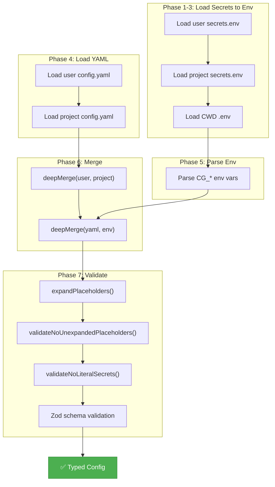
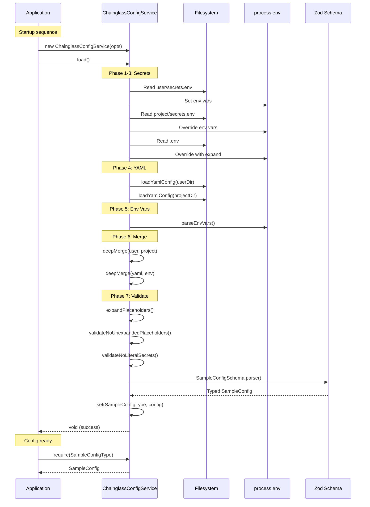

# Phase 3: Production Config Service – Tasks & Alignment Brief

**Spec**: [../../config-system-spec.md](../../config-system-spec.md)
**Plan**: [../../config-system-plan.md](../../config-system-plan.md)
**Date**: 2026-01-21
**Phase Slug**: `phase-3-production-config-service`

---

## Executive Briefing

### Purpose

This phase implements `ChainglassConfigService`, the production configuration service that executes the seven-phase loading pipeline. This is the core component that transforms the infrastructure utilities from Phase 2 into a cohesive, production-ready configuration system that enforces security (literal secret detection), validates all config objects against Zod schemas, and provides the type-safe config access that services will consume via DI.

### What We're Building

The **production `ChainglassConfigService`** that:

1. **Executes the seven-phase loading pipeline** - Synchronously loads secrets to env, YAML configs, env var overrides, merges all sources, expands placeholders, validates no unexpanded placeholders remain, and runs Zod validation
2. **Detects literal secrets** - Rejects hardcoded API keys matching patterns like `sk-*`, `ghp_*`, `xoxb-*`, `sk_live_*`, `AKIA*` with actionable error messages
3. **Implements `IConfigService`** - Fulfills the contract established in Phase 1, passing all contract tests
4. **Provides `load()` and `isLoaded()` methods** - For explicit lifecycle control and DI integration validation

### User Value

With `ChainglassConfigService`, the application can:
- Load configuration from multiple sources (user, project, env vars, .env files) with correct precedence
- Validate all configuration at startup, failing fast with actionable error messages
- Detect hardcoded secrets before they're used, preventing security incidents
- Provide type-safe configuration access to all services via dependency injection

### Example

**Before Phase 3** (no production service):
```typescript
// FakeConfigService works in tests, but no production implementation
const config = new FakeConfigService({ sample: { ... } }); // Works
// No way to load from files, env vars, or detect secrets
```

**After Phase 3** (production service):
```typescript
// Production service loads from all sources with precedence
const config = new ChainglassConfigService({
  userConfigDir: getUserConfigDir(),
  projectConfigDir: getProjectConfigDir(),
});
config.load(); // Synchronous, throws on validation/secret errors

// Services receive type-safe configuration
const sampleConfig = config.require(SampleConfigType);
console.log(sampleConfig.timeout); // Type-safe: number
```

---

## Objectives & Scope

### Objective

Implement `ChainglassConfigService` executing the seven-phase loading pipeline with secret detection, achieving behavioral parity with `FakeConfigService` via contract tests (per Plan Phase 3 tasks 3.1-3.10).

**Behavior Checklist** (from Plan acceptance criteria):
- [ ] Contract tests pass for `ChainglassConfigService` (10+ behavioral scenarios)
- [ ] Secret detection catches 5 patterns: OpenAI (sk-*), GitHub (ghp_*), Slack (xoxb-*), Stripe (sk_live/test_*), AWS (AKIA*)
- [ ] Loading precedence verified: env vars > project > user > defaults
- [ ] All exceptions include: error type, config path, field path, remediation hint
- [ ] Performance: `load()` completes in <100ms (logged to output)
- [ ] Integration test uses real YAML fixture files from `test/fixtures/config/`

### Goals

- ✅ Implement `detectLiteralSecret()` with 5 secret patterns and whitelist
- ✅ Implement `validateNoLiteralSecrets()` for recursive string value scanning
- ✅ Implement `loadSecretsToEnv()` for secrets.env file loading
- ✅ Implement `ChainglassConfigService.load()` with seven-phase pipeline
- ✅ Pass contract tests against `ChainglassConfigService`
- ✅ Create integration tests with real YAML fixtures
- ✅ Add `isLoaded()` method for DI factory validation

### Non-Goals (Scope Boundaries)

- ❌ **DI registration** - Container updates deferred to Phase 4
- ❌ **SampleService integration** - Consuming config in services deferred to Phase 4
- ❌ **MCP container updates** - Deferred to Phase 4
- ❌ **CLI container updates** - Deferred to Phase 4
- ❌ **Documentation** - ADRs, how-to guides deferred to Phase 5
- ❌ **Hot reloading** - Config loads once at startup per spec
- ❌ **Async loading** - Synchronous loading per spec decision

---

## Architecture Map

### Component Diagram

```mermaid
flowchart TD
    classDef pending fill:#9E9E9E,stroke:#757575,color:#fff
    classDef inprogress fill:#FF9800,stroke:#F57C00,color:#fff
    classDef completed fill:#4CAF50,stroke:#388E3C,color:#fff
    classDef blocked fill:#F44336,stroke:#D32F2F,color:#fff

    style Phase3 fill:#F5F5F5,stroke:#E0E0E0
    style Files fill:#F5F5F5,stroke:#E0E0E0
    style Tests fill:#F5F5F5,stroke:#E0E0E0
    style Phase2 fill:#E8F5E9,stroke:#81C784

    subgraph Phase2["Phase 2 Utilities (Available)"]
        P2A["getUserConfigDir()"]:::completed
        P2B["getProjectConfigDir()"]:::completed
        P2C["loadYamlConfig()"]:::completed
        P2D["parseEnvVars()"]:::completed
        P2E["deepMerge()"]:::completed
        P2F["expandPlaceholders()"]:::completed
        P2G["validateNoUnexpandedPlaceholders()"]:::completed
    end

    subgraph Phase3["Phase 3: Production Config Service"]
        T001["T001: Write secret detection tests ✓"]:::completed
        T002["T002: Write secrets loading tests ✓"]:::completed
        T003["T003: Write YAML loading pipeline tests ✓"]:::completed
        T004["T004: Write ChainglassConfigService tests ✓"]:::completed
        T005["T005: Implement detectLiteralSecret() ✓"]:::completed
        T006["T006: Implement validateNoLiteralSecrets() ✓"]:::completed
        T007["T007: Implement loadSecretsToEnv() ✓"]:::completed
        T008["T008: Implement ChainglassConfigService ✓"]:::completed
        T009["T009: Run contract tests ✓"]:::completed
        T010["T010: Add integration tests ✓"]:::completed

        T001 --> T005
        T002 --> T007
        T003 --> T008
        T004 --> T008
        T005 --> T006
        T006 --> T008
        T007 --> T008
        T008 --> T009
        T009 --> T010
    end

    subgraph Tests["Test Files"]
        TU1["/test/unit/config/secret-detection.test.ts ✓"]:::completed
        TU2["/test/unit/config/secrets-loader.test.ts ✓"]:::completed
        TU3["/test/unit/config/yaml-pipeline.test.ts ✓"]:::completed
        TI1["/test/integration/config-service.test.ts ✓"]:::completed
        TC1["/test/contracts/config.contract.test.ts"]:::completed
        TF1["/test/fixtures/config/"]:::pending
    end

    subgraph Files["Source Files"]
        F1["/packages/shared/src/config/security/secret-detection.ts ✓"]:::completed
        F2["/packages/shared/src/config/loaders/secrets.loader.ts ✓"]:::completed
        F3["/packages/shared/src/config/chainglass-config.service.ts ✓"]:::completed
        F4["/packages/shared/src/config/index.ts"]:::completed
    end

    T001 -.-> TU1
    T002 -.-> TU2
    T003 -.-> TU3
    T004 -.-> TI1
    T005 -.-> F1
    T006 -.-> F1
    T007 -.-> F2
    T008 -.-> F3
    T010 -.-> TF1

    P2A -.-> F3
    P2B -.-> F3
    P2C -.-> F3
    P2D -.-> F3
    P2E -.-> F3
    P2F -.-> F3
    P2G -.-> F3
```

<!-- Status: grey=pending, orange=in-progress, green=completed, red=blocked -->
<!-- Updated by plan-6 during implementation -->



### Task-to-Component Mapping

<!-- Status: ⬜ Pending | 🟧 In Progress | ✅ Complete | 🔴 Blocked -->

| Task | Component(s) | Files | Status | Comment |
|------|-------------|-------|--------|---------|
| T001 | Secret Detection Tests | /test/unit/config/secret-detection.test.ts | ✅ Complete | RED phase: 26 tests for 5 patterns + whitelist |
| T002 | Secrets Loader Tests | /test/unit/config/secrets-loader.test.ts | ✅ Complete | RED phase: 13 tests for user→project precedence |
| T003 | YAML Pipeline Tests | /test/unit/config/yaml-pipeline.test.ts | ✅ Complete | GREEN: 10 tests using Phase 2 utilities |
| T004 | Config Service Tests | /test/integration/config-service.test.ts | ✅ Complete | RED phase: 19 tests for full pipeline |
| T005 | Secret Detection | /packages/shared/src/config/security/secret-detection.ts | ✅ Complete | GREEN: 5 patterns implemented |
| T006 | Secret Validation | /packages/shared/src/config/security/secret-detection.ts | ✅ Complete | GREEN: Recursive scan + array handling |
| T007 | Secrets Loader | /packages/shared/src/config/loaders/secrets.loader.ts | ✅ Complete | GREEN: dotenv + expansion |
| T008 | Config Service | /packages/shared/src/config/chainglass-config.service.ts | ✅ Complete | GREEN: Seven-phase pipeline implemented |
| T009 | Contract Tests | /test/contracts/config.contract.test.ts | ✅ Complete | 12 tests pass for both services |
| T010 | Integration Tests | /test/integration/config-service.test.ts, /test/fixtures/config/ | ✅ Complete | 19 tests with temp fixtures |

---

## Tasks

| Status | ID | Task | CS | Type | Dependencies | Absolute Path(s) | Validation | Subtasks | Notes |
|--------|------|------|-----|------|--------------|------------------|------------|----------|-------|
| [x] | T001 | Write tests for detectLiteralSecret() - 5 patterns + whitelist | 2 | Test | – | /Users/jordanknight/substrate/chainglass/test/unit/config/secret-detection.test.ts | Tests compile, fail (no implementation); cover sk-*, ghp_*, xoxb-*, sk_live/test_*, AKIA*; whitelist sk_example, ghp_test_ | – | Per Critical Discovery 05 |
| [x] | T002 | Write tests for loadSecretsToEnv() - user→project→.env precedence | 2 | Test | – | /Users/jordanknight/substrate/chainglass/test/unit/config/secrets-loader.test.ts | Tests compile, fail; cover secrets.env loading order, missing files graceful | – | Create fixtures in /test/fixtures/config/ |
| [x] | T003 | Write tests for YAML loading pipeline - user→project merge | 2 | Test | – | /Users/jordanknight/substrate/chainglass/test/unit/config/yaml-pipeline.test.ts | Tests compile, fail; cover merge order, missing files, Zod validation | – | May combine with T004 |
| [x] | T004 | Write integration tests for ChainglassConfigService - full pipeline | 3 | Test | T001, T002, T003 | /Users/jordanknight/substrate/chainglass/test/integration/config-service.test.ts | Tests compile, fail; cover seven-phase pipeline, precedence, exceptions | – | Per Plan acceptance criteria |
| [x] | T005 | Implement detectLiteralSecret() with 5 secret patterns | 2 | Core | T001 | /Users/jordanknight/substrate/chainglass/packages/shared/src/config/security/secret-detection.ts | All tests from T001 pass; returns pattern name or null | – | Per Critical Discovery 05 |
| [x] | T006 | Implement validateNoLiteralSecrets() - recursive string scan | 2 | Core | T005 | /Users/jordanknight/substrate/chainglass/packages/shared/src/config/security/secret-detection.ts | Recursively checks all string values; throws LiteralSecretError with field path | – | Include array handling |
| [x] | T007 | Implement loadSecretsToEnv() - dotenv loading with precedence | 2 | Core | T002 | /Users/jordanknight/substrate/chainglass/packages/shared/src/config/loaders/secrets.loader.ts | All tests from T002 pass; loads user→project→.env order | – | Use dotenv-expand |
| [x] | T008 | Implement ChainglassConfigService.load() - seven-phase pipeline | 3 | Core | T003, T004, T005, T006, T007 | /Users/jordanknight/substrate/chainglass/packages/shared/src/config/chainglass-config.service.ts | All tests from T004 pass; implements IConfigService; has load(), isLoaded() methods | – | Compose Phase 2 utilities; DYK-11: Add JSDoc warning about env mutation |
| [x] | T009 | Run contract tests against ChainglassConfigService | 1 | Test | T008 | /Users/jordanknight/substrate/chainglass/test/contracts/config.contract.test.ts | Contract tests pass for both FakeConfigService and ChainglassConfigService | – | Add second test suite call |
| [x] | T010 | Create integration test fixtures and verify full pipeline | 2 | Test | T008, T009 | /Users/jordanknight/substrate/chainglass/test/fixtures/config/user-config.yaml, /Users/jordanknight/substrate/chainglass/test/fixtures/config/project-config.yaml, /Users/jordanknight/substrate/chainglass/test/fixtures/config/.env | Integration tests pass with real fixtures; performance <100ms logged | – | mkdir -p test/fixtures/config/; DYK-14: Use whitelisted prefixes + placeholder tests |

---

## Alignment Brief

### Prior Phases Review

#### Phase 1: Core Interfaces and Fakes (COMPLETE 2026-01-21)

**A. Deliverables Created**:
- `/Users/jordanknight/substrate/chainglass/packages/shared/src/interfaces/config.interface.ts` - `IConfigService`, `ConfigType<T>` interfaces
- `/Users/jordanknight/substrate/chainglass/packages/shared/src/fakes/fake-config.service.ts` - `FakeConfigService` with test helpers
- `/Users/jordanknight/substrate/chainglass/packages/shared/src/config/exceptions.ts` - `ConfigurationError`, `MissingConfigurationError`, `LiteralSecretError`
- `/Users/jordanknight/substrate/chainglass/packages/shared/src/config/schemas/sample.schema.ts` - `SampleConfigSchema`, `SampleConfigType`, `SampleConfig` type
- `/Users/jordanknight/substrate/chainglass/test/contracts/config.contract.ts` - Contract test factory `configServiceContractTests()`
- `/Users/jordanknight/substrate/chainglass/test/helpers/config-fixtures.ts` - `createTestConfigService()`, `DEFAULT_SAMPLE_CONFIG`
- `/Users/jordanknight/substrate/chainglass/test/fixtures/service-test.fixture.ts` - `serviceTest` Vitest fixture

**B. Dependencies Exported for Phase 3**:
```typescript
// ChainglassConfigService must implement:
interface IConfigService {
  get<T>(type: ConfigType<T>): T | undefined;
  require<T>(type: ConfigType<T>): T;
  set<T>(type: ConfigType<T>, config: T): void;
}

// Use these exceptions:
import { ConfigurationError, MissingConfigurationError, LiteralSecretError } from '@chainglass/shared/config';

// Run against contract tests:
configServiceContractTests('ChainglassConfigService', () => {
  const svc = new ChainglassConfigService({ ... });
  svc.load();
  return svc;
});
```

**C. Key Decision (DYK-01)**: `FakeConfigService` does NOT validate - trusts types. `ChainglassConfigService` MUST call `type.parse()` for validation.

**D. Test Infrastructure**: 21 tests passing (6 contract, 10 unit, 5 fixture verification)

---

#### Phase 2: Loading Infrastructure (COMPLETE 2026-01-21)

**A. Deliverables Created**:
- `/Users/jordanknight/substrate/chainglass/packages/shared/src/config/paths/user-config.ts` - `getUserConfigDir()`, `ensureUserConfig()`
- `/Users/jordanknight/substrate/chainglass/packages/shared/src/config/paths/project-config.ts` - `getProjectConfigDir()`
- `/Users/jordanknight/substrate/chainglass/packages/shared/src/config/loaders/yaml.loader.ts` - `loadYamlConfig()`
- `/Users/jordanknight/substrate/chainglass/packages/shared/src/config/loaders/env.parser.ts` - `parseEnvVars()`
- `/Users/jordanknight/substrate/chainglass/packages/shared/src/config/loaders/deep-merge.ts` - `deepMerge()`
- `/Users/jordanknight/substrate/chainglass/packages/shared/src/config/loaders/expand-placeholders.ts` - `expandPlaceholders()`, `validateNoUnexpandedPlaceholders()`
- `/Users/jordanknight/substrate/chainglass/packages/shared/src/config/templates/config.yaml` - Starter template

**B. Dependencies Exported for Phase 3**:
```typescript
import {
  getUserConfigDir, ensureUserConfig, getProjectConfigDir,
  loadYamlConfig, parseEnvVars, deepMerge,
  expandPlaceholders, validateNoUnexpandedPlaceholders
} from '@chainglass/shared/config';
```

**C. Key Discoveries**:
- **macOS symlink**: `/var` -> `/private/var` - use `fs.realpath` in tests
- **ESM `__dirname`**: Use `fileURLToPath(import.meta.url)` pattern
- **DYK-05**: Strict env var validation rejects malformed CG_* variables
- **DYK-06**: No caching for `getProjectConfigDir()` (test isolation)
- **DYK-08**: Arrays replaced entirely in `deepMerge()`, not concatenated
- **DYK-09**: `ensureUserConfig()` logs warning on failure, doesn't crash

**D. Test Infrastructure**: 62 tests passing (16 path + 46 loader)

---

#### Cumulative Foundation for Phase 3

**Total Tests**: 149 passing (87 from Phase 1 baseline + 62 from Phase 2)

**Complete Dependency Tree**:
```typescript
// Phase 1 provides contracts:
IConfigService, ConfigType<T>
FakeConfigService (for test reference behavior)
configServiceContractTests() (for behavioral parity verification)
ConfigurationError, MissingConfigurationError, LiteralSecretError
SampleConfigSchema, SampleConfigType, SampleConfig

// Phase 2 provides utilities:
getUserConfigDir(), ensureUserConfig()
getProjectConfigDir()
loadYamlConfig()
parseEnvVars()
deepMerge()
expandPlaceholders(), validateNoUnexpandedPlaceholders()
```

**Pattern Continuity**:
- Follow TDD cycle: RED (tests) → GREEN (implementation)
- Use Test Doc comments in all tests
- Throw descriptive exceptions with field paths
- Trust Phase 1 FakeConfigService as behavioral reference

---

### Critical Findings Affecting This Phase

**Critical Discovery 04: Placeholder Expansion Must Validate** (Plan § 3)
- **What it constrains**: Must validate no `${VAR}` patterns remain after expansion
- **Addressed by**: T008 - Pipeline uses `validateNoUnexpandedPlaceholders()` after `expandPlaceholders()`

**Critical Discovery 05: Literal Secret Detection Patterns** (Plan § 3)
- **What it constrains**: Must detect 5 secret patterns with whitelist for test fixtures
- **Addressed by**: T001, T005, T006 - Secret detection implementation
- **Patterns**:
  ```typescript
  const SECRET_PATTERNS = [
    { name: 'OpenAI', pattern: /^sk-[A-Za-z0-9]{20,}$/ },
    { name: 'GitHub PAT', pattern: /^ghp_[A-Za-z0-9]{36}$/ },
    { name: 'Slack Bot', pattern: /^xoxb-[0-9]+-[0-9]+-[A-Za-z0-9]+$/ },
    { name: 'Stripe', pattern: /^sk_(live|test)_[A-Za-z0-9]{24}$/ },
    { name: 'AWS', pattern: /^AKIA[0-9A-Z]{16}$/ },
  ];
  const WHITELIST_PREFIXES = ['sk_example', 'ghp_test_'];
  ```

### ADR Decision Constraints

**ADR-SEED-001: Configuration Service Pattern**
- Decision: Typed object registry (`config.require(ConfigType)` returns typed object)
- Addressed by: T008 - `ChainglassConfigService` implements `IConfigService`

**ADR-SEED-002: Configuration Schema Definition**
- Decision: Zod schemas with `z.infer<>` (single source of truth)
- Addressed by: T008 - Uses `type.parse()` for Zod validation

### Invariants & Guardrails

| Invariant | Enforcement |
|-----------|-------------|
| Contract tests pass for both FakeConfigService and ChainglassConfigService | T009 |
| `load()` is idempotent - calling twice returns same config | T004 |
| Secret detection rejects hardcoded keys | T001, T005 |
| Whitelist allows test fixtures (`sk_example`, `ghp_test_`) | T001, T005 |
| Loading precedence: env > project > user > defaults | T004, T010 |
| `isLoaded()` returns true only after `load()` completes | T008 |
| All exceptions include field path and remediation hint | T001, T004 |

### Inputs to Read (Exact File Paths)

| Path | Purpose |
|------|---------|
| `/Users/jordanknight/substrate/chainglass/packages/shared/src/interfaces/config.interface.ts` | Interface to implement |
| `/Users/jordanknight/substrate/chainglass/packages/shared/src/fakes/fake-config.service.ts` | Reference behavior |
| `/Users/jordanknight/substrate/chainglass/test/contracts/config.contract.ts` | Contract tests to pass |
| `/Users/jordanknight/substrate/chainglass/packages/shared/src/config/loaders/*.ts` | Phase 2 utilities to compose |
| `/Users/jordanknight/substrate/chainglass/packages/shared/src/config/paths/*.ts` | Path resolution utilities |
| `/Users/jordanknight/substrate/chainglass/packages/shared/src/config/exceptions.ts` | Exception classes to use |

### Visual Alignment Aids

#### Flow Diagram: Seven-Phase Loading Pipeline



#### Sequence Diagram: ChainglassConfigService.load()



### Test Plan (Full TDD per Spec)

#### Secret Detection Tests (T001)

**File**: `/Users/jordanknight/substrate/chainglass/test/unit/config/secret-detection.test.ts`

| Test Name | Rationale | Expected Output |
|-----------|-----------|-----------------|
| `should detect OpenAI sk- prefix` | Prevent hardcoded OpenAI keys | `detectLiteralSecret('sk-abc123...')` → `'OpenAI'` |
| `should detect GitHub PAT ghp_ prefix` | Prevent hardcoded GitHub tokens | `detectLiteralSecret('ghp_...')` → `'GitHub PAT'` |
| `should detect Slack Bot xoxb- prefix` | Prevent hardcoded Slack tokens | `detectLiteralSecret('xoxb-...')` → `'Slack Bot'` |
| `should detect Stripe sk_live_ prefix` | Prevent hardcoded Stripe live keys | `detectLiteralSecret('sk_live_...')` → `'Stripe'` |
| `should detect Stripe sk_test_ prefix` | Prevent hardcoded Stripe test keys (DYK-10: test keys have real account access) | `detectLiteralSecret('sk_test_...')` → `'Stripe'` |
| `should detect AWS AKIA prefix` | Prevent hardcoded AWS keys | `detectLiteralSecret('AKIA...')` → `'AWS'` |
| `should allow whitelisted sk_example prefix` | Test fixtures work | `detectLiteralSecret('sk_example...')` → `null` |
| `should allow whitelisted ghp_test_ prefix` | Test fixtures work | `detectLiteralSecret('ghp_test_...')` → `null` |
| `should return null for non-secrets` | Normal strings pass through | `detectLiteralSecret('hello')` → `null` |

#### Secrets Loader Tests (T002)

**File**: `/Users/jordanknight/substrate/chainglass/test/unit/config/secrets-loader.test.ts`

| Test Name | Rationale | Expected Output |
|-----------|-----------|-----------------|
| `should load user secrets.env to process.env` | User secrets loaded first | Env vars set from file |
| `should override with project secrets.env` | Project overrides user | Later file wins |
| `should override with CWD .env` | CWD has highest precedence | .env values final |
| `should handle missing secrets files gracefully` | Optional files don't crash | No error, empty contribution |
| `should expand ${VAR} in .env files` | dotenv-expand works | References resolved |

#### Integration Tests (T004)

**File**: `/Users/jordanknight/substrate/chainglass/test/integration/config-service.test.ts`

| Test Name | Rationale | Expected Output |
|-----------|-----------|-----------------|
| `should load config from all sources with correct precedence` | Full pipeline works | env > project > user > defaults |
| `should throw LiteralSecretError for hardcoded secrets` | Security gate works | Exception with field path |
| `should throw ConfigurationError for unexpanded placeholders` | Validation gate works | Exception with variable name |
| `should be idempotent - second load() returns same config` | Lifecycle correct | No re-loading |
| `should pass contract tests` | Behavioral parity | All contract tests pass |
| `should complete load() in <100ms` | Performance acceptable | Logged timing |

**Fixtures**: Create in `/test/fixtures/config/`:
- `user-config.yaml` - User config with timeout: 30
- `project-config.yaml` - Project config with timeout: 60
- `secrets.env` - Example secrets file
- `.env` - Example .env file

### Step-by-Step Implementation Outline

**TDD Cycle (RED → GREEN)**:

1. **T001 (RED)**: Write secret detection tests
   - Create `/test/unit/config/secret-detection.test.ts`
   - 8 test cases for 5 patterns + whitelist + normal strings
   - Tests fail (no implementation)

2. **T002 (RED)**: Write secrets loader tests
   - Create `/test/unit/config/secrets-loader.test.ts`
   - Create `/test/fixtures/config/` directory with sample files
   - 5 test cases for loading precedence
   - Tests fail (no implementation)

3. **T003 (RED)**: Write YAML pipeline tests
   - Create `/test/unit/config/yaml-pipeline.test.ts` (or combine with T004)
   - Test user→project merge with Zod validation
   - Tests fail

4. **T004 (RED)**: Write integration tests
   - Create `/test/integration/config-service.test.ts`
   - Full pipeline tests with fixtures
   - Tests fail

5. **T005 (GREEN)**: Implement detectLiteralSecret()
   - Create `/packages/shared/src/config/security/secret-detection.ts`
   - 5 regex patterns + whitelist
   - All T001 tests pass

6. **T006 (GREEN)**: Implement validateNoLiteralSecrets()
   - Same file as T005
   - Recursive string value scanning
   - Throws LiteralSecretError with field path

7. **T007 (GREEN)**: Implement loadSecretsToEnv()
   - Create `/packages/shared/src/config/loaders/secrets.loader.ts`
   - Use dotenv + dotenv-expand
   - All T002 tests pass

8. **T008 (GREEN)**: Implement ChainglassConfigService
   - Create `/packages/shared/src/config/chainglass-config.service.ts`
   - Compose Phase 2 utilities in seven-phase pipeline
   - Implement `load()`, `isLoaded()`, `get()`, `require()`, `set()`
   - All T003, T004 tests pass

9. **T009 (VERIFY)**: Run contract tests
   - Update `/test/contracts/config.contract.test.ts`
   - Add `configServiceContractTests('ChainglassConfigService', ...)`
   - Verify behavioral parity

10. **T010 (POLISH)**: Finalize integration tests
    - Ensure all fixtures in place
    - Verify <100ms performance
    - Full `just check` passes

### Commands to Run (Copy/Paste)

```bash
# Environment setup
cd /Users/jordanknight/substrate/chainglass

# Create test fixtures directory
mkdir -p test/fixtures/config

# Create security directory
mkdir -p packages/shared/src/config/security

# Run tests in watch mode during development
pnpm test -- --watch

# Run specific test file
pnpm test -- --run test/unit/config/secret-detection.test.ts
pnpm test -- --run test/unit/config/secrets-loader.test.ts
pnpm test -- --run test/integration/config-service.test.ts

# Run contract tests
pnpm test -- --run test/contracts/config.contract.test.ts

# Type check
pnpm tsc --noEmit

# Lint
pnpm biome check .

# Full quality check before commit
just check
```

### Risks/Unknowns

| Risk | Severity | Likelihood | Mitigation |
|------|----------|------------|------------|
| Secret detection false positives | Medium | Medium | Whitelist pattern for tests; document edge cases |
| dotenv-expand behavior differences | Low | Low | Test with real fixtures; match fs2 behavior |
| Sync loading performance | Low | Low | Measure and log; optimize if needed |
| Circular references in config | Low | Low | deepMerge already handles via WeakSet |

### Ready Check

- [ ] Prior phases reviewed (Phase 1 + Phase 2 complete)
- [ ] Critical Discovery 04 (placeholder validation) addressed in T008
- [ ] Critical Discovery 05 (secret detection) addressed in T001, T005, T006
- [ ] ADR-SEED-001, ADR-SEED-002 constraints documented
- [ ] Test plan includes Test Doc comments for all test cases
- [ ] Implementation outline follows RED-GREEN cycle
- [ ] Commands to run are correct and copy/paste ready
- [ ] Risks identified with mitigations
- [ ] ADR constraints mapped to tasks - N/A (formal ADR in Phase 5)

**Phase 3 Implementation: READY FOR GO**

---

## Phase Footnote Stubs

_To be populated by plan-6 during implementation._

| # | Change | Reason | Tasks Affected |
|---|--------|--------|----------------|
| | | | |

---

## Evidence Artifacts

**Execution Log**: `execution.log.md` (created by /plan-6 in this directory)

**Test Output**: Captured in execution log during test runs

**Supporting Files**:
- Contract test results showing ChainglassConfigService passes
- Integration test results with timing
- TypeScript compilation output (clean)
- `just check` output showing no regressions

---

## Discoveries & Learnings

_Populated during implementation by plan-6. Log anything of interest to your future self._

| Date | Task | Type | Discovery | Resolution | References |
|------|------|------|-----------|------------|------------|
| 2026-01-21 | T001 | decision | DYK-10: Stripe test keys (`sk_test_*`) intentionally detected as secrets, not whitelisted | Test keys have real Stripe account access; use `secrets.env` + `${STRIPE_SECRET_KEY}` placeholder pattern instead | /didyouknow Insight #1 |
| 2026-01-21 | T008 | decision | DYK-11: No rollback on pipeline failure - `process.env` mutated by Phases 1-3 before validation | Accept behavior; document in JSDoc that `load()` may mutate env before throwing; tests must snapshot/restore | /didyouknow Insight #2 |
| 2026-01-21 | T009 | decision | DYK-12: FakeConfigService validation divergence is safe - TypeScript catches invalid types at compile time; `as any` bypass is code review flag; integration tests verify real validation | Keep DYK-01 design; no changes needed | /didyouknow Insight #3 |
| 2026-01-21 | T008 | insight | DYK-13: Zod silently ignores unknown keys (typos like `timoeut`) - defaults apply instead of error | Keep lenient behavior (standard Zod); consider `.strict()` mode as future enhancement if typo detection needed | /didyouknow Insight #4 |
| 2026-01-21 | T010 | decision | DYK-14: Integration test fixtures can use EITHER whitelisted prefixes (`sk_example_*`) OR placeholder pattern (`${VAR}`) - both are valid | Document both; use prefixes for simple tests, placeholders for expansion tests | /didyouknow Insight #5 |

**Types**: `gotcha` | `research-needed` | `unexpected-behavior` | `workaround` | `decision` | `debt` | `insight`

**What to log**:
- Things that didn't work as expected
- External research that was required
- Implementation troubles and how they were resolved
- Gotchas and edge cases discovered
- Decisions made during implementation
- Technical debt introduced (and why)
- Insights that future phases should know about

_See also: `execution.log.md` for detailed narrative._

---

## Directory Layout

```
docs/plans/004-config/
├── config-system-spec.md
├── config-system-plan.md
├── research-dossier.md
└── tasks/
    ├── phase-1-core-interfaces-and-fakes/
    │   ├── tasks.md
    │   └── execution.log.md
    ├── phase-2-loading-infrastructure/
    │   ├── tasks.md
    │   └── execution.log.md
    └── phase-3-production-config-service/
        ├── tasks.md                    # This file
        └── execution.log.md            # Created by /plan-6
```

**Note**: Phase 6 writes `execution.log.md` and any other evidence directly into this directory.

---

## Critical Insights Discussion

**Session**: 2026-01-21
**Context**: Phase 3: Production Config Service - Tasks & Alignment Brief
**Analyst**: AI Clarity Agent
**Reviewer**: Development Team
**Format**: Water Cooler Conversation (5 Critical Insights)

### Insight 1: Stripe Test Keys Will Trigger Security Errors

**Did you know**: The secret detection pattern `/^sk_(live|test)_/` flags Stripe test API keys as literal secrets, blocking developers from putting test keys in config files.

**Implications**:
- Stripe live AND test keys are both detected and blocked
- Developers must use `secrets.env` + `${STRIPE_SECRET_KEY}` placeholder pattern
- Error messages guide developers to correct approach

**Options Considered**:
- Option A: Add `sk_test_` to whitelist - allows test keys but weakens security
- Option B: Keep current behavior - test keys belong in secrets.env (Recommended)
- Option C: Add `secret_allowed_patterns` config - high implementation cost

**AI Recommendation**: Option B - Keep current behavior
- Reasoning: Pipeline architecture was designed for secrets.env separation; test keys have real Stripe account access

**Discussion Summary**: User agreed that consistent security posture is worth the workflow friction. Test keys should use the same secrets.env pattern as production keys.

**Decision**: Keep current behavior - Stripe test keys detected as secrets, use secrets.env + placeholder pattern

**Action Items**:
- [x] Added explicit test case for `sk_test_` detection in T001
- [x] Added DYK-10 documenting this decision

**Affects**: T001 (test cases), Phase 5 documentation

---

### Insight 2: Seven-Phase Pipeline Has No Rollback

**Did you know**: If Zod validation in Phase 7 fails, `process.env` has already been permanently mutated by dotenv loading in Phases 1-3.

**Implications**:
- Partial env state if error is caught
- Tests need careful beforeEach/afterEach to snapshot and restore process.env
- In practice, failed load() typically exits the process anyway

**Options Considered**:
- Option A: Accept current behavior - caller handles cleanup (Recommended)
- Option B: Add transaction-like semantics - snapshot/restore on failure
- Option C: Isolated loading - defer env mutations until validation passes

**AI Recommendation**: Option A - Accept current behavior
- Reasoning: Practical impact minimal (process exits on failure); no existing rollback patterns in codebase

**Discussion Summary**: User agreed that fail-fast at startup is acceptable; process typically exits on config failure anyway.

**Decision**: Accept current behavior - document in JSDoc that load() may mutate process.env before throwing

**Action Items**:
- [x] Added DYK-11 documenting this decision
- [x] Updated T008 notes to include JSDoc warning requirement

**Affects**: T008 implementation (JSDoc documentation)

---

### Insight 3: FakeConfigService Skips Validation

**Did you know**: `FakeConfigService` deliberately does NOT call `type.parse()` for Zod validation, while `ChainglassConfigService` MUST validate everything.

**Implications**:
- Unit tests using FakeConfigService won't catch invalid config values
- Divergence is intentional (DYK-01) - fakes trust TypeScript types
- TypeScript catches most invalid data at compile time

**Options Considered**:
- Option A: Keep divergence - TypeScript provides compile-time validation (Recommended)
- Option B: Add optional validation mode to FakeConfigService
- Option C: FakeConfigService always validates - contradicts architecture

**AI Recommendation**: Option A - Keep divergence
- Reasoning: DYK-01 is explicit design decision; FakeLogger follows same pattern; TypeScript catches invalid types

**Discussion Summary**: User confirmed this is acceptable as long as tests won't silently pass with invalid configs. TypeScript type checking provides compile-time protection.

**Decision**: Keep divergence - TypeScript catches invalid types; `as any` bypass is a code review flag

**Action Items**:
- [x] Added DYK-12 confirming validation divergence is safe

**Affects**: No code changes needed

---

### Insight 4: Zod Silently Ignores Unknown Keys

**Did you know**: A typo like `timoeut: 60` in config is silently ignored by Zod - the default value applies instead of throwing an error.

**Implications**:
- Typos in field names → silently use defaults (could be surprising)
- Invalid field values → ZodError thrown (correct)
- Standard Zod behavior unless `.strict()` mode is used

**Options Considered**:
- Option A: Keep current lenient behavior - unknown keys ignored (Recommended)
- Option B: Add Zod `.strict()` mode - reject unknown keys
- Option C: Add `--validate-config` CLI flag - pre-deployment checking
- Option D: Add warning mode - log unknown keys but continue

**AI Recommendation**: Option A - Keep current lenient behavior
- Reasoning: Standard Zod pattern; forgiving for users with extra fields; consider `.strict()` as future enhancement

**Discussion Summary**: User agreed to keep lenient behavior for Phase 3.

**Decision**: Keep lenient Zod behavior - unknown keys ignored, defaults apply

**Action Items**:
- [x] Added DYK-13 documenting this insight

**Affects**: No code changes needed; future enhancement candidate

---

### Insight 5: Integration Test Fixture Strategies

**Did you know**: The whitelist prefixes (`sk_example`, `ghp_test_`) are for integration tests with real YAML files - unit tests using FakeConfigService bypass secret detection entirely.

**Implications**:
- Unit tests: Any value works - no detection runs
- Integration tests: Must use whitelisted prefix OR placeholder pattern
- Both approaches are valid for different testing scenarios

**Options Considered**:
- Option A: Document both approaches - let tests choose (Recommended)
- Option B: Standardize on placeholders only
- Option C: Standardize on whitelisted prefixes only

**AI Recommendation**: Option A - Document both, let tests choose
- Reasoning: Flexibility; allows testing both code paths

**Discussion Summary**: User agreed to document both approaches.

**Decision**: Integration tests can use EITHER whitelisted prefixes OR placeholder pattern

**Action Items**:
- [x] Added DYK-14 documenting both approaches
- [x] Updated T010 notes to reference DYK-14

**Affects**: T010 fixture design

---

## Session Summary

**Insights Surfaced**: 5 critical insights identified and discussed
**Decisions Made**: 5 decisions reached through collaborative discussion
**Action Items Created**: 6 follow-up items (all completed inline)
**Areas Requiring Updates**: Tasks.md updated with DYK-10 through DYK-14

**Shared Understanding Achieved**: ✓

**Confidence Level**: High - All key architectural decisions for Phase 3 are now documented

**Next Steps**: Run `/plan-6-implement-phase --phase "Phase 3: Production Config Service"` when ready to proceed

**Notes**: All decisions align with existing patterns (DYK-01 through DYK-09 from prior phases). Phase 3 is ready for implementation with clear guidance on security, validation, and testing approaches.
