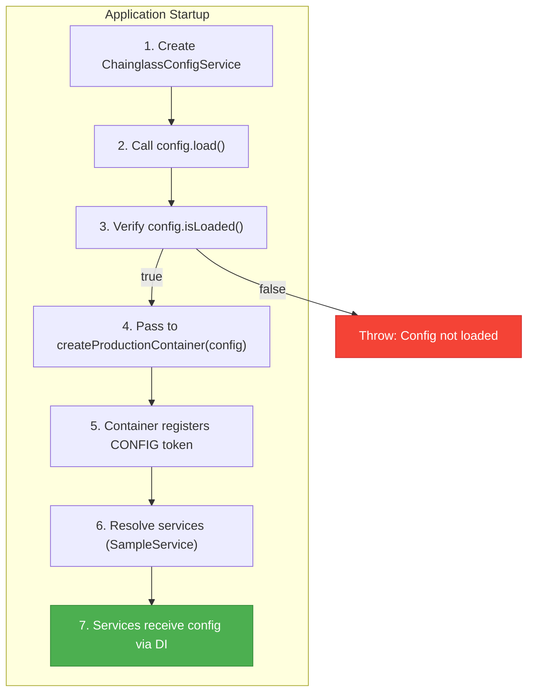
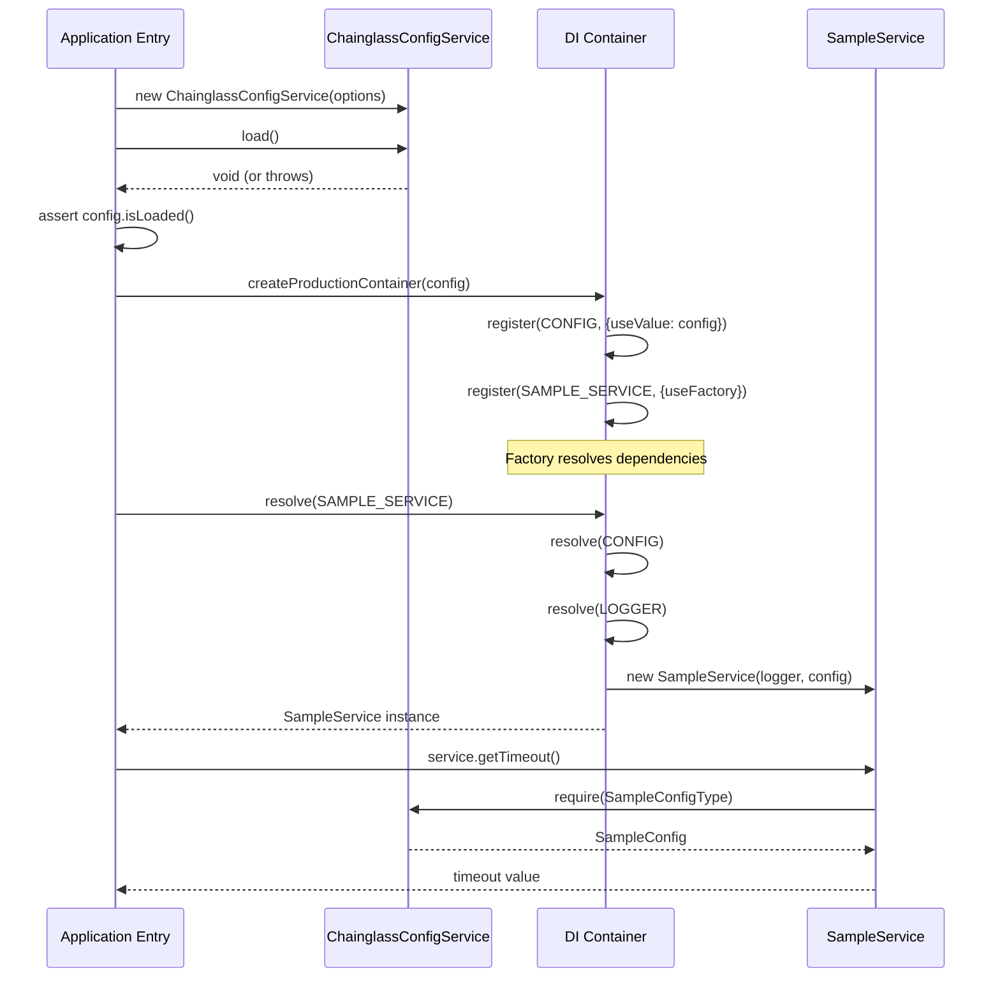

# Phase 4: DI Integration – Tasks & Alignment Brief

**Spec**: [../../config-system-spec.md](../../config-system-spec.md)
**Plan**: [../../config-system-plan.md](../../config-system-plan.md)
**Date**: 2026-01-21

---

## Executive Briefing

### Purpose
This phase wires the production `ChainglassConfigService` (from Phase 3) into the application's dependency injection containers and updates `SampleService` to consume configuration. This is the critical integration point where config becomes available to the rest of the application.

### What We're Building
DI container updates for all three entry points (web, MCP, CLI):
- `DI_TOKENS.CONFIG` registration with `ChainglassConfigService` (production) and `FakeConfigService` (test)
- Updated container factories accepting pre-loaded config parameter (per Critical Discovery 02)
- `SampleService` constructor extended to receive `IConfigService`
- Context-specific test fixtures (`mcpTest`, `cliTest`)

### User Value
Application code can access type-safe configuration via DI injection. Services like `SampleService` receive configuration automatically through the dependency container, enabling runtime behavior customization without code changes.

### Example
**Before (hardcoded)**:
```typescript
export class SampleService {
  private timeout = 30; // hardcoded
}
```

**After (configurable)**:
```typescript
export class SampleService {
  constructor(logger: ILogger, config: IConfigService) {
    const sampleConfig = config.require(SampleConfigType);
    this.timeout = sampleConfig.timeout; // from YAML/env vars
  }
}
```

---

## Objectives & Scope

### Objective
Register `IConfigService` in DI containers and update `SampleService` to consume config values, proving the integration pattern works before wider adoption.

**Behavior Checklist** (from Plan Acceptance Criteria):
- [x] AC-21: `IConfigService` registered in production container via `createProductionContainer()`
- [x] AC-22: `FakeConfigService` registered in test container via `createTestContainer()`
- [x] AC-23: `SampleService` receives `IConfigService` via constructor injection
- [x] AC-24: `SampleService` uses config values (e.g., timeout from SampleConfig)

### Goals

- ✅ Add `DI_TOKENS.CONFIG` to web and MCP DI containers
- ✅ Update `createProductionContainer()` to accept pre-loaded config parameter
- ✅ Update `createTestContainer()` to register `FakeConfigService`
- ✅ Update `SampleService` constructor with `IConfigService` parameter
- ✅ Add `getTimeout()` method to `SampleService` demonstrating config usage
- ✅ Update MCP container (`createMcpProductionContainer`) with config support
- ✅ Add `isLoaded()` guard in container factories
- ✅ Create `mcpTest` and `cliTest` fixtures

### Non-Goals (Scope Boundaries)

- ❌ CLI bootstrap code (no CLI entrypoint exists yet)
- ❌ Domain-specific config types beyond SampleConfig
- ❌ Hot-reloading or config refresh capability
- ❌ Async config loading patterns
- ❌ Config management CLI commands (`cg config get/set`)
- ❌ Remote config sources (cloud secret managers)
- ❌ Modifying existing test infrastructure beyond what's needed for config

---

## Architecture Map

### Component Diagram

```mermaid
flowchart TD
    classDef pending fill:#9E9E9E,stroke:#757575,color:#fff
    classDef inprogress fill:#FF9800,stroke:#F57C00,color:#fff
    classDef completed fill:#4CAF50,stroke:#388E3C,color:#fff
    classDef blocked fill:#F44336,stroke:#D32F2F,color:#fff

    style Phase fill:#F5F5F5,stroke:#E0E0E0
    style WebDI fill:#E3F2FD,stroke:#1976D2
    style McpDI fill:#E8F5E9,stroke:#388E3C
    style Services fill:#FFF3E0,stroke:#F57C00
    style Fixtures fill:#F3E5F5,stroke:#7B1FA2

    subgraph Phase["Phase 4: DI Integration"]
        direction TB
        T000["T000: Add isLoaded() to interface ✓"]:::completed
        T001["T001: Write container tests ✓"]:::completed
        T002["T002: Write SampleService config tests ✓"]:::completed
        T003["T003: Add DI_TOKENS.CONFIG ✓"]:::completed
        T004["T004: Update createProductionContainer ✓"]:::completed
        T005["T005: Update createTestContainer ✓"]:::completed
        T006["T006: Update SampleService constructor ✓"]:::completed
        T007["T007: Add getTimeout to SampleService ✓"]:::completed
        T008["T008: Update MCP container ✓"]:::completed
        T009["T009: Verify MCP config resolution ✓"]:::completed
        T010["T010: Update existing tests ✓"]:::completed
        T011["T011: Add container guard ✓"]:::completed
        T012["T012: Create mcpTest fixture ✓"]:::completed
        T013["T013: Create cliTest fixture ✓"]:::completed
        T014["T014: Create bootstrap example ✓"]:::completed

        T001 --> T003
        T002 --> T006
        T003 --> T004
        T003 --> T005
        T000 --> T011
        T004 --> T011
        T005 --> T010
        T006 --> T007
        T007 --> T010
        T008 --> T009
        T011 --> T014
        T010 --> T012
        T012 --> T013
    end

    subgraph WebDI["Web DI Container"]
        F1["/apps/web/src/lib/di-container.ts ✓"]:::completed
    end

    subgraph McpDI["MCP DI Container"]
        F2["/packages/mcp-server/src/lib/di-container.ts ✓"]:::completed
    end

    subgraph Services["Services"]
        F3["/apps/web/src/services/sample.service.ts ✓"]:::completed
    end

    subgraph Fixtures["Test Fixtures"]
        F4["/test/fixtures/mcp-test.fixture.ts ✓"]:::completed
        F5["/test/fixtures/cli-test.fixture.ts ✓"]:::completed
        F6["/test/unit/web/di-container.test.ts ✓"]:::completed
        F7["/test/unit/web/sample-service.test.ts ✓"]:::completed
    end

    subgraph Shared["Shared Package"]
        F8["/packages/shared/src/interfaces/config.interface.ts ✓"]:::completed
        F9["/packages/shared/src/fakes/fake-config.service.ts ✓"]:::completed
    end

    T000 -.-> F8
    T000 -.-> F9
    T001 -.-> F6
    T002 -.-> F7
    T003 -.-> F1
    T004 -.-> F1
    T005 -.-> F1
    T006 -.-> F3
    T007 -.-> F3
    T008 -.-> F2
    T009 -.-> F2
    T010 -.-> F7
    T011 -.-> F1
    T012 -.-> F4
    T013 -.-> F5
    T014 -.-> F1
```

<!-- Status: grey=pending, orange=in-progress, green=completed, red=blocked -->
<!-- Updated by plan-6 during implementation -->



### Task-to-Component Mapping

<!-- Status: ⬜ Pending | 🟧 In Progress | ✅ Complete | 🔴 Blocked -->

| Task | Component(s) | Files | Status | Comment |
|------|-------------|-------|--------|---------|
| T000 | IConfigService, FakeConfigService | `/packages/shared/src/interfaces/config.interface.ts`, `/packages/shared/src/fakes/fake-config.service.ts` | ✅ Complete | Add isLoaded() method (DYK-15 prerequisite) |
| T001 | DI Container Tests | `/test/unit/web/di-container.test.ts` | ✅ Complete | Write tests for config registration (RED phase) |
| T002 | SampleService Tests | `/test/unit/web/sample-service.test.ts` | ✅ Complete | Write tests for config injection (RED phase) |
| T003 | DI Tokens | `/apps/web/src/lib/di-container.ts` | ✅ Complete | Add CONFIG token |
| T004 | Production Container | `/apps/web/src/lib/di-container.ts` | ✅ Complete | Accept config param, register as value |
| T005 | Test Container | `/apps/web/src/lib/di-container.ts` | ✅ Complete | Register FakeConfigService |
| T006 | SampleService | `/apps/web/src/services/sample.service.ts` | ✅ Complete | Add IConfigService constructor param |
| T007 | SampleService | `/apps/web/src/services/sample.service.ts` | ✅ Complete | Add getTimeout() method |
| T008 | MCP Container | `/packages/mcp-server/src/lib/di-container.ts` | ✅ Complete | Add config registration |
| T009 | MCP Container | `/packages/mcp-server/src/lib/di-container.ts`, `/test/unit/mcp/di-container.test.ts` | ✅ Complete | Verify CONFIG token resolvable (logger is config-independent) |
| T010 | Test Updates | `/test/unit/web/sample-service.test.ts` | ✅ Complete | Update existing tests with FakeConfigService |
| T011 | Container Guard | `/apps/web/src/lib/di-container.ts` | ✅ Complete | Throw if config not loaded |
| T012 | MCP Test Fixture | `/test/fixtures/mcp-test.fixture.ts` | ✅ Complete | Extend serviceTest with MCP defaults |
| T013 | CLI Test Fixture | `/test/fixtures/cli-test.fixture.ts` | ✅ Complete | Extend serviceTest with CLI defaults |
| T014 | Bootstrap Example | `/apps/web/src/lib/bootstrap.ts` | ✅ Complete | Document startup sequence |

---

## Tasks

| Status | ID | Task | CS | Type | Dependencies | Absolute Path(s) | Validation | Subtasks | Notes |
|--------|------|------|-----|------|--------------|------------------|------------|----------|-------|
| [x] | T000 | Add isLoaded() to IConfigService interface and FakeConfigService | 1 | Core | – | `/Users/jordanknight/substrate/chainglass/packages/shared/src/interfaces/config.interface.ts`, `/Users/jordanknight/substrate/chainglass/packages/shared/src/fakes/fake-config.service.ts` | Interface has isLoaded(): boolean, FakeConfigService implements it | – | DYK-15: Prerequisite for T011 guard |
| [x] | T001 | Write tests for DI container config registration | 2 | Test | – | `/Users/jordanknight/substrate/chainglass/test/unit/web/di-container.test.ts` | Tests fail with "CONFIG not registered" (RED phase) | – | Covers AC-21, AC-22 |
| [x] | T002 | Write tests for SampleService with config injection | 2 | Test | – | `/Users/jordanknight/substrate/chainglass/test/unit/web/sample-service.test.ts` | Tests fail with "TypeError: Cannot read config" (RED phase) | – | Covers AC-23, AC-24 |
| [x] | T003 | Add DI_TOKENS.CONFIG to web container | 1 | Core | T001 | `/Users/jordanknight/substrate/chainglass/apps/web/src/lib/di-container.ts` | Token constant exists, TypeScript compiles | – | – |
| [x] | T004 | Update createProductionContainer() to accept config param | 2 | Core | T003 | `/Users/jordanknight/substrate/chainglass/apps/web/src/lib/di-container.ts` | Container accepts IConfigService, registers with useValue | – | Per Critical Discovery 02 |
| [x] | T005 | Update createTestContainer() to register FakeConfigService | 2 | Core | T003 | `/Users/jordanknight/substrate/chainglass/apps/web/src/lib/di-container.ts` | FakeConfigService resolved from test container | – | – |
| [x] | T006 | Update SampleService constructor with IConfigService | 2 | Core | T002 | `/Users/jordanknight/substrate/chainglass/apps/web/src/services/sample.service.ts` | Constructor accepts IConfigService, TypeScript compiles | – | – |
| [x] | T007 | Add getTimeout() method to SampleService | 1 | Core | T006 | `/Users/jordanknight/substrate/chainglass/apps/web/src/services/sample.service.ts` | Method returns config.require(SampleConfigType).timeout | – | Demonstrates config consumption |
| [x] | T008 | Update createMcpProductionContainer() with config | 2 | Core | T003 | `/Users/jordanknight/substrate/chainglass/packages/mcp-server/src/lib/di-container.ts` | MCP container accepts config, registers CONFIG token | – | – |
| [x] | T009 | Verify MCP container resolves config correctly | 2 | Integration | T008 | `/Users/jordanknight/substrate/chainglass/packages/mcp-server/src/lib/di-container.ts`, `/Users/jordanknight/substrate/chainglass/test/unit/mcp/di-container.test.ts` | Integration test confirms CONFIG token resolvable from MCP container | – | DYK-15: Logger is config-independent (no ordering concern) |
| [x] | T010 | Update existing SampleService tests with FakeConfigService | 2 | Test | T005, T007 | `/Users/jordanknight/substrate/chainglass/test/unit/web/sample-service.test.ts` | All existing tests pass, new tests for config behavior | – | – |
| [x] | T011 | Add container factory guard for unloaded config | 1 | Core | T000, T004 | `/Users/jordanknight/substrate/chainglass/apps/web/src/lib/di-container.ts` | Throws descriptive error if config.isLoaded() === false | – | Fail-fast on startup bug |
| [x] | T012 | Create mcpTest fixture | 1 | Test | T010 | `/Users/jordanknight/substrate/chainglass/test/fixtures/mcp-test.fixture.ts` | Fixture provides fakeLogger, fakeConfig with MCP defaults | – | – |
| [x] | T013 | Create cliTest fixture | 1 | Test | T012 | `/Users/jordanknight/substrate/chainglass/test/fixtures/cli-test.fixture.ts` | Fixture provides fakeLogger, fakeConfig with CLI defaults | – | – |
| [x] | T014 | Create bootstrap.ts with documented startup sequence | 1 | Doc | T011 | `/Users/jordanknight/substrate/chainglass/apps/web/src/lib/bootstrap.ts` | Code example shows config → load → container sequence | – | Per Critical Discovery 02 |

---

## Alignment Brief

### Prior Phases Review

#### Phase-by-Phase Summary

**Phase 1: Core Interfaces and Fakes** (Complete 2026-01-21)
- Established `IConfigService` interface with `get<T>()`, `require<T>()`, `set<T>()` methods
- Created `FakeConfigService` with constructor injection and assertion helpers
- Defined `SampleConfigSchema` with Zod validation
- Created contract test factory for implementation parity verification
- Established Test Doc comment pattern (5-field format)
- Created `serviceTest` fixture with auto-injected fakes

**Phase 2: Loading Infrastructure** (Complete 2026-01-21)
- Implemented path resolution: `getUserConfigDir()`, `getProjectConfigDir()`, `ensureUserConfig()`
- Implemented loaders: `loadYamlConfig()`, `parseEnvVars()`, `deepMerge()`, `expandPlaceholders()`
- Implemented validation: `validateNoUnexpandedPlaceholders()`
- Established DYK-05 through DYK-09 patterns for strict validation and no-cache project discovery
- All utilities synchronous per spec mandate

**Phase 3: Production Config Service** (Complete 2026-01-21)
- Implemented `ChainglassConfigService` with seven-phase loading pipeline
- Implemented secret detection: `detectLiteralSecret()`, `validateNoLiteralSecrets()`
- Implemented secrets loading: `loadSecretsToEnv()`
- Established DYK-10 through DYK-14 patterns
- Contract tests pass for both `FakeConfigService` and `ChainglassConfigService`
- 223 total tests passing

#### Cumulative Deliverables

**From Phase 1** (available for import):
```typescript
import {
  IConfigService,
  ConfigType,
  FakeConfigService,
  SampleConfigSchema,
  SampleConfig,
  SampleConfigType,
  ConfigurationError,
  MissingConfigurationError,
  LiteralSecretError,
} from '@chainglass/shared';
```

**From Phase 2** (available for import):
```typescript
import {
  getUserConfigDir,
  getProjectConfigDir,
  ensureUserConfig,
  loadYamlConfig,
  parseEnvVars,
  deepMerge,
  expandPlaceholders,
  validateNoUnexpandedPlaceholders,
} from '@chainglass/shared/config';
```

**From Phase 3** (available for import):
```typescript
import {
  ChainglassConfigService,
  ChainglassConfigServiceOptions,
  loadSecretsToEnv,
  LoadSecretsOptions,
  detectLiteralSecret,
  validateNoLiteralSecrets,
} from '@chainglass/shared/config';
```

**Test Infrastructure** (from all phases):
- Contract test factory: `/test/contracts/config.contract.ts`
- Config fixtures: `/test/helpers/config-fixtures.ts`
- Service test fixture: `/test/fixtures/service-test.fixture.ts`
- Default sample config: `DEFAULT_FIXTURE_SAMPLE_CONFIG`

#### Pattern Evolution

| Pattern | Phase 1 | Phase 2 | Phase 3 | Phase 4 |
|---------|---------|---------|---------|---------|
| Interface-first TDD | Established | Maintained | Maintained | Apply to DI |
| Test Doc comments | Established | Maintained | Maintained | Maintain |
| Fakes over mocks | FakeConfigService | N/A | Contract tests | FakeConfigService in DI |
| Synchronous loading | Spec mandate | All loaders sync | Seven-phase sync | DI registration |

#### Recurring Issues

1. **Environment variable pollution**: Tests must snapshot/restore `process.env` (DYK-11)
2. **`delete process.env.VAR` required**: Can't use `= undefined` (Phase 3 discovery)
3. **Module-level caching avoided**: DYK-06 removed caching to prevent test isolation issues

#### Cross-Phase Learnings

- DYK-01: Fakes trust types, don't validate (Phase 1)
- DYK-05: Strict validation with fail-fast (Phase 2)
- DYK-06: No-cache for project discovery (Phase 2)
- DYK-10: Stripe test keys detected (Phase 3)
- DYK-11: No rollback on pipeline failure (Phase 3)
- DYK-12: FakeConfigService validation divergence is by design (Phase 3)

#### Reusable Test Infrastructure

- `serviceTest` fixture from `/test/fixtures/service-test.fixture.ts`
- `createTestConfigService()` from `/test/helpers/config-fixtures.ts`
- `DEFAULT_FIXTURE_SAMPLE_CONFIG` constant
- `configServiceContractTests()` factory

#### Critical Findings Timeline

| Phase | Finding | Impact |
|-------|---------|--------|
| Plan | Critical Discovery 02: Config loads before container | Drives T004 signature |
| Phase 1 | DYK-01: Fakes don't validate | Test container uses FakeConfigService as-is |
| Phase 2 | DYK-06: No caching | Each container creation is fresh |
| Phase 3 | DYK-11: No rollback | Container guard (T011) catches startup bugs |

### Critical Findings Affecting This Phase

**Critical Discovery 02: DI Lifecycle - Config Loads Before Container**

From plan § 3:
> Config must be fully loaded before any DI resolution. Explicit startup sequence with config as parameter.

**Constraints**:
- `createProductionContainer()` MUST accept pre-loaded `IConfigService` parameter
- Config MUST call `load()` before passing to container
- Container factory SHOULD verify `config.isLoaded() === true`

**Addressed by**: T004 (container signature), T011 (guard), T014 (bootstrap example)

---

### ADR Decision Constraints

**ADR-0002: Exemplar-Driven Development**

- **Decision**: Use static committed exemplar files as ground truth for testing
- **Constraint**: Tests should use `FakeConfigService` (fake pattern) not mocks
- **Addressed by**: T005 (test container), T010 (test updates)

---

### Invariants & Guardrails

| Constraint | Value | Enforcement |
|------------|-------|-------------|
| Config loaded before DI | `config.isLoaded() === true` | T011 guard throws |
| FakeConfigService in tests | Always injected | T005 registration |
| SampleService has config | Constructor param | T006 signature |

---

### Inputs to Read

| Path | Purpose |
|------|---------|
| `/Users/jordanknight/substrate/chainglass/apps/web/src/lib/di-container.ts` | Current DI container structure |
| `/Users/jordanknight/substrate/chainglass/packages/mcp-server/src/lib/di-container.ts` | MCP DI container structure |
| `/Users/jordanknight/substrate/chainglass/apps/web/src/services/sample.service.ts` | SampleService current implementation |
| `/Users/jordanknight/substrate/chainglass/test/fixtures/service-test.fixture.ts` | Existing fixture pattern |
| `/Users/jordanknight/substrate/chainglass/packages/shared/src/config/index.ts` | Phase 3 exports |

---

### Visual Alignment Aids

#### System State Flow



#### Sequence Diagram



---

### Test Plan (Full TDD)

Following Phase 1-3 pattern: Write tests first (RED), implement to pass (GREEN).

#### T001: DI Container Config Registration Tests

| Test | Rationale | Expected Outcome |
|------|-----------|------------------|
| `should resolve IConfigService from production container` | Verifies AC-21 | ConfigService instance returned |
| `should use FakeConfigService in test container` | Verifies AC-22 | FakeConfigService instance |
| `should throw if config not loaded` | Verifies T011 guard | Descriptive error message |
| `should accept pre-loaded config parameter` | Verifies Critical Discovery 02 | No errors |

**Fixture**: Create test config via `ChainglassConfigService` with null dirs.

#### T002: SampleService Config Tests

| Test | Rationale | Expected Outcome |
|------|-----------|------------------|
| `should receive IConfigService via constructor` | Verifies AC-23 | No TypeScript errors |
| `should use timeout from config` | Verifies AC-24 | Returns config value |
| `should use default when config not set` | Edge case | Returns schema default |
| `should handle disabled state from config` | Feature test | isEnabled() returns false |

**Fixture**: Use `FakeConfigService` with pre-set values.

---

### Step-by-Step Implementation Outline

1. **T001-T002** (RED): Write failing tests for DI and SampleService
2. **T003**: Add `DI_TOKENS.CONFIG` constant
3. **T004-T005**: Update container factories (production + test)
4. **T006-T007**: Update SampleService with config injection
5. **T008-T009**: Update MCP container and verify startup
6. **T010**: Update existing tests to pass with FakeConfigService
7. **T011**: Add container guard for unloaded config
8. **T012-T013**: Create context-specific fixtures
9. **T014**: Document bootstrap sequence

---

### Commands to Run

```bash
# Environment setup
cd /Users/jordanknight/substrate/chainglass

# Run specific test file
pnpm test -- --run test/unit/web/di-container.test.ts
pnpm test -- --run test/unit/web/sample-service.test.ts

# Run all tests
pnpm test -- --run

# Quality check (lint + typecheck + test)
just check

# TypeScript check only
pnpm tsc --noEmit

# Lint check only
pnpm biome check .
```

---

### Risks/Unknowns

| Risk | Severity | Mitigation |
|------|----------|------------|
| SampleService tests may have implicit dependencies | Medium | Review all existing tests before modification |
| MCP startup order complexity | Medium | Integration test in T009 verifies order |
| Breaking change to createProductionContainer signature | Low | All callers in same repo, update together |

---

### Ready Check

- [x] ADR constraints mapped to tasks (ADR-0002 fakes-only → T005, T010)
- [x] Prior phase reviews complete (Phase 1, 2, 3)
- [x] Critical Discovery 02 addressed (T004, T011, T014)
- [x] All task dependencies clear
- [x] Test plan covers acceptance criteria
- [x] Inputs to read identified
- [x] Commands documented

**GO/NO-GO**: ✅ COMPLETE - All tasks implemented and tests passing

---

## Phase Footnote Stubs

_Footnotes will be added during implementation by plan-6a-update-progress._

| Footnote | Task | Description | FlowSpace Node ID |
|----------|------|-------------|-------------------|
| | | | |

---

## Evidence Artifacts

**Execution Log**: `./execution.log.md` (created by plan-6)

**Test Evidence**:
- `/test/unit/web/di-container.test.ts` — DI container tests
- `/test/unit/web/sample-service.test.ts` — SampleService tests
- `/test/unit/mcp/di-container.test.ts` — MCP container tests

---

## Discoveries & Learnings

_Populated during implementation by plan-6. Log anything of interest to your future self._

| Date | Task | Type | Discovery | Resolution | References |
|------|------|------|-----------|------------|------------|
| | | | | | |

---

## Critical Insights Discussion

**Session**: 2026-01-22
**Context**: Phase 4: DI Integration - Tasks & Alignment Brief
**Analyst**: AI Clarity Agent
**Reviewer**: Development Team
**Format**: Water Cooler Conversation (5 Critical Insights)

### DYK-15: isLoaded() Guard Requires Interface Change

**Did you know**: Task T011's guard (`config.isLoaded() === false`) assumes a method that doesn't exist on the IConfigService interface - only ChainglassConfigService has it.

**Implications**:
- Container guard code would fail TypeScript compilation
- T011 cannot be implemented as specified without interface change
- FakeConfigService lacks the method entirely

**Options Considered**:
- Option A: Add isLoaded() to IConfigService interface - **CHOSEN**
- Option B: Use duck-typing check at runtime
- Option C: Skip the guard entirely

**AI Recommendation**: Option A
- Reasoning: Formalizes existing practice (ChainglassConfigService already has it), enables type-safe T011

**Discussion Summary**: User agreed. Adding isLoaded() to interface is trivial and enables the guard as planned.

**Decision**: Add `isLoaded(): boolean` to IConfigService interface and implement in FakeConfigService

**Action Items**:
- [x] Added T000 task as prerequisite for T011
- [x] Updated T011 dependencies to include T000
- [x] Updated architecture map with T000

**Affects**: IConfigService interface, FakeConfigService, T011 dependencies

---

### DYK-16: SampleService Tests Will Break (Required Parameter Chosen)

**Did you know**: Adding IConfigService to SampleService's constructor breaks all 3 existing tests, but we chose explicit required parameter over optional.

**Implications**:
- TypeScript compilation fails at test beforeEach and DI factories
- 5 locations need updating (1 test file + 2 DI factories)
- TDD RED phase will surface these immediately

**Options Considered**:
- Option A: Required config parameter, update all tests - **CHOSEN**
- Option B: Optional config parameter with default
- Option C: Migrate tests to serviceTest fixture

**AI Recommendation**: Option A
- Reasoning: Config is a real dependency; explicit is better than implicit

**Discussion Summary**: User agreed that running tests will show problems. Required parameter enforces correct usage.

**Decision**: Required `IConfigService` parameter on SampleService constructor

**Action Items**:
- [ ] T006 updates constructor (will break compilation - expected)
- [ ] T010 updates tests with FakeConfigService

**Affects**: SampleService, sample-service.test.ts, di-container.ts factories

---

### DYK-17: DI Container Signature Change Has Minimal Blast Radius

**Did you know**: `createProductionContainer()` and `createMcpProductionContainer()` are never called in production code - only from 1 test file.

**Implications**:
- "Breaking change" only breaks 1 test file for web container
- MCP production code doesn't use its container factory yet
- T014 (bootstrap.ts) will be first production caller

**Options Considered**:
- Option A: Required config parameter (as planned) - **CHOSEN**
- Option B: Optional parameter
- Option C: New function alongside old

**AI Recommendation**: Option A
- Reasoning: Clean API, enables T011 guard, minimal blast radius confirmed

**Discussion Summary**: User agreed and requested same pattern for MCP container for consistency.

**Decision**: Required `IConfigService` parameter on both web and MCP containers

**Action Items**:
- [ ] T004: Update web container signature
- [ ] T008: Update MCP container signature (same pattern)

**Affects**: di-container.ts (web), di-container.ts (MCP)

---

### DYK-18: MCP Logger Is Config-Independent (No Ordering Concern)

**Did you know**: T009 "Verify MCP startup sequence (config before logger)" solves a problem that doesn't exist - PinoLoggerAdapter.createForStderr() takes zero parameters.

**Implications**:
- No circular dependency risk between config and logger
- Logger doesn't read from config (hardcoded stderr)
- T009's original concern is already satisfied by design

**Options Considered**:
- Option A: Keep T009 but simplify scope - **CHOSEN**
- Option B: Remove T009 entirely
- Option C: Expand T009 for future config-based logging

**AI Recommendation**: Option A
- Reasoning: Keep verification but reframe as "config resolution works"

**Discussion Summary**: User agreed to simplify T009 scope.

**Decision**: Reframe T009 as "Verify MCP container resolves config correctly"

**Action Items**:
- [x] Updated T009 description and validation criteria
- [x] Updated architecture map label
- [x] Added note: "Logger is config-independent"

**Affects**: T009 task description

---

### DYK-19: Context-Specific Fixtures Created for Future-Proofing

**Did you know**: mcpTest and cliTest fixtures (T012, T013) would be identical wrappers of serviceTest since no context-specific config schemas exist.

**Implications**:
- No MCP-specific or CLI-specific config schemas in codebase
- FakeLogger and FakeConfigService are context-agnostic
- Fixtures would literally re-export serviceTest

**Options Considered**:
- Option A: Create context-specific fixtures anyway - **CHOSEN**
- Option B: Use single serviceTest for all contexts
- Option C: Defer fixture creation to when schemas exist

**AI Recommendation**: Option B or C (remove/defer)
- Reasoning: YAGNI - creating empty wrappers adds no value now

**Discussion Summary**: User chose Option A for future-proofing. Infrastructure ready when schemas are added.

**Decision**: Create mcpTest and cliTest as thin wrappers (T012, T013 unchanged)

**Action Items**:
- [ ] T012: Create mcpTest fixture
- [ ] T013: Create cliTest fixture

**Affects**: No task changes needed

---

## Session Summary

**Insights Surfaced**: 5 critical insights identified and discussed (DYK-15 through DYK-19)
**Decisions Made**: 5 decisions reached through collaborative discussion
**Action Items Created**: 8 follow-up items (3 already completed via task updates)
**Areas Updated**:
- Added T000 (isLoaded interface change) as new prerequisite task
- Updated T009 scope and description
- Updated T011 dependencies
- Updated architecture map

**Shared Understanding Achieved**: ✓

**Confidence Level**: High - Key assumptions validated against codebase

**Next Steps**:
Run `/plan-6-implement-phase --phase "Phase 4: DI Integration"` to begin implementation

**Notes**:
- All 5 verification subagents confirmed findings before discussion
- User chose explicit/required patterns over optional/implicit consistently
- Future-proofing preferred over YAGNI for fixtures

**Types**: `gotcha` | `research-needed` | `unexpected-behavior` | `workaround` | `decision` | `debt` | `insight`

**What to log**:
- Things that didn't work as expected
- External research that was required
- Implementation troubles and how they were resolved
- Gotchas and edge cases discovered
- Decisions made during implementation
- Technical debt introduced (and why)
- Insights that future phases should know about

_See also: `execution.log.md` for detailed narrative._

---

## Directory Layout

```
docs/plans/004-config/
├── config-system-spec.md
├── config-system-plan.md
└── tasks/
    ├── phase-1-development-exemplar/
    │   ├── tasks.md
    │   └── execution.log.md
    ├── phase-2-path-resolution-loaders/
    │   ├── tasks.md
    │   └── execution.log.md
    ├── phase-3-production-config-service/
    │   ├── tasks.md
    │   └── execution.log.md
    └── phase-4-di-integration/
        ├── tasks.md                 # ← This file
        └── execution.log.md         # ← Created by plan-6
```
