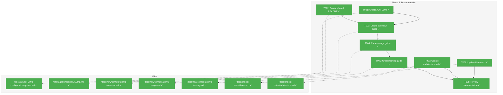
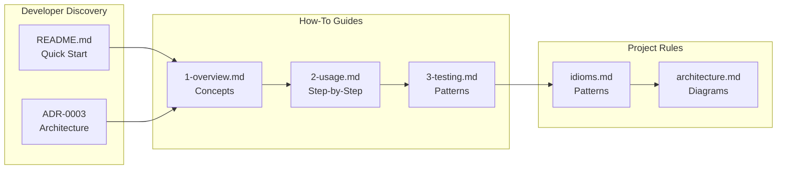
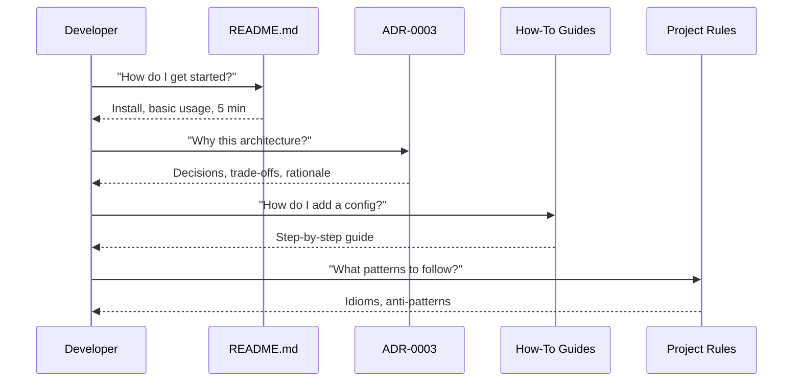

# Phase 5: Documentation – Tasks & Alignment Brief

**Spec**: [../config-system-spec.md](../config-system-spec.md)
**Plan**: [../config-system-plan.md](../config-system-plan.md)
**Date**: 2026-01-22
**Phase Slug**: phase-5-documentation

---

## Executive Briefing

### Purpose
This phase documents the complete Chainglass configuration system implemented across Phases 1-4. It creates the ADR, README, how-to guides, and updates project rules so developers can confidently use, extend, and test configuration in their services.

### What We're Building
A complete documentation suite that includes:
- **ADR-0003**: Architecture Decision Record capturing the typed object registry pattern with Zod validation
- **How-to guides**: Step-by-step guides for adding config types, consuming config in services, and testing with FakeConfigService
- **Updated project rules**: Configuration idioms added to `idioms.md` and config service added to `architecture.md` component diagrams
- **Package README**: Quick-start usage in `packages/shared/README.md`

### User Value
Developers can onboard to the configuration system in under 5 minutes using the README, understand architectural decisions through the ADR, follow proven patterns from how-to guides, and ensure consistency via updated idioms.

### Example
**Before**: New developer asks "How do I add a config option?" → hunts through code
**After**: Developer reads `docs/how/configuration/2-usage.md` → follows step-by-step guide → working in 10 minutes

---

## Objectives & Scope

### Objective
Document the configuration system per plan Phase 5 acceptance criteria. All documentation must be complete, accurate, and peer-reviewable.

### Goals

- ADR-0003 documents all architecture decisions (typed registry, Zod validation, seven-phase pipeline)
- README enables quick-start in <5 minutes
- How-to guides cover: adding new config types, consuming config, testing patterns
- All links validated, no broken references
- Updated idioms.md with configuration patterns
- Updated architecture.md with config service in component diagram

### Non-Goals (Scope Boundaries)

- No code changes (Phases 1-4 complete the implementation)
- No new features or config options
- No migration guides (first implementation, nothing to migrate from)
- No performance tuning documentation (load() is <100ms per Phase 3)
- No internationalization of documentation

---

## Architecture Map

### Component Diagram
<!-- Status: grey=pending, orange=in-progress, green=completed, red=blocked -->
<!-- Updated by plan-6 during implementation -->



### Task-to-Component Mapping

<!-- Status: Pending | In Progress | Complete | Blocked -->

| Task | Component(s) | Files | Status | Comment |
|------|-------------|-------|--------|---------|
| T001 | ADR | /docs/adr/adr-0003-configuration-system.md | ✅ Complete | Architecture decisions from Phases 1-4 |
| T002 | Package README | /packages/shared/README.md | ✅ Complete | Quick-start usage guide |
| T003 | How-to Guide | /docs/how/configuration/1-overview.md | ✅ Complete | System overview with architecture diagram |
| T004 | How-to Guide | /docs/how/configuration/2-usage.md | ✅ Complete | Step-by-step usage guide |
| T005 | How-to Guide | /docs/how/configuration/3-testing.md | ✅ Complete | Testing patterns with FakeConfigService |
| T006 | Project Rules | /docs/project-rules/idioms.md | ✅ Complete | Add configuration patterns section |
| T007 | Architecture | /docs/project-rules/architecture.md | ✅ Complete | Add config service to diagrams |
| T008 | Review | All documentation files | ✅ Complete | Peer review, link validation |

---

## Tasks

| Status | ID | Task | CS | Type | Dependencies | Absolute Path(s) | Validation | Subtasks | Notes |
|--------|------|------|-----|------|--------------|------------------|------------|----------|-------|
| [x] | T001 | Create ADR-0003 documenting configuration system architecture | 2 | Doc | – | /Users/jordanknight/substrate/chainglass/docs/adr/adr-0003-configuration-system.md | ADR follows template; covers: typed registry, Zod validation, seven-phase pipeline, DI integration | – | Use ADR-0001 as format exemplar |
| [x] | T002 | Create packages/shared README with quick-start | 2 | Doc | – | /Users/jordanknight/substrate/chainglass/packages/shared/README.md | README enables quick-start in <5 minutes; includes: install, basic usage, config schema example | – | New file creation |
| [x] | T003 | Create docs/how/configuration/1-overview.md | 2 | Doc | T001, T002 | /Users/jordanknight/substrate/chainglass/docs/how/configuration/1-overview.md | Architecture diagram, key concepts, when to use config | – | Create directory if needed |
| [x] | T004 | Create docs/how/configuration/2-usage.md | 2 | Doc | T003 | /Users/jordanknight/substrate/chainglass/docs/how/configuration/2-usage.md | Step-by-step: adding new config type, consuming in service, env overrides, secrets | – | – |
| [x] | T005 | Create docs/how/configuration/3-testing.md | 2 | Doc | T004 | /Users/jordanknight/substrate/chainglass/docs/how/configuration/3-testing.md | FakeConfigService patterns, contract tests, serviceTest fixture usage | – | – |
| [x] | T006 | Update docs/project-rules/idioms.md with configuration section | 1 | Doc | – | /Users/jordanknight/substrate/chainglass/docs/project-rules/idioms.md | New section "13. Configuration Idiom" with schema, service consumption, testing patterns | – | Add to USER CONTENT section |
| [x] | T007 | Update docs/project-rules/architecture.md with config service | 1 | Doc | – | /Users/jordanknight/substrate/chainglass/docs/project-rules/architecture.md | Config service added to: § 2.2 Package Responsibilities, § 3.1 Layer Diagram, § 4.1 Container Pattern | – | Modify existing diagrams |
| [x] | T008 | Review all documentation and validate links | 1 | Review | T003, T004, T005, T006, T007 | All documentation files created/modified | All links work, no broken references, consistent formatting, peer-reviewable quality | – | Final quality gate |

---

## Alignment Brief

### Prior Phases Review

#### Phase-by-Phase Summary

**Phase 1: Core Interfaces and Fakes** (Complete 2026-01-21)
- Established `IConfigService` interface following `ILogger`/`FakeLogger` exemplar pattern
- Created `FakeConfigService` with constructor injection for easy test setup
- Defined `SampleConfig` Zod schema as exemplar for future config types
- Created contract test factory `configServiceContractTests()` ensuring fake-real parity
- Added `serviceTest` Vitest fixture for zero-boilerplate testing
- 21 new tests (87 total after phase)

**Phase 2: Loading Infrastructure** (Complete 2026-01-21)
- Implemented path resolution: `getUserConfigDir()`, `getProjectConfigDir()`
- Created loaders: `loadYamlConfig()`, `parseEnvVars()`, `deepMerge()`, `expandPlaceholders()`
- Added `validateNoUnexpandedPlaceholders()` for fail-fast validation
- Established strict env var parsing with depth limits (MAX_DEPTH = 4)
- Created config.yaml template for first-run experience
- 62 new tests (149 total after phase)

**Phase 3: Production Config Service** (Complete 2026-01-21)
- Implemented `ChainglassConfigService` with seven-phase loading pipeline
- Added transactional loading (FIX-006): secrets committed only after validation
- Created `detectLiteralSecret()` for 5 secret patterns (OpenAI, GitHub, Slack, Stripe, AWS)
- Added `validateNoLiteralSecrets()` for security validation
- Performance: load() at 0.83ms typical (well under 100ms gate)
- 80 new tests (223 total after phase)

**Phase 4: DI Integration** (Complete 2026-01-22)
- Added `DI_TOKENS.CONFIG` and `MCP_DI_TOKENS.CONFIG` tokens
- Updated `createProductionContainer(config)` to require pre-loaded config
- Updated `SampleService` with `IConfigService` constructor injection
- Created `bootstrap()` function documenting startup sequence
- Added `mcpTest` and `cliTest` Vitest fixtures
- 15 new tests (238 total after phase)

#### Cumulative Deliverables

**Source Files** (organized by phase):
- Phase 1:
  - `/packages/shared/src/interfaces/config.interface.ts` - IConfigService, ConfigType<T>
  - `/packages/shared/src/config/schemas/sample.schema.ts` - SampleConfigSchema, SampleConfigType
  - `/packages/shared/src/fakes/fake-config.service.ts` - FakeConfigService
  - `/packages/shared/src/config/exceptions.ts` - ConfigurationError, MissingConfigurationError, LiteralSecretError
- Phase 2:
  - `/packages/shared/src/config/paths/user-config.ts` - getUserConfigDir(), ensureUserConfig()
  - `/packages/shared/src/config/paths/project-config.ts` - getProjectConfigDir()
  - `/packages/shared/src/config/loaders/yaml.loader.ts` - loadYamlConfig()
  - `/packages/shared/src/config/loaders/env.parser.ts` - parseEnvVars()
  - `/packages/shared/src/config/loaders/deep-merge.ts` - deepMerge()
  - `/packages/shared/src/config/loaders/expand-placeholders.ts` - expandPlaceholders(), validateNoUnexpandedPlaceholders()
  - `/packages/shared/src/config/templates/config.yaml` - First-run template
- Phase 3:
  - `/packages/shared/src/config/chainglass-config.service.ts` - ChainglassConfigService
  - `/packages/shared/src/config/security/secret-detection.ts` - detectLiteralSecret(), validateNoLiteralSecrets()
  - `/packages/shared/src/config/loaders/secrets.loader.ts` - loadSecretsToEnv(), loadSecretsToPending(), commitPendingSecrets()
- Phase 4:
  - `/apps/web/src/lib/di-container.ts` - Updated with DI_TOKENS.CONFIG
  - `/packages/mcp-server/src/lib/di-container.ts` - Updated with MCP_DI_TOKENS.CONFIG
  - `/apps/web/src/services/sample.service.ts` - Updated with IConfigService injection
  - `/apps/web/src/lib/bootstrap.ts` - Startup sequence documentation

**Test Infrastructure**:
- `/test/contracts/config.contract.ts` - Contract test factory
- `/test/helpers/config-fixtures.ts` - createTestConfigService()
- `/test/fixtures/service-test.fixture.ts` - serviceTest extended test
- `/test/fixtures/mcp-test.fixture.ts` - mcpTest extended test
- `/test/fixtures/cli-test.fixture.ts` - cliTest extended test

**Key APIs for Documentation**:
```typescript
// IConfigService interface
interface IConfigService {
  get<T>(type: ConfigType<T>): T | undefined;
  require<T>(type: ConfigType<T>): T;
  set<T>(type: ConfigType<T>, config: T): void;
  isLoaded(): boolean;
}

// ConfigType interface
interface ConfigType<T> {
  readonly configPath: string;
  parse(raw: unknown): T;
}

// Production usage
const config = new ChainglassConfigService({ userConfigDir, projectConfigDir });
config.load();
const container = createProductionContainer(config);
const sampleConfig = config.require(SampleConfigType);

// Test usage
const fakeConfig = new FakeConfigService({ sample: { enabled: true, timeout: 60, name: 'test' } });
const service = new SampleService(fakeLogger, fakeConfig);
```

#### Pattern Evolution Across Phases

| Aspect | Phase 1 | Phase 2 | Phase 3 | Phase 4 |
|--------|---------|---------|---------|---------|
| Interface | IConfigService defined | Loaders consume interface | ChainglassConfigService implements | DI containers register |
| Testing | FakeConfigService + contract tests | Temp directories + env isolation | Integration tests + performance | serviceTest/mcpTest fixtures |
| Validation | Type-level only | Placeholder validation | Full pipeline + secret detection | DI factory guards |
| Error handling | MissingConfigurationError | ConfigurationError | LiteralSecretError | Structured error logging |

#### Recurring Technical Decisions

1. **Fakes over mocks**: Every phase used `FakeConfigService` or `FakeLogger`, never `vi.mock()`
2. **TDD discipline**: RED → GREEN → REFACTOR followed consistently
3. **Fail-fast validation**: All errors thrown with actionable messages
4. **Synchronous operations**: All file I/O synchronous per startup requirements
5. **Test isolation**: Fresh containers/fakes per test, no shared state

#### Key Log References for Documentation

| Topic | Execution Log | Key Insight |
|-------|---------------|-------------|
| Interface design | Phase 1 T003 | `isLoaded()` added for DI factory guards |
| Env parsing | Phase 2 T010 | MAX_DEPTH = 4 prevents DoS via nested keys |
| Transactional loading | Phase 3 T007/T008 | FIX-006: Secrets only committed after validation |
| DI integration | Phase 4 T003-T005 | Config passed as value, not created in factory |
| Bootstrap pattern | Phase 4 T014 | `bootstrap()` function documents startup sequence |

### Critical Findings Affecting This Phase

| Finding | Impact on Documentation |
|---------|------------------------|
| Critical Discovery 01 (Zod pattern) | Document `z.infer<typeof Schema>` pattern in usage guide |
| Critical Discovery 02 (DI lifecycle) | Document startup sequence in overview and architecture |
| Critical Discovery 04 (Placeholder validation) | Document `validateNoUnexpandedPlaceholders()` in usage guide |
| Critical Discovery 05 (Secret detection) | Document secret patterns and whitelist in testing guide |
| DYK-01 (Fake validation) | Document that FakeConfigService trusts types |
| FIX-006 (Transactional loading) | Document in ADR consequences section |

### Invariants & Guardrails

- Documentation must be accurate to implemented code (no aspirational content)
- All code examples must be runnable (copy-paste ready)
- Links must resolve (validated in T008)
- No time estimates in documentation

### Inputs to Read

| Input | Purpose |
|-------|---------|
| `/docs/adr/adr-0001-mcp-tool-design-patterns.md` | ADR format exemplar |
| `/docs/adr/adr-0002-exemplar-driven-development.md` | ADR content exemplar |
| `/docs/project-rules/idioms.md` | Idioms format and existing patterns |
| `/docs/project-rules/architecture.md` | Architecture format and diagrams |
| Phase 1-4 execution.log.md files | Implementation decisions to document |
| Existing source files | Accurate API documentation |

### Visual Alignment Aids

#### Documentation Flow



#### Document Responsibility Matrix



### Test Plan

**This phase is documentation-only** - no code tests required.

**Validation approach**:
1. **Link validation**: Use `markdown-link-check` or manual verification
2. **Code example validation**: All TypeScript examples should compile
3. **Peer review**: Review against checklist before marking complete

### Step-by-Step Implementation Outline

| Step | Task | Action | Validation |
|------|------|--------|------------|
| 1 | T001 | Create ADR-0003 following ADR-0001 format | ADR has all sections: Status, Context, Decision, Consequences, Alternatives |
| 2 | T002 | Create packages/shared/README.md | README has: installation, quick-start, basic example |
| 3 | T003 | Create docs/how/configuration/1-overview.md | Has: architecture diagram, key concepts, precedence table |
| 4 | T004 | Create docs/how/configuration/2-usage.md | Has: adding config type, consuming in service, env overrides, secrets |
| 5 | T005 | Create docs/how/configuration/3-testing.md | Has: FakeConfigService, contract tests, serviceTest fixture |
| 6 | T006 | Update idioms.md with configuration section | Section 13 added with patterns |
| 7 | T007 | Update architecture.md with config service | Diagrams updated, package responsibilities updated |
| 8 | T008 | Review all documentation | All links work, formatting consistent |

### Commands to Run

```bash
# Navigate to project root
cd /Users/jordanknight/substrate/chainglass

# Create how-to directory if needed
mkdir -p docs/how/configuration

# Validate links (if markdown-link-check installed)
npx markdown-link-check docs/how/configuration/*.md
npx markdown-link-check docs/adr/adr-0003-*.md
npx markdown-link-check packages/shared/README.md

# Run existing tests to ensure no regressions
pnpm test --run

# Type-check to ensure code examples are valid
pnpm typecheck
```

### Risks/Unknowns

| Risk | Severity | Mitigation |
|------|----------|------------|
| Documentation drift from implementation | Medium | Use actual source code as reference, copy real examples |
| Missing edge cases in guides | Low | Refer to Phase 1-4 execution logs for discovered gotchas |
| Broken links over time | Low | Include link validation in CI (future) |

### Ready Check

- [x] Prior phases reviewed (Phases 1-4 complete with 238 passing tests)
- [x] Critical findings mapped to documentation sections
- [x] ADR format exemplar identified (ADR-0001)
- [x] Idioms format reviewed (current has 12 sections)
- [x] Architecture format reviewed (current has 11 sections)
- [ ] ADR constraints mapped to tasks - N/A (no ADRs constrain this phase)

---

## Phase Footnote Stubs

_This section will be populated during implementation by plan-6a-update-progress._

| Footnote | Description | Related Task | Date |
|----------|-------------|--------------|------|
| | | | |

---

## Evidence Artifacts

**Execution Log**: `phase-5-documentation/execution.log.md`
- Created by plan-6 during implementation
- Records decisions, deviations, and discoveries

**Created Files**:
- `/docs/adr/adr-0003-configuration-system.md`
- `/packages/shared/README.md`
- `/docs/how/configuration/1-overview.md`
- `/docs/how/configuration/2-usage.md`
- `/docs/how/configuration/3-testing.md`

**Modified Files**:
- `/docs/adr/README.md` (add ADR-0003 to index)
- `/docs/project-rules/idioms.md` (add section 13)
- `/docs/project-rules/architecture.md` (update diagrams)

---

## Discoveries & Learnings

_Populated during implementation by plan-6. Log anything of interest to your future self._

| Date | Task | Type | Discovery | Resolution | References |
|------|------|------|-----------|------------|------------|
| | | | | | |

**Types**: `gotcha` | `research-needed` | `unexpected-behavior` | `workaround` | `decision` | `debt` | `insight`

**What to log**:
- Documentation patterns that worked well
- Areas where implementation details were unclear
- Cross-references discovered between phases
- Formatting decisions made
- Future documentation improvements identified

_See also: `execution.log.md` for detailed narrative._

---

## Directory Layout

```
docs/plans/004-config/
  ├── config-system-spec.md
  ├── config-system-plan.md
  └── tasks/
      ├── phase-1-core-interfaces-and-fakes/
      │   ├── tasks.md
      │   └── execution.log.md
      ├── phase-2-loading-infrastructure/
      │   ├── tasks.md
      │   └── execution.log.md
      ├── phase-3-production-config-service/
      │   ├── tasks.md
      │   └── execution.log.md
      ├── phase-4-di-integration/
      │   ├── tasks.md
      │   └── execution.log.md
      └── phase-5-documentation/
          ├── tasks.md                 # (this file)
          └── execution.log.md         # created by plan-6
```

---

**STOP**: Do **not** edit code or create documentation. Output this `tasks.md` and wait for human **GO**.
