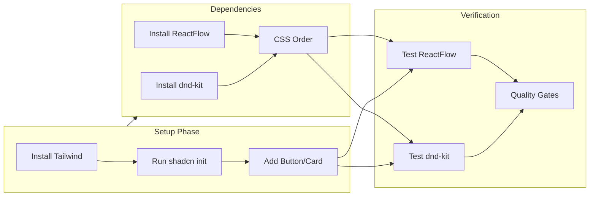
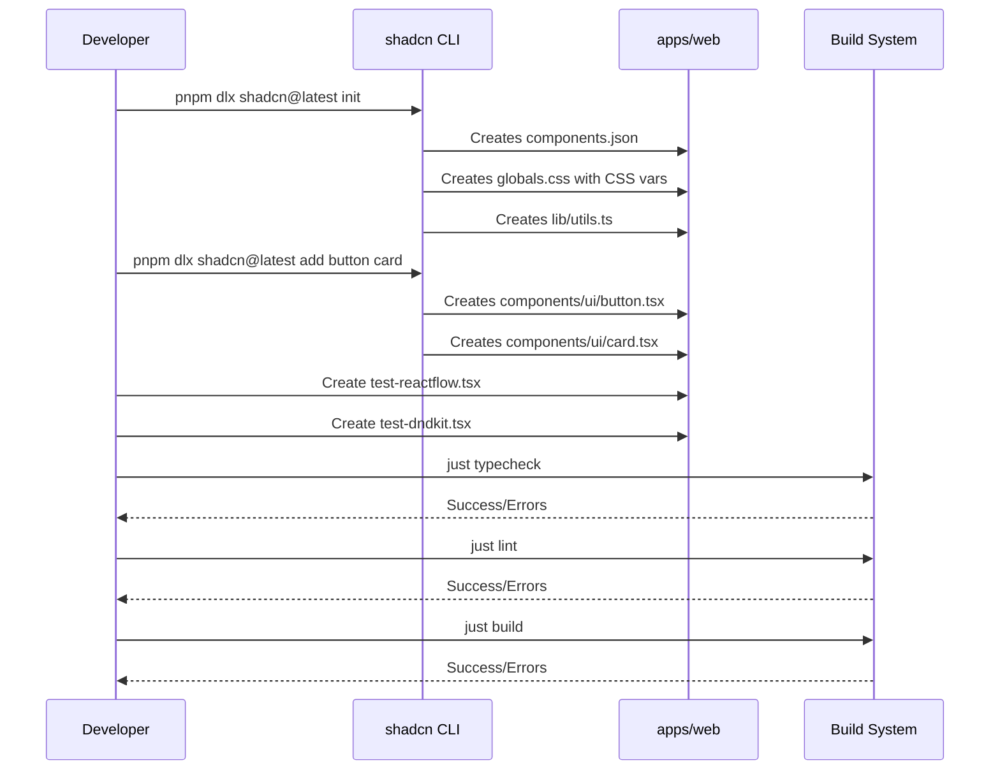

# Phase 1: Foundation & Compatibility Verification – Tasks & Alignment Brief

**Spec**: [../../web-slick-spec.md](../../web-slick-spec.md)
**Plan**: [../../web-slick-plan.md](../../web-slick-plan.md)
**Date**: 2026-01-22
**Phase Slug**: `phase-1-foundation-compatibility-verification`

---

## Executive Briefing

### Purpose

This phase establishes the UI foundation for the Chainglass web dashboard by initializing shadcn/ui, Tailwind CSS, and verifying that all key dependencies (ReactFlow, dnd-kit, next-themes) work correctly with React 19. Without this foundation, subsequent phases cannot build the professional dashboard UI.

### What We're Building

A fully configured web app foundation that:
- Has Tailwind CSS 4 + shadcn/ui installed and working
- Includes base shadcn components (Button, Card) ready for use
- Has verified compatibility with ReactFlow v12.7+ and dnd-kit v6.x on React 19
- Establishes correct CSS import order (ReactFlow before Tailwind)
- Provides feature flags for progressive rollout

### User Value

Developers can immediately start building polished UI components with consistent styling. The foundation guarantees that the complex visualization libraries (ReactFlow, dnd-kit) work without peer dependency conflicts, preventing costly late-stage discovery of compatibility issues.

### Example

**Before**: `apps/web/app/page.tsx` displays "Chainglass test" placeholder.

**After**:
- `npx shadcn@latest add button` works correctly
- `import { Button } from '@/components/ui/button'` renders styled button
- `import ReactFlow from '@xyflow/react'` compiles and renders without errors
- `import { DndContext } from '@dnd-kit/core'` works in client components

---

## Objectives & Scope

### Objective

Initialize the UI framework foundation and verify React 19 compatibility with all new dependencies, establishing the base for all subsequent dashboard development.

**Behavior Checklist (from Plan Acceptance Criteria)**:
- [x] Tailwind classes render correctly in browser (verified via build success)
- [x] shadcn Button and Card components render (components created, build passes)
- [x] ReactFlow minimal graph renders without errors (verification component created, compiles)
- [x] dnd-kit DndContext works in client component (verification component created with "use client")
- [x] CSS import order documented (layout.tsx has ReactFlow CSS before globals.css with comment)
- [x] All quality gates pass (238 tests, lint, typecheck, build)

### Goals

- ✅ Initialize Tailwind CSS with postcss and autoprefixer
- ✅ Initialize shadcn/ui with CSS variables and slate base color
- ✅ Add base shadcn components (Button, Card)
- ✅ Verify ReactFlow v12.7+ compatibility with React 19
- ✅ Verify dnd-kit v6.x compatibility with React 19
- ✅ Establish CSS import order in layout.tsx (ReactFlow first)
- ✅ Create feature flags infrastructure
- ✅ Pass all quality gates (typecheck, lint, build)

### Non-Goals

- ❌ Theme switching (Phase 2)
- ❌ Sidebar navigation (Phase 3)
- ❌ Headless hooks implementation (Phase 4)
- ❌ SSE infrastructure (Phase 5)
- ❌ Demo pages (Phase 6)
- ❌ Writing comprehensive tests (foundation setup doesn't require TDD - verification is sufficient)
- ❌ Production-ready feature flags with remote config (simple env-based flags sufficient)
- ❌ ReactFlow or dnd-kit business logic (just verify imports work)
- ❌ cmdk update (deferred - only needed if Command component added later)

---

## Architecture Map

### Component Diagram

```mermaid
flowchart TD
    classDef pending fill:#9E9E9E,stroke:#757575,color:#fff
    classDef inprogress fill:#FF9800,stroke:#F57C00,color:#fff
    classDef completed fill:#4CAF50,stroke:#388E3C,color:#fff
    classDef blocked fill:#F44336,stroke:#D32F2F,color:#fff

    style Phase fill:#F5F5F5,stroke:#E0E0E0
    style Config fill:#F5F5F5,stroke:#E0E0E0
    style Components fill:#F5F5F5,stroke:#E0E0E0
    style Verification fill:#F5F5F5,stroke:#E0E0E0

    subgraph Phase["Phase 1: Foundation Setup"]
        T001["T001: Init Tailwind ✓"]:::completed
        T002["T002: Init shadcn ✓"]:::completed
        T003["T003: Add components ✓"]:::completed
        T004["T004: Install ReactFlow ✓"]:::completed
        T005["T005: Install dnd-kit ✓"]:::completed
        T006["T006: CSS import order ✓"]:::completed
        T007["T007: Feature flags ✓"]:::completed
        T008["T008: Verify ReactFlow ✓"]:::completed
        T009["T009: Verify dnd-kit ✓"]:::completed
        T010["T010: Quality gates ✓"]:::completed

        T001 --> T002
        T002 --> T003
        T004 --> T006
        T005 --> T006
        T006 --> T008
        T006 --> T009
        T003 --> T008
        T003 --> T009
        T008 --> T010
        T009 --> T010
        T007 --> T010
    end

    subgraph Config["Configuration Files"]
        F1["tailwind.config.ts (N/A - v4 CSS config) ✓"]:::completed
        F2["postcss.config.mjs ✓"]:::completed
        F3["components.json ✓"]:::completed
        F4["globals.css ✓"]:::completed
        F5["layout.tsx ✓"]:::completed
        F6["feature-flags.ts ✓"]:::completed
    end

    subgraph Components["UI Components"]
        F7["components/ui/button.tsx ✓"]:::completed
        F8["components/ui/card.tsx ✓"]:::completed
        F9["lib/utils.ts ✓"]:::completed
    end

    subgraph Verification["Verification Files (test/verification/)"]
        F10["test/verification/test-reactflow.tsx ✓"]:::completed
        F11["test/verification/test-dndkit.tsx ✓"]:::completed
    end

    T001 -.-> F1
    T001 -.-> F2
    T001 -.-> F4
    T002 -.-> F3
    T002 -.-> F4
    T002 -.-> F9
    T003 -.-> F7
    T003 -.-> F8
    T006 -.-> F5
    T007 -.-> F6
    T008 -.-> F10
    T009 -.-> F11
```

<!-- Status: grey=pending, orange=in-progress, green=completed, red=blocked -->
<!-- Updated by plan-6 during implementation -->



### Task-to-Component Mapping

<!-- Status: ⬜ Pending | 🟧 In Progress | ✅ Complete | 🔴 Blocked -->

| Task | Component(s) | Files | Status | Comment |
|------|-------------|-------|--------|---------|
| T001 | Tailwind Config | postcss.config.mjs, globals.css | ✅ Complete | Tailwind v4 CSS-based config |
| T002 | shadcn Config | components.json, globals.css, lib/utils.ts | ✅ Complete | new-york style, neutral base |
| T003 | Base Components | button.tsx, card.tsx | ✅ Complete | Add Button and Card components |
| T004 | ReactFlow Package | package.json | ✅ Complete | v12.10.0, Zustand resolved |
| T005 | dnd-kit Package | package.json | ✅ Complete | core v6.3.1, sortable v10.0.0 |
| T006 | Layout CSS Order | layout.tsx | ✅ Complete | ReactFlow → globals.css |
| T007 | Feature Flags | feature-flags.ts | ✅ Complete | 3 flags + isFeatureEnabled helper |
| T008 | ReactFlow Verify | test/verification/test-reactflow.tsx | ✅ Complete | 3-node graph with edges |
| T009 | dnd-kit Verify | test/verification/test-dndkit.tsx | ✅ Complete | Sortable list with keyboard support |
| T010 | Quality Gates | - | ✅ Complete | 238 tests, lint, typecheck, build pass |

---

## Tasks

| Status | ID | Task | CS | Type | Dependencies | Absolute Path(s) | Validation | Subtasks | Notes |
|--------|------|------|-----|------|--------------|------------------|------------|----------|-------|
| [x] | T001 | Initialize Tailwind CSS with PostCSS | 2 | Setup | – | /home/jak/substrate/005-web-slick/apps/web/postcss.config.mjs, /home/jak/substrate/005-web-slick/apps/web/app/globals.css | `postcss.config.mjs` exists; `globals.css` has @import tailwindcss (v4 syntax) | – | Tailwind v4 uses CSS-based config |
| [x] | T002 | Initialize shadcn/ui with CSS variables | 2 | Setup | T001 | /home/jak/substrate/005-web-slick/apps/web/components.json, /home/jak/substrate/005-web-slick/apps/web/app/globals.css, /home/jak/substrate/005-web-slick/apps/web/src/lib/utils.ts | `components.json` exists; `cn()` utility available | – | new-york style, neutral base |
| [x] | T003 | Add base shadcn components (Button, Card) | 1 | Setup | T002 | /home/jak/substrate/005-web-slick/apps/web/src/components/ui/button.tsx, /home/jak/substrate/005-web-slick/apps/web/src/components/ui/card.tsx | Components exist; imports compile | – | Per plan 1.3 |
| [x] | T004 | Install ReactFlow v12.7+ | 1 | Setup | – | /home/jak/substrate/005-web-slick/apps/web/package.json | @xyflow/react in dependencies; `pnpm ls zustand` shows peer resolved | – | v12.10.0 installed |
| [x] | T005 | Install dnd-kit v6.x packages | 1 | Setup | – | /home/jak/substrate/005-web-slick/apps/web/package.json | @dnd-kit/core, @dnd-kit/sortable, @dnd-kit/utilities in deps | – | v6.3.1 + sortable v10.0.0 |
| [x] | T006 | Establish CSS import order in layout.tsx | 1 | Setup | T004, T005 | /home/jak/substrate/005-web-slick/apps/web/app/layout.tsx | ReactFlow CSS imported BEFORE globals.css; comment documents why | – | Per Critical Finding 06 |
| [x] | T007 | Create feature flags infrastructure | 1 | Setup | – | /home/jak/substrate/005-web-slick/apps/web/src/lib/feature-flags.ts | `FEATURES.WORKFLOW_VISUALIZATION`, `FEATURES.KANBAN_BOARD`, `FEATURES.SSE_UPDATES` exist | – | Per Critical Finding 08 |
| [x] | T008 | Create verification component for ReactFlow | 2 | Verify | T003, T006 | /home/jak/substrate/005-web-slick/apps/web/test/verification/test-reactflow.tsx | Component compiles; ReactFlow renders minimal graph; no peer dep warnings | – | In test/verification/ to exclude from production build |
| [x] | T009 | Create verification component for dnd-kit | 2 | Verify | T003, T006 | /home/jak/substrate/005-web-slick/apps/web/test/verification/test-dndkit.tsx | Component compiles with "use client"; DndContext renders without RSC errors | – | In test/verification/ to exclude from production build |
| [x] | T010 | Run all quality gates | 1 | Verify | T001-T009 | – | `just typecheck && just lint && just build` all pass | – | All gates pass |

---

## Alignment Brief

### Prior Phases Review

**N/A** - This is Phase 1 (foundation phase). No prior phases to review.

### Critical Findings Affecting This Phase

| Finding | Title | Constraint/Requirement | Tasks Addressing |
|---------|-------|------------------------|------------------|
| **02** | React 19 Compatibility Is Phase 1 Gate | Must verify ReactFlow v12.7+ and dnd-kit v6.x work with React 19 before proceeding | T004, T005, T008, T009 |
| **06** | CSS Import Order Critical for ReactFlow | ReactFlow CSS must import BEFORE Tailwind/globals.css in layout.tsx | T006 |
| **08** | Incremental Build Validation | Run quality gates after each sub-phase to catch issues early | T010 |

**Note**: Critical Finding 11 (cmdk update) deferred - only needed if Command component is added later.

### ADR Decision Constraints

| ADR | Status | Constraint | Addressed By |
|-----|--------|------------|--------------|
| ADR-0001 | Accepted | MCP tool patterns - **N/A for web app** | – |
| ADR-0002 | Accepted | Exemplar-driven dev - **Informs future test fixture approach** | – |
| ADR-0003 | Accepted | Config system already integrated - pre-loaded config pattern | – |

**Note**: No ADR constraints directly affect Phase 1 tasks. ADR-0003 is already satisfied by existing DI container setup.

### Invariants & Guardrails

- **RSC Compatibility**: All new code must work with React Server Components. Client components need "use client" directive.
- **No @injectable Decorators**: Use `useFactory` pattern per constitution (already satisfied by existing DI setup).
- **Build Size**: New dependencies should add <200KB gzipped total (measured at end of Phase 6).

### Inputs to Read

| File | Purpose |
|------|---------|
| `/home/jak/substrate/005-web-slick/apps/web/package.json` | Current dependencies |
| `/home/jak/substrate/005-web-slick/apps/web/app/layout.tsx` | Root layout to modify |
| `/home/jak/substrate/005-web-slick/apps/web/app/page.tsx` | Home page (unchanged) |
| `/home/jak/substrate/005-web-slick/apps/web/src/lib/di-container.ts` | Existing DI setup (reference) |

### Visual Alignment Aids

#### Flow Diagram: Initialization Sequence



#### Sequence Diagram: Verification Flow



### Test Plan

**Testing Approach**: Lightweight verification (not Full TDD)

**Rationale**: Phase 1 is infrastructure setup. No business logic requires TDD. Verification that imports compile and components render is sufficient.

| Verification | Type | Fixture | Expected Outcome |
|--------------|------|---------|------------------|
| Tailwind classes | Manual | Browser dev tools | Classes apply styles |
| Button component | Manual | Import in page.tsx | Renders styled button |
| Card component | Manual | Import in page.tsx | Renders styled card |
| ReactFlow | Compile check | test/verification/test-reactflow.tsx | No peer dep errors; graph renders |
| dnd-kit | Compile check | test/verification/test-dndkit.tsx | No RSC errors; DndContext mounts |
| Quality gates | Automated | `just typecheck && just lint && just build` | All pass |

### Step-by-Step Implementation Outline

1. **T001**: Initialize Tailwind
   - Run `pnpm add -D tailwindcss postcss autoprefixer`
   - Run `npx tailwindcss init -p`
   - Add @tailwind directives to globals.css

2. **T002**: Initialize shadcn/ui
   - Run `pnpm dlx shadcn@latest init`
   - With Tailwind pre-configured, only base color prompt appears → Select **Slate**
   - If manual prompts appear, use `src/components` and `src/lib/utils` paths
   - Verify `components.json` created with correct aliases

3. **T003**: Add base components
   - Run `pnpm dlx shadcn@latest add button card`
   - Verify files in src/components/ui/

4. **T004**: Install ReactFlow
   - Run `pnpm add @xyflow/react`
   - Run `pnpm ls zustand use-sync-external-store --depth 5` to verify peers

5. **T005**: Install dnd-kit
   - Run `pnpm add @dnd-kit/core @dnd-kit/sortable @dnd-kit/utilities`

6. **T006**: CSS import order
   - Edit layout.tsx to import ReactFlow CSS first
   - Add explanatory comment

7. **T007**: Feature flags
   - Create feature-flags.ts with env-based flags

8. **T008**: Verify ReactFlow
   - Create `test/verification/` directory in apps/web
   - Create `test-reactflow.tsx` with minimal graph
   - Verify it compiles and renders

9. **T009**: Verify dnd-kit
   - Create `test-dndkit.tsx` in `test/verification/`
   - Verify no RSC errors

10. **T010**: Quality gates
    - Run `just typecheck && just lint && just build`
    - All must pass

### Commands to Run

```bash
# Working directory
cd /home/jak/substrate/005-web-slick

# T001 - Initialize Tailwind
cd apps/web
pnpm add -D tailwindcss postcss autoprefixer
npx tailwindcss init -p

# T002 - Initialize shadcn/ui
# NOTE: Run AFTER T001 (Tailwind init) so shadcn can auto-detect the config
pnpm dlx shadcn@latest init

# With Tailwind v4 pre-configured, shadcn auto-detects most settings.
# You'll see these prompts - respond as shown:
#
# ✔ Preflight checks.
# ✔ Verifying framework. Found Next.js.
# ✔ Validating Tailwind CSS config. Found v4.
# ✔ Validating import alias.
# ✔ Which color would you like to use as the base color? › Slate   <-- SELECT SLATE
# ✔ Writing components.json.
# ...
#
# IF auto-detection fails and you see manual prompts, respond:
#   - Would you like to use TypeScript? → yes
#   - Which style would you like to use? → Default
#   - Which color would you like to use as base color? → Slate
#   - Where is your global CSS file? → app/globals.css
#   - Would you like to use CSS variables for colors? → yes
#   - Where is your tailwind.config located? → tailwind.config.ts
#   - Configure the import alias for components: → src/components   <-- USE src/
#   - Configure the import alias for utils: → src/lib/utils        <-- USE src/lib/
#   - Are you using React Server Components? → yes
#   - Write configuration to components.json. Proceed? → yes
#
# IMPORTANT: If prompted for component/utils paths, use src/ prefix to match
# existing project structure (src/lib/di-container.ts, src/services/, etc.)
#
# After init, verify components.json has correct paths:
cat components.json | grep -A2 '"aliases"'
# Expected: "components": "@/components" or "src/components"

# T003 - Add components
pnpm dlx shadcn@latest add button card

# T004 - Install ReactFlow
pnpm add @xyflow/react
pnpm ls zustand use-sync-external-store --depth 5

# T005 - Install dnd-kit
pnpm add @dnd-kit/core @dnd-kit/sortable @dnd-kit/utilities

# T010 - Quality gates (from repo root)
cd /home/jak/substrate/005-web-slick
just typecheck && just lint && just build
```

### Risks/Unknowns

| Risk | Severity | Likelihood | Mitigation |
|------|----------|------------|------------|
| ReactFlow peer dependency conflict with React 19 | High | Medium | Use v12.7+ with Zustand fix; fall back to pnpm.overrides if needed |
| dnd-kit RSC errors | High | Medium | Use stable v6.x (not experimental @dnd-kit/react); wrap in "use client" |
| shadcn init fails with existing structure | Low | Low | May need manual config; follow shadcn docs |
| CSS import order breaks existing styles | Medium | Low | Test visually after change |

### Ready Check

- [x] ADR constraints mapped to tasks (IDs noted in Notes column) - **N/A (no ADR constraints for Phase 1)**
- [x] Critical Findings 02, 06, 08, 11 addressed in task design
- [x] All absolute paths verified to exist or will be created
- [x] Commands to run are copy-paste ready
- [x] Verification approach defined for each deliverable
- [x] Quality gates command specified

---

## Phase Footnote Stubs

| Footnote | Date | Description | Task |
|----------|------|-------------|------|
| | | | |

_Footnotes will be added by plan-6 during implementation._

---

## Evidence Artifacts

| Artifact | Location | Created By |
|----------|----------|------------|
| Execution Log | `./execution.log.md` | plan-6 |
| Verification Screenshots | `./evidence/` (if needed) | plan-6 |

---

## Discoveries & Learnings

_Populated during implementation by plan-6. Log anything of interest to your future self._

| Date | Task | Type | Discovery | Resolution | References |
|------|------|------|-----------|------------|------------|
| 2026-01-22 | T001 | insight | Tailwind v4 uses CSS-based config (`@import "tailwindcss"`) instead of tailwind.config.ts | Used @tailwindcss/postcss plugin and CSS-first approach | execution.log.md#task-t001 |
| 2026-01-22 | T002 | gotcha | shadcn init placed utils.ts at repo root `/src/lib/` instead of `apps/web/src/lib/` | Manually moved file to correct location | execution.log.md#task-t002 |
| 2026-01-22 | T003 | gotcha | shadcn add also placed components at repo root | Manually moved to `apps/web/src/components/ui/` | execution.log.md#task-t003 |
| 2026-01-22 | T005 | insight | @dnd-kit/sortable is now v10.0.0 (not v6.x as plan stated) | Used stable latest version, plan version guidance was slightly outdated | execution.log.md#task-t005 |
| 2026-01-22 | T010 | gotcha | shadcn uses `@chainglass/web/lib/utils` path alias but Next.js needs `@/` | Changed imports to `@/lib/utils` and added baseUrl + paths to tsconfig | execution.log.md#task-t010 |
| 2026-01-22 | T010 | decision | Updated components.json aliases to use `@/` prefix for consistency | Allows future shadcn add commands to use correct paths | execution.log.md#task-t010 |

**Types**: `gotcha` | `research-needed` | `unexpected-behavior` | `workaround` | `decision` | `debt` | `insight`

**What to log**:
- Things that didn't work as expected
- External research that was required
- Implementation troubles and how they were resolved
- Gotchas and edge cases discovered
- Decisions made during implementation
- Technical debt introduced (and why)
- Insights that future phases should know about

_See also: `execution.log.md` for detailed narrative._

---

## Directory Layout

```
docs/plans/005-web-slick/
├── web-slick-spec.md
├── web-slick-plan.md
├── shadcn-ui-research.md
├── research-dossier.md
└── tasks/
    └── phase-1-foundation-compatibility-verification/
        ├── tasks.md                    # This file
        └── execution.log.md            # Created by plan-6
```

---

**STOP**: Do not edit code. Await explicit **GO** from human sponsor.

**Next step**: Run `/plan-6-implement-phase --phase "Phase 1: Foundation & Compatibility Verification"` after approval.

---

## Critical Insights Discussion

**Session**: 2026-01-22
**Context**: Phase 1 Foundation & Compatibility Verification Tasks v1.0
**Analyst**: AI Clarity Agent
**Reviewer**: Development Team
**Format**: Water Cooler Conversation (5 Critical Insights)

### Insight 1: shadcn Init Path Configuration

**Did you know**: When running `pnpm dlx shadcn@latest init`, the CLI prompts for component/utility paths - and accepting defaults could conflict with your existing `src/lib/` structure.

**Implications**:
- shadcn defaults to `@/components` alias; project uses `@chainglass/web/*`
- Existing DI container lives at `src/lib/di-container.ts`
- Interactive prompts allow specifying custom paths

**Options Considered**:
- Option A: Document interactive responses - specify `src/components` and `src/lib/utils`
- Option B: Pre-create components.json manually
- Option C: Accept defaults, add second alias

**AI Recommendation**: Option A - Document Interactive Responses
- Reasoning: Lowest friction, respects existing structure, single alias convention

**Discussion Summary**: User confirmed documenting exact prompt responses is preferred.

**Decision**: Document interactive responses for shadcn init with explicit path guidance

**Action Items**:
- [x] Updated Commands to Run section with full prompt documentation
- [x] Added verification command to check components.json after init

**Affects**: Task T002

---

### Insight 2: Temporary Verification Components Have No Cleanup

**Did you know**: T009 and T010 create "temporary" verification files in `src/components/` with no Phase 6 cleanup task - they could ship to production.

**Implications**:
- Files in `src/` are included in TypeScript compilation
- No build exclusion mechanism for these files
- Phase 6 has no documented cleanup task

**Options Considered**:
- Option A: Move to `test/verification/` directory (excluded from build)
- Option B: Use naming convention with build exclusion
- Option C: Add explicit cleanup task to Phase 6
- Option D: Skip verification components entirely

**AI Recommendation**: Option A - Move to test/verification/
- Reasoning: Aligns with project convention (`/test/` structure), automatic build exclusion, no cleanup needed

**Discussion Summary**: User confirmed moving to test directory is preferred.

**Decision**: Place verification components in `apps/web/test/verification/`

**Action Items**:
- [x] Updated T008/T009 absolute paths to test/verification/
- [x] Updated Architecture Map, Task-to-Component Mapping
- [x] Updated Test Plan fixture paths

**Affects**: Tasks T008, T009 (formerly T009, T010)

---

### Insight 3: Feature Flags Bypass Existing Config System

**Did you know**: The planned `feature-flags.ts` creates a standalone module while `@chainglass/shared` already has a sophisticated config system with Zod validation and DI integration.

**Implications**:
- Two config patterns in one codebase
- No validation on NEXT_PUBLIC_* strings
- However: Next.js requires NEXT_PUBLIC_* for client-side access

**Options Considered**:
- Option A: Keep simple standalone flags (as planned)
- Option B: Hybrid - server config + client bridge
- Option C: Type-safe standalone with Zod

**AI Recommendation**: Option A - Keep Simple Standalone Flags
- Reasoning: Phase 1 is foundation setup; 3 boolean flags don't warrant config system integration

**Discussion Summary**: User confirmed keeping simple approach for Phase 1.

**Decision**: Keep simple standalone feature flags as planned

**Action Items**: None - current T007 specification is correct

**Affects**: No changes needed

---

### Insight 4: cmdk Installed for Unused Component

**Did you know**: T008 installed cmdk for React 19 compatibility, but cmdk is only needed for shadcn's Command component - which isn't in Phase 1 (only Button and Card).

**Implications**:
- Premature ~15KB dependency
- Research finding explicitly conditions on "if using Command"
- Command component not in any phase deliverables

**Options Considered**:
- Option A: Remove T008 from Phase 1 entirely
- Option B: Move to Phase 3 as conditional
- Option C: Keep as pre-emptive installation

**AI Recommendation**: Option A - Remove T008 from Phase 1
- Reasoning: Honors research finding condition, lean dependencies, just-in-time principle

**Discussion Summary**: User confirmed removing cmdk from Phase 1.

**Decision**: Remove T008 (cmdk update) from Phase 1; defer until Command component needed

**Action Items**:
- [x] Removed T008, renumbered T009-T011 → T008-T010
- [x] Updated all references (Architecture Map, tables, commands)
- [x] Added cmdk to Non-Goals with deferral note

**Affects**: Phase 1 now has 10 tasks instead of 11

---

### Insight 5: CSS Import Order Already Well-Documented

**Did you know**: The CSS import order (ReactFlow before Tailwind) is well-documented, and verification confirms it works correctly regardless of Tailwind v3 or v4.

**Implications**:
- T006 already handles import order correctly
- shadcn auto-detects Tailwind version
- No changes needed to current plan

**Options Considered**:
- Option A: Keep current approach (v3-compatible)
- Option B: Let shadcn handle Tailwind setup
- Option C: Explicitly use Tailwind v4

**AI Recommendation**: Option A - Keep Current Approach
- Reasoning: T006 handles import order; stable foundation; no risk

**Discussion Summary**: User confirmed current approach is correct.

**Decision**: Keep current Tailwind setup; plan is sound

**Action Items**: None - current approach is correct

**Affects**: No changes needed

---

## Session Summary

**Insights Surfaced**: 5 critical insights identified and discussed
**Decisions Made**: 5 decisions reached through collaborative discussion
**Action Items Created**: 4 sets of updates applied to tasks.md
**Areas Updated**:
- T002: Added detailed shadcn init prompt documentation
- T008/T009: Moved verification components to test/verification/
- Removed old T008 (cmdk), renumbered tasks to T001-T010
- Critical Findings table updated with deferral notes

**Shared Understanding Achieved**: ✓

**Confidence Level**: High - All insights verified against codebase, plan is now tighter and more actionable

**Next Steps**:
- Await GO approval from human sponsor
- Run `/plan-6-implement-phase --phase "Phase 1: Foundation & Compatibility Verification"`

**Notes**:
- Phase 1 reduced from 11 tasks to 10 tasks (cmdk deferred)
- Verification components now in test/ directory (no cleanup needed)
- shadcn init prompts fully documented for reproducibility
