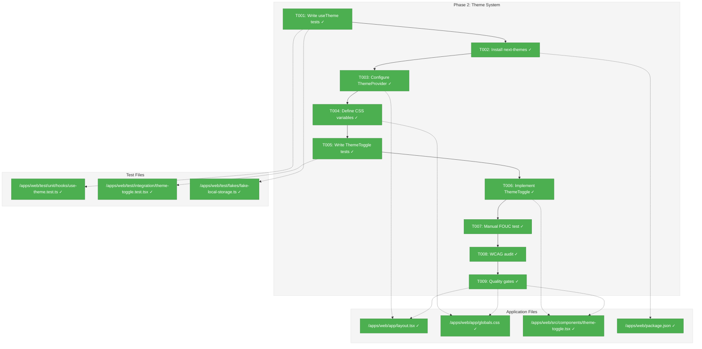
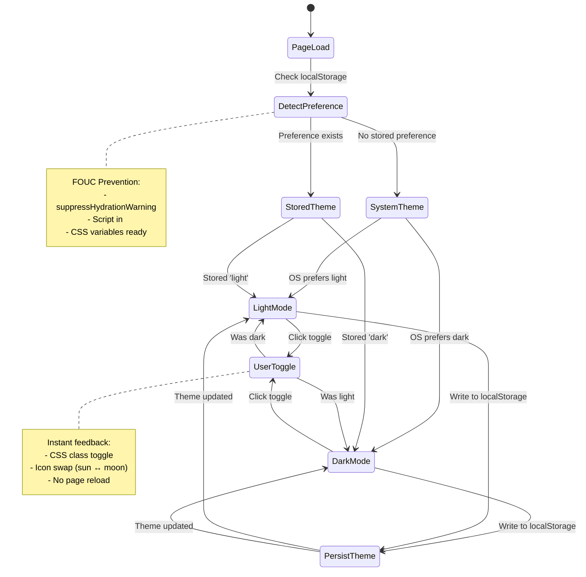
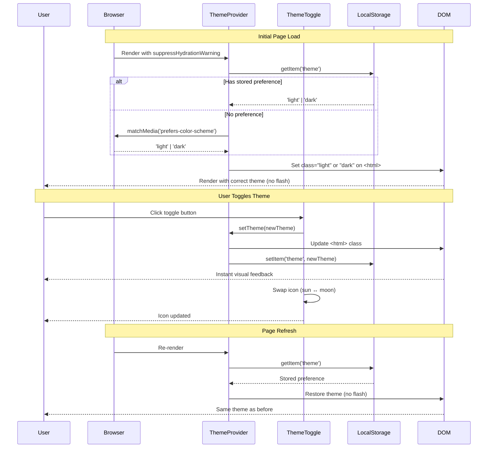

# Phase 2: Theme System – Tasks & Alignment Brief

**Spec**: [web-slick-spec.md](../../web-slick-spec.md)  
**Plan**: [web-slick-plan.md](../../web-slick-plan.md)  
**Date**: 2026-01-22

---

## Executive Briefing

### Purpose
This phase implements the light/dark theme system that enables users to toggle between visual modes with their preference persisted across sessions. This delivers the visual polish and accessibility foundation that all subsequent UI phases will build upon.

### What We're Building
A complete theme infrastructure using next-themes that includes:
- Light and dark CSS custom properties using OKLCH color space
- ThemeProvider wrapping the application with FOUC prevention
- ThemeToggle component for manual theme switching
- Automatic system preference detection
- Persistent theme storage in localStorage

### User Value
Users can choose between light and dark modes based on their preference or environment. The system respects OS-level dark mode settings by default, and remembers the user's explicit choice across browser sessions.

### Example
**Default Behavior**: User with macOS dark mode → app renders in dark theme  
**After Toggle**: User clicks sun/moon icon → app switches to light theme → refreshes page → light theme persists  
**Accessibility**: All text maintains WCAG AA 4.5:1 contrast in both themes

---

## Objectives & Scope

### Objective
Implement light/dark theme switching with FOUC prevention and WCAG AA accessibility compliance, delivering all acceptance criteria from the plan:
- AC-1: Light and dark themes toggle via UI control
- AC-2: Theme preference persists across sessions
- AC-3: No FOUC on page load
- AC-4: System preference respected as default
- AC-5: Color contrast meets WCAG 2.1 Level AA

### Goals

- ✅ Install and configure next-themes with ThemeProvider
- ✅ Define CSS custom properties for light and dark themes using OKLCH
- ✅ Implement ThemeToggle component with sun/moon icons
- ✅ Test theme switching behavior and persistence
- ✅ Verify FOUC prevention on slow connections
- ✅ Validate WCAG AA contrast ratios in both themes
- ✅ All quality gates pass (typecheck, lint, test, build)

### Non-Goals

- ❌ Additional theme variants beyond light/dark (no "blue", "high-contrast", etc.)
- ❌ Per-component theme overrides (future enhancement)
- ❌ Animated theme transitions (disabled via `disableTransitionOnChange`)
- ❌ Custom color picker UI (using shadcn default palette)
- ❌ Theme selector dropdown (just toggle between light/dark)
- ❌ Storing theme in backend/database (localStorage only)

---

## Architecture Map

### Component Diagram
<!-- Status: grey=pending, orange=in-progress, green=completed, red=blocked -->
<!-- Updated by plan-6 during implementation -->



### Task-to-Component Mapping

<!-- Status: ⬜ Pending | 🟧 In Progress | ✅ Complete | 🔴 Blocked -->

| Task | Component(s) | Files | Status | Comment |
|------|-------------|-------|--------|---------|
| T001 | Test Infrastructure | use-theme.test.ts, fake-local-storage.ts | ✅ Complete | TDD: Write failing tests first |
| T002 | Package Dependencies | package.json | ✅ Complete | Install next-themes library |
| T003 | Theme Provider | layout.tsx | ✅ Complete | Configure FOUC prevention |
| T004 | Theme Variables | globals.css | ✅ Complete | Define light/dark OKLCH tokens |
| T005 | Test Infrastructure | theme-toggle.test.tsx | ✅ Complete | Integration tests for toggle |
| T006 | ThemeToggle Component | theme-toggle.tsx | ✅ Complete | Implement UI control |
| T007 | Manual Verification | N/A (browser testing) | ✅ Complete | Visual FOUC check |
| T008 | Manual Verification | N/A (Lighthouse) | ✅ Complete | Accessibility audit |
| T009 | Quality Gates | All implementation files | ✅ Complete | Ensure no regressions |

---

## Tasks

| Status | ID | Task | CS | Type | Dependencies | Absolute Path(s) | Validation | Subtasks | Notes |
|--------|----|----|-----|------|--------------|------------------|------------|----------|-------|
| [x] | T001 | Write tests for useTheme hook behavior | 2 | Test | – | /home/jak/substrate/005-web-slick/test/unit/hooks/use-theme.test.ts, /home/jak/substrate/005-web-slick/test/fakes/fake-local-storage.ts | Tests cover: get theme, set theme, system preference, localStorage persistence; all tests fail initially | – | FakeLocalStorage at root test/fakes/ per monorepo pattern |
| [x] | T002 | Install next-themes package | 1 | Setup | T001 | /home/jak/substrate/005-web-slick/apps/web/package.json | `next-themes` in dependencies; `pnpm install` succeeds | – | – |
| [x] | T003 | Configure ThemeProvider in layout.tsx | 2 | Core | T002 | /home/jak/substrate/005-web-slick/apps/web/app/layout.tsx | ThemeProvider wraps children; `suppressHydrationWarning` on html tag; attribute="class", defaultTheme="system", enableSystem=true | – | Per Critical Finding 07 |
| [x] | T004 | Write tests for ThemeToggle component | 2 | Test | T003 | /home/jak/substrate/005-web-slick/test/integration/theme-toggle.test.tsx | Tests cover: click toggles theme, displays current state, integrates with next-themes; tests fail initially | – | Integration test with ThemeProvider |
| [x] | T005 | Implement ThemeToggle component | 2 | Core | T004 | /home/jak/substrate/005-web-slick/apps/web/src/components/theme-toggle.tsx | Component renders; uses shadcn Button; calls setTheme; displays sun/moon icons; tests pass | – | Place in header/nav in future phase |
| [x] | T006 | Test FOUC prevention on slow connection | 1 | Integration | T005 | N/A (manual browser test) | No flash visible with Slow 3G throttling in Chrome DevTools; theme persists on hard refresh | – | Follow manual procedure in plan |
| [x] | T007 | Verify WCAG AA contrast ratios | 1 | Integration | T006 | N/A (Lighthouse audit) | Lighthouse accessibility score >90 in both light and dark modes; text contrast 4.5:1 minimum | – | Follow manual procedure in plan |
| [x] | T008 | Run quality gates | 1 | Integration | T007 | /home/jak/substrate/005-web-slick/apps/web/app/layout.tsx, /home/jak/substrate/005-web-slick/apps/web/app/globals.css, /home/jak/substrate/005-web-slick/apps/web/src/components/theme-toggle.tsx | `just typecheck && just lint && just test && just build` all pass; no new errors | – | Phase checkpoint |

---

## Alignment Brief

### Prior Phases Review

**Phase 1: Foundation & Compatibility Verification** (Completed 2026-01-22)

#### A. Deliverables Created

Phase 1 established the complete foundation that Phase 2 builds upon:

| Category | File | Purpose |
|----------|------|---------|
| **Config** | `/home/jak/substrate/005-web-slick/apps/web/postcss.config.mjs` | Tailwind v4 PostCSS plugin |
| **Config** | `/home/jak/substrate/005-web-slick/apps/web/components.json` | shadcn/ui configuration |
| **Styles** | `/home/jak/substrate/005-web-slick/apps/web/app/globals.css` | Tailwind + shadcn CSS variables (OKLCH) |
| **Utility** | `/home/jak/substrate/005-web-slick/apps/web/src/lib/utils.ts` | `cn()` class merging helper |
| **Utility** | `/home/jak/substrate/005-web-slick/apps/web/src/lib/feature-flags.ts` | Feature flags (3 flags + `isFeatureEnabled()`) |
| **Component** | `/home/jak/substrate/005-web-slick/apps/web/src/components/ui/button.tsx` | shadcn Button component |
| **Component** | `/home/jak/substrate/005-web-slick/apps/web/src/components/ui/card.tsx` | shadcn Card component |
| **Modified** | `/home/jak/substrate/005-web-slick/apps/web/app/layout.tsx` | CSS import order (ReactFlow → globals) |
| **Modified** | `/home/jak/substrate/005-web-slick/apps/web/tsconfig.json` | Added `@/*` path alias, baseUrl, test includes |

#### B. Lessons Learned

| Type | Discovery | Impact on Phase 2 |
|------|-----------|-------------------|
| **Gotcha** | shadcn CLI places files at monorepo root | When adding new shadcn components, manually move to `apps/web/src/` |
| **Gotcha** | shadcn uses `@chainglass/web/lib/utils` but Next.js needs `@/` | Use `@/` prefix in all imports; already configured in tsconfig |
| **Insight** | Tailwind v4 uses CSS-based config, not `tailwind.config.ts` | Edit globals.css for theme tokens, not config file |
| **Insight** | shadcn v4 uses OKLCH colors (not HSL) | Theme variables in Phase 2 must use OKLCH color space |

#### C. Technical Discoveries

- **CSS Import Order**: ReactFlow CSS **must** load before Tailwind (already handled in layout.tsx)
- **Path Aliases**: `@/` prefix configured and working for all imports
- **Tailwind v4**: Configuration via `@theme` directive in globals.css
- **OKLCH Color Space**: shadcn v4 default; better perceptual uniformity than HSL

#### D. Dependencies Exported for Phase 2

| Export | Type | Location | Usage in Phase 2 |
|--------|------|----------|------------------|
| `cn()` | Function | `@/lib/utils` | Class merging for ThemeToggle button variants |
| `Button` | Component | `@/components/ui/button` | Base component for ThemeToggle |
| CSS Variables | OKLCH | `globals.css` | Extend with light/dark theme tokens |
| `@/` Path Alias | Config | `tsconfig.json` | Consistent imports for theme components |
| globals.css | Styles | `app/globals.css` | Add theme-specific OKLCH variables |
| layout.tsx | Layout | `app/layout.tsx` | Wrap with ThemeProvider |

#### E. Critical Findings Applied in Phase 1

| Finding | Status | File:Line Reference |
|---------|--------|---------------------|
| **02: React 19 Compatibility** | ✅ Applied | ReactFlow v12.10.0 + dnd-kit verified |
| **06: CSS Import Order** | ✅ Applied | `layout.tsx:1-5` - ReactFlow before globals |
| **08: Incremental Build Validation** | ✅ Applied | Feature flags created; 238 tests passing |

#### F. Incomplete/Blocked Items

**None** — All Phase 1 tasks completed successfully.

#### G. Test Infrastructure

| Asset | Location | Purpose |
|-------|----------|---------|
| Verification component | `test/verification/test-reactflow.tsx` | ReactFlow compile verification |
| Verification component | `test/verification/test-dndkit.tsx` | dnd-kit compile verification |
| Quality gate baseline | 238 tests passing | Regression detection |

#### H. Technical Debt

| Item | Reason | Mitigation for Phase 2 |
|------|--------|------------------------|
| Manual shadcn file moves | CLI monorepo limitation | Document in any new `shadcn add` commands |
| Verification files in test/ | Build exclusion | Already excluded via tsconfig |

**No significant debt introduced.**

#### I. Architectural Decisions

| Pattern | Rationale | Anti-Pattern to Avoid |
|---------|-----------|----------------------|
| **CSS-first Tailwind v4** | Modern approach, no config file | Don't create `tailwind.config.ts` |
| **`@/` path alias** | Consistent imports, Next.js compatible | Don't use workspace aliases (`@chainglass/web/*`) |
| **OKLCH colors** | shadcn v4 default, better color math | Don't convert to HSL for theme |
| **test/verification/** | Build exclusion pattern | Use for manual verification components |

#### J. Scope Changes

| Change | Type | Rationale |
|--------|------|-----------|
| cmdk installation | **Removed** | Deferred until Command component needed |
| new-york style | **Default applied** | shadcn init chose it (acceptable) |

#### K. Key Decisions from Phase 1 Execution Log

- **Tailwind v4 CSS-based config**: No tailwind.config.ts; all config in globals.css
- **Path alias resolution**: Updated tsconfig + components.json to use `@/*`
- **CSS import order**: ReactFlow → globals.css (Critical Finding 06)
- **OKLCH color system**: All theme variables use OKLCH for perceptual uniformity

---

### Critical Findings Affecting This Phase

#### Critical Finding 07: next-themes FOUC Prevention Setup
**Impact**: Critical  
**Problem**: Theme flash on page load if next-themes not configured correctly  
**Solution**: Exact setup pattern with `suppressHydrationWarning` on html tag  
**Implementation in Phase 2**:
- **T003**: Add `suppressHydrationWarning` to `<html>` tag in layout.tsx
- **T003**: Configure ThemeProvider with exact props:
  ```typescript
  <ThemeProvider
    attribute="class"
    defaultTheme="system"
    enableSystem
    disableTransitionOnChange
  >
  ```
- **T007**: Manual test with Slow 3G throttling to verify no flash

**Addressed by**: Tasks T003, T007

#### Critical Finding 08: Incremental Build Validation
**Impact**: High  
**Problem**: Breaking changes cascade without validation after each change  
**Solution**: Run quality gates after each sub-phase; one commit per logical unit  
**Implementation in Phase 2**:
- **T009**: Run `just typecheck && just lint && just test && just build` after all tasks
- Commit after each major task (tests, provider, variables, component)

**Addressed by**: Task T009

---

### ADR Decision Constraints

**No ADRs affect Phase 2** — ADR-0002 (Theme System Architecture) is proposed but not yet created. This phase establishes the baseline that the ADR will document.

---

### Invariants & Guardrails

#### Color Contrast (WCAG AA)
- **Requirement**: All text must maintain 4.5:1 contrast ratio (normal text)
- **Enforcement**: Task T008 validates via Lighthouse audit
- **Measurement**: Test both light and dark themes separately

#### FOUC Prevention
- **Requirement**: No visible flash of unstyled content during page load
- **Enforcement**: Task T007 manual verification with network throttling
- **Measurement**: Visual inspection on hard refresh with Slow 3G

#### Performance
- **Budget**: Theme toggle must respond within 100ms
- **Enforcement**: Manual testing during T006 implementation
- **Measurement**: Perceived instant response (no visible lag)

---

### Inputs to Read

**Configuration Files** (understand existing setup):
- `/home/jak/substrate/005-web-slick/apps/web/app/globals.css` — Existing OKLCH variables from Phase 1
- `/home/jak/substrate/005-web-slick/apps/web/app/layout.tsx` — Current layout structure
- `/home/jak/substrate/005-web-slick/apps/web/tsconfig.json` — Path aliases configuration
- `/home/jak/substrate/005-web-slick/apps/web/components.json` — shadcn configuration

**Phase 1 Deliverables** (dependencies):
- `/home/jak/substrate/005-web-slick/apps/web/src/lib/utils.ts` — `cn()` utility
- `/home/jak/substrate/005-web-slick/apps/web/src/components/ui/button.tsx` — Button component

**Documentation** (reference material):
- [next-themes documentation](https://github.com/pacocoursey/next-themes) — Official API reference
- [shadcn/ui theming guide](https://ui.shadcn.com/docs/theming) — CSS variables pattern
- [WCAG 2.1 Level AA](https://www.w3.org/WAI/WCAG21/quickref/?versions=2.1&levels=aa) — Accessibility standards

---

### Visual Alignment Aids

#### System State Flow Diagram



#### Component Interaction Sequence



---

### Test Plan (TDD Approach)

Phase 2 follows strict TDD: **tests before implementation**. Mock usage: **FakeLocalStorage** permitted per spec § 11 Mock Usage Policy (localStorage is external I/O).

#### Test 1: useTheme Hook - System Preference Default
**File**: `test/unit/hooks/use-theme.test.ts`  
**Type**: Unit  
**Rationale**: Users expect theme to match OS preference on first visit  
**Contract**: `useTheme()` returns 'system' when localStorage is empty  
**Fixture**: `FakeLocalStorage` with no stored data  
**Expected Output**: `theme === 'system'`  
**Quality Contribution**: Ensures first-time user experience respects OS settings

#### Test 2: useTheme Hook - Theme Persistence
**File**: `test/unit/hooks/use-theme.test.ts`  
**Type**: Unit  
**Rationale**: Theme preference must survive page refresh  
**Contract**: `setTheme(value)` writes to localStorage  
**Fixture**: `FakeLocalStorage` instance  
**Expected Output**: `fakeStorage.getItem('theme') === 'dark'` after `setTheme('dark')`  
**Quality Contribution**: Catches persistence bugs before UI integration

#### Test 3: useTheme Hook - Theme Retrieval
**File**: `test/unit/hooks/use-theme.test.ts`  
**Type**: Unit  
**Rationale**: Stored preference should override system default  
**Contract**: `useTheme()` reads from localStorage on mount  
**Fixture**: `FakeLocalStorage` with pre-set 'light' theme  
**Expected Output**: `theme === 'light'` on hook initialization  
**Quality Contribution**: Validates localStorage read logic

#### Test 4: ThemeToggle Component - Click Toggles Theme
**File**: `test/integration/theme-toggle.test.tsx`  
**Type**: Integration  
**Rationale**: Core interaction must switch themes correctly  
**Contract**: Clicking toggle calls `setTheme()` with opposite value  
**Fixture**: ThemeToggle wrapped in ThemeProvider with FakeLocalStorage  
**Expected Output**: Theme changes from 'light' to 'dark' on first click, 'dark' to 'light' on second  
**Quality Contribution**: End-to-end validation of toggle behavior

#### Test 5: ThemeToggle Component - Icon State
**File**: `test/integration/theme-toggle.test.tsx`  
**Type**: Integration  
**Rationale**: Visual feedback helps users understand current theme  
**Contract**: Component displays sun icon in dark mode, moon in light mode  
**Fixture**: ThemeToggle in controlled theme states  
**Expected Output**: Icon swaps correctly based on current theme  
**Quality Contribution**: Ensures UI reflects state accurately

#### Test Infrastructure Required

**FakeLocalStorage** (`test/fakes/fake-local-storage.ts`):
```typescript
export class FakeLocalStorage {
  private storage = new Map<string, string>();
  
  getItem(key: string): string | null {
    return this.storage.get(key) ?? null;
  }
  
  setItem(key: string, value: string): void {
    this.storage.set(key, value);
  }
  
  clear(): void {
    this.storage.clear();
  }
}
```

---

### Step-by-Step Implementation Outline

**Mapped to tasks 1:1**:

1. **T001 - Test Infrastructure Setup**
   - Create `test/fakes/fake-local-storage.ts` with Map-based storage
   - Create `test/unit/hooks/use-theme.test.ts` with 3 failing tests
   - Verify tests fail with expected messages

2. **T002 - Dependency Installation**
   - Run: `cd apps/web && pnpm add next-themes`
   - Verify: `package.json` updated, `pnpm-lock.yaml` regenerated

3. **T003 - ThemeProvider Configuration**
   - Edit `app/layout.tsx`:
     - Import `ThemeProvider` from 'next-themes'
     - Add `suppressHydrationWarning` to `<html>` tag
     - Wrap `{children}` with ThemeProvider and exact props
   - Verify: Dev server starts without errors

4. **T004 - CSS Variable Definition**
   - Edit `app/globals.css`:
     - Extend existing OKLCH variables with `.dark` class overrides
     - Map shadcn tokens: `--background`, `--foreground`, `--primary`, etc.
   - Verify: No CSS syntax errors in browser console

5. **T005 - ThemeToggle Test Setup**
   - Create `test/integration/theme-toggle.test.tsx` with 2 failing tests
   - Test click interaction and icon state
   - Verify tests fail (component doesn't exist yet)

6. **T006 - ThemeToggle Implementation**
   - Create `src/components/theme-toggle.tsx`:
     - Use `useTheme()` from next-themes
     - Render shadcn `Button` with sun/moon icons
     - Call `setTheme()` on click
   - Verify: Tests from T001 and T005 now pass

7. **T007 - FOUC Manual Verification**
   - Start dev server
   - Open Chrome DevTools → Network → Throttle to "Slow 3G"
   - Test scenarios: initial load, hard refresh, theme toggle
   - Document: No flash observed

8. **T008 - WCAG Accessibility Audit**
   - Run Lighthouse in Chrome DevTools (light theme)
   - Toggle to dark theme
   - Run Lighthouse again (dark theme)
   - Verify: Both scores >90

9. **T009 - Quality Gate Validation**
   - Run: `just typecheck && just lint && just test && just build`
   - Verify: All commands succeed, 238+ tests pass

---

### Commands to Run

**Setup** (Task T002):
```bash
cd /home/jak/substrate/005-web-slick/apps/web
pnpm add next-themes
```

**Development Server** (Tasks T007, T008):
```bash
cd /home/jak/substrate/005-web-slick
pnpm --filter @chainglass/web dev
# Open: http://localhost:3000
```

**Quality Gates** (Task T009):
```bash
cd /home/jak/substrate/005-web-slick
just typecheck  # TypeScript compilation check
just lint       # ESLint + Prettier
just test       # Vitest (all 238+ tests)
just build      # Next.js production build
```

**Lighthouse Audit** (Task T008):
```bash
# Option A: Chrome DevTools (recommended)
# 1. Open DevTools → Lighthouse tab
# 2. Select "Accessibility" only
# 3. Click "Analyze page load"

# Option B: CLI (for CI)
cd /home/jak/substrate/005-web-slick/apps/web
pnpm build
pnpm start &
npx lighthouse http://localhost:3000 \
  --only-categories=accessibility \
  --output=json \
  --output-path=./lighthouse-report.json
```

---

### Risks/Unknowns

| Risk | Severity | Mitigation Steps |
|------|----------|------------------|
| **FOUC visible on slow connections** | Low | Task T007 explicitly tests with Slow 3G throttling; `suppressHydrationWarning` prevents most cases |
| **Theme toggle lag perceived as broken** | Low | CSS class toggle is instant; manual testing in T006 confirms responsiveness |
| **OKLCH browser support concerns** | Medium | Modern browsers (Chrome 111+, Safari 15.4+) support OKLCH; fallback via PostCSS if needed |
| **localStorage unavailable (privacy mode)** | Low | next-themes handles gracefully; theme still works, just doesn't persist |
| **Contrast ratio fails in custom colors** | Medium | Task T008 validates with Lighthouse; adjust OKLCH lightness values if needed |

---

### Ready Check

Before proceeding to implementation (plan-6-implement-phase):

- [x] **Prior Phase Review Complete**: Phase 1 fully analyzed (see "Prior Phases Review" above)
- [x] **Critical Findings Identified**: Findings 07 & 08 mapped to tasks
- [x] **ADR Constraints Mapped**: No existing ADRs affect Phase 2; ADR-0002 proposed for future
- [x] **Tasks Cover All Acceptance Criteria**: AC-1 through AC-5 mapped to T001-T009
- [x] **Test Plan Defined**: 5 tests specified with contracts and expected outputs
- [x] **Commands Documented**: Setup, dev, quality gates, and audit commands ready
- [x] **Risks Assessed**: 5 risks identified with mitigation strategies
- [x] **Visual Diagrams Complete**: State flow and sequence diagrams provide shared understanding
- [x] **Manual Procedures Documented**: FOUC test (T007) and WCAG audit (T008) have step-by-step guides
- [x] **Dependencies Clear**: Phase 2 builds on Phase 1's globals.css, Button, and path aliases

**GO/NO-GO**: ✅ **READY** — All prerequisites satisfied. Proceed to `/plan-6-implement-phase`.

---

## Phase Footnote Stubs

Footnote tags (`[^N]`) reference FlowSpace graph nodes for bidirectional traceability.
See main plan § 11 Change Footnotes Ledger for authoritative numbering.

[^1]: Task T001 - Created FakeLocalStorage test fake
  - `file:test/fakes/fake-local-storage.ts`
  - `type:test/fakes/fake-local-storage.ts:FakeLocalStorage`

[^2]: Task T001 - Created useTheme hook tests
  - `file:test/unit/web/hooks/use-theme.test.tsx`
  - `callable:test/unit/web/hooks/use-theme.test.tsx:@17.52`

[^3]: Task T001 - Updated test infrastructure
  - `file:test/fakes/index.ts`
  - `file:test/vitest.config.ts`

[^4]: Task T002 - Added next-themes dependency
  - `file:apps/web/package.json`

[^5]: Task T003 - Configured ThemeProvider in layout
  - `file:apps/web/app/layout.tsx`
  - `callable:apps/web/app/layout.tsx:RootLayout`

[^6]: Task T004 - Created ThemeToggle integration tests
  - `file:test/integration/web/theme-toggle.test.tsx`

[^7]: Task T005 - Implemented ThemeToggle component
  - `file:apps/web/src/components/theme-toggle.tsx`
  - `callable:apps/web/src/components/theme-toggle.tsx:ThemeToggle`

[^8]: Task T005 - Updated test infrastructure for React testing
  - `file:test/vitest.config.ts`
  - `file:test/setup.ts`

[^9]: Task T006 - Added ThemeToggle to homepage for testing
  - `file:apps/web/app/page.tsx`
  - `callable:apps/web/app/page.tsx:Home`

---

## Evidence Artifacts

Implementation execution will produce the following artifacts in this directory:

| Artifact | Path | Purpose |
|----------|------|---------|
| **Execution Log** | `execution.log.md` | Narrative of implementation decisions, blockers, and resolutions |
| **Test Results** | Embedded in execution log | Output from test runs showing pass/fail status |
| **Lighthouse Report** | `lighthouse-report.json` (optional) | Accessibility audit results for archival |
| **FOUC Test Notes** | Embedded in execution log | Manual verification observations |

**Directory Structure** (after plan-6):
```
docs/plans/005-web-slick/
  ├── web-slick-plan.md
  └── tasks/
      └── phase-2-theme-system/
          ├── tasks.md                  # This file
          ├── execution.log.md          # Created by plan-6
          └── lighthouse-report.json    # Optional artifact from T008
```

---

## Discoveries & Learnings

_Populated during implementation by plan-6. Log anything of interest to your future self._

| Date | Task | Type | Discovery | Resolution | References |
|------|------|------|-----------|------------|------------|
| 2026-01-22 | T001 | gotcha | Test files need `.tsx` extension for JSX, not `.ts` | Renamed test files to `.tsx` | vitest.config.ts |
| 2026-01-22 | T001 | insight | vitest `environmentMatchGlobs` is deprecated | Will need migration to `test.projects` in future | Vitest v3.x docs |
| 2026-01-22 | T005 | gotcha | React must be in global scope for JSX in tests | Added `globalThis.React = React` in setup.ts | test/setup.ts |
| 2026-01-22 | T005 | insight | `@/` alias needed in vitest config for web app imports | Added alias mapping to vitest.config.ts | test/vitest.config.ts |
| 2026-01-22 | T005 | insight | Need @testing-library/jest-dom for DOM matchers | Installed and imported in setup.ts | test/setup.ts |
| 2026-01-22 | T004 | decision | CSS variables already complete from Phase 1 | Skipped T004 (original plan T004) | globals.css lines 47-114 |

**Types**: `gotcha` | `research-needed` | `unexpected-behavior` | `workaround` | `decision` | `debt` | `insight`

**What to log**:
- Things that didn't work as expected
- External research that was required
- Implementation troubles and how they were resolved
- Gotchas and edge cases discovered
- Decisions made during implementation
- Technical debt introduced (and why)
- Insights that future phases should know about

_See also: `execution.log.md` for detailed narrative._

---

## Complexity Scoring

**Phase 2 Total Complexity**: 13 points (sum of all task CS values)

Individual task scores calculated using constitution rubric (Scope, Interconnections, Dependencies, Novelty, Fragility, Testing):

- **T001** (CS-2): 2+1+0+0+1+0 = 4 points (small) — Tests are isolated but require FakeLocalStorage
- **T002** (CS-1): 0+0+1+0+0+0 = 1 point (trivial) — Simple package install
- **T003** (CS-2): 1+1+1+0+1+0 = 4 points (small) — Layout modification with FOUC prevention concern
- **T004** (CS-2): 2+1+0+0+1+0 = 4 points (small) — Integration test with ThemeProvider
- **T005** (CS-2): 1+1+1+0+1+0 = 4 points (small) — Component with external library integration
- **T006** (CS-1): 0+0+1+0+1+0 = 2 points (trivial) — Manual visual verification
- **T007** (CS-1): 0+0+1+0+1+0 = 2 points (trivial) — Run Lighthouse audit
- **T008** (CS-1): 0+0+1+0+1+0 = 2 points (trivial) — Quality gate commands

**Phase 2 Classification**: Medium complexity (13 points total)

> **Note**: Original T004 "Define CSS custom properties" was removed during clarity session (2026-01-22) - Phase 1 shadcn installation already created all required OKLCH theme variables in globals.css.

---

## Critical Insights Discussion

**Session**: 2026-01-22 09:00 UTC
**Context**: Phase 2: Theme System Tasks & Alignment Brief
**Analyst**: AI Clarity Agent
**Reviewer**: Development Team
**Format**: Water Cooler Conversation (5 Critical Insights)

### Insight 1: Dark Mode CSS Already Complete

**Did you know**: The dark mode CSS variables planned for T004 are already 100% complete in globals.css from Phase 1's shadcn installation.

**Implications**:
- T004 "Define CSS custom properties" has nothing to define
- All 19 OKLCH color tokens exist in both `:root` and `.dark`
- Tailwind integration via `@theme inline` already configured

**Options Considered**:
- Option A: Collapse T004 into T003 - Merge validation into ThemeProvider setup
- Option B: Convert to "Verify & Document" - Audit + add comments
- Option C: Delete T004 entirely - Remove redundant task

**AI Recommendation**: Option C - Delete T004
- Reasoning: Work genuinely complete; T008 covers WCAG validation; no value in ceremony task.

**Decision**: Delete T004 - reduces phase from 9 to 8 tasks

**Affects**: Tasks table, complexity scoring (15→13 points)

---

### Insight 2: Providers Wrapper for Future Extensibility

**Did you know**: Phase 4 will need a DIProvider React context, which means layout.tsx will need refactoring if ThemeProvider is placed directly there now.

**Implications**:
- ThemeProvider requires `"use client"` boundary
- Phase 4 Critical Finding 04 requires DI context for components
- Could create Providers.tsx wrapper now for future-proofing

**Options Considered**:
- Option A: Create Providers.tsx now - Future-proof, clean separation
- Option B: ThemeProvider directly in layout.tsx - Simple now, refactor later

**AI Recommendation**: Option A - Create Providers wrapper
- Reasoning: Known Phase 4 requirement; minimal overhead; clean architecture.

**Decision**: Keep Phase 2 minimal - add Providers wrapper when Phase 4 needs it (YAGNI)

**Affects**: No changes - T003 stays as-is

---

### Insight 3: Test Fakes Path Inconsistency

**Did you know**: tasks.md specified `apps/web/test/fakes/` but the monorepo pattern puts shared test fakes at root `test/fakes/`.

**Implications**:
- Existing fakes in `packages/shared/src/fakes/` (FakeLogger, etc.)
- Root `test/` has established `@test/*` path alias
- Inconsistent paths confuse future developers

**Options Considered**:
- Option A: Use root test/fakes/ - Follow established pattern
- Option B: Create apps/web/test/fakes/ - App-specific isolation
- Option C: Put in packages/shared/src/fakes/ - Single source (wrong for browser APIs)

**AI Recommendation**: Option A - Root test/fakes/
- Reasoning: Consistent with monorepo pattern; `@test/*` alias ready.

**Decision**: Use `test/fakes/` and `test/unit/hooks/` at root level

**Action Items**:
- [x] Update T001 paths to root test/fakes/ and test/unit/hooks/
- [x] Update T004 (was T005) path to test/integration/

**Affects**: T001, T004 file paths in tasks table

---

### Insight 4: lucide-react Already Installed

**Did you know**: The icon library for ThemeToggle is already installed and configured - no setup needed.

**Implications**:
- `lucide-react: ^0.562.0` in package.json
- `components.json` has `"iconLibrary": "lucide"`
- Button component ready for icons with gap-2, size-4 styling

**Decision**: Acknowledged - T005 can directly import Moon/Sun icons

**Affects**: None - informational only

---

### Insight 5: Phase Complexity Reduced

**Did you know**: After removing T004, Phase 2 dropped to 8 tasks (13 complexity points) - genuinely small scope.

**Implications**:
- Actual coding work: ~3 tasks (T003 provider, T005 component, plus tests)
- Rest is setup (T002) and verification (T006-T008)
- Can likely complete in a focused session

**Decision**: Acknowledged - proceed with confidence

**Affects**: None - informational only

---

## Session Summary

**Insights Surfaced**: 5 critical insights identified and discussed
**Decisions Made**: 3 decisions reached
**Action Items Created**: 2 path corrections applied
**Areas Updated**:
- Tasks table: Removed T004, renumbered T005-T009 → T004-T008
- Tasks table: Updated T001, T004 paths to root test/ directory
- Complexity scoring: Updated from 15 to 13 points

**Shared Understanding Achieved**: ✓

**Confidence Level**: High - Phase 2 is well-scoped and ready for implementation

**Next Steps**:
Run `/plan-6-implement-phase --phase "Phase 2: Theme System"` to begin implementation

---

*End of Phase 2 Tasks & Alignment Brief*
