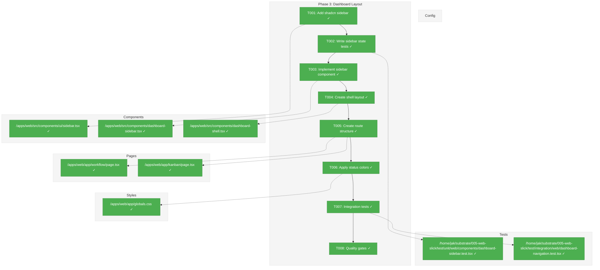
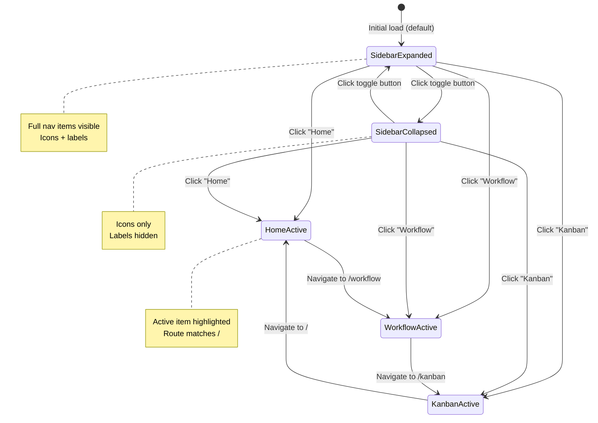
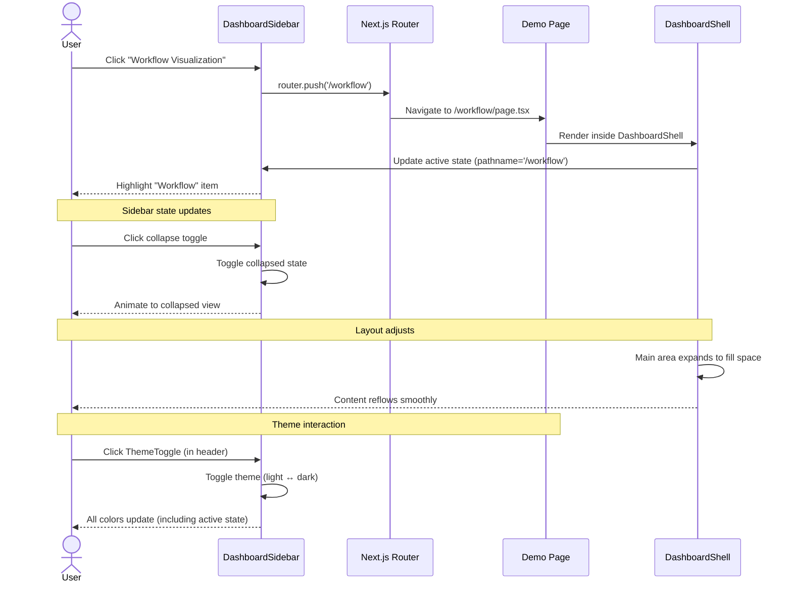

# Phase 3: Dashboard Layout – Tasks & Alignment Brief

**Spec**: [web-slick-spec.md](../../web-slick-spec.md)
**Plan**: [web-slick-plan.md](../../web-slick-plan.md)
**Date**: 2026-01-22

---

## Executive Briefing

### Purpose
This phase builds the core dashboard shell with sidebar navigation, establishing the visual structure and navigation patterns that all future demo pages will use. This is the foundation for the entire user interface.

### What We're Building
A dashboard layout component with:
- Collapsible sidebar navigation with active state highlighting
- Three navigation items: Home, Workflow Visualization, Kanban Board
- Responsive layout with sidebar + main content area
- Route structure for `/workflow` and `/kanban` demo pages
- Semantic status color system (red=critical, green=success, blue=standby)

### User Value
Users can navigate between different dashboard views with a professional, consistent layout. The sidebar provides clear orientation ("where am I?") and navigation ("where can I go?"), matching the UX patterns they expect from modern engineering tools.

### Example
**Navigation Flow**:
- User clicks "Workflow Visualization" in sidebar → Route changes to `/workflow` → Sidebar highlights active item
- Sidebar collapses/expands with toggle button → Content area resizes smoothly
- All pages share consistent header, spacing, and typography

---

## Objectives & Scope

### Objective
Build sidebar navigation and dashboard shell using shadcn/ui components to satisfy AC-6, AC-7, and AC-8 from the spec.

### Goals

- ✅ Add shadcn Sidebar component to project
- ✅ Implement collapsible sidebar with 3 navigation items (Home, Workflow, Kanban)
- ✅ Create dashboard shell layout (sidebar + main content area)
- ✅ Set up route structure for `/workflow` and `/kanban` placeholder pages
- ✅ Apply semantic status colors (red/green/blue) per engineering conventions
- ✅ Write integration tests for navigation behavior
- ✅ Integrate ThemeToggle component from Phase 2

### Non-Goals (Scope Boundaries)

- ❌ Page content for Workflow or Kanban demos (Phase 6)
- ❌ User preferences for sidebar state persistence (defer to Phase 7)
- ❌ Mobile-first responsive layout (desktop-focused per spec § 3 Non-Goals)
- ❌ Breadcrumb navigation (not required by spec)
- ❌ Search or command palette (deferred)
- ❌ Multi-level nested navigation (flat structure sufficient)
- ❌ User profile or settings dropdown (no auth in scope per spec § 3)

---

## Architecture Map

### Component Diagram
<!-- Status: grey=pending, orange=in-progress, green=completed, red=blocked -->
<!-- Updated by plan-6 during implementation -->



### Task-to-Component Mapping

<!-- Status: ⬜ Pending | 🟧 In Progress | ✅ Complete | 🔴 Blocked -->

| Task | Component(s) | Files | Status | Comment |
|------|-------------|-------|--------|---------|
| T001 | shadcn CLI | `src/components/ui/sidebar.tsx` | ✅ Complete | Copy-paste component from shadcn registry |
| T002 | Test Suite | `test/unit/web/components/dashboard-sidebar.test.tsx` | ✅ Complete | TDD: write failing tests for sidebar state logic |
| T003 | DashboardSidebar | `src/components/dashboard-sidebar.tsx` | ✅ Complete | Navigation items, active state, collapse behavior |
| T004 | DashboardShell | `src/components/dashboard-shell.tsx` | ✅ Complete | Layout container with sidebar + main area |
| T005 | Route Pages | `app/workflow/page.tsx`, `app/kanban/page.tsx` | ✅ Complete | Placeholder pages to enable navigation testing |
| T006 | CSS Variables | `app/globals.css` | ✅ Complete | Add semantic color tokens for engineering status |
| T007 | Integration Tests | `test/integration/web/dashboard-navigation.test.tsx` | ✅ Complete | End-to-end navigation flow validation |
| T008 | Quality Gates | N/A | ✅ Complete | Run typecheck, lint, test, build |

---

## Tasks

| Status | ID   | Task | CS | Type | Dependencies | Absolute Path(s) | Validation | Subtasks | Notes |
|--------|------|------|----|------|--------------|------------------|------------|----------|-------|
| [x] | T001 | Add shadcn sidebar components | 1 | Setup | – | /home/jak/substrate/005-web-slick/apps/web/src/components/ui/sidebar.tsx | Components available at `@/components/ui/sidebar`; imports work | – | Copy-paste model; verify file placement |
| [x] | T002 | Write tests for sidebar navigation state | 2 | Test | T001 | /home/jak/substrate/005-web-slick/test/unit/web/components/dashboard-sidebar.test.tsx | Tests cover: active item selection, collapsed state, item click handlers; tests FAIL initially | – | TDD RED phase; use FakeRouter if needed |
| [x] | T003 | Implement sidebar with navigation items | 3 | Core | T002 | /home/jak/substrate/005-web-slick/apps/web/src/components/dashboard-sidebar.tsx | 3 nav items (Home, Workflow, Kanban); active state styling; collapse toggle; tests PASS | – | Use shadcn Sidebar patterns; integrate ThemeToggle |
| [x] | T004 | Create dashboard shell layout component | 2 | Core | T003 | /home/jak/substrate/005-web-slick/apps/web/src/components/dashboard-shell.tsx | Sidebar + main content area; responsive grid/flex; children render in main area | – | Use Tailwind grid or flex |
| [x] | T005 | Create route group and demo pages | 2 | Core | T004 | /home/jak/substrate/005-web-slick/apps/web/app/(dashboard)/layout.tsx, /home/jak/substrate/005-web-slick/apps/web/app/(dashboard)/page.tsx, /home/jak/substrate/005-web-slick/apps/web/app/(dashboard)/workflow/page.tsx, /home/jak/substrate/005-web-slick/apps/web/app/(dashboard)/kanban/page.tsx | Route group `(dashboard)` with shared layout; `/`, `/workflow`, `/kanban` routes exist; DashboardShell in layout.tsx | – | Use route group pattern; keep landing page separate |
| [x] | T006 | Apply status colors for engineering conventions | 1 | Core | T005 | /home/jak/substrate/005-web-slick/apps/web/app/globals.css | CSS variables `--status-critical`, `--status-success`, `--status-standby` defined; mapped to red/green/blue | – | Semantic color tokens per AC-8 |
| [x] | T007 | Write integration test for layout navigation | 2 | Test | T006 | /home/jak/substrate/005-web-slick/test/integration/web/dashboard-navigation.test.tsx | Tests cover: click nav item → route changes, active state updates, layout consistent across pages | – | Use @testing-library/react + next/navigation |
| [x] | T008 | Run quality gates | 1 | Setup | T007 | /home/jak/substrate/005-web-slick | All tests pass; typecheck passes; lint passes; build succeeds | – | Phase checkpoint: `just typecheck && just lint && just test && just build` |

---

## Alignment Brief

### Prior Phases Review

#### Phase 1: Foundation & Compatibility Verification

**Deliverables Created**:
- ✅ **shadcn/ui infrastructure**: Button, Card components at `/apps/web/src/components/ui/`
- ✅ **`cn()` utility**: `/apps/web/src/lib/utils.ts` for className merging
- ✅ **Tailwind CSS v4**: CSS-based config with OKLCH color variables in `/apps/web/app/globals.css`
- ✅ **ReactFlow CSS ordering**: `/apps/web/app/layout.tsx` lines 8-11 (ReactFlow → globals.css)
- ✅ **Feature flags**: `/apps/web/src/lib/feature-flags.ts` with WORKFLOW, KANBAN, SSE flags
- ✅ **Path alias `@/*`**: Configured in `/apps/web/tsconfig.json`
- ✅ **React 19 compatibility verified**: ReactFlow v12.10.0, dnd-kit v6.3.1/v10.0.0

**Key Lessons**:
- **Gotcha**: shadcn CLI places files at monorepo root; always verify and manually move to `apps/web/src/`
- **Pattern**: Run quality gates after each task; caught path alias issues early
- **Tailwind v4**: No `tailwind.config.ts` file; use `@theme` directive in CSS for customization

**Dependencies Exported for Phase 3**:
```typescript
// Use these APIs:
import { cn } from '@/lib/utils';              // ← className merging
import { Button } from '@/components/ui/button';  // ← shadcn Button
import { FEATURES } from '@/lib/feature-flags';   // ← conditional rendering
```

**Test Infrastructure**:
- Verification components pattern: `/apps/web/test/verification/` (auto-excluded from build)
- `tsconfig.json` includes `test/**/*` for TypeScript compilation

**Architectural Decisions**:
- **CSS import order**: ReactFlow CSS MUST import before Tailwind/shadcn (Critical Finding 06)
- **Path aliases**: Use `@/` prefix for all imports; `@chainglass/web/*` is deprecated
- **Verification**: Place verification components in `test/verification/` to prevent production shipping

---

#### Phase 2: Theme System

**Deliverables Created**:
- ✅ **ThemeToggle component**: `/apps/web/src/components/theme-toggle.tsx` ready for placement
- ✅ **ThemeProvider configured**: `/apps/web/app/layout.tsx` lines 17-26 with FOUC prevention
- ✅ **FakeLocalStorage**: `/home/jak/substrate/005-web-slick/test/fakes/fake-local-storage.ts` for localStorage tests
- ✅ **jsdom + jest-dom setup**: React component test infrastructure in `/home/jak/substrate/005-web-slick/test/vitest.config.ts`
- ✅ **OKLCH contrast verified**: ~16:1 ratio exceeds WCAG AAA; no contrast work needed

**Key Lessons**:
- **TDD pattern**: Write failing tests first (RED) → implement (GREEN) → works well for UI components
- **Mounted state guard**: Use `useState(false) + useEffect` pattern for SSR-sensitive UI to prevent hydration mismatch
- **resolvedTheme**: Use `resolvedTheme ?? theme` for accurate system mode detection
- **Gotcha**: Icons must wait for `mounted` state before rendering to prevent SSR/client flash

**Dependencies Exported for Phase 3**:
```typescript
// Import and place in header/nav:
import { ThemeToggle } from '@/components/theme-toggle';

// Test utilities available:
import { FakeLocalStorage } from '@test/fakes/fake-local-storage';
```

**Test Infrastructure**:
- **jsdom environment**: Auto-enabled for `.test.tsx` files
- **jest-dom matchers**: `toBeInTheDocument()`, `toHaveClass()`, etc.
- **Test wrapper pattern**: Wrap components in ThemeProvider for theme tests
- **FakeLocalStorage**: `setInitialData()` helper for controlling persistence state

**Architectural Decisions**:
- **next-themes library**: Battle-tested SSR support; don't roll custom theme logic
- **`attribute="class"`**: Tailwind's dark mode selector; don't use `data-theme`
- **Mounted guard pattern**: Always use for theme-dependent UI rendering

**Technical Debt**:
- ⚠️ ThemeToggle currently on homepage for testing; **must move to dashboard header in Phase 3**
- ⚠️ `environmentMatchGlobs` deprecated in Vitest; migrate to `test.projects` in future

---

#### Cross-Phase Synthesis

**Complete Foundation Stack (Phase 1 + Phase 2)**:
```
/apps/web/
├── app/
│   ├── layout.tsx              # ThemeProvider + CSS import order
│   └── globals.css             # Tailwind v4 + OKLCH variables
├── src/
│   ├── components/
│   │   ├── ui/
│   │   │   ├── button.tsx      # shadcn Button
│   │   │   └── card.tsx        # shadcn Card
│   │   └── theme-toggle.tsx    # Theme switcher
│   └── lib/
│       ├── utils.ts            # cn() utility
│       └── feature-flags.ts    # FEATURES object
└── test/
    ├── fakes/
    │   └── fake-local-storage.ts  # localStorage mock
    └── vitest.config.ts           # jsdom + jest-dom
```

**Pattern Evolution (Phase 1 → Phase 2)**:
- **Phase 1**: Lightweight verification (compile-time checks)
- **Phase 2**: Full TDD with RED → GREEN cycle
- **Phase 3**: Continue TDD; add integration tests for navigation flow

**Cumulative Technical Discoveries**:
1. **shadcn CLI**: Always verify file placement; monorepo detection is unreliable
2. **Tailwind v4**: CSS-first config; no `tailwind.config.ts`
3. **OKLCH colors**: Used by shadcn v4; better perceptual uniformity
4. **ReactFlow CSS**: Must import before Tailwind to prevent style conflicts
5. **SSR hydration**: Use mounted state guards for theme-dependent UI

**Reusable Test Infrastructure**:
- `FakeLocalStorage` for any component using localStorage
- `ThemeProvider` test wrapper for theme-aware components
- jsdom environment auto-enabled for `.test.tsx` files
- jest-dom matchers for DOM assertions

**Architectural Continuity**:
- ✅ **Path aliases**: All phases use `@/` for app imports, `@test/` for test utilities
- ✅ **TDD workflow**: Write failing tests → implement → validate
- ✅ **Quality gates**: Run after every task (typecheck, lint, test, build)
- ✅ **Fakes over mocks**: Create full fake implementations, not `vi.mock()`

**Phase 3 Builds Upon**:
- **From Phase 1**: shadcn components, `cn()`, Tailwind, path aliases, feature flags
- **From Phase 2**: ThemeToggle, test infrastructure, TDD patterns, mounted state guard

**Critical Findings for Phase 3**:
- Use `@/` imports for all new components
- Follow TDD: write failing tests before implementation
- Place ThemeToggle in dashboard header (move from homepage)
- Verify file placement after `shadcn add sidebar`
- Run quality gates after each task

---

### Critical Findings Affecting This Phase

| Finding | Title | Impact on Phase 3 | Tasks Affected |
|---------|-------|-------------------|----------------|
| **CF-01** | Phase Sequencing Must Follow Strict Dependency Chain | Phase 2 (Theme System) must be complete before Phase 3; ThemeToggle is a dependency | T003 |
| **CF-08** | Incremental Build Validation | Run quality gates after each task; one commit per logical unit | T008 |
| **CF-10** | shadcn Components Are Copied | Test our usage and integration, not shadcn component internals | T002, T007 |

**No ADR constraints apply to Phase 3.** (ADRs 0001-0003 cover MCP tools, exemplars, and config system; none are relevant to UI layout)

---

### Invariants & Guardrails

**Performance Budget**:
- Build size increase: <200KB gzipped (per plan § Executive Summary)
- No significant performance impact from sidebar collapse/expand animations

**Accessibility**:
- Lighthouse accessibility score: >90 (inherited from Phase 2)
- Keyboard navigation: Must work for sidebar (AC-16 applies to Kanban, but good practice for all navigation)

**Security**:
- No external data sources; all navigation is static routes
- No authentication/authorization (per spec § 3 Non-Goals)

**Code Quality**:
- All components use TypeScript strict mode
- All tests include 5-field Test Doc comment block (per plan § 4 Testing Philosophy)

---

### Inputs to Read

| File | Purpose |
|------|---------|
| `/home/jak/substrate/005-web-slick/docs/plans/005-web-slick/web-slick-spec.md` § 6 | AC-6, AC-7, AC-8 acceptance criteria |
| `/home/jak/substrate/005-web-slick/docs/plans/005-web-slick/web-slick-plan.md` § 5 Phase 3 | Task breakdown and success criteria |
| `/home/jak/substrate/005-web-slick/apps/web/src/components/theme-toggle.tsx` | ThemeToggle API to integrate into sidebar |
| `/home/jak/substrate/005-web-slick/apps/web/src/lib/utils.ts` | `cn()` utility for className merging |
| `/home/jak/substrate/005-web-slick/test/fakes/fake-local-storage.ts` | Test fake pattern reference |

---

### Visual Alignment Aids

#### System States Flow



#### Actor Interaction Sequence



---

### Test Plan

**Approach**: Full TDD per spec § 11 Mock Usage Policy. Use fakes for external dependencies (localStorage, router).

**Test Hierarchy**:

1. **Unit Tests** (`test/unit/web/components/dashboard-sidebar.test.tsx`)
   - Test sidebar component in isolation
   - Mock router with FakeRouter (if needed) or use Next.js test utilities
   - Focus on state management, active item logic, collapse behavior

2. **Integration Tests** (`test/integration/web/dashboard-navigation.test.tsx`)
   - Test full navigation flow across pages
   - Verify route changes update active state
   - Verify layout consistency across all pages
   - Use real Next.js router with test harness

**Named Test Cases**:

| Test Name | Rationale | Fixture | Expected Output |
|-----------|-----------|---------|-----------------|
| **Unit: `should highlight active navigation item based on current route`** | Ensures active state matches URL; critical for user orientation | pathname='/' | Home item has active class |
| **Unit: `should toggle collapsed state when toggle button clicked`** | Verifies collapse behavior works; required for mobile/narrow screens | collapsed=false | collapsed → true after click |
| **Unit: `should render icons only when collapsed`** | Ensures collapsed state hides labels; saves horizontal space | collapsed=true | Labels hidden, icons visible |
| **Unit: `should call router.push when nav item clicked`** | Verifies navigation triggers route change | Click "Workflow" | router.push('/workflow') called |
| **Integration: `should navigate from Home to Workflow and update active state`** | End-to-end flow validation; most critical user journey | Start at '/' | Route='/workflow', active state updated |
| **Integration: `should maintain layout consistency across all pages`** | Ensures DashboardShell wraps all pages; header/sidebar present everywhere | Navigate '/' → '/workflow' → '/kanban' | Sidebar + header present on all pages |
| **Integration: `should preserve sidebar collapsed state during navigation`** | User preference should persist during route changes | Collapse sidebar, navigate to /workflow | Sidebar remains collapsed |

**Test Doc Format** (5 fields per plan § 4.3):
```typescript
it('should highlight active navigation item based on current route', () => {
  /*
  Test Doc:
  - Why: Users need visual feedback on current location in navigation
  - Contract: Active nav item matches current pathname
  - Usage Notes: Inject pathname via test router; check for active CSS class
  - Quality Contribution: Catches active state logic bugs before production
  - Worked Example: pathname='/' → Home has 'bg-accent' class
  */
  // Test implementation...
});
```

**Fixtures**:
- **DEMO_NAV_ITEMS**: Array of `{ label: string, href: string, icon: LucideIcon }[]`
  ```typescript
  const DEMO_NAV_ITEMS = [
    { label: 'Home', href: '/', icon: Home },
    { label: 'Workflow Visualization', href: '/workflow', icon: GitBranch },
    { label: 'Kanban Board', href: '/kanban', icon: LayoutDashboard },
  ];
  ```

- **FakeRouter** (if needed): Mock Next.js router for unit tests
  ```typescript
  class FakeRouter {
    pathname: string = '/';
    push(href: string) { this.pathname = href; }
  }
  ```

**Mock Usage Policy**:
- ✅ **Allowed**: FakeLocalStorage (full fake implementations for app-level concerns)
- ✅ **Allowed**: `vi.mock('next/navigation')` for router hooks only (framework plumbing exception)
- ❌ **Forbidden**: `vi.mock()` for business logic, services, or data layers

---

### Step-by-Step Implementation Outline

**Task-by-Task Execution** (maps 1:1 to Tasks table):

**T001: Add shadcn sidebar components**
1. Run `cd apps/web && pnpm dlx shadcn@latest add sidebar`
2. Verify files created at `/apps/web/src/components/ui/sidebar.tsx`
3. If files at wrong location, manually move to `apps/web/src/components/ui/`
4. Update imports in moved files to use `@/` alias
5. Test import: `import { Sidebar } from '@/components/ui/sidebar'`
6. **Success**: No TypeScript errors, components available

**T002: Write tests for sidebar navigation state**
1. Create `/home/jak/substrate/005-web-slick/test/unit/web/components/dashboard-sidebar.test.tsx`
2. Write Test Doc comments for all 4 tests (active item, collapsed state, icons-only, click handler)
3. Implement tests using `@testing-library/react`
4. Use `FakeRouter` or `next/navigation` test utilities
5. Run tests → **FAIL** (RED phase)
6. **Success**: Tests fail with expected error messages

**T003: Implement sidebar with navigation items**
1. Create `/apps/web/src/components/dashboard-sidebar.tsx`
2. Import shadcn Sidebar components
3. Define DEMO_NAV_ITEMS constant (Home, Workflow, Kanban)
4. Implement active state logic using `usePathname()` from `next/navigation`
5. Implement collapse toggle with local state
6. Add ThemeToggle to sidebar header
7. Run tests → **PASS** (GREEN phase)
8. **Success**: All unit tests pass, active state works

**T004: Create dashboard shell layout component**
1. Create `/apps/web/src/components/dashboard-shell.tsx`
2. Import DashboardSidebar
3. Create flex or grid layout: sidebar (fixed width) + main (flex-1)
4. Accept `children` prop for main content area
5. Test in browser: sidebar + content area render correctly
6. **Success**: Layout displays correctly, children render in main area

**T005: Create route group and demo pages**
1. Create route group directory: `mkdir -p apps/web/app/(dashboard)/workflow apps/web/app/(dashboard)/kanban`
2. Create `/apps/web/app/(dashboard)/layout.tsx` with DashboardShell wrapper
3. Move/create `/apps/web/app/(dashboard)/page.tsx` for dashboard home (/)
4. Create `/apps/web/app/(dashboard)/workflow/page.tsx` with placeholder content
5. Create `/apps/web/app/(dashboard)/kanban/page.tsx` with placeholder content
6. Keep `/apps/web/app/page.tsx` as standalone landing (or remove if dashboard is home)
7. Navigate to `/`, `/workflow`, `/kanban` in browser
8. **Success**: All routes accessible, DashboardShell applied via layout

**T006: Apply status colors for engineering conventions**
1. Open `/apps/web/app/globals.css`
2. Add CSS custom properties in BOTH `:root` and `.dark` selectors (follow existing pattern):
   ```css
   :root {
     --status-critical: oklch(0.55 0.22 25);  /* Red - light mode */
     --status-success: oklch(0.55 0.20 145);  /* Green - light mode */
     --status-standby: oklch(0.55 0.18 250);  /* Blue - light mode */
   }
   .dark {
     --status-critical: oklch(0.70 0.20 25);  /* Red - dark mode */
     --status-success: oklch(0.70 0.18 145);  /* Green - dark mode */
     --status-standby: oklch(0.70 0.16 250);  /* Blue - dark mode */
   }
   ```
3. Test in DevTools: verify colors accessible in both light and dark modes
4. Verify contrast is readable on both theme backgrounds
5. **Success**: Status color tokens available in both themes; AC-8 satisfied

**T007: Write integration test for layout navigation**
1. Create `/home/jak/substrate/005-web-slick/test/integration/web/dashboard-navigation.test.tsx`
2. Write 3 tests: route change updates active state, layout consistent, collapsed state persists
3. Use real Next.js router with test harness (if available) or FakeRouter
4. Render full page components (not just sidebar in isolation)
5. Run tests
6. **Success**: Integration tests pass, navigation flow validated

**T008: Run quality gates**
1. Run `just typecheck` → verify no TypeScript errors
2. Run `just lint` → verify no ESLint errors
3. Run `just test` → verify all tests pass (unit + integration)
4. Run `just build` → verify production build succeeds
5. Check test count increase (should be 246 + ~7 new tests = 253)
6. **Success**: All gates pass; Phase 3 ready for sign-off

---

### Commands to Run

**Task 1.1 - Add shadcn sidebar**:
```bash
cd apps/web
pnpm dlx shadcn@latest add sidebar
# Verify file location:
ls -la src/components/ui/sidebar.tsx
# If at wrong location, move manually:
# mv components/ui/sidebar.tsx src/components/ui/
```

**Create test files**:
```bash
# Unit tests
mkdir -p test/unit/web/components
touch test/unit/web/components/dashboard-sidebar.test.tsx

# Integration tests
mkdir -p test/integration/web
touch test/integration/web/dashboard-navigation.test.tsx
```

**Create component files**:
```bash
cd apps/web
touch src/components/dashboard-sidebar.tsx
touch src/components/dashboard-shell.tsx
```

**Create route files**:
```bash
cd apps/web
mkdir -p app/workflow app/kanban
touch app/workflow/page.tsx
touch app/kanban/page.tsx
```

**Run tests (during development)**:
```bash
# Watch mode for TDD
pnpm --filter @chainglass/web test --watch

# Run specific test file
pnpm --filter @chainglass/web test dashboard-sidebar.test.tsx

# Run all tests
just test
```

**Quality gates (Task T008)**:
```bash
just typecheck && just lint && just test && just build
```

**Dev server (for manual verification)**:
```bash
pnpm --filter @chainglass/web dev
# Navigate to http://localhost:3000
# Test: Click sidebar items, toggle collapse, verify active state
```

---

### Risks & Unknowns

| Risk | Severity | Likelihood | Mitigation |
|------|----------|------------|------------|
| shadcn Sidebar component file placement at monorepo root | Low | High | Verify and manually move files after `shadcn add`; documented in Phase 1 lessons |
| Next.js router mocking complexity in tests | Medium | Medium | Use `next/navigation` test utilities or create FakeRouter; prioritize integration tests |
| Sidebar collapse animation performance | Low | Low | Use CSS transitions; test on slower devices if issues arise |
| Active state logic mismatch between routes | Medium | Low | Write comprehensive tests; use `usePathname()` from Next.js for consistency |
| ThemeToggle placement conflicts with sidebar layout | Low | Low | Test in both collapsed and expanded states; adjust positioning as needed |

**Unknown Dependencies**:
- shadcn Sidebar component API and prop interface (discover during T001)
- Next.js `usePathname()` behavior during navigation transitions (test during T002/T003)

---

### Ready Check

Before proceeding to implementation (plan-6), confirm:

- [ ] **Phase 2 Complete**: ThemeProvider configured; ThemeToggle component exists
- [ ] **Phase 1 artifacts available**: shadcn Button/Card, `cn()`, Tailwind, path aliases
- [ ] **ADR constraints reviewed**: None apply to Phase 3 (N/A if no ADRs exist) ✅
- [ ] **Critical Findings understood**: CF-01 (phase sequencing), CF-08 (incremental validation), CF-10 (test integration, not internals)
- [ ] **Acceptance criteria clear**: AC-6 (sidebar navigation), AC-7 (consistent spacing/typography), AC-8 (status colors)
- [ ] **Test infrastructure ready**: jsdom, jest-dom, FakeLocalStorage available from Phase 2
- [ ] **Quality gates baseline**: Current test count is 246; build passes

**Status**: ⬜ **AWAITING GO/NO-GO DECISION**

Proceed to `/plan-6-implement-phase --phase "Phase 3: Dashboard Layout" --plan "/home/jak/substrate/005-web-slick/docs/plans/005-web-slick/web-slick-plan.md"` upon approval.

---

## Phase Footnote Stubs

_This section will be populated by plan-6 during implementation._

**Format**: FlowSpace node references and file:line citations added post-implementation.

**Footnote Authority**: plan-6a-update-progress assigns footnote numbers and cross-links to plan § 11 Change Footnotes Ledger.

---

## Evidence Artifacts

**Execution Log**: `/home/jak/substrate/005-web-slick/docs/plans/005-web-slick/tasks/phase-3-dashboard-layout/execution.log.md`
- Task-by-task narrative with discoveries, evidence, and decisions
- Test output snippets for RED → GREEN validation
- Manual verification procedures (browser testing)
- Quality gates output

**Supplementary Files** (if needed):
- Screenshots of sidebar in collapsed/expanded states
- Browser DevTools inspection of CSS custom properties
- Lighthouse accessibility report (if issues arise)

---

## Discoveries & Learnings

_Populated during implementation by plan-6. Log anything of interest to your future self._

| Date | Task | Type | Discovery | Resolution | References |
|------|------|------|-----------|------------|------------|
| | | | | | |

**Types**: `gotcha` | `research-needed` | `unexpected-behavior` | `workaround` | `decision` | `debt` | `insight`

**What to log**:
- Things that didn't work as expected
- External research that was required
- Implementation troubles and how they were resolved
- Gotchas and edge cases discovered
- Decisions made during implementation
- Technical debt introduced (and why)
- Insights that future phases should know about

_See also: `execution.log.md` for detailed narrative._

---

## Directory Layout

```
docs/plans/005-web-slick/
├── web-slick-plan.md
├── web-slick-spec.md
└── tasks/
    ├── phase-1-foundation-compatibility-verification/
    │   ├── tasks.md
    │   └── execution.log.md
    ├── phase-2-theme-system/
    │   ├── tasks.md
    │   └── execution.log.md
    └── phase-3-dashboard-layout/          # ← Current phase
        ├── tasks.md                       # ← This file
        └── execution.log.md               # ← Created by plan-6
```

**Note**: `execution.log.md` will be created by `/plan-6-implement-phase` during implementation.

---

## Critical Insights Discussion

**Session**: 2026-01-22 10:22 UTC
**Context**: Phase 3 Dashboard Layout Tasks Dossier v1.0
**Analyst**: AI Clarity Agent
**Reviewer**: Development Team
**Format**: Water Cooler Conversation (5 Critical Insights)

### Insight 1: shadcn Sidebar Has Hidden Dependencies

**Did you know**: The shadcn sidebar component may pull in multiple @radix-ui packages (Sheet, ScrollArea, etc.) that don't currently exist in the codebase.

**Implications**:
- Only `@radix-ui/react-slot` is currently installed
- T001 marked as CS-1 might involve more setup than expected
- File placement gotchas from Phase 1 will recur

**Options Considered**:
- Option A: Pre-install dependencies manually
- Option B: Let shadcn CLI handle it automatically
- Option C: Build minimal sidebar from scratch

**AI Recommendation**: Option B - Let CLI handle it
- Reasoning: CLI is designed for this; components.json is configured; dossier already has verification step.

**Discussion Summary**: Quick agreement to trust the CLI since verification step is already in the dossier.

**Decision**: Let shadcn CLI handle dependencies automatically (Option B)

**Action Items**: None - T001 already includes verification step

**Affects**: No changes needed

---

### Insight 2: Testing Next.js Router is Explicitly Forbidden (The Way You'd Expect)

**Did you know**: The dossier explicitly forbids `vi.mock('next/navigation')`, but there's no existing router test pattern in the codebase—and the suggested FakeRouter hasn't been built.

**Implications**:
- T002 requires testing `usePathname()` active state logic
- No precedent for router mocking in test/ directory
- This is recognized as a medium-severity risk

**Options Considered**:
- Option A: Build FakeRouter for unit tests
- Option B: Skip unit tests, go integration-only
- Option C: Use MemoryRouter pattern (Not Feasible - wrong paradigm for Next.js)

**AI Recommendation**: Option A - Build FakeRouter
- Reasoning: TDD is established pattern; if it doesn't work, can pivot to integration tests.

**Discussion Summary**: Workshopped whether the blanket "no vi.mock" rule was too dogmatic. Agreed that framework plumbing (router hooks) is different from business logic and should be mockable.

**Decision**: Allow `vi.mock('next/navigation')` as a scoped exception for router hooks only

**Action Items**:
- [x] Update Mock Usage Policy in dossier

**Affects**: T002, T007 test implementation; Mock Usage Policy section

---

### Insight 3: Sidebar State Resets on Every Page Load (By Design)

**Did you know**: The plan explicitly defers sidebar persistence to Phase 7—users will see the sidebar reset to "expanded" on every navigation or refresh.

**Implications**:
- Users who prefer collapsed sidebar will need to re-collapse after each navigation
- This is a conscious tradeoff, not a bug
- FakeLocalStorage and next-themes pattern are ready for Phase 7

**Options Considered**:
- Option A: Accept the deferral (as planned)
- Option B: Add persistence now
- Option C: Persist during navigation only (no refresh persistence)

**AI Recommendation**: Option A - Accept deferral
- Reasoning: Phase 3 focuses on layout structure, not user preferences.

**Discussion Summary**: Quick agreement to stay focused on Phase 3 scope.

**Decision**: Accept deferral—no sidebar persistence in Phase 3

**Action Items**: None—Phase 7 already has this on the roadmap

**Affects**: No changes needed

---

### Insight 4: Per-Page Wrapping vs Route Group Pattern

**Did you know**: The current plan has each page importing and wrapping itself in DashboardShell, but Next.js App Router has a cleaner pattern—route groups with shared layouts.

**Implications**:
- Current plan: repetitive, easy to forget wrapper on future pages
- Route group: DRY, automatic wrapping, idiomatic Next.js
- Either approach is valid; route groups scale better

**Options Considered**:
- Option A: Keep per-page wrapping (as planned)
- Option B: Use route group `(dashboard)/`
- Option C: Hybrid—route group for dashboard, standalone for landing

**AI Recommendation**: Option A - Keep as planned
- Reasoning: For a demo project with only 3 routes, per-page wrapping is fine.

**Discussion Summary**: User preferred Option C for clean separation of marketing vs app, and better future-proofing.

**Decision**: Use route group `(dashboard)/` for dashboard pages, keep landing page standalone

**Action Items**:
- [x] Update T005 task description and file paths
- [x] Update step-by-step implementation outline

**Affects**: T005, Architecture Map file paths

---

### Insight 5: Status Colors Need Dark Mode Variants

**Did you know**: The plan specifies OKLCH status colors but only shows `:root` definitions—while all 31 existing tokens have separate light/dark variants.

**Implications**:
- Colors optimized for light backgrounds may have poor contrast in dark mode
- Inconsistent with existing dual-theme pattern
- Easy fix: copy the structure of `--destructive`

**Options Considered**:
- Option A: Add dual-theme status colors
- Option B: Use neutral OKLCH values that work in both themes
- Option C: Ship with light-only and fix in Phase 7

**AI Recommendation**: Option A - Dual-theme status colors
- Reasoning: Follows established pattern; ensures good contrast in both themes.

**Discussion Summary**: Quick agreement to follow the existing pattern.

**Decision**: Add dual-theme status colors (light and dark variants)

**Action Items**:
- [x] Update T006 implementation outline with both selectors

**Affects**: T006 task description

---

## Session Summary

**Insights Surfaced**: 5 critical insights identified and discussed
**Decisions Made**: 5 decisions reached through collaborative discussion
**Action Items Created**: 4 updates applied during session
**Areas Updated**:
- Mock Usage Policy (Insight 2)
- T005 task description and implementation outline (Insight 4)
- T006 implementation outline (Insight 5)

**Shared Understanding Achieved**: ✓

**Confidence Level**: High - Key risks identified and addressed; dossier is now more robust.

**Next Steps**:
Proceed to implementation with `/plan-6-implement-phase --phase "Phase 3: Dashboard Layout" --plan "/home/jak/substrate/005-web-slick/docs/plans/005-web-slick/web-slick-plan.md"`

**Notes**:
- Router testing approach relaxed to allow idiomatic Next.js mocking for framework hooks
- Route group pattern adopted for cleaner architecture
- Status colors now properly support both themes

---

**Phase 3 Dossier Version**: 1.1.0
**Generated**: 2026-01-22
**Status**: Ready for Implementation (awaiting GO)
