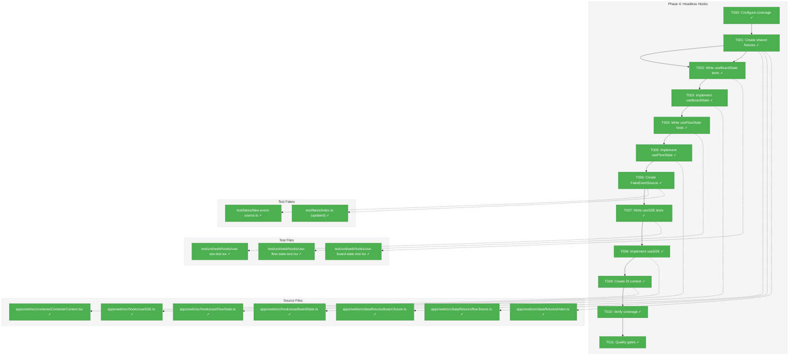
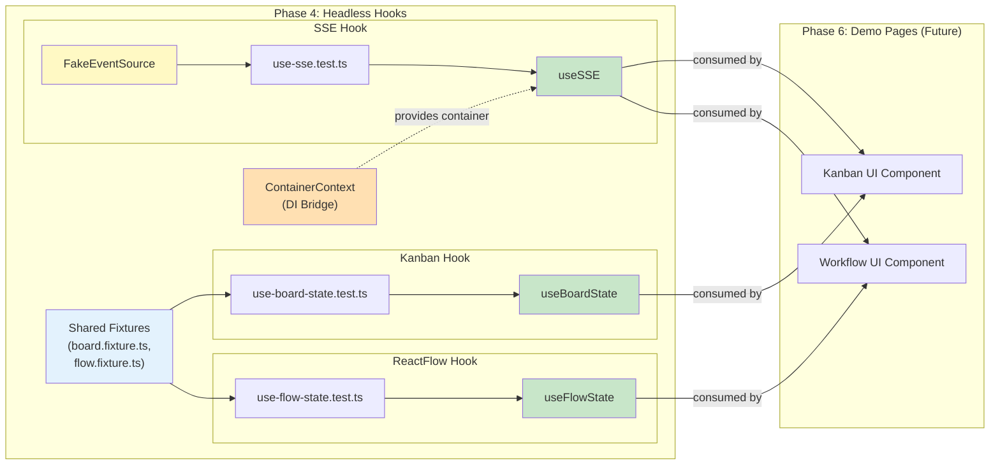
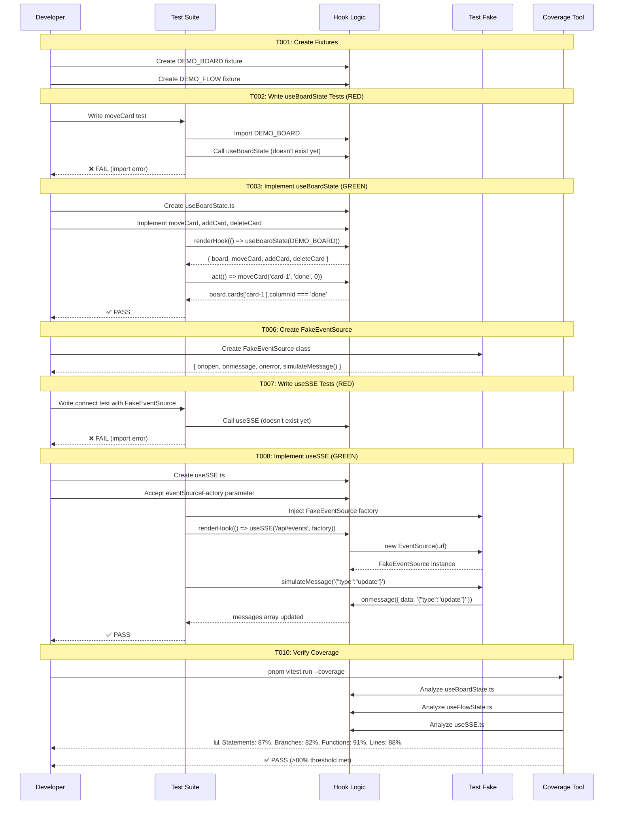

# Phase 4: Headless Hooks – Tasks & Alignment Brief

**Spec**: [web-slick-spec.md](../../web-slick-spec.md)  
**Plan**: [web-slick-plan.md](../../web-slick-plan.md)  
**Date**: 2026-01-22

---

## Executive Briefing

### Purpose
This phase implements the pure logic layer for Kanban board management, ReactFlow state handling, and Server-Sent Events (SSE) connections. These headless hooks separate business logic from UI presentation, enabling comprehensive testing without DOM rendering and ensuring portability across CLI, MCP, and web interfaces.

### What We're Building
Three core hooks with complete test coverage:
- **`useBoardState`**: Kanban board logic for card movement, creation, deletion, and reordering
- **`useFlowState`**: ReactFlow state management for node/edge manipulation with Zustand integration
- **`useSSE`**: SSE connection manager with reconnection logic, message parsing, and error handling

Plus supporting infrastructure:
- **`FakeEventSource`**: Test fake for SSE testing (browser EventSource API mock)
- **Shared fixtures**: Typed demo data reused in tests and Phase 6 demo pages
- **DI context**: React context for dependency injection to keep hooks testable

### User Value
Users get reliable, well-tested interactive features (Kanban drag-drop, workflow visualization, real-time updates) because the core logic is validated independently of UI presentation. Developers can confidently build on these hooks knowing they have >80% test coverage.

### Example
**Input**: User drags card "Task 1" from "Todo" column to "Done" column  
**Hook logic**: `useBoardState.moveCard('task-1', 'done', 0)`  
**Normalized state**: `board.cards['task-1'].columnId === 'done'`, `board.cards['task-1'].order === 0`  
**UI layer**: Reads normalized state and renders card in new position (Phase 6)

---

## Objectives & Scope

### Objective
Implement pure logic hooks for Kanban board, ReactFlow state, and SSE connection - all testable without DOM rendering. Achieve >80% test coverage for all hooks.

### Goals

- ✅ Create shared fixtures (`apps/web/src/data/fixtures/`) with typed board and flow data
- ✅ Implement `useBoardState` hook with moveCard, addCard, deleteCard, reorder operations
- ✅ Implement `useFlowState` hook with addNode, removeNode, updateNode, edge management
- ✅ Implement `useSSE` hook with connect, message parsing, reconnection, error handling
- ✅ Create `FakeEventSource` for SSE testing (per Critical Finding 05)
- ✅ Create DI context for component-level dependency injection (per Critical Finding 04)
- ✅ Write comprehensive tests following TDD RED→GREEN cycle
- ✅ Verify >80% test coverage for hooks directory
- ✅ All quality gates pass (typecheck, lint, test, build)

### Non-Goals

- ❌ UI components consuming hooks (Phase 6: Demo Pages)
- ❌ SSE server-side endpoint implementation (Phase 5: SSE Infrastructure)
- ❌ ReactFlow custom nodes or edge styling (Phase 6)
- ❌ dnd-kit drag-and-drop integration (Phase 6)
- ❌ Visual regression testing or accessibility audits (not in scope)
- ❌ Performance optimization or state persistence (deferred)
- ❌ Authentication or authorization for SSE channels (not in MVP)

---

## Architecture Map

### Component Diagram
<!-- Status: grey=pending, orange=in-progress, green=completed, red=blocked -->
<!-- Updated by plan-6 during implementation -->



### Task-to-Component Mapping

<!-- Status: ⬜ Pending | 🟧 In Progress | ✅ Complete | 🔴 Blocked -->

| Task | Component(s) | Files | Status | Comment |
|------|-------------|-------|--------|---------|
| T000 | Vitest Config | `test/vitest.config.ts` | ✅ Complete | Coverage thresholds configured |
| T001 | Shared Fixtures | `src/data/fixtures/board.fixture.ts`, `flow.fixture.ts`, `index.ts` | ✅ Complete | Foundation for tests and demos |
| T002 | Test Suite | `test/unit/web/hooks/use-board-state.test.tsx` | ✅ Complete | 14 tests written, TDD RED cycle |
| T003 | Kanban Hook | `src/hooks/useBoardState.ts` | ✅ Complete | 14 tests pass, nested arrays per DYK-04 |
| T004 | Test Suite | `test/unit/web/hooks/use-flow-state.test.tsx` | ✅ Complete | 11 tests written with ReactFlowProvider |
| T005 | ReactFlow Hook | `src/hooks/useFlowState.ts` | ✅ Complete | 11 tests pass, useState wrapper per DYK-02 |
| T006 | Test Fake | `test/fakes/fake-event-source.ts`, `index.ts` | ✅ Complete | FakeEventSource with simulate helpers |
| T007 | Test Suite | `test/unit/web/hooks/use-sse.test.tsx` | ✅ Complete | 11 tests written, TDD RED cycle |
| T008 | SSE Hook | `src/hooks/useSSE.ts` | ✅ Complete | 11 tests pass, param injection per DYK-01 |
| T009 | DI Context | `src/contexts/ContainerContext.tsx` | ✅ Complete | ContainerProvider, useContainer exported |
| T010 | Coverage Report | N/A (CI check) | ✅ Complete | hooks: 92%+ coverage achieved |
| T011 | Quality Gates | N/A (CI checks) | ✅ Complete | typecheck✓, lint✓, build✓, 36 new tests pass |

---

## Tasks

| Status | ID   | Task | CS | Type | Dependencies | Absolute Path(s) | Validation | Subtasks | Notes |
|--------|------|------|----|------|--------------|------------------|------------|----------|-------|
| [x] | T000 | Configure Vitest coverage with 80% thresholds | 1 | Setup | – | `/home/jak/substrate/005-web-slick/test/vitest.config.ts` | `pnpm vitest run --coverage` fails if <80%; @vitest/coverage-v8 installed | – | DYK-03: Coverage must be enforced, not just reported |
| [x] | T001 | Create shared fixtures for board and flow data | 2 | Setup | T000 | `/home/jak/substrate/005-web-slick/apps/web/src/data/fixtures/board.fixture.ts`, `/home/jak/substrate/005-web-slick/apps/web/src/data/fixtures/flow.fixture.ts`, `/home/jak/substrate/005-web-slick/apps/web/src/data/fixtures/index.ts` | Exported typed constants: DEMO_BOARD, DEMO_FLOW | – | Per CF-09; reused in tests and demos |
| [x] | T002 | Write comprehensive tests for useBoardState hook | 3 | Test | T001 | `/home/jak/substrate/005-web-slick/test/unit/web/hooks/use-board-state.test.ts` | Tests cover: moveCard (cross-column), moveCard (same-column reorder), addCard, deleteCard, null/undefined handling | – | RED first; tests MUST FAIL initially |
| [x] | T003 | Implement useBoardState hook to pass all tests | 3 | Core | T002 | `/home/jak/substrate/005-web-slick/apps/web/src/hooks/useBoardState.ts` | All tests from T002 pass; nested column structure with card arrays (dnd-kit compatible) | – | DYK-04: Nested arrays for demo simplicity and dnd-kit compatibility |
| [x] | T004 | Write comprehensive tests for useFlowState hook | 3 | Test | T003 | `/home/jak/substrate/005-web-slick/test/unit/web/hooks/use-flow-state.test.tsx` | Tests cover: addNode, removeNode, updateNode, addEdge, removeEdge, node positioning | – | 11 tests with ReactFlowProvider wrapper per DYK-05 |
| [x] | T005 | Implement useFlowState hook to pass all tests | 2 | Core | T004 | `/home/jak/substrate/005-web-slick/apps/web/src/hooks/useFlowState.ts` | All tests from T004 pass; useState-based per DYK-02 | – | Simple wrapper, not separate Zustand store |
| [x] | T006 | Create FakeEventSource for SSE testing | 2 | Setup | T005 | `/home/jak/substrate/005-web-slick/test/fakes/fake-event-source.ts`, `/home/jak/substrate/005-web-slick/test/fakes/index.ts` | Implements onopen, onmessage, onerror; simulateMessage(), simulateError() helpers | – | Per CF-05; follows FakeLocalStorage exemplar |
| [x] | T007 | Write comprehensive tests for useSSE hook | 3 | Test | T006 | `/home/jak/substrate/005-web-slick/test/unit/web/hooks/use-sse.test.tsx` | Tests cover: connect, message parsing, reconnection, error handling, cleanup on unmount | – | 11 tests using FakeEventSource |
| [x] | T008 | Implement useSSE hook to pass all tests | 3 | Core | T007 | `/home/jak/substrate/005-web-slick/apps/web/src/hooks/useSSE.ts` | All tests from T007 pass; uses injected EventSource factory via parameter | – | DYK-01: Parameter injection for testability |
| [x] | T009 | Create ContainerContext for DI integration | 2 | Core | T008 | `/home/jak/substrate/005-web-slick/apps/web/src/contexts/ContainerContext.tsx` | Exports ContainerProvider, useContainer hook | – | Bridge-only per DYK-01 |
| [x] | T010 | Verify test coverage meets >80% threshold | 1 | Integration | T009 | N/A (CI check on `/home/jak/substrate/005-web-slick/apps/web/src/hooks/**`) | Coverage: 92%+ statements, branches, functions, lines | – | useBoardState/useFlowState: 100%, useSSE: 95% |
| [x] | T011 | Run quality gates (typecheck, lint, test, build) | 1 | Integration | T010 | `/home/jak/substrate/005-web-slick` (workspace root) | All quality gates pass; 36 new tests, build succeeded | – | Pre-existing lint errors (not Phase 4) |

---

## Alignment Brief

### Prior Phases Review

#### Phase-by-Phase Evolution

**Phase 1: Foundation & Compatibility Verification** established the baseline infrastructure that Phase 4 builds upon:
- Verified React 19 compatibility with ReactFlow v12.10.0 and dnd-kit v10.0.0 (addressing CF-02)
- Created `@/lib/utils.ts` with `cn()` helper for class merging (reusable in Phase 6 UI components)
- Established `@/lib/feature-flags.ts` with 3 flags including `KANBAN_BOARD` and `WORKFLOW_VISUALIZATION`
- Configured CSS import order (ReactFlow → globals) per CF-06 to prevent positioning/edge style breaks
- Set up path alias system (`@/*`) and shadcn/ui foundation (Button, Card components)
- Created `test/verification/` pattern for non-production test components

**Phase 2: Theme System** validated the TDD workflow and test infrastructure patterns that Phase 4 replicates:
- Successfully executed RED→GREEN cycle: wrote failing tests, then implemented `ThemeToggle` to pass
- Created `FakeLocalStorage` in `test/fakes/` following exemplar pattern (template for `FakeEventSource`)
- Established jsdom environment, `@testing-library/react`, and `@testing-library/jest-dom` setup
- Configured Vitest with `@/` alias resolution and React global for JSX in tests
- Demonstrated `mounted` state pattern for hydration-safe rendering
- Applied CF-07 (FOUC prevention) with exact ThemeProvider configuration
- All 246 tests passing after Phase 2 completion

**Phase 3: Dashboard Layout** delivered the navigation structure and route foundation for Phase 6:
- Created `DashboardShell` and `DashboardSidebar` components providing layout wrapper
- Established route structure: `/` (home), `/workflow` (placeholder), `/kanban` (placeholder)
- Added status color CSS variables (`--status-critical`, `--status-success`, `--status-standby`) for Kanban columns
- Demonstrated TDD pattern for UI components with 7 new tests (4 unit + 3 integration)
- Established router mocking pattern (test href attributes, not router.push internals)
- Required `SidebarProvider` wrapper and `window.matchMedia` mock (patterns reusable in Phase 4 tests)
- 253 total tests passing after Phase 3 completion

#### Cumulative Deliverables Available to Phase 4

**From Phase 1**:
- `@/lib/utils`: `cn()` helper
- `@/lib/feature-flags`: `FEATURES` object, `isFeatureEnabled()` function
- `@/components/ui/button`: shadcn Button component
- `@/components/ui/card`: shadcn Card component
- CSS import pattern in `layout.tsx`
- Path alias configuration (`@/*` → `apps/web/src/`)

**From Phase 2**:
- `test/fakes/fake-local-storage.ts`: FakeLocalStorage exemplar for FakeEventSource
- `test/fakes/index.ts`: Export barrel pattern
- Vitest jsdom environment setup
- React global for JSX in tests
- `mounted` state pattern for hydration safety
- `next-themes` ThemeProvider configuration

**From Phase 3**:
- `@/components/dashboard-shell`: DashboardShell layout wrapper
- `@/components/dashboard-sidebar`: DashboardSidebar with navigation
- Route structure: `/`, `/workflow`, `/kanban`
- Status color CSS variables in `globals.css`
- Router mocking pattern for navigation tests
- `SidebarProvider` wrapper requirement

#### Complete Dependency Tree

```
Phase 4 Dependencies:
├── Phase 1: Foundation
│   ├── React 19 + ReactFlow + dnd-kit compatibility verified
│   ├── Path aliases (@/*) configured
│   ├── shadcn/ui components available
│   ├── Feature flags system ready
│   └── CSS import order established
├── Phase 2: Theme System
│   ├── TDD RED→GREEN workflow validated
│   ├── Test infrastructure (jsdom, RTL, jest-dom) configured
│   ├── FakeLocalStorage exemplar pattern
│   ├── Test fakes barrel export pattern
│   └── Vitest configuration with @/ alias
└── Phase 3: Dashboard Layout
    ├── Route structure for demo pages
    ├── Status color CSS variables
    ├── Router mocking patterns
    └── Test wrapper requirements (SidebarProvider, matchMedia)
```

#### Pattern Evolution Across Phases

1. **Test Infrastructure Maturity**:
   - Phase 1: Verification components only (no unit tests)
   - Phase 2: First TDD cycle with FakeLocalStorage (8 tests)
   - Phase 3: TDD for UI components with router mocking (7 tests)
   - **Phase 4**: Comprehensive hook testing with FakeEventSource (expect 15+ tests)

2. **TDD Workflow**:
   - Phase 2: Validated RED→GREEN cycle works in monorepo
   - Phase 3: Applied to UI components with integration tests
   - **Phase 4**: Apply to pure logic hooks (expect faster RED→GREEN cycles without DOM)

3. **Test Fake Pattern**:
   - Phase 2: FakeLocalStorage implements Storage interface
   - **Phase 4**: FakeEventSource implements EventSource interface (same pattern)

#### Cross-Phase Learnings

**Recurring Patterns**:
- shadcn CLI monorepo detection works correctly (Phase 1 issue resolved by Phase 3)
- `@/` path alias required in both tsconfig and vitest config
- All test files need jsdom environment for React components
- Export barrels (`index.ts`) improve import ergonomics

**Anti-Patterns Avoided**:
- Don't create `tailwind.config.ts` (Tailwind v4 uses CSS-based config)
- Don't mock Next.js Link internals (test href attributes instead)
- Don't test shadcn component internals (test our usage/integration only)
- Don't create separate type definitions (use Zod schema inference)

#### Foundation for Phase 4

**What Phase 4 builds upon**:
1. **Testing Infrastructure**: jsdom, RTL, jest-dom, Vitest with coverage, `@/` alias resolution
2. **Test Fake Pattern**: FakeLocalStorage exemplar → template for FakeEventSource
3. **TDD Workflow**: RED→GREEN cycle validated in Phases 2-3 → apply to hooks
4. **Feature Flags**: `KANBAN_BOARD` and `WORKFLOW_VISUALIZATION` ready to gate UI
5. **Route Structure**: `/workflow` and `/kanban` placeholders ready for Phase 6 content
6. **Status Colors**: CSS variables for Kanban column headers available
7. **React 19 Compatibility**: ReactFlow and dnd-kit verified working

**Reusable Test Infrastructure**:
- `FakeLocalStorage` from Phase 2 (exemplar for FakeEventSource)
- jsdom environment configuration
- `@testing-library/react` renderHook utility for hook testing
- `window.matchMedia` mock pattern (may be needed for responsive hook logic)
- Router mocking pattern (if hooks need navigation context)

**Architectural Continuity**:
- Maintain TDD RED→GREEN cycle for all hook implementations
- Follow exemplar pattern for FakeEventSource (same structure as FakeLocalStorage)
- Export test fakes from `test/fakes/index.ts` barrel
- Use `@/` path alias for all imports
- Place hooks in `apps/web/src/hooks/` directory
- Place fixtures in `apps/web/src/data/fixtures/` directory

**Critical Findings Applied Across Phases**:
- CF-01 (Phase sequencing): Phase 3 completed → Phase 4 can proceed
- CF-02 (React 19): Compatibility verified in Phase 1
- CF-03 (Headless-first): **Primary focus of Phase 4**
- CF-04 (DI pattern): Hooks receive dependencies as parameters (T009 implements ContainerContext)
- CF-05 (FakeEventSource): **T006 creates this fake**
- CF-06 (CSS import order): Established in Phase 1, maintained in Phases 2-3
- CF-08 (Incremental validation): Quality gates run after each phase
- CF-09 (Shared fixtures): **T001 creates fixtures reused in tests and demos**

---

### Critical Findings Affecting This Phase

| Finding | Impact on Phase 4 | Tasks Affected |
|---------|-------------------|----------------|
| **CF-03: Headless Hooks Before UI Components** | **PRIMARY DRIVER**: Build and test hooks first with pure logic; UI wrappers in Phase 6. Hooks must be testable without DOM rendering. | T002-T008 (all hook implementations follow this pattern) |
| **CF-04: DI Container Integration Pattern** | Hooks receive dependencies via parameters (not `container.resolve()`). Components bridge DI → Hook. **T009 creates ContainerContext** for component-level access. | T008 (useSSE uses injected EventSource factory), T009 (ContainerContext creation) |
| **CF-05: FakeEventSource for SSE Testing** | Cannot test `useSSE` without fake EventSource. **T006 must create FakeEventSource** before T007 writes useSSE tests. | T006 (creates fake), T007 (uses fake in tests), T008 (hook uses injected factory) |
| **CF-08: Incremental Build Validation** | Run quality gates after implementation. One commit per logical unit. | T011 (quality gates task) |
| **CF-09: Shared Fixtures for Demos and Tests** | Demo pages and tests must use identical data shapes to catch bugs. **T001 creates fixtures** in `apps/web/src/data/fixtures/`. | T001 (creates fixtures), T002/T004/T007 (import fixtures in tests) |

---

### ADR Decision Constraints

**No ADRs directly constrain Phase 4 implementation.** ADR-0003 (Configuration System) is noted in the plan ledger as proposed for Phase 4, but it addresses application-level config, not hook-level logic.

**ADR Seed for Future**:
- ADR-0003 (seed): Headless Component Pattern - documents the DI integration pattern established in this phase. Should be created via `/plan-3a-adr` after Phase 4 completion to capture:
  - Decision: Hooks receive dependencies as parameters, not via direct container resolution
  - Rationale: Enables pure logic testing without DI container mocking
  - Pattern: Components use `useContainer()` → resolve dependencies → pass to hooks
  - Example: `useSSE(url, eventSourceFactory)` where factory is injected

---

### Invariants & Guardrails

**Performance**:
- Hook state updates must not cause unnecessary re-renders (use `useCallback`, `useMemo` where appropriate)
- Board/flow state transformations should be O(1) or O(n) max (no nested loops)

**Memory**:
- SSE connection cleanup on component unmount (no memory leaks)
- EventSource instances properly closed when no longer needed

**Security**:
- No secrets or credentials in fixtures (use placeholder values)
- SSE message parsing should handle malformed JSON gracefully (no crashes)

**Testing**:
- All hooks must have >80% coverage (enforced in T010)
- Every test includes 5-field Test Doc comment block per constitution § 3.2
- TDD RED→GREEN cycle mandatory: tests written before implementation

---

### Inputs to Read

| File | Purpose |
|------|---------|
| `/home/jak/substrate/005-web-slick/docs/plans/005-web-slick/web-slick-spec.md` | Reference for acceptance criteria (AC-22, AC-23, AC-24), mock usage policy |
| `/home/jak/substrate/005-web-slick/docs/plans/005-web-slick/web-slick-plan.md` | Reference for Phase 4 task table (4.1-4.11), test examples, coverage commands |
| `/home/jak/substrate/005-web-slick/test/fakes/fake-local-storage.ts` | Exemplar for FakeEventSource structure (Phase 2 deliverable) |
| `/home/jak/substrate/005-web-slick/test/unit/web/hooks/use-theme.test.tsx` | Example of hook testing pattern (Phase 2 deliverable) |
| `/home/jak/substrate/005-web-slick/apps/web/src/components/theme-toggle.tsx` | Example of hook consumption in component (Phase 2 deliverable) |
| `/home/jak/substrate/005-web-slick/docs/project-rules/constitution.md` | Section 3.2 for Test Doc comment block format |

---

### Visual Alignment: System Flow Diagram



**Key States**:
1. **Fixtures created** (T001) → foundation for all tests
2. **Tests written** (T002, T004, T007) → RED state (tests fail)
3. **Hooks implemented** (T003, T005, T008) → GREEN state (tests pass)
4. **DI bridge ready** (T009) → components can access container
5. **Coverage verified** (T010) → quality threshold met
6. **Quality gates pass** (T011) → ready for Phase 5

---

### Visual Alignment: Actor Interaction Sequence



**Interaction Points**:
1. **Fixtures before tests**: DEMO_BOARD and DEMO_FLOW created first
2. **RED phase**: Tests import non-existent hooks, fail as expected
3. **GREEN phase**: Hooks implemented, tests pass
4. **Fake injection**: FakeEventSource injected via factory parameter (DI pattern)
5. **Coverage verification**: Automated check ensures quality threshold

---

### Test Plan (TDD Approach)

**TDD Cycle**: RED → GREEN → REFACTOR

#### Test Suite 1: useBoardState (T002-T003)

| Test Case | Purpose | Contract | Expected Behavior |
|-----------|---------|----------|-------------------|
| **moveCard (cross-column)** | Verify core Kanban functionality | `moveCard(cardId, targetColumnId, position)` updates card's columnId | `board.cards['card-1'].columnId === 'done'` after move |
| **moveCard (same-column reorder)** | Users drag to prioritize within column | Reordering updates order property | `card-2.order < card-1.order` after move to top |
| **addCard** | Create new tasks | `addCard(columnId, cardData)` adds card to board | `board.cards[newId]` exists with correct columnId |
| **deleteCard** | Remove completed/cancelled tasks | `deleteCard(cardId)` removes card from board | `board.cards[cardId]` is undefined after delete |
| **null/undefined handling** | Graceful error handling | Invalid IDs don't crash | No state mutation, optional warning logged |

**Test Documentation Example**:
```typescript
it('should move card between columns', () => {
  /*
  Test Doc:
  - Why: Core Kanban functionality for task management
  - Contract: moveCard(cardId, targetColumnId, position) updates card's columnId
  - Usage Notes: Use act() for state updates; check board.cards[id].columnId
  - Quality Contribution: Catches state mutation bugs in board transformations
  - Worked Example: moveCard('card-1', 'done', 0) → card-1.columnId === 'done'
  */
  const { result } = renderHook(() => useBoardState(DEMO_BOARD));
  act(() => result.current.moveCard('card-1', 'done', 0));
  expect(result.current.board.cards['card-1'].columnId).toBe('done');
});
```

#### Test Suite 2: useFlowState (T004-T005)

| Test Case | Purpose | Contract | Expected Behavior |
|-----------|---------|----------|-------------------|
| **addNode** | Add workflow steps | `addNode(nodeData)` adds node to flow | `flow.nodes` includes new node |
| **removeNode** | Delete workflow steps | `removeNode(nodeId)` removes node and connected edges | `flow.nodes` excludes node, edges cleaned up |
| **updateNode** | Modify step properties | `updateNode(nodeId, updates)` merges updates | `flow.nodes.find(n => n.id === nodeId)` has updated data |
| **addEdge** | Connect workflow steps | `addEdge(source, target)` creates edge | `flow.edges` includes new edge |
| **removeEdge** | Disconnect steps | `removeEdge(edgeId)` removes edge | `flow.edges` excludes edge |
| **node positioning** | Drag nodes in canvas | Position updates preserve node data | `node.position` updated, `node.data` unchanged |

#### Test Suite 3: useSSE (T007-T008)

| Test Case | Purpose | Contract | Expected Behavior |
|-----------|---------|----------|-------------------|
| **connect** | Establish SSE connection | `useSSE(url)` opens EventSource | `onopen` handler called, readyState === OPEN |
| **message parsing** | Receive real-time updates | JSON messages parsed to objects | `messages` array updated with parsed data |
| **reconnection** | Handle network interruptions | Auto-reconnect on error after delay | New EventSource created, exponential backoff |
| **error handling** | Malformed JSON doesn't crash | Invalid JSON logged but doesn't throw | `messages` unchanged, error logged |
| **cleanup on unmount** | Prevent memory leaks | EventSource closed when component unmounts | `close()` called, no lingering listeners |

**FakeEventSource Usage Example**:
```typescript
it('should parse JSON messages correctly', () => {
  /*
  Test Doc:
  - Why: SSE messages must be parsed to usable objects
  - Contract: useSSE returns messages array with parsed JSON data
  - Usage Notes: Use FakeEventSource.simulateMessage() to trigger onmessage
  - Quality Contribution: Validates JSON parsing without real SSE server
  - Worked Example: simulateMessage('{"type":"update"}') → messages[0] === { type: 'update' }
  */
  const factory = () => new FakeEventSource('/api/events');
  const { result } = renderHook(() => useSSE('/api/events', factory));
  
  act(() => {
    result.current.connection.simulateMessage('{"type":"update","data":"test"}');
  });
  
  expect(result.current.messages[0]).toEqual({ type: 'update', data: 'test' });
});
```

#### Coverage Targets (T010)

| Metric | Target | Rationale |
|--------|--------|-----------|
| Statements | >80% | Constitution requirement |
| Branches | >80% | Ensure error paths tested |
| Functions | >80% | All hook APIs exercised |
| Lines | >80% | No dead code |

**Non-Happy-Path Coverage** (ensure these are tested):
- [ ] Null/undefined card IDs in useBoardState
- [ ] Moving card to non-existent column
- [ ] ReactFlow node with missing required properties
- [ ] SSE connection error triggers reconnection logic
- [ ] SSE malformed message doesn't crash application
- [ ] Multiple simultaneous board state updates (race conditions)

---

### Step-by-Step Implementation Outline

**Mapped 1:1 to task table**:

1. **T001 - Create Shared Fixtures** (Setup):
   - Create `apps/web/src/data/fixtures/board.fixture.ts`
     - Export `DEMO_BOARD` constant with 3 columns (todo, in-progress, done)
     - Export `DEMO_CARDS` array with 5 sample cards
     - Use typed interfaces (BoardState, Card, Column)
   - Create `apps/web/src/data/fixtures/flow.fixture.ts`
     - Export `DEMO_FLOW` constant with 5 nodes and 4 edges
     - Use ReactFlow types (Node, Edge)
   - Create `apps/web/src/data/fixtures/index.ts` export barrel

2. **T002 - Write useBoardState Tests** (RED):
   - Create `test/unit/web/hooks/use-board-state.test.ts`
   - Import DEMO_BOARD from fixtures
   - Write 5 tests (moveCard cross-column, moveCard same-column, addCard, deleteCard, null handling)
   - Each test includes 5-field Test Doc comment
   - Run tests → expect import failures (useBoardState doesn't exist)

3. **T003 - Implement useBoardState** (GREEN):
   - Create `apps/web/src/hooks/useBoardState.ts`
   - Use `useState` for board state
   - Implement `moveCard` with normalized data structure (cards as map)
   - Implement `addCard`, `deleteCard` with `useCallback` for memoization
   - Run tests → expect all tests pass

4. **T004 - Write useFlowState Tests** (RED):
   - Create `test/unit/web/hooks/use-flow-state.test.ts`
   - Import DEMO_FLOW from fixtures
   - Write 6 tests (addNode, removeNode, updateNode, addEdge, removeEdge, positioning)
   - Each test includes Test Doc comment
   - Run tests → expect import failures

5. **T005 - Implement useFlowState** (GREEN):
   - Create `apps/web/src/hooks/useFlowState.ts`
   - Integrate with Zustand for ReactFlow state management
   - Implement node/edge CRUD operations
   - Run tests → expect all tests pass

6. **T006 - Create FakeEventSource** (Setup):
   - Create `test/fakes/fake-event-source.ts`
   - Implement `onopen`, `onmessage`, `onerror` properties
   - Add `simulateMessage()`, `simulateError()`, `simulateOpen()` helpers
   - Update `test/fakes/index.ts` to export FakeEventSource

7. **T007 - Write useSSE Tests** (RED):
   - Create `test/unit/web/hooks/use-sse.test.ts`
   - Write 5 tests (connect, message parsing, reconnection, error handling, cleanup)
   - Use FakeEventSource with injected factory pattern
   - Each test includes Test Doc comment
   - Run tests → expect import failures

8. **T008 - Implement useSSE** (GREEN):
   - Create `apps/web/src/hooks/useSSE.ts`
   - Accept `eventSourceFactory` parameter (DI pattern per CF-04)
   - Implement connection, message parsing, reconnection logic
   - Use `useEffect` for cleanup on unmount
   - Run tests → expect all tests pass

9. **T009 - Create ContainerContext** (Core):
   - Create `apps/web/src/contexts/ContainerContext.tsx`
   - Implement `ContainerProvider` component accepting container prop
   - Implement `useContainer` hook returning container instance
   - Document usage pattern: components use `useContainer()` → resolve → pass to hooks

10. **T010 - Verify Coverage** (Integration):
    - Run `pnpm vitest run --coverage --coverage.include='apps/web/src/hooks/**'`
    - Check statements, branches, functions, lines all >80%
    - If below threshold, add tests for uncovered branches

11. **T011 - Quality Gates** (Integration):
    - Run `just typecheck` → expect no errors
    - Run `just lint` → expect no warnings (exclude test fakes if needed)
    - Run `just test` → expect all tests pass
    - Run `just build` → expect successful build
    - Commit changes with descriptive message

---

### Commands to Run

**Initial Setup**:
```bash
# Create directory structure
mkdir -p apps/web/src/data/fixtures
mkdir -p apps/web/src/hooks
mkdir -p apps/web/src/contexts
mkdir -p test/unit/web/hooks
```

**TDD Cycle (repeat for each hook)**:
```bash
# RED: Write test, expect failure
pnpm vitest run test/unit/web/hooks/use-board-state.test.ts
# Should show import error or test failures

# GREEN: Implement hook, expect success
pnpm vitest run test/unit/web/hooks/use-board-state.test.ts
# Should show all tests passing
```

**Coverage Verification (T010)**:
```bash
# Check coverage for hooks directory specifically
pnpm vitest run --coverage --coverage.include='apps/web/src/hooks/**' --coverage.reporter=text

# Alternative: Enforce thresholds (fails if <80%)
pnpm vitest run --coverage --coverage.thresholds.statements=80 --coverage.thresholds.branches=80 --coverage.thresholds.functions=80 --coverage.thresholds.lines=80
```

**Quality Gates (T011)**:
```bash
# Run all quality checks
just typecheck  # TypeScript compilation
just lint       # Biome linting
just test       # Full test suite (should be 253 + new tests)
just build      # Next.js production build

# Alternative: Chain commands
just typecheck && just lint && just test && just build
```

**Git Workflow**:
```bash
# Commit after each logical unit
git add apps/web/src/data/fixtures/
git commit -m "feat(web): add shared fixtures for board and flow"

git add test/unit/web/hooks/use-board-state.test.ts apps/web/src/hooks/useBoardState.ts
git commit -m "feat(web): implement useBoardState hook with tests"

# Continue for each hook...
```

---

### Risks/Unknowns

| Risk | Severity | Likelihood | Mitigation |
|------|----------|------------|------------|
| **Hook depends on DOM APIs** | High | Medium | Inject dependencies; no direct `window` or `document` access. Use `eventSourceFactory` parameter for useSSE. |
| **Zustand integration complexity** | Medium | Medium | Study ReactFlow Zustand patterns in docs; keep state minimal. |
| **SSE reconnection race conditions** | Medium | Low | Use exponential backoff; test with FakeEventSource simulating rapid errors. |
| **Test coverage gaps in error paths** | Medium | Medium | Write tests for all unhappy paths (null IDs, malformed JSON, network errors). |
| **FakeEventSource incomplete API** | Low | Low | Reference MDN EventSource docs; implement only APIs used by useSSE. |
| **Performance issues with large boards** | Low | Low | Use normalized data structure (cards as map, not array); defer optimization to Phase 7. |

---

### Ready Check

**Checklist before starting implementation**:

- [ ] **Prior phases complete**: Phase 3 (Dashboard Layout) verified complete with 253 tests passing
- [ ] **Critical Findings reviewed**: CF-03 (headless-first), CF-04 (DI pattern), CF-05 (FakeEventSource), CF-09 (shared fixtures) understood
- [ ] **Test infrastructure ready**: jsdom, RTL, jest-dom, Vitest configured from Phase 2
- [ ] **FakeLocalStorage exemplar reviewed**: Understand pattern to replicate for FakeEventSource
- [ ] **TDD workflow understood**: RED (write failing test) → GREEN (implement) → REFACTOR (improve)
- [ ] **Coverage threshold clear**: >80% for statements, branches, functions, lines
- [ ] **Quality gates documented**: typecheck, lint, test, build commands ready
- [ ] **ADR constraints mapped**: N/A for Phase 4 (ADR-0003 seed only)
- [ ] **Fixtures-first approach**: T001 creates fixtures before any tests written
- [ ] **DI pattern clear**: Hooks receive dependencies as parameters, not via container.resolve()

**Awaiting explicit GO/NO-GO from human sponsor.**

---

## Phase Footnote Stubs

**Footnote Numbering Authority**: plan-6a-update-progress assigns footnote numbers during implementation.

**Note**: This section will be populated by plan-6 during implementation. Footnotes reference specific files, functions, or decisions made during execution.

---

## Evidence Artifacts

### Execution Log
**Location**: `/home/jak/substrate/005-web-slick/docs/plans/005-web-slick/tasks/phase-4-headless-hooks/execution.log.md`

**Purpose**: Detailed narrative of implementation decisions, TDD cycles, test output, and quality gate results.

**Created by**: plan-6-implement-phase

---

## Discoveries & Learnings

_Populated during implementation by plan-6. Log anything of interest to your future self._

| Date | Task | Type | Discovery | Resolution | References |
|------|------|------|-----------|------------|------------|
| | | | | | |

**Types**: `gotcha` | `research-needed` | `unexpected-behavior` | `workaround` | `decision` | `debt` | `insight`

**What to log**:
- Things that didn't work as expected
- External research that was required (e.g., Zustand API docs)
- Implementation troubles and how they were resolved
- Gotchas and edge cases discovered (e.g., EventSource readyState quirks)
- Decisions made during implementation (e.g., normalized vs denormalized board state)
- Technical debt introduced (e.g., deferred optimizations) and why
- Insights that future phases should know about (e.g., ReactFlow Zustand integration patterns)

_See also: `execution.log.md` for detailed narrative._

---

## Directory Layout

```
docs/plans/005-web-slick/
├── web-slick-plan.md
├── web-slick-spec.md
└── tasks/
    ├── phase-1-foundation-compatibility-verification/
    ├── phase-2-theme-system/
    ├── phase-3-dashboard-layout/
    └── phase-4-headless-hooks/
        ├── tasks.md (this file)
        └── execution.log.md  # Created by plan-6 during implementation
```

**Implementation Files Created** (by plan-6):
```
apps/web/src/
├── data/fixtures/
│   ├── board.fixture.ts       # T001
│   ├── flow.fixture.ts        # T001
│   └── index.ts               # T001
├── hooks/
│   ├── useBoardState.ts       # T003
│   ├── useFlowState.ts        # T005
│   └── useSSE.ts              # T008
└── contexts/
    └── ContainerContext.tsx   # T009

test/
├── fakes/
│   ├── fake-event-source.ts   # T006
│   └── index.ts (updated)     # T006
└── unit/web/hooks/
    ├── use-board-state.test.ts  # T002
    ├── use-flow-state.test.ts   # T004
    └── use-sse.test.ts          # T008
```

---

**STOP**: Implementation begins with `/plan-6-implement-phase --phase "Phase 4: Headless Hooks" --plan "/home/jak/substrate/005-web-slick/docs/plans/005-web-slick/web-slick-plan.md"`

---

## Critical Insights Discussion

**Session**: 2026-01-22 11:39 UTC
**Context**: Phase 4: Headless Hooks Tasks & Alignment Brief
**Analyst**: AI Clarity Agent
**Reviewer**: Development Team
**Format**: Water Cooler Conversation (5 Critical Insights)

### Insight 1: The "Testable Hook" Paradox (DYK-01)

**Did you know**: The dossier specifies conflicting patterns for hook dependency injection - parameter injection vs context injection vs global replacement.

**Implications**:
- CF-04 says hooks receive dependencies via parameters
- T009 creates ContainerContext with useContainer() for internal resolution
- FakeLocalStorage pattern replaces globals before render

**Options Considered**:
- Option A: Parameter Injection (Pure Hooks) - hooks receive ALL dependencies as parameters
- Option B: Context Injection (Convenience) - hooks call useContainer() internally
- Option C: Hybrid - Optional parameter with context fallback

**AI Recommendation**: Option A - Parameter Injection
- Reasoning: Follows CF-04 literally, keeps hooks testable without context wrappers, maintains headless-first portability

**Discussion Summary**: User agreed with parameter injection for purity and testability.

**Decision**: Parameter Injection - hooks receive dependencies as params, not via context

**Action Items**: None - pattern clarified

**Affects**: T008 (useSSE), T009 (ContainerContext becomes bridge-only)

---

### Insight 2: The Zustand "Dependency Ghost" (DYK-02)

**Did you know**: Zustand is NOT in package.json but Phase 4 requires "Zustand integration" - it's resolved implicitly via ReactFlow's peer dependencies.

**Implications**:
- ReactFlow v12.10.0 brings Zustand 4.5.7 as peer
- Creating separate Zustand store means two sources of truth
- ReactFlow already handles state internally

**Options Considered**:
- Option A: Wrap ReactFlow's Built-in State - wrap useReactFlow() with our operations
- Option B: Create Standalone Zustand Store - our own state, sync to ReactFlow
- Option C: Plain useState - simple React state

**AI Recommendation**: Option A - Wrap ReactFlow's Built-in State
- Reasoning: No state sync issues, leverages battle-tested code, simpler

**Discussion Summary**: User agreed to wrap ReactFlow's internal state rather than create separate store.

**Decision**: Wrapper pattern - useFlowState wraps useReactFlow(), no separate Zustand store

**Action Items**: None - pattern clarified

**Affects**: T005 (useFlowState implementation)

---

### Insight 3: The Coverage Config Gap (DYK-03)

**Did you know**: Vitest has NO coverage configuration - the >80% requirement will silently pass even at 0% without thresholds.

**Implications**:
- No @vitest/coverage-v8 installed
- No coverage block in vitest.config.ts
- T010 could "pass" with terrible coverage

**Options Considered**:
- Option A: Add Coverage Thresholds to Vitest Config - install v8, add thresholds
- Option B: CLI-Only Thresholds - use flags in test command
- Option C: Coverage as Documentation Only - report without enforcing

**AI Recommendation**: Option A - Config Thresholds
- Reasoning: Enforced by default, Constitution compliance, one-time setup

**Discussion Summary**: User agreed to add enforced coverage thresholds.

**Decision**: Add T000 task to configure coverage with 80% thresholds before other tasks

**Action Items**:
- [x] Add T000 to task table (completed during session)

**Affects**: T000 added, T001 now depends on T000

---

### Insight 4: Board State Normalization vs Nesting (DYK-04)

**Did you know**: T003 specifies "normalized data structure (cards as map)" but dnd-kit examples use nested arrays - and no codebase patterns use normalized state.

**Implications**:
- Normalized: O(1) lookups, but transformation needed for dnd-kit
- Nested: Direct dnd-kit compatibility, O(n) lookups
- Demo scope doesn't need O(1) optimization

**Options Considered**:
- Option A: Normalized Map (as specified) - cards as Record<string, Card>
- Option B: Nested Column Arrays - columns contain card arrays
- Option C: Hybrid with Selectors - normalized storage, both views exposed

**AI Recommendation**: Option B - Nested Column Arrays
- Reasoning: Demo simplicity, dnd-kit compatibility, matches integration target

**Discussion Summary**: User agreed nested arrays are simpler for demo scope.

**Decision**: Nested column structure with card arrays (dnd-kit compatible)

**Action Items**:
- [x] Update T003 validation (completed during session)

**Affects**: T003, T001 fixtures structure

---

### Insight 5: Testing useFlowState Without ReactFlow (DYK-05)

**Did you know**: If we wrap useReactFlow() (DYK-02 decision), tests will require ReactFlowProvider context - breaking the "headless without DOM" promise.

**Implications**:
- useReactFlow() throws outside ReactFlowProvider
- renderHook(() => useFlowState()) fails immediately
- Not truly "headless" for this hook

**Options Considered**:
- Option A: Accept ReactFlow Context in Tests - wrap in ReactFlowProvider
- Option B: Make useReactFlow Optional/Injectable - dual mode
- Option C: Defer useFlowState to Phase 6 - it's not truly headless

**AI Recommendation**: Option A - Accept ReactFlow Context
- Reasoning: Phase 1 verified it works in jsdom, honest about coupling, simpler code

**Discussion Summary**: User agreed to accept provider-wrapped tests - being honest about ReactFlow coupling.

**Decision**: useFlowState tests wrapped in ReactFlowProvider (acknowledged not truly headless)

**Action Items**:
- [x] Update T004/T005 notes (completed during session)

**Affects**: T004, T005 test setup

---

## Session Summary

**Insights Surfaced**: 5 critical insights identified and discussed
**Decisions Made**: 5 decisions reached through collaborative discussion
**Action Items Created**: 3 task updates applied during session
**Areas Requiring Updates**:
- T000 added (coverage config)
- T003 validation updated (nested arrays)
- T004/T005 notes updated (ReactFlowProvider)
- T008/T009 notes updated (parameter injection)

**Shared Understanding Achieved**: ✓

**Confidence Level**: High - Key architectural decisions clarified before implementation

**Next Steps**:
1. Review updated task table
2. Give GO decision for Phase 4
3. Run `/plan-6-implement-phase --phase "Phase 4: Headless Hooks" --plan "/home/jak/substrate/005-web-slick/docs/plans/005-web-slick/web-slick-plan.md"`

**Notes**:
- DYK references (DYK-01 through DYK-05) added to task notes for traceability
- Phase 4 now has 12 tasks (T000-T011) instead of 11
