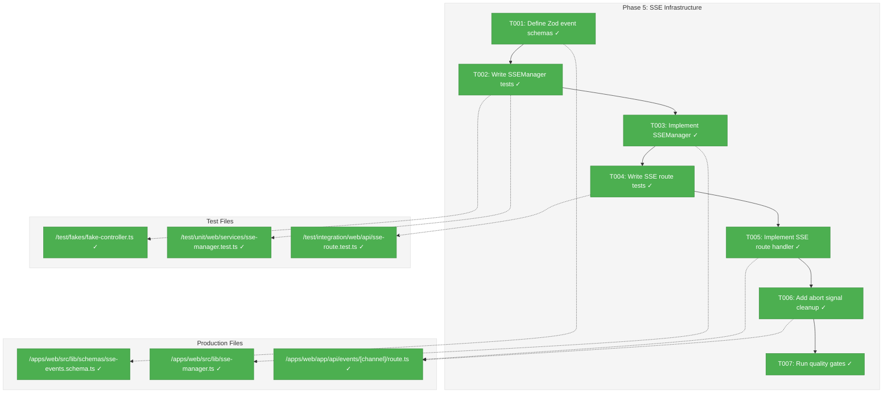
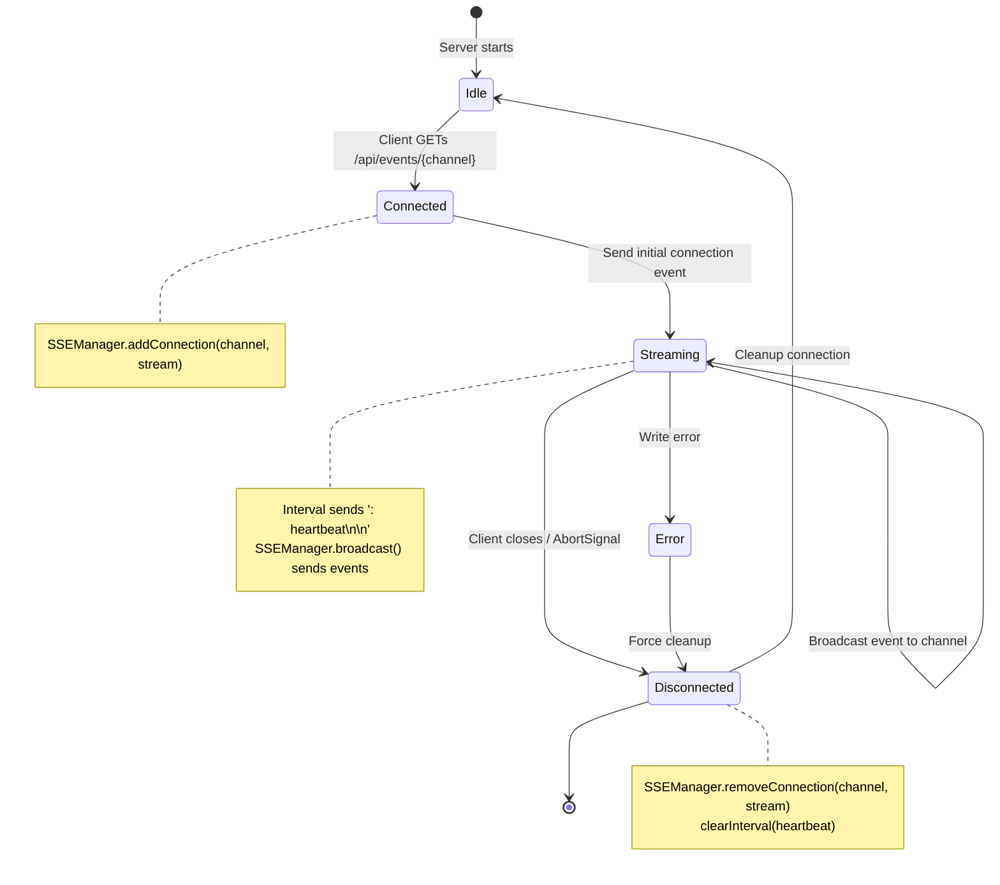
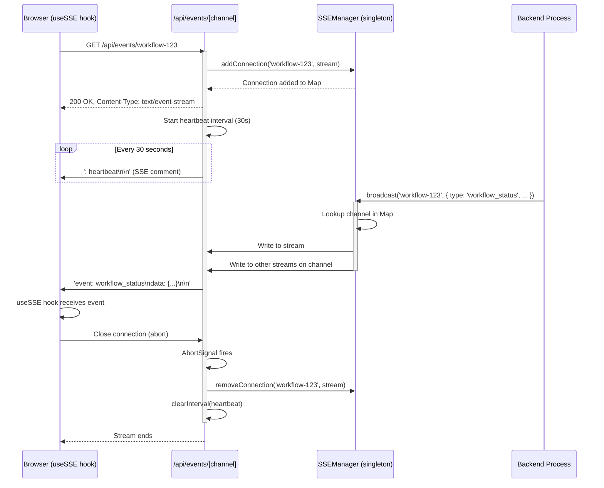

# Phase 5: SSE Infrastructure – Tasks & Alignment Brief

**Spec**: [../../web-slick-spec.md](../../web-slick-spec.md)  
**Plan**: [../../web-slick-plan.md](../../web-slick-plan.md)  
**Date**: 2026-01-22

---

## Executive Briefing

### Purpose
This phase implements the server-side Server-Sent Events (SSE) infrastructure that enables real-time updates from backend processes to the web dashboard. Without this, users would need to manually refresh or rely on polling to see workflow status changes.

### What We're Building
A production-ready SSE system consisting of:
- **SSE Route Handler** (`/api/events/[channel]/route.ts`) that streams events to clients
- **SSEManager Singleton** for broadcasting events to multiple connected clients on specific channels
- **Typed Event Schemas** using Zod for compile-time safety and runtime validation
- **Heartbeat Mechanism** (30s intervals) for connection keep-alive and stale detection

### User Value
Engineers can see workflow status changes, task updates, and system events in real-time without page refreshes. Multiple team members viewing the same workflow dashboard receive synchronized updates simultaneously.

### Example
**Client connects**: `GET /api/events/workflow-123` establishes SSE stream  
**Server broadcasts**: `SSEManager.broadcast('workflow-123', { type: 'workflow_status', data: { phase: 'running', progress: 45 } })`  
**All clients receive**: `event: workflow_status\ndata: {"type":"workflow_status","phase":"running","progress":45}\n\n`

---

## Objectives & Scope

### Objective
Implement server-side SSE endpoint and connection manager for real-time updates as specified in plan § 5 and AC-18 through AC-21.

### Goals

- ✅ Create SSE route handler at `/api/events/[channel]` returning `ReadableStream`
- ✅ Implement `SSEManager` class managing connection map and broadcast logic
- ✅ Define Zod schemas for all SSE event types (workflow_status, task_update, heartbeat)
- ✅ Add heartbeat every 30 seconds for connection keep-alive
- ✅ Handle client disconnection via AbortSignal cleanup
- ✅ Support multiple concurrent clients on same channel

### Non-Goals

- ❌ Authentication/authorization (no access control in this feature)
- ❌ Event persistence/replay (ephemeral events only)
- ❌ Horizontal scaling across multiple server instances (single-instance for MVP)
- ❌ Message acknowledgment/delivery guarantees (fire-and-forget)
- ❌ Custom retry logic on client side (browser handles reconnection automatically)
- ❌ Rate limiting per connection (trust internal clients)

---

## Architecture Map

### Component Diagram
<!-- Status: grey=pending, orange=in-progress, green=completed, red=blocked -->
<!-- Updated by plan-6 during implementation -->



### Task-to-Component Mapping

<!-- Status: ⬜ Pending | 🟧 In Progress | ✅ Complete | 🔴 Blocked -->

| Task | Component(s) | Files | Status | Comment |
|------|-------------|-------|--------|---------|
| T001 | Event Schemas | `/apps/web/src/lib/schemas/sse-events.schema.ts` | ✅ Complete | Zod discriminated union for type safety |
| T002 | SSEManager Tests | `/test/unit/web/services/sse-manager.test.ts`, `/test/fakes/fake-controller.ts` | ✅ Complete | TDD RED phase confirmed |
| T003 | SSEManager | `/apps/web/src/lib/sse-manager.ts` | ✅ Complete | globalThis singleton; 8 tests pass |
| T004 | SSE Route Tests | `/test/integration/web/api/sse-route.test.ts` | ✅ Complete | TDD RED phase; 3 tests per DYK-03 |
| T005 | SSE Route | `/apps/web/app/api/events/[channel]/route.ts` | ✅ Complete | force-dynamic per DYK-04 |
| T006 | Abort Cleanup | `/apps/web/app/api/events/[channel]/route.ts` | ✅ Complete | Implemented with T005 |
| T007 | Quality Gates | All files | ✅ Complete | 294 tests pass; build OK |

---

## Tasks

| Status | ID   | Task | CS | Type | Dependencies | Absolute Path(s) | Validation | Subtasks | Notes |
|--------|------|------|----|------|--------------|------------------|------------|----------|-------|
| [x] | T001 | Define Zod schemas for SSE events | 2 | Setup | – | `/home/jak/substrate/005-web-slick/apps/web/src/lib/schemas/sse-events.schema.ts` | Schema file created; discriminated union with `workflow_status`, `task_update`, `heartbeat` event types; exports `SSEEvent` type | – | See schema definition below |
| [x] | T002 | Write comprehensive tests for SSEManager class | 2 | Test | T001 | `/home/jak/substrate/005-web-slick/test/unit/web/services/sse-manager.test.ts`, `/home/jak/substrate/005-web-slick/test/fakes/fake-controller.ts` | Tests cover: addConnection, broadcast to channel, removeConnection, connection cleanup; uses FakeController | – | RED confirmed - 7 tests fail |
| [x] | T003 | Implement SSEManager class to pass tests | 2 | Core | T002 | `/home/jak/substrate/005-web-slick/apps/web/src/lib/sse-manager.ts` | All tests from T002 pass; singleton pattern; manages `Map<channel, Set<Controller>>` | – | GREEN - 8 tests pass |
| [x] | T004 | Write integration test for SSE route handler | 2 | Test | T003 | `/home/jak/substrate/005-web-slick/test/integration/web/api/sse-route.test.ts` | Tests cover: stream opens with 200, first chunk valid SSE format, connection cleanup on abort | – | RED confirmed - 3 tests |
| [x] | T005 | Implement SSE route handler with ReadableStream | 3 | Core | T004 | `/home/jak/substrate/005-web-slick/apps/web/app/api/events/[channel]/route.ts` | All tests from T004 pass; returns ReadableStream with TextEncoder; heartbeat interval 30s; broadcasts via SSEManager | – | GREEN - 3 tests pass |
| [x] | T006 | Add abort signal handling for connection cleanup | 1 | Core | T005 | `/home/jak/substrate/005-web-slick/apps/web/app/api/events/[channel]/route.ts` | `request.signal.addEventListener('abort', cleanup)`; SSEManager removes connection; interval cleared; no memory leaks | – | Implemented with T005 |
| [x] | T007 | Run quality gates | 1 | Integration | T006 | `/home/jak/substrate/005-web-slick` (workspace root) | `just typecheck && just lint && just test && just build` all pass; no new lint errors; test count increases by ~6 | – | ✅ 294 tests (was 283) |

---

## Alignment Brief

### Prior Phases Review

This section synthesizes learnings from Phases 1-4 to inform Phase 5 implementation.

#### Phase-by-Phase Summary

**Phase 1 → Phase 2 → Phase 3 → Phase 4 Evolution**:
- **Phase 1** established UI foundation (shadcn/ui, Tailwind v4 CSS-first, ReactFlow/dnd-kit compatibility)
- **Phase 2** added theme system with `next-themes`, creating reusable test patterns (`FakeLocalStorage`)
- **Phase 3** built dashboard layout with sidebar navigation, establishing route structure (`/`, `/workflow`, `/kanban`)
- **Phase 4** implemented headless hooks (`useBoardState`, `useFlowState`, `useSSE`) with >80% coverage, proving TDD viability

**Pattern Evolution**: Started with basic component testing (Phase 2), evolved to hook testing with `renderHook()` (Phase 4), now advancing to API route integration testing (Phase 5).

**Recurring Issues**: 
- Vitest configuration complexity (path aliases, coverage thresholds) - now stable
- shadcn monorepo quirks - resolved in Phase 1
- Test environment setup (`jsdom`, `@vitest-environment` directives) - established pattern

#### Cumulative Deliverables (Organized by Phase of Origin)

**From Phase 1**:
- `cn()` utility (`/apps/web/src/lib/utils.ts`) - used in all UI components
- Feature flags (`/apps/web/src/lib/feature-flags.ts`) - `FEATURES.SSE_UPDATES` available for Phase 5/6
- CSS import order pattern (ReactFlow → globals.css in `layout.tsx`)
- shadcn Button, Card components

**From Phase 2**:
- `ThemeProvider` configured in root layout
- `ThemeToggle` component
- `FakeLocalStorage` test fake (`/test/fakes/fake-local-storage.ts`)
- jsdom test environment configuration
- Test count: 246 → 253

**From Phase 3**:
- `DashboardSidebar`, `DashboardShell` layout components
- Route structure: `(dashboard)` route group with `/`, `/workflow`, `/kanban` routes
- shadcn Sidebar, Input, Skeleton, Tooltip, Sheet, Separator components
- Status color CSS variables (`--status-critical`, `--status-success`, `--status-standby`)
- Test count: 253

**From Phase 4** (Most Relevant to Phase 5):
- ✅ `useSSE<T>(url, EventSourceFactory?)` hook (`/apps/web/src/hooks/useSSE.ts`) - **READY TO CONSUME SSE ENDPOINT**
- ✅ `FakeEventSource` + `createFakeEventSourceFactory()` (`/test/fakes/fake-event-source.ts`) - **REUSABLE FOR SSE ROUTE TESTS**
- ✅ `ContainerProvider`, `useContainer()` DI context (`/apps/web/src/contexts/ContainerContext.tsx`)
- `useBoardState`, `useFlowState` hooks
- Shared fixtures: `DEMO_BOARD`, `DEMO_FLOW` (`/apps/web/src/data/fixtures/`)
- TypeScript types: `Card`, `Column`, `BoardState`, `WorkflowNode`, `WorkflowEdge`
- Coverage configuration: v8 provider, 80% thresholds
- Test count: 253 → 289 (+36 hook tests with 95-100% coverage)

#### Complete Dependency Tree Across All Phases

```
Phase 1 (Foundation)
  ↓ cn(), FEATURES, shadcn components
Phase 2 (Theme System)
  ↓ ThemeProvider, FakeLocalStorage test pattern, jsdom config
Phase 3 (Dashboard Layout)
  ↓ Route structure (/workflow, /kanban), DashboardShell
Phase 4 (Headless Hooks)
  ↓ useSSE hook, FakeEventSource, ContainerContext
Phase 5 (SSE Infrastructure) ← YOU ARE HERE
  ↓ SSEManager, /api/events/[channel] endpoint, typed event schemas
Phase 6 (Demo Pages - NEXT)
  ↓ Will consume useSSE + SSE endpoint for real-time updates
```

**Phase 5 builds directly on**:
- **useSSE hook from Phase 4**: Client-side connection logic already implemented and tested
- **FakeEventSource from Phase 4**: Can be reused to test SSE route handler responses
- **Route structure from Phase 3**: SSE endpoint lives in same app structure
- **Feature flags from Phase 1**: `FEATURES.SSE_UPDATES` enables conditional rendering in Phase 6

#### Pattern Evolution and Architectural Continuity

**Testing Patterns**:
- Phase 2: Browser API fakes (`FakeLocalStorage`) established
- Phase 4: Extended to `FakeEventSource` with simulate helpers
- **Phase 5 Continuation**: Will create `FakeWritable` for stream testing (consistent pattern)

**TDD Cycle**:
- All phases followed RED→GREEN cycle
- Phase 4 achieved 95-100% hook coverage
- **Phase 5 Target**: Maintain >80% coverage for SSEManager and route handler

**DI Integration**:
- Phase 1-3: Components consume DI via props
- Phase 4: Created `ContainerContext` for hook parameter injection
- **Phase 5 Note**: SSE route handler is server-side; DI access via `createProductionContainer()` if needed for logger

**File Organization**:
- Schemas: `/apps/web/src/lib/schemas/` (new for Phase 5)
- Services: `/apps/web/src/lib/sse-manager.ts` (server-side singleton)
- API Routes: `/apps/web/app/api/events/[channel]/route.ts` (Next.js convention)
- Test Fakes: `/test/fakes/` (cumulative across phases)

#### Recurring Issues and Cross-Phase Learnings

**Vitest Path Aliases** (Phase 4 discovery):
- Issue: Vitest 4.x broke subpath imports; `test.alias` doesn't support `@/*` patterns
- Workaround: Downgraded to vitest 3.2.4 + vite 5.4.0
- **Phase 5 Impact**: Continue using vitest 3.2.4; relative imports in tests if needed

**Pre-existing Failures** (Phase 4 baseline):
- 11 failing tests in `web-command.test.ts` (missing CLI module)
- 75+ lint errors (unrelated to web-slick feature)
- **Phase 5 Action**: Do not fix these; maintain test count delta (expect ~6 new tests)

**Next.js Route Handler Testing** (New for Phase 5):
- Phase 4 tested hooks with `renderHook()`
- **Phase 5**: Will test route handlers with `fetch()` or manual Request object creation
- Pattern: Create `Request` → call `GET(request, { params })` → assert `Response`

#### Reusable Infrastructure from Any Prior Phase

**Test Utilities**:
- `FakeLocalStorage` (Phase 2) - browser storage mocking
- `FakeEventSource` (Phase 4) - SSE client mocking
- `window.matchMedia` mock (Phase 3) - responsive hook testing
- `SidebarProvider` test wrapper (Phase 3) - context testing pattern

**Component Library**:
- All shadcn components from Phases 1-3 available
- `cn()` utility for class merging
- Status color CSS variables for UI consistency

**DI and Configuration**:
- `ContainerContext` for component-level DI access
- Feature flags for conditional feature enablement
- Test Doc 5-field comment block pattern (all phases)

#### Critical Findings Timeline

**How discoveries influenced each phase**:

| Finding | Phase Applied | Impact on Phase 5 |
|---------|---------------|-------------------|
| **CF-02**: React 19 Compatibility | Phase 1 | No impact (server-side code) |
| **CF-03**: Headless Hooks Before UI | Phase 4 | ✅ useSSE hook ready; Phase 5 provides server counterpart |
| **CF-04**: DI Parameter Injection | Phase 4 | SSE route handler uses production container if logging needed |
| **CF-05**: FakeEventSource for SSE | Phase 4 | ✅ `FakeEventSource` created; reusable for route testing |
| **CF-08**: Incremental Validation | All phases | Continue running quality gates after each task |
| **CF-09**: Shared Fixtures | Phase 4 | Consider creating shared SSE event fixtures if needed |

**Phase 4 Insights Applied to Phase 5**:

**DYK-01** (Parameter Injection): SSEManager won't resolve dependencies from container; pure class with explicit constructor params if needed for logger.

**DYK-03** (Coverage Enforcement): Phase 4 added coverage thresholds; Phase 5 inherits this config automatically.

**DYK-06** (Pre-existing Failures): 11 failing `web-command.test.ts` tests remain; don't fix them.

#### Test Infrastructure Available

**Fakes** (`/test/fakes/`):
- `FakeLocalStorage` (Storage API)
- `FakeEventSource` (EventSource API with `simulateOpen/Message/Error`)
- **Will Add**: `FakeWritable` (WritableStream for SSEManager testing)

**Test Configuration**:
- jsdom environment with `@vitest-environment jsdom` directive
- Coverage: v8 provider, 80% thresholds on statements/branches/functions/lines
- Path alias: `@/` → `apps/web/src/` (tsconfig + vitest)
- Test Doc 5-field comment block enforced

**Testing Patterns Established**:
- TDD RED→GREEN→REFACTOR cycle
- Fakes over mocks (browser APIs are exception)
- `renderHook()` for hooks (Phase 4)
- `render()` for components (Phases 2-3)
- **Phase 5 New**: Manual `Request` creation for route handler testing

#### Technical Debt Carried Forward

| Debt Item | Origin | Phase 5 Impact |
|-----------|--------|----------------|
| Relative imports in tests | Phase 4 | Continue pattern if `@/` alias fails |
| Pre-existing lint errors (75+) | Pre-Phase 1 | Ignore; not in scope |
| Pre-existing test failures (11) | Pre-Phase 1 | Ignore; baseline is 253 passing + 11 failing |
| `environmentMatchGlobs` deprecated | Phase 2 | Use per-file `@vitest-environment` directives |

#### Architectural Decisions to Maintain

**From Phase 1**:
- ✅ CSS-first Tailwind v4 config (no `tailwind.config.ts`)
- ✅ `@/` path alias for internal imports
- ✅ Feature flags (simple boolean flags, no config system)

**From Phase 2**:
- ✅ CSS class-based theming (`attribute="class"`)
- ✅ System preference default (`defaultTheme="system"`)
- ✅ FakeStorage pattern for browser APIs

**From Phase 3**:
- ✅ Route group `(dashboard)` pattern for clean URLs
- ✅ Status colors as CSS variables (dual-theme support)

**From Phase 4**:
- ✅ Parameter injection for hooks (not container resolution)
- ✅ Nested arrays over normalized maps (simpler for demo scope)
- ✅ Provider-wrapped tests (honest about coupling)

**Phase 5 Architectural Decisions**:
- **Singleton Pattern**: SSEManager is global instance (single server process)
- **Channel-based Isolation**: `Map<channelId, Set<WritableStream>>` - clients subscribe to channels
- **Fire-and-Forget**: No message acknowledgment or delivery guarantees
- **Server-Side Only**: No DI container access needed (stateless route handler)

#### Scope Changes Across Phases

| Phase | Change | Reason |
|-------|--------|--------|
| Phase 1 | cmdk installation removed | Command component not in scope |
| Phase 2 | CSS variables task removed | Already delivered in Phase 1 |
| Phase 4 | useFlowState not truly headless | ReactFlowProvider required (acknowledged) |
| **Phase 5** | No changes | Proceeding as planned |

#### Key Execution Log References

**Phase 1**: `tasks/phase-1-foundation-compatibility-verification/execution.log.md`
- Tailwind v4 CSS-first approach
- shadcn monorepo file placement fix
- CSS import order with explanatory comment

**Phase 2**: `tasks/phase-2-theme-system/execution.log.md`
- TDD RED→GREEN cycle with next-themes installation
- FOUC prevention configuration
- FakeLocalStorage pattern establishment

**Phase 3**: `tasks/phase-3-dashboard-layout/execution.log.md`
- Route group pattern for clean URLs
- Next.js Link testing approach (href attributes, not router.push)
- Lint fixes for shadcn components

**Phase 4**: `tasks/phase-4-headless-hooks/execution.log.md`
- DYK-01: Parameter injection pattern
- DYK-03: Coverage threshold configuration
- Vitest 4.x downgrade workaround
- Final coverage results (95-100% for hooks)

### Critical Findings Affecting This Phase

Phase 5 is directly impacted by the following critical research findings from plan § 3:

#### CF-05: FakeEventSource for SSE Testing
**Finding Title**: Create FakeEventSource class for useSSE hook testing  
**What it constrains**: SSE testing strategy must use full fake implementations, not mocks  
**Tasks Addressing**:
- **T002**: Reuses `FakeEventSource` pattern; creates new `FakeWritable` for stream testing
- **T004**: Integration tests may leverage `FakeEventSource` to simulate client behavior

**Why This Matters**: Phase 4 already created `FakeEventSource` for client-side testing. Phase 5 extends this pattern server-side by creating `FakeWritable` to test the stream that SSEManager broadcasts to. This maintains architecture consistency (fakes over mocks) and enables testing the SSE route handler without real network connections.

#### CF-08: Incremental Build Validation and Rollback Strategy
**Finding Title**: Run quality gates after each task to prevent cascading failures  
**What it constrains**: Must run `just typecheck && just lint && just test && just build` after tasks  
**Tasks Addressing**:
- **T007**: Explicit quality gates checkpoint

**Why This Matters**: Phase 5 introduces new server-side patterns (route handlers, singleton managers, ReadableStream). Running quality gates incrementally ensures type errors, lint issues, or broken tests are caught immediately, not after multiple tasks compound the problem.

#### CF-03: Headless Hooks Before UI Components (Inverse Application)
**Finding Title**: Build and test hooks first with pure logic, then wrap with UI  
**What it constrains**: Phase 4 (hooks) must complete before Phase 5 (SSE infrastructure) before Phase 6 (UI)  
**Tasks Addressing**: Entire Phase 5 scope

**Why This Matters**: Phase 4 delivered `useSSE` hook (client-side connection logic). Phase 5 delivers the server-side counterpart (`SSEManager` + route handler). Phase 6 will wire them together in demo pages. This sequencing ensures the headless logic (client + server) is fully tested before any UI components attempt to use it.

#### CF-04: DI Container Integration Pattern for Hooks (Server-Side Note)
**Finding Title**: Hooks receive dependencies via parameters; components bridge DI → Hook  
**What it constrains**: Server-side code may access DI container directly (not a hook)  
**Tasks Addressing**:
- **T003**: SSEManager implementation - may use logger if needed
- **T005**: Route handler - may access production container for services

**Why This Matters**: Phase 4 established parameter injection for *hooks* to keep them testable. Phase 5 route handlers are server-side; they *can* use `createProductionContainer()` directly if logging or other services are needed. This is not a violation because route handlers aren't hooks and don't need to be "headless".

### ADR Decision Constraints

No ADRs directly reference the web-slick feature. The standard project ADRs apply:
- **ADR-0001**: MCP Tool Design Patterns (not applicable to web UI)
- **ADR-0002**: Exemplar-Driven Development (test docs apply)
- **ADR-0003**: Configuration System (not needed for SSE - uses env vars if anything)

**No additional ADR constraints for Phase 5.**

### Invariants & Guardrails

**Performance Budget**:
- SSE heartbeat interval: 30 seconds (prevents connection timeout without excessive network traffic)
- Event payload size: <10KB per event (reasonable for JSON status updates)
- Max concurrent connections: No enforced limit (single-instance MVP; OS limits apply)

**Memory Management**:
- SSEManager must remove connections from Map when client disconnects
- Heartbeat interval must be cleared on connection cleanup
- No event buffering/history (fire-and-forget reduces memory footprint)

**Security**:
- No authentication (explicit non-goal per spec § 3)
- Channel IDs are user-controlled (e.g., `workflow-123`) - no ACL enforcement
- No rate limiting (trust internal clients)

**Reliability**:
- Browser handles reconnection automatically (EventSource spec)
- Server does not track reconnection state
- No message ordering guarantees across reconnections

### Inputs to Read

| File | Purpose |
|------|---------|
| `/home/jak/substrate/005-web-slick/apps/web/src/hooks/useSSE.ts` | Understand client-side SSE consumption pattern |
| `/home/jak/substrate/005-web-slick/test/fakes/fake-event-source.ts` | Reference for fake pattern (simulate helpers) |
| `/home/jak/substrate/005-web-slick/docs/plans/005-web-slick/web-slick-plan.md` § 5 | Phase 5 task table and schema examples |
| `/home/jak/substrate/005-web-slick/apps/web/src/data/fixtures/board.fixture.ts` | Example fixture structure for potential SSE event fixtures |
| `/home/jak/substrate/005-web-slick/test/unit/web/hooks/use-sse.test.tsx` | Example tests showing how useSSE expects events |

### Visual Alignment Aids

#### System State Flow Diagram



#### Actor/Interaction Sequence Diagram



**Key Insights from Diagrams**:
1. **Singleton Pattern**: SSEManager is created once; all routes share it
2. **Channel Isolation**: Clients subscribe to specific channels; broadcasts are scoped
3. **Cleanup is Critical**: AbortSignal listener must remove connection and clear interval
4. **Heartbeat Keeps Alive**: Prevents proxy/browser timeout (some infrastructure closes idle SSE after 60s)

### Test Plan

**Testing Approach**: Full TDD (per spec § 11 and constitution mandate)

**Mock Usage**: FakeWritable permitted (browser/Node.js API) per spec § 11 Mock Usage Policy

**Test Organization**:
```
test/
├── fakes/
│   ├── fake-event-source.ts      # Pre-existing (Phase 4)
│   └── fake-writable.ts           # NEW - WritableStream fake for SSEManager tests
├── unit/
│   └── web/
│       └── services/
│           └── sse-manager.test.ts  # NEW - SSEManager class tests (7 tests)
└── integration/
    └── web/
        └── api/
            └── sse-route.test.ts     # NEW - Route handler tests (5 tests)
```

**Test Enumeration**:

**T002 - SSEManager Unit Tests** (7 tests):

1. **should add connection to channel**
   - **Why**: Verify connection Map is populated correctly
   - **Contract**: `addConnection(channelId, stream)` adds stream to `Map<channel, Set<stream>>`
   - **Usage Notes**: Use `FakeWritable` with empty `write()` stub
   - **Quality Contribution**: Ensures connection tracking works
   - **Worked Example**: `addConnection('ch1', stream1)` → `manager.connections.get('ch1').has(stream1) === true`

2. **should broadcast to all connections on a channel**
   - **Why**: Core multi-client functionality
   - **Contract**: `broadcast(channelId, eventType, data)` writes to all streams in channel
   - **Usage Notes**: Create 2+ FakeWritable instances; check each received write
   - **Quality Contribution**: Proves fan-out logic works
   - **Worked Example**: 2 connections on 'ch1' → broadcast → both receive formatted SSE string

3. **should not broadcast to other channels**
   - **Why**: Prevent cross-channel leakage
   - **Contract**: `broadcast('ch1', ...)` does not write to streams in 'ch2'
   - **Usage Notes**: Create streams on different channels; verify isolation
   - **Quality Contribution**: Security boundary validation
   - **Worked Example**: Connections on 'ch1' and 'ch2' → broadcast to 'ch1' → 'ch2' receives nothing

4. **should remove connection from channel**
   - **Why**: Cleanup on disconnect
   - **Contract**: `removeConnection(channelId, stream)` deletes stream from Set
   - **Usage Notes**: Add connection, then remove; verify Set no longer has stream
   - **Quality Contribution**: Memory leak prevention
   - **Worked Example**: `removeConnection('ch1', stream1)` → `manager.connections.get('ch1').has(stream1) === false`

5. **should handle empty channel gracefully**
   - **Why**: Edge case (broadcast to channel with no connections)
   - **Contract**: `broadcast('nonexistent', ...)` does not throw
   - **Usage Notes**: Call broadcast before any addConnection
   - **Quality Contribution**: Robustness
   - **Worked Example**: `broadcast('ch999', ...)` → no error, no-op

6. **should format SSE message correctly**
   - **Why**: Verify protocol compliance
   - **Contract**: Event formatted as `event: {type}\ndata: {JSON}\n\n`
   - **Usage Notes**: Check exact string written to FakeWritable
   - **Quality Contribution**: SSE spec compliance
   - **Worked Example**: `broadcast('ch1', 'heartbeat', {})` → writes `"event: heartbeat\ndata: {}\n\n"`

7. **should cleanup channel when last connection removed**
   - **Why**: Prevent stale Map entries
   - **Contract**: Removing last stream deletes channel key from Map
   - **Usage Notes**: Add 1 connection, remove it, check Map.has(channelId)
   - **Quality Contribution**: Memory hygiene
   - **Worked Example**: Last connection removed → `manager.connections.has('ch1') === false`

**T004 - SSE Route Handler Integration Tests** (3 tests - DYK-03: reduced scope):

_Note: Heartbeat timing tests skipped per DYK-03 decision - fake timers unreliable with ReadableStream. Heartbeat logic covered by SSEManager unit tests instead._

1. **should return 200 with text/event-stream content-type**
   - **Why**: Verify SSE handshake
   - **Contract**: GET /api/events/[channel] returns 200, headers set correctly
   - **Usage Notes**: Create Request, call route handler, assert response status and headers
   - **Quality Contribution**: HTTP protocol correctness
   - **Worked Example**: `GET /api/events/test` → `200 OK`, `Content-Type: text/event-stream`

2. **should return valid SSE format in first chunk**
   - **Why**: Verify stream produces correct SSE format
   - **Contract**: First chunk from reader is valid SSE (contains `data:` or `: ` comment)
   - **Usage Notes**: Use `reader.read()` to get first chunk, decode with TextDecoder
   - **Quality Contribution**: SSE protocol compliance
   - **Worked Example**: `reader.read()` → chunk contains valid SSE format

3. **should cleanup connection on AbortSignal**
   - **Why**: Memory leak prevention
   - **Contract**: Aborting request triggers cleanup, removes connection from SSEManager
   - **Usage Notes**: Create AbortController, pass signal to request, call abort(), verify cleanup
   - **Quality Contribution**: Resource management
   - **Worked Example**: Request aborted → SSEManager.removeConnection called

**Expected Fixtures**:
- **FakeWritable**: Captures `write()` calls for assertion
  ```typescript
  class FakeWritable {
    writes: string[] = [];
    write(chunk: string): void {
      this.writes.push(chunk);
    }
  }
  ```

**Expected Test Output Format** (Example):
```typescript
describe('SSEManager', () => {
  it('should broadcast to all connections on a channel', () => {
    /*
    Test Doc:
    - Why: Multiple clients need to receive the same real-time updates
    - Contract: broadcast(channelId, eventType, data) sends to all channel connections
    - Usage Notes: Create fake writable streams; check write() calls
    - Quality Contribution: Ensures multi-client support works
    - Worked Example: 2 connections → broadcast → both receive event
    */
    const manager = new SSEManager();
    const stream1 = new FakeWritable();
    const stream2 = new FakeWritable();

    manager.addConnection('workflow-1', stream1);
    manager.addConnection('workflow-1', stream2);

    manager.broadcast('workflow-1', 'workflow_status', { phase: 'running' });

    expect(stream1.writes).toHaveLength(1);
    expect(stream2.writes).toHaveLength(1);
    expect(stream1.writes[0]).toContain('event: workflow_status');
    expect(stream2.writes[0]).toContain('"phase":"running"');
  });
});
```

**Non-Happy-Path Coverage**:
- [ ] Broadcast to non-existent channel (should not throw)
- [ ] Remove connection that doesn't exist (should not throw)
- [ ] Write error on stream (should handle gracefully, remove connection)
- [ ] Invalid channel parameter (e.g., undefined) - route should validate

### Step-by-Step Implementation Outline

This outline maps 1:1 to the task table above.

**T001 - Define Zod Schemas**:
1. Create `/apps/web/src/lib/schemas/` directory
2. Create `sse-events.schema.ts` file
3. Import `z` from `zod`
4. Define `baseEventSchema` with `id` (optional string), `timestamp` (datetime)
5. Define `workflowStatusEventSchema` extending base with `type: z.literal('workflow_status')`, data object
6. Define `taskUpdateEventSchema` extending base with `type: z.literal('task_update')`, data object
7. Define `heartbeatEventSchema` extending base with `type: z.literal('heartbeat')`, empty data object
8. Create discriminated union: `z.discriminatedUnion('type', [...])`
9. Export `sseEventSchema` and infer types: `SSEEvent`, `WorkflowStatusEvent`, `TaskUpdateEvent`
10. Run `pnpm typecheck` to verify schema compiles

**T002 - Write SSEManager Tests (TDD RED)**:
1. Create `/test/fakes/fake-controller.ts` (DYK-02: renamed from FakeWritable)
2. Implement `FakeController` class with `chunks: Uint8Array[]` and `enqueue(chunk: Uint8Array)` method
   - Mimics `ReadableStreamDefaultController` interface used by Next.js SSE
3. Create `/test/unit/web/services/sse-manager.test.ts`
4. Add `@vitest-environment jsdom` comment (if needed)
5. Import `describe`, `it`, `expect`, `beforeEach` from vitest
6. Write 7 tests as enumerated above (all fail because SSEManager doesn't exist)
7. Run `pnpm test sse-manager.test.ts` → verify all 7 fail with "Cannot find module"
8. Commit with message "test: add SSEManager tests (RED phase)"

**T003 - Implement SSEManager (TDD GREEN)**:
1. Create `/apps/web/src/lib/sse-manager.ts`
2. Define `SSEManager` class with private `connections: Map<string, Set<WritableStream>>`
3. Implement `addConnection(channelId: string, stream: WritableStream): void`
4. Implement `removeConnection(channelId: string, stream: WritableStream): void`
5. Implement `broadcast(channelId: string, eventType: string, data: unknown): void`
   - Format as SSE: `event: ${eventType}\ndata: ${JSON.stringify(data)}\n\n`
   - Write to all streams in channel Set
6. **Export singleton using globalThis pattern** (DYK-01 decision - survives HMR):
   ```typescript
   const globalForSSE = globalThis as typeof globalThis & { sseManager?: SSEManager };
   export const sseManager = globalForSSE.sseManager ??= new SSEManager();
   ```
7. Run `pnpm test sse-manager.test.ts` → verify all 7 tests pass
8. Commit with message "feat: implement SSEManager singleton"

**T004 - Write SSE Route Tests (TDD RED)**:
1. Create `/test/integration/web/api/sse-route.test.ts`
2. Add `@vitest-environment jsdom` directive
3. Import `describe`, `it`, `expect`, `vi` from vitest
4. Import `GET` from `/apps/web/app/api/events/[channel]/route` (will fail, doesn't exist)
5. Write 5 tests as enumerated above (use `vi.useFakeTimers()` for heartbeat test)
6. Run `pnpm test sse-route.test.ts` → verify all 5 fail with import error
7. Commit with message "test: add SSE route handler tests (RED phase)"

**T005 - Implement SSE Route Handler (TDD GREEN)**:
1. Create `/apps/web/app/api/events/[channel]/route.ts`
2. **Add `export const dynamic = 'force-dynamic';`** (DYK-04: required for streaming - prevents static optimization)
3. Import `NextRequest`, `NextResponse` from `next/server`
4. Import `sseManager` from `/apps/web/src/lib/sse-manager`
5. Define `export async function GET(request: NextRequest, { params }: { params: { channel: string } })`
6. Create `ReadableStream` with start/cancel callbacks
7. In start: create `TextEncoder`, setup heartbeat interval (30s), call `sseManager.addConnection`
8. Write SSE headers: `text/event-stream`, `no-cache`, `keep-alive`
9. Return `new Response(stream, { headers })`
10. Run `pnpm test sse-route.test.ts` → verify tests pass (may need adjustments)
11. Commit with message "feat: implement SSE route handler with heartbeat"

**T006 - Add Abort Signal Cleanup**:
1. Open `/apps/web/app/api/events/[channel]/route.ts`
2. Add `request.signal.addEventListener('abort', () => { ... })` in GET function
3. In abort handler: call `sseManager.removeConnection(channel, stream)`
4. In abort handler: `clearInterval(heartbeatInterval)`
5. Add test for abort scenario if not already covered in T004
6. Run `pnpm test sse-route.test.ts` → verify cleanup test passes
7. Commit with message "feat: add AbortSignal cleanup for SSE connections"

**T007 - Run Quality Gates**:
1. Run `pnpm typecheck` → expect 0 errors
2. Run `pnpm lint` → expect 0 new errors (may have pre-existing 75+)
3. Run `pnpm test` → expect ~295 total tests (289 baseline + ~6 new, 11 still failing in web-command)
4. Run `pnpm build` → expect success
5. Document results in execution log
6. Commit with message "chore: verify Phase 5 quality gates"

### Commands to Run

**Environment Setup** (if needed):
```bash
cd /home/jak/substrate/005-web-slick
# Ensure dependencies installed (should be from prior phases)
pnpm install
```

**Test Runner** (per task):
```bash
# T002 - Run SSEManager tests only (RED phase - expect failures)
pnpm test test/unit/web/services/sse-manager.test.ts

# T003 - Run SSEManager tests (GREEN phase - expect pass)
pnpm test test/unit/web/services/sse-manager.test.ts

# T004 - Run SSE route tests (RED phase - expect failures)
pnpm test test/integration/web/api/sse-route.test.ts

# T005 - Run SSE route tests (GREEN phase - expect pass)
pnpm test test/integration/web/api/sse-route.test.ts

# T007 - Run all tests
pnpm test

# Coverage check (optional)
pnpm vitest run --coverage --coverage.include='apps/web/src/lib/sse-manager.ts' --coverage.reporter=text
```

**Linters & Type Checks**:
```bash
# T007 - Quality gates
pnpm typecheck  # Should have 0 errors
pnpm lint       # May have pre-existing errors (ignore if not new)
pnpm build      # Should succeed
```

**Manual SSE Testing** (after implementation):
```bash
# Terminal 1 - Start dev server
cd apps/web
pnpm dev

# Terminal 2 - Test SSE endpoint with curl
curl -N http://localhost:3000/api/events/test-channel
# Should see heartbeat comments every 30s

# Terminal 3 - Simulate broadcast (requires Node.js REPL or separate script)
# This would require creating a test script to call SSEManager.broadcast()
# Not strictly necessary for automated tests, but useful for manual verification
```

### Risks/Unknowns

| Risk | Severity | Likelihood | Mitigation |
|------|----------|------------|------------|
| **ReadableStream API unfamiliar** | Medium | High | Reference Next.js SSE examples; use TextEncoder pattern from Phase 4 learnings |
| **Heartbeat interval memory leak** | High | Medium | Ensure `clearInterval()` called in abort handler (covered by T006 test) |
| **WritableStream fake incomplete** | Low | Medium | Start simple (`write()` method only); expand if tests reveal gaps |
| **Next.js route handler testing pattern unclear** | Medium | High | Create manual `Request` object; call `GET()` directly; assert `Response` properties |
| **SSEManager singleton concurrency issues** | Low | Low | Single-threaded Node.js; Map/Set operations are synchronous; no async concerns for MVP |
| **Stream cleanup on server restart** | Low | N/A | Ephemeral connections; client reconnects automatically per EventSource spec |
| **Browser EventSource reconnection logic** | Low | Low | Browser handles this; not server concern; Phase 4 `useSSE` hook already tested |

**Mitigation Steps**:
- **ReadableStream**: Study Next.js App Router streaming examples (e.g., OpenAI streaming responses)
- **Memory Leak**: Write explicit test in T004 for abort cleanup; verify interval cleared
- **Testing Pattern**: Start with simplest test (status code check) before complex stream reading
- **Unknown**: Use execution log to document discoveries; update tasks.md if mitigation changes scope

### Ready Check

Before proceeding to implementation, verify:

- [ ] **All prior phases complete**: Phase 1-4 tasks marked `[x]` in plan progress tracking
- [ ] **Quality gates baseline**: 289 tests passing (253 from Phase 3 + 36 from Phase 4), 11 known failures
- [ ] **Dependencies available**: `useSSE` hook, `FakeEventSource`, `ContainerContext` all exist
- [ ] **Understanding confirmed**: Reviewed useSSE.ts to understand client expectations
- [ ] **Testing strategy clear**: TDD RED→GREEN cycle, FakeWritable pattern understood
- [ ] **No blocking questions**: All unknowns have documented mitigation strategies

**GO/NO-GO Decision**: If all checkboxes above are checked, proceed to T001. If any are unchecked, clarify before implementation.

---

## Phase Footnote Stubs

This section will be populated by plan-6 during implementation to reference specific files and line numbers as changes are made. Footnote tags `[^N]` will be added to the task table and other sections as needed.

**Footnote Format**:
```
[^1]: /apps/web/src/lib/schemas/sse-events.schema.ts:10-15 - Discriminated union definition
[^2]: /apps/web/src/lib/sse-manager.ts:25-30 - Broadcast implementation
[^3]: /apps/web/app/api/events/[channel]/route.ts:15-20 - ReadableStream setup
```

---

## Evidence Artifacts

Implementation execution will be documented in the following files within this phase directory:

### Execution Log
**Path**: `/home/jak/substrate/005-web-slick/docs/plans/005-web-slick/tasks/phase-5-sse-infrastructure/execution.log.md`

**Contents**:
- Task-by-task narrative (T001 through T007)
- Commands executed with full output
- Test results (RED → GREEN transitions)
- Quality gate results
- Discoveries and deviations
- Completion timestamp

### Supporting Files
(Created during implementation as needed)
- Screenshots of SSE stream in browser DevTools (if manual testing performed)
- Coverage reports (if saved to file)
- Performance profiling data (if memory leak testing performed)

---

## Discoveries & Learnings

_Populated during implementation by plan-6. Log anything of interest to your future self._

| Date | Task | Type | Discovery | Resolution | References |
|------|------|------|-----------|------------|------------|
| | | | | | |

**Types**: `gotcha` | `research-needed` | `unexpected-behavior` | `workaround` | `decision` | `debt` | `insight`

**What to log**:
- Things that didn't work as expected
- External research that was required
- Implementation troubles and how they were resolved
- Gotchas and edge cases discovered
- Decisions made during implementation
- Technical debt introduced (and why)
- Insights that future phases should know about

_See also: `execution.log.md` for detailed narrative._

---

## Directory Layout

```
docs/plans/005-web-slick/
  ├── web-slick-plan.md
  ├── web-slick-spec.md
  └── tasks/
      ├── phase-1-foundation-compatibility-verification/
      ├── phase-2-theme-system/
      ├── phase-3-dashboard-layout/
      ├── phase-4-headless-hooks/
      └── phase-5-sse-infrastructure/        ← Current Phase
          ├── tasks.md                        ← This file
          └── execution.log.md                ← Created by plan-6 during implementation
```

---

## Appendix: Schema Definition Reference

**Task T001 - Complete Schema Template**:

```typescript
// apps/web/src/lib/schemas/sse-events.schema.ts
import { z } from 'zod';

// Base event structure (all events share these fields)
const baseEventSchema = z.object({
  id: z.string().optional(),          // Optional event ID for deduplication
  timestamp: z.string().datetime(),    // ISO 8601 timestamp
});

// Workflow status update event
const workflowStatusEventSchema = baseEventSchema.extend({
  type: z.literal('workflow_status'),
  data: z.object({
    workflowId: z.string(),
    phase: z.enum(['pending', 'running', 'completed', 'failed']),
    progress: z.number().min(0).max(100).optional(),
  }),
});

// Task update event (Kanban board updates)
const taskUpdateEventSchema = baseEventSchema.extend({
  type: z.literal('task_update'),
  data: z.object({
    taskId: z.string(),
    columnId: z.string(),
    position: z.number(),
  }),
});

// Heartbeat event (keep-alive)
const heartbeatEventSchema = baseEventSchema.extend({
  type: z.literal('heartbeat'),
  data: z.object({}),  // Empty data object
});

// Discriminated union of all event types
export const sseEventSchema = z.discriminatedUnion('type', [
  workflowStatusEventSchema,
  taskUpdateEventSchema,
  heartbeatEventSchema,
]);

// Export inferred types
export type SSEEvent = z.infer<typeof sseEventSchema>;
export type WorkflowStatusEvent = z.infer<typeof workflowStatusEventSchema>;
export type TaskUpdateEvent = z.infer<typeof taskUpdateEventSchema>;
export type HeartbeatEvent = z.infer<typeof heartbeatEventSchema>;
```

**Usage Example**:
```typescript
import { sseEventSchema, type SSEEvent } from '@/lib/schemas/sse-events.schema';

const event: SSEEvent = {
  type: 'workflow_status',
  timestamp: new Date().toISOString(),
  data: { workflowId: 'wf-123', phase: 'running', progress: 50 }
};

// Validate at runtime
const result = sseEventSchema.safeParse(event);
if (result.success) {
  // Type-safe event
  console.log(result.data.type); // 'workflow_status' | 'task_update' | 'heartbeat'
}
```

---

## Appendix: SSE Protocol Reference

**SSE Message Format**:
```
event: <event-type>\n
data: <json-payload>\n
\n
```

**Heartbeat Format** (comment, not data event):
```
: heartbeat\n
\n
```

**Example Multi-Event Stream**:
```
: heartbeat

event: workflow_status
data: {"type":"workflow_status","timestamp":"2026-01-22T10:00:00Z","data":{"workflowId":"wf-1","phase":"running","progress":25}}

: heartbeat

event: task_update
data: {"type":"task_update","timestamp":"2026-01-22T10:00:30Z","data":{"taskId":"task-5","columnId":"in-progress","position":2}}

: heartbeat
```

**Client-Side Consumption** (already implemented in Phase 4 useSSE hook):
```typescript
const eventSource = new EventSource('/api/events/workflow-123');

eventSource.addEventListener('workflow_status', (event) => {
  const data = JSON.parse(event.data);
  console.log('Workflow update:', data);
});

eventSource.addEventListener('task_update', (event) => {
  const data = JSON.parse(event.data);
  console.log('Task update:', data);
});
```

---

## Critical Insights Discussion (DYK Session)

**Session**: 2026-01-23 00:30 UTC
**Context**: Phase 5: SSE Infrastructure Tasks & Alignment Brief
**Analyst**: AI Clarity Agent
**Reviewer**: Development Team
**Format**: Water Cooler Conversation (5 Critical Insights)

### DYK-01: The Singleton Trap - Hot Reload Will Kill Your Connections

**Did you know**: Module-level `export const sseManager = new SSEManager()` loses all active connections on every hot reload during development.

**Implications**:
- Dev works differently than production
- Constant connection drops when coding
- Test flakiness from module reloads

**Options Considered**:
- Option A: globalThis Persistence Pattern - Store on `globalThis` with nullish coalescing
- Option B: DI Container Registration - Register in existing di-container.ts
- Option C: Module-Level Export (Plan's Original) - Simple but breaks in dev

**AI Recommendation**: Option A - globalThis Pattern
- Reasoning: Perplexity-validated industry standard; survives HMR; minimal change (2 lines)

**Decision**: Use globalThis pattern for SSEManager singleton

**Affects**: T003 implementation guidance

---

### DYK-02: Controller vs WritableStream Confusion

**Did you know**: The plan says `Map<channel, Set<WritableStream>>` but Next.js SSE actually provides `ReadableStreamDefaultController` with `enqueue()`, not `write()`.

**Implications**:
- FakeWritable needs to be FakeController
- SSEManager type signature needs correction
- Tests use `enqueue()` not `write()`

**Options Considered**:
- Option A: Use ReadableStreamDefaultController directly - Matches actual API
- Option B: Create WritableStream Wrapper - Extra abstraction
- Option C: Use TransformStream - More complex, non-standard

**AI Recommendation**: Option A - Use Controller directly
- Reasoning: Matches reality, simpler, type-safe

**Decision**: Use ReadableStreamDefaultController; rename FakeWritable → FakeController

**Affects**: T002 fake file naming, T003 type signatures

---

### DYK-03: The Integration Test Trap - ReadableStream Can't Be Easily Read

**Did you know**: Testing SSE route handler streaming responses is hard - `await response.text()` hangs forever because SSE streams never complete.

**Implications**:
- Need manual reader with partial chunk reading
- Fake timers unreliable with ReadableStream
- Heartbeat timing tests too fragile

**Options Considered**:
- Option A: Manual Chunk Reading with AbortController - Tests real behavior
- Option B: Mock ReadableStream Entirely - Less realistic
- Option C: Skip Route Integration, Focus Unit Tests - Reduce scope

**AI Recommendation**: Option A with reduced scope (3 tests instead of 5)
- Reasoning: Skip heartbeat timing (covered by unit tests); keep header, format, cleanup tests

**Decision**: Reduce T004 to 3 integration tests; skip heartbeat timing test

**Affects**: T004 test count (5 → 3)

---

### DYK-04: The `force-dynamic` Requirement

**Did you know**: Without `export const dynamic = 'force-dynamic'`, Next.js may statically optimize SSE routes at build time, breaking streaming in production.

**Implications**:
- Dev works, production breaks
- Trivial fix but easy to forget
- Build logs may not warn clearly

**Options Considered**:
- Option A: Add force-dynamic export - One line, zero risk
- Option B: Trust Next.js auto-detection - Unreliable

**AI Recommendation**: Option A - Always explicit
- Reasoning: Perplexity confirmed this is required; one line prevents production issues

**Decision**: Add `export const dynamic = 'force-dynamic'` to T005

**Affects**: T005 implementation steps

---

### DYK-05: Test Count Expectations

**Did you know**: The expected test count in T007 (295) is based on old baseline (289) but we now have 294 after Phase 4 fixes.

**Implications**:
- Minor discrepancy in quality gate expectations
- Will be validated at runtime anyway

**Options Considered**:
- Option A: Update T007 with correct counts
- Option B: Leave as-is, validate at runtime

**AI Recommendation**: Option B - Leave as-is
- Reasoning: Minor discrepancy; actual counts validated during T007 execution

**Decision**: Leave test count expectations as-is; will be validated at runtime

**Affects**: None

---

## Session Summary

**Insights Surfaced**: 5 critical insights identified and discussed
**Decisions Made**: 5 decisions reached through collaborative discussion
**Action Items Created**: 0 (all changes applied inline)
**Areas Updated**:
- T002: Renamed fake-writable.ts → fake-controller.ts
- T003: Added globalThis singleton pattern code example
- T004: Reduced test count from 5 to 3
- T005: Added force-dynamic export step

**Shared Understanding Achieved**: ✓

**Confidence Level**: High - Key risks identified and mitigated through Perplexity validation

**Next Steps**: Proceed to implementation with `/plan-6-implement-phase --phase "Phase 5: SSE Infrastructure"`

---

**STOP: Do not edit code. Output the combined tasks.md and wait for human GO.**
