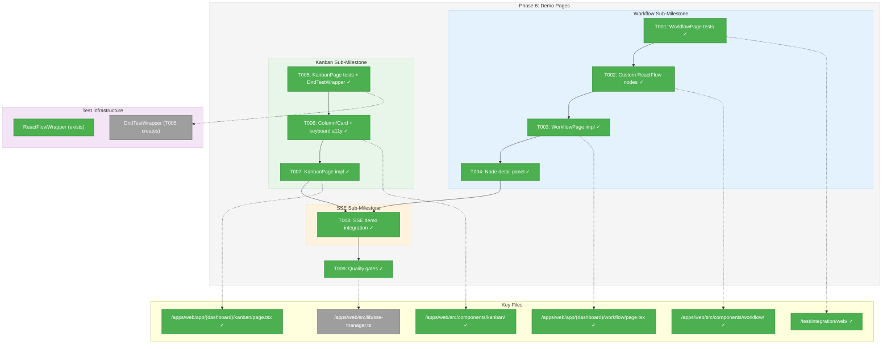
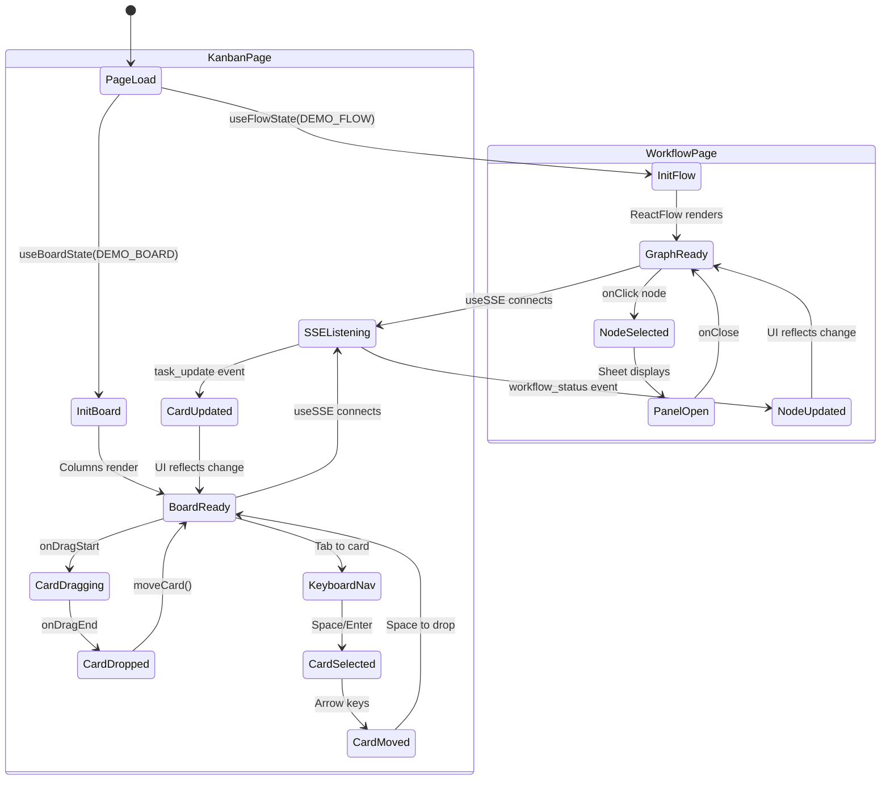
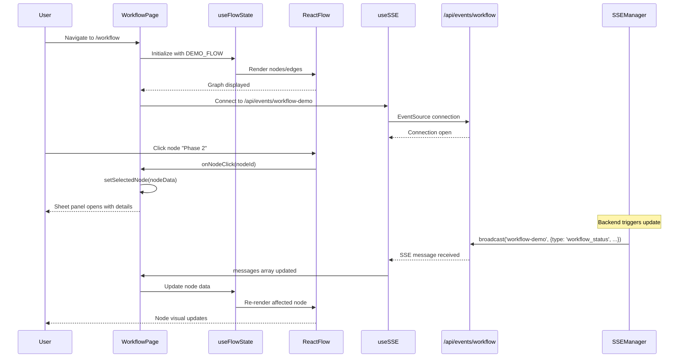

# Phase 6: Demo Pages – Tasks & Alignment Brief

**Spec**: [../web-slick-spec.md](../web-slick-spec.md)
**Plan**: [../web-slick-plan.md](../web-slick-plan.md)
**Date**: 2026-01-23

---

## Executive Briefing

### Purpose
This phase transforms the infrastructure built in Phases 1-5 into functional, interactive demo pages that showcase the Chainglass dashboard capabilities. It's the culmination of all prior work—connecting headless hooks to visual components with real-time SSE updates.

### What We're Building
Two fully functional demo pages:
1. **Workflow Visualization Page** (`/workflow`): Interactive ReactFlow graph with custom node types, pan/zoom controls, and node detail panels
2. **Kanban Board Page** (`/kanban`): Drag-and-drop task board with column organization, keyboard accessibility, and real-time updates

Both pages will receive SSE events to demonstrate real-time updates, plus a critical SSE type contract fix ensuring proper event discrimination.

### User Value
Engineering teams can visualize workflows as interactive graphs, manage tasks via drag-and-drop boards, and see real-time status updates—all from a professional web interface that matches the existing CLI/MCP capabilities.

### Example
**Workflow Page**: Display 5-node workflow graph → Click "Phase 2" node → Side panel shows phase details (status, duration, dependencies)
**Kanban Page**: Drag "Task A" from "Todo" column → Drop in "In Progress" column → Board state updates + SSE broadcasts change to other connected clients

---

## Objectives & Scope

### Objective
Build ReactFlow workflow visualization and Kanban board demo pages using headless hooks and shadcn components, with full SSE integration and keyboard accessibility.

### Goals

- ✅ Create WorkflowPage with interactive ReactFlow graph (AC-9, AC-10, AC-11, AC-12)
- ✅ Create KanbanPage with dnd-kit drag-drop board (AC-13, AC-14, AC-15, AC-17)
- ✅ Implement keyboard accessibility for Kanban (AC-16)
- ✅ Connect demo pages to SSE for real-time updates
- ✅ Fix SSE type contract for proper event discrimination (DYK-01)
- ✅ Create custom ReactFlow node components with distinct visual styles
- ✅ Create Kanban column and card components with shadcn styling

### Non-Goals (Scope Boundaries)

- ❌ Persistent storage (board/flow state resets on refresh - demo only)
- ❌ Authentication/authorization (open access per spec § 3)
- ❌ Backend workflow execution (demo uses fixture data)
- ❌ Collaborative editing (SSE shows broadcast capability, not multi-user sync)
- ❌ Performance optimization for large graphs/boards (demo scale only)
- ❌ Mobile responsive design (desktop-first per spec)
- ❌ Custom theming beyond light/dark (use shadcn defaults)
- ❌ Error boundary implementation (defer to Phase 7)

---

## Architecture Map

### Component Diagram
<!-- Status: grey=pending, orange=in-progress, green=completed, red=blocked -->
<!-- Updated by plan-6 during implementation -->



### Task-to-Component Mapping

<!-- Status: ⬜ Pending | 🟧 In Progress | ✅ Complete | 🔴 Blocked -->

| Task | Component(s) | Files | Status | Comment |
|------|-------------|-------|--------|---------|
| T001 | WorkflowPage Integration Tests | /test/integration/web/workflow-page.test.tsx | ✅ Complete | DYK-07: Tests expect custom types; proper RED until T002 |
| T002 | Custom ReactFlow Nodes + nodeTypes | /apps/web/src/components/workflow/*.tsx, flow.fixture.ts | ✅ Complete | DYK-06: Create nodes, export nodeTypes, update DEMO_FLOW types |
| T003 | WorkflowPage | /apps/web/app/(dashboard)/workflow/page.tsx, WorkflowContent.tsx | ✅ Complete | DYK-02: Client wrapper with ReactFlowProvider |
| T004 | Node Detail Panel | /apps/web/src/components/workflow/node-detail-panel.tsx | ✅ Complete | shadcn Sheet or Dialog for node details |
| T005 | KanbanPage Integration Tests + DndTestWrapper | /test/integration/web/kanban-page.test.tsx, /test/fakes/dnd-test-wrapper.tsx | ✅ Complete | DYK-08: Keyboard nav tests only (pointer drag unreliable in jsdom) |
| T006 | Kanban Column/Card Components | /apps/web/src/components/kanban/*.tsx | ✅ Complete | DYK-09: Includes keyboard accessibility (useSortable + attributes/listeners) |
| T007 | KanbanPage | /apps/web/app/(dashboard)/kanban/page.tsx, KanbanContent.tsx | ✅ Complete | DYK-02: Client wrapper with DndContext + sensors |
| T008 | SSE Demo Integration | /apps/web/src/components/workflow/workflow-content.tsx, kanban/kanban-content.tsx | ✅ Complete | useSSE integration for real-time updates |
| T009 | Quality Gates | All files | ✅ Complete | typecheck, lint, test, build |

---

## Tasks

| Status | ID | Task | CS | Type | Dependencies | Absolute Path(s) | Validation | Subtasks | Notes |
|--------|------|------|-----|------|--------------|------------------|------------|----------|-------|
| [x] | T001 | Write integration tests for WorkflowPage | 2 | Test | – | /home/jak/substrate/005-web-slick/test/integration/web/workflow-page.test.tsx | Tests fail (RED); cover graph renders, pan/zoom works, node click, custom node types render | – | DYK-07: Tests expect custom types ('workflow'\|'phase'\|'agent'); will fail until T002 completes (proper TDD) |
| [x] | T002 | Create custom ReactFlow node components + wire nodeTypes | 3 | Core | T001 | /home/jak/substrate/005-web-slick/apps/web/src/components/workflow/workflow-node.tsx, /home/jak/substrate/005-web-slick/apps/web/src/components/workflow/phase-node.tsx, /home/jak/substrate/005-web-slick/apps/web/src/components/workflow/agent-node.tsx, /home/jak/substrate/005-web-slick/apps/web/src/components/workflow/index.ts, /home/jak/substrate/005-web-slick/apps/web/src/data/fixtures/flow.fixture.ts | WorkflowNode, PhaseNode, AgentNode with distinct styles; React.memo applied; nodeTypes object exported; DEMO_FLOW updated to use custom types | – | DYK-06: Update DEMO_FLOW types from 'default' to 'workflow'\|'phase'\|'agent'; export nodeTypes from index.ts |
| [x] | T003 | Implement WorkflowPage with ReactFlow | 3 | Core | T002 | /home/jak/substrate/005-web-slick/apps/web/app/(dashboard)/workflow/page.tsx, /home/jak/substrate/005-web-slick/apps/web/src/components/workflow/workflow-content.tsx | Uses useFlowState; renders from DEMO_FLOW fixture; T001 tests pass (GREEN) | – | DYK-02: WorkflowContent.tsx client wrapper with ReactFlowProvider |
| [x] | T004 | Add node detail panel on click | 2 | Core | T003 | /home/jak/substrate/005-web-slick/apps/web/src/components/workflow/node-detail-panel.tsx | Clicking node shows details in Sheet/Dialog; panel displays node data | – | Use shadcn Sheet component |
| [x] | T005 | Write integration tests for KanbanPage + create DndTestWrapper | 3 | Test | – | /home/jak/substrate/005-web-slick/test/integration/web/kanban-page.test.tsx, /home/jak/substrate/005-web-slick/test/fakes/dnd-test-wrapper.tsx | Tests fail (RED); cover columns render, keyboard drag (Space→Arrow→Space); DndTestWrapper created | – | DYK-08: Test keyboard nav only (jsdom can't simulate pointer drag); Perplexity research keyboard patterns |
| [x] | T006 | Create Kanban column and card components | 3 | Core | T005 | /home/jak/substrate/005-web-slick/apps/web/src/components/kanban/kanban-column.tsx, /home/jak/substrate/005-web-slick/apps/web/src/components/kanban/kanban-card.tsx, /home/jak/substrate/005-web-slick/apps/web/src/components/kanban/index.ts | Uses shadcn Card; integrates with dnd-kit useSortable; "use client" directive; includes KeyboardSensor + attributes/listeners (DYK-09) | – | DYK-09: Keyboard accessibility built-in via test-dndkit.tsx pattern (no separate task) |
| [x] | T007 | Implement KanbanPage with dnd-kit | 3 | Core | T006 | /home/jak/substrate/005-web-slick/apps/web/app/(dashboard)/kanban/page.tsx, /home/jak/substrate/005-web-slick/apps/web/src/components/kanban/kanban-content.tsx | Uses useBoardState; DndContext with KeyboardSensor + PointerSensor; T005 tests pass (GREEN) | – | DYK-02: KanbanContent.tsx client wrapper with DndContext; includes sensor setup |
| [x] | T008 | Connect demo pages to SSE for real-time updates | 2 | Integration | T004, T007 | /home/jak/substrate/005-web-slick/apps/web/src/components/workflow/workflow-content.tsx, /home/jak/substrate/005-web-slick/apps/web/src/components/kanban/kanban-content.tsx | useSSE integration; UI updates reflect SSE events; demonstrates broadcast capability | – | Uses Phase 5 infrastructure (SSE type contract already works via Zod) |
| [x] | T009 | Run quality gates | 1 | Gate | T008 | All Phase 6 files | `just test && just typecheck && just lint && just build` all pass; no regressions | – | Phase checkpoint |

**Total Complexity**: CS-22 (9 tasks)

---

## Alignment Brief

### Prior Phases Review

#### Cross-Phase Synthesis

**Phase-by-Phase Evolution Summary**:

1. **Phase 1 (Foundation)**: Established Tailwind v4 + shadcn/ui, verified ReactFlow v12.10 and dnd-kit v6.3.1 compatibility with React 19, set CSS import order (ReactFlow before Tailwind), created feature flags infrastructure, established `@/` path alias convention.

2. **Phase 2 (Theme System)**: Added next-themes with FOUC prevention (`suppressHydrationWarning`), created ThemeToggle component, established FakeLocalStorage testing pattern, configured vitest with `@/` alias and jsdom environment.

3. **Phase 3 (Dashboard Layout)**: Built DashboardSidebar + DashboardShell using shadcn components, created route group `(dashboard)` with `/workflow` and `/kanban` placeholder pages, integrated ThemeToggle into sidebar, added semantic status colors in CSS variables.

4. **Phase 4 (Headless Hooks)**: Implemented useBoardState (Kanban), useFlowState (ReactFlow), useSSE (connections), created shared fixtures (DEMO_BOARD, DEMO_FLOW), established parameter injection pattern for testability, created ContainerContext for DI bridge.

5. **Phase 5 (SSE Infrastructure)**: Created SSEManager singleton with globalThis pattern, implemented `/api/events/[channel]` route with 30s heartbeat, created Zod event schemas (discriminated union), established FakeController testing pattern.

**Cumulative Deliverables Available to Phase 6**:

| Phase | Component | Path | Usage in Phase 6 |
|-------|-----------|------|------------------|
| 1 | shadcn Button, Card | `@/components/ui/*` | Card styling for nodes/columns |
| 1 | cn() utility | `@/lib/utils` | Tailwind class merging |
| 1 | Feature flags | `@/lib/feature-flags` | Progressive rollout (optional) |
| 1 | test-dndkit.tsx | `/test/verification/test-dndkit.tsx` | DYK-03: Keyboard accessibility pattern |
| 1 | test-reactflow.tsx | `/test/verification/test-reactflow.tsx` | ReactFlow rendering pattern |
| 2 | ThemeToggle | `@/components/theme-toggle` | Already in sidebar |
| 2 | FakeLocalStorage | `/test/fakes/fake-local-storage.ts` | Pattern reference |
| 3 | DashboardShell | `@/components/dashboard-shell` | Layout wrapper (already applied) |
| 3 | Route structure | `(dashboard)/workflow`, `(dashboard)/kanban` | Placeholder pages to replace |
| 4 | useBoardState | `@/hooks/useBoardState` | Kanban state management |
| 4 | useFlowState | `@/hooks/useFlowState` | ReactFlow state management |
| 4 | useSSE | `@/hooks/useSSE` | SSE connection hook |
| 4 | DEMO_BOARD fixture | `@/data/fixtures/board.fixture` | Initial board state |
| 4 | DEMO_FLOW fixture | `@/data/fixtures/flow.fixture` | Initial flow state |
| 4 | FakeEventSource | `/test/fakes/fake-event-source.ts` | SSE testing |
| 4 | ContainerContext | `@/contexts/ContainerContext` | DI bridge (if needed) |
| 4 | ReactFlowWrapper | Test pattern at use-flow-state.test.tsx:25-27 | Test infrastructure |
| 5 | SSEManager | `@/lib/sse-manager` | Server-side broadcast |
| 5 | sseEventSchema | `@/lib/schemas/sse-events.schema` | Event validation |
| 5 | FakeController | `/test/fakes/fake-controller.ts` | Stream testing pattern |
| 5 | SSE route | `/api/events/[channel]` | Real-time endpoint |

**Pattern Evolution**:
- **Testing Pattern**: FakeLocalStorage (Phase 2) → FakeEventSource (Phase 4) → FakeController (Phase 5) → DndTestWrapper (Phase 6)
- **Client Boundary Pattern**: Established in Phase 2 (ThemeToggle), applied consistently
- **Parameter Injection**: Established in Phase 4, ensures hook testability
- **Singleton Pattern**: globalThis in Phase 5 for SSEManager HMR survival

**Recurring Considerations**:
- CSS import order (ReactFlow CSS before Tailwind) must be maintained
- All interactive components need `"use client"` directive
- Tests use jsdom environment + globalThis.React setup from Phase 2

**Test Infrastructure Available**:
- ReactFlowWrapper pattern exists (Phase 4: `use-flow-state.test.tsx:25-27`)
- DndTestWrapper needs creation in T005 (pattern from test-dndkit.tsx)
- vitest configured with `@/` alias, jsdom, coverage thresholds >80%

**Critical Findings Timeline**:
- CF-02 (React 19 compat): Verified Phase 1, enables Phase 6 React component work
- CF-03 (Headless first): Completed Phase 4, hooks ready for Phase 6 UI wrapping
- CF-04 (DI injection): Pattern established, components bridge DI to hooks
- CF-05 (FakeEventSource): Ready for SSE testing in Phase 6
- CF-06 (CSS order): Maintained, must not change in Phase 6
- CF-10 (shadcn testing): Test our integration, not shadcn internals

---

### Critical Findings Affecting This Phase

| Finding | Constraint/Requirement | Tasks Addressing |
|---------|----------------------|------------------|
| **DYK-01: SSE Type Contract** | ~~SSEManager.broadcast() must include type field~~ **RESOLVED**: Type already in Zod payload; no fix needed | ~~T009~~ Removed |
| **DYK-02: ReactFlow Client Boundary** | Page components are server; ReactFlow needs client wrapper (WorkflowContent.tsx, KanbanContent.tsx) | T003, T007 |
| **DYK-03: dnd-kit Keyboard Accessibility** | Requires 5-part coordination: KeyboardSensor, useSortable, attributes, listeners, SortableContext | T006, T008 |
| **DYK-04: DndTestWrapper Needed** | KanbanPage tests require DndContext wrapper with proper sensors; research patterns first | T005 |
| **DYK-05: Phase 6 Complexity** | ~~CS-26~~ **CS-24** total after DYK-01 resolution; use Workflow→Kanban→SSE→Gates sub-milestones | All tasks |
| **CF-06: CSS Import Order** | ReactFlow CSS must load before Tailwind (already configured in layout.tsx) | Maintain during T002-T003 |

---

### ADR Decision Constraints

No ADRs directly constrain Phase 6. ADR seeds (0002, 0003, 0004) are recommendations for documentation, not implementation constraints.

---

### Invariants & Guardrails

- **Build size budget**: <200KB gzipped increase (spec § 4)
- **Test coverage**: Maintain >80% for hooks (Phase 4 baseline)
- **Lighthouse accessibility**: >90 score target (verify in Phase 7)
- **No `vi.mock()` for app modules**: Use fakes/parameter injection per constitution

---

### Inputs to Read

| File | Purpose |
|------|---------|
| `/home/jak/substrate/005-web-slick/apps/web/src/hooks/useBoardState.ts` | Kanban state hook API |
| `/home/jak/substrate/005-web-slick/apps/web/src/hooks/useFlowState.ts` | ReactFlow state hook API |
| `/home/jak/substrate/005-web-slick/apps/web/src/hooks/useSSE.ts` | SSE connection hook API |
| `/home/jak/substrate/005-web-slick/apps/web/src/data/fixtures/board.fixture.ts` | Demo board data |
| `/home/jak/substrate/005-web-slick/apps/web/src/data/fixtures/flow.fixture.ts` | Demo flow data |
| `/home/jak/substrate/005-web-slick/apps/web/test/verification/test-dndkit.tsx` | DYK-03 keyboard pattern |
| `/home/jak/substrate/005-web-slick/apps/web/test/verification/test-reactflow.tsx` | ReactFlow rendering pattern |
| `/home/jak/substrate/005-web-slick/test/unit/web/hooks/use-flow-state.test.tsx` | ReactFlowWrapper pattern |
| `/home/jak/substrate/005-web-slick/apps/web/src/lib/sse-manager.ts` | SSEManager API (T009 modifies) |

---

### Visual Alignment Aids

#### System State Flow (Mermaid)



#### Interaction Sequence (Mermaid)



---

### Test Plan (TDD per spec)

#### WorkflowPage Tests (T001)

| Test Name | Rationale | Fixtures | Expected Output |
|-----------|-----------|----------|-----------------|
| `should render workflow graph with nodes and edges` | Core rendering verification | DEMO_FLOW | Graph container visible, nodes rendered |
| `should enable pan and zoom controls` | AC-10 verification | DEMO_FLOW | Controls component present, interactions work |
| `should show node detail panel on click` | AC-11 verification | DEMO_FLOW | Sheet opens with node data |
| `should display different node types with distinct styles` | AC-12 verification | DEMO_FLOW | WorkflowNode, PhaseNode, AgentNode have different classes |

#### KanbanPage Tests (T005)

| Test Name | Rationale | Fixtures | Expected Output |
|-----------|-----------|----------|-----------------|
| `should render board with columns` | Core rendering verification | DEMO_BOARD | All columns visible with headers |
| `should move card between columns via drag` | AC-14 verification | DEMO_BOARD + DndTestWrapper | Card appears in target column |
| `should reorder cards within column via drag` | AC-15 verification | DEMO_BOARD + DndTestWrapper | Card order updates |
| `should support keyboard navigation` | AC-16 verification | DEMO_BOARD + DndTestWrapper | Space→Arrow→Space moves card |

#### SSE Integration Tests (T010)

| Test Name | Rationale | Fixtures | Expected Output |
|-----------|-----------|----------|-----------------|
| `should update workflow node on SSE event` | Real-time verification | DEMO_FLOW + FakeEventSource | Node data reflects event payload |
| `should update kanban card on SSE event` | Real-time verification | DEMO_BOARD + FakeEventSource | Card moves/updates per event |

---

### Step-by-Step Implementation Outline

**Sub-Milestone 1: Workflow (T001-T004)**
1. T001: Write failing tests for WorkflowPage (RED)
2. T002: Create custom node components (WorkflowNode, PhaseNode, AgentNode)
3. T003: Implement WorkflowContent.tsx with ReactFlowProvider, make tests pass (GREEN)
4. T004: Add node detail panel with shadcn Sheet

**Sub-Milestone 2: Kanban (T005-T008)**
5. T005: Research dnd-kit testing (Perplexity), create DndTestWrapper, write failing tests (RED)
6. T006: Create KanbanColumn and KanbanCard components
7. T007: Implement KanbanContent.tsx with DndContext, make tests pass (GREEN)
8. T008: Add keyboard accessibility (KeyboardSensor + attributes/listeners)

**Sub-Milestone 3: SSE Integration (T009-T010)**
9. T009: Fix SSE type contract (broadcast accepts SSEEvent)
10. T010: Wire useSSE into WorkflowContent and KanbanContent

**Sub-Milestone 4: Quality Gates (T011)**
11. T011: Run all quality gates, fix any issues

---

### Commands to Run

```bash
# Environment setup (already done from prior phases)
cd /home/jak/substrate/005-web-slick

# Run specific test file during development
pnpm vitest test/integration/web/workflow-page.test.tsx
pnpm vitest test/integration/web/kanban-page.test.tsx

# Run all tests
just test

# Type checking
just typecheck

# Linting
just lint

# Build
just build

# Full quality gates
just test && just typecheck && just lint && just build

# Dev server for manual testing
pnpm --filter @chainglass/web dev
```

---

### Risks/Unknowns

| Risk | Severity | Likelihood | Mitigation |
|------|----------|------------|------------|
| dnd-kit testing complexity | Medium | Medium | T005 includes Perplexity research first; use test-dndkit.tsx as pattern |
| ReactFlow context errors in tests | Medium | Low | Use ReactFlowWrapper from Phase 4 tests |
| SSE type contract breaking existing tests | Low | Medium | T009 updates tests alongside implementation |
| Build size exceeds budget | Low | Low | Monitor with `pnpm build` output; defer optimization to Phase 7 |
| Keyboard accessibility gaps | Medium | Medium | DYK-03 pattern from test-dndkit.tsx is complete; follow exactly |

---

### Ready Check

- [ ] Prior phases (1-5) complete and verified
- [ ] All hooks available: useBoardState ✓, useFlowState ✓, useSSE ✓
- [ ] Fixtures available: DEMO_BOARD ✓, DEMO_FLOW ✓
- [ ] Test infrastructure: ReactFlowWrapper ✓, jsdom env ✓
- [ ] SSE endpoint: /api/events/[channel] ✓
- [ ] Route placeholders: /workflow ✓, /kanban ✓
- [ ] ADR constraints mapped: N/A (no blocking ADRs)

**GO/NO-GO**: Awaiting human approval

---

## Phase Footnote Stubs

<!-- Populated by plan-6a-update-progress during implementation -->

| ID | Task | Description | References |
|----|------|-------------|------------|
| | | | |

---

## Evidence Artifacts

Implementation will write:
- `/home/jak/substrate/005-web-slick/docs/plans/005-web-slick/tasks/phase-6-demo-pages/execution.log.md` — Detailed execution narrative

Supporting files created during implementation:
- Test files in `/test/integration/web/`
- Component files in `/apps/web/src/components/workflow/` and `/apps/web/src/components/kanban/`
- Wrapper components in pages

---

## Discoveries & Learnings

_Populated during implementation by plan-6. Log anything of interest to your future self._

| Date | Task | Type | Discovery | Resolution | References |
|------|------|------|-----------|------------|------------|
| | | | | | |

**Types**: `gotcha` | `research-needed` | `unexpected-behavior` | `workaround` | `decision` | `debt` | `insight`

**What to log**:
- Things that didn't work as expected
- External research that was required
- Implementation troubles and how they were resolved
- Gotchas and edge cases discovered
- Decisions made during implementation
- Technical debt introduced (and why)
- Insights that future phases should know about

_See also: `execution.log.md` for detailed narrative._

---

## Directory Layout

```
docs/plans/005-web-slick/
├── web-slick-plan.md
├── web-slick-spec.md
├── research-dossier.md
├── shadcn-ui-research.md
└── tasks/
    ├── phase-1-foundation-compatibility-verification/
    │   ├── tasks.md
    │   └── execution.log.md
    ├── phase-2-theme-system/
    │   ├── tasks.md
    │   └── execution.log.md
    ├── phase-3-dashboard-layout/
    │   ├── tasks.md
    │   └── execution.log.md
    ├── phase-4-headless-hooks/
    │   ├── tasks.md
    │   └── execution.log.md
    ├── phase-5-sse-infrastructure/
    │   ├── tasks.md
    │   └── execution.log.md
    └── phase-6-demo-pages/
        ├── tasks.md          # This file
        └── execution.log.md  # Created by plan-6
```

---

*Tasks document generated: 2026-01-23*
*Ready for implementation after human GO approval*

---

## Critical Insights Discussion

**Session**: 2026-01-23 04:19 UTC
**Context**: Phase 6: Demo Pages Tasks & Alignment Brief
**Analyst**: AI Clarity Agent
**Reviewer**: Development Team
**Format**: Water Cooler Conversation (5 Critical Insights)

### Insight 1: SSE Type Contract Already Works

**Did you know**: The useSSE hook's type contract isn't broken—it's redundantly encoded. The Zod discriminated union already includes `type` in the payload, making T009 (original) unnecessary.

**Implications**:
- Type discrimination works via Zod schema, not SSE protocol field
- Double-encoding is wasteful but functional
- No implementation fix needed

**Options Considered**:
- Option A: Keep current design, remove task
- Option B: Access event.type directly in useSSE
- Option C: Remove type from payload (Not Feasible - breaks Zod)

**AI Recommendation**: Option A - Keep current design
- Reasoning: Already works; saves CS-2 effort from largest phase

**Discussion Summary**: User chose pragmatic approach—keep working code, remove unnecessary task.

**Decision**: Remove original T009 (SSE type contract fix)

**Affects**: Task count reduced, SSE sub-milestone simplified

---

### Insight 2: DEMO_FLOW Uses Default Types

**Did you know**: All 5 nodes in DEMO_FLOW use `type: 'default'`, but T002 creates custom node components. Without updating the fixture, custom nodes won't render.

**Implications**:
- Custom node components would be dead code
- ReactFlow silently falls back to default nodes
- AC-12 (distinct node styles) would fail

**Options Considered**:
- Option A: Update DEMO_FLOW + nodeTypes in T002
- Option B: Add as separate task
- Option C: Defer to T003 (hidden complexity)

**AI Recommendation**: Option A - Expand T002 scope
- Reasoning: Keeps T002 self-contained; fixture change is 3 lines

**Discussion Summary**: User agreed—single task is cleaner, natural flow.

**Decision**: T002 includes fixture update + nodeTypes export

**Affects**: T002 scope expanded, DYK-06 note added

---

### Insight 3: T001 TDD Cycle Inversion Risk

**Did you know**: If T001 tests are written for `type: 'default'` (current fixture), they'll pass initially. Then T002's fixture change breaks them—inverting the RED→GREEN cycle.

**Implications**:
- Tests would be GREEN→RED→GREEN instead of RED→GREEN
- AC-12 not tested until after implementation
- TDD methodology violated

**Options Considered**:
- Option A: T001 tests expect custom types (proper TDD)
- Option B: T001 tests remain generic (defers validation)
- Option C: Swap task order (Not Feasible - violates TDD)

**AI Recommendation**: Option A - Tests assume custom types
- Reasoning: True RED→GREEN; validates actual requirement

**Discussion Summary**: User confirmed proper TDD approach.

**Decision**: T001 tests expect custom node types; will fail until T002

**Affects**: T001 notes updated with DYK-07

---

### Insight 4: jsdom Can't Simulate Pointer Drag

**Did you know**: jsdom doesn't support pointer drag simulation reliably. dnd-kit's onDragEnd requires complete pointer sequences that jsdom can't provide.

**Implications**:
- T005 tests can't reliably test mouse drag
- Keyboard testing is the reliable path
- AC-16 (keyboard accessibility) tested directly

**Options Considered**:
- Option A: Test keyboard navigation only
- Option B: Mock onDragEnd callback directly
- Option C: Use Playwright/Cypress (out of scope)
- Option D: @dnd-kit/test-utils (Not Feasible - doesn't exist)

**AI Recommendation**: Option A - Keyboard nav testing
- Reasoning: Reliable in jsdom; directly tests AC-16; same code path

**Discussion Summary**: User chose simplest reliable approach.

**Decision**: T005 tests keyboard drag only (Space→Arrow→Space)

**Affects**: T005 notes updated with DYK-08, Perplexity research focus narrowed

---

### Insight 5: T008 Redundant After DYK Decisions

**Did you know**: Since T005 tests keyboard nav, and T006/T007 implement KeyboardSensor pattern from test-dndkit.tsx, T008 (Add keyboard accessibility) has no work to do.

**Implications**:
- Keyboard accessibility built into T006/T007 from start
- T008 would be a no-op task
- Task count inflated unnecessarily

**Options Considered**:
- Option A: Remove T008 entirely
- Option B: Repurpose as verification task
- Option C: Keep as-is (confusing)

**AI Recommendation**: Option A - Remove T008
- Reasoning: Keyboard is built-in; reduces complexity CS-24→CS-22

**Discussion Summary**: User agreed—remove redundant task.

**Decision**: Remove T008; keyboard accessibility in T006; renumber T009→T008, T010→T009

**Affects**: Task count 10→9, complexity CS-24→CS-22, DYK-09 note added to T006

---

## Session Summary

**Insights Surfaced**: 5 critical insights identified and discussed
**Decisions Made**: 5 decisions reached through collaborative discussion
**Action Items Created**: 0 follow-up tasks (all changes immediate)
**Areas Updated**:
- Tasks table: T009 removed, T008 removed, renumbered
- Task notes: DYK-06 through DYK-09 added
- Mermaid diagram: Updated flow
- Complexity: CS-26 → CS-22 (4 points saved)

**Shared Understanding Achieved**: ✓

**Confidence Level**: High
We have high confidence in proceeding. Task plan streamlined, TDD approach clarified, test strategy grounded in jsdom capabilities.

**Next Steps**:
- Run `/plan-6-implement-phase --phase "Phase 6: Demo Pages"` when ready
- Start with T001 (WorkflowPage integration tests - RED)
- Follow sub-milestone order: Workflow → Kanban → SSE → Gates

**Notes**:
- Original tasks.md had 11 tasks at CS-26
- After DYK session: 9 tasks at CS-22
- Key insight: Test what jsdom can reliably simulate (keyboard), not what it can't (pointer drag)
