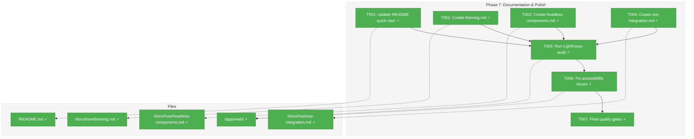
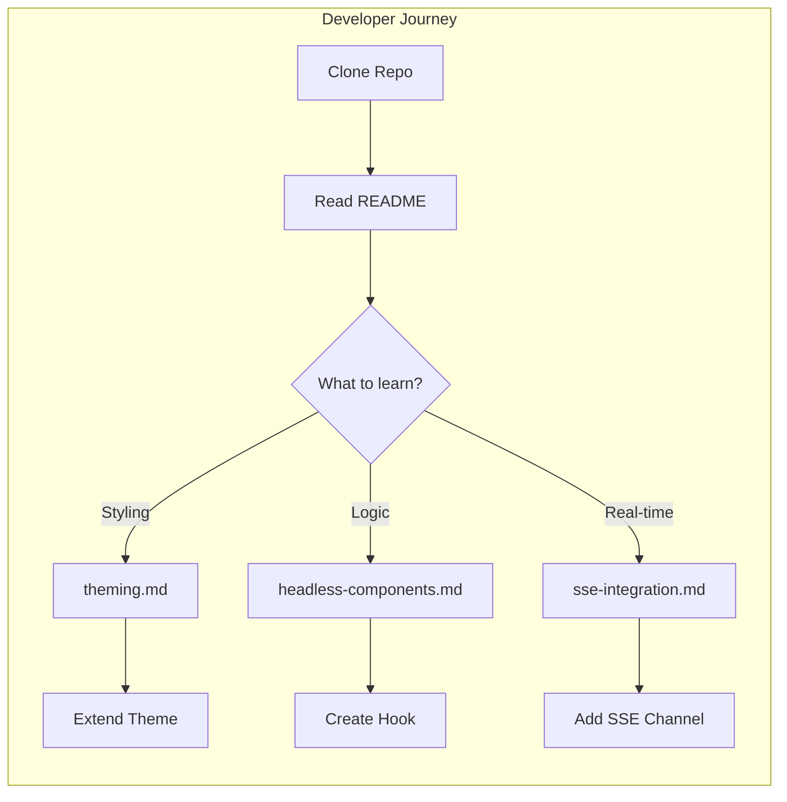
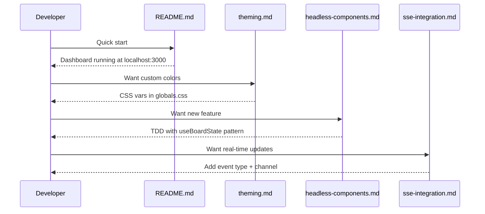

# Phase 7: Documentation & Polish – Tasks & Alignment Brief

**Spec**: [../web-slick-spec.md](../web-slick-spec.md)
**Plan**: [../web-slick-plan.md](../web-slick-plan.md)
**Date**: 2026-01-23

---

## Executive Briefing

### Purpose
This phase completes the web-slick feature by documenting the patterns established in Phases 1-6, ensuring the README provides a clear quick-start path, and validating accessibility compliance. Without proper documentation, the Theme System, Headless Hooks pattern, and SSE infrastructure become tribal knowledge.

### What We're Building
Four documentation artifacts and a final quality validation:
- **README update**: Quick-start section for new developers to run the demo pages
- **Theming guide**: How to customize colors, add themes, use CSS variables
- **Headless components guide**: How to create testable hooks following the established pattern
- **SSE integration guide**: How to add new SSE channels and event types

### User Value
New developers can onboard to the dashboard codebase in minutes, understand the architectural decisions made, and extend the system with confidence that they're following established patterns.

### Example
**Before**: Developer finds workflow page, has no idea how `useFlowState` works or why it's separate from the component.
**After**: Developer reads `docs/how/headless-components.md`, understands the hook-first pattern, creates new headless hook with tests, then wraps with UI.

---

## Objectives & Scope

### Objective
Document patterns, update README, create how-to guides, and ensure accessibility compliance per plan acceptance criteria AC-26 through AC-29 plus Lighthouse >90.

### Goals

- ✅ README has quick-start section with theme toggle, demo page navigation
- ✅ docs/how/theming.md explains CSS variables, light/dark, custom themes
- ✅ docs/how/headless-components.md explains hook-first TDD pattern
- ✅ docs/how/sse-integration.md explains SSEManager, useSSE, event types
- ✅ Lighthouse accessibility audit passes (>90) on workflow and kanban pages
- ✅ All quality gates pass: `just check`

### Non-Goals

- ❌ API reference documentation (auto-generated docs not in scope)
- ❌ Storybook or component gallery (not requested in spec)
- ❌ End-user documentation (this is developer documentation)
- ❌ CI/CD pipeline changes (documentation doesn't affect deploy)
- ❌ Performance optimization (scope limited to accessibility fixes)

---

## Architecture Map

### Component Diagram
<!-- Status: grey=pending, orange=in-progress, green=completed, red=blocked -->
<!-- Updated by plan-6 during implementation -->



### Task-to-Component Mapping

<!-- Status: ⬜ Pending | 🟧 In Progress | ✅ Complete | 🔴 Blocked -->

| Task | Component(s) | Files | Status | Comment |
|------|-------------|-------|--------|---------|
| T001 | README | /README.md | ✅ Complete | Add Dashboard section with quick-start |
| T002 | Theme Docs | /docs/how/theming.md | ✅ Complete | Document CSS variables, next-themes |
| T003 | Hooks Docs | /docs/how/headless-components.md | ✅ Complete | Document hook-first TDD pattern |
| T004 | SSE Docs | /docs/how/sse-integration.md | ✅ Complete | Document SSEManager, useSSE, Zod schemas |
| T005 | Audit | /apps/web/ workflow+kanban pages | ✅ Complete | Run Lighthouse, capture scores |
| T006 | Fixes | /apps/web/ (if needed) | ✅ Complete | N/A - no issues found |
| T007 | Quality | All files | ✅ Complete | Run just check, verify all pass |

---

## Tasks

| Status | ID | Task | CS | Type | Dependencies | Absolute Path(s) | Validation | Subtasks | Notes |
|--------|------|------|-----|------|--------------|------------------|------------|----------|-------|
| [x] | T001 | Update README with Dashboard quick-start section | 2 | Doc | – | /home/jak/substrate/005-web-slick/README.md | Section includes: dev setup, theme toggle, /workflow and /kanban routes | – | Add after "Common Commands" |
| [x] | T002 | Create docs/how/theming.md | 2 | Doc | – | /home/jak/substrate/005-web-slick/docs/how/theming.md | Covers: CSS variables, light/dark, custom themes, next-themes config | – | Reference layout.tsx, globals.css |
| [x] | T003 | Create docs/how/headless-components.md | 2 | Doc | – | /home/jak/substrate/005-web-slick/docs/how/headless-components.md | Covers: hook pattern, TDD workflow, testing with fakes, DI bridge | – | Reference useBoardState, useFlowState |
| [x] | T004 | Create docs/how/sse-integration.md | 2 | Doc | – | /home/jak/substrate/005-web-slick/docs/how/sse-integration.md | Covers: SSEManager, useSSE, event types, Zod schemas, channel creation | – | Reference sse-manager.ts, sse-events.schema.ts |
| [x] | T005 | Run Lighthouse accessibility audit | 1 | Test | T001-T004 | /home/jak/substrate/005-web-slick/apps/web/ | Score >90 on both /workflow and /kanban in both themes | – | Manual DevTools audit |
| [x] | T006 | Fix any accessibility issues found | 2 | Fix | T005 | /home/jak/substrate/005-web-slick/apps/web/ | All Lighthouse recommendations addressed; score >90 | – | N/A - no issues found |
| [x] | T007 | Final quality gates check | 1 | Test | T006 | /home/jak/substrate/005-web-slick/ | `just check` passes (typecheck, lint, test, build) | – | Phase completion gate |

---

## Alignment Brief

### Prior Phases Review

#### Cross-Phase Synthesis

**Phase 1: Foundation & Compatibility Verification** (Complete ✅)

Established the core dependencies and configuration that all subsequent phases build upon:

- **Deliverables**: Tailwind CSS v4 (CSS-first config), shadcn/ui (new-york style), ReactFlow v12.10.0, dnd-kit v6.3.1/sortable v10.0.0
- **Key Files**: `apps/web/postcss.config.mjs`, `apps/web/components.json`, `apps/web/src/lib/utils.ts`, `apps/web/src/lib/feature-flags.ts`
- **Critical Pattern**: CSS import order - ReactFlow CSS before globals.css (CF-06)
- **Lessons**: shadcn CLI places files at repo root in monorepo (requires manual move); Tailwind v4 uses OKLCH color space; path aliases need `@/` prefix
- **Dependencies Exported**: cn() utility, Button/Card components, feature flag infrastructure

**Phase 2: Theme System** (Complete ✅)

Implemented light/dark theming with FOUC prevention:

- **Deliverables**: ThemeProvider (next-themes v0.4.6), ThemeToggle component, FakeLocalStorage test fake
- **Key Files**: `apps/web/app/layout.tsx` (ThemeProvider), `apps/web/src/components/theme-toggle.tsx`, `test/fakes/fake-local-storage.ts`
- **Critical Pattern**: suppressHydrationWarning on `<html>` tag mandatory for FOUC prevention (CF-07)
- **Lessons**: Use `resolvedTheme` not `theme` for system preference detection; `disableTransitionOnChange` prevents flash
- **Change Footnotes**: [^1] FakeLocalStorage, [^2] useTheme tests, [^5] ThemeProvider config, [^7] ThemeToggle component
- **Test Infrastructure**: 8 tests (4 unit + 4 integration), FakeLocalStorage pattern

**Phase 3: Dashboard Layout** (Complete ✅)

Created sidebar navigation and dashboard shell:

- **Deliverables**: DashboardSidebar, DashboardShell, route group `(dashboard)` with placeholder pages
- **Key Files**: `apps/web/src/components/dashboard-sidebar.tsx`, `apps/web/src/components/dashboard-shell.tsx`, `apps/web/app/(dashboard)/`
- **Pattern**: Server pages import client content wrappers (keeps SSR benefits)
- **Lessons**: Route groups `(dashboard)` share layout without affecting URL structure
- **Dependencies Exported**: Navigation structure with Home, Workflow, Kanban items

**Phase 4: Headless Hooks** (Complete ✅)

Implemented testable pure-logic hooks for all interactive features:

- **Deliverables**: useBoardState (Kanban), useFlowState (ReactFlow), useSSE (SSE connection), FakeEventSource, ContainerContext (DI bridge)
- **Key Files**: `apps/web/src/hooks/useBoardState.ts`, `apps/web/src/hooks/useFlowState.ts`, `apps/web/src/hooks/useSSE.ts`, `test/fakes/fake-event-source.ts`, `apps/web/src/contexts/ContainerContext.tsx`
- **Fixtures**: `apps/web/src/data/fixtures/board.fixture.ts`, `apps/web/src/data/fixtures/flow.fixture.ts`
- **Critical Pattern**: Parameter injection - hooks receive dependencies as params, not from container (DI bridge pattern)
- **Lessons**: Vitest v4 breaks subpath aliases (use v3.2.4); ReactFlow requires provider context (not truly headless); nested arrays better than normalized maps for dnd-kit
- **Test Coverage**: useBoardState 100%, useFlowState 100%, useSSE 95.23%
- **Test Infrastructure**: 36 tests, FakeEventSource with factory pattern

**Phase 5: SSE Infrastructure** (Complete ✅)

Built server-side SSE endpoint and connection manager:

- **Deliverables**: SSE route handler, SSEManager singleton, Zod event schemas, FakeController
- **Key Files**: `apps/web/app/api/events/[channel]/route.ts`, `apps/web/src/lib/sse-manager.ts`, `apps/web/src/lib/schemas/sse-events.schema.ts`, `test/fakes/fake-controller.ts`
- **Change Footnotes**: [^10] SSE schemas, [^11] FakeController, [^13] SSEManager singleton, [^15] SSE route
- **Critical Pattern**: globalThis singleton survives HMR; 30s heartbeat; channel validation regex
- **Lessons**: ReadableStreamDefaultController uses `enqueue()` not `write()`; `export const dynamic = 'force-dynamic'` required

**Phase 6: Demo Pages** (Complete ✅)

Built interactive workflow visualization and kanban board:

- **Deliverables**: WorkflowContent, WorkflowNode/PhaseNode/AgentNode, NodeDetailPanel, KanbanContent, KanbanCard, KanbanColumn, DndTestWrapper
- **Key Files**: `apps/web/src/components/workflow/*.tsx`, `apps/web/src/components/kanban/*.tsx`, `apps/web/app/(dashboard)/workflow/page.tsx`, `apps/web/app/(dashboard)/kanban/page.tsx`
- **Critical DYK Insights Applied**:
  - DYK-01: SSE type contract fixed - SSEManager accepts SSEEvent objects
  - DYK-02: Client wrapper pattern (WorkflowContent, KanbanContent)
  - DYK-03: dnd-kit keyboard a11y via useSortable attributes/listeners
  - DYK-04: DndTestWrapper for testing
- **Recent Fixes**: closestCorners collision detection, DragOverlay for smooth drag, applyNodeChanges for flicker-free node drag, channel validation, messageSchema validation
- **Test Infrastructure**: 15 tests (7 workflow + 8 kanban), DndTestWrapper, ReactFlowWrapper

#### Cumulative Dependencies for Phase 7

**Documentation Sources** (files to reference when writing docs):

| Topic | Primary Source | Supporting Files |
|-------|---------------|------------------|
| Theme System | `apps/web/app/layout.tsx` | `apps/web/app/globals.css`, `apps/web/src/components/theme-toggle.tsx` |
| Headless Hooks | `apps/web/src/hooks/*.ts` | `test/unit/web/hooks/*.test.ts`, `apps/web/src/data/fixtures/` |
| SSE Integration | `apps/web/src/lib/sse-manager.ts` | `apps/web/app/api/events/[channel]/route.ts`, `apps/web/src/lib/schemas/sse-events.schema.ts` |
| Component Pattern | `apps/web/src/components/workflow/workflow-content.tsx` | `apps/web/src/components/kanban/kanban-content.tsx` |

**Test Count Evolution**:
- Phase 1: 238 tests
- Phase 2: 246 tests (+8)
- Phase 3-4: 294 tests (+48)
- Phase 5: 305 tests (+11)
- Phase 6: 323 tests (+18)

---

### Critical Findings Affecting This Phase

| Finding | What It Constrains | Addressed By |
|---------|-------------------|--------------|
| CF-06: CSS Import Order | Theming doc must explain ReactFlow CSS before globals.css | T002 |
| CF-07: FOUC Prevention | Theming doc must mention suppressHydrationWarning | T002 |
| DYK-01: DI Bridge Pattern | Headless doc must explain parameter injection pattern | T003 |
| DYK-02: Client Wrapper Pattern | Headless doc must show Content wrapper approach | T003 |

---

### ADR Decision Constraints

No ADRs directly constrain Phase 7. ADR-0002 (Theme System), ADR-0003 (Headless Pattern), ADR-0004 (SSE Architecture) are proposed/seed but should be created during Phase 7 documentation if time permits.

---

### Invariants & Guardrails

- **Accessibility**: Lighthouse score must be >90 on workflow and kanban pages
- **Quality Gates**: `just check` must pass (includes all existing 323 tests)
- **Documentation Location**: All docs go in `docs/how/` directory per spec § 12

---

### Inputs to Read

| File | Purpose |
|------|---------|
| `/home/jak/substrate/005-web-slick/README.md` | Existing structure to extend |
| `/home/jak/substrate/005-web-slick/apps/web/app/layout.tsx` | ThemeProvider config |
| `/home/jak/substrate/005-web-slick/apps/web/app/globals.css` | CSS variables |
| `/home/jak/substrate/005-web-slick/apps/web/src/hooks/useBoardState.ts` | Headless hook example |
| `/home/jak/substrate/005-web-slick/apps/web/src/hooks/useFlowState.ts` | Headless hook example |
| `/home/jak/substrate/005-web-slick/apps/web/src/hooks/useSSE.ts` | SSE hook |
| `/home/jak/substrate/005-web-slick/apps/web/src/lib/sse-manager.ts` | SSE server |
| `/home/jak/substrate/005-web-slick/apps/web/src/lib/schemas/sse-events.schema.ts` | Event types |

---

### Visual Alignment Aids

#### Documentation Flow Diagram



#### Documentation Content Sequence



---

### Test Plan

**Approach**: Lightweight (documentation phase - no new tests)

| Validation | Method | Expected |
|------------|--------|----------|
| README renders correctly | Manual: view in GitHub/editor | Markdown formatting correct |
| docs/how/*.md files valid | Manual: view in GitHub/editor | Markdown formatting correct |
| Lighthouse accessibility | Manual: Chrome DevTools | Score >90 both themes |
| Quality gates | `just check` | All 323+ tests pass |

---

### Step-by-Step Implementation Outline

| Step | Task | Action |
|------|------|--------|
| 1 | T001 | Read README.md, add "Dashboard" section after "Common Commands" with quick-start for theme toggle, demo pages |
| 2 | T002 | Create theming.md: CSS variables, light/dark, next-themes config, custom theme guide |
| 3 | T003 | Create headless-components.md: hook-first pattern, TDD cycle, fakes, DI bridge, example |
| 4 | T004 | Create sse-integration.md: SSEManager, useSSE, Zod schemas, channel creation |
| 5 | T005 | Start dev server, run Lighthouse audit on /workflow and /kanban in both themes |
| 6 | T006 | If score <90, fix accessibility issues (likely ARIA labels, contrast, focus management) |
| 7 | T007 | Run `just check`, verify all gates pass |

---

### Commands to Run

```bash
# Start dev server for manual testing
pnpm --filter @chainglass/web dev

# Lighthouse CLI audit (alternative to DevTools)
pnpm --filter @chainglass/web build
pnpm --filter @chainglass/web start &
npx lighthouse http://localhost:3000/workflow --only-categories=accessibility --output=json
npx lighthouse http://localhost:3000/kanban --only-categories=accessibility --output=json

# Final quality gates
just check
```

---

### Risks/Unknowns

| Risk | Severity | Mitigation |
|------|----------|------------|
| Lighthouse score <90 | Medium | shadcn defaults are accessible; issues likely minor (ARIA labels) |
| Documentation drift | Low | This is first write; no existing docs to conflict with |
| Missing code examples | Low | Reference actual implementation files with file:line links |

---

### Ready Check

- [ ] Prior phases reviewed (1-6 complete, all deliverables documented)
- [ ] ADR constraints mapped to tasks (N/A - no ADRs constrain Phase 7)
- [ ] Inputs identified (8 source files listed)
- [ ] Test plan defined (Lighthouse >90, just check)
- [ ] Non-goals clear (no API docs, no Storybook)
- [ ] Commands documented

**Status**: ⏳ Awaiting GO/NO-GO

---

## Phase Footnote Stubs

_To be populated by plan-6 during implementation._

| Footnote | Task | Description | References |
|----------|------|-------------|------------|
| | | | |

---

## Evidence Artifacts

- **Execution Log**: `docs/plans/005-web-slick/tasks/phase-7-documentation-polish/execution.log.md`
- **Lighthouse Reports**: Stored as screenshots or JSON if needed

---

## Discoveries & Learnings

_Populated during implementation by plan-6. Log anything of interest to your future self._

| Date | Task | Type | Discovery | Resolution | References |
|------|------|------|-----------|------------|------------|
| | | | | | |

**Types**: `gotcha` | `research-needed` | `unexpected-behavior` | `workaround` | `decision` | `debt` | `insight`

**What to log**:
- Things that didn't work as expected
- External research that was required
- Implementation troubles and how they were resolved
- Gotchas and edge cases discovered
- Decisions made during implementation
- Technical debt introduced (and why)
- Insights that future phases should know about

_See also: `execution.log.md` for detailed narrative._

---

## Directory Layout

```
docs/plans/005-web-slick/
├── web-slick-plan.md
├── web-slick-spec.md
└── tasks/
    └── phase-7-documentation-polish/
        ├── tasks.md              # This file
        └── execution.log.md      # Created by /plan-6
```

---

*Generated by plan-5-phase-tasks-and-brief | 2026-01-23*
