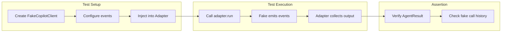
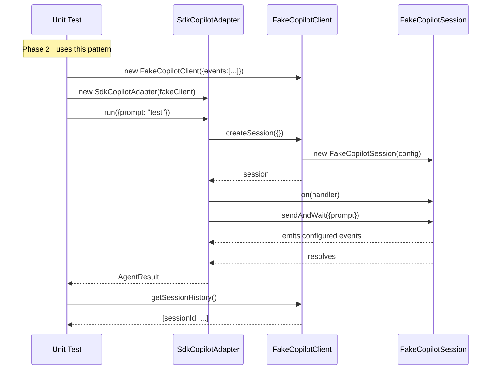

# Phase 1: SDK Foundation & Fakes – Tasks & Alignment Brief

**Spec**: [../../copilot-sdk-spec.md](../../copilot-sdk-spec.md)
**Plan**: [../../copilot-sdk-plan.md](../../copilot-sdk-plan.md)
**Date**: 2026-01-23
**Phase**: 1 of 4
**Complexity**: CS-2 (Small) – Foundation phase with known patterns

---

## Executive Briefing

### Purpose
This phase establishes the foundational infrastructure for the Copilot SDK migration: the SDK dependency, local interface contracts for layer isolation, and test doubles (fakes) that enable TDD for subsequent phases. Without this foundation, no SDK-based adapter code can be written or tested.

### What We're Building
A testable SDK integration layer comprising:
- Local `ICopilotClient` and `ICopilotSession` interfaces (fakes import these, not SDK types)
- `FakeCopilotClient` and `FakeCopilotSession` test doubles with event simulation
- `SdkCopilotAdapter` skeleton that accepts injected client
- `@github/copilot-sdk` as pinned dependency

### User Value
Developers gain the ability to write comprehensive unit tests for all SDK adapter behavior without requiring the actual SDK/CLI runtime, enabling fast TDD cycles and reliable CI.

### Example
**Before (no SDK fakes)**:
```typescript
// Cannot test SDK adapter without real CLI
const adapter = new SdkCopilotAdapter(realClient); // Requires CLI installed
```

**After (with fakes)**:
```typescript
// Full unit testing with configurable fake
const fake = new FakeCopilotClient({
  events: [{ type: 'assistant.message', data: { content: 'Test output' } }]
});
const adapter = new SdkCopilotAdapter(fake);
const result = await adapter.run({ prompt: 'test' });
expect(result.output).toBe('Test output');
```

---

## Objectives & Scope

### Objective
Establish SDK dependency and test infrastructure per plan Phase 1 acceptance criteria. Enable TDD for Phase 2+ implementation.

### Goals

- ✅ Verify `IAgentAdapter` interface exists and compiles (Constitution Principle 2 gate)
- ✅ Create local `ICopilotClient`/`ICopilotSession` interfaces for layer isolation
- ✅ Add `@github/copilot-sdk` dependency with exact version pin
- ✅ Create `FakeCopilotClient` implementing `ICopilotClient` with event simulation
- ✅ Create `FakeCopilotSession` implementing `ICopilotSession` with configurable behavior
- ✅ Create `SdkCopilotAdapter` skeleton with constructor DI
- ✅ Export all new types from package index
- ✅ All unit tests pass (14+ tests)

### Non-Goals

- ❌ Implementing `run()`, `compact()`, `terminate()` logic (Phase 2-3)
- ❌ Event handling implementation (Phase 2)
- ❌ Error mapping logic (Phase 2-3)
- ❌ Integration tests with real SDK (Phase 3)
- ❌ Replacing existing `CopilotAdapter` (Phase 4)
- ❌ Documentation updates (Phase 4)
- ❌ Token metrics implementation (known limitation, always null)

---

## Architecture Map

### Component Diagram

```mermaid
flowchart TD
    classDef pending fill:#9E9E9E,stroke:#757575,color:#fff
    classDef inprogress fill:#FF9800,stroke:#F57C00,color:#fff
    classDef completed fill:#4CAF50,stroke:#388E3C,color:#fff
    classDef blocked fill:#F44336,stroke:#D32F2F,color:#fff

    style Phase fill:#F5F5F5,stroke:#E0E0E0
    style Interfaces fill:#E3F2FD,stroke:#1976D2
    style Fakes fill:#FFF3E0,stroke:#FF9800
    style Adapter fill:#E8F5E9,stroke:#4CAF50
    style Tests fill:#F3E5F5,stroke:#9C27B0
    style Config fill:#ECEFF1,stroke:#607D8B

    subgraph Phase["Phase 1: SDK Foundation & Fakes"]
        T001["T001: Verify IAgentAdapter ✓"]:::completed
        T002["T002: Create local SDK interfaces ✓"]:::completed
        T003["T003: Write FakeCopilotClient tests ✓"]:::completed
        T004["T004: Write FakeCopilotSession tests ✓"]:::completed
        T005["T005: Add SDK dependency ✓"]:::completed
        T006["T006: Implement FakeCopilotClient ✓"]:::completed
        T007["T007: Implement FakeCopilotSession ✓"]:::completed
        T008["T008: Write adapter skeleton tests ✓"]:::completed
        T009["T009: Create adapter skeleton ✓"]:::completed
        T010["T010: Export types from index ✓"]:::completed

        T001 --> T002
        T002 --> T003
        T002 --> T004
        T003 --> T006
        T004 --> T007
        T005 --> T009
        T006 --> T008
        T007 --> T008
        T008 --> T009
        T009 --> T010
    end

    subgraph Interfaces["Interfaces Layer"]
        F1["/packages/shared/src/interfaces/agent-adapter.interface.ts ✓"]:::completed
        F2["/packages/shared/src/interfaces/copilot-sdk.interface.ts ✓"]:::completed
        F3["/packages/shared/src/interfaces/index.ts ✓"]:::completed
    end

    subgraph Fakes["Fakes Layer"]
        F4["/packages/shared/src/fakes/fake-copilot-client.ts ✓"]:::completed
        F5["/packages/shared/src/fakes/fake-copilot-session.ts ✓"]:::completed
        F6["/packages/shared/src/fakes/index.ts ✓"]:::completed
    end

    subgraph Adapter["Adapter Layer"]
        F7["/packages/shared/src/adapters/sdk-copilot-adapter.ts ✓"]:::completed
        F8["/packages/shared/src/adapters/index.ts ✓"]:::completed
    end

    subgraph Tests["Test Files"]
        F9["/test/unit/shared/fake-copilot-client.test.ts ✓"]:::completed
        F10["/test/unit/shared/fake-copilot-session.test.ts ✓"]:::completed
        F11["/test/unit/shared/sdk-copilot-adapter.test.ts ✓"]:::completed
    end

    subgraph Config["Config"]
        F12["/packages/shared/package.json ✓"]:::completed
    end

    T001 -.-> F1
    T002 -.-> F2
    T002 -.-> F3
    T003 -.-> F9
    T004 -.-> F10
    T005 -.-> F12
    T006 -.-> F4
    T006 -.-> F6
    T007 -.-> F5
    T007 -.-> F6
    T008 -.-> F11
    T009 -.-> F7
    T009 -.-> F8
    T010 -.-> F3
    T010 -.-> F6
    T010 -.-> F8
```

<!-- Status: grey=pending, orange=in-progress, green=completed, red=blocked -->
<!-- Updated by plan-6 during implementation -->



### Task-to-Component Mapping

<!-- Status: ⬜ Pending | 🟧 In Progress | ✅ Complete | 🔴 Blocked -->

| Task | Component(s) | Files | Status | Comment |
|------|-------------|-------|--------|---------|
| T001 | Interface Gate | agent-adapter.interface.ts | ✅ Complete | Verified IAgentAdapter with run(), compact(), terminate() |
| T002 | SDK Interfaces | copilot-sdk.interface.ts | ✅ Complete | Created ICopilotClient, ICopilotSession, event types |
| T003 | Client Tests | fake-copilot-client.test.ts | ✅ Complete | 10 failing tests ready for T006 |
| T004 | Session Tests | fake-copilot-session.test.ts | ✅ Complete | 15 failing tests ready for T007 |
| T005 | SDK Dependency | package.json | ✅ Complete | Added ^0.1.16 per DYK-01 decision |
| T006 | Fake Client | fake-copilot-client.ts, fakes/index.ts | ✅ Complete | All 10 tests pass |
| T007 | Fake Session | fake-copilot-session.ts, fakes/index.ts | ✅ Complete | All 15 tests pass with event emission |
| T008 | Adapter Tests | sdk-copilot-adapter.test.ts | ✅ Complete | 10 failing tests ready for T009 |
| T009 | Adapter Skeleton | sdk-copilot-adapter.ts, adapters/index.ts | ✅ Complete | All 10 tests pass, stub methods throw |
| T010 | Exports | interfaces/index.ts, fakes/index.ts, adapters/index.ts | ✅ Complete | All exports verified from dist |

---

## Tasks

| Status | ID | Task | CS | Type | Dependencies | Absolute Path(s) | Validation | Subtasks | Notes |
|--------|------|------|-----|------|--------------|------------------|------------|----------|-------|
| [x] | T001 | Verify IAgentAdapter interface exists and compiles | 0 | Gate | – | /home/jak/substrate/002-agents/packages/shared/src/interfaces/agent-adapter.interface.ts | `tsc --noEmit` passes; interface exports run(), compact(), terminate() | – | Constitution Principle 2 gate |
| [x] | T002 | Create ICopilotClient/ICopilotSession local interfaces | 1 | Core | T001 | /home/jak/substrate/002-agents/packages/shared/src/interfaces/copilot-sdk.interface.ts, /home/jak/substrate/002-agents/packages/shared/src/interfaces/index.ts | Interfaces compile, exported from index, contain all methods from plan §5 | – | Layer isolation: fakes import these |
| [x] | T003 | Write failing tests for FakeCopilotClient interface | 2 | Test | T002 | /home/jak/substrate/002-agents/test/unit/shared/fake-copilot-client.test.ts | Tests exist, import ICopilotClient, fail before T006 | – | TDD RED phase |
| [x] | T004 | Write failing tests for FakeCopilotSession interface | 2 | Test | T002 | /home/jak/substrate/002-agents/test/unit/shared/fake-copilot-session.test.ts | Tests exist, import ICopilotSession, fail before T007 | – | TDD RED phase |
| [x] | T005 | Add @github/copilot-sdk to package.json | 1 | Setup | – | /home/jak/substrate/002-agents/packages/shared/package.json | Use caret range `^0.1.16` per codebase convention, `pnpm install` succeeds | – | DYK-01: Accept pre-1.0 risk for convention consistency |
| [x] | T006 | Create FakeCopilotClient implementation | 2 | Core | T003, T005 | /home/jak/substrate/002-agents/packages/shared/src/fakes/fake-copilot-client.ts, /home/jak/substrate/002-agents/packages/shared/src/fakes/index.ts | All T003 tests pass, implements ICopilotClient | – | Per ADR-0002: fakes only |
| [x] | T007 | Create FakeCopilotSession implementation | 2 | Core | T004 | /home/jak/substrate/002-agents/packages/shared/src/fakes/fake-copilot-session.ts, /home/jak/substrate/002-agents/packages/shared/src/fakes/index.ts | All T004 tests pass, implements ICopilotSession, events simulable | – | DYK-03: Store handler in on(), emit pre-configured events during sendAndWait() |
| [x] | T008 | Write failing tests for SdkCopilotAdapter skeleton | 1 | Test | T006, T007 | /home/jak/substrate/002-agents/test/unit/shared/sdk-copilot-adapter.test.ts | Tests cover constructor DI, options handling; fail before T009 | – | TDD RED phase |
| [x] | T009 | Create SdkCopilotAdapter skeleton with constructor | 1 | Core | T005, T008 | /home/jak/substrate/002-agents/packages/shared/src/adapters/sdk-copilot-adapter.ts, /home/jak/substrate/002-agents/packages/shared/src/adapters/index.ts | All T008 tests pass, implements IAgentAdapter (stub methods), constructor accepts client + options | – | Follow ClaudeCodeAdapter DI pattern |
| [x] | T010 | Export new types from all index files | 1 | Setup | T009 | /home/jak/substrate/002-agents/packages/shared/src/interfaces/index.ts, /home/jak/substrate/002-agents/packages/shared/src/fakes/index.ts, /home/jak/substrate/002-agents/packages/shared/src/adapters/index.ts | Can import FakeCopilotClient, FakeCopilotSession, SdkCopilotAdapter, ICopilotClient, ICopilotSession from @chainglass/shared | – | Update all 3 index files |

---

## Alignment Brief

### Critical Findings Affecting This Phase

| # | Finding | Impact | Tasks Affected | How Addressed |
|---|---------|--------|----------------|---------------|
| 04 | SDK Dependency Version | High | T005 | Use caret range `^0.1.16` per codebase convention (DYK-01 decision: accept pre-1.0 risk for consistency) |
| 06 | ClaudeCodeAdapter Pattern | High | T009 | Follow same constructor DI pattern: `constructor(client: ICopilotClient, options?: SdkCopilotAdapterOptions)` |
| 07 | FakeCopilotClient Design | High | T003, T006, T007 | Create test double with pre-configured events for error path testing |
| 09 | Startup Latency | Medium | T006 | FakeCopilotClient must support immediate sessionId return (no simulated latency) |

### ADR Decision Constraints

**ADR-0002: Exemplar-Driven Development (Fakes-Only Policy)**
- **Decision**: Use fakes, not mocks; `vi.mock()` is banned
- **Constrains**: T003, T004, T006, T007 - all test doubles must be fakes implementing interfaces
- **Addressed by**: T006, T007 create `FakeCopilotClient` and `FakeCopilotSession` as concrete classes implementing local interfaces
- **Verification**: `grep -r "vi.mock\|jest.mock" test/unit/shared/fake-copilot` returns no results

### Invariants & Guardrails

| Constraint | Threshold | Validation |
|------------|-----------|------------|
| Layer Isolation | Fakes import local interfaces only | `grep -r "@github/copilot-sdk" packages/shared/src/fakes/` returns empty |
| No Mocks | Zero mock usage | `grep -r "vi.mock" test/unit/shared/` returns no fake-related mocks |
| TypeScript | Zero errors | `pnpm tsc --noEmit` exits 0 |
| Test Coverage | All interface methods covered | Each method in ICopilotClient/ICopilotSession has ≥1 test |

### Inputs to Read

| Path | Purpose |
|------|---------|
| /home/jak/substrate/002-agents/packages/shared/src/interfaces/agent-adapter.interface.ts | Contract to implement |
| /home/jak/substrate/002-agents/packages/shared/src/interfaces/agent-types.ts | Type definitions for AgentResult, AgentRunOptions |
| /home/jak/substrate/002-agents/packages/shared/src/fakes/fake-agent-adapter.ts | Reference implementation for fake pattern |
| /home/jak/substrate/002-agents/packages/shared/src/adapters/claude-code.adapter.ts | Reference for constructor DI, options pattern |
| /home/jak/substrate/002-agents/docs/plans/006-copilot-sdk/copilot-sdk-plan.md §5 | Interface definitions |

### Visual Alignment Aids

#### Flow Diagram: Fake-based Unit Testing



#### Sequence Diagram: FakeCopilotClient Interaction



### Test Plan (TDD, Fakes Only per ADR-0002)

| Test File | Tests | Rationale | Fixtures | Expected |
|-----------|-------|-----------|----------|----------|
| fake-copilot-client.test.ts | 6+ | Validate ICopilotClient contract | None (self-contained fake) | createSession returns session, resumeSession works, stop/getStatus work |
| fake-copilot-session.test.ts | 6+ | Validate ICopilotSession contract + event simulation | Pre-configured events | sessionId immediate, sendAndWait triggers events, abort/destroy work |
| sdk-copilot-adapter.test.ts | 3+ | Validate adapter skeleton accepts DI | FakeCopilotClient | Constructor stores client, options parsed |

**Test Documentation Format** (per project convention):
```typescript
/**
 * Purpose: [what truth this test proves]
 * Quality Contribution: [how this prevents bugs]
 * Acceptance Criteria: [measurable assertions]
 */
```

### Step-by-Step Implementation Outline

1. **T001** (Gate): Run `tsc` to verify IAgentAdapter compiles; confirm methods in file
2. **T002**: Create copilot-sdk.interface.ts with ICopilotClient, ICopilotSession, types; add to interfaces/index.ts
3. **T003**: Write fake-copilot-client.test.ts with 6+ tests covering all ICopilotClient methods
4. **T004**: Write fake-copilot-session.test.ts with 6+ tests covering events, sendAndWait, lifecycle
5. **T005**: Add `"@github/copilot-sdk": "X.Y.Z"` to packages/shared/package.json; run `pnpm install`
6. **T006**: Implement FakeCopilotClient to pass T003 tests; export from fakes/index.ts
7. **T007**: Implement FakeCopilotSession to pass T004 tests; export from fakes/index.ts
8. **T008**: Write sdk-copilot-adapter.test.ts testing constructor DI and options
9. **T009**: Create SdkCopilotAdapter skeleton with stub methods; export from adapters/index.ts
10. **T010**: Verify all exports work: `import { FakeCopilotClient, SdkCopilotAdapter, ICopilotClient } from '@chainglass/shared'`

### Commands to Run

```bash
# Verify IAgentAdapter compiles (T001)
cd /home/jak/substrate/002-agents && pnpm tsc --noEmit

# Install SDK dependency after adding to package.json (T005)
cd /home/jak/substrate/002-agents && pnpm install

# Run specific test file during TDD
pnpm vitest run test/unit/shared/fake-copilot-client.test.ts
pnpm vitest run test/unit/shared/fake-copilot-session.test.ts
pnpm vitest run test/unit/shared/sdk-copilot-adapter.test.ts

# Run all unit tests
pnpm vitest run

# Verify layer isolation (must return empty)
grep -r "@github/copilot-sdk" packages/shared/src/fakes/

# Verify no mocks in fake tests
grep -r "vi.mock\|jest.mock" test/unit/shared/fake-copilot

# Type check entire project
pnpm tsc --noEmit

# Lint
pnpm biome check
```

### Risks & Unknowns

| Risk | Severity | Mitigation | Status |
|------|----------|------------|--------|
| SDK package may not exist or have different API | Medium | Verify npm registry before T005; use `npm info @github/copilot-sdk` | Open |
| SDK types may differ from plan specification | Low | T005 is early; adjust T002 interfaces if needed | Open |
| Event types in SDK may require additional modeling | Low | Start with minimal types; extend in Phase 2 if needed | Open |

### Ready Check

- [ ] Plan Phase 1 tasks reviewed and understood
- [ ] IAgentAdapter interface location confirmed: `/packages/shared/src/interfaces/agent-adapter.interface.ts`
- [ ] FakeAgentAdapter pattern studied for reference
- [ ] ClaudeCodeAdapter DI pattern studied for reference
- [ ] ADR-0002 constraints mapped to tasks (fakes only, no mocks)
- [ ] ADR constraints mapped to tasks (T003, T004, T006, T007 marked "Per ADR-0002")
- [ ] SDK npm package availability verified (or will verify in T005)
- [ ] All absolute paths in tasks table are correct
- [ ] Layer isolation validation command ready

**Awaiting explicit GO/NO-GO before proceeding to implementation.**

---

## Phase Footnote Stubs

_To be populated by plan-6 during implementation._

| Footnote | Date | Task | Description | Files Affected |
|----------|------|------|-------------|----------------|
| | | | | |

---

## Evidence Artifacts

| Artifact | Location | Created By |
|----------|----------|------------|
| Execution Log | /home/jak/substrate/002-agents/docs/plans/006-copilot-sdk/tasks/phase-1-sdk-foundation-fakes/execution.log.md | plan-6 |
| Test Results | CI artifacts / terminal output | plan-6 |
| Layer Isolation Verification | grep output in execution log | plan-6 |

---

## Discoveries & Learnings

_Populated during implementation by plan-6. Log anything of interest to your future self._

| Date | Task | Type | Discovery | Resolution | References |
|------|------|------|-----------|------------|------------|
| | | | | | |

**Types**: `gotcha` | `research-needed` | `unexpected-behavior` | `workaround` | `decision` | `debt` | `insight`

**What to log**:
- Things that didn't work as expected
- External research that was required
- Implementation troubles and how they were resolved
- Gotchas and edge cases discovered
- Decisions made during implementation
- Technical debt introduced (and why)
- Insights that future phases should know about

_See also: `execution.log.md` for detailed narrative._

---

## Directory Layout

```
docs/plans/006-copilot-sdk/
├── copilot-sdk-plan.md
├── copilot-sdk-spec.md
├── research-dossier.md
└── tasks/
    └── phase-1-sdk-foundation-fakes/
        ├── tasks.md                 # This file
        └── execution.log.md         # Created by /plan-6
```

---

**Phase Status**: READY for implementation via `/plan-6-implement-phase --phase "Phase 1: SDK Foundation & Fakes" --plan "/home/jak/substrate/002-agents/docs/plans/006-copilot-sdk/copilot-sdk-plan.md"`

---

## Critical Insights Discussion

**Session**: 2026-01-23 05:22 UTC
**Context**: Phase 1: SDK Foundation & Fakes - Tasks Dossier
**Analyst**: AI Clarity Agent
**Reviewer**: Development Team
**Format**: Water Cooler Conversation (5 Critical Insights)

### DYK-01: SDK Version Pinning Convention

**Did you know**: SDK is at v0.1.16 (pre-1.0) with 14 versions published rapidly, but codebase uses caret ranges (`^`) for all dependencies.

**Implications**:
- Plan originally said "pin exact version (no ^/~)" per Critical Finding 04
- Codebase convention is `^` ranges for all packages
- Pre-1.0 semver means minor bumps could break API

**Options Considered**:
- Option A: Exact pin `"0.1.16"` - Maximum stability, deviates from convention
- Option B: Caret `^0.1.16` - Matches convention, accepts pre-1.0 risk
- Option C: Tilde `~0.1.16` - Patches only, not used elsewhere

**AI Recommendation**: Option A (Exact Pin)
- Reasoning: Spec explicitly recommends pinning for SDK due to pre-1.0 volatility

**Decision**: **Option B** - Use caret `^0.1.16` for consistency with codebase convention; accept pre-1.0 risk

**Affects**: T005, Critical Finding 04

---

### DYK-02: Adapter Session Tracking Architecture (WITHDRAWN)

**Did you know**: Plan says adapter is "stateless" but existing adapters track `_activeSessions`.

**Discussion Summary**: Misunderstood architecture. Adapters track `sessionId → pid` for process termination only. AgentService handles session state. SDK adapter doesn't need PID tracking since SDK manages its own process - just pass sessionId to `resumeSession()`.

**Decision**: No change needed - plan is correct. Adapters are stateless regarding session logic; services track sessions.

**Affects**: Nothing

---

### DYK-03: FakeCopilotSession Event Emission Pattern

**Did you know**: FakeCopilotSession needs to emit events during `sendAndWait()`, unlike other fakes that just return pre-configured values.

**Implications**:
- SDK's `session.on(handler)` registers a callback that receives events
- Fake must store handler from `on()`, invoke it during `sendAndWait()`
- Enables testing error paths by pre-configuring error events

**Options Considered**:
- Option A: Store handler + emit during sendAndWait - Matches SDK behavior
- Option B: Promise-based resolution - Simpler but doesn't test event handling

**AI Recommendation**: Option A
- Reasoning: TDD requires testing actual event handling code path

**Decision**: **Option A** - Store handler in `on()`, emit pre-configured events during `sendAndWait()`

**Affects**: T004, T007

---

### DYK-04: Phase 1 Has Zero SDK Runtime Dependency

**Did you know**: Phase 1 is entirely self-contained - all tests run without Copilot CLI installed.

**Implications**:
- Fakes implement local interfaces, not SDK types (R-ARCH-001)
- T005 adds npm dependency but nothing imports SDK until Phase 2
- All Phase 1 tests can run in CI without special setup

**Decision**: Acknowledged - design is correct, just confirming awareness

**Affects**: Nothing

---

### DYK-05: Contract Tests Deferred to Phase 3

**Did you know**: The 9 contract tests won't validate SdkCopilotAdapter until Phase 3 task 3.7.

**Implications**:
- Phase 1 creates skeleton with stub methods that throw
- Phase 2 implements `run()` → 6/9 contract tests
- Phase 3 implements `compact()`, `terminate()` → all 9 tests (CRITICAL GATE)

**Decision**: Acknowledged - plan already has this right (task 3.7 is the gate)

**Affects**: Nothing

---

## Session Summary

**Insights Surfaced**: 5 critical insights identified and discussed
**Decisions Made**: 3 decisions (DYK-01, DYK-03 changed tasks; DYK-02 withdrawn)
**Action Items Created**: 0 (all addressed via task updates)
**Areas Updated**:
- T005: Changed version pin requirement to caret range
- T007: Added event emission pattern note
- Critical Finding 04: Updated to reflect DYK-01 decision

**Shared Understanding Achieved**: ✓

**Confidence Level**: High
- Phase 1 architecture is sound
- Layer isolation properly enforced
- Test strategy clear (unit tests for fakes, contract tests in Phase 3)

**Next Steps**: Proceed with `/plan-6-implement-phase`
