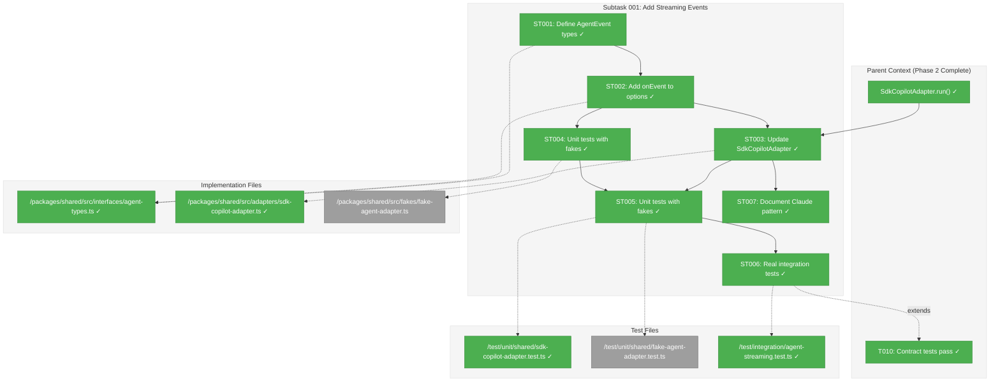
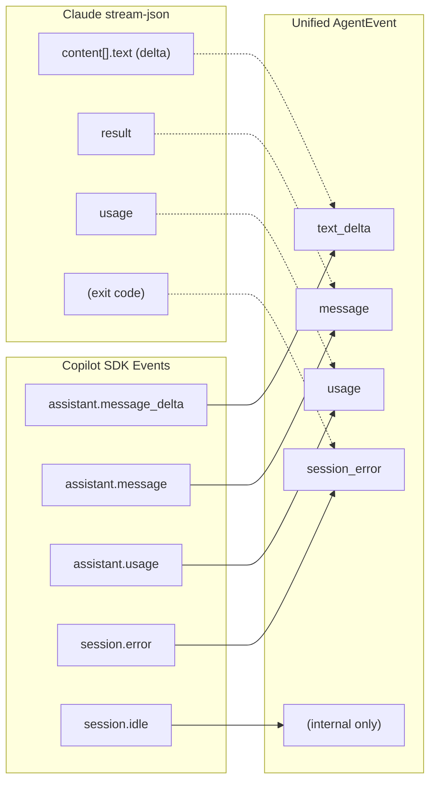
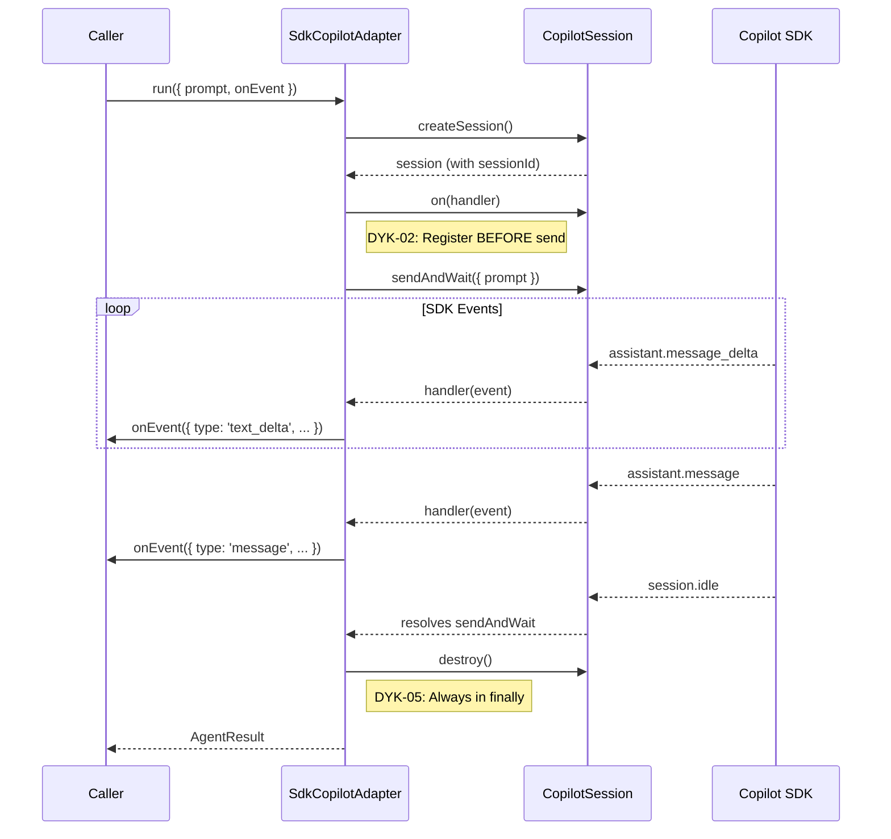

# Subtask 001: Add Streaming Events to IAgentAdapter

**Parent Plan:** [View Plan](../../copilot-sdk-plan.md)
**Parent Phase:** Phase 2: Core Adapter Implementation
**Parent Task(s):** [T010: Add contract test factory for SdkCopilotAdapter](../phase-2-core-adapter-implementation/tasks.md#task-t010) (extends capability)
**Plan Task Reference:** [Phase 2 in Plan](../../copilot-sdk-plan.md#phase-2-core-adapter-implementation)

**Why This Subtask:**
Phase 2 successfully implemented `run()` returning final `AgentResult`, but users need real-time event streaming to observe Copilot/Claude progress during execution. This capability unblocks interactive UIs and debugging workflows. Must work for both providers with fakes for unit tests and real integration tests (skipped in CI, always run locally).

**Created:** 2026-01-23
**Requested By:** User (workshop session)

---

## Executive Briefing

### Purpose

This subtask adds optional event streaming to the `IAgentAdapter.run()` method, enabling callers to receive real-time events (text deltas, usage info, errors) during execution. This provides visibility into long-running agent operations without waiting for the final result.

### What We're Building

A backward-compatible extension to `AgentRunOptions` with:
- New `AgentEvent` union type (unified across providers)
- Optional `onEvent?: AgentEventHandler` callback in `AgentRunOptions`
- Event translation in `SdkCopilotAdapter` (Copilot SDK → AgentEvent)
- Event translation pattern for `ClaudeCodeAdapter` (stream-json → AgentEvent)
- `FakeAgentAdapter` support for configurable event emission
- Real integration tests (Copilot + Claude) that run locally but skip in CI

### Unblocks

- Interactive debugging of agent sessions (see events as they happen)
- UI progress indicators during agent execution
- Future streaming enhancements (Phase 3+ scope)

### Example

**Before (Phase 2)**:
```typescript
const result = await adapter.run({ prompt: 'Hello' });
// Wait 30s... then see result
```

**After (This Subtask)**:
```typescript
const result = await adapter.run({
  prompt: 'Hello',
  onEvent: (event) => {
    if (event.type === 'text_delta') {
      process.stdout.write(event.data.content);
    }
  }
});
// See streaming output as it arrives, then final result
```

---

## Objectives & Scope

### Objective

Add event streaming capability to `IAgentAdapter` that works for both Copilot and Claude, with proper test coverage using fakes and real integration tests.

### Goals

- ✅ Define `AgentEvent` union type in `agent-types.ts`
- ✅ Add `onEvent?: AgentEventHandler` to `AgentRunOptions`
- ✅ Implement event translation in `SdkCopilotAdapter`
- ✅ Document event translation pattern for `ClaudeCodeAdapter`
- ✅ Add fake event emission to `FakeAgentAdapter`
- ✅ Create real integration tests (skipped in CI via `SKIP_INTEGRATION_TESTS` env var)
- ✅ Ensure all existing tests pass (backward compatible)

### Non-Goals

- ❌ Full `ClaudeCodeAdapter` streaming implementation (document pattern only)
- ❌ Async iterator/generator API (callback is simpler, sufficient)
- ❌ Streaming for `compact()` or `terminate()` (out of scope)
- ❌ Persisting events to storage (caller responsibility)
- ❌ All 30+ Copilot SDK events (focus on essential subset)

---

## Architecture Map

### Component Diagram
<!-- Status: grey=pending, orange=in-progress, green=completed, red=blocked -->
<!-- Updated by plan-6 during implementation -->



### Task-to-Component Mapping

<!-- Status: ⬜ Pending | 🟧 In Progress | ✅ Complete | 🔴 Blocked -->

| Task | Component(s) | Files | Status | Comment |
|------|-------------|-------|--------|---------|
| ST001 | Type Definitions | agent-types.ts | ✅ Complete | Define AgentEvent union, AgentEventHandler |
| ST002 | Interface Extension | agent-types.ts | ✅ Complete | Add onEvent? to AgentRunOptions |
| ST003 | Copilot Adapter | sdk-copilot-adapter.ts | ✅ Complete | Translate SessionEvent → AgentEvent |
| ST004 | Unit Tests | sdk-copilot-adapter.test.ts | ✅ Complete | Test with fakes (ADR-0002) |
| ST005 | Integration Tests | agent-streaming.test.ts | ✅ Complete | Real SDK tests, SKIP_INTEGRATION_TESTS env |
| ST006 | Documentation | claude-code.adapter.ts (comments) | ✅ Complete | Pattern for future Claude streaming |
| ST007 | Documentation | claude-code.adapter.ts (comments) | ⬜ Pending | Pattern for future Claude streaming |

---

## Tasks

| Status | ID | Task | CS | Type | Dependencies | Absolute Path(s) | Validation | Subtasks | Notes |
|--------|------|------|-----|------|--------------|------------------|------------|----------|-------|
| [x] | ST001 | Define AgentEvent types + add `streaming?: boolean` to CopilotSessionConfig | 2 | Core | – | /home/jak/substrate/002-agents/packages/shared/src/interfaces/agent-types.ts, /home/jak/substrate/002-agents/packages/shared/src/interfaces/copilot-sdk.interface.ts | TypeScript compiles; types exported | – | DYK-06: SDK needs streaming flag |
| [x] | ST002 | Add `onEvent?: AgentEventHandler` to AgentRunOptions | 1 | Core | ST001 | /home/jak/substrate/002-agents/packages/shared/src/interfaces/agent-types.ts | Backward compatible; existing tests pass | – | Optional callback pattern |
| [x] | ST003 | Update SdkCopilotAdapter.run() to call onEvent with translated events; pass `streaming: !!onEvent` | 3 | Core | ST002 | /home/jak/substrate/002-agents/packages/shared/src/adapters/sdk-copilot-adapter.ts | Events emitted during run(); Final result unchanged | – | Map: assistant.message_delta→text_delta, etc. |
| [x] | ST004 | Write unit tests for streaming with FakeCopilotClient/Session | 2 | Test | ST003 | /home/jak/substrate/002-agents/test/unit/shared/sdk-copilot-adapter.test.ts | Tests pass with fakes; no real SDK calls | – | DYK-07: Use existing FakeCopilotSession events, not FakeAgentAdapter |
| [x] | ST005 | Create real integration tests for Copilot streaming (skip in CI) | 3 | Integration | ST004 | /home/jak/substrate/002-agents/test/integration/agent-streaming.test.ts | Tests pass locally; skip when SKIP_INTEGRATION_TESTS=true | – | DYK-08: Use `shouldSkipIntegration()` = env OR no CLI |
| [x] | ST006 | Document Claude streaming pattern in adapter comments for future implementation | 1 | Docs | ST003 | /home/jak/substrate/002-agents/packages/shared/src/adapters/claude-code.adapter.ts | JSDoc comments added showing stream-json → AgentEvent mapping | – | Pattern only; full impl is future work |

---

## Alignment Brief

### Objective Recap

Extend Phase 2's `run()` implementation with optional event streaming that:
1. Maintains backward compatibility (onEvent is optional)
2. Works for both Copilot SDK and Claude (different source events, same AgentEvent output)
3. Follows ADR-0002 fakes-only policy for unit tests
4. Includes real integration tests that run locally but skip in CI

### Acceptance Criteria Checklist

- [x] `AgentEvent` type defined with discriminated union pattern
- [x] `AgentRunOptions.onEvent` is optional (existing code unchanged)
- [x] `SdkCopilotAdapter.run()` calls onEvent when provided
- [x] FakeCopilotSession emits events (DYK-07: no FakeAgentAdapter changes needed)
- [x] Unit tests use fakes only (no real SDK)
- [x] Integration tests exist and skip via `SKIP_INTEGRATION_TESTS`
- [x] All existing unit tests pass (37 total, up from 29)
- [x] All 9 contract tests pass (compact/terminate failures are Phase 3)

### Critical Findings Affecting This Subtask

| Finding | Constraint | Tasks Addressing |
|---------|------------|------------------|
| **DYK-02**: Handler must register BEFORE sendAndWait | Register event translation in on() before send | ST003 |
| **DYK-05**: Session destroyed in finally block | Events must complete before destroy | ST003 |
| **CF-05**: CI Test Isolation | Integration tests must skip in CI | ST005 |
| **Research**: Copilot has 30+ events, Claude has ~10 | Define minimal unified subset | ST001 |
| **Research**: Both use delta pattern | text_delta for streaming content | ST001 |
| **DYK-06**: SDK requires `streaming: true` to emit deltas | Pass `{ streaming: !!onEvent }` to createSession | ST001, ST003 |
| **DYK-07**: FakeCopilotSession already has event emission | Use existing fake events, not FakeAgentAdapter | ST004 |
| **DYK-08**: Codebase has skipIf pattern for CLI detection | Use `shouldSkipIntegration()` = env var OR no CLI | ST005 |

### ADR Decision Constraints

**ADR-0002: Fakes-Only Policy**
- All unit tests MUST use fakes, not mocks
- Real integration tests are separate and can be skipped
- Constrains: ST004, ST005
- Addressed by: FakeAgentAdapter event configuration (ST004), unit tests with fakes (ST005)

### Invariants & Guardrails

1. **Backward Compatibility**: Existing code without `onEvent` must work unchanged
2. **Type Safety**: Events use discriminated union; TypeScript catches mismatches
3. **Layer Isolation**: Adapters translate provider events; callers see only AgentEvent
4. **Test Isolation**: Unit tests never call real SDK; integration tests clearly separated

### Inputs to Read

| File | Purpose |
|------|---------|
| `/packages/shared/src/interfaces/agent-types.ts` | Current AgentRunOptions definition |
| `/packages/shared/src/interfaces/copilot-sdk.interface.ts` | CopilotSessionEvent types to translate |
| `~/github/copilot-sdk/nodejs/src/generated/session-events.ts` | Full SDK event types |
| `/packages/shared/src/adapters/sdk-copilot-adapter.ts` | Current run() implementation |
| `/packages/shared/src/fakes/fake-agent-adapter.ts` | Current fake implementation |
| Session research: `/home/jak/.copilot/session-state/.../files/streaming-research.md` | Event mapping research |

### Visual Aids

#### Event Translation Flow



#### Sequence: run() with onEvent



### Test Plan

#### Unit Tests (with Fakes)

| Test | Purpose | Fake Configuration |
|------|---------|-------------------|
| `run() with onEvent receives text_delta events` | Verify event emission | FakeCopilotSession emits message_delta |
| `run() with onEvent receives message event` | Verify final message | FakeCopilotSession emits assistant.message |
| `run() with onEvent receives usage event` | Verify metrics | FakeCopilotSession emits assistant.usage |
| `run() with onEvent handles errors` | Verify error events | FakeCopilotSession emits session.error |
| `run() without onEvent works unchanged` | Backward compatibility | Standard fake behavior |
| `FakeAgentAdapter emits configured events` | Fake configurability | Events array in options |

#### Integration Tests (Real SDK, Skip in CI)

| Test | Purpose | Skip Condition |
|------|---------|----------------|
| `Real Copilot SDK emits streaming events` | Verify real behavior | `SKIP_INTEGRATION_TESTS=true` |
| `Real Claude CLI emits streaming events` | Verify real behavior | `SKIP_INTEGRATION_TESTS=true` |

### Implementation Outline

1. **ST001**: Define types in `agent-types.ts`
   - Add `AgentEventBase`, `AgentTextDeltaEvent`, `AgentMessageEvent`, `AgentUsageEvent`, `AgentSessionEvent`, `AgentRawEvent`
   - Create `AgentEvent` union type
   - Add `AgentEventHandler` type alias

2. **ST002**: Extend `AgentRunOptions`
   - Add `onEvent?: AgentEventHandler`
   - Verify existing tests still pass

3. **ST003**: Update `SdkCopilotAdapter.run()`
   - Extract `onEvent` from options
   - In event handler (before sendAndWait), translate and emit:
     - `assistant.message_delta` → `text_delta`
     - `assistant.message` → `message`
     - `assistant.usage` → `usage`
     - `session.error` → `session_error`
   - Emit only if `onEvent` is defined

4. **ST004**: Update `FakeAgentAdapter`
   - Add `eventsToEmit?: AgentEvent[]` to options
   - Emit configured events during `run()`

5. **ST005**: Write unit tests
   - Test each event type translation
   - Test backward compatibility
   - Test fake event emission

6. **ST006**: Write integration tests
   - Use `describe.skipIf(process.env.SKIP_INTEGRATION_TESTS)`
   - Test real Copilot SDK
   - Test real Claude CLI (if available)

7. **ST007**: Document Claude pattern
   - Add JSDoc to `ClaudeCodeAdapter` showing how stream-json would map

### Commands to Run

```bash
# Type checking
pnpm -w build

# Unit tests (always run, uses fakes)
pnpm -w test test/unit/shared/sdk-copilot-adapter.test.ts
pnpm -w test test/unit/shared/fake-agent-adapter.test.ts

# All unit tests
pnpm -w test:unit

# Contract tests
pnpm -w test test/contracts/agent-adapter.contract.test.ts

# Integration tests (LOCAL ONLY - real SDK)
pnpm -w test test/integration/agent-streaming.test.ts

# Integration tests (CI - skipped)
SKIP_INTEGRATION_TESTS=true pnpm -w test test/integration/agent-streaming.test.ts
```

### Risks & Mitigations

| Risk | Likelihood | Impact | Mitigation |
|------|------------|--------|------------|
| Event timing race conditions | Medium | High | DYK-02: Register handler before send |
| SDK events change format | Low | Medium | Local interfaces isolate; integration tests catch |
| Integration tests flaky | Medium | Low | Skip in CI; run locally before commit |
| Claude adapter not ready | Low | Low | Document pattern only; future implementation |

### Ready Check

Before running `/plan-6-implement-phase --subtask 001-subtask-add-streaming-events`:

- [ ] Parent Phase 2 tasks complete (T000-T010 all [x])
- [ ] Research completed (streaming-research.md reviewed)
- [ ] SDK event types understood (session-events.ts reviewed)
- [ ] Test strategy clear (fakes for unit, real for integration)
- [ ] CI skip mechanism understood (SKIP_INTEGRATION_TESTS env var)
- [ ] All team members aware of backward compatibility requirement

---

## Phase Footnote Stubs

**NOTE**: This section will be populated during implementation by plan-6.

| Footnote | Task | Description |
|----------|------|-------------|
| [^ST-1] | – | [To be added during implementation] |
| [^ST-2] | – | [To be added during implementation] |

---

## Evidence Artifacts

### Execution Log

Path: `001-subtask-add-streaming-events.execution.log.md`

### Test Artifacts

| Artifact | Path | Purpose |
|----------|------|---------|
| Unit test file | `/test/unit/shared/sdk-copilot-adapter.test.ts` | Extended with streaming tests |
| Fake test file | `/test/unit/shared/fake-agent-adapter.test.ts` | Extended with event tests |
| Integration test file | `/test/integration/agent-streaming.test.ts` | New file for real SDK tests |

### Research Artifacts

| Artifact | Path | Purpose |
|----------|------|---------|
| Streaming research | `/home/jak/.copilot/session-state/abb1a41d-11b2-4d9c-9844-bfb2197fa005/files/streaming-research.md` | Event mapping research |

---

## Discoveries & Learnings

_Populated during implementation by plan-6. Log anything of interest to your future self._

| Date | Task | Type | Discovery | Resolution | References |
|------|------|------|-----------|------------|------------|
| | | | | | |

**Types**: `gotcha` | `research-needed` | `unexpected-behavior` | `workaround` | `decision` | `debt` | `insight`

**What to log**:
- Things that didn't work as expected
- External research that was required
- Implementation troubles and how they were resolved
- Gotchas and edge cases discovered
- Decisions made during implementation
- Technical debt introduced (and why)
- Insights that future phases should know about

_See also: `execution.log.md` for detailed narrative._

---

## After Subtask Completion

**This subtask extends capability for:**
- Parent Task: [T010: Contract test factory](./tasks.md#task-t010)
- Plan Phase: [Phase 2: Core Adapter Implementation](../../copilot-sdk-plan.md#phase-2-core-adapter-implementation)

**When all ST### tasks complete:**

1. **Record completion** in parent execution log:
   ```
   ### Subtask 001-subtask-add-streaming-events Complete

   Resolved: Added event streaming to IAgentAdapter.run() for Copilot and Claude
   See detailed log: [subtask execution log](./001-subtask-add-streaming-events.execution.log.md)
   ```

2. **Update parent task** (T010 gets enhanced, not blocked):
   - Open: [`tasks.md`](./tasks.md)
   - Find: T010
   - Update Notes: Add "Enhanced with streaming events (001-subtask)"

3. **Resume parent phase work or proceed to Phase 3:**
   ```bash
   /plan-6-implement-phase --phase "Phase 3: Terminal Operations & Error Handling" \
     --plan "/home/jak/substrate/002-agents/docs/plans/006-copilot-sdk/copilot-sdk-plan.md"
   ```
   (Note: NO `--subtask` flag to resume main phase)

**Quick Links:**
- 📋 [Parent Dossier](./tasks.md)
- 📄 [Parent Plan](../../copilot-sdk-plan.md)
- 📊 [Parent Execution Log](./execution.log.md)

---

## Directory Structure

```
docs/plans/006-copilot-sdk/
├── copilot-sdk-plan.md                    # Main plan (gets Subtasks Registry)
├── copilot-sdk-spec.md
├── research-dossier.md
└── tasks/
    └── phase-2-core-adapter-implementation/
        ├── tasks.md                       # Parent dossier (T010 gets subtask link)
        ├── execution.log.md
        ├── 001-subtask-add-streaming-events.md          # ← This file
        └── 001-subtask-add-streaming-events.execution.log.md  # Created by plan-6
```

---

## Critical Insights Discussion

**Session**: 2026-01-23 22:26 UTC
**Context**: Subtask 001 - Add Streaming Events to IAgentAdapter
**Analyst**: AI Clarity Agent
**Reviewer**: Development Team
**Format**: Water Cooler Conversation (5 Critical Insights)

### Insight 1: SDK Streaming Must Be Explicitly Enabled

**Did you know**: The Copilot SDK's `SessionConfig.streaming` defaults to `false`, meaning no `assistant.message_delta` events will be emitted unless we explicitly enable it.

**Implications**:
- Without `streaming: true`, adapter receives only final `assistant.message`, no deltas
- Our `CopilotSessionConfig` interface is missing the `streaming?: boolean` field
- Must conditionally enable based on whether `onEvent` is provided

**Options Considered**:
- Option A: Conditional streaming - Enable only when `onEvent` provided
- Option B: Always enable streaming - Always pass `streaming: true`
- Option C: Do nothing - Let SDK default (Not Feasible - no events)

**AI Recommendation**: Option A - Conditional streaming
- Reasoning: Matches user intent; no overhead when streaming not requested; clean separation of concerns

**Discussion Summary**:
User chose conditional approach - streaming enabled only when callback is provided, keeping behavior opt-in and efficient.

**Decision**: Pass `{ streaming: !!onEvent }` to createSession()

**Action Items**:
- [x] Add `streaming?: boolean` to CopilotSessionConfig (ST001)
- [x] Pass conditional flag in createSession (ST003)

**Affects**: ST001, ST003

---

### Insight 2: ST004 (FakeAgentAdapter Events) May Be Unnecessary

**Did you know**: FakeCopilotSession already has complete event emission infrastructure (lines 121-148, 159-164). SdkCopilotAdapter uses `session.on()`, so tests configure FakeCopilotSession, not FakeAgentAdapter.

**Implications**:
- FakeAgentAdapter is stateless - doesn't manage sessions
- Tests for streaming use SdkCopilotAdapter + FakeCopilotClient stack
- Original ST004 (add events to FakeAgentAdapter) may be unnecessary work

**Options Considered**:
- Option A: Keep ST004 - Add events to FakeAgentAdapter for consumer testing
- Option B: Remove ST004 - Use existing FakeCopilotSession for event tests
- Option C: Rename ST004 - Clarify it's for consumer testing only

**AI Recommendation**: Option B - Remove ST004
- Reasoning: Less code to maintain; existing fakes already handle event testing

**Discussion Summary**:
User agreed - FakeCopilotSession handles event testing; no need to add complexity to FakeAgentAdapter.

**Decision**: Remove ST004, renumber remaining tasks, use FakeCopilotSession for event tests

**Action Items**:
- [x] Remove ST004 from tasks table
- [x] Update ST005 (now ST004) dependencies
- [x] Add DYK-07 to Critical Findings

**Affects**: Tasks table (7 → 6 tasks), dependencies

---

### Insight 3: Claude Streaming Infrastructure Already Exists

**Did you know**: ClaudeCodeAdapter already uses `--output-format=stream-json` with a complete `StreamJsonParser` that extracts session IDs, tokens, and output. The gap is real-time events during execution, not the parsing infrastructure.

**Implications**:
- ST006 (now ST006) says "document pattern only" but pattern mostly exists
- Current implementation buffers until process exit, then parses
- Adding real-time streaming would require refactoring `_getOutput()` pattern

**Options Considered**:
- Option A: Keep as docs only - Document stream-json → AgentEvent mapping
- Option B: Implement Claude streaming - Add real-time event handling
- Option C: Create separate subtask - Future work for Claude streaming

**AI Recommendation**: Option A - Docs only
- Reasoning: Subtask explicitly lists Claude streaming as non-goal; respects scope boundary

**Discussion Summary**:
User confirmed scope should stay focused. Documentation of the pattern is sufficient; full Claude streaming can be a future subtask.

**Decision**: Keep ST006 as documentation only, per original scope

**Action Items**: None

**Affects**: No changes needed

---

### Insight 4: Integration Test Skip Pattern Already Established

**Did you know**: The codebase has a working pattern for skipping integration tests in CI: `describe.skipIf(!hasCli())` with helper functions that check CLI availability via `execSync()`. This can be combined with environment variable override.

**Implications**:
- Existing pattern: CLI detection auto-skips when CLI unavailable
- Subtask mentions `SKIP_INTEGRATION_TESTS=true` but doesn't specify full pattern
- Both approaches are complementary

**Options Considered**:
- Option A: CLI detection only - Match existing pattern
- Option B: Environment variable only - Explicit control
- Option C: Both - CLI detection AND env var override

**AI Recommendation**: Option C - Both
- Reasoning: Auto-skips in CI (no CLI), allows explicit local skip, runs by default when CLI available

**Discussion Summary**:
User chose combined approach for maximum flexibility: auto-skip when CLI missing, explicit override when needed.

**Decision**: Use `shouldSkipIntegration()` = `SKIP_INTEGRATION_TESTS=true` OR `!hasCopilotCli()`

**Action Items**:
- [x] Add DYK-08 to Critical Findings
- [x] Update ST005 notes with pattern

**Affects**: ST005 integration test implementation

---

### Insight 5: Contract Tests Are Safe - Optional Field Addition

**Did you know**: Adding `onEvent?: AgentEventHandler` to `AgentRunOptions` is completely backward compatible with all 9 existing contract tests due to TypeScript's structural typing.

**Implications**:
- Tests pass minimal objects with only required fields (`prompt`)
- Optional callback means tests don't need modification
- No behavioral change when `onEvent` undefined

**Options Considered**:
- Option A: Trust structural typing - Just add optional field
- Option B: Add explicit contract test - Verify adapter calls onEvent
- Option C: Version the interface - Create IAgentAdapterV2 (Not Feasible - overkill)

**AI Recommendation**: Option A - Trust structural typing
- Reasoning: TypeScript optional fields are the idiomatic solution for additive changes

**Discussion Summary**:
User confirmed - structural typing is the correct approach; no extra contract tests needed.

**Decision**: Proceed with confidence; TypeScript handles backward compatibility

**Action Items**: None

**Affects**: No changes needed

---

## Session Summary

**Insights Surfaced**: 5 critical insights identified and discussed
**Decisions Made**: 5 decisions reached through collaborative discussion
**Action Items Created**: 6 items (all completed during session)
**Areas Updated**:
- Critical Findings table (added DYK-06, DYK-07, DYK-08)
- Tasks table (removed ST004, renumbered, updated notes)

**Shared Understanding Achieved**: ✓

**Confidence Level**: High - Key risks identified and mitigated; task count reduced from 7 to 6; all SDK gotchas documented.

**Next Steps**:
Proceed with `/plan-6-implement-phase --subtask 001-subtask-add-streaming-events` to implement the refined task list.

**Notes**:
- SDK `streaming: true` flag is critical - would have caused silent failure without DYK-06
- Removed unnecessary ST004 saves ~2 hours of work
- Combined skip pattern (DYK-08) provides flexibility for local dev and CI
