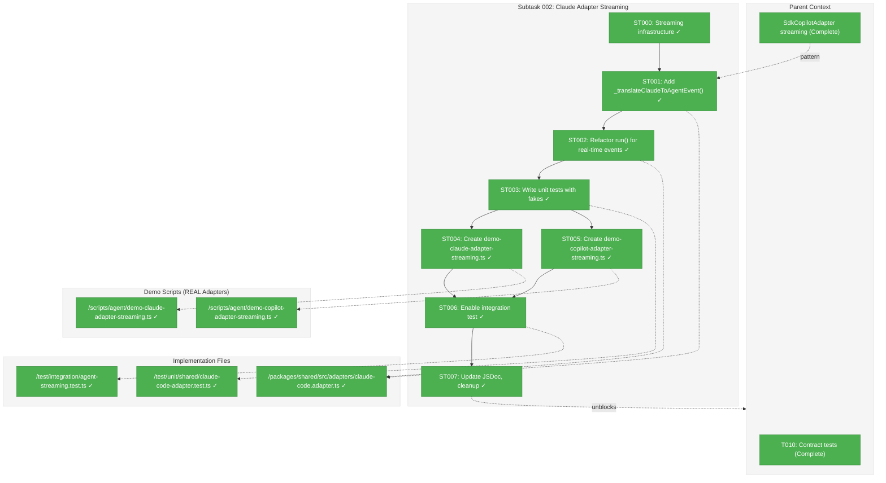

# Subtask 002: Implement Real-Time Streaming in ClaudeCodeAdapter

**Parent Plan:** [View Plan](../../copilot-sdk-plan.md)
**Parent Phase:** Phase 2: Core Adapter Implementation
**Parent Task(s):** [T010: Factory + Contract tests](../tasks.md#task-t010)
**Plan Task Reference:** [Task 2.9 in Plan](../../copilot-sdk-plan.md#phase-2-core-adapter-implementation)

**Why This Subtask:**
ClaudeCodeAdapter currently uses buffered output collection (collects AFTER process exit) but has `onEvent` in `AgentRunOptions` that is completely ignored. The demo scripts in `scripts/agent/` showed the correct CLI streaming pattern, but they don't use the adapter. User requires eyes-on verification that REAL adapters produce streaming events.

**Created:** 2026-01-23
**Requested By:** User (explicit requirement: "I MUST see this working eyes on")

---

## Executive Briefing

### Purpose

This subtask implements real-time streaming event support in `ClaudeCodeAdapter` so that the `onEvent` callback in `AgentRunOptions` actually works. This brings Claude streaming to parity with `SdkCopilotAdapter` (which already supports streaming) and provides sample scripts using REAL adapters (not fakes).

### What We're Building

1. **Real-time event emission** in `ClaudeCodeAdapter.run()`:
   - Parse NDJSON lines AS they arrive (not after exit)
   - Translate Claude stream-json events to `AgentEvent` types
   - Call `onEvent` callback for each event
   
2. **Sample scripts using REAL adapters**:
   - `scripts/agent/demo-claude-adapter-streaming.ts` — Uses ClaudeCodeAdapter
   - `scripts/agent/demo-copilot-adapter-streaming.ts` — Uses SdkCopilotAdapter
   - Eyes-on verification that streaming works with actual CLI/SDK

3. **Unit tests** for streaming behavior (using fakes for fast TDD)

4. **Integration tests** (skippable for CI)

### Key Technical Insight (from Perplexity Research)

Claude CLI streaming requires:
- `-p` flag (short form, not `--print`)
- `--verbose` is **REQUIRED** with `--output-format stream-json`
- `stdio: ['inherit', 'pipe', 'pipe']` — stdin must be `'inherit'` not `'pipe'` to avoid Node.js subprocess hanging
- Known bug #1920: CLI sometimes doesn't send final `result` event

### Unblocks

- Provides feature parity between Claude and Copilot adapters for streaming
- Enables real-time progress monitoring in web UI
- Validates streaming architecture works end-to-end

### Example

**Before (buffered, no streaming):**
```typescript
const adapter = new ClaudeCodeAdapter(processManager);
const result = await adapter.run({ 
  prompt: 'Hello',
  onEvent: (e) => console.log(e), // ❌ Never called - ignored!
});
// Events only available after process exits
```

**After (real-time streaming):**
```typescript
const adapter = new ClaudeCodeAdapter(processManager);
const result = await adapter.run({
  prompt: 'Hello',
  onEvent: (event) => {
    // ✅ Called in real-time as events arrive
    if (event.type === 'text_delta') {
      process.stdout.write(event.data.content);
    }
  },
});
```

---

## Objectives & Scope

### Objective

Implement `onEvent` streaming support in `ClaudeCodeAdapter` and provide sample scripts demonstrating REAL adapter streaming.

### Goals

- ✅ Refactor `ClaudeCodeAdapter.run()` to emit events via `onEvent` callback
- ✅ Add `_translateClaudeToAgentEvent()` method (pattern from JSDoc comments)
- ✅ Create `scripts/agent/demo-claude-adapter-streaming.ts` using real adapter
- ✅ Create `scripts/agent/demo-copilot-adapter-streaming.ts` using real adapter
- ✅ Add ~8 unit tests for streaming behavior (with fakes)
- ✅ Enable skipped integration test in `test/integration/agent-streaming.test.ts`
- ✅ Update JSDoc to remove "Future Implementation" notes

### Non-Goals

- ❌ Modify SdkCopilotAdapter (already has streaming support)
- ❌ Change IAgentAdapter interface (already has `onEvent` in `AgentRunOptions`)
- ❌ Token streaming granularity (aggregate per event is fine)
- ❌ Backward compatibility concerns (onEvent is optional, existing code unchanged)

---

## Architecture Map

### Component Diagram
<!-- Updated by plan-6 during implementation -->



### Task-to-Component Mapping

<!-- Status: ⬜ Pending | 🟧 In Progress | ✅ Complete | 🔴 Blocked -->

| Task | Component(s) | Files | Status | Comment |
|------|-------------|-------|--------|---------|
| ST000 | Streaming Infrastructure | process-manager.interface.ts, unix-process-manager.ts, fake-process-manager.ts | ✅ Complete | DYK-01/02: stdio + onStdoutLine |
| ST001 | Event Translation | claude-code.adapter.ts | ✅ Complete | Port pattern from JSDoc comments |
| ST002 | Streaming Refactor | claude-code.adapter.ts | ✅ Complete | Real-time stdout event emission |
| ST003 | Unit Tests | claude-code-adapter.test.ts | ✅ Complete | 8 tests using FakeProcessManager |
| ST004 | Demo Script | demo-claude-adapter-streaming.ts | ✅ Complete | REAL ClaudeCodeAdapter usage |
| ST005 | Demo Script | demo-copilot-adapter-streaming.ts | ✅ Complete | REAL CopilotClient from SDK |
| ST006 | Integration Test | agent-streaming.test.ts | ✅ Complete | Enable skipped placeholder |
| ST007 | Documentation | claude-code.adapter.ts | ✅ Complete | Remove "Future" notes from JSDoc |

---

## Tasks

| Status | ID | Task | CS | Type | Dependencies | Absolute Path(s) | Validation | Subtasks | Notes |
|--------|------|------|-----|------|--------------|------------------|------------|----------|-------|
| [x] | ST000 | Add streaming infrastructure to SpawnOptions (`stdio`, `onStdoutLine`) | 2 | Infra | – | /home/jak/substrate/002-agents/packages/shared/src/interfaces/process-manager.interface.ts, /home/jak/substrate/002-agents/packages/shared/src/adapters/unix-process-manager.ts, /home/jak/substrate/002-agents/packages/shared/src/fakes/fake-process-manager.ts | Both fields in interface; impls call callback per line; FakeProcessManager can simulate | – | DYK-01/02: Internal plumbing for adapter onEvent support |
| [x] | ST001 | Add `_translateClaudeToAgentEvent()` method to ClaudeCodeAdapter | 2 | Core | ST000 | /home/jak/substrate/002-agents/packages/shared/src/adapters/claude-code.adapter.ts | TypeScript compiles; method matches SdkCopilotAdapter pattern | – | Pattern in JSDoc lines 46-88 |
| [x] | ST002 | Refactor `run()` to emit events in real-time when `onEvent` provided | 3 | Core | ST001 | /home/jak/substrate/002-agents/packages/shared/src/adapters/claude-code.adapter.ts | Events emitted during execution, not after exit; pass stdio when streaming | – | Key: use stdout callback not buffered |
| [x] | ST003 | Write unit tests for streaming (8 tests with FakeProcessManager) | 2 | Test | ST002 | /home/jak/substrate/002-agents/test/unit/shared/claude-code-adapter.test.ts | All 8 tests pass using fakes | – | Follow SdkCopilotAdapter test pattern |
| [x] | ST004 | Create `demo-claude-adapter-streaming.ts` using REAL ClaudeCodeAdapter | 2 | Demo | ST002 | /home/jak/substrate/002-agents/scripts/agent/demo-claude-adapter-streaming.ts | Script runs, shows events in terminal | – | Must use adapter not direct spawn |
| [x] | ST005 | Create `demo-copilot-adapter-streaming.ts` using REAL SdkCopilotAdapter | 2 | Demo | – | /home/jak/substrate/002-agents/scripts/agent/demo-copilot-adapter-streaming.ts | Script runs, shows events in terminal | – | Copilot SDK already supports streaming |
| [x] | ST006 | Enable integration test for ClaudeCodeAdapter streaming | 2 | Test | ST004, ST005 | /home/jak/substrate/002-agents/test/integration/agent-streaming.test.ts | Test passes locally; skips in CI | – | Replace skipped placeholder |
| [x] | ST007 | Update JSDoc: remove "Future Implementation" comments, add working examples | 1 | Docs | ST006 | /home/jak/substrate/002-agents/packages/shared/src/adapters/claude-code.adapter.ts | JSDoc reflects current implementation | – | Lines 40-96 cleanup |

---

## Alignment Brief

### Prior Subtask Review: 001-subtask-add-streaming-events

**Summary**: Subtask 001 added `AgentEvent` types, `onEvent` to `AgentRunOptions`, and streaming support to `SdkCopilotAdapter`. ClaudeCodeAdapter was documented but not implemented.

#### A. Deliverables from Subtask 001

| File | Purpose | Relevant to this subtask |
|------|---------|--------------------------|
| `agent-types.ts` | AgentEvent union types | ✅ Use these types |
| `sdk-copilot-adapter.ts` | `_translateToAgentEvent()` method | ✅ Pattern to follow |
| `agent-streaming.test.ts` | Integration tests | ✅ Enable Claude placeholder |
| `demo-claude-streaming.ts` | Direct CLI demo | ⚠️ Replace with adapter-based demo |
| `demo-copilot-streaming.ts` | Direct SDK demo | ⚠️ Replace with adapter-based demo |

#### B. Key Insight from Demo Script Development

The standalone `demo-claude-streaming.ts` script (using direct spawn, not adapter) discovered critical CLI requirements:

1. **Must use `-p` flag** (short form), not `--print`
2. **`--verbose` is REQUIRED** with `--output-format stream-json`
3. **stdio: `['inherit', 'pipe', 'pipe']`** — stdin must be `'inherit'` not `'pipe'`
4. **Known bug #1920**: CLI sometimes doesn't send final `result` event (add timeout workaround)

These findings must be applied to `ClaudeCodeAdapter._buildArgs()` and spawn configuration.

---

### Critical Findings Affecting This Subtask

| Finding | Constraint | Tasks Addressing |
|---------|------------|------------------|
| **CLI-01**: `-p` flag required | Must use short form not `--print` | ST002 (args building) |
| **CLI-02**: `--verbose` required | Stream-json only works with verbose | ST002 (args building) |
| **CLI-03**: stdin must be `'inherit'` | Node.js subprocess hangs otherwise | ST002 (spawn config) |
| **CLI-04**: Bug #1920 workaround | Add idle timeout detection | ST002 (timeout handling) |
| **CF-STREAM**: SdkCopilotAdapter pattern | Follow `_translateToAgentEvent()` | ST001 |

---

### Implementation Details

#### ST001: Event Translation Method

Port from existing JSDoc (lines 46-88) into actual method:

```typescript
private _translateClaudeToAgentEvent(msg: StreamJsonMessage): AgentEvent | null {
  const timestamp = new Date().toISOString();

  // System init → session_start
  if (msg.type === 'system' && msg.subtype === 'init') {
    return {
      type: 'session_start',
      timestamp,
      data: { sessionId: msg.session_id ?? '' },
    };
  }

  // Assistant message → text_delta
  if (msg.type === 'assistant' && msg.message?.content) {
    const textBlocks = Array.isArray(msg.message.content)
      ? msg.message.content.filter((c: any) => c.type === 'text')
      : [];
    const text = textBlocks.map((c: any) => c.text || '').join('');
    if (text) {
      return {
        type: 'text_delta',
        timestamp,
        data: { content: text },
      };
    }
  }

  // Result → message (final output)
  if (msg.type === 'result') {
    return {
      type: 'message',
      timestamp,
      data: { content: msg.result ?? '' },
    };
  }

  // Fallback: raw passthrough
  return {
    type: 'raw',
    timestamp,
    data: {
      provider: 'claude',
      originalType: msg.type || 'unknown',
      originalData: msg,
    },
  };
}
```

#### ST002: Run Refactor Key Changes

1. **Check for onEvent early**:
   ```typescript
   const { prompt, sessionId, cwd, onEvent } = options;
   const isStreaming = !!onEvent;
   ```

2. **Modify spawn stdio when streaming**:
   ```typescript
   handle = await this._processManager.spawn({
     command: 'claude',
     args,
     cwd: validatedCwd,
     stdio: isStreaming ? ['inherit', 'pipe', 'pipe'] : undefined,
   });
   ```

3. **Add stdout line handler when streaming**:
   ```typescript
   if (isStreaming && onEvent) {
     handle.onStdout((line: string) => {
       try {
         const msg = JSON.parse(line);
         const event = this._translateClaudeToAgentEvent(msg);
         if (event) onEvent(event);
       } catch {
         // Not JSON, skip
       }
     });
   }
   ```

4. **Add args for streaming**:
   ```typescript
   // In _buildArgs():
   if (isStreaming) {
     args.push('--verbose'); // Required for stream-json
   }
   ```

#### ST003: Unit Tests (8 tests)

Following `sdk-copilot-adapter.test.ts` pattern:

1. `should call onEvent with text_delta when receiving assistant message`
2. `should call onEvent with session_start when receiving system.init`
3. `should call onEvent with message when receiving result`
4. `should call onEvent with raw for unknown event types`
5. `should work without onEvent (backward compatibility)`
6. `should include timestamp in all events`
7. `should still return final AgentResult when streaming`
8. `should handle malformed JSON lines gracefully`

#### ST004/ST005: Demo Scripts

Must use REAL adapters (not direct spawn):

```typescript
// demo-claude-adapter-streaming.ts
import { ClaudeCodeAdapter } from '@chainglass/shared';
import { ProcessManager } from '@chainglass/shared'; // Real impl

const processManager = new ProcessManager();
const adapter = new ClaudeCodeAdapter(processManager);

const result = await adapter.run({
  prompt: 'Say hello',
  onEvent: (event) => {
    console.log(`[${event.type}]`, event.data);
  },
});
```

---

### Test Plan

**Unit Tests (with fakes)**:
- 8 tests using `FakeProcessManager` that simulates stdout events
- Fast, deterministic, no network

**Integration Tests (real CLI)**:
- Located in `test/integration/agent-streaming.test.ts`
- Skipped in CI (`SKIP_INTEGRATION_TESTS=true`)
- Always run locally

**Manual Verification (REQUIRED)**:
- User must see events streaming in terminal via demo scripts
- Command: `npx tsx scripts/agent/demo-claude-adapter-streaming.ts`
- Command: `npx tsx scripts/agent/demo-copilot-adapter-streaming.ts`

---

### Ready Check

Before running `/plan-6-implement-phase --subtask 002-subtask-claude-adapter-streaming`:

- [ ] Reviewed `SdkCopilotAdapter._translateToAgentEvent()` implementation
- [ ] Reviewed existing `ClaudeCodeAdapter` JSDoc comments (lines 40-96)
- [ ] Confirmed `FakeProcessManager` can simulate stdout events
- [ ] Understood CLI flags from demo script research
- [ ] Plan for timeout workaround (bug #1920)

---

## Phase Footnote Stubs

_Populated by plan-6 during implementation._

| Ref | Node ID | Commit | Notes |
|-----|---------|--------|-------|
| | | | |

---

## Evidence Artifacts

- **Execution Log**: `002-subtask-claude-adapter-streaming.execution.log.md`
- **Test Output**: Terminal output from unit/integration tests
- **Demo Output**: Terminal recording showing streaming events
- **Artifacts Directory**: Store screenshots/logs in this phase directory

---

## Discoveries & Learnings

_Populated during implementation by plan-6. Log anything of interest to your future self._

| Date | Task | Type | Discovery | Resolution | References |
|------|------|------|-----------|------------|------------|
| 2026-01-23 | ST000 | insight | SpawnOptions needs stdio field for streaming (stdin must be 'inherit' not 'pipe') | Added StdioOption types and stdio field to SpawnOptions | DYK-01 |
| 2026-01-23 | ST000 | insight | ProcessHandle has no stdout callback mechanism | Added onStdoutLine to SpawnOptions (declared at spawn time) | DYK-02 |
| 2026-01-24 | ST005 | gotcha | Initial demo used FakeCopilotClient instead of real SDK | Updated to import CopilotClient from @github/copilot-sdk directly | User caught |
| 2026-01-24 | ST004/05 | insight | result.output is clean text, separate from streaming events | Can color output directly without parsing | User question |

**Types**: `gotcha` | `research-needed` | `unexpected-behavior` | `workaround` | `decision` | `debt` | `insight`

**What to log**:
- Things that didn't work as expected
- External research that was required
- Implementation troubles and how they were resolved
- Gotchas and edge cases discovered
- Decisions made during implementation
- Technical debt introduced (and why)
- Insights that future phases should know about

_See also: `execution.log.md` for detailed narrative._

---

## After Subtask Completion

**This subtask resolves:**
- Feature gap: ClaudeCodeAdapter ignores `onEvent` callback
- Verification gap: No way to see REAL adapter streaming working

**When all ST### tasks complete:**

1. **Record completion** in parent execution log:
   ```
   ### Subtask 002-subtask-claude-adapter-streaming Complete

   Resolved: ClaudeCodeAdapter now supports real-time event streaming via onEvent callback
   See detailed log: [subtask execution log](./002-subtask-claude-adapter-streaming.execution.log.md)
   ```

2. **Demo verification** (user requirement):
   ```bash
   # Must see events streaming in terminal
   npx tsx scripts/agent/demo-claude-adapter-streaming.ts
   npx tsx scripts/agent/demo-copilot-adapter-streaming.ts
   ```

3. **Update parent plan** (Subtasks Registry):
   - Status: `[ ] Pending` → `[x] Complete`

4. **Resume parent phase work:**
   ```bash
   /plan-6-implement-phase --phase "Phase 2: Core Adapter Implementation" \
     --plan "/home/jak/substrate/002-agents/docs/plans/006-copilot-sdk/copilot-sdk-plan.md"
   ```
   (Note: NO `--subtask` flag to resume main phase)

**Quick Links:**
- 📋 [Parent Dossier](./tasks.md)
- 📄 [Parent Plan](../../copilot-sdk-plan.md)
- 📊 [Parent Execution Log](./execution.log.md)

---

## Directory Structure After Completion

```
docs/plans/006-copilot-sdk/tasks/phase-2-core-adapter-implementation/
├── tasks.md                                      # Parent dossier
├── execution.log.md                              # Parent execution log
├── 001-subtask-add-streaming-events.md           # Previous subtask (complete)
├── 001-subtask-add-streaming-events.execution.log.md
├── 002-subtask-claude-adapter-streaming.md       # This subtask ← YOU ARE HERE
└── 002-subtask-claude-adapter-streaming.execution.log.md  # Created by plan-6

scripts/agent/
├── demo-claude-streaming.ts                      # Existing direct CLI demo
├── demo-copilot-streaming.ts                     # Existing direct SDK demo
├── demo-claude-adapter-streaming.ts              # NEW: Uses ClaudeCodeAdapter
└── demo-copilot-adapter-streaming.ts             # NEW: Uses SdkCopilotAdapter
```

---

## Critical Insights Discussion

**Session**: 2026-01-23T23:30:00Z
**Context**: Subtask 002 - Claude Adapter Streaming Implementation
**Analyst**: AI Clarity Agent
**Reviewer**: Development Team
**Format**: Water Cooler Conversation (5 Critical Insights)

### Insight 1: SpawnOptions Interface Missing stdio Field

**Did you know**: The subtask requires `stdio: ['inherit', 'pipe', 'pipe']` for streaming, but SpawnOptions interface has no stdio field.

**Implications**:
- Cannot pass stdio config without extending interface first
- UnixProcessManager hardcodes `['ignore', 'pipe', 'pipe']` (stdin=ignore)
- This is a prerequisite not originally in the subtask

**Options Considered**:
- Option A: Add stdio to SpawnOptions (conditional when streaming)
- Option B: Always use inherit stdio globally
- Option C: Make stdio configurable via adapter options

**AI Recommendation**: Option A - Add stdio to SpawnOptions
- Reasoning: Minimal blast radius; only changes behavior when explicitly requested

**Discussion Summary**: User agreed Option A is safest. Keeps change surgical and testable.

**Decision**: Add `stdio` field to SpawnOptions; create new ST000 task as prerequisite

**Action Items**:
- [x] Added ST000 task to subtask table

**Affects**: Task table, dependencies (ST001 now depends on ST000)

---

### Insight 2: ProcessHandle Has No stdout Callback Mechanism

**Did you know**: The subtask describes `handle.onStdout()` but ProcessHandle only has `pid` and `waitForExit()`.

**Implications**:
- No way to subscribe to stdout events through current interface
- ST002 cannot be implemented without ProcessHandle changes

**Options Considered**:
- Option A: Add onStdout callback to ProcessHandle
- Option B: Add onStdoutLine to SpawnOptions (declared at spawn time)
- Option C: Bypass ProcessManager entirely

**AI Recommendation**: Initially Option A, then workshopped to Option B

**Discussion Summary**: User correctly pointed out that adapter consumers shouldn't know about stdout - they only care about AgentEvent. This is an internal implementation detail. Option B (callback in SpawnOptions) keeps the "stdout" concept buried in ProcessManager layer.

**Decision**: Bundle `onStdoutLine` into ST000 alongside `stdio` as unified "streaming infrastructure"

**Action Items**:
- [x] Updated ST000 scope to include both stdio and onStdoutLine

**Affects**: ST000 task description

---

### Insight 3: --verbose Flag Already Implemented

**Did you know**: The subtask mentions adding `--verbose` conditionally, but it's already unconditionally present in `_buildArgs()`.

**Implications**:
- No code change needed
- Subtask Implementation Details section outdated

**Decision**: No action needed - already done

**Affects**: Documentation only (noted for cleanup in ST007)

---

### Insight 4: FakeProcessManager Can't Simulate Streaming

**Did you know**: FakeProcessManager only supports buffered output via `setProcessOutput()` - no incremental line simulation.

**Implications**:
- Current fake can't test streaming callback behavior
- Need to extend FakeProcessManager

**Decision**: Already covered by ST000 scope ("FakeProcessManager can simulate")

**Affects**: ST000 validation criteria

---

### Insight 5: Demo Scripts Must Use REAL Adapters

**Did you know**: Existing demo scripts bypass adapters entirely and spawn CLI/SDK directly.

**Implications**:
- Don't validate adapter code path
- User requirement: "I MUST see this working eyes on" with real adapters

**Decision**: ST004/ST005 already specify this requirement correctly

**Affects**: No changes needed

---

## Session Summary

**Insights Surfaced**: 5 critical insights identified and discussed
**Decisions Made**: 3 decisions reached
**Action Items Created**: 2 updates applied
**Areas Requiring Updates**: ST000 task scope (done)

**Shared Understanding Achieved**: ✓

**Key Architectural Insight**: Consumer-facing interface (`AgentRunOptions.onEvent`) is already correct. All changes are internal plumbing that consumers never see. This keeps the adapter abstraction clean regardless of whether events come from stdout, SDK callbacks, or HTTP streams.

**Confidence Level**: High - We have clear prerequisites identified and scope is well-defined.

**Next Steps**: Proceed with `/plan-6-implement-phase --subtask 002-subtask-claude-adapter-streaming`
