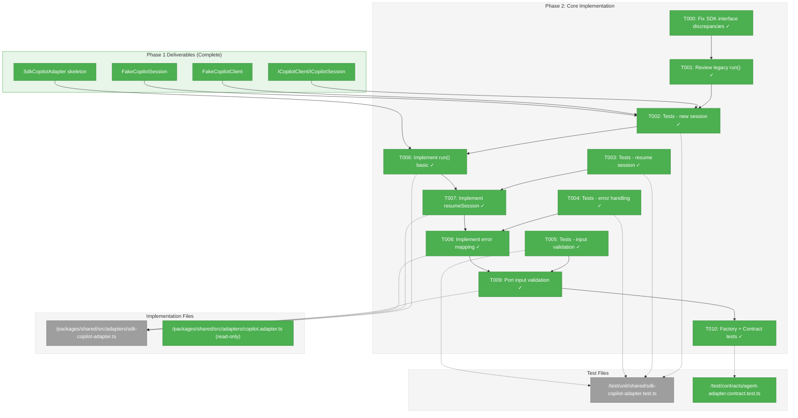
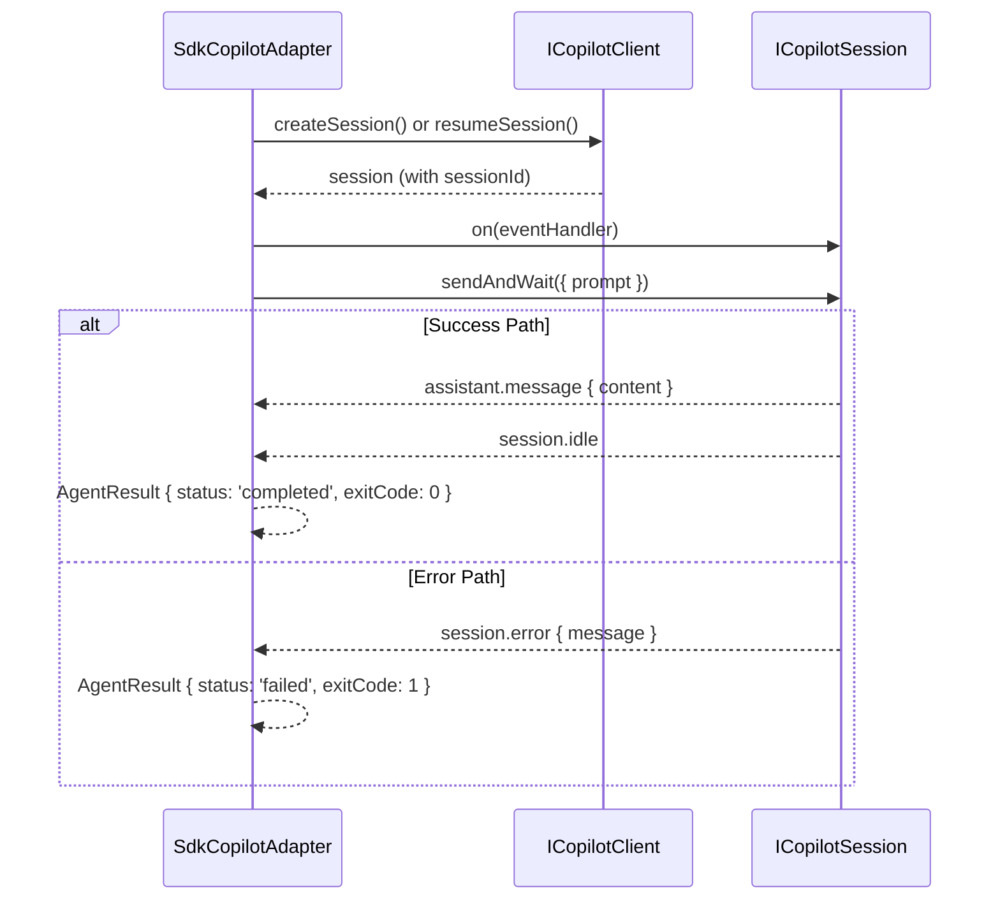

# Phase 2: Core Adapter Implementation – Tasks & Alignment Brief

**Spec**: [../../copilot-sdk-spec.md](../../copilot-sdk-spec.md)
**Plan**: [../../copilot-sdk-plan.md](../../copilot-sdk-plan.md)
**Date**: 2026-01-23
**SDK Source**: `~/github/copilot-sdk/nodejs/src/` (verified 2026-01-23)

---

## 🚨 SDK API VALIDATION FINDINGS

**Validated against**: `~/github/copilot-sdk/nodejs/src/{client.ts,session.ts,types.ts,generated/session-events.ts}`

### Critical Discrepancy Found (MUST FIX)

| Interface | Field | SDK | Our Interface | Action |
|-----------|-------|-----|---------------|--------|
| `session.error` | `errorType` | **Required** (session-events.ts:59) | **Missing** | Add to `CopilotSessionErrorEvent` |
| `assistant.message` | `messageId` | **Required** (session-events.ts:246) | Optional | Make required |

### Interface Alignment (VERIFIED ✅)

| SDK Class | SDK Method | Our Interface | Match |
|-----------|------------|---------------|-------|
| `CopilotClient` | `createSession(config?)` | `ICopilotClient.createSession()` | ✅ |
| `CopilotClient` | `resumeSession(id, config?)` | `ICopilotClient.resumeSession()` | ✅ |
| `CopilotClient` | `stop()` → `Promise<Error[]>` | `ICopilotClient.stop()` | ✅ |
| `CopilotClient` | `getStatus()` | `ICopilotClient.getStatus()` | ✅ |
| `CopilotSession` | `sessionId` (readonly) | `ICopilotSession.sessionId` | ✅ |
| `CopilotSession` | `sendAndWait(options, timeout?)` | `ICopilotSession.sendAndWait()` | ✅ |
| `CopilotSession` | `on(handler)` → unsubscribe fn | `ICopilotSession.on()` | ✅ |
| `CopilotSession` | `abort()` | `ICopilotSession.abort()` | ✅ |
| `CopilotSession` | `destroy()` | `ICopilotSession.destroy()` | ✅ |

### SDK Usage Pattern (from sdk/session.ts lines 134-146)

```typescript
// CRITICAL: Register handler BEFORE calling send to avoid race condition
const unsubscribe = this.on((event) => {
    if (event.type === "assistant.message") { lastAssistantMessage = event; }
    else if (event.type === "session.idle") { resolveIdle(); }
    else if (event.type === "session.error") {
        const error = new Error(event.data.message);
        error.stack = event.data.stack;
        rejectWithError(error);
    }
});
```

---

## Executive Briefing

### Purpose

This phase implements the `run()` method for `SdkCopilotAdapter`, transforming the Phase 1 skeleton into a functional adapter that can execute prompts via the official GitHub Copilot SDK. This is the core functionality that replaces the hacky log-file-polling approach with reliable SDK-based session management.

### What We're Building

A fully functional `SdkCopilotAdapter.run()` method that:
- Creates new sessions via `client.createSession()` for fresh conversations
- Resumes existing sessions via `client.resumeSession(sessionId)` for continuity
- Sends prompts via `session.sendAndWait()` and collects responses
- Maps SDK events to `AgentResult` fields (output, status, exitCode)
- Validates input prompts and cwd per security requirements

### User Value

Services can interact with GitHub Copilot through a clean interface with immediate session IDs (no polling), reliable session resumption, and proper error handling—eliminating all 10 documented pain points from the legacy adapter.

### Example

**Before (Legacy)**: Poll log files for 50ms-5s, extract session ID via regex, fallback to synthetic ID
**After (SDK)**: 
```typescript
const adapter = new SdkCopilotAdapter(client);
const result = await adapter.run({ prompt: 'Hello' });
// result.sessionId = 'abc123'  // Real SDK ID, immediate
// result.output = 'Response text'
// result.status = 'completed'
```

---

## Objectives & Scope

### Objective

Implement `SdkCopilotAdapter.run()` to pass contract tests AC-1 through AC-8 and enable core prompt execution.

### Goals

- ✅ Fix interface discrepancies found in SDK validation (T001)
- ✅ Implement `run()` with `createSession()` for new sessions
- ✅ Implement `run()` with `resumeSession()` when sessionId provided
- ✅ Map `assistant.message` events to `output` field
- ✅ Map `session.error` events to `status: 'failed'`, `exitCode: 1`
- ✅ Port input validation from legacy adapter (prompt, cwd)
- ✅ Pass 6/9 contract tests (run-related)

### Non-Goals (Scope Boundaries)

- ❌ `compact()` implementation (Phase 3)
- ❌ `terminate()` implementation (Phase 3)
- ❌ Integration tests with real SDK (Phase 3)
- ❌ Event logging at all levels (Phase 3 task 3.6)
- ❌ Token metrics implementation (SDK doesn't expose; always null)
- ❌ Legacy adapter deletion (Phase 4)
- ❌ Streaming support (future feature, out of scope)
- ❌ Advanced SDK config options: `tools`, `provider`, `mcpServers`, `customAgents` (out of scope)

---

## Architecture Map

### Component Diagram
<!-- Status: grey=pending, orange=in-progress, green=completed, red=blocked -->
<!-- Updated by plan-6 during implementation -->



### Task-to-Component Mapping

<!-- Status: ⬜ Pending | 🟧 In Progress | ✅ Complete | 🔴 Blocked -->

| Task | Component(s) | Files | Status | Comment |
|------|-------------|-------|--------|---------|
| T000 | Local Interfaces | copilot-sdk.interface.ts, fake-copilot-session.ts | ✅ Complete | **FIX**: Add `errorType`, make `messageId` required |
| T001 | Legacy Adapter Review | copilot.adapter.ts | ✅ Complete | Understand validation logic to port |
| T002 | Unit Tests | sdk-copilot-adapter.test.ts | ⬜ Pending | TDD RED: New session tests |
| T003 | Unit Tests | sdk-copilot-adapter.test.ts | ⬜ Pending | TDD RED: Resume session tests |
| T004 | Unit Tests | sdk-copilot-adapter.test.ts | ⬜ Pending | TDD RED: Error handling tests (with errorType) |
| T005 | Unit Tests | sdk-copilot-adapter.test.ts | ⬜ Pending | TDD RED: Input validation tests |
| T006 | Adapter | sdk-copilot-adapter.ts | ⬜ Pending | TDD GREEN: Basic run() flow |
| T007 | Adapter | sdk-copilot-adapter.ts | ⬜ Pending | TDD GREEN: resumeSession logic |
| T008 | Adapter | sdk-copilot-adapter.ts | ⬜ Pending | TDD GREEN: Error event mapping |
| T009 | Adapter | sdk-copilot-adapter.ts | ⬜ Pending | TDD GREEN: Port validation methods |
| T010 | Contract Tests | agent-adapter.contract.test.ts | ⬜ Pending | Validate 6/9 tests pass |

---

## Tasks

| Status | ID | Task | CS | Type | Dependencies | Absolute Path(s) | Validation | Subtasks | Notes |
|--------|------|------|-----|------|--------------|------------------|------------|----------|-------|
| [x] | T000 | Fix interface discrepancies: add `errorType` to session.error, make `messageId` required | 2 | Setup | – | /home/jak/substrate/002-agents/packages/shared/src/interfaces/copilot-sdk.interface.ts, /home/jak/substrate/002-agents/packages/shared/src/fakes/fake-copilot-session.ts | TypeScript compiles; existing 35 tests pass | – | **SDK VALIDATION FIX** |
| [x] | T001 | Review legacy CopilotAdapter run() and validation methods | 1 | Setup | T000 | /home/jak/substrate/002-agents/packages/shared/src/adapters/copilot.adapter.ts | Document: _validateCwd(), _validatePrompt(), run() flow | – | Understand what to port |
| [x] | T002 | Write tests for run() with new session (TDD RED) | 2 | Test | T001 | /home/jak/substrate/002-agents/test/unit/shared/sdk-copilot-adapter.test.ts | Tests fail with "Not implemented" | – | Per CF-01: No synthetic IDs |
| [x] | T003 | Write tests for run() with existing sessionId (TDD RED) | 2 | Test | T001 | /home/jak/substrate/002-agents/test/unit/shared/sdk-copilot-adapter.test.ts | Tests fail with "Not implemented" | – | Per CF-02: Validate resumeSession |
| [x] | T004 | Write tests for error event handling (TDD RED) | 2 | Test | T001 | /home/jak/substrate/002-agents/test/unit/shared/sdk-copilot-adapter.test.ts | Tests fail with "Not implemented" | – | Per CF-03: session.error → failed; include errorType |
| [x] | T005 | Write tests for input validation (TDD RED) | 2 | Test | T001 | /home/jak/substrate/002-agents/test/unit/shared/sdk-copilot-adapter.test.ts | Tests fail with "Not implemented" | – | Port from legacy adapter |
| [x] | T006 | Implement run() basic flow: createSession → sendAndWait → collect output | 3 | Core | T002 | /home/jak/substrate/002-agents/packages/shared/src/adapters/sdk-copilot-adapter.ts | T002 tests pass | – | Per DYK-03: Subscribe before sendAndWait |
| [x] | T007 | Implement run() with resumeSession when sessionId provided | 2 | Core | T003, T006 | /home/jak/substrate/002-agents/packages/shared/src/adapters/sdk-copilot-adapter.ts | T003 tests pass | – | Per CF-08: No session cache |
| [x] | T008 | Implement error event mapping: session.error → failed status | 2 | Core | T004, T007 | /home/jak/substrate/002-agents/packages/shared/src/adapters/sdk-copilot-adapter.ts | T004 tests pass | – | Per CF-03: exitCode=1; include errorType in output |
| [x] | T009 | Port input validation from legacy adapter (_validateCwd, _validatePrompt) | 2 | Core | T005, T008 | /home/jak/substrate/002-agents/packages/shared/src/adapters/sdk-copilot-adapter.ts | T005 tests pass | DYK-04 | SEC-001, SEC-002; TECH-DEBT: Extract shared validation utilities later |
| [x] | T010 | Add contract test factory for SdkCopilotAdapter + run tests | 2 | Integration | T009 | /home/jak/substrate/002-agents/test/contracts/agent-adapter.contract.test.ts | run() tests pass; compact/terminate fail (expected) | 001-subtask-add-streaming-events | Factory setup required first; DYK-03 |

---

## Alignment Brief

### Prior Phase Review: Phase 1

**Summary**: Phase 1 established the SDK foundation with local interfaces, fake test doubles, and adapter skeleton. All 35 tests passing. Phase 2 builds directly on these deliverables.

#### A. Deliverables Created (Phase 1)

| File | Purpose | Lines |
|------|---------|-------|
| `/packages/shared/src/interfaces/copilot-sdk.interface.ts` | Local interfaces for layer isolation | 210 |
| `/packages/shared/src/fakes/fake-copilot-client.ts` | Test double with session creation/resumption | 171 |
| `/packages/shared/src/fakes/fake-copilot-session.ts` | Test double with event emission (DYK-03) | 218 |
| `/packages/shared/src/adapters/sdk-copilot-adapter.ts` | Skeleton with stub methods | 117 |
| `/test/unit/shared/fake-copilot-client.test.ts` | 10 tests | - |
| `/test/unit/shared/fake-copilot-session.test.ts` | 15 tests | - |
| `/test/unit/shared/sdk-copilot-adapter.test.ts` | 10 tests | - |

#### B. Lessons Learned (Phase 1)

1. **DYK-01 (Version Pinning)**: Used `^0.1.16` instead of exact pin for codebase convention consistency
2. **DYK-03 (Event Emission)**: Handler must be registered via `on()` BEFORE calling `sendAndWait()` or events are missed
3. **R-ARCH-001 (Layer Isolation)**: Fakes import local interfaces only; verified with grep

#### C. Technical Discoveries (Phase 1)

- Session ID available immediately from SDK (no polling)
- Event handlers stored in `on()`, invoked during `sendAndWait()`
- Pre-1.0 SDK (0.1.16) may have API volatility
- `strictSessions` flag in FakeCopilotClient enables contract test validation

#### D. Dependencies Exported for Phase 2

```typescript
// From Phase 1 - ready to use
export interface ICopilotClient { createSession, resumeSession, stop, getStatus }
export interface ICopilotSession { sessionId, sendAndWait, on, abort, destroy }
export type CopilotSessionEvent = AssistantMessage | Idle | Error
export class FakeCopilotClient implements ICopilotClient
export class FakeCopilotSession implements ICopilotSession
export class SdkCopilotAdapter implements IAgentAdapter // skeleton
```

#### E. Critical Findings Applied (Phase 1)

| Finding | Applied | Reference |
|---------|---------|-----------|
| CF-04: SDK Version | ✅ `^0.1.16` in package.json | package.json |
| CF-06: DI Pattern | ✅ Constructor accepts ICopilotClient | sdk-copilot-adapter.ts:57 |
| CF-07: FakeCopilotClient | ✅ Event simulation supported | fake-copilot-client.ts:17-42 |

#### F. Incomplete/Blocked (Phase 1)

None. Phase 1 100% complete.

#### G. Test Infrastructure (Phase 1)

- FakeCopilotClient with configurable events
- FakeCopilotSession with event emission pattern
- Test helpers: getSessionHistory(), getSendHistory(), reset()

#### H. Technical Debt (Phase 1)

- Pre-1.0 SDK version risk (accepted per DYK-01)
- Stub methods throw "Not implemented" (intentional, resolved in Phase 2/3)

#### I. Architectural Decisions (Phase 1)

| Decision | Rationale |
|----------|-----------|
| Local interfaces over SDK imports | R-ARCH-001: Layer isolation for testability |
| Constructor DI | CF-06: Matches ClaudeCodeAdapter pattern |
| Event handler storage | DYK-03: Test actual event handling flow |
| No session caching | DEC-stateless: Use resumeSession() each time |

---

### Critical Findings Affecting This Phase

| Finding | Constraint | Tasks Addressing |
|---------|------------|------------------|
| **CF-01**: Session ID Synthetic Fallback | SDK provides real ID immediately; no synthetic fallback | T002, T006 |
| **CF-02**: Contract Test Session Resumption | resumeSession() must return same sessionId | T003, T007 |
| **CF-03**: Error Event Mapping | session.error → status='failed', exitCode=1 | T004, T008 |
| **CF-08**: Session Lifecycle | No cache; use resumeSession() for each run with sessionId | T007 |
| **SDK-VAL**: Interface Discrepancies | `errorType` missing in session.error; `messageId` optional but should be required | **T000** |

---

### T000 Interface Fix Details

**Validated against SDK source**: `~/github/copilot-sdk/nodejs/src/generated/session-events.ts`

#### Fix 1: Add `errorType` to `CopilotSessionErrorEvent`

```typescript
// Before (our interface - copilot-sdk.interface.ts:52-58)
export interface CopilotSessionErrorEvent extends CopilotSessionEventBase {
  type: 'session.error';
  data: {
    message: string;
    stack?: string;
  };
}

// After (matches SDK session-events.ts lines 57-63)
export interface CopilotSessionErrorEvent extends CopilotSessionEventBase {
  type: 'session.error';
  data: {
    errorType: string;  // ← ADD THIS
    message: string;
    stack?: string;
  };
}
```

#### Fix 2: Make `messageId` required in `CopilotAssistantMessageEvent`

```typescript
// Before (our interface - copilot-sdk.interface.ts:33-39)
export interface CopilotAssistantMessageEvent extends CopilotSessionEventBase {
  type: 'assistant.message';
  data: {
    content: string;
    messageId?: string;  // ← Currently optional
  };
}

// After (matches SDK session-events.ts lines 245-255)
export interface CopilotAssistantMessageEvent extends CopilotSessionEventBase {
  type: 'assistant.message';
  data: {
    content: string;
    messageId: string;  // ← Make required (SDK always provides it)
  };
}
```

#### Fix 3: Update FakeCopilotSession to include `errorType` and `messageId`

File: `/home/jak/substrate/002-agents/packages/shared/src/fakes/fake-copilot-session.ts`

Ensure error events include `errorType` and message events include `messageId`.

---

### ADR Decision Constraints

| ADR | Decision | Constraint | Tasks |
|-----|----------|------------|-------|
| ADR-0002 | Fakes only, no mocks | All test doubles must be fakes; no jest.mock() | T002-T005 |

---

### Invariants & Guardrails

| Constraint | Validation |
|------------|------------|
| Max prompt length: 100,000 chars | Unit test in T005 |
| cwd must be within workspaceRoot | Unit test in T005 |
| No control characters in prompt | Unit test in T005 |
| Tokens always null | Unit test verifies null return |

---

### Inputs to Read

| File | Purpose |
|------|---------|
| `/home/jak/substrate/002-agents/packages/shared/src/adapters/copilot.adapter.ts` | Port _validateCwd(), _validatePrompt() |
| `/home/jak/substrate/002-agents/packages/shared/src/adapters/sdk-copilot-adapter.ts` | Implement run() |
| `/home/jak/substrate/002-agents/packages/shared/src/fakes/fake-copilot-client.ts` | Use for testing |
| `/home/jak/substrate/002-agents/packages/shared/src/fakes/fake-copilot-session.ts` | Understand event emission |
| `/home/jak/substrate/002-agents/test/contracts/agent-adapter.contract.test.ts` | Contract tests to pass |

---

### Visual Alignment Aids

#### Session Flow Diagram

```mermaid
flowchart TD
    Start[run(options)] --> Check{sessionId?}
    Check -->|No| Create[createSession()]
    Check -->|Yes| Resume[resumeSession(sessionId)]
    Create --> Subscribe[session.on(handler)]
    Resume --> Subscribe
    Subscribe --> Send[sendAndWait(prompt)]
    Send --> Events{Events}
    Events -->|assistant.message| Collect[Collect output]
    Events -->|session.error| Error[Map to failed]
    Events -->|session.idle| Done
    Collect --> Done[Return AgentResult]
    Error --> Done

    style Start fill:#E3F2FD
    style Done fill:#E8F5E9
    style Error fill:#FFEBEE
```

#### Event → AgentResult Mapping



---

### Test Plan (Full TDD per Spec)

**Philosophy**: Write failing tests first (RED), implement to pass (GREEN), refactor.

**Mock Policy**: Fakes only (per ADR-0002)

#### T002: New Session Tests (TDD RED)

| Test | Purpose | Fixture | Expected |
|------|---------|---------|----------|
| `should return AgentResult with valid sessionId` | AC-1: Immediate session ID | FakeCopilotClient with assistant.message event | sessionId non-empty, not synthetic |
| `should collect output from assistant.message` | Output mapping | FakeCopilotClient with content | output === 'Response text' |
| `should return status=completed on success` | Status mapping | FakeCopilotClient default events | status === 'completed' |
| `should return exitCode=0 on success` | Exit code mapping | FakeCopilotClient default events | exitCode === 0 |
| `should return tokens=null` | Token limitation | Any | tokens === null |
| `should receive all events via handler registered before sendAndWait` | DYK-02: Handler timing | FakeCopilotClient with multiple events | handler receives all events in order |

#### T003: Resume Session Tests (TDD RED)

| Test | Purpose | Fixture | Expected |
|------|---------|---------|----------|
| `should call resumeSession when sessionId provided` | Session continuity | FakeCopilotClient.getSessionHistory() | resumeSession called |
| `should preserve sessionId in result` | AC-2: Same ID returned | existingId in options | result.sessionId === existingId |
| `should work with valid session from prior run` | End-to-end resumption | Create then resume | Both results have same sessionId |

#### T004: Error Handling Tests (TDD RED)

**DYK-01 Decision**: Fake throws, adapter catches (matches real SDK behavior per session.ts:142-144)

| Test | Purpose | Fixture | Expected |
|------|---------|---------|----------|
| `should catch sendAndWait exception and return failed status` | CF-03: Error mapping | FakeCopilotClient with error event (THROWS) | adapter catches → status === 'failed' |
| `should return exitCode=1 when sendAndWait throws` | CF-03: Exit code | FakeCopilotClient with error event (THROWS) | adapter catches → exitCode === 1 |
| `should include error message in output from caught exception` | Debugging | FakeCopilotClient with error event (THROWS) | output.includes(error.message) |
| `should include errorType in output when available` | SDK API compliance | FakeCopilotClient with error event | output.includes(errorType) |

#### T005: Input Validation Tests (TDD RED)

| Test | Purpose | Fixture | Expected |
|------|---------|---------|----------|
| `should reject empty prompt` | SEC-002 | { prompt: '' } | status === 'failed', validation error |
| `should reject whitespace-only prompt` | SEC-002 | { prompt: '   ' } | status === 'failed' |
| `should reject prompt exceeding 100k chars` | SEC-002 | Giant string | status === 'failed' |
| `should reject prompt with control characters` | SEC-002 | '\x00hello' | status === 'failed' |
| `should reject cwd outside workspace` | SEC-001 | cwd: '/etc' | status === 'failed' |
| `should accept cwd within workspace` | Valid path | cwd within workspaceRoot | Normal execution |

---

### Step-by-Step Implementation Outline

0. **T000** (Setup): Fix interface discrepancies per SDK validation
   - Add `errorType: string` to `CopilotSessionErrorEvent.data`
   - Make `messageId: string` required in `CopilotAssistantMessageEvent.data`
   - Update FakeCopilotSession to generate valid events
   - Run existing 35 tests to confirm no regressions
1. **T001** (Setup): Document legacy validation methods to understand porting requirements
2. **T002** (RED): Write 5 new session tests → expect "Not implemented" errors
3. **T003** (RED): Write 3 resume session tests → expect "Not implemented" errors
4. **T004** (RED): Write 4 error handling tests → **test adapter catches thrown exceptions** (DYK-01)
5. **T005** (RED): Write 6 input validation tests → expect "Not implemented" errors
6. **T006** (GREEN): Implement basic run() flow:
   - Call `createSession()`
   - **Register event handler via `on()` FIRST** (DYK-02: prevents race condition)
   - **Wrap `sendAndWait({ prompt })` in try/catch** (DYK-01)
   - **Add `finally { session.destroy() }` for cleanup** (DYK-05: prevent resource leaks)
   - Build AgentResult from events OR caught exception
7. **T007** (GREEN): Add resumeSession logic:
   - Check if `options.sessionId` provided
   - If yes: `resumeSession(sessionId)` instead of `createSession()`
8. **T008** (GREEN): Add error event mapping:
   - Catch errors from `sendAndWait()`
   - Map to `status: 'failed'`, `exitCode: 1`
   - Include `errorType` in output for debugging
9. **T009** (GREEN): Port validation from legacy:
   - Copy `_validateCwd()` logic
   - Copy `_validatePrompt()` logic
   - Return failed AgentResult on validation error (don't throw)
10. **T010** (Integration): Add contract test factory + run tests
    - **DYK-03 Decision**: Factory setup required before tests can run
    - Add `agentAdapterContractTests('SdkCopilotAdapter', () => { ... })` block
    - Factory creates SdkCopilotAdapter with FakeCopilotClient
    - Expected: run()-related tests PASS; compact/terminate tests FAIL (stubs throw)
    - Failure is expected—compact/terminate implemented in Phase 3

---

### Commands to Run

```bash
# Build before tests
pnpm --filter @chainglass/shared build

# Run Phase 2 unit tests (TDD cycle)
pnpm vitest run test/unit/shared/sdk-copilot-adapter.test.ts

# Run all shared tests
pnpm vitest run --project shared

# Run contract tests (validation at T010)
pnpm vitest run test/contracts/agent-adapter.contract.test.ts

# Type check
pnpm tsc --noEmit

# Lint
pnpm biome check packages/shared/src/adapters/sdk-copilot-adapter.ts
```

---

### Risks/Unknowns

| Risk | Severity | Mitigation |
|------|----------|------------|
| Event ordering assumptions | Medium | Test with multiple event sequences in T004 |
| sendAndWait timeout behavior | Low | Document in T004; test with configured delay |
| FakeCopilotClient doesn't cover all paths | Low | Extend fake if needed during implementation |

---

### Ready Check

- [x] Phase 1 review complete (subagent returned A-K)
- [x] Critical findings mapped to tasks (CF-01, CF-02, CF-03, CF-08)
- [x] ADR constraints mapped to tasks (ADR-0002 → T002-T005)
- [x] Test plan covers acceptance criteria (AC-1, AC-2, AC-4-8)
- [x] Implementation outline matches task dependencies
- [x] Inputs documented with absolute paths
- [x] **SDK API validated against ~/github/copilot-sdk source** (2026-01-23)
- [x] **Interface discrepancies documented in T000** (errorType, messageId)
- [ ] **Awaiting explicit GO from human sponsor**

---

## Phase Footnote Stubs

<!-- Footnotes will be added by plan-6 during implementation -->

| Footnote | Task | Description | Added By |
|----------|------|-------------|----------|
| | | | |

---

## Evidence Artifacts

**Execution Log**: `/home/jak/substrate/002-agents/docs/plans/006-copilot-sdk/tasks/phase-2-core-adapter-implementation/execution.log.md`

**Supporting Files**:
- Updated test file with 18+ additional tests
- Updated adapter with ~60 additional lines

---

## Discoveries & Learnings

_Populated during implementation by plan-6. Log anything of interest to your future self._

| Date | Task | Type | Discovery | Resolution | References |
|------|------|------|-----------|------------|------------|
| | | | | | |

**Types**: `gotcha` | `research-needed` | `unexpected-behavior` | `workaround` | `decision` | `debt` | `insight`

**What to log**:
- Things that didn't work as expected
- External research that was required
- Implementation troubles and how they were resolved
- Gotchas and edge cases discovered
- Decisions made during implementation
- Technical debt introduced (and why)
- Insights that future phases should know about

_See also: `execution.log.md` for detailed narrative._

---

## Directory Layout

```
docs/plans/006-copilot-sdk/
├── copilot-sdk-plan.md
├── copilot-sdk-spec.md
├── research-dossier.md
└── tasks/
    ├── phase-1-sdk-foundation-fakes/
    │   ├── tasks.md
    │   └── execution.log.md
    └── phase-2-core-adapter-implementation/
        ├── tasks.md              # This file
        └── execution.log.md      # Created by plan-6
```

---

## Critical Insights Discussion

**Session**: 2026-01-23T08:00Z
**Context**: Phase 2: Core Adapter Implementation Tasks Dossier
**Analyst**: AI Clarity Agent
**Reviewer**: Development Team
**Format**: Water Cooler Conversation (5 Critical Insights)

### Insight 1: Error Handling Paradox

**Did you know**: FakeCopilotSession.sendAndWait() throws exceptions when it emits session.error events, exactly matching the real SDK behavior—but the adapter's run() must catch these exceptions and map them to AgentResult.

**Implications**:
- Fake throws on session.error (verified: lines 123-131)
- Real SDK also throws via rejectWithError() (verified: session.ts:142-144)
- Adapter must wrap sendAndWait() in try/catch
- Tests must verify exception → AgentResult mapping

**Options Considered**:
- Option A: Adapter Catches, Fake Throws - Keep behaviors aligned
- Option B: Fake Returns Error Object - Would diverge from SDK
- Option C: Hybrid Approach - Complex, unnecessary

**AI Recommendation**: Option A - Adapter Catches, Fake Throws
- Reasoning: Matches real SDK behavior; tests verify actual exception handling path

**Discussion Summary**: User agreed that matching SDK behavior is critical for test fidelity. Try/catch in adapter is the right approach.

**Decision**: Adapter's run() wraps sendAndWait() in try/catch; maps exceptions to status='failed'

**Action Items**:
- [x] T004 test plan updated with exception handling tests
- [x] T006 implementation outline updated with try/catch requirement

**Affects**: T004, T006, T008

---

### Insight 2: Silent Event Handler Race

**Did you know**: Event handlers must be registered with session.on() BEFORE calling sendAndWait(), or events may be silently dropped—and FakeCopilotSession doesn't enforce this, so tests pass even with wrong ordering.

**Implications**:
- SDK comment at session.ts:134-136 warns about race condition
- FakeCopilotSession processes events synchronously, masking the issue
- Tests can pass with incorrect ordering
- Production would silently lose events

**Options Considered**:
- Option A: Defensive Ordering - Always register handlers first
- Option B: Update Fake to Enforce Ordering - Adds complexity to fake
- Option C: Add Test Coverage - Test verifies handler receives events

**AI Recommendation**: Option A + C (Combined)
- Reasoning: Correct implementation in adapter + test to verify behavior

**Discussion Summary**: User chose combined approach—correct code plus verification.

**Decision**: Register on() handler BEFORE sendAndWait(); add test verifying handler receives events

**Action Items**:
- [x] T006 implementation outline notes handler-first ordering
- [x] T002 test plan includes handler timing verification test

**Affects**: T002, T006

---

### Insight 3: The "6/9 Contract Tests" Illusion

**Did you know**: The plan says "6/9 contract tests pass" but currently 0/9 would pass because no factory exists for SdkCopilotAdapter—T010 needs to create the factory before tests can run.

**Implications**:
- Contract tests use factory pattern for each adapter
- No factory exists for SdkCopilotAdapter with FakeCopilotClient
- Without factory setup, tests can't instantiate adapter
- "6/9" was optimistic—with factory, run() tests pass; compact/terminate fail (expected)

**Options Considered**:
- Option A: Add Factory in T010 - Expand T010 to include factory setup
- Option B: Create Separate T010a - Split factory setup into its own task
- Option C: Skip compact/terminate Tests - Not recommended; tests run as suite

**AI Recommendation**: Option A - Add Factory in T010
- Reasoning: Factory is simple (~5 lines); honest assessment of pass/fail breakdown

**Discussion Summary**: User agreed to expand T010 with explicit expected results documented.

**Decision**: T010 includes factory setup; expected: run() tests PASS, compact/terminate FAIL (Phase 3)

**Action Items**:
- [x] T010 description updated to include factory setup
- [x] Implementation outline clarified with expected pass/fail breakdown

**Affects**: T010

---

### Insight 4: The Validation Method Copy-Paste Trap

**Did you know**: T009 "Port input validation" creates a third copy of _validateCwd() and _validatePrompt()—already duplicated in CopilotAdapter and ClaudeCodeAdapter—violating DRY.

**Implications**:
- CopilotAdapter has validation at lines ~85-95
- ClaudeCodeAdapter has identical validation at lines ~90-100
- T009 would create third copy
- Security validation changes require updating 3 places

**Options Considered**:
- Option A: Extract to Shared Utility - Create shared validation module
- Option B: Copy Now, Refactor Later - Add tech debt item
- Option C: Add T009a to Extract First - Expands Phase 2 scope

**AI Recommendation**: Option B - Copy Now, Refactor Later
- Reasoning: Phase 2 focus is SDK migration; validation refactoring is separate concern; legacy adapter will be deprecated

**Discussion Summary**: User agreed to stay focused on Phase 2 scope, document tech debt.

**Decision**: T009 copies validation; tech debt logged for future extraction

**Action Items**:
- [x] T009 notes updated with DYK-04 and TECH-DEBT marker

**Affects**: T009

---

### Insight 5: The Session Leak Time Bomb

**Did you know**: If run() doesn't call session.destroy() after completion, SDK sessions leak resources—with no garbage collection to save you in long-running services.

**Implications**:
- Sessions remain alive after run() completes
- Memory and connection resources accumulate
- Long-running agent service would eventually exhaust resources
- SDK's stop() is for cancellation; destroy() is for cleanup

**Options Considered**:
- Option A: Always Destroy in Finally Block - Guaranteed cleanup
- Option B: Return Session for Caller - Breaks IAgentAdapter contract
- Option C: Session Pool with TTL - Contradicts DEC-stateless decision

**AI Recommendation**: Option A - Always Destroy in Finally Block
- Reasoning: Simple, reliable; follows SDK design; works with existing try/catch

**Discussion Summary**: User agreed to finally block approach for consistent cleanup.

**Decision**: run() uses try/catch/finally pattern; finally always calls session.destroy()

**Action Items**:
- [x] T006 implementation outline updated with finally block requirement

**Affects**: T006

---

## Session Summary

**Insights Surfaced**: 5 critical insights identified and discussed
**Decisions Made**: 5 decisions reached through collaborative discussion
**Action Items Created**: 7 updates applied to tasks.md
**Areas Updated**:
- T002: Added handler timing test
- T004: Added exception handling tests
- T006: Added try/catch/finally pattern requirements (DYK-01, DYK-02, DYK-05)
- T009: Added tech debt marker (DYK-04)
- T010: Added factory setup requirement (DYK-03)

**Shared Understanding Achieved**: ✓

**Confidence Level**: High - All SDK behaviors verified against source; implementation patterns documented

**Next Steps**:
Proceed with `/plan-6-implement-phase` when ready—all insights captured and tasks updated

**Notes**:
- DYK decisions referenced as DYK-01 through DYK-05 in task notes
- All verification done against ~/github/copilot-sdk source
- FakeCopilotSession behaviors validated to match real SDK
