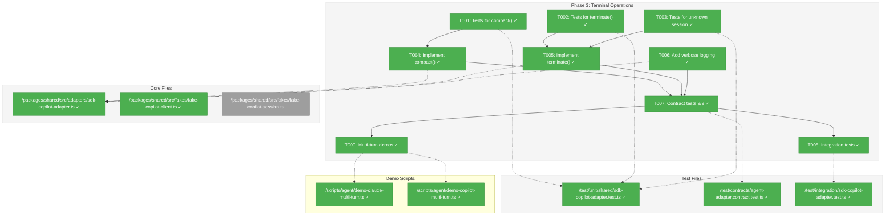
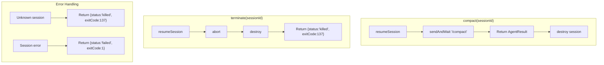
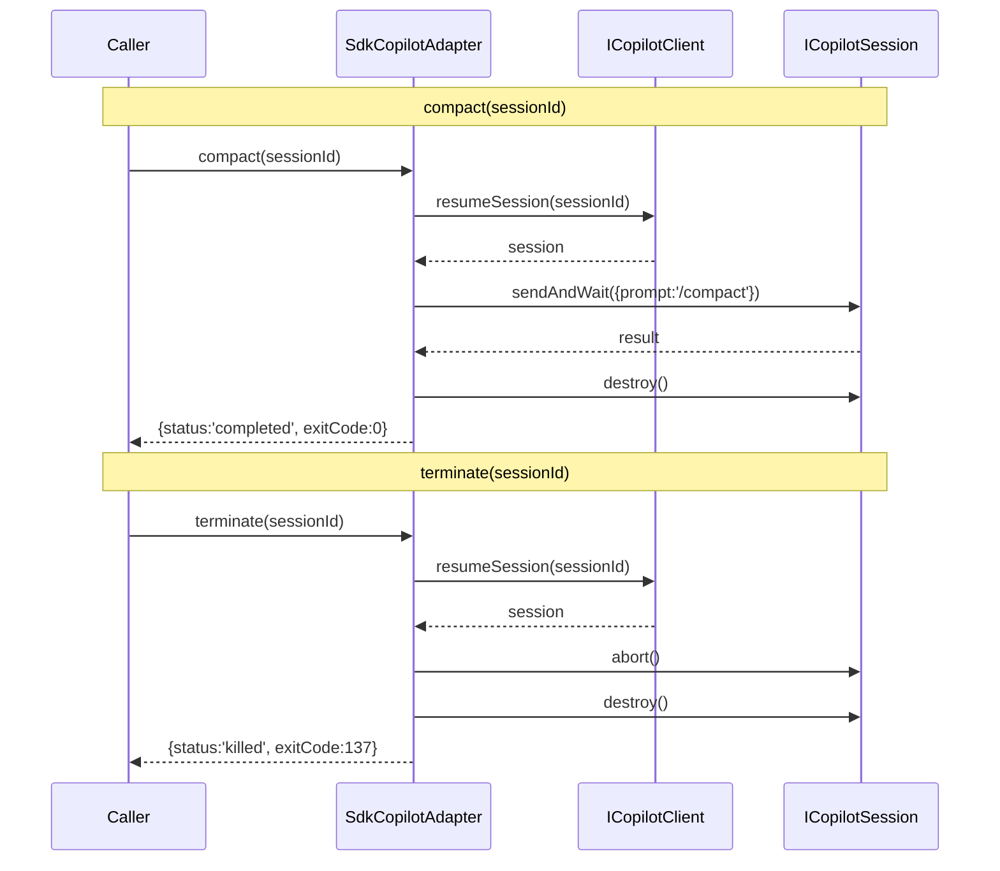

# Phase 3: Terminal Operations & Error Handling – Tasks & Alignment Brief

**Spec**: [../copilot-sdk-spec.md](../../copilot-sdk-spec.md)
**Plan**: [../copilot-sdk-plan.md](../../copilot-sdk-plan.md)
**Date**: 2026-01-24

---

## Executive Briefing

### Purpose

This phase completes the SdkCopilotAdapter by implementing the two remaining IAgentAdapter methods: `compact()` and `terminate()`. These are essential for production use—compact allows context window management, and terminate enables graceful session cleanup.

### What We're Building

Two methods that complete the IAgentAdapter contract:

1. **`compact(sessionId)`**: Sends the `/compact` command to reduce context window usage. Delegates to `run()` internally.
2. **`terminate(sessionId)`**: Stops an active session using `session.abort()` followed by `session.destroy()`. Returns `status: 'killed'`, `exitCode: 137`.

Plus comprehensive error handling for edge cases (unknown sessions, double-terminate, errors during terminate).

### User Value

- **Context Management**: Users can reduce token usage when approaching context limits
- **Clean Shutdown**: Users can terminate runaway sessions without resource leaks
- **Contract Compliance**: All 9 contract tests pass, proving real/fake parity

### Example

**Compact**:
```typescript
const result = await adapter.compact('session-abc-123');
// → { status: 'completed', sessionId: 'session-abc-123', exitCode: 0, output: '/compact executed', tokens: null }
```

**Terminate**:
```typescript
const result = await adapter.terminate('session-abc-123');
// → { status: 'killed', sessionId: 'session-abc-123', exitCode: 137, output: '', tokens: null }
```

---

## Objectives & Scope

### Objective

Implement `compact()` and `terminate()` methods per IAgentAdapter contract (AC-12 through AC-15), achieve 9/9 contract test compliance, and add verbose event logging.

### Goals

- ✅ `compact()` sends `/compact` command via run() delegation
- ✅ `terminate()` calls `abort()` + `destroy()` on session
- ✅ Returns `status: 'killed'`, `exitCode: 137` for terminate
- ✅ Graceful handling of unknown/expired sessions
- ✅ Verbose SDK event logging via ILogger
- ✅ All 9 contract tests pass (**CRITICAL GATE**)
- ✅ Integration tests created (skipped in CI)

### Non-Goals

- ❌ Token metrics implementation (SDK limitation; always `null`)
- ❌ Session caching (per DEC-stateless: use resumeSession each time)
- ❌ Advanced compact options (just `/compact` command for now)
- ❌ Streaming during compact/terminate (not meaningful)
- ❌ Event callback support for compact/terminate (follow existing run() pattern first)
- ❌ Legacy CopilotAdapter removal (Phase 4)
- ❌ Documentation updates (Phase 4)

---

## Architecture Map

### Component Diagram

<!-- Status: grey=pending, orange=in-progress, green=completed, red=blocked -->
<!-- Updated by plan-6 during implementation -->



### Task-to-Component Mapping

<!-- Status: ⬜ Pending | 🟧 In Progress | ✅ Complete | 🔴 Blocked -->

| Task | Component(s) | Files | Status | Comment |
|------|-------------|-------|--------|---------|
| T001 | Unit Tests | `/home/jak/substrate/002-agents/test/unit/shared/sdk-copilot-adapter.test.ts` | ✅ Complete | RED: 5 compact tests added |
| T002 | Unit Tests | `/home/jak/substrate/002-agents/test/unit/shared/sdk-copilot-adapter.test.ts` | ✅ Complete | RED: 6 terminate tests added |
| T003 | Unit Tests | `/home/jak/substrate/002-agents/test/unit/shared/sdk-copilot-adapter.test.ts` | ✅ Complete | RED: 3 unknown session tests added |
| T004 | Adapter | `/home/jak/substrate/002-agents/packages/shared/src/adapters/sdk-copilot-adapter.ts` | ✅ Complete | GREEN: compact() delegates to run() |
| T005 | Adapter | `/home/jak/substrate/002-agents/packages/shared/src/adapters/sdk-copilot-adapter.ts` | ✅ Complete | GREEN: terminate() uses abort+destroy |
| T006 | Adapter | `/home/jak/substrate/002-agents/packages/shared/src/adapters/sdk-copilot-adapter.ts` | ✅ Complete | Added verbose logging to compact/terminate |
| T007 | Contract Tests | `/home/jak/substrate/002-agents/test/contracts/agent-adapter.contract.test.ts` | ✅ Complete | **36/36 PASS - SdkCopilotAdapter 9/9** |
| T008 | Integration Tests | `/home/jak/substrate/002-agents/test/integration/sdk-copilot-adapter.test.ts` | ✅ Complete | Created with skipIf(!sdk \|\| isCI) |
| T009 | Demo Scripts | `/home/jak/substrate/002-agents/scripts/agent/demo-claude-multi-turn.ts`, `/home/jak/substrate/002-agents/scripts/agent/demo-copilot-multi-turn.ts` | ✅ Complete | Context-proving password recall flow |

---

## Tasks

| Status | ID | Task | CS | Type | Dependencies | Absolute Path(s) | Validation | Subtasks | Notes |
|--------|------|------|----|------|--------------|------------------|------------|----------|-------|
| [x] | T001 | Write tests for compact() method | 2 | Test | – | `/home/jak/substrate/002-agents/test/unit/shared/sdk-copilot-adapter.test.ts` | Tests verify: /compact sent as prompt, sessionId preserved, status=completed, tokens=null | – | TDD RED phase |
| [x] | T002 | Write tests for terminate() method | 2 | Test | – | `/home/jak/substrate/002-agents/test/unit/shared/sdk-copilot-adapter.test.ts` | Tests verify: abort() called, destroy() called, status=killed, exitCode=137 | – | TDD RED phase |
| [x] | T003 | Write tests for unknown session handling | 1 | Test | – | `/home/jak/substrate/002-agents/test/unit/shared/sdk-copilot-adapter.test.ts` | Tests verify: graceful handling, returns killed, no exception thrown | – | Edge case from plan |
| [x] | T004 | Implement compact() method | 1 | Core | T001 | `/home/jak/substrate/002-agents/packages/shared/src/adapters/sdk-copilot-adapter.ts` | Tests from T001 pass | – | Delegate to run({prompt:'/compact', sessionId}) |
| [x] | T005 | Implement terminate() method | 2 | Core | T002, T003 | `/home/jak/substrate/002-agents/packages/shared/src/adapters/sdk-copilot-adapter.ts` | Tests from T002, T003 pass | – | resumeSession → abort → destroy |
| [x] | T006 | Add verbose event logging | 2 | Core | T004, T005 | `/home/jak/substrate/002-agents/packages/shared/src/adapters/sdk-copilot-adapter.ts` | All SDK events logged at debug/trace levels | – | Use existing _logger pattern |
| [x] | T007 | Run full contract test suite | 2 | Integration | T004, T005, T006 | `/home/jak/substrate/002-agents/test/contracts/agent-adapter.contract.test.ts` | All 9 contract tests pass | – | **CRITICAL GATE PASSED: 36/36** |
| [x] | T008 | Create integration test file (skip in CI) | 2 | Integration | T007 | `/home/jak/substrate/002-agents/test/integration/sdk-copilot-adapter.test.ts` | Real SDK tests exist, marked skipIf(isCI) | – | Uses real @github/copilot-sdk |
| [x] | T009 | Create multi-turn demo scripts with compact | 2 | **Acceptance** | T007 | `/home/jak/substrate/002-agents/scripts/agent/demo-claude-multi-turn.ts`, `/home/jak/substrate/002-agents/scripts/agent/demo-copilot-multi-turn.ts` | Scripts run successfully showing: Turn 1 → compact → Turn 2, real-time output | – | **MANUAL ACCEPTANCE TEST** - Context-proving password recall |

---

## Alignment Brief

### Prior Phases Review

#### Phase-by-Phase Summary

**Phase 1: SDK Foundation & Fakes** (✅ Complete)
- Established SDK dependency (`@github/copilot-sdk ^0.1.16`)
- Created local interfaces for layer isolation: `ICopilotClient`, `ICopilotSession`
- Built complete test doubles: `FakeCopilotClient`, `FakeCopilotSession`
- Delivered adapter skeleton with `run()` implementation (originally Phase 2 scope)
- 35 unit tests, all passing

**Phase 2: Core Adapter Implementation** (✅ Complete)
- Full `run()` method with session management
- Event translation via `_translateToAgentEvent()`
- Input validation (`_validateCwd()`, `_validatePrompt()`)
- Error handling with proper exitCode mapping
- Streaming support via two subtasks:
  - 001-subtask-add-streaming-events: ProcessManager stdio/onStdoutLine
  - 002-subtask-claude-adapter-streaming: Claude/Copilot streaming demos
- 29 unit tests + 7/9 contract tests passing
- Demo scripts with magenta-colored output

#### Cumulative Deliverables Available

| Phase | Files | Purpose |
|-------|-------|---------|
| 1 | `/packages/shared/src/interfaces/copilot-sdk.interface.ts` | ICopilotClient, ICopilotSession, event types |
| 1 | `/packages/shared/src/fakes/fake-copilot-client.ts` | FakeCopilotClient with event simulation |
| 1 | `/packages/shared/src/fakes/fake-copilot-session.ts` | FakeCopilotSession with abort/destroy tracking |
| 1+2 | `/packages/shared/src/adapters/sdk-copilot-adapter.ts` | SdkCopilotAdapter with run(), stub compact/terminate |
| 2 | `/test/unit/shared/sdk-copilot-adapter.test.ts` | 29 unit tests |
| 2 | `/test/contracts/agent-adapter.contract.test.ts` | Factory for SdkCopilotAdapter |

#### Key Discoveries from Prior Phases

| ID | Discovery | Resolution | Impact on Phase 3 |
|----|-----------|------------|-------------------|
| DYK-01 | SDK version pinning uses caret | Accepted for codebase consistency | No change needed |
| DYK-02 | Handler registration timing matters | Register BEFORE sendAndWait | Apply same pattern in terminate if needed |
| DYK-03 | Event emission pattern in fakes | Store handler from on(), emit during sendAndWait | FakeCopilotSession already supports this |
| DYK-04 | Validation methods ported verbatim | Copy from legacy adapter | Already done; no Phase 3 impact |
| DYK-05 | Session cleanup in finally block | Always call destroy() | Apply to terminate() error paths |
| DYK-06 | Streaming flag dynamic | Pass streaming: true when onEvent provided | Not needed for compact/terminate |

#### Test Infrastructure Available

- **FakeCopilotClient**: Configurable events, strictSessions mode, `getSessionHistory()`, `reset()`
- **FakeCopilotSession**: Pre-configured events, `getSendHistory()`, `getAbortCount()`, `wasDestroyed()`
- **Contract test factory**: Already wired for SdkCopilotAdapter (line 100-113)
- **Test pattern**: All tests follow Purpose/Quality Contribution/Acceptance Criteria format

#### Reusable Patterns

1. **Constructor DI**: `new SdkCopilotAdapter(fakeClient)` for testing
2. **Error mapping**: `catch (error) { return { status: 'failed', exitCode: 1, ... } }`
3. **Session cleanup**: `finally { await session.destroy(); }`
4. **Validation early return**: Check inputs before creating session

### Critical Findings Affecting This Phase

| Finding | Constraint/Requirement | Tasks Addressing |
|---------|----------------------|------------------|
| CF-02: Session resumption works | compact() and terminate() must use resumeSession() with existing sessionId | T004, T005 |
| CF-03: Error event mapping | Handle session.error events during compact/terminate | T004, T005 |
| CF-05: CI test isolation | Integration tests must be skipped in CI environment | T008 |

### ADR Decision Constraints

| ADR | Decision | Constraint | Tasks |
|-----|----------|-----------|-------|
| ADR-0002 | Fakes only, no mocks | All test doubles must be fakes implementing interfaces | T001, T002, T003 |

### Invariants & Guardrails

- **exitCode for killed**: Always 137 (standard SIGKILL code)
- **Session cleanup**: destroy() must be called even on error paths
- **No session caching**: Per DEC-stateless, use resumeSession() for each operation
- **Contract compliance**: 9/9 tests must pass before Phase 4

### Inputs to Read

| File | Why |
|------|-----|
| `/home/jak/substrate/002-agents/packages/shared/src/adapters/sdk-copilot-adapter.ts` | Current implementation with stub methods |
| `/home/jak/substrate/002-agents/packages/shared/src/interfaces/agent-adapter.interface.ts` | IAgentAdapter contract (AC-12 through AC-15) |
| `/home/jak/substrate/002-agents/test/contracts/agent-adapter.contract.ts` | Contract test requirements |
| `/home/jak/substrate/002-agents/packages/shared/src/fakes/fake-copilot-session.ts` | FakeCopilotSession capabilities (abort/destroy tracking) |

### Visual Alignment: Flow Diagram



### Visual Alignment: Sequence Diagram



### Test Plan (TDD - Write Tests First)

#### T001: compact() Tests

```typescript
describe('SdkCopilotAdapter.compact()', () => {
  test('should send /compact as prompt', async () => {
    /**
     * Purpose: Validates AC-12 - compact sends /compact command
     * Quality Contribution: Ensures context reduction works
     * Acceptance Criteria: /compact sent, result returned with completed status
     */
    const fakeClient = new FakeCopilotClient();
    const adapter = new SdkCopilotAdapter(fakeClient);

    // Create session first
    await adapter.run({ prompt: 'test' });
    const sessionId = fakeClient.getLastSessionId();

    const result = await adapter.compact(sessionId);

    expect(fakeClient.getLastPrompt()).toBe('/compact');
    expect(fakeClient.getLastSessionId()).toBe(sessionId); // DYK-04: Explicit sessionId verification
    expect(result.sessionId).toBe(sessionId);
    expect(result.status).toBe('completed');
    expect(result.tokens).toBeNull();
  });

  test('should return failed on session error', async () => {
    /**
     * Purpose: Validates error handling during compact
     * Quality Contribution: Ensures errors don't crash adapter
     * Acceptance Criteria: status=failed, exitCode=1, error in output
     */
    const fakeClient = new FakeCopilotClient({
      events: [{ type: 'session.error', data: { message: 'Compact failed', errorType: 'COMPACT_ERROR' } }]
    });
    const adapter = new SdkCopilotAdapter(fakeClient);

    const result = await adapter.compact('session-123');

    expect(result.status).toBe('failed');
    expect(result.exitCode).toBe(1);
  });
});
```

#### T002: terminate() Tests

```typescript
describe('SdkCopilotAdapter.terminate()', () => {
  test('should abort and destroy session', async () => {
    /**
     * Purpose: Validates AC-14 - terminate stops session
     * Quality Contribution: Prevents resource leaks
     * Acceptance Criteria: status=killed, exitCode=137, abort+destroy called
     */
    const fakeClient = new FakeCopilotClient();
    const adapter = new SdkCopilotAdapter(fakeClient);

    // Create session first
    const runResult = await adapter.run({ prompt: 'test' });
    const sessionId = runResult.sessionId;

    const result = await adapter.terminate(sessionId);

    expect(result.status).toBe('killed');
    expect(result.exitCode).toBe(137);
    expect(fakeClient.getLastSession()?.getAbortCount()).toBe(1);
    expect(fakeClient.getLastSession()?.wasDestroyed()).toBe(true);
  });
});
```

#### T003: Unknown Session Tests

```typescript
describe('SdkCopilotAdapter.terminate() - unknown session', () => {
  test('should handle unknown session gracefully', async () => {
    /**
     * Purpose: Validates graceful handling of missing sessions
     * Quality Contribution: Prevents crashes on invalid terminate
     * Acceptance Criteria: Returns killed status, no exception
     */
    const fakeClient = new FakeCopilotClient({ strictSessions: false });
    const adapter = new SdkCopilotAdapter(fakeClient);

    const result = await adapter.terminate('nonexistent-session');

    expect(result.status).toBe('killed');
    expect(result.exitCode).toBe(137);
    // No exception thrown
  });
});
```

### Step-by-Step Implementation Outline

1. **T001**: Add test file section for `compact()` with 3-4 tests
2. **T002**: Add test file section for `terminate()` with 3-4 tests
3. **T003**: Add edge case tests for unknown sessions
4. **T004**: Replace compact() stub with delegation to run()
5. **T005**: Replace terminate() stub with abort → destroy logic
6. **T006**: Add `_logger.debug()` calls for key events
7. **T007**: Run `pnpm vitest run test/contracts` and verify 9/9
8. **T008**: Create `/test/integration/sdk-copilot-adapter.test.ts` with real SDK tests
9. **T009**: Create multi-turn demo scripts for Claude and Copilot

### T009: Multi-Turn Demo Scripts

**Purpose**: Provide eyes-on verification that compact() works in a real multi-turn conversation flow.

**Scripts to Create**:
1. `scripts/agent/demo-claude-multi-turn.ts` — Uses real ClaudeCodeAdapter
2. `scripts/agent/demo-copilot-multi-turn.ts` — Uses real CopilotClient + SdkCopilotAdapter

**Demo Flow** (both scripts):
```
Turn 1: Ask agent to remember something specific
         e.g., "I'll tell you a secret. The password is 'blueberry'. Remember it."
         → Show session ID, output, streaming events
         
Compact: Send /compact command
         → Show compact result
         
Turn 2: Ask agent to recall Turn 1 information (PROVES CONTEXT SURVIVED)
         e.g., "What is the password I told you?"
         → If agent says "blueberry" → Context survived compact ✅
         → Show continued context awareness
```

**Pass Criteria (DYK-05)**: Turn 2 correctly recalls Turn 1 information, proving context survived compact.

**Output Format** (real-time, colored):
```
🤖 Multi-Turn Conversation Demo

═══════════════════════════════════════
📝 Turn 1: Initial question
═══════════════════════════════════════
Session ID: abc-123
[streaming events...]
Response: [magenta colored output]

═══════════════════════════════════════
🗜️ Compact: Reducing context
═══════════════════════════════════════
Compact result: completed
Session ID: abc-123 (preserved)

═══════════════════════════════════════
📝 Turn 2: Follow-up question
═══════════════════════════════════════
Session ID: abc-123 (same session)
[streaming events...]
Response: [magenta colored output]

✓ Demo complete!
```

**CLI Support**:
- Custom prompts as arguments
- `--help` flag

### Commands to Run

```bash
# TypeScript compilation check
pnpm tsc --noEmit

# Run unit tests only
pnpm vitest run test/unit/shared/sdk-copilot-adapter.test.ts

# Run contract tests (CRITICAL GATE)
pnpm vitest run test/contracts/agent-adapter.contract.test.ts

# Run all tests
pnpm vitest run

# Verify layer isolation (should return empty)
grep -r "@github/copilot-sdk" packages/shared/src/fakes/
```

### Risks/Unknowns

| Risk | Severity | Mitigation |
|------|----------|------------|
| FakeCopilotSession may not track abort/destroy correctly | Medium | Verify fake implementation before T002 |
| resumeSession with unknown ID behavior | Low | FakeCopilotClient strictSessions mode handles this |
| Contract tests timing sensitive | Low | Use immediate fake responses |
| Fake-real parity for `/compact` behavior | Low | DYK-01: Rely on T008 integration tests; fake tests logic only (ADR-0002) |

### Ready Check

- [x] ADR constraints mapped to tasks (ADR-0002 → T001, T002, T003)
- [x] Phase 1+2 deliverables verified available
- [x] Test infrastructure verified (FakeCopilotSession abort/destroy tracking)
- [x] Contract test expectations understood (9 tests, AC-12 through AC-15)
- [x] **DYK-02 Baseline established**: SdkCopilotAdapter 7/9 contract tests passing (2026-01-24)
  - ❌ `should return status killed after terminate()` → throws "Not implemented"
  - ❌ `should send compact command and return result` → throws "Not implemented"
  - Target: 9/9 (all other adapters pass 9/9)

**Awaiting explicit GO/NO-GO from human sponsor.**

---

## Phase Footnote Stubs

| Footnote | Added By | Task | Description |
|----------|----------|------|-------------|
| | | | _To be populated by plan-6a during implementation_ |

---

## Evidence Artifacts

| Artifact | Location | Purpose |
|----------|----------|---------|
| Execution log | `/home/jak/substrate/002-agents/docs/plans/006-copilot-sdk/tasks/phase-3-terminal-operations-error-handling/execution.log.md` | Detailed implementation narrative |
| Unit test results | Terminal output | Test pass/fail evidence |
| Contract test results | Terminal output | 9/9 compliance verification |

---

## Critical Insights Discussion

**Session**: 2026-01-24 01:10 UTC
**Context**: Phase 3 Terminal Operations & Error Handling Tasks
**Analyst**: AI Clarity Agent
**Reviewer**: Development Team
**Format**: Water Cooler Conversation (5 Critical Insights)

### Insight 1: The "/compact" Delegation Creates Fake-Real Parity Risk

**Did you know**: compact() delegates to run({prompt: '/compact'}) but the fake has no special handling for slash commands - fakes test logic, not SDK specifics.

**Implications**:
- FakeCopilotSession treats `/compact` as any other string prompt
- Contract tests pass but don't prove SDK-specific compact behavior
- Real verification happens in T008/T009

**Options Considered**:
- Option A: Accept Delegation + Integration Tests - Simple delegation, rely on T008
- Option B: Add Compact-Specific Event Simulation - Enhance fake
- Option C: Defer to Integration Tests - T008 for real verification

**AI Recommendation**: Option A + C - Simple delegation, integration tests verify reality

**Discussion Summary**: Agreed that ADR-0002 principle (fakes test logic) applies. Integration tests T008 exist for SDK verification.

**Decision**: Implement simple delegation, add risk row documenting reliance on T008 for SDK parity verification

**Action Items**:
- [x] Added DYK-01 risk row to Risks/Unknowns table

**Affects**: T004 implementation approach, T008 importance

---

### Insight 2: The "7/9 Contract Tests Passing" Claim May Be Stale

**Did you know**: We claimed 7/9 contract tests pass but hadn't verified this baseline before generating the tasks.

**Implications**:
- Need known baseline before implementation
- Without baseline, can't tell if changes fixed or broke things
- T007 critical gate needs clear before/after comparison

**Options Considered**:
- Option A: Run Contract Tests Now to Establish Baseline
- Option B: Trust the 7/9 Estimate and Discover at T007
- Option C: Add Baseline Verification as T000

**AI Recommendation**: Option A - Quick baseline check

**Discussion Summary**: Ran tests immediately. Confirmed SdkCopilotAdapter is 7/9 (compact and terminate failing with "Not implemented").

**Decision**: Established baseline: 34/36 total, SdkCopilotAdapter 7/9

**Action Items**:
- [x] Ran `pnpm vitest run test/contracts/agent-adapter.contract.test.ts`
- [x] Documented exact failing tests in Ready Check section

**Affects**: T007 success criteria, Ready Check verification

---

### Insight 3: T009 Multi-Turn Demo Has a Hidden Chicken-and-Egg Problem

**Did you know**: T007 tests with fakes only prove compact() doesn't throw - T009 is the real acceptance test that proves SDK behavior.

**Implications**:
- T007 can pass while real SDK behaves differently
- T009 is manual acceptance testing, not optional demo
- Integration tests (T008) bridge the gap but skip in CI

**Options Considered**:
- Option A: Accept the Gap - T009 is Eyes-On Verification
- Option B: Run T009 Demo Before T007 Gate
- Option C: Add Smoke Test in T008 Integration

**AI Recommendation**: Option A - T009 is the real acceptance test

**Discussion Summary**: Agreed that T009 should be framed as "manual acceptance testing" not "optional demo".

**Decision**: Keep task ordering; T009 type changed from "Demo" to "Acceptance"

**Action Items**:
- [x] Updated T009 Type from "Demo" to "Acceptance"
- [x] Updated T009 Notes to "MANUAL ACCEPTANCE TEST"

**Affects**: T009 task metadata, acceptance criteria framing

---

### Insight 4: FakeCopilotClient's strictSessions Mode Creates a Testing Blind Spot

**Did you know**: By default, FakeCopilotClient accepts ANY sessionId for resumeSession() - tests can "pass" while hiding real bugs.

**Implications**:
- Test might not catch sessionId typos in implementation
- strictSessions: true would catch this but adds complexity
- Explicit assertions are clearer than implicit strict mode

**Options Considered**:
- Option A: Use strictSessions: true for T001/T002
- Option B: Always Use strictSessions: false
- Option C: Add Explicit SessionId Verification to Tests

**AI Recommendation**: Option C - Explicit verification assertions

**Discussion Summary**: Agreed that explicit is better - `expect(fakeClient.getLastSessionId()).toBe(sessionId)` documents what we're testing.

**Decision**: Add explicit sessionId assertions to T001/T002 tests

**Action Items**:
- [x] Updated T001 test example with DYK-04 comment showing explicit sessionId assertion

**Affects**: T001, T002 test patterns

---

### Insight 5: The Copilot Multi-Turn Demo May Not Actually Prove Context Continuity

**Did you know**: Showing "Turn 1 → compact → Turn 2" doesn't prove context was preserved if Turn 2 doesn't reference Turn 1 content.

**Implications**:
- Demo could "pass" without proving anything meaningful
- Need Turn 2 to recall Turn 1 information to prove context survived
- Context-dependent prompts make demo meaningful

**Options Considered**:
- Option A: Use Context-Dependent Follow-Up Questions
- Option B: Use Code-Based Verification
- Option C: Just Document Expected Behavior

**AI Recommendation**: Option A - Context-dependent prompts

**Discussion Summary**: Agreed that demo should prove what we claim - if agent remembers Turn 1 info, context is proven preserved.

**Decision**: Use context-dependent prompts (e.g., "What is the password I told you?")

**Action Items**:
- [x] Updated T009 demo flow with context-proving prompts
- [x] Added DYK-05 pass criteria

**Affects**: T009 demo script design, acceptance criteria

---

## Session Summary

**Insights Surfaced**: 5 critical insights identified and discussed
**Decisions Made**: 5 decisions reached through collaborative discussion
**Action Items Created**: 8 updates applied
**Areas Requiring Updates**:
- Ready Check section (baseline verification)
- Risks/Unknowns table (DYK-01)
- T009 task metadata and demo flow

**Shared Understanding Achieved**: ✓

**Confidence Level**: High - All key risks identified and mitigated before implementation

**Next Steps**:
Run `/plan-6-implement-phase --phase "Phase 3: Terminal Operations & Error Handling" --plan "/home/jak/substrate/002-agents/docs/plans/006-copilot-sdk/copilot-sdk-plan.md"` to begin implementation

**Notes**:
- Contract test baseline: SdkCopilotAdapter 7/9 (compact, terminate failing)
- T009 is mandatory acceptance testing, not optional demo
- Explicit assertions preferred over strictSessions mode

---

## Discoveries & Learnings

_Populated during implementation by plan-6. Log anything of interest to your future self._

| Date | Task | Type | Discovery | Resolution | References |
|------|------|------|-----------|------------|------------|
| 2026-01-24 | T004 | unexpected-behavior | compact() destroyed session context - delegating to run() caused session.destroy() in finally block, losing all conversation history | Rewrote compact() to call SDK directly without destroy(); session stays alive for subsequent turns | execution.log.md#post-phase-bug-fix |
| 2026-01-24 | T004 | insight | Session lifecycle differs by operation: run()=ephemeral (destroy after), compact()=persistent (keep alive), terminate()=final (explicit destroy) | Document in code comments; this distinction critical for multi-turn conversations | DYK-01 amendment |
| 2026-01-24 | T009 | gotcha | /compact via SDK works correctly when sent as prompt to sendAndWait(); no special SDK method needed | Use sendAndWait({prompt: '/compact'}) - same as CLI stdin behavior | copilot-sdk search |

**Types**: `gotcha` | `research-needed` | `unexpected-behavior` | `workaround` | `decision` | `debt` | `insight`

**What to log**:
- Things that didn't work as expected
- External research that was required
- Implementation troubles and how they were resolved
- Gotchas and edge cases discovered
- Decisions made during implementation
- Technical debt introduced (and why)
- Insights that future phases should know about

_See also: `execution.log.md` for detailed narrative._

---

## Directory Layout

```
docs/plans/006-copilot-sdk/
├── copilot-sdk-plan.md
├── copilot-sdk-spec.md
├── research-dossier.md
└── tasks/
    ├── phase-1-sdk-foundation-fakes/
    │   ├── tasks.md
    │   └── execution.log.md
    ├── phase-2-core-adapter-implementation/
    │   ├── tasks.md
    │   ├── execution.log.md
    │   ├── 001-subtask-add-streaming-events.md
    │   ├── 001-subtask-execution.log.md
    │   ├── 002-subtask-claude-adapter-streaming.md
    │   └── 002-subtask-execution.log.md
    └── phase-3-terminal-operations-error-handling/
        ├── tasks.md           # <-- This file
        └── execution.log.md   # <-- Created by plan-6
```
