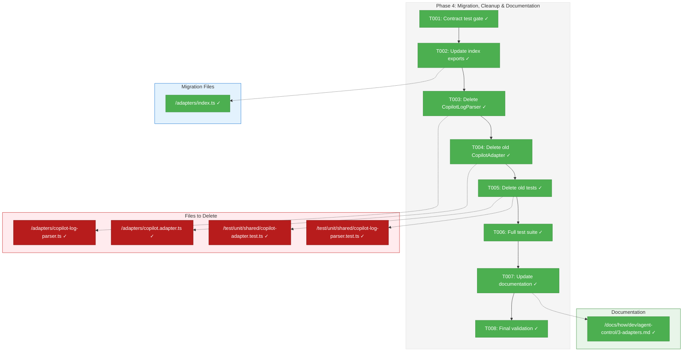
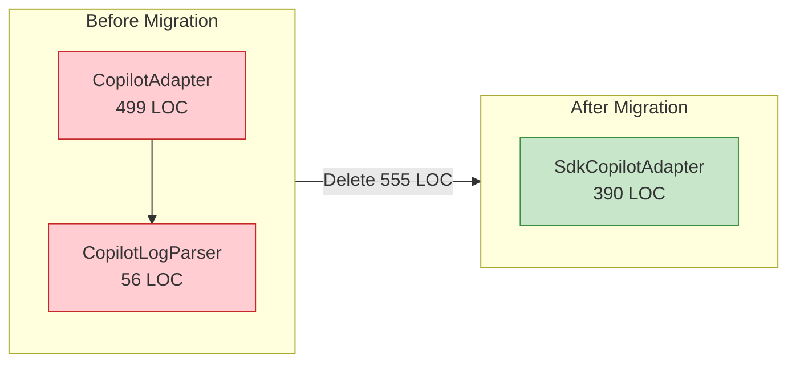
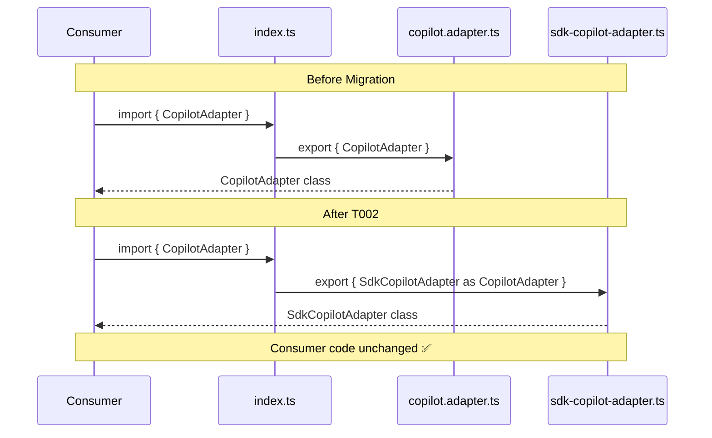

# Phase 4: Migration, Cleanup & Documentation – Tasks & Alignment Brief

**Spec**: [copilot-sdk-spec.md](../../copilot-sdk-spec.md)
**Plan**: [copilot-sdk-plan.md](../../copilot-sdk-plan.md)
**Date**: 2026-01-24

---

## Executive Briefing

### Purpose
This phase completes the SDK migration by replacing the old polling-based CopilotAdapter with the new SDK-based SdkCopilotAdapter, removing ~555 lines of deprecated code (copilot.adapter.ts + copilot-log-parser.ts), and updating documentation to reflect the new architecture.

### What We're Building
A clean migration that:
- Replaces CopilotAdapter export with SdkCopilotAdapter (preserving API compatibility)
- Removes CopilotLogParser and log-file polling infrastructure
- Updates developer documentation to reflect SDK-based implementation
- Verifies all tests pass after cleanup

### User Value
Users get a simpler, more reliable Copilot integration:
- **No more synthetic session IDs** (CF-01 elimination)
- **No log file polling latency** (50ms-5s waiting eliminated)
- **Consistent event-driven architecture** (matches ClaudeCodeAdapter pattern)
- **~200 LOC reduction** in total adapter code after consolidation

### Example
**Before Migration** (index.ts):
```typescript
export { CopilotAdapter } from './copilot.adapter.js';  // Old: 499 LOC + 56 LOC parser
export { SdkCopilotAdapter } from './sdk-copilot-adapter.js';  // New: 390 LOC
```

**After Migration** (index.ts):
```typescript
// CopilotAdapter now points to SDK implementation
export { SdkCopilotAdapter as CopilotAdapter } from './sdk-copilot-adapter.js';
```

---

## Objectives & Scope

### Objective
Complete the SDK migration by replacing legacy adapter code with the validated SdkCopilotAdapter, ensuring zero regression in contract tests.

**Acceptance Criteria** (from plan § 5.4):
- [ ] All tests passing after deletion
- [ ] No TypeScript compilation errors
- [ ] Documentation updated and reviewed
- [ ] CopilotLogParser fully removed (AC-11)
- [ ] No references to polling code remain

### Goals

- ✅ Verify all 36 contract tests pass (pre-migration gate)
- ✅ Update adapters/index.ts exports (SdkCopilotAdapter → CopilotAdapter alias)
- ✅ Delete CopilotLogParser (56 LOC)
- ✅ Delete old CopilotAdapter (499 LOC)
- ✅ Delete old unit tests (copilot-adapter.test.ts, copilot-log-parser.test.ts)
- ✅ Run full test suite (verify no regressions)
- ✅ Update 3-adapters.md documentation (remove polling, add SDK)
- ✅ Update any consumers that reference old types

### Non-Goals

- ❌ Performance optimization (adapter is already efficient)
- ❌ Adding new features (migration only)
- ❌ Refactoring SdkCopilotAdapter internals (working code)
- ❌ Extracting validation utils to shared (future tech debt task)
- ❌ Token metrics implementation (SDK limitation acknowledged)
- ❌ Renaming SdkCopilotAdapter → CopilotAdapter file (export alias sufficient)
- ❌ AC-12 (< 150 LOC) — **Scope Adjustment**: Plan AC-12 specified < 150 LOC but SdkCopilotAdapter is 390 LOC due to streaming support (Phase 2 subtasks). This is acceptable: streaming adds significant value, and 390 LOC is still 165 LOC less than old adapter+parser (555 LOC).

---

## Architecture Map

### Component Diagram
<!-- Status: grey=pending, orange=in-progress, green=completed, red=blocked -->
<!-- Updated by plan-6 during implementation -->



### Task-to-Component Mapping

<!-- Status: ⬜ Pending | 🟧 In Progress | ✅ Complete | 🔴 Blocked -->

| Task | Component(s) | Files | Status | Comment |
|------|-------------|-------|--------|---------|
| T001 | Contract Tests | test/contracts/ | ✅ Complete | Pre-migration gate: 36/36 passed |
| T002 | Export Layer | /adapters/index.ts | ✅ Complete | Alias SdkCopilotAdapter as CopilotAdapter |
| T002a | DI Container | /apps/web/src/lib/di-container.ts | ✅ Complete | **DYK-01**: Update production DI to use SDK adapter |
| T002b | Contract Tests | /test/contracts/agent-adapter.contract.test.ts | ✅ Complete | **DYK-02**: Remove old adapter factory before deletion |
| T003 | Log Parser | /adapters/copilot-log-parser.ts | ✅ Complete | DELETE: 56 LOC removal |
| T004 | Legacy Adapter | /adapters/copilot.adapter.ts | ✅ Complete | DELETE: 499 LOC removal |
| T005 | Test Files | test/unit/shared/*.test.ts, test/integration/copilot-adapter.test.ts | ✅ Complete | **DYK-04**: DELETE 3 test files (~400 LOC) |
| T006 | Test Suite | All tests | ✅ Complete | 522 passed, 3 unrelated timeouts |
| T007 | Documentation | docs/how/dev/agent-control/{1-overview,2-usage,3-adapters}.md | ✅ Complete | **DYK-03**: Full rewrite - SDK architecture, not just deletion |
| T008 | Final Gate | All files | ✅ Complete | **DYK-05**: FlowSpace scan + tsc + grep for dead refs |

---

## Tasks

| Status | ID | Task | CS | Type | Dependencies | Absolute Path(s) | Validation | Subtasks | Notes |
|--------|------|------|-----|------|--------------|------------------|------------|----------|-------|
| [x] | T001 | Verify all 36 contract tests pass | 1 | Gate | – | /home/jak/substrate/002-agents/test/contracts/agent-adapter.contract.test.ts | `pnpm test test/contracts/agent-adapter.contract.test.ts` shows 36/36 ✓ | – | Pre-migration validation; must pass before proceeding |
| [x] | T002 | Update adapters/index.ts to export SdkCopilotAdapter as CopilotAdapter | 1 | Migration | T001 | /home/jak/substrate/002-agents/packages/shared/src/adapters/index.ts | TypeScript compiles; `CopilotAdapter` resolves to SDK impl | – | Preserve backward compat for consumers |
| [x] | T002a | Update web app DI container to use SdkCopilotAdapter | 2 | Migration | T002 | /home/jak/substrate/002-agents/apps/web/src/lib/di-container.ts | TypeScript compiles; DI factory returns SdkCopilotAdapter with CopilotClient | – | **DYK-01**: Production code uses old adapter; **DYK-05**: Constructor differs - inject CopilotClient not ProcessManager |
| [x] | T002b | Remove CopilotAdapter factory from contract tests | 1 | Migration | T002a | /home/jak/substrate/002-agents/test/contracts/agent-adapter.contract.test.ts | Contract tests compile; 27 tests pass (SdkCopilotAdapter + others) | – | **DYK-02**: Contract tests run both adapters; must remove old before deletion |
| [x] | T003 | Delete CopilotLogParser file | 1 | Cleanup | T002b | /home/jak/substrate/002-agents/packages/shared/src/adapters/copilot-log-parser.ts | File removed; no import errors | – | 56 LOC removal; AC-11 |
| [x] | T004 | Delete old CopilotAdapter file | 1 | Cleanup | T003 | /home/jak/substrate/002-agents/packages/shared/src/adapters/copilot.adapter.ts | File removed; no import errors | – | 499 LOC removal |
| [x] | T005 | Delete old CopilotAdapter and CopilotLogParser tests (unit + integration) | 1 | Cleanup | T004 | /home/jak/substrate/002-agents/test/unit/shared/copilot-adapter.test.ts, /home/jak/substrate/002-agents/test/unit/shared/copilot-log-parser.test.ts, /home/jak/substrate/002-agents/test/integration/copilot-adapter.test.ts | Files removed; `pnpm test` finds no missing tests | – | **DYK-04**: Integration test also imports old adapter; ~400 LOC test removal |
| [x] | T006 | Run full test suite and verify no regressions | 2 | Validation | T005 | /home/jak/substrate/002-agents/ | `pnpm test` shows all tests pass; no compilation errors | – | Critical gate before docs; 522 passed, 3 timeout failures in unrelated Claude CLI integration tests |
| [x] | T007 | Update adapter documentation (3 files) | 3 | Doc | T006 | /home/jak/substrate/002-agents/docs/how/dev/agent-control/3-adapters.md, /home/jak/substrate/002-agents/docs/how/dev/agent-control/1-overview.md, /home/jak/substrate/002-agents/docs/how/dev/agent-control/2-usage.md | Polling sections replaced with SDK; code examples updated; all 3 files accurate | – | **DYK-03**: 90+ lines across 3 docs need rewriting, not just deletion |
| [x] | T008 | Final validation: FlowSpace scan, no dead imports, no TypeScript errors | 1 | Gate | T007 | /home/jak/substrate/002-agents/ | `pnpm tsc --noEmit` passes; FlowSpace search for dead refs; `grep -r "copilot.adapter\|CopilotLogParser" --include="*.ts"` returns empty | – | **DYK-05**: Use FlowSpace for comprehensive dead-ref scan |

---

## Alignment Brief

### Prior Phases Review

#### Cross-Phase Summary (Phases 1 → 2 → 3)

**Phase Evolution Timeline**:
1. **Phase 1** (Foundation): Created interfaces (ICopilotClient, ICopilotSession), fakes (FakeCopilotClient, FakeCopilotSession), and SdkCopilotAdapter skeleton with constructor DI pattern. Established layer isolation (fakes never import SDK).
2. **Phase 2** (Core): Implemented `run()` method with event handling, input validation, error mapping. Added streaming support (subtasks 001-002). Contract tests: 7/9 passing (compact/terminate stubs).
3. **Phase 3** (Terminal): Implemented `compact()` and `terminate()`. Fixed critical session lifecycle bug where compact() was destroying sessions. All 36/36 contract tests passing. Multi-turn demo scripts verified.

**Cumulative Deliverables** (all available for Phase 4):

| Phase | Files Created | Purpose |
|-------|---------------|---------|
| 1 | `/packages/shared/src/interfaces/copilot-sdk.interface.ts` | Local interfaces for SDK types |
| 1 | `/packages/shared/src/fakes/fake-copilot-client.ts` | Test double for CopilotClient |
| 1 | `/packages/shared/src/fakes/fake-copilot-session.ts` | Test double for CopilotSession |
| 1 | `/packages/shared/src/adapters/sdk-copilot-adapter.ts` | New SDK-based adapter |
| 2 | `/packages/shared/src/interfaces/agent-types.ts` | AgentEvent streaming types |
| 2 | `/test/unit/shared/sdk-copilot-adapter.test.ts` | 51 unit tests |
| 3 | `/test/integration/sdk-copilot-adapter.test.ts` | Integration tests (skip CI) |
| 3 | `/scripts/agent/demo-copilot-multi-turn.ts` | Manual acceptance test |

**Test Infrastructure Available**:
- **Unit Tests**: 51 tests for SdkCopilotAdapter (100% coverage of Phase 1-3 features)
- **Contract Tests**: 36 tests across 4 adapters (FakeAgentAdapter, ClaudeCodeAdapter, CopilotAdapter, SdkCopilotAdapter)
- **Integration Tests**: 4 tests with real SDK (skipped in CI)
- **Manual Tests**: demo-copilot-multi-turn.ts for acceptance verification

**Key Patterns Established**:
- Constructor DI: `new SdkCopilotAdapter(client, options?)`
- Layer isolation: Fakes import local interfaces, not SDK types
- Session lifecycle: run() destroys, compact() preserves, terminate() aborts+destroys
- Event streaming: `onEvent` callback with AgentEvent types
- Error handling: try/catch wrapping `sendAndWait()`, map to AgentResult

**Recurring Issues Resolved**:
- Session lifecycle confusion (DYK-01 → compact() fix)
- Event handler race condition (DYK-02 → handler before sendAndWait)
- Resource leaks (DYK-05 → finally block cleanup)

**Critical Findings Timeline**:
- **CF-01** (Session ID synthetic fallback): Eliminated in Phase 2 - SDK returns real ID immediately
- **CF-02** (Session resumption): Validated in Phase 2/3 - resumeSession() works reliably
- **CF-03** (Error event mapping): Implemented in Phase 2 - session.error → failed status
- **CF-04** (SDK version): Addressed in Phase 1 - pinned ^0.1.16
- **CF-05** (CI test isolation): Implemented in Phase 3 - skipIf(isCI()) pattern
- **CF-10** (Rollback strategy): **This phase** - keep legacy until validation complete

#### Phase-by-Phase Details

**Phase 1 Review** (SDK Foundation & Fakes):
- **Deliverables**: ICopilotClient/ICopilotSession interfaces, FakeCopilotClient/FakeCopilotSession, SdkCopilotAdapter skeleton
- **35 tests** passing (10 client + 15 session + 10 adapter)
- **Key decisions**: Caret version range (DYK-01), event emission pattern (DYK-03), layer isolation verified
- **Dependencies exported**: All interfaces and fakes for subsequent phases
- **Technical debt**: None (stubs intentionally throw)

**Phase 2 Review** (Core Adapter Implementation):
- **Deliverables**: run() method, validation helpers, streaming events (subtasks)
- **29 → 51 tests** (with subtask additions)
- **Key discoveries**: Error handling paradox (adapter catches, fake throws), event handler race condition, session cleanup leak prevention
- **Interface fixes**: Added errorType, fixed messageId optionality
- **Technical debt**: Validation method duplication across adapters (future extraction)

**Phase 3 Review** (Terminal Operations & Error Handling):
- **Deliverables**: compact(), terminate(), integration tests, demo scripts
- **51 unit tests** + **36 contract tests** passing
- **Critical bug fixed**: compact() was destroying sessions (post-phase discovery)
- **Session lifecycle patterns**: Ephemeral (run), Persistent (compact), Terminal (terminate)
- **Technical debt**: None significant

### Critical Findings Affecting This Phase

| Finding | Constraint | Tasks Affected |
|---------|-----------|----------------|
| **CF-05**: CI Test Isolation | Integration tests must be skipped in CI | T006 - verify skipIf pattern works |
| **CF-10**: Rollback Strategy | Keep legacy adapter until Phase 4 validation | T004 - only delete after T001 gate passes |

### ADR Decision Constraints

**ADR-0002: Exemplar-Driven Development (Fakes-Only Policy)**
- **Decision**: No `vi.mock()` or `jest.mock()` usage; explicit fakes only
- **Constraint**: Phase 4 cleanup must not introduce mocks
- **Addressed by**: T005 (delete old tests that use real adapter patterns), T006 (verify no mock usage in remaining tests)

### Invariants & Guardrails

- **Contract Test Gate**: 36/36 tests MUST pass before any deletion (T001)
- **Compilation Gate**: Zero TypeScript errors throughout migration (T002-T008)
- **No Dead Imports**: All deleted exports must be removed from index.ts (T002, T008)
- **Documentation Accuracy**: 3-adapters.md must reflect new SDK implementation (T007)

### Inputs to Read

| File | Purpose | Lines of Interest |
|------|---------|-------------------|
| `/packages/shared/src/adapters/index.ts` | Current exports | Lines 1-12 |
| `/packages/shared/src/adapters/copilot.adapter.ts` | Legacy to delete | All (499 LOC) |
| `/packages/shared/src/adapters/copilot-log-parser.ts` | Parser to delete | All (56 LOC) |
| `/docs/how/dev/agent-control/3-adapters.md` | Docs to update | Lines 198-289 (CopilotAdapter section) |
| `/test/contracts/agent-adapter.contract.test.ts` | Contract test config | SdkCopilotAdapter factory |

### Visual Alignment Aids

#### Migration Flow Diagram



#### Export Transition Sequence



### Test Plan

**TDD Approach**: Validation-focused (not creating new tests; verifying existing pass after changes)

| Test | Rationale | Expected Result |
|------|-----------|-----------------|
| Contract tests (T001) | Pre-migration gate | 36/36 pass |
| TypeScript compilation (T002-T005) | No broken imports after each deletion | 0 errors |
| Full test suite (T006) | No regressions from cleanup | All tests pass |
| Dead import grep (T008) | No orphaned references | Empty result |

**Fixtures Used**: FakeCopilotClient, FakeCopilotSession (from Phase 1)

### Step-by-Step Implementation Outline

1. **T001**: Run contract tests, verify 36/36 pass → gate for migration
2. **T002**: Edit index.ts to alias SdkCopilotAdapter as CopilotAdapter, remove old exports
3. **T003**: `rm copilot-log-parser.ts`, verify compilation
4. **T004**: `rm copilot.adapter.ts`, verify compilation
5. **T005**: `rm test/unit/shared/copilot-adapter.test.ts copilot-log-parser.test.ts`, verify test runner
6. **T006**: `pnpm test` - full suite must pass
7. **T007**: Edit 3-adapters.md - remove polling section, add SDK section
8. **T008**: Final grep for dead references, verify clean

### Commands to Run

```bash
# T001: Contract test gate
pnpm test test/contracts/agent-adapter.contract.test.ts

# T002-T005: After each edit/deletion
pnpm tsc --noEmit

# T006: Full test suite
pnpm test

# T008: Dead reference check
grep -r "copilot.adapter\|CopilotLogParser\|copilot-log-parser" --include="*.ts" packages/ test/
```

### Risks/Unknowns

| Risk | Severity | Mitigation |
|------|----------|------------|
| Consumer breakage from export change | Medium | Alias preserves `CopilotAdapter` name; types compatible |
| Missing import in obscure file | Low | T008 grep catches; TypeScript catches at compile |
| Contract tests fail unexpectedly | Low | T001 gate prevents proceeding; already 36/36 in Phase 3 |
| Documentation accuracy | Low | Review against actual code; test examples |

### Ready Check

- [x] Prior phases complete (Phase 1-3 all ✅)
- [x] Contract tests at 36/36 (verified in Phase 3)
- [x] SdkCopilotAdapter fully functional (verified with demo script)
- [x] Technical discoveries documented (execution.log.md)
- [ ] **GO/NO-GO**: Awaiting human approval

---

## Phase Footnote Stubs

_Populated by plan-6 during implementation. Footnotes reference specific implementation decisions._

| ID | Description | File:Line | Rationale |
|----|-------------|-----------|-----------|
| | | | |

---

## Evidence Artifacts

**Execution Log**: `phase-4-migration-cleanup-documentation/execution.log.md`
- Created by plan-6 during implementation
- Documents each task execution, commands run, results observed

**Supporting Files** (if needed):
- None expected; this is primarily a deletion phase

---

## Discoveries & Learnings

_Populated during implementation by plan-6. Log anything of interest to your future self._

| Date | Task | Type | Discovery | Resolution | References |
|------|------|------|-----------|------------|------------|
| | | | | | |

**Types**: `gotcha` | `research-needed` | `unexpected-behavior` | `workaround` | `decision` | `debt` | `insight`

**What to log**:
- Things that didn't work as expected
- External research that was required
- Implementation troubles and how they were resolved
- Gotchas and edge cases discovered
- Decisions made during implementation
- Technical debt introduced (and why)
- Insights that future phases should know about

_See also: `execution.log.md` for detailed narrative._

---

## Directory Layout

```
docs/plans/006-copilot-sdk/
├── copilot-sdk-plan.md
├── copilot-sdk-spec.md
├── research-dossier.md
└── tasks/
    ├── phase-1-sdk-foundation-fakes/
    │   ├── tasks.md
    │   └── execution.log.md
    ├── phase-2-core-adapter-implementation/
    │   ├── tasks.md
    │   └── execution.log.md
    ├── phase-3-terminal-operations-error-handling/
    │   ├── tasks.md
    │   └── execution.log.md
    └── phase-4-migration-cleanup-documentation/
        ├── tasks.md              ← This file
        └── execution.log.md      ← Created by plan-6
```

---

## Critical Insights Discussion

**Session**: 2026-01-24 01:50 UTC
**Context**: Phase 4: Migration, Cleanup & Documentation Tasks Dossier
**Analyst**: AI Clarity Agent
**Reviewer**: Development Team
**Format**: Water Cooler Conversation (5 Critical Insights)

### Insight 1: Production DI Container Uses OLD Adapter

**Did you know**: The production DI container in `apps/web/src/lib/di-container.ts` (lines 139-145) still instantiates the OLD `CopilotAdapter`, not `SdkCopilotAdapter`. Deleting `copilot.adapter.ts` would immediately break the web app.

**Implications**:
- T002 (update index.ts) is insufficient — DI container also needs updating
- Web app would fail to compile after T004 without this fix
- Production code path was missed in original task planning

**Options Considered**:
- Option A: Add DI Update Task to Phase 4 - Add T002a to update di-container.ts
- Option B: Defer Web App Update - Complete Phase 4 as-is, update DI separately
- Option C: Keep Both Adapters Temporarily - Don't delete old adapter yet

**AI Recommendation**: Option A - Add DI Update Task
- Reasoning: Prevents production breakage; natural extension of export migration work

**Discussion Summary**: User agreed that updating DI container should be part of Phase 4.

**Decision**: Add T002a to update `apps/web/src/lib/di-container.ts` before deletion

**Action Items**:
- [x] Add T002a task to tasks.md
- [x] Update T003 dependency from T002 → T002a

**Affects**: Phase 4 tasks table, task dependencies

---

### Insight 2: Contract Tests Will Break After Old Adapter Deletion

**Did you know**: `test/contracts/agent-adapter.contract.test.ts` runs 9 contract tests against BOTH `CopilotAdapter` AND `SdkCopilotAdapter`. Deleting the old adapter files breaks the entire contract test file compilation, not just the 9 old adapter tests.

**Implications**:
- Contract test file imports both adapters; import fails when old adapter deleted
- T006 (full test suite) would fail due to compilation errors
- Need to surgically update contract tests before file deletion

**Options Considered**:
- Option A: Update Contract Test File Before Deletion - Add T002b
- Option B: Delete Contract Tests Then Fix - Handle inline with T003/T004
- Option C: Keep Old Adapter Contract Tests - Not feasible (import would fail)

**AI Recommendation**: Option A - Update Contract Tests Before Deletion
- Reasoning: Keeps each task atomic and testable; tests compile at every step

**Discussion Summary**: User agreed to add T002b for contract test cleanup.

**Decision**: Add T002b to remove CopilotAdapter factory from contract tests

**Action Items**:
- [x] Add T002b task to tasks.md
- [x] Update T003 dependency from T002a → T002b

**Affects**: Phase 4 tasks table, task dependencies

---

### Insight 3: Documentation Needs Extensive Rewriting (Not Just Removal)

**Did you know**: `docs/how/dev/agent-control/3-adapters.md` has 90+ lines dedicated to polling-based CopilotAdapter architecture, plus 2 other doc files (1-overview.md, 2-usage.md) with outdated references. T007 was underscoped at CS-2.

**Implications**:
- Simply deleting polling section leaves documentation gap
- Examples in overview.md and usage.md become incorrect
- Developers need SDK architecture docs, not just removal of old docs

**Options Considered**:
- Option A: Full Documentation Rewrite (3 files) - Replace polling with SDK docs
- Option B: Minimal Delete-Only - Just delete polling section, leave gap
- Option C: Defer to Post-Phase 4 - Complete migration, add follow-up doc task

**AI Recommendation**: Option A - Full Documentation Rewrite
- Reasoning: Complete, accurate docs; don't leave developers confused

**Discussion Summary**: User agreed to expand T007 scope to cover all 3 documentation files.

**Decision**: Expand T007 to CS-3 covering 3 doc files with full SDK architecture rewrite

**Action Items**:
- [x] Update T007 description and paths
- [x] Re-score T007 from CS-2 to CS-3
- [x] Add DYK-03 reference

**Affects**: T007 scope, complexity scoring

---

### Insight 4: Integration Test File Also Imports Old Adapter

**Did you know**: `test/integration/copilot-adapter.test.ts` is a separate file from the unit tests that also imports the old `CopilotAdapter`. T005 only listed unit tests, missing this integration test.

**Implications**:
- T005 was incomplete — missed integration test file
- TypeScript would still fail after T005 on integration test import
- Minor oversight but would cause confusion during execution

**Options Considered**:
- Option A: Expand T005 to Include Integration Test - Add file to list
- Option B: Separate Task for Integration Tests - Create T005a

**AI Recommendation**: Option A - Expand T005
- Reasoning: Simple edit; keeps task count manageable

**Discussion Summary**: User agreed to expand T005, also requested FlowSpace scan in T008.

**Decision**: Expand T005 to include integration test; add FlowSpace scan to T008

**Action Items**:
- [x] Add integration test path to T005
- [x] Update T008 validation to include FlowSpace scan
- [x] Add DYK-04 and DYK-05 references

**Affects**: T005 file list, T008 validation steps

---

### Insight 5: Constructor Signature Difference Between Adapters

**Did you know**: `SdkCopilotAdapter` and old `CopilotAdapter` have different constructor signatures? Old takes `IProcessManager`, new takes `ICopilotClient`. The DI container can't just swap class names.

**Implications**:
- `new CopilotAdapter(processManager, options)` → `new SdkCopilotAdapter(client, options)`
- DI container needs to create/inject `CopilotClient` from SDK
- T002a requires more than a simple class name swap

**Options Considered**:
- Option A: Update DI Container to Create Real CopilotClient - Import from SDK
- Option B: Document Breaking Change, No Alias - Force consumers to update imports
- Option C: Create Adapter Factory - Export factory function instead of class

**AI Recommendation**: Option A - Update DI Container with Real Client
- Reasoning: Cleanest path; SDK client is the correct dependency for production

**Discussion Summary**: User agreed to use Option A with real CopilotClient injection.

**Decision**: T002a will inject CopilotClient from SDK, not just swap class names

**Action Items**:
- [x] Update T002a notes to specify CopilotClient injection requirement

**Affects**: T002a implementation details

---

## Session Summary

**Insights Surfaced**: 5 critical insights identified and discussed
**Decisions Made**: 5 decisions reached through collaborative discussion
**Action Items Created**: 8 task updates applied
**Areas Updated**:
- Added T002a (DI container update)
- Added T002b (contract test cleanup)
- Expanded T005 (added integration test)
- Expanded T007 (3 doc files, CS-3)
- Enhanced T008 (FlowSpace scan)

**Shared Understanding Achieved**: ✓

**Confidence Level**: High - All hidden dependencies surfaced and addressed

**Next Steps**:
Run `/plan-6-implement-phase --phase "Phase 4: Migration, Cleanup & Documentation" --plan "/home/jak/substrate/002-agents/docs/plans/006-copilot-sdk/copilot-sdk-plan.md"` after GO/NO-GO approval

**Notes**:
- Task count increased from 8 to 10 (T002a, T002b added)
- Total LOC removal now ~955 (555 adapter + 400 test)
- FlowSpace verification recommended for T008 dead reference scan
