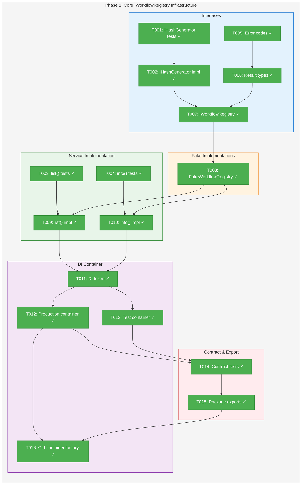
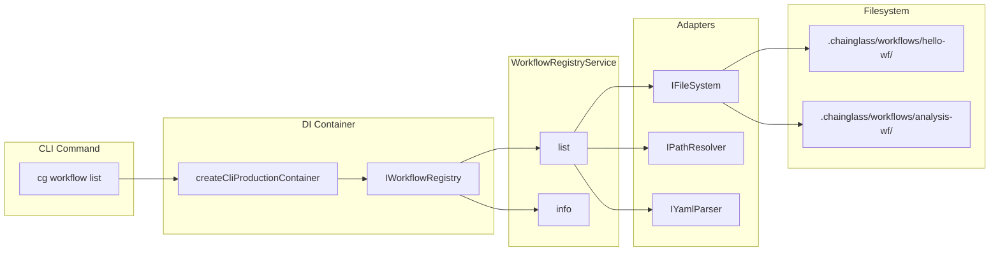
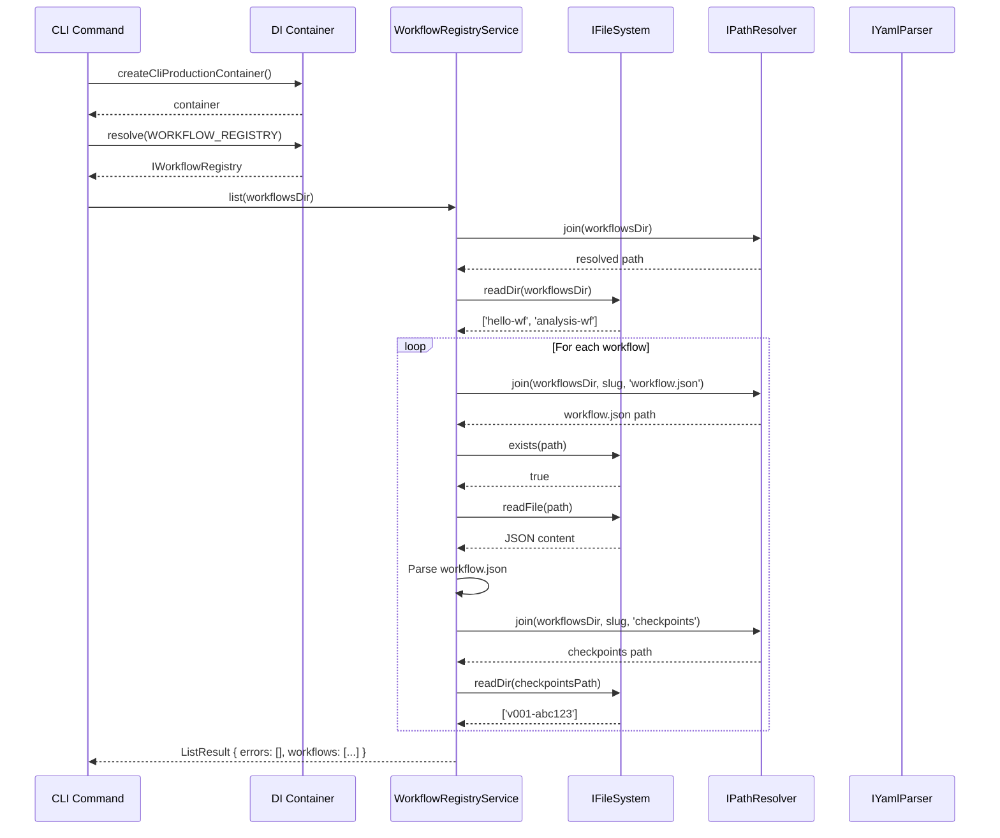

# Phase 1: Core IWorkflowRegistry Infrastructure – Tasks & Alignment Brief

**Spec**: [../../manage-workflows-spec.md](../../manage-workflows-spec.md)
**Plan**: [../../manage-workflows-plan.md](../../manage-workflows-plan.md)
**Date**: 2026-01-24

---

## Executive Briefing

### Purpose
This phase creates the foundational infrastructure for multi-workflow template management. It establishes the `IWorkflowRegistry` interface, its Fake implementation for testing, the `IHashGenerator` interface for content hashing, and integrates everything into the DI container system.

### What We're Building
A new service layer that enables:
- **IWorkflowRegistry** interface with `list()` and `info()` methods for querying workflow templates
- **FakeWorkflowRegistry** with call capture and preset configuration for testing
- **IHashGenerator** interface for SHA-256 content hashing (used in checkpoint creation)
- **HashGeneratorAdapter** using Node's crypto module
- **WorkflowRegistryErrorCodes** (E030, E033-E036) for actionable error handling
- **DI container integration** following useFactory pattern (per ADR-0004)
- **CLI container factory** (`createCliProductionContainer()`/`createCliTestContainer()`) to resolve container bypass violations

### User Value
Developers can programmatically list and inspect workflow templates in `.chainglass/workflows/`. This is the foundation for all subsequent workflow management commands (`checkpoint`, `restore`, `versions`) and ensures consistent template discovery across CLI and future web interfaces.

### Example
**Input**: `.chainglass/workflows/` with `hello-wf/` and `analysis-wf/` directories
**Output**:
```typescript
const result = await registry.list(workflowsDir);
// { errors: [], workflows: [
//   { slug: 'hello-wf', name: 'Hello Workflow', checkpointCount: 2 },
//   { slug: 'analysis-wf', name: 'Analysis Workflow', checkpointCount: 0 }
// ]}
```

---

## Objectives & Scope

### Objective
Establish the core IWorkflowRegistry infrastructure with complete test coverage, following TDD principles and the project's fakes-only testing policy (per R-TEST-007).

**Behavior Checklist** (from Plan acceptance criteria):
- [ ] All 16 unit tests passing: 3 hash-generator, 5 list(), 4 info(), 4 contract tests
- [ ] Test coverage > 80% for workflow-registry.service.ts
- [ ] Contract tests verify 8+ scenarios
- [ ] All error codes E030, E033-E036 have dedicated error path tests
- [ ] All path operations use IPathResolver.join()
- [ ] IWorkflowRegistry, IHashGenerator exported from @chainglass/shared
- [ ] createCliProductionContainer()/createCliTestContainer() factories created and resolve all registry dependencies
- [ ] `just check` passes

### Goals

- ✅ Create IHashGenerator interface with SHA-256 implementation
- ✅ Create IWorkflowRegistry interface with list() and info() methods
- ✅ Create FakeWorkflowRegistry with call capture and preset support
- ✅ Implement WorkflowRegistryService.list() and info()
- ✅ Define WorkflowRegistryErrorCodes (E030, E033-E036)
- ✅ Define result types (ListResult, InfoResult) extending BaseResult
- ✅ Register services in DI containers (production + test)
- ✅ Create contract tests for Fake/Real parity
- ✅ Create createCliProductionContainer()/createCliTestContainer() factories (ADR-0004 remediation)
- ✅ Export all new interfaces from package index files

### Non-Goals

- ❌ Checkpoint creation (Phase 2)
- ❌ Version ordinal generation (Phase 2)
- ❌ Restore operations (Phase 2)
- ❌ CLI command handlers (Phase 5)
- ❌ Output adapter formatting (Phase 5)
- ❌ wf-status.json schema changes (Phase 3)
- ❌ Template bundling for `cg init` (Phase 4)
- ❌ MCP tool registration (explicitly excluded per spec G10)

---

## Architecture Map

### Component Diagram
<!-- Status: grey=pending, orange=in-progress, green=completed, red=blocked -->
<!-- Updated by plan-6 during implementation -->



### Task-to-Component Mapping

<!-- Status: ⬜ Pending | 🟧 In Progress | ✅ Complete | 🔴 Blocked -->

| Task | Component(s) | Files | Status | Comment |
|------|-------------|-------|--------|---------|
| T001 | Hash Generator Tests | test/unit/shared/hash-generator.test.ts | ✅ Complete | TDD: Tests written, failing as expected |
| T002 | IHashGenerator + Adapter | packages/shared/src/interfaces/hash-generator.interface.ts, packages/shared/src/adapters/hash-generator.adapter.ts | ✅ Complete | Node crypto SHA-256 |
| T003 | Registry list() Tests | test/unit/workflow/registry-list.test.ts | ✅ Complete | TDD: 8 tests written |
| T004 | Registry info() Tests | test/unit/workflow/registry-info.test.ts | ✅ Complete | TDD: 6 tests written |
| T005 | Error Codes | packages/workflow/src/services/workflow-registry.service.ts | ✅ Complete | E030, E033-E036 |
| T006 | Result Types | packages/shared/src/interfaces/results/registry.types.ts | ✅ Complete | ListResult, InfoResult |
| T007 | IWorkflowRegistry Interface | packages/workflow/src/interfaces/workflow-registry.interface.ts | ✅ Complete | list(), info(), getCheckpointDir() |
| T008 | FakeWorkflowRegistry | packages/workflow/src/fakes/fake-workflow-registry.ts | ✅ Complete | Call capture + presets |
| T009 | list() Implementation | packages/workflow/src/services/workflow-registry.service.ts | ✅ Complete | Parse workflow.json, count checkpoints |
| T010 | info() Implementation | packages/workflow/src/services/workflow-registry.service.ts | ✅ Complete | Return WorkflowInfo with versions |
| T011 | DI Token | packages/shared/src/di-tokens.ts | ✅ Complete | WORKFLOW_REGISTRY token |
| T012 | Production Container | packages/workflow/src/container.ts | ✅ Complete | useFactory registration |
| T013 | Test Container | packages/workflow/src/container.ts | ✅ Complete | useValue with Fake |
| T014 | Contract Tests | test/contracts/workflow-registry.contract.test.ts | ✅ Complete | 10 tests, Fake/Real parity |
| T015 | Package Exports | packages/workflow/src/index.ts, packages/shared/src/index.ts | ✅ Complete | All new types exported |
| T016 | CLI Container Factory | apps/cli/src/lib/container.ts | ✅ Complete | createCliProductionContainer()/createCliTestContainer() (ADR-0004) |

---

## Tasks

| Status | ID | Task | CS | Type | Dependencies | Absolute Path(s) | Validation | Subtasks | Notes |
|--------|------|------|-----|------|--------------|------------------|------------|----------|-------|
| [x] | T001 | Write tests for IHashGenerator interface | 2 | Test | – | /home/jak/substrate/007-manage-workflows/test/unit/shared/hash-generator.test.ts | Tests: sha256("test") returns 64-char hex, same input = same output, different input = different output | – | TDD first |
| [x] | T002 | Implement IHashGenerator interface and HashGeneratorAdapter | 2 | Core | T001 | /home/jak/substrate/007-manage-workflows/packages/shared/src/interfaces/hash-generator.interface.ts, /home/jak/substrate/007-manage-workflows/packages/shared/src/adapters/hash-generator.adapter.ts, /home/jak/substrate/007-manage-workflows/packages/shared/src/fakes/fake-hash-generator.ts | Tests from T001 pass; uses node:crypto; FakeHashGenerator created | – | Per ADR-0004: useFactory |
| [x] | T003 | Write tests for IWorkflowRegistry.list() | 2 | Test | T002 | /home/jak/substrate/007-manage-workflows/test/unit/workflow/registry-list.test.ts | 5 tests: empty registry, single workflow, multiple workflows, missing workflow.json, malformed JSON | – | Use FakeFileSystem |
| [x] | T004 | Write tests for IWorkflowRegistry.info() | 2 | Test | T002 | /home/jak/substrate/007-manage-workflows/test/unit/workflow/registry-info.test.ts | 4 tests: found with checkpoints, found no checkpoints, not found (E030), malformed workflow.json | – | Use FakeFileSystem |
| [x] | T005 | Define WorkflowRegistryErrorCodes | 1 | Core | – | /home/jak/substrate/007-manage-workflows/packages/workflow/src/services/workflow-registry.service.ts | E030 (WORKFLOW_NOT_FOUND), E033 (VERSION_NOT_FOUND), E034 (NO_CHECKPOINT), E035 (DUPLICATE_CONTENT), E036 (INVALID_TEMPLATE) defined with `as const` | – | Per Critical Discovery 01 |
| [x] | T006 | Define WorkflowInfo and result types | 2 | Core | T005 | /home/jak/substrate/007-manage-workflows/packages/shared/src/config/schemas/workflow-metadata.schema.ts, /home/jak/substrate/007-manage-workflows/packages/shared/src/interfaces/results/registry.types.ts, /home/jak/substrate/007-manage-workflows/packages/shared/src/interfaces/results/index.ts | WorkflowMetadataSchema (Zod) with 7 fields: slug, name, description, created_at, updated_at, tags[], author; ListResult, InfoResult, WorkflowInfo types extend BaseResult; exported from results/index.ts | – | Follow SampleConfigSchema Zod pattern for metadata, ComposeResult pattern for results |
| [x] | T007 | Create IWorkflowRegistry interface | 2 | Core | T006 | /home/jak/substrate/007-manage-workflows/packages/workflow/src/interfaces/workflow-registry.interface.ts, /home/jak/substrate/007-manage-workflows/packages/workflow/src/interfaces/index.ts | Interface with list(), info(), getCheckpointDir(); exported from interfaces/index.ts | – | Doc comments with usage |
| [x] | T008 | Create FakeWorkflowRegistry with call capture | 3 | Core | T007 | /home/jak/substrate/007-manage-workflows/packages/workflow/src/fakes/fake-workflow-registry.ts | Implements IWorkflowRegistry; has getLastListCall(), setListResult(), setInfoError(), reset(); follows FakeWorkflowService pattern | – | Per idioms.md Fake pattern |
| [x] | T009 | Implement WorkflowRegistryService.list() | 3 | Core | T003, T008 | /home/jak/substrate/007-manage-workflows/packages/workflow/src/services/workflow-registry.service.ts | Tests from T003 pass; reads workflow.json, counts checkpoints; uses IPathResolver.join() | – | Never throws; errors in result |
| [x] | T010 | Implement WorkflowRegistryService.info() | 2 | Core | T004, T008 | /home/jak/substrate/007-manage-workflows/packages/workflow/src/services/workflow-registry.service.ts | Tests from T004 pass; returns WorkflowInfo with version history | – | E030 if not found |
| [x] | T011 | Add WORKFLOW_REGISTRY token to di-tokens.ts | 1 | Core | T010 | /home/jak/substrate/007-manage-workflows/packages/shared/src/di-tokens.ts | Token `WORKFLOW_REGISTRY: 'IWorkflowRegistry'` added to WORKFLOW_DI_TOKENS | – | – |
| [x] | T012 | Register WorkflowRegistryService in production container | 2 | Core | T011 | /home/jak/substrate/007-manage-workflows/packages/workflow/src/container.ts | useFactory pattern; resolves IFileSystem, IPathResolver, IYamlParser, IHashGenerator | – | Per ADR-0004 |
| [x] | T013 | Register FakeWorkflowRegistry in test container | 2 | Core | T011 | /home/jak/substrate/007-manage-workflows/packages/workflow/src/container.ts | useValue with FakeWorkflowRegistry instance | – | Per ADR-0004 |
| [x] | T014 | Write contract tests for registry | 2 | Test | T012, T013 | /home/jak/substrate/007-manage-workflows/test/contracts/workflow-registry.contract.test.ts | 8+ scenarios pass for both Fake and Real: empty list, single workflow, multiple workflows, not found (E030), malformed JSON, missing workflow.json, checkpoint count, version history | – | Follow workflow-service pattern |
| [x] | T015 | Update package.json exports | 1 | Core | T014 | /home/jak/substrate/007-manage-workflows/packages/workflow/src/index.ts, /home/jak/substrate/007-manage-workflows/packages/shared/src/index.ts | IWorkflowRegistry, FakeWorkflowRegistry, WorkflowRegistryErrorCodes, IHashGenerator, HashGeneratorAdapter, FakeHashGenerator exported | – | Barrel exports |
| [x] | T016 | Create CLI container factory (ADR-0004 remediation) | 2 | Core | T012, T015 | /home/jak/substrate/007-manage-workflows/apps/cli/src/lib/container.ts | createCliProductionContainer() and createCliTestContainer() return fresh child containers; resolves IWorkflowRegistry; follows createWorkflowProductionContainer pattern | – | Per Critical Discovery 04 and ADR-0004 |

---

## Alignment Brief

### Prior Phases Review

This is Phase 1 – no prior phases to review.

**Exemplar Strategy** (per /didyouknow session 2026-01-24):
- Physical exemplars at `dev/examples/wf/template/hello-workflow/` were used during **design phase** for alignment
- Implementation tests use **FakeFileSystem virtual structures** per established contract test patterns
- Tests do NOT depend on physical exemplar files existing
- This follows the pattern in `workflow-service.contract.test.ts` and `phase-service.contract.test.ts`

**Foundation for Phase 1**:
- Existing IFileSystem, IPathResolver, IYamlParser interfaces are stable
- FakeFileSystem pattern established in `/home/jak/substrate/007-manage-workflows/packages/shared/src/fakes/fake-filesystem.ts`
- FakeWorkflowService pattern established in `/home/jak/substrate/007-manage-workflows/packages/workflow/src/fakes/fake-workflow-service.ts`
- DI container pattern established in `/home/jak/substrate/007-manage-workflows/packages/workflow/src/container.ts`
- Contract test pattern established in `/home/jak/substrate/007-manage-workflows/test/contracts/workflow-service.contract.test.ts`

### Critical Findings Affecting This Phase

| Finding | Constraint/Requirement | Addressed By |
|---------|------------------------|--------------|
| **Critical Discovery 01**: Error Code E031 Collision | Use E033 for VERSION_NOT_FOUND, not E031 (PhaseService uses E031) | T005: Define E030, E033-E036 range |
| **Critical Discovery 04**: CLI Commands Bypass DI | Create createCliProductionContainer()/createCliTestContainer() factories, don't instantiate adapters directly | T016: CLI container factory |
| **High Discovery 07**: Services Must Use Interfaces Only | WorkflowRegistryService constructor takes only interfaces | T009, T010: Constructor injection |
| **High Discovery 08**: Result Objects Never Throw | All errors returned in result.errors array | T009, T010: Error handling |
| **Medium Discovery 10**: Path Security via IPathResolver | Use pathResolver.join() for all path composition | T009, T010: Path operations |

### ADR Decision Constraints

| ADR | Constraint | Addressed By |
|-----|------------|--------------|
| **ADR-0002**: Exemplar-Driven Development | Exemplars used during design; tests use FakeFileSystem virtual structures | T003, T004: Use FakeFileSystem.setFile() |
| **ADR-0004**: DI Container Architecture | useFactory for production, useValue for test; no @injectable() decorators | T012, T013, T016: Container setup |

### Invariants & Guardrails

- **No direct adapter instantiation** in CLI commands
- **No mocking libraries** (vi.mock, jest.mock) – fakes only
- **Slug validation**: `^[a-z][a-z0-9-]*$` pattern
- **Path safety**: Always use `IPathResolver.join()`, never `path.join()` directly

### Inputs to Read

| File | Purpose |
|------|---------|
| `/home/jak/substrate/007-manage-workflows/packages/workflow/src/services/workflow.service.ts` | Existing service pattern with error codes |
| `/home/jak/substrate/007-manage-workflows/packages/workflow/src/fakes/fake-workflow-service.ts` | Call capture fake pattern |
| `/home/jak/substrate/007-manage-workflows/packages/workflow/src/container.ts` | DI registration pattern |
| `/home/jak/substrate/007-manage-workflows/packages/shared/src/interfaces/results/base.types.ts` | BaseResult, ResultError types |
| `/home/jak/substrate/007-manage-workflows/test/contracts/workflow-service.contract.test.ts` | Contract test pattern |
| `/home/jak/substrate/007-manage-workflows/dev/examples/wf/template/hello-workflow/` | Exemplar template structure |

### Visual Alignment Aids

#### System Flow Diagram



#### Sequence Diagram: list() Operation



### Test Plan (Full TDD - Fakes Only)

#### T001: IHashGenerator Tests

| Test Name | Fixture | Expected Output | Rationale |
|-----------|---------|-----------------|-----------|
| sha256 returns 64-char hex | "test" | 64-char hex string | Verify SHA-256 format |
| same input yields same hash | "hello" x2 | identical hashes | Deterministic behavior |
| different input yields different hash | "a", "b" | different hashes | Uniqueness |

#### T003: Registry list() Tests

| Test Name | Fixture | Expected Output | Rationale |
|-----------|---------|-----------------|-----------|
| empty registry returns empty array | No workflows dir | `{ errors: [], workflows: [] }` | Empty state handling |
| single workflow listed | hello-wf/ with workflow.json | `{ workflows: [{ slug: 'hello-wf', ... }] }` | Basic listing |
| multiple workflows listed | hello-wf/, analysis-wf/ | Both workflows in result | Multi-workflow support |
| missing workflow.json skipped | hello-wf/ without workflow.json | Excluded from results with warning | Graceful degradation |
| malformed workflow.json returns error | Invalid JSON | Workflow excluded with error in result | Error handling |

#### T004: Registry info() Tests

| Test Name | Fixture | Expected Output | Rationale |
|-----------|---------|-----------------|-----------|
| found with checkpoints | hello-wf/ with v001, v002 | Full WorkflowInfo with 2 versions | Version enumeration |
| found no checkpoints | hello-wf/ with only current/ | WorkflowInfo with 0 versions | Empty checkpoint state |
| not found returns E030 | nonexistent-wf | `{ errors: [{ code: 'E030', ... }] }` | Error code compliance |
| malformed workflow.json | Invalid JSON | Error with details | Error handling |

#### T014: Contract Tests

| Scenario | Fake Behavior | Real Behavior | Parity Check |
|----------|---------------|---------------|--------------|
| Empty list | Returns [] | Returns [] | ✓ |
| Single workflow | Configurable preset | Reads filesystem | Same result shape |
| Multiple workflows | Configurable preset | Reads filesystem | Same result shape |
| Not found (E030) | Returns error | Returns error | Same error code |
| Malformed JSON | Returns error | Returns error | Same error structure |
| Missing workflow.json | Excludes workflow | Excludes workflow | Same behavior |
| Checkpoint count | Configurable | Actual count | Same field presence |
| Version history | Configurable | Actual history | Same structure |

### Step-by-Step Implementation Outline

1. **T001-T002**: Create IHashGenerator (foundation for checksums)
   - Write 3 failing tests for hash behavior
   - Implement interface + HashGeneratorAdapter using node:crypto
   - Create FakeHashGenerator with configurable returns
   - Verify tests pass

2. **T005-T006**: Define types and error codes
   - Add WorkflowRegistryErrorCodes (E030, E033-E036)
   - Create WorkflowMetadataSchema (Zod) at config/schemas/workflow-metadata.schema.ts with 7 fields
   - Create registry.types.ts with WorkflowInfo (using z.infer<>), ListResult, InfoResult
   - Export from results/index.ts and config/schemas/index.ts

3. **T007**: Create IWorkflowRegistry interface
   - Define list(), info(), getCheckpointDir() methods
   - Add JSDoc with usage examples
   - Export from interfaces/index.ts

4. **T008**: Create FakeWorkflowRegistry
   - Implement call capture (ListCall, InfoCall)
   - Add preset configuration methods
   - Add test helpers (getLastListCall, reset, etc.)
   - Follow FakeWorkflowService pattern exactly

5. **T003-T004**: Write service tests (TDD - must fail first)
   - Use FakeFileSystem to set up filesystem state
   - Test all scenarios from test plan
   - Use FakeFileSystem.setFile() to create virtual workflow/checkpoint structures

6. **T009-T010**: Implement WorkflowRegistryService
   - Constructor takes IFileSystem, IPathResolver, IYamlParser, IHashGenerator
   - Implement list(): scan directory, parse workflow.json, count checkpoints
   - Implement info(): return detailed WorkflowInfo with version history
   - Never throw; all errors in result.errors
   - All paths via IPathResolver.join()

7. **T011-T013**: DI Container Integration
   - Add WORKFLOW_REGISTRY token
   - Register in production container (useFactory)
   - Register in test container (useValue)

8. **T014**: Contract Tests
   - Create WorkflowRegistryTestContext interface
   - Run 8+ scenarios against both implementations
   - Verify Fake/Real parity

9. **T015**: Package Exports
   - Update packages/workflow/src/index.ts
   - Update packages/shared/src/index.ts
   - Verify exports compile

10. **T016**: CLI Container Factory
    - Create apps/cli/src/lib/container.ts
    - Implement createCliProductionContainer() and createCliTestContainer() with child container pattern
    - Resolve IWorkflowRegistry from container

### Commands to Run

```bash
# Environment setup
cd /home/jak/substrate/007-manage-workflows
pnpm install

# Run specific test file (TDD cycle)
pnpm test test/unit/shared/hash-generator.test.ts
pnpm test test/unit/workflow/registry-list.test.ts
pnpm test test/unit/workflow/registry-info.test.ts
pnpm test test/contracts/workflow-registry.contract.test.ts

# Run all Phase 1 tests
pnpm test -- --testPathPattern="(hash-generator|registry)"

# TypeScript compilation check
just typecheck

# Lint check
just lint

# Full quality gate
just check

# Build verification
just build
```

### Risks/Unknowns

| Risk | Severity | Mitigation |
|------|----------|------------|
| IHashGenerator placement uncertainty | Low | **RESOLVED**: Correct placement in packages/shared - follows NodeFileSystemAdapter/PathResolverAdapter pattern for Node.js built-in wrappers (node:crypto), enables future use by config/secrets modules |
| workflow.json schema undefined | Medium | **RESOLVED**: Use full Zod schema with all 7 spec fields at `packages/shared/src/config/schemas/workflow-metadata.schema.ts` following `SampleConfigSchema` pattern |
| Circular import risk | Medium | Keep result types in shared, service in workflow |
| CLI container lazy init race | Low | **RESOLVED**: Using child container factories per ADR-0004, no singleton state to race on |

### Ready Check

- [ ] ADR constraints mapped to tasks (ADR-0002 → T003/T004, ADR-0004 → T012/T013/T016)
- [ ] All critical findings addressed (CD01 → T005, CD04 → T016, HD07/HD08 → T009/T010)
- [ ] Test plan covers all acceptance criteria from plan
- [ ] Non-goals explicitly documented
- [ ] Contract test scenarios defined (8+ per plan)
- [ ] All file paths are absolute
- [ ] Commands copy-paste ready

---

## Phase Footnote Stubs

| Footnote | Date | Context | Description |
|----------|------|---------|-------------|
| | | | |

_Footnotes will be added by plan-6 during implementation._

---

## Evidence Artifacts

**Execution Log**: `./execution.log.md` (created by plan-6)

**Supporting Files**:
- Unit test results
- Contract test results
- Coverage report
- TypeScript compilation output

---

## Discoveries & Learnings

_Populated during implementation by plan-6. Log anything of interest to your future self._

| Date | Task | Type | Discovery | Resolution | References |
|------|------|------|-----------|------------|------------|
| | | | | | |

**Types**: `gotcha` | `research-needed` | `unexpected-behavior` | `workaround` | `decision` | `debt` | `insight`

**What to log**:
- Things that didn't work as expected
- External research that was required
- Implementation troubles and how they were resolved
- Gotchas and edge cases discovered
- Decisions made during implementation
- Technical debt introduced (and why)
- Insights that future phases should know about

_See also: `execution.log.md` for detailed narrative._

---

## Directory Layout

```
docs/plans/006-manage-workflows/
├── manage-workflows-spec.md
├── manage-workflows-plan.md
└── tasks/
    └── phase-1-core-iworkflowregistry-infrastructure/
        ├── tasks.md              # This file
        └── execution.log.md      # Created by plan-6 during implementation
```

---

## Critical Insights Discussion

**Session**: 2026-01-24
**Context**: Phase 1 Tasks & Alignment Brief - Pre-implementation Review
**Analyst**: AI Clarity Agent (Claude Opus 4.5)
**Reviewer**: Development Team
**Format**: Water Cooler Conversation (5 Critical Insights)

### Insight 1: workflow.json Schema Definition

**Did you know**: The tasks.md "minimal schema" mitigation (4 fields) contradicted the spec's 7-field definition, and the codebase has two validation paradigms (Zod for config, JSON Schema for templates).

**Implications**:
- Spec defines: slug, name, description, created_at, updated_at, tags[], author
- Tasks.md only mentioned 4 fields as "mitigation"
- Pattern question: which validation approach for workflow.json?

**Options Considered**:
- Option A: Minimal schema (4 fields) - defers work but creates migration debt
- Option B: Use WfDefinition pattern - wrong abstraction (templates vs metadata)
- Option C: Full Zod schema (7 fields) - follows SampleConfigSchema pattern

**AI Recommendation**: Option C - Full Zod schema following config patterns

**Decision**: **Option C** - Implement full 7-field Zod schema at `packages/shared/src/config/schemas/workflow-metadata.schema.ts`

**Action Items**:
- [x] Updated T006 to include WorkflowMetadataSchema with all 7 fields
- [x] Updated risk table to mark schema as RESOLVED

**Affects**: T006, risk mitigation table

---

### Insight 2: CLI Container Singleton Pattern Violates ADR-0004

**Did you know**: T016 specified `getCliContainer()` with "singleton pattern with lazy init", but ADR-0004 explicitly prohibits singletons and mandates child container factories.

**Implications**:
- ADR-0004: "Test isolation requires child containers, not global singletons"
- Existing pattern uses `createXxxProductionContainer()` / `createXxxTestContainer()`
- Implementation discoveries document shows singletons were researched and rejected

**Options Considered**:
- Option A: Singleton with reset() - ADR violation, pattern was rejected
- Option B: Factory function pattern - ADR-compliant, matches existing code
- Option C: Hybrid singleton/factory - no precedent, still violates ADR

**AI Recommendation**: Option B - Factory function pattern

**Decision**: **Option B** - Rename to `createCliProductionContainer()` / `createCliTestContainer()` with child container pattern

**Action Items**:
- [x] Updated all 8 references to getCliContainer throughout tasks.md
- [x] Updated T016 validation criteria
- [x] Updated Mermaid diagrams
- [x] Marked lazy init race risk as RESOLVED

**Affects**: T016, diagrams, acceptance criteria, risk table

---

### Insight 3: Exemplar Path Wrong and Physical Files Not Needed

**Did you know**: The tasks referenced `dev/examples/wf/hello-workflow/checkpoints/` but the actual path is `dev/examples/wf/template/hello-workflow/`, and no checkpoints folder exists.

**Implications**:
- Path reference was incorrect
- ADR-0002 mentions Phase 0 exemplar creation
- Existing contract tests use FakeFileSystem virtual structures exclusively

**Options Considered**:
- Option A: Create physical exemplar checkpoints first
- Option B: Use FakeFileSystem virtual structures only
- Option C: Hybrid - virtual for tests, physical later

**AI Recommendation**: Option B - FakeFileSystem only

**Decision**: **Option B** - Exemplars were for design alignment; implementation tests use FakeFileSystem per established patterns

**Action Items**:
- [x] Updated Prior Phases Review to remove Phase 0 dependency
- [x] Clarified exemplar strategy (design vs implementation)
- [x] Updated ADR-0002 constraint to reference FakeFileSystem

**Affects**: Alignment Brief, ADR constraints table, implementation outline

---

### Insight 4: FakeWorkflowRegistry Three-Part API Pattern

**Did you know**: The codebase fakes follow a consistent three-part API (state setup, state inspection, error injection) that T008's description didn't fully capture.

**Implications**:
- FakeWorkflowService, FakeFileSystem, FakeConfigService all follow this pattern
- Error injection is orthogonal to response configuration
- Static factory methods help construct valid test data

**Options Considered**:
- Option A: Preset-first design - not the established pattern
- Option B: Override-based three-part API - matches existing fakes
- Option C: Scenario-based design - no precedent

**AI Recommendation**: Option B, but don't over-specify

**Decision**: **Leave T008 as-is** - "follows FakeWorkflowService pattern exactly" is sufficient constraint; over-specifying methods adds noise

**Action Items**: None - existing description is appropriately concise

**Affects**: None

---

### Insight 5: IHashGenerator Placement Confirmation

**Did you know**: The "IHashGenerator placement uncertainty" risk was actually not uncertain - verification confirmed packages/shared is correct per adapter patterns.

**Implications**:
- NodeFileSystemAdapter wraps node:fs, PathResolverAdapter wraps node:path
- HashGeneratorAdapter wrapping node:crypto fits the same pattern
- Dependency direction (workflow→shared) requires shared placement

**Options Considered**:
- Option A: Mark as RESOLVED with rationale
- Option B: Leave as-is

**AI Recommendation**: Option A - document the confidence

**Decision**: **Option A** - Mark resolved with architectural rationale

**Action Items**:
- [x] Updated risk table with RESOLVED status and reasoning

**Affects**: Risk table

---

## Session Summary

**Insights Surfaced**: 5 critical insights identified and discussed
**Decisions Made**: 5 decisions reached through collaborative discussion
**Action Items Created**: 0 remaining (all applied immediately)
**Documents Updated**: 1 file (tasks.md) with 15+ edits throughout session

**Shared Understanding Achieved**: ✓

**Confidence Level**: High - All risks resolved, patterns validated against codebase

**Next Steps**:
Run `/plan-6-implement-phase --phase "Phase 1: Core IWorkflowRegistry Infrastructure"` when ready to begin implementation.

---

**STOP**: Do not edit code. This dossier awaits explicit **GO** from human sponsor.
