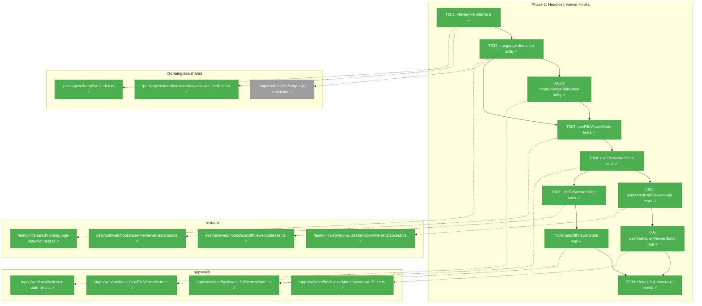
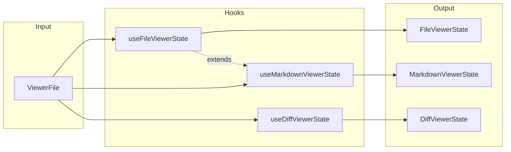
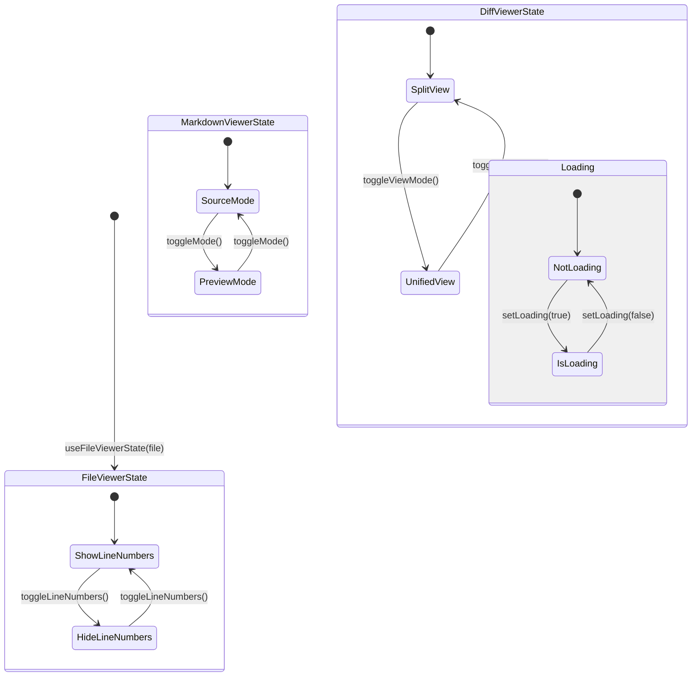

# Phase 1: Headless Viewer Hooks – Tasks & Alignment Brief

**Spec**: [../../web-extras-spec.md](../../web-extras-spec.md)
**Plan**: [../../web-extras-plan.md](../../web-extras-plan.md)
**Date**: 2026-01-24

---

## Executive Briefing

### Purpose
This phase creates the foundational state management hooks for all three viewer components (FileViewer, MarkdownViewer, DiffViewer). These headless hooks encapsulate pure logic separately from UI, enabling comprehensive TDD before any visual components are built.

### What We're Building
Three React hooks following the established `useBoardState`/`useFlowState` patterns:
- **`useFileViewerState`**: Manages file content, auto-detected language, line numbers toggle, and theme
- **`useMarkdownViewerState`**: Extends FileViewer with source/preview mode toggle
- **`useDiffViewerState`**: Manages git diff view mode (split/unified), loading state, and error handling

Plus a shared language detection utility mapping 20+ file extensions to Shiki language names.

### User Value
Headless-first architecture ensures all viewer logic is testable without DOM rendering. This enables TDD workflow where hooks are verified before UI implementation, reducing integration bugs and enabling potential CLI reuse.

### Example
**Input**: `{ path: 'src/utils.ts', filename: 'utils.ts', content: 'export const add = ...' }`
**Hook State**: `{ file, language: 'typescript', showLineNumbers: true, theme: 'dark' }`
**Mutation**: `toggleLineNumbers()` → `showLineNumbers: false`

---

## Objectives & Scope

### Objective
Create pure logic hooks for all three viewers per plan acceptance criteria AC-29 through AC-34, following established hook patterns from `useBoardState` and `useFlowState`.

### Goals

- ✅ Create `ViewerFile` interface in `@chainglass/shared` (Shared by Default principle)
- ✅ Implement `useFileViewerState` with language detection, line numbers, theme
- ✅ Implement `useMarkdownViewerState` extending FileViewer with mode toggle
- ✅ Implement `useDiffViewerState` with viewMode, loading, error states
- ✅ Create language detection utility mapping 20+ extensions
- ✅ Achieve >90% test coverage on all hooks
- ✅ All hooks testable without DOM rendering

### Non-Goals

- ❌ UI components (Phase 2-5)
- ❌ Shiki integration (Phase 2)
- ❌ react-markdown integration (Phase 3)
- ❌ Mermaid rendering (Phase 4)
- ❌ Git diff fetching (Phase 5 server action)
- ❌ Responsive infrastructure (Phase 6)
- ❌ Any visual rendering or CSS
- ❌ Theme switching logic (hooks only track theme, don't change it)

---

## Architecture Map

### Component Diagram
<!-- Status: grey=pending, orange=in-progress, green=completed, red=blocked -->
<!-- Updated by plan-6 during implementation -->



### Task-to-Component Mapping

<!-- Status: ⬜ Pending | 🟧 In Progress | ✅ Complete | 🔴 Blocked -->

| Task | Component(s) | Files | Status | Comment |
|------|-------------|-------|--------|---------|
| T001 | ViewerFile Interface | /packages/shared/src/interfaces/viewer.interface.ts, /packages/shared/src/index.ts | ✅ Complete | Shared by Default principle; exports type |
| T002 | Language Detection | /packages/shared/src/lib/language-detection.ts, /test/unit/shared/lib/language-detection.test.ts | ✅ Complete | Maps 20+ extensions to Shiki names (Shared by Default) |
| T002b | Viewer State Base | /apps/web/src/lib/viewer-state-utils.ts | ✅ Complete | Shared utility for all 3 hooks (DYK #1) |
| T003 | FileViewer Tests | /test/unit/web/hooks/useFileViewerState.test.ts | ✅ Complete | RED phase - write failing tests first |
| T004 | FileViewer Hook | /apps/web/src/hooks/useFileViewerState.ts | ✅ Complete | GREEN phase - implement to pass tests |
| T005 | MarkdownViewer Tests | /test/unit/web/hooks/useMarkdownViewerState.test.ts | ✅ Complete | RED phase - extends FileViewer tests |
| T006 | MarkdownViewer Hook | /apps/web/src/hooks/useMarkdownViewerState.ts | ✅ Complete | GREEN phase - adds mode toggle |
| T007 | DiffViewer Tests | /test/unit/web/hooks/useDiffViewerState.test.ts | ✅ Complete | RED phase - viewMode, loading, error |
| T008 | DiffViewer Hook | /apps/web/src/hooks/useDiffViewerState.ts | ✅ Complete | GREEN phase - state management only |
| T009 | Refactor & Coverage | All hook files | ✅ Complete | REFACTOR phase - ensure patterns, coverage |

---

## Tasks

| Status | ID | Task | CS | Type | Dependencies | Absolute Path(s) | Validation | Subtasks | Notes |
|--------|------|------|-----|------|--------------|------------------|------------|----------|-------|
| [x] | T001 | Create ViewerFile interface in @chainglass/shared | 1 | Setup | – | /home/jak/substrate/008-web-extras/packages/shared/src/interfaces/viewer.interface.ts, /home/jak/substrate/008-web-extras/packages/shared/src/index.ts | Interface exported, `pnpm -F @chainglass/shared build` succeeds | – | Per Shared by Default principle |
| [x] | T002 | Create language detection utility with tests | 2 | Core | T001 | /home/jak/substrate/008-web-extras/packages/shared/src/lib/language-detection.ts, /home/jak/substrate/008-web-extras/test/unit/shared/lib/language-detection.test.ts | Two-tier detection: (1) special filenames (Dockerfile, justfile, Makefile, LICENSE, .gitignore, .npmrc), (2) 20+ extensions with .toLowerCase(); tests cover both tiers | – | Shared by Default (DYK #2), two-tier pattern (DYK #5) |
| [x] | T002b | Create createViewerStateBase utility | 1 | Core | T002 | /home/jak/substrate/008-web-extras/apps/web/src/lib/viewer-state-utils.ts | Pure function returning base state object; used by all 3 hooks | – | Shared utility per DYK Insight #1 |
| [x] | T003 | Write failing tests for useFileViewerState | 2 | Test | T002 | /home/jak/substrate/008-web-extras/test/unit/web/hooks/useFileViewerState.test.ts | Tests cover: init, language detection, lineNumbers toggle, undefined file, unknown extension, empty content; tests FAIL before T004 | – | RED phase; Test Doc format; theme NOT in hook (DYK #4) |
| [x] | T004 | Implement useFileViewerState to pass tests | 2 | Core | T003, T002b | /home/jak/substrate/008-web-extras/apps/web/src/hooks/useFileViewerState.ts | All T003 tests pass; follows useBoardState pattern | – | GREEN phase; uses createViewerStateBase utility |
| [x] | T005 | Write failing tests for useMarkdownViewerState | 2 | Test | T004 | /home/jak/substrate/008-web-extras/test/unit/web/hooks/useMarkdownViewerState.test.ts | Tests cover: extends FileViewer, mode toggle, mode persistence, rapid toggle stability; tests FAIL before T006 | – | RED phase; Test Doc format |
| [x] | T006 | Implement useMarkdownViewerState to pass tests | 2 | Core | T005, T002b | /home/jak/substrate/008-web-extras/apps/web/src/hooks/useMarkdownViewerState.ts | All T005 tests pass; isPreviewMode, toggleMode, setMode API | – | GREEN phase; uses createViewerStateBase utility |
| [x] | T007 | Write failing tests for useDiffViewerState | 2 | Test | T004 | /home/jak/substrate/008-web-extras/test/unit/web/hooks/useDiffViewerState.test.ts | Tests cover: viewMode toggle, loading state, error states (not-git, no-changes, git-not-available), setDiffData; tests FAIL before T008 | – | RED phase; Test Doc format |
| [x] | T008 | Implement useDiffViewerState to pass tests | 2 | Core | T007, T002b | /home/jak/substrate/008-web-extras/apps/web/src/hooks/useDiffViewerState.ts | All T007 tests pass; viewMode, diffData, isLoading, error, toggleViewMode API | – | GREEN phase; uses createViewerStateBase utility |
| [x] | T009 | Refactor hooks for code quality and verify coverage | 1 | Refactor | T006, T008 | All hook files | Consistent patterns (useCallback memoization), >90% coverage on hooks, `just test --coverage` shows ≥90% | – | REFACTOR phase |

---

## Alignment Brief

### Critical Findings Affecting This Phase

**Critical Discovery 05: Headless Hook Pattern Mirrors useBoardState**
- **Impact**: High
- **Constrains**: All hooks must follow established pattern: pure state management, `useCallback` for mutations, deep cloning for immutability
- **Addressed by**: T003, T004, T005, T006, T007, T008

**Pattern Requirements from useBoardState/useFlowState** (per codebase exploration):
1. `useState` for reactive state
2. `useCallback` for all mutation functions (memoization)
3. Deep cloning in initializer to prevent mutating original state
4. Immutable updates using spread operators
5. Graceful no-op returns for invalid operations
6. Clear return type interface

### Invariants & Guardrails

- **No DOM dependencies**: Hooks must be testable with `@testing-library/react` renderHook without any DOM rendering
- **No side effects**: Pure state management only; no API calls, no localStorage
- **Type safety**: All hook returns must have explicit TypeScript interfaces
- **Fakes only**: Per R-TEST-007, no vi.mock() - use real implementations

### Inputs to Read

| File | Purpose |
|------|---------|
| `/home/jak/substrate/008-web-extras/apps/web/src/hooks/useBoardState.ts` | Exemplar hook pattern to follow |
| `/home/jak/substrate/008-web-extras/apps/web/src/hooks/useFlowState.ts` | Secondary exemplar for complex state |
| `/home/jak/substrate/008-web-extras/apps/web/src/hooks/use-mobile.ts` | SSR-safe pattern reference |
| `/home/jak/substrate/008-web-extras/docs/project-rules/rules.md` | R-TEST-007 Fakes Only policy |

### Visual Alignment: Flow Diagram



### Visual Alignment: State Transition Diagram



### Test Plan (Full TDD)

| Test Suite | Named Tests | Fixtures | Expected Behavior |
|------------|-------------|----------|-------------------|
| `useFileViewerState.test.ts` | `should auto-detect language from filename` | TypeScript file | `.tsx` → `tsx`, `.py` → `python` |
| | `should toggle line numbers` | Any file | `true` → `false` → `true` |
| | `should handle undefined file gracefully` | undefined | Returns safe defaults |
| | `should default to text for unknown extensions` | `.xyz` file | `language: 'text'` |
| | `should handle empty content without error` | Empty `.ts` file | No error, language detected |
| `useMarkdownViewerState.test.ts` | `should start in source mode by default` | Markdown file | `isPreviewMode: false` |
| | `should toggle between source and preview modes` | Markdown file | Mode flips on toggle |
| | `should maintain mode consistency after rapid toggles` | Markdown file | Odd toggles → opposite state |
| | `should have setMode for explicit mode setting` | Markdown file | `setMode('preview')` works |
| `useDiffViewerState.test.ts` | `should start in split view mode` | Any file | `viewMode: 'split'` |
| | `should toggle between split and unified views` | Any file | Mode flips on toggle |
| | `should track loading state` | Any file | `isLoading` updates correctly |
| | `should handle not-git error state` | Any file | `error: 'not-git'` |
| | `should handle no-changes state` | Any file | `error: 'no-changes'` |
| | `should handle git-not-available state` | Any file | `error: 'git-not-available'` |
| `language-detection.test.ts` | `should map TypeScript extensions` | N/A | `.ts` → `typescript`, `.tsx` → `tsx` |
| | `should map Python extension` | N/A | `.py` → `python` |
| | `should map C# extension` | N/A | `.cs` → `csharp` |
| | `should return text for unknown` | N/A | `.xyz` → `text` |
| | `should detect Dockerfile (no extension)` | N/A | `Dockerfile` → `dockerfile` |
| | `should detect justfile (no extension)` | N/A | `justfile` → `just` |
| | `should detect Makefile (no extension)` | N/A | `Makefile` → `makefile` |
| | `should detect .gitignore (dot-prefixed)` | N/A | `.gitignore` → `gitignore` |
| | `should handle uppercase extensions` | N/A | `.TS` → `typescript` |
| | `should handle multiple dots` | N/A | `config.test.ts` → `typescript` |

### Step-by-Step Implementation Outline

1. **T001**: Create `/packages/shared/src/interfaces/viewer.interface.ts` with `ViewerFile` interface, export from index.ts
2. **T002**: Create `/packages/shared/src/lib/language-detection.ts` with two-tier `detectLanguage(filename: string): string` function + unit tests (special filenames first, then extensions)
3. **T003**: Write comprehensive failing tests for `useFileViewerState` with Test Doc comments
4. **T004**: Implement `useFileViewerState` following useBoardState pattern until all T003 tests pass
5. **T005**: Write failing tests for `useMarkdownViewerState` including mode toggle
6. **T006**: Implement `useMarkdownViewerState` extending/composing with FileViewer state
7. **T007**: Write failing tests for `useDiffViewerState` covering all error states
8. **T008**: Implement `useDiffViewerState` with viewMode and error handling
9. **T009**: Review all hooks for consistent patterns, run coverage, refactor as needed

### Commands to Run

```bash
# Build shared package after interface creation
pnpm -F @chainglass/shared build

# Run specific test file during development
pnpm -F @chainglass/web test -- --watch test/unit/web/hooks/useFileViewerState.test.ts

# Run all hook tests
pnpm -F @chainglass/web test -- test/unit/web/hooks/

# Check coverage
just test -- --coverage

# Full quality check
just check
```

### Risks & Unknowns

| Risk | Severity | Mitigation |
|------|----------|------------|
| Hook composition approach unclear | Medium | RESOLVED: Use shared utility pattern (DYK #1) |
| Theme detection in hooks | Low | RESOLVED: Hooks don't track theme; component calls useTheme() and passes to server action (DYK #4) |
| TypeScript path alias issues | Low | Verify `@chainglass/shared` resolves in web app |

### Ready Check

- [x] Phase 1 has no prior phases to review (foundational)
- [x] Critical Discovery 05 (hook pattern) understood and documented
- [x] No ADRs directly constrain this phase
- [x] Existing hook patterns (useBoardState, useFlowState) analyzed
- [x] Test Doc format requirements understood
- [x] Fakes-only testing policy confirmed (R-TEST-007)
- [x] **Phase 1 COMPLETE** — All 10 tasks completed, 78 tests passing

---

## Phase Footnote Stubs

_Footnotes will be added here by plan-6a-update-progress as implementation progresses._

| # | Date | Task | Note |
|---|------|------|------|
| | | | |

---

## Evidence Artifacts

Implementation will write:
- `execution.log.md` - Detailed narrative of implementation in this directory
- Test coverage report via `just test -- --coverage`

---

## Discoveries & Learnings

_Populated during implementation by plan-6. Log anything of interest to your future self._

| Date | Task | Type | Discovery | Resolution | References |
|------|------|------|-----------|------------|------------|
| | | | | | |

**Types**: `gotcha` | `research-needed` | `unexpected-behavior` | `workaround` | `decision` | `debt` | `insight`

**What to log**:
- Things that didn't work as expected
- External research that was required
- Implementation troubles and how they were resolved
- Gotchas and edge cases discovered
- Decisions made during implementation
- Technical debt introduced (and why)
- Insights that future phases should know about

_See also: `execution.log.md` for detailed narrative._

---

## Directory Layout

```
docs/plans/006-web-extras/
├── web-extras-spec.md
├── web-extras-plan.md
└── tasks/
    └── phase-1-headless-viewer-hooks/
        ├── tasks.md              # This file
        └── execution.log.md      # Created by plan-6 during implementation
```

---

*Tasks Version 1.2.0 - Updated 2026-01-24 after implementation*
*Phase 1 COMPLETE - All 10 tasks done, 78 tests passing*
*Next Step: Run `/plan-7-code-review --phase 1` for code review*

---

## Critical Insights Discussion

**Session**: 2026-01-24
**Context**: Phase 1: Headless Viewer Hooks - Tasks & Alignment Brief v1.0.0
**Analyst**: AI Clarity Agent
**Reviewer**: Development Team
**Format**: Water Cooler Conversation (5 Critical Insights)

### Insight 1: Hook "Extension" is Terminology Misalignment

**Did you know**: The tasks said `useMarkdownViewerState` "extends FileViewer" but React hooks don't extend — they compose. This created implementation ambiguity.

**Implications**:
- TypeScript interface inheritance ≠ runtime implementation
- Three possible approaches: composition, reimplementation, shared utility
- No existing pattern of hook-calling-hook in codebase

**Options Considered**:
- Option A: Composition - one hook calls another and spreads return
- Option B: Reimplementation - duplicate logic in each hook
- Option C: Shared utility - extract common logic to pure function

**AI Recommendation**: Option C - Shared Utility
- Reasoning: Balances DRY with independent testing; matches existing utility patterns

**Discussion Summary**: User agreed with shared utility approach. Noted no need for DI — keep it simple as a pure function.

**Decision**: Use `createViewerStateBase()` shared utility; keep simple without DI

**Action Items**:
- [x] Added T002b task for createViewerStateBase utility
- [x] Updated T004, T006, T008 dependencies

**Affects**: T002b (new), T004, T006, T008

---

### Insight 2: Language Detection Lives in Wrong Package

**Did you know**: Language detection was placed in `apps/web/` but `ViewerFile` interface is in `@chainglass/shared`. This violates Shared by Default principle.

**Implications**:
- Pure function with no React dependencies should be shared
- Future CLI/MCP tools would need to duplicate or cross-import
- Constitution Principle 7 explicitly covers this case

**Options Considered**:
- Option A: Keep in apps/web - simpler but violates principle
- Option B: Move to @chainglass/shared - matches deepMerge pattern
- Option C: Split - partial sharing, adds complexity

**AI Recommendation**: Option B - Move to @chainglass/shared
- Reasoning: Constitution compliance; reusable by CLI/MCP; matches existing patterns

**Discussion Summary**: User agreed, noting "we might want to use this elsewhere too!"

**Decision**: Move language detection to `/packages/shared/src/lib/language-detection.ts`

**Action Items**:
- [x] Updated T002 path to shared package
- [x] Updated test path to test/unit/shared/

**Affects**: T002

---

### Insight 3: Testing Infrastructure is Already Complete

**Did you know**: @testing-library/react with renderHook is already installed (v16.3.2) and actively used in 4 hook test files.

**Implications**:
- No setup work needed
- Existing patterns in use-board-state.test.tsx provide template
- Vitest + jsdom + browser mocks all configured

**Options Considered**:
- Option A: Follow existing pattern exactly
- Option B: Add additional testing utilities (unnecessary)

**AI Recommendation**: Option A - Follow existing pattern
- Reasoning: Infrastructure complete; proven patterns available

**Discussion Summary**: Confirmed — no changes needed.

**Decision**: Use existing renderHook pattern from use-board-state.test.tsx

**Action Items**: None required

**Affects**: T003, T005, T007 (pattern confirmed)

---

### Insight 4: Theme Handling Has Hidden Complexity

**Did you know**: The spec showed `theme` in hook state, but existing hooks (useBoardState, useFlowState) don't track theme at all.

**Implications**:
- Only ThemeToggle component uses useTheme()
- Shiki highlighting happens server-side, needs theme passed to server action
- Hooks should stay pure/headless

**Options Considered**:
- Option A: Hook parameter - component passes theme
- Option B: Hook detection - hook calls useTheme() internally
- Option C: Hybrid - optional param with fallback

**AI Recommendation**: Option A - Hook parameter (initially)
- Reasoning: Matches headless pattern; keeps hooks testable

**Discussion Summary**: After FlowSpace exploration, discovered hooks shouldn't track theme at all. Component calls useTheme() and passes to server action.

**Decision**: Remove theme from hook state; component handles theme via useTheme()

**Action Items**:
- [x] Removed theme from T003 test coverage
- [x] Updated risks table to mark resolved

**Affects**: T003, T004 (simplified)

---

### Insight 5: Language Detection Has Hidden Edge Cases

**Did you know**: Simple `split('.').pop()` fails on real files in this codebase: justfile, Dockerfile, LICENSE, .gitignore

**Implications**:
- Extensionless files need special handling
- Dot-prefixed files need explicit mapping
- Uppercase extensions need normalization

**Options Considered**:
- Option A: Simple split - fails real files
- Option B: Comprehensive mapping - robust but larger
- Option C: Two-tier detection - special filenames first, then extensions

**AI Recommendation**: Option C - Two-tier detection
- Reasoning: Clean separation; handles all edge cases; extensible

**Discussion Summary**: User agreed with two-tier approach.

**Decision**: Implement two-tier detection (special filenames → extension lookup)

**Action Items**:
- [x] Updated T002 validation for two-tier approach
- [x] Added 6 edge case tests to test plan

**Affects**: T002

---

## Session Summary

**Insights Surfaced**: 5 critical insights identified and discussed
**Decisions Made**: 5 decisions reached through collaborative discussion
**Action Items Created**: 8 updates applied to tasks.md
**Areas Updated**:
- T002: Moved to shared, two-tier detection, edge case tests
- T002b: New task for shared utility
- T003: Theme removed from scope
- T004, T006, T008: Dependencies updated for shared utility
- Risks table: Two items marked RESOLVED

**Shared Understanding Achieved**: ✓

**Confidence Level**: High - All ambiguities resolved, patterns clarified

**Next Steps**:
- Await human GO
- Run `/plan-6-implement-phase --phase 1`
