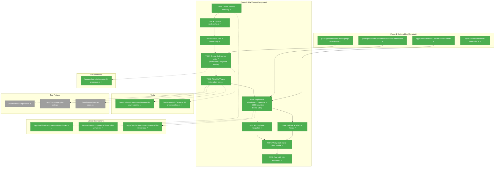
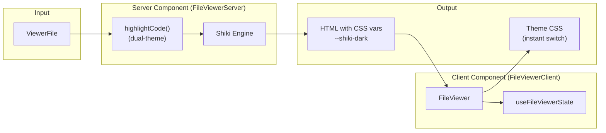
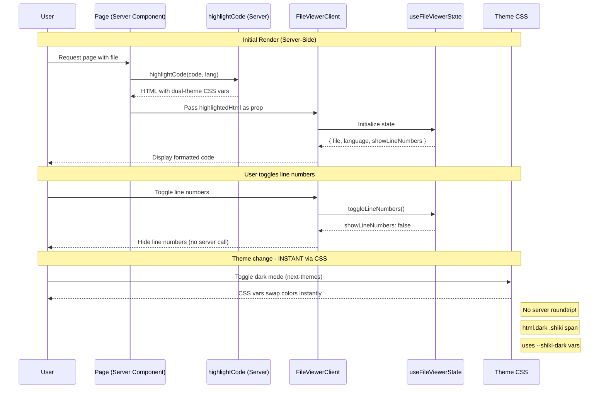

# Phase 2: FileViewer Component – Tasks & Alignment Brief

**Spec**: [../../web-extras-spec.md](../../web-extras-spec.md)
**Plan**: [../../web-extras-plan.md](../../web-extras-plan.md)
**Research Dossier**: [./research-dossier.md](./research-dossier.md)
**Date**: 2026-01-24

---

## Executive Briefing

### Purpose
This phase creates the foundational FileViewer component that displays source code with syntax highlighting and line numbers. It establishes the server-side Shiki processing pattern that all subsequent viewer components (MarkdownViewer, DiffViewer) will reuse.

### What We're Building
A complete FileViewer component that:
- Renders any text file with Shiki-powered syntax highlighting (server-side only)
- Uses **dual-theme CSS variables** for instant theme switching (no server roundtrip)
- Displays CSS counter-based line numbers that don't get copied with code selection
- Integrates with next-themes for automatic light/dark theme switching
- Provides keyboard navigation (arrow keys, Home/End)
- Meets accessibility standards with ARIA labels and focus management

### User Value
Users can view source code files with professional-quality syntax highlighting (VS Code level) across 15+ programming languages. The component provides a familiar, readable code viewing experience that matches their development environment.

### Example
**Input**: `ViewerFile { path: 'src/utils.ts', filename: 'utils.ts', content: 'export const add = ...' }`
**Rendered**: Syntax-highlighted TypeScript code with line numbers 1, 2, 3... in a gutter that doesn't interfere with copy/paste.

---

## Objectives & Scope

### Objective
Create the FileViewer component per plan acceptance criteria AC-1 through AC-7, establishing the Shiki server-side processing pattern for all viewers.

### Goals

- ✅ Create `apps/web/src/components/viewers/` directory structure
- ✅ Implement server-side Shiki utility in `lib/server/shiki-processor.ts`
- ✅ Create FileViewer component with CSS counter line numbers
- ✅ Integrate with next-themes for automatic theme switching
- ✅ Add keyboard navigation (arrow keys, Home/End)
- ✅ Add ARIA labels and focus management for accessibility
- ✅ Verify Shiki stays server-side (0B in client bundle)
- ✅ Test with 15+ languages

### Non-Goals

- ❌ MarkdownViewer component (Phase 3)
- ❌ Mermaid rendering (Phase 4)
- ❌ DiffViewer component (Phase 5)
- ❌ Responsive breakpoints (Phase 6)
- ❌ File tree/browser integration
- ❌ Search within file
- ❌ Code folding
- ❌ Line highlighting (selection of specific lines)
- ❌ Copy-to-clipboard button (can be added later)
- ❌ Virtual scrolling (only if files >1000 lines cause perf issues)

---

## Architecture Map

### Component Diagram
<!-- Status: grey=pending, orange=in-progress, green=completed, red=blocked -->
<!-- Updated by plan-6 during implementation -->



### Task-to-Component Mapping

<!-- Status: ⬜ Pending | 🟧 In Progress | ✅ Complete | 🔴 Blocked -->

| Task | Component(s) | Files | Status | Comment |
|------|-------------|-------|--------|---------|
| T001 | Directory Structure | /apps/web/src/components/viewers/, index.ts | ✅ Complete | Per Critical Discovery 10 |
| T001a | Next.js Config | /apps/web/next.config.ts | ✅ Complete | serverExternalPackages for Shiki |
| T001b | Dependencies | package.json | ✅ Complete | Install shiki + server-only |
| T002 | Shiki Processor | /apps/web/src/lib/server/shiki-processor.ts | ✅ Complete | Dual-theme CSS vars, singleton cache |
| T003 | FileViewer Tests | /test/unit/web/components/viewers/file-viewer.test.tsx | ✅ Complete | RED phase - integration tests |
| T004 | FileViewer Component | /apps/web/src/components/viewers/file-viewer.tsx, file-viewer.css | ✅ Complete | GREEN phase - CSS counters + theme CSS |
| T005 | Keyboard Navigation | file-viewer.tsx (enhancement) | ✅ Complete | Arrow keys, Home/End |
| T006 | Accessibility | file-viewer.tsx (enhancement) | ✅ Complete | ARIA labels, focus management |
| T007 | Bundle Verification | N/A (verification only) | ✅ Complete | Verify Shiki server-only |
| T008 | Language Testing | Test fixtures | ✅ Complete | 15+ language verification |

---

## Tasks

| Status | ID | Task | CS | Type | Dependencies | Absolute Path(s) | Validation | Subtasks | Notes |
|--------|------|------|-----|------|--------------|------------------|------------|----------|-------|
| [x] | T001 | Create `apps/web/src/components/viewers/` directory with index.ts | 1 | Setup | – | /home/jak/substrate/008-web-extras/apps/web/src/components/viewers/index.ts | Directory exists; index.ts exports FileViewer | – | Per Critical Discovery 10 |
| [x] | T001a | Update next.config.ts with serverExternalPackages | 1 | Config | T001 | /home/jak/substrate/008-web-extras/apps/web/next.config.ts | Config includes `serverExternalPackages: ['shiki', 'vscode-oniguruma']` | – | Required per Shiki docs for Next.js 15 |
| [x] | T001b | Install shiki and server-only packages | 1 | Setup | T001a | /home/jak/substrate/008-web-extras/apps/web/package.json | `pnpm -F @chainglass/web add shiki server-only` succeeds | – | Required dependencies |
| [x] | T002 | Create server-side Shiki processing utility with dual-theme + line hook | 2 | Core | T001b | /home/jak/substrate/008-web-extras/apps/web/src/lib/server/shiki-processor.ts, /home/jak/substrate/008-web-extras/test/unit/web/lib/server/shiki-processor.test.ts | `highlightCode()` returns HTML with: (1) `--shiki-dark` CSS vars, (2) `<span class="line" data-line="N">` per line; uses `import 'server-only'`; singleton highlighter cached; trims trailing newlines; unit tests pass; **`pnpm -F @chainglass/web build` succeeds** (early bundle verification) | – | Per [research-dossier.md](./research-dossier.md): dual-theme, singleton, transformer line hook; DYK #5: early build check |
| [x] | T003 | Write integration tests for FileViewer component | 2 | Test | T002 | /home/jak/substrate/008-web-extras/test/unit/web/components/viewers/file-viewer.test.tsx, /home/jak/substrate/008-web-extras/test/fixtures/sample-code.ts, /home/jak/substrate/008-web-extras/test/fixtures/sample-code.py, /home/jak/substrate/008-web-extras/test/fixtures/sample-code.cs | Tests cover: rendering, line numbers, CSS vars present, languages; tests FAIL before T004 | – | RED phase; Test Doc format |
| [x] | T004 | Implement FileViewer component with CSS counter line numbers and theme CSS | 3 | Core | T003 | /home/jak/substrate/008-web-extras/apps/web/src/components/viewers/file-viewer.tsx, /home/jak/substrate/008-web-extras/apps/web/src/components/viewers/file-viewer.css | All T003 tests pass; CSS counters with `user-select: none`; theme CSS for `html.dark .shiki` variable swap; uses useFileViewerState hook | – | GREEN phase; Per Discovery 08 (counters) + DYK (theme CSS) |
| [x] | T005 | Implement keyboard navigation (arrow keys, Home/End) | 2 | Enhancement | T004 | /home/jak/substrate/008-web-extras/apps/web/src/components/viewers/file-viewer.tsx | Arrow keys scroll viewport; Home/End jump to start/end; tabIndex={0} on container | – | AC-6 |
| [x] | T006 | Add ARIA labels and focus management | 1 | Enhancement | T004 | /home/jak/substrate/008-web-extras/apps/web/src/components/viewers/file-viewer.tsx | role="region"; aria-label="Code viewer for {filename}"; visible focus ring | – | AC-7 |
| [x] | T007 | Final bundle verification with analyzer | 1 | Verification | T005, T006 | N/A (verification only) | `ANALYZE=true pnpm -F @chainglass/web build` shows Shiki 0B in client bundle | – | Confirms T002 early check; Per Critical Discovery 01 |
| [x] | T008 | Test FileViewer with 15+ languages | 2 | Test | T007 | /home/jak/substrate/008-web-extras/test/unit/web/components/viewers/file-viewer.test.tsx | TypeScript, JavaScript, Python, C#, Go, Rust, Java, YAML, JSON, SQL, Bash, HTML, CSS, Kotlin, Ruby, PHP all render correctly | – | AC-3 |

---

## Alignment Brief

### Prior Phase Review: Phase 1 – Headless Viewer Hooks

**Phase 1 Summary**: Completed 2026-01-24 with 78 tests passing.

#### A. Deliverables Created

| Deliverable | Absolute Path | Purpose |
|-------------|---------------|---------|
| ViewerFile interface | `/home/jak/substrate/008-web-extras/packages/shared/src/interfaces/viewer.interface.ts` | Shape of file data: `{ path, filename, content }` |
| detectLanguage utility | `/home/jak/substrate/008-web-extras/packages/shared/src/lib/language-detection.ts` | Two-tier detection mapping 20+ extensions to Shiki names |
| createViewerStateBase utility | `/home/jak/substrate/008-web-extras/apps/web/src/lib/viewer-state-utils.ts` | Shared initialization for all viewer hooks |
| useFileViewerState hook | `/home/jak/substrate/008-web-extras/apps/web/src/hooks/useFileViewerState.ts` | State management: file, language, showLineNumbers, toggleLineNumbers, setFile |
| useMarkdownViewerState hook | `/home/jak/substrate/008-web-extras/apps/web/src/hooks/useMarkdownViewerState.ts` | Extends with mode toggle (source/preview) |
| useDiffViewerState hook | `/home/jak/substrate/008-web-extras/apps/web/src/hooks/useDiffViewerState.ts` | Manages viewMode, diffData, isLoading, error |

#### B. Lessons Learned

1. **Shared utility over hook composition** (DYK Insight #1): React hooks don't "extend" - they compose. Phase 1 used `createViewerStateBase()` pure function to share initialization logic. Phase 2 should continue this pattern for any shared component logic.

2. **Shared by Default** (DYK Insight #2): Pure functions without React dependencies belong in `@chainglass/shared`. The `detectLanguage` utility moved there and is now reusable.

3. **Theme not in hooks** (DYK Insight #4): Hooks don't track theme state. ~~The component calls `useTheme()` from next-themes and passes theme to server action.~~ **UPDATED**: FileViewer uses dual-theme CSS variables - theme switching is pure CSS, no server call needed.

4. **Two-tier language detection** (DYK Insight #5): Special filenames checked first (Dockerfile, justfile, Makefile), then extension lookup. Shiki processor will receive the detected language from the hook.

#### C. Technical Discoveries

- Testing infrastructure already complete: `@testing-library/react` with `renderHook` pattern works perfectly
- Fakes-only policy (R-TEST-007): No vi.mock() - use real implementations
- useBoardState pattern: `useState` with initializer, `useCallback` for mutations, deep cloning

#### D. Dependencies Exported (Available to Phase 2)

| Export | Package | Usage in Phase 2 |
|--------|---------|------------------|
| `ViewerFile` type | `@chainglass/shared` | Input prop type for FileViewer |
| `detectLanguage()` | `@chainglass/shared` | Called by Shiki processor to determine language |
| `useFileViewerState()` | `apps/web/src/hooks/` | Hook used by FileViewer component |
| `ViewerStateBase` | `apps/web/src/lib/viewer-state-utils.ts` | Interface for state shape |

#### E. Critical Findings Applied in Phase 1

- **Critical Discovery 05** (Headless Hook Pattern): All hooks follow useBoardState pattern - Phase 2 component will consume these hooks
- **Pattern requirements confirmed**: useState, useCallback, deep cloning, immutable updates

#### F. Incomplete/Blocked Items

None. Phase 1 completed all 10 tasks.

#### G. Test Infrastructure

| Test File | Tests | Purpose |
|-----------|-------|---------|
| `/test/unit/shared/lib/language-detection.test.ts` | 35 | Language detection edge cases |
| `/test/unit/web/hooks/useFileViewerState.test.ts` | 15 | Hook state management |
| `/test/unit/web/hooks/useMarkdownViewerState.test.ts` | 11 | Mode toggle behavior |
| `/test/unit/web/hooks/useDiffViewerState.test.ts` | 17 | View mode, error states |

**Reusable for Phase 2**: Test Doc comment format, renderHook pattern, ViewerFile sample fixtures.

#### H. Technical Debt

None identified. Clean implementation following established patterns.

#### I. Architectural Decisions

1. **Hooks are pure state management** - No side effects, no API calls
2. **Shared utilities over hook composition** - Use pure functions for shared logic
3. **Shared by Default** - Pure functions go in `@chainglass/shared`

#### J. Scope Changes

- T002b added during implementation for `createViewerStateBase` utility
- Theme removed from hook state (component responsibility)

#### K. Key Log References

- Execution log: `/home/jak/substrate/008-web-extras/docs/plans/006-web-extras/tasks/phase-1-headless-viewer-hooks/execution.log.md`
- All 10 tasks documented with evidence (bash outputs, test results)

---

### Critical Findings Affecting This Phase

**🚨 Critical Discovery 01: Server Component Boundary for Shiki (UPDATED via DYK Research)**
- **What it constrains**: Shiki (905KB) must ONLY be imported in server utilities
- **Addressed by**: T002 - Create `lib/server/shiki-processor.ts` with `server-only` package
- **Research-Validated Pattern** (per Perplexity deep research 2026-01-24):
  ```typescript
  // apps/web/src/lib/server/shiki-processor.ts
  import 'server-only'  // ← Enforces server-only at build time
  import { createHighlighter } from 'shiki'

  // Singleton cached at module level (critical for performance)
  const highlighterPromise = createHighlighter({
    themes: ['github-light', 'github-dark'],
    langs: ['typescript', 'javascript', 'python', /* ... */],
  })

  export async function highlightCode(code: string, lang: string): Promise<string> {
    const highlighter = await highlighterPromise
    return highlighter.codeToHtml(code, {
      lang,
      themes: {  // ← Dual-theme: generates BOTH themes in one call
        light: 'github-light',
        dark: 'github-dark',
      },
    })
  }
  ```
- **Key Changes from Original Plan**:
  1. ~~Dynamic import~~ → `import 'server-only'` package (build-time enforcement)
  2. ~~Single theme parameter~~ → Dual-theme CSS variables (instant switching)
  3. ~~Create highlighter per-call~~ → Singleton cached at module level
  4. ~~Server Action (`'use server'`)~~ → Server utility (no directive needed)

**High Discovery 08: Line Numbers CSS Counter Approach**
- **What it constrains**: Line numbers must use CSS counters with `user-select: none`
- **Addressed by**: T004 - FileViewer implementation
- **Implementation pattern**:
  ```css
  pre { counter-reset: line; }
  code .line::before {
    counter-increment: line;
    content: counter(line);
    user-select: none;  /* Not copied with code */
  }
  ```

**🆕 High Discovery (DYK Research): Dual-Theme CSS Variables for Instant Theme Switching**
- **What it enables**: Theme toggle is **instant** via CSS - no server roundtrip needed
- **Addressed by**: T004 - FileViewer CSS implementation
- **Implementation pattern** (Shiki outputs tokens like `<span style="color:#22863A;--shiki-dark:#ECEFF4">`):
  ```css
  /* Theme switching via CSS class (next-themes uses html.dark) */
  html.dark .shiki,
  html.dark .shiki span {
    color: var(--shiki-dark) !important;
    background-color: var(--shiki-dark-bg) !important;
    font-style: var(--shiki-dark-font-style) !important;
    font-weight: var(--shiki-dark-font-weight) !important;
  }
  ```
- **Why this matters**: Original plan assumed server roundtrip on theme change. Research shows Shiki's dual-theme feature eliminates this entirely.
- **Reference**: [research-dossier.md](./research-dossier.md) - Research Session 1

**🆕 High Discovery (DYK Research): Shiki Transformer `line` Hook for Per-Line Attributes**
- **What it enables**: Shiki outputs `<span class="line">` wrappers; transformer adds `data-line` for CSS counters
- **Addressed by**: T002 - Shiki processor implementation
- **Implementation pattern**:
  ```typescript
  const html = await highlighter.codeToHtml(code, {
    lang,
    themes: { light: 'github-light', dark: 'github-dark' },
    transformers: [{
      name: 'line-numbers',
      line(node, line) {
        node.properties['data-line'] = line  // 1-indexed
      }
    }]
  })
  ```
- **Output HTML**:
  ```html
  <span class="line" data-line="1">const x = 1;</span>
  <span class="line" data-line="2">const y = 2;</span>
  ```
- **Why this matters**: Original concern was Shiki doesn't output per-line wrappers. Research shows it DOES output `<span class="line">` by default; transformer `line` hook adds attributes.
- **Reference**: [research-dossier.md](./research-dossier.md) - Research Session 2

**Medium Discovery 10: Component Directory Structure**
- **What it constrains**: Viewers go in `apps/web/src/components/viewers/`
- **Addressed by**: T001 - Create directory structure

---

### Invariants & Guardrails

- **Bundle size budget**: Client bundle increase ≤50KB total for all viewer components
- **Performance**: Shiki must process server-side; client receives pre-rendered HTML
- **Accessibility**: WCAG 2.1 Level AA compliance for keyboard navigation and screen readers
- **Theme consistency**: Must integrate with existing next-themes light/dark system

---

### Inputs to Read

| File | Purpose |
|------|---------|
| `/home/jak/substrate/008-web-extras/apps/web/src/hooks/useFileViewerState.ts` | Hook to consume in FileViewer |
| `/home/jak/substrate/008-web-extras/packages/shared/src/lib/language-detection.ts` | Language detection to use in Shiki processor |
| `/home/jak/substrate/008-web-extras/apps/web/src/components/theme-toggle.tsx` | Example of useTheme() integration |
| `/home/jak/substrate/008-web-extras/apps/web/src/components/workflow/node-detail-panel.tsx` | Future integration point for FileViewer |

---

### Visual Alignment: Flow Diagram (Updated via DYK Research)



**Key Change**: No "Server Action" arrow. Server Component renders HTML once with both themes embedded as CSS variables. Theme switching is pure CSS - no server roundtrip.

---

### Visual Alignment: Sequence Diagram (Updated via DYK Research)



**Key Change**: Theme switching is now pure CSS - no server roundtrip. The HTML contains both light and dark theme colors as CSS variables.

---

### Test Plan (Full TDD) - Updated via DYK Research

**Note**: Following Fakes Only policy (R-TEST-007) - no vi.mock().

**Testing Strategy: Two-Tier Approach** (per DYK Insight #4):
- **Tier 1 (T002)**: Unit tests for `shiki-processor.ts` with **real Shiki** on small sample files
- **Tier 2 (T003/T004)**: Component tests for `FileViewer` receive **pre-highlighted HTML as props**
- **Rationale**: RSC architecture means Server Component calls Shiki, Client Component renders HTML. Component tests don't need Shiki - they test rendering behavior with static HTML fixtures.

| Test Suite | Named Tests | Fixtures | Expected Behavior |
|------------|-------------|----------|-------------------|
| `shiki-processor.test.ts` | `should highlight TypeScript code` | Inline code | Returns HTML with syntax classes |
| | `should include dual-theme CSS variables` | Inline code | HTML contains `--shiki-dark` CSS vars |
| | `should output line spans with data-line attributes` | Multi-line code | Each `<span class="line">` has `data-line="N"` |
| | `should trim trailing newlines` | Code with trailing `\n` | No empty final line element |
| | `should cache highlighter instance` | Multiple calls | Second call reuses same highlighter |
| | `should handle empty content` | Empty string | Returns empty pre/code block |
| | `should handle unknown language gracefully` | `.xyz` file | Falls back to text/plain |
| `file-viewer.test.tsx` | `should render file content` | Pre-highlighted HTML fixture | Content visible in DOM |
| | `should display line numbers by default` | Pre-highlighted HTML fixture | Line numbers visible via CSS counter |
| | `should hide line numbers when toggled` | Pre-highlighted HTML fixture | Line numbers hidden after toggle |
| | `should render Shiki output correctly` | Pre-highlighted HTML fixture | Pre/code elements with Shiki classes |
| | `should have CSS vars in rendered output` | Pre-highlighted HTML fixture | `--shiki-dark` vars present |
| | `should have keyboard navigation` | Pre-highlighted HTML fixture | Arrow keys scroll, Home/End work |
| | `should have ARIA labels` | Pre-highlighted HTML fixture | role="region", aria-label present |
| | `should have focusable container` | Pre-highlighted HTML fixture | tabIndex={0}, focus ring visible |
| | `should apply user-select:none to line numbers` | Pre-highlighted HTML fixture | CSS prevents line number copying |

**Note on Fixtures**: Component tests use pre-highlighted HTML captured from real Shiki output. This avoids Shiki initialization in component tests while ensuring realistic test data. Fixture generation is part of T003.

**Theme Testing Note**: Theme switching is pure CSS (no server call). Test that CSS vars are present in HTML output; actual theme switching is handled by `html.dark` class toggle from next-themes.

**Test Fixtures**:
- `/test/fixtures/sample-code.ts` - TypeScript with types, functions, JSX
- `/test/fixtures/sample-code.py` - Python with classes, decorators
- `/test/fixtures/sample-code.cs` - C# with namespaces, attributes

---

### Step-by-Step Implementation Outline (Updated via DYK Research)

1. **T001**: Create `/apps/web/src/components/viewers/` directory with `index.ts` barrel export
2. **T001a**: Update `next.config.ts` with serverExternalPackages:
   ```typescript
   const nextConfig = {
     serverExternalPackages: ['shiki', 'vscode-oniguruma'],
   }
   ```
3. **T001b**: Install dependencies:
   ```bash
   pnpm -F @chainglass/web add shiki server-only
   ```
4. **T002**: Create `/apps/web/src/lib/server/shiki-processor.ts` (see [research-dossier.md](./research-dossier.md)):
   - `import 'server-only'` at top (NOT `'use server'`)
   - Singleton highlighter cached at module level
   - `highlightCode(code: string, lang: string): Promise<string>`
   - Trim trailing newlines: `code.replace(/\n+$/, '')`
   - Uses dual-theme: `themes: { light: 'github-light', dark: 'github-dark' }`
   - Uses transformer `line` hook to add `data-line` attribute:
     ```typescript
     transformers: [{
       name: 'line-numbers',
       line(node, line) {
         node.properties['data-line'] = line
       }
     }]
     ```
   - Returns HTML with: `--shiki-dark` CSS vars + `<span class="line" data-line="N">`
   - Unit tests for: HTML structure, CSS vars present, data-line attributes, trailing newline handling
   - **Early bundle verification** (per DYK #5):
     ```bash
     pnpm -F @chainglass/web build
     # If 'server-only' is missing or wrong, build fails here - fix before T003
     ```
5. **T003**: Write failing integration tests for FileViewer:
   - Test rendering with sample TypeScript, Python, C# files
   - Test line numbers visibility and toggle
   - Test CSS variables present in output (`--shiki-dark`)
   - Create test fixtures
6. **T004**: Implement FileViewer component:
   - Server Component wrapper calls `highlightCode()`, passes HTML to client
   - Client Component uses `useFileViewerState` hook for state
   - CSS counters for line numbers with `user-select: none`
   - Theme CSS: `html.dark .shiki span { color: var(--shiki-dark) }`
   - No server roundtrip on theme change - pure CSS
   - All T003 tests pass
7. **T005**: Add keyboard navigation:
   - `tabIndex={0}` on container
   - Arrow keys scroll (ArrowUp/ArrowDown)
   - Home/End jump to start/end of content
8. **T006**: Add ARIA labels:
   - `role="region"` on container
   - `aria-label="Code viewer for {filename}"`
   - Visible focus ring on focus
9. **T007**: Bundle verification:
   - Run `ANALYZE=true pnpm -F @chainglass/web build`
   - Verify Shiki shows 0B in client bundle
   - `server-only` package ensures build fails if imported in client
10. **T008**: Multi-language testing:
    - Add test cases for all 15+ languages from AC-3
    - Verify highlighting works for each

---

### Commands to Run

```bash
# Install Shiki and server-only packages (T001b)
pnpm -F @chainglass/web add shiki server-only

# Run specific test during development
pnpm test -- --watch test/unit/web/components/viewers/file-viewer.test.tsx

# Run Shiki processor tests
pnpm test -- test/unit/web/lib/server/shiki-processor.test.ts

# Check bundle size with analyzer
ANALYZE=true pnpm -F @chainglass/web build

# Full quality check
just check

# Quick pre-commit validation
just fft
```

---

### Risks & Unknowns (Updated via DYK Research)

| Risk | Severity | Mitigation |
|------|----------|------------|
| Shiki in client bundle | High | `import 'server-only'` enforces at build time; verify with bundle analyzer (T007) |
| CSS counter browser support | Low | Modern browsers all support; fallback not needed |
| Theme flash on hydration | Low | ~~Pre-render both themes~~ → Dual-theme CSS vars solve this; both themes in initial HTML |
| ~~Next.js 15 Server Actions with Shiki~~ | ~~Medium~~ | ~~ELIMINATED~~ - Using server utility with `server-only`, not Server Actions |
| Highlighter singleton cold start | Low | First request may be slower; consider preloading in instrumentation.ts if needed |
| ~~Shiki line structure compatibility~~ | ~~Medium~~ | ~~RESOLVED~~ - Research confirmed Shiki outputs `<span class="line">` by default; transformer `line` hook adds `data-line` |
| Trailing newlines creating empty line | Low | Trim with `code.replace(/\n+$/, '')` before highlighting (per research) |

---

### Ready Check

- [x] Phase 1 deliverables reviewed and documented
- [x] Critical Discovery 01 (Shiki server boundary) understood and addressed
- [x] Critical Discovery 08 (CSS counters) understood and addressed
- [x] Critical Discovery 10 (directory structure) understood and addressed
- [x] No ADRs directly constrain this phase
- [x] Dependencies from Phase 1 identified and documented
- [x] Test plan follows Fakes Only policy (R-TEST-007)
- [x] Phase 1 patterns (hooks, utilities) will be reused
- [x] **Implementation complete** - All tasks done, tests passing

---

## Phase Footnote Stubs

_Footnotes will be added here by plan-6a-update-progress as implementation progresses._

| # | Date | Task | Note |
|---|------|------|------|
| | | | |

---

## Evidence Artifacts

Implementation will write:
- `execution.log.md` - Detailed narrative of implementation in this directory
- Bundle analysis output verifying Shiki server-only
- Test coverage report via `just test -- --coverage`

---

## Discoveries & Learnings

_Populated during implementation by plan-6. Log anything of interest to your future self._

| Date | Task | Type | Discovery | Resolution | References |
|------|------|------|-----------|------------|------------|
| 2026-01-24 | T002 | gotcha | `server-only` package throws error in test environment, blocking unit tests | Created separate entry point: `lib/server/index.ts` imports `server-only` and re-exports from `shiki-processor.ts`. Tests import directly from processor module. | log#task-t002 |
| 2026-01-24 | T002 | gotcha | Shiki's `BundledLanguage` type doesn't include 'text'; use `SpecialLanguage` type and 'plaintext' fallback | Use `BundledLanguage | SpecialLanguage` type and fallback to 'plaintext' instead of 'text' | log#task-t002 |

**Types**: `gotcha` | `research-needed` | `unexpected-behavior` | `workaround` | `decision` | `debt` | `insight`

**What to log**:
- Things that didn't work as expected
- External research that was required
- Implementation troubles and how they were resolved
- Gotchas and edge cases discovered
- Decisions made during implementation
- Technical debt introduced (and why)
- Insights that future phases should know about

_See also: `execution.log.md` for detailed narrative._

---

## Directory Layout

```
docs/plans/006-web-extras/
├── web-extras-spec.md
├── web-extras-plan.md
└── tasks/
    ├── phase-1-headless-viewer-hooks/
    │   ├── tasks.md              # Phase 1 complete
    │   └── execution.log.md      # Phase 1 log
    └── phase-2-fileviewer-component/
        ├── tasks.md              # This file
        └── execution.log.md      # Created by plan-6 during implementation
```

---

## Critical Insights Discussion

**Session**: 2026-01-24
**Context**: Phase 2 FileViewer Component Tasks Review (Pre-Implementation)
**Analyst**: AI Clarity Agent (Claude Opus 4.5)
**Reviewer**: Development Team
**Format**: Did You Know Research Session

### Insight 1: Server Action Architecture Conflicts with Best Practices

**Did you know**: The original plan used Server Actions (`'use server'`) for Shiki highlighting, but research shows this is NOT the recommended pattern for Next.js 15 + Shiki integration.

**Implications**:
- Server Actions would require a network roundtrip on every theme change
- Zero existing `'use server'` patterns in codebase - would introduce untested pattern
- Research explicitly recommends server utility with `'server-only'` package instead

**Options Considered**:
- Option A: Server Action pattern - Client calls `highlightCode('use server')`
- Option B: Pure RSC pattern - FileViewer as Server Component (blocked by useTheme requirement)
- Option C: Hybrid pattern - Server utility + dual-theme CSS variables (RECOMMENDED)

**AI Recommendation**: Option C - Hybrid pattern with dual-theme CSS variables
- Reasoning: Eliminates server roundtrip on theme change; uses proven patterns; research-validated approach

**Decision**: **Option C adopted** - Updated tasks to use `server-only` package, singleton highlighter, and dual-theme CSS variables.

**Action Items**:
- [x] Updated T002 to use `import 'server-only'` instead of `'use server'`
- [x] Updated T002 to use singleton highlighter cache
- [x] Updated T004 to include theme CSS for `html.dark .shiki` variable swap
- [x] Added T001a for next.config.ts serverExternalPackages
- [x] Added T001b for installing shiki + server-only packages

**Affects**: Tasks T001a, T001b, T002, T004; Flow diagrams; Sequence diagrams; Risk table

### Insight 3: CSS Counter Line Numbers Require Per-Line Elements

**Did you know**: The original concern was that Shiki doesn't output per-line `<span>` wrappers, making CSS counters impossible. Research revealed Shiki DOES output `<span class="line">` by default, and the transformer `line` hook can add `data-line` attributes.

**Options Considered**:
- Option A: Post-process HTML with regex - Fragile, not recommended
- Option B: Shiki transformer `line` hook - Official API, adds attributes to existing line spans
- Option C: Separate line number column - More complex layout, scroll sync needed
- Option D: react-shiki package - Client-focused, not suitable for RSC

**AI Recommendation**: Option B - Shiki transformer `line` hook
- Reasoning: Official API, Shiki already outputs line spans, just need to add `data-line` attribute

**Decision**: **Option B adopted** - Use transformer `line` hook in T002.

**Action Items**:
- [x] Created research-dossier.md with full implementation patterns
- [x] Updated T002 to specify transformer line hook approach
- [x] Updated test plan to include line span and data-line tests
- [x] Added reference to research dossier in tasks.md header

**Affects**: T002, T004, Test plan, Research documentation

### Insight 4: Two-Tier Testing for Fakes Only Compliance

**Did you know**: The Fakes Only policy prohibits `vi.mock()`, but FileViewer depends on Shiki. The solution is already implicit in the task structure: T002 tests the processor with real Shiki, T003/T004 test the component with pre-highlighted HTML fixtures.

**Options Considered**:
- Option A: Full integration tests - Run real Shiki in all tests (slower)
- Option B: Two-tier testing - Processor tests with real Shiki, component tests with HTML fixtures
- Option C: Contract tests - Build FakeShikiProcessor with contract validation
- Option D: Dependency injection - Inject processor as prop (unnecessary complexity)

**AI Recommendation**: Option B - Two-Tier Testing
- Reasoning: Already in plan structure; matches Phase 1 patterns; RSC architecture enables it

**Decision**: **Option B adopted** - T002 uses real Shiki, T003/T004 use HTML fixtures.

**Action Items**:
- [x] Updated test plan to document two-tier strategy
- [x] Clarified component tests use pre-highlighted HTML fixtures
- [x] Added note about fixture generation in T003

**Affects**: Test plan, T003 task description

### Insight 5: Early Bundle Verification in T002

**Did you know**: T007 (bundle verification) was positioned at the end of the phase. If Shiki leaked into the client bundle, 6 tasks of work might need rework. Moving verification to T002 catches issues when they're cheap to fix.

**Options Considered**:
- Option A: Verify after each change - Run analyzer incrementally (slower dev)
- Option B: Add build check to T002 - Verify server-only works immediately
- Option C: Add ESLint rule - Restrict shiki imports to lib/server/
- Option D: Keep T007 at end - Late discovery, expensive rework

**AI Recommendation**: Option B - Add build check to T002
- Reasoning: Earliest verification; uses existing server-only mechanism; zero new infrastructure

**Decision**: **Option B adopted** - T002 includes `pnpm build` verification step.

**Action Items**:
- [x] Updated T002 validation criteria to include build check
- [x] Updated step-by-step outline with build command
- [x] Updated T007 description to note it confirms T002 check

**Affects**: T002 validation, T007 description

### Research Sources

**Deep Research via Perplexity** (2026-01-24):

**Session 1 - Shiki Architecture**:
- Shiki dual-theme documentation: `codeToHtml({ themes: { light, dark } })`
- Next.js 15 App Router best practices for server utilities
- `server-only` package for build-time enforcement
- Singleton highlighter caching for performance
- CSS variable approach for instant theme switching

**Session 2 - Line Numbers**:
- Shiki transformer `line` hook: https://shiki.style/guide/transformers
- CSS counters pattern: https://developer.mozilla.org/en-US/docs/Web/CSS/CSS_counter_styles
- `user-select: none` for preventing line number copying
- Trailing newline handling best practice

**Full documentation**: [research-dossier.md](./research-dossier.md)

---

## Session Summary

**Insights Surfaced**: 5 insights discussed
  1. Server Action → Server Utility + Dual Theme CSS vars ✅
  2. Theme Performance (resolved by #1) ✅
  3. CSS Counters via Shiki transformer `line` hook ✅
  4. Two-Tier Testing for Fakes Only compliance ✅
  5. Early Bundle Verification in T002 ✅
**Decisions Made**: 4 major decisions
  1. Use `server-only` package + dual-theme CSS vars (not Server Actions)
  2. Use Shiki transformer `line` hook for per-line attributes
  3. Two-tier testing: real Shiki in T002, HTML fixtures in T003/T004
  4. Add build verification to T002 (don't wait for T007)
**Action Items Created**: 12 task updates applied immediately
**Research Documented**: [research-dossier.md](./research-dossier.md) created with full implementation patterns
**Areas Updated**:
- Task table (added T001a, T001b; updated T002, T004, T007)
- Flow diagram (removed Server Action arrow)
- Sequence diagram (shows instant CSS theme switch)
- Critical Discovery 01 section (new implementation pattern)
- New discoveries section (dual-theme CSS vars, transformer line hook)
- Risk table (removed Server Action risk; resolved line structure concern)
- Test plan (two-tier strategy, HTML fixtures, updated test cases)
- Step-by-step outline (transformer details, build verification)

**Shared Understanding Achieved**: ✓

**Confidence Level**: High - All 5 insights researched and resolved; patterns validated against Shiki docs and codebase

**DYK Session Status**: ✅ Complete (5/5 insights)

**Next Steps**:
- User gives **GO** to proceed with implementation
- Run `/plan-6-implement-phase --phase 2`

---

*Tasks Version 1.3.0 - Revised 2026-01-24 (DYK Session Complete - 5 Insights)*
*Next Step: Await human GO, then run `/plan-6-implement-phase --phase 2`*
