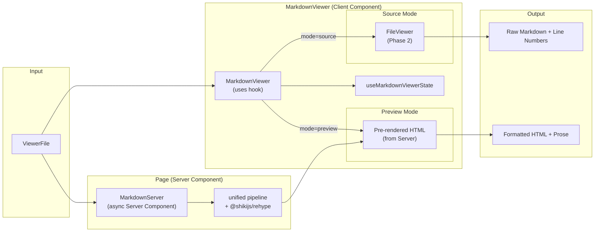
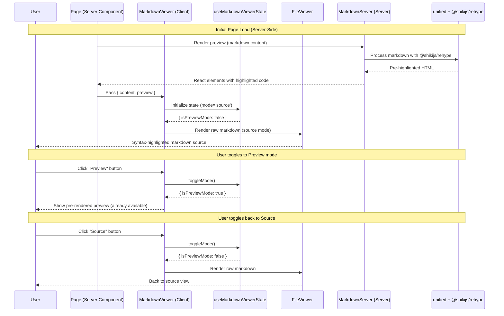

# Phase 3: MarkdownViewer Component – Tasks & Alignment Brief

**Spec**: [../../web-extras-spec.md](../../web-extras-spec.md)
**Plan**: [../../web-extras-plan.md](../../web-extras-plan.md)
**Date**: 2026-01-24

---

## Executive Briefing

### Purpose
This phase creates the MarkdownViewer component that extends FileViewer with source/preview toggle functionality. Users can view markdown files either as raw syntax-highlighted source code (using Phase 2's FileViewer) or as beautifully rendered formatted content with GFM support.

### Context Update (2026-01-25)
**Next.js 16 Upgrade Completed**: The project has been upgraded from Next.js 15.1.6 to 16.1.4 (see [009-nextjs-upgrade plan](../../../009-nextjs-upgrade/nextjs-upgrade-plan.md)).

Key changes affecting Phase 3:
- **Turbopack** is now the default bundler (2-5x faster builds)
- **Node.js 20.19+** required (enforced via engines + .nvmrc)
- **MCP endpoint** available at `/_next/mcp` for real-time validation
- **ADR-0005** documents MCP developer experience loop

**MCP Tools Available for Validation**:
- `get_routes` - Verify demo page route registration
- `get_errors` - Check for build/runtime errors during development
- `get_page_metadata` - Inspect component composition

### What We're Building
A complete MarkdownViewer component that:
- **Source mode**: Displays raw markdown with syntax highlighting and line numbers (reuses FileViewer from Phase 2)
- **Preview mode**: Renders formatted markdown via react-markdown with:
  - GitHub Flavored Markdown support (tables, task lists, strikethrough, autolinks)
  - Syntax-highlighted code fences using the established Shiki infrastructure
  - Professional prose styling via @tailwindcss/typography
- Toggle buttons to switch between Source and Preview modes
- Mode state persists within session via the `useMarkdownViewerState` hook from Phase 1

### User Value
Users can view documentation files in their preferred format. Source mode is ideal for editing reference or understanding raw markdown structure. Preview mode provides a polished reading experience matching GitHub's markdown rendering, making documentation easy to consume.

### Example
**Input**: `ViewerFile { path: 'docs/README.md', filename: 'README.md', content: '# Hello\n**bold**' }`
**Source mode**: Raw markdown with syntax highlighting: `# Hello` highlighted as heading syntax
**Preview mode**: Rendered `<h1>Hello</h1>` with bold text formatted appropriately

---

## Objectives & Scope

### Objective
Create the MarkdownViewer component per plan acceptance criteria AC-8 through AC-13, integrating with the headless hooks from Phase 1 and the Shiki infrastructure from Phase 2.

### Goals

- ✅ Implement MarkdownViewer component with source/preview toggle
- ✅ Source mode reuses FileViewer for raw markdown display
- ✅ Install react-markdown, remark-gfm, @tailwindcss/typography
- ✅ Preview mode renders formatted markdown via react-markdown
- ✅ Add GFM support (tables, task lists, strikethrough)
- ✅ Create custom code block renderer using Phase 2's Shiki processor
- ✅ Add prose styling with @tailwindcss/typography
- ✅ Mode toggle state persists via useMarkdownViewerState hook
- ✅ **Create demo page at `/demo/markdown-viewer`** for manual verification
- ✅ Comprehensive tests (>90% coverage)

### Non-Goals

- ❌ Mermaid diagram rendering (Phase 4)
- ❌ Markdown editing/WYSIWYG capabilities
- ❌ MDX support (embedding React components)
- ❌ User-generated untrusted content sanitization (trusted sources only)
- ❌ Print optimization
- ❌ DiffViewer component (Phase 5)
- ❌ Responsive infrastructure (Phase 6)
- ❌ Copy-to-clipboard for code blocks (can be added later)
- ❌ Table of contents generation
- ❌ Anchor links for headings

---

## Architecture Map

### Component Diagram

```mermaid
flowchart TD
    classDef pending fill:#9E9E9E,stroke:#757575,color:#fff
    classDef inprogress fill:#FF9800,stroke:#F57C00,color:#fff
    classDef completed fill:#4CAF50,stroke:#388E3C,color:#fff
    classDef blocked fill:#F44336,stroke:#D32F2F,color:#fff

    subgraph Phase3["Phase 3: MarkdownViewer Component"]
        T001["T001: Install react-markdown, remark-gfm, @shikijs/rehype ✓"]:::completed
        T002["T002: Install @tailwindcss/typography ✓"]:::completed
        T003["T003: Write MarkdownViewer tests ✓"]:::completed
        T004["T004: Implement MarkdownViewer component ✓"]:::completed
        T005["T005: Configure @shikijs/rehype ✓"]:::completed
        T006["T006: Add prose styling ✓"]:::completed
        T007["T007: Create demo page ✓"]:::completed
        T008["T008: Test GFM features ✓"]:::completed

        T001 --> T003
        T001 --> T005
        T002 --> T006
        T003 --> T004
        T005 --> T004
        T006 --> T004
        T004 --> T007
        T004 --> T008
    end

    subgraph Phase2Deps["Phase 2 Deliverables (Complete)"]
        P2F1["/apps/web/src/lib/server/shiki-processor.ts ✓"]:::completed
        P2F2["/apps/web/src/components/viewers/file-viewer.tsx ✓"]:::completed
        P2F3["/apps/web/src/components/viewers/file-viewer.css ✓"]:::completed
    end

    subgraph Phase1Deps["Phase 1 Deliverables (Complete)"]
        P1F1["/packages/shared/src/lib/language-detection.ts ✓"]:::completed
        P1F2["/apps/web/src/hooks/useMarkdownViewerState.ts ✓"]:::completed
        P1F3["/apps/web/src/lib/viewer-state-utils.ts ✓"]:::completed
    end

    subgraph NewFiles["New Files"]
        F2["/apps/web/src/components/viewers/markdown-viewer.tsx ✓"]:::completed
        F3["/apps/web/src/components/viewers/markdown-viewer.css ✓"]:::completed
        F5["/apps/web/app/(dashboard)/demo/markdown-viewer/page.tsx ✓"]:::completed
    end

    subgraph Tests["Tests"]
        T1["/test/unit/web/components/viewers/markdown-viewer.test.tsx ✓"]:::completed
    end

    T003 -.-> T1
    T004 -.-> F2
    T004 -.-> F3
    T005 -.-> F2
    T007 -.-> F5

    P2F2 --> T004
    P1F2 --> T004
```

<!-- Status: grey=pending, orange=in-progress, green=completed, red=blocked -->
<!-- Updated by plan-6 during implementation -->



### Task-to-Component Mapping

<!-- Status: ⬜ Pending | 🟧 In Progress | ✅ Complete | 🔴 Blocked -->

| Task | Component(s) | Files | Status | Comment |
|------|-------------|-------|--------|---------|
| T001 | Dependencies | package.json | ✅ Complete | Install react-markdown + remark-gfm + @shikijs/rehype |
| T002 | Typography | package.json, globals.css | ✅ Complete | Add @plugin directive for typography (Tailwind v4 pattern) |
| T003 | MarkdownViewer Tests | /test/unit/web/components/viewers/markdown-viewer.test.tsx | ✅ Complete | RED phase - write failing tests first |
| T004 | MarkdownViewer | /apps/web/src/components/viewers/markdown-viewer.tsx | ✅ Complete | GREEN phase - implement to pass tests |
| T005 | Rehype Plugin Config | /apps/web/src/components/viewers/markdown-viewer.tsx | ✅ Complete | Configure @shikijs/rehype for code fence highlighting |
| T006 | Prose Styling | /apps/web/src/components/viewers/markdown-viewer.css | ✅ Complete | Typography plugin integration |
| T007 | Demo Page | /apps/web/app/(dashboard)/demo/markdown-viewer/page.tsx | ✅ Complete | Manual testing page with samples |
| T008 | GFM Testing | Test file updates | ✅ Complete | Test tables, task lists, strikethrough |

---

## Tasks

| Status | ID | Task | CS | Type | Dependencies | Absolute Path(s) | Validation | Subtasks | Notes |
|--------|------|------|-----|------|--------------|------------------|------------|----------|-------|
| [x] | T001 | Install react-markdown, remark-gfm, and @shikijs/rehype packages | 1 | Setup | – | /home/jak/substrate/008-web-extras/apps/web/package.json | `pnpm -F @chainglass/web add react-markdown remark-gfm @shikijs/rehype` succeeds; packages in dependencies | – | Core markdown rendering + Shiki rehype plugin |
| [x] | T002 | Install @tailwindcss/typography and add @plugin directive | 1 | Setup | – | /home/jak/substrate/008-web-extras/apps/web/package.json, /home/jak/substrate/008-web-extras/apps/web/app/globals.css | Package installed; `@plugin "@tailwindcss/typography"` added to globals.css; `prose` classes available | – | DYK Insight #2: Use CSS @plugin directive for Tailwind v4, not tailwind.config.ts |
| [x] | T003 | Write failing tests for MarkdownViewer component | 2 | Test | T001 | /home/jak/substrate/008-web-extras/test/unit/web/components/viewers/markdown-viewer.test.tsx | Tests cover: source mode, preview mode, mode toggle, GFM tables, task lists; tests FAIL before T004 | – | RED phase; Test Doc format |
| [x] | T004 | Implement MarkdownViewer with source/preview toggle | 3 | Core | T003, T005, T006 | /home/jak/substrate/008-web-extras/apps/web/src/components/viewers/markdown-viewer.tsx, /home/jak/substrate/008-web-extras/apps/web/src/components/viewers/markdown-viewer.css | All T003 tests pass; uses useMarkdownViewerState; source mode renders FileViewer; preview mode renders react-markdown | – | GREEN phase |
| [x] | T005 | Configure @shikijs/rehype in markdown processing pipeline | 2 | Core | T001 | /home/jak/substrate/008-web-extras/apps/web/src/components/viewers/markdown-viewer.tsx | @shikijs/rehype configured with `cssVariablePrefix: '--shiki'` and `defaultColor: 'light'` to match Phase 2's file-viewer.css; code fences use same theme switching as FileViewer | – | DYK #1: rehype plugin; DYK #2: CSS variable alignment |
| [x] | T006 | Add prose styling with @tailwindcss/typography | 2 | Enhancement | T002 | /home/jak/substrate/008-web-extras/apps/web/src/components/viewers/markdown-viewer.css | Preview mode has `prose` class; headings, paragraphs, lists styled; dark mode prose colors; **Shiki override CSS** to prevent prose-invert from conflicting with syntax highlighting | – | DYK #5: prose + Shiki conflict prevention |
| [x] | T007 | Create demo page at /demo/markdown-viewer | 2 | Demo | T004 | /home/jak/substrate/008-web-extras/apps/web/app/(dashboard)/demo/markdown-viewer/page.tsx, /home/jak/substrate/008-web-extras/apps/web/src/components/dashboard-sidebar.tsx | Demo page accessible; samples with code, tables, task lists; sidebar nav added; **MCP validation**: (1) `get_routes` shows `/demo/markdown-viewer`, (2) `get_errors` returns empty, (3) browser renders correctly | – | First real use of Next.js 16 MCP for validation |
| [x] | T008 | Test all GFM features (tables, task lists, strikethrough) | 2 | Test | T004 | /home/jak/substrate/008-web-extras/test/unit/web/components/viewers/markdown-viewer.test.tsx | GFM tests added: tables render as `<table>`, task lists as checkboxes, strikethrough as `<del>`, autolinks clickable | – | AC-11 validation |

---

## Alignment Brief

### Prior Phases Review

#### Phase 1: Headless Viewer Hooks (Complete)

**Summary**: Completed 2026-01-24 with 78 tests passing.

**Deliverables Available to Phase 3**:

| Deliverable | Absolute Path | Usage in Phase 3 |
|-------------|---------------|------------------|
| `ViewerFile` interface | `/home/jak/substrate/008-web-extras/packages/shared/src/interfaces/viewer.interface.ts` | Input prop type |
| `detectLanguage()` | `/home/jak/substrate/008-web-extras/packages/shared/src/lib/language-detection.ts` | Language detection for code blocks |
| `useMarkdownViewerState()` | `/home/jak/substrate/008-web-extras/apps/web/src/hooks/useMarkdownViewerState.ts` | Mode toggle state management |
| `createViewerStateBase()` | `/home/jak/substrate/008-web-extras/apps/web/src/lib/viewer-state-utils.ts` | Shared state initialization |

**Lessons Learned**:
1. **Shared utility over hook composition** - Use pure functions for shared logic
2. **Shared by Default** - Pure functions go in `@chainglass/shared`
3. **Two-tier language detection** - Special filenames first, then extensions

**Test Infrastructure**: `renderHook` pattern, Test Doc comment format, ViewerFile fixtures

**Patterns to Follow**:
- `useState` with initializer, `useCallback` for mutations
- Fakes-only policy (R-TEST-007): No vi.mock()

---

#### Phase 2: FileViewer Component (Complete)

**Summary**: Completed 2026-01-24 with 44 new tests (162 total passing).

**Deliverables Available to Phase 3**:

| Deliverable | Absolute Path | Usage in Phase 3 |
|-------------|---------------|------------------|
| `highlightCode()` | `/home/jak/substrate/008-web-extras/apps/web/src/lib/server/shiki-processor.ts` | Core Shiki highlighting for code blocks |
| `FileViewer` component | `/home/jak/substrate/008-web-extras/apps/web/src/components/viewers/file-viewer.tsx` | Source mode rendering |
| Dual-theme CSS pattern | `/home/jak/substrate/008-web-extras/apps/web/src/components/viewers/file-viewer.css` | Theme switching for code blocks |
| Highlighted HTML fixtures | `/home/jak/substrate/008-web-extras/test/fixtures/highlighted-html-fixtures.ts` | Test fixtures for pre-highlighted code |

**Lessons Learned**:
1. **`server-only` package for build-time enforcement** - Not `'use server'` directive
2. **Dual-theme CSS variables for instant theme switching** - No server roundtrip on theme change
3. **Two-module pattern for testing** - `lib/server/index.ts` has `server-only`; tests import directly from processor
4. **Singleton highlighter caching** - Module-level caching for performance

**Critical Gotchas**:
- `server-only` blocks tests - Use separate entry point pattern
- Shiki's `BundledLanguage` doesn't include 'text' - Use `'plaintext'` fallback

**Patterns to Follow**:
- CSS theme switching: `html.dark .shiki span { color: var(--shiki-dark) }`
- Trim trailing newlines: `code.replace(/\n+$/, '')`
- Transformer `line` hook for per-line attributes

---

### Cross-Phase Synthesis

**Phase-by-Phase Evolution**:
1. **Phase 1** established headless state management with `useMarkdownViewerState` providing `mode`, `isPreviewMode`, `toggleMode`, and `setMode`
2. **Phase 2** established server-side Shiki infrastructure with dual-theme CSS variables - this is the foundation for Phase 3's code block rendering

**Cumulative Dependencies Tree**:
```
Phase 3 (MarkdownViewer)
├── Phase 2 (FileViewer)
│   ├── highlightCode() - for code fences
│   ├── FileViewer - for source mode
│   └── Theme CSS patterns
└── Phase 1 (Hooks)
    ├── useMarkdownViewerState - for mode toggle
    ├── ViewerFile interface
    └── detectLanguage() - for code fence language
```

**Reusable Infrastructure from Prior Phases**:
- Highlighted HTML test fixtures from Phase 2
- Test Doc comment format from Phase 1
- ViewerFile sample data
- renderHook pattern for hook testing

---

### Critical Findings Affecting This Phase

**From Plan § 3 - Critical Research Findings**:

**🚨 Critical Discovery 01: Server Component Boundary for Shiki**
- **What it constrains**: Shiki must run server-side; code blocks in preview mode need server-side processing
- **How Phase 3 addresses**: Uses `@shikijs/rehype` in Server Component (MarkdownServer) to process code fences during AST transformation
- **Addressed by**: T001 (install), T006 (configure rehype plugin)

**🚨 DYK Insight #1 (2026-01-24): Custom CodeBlock with Server Action is Architecturally Impossible**
- **What was discovered**: react-markdown custom components are synchronous - they cannot await async server actions during render
- **Original plan**: T006 proposed CodeBlock component calling `highlightCodeAction()`
- **Why it fails**: React components must return JSX synchronously; Promises cause "Objects are not valid as a React child" errors
- **Solution adopted**: Use `@shikijs/rehype` plugin which processes during AST transformation (async-capable) before React rendering
- **Research validation**: Perplexity deep research confirmed this is the industry-standard pattern for Shiki + react-markdown
- **Addressed by**: T001, T006 (revised)

**High Discovery 04: Phase Sequence Driven by Shiki Dependency**
- **What it constrains**: MarkdownViewer depends on FileViewer's Shiki infrastructure
- **How Phase 3 addresses**: Reuses Phase 2's dual-theme CSS patterns; @shikijs/rehype uses same Shiki themes
- **Addressed by**: T001, T006, T007

---

### Invariants & Guardrails

- **Bundle size budget**: react-markdown adds ~20KB to client bundle (acceptable per spec)
- **Performance**: Code fence highlighting via server action; no Shiki on client
- **Accessibility**: Preview mode must be readable by screen readers; proper heading hierarchy
- **Theme consistency**: Preview prose colors must match light/dark theme; code blocks use Phase 2 CSS

---

### Inputs to Read

| File | Purpose |
|------|---------|
| `/home/jak/substrate/008-web-extras/apps/web/src/hooks/useMarkdownViewerState.ts` | Hook API for mode toggle |
| `/home/jak/substrate/008-web-extras/apps/web/src/lib/server/shiki-processor.ts` | `highlightCode()` to wrap in server action |
| `/home/jak/substrate/008-web-extras/apps/web/src/components/viewers/file-viewer.tsx` | FileViewer for source mode delegation |
| `/home/jak/substrate/008-web-extras/apps/web/src/components/viewers/file-viewer.css` | CSS patterns for theme switching |
| `/home/jak/substrate/008-web-extras/apps/web/app/(dashboard)/demo/file-viewer/page.tsx` | Demo page pattern to follow |
| `/home/jak/substrate/008-web-extras/apps/web/src/components/dashboard-sidebar.tsx` | Nav item pattern for demo link |

---

### Visual Alignment: Flow Diagram



---

### Visual Alignment: Sequence Diagram



---

### Test Plan (Full TDD)

**Testing Strategy**: Following Phase 2 pattern - component-focused testing

| Test Suite | Named Tests | Fixtures | Expected Behavior |
|------------|-------------|----------|-------------------|
| `markdown-viewer.test.tsx` | `should render source mode by default` | Sample .md | FileViewer visible, react-markdown not |
| | `should show toggle buttons` | Sample .md | Source/Preview buttons visible |
| | `should toggle to preview mode` | Sample .md | react-markdown visible after toggle |
| | `should render heading in preview mode` | `# Heading` | `<h1>Heading</h1>` in DOM |
| | `should render bold text` | `**bold**` | `<strong>bold</strong>` in DOM |
| | `should render GFM table` | Table markdown | `<table>` element rendered |
| | `should render task list checkboxes` | `- [x] done` | Checkbox input rendered |
| | `should render strikethrough` | `~~strike~~` | `<del>strike</del>` in DOM |
| | `should apply prose styling` | Sample .md | Container has `prose` class |
| | `should persist mode after toggle` | N/A | Multiple toggles maintain state |
| `markdown-viewer.test.tsx` | `should render code fence with syntax highlighting` | Code fence in markdown | Shiki classes present in preview |
| | `should detect language from code fence info string` | ` ```typescript ` | TypeScript highlighting applied |
| | `should handle code fence without language` | ` ``` ` (no lang) | Falls back to plaintext gracefully |

**Test Fixtures**:
- Sample markdown with headings, paragraphs, bold, italic
- GFM table markdown
- Task list markdown (`- [x] done`, `- [ ] todo`)
- Code fence with various languages
- Pre-highlighted HTML fixtures from Phase 2

---

### Step-by-Step Implementation Outline

1. **T001**: Install packages
   ```bash
   pnpm -F @chainglass/web add react-markdown remark-gfm @shikijs/rehype
   ```

2. **T002**: Install typography plugin and add @plugin directive
   ```bash
   pnpm -F @chainglass/web add -D @tailwindcss/typography
   ```
   Add to `globals.css` (after `@import "tailwindcss"`):
   ```css
   @plugin "@tailwindcss/typography";
   ```
   **DYK Insight #2**: Tailwind v4 uses CSS-based config with `@plugin` directive, not `tailwind.config.ts`

3. **T003**: Write failing tests for MarkdownViewer
   - Test source mode (FileViewer rendered)
   - Test toggle buttons
   - Test preview mode (react-markdown rendered)
   - Test mode persistence

4. **T004**: Implement MarkdownViewer component (Client Component for toggle state)
   ```typescript
   'use client'

   import { useMarkdownViewerState } from '../../hooks/useMarkdownViewerState'
   import { FileViewer } from './file-viewer'
   import type { ReactNode } from 'react'

   interface MarkdownViewerProps {
     file: ViewerFile
     highlightedHtml: string  // For source mode
     preview: ReactNode       // Pre-rendered preview from Server Component
   }

   export function MarkdownViewer({ file, highlightedHtml, preview }: MarkdownViewerProps) {
     const { isPreviewMode, toggleMode } = useMarkdownViewerState(file)

     return (
       <div>
         <ToggleButtons isPreviewMode={isPreviewMode} onToggle={toggleMode} />
         {isPreviewMode ? preview : <FileViewer file={file} highlightedHtml={highlightedHtml} />}
       </div>
     )
   }
   ```

5. **T005**: Configure @shikijs/rehype in Server Component for preview
   ```typescript
   // MarkdownServer.tsx - Server Component (async)
   import { MarkdownAsync } from 'react-markdown'
   import rehypeShiki from '@shikijs/rehype'
   import remarkGfm from 'remark-gfm'

   interface MarkdownServerProps {
     content: string
   }

   export async function MarkdownServer({ content }: MarkdownServerProps) {
     return (
       <article className="prose dark:prose-invert">
         <MarkdownAsync
           remarkPlugins={[remarkGfm]}
           rehypePlugins={[[rehypeShiki, {
             themes: { light: 'github-light', dark: 'github-dark' },
             defaultColor: 'light',        // Render light theme colors inline
             cssVariablePrefix: '--shiki'  // Output --shiki-dark CSS vars for dark theme
           }]]}
         >
           {content}
         </MarkdownAsync>
       </article>
     )
   }
   ```

   **DYK Insight #1**: Use @shikijs/rehype instead of custom CodeBlock component.
   **DYK Insight #2**: Configure `cssVariablePrefix: '--shiki'` to match Phase 2's file-viewer.css.
   This ensures code blocks in preview mode use the SAME theme-switching CSS as FileViewer:
   ```css
   html.dark .shiki span { color: var(--shiki-dark) !important; }
   ```
   Single CSS mechanism = less maintenance, visual consistency across all viewers.

6. **T006**: Add prose styling
   - Apply `prose` class to preview container
   - Add `dark:prose-invert` for dark mode
   - **Shiki override CSS** in `markdown-viewer.css`:
     ```css
     /* Let Shiki control syntax colors inside prose (DYK Insight #5) */
     .prose pre.shiki {
       background-color: var(--shiki-light-bg, #fff);
     }
     .prose pre.shiki code {
       color: inherit; /* Shiki spans control individual token colors */
     }
     html.dark .prose pre.shiki {
       background-color: var(--shiki-dark-bg, #1e1e1e);
     }
     /* Ensure Shiki dark theme colors apply */
     html.dark .prose .shiki span {
       color: var(--shiki-dark) !important;
     }
     ```

7. **T007**: Create demo page
   - Copy pattern from `/demo/file-viewer/page.tsx`
   - Include markdown with: headings, bold, code blocks, tables, task lists
   - Add sidebar nav item
   - **MCP Validation** (first real use of Next.js 16 MCP):
     ```bash
     # 1. Verify route registration
     nextjs_call(port, "get_routes")  # Should include /demo/markdown-viewer

     # 2. Check for errors
     nextjs_call(port, "get_errors")  # Should return empty/no errors

     # 3. Manual browser verification
     # Navigate to http://localhost:3000/demo/markdown-viewer
     ```

8. **T008**: Comprehensive GFM testing
   - Tables render as `<table>` with proper structure
   - Task lists render checkboxes
   - Strikethrough renders as `<del>`
   - Autolinks are clickable

---

### Commands to Run

```bash
# Install dependencies (T001, T002)
pnpm -F @chainglass/web add react-markdown remark-gfm @shikijs/rehype
pnpm -F @chainglass/web add -D @tailwindcss/typography

# Run tests during development
pnpm test -- --watch test/unit/web/components/viewers/markdown-viewer.test.tsx

# Run all viewer tests
pnpm test -- test/unit/web/components/viewers/

# Full quality check
just check

# Quick pre-commit validation
just fft

# Start dev server for manual testing (MCP available at /_next/mcp)
pnpm -F @chainglass/web dev
```

### MCP Validation During Implementation

With Next.js 16 MCP integration (ADR-0005), use these tools during development:

```bash
# Via Claude Code MCP tools:
# - nextjs_index: Discover running dev server and available tools
# - nextjs_call(port, "get_errors"): Check for build/runtime errors
# - nextjs_call(port, "get_routes"): Verify demo page route exists

# Validation checkpoints:
# 1. After T008: Verify /demo/markdown-viewer appears in get_routes
# 2. During dev: Use get_errors to catch issues before manual testing
# 3. Page metadata: Use get_page_metadata to inspect component composition
```

See `docs/how/nextjs-mcp-llm-agent-guide.md` for detailed MCP workflows.

---

### Risks & Unknowns

| Risk | Severity | Mitigation |
|------|----------|------------|
| react-markdown React 19 compatibility | Low | Library actively maintained; test early |
| @shikijs/rehype React 19 compatibility | Low | Official Shiki plugin; runs at AST layer, not React layer |
| Typography plugin Tailwind v4 | Low | ✅ RESOLVED: Use `@plugin` directive in CSS (DYK Insight #2) |
| Large markdown files | Low | Consider virtualization if issues arise; out of scope for now |
| Task list checkbox interactivity | Low | Read-only checkboxes acceptable; editing is non-goal |

---

### Ready Check

- [x] Phase 1 deliverables reviewed and documented
- [x] Phase 2 deliverables reviewed and documented
- [x] Critical Discovery 01 (Shiki server boundary) understood - using @shikijs/rehype
- [x] Dependencies from Phase 1/2 identified and documented
- [x] Test plan follows Fakes Only policy (R-TEST-007)
- [x] Demo page included per user request
- [x] Sidebar nav item planned for demo access

**✅ PHASE 3 COMPLETE** - All 8 tasks implemented, 19 tests passing

---

## Phase Footnote Stubs

| # | Date | Task | Note |
|---|------|------|------|
| 1 | 2026-01-25 | T001 | Installed react-markdown, remark-gfm, @shikijs/rehype |
| 2 | 2026-01-25 | T002 | Added @tailwindcss/typography with @plugin directive |
| 3 | 2026-01-25 | T003 | Created 15 failing tests (RED phase) |
| 4 | 2026-01-25 | T004-T006 | Implemented MarkdownViewer, MarkdownServer, CSS (GREEN phase) |
| 5 | 2026-01-25 | T007 | Created demo page, validated with MCP |
| 6 | 2026-01-25 | T008 | Added 5 GFM tests, all 19 tests pass |

---

## Evidence Artifacts

Implementation will write:
- `execution.log.md` - Detailed narrative of implementation in this directory
- Test coverage report via `just test -- --coverage`
- Screenshot of demo page showing source/preview modes

---

## Discoveries & Learnings

_Populated during implementation by plan-6. Log anything of interest to your future self._

| Date | Task | Type | Discovery | Resolution | References |
|------|------|------|-----------|------------|------------|
| 2026-01-24 | T006 | decision | react-markdown custom components are synchronous; cannot await async server actions | Use @shikijs/rehype plugin to process code fences during AST transformation instead of custom CodeBlock | DYK Insight #1, Perplexity research |
| 2026-01-24 | T002 | decision | Tailwind v4 uses CSS-based config; no tailwind.config.ts exists in project | Use `@plugin "@tailwindcss/typography"` directive in globals.css instead of JS config | DYK Insight #2, Perplexity research |
| 2026-01-25 | All | insight | Next.js upgraded to 16.1.4 with Turbopack default; MCP endpoint available at /_next/mcp | Use MCP tools (get_routes, get_errors) during implementation for real-time validation | ADR-0005, 009-nextjs-upgrade |
| 2026-01-25 | T003 | decision | Old T003 (highlightCodeAction) was dead code; @shikijs/rehype handles code highlighting in AST layer | Removed T003 from task list; renumbered T004-T009 to T003-T008 | DYK Session #2, Insight #1 |
| 2026-01-25 | T005 | decision | @shikijs/rehype has its own theme switching that differs from Phase 2's CSS variable pattern | Configure `cssVariablePrefix: '--shiki'` to match file-viewer.css; single theme mechanism | DYK Session #2, Insight #2 |
| 2026-01-25 | T007 | decision | MCP validation was documented but not actionable in task criteria | Added explicit MCP validation steps to T007: get_routes, get_errors checks | DYK Session #2, Insight #4 |
| 2026-01-25 | T006 | decision | prose-invert and Shiki inline styles could conflict for code block colors | Add Shiki override CSS in markdown-viewer.css to let Shiki control syntax colors | DYK Session #2, Insight #5 |

**Types**: `gotcha` | `research-needed` | `unexpected-behavior` | `workaround` | `decision` | `debt` | `insight`

**What to log**:
- Things that didn't work as expected
- External research that was required
- Implementation troubles and how they were resolved
- Gotchas and edge cases discovered
- Decisions made during implementation
- Technical debt introduced (and why)
- Insights that future phases should know about

_See also: `execution.log.md` for detailed narrative._

---

## Critical Insights Discussion

**Session**: 2026-01-25
**Context**: Phase 3 MarkdownViewer Component Tasks Analysis
**Analyst**: AI Clarity Agent (Claude Opus 4.5)
**Reviewer**: Development Team
**Format**: Water Cooler Conversation (5 Critical Insights)

### Insight 1: CodeBlock Server Action Architecture is Impossible

**Did you know**: The original tasks.md proposed a CodeBlock component that calls `highlightCodeAction()` during react-markdown rendering, but this is architecturally impossible because react-markdown custom components are synchronous and cannot await async server actions.

**Implications**:
- React components must return JSX synchronously
- Server actions return Promises (inherently async)
- Attempting to await in synchronous render causes "Objects are not valid as a React child" errors
- The sequence diagram showing CodeBlock → highlightCodeAction was infeasible

**Options Considered**:
- Option A: CodeBlock with server action - **NOT FEASIBLE** (sync components can't await async)
- Option B: @shikijs/rehype plugin - Feasible (official Shiki integration)
- Option C: rehype-pretty-code - Feasible (spec-aligned)

**AI Recommendation**: Option B (@shikijs/rehype)
- Reasoning: Official Shiki plugin, better dual-theme support, processes during AST transformation

**Discussion Summary**:
Deep research via Perplexity confirmed the architectural constraint. The research validated that rehype plugins are the industry-standard pattern for Shiki + react-markdown integration. User chose Option B.

**Decision**: Use @shikijs/rehype for code fence syntax highlighting

**Action Items**:
- [x] Update T001 to include @shikijs/rehype package
- [x] Replace T006 (CodeBlock renderer) with rehype plugin configuration
- [x] Update architecture diagrams and sequence diagrams

**Affects**: T001, T003, T005, T006, architecture diagrams

---

### Insight 2: Tailwind v4 Typography Configuration

**Did you know**: T002 referenced `tailwind.config.ts` for configuring @tailwindcss/typography, but this project uses Tailwind v4 with CSS-based configuration. No `tailwind.config.ts` file exists.

**Implications**:
- Tailwind v4 uses `@import "tailwindcss"` and `@theme` directives in CSS
- Plugins are loaded via `@plugin` directive, not JS config
- Creating tailwind.config.ts would conflict with v4 architecture

**Options Considered**:
- Option A: Create tailwind.config.ts - **NOT VIABLE** (conflicts with v4 pattern)
- Option B: Use @plugin directive in globals.css - Correct v4 approach
- Option C: Import typography styles directly - Works but non-standard

**AI Recommendation**: Option B (@plugin directive)
- Reasoning: Matches existing Tailwind v4 patterns in codebase, CSS-first approach

**Discussion Summary**:
Deep research via Perplexity confirmed the @plugin directive is the correct Tailwind v4 pattern. The syntax is `@plugin "@tailwindcss/typography"` placed after `@import "tailwindcss"`.

**Decision**: Use `@plugin "@tailwindcss/typography"` in globals.css

**Action Items**:
- [x] Update T002 to reference globals.css, not tailwind.config.ts
- [x] Document @plugin directive syntax in implementation outline

**Affects**: T002, T007

---

### Insight 3: Server/Client Component Composition Pattern

**Did you know**: The @shikijs/rehype solution requires a Server Component for async processing, but MarkdownViewer needs client state for mode toggle. This requires a composition pattern.

**Implications**:
- MarkdownViewer (Client Component) manages toggle state
- MarkdownServer (Server Component) wraps MarkdownAsync with rehype plugins
- Page composes them, passing pre-rendered preview to client

**Options Considered**:
- This insight was resolved by Insight #1 updates - the composition pattern was documented in the revised T005/T006 implementation outlines

**AI Recommendation**: Already addressed
- Reasoning: Insight #1 updates included the Server/Client composition pattern

**Discussion Summary**:
The verification confirmed Phase 2 FileViewer already uses this pattern (receives pre-highlighted HTML from parent). The updated sequence diagram and implementation outlines capture this correctly.

**Decision**: Already resolved by Insight #1 updates

**Action Items**: None - already addressed

**Affects**: N/A (already captured in T005, T006 updates)

---

### Insight 4: Phase 1 Hook API is Complete

**Did you know**: The `useMarkdownViewerState` hook from Phase 1 is fully implemented and tested with exactly the API that Phase 3 expects.

**Implications**:
- Hook provides: mode, isPreviewMode, toggleMode, setMode
- 11 tests covering all mode toggle scenarios
- Phase 1 was APPROVED with zero blockers
- No hook modifications needed for Phase 3

**Options Considered**:
- Option A: Use hook as-is - Production-ready, zero work needed
- Option B: Extend hook with new features - Not needed, scope creep

**AI Recommendation**: Option A (use as-is)
- Reasoning: Hook is fully tested and matches all Phase 3 requirements

**Discussion Summary**:
Verification confirmed the hook API matches tasks.md expectations exactly. This is a confirmation insight - no changes needed.

**Decision**: Use `useMarkdownViewerState` hook as-is from Phase 1

**Action Items**: None - hook is production-ready

**Affects**: Confirms T005 can proceed without modifications

---

### Insight 5: Demo Page Pattern is Established

**Did you know**: The FileViewer demo page from Phase 2 provides a complete, proven pattern for the MarkdownViewer demo (T008).

**Implications**:
- FileViewer demo is ~146 lines, pure Server Component
- Uses SAMPLE_FILES array with inline content
- Includes features list in blue info box
- Sidebar uses NAV_ITEMS array for navigation

**Options Considered**:
- Option A: Follow FileViewer pattern exactly - Consistent, proven
- Option B: Enhanced demo with sample selector - Requires Client Component, breaks pattern
- Option C: Minimal demo - Faster but less thorough

**AI Recommendation**: Option A (follow FileViewer pattern)
- Reasoning: Consistency with Phase 2, comprehensive manual testing coverage

**Discussion Summary**:
Verification found the FileViewer demo provides a clear template. T008 already captures this approach correctly.

**Decision**: Follow FileViewer demo pattern exactly for T008

**Action Items**: None - T008 already captures this approach

**Affects**: Confirms T008 implementation approach

---

## Session Summary

**Insights Surfaced**: 5 critical insights identified and discussed
**Decisions Made**: 5 decisions reached through collaborative discussion
**Action Items Created**: 4 file updates applied during session
**Areas Updated**:
- T001: Added @shikijs/rehype to package install
- T002: Changed to use @plugin directive in globals.css
- T006: Changed from CodeBlock renderer to rehype plugin configuration
- Architecture diagrams: Updated to reflect correct data flow
- Sequence diagram: Updated to show Server Component composition
- Discoveries table: Added 2 entries for architectural decisions

**Shared Understanding Achieved**: ✓

**Confidence Level**: High - Key architectural issues identified and resolved with research validation

**Next Steps**:
1. Await GO to proceed with implementation
2. Run `/plan-6-implement-phase --phase 3`

**Notes**:
- Two deep research sessions (Perplexity) validated architectural decisions
- Both insights #1 and #2 revealed plan/spec misalignments that were corrected
- The revised architecture (rehype plugin + Server Component composition) is industry-standard

---

## Critical Insights Discussion - Session #2

**Session**: 2026-01-25 (Post Next.js 16 Upgrade)
**Context**: Phase 3 MarkdownViewer Component - Final Pre-Implementation Review
**Analyst**: AI Clarity Agent (Claude Opus 4.5)
**Reviewer**: Development Team
**Format**: Water Cooler Conversation (5 Critical Insights)

### Insight 1: T003 (highlightCodeAction) is Dead Code

**Did you know**: The original T003 created a server action that Phase 3 would never use, since @shikijs/rehype handles code highlighting in the AST layer.

**Decision**: Remove T003, renumber T004-T009 → T003-T008

**Affects**: Task list reduced from 9 to 8 tasks

---

### Insight 2: Shiki Dual-Theme CSS Alignment

**Did you know**: @shikijs/rehype has its own theme switching that differs from Phase 2's CSS variable pattern, potentially causing visual inconsistency.

**Decision**: Configure `cssVariablePrefix: '--shiki'` to match file-viewer.css

**Affects**: T005 configuration, visual consistency across all viewers

---

### Insight 3: MarkdownAsync Import Confirmed

**Did you know**: The implementation outline's `import { MarkdownAsync } from 'react-markdown'` is correct - component exists since v9.1.0.

**Decision**: Confirmed - no changes needed

**Affects**: Validates T004, T005 approach

---

### Insight 4: MCP Validation Made Actionable

**Did you know**: MCP tools were documented but not included in task validation criteria.

**Decision**: Add explicit MCP validation steps to T007 (get_routes, get_errors)

**Affects**: T007 - first real use of Next.js 16 MCP tooling

---

### Insight 5: Prose + Shiki Conflict Prevention

**Did you know**: prose-invert and Shiki inline styles could conflict for code block colors.

**Decision**: Add Shiki override CSS proactively in T006

**Affects**: T006 - markdown-viewer.css includes override rules

---

## Session #2 Summary

**Insights Surfaced**: 5 critical insights
**Decisions Made**: 5 decisions (1 removal, 3 enhancements, 1 confirmation)
**Tasks Updated**: T005, T006, T007
**Task Removed**: Old T003 (highlightCodeAction)
**Task Count**: 9 → 8 tasks

**Key Outcomes**:
1. Cleaner task list - removed dead code task
2. Visual consistency - Shiki CSS variable alignment
3. Actionable MCP validation - first use of Next.js 16 tooling
4. Proactive conflict prevention - prose + Shiki CSS overrides

**Confidence Level**: High - Ready for implementation

---

## Directory Layout

```
docs/plans/006-web-extras/
├── web-extras-spec.md
├── web-extras-plan.md
└── tasks/
    ├── phase-1-headless-viewer-hooks/
    │   ├── tasks.md              # Phase 1 complete
    │   └── execution.log.md      # Phase 1 log
    ├── phase-2-fileviewer-component/
    │   ├── tasks.md              # Phase 2 complete
    │   ├── execution.log.md      # Phase 2 log
    │   └── research-dossier.md   # Shiki research
    └── phase-3-markdownviewer-component/
        ├── tasks.md              # This file
        └── execution.log.md      # Created by plan-6 during implementation
```

---

---

## References

- [Next.js 16 Upgrade Plan](../../../009-nextjs-upgrade/nextjs-upgrade-plan.md)
- [ADR-0005: Next.js MCP Developer Experience Loop](../../../../adr/adr-0005-nextjs-mcp-developer-experience-loop.md)
- [Next.js MCP LLM Agent Guide](../../../../how/nextjs-mcp-llm-agent-guide.md)
- [CLAUDE.md Project Conventions](../../../../../CLAUDE.md)

---

*Tasks Version 2.0.0 - Updated 2026-01-25 (Implementation Complete)*
*Phase 3 Complete: 8 tasks, 19 tests, MCP validated*
*Next Step: Run `/plan-7-code-review --phase 3`*
