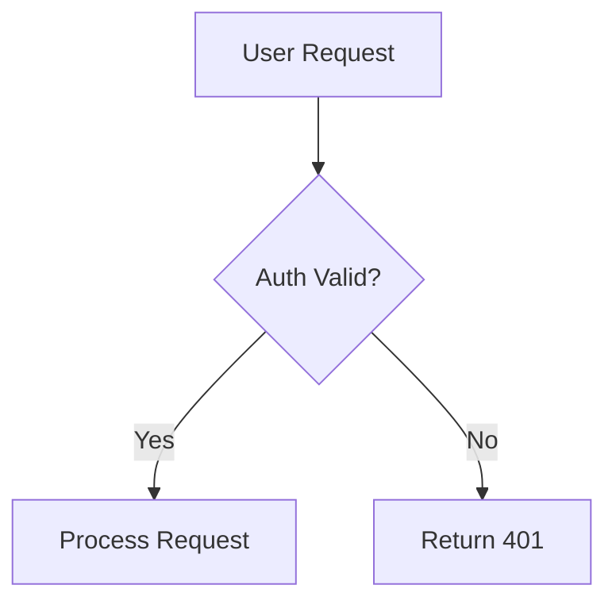
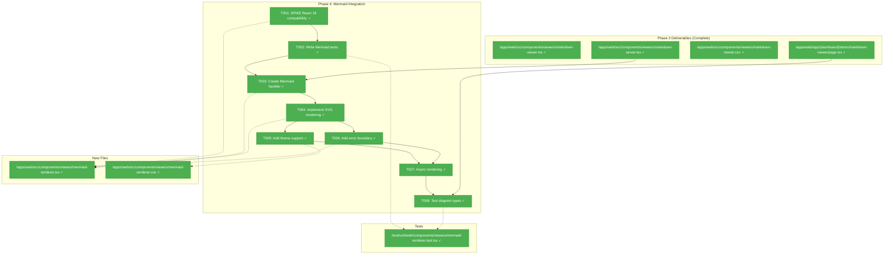
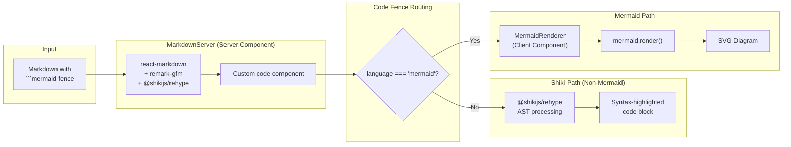
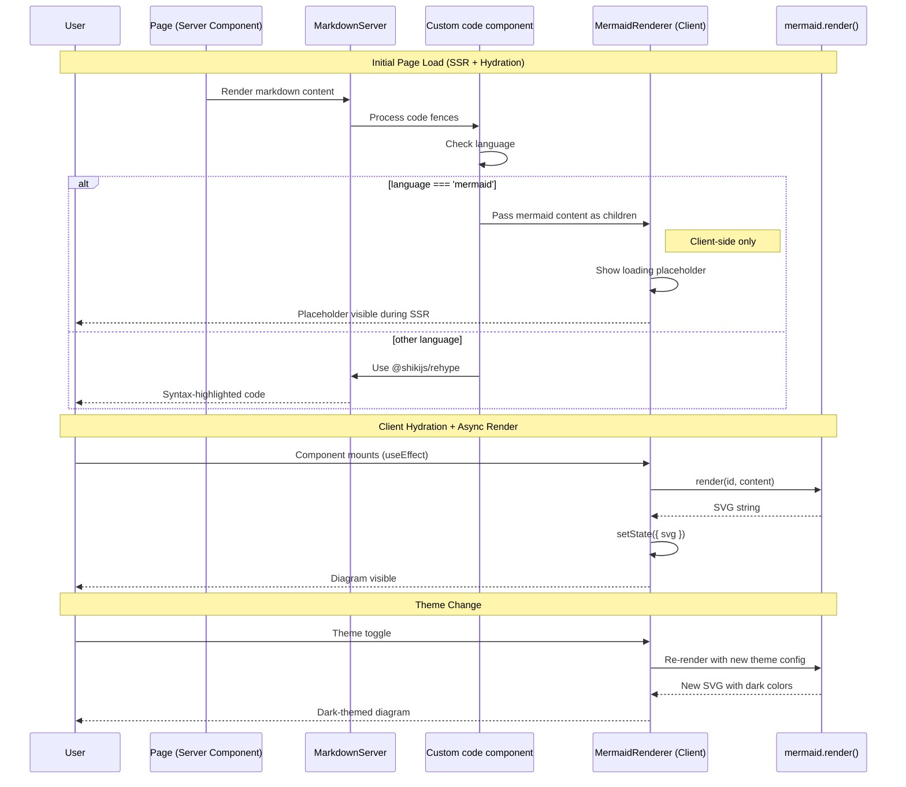

# Phase 4: Mermaid Integration – Tasks & Alignment Brief

**Spec**: [../../web-extras-spec.md](../../web-extras-spec.md)
**Plan**: [../../web-extras-plan.md](../../web-extras-plan.md)
**Date**: 2026-01-25

---

## Executive Briefing

### Purpose
This phase adds Mermaid diagram rendering to the MarkdownViewer preview mode, transforming ```` ```mermaid ```` code fences into interactive SVG diagrams. Mermaid diagrams are widely used in technical documentation for visualizing workflows, sequences, state machines, and entity relationships.

### What We're Building
A Mermaid rendering integration for MarkdownViewer that:
- Detects Mermaid code fences in markdown content
- Renders diagrams as SVG elements within the preview
- Supports common diagram types: flowcharts, sequence diagrams, state diagrams
- Matches the application's light/dark theme
- Handles invalid Mermaid syntax gracefully with informative error messages
- Renders asynchronously without blocking page load

### User Value
Technical documentation often includes architecture diagrams, flow charts, and sequence diagrams. With Mermaid support, users can view these diagrams inline with their documentation, matching GitHub and GitLab rendering capabilities. This eliminates the need for external diagramming tools or static images.

### Example
**Input (Markdown)**:
````markdown
# System Overview


````

**Preview Mode Output**:
An SVG flowchart showing the user request flow with proper styling matching the current theme.

---

## Objectives & Scope

### Objective
Implement Mermaid diagram rendering per plan acceptance criteria AC-14 through AC-18, integrating with the MarkdownViewer component from Phase 3.

### Goals

- ✅ Detect ```` ```mermaid ```` code fences in markdown preview
- ✅ Render Mermaid diagrams as SVG elements
- ✅ Support flowcharts, sequence diagrams, and state diagrams
- ✅ Theme-aware diagrams matching light/dark mode
- ✅ Graceful error handling for invalid syntax
- ✅ Async/non-blocking rendering
- ✅ React 19 compatibility verification (spike task first)
- ✅ Comprehensive tests with TDD approach

### Non-Goals

- ❌ Mermaid diagram editing/live preview
- ❌ All Mermaid diagram types (pie charts, gantt, etc. - just core types for now)
- ❌ Mermaid configuration UI
- ❌ Server-side Mermaid rendering (client-side acceptable for this feature)
- ❌ Export diagrams as PNG/SVG files
- ❌ Diagram zoom/pan controls
- ❌ DiffViewer component (Phase 5)
- ❌ Responsive infrastructure (Phase 6)

---

## Architecture Map

### Component Diagram
<!-- Status: grey=pending, orange=in-progress, green=completed, red=blocked -->
<!-- Updated by plan-6 during implementation -->



### Task-to-Component Mapping

<!-- Status: ⬜ Pending | 🟧 In Progress | ✅ Complete | 🔴 Blocked -->

| Task | Component(s) | Files | Status | Comment |
|------|-------------|-------|--------|---------|
| T001 | SPIKE | spike-mermaid.tsx (temporary) | ✅ Complete | React 19 compatible, validated via build + MCP |
| T002 | MermaidRenderer Tests | /test/unit/web/components/viewers/mermaid-renderer.test.tsx | ✅ Complete | 13 tests written, fail as expected (RED) |
| T003 | CodeBlock + MermaidRenderer | /apps/web/src/components/viewers/code-block.tsx, /apps/web/src/components/viewers/mermaid-renderer.tsx | ✅ Complete | CodeBlock routes mermaid→MermaidRenderer |
| T004 | MermaidRenderer | /apps/web/src/components/viewers/mermaid-renderer.tsx | ✅ Complete | SVG rendering via mermaid.render() |
| T005 | MermaidRenderer CSS | /apps/web/src/components/viewers/mermaid-renderer.css | ✅ Complete | Light/dark theme integration |
| T006 | MermaidRenderer | /apps/web/src/components/viewers/mermaid-renderer.tsx | ✅ Complete | Error boundary for invalid syntax |
| T007 | MermaidRenderer | /apps/web/src/components/viewers/mermaid-renderer.tsx | ✅ Complete | Async rendering, loading state |
| T008 | Tests + Demo | Test file, demo page | ✅ Complete | Demo updated with 3 diagram types |

---

## Tasks

| Status | ID | Task | CS | Type | Dependencies | Absolute Path(s) | Validation | Subtasks | Notes |
|--------|------|------|-----|------|--------------|------------------|------------|----------|-------|
| [x] | T001 | **SPIKE**: Test Mermaid React 19 compatibility | 2 | Spike | – | /home/jak/substrate/008-web-extras/apps/web/src/test-mermaid-spike.tsx (temporary) | (1) Diagram renders without console errors, (2) No hydration warnings, (3) Theme switching works, (4) Invalid syntax shows error without crash | – | CRITICAL: Must pass before continuing. If fails, activate fallback strategy. Delete spike file after validation. |
| [x] | T002 | Write failing tests for MermaidRenderer component | 2 | Test | T001 | /home/jak/substrate/008-web-extras/test/unit/web/components/viewers/mermaid-renderer.test.tsx | Tests cover: rendering, theme, error handling, async loading; tests FAIL before T003 | – | RED phase; Test Doc format; Fakes-only policy |
| [x] | T003 | Create Mermaid code fence handler for react-markdown | 2 | Core | T002 | /home/jak/substrate/008-web-extras/apps/web/src/components/viewers/mermaid-renderer.tsx, /home/jak/substrate/008-web-extras/apps/web/src/components/viewers/markdown-server.tsx | Mermaid fences detected and routed to MermaidRenderer; non-mermaid fences use Shiki | – | Custom component for react-markdown |
| [x] | T004 | Implement Mermaid to SVG conversion | 3 | Core | T003 | /home/jak/substrate/008-web-extras/apps/web/src/components/viewers/mermaid-renderer.tsx | mermaid.render() produces SVG string; SVG inserted via dangerouslySetInnerHTML; diagram visible in DOM | – | AC-14 |
| [x] | T005 | Add theme support for diagrams | 2 | Enhancement | T004 | /home/jak/substrate/008-web-extras/apps/web/src/components/viewers/mermaid-renderer.css, /home/jak/substrate/008-web-extras/apps/web/src/components/viewers/mermaid-renderer.tsx | Diagrams re-render on theme change; light theme uses default/neutral, dark theme uses dark colors | – | AC-16; use next-themes useTheme() |
| [x] | T006 | Add error boundary for invalid Mermaid syntax | 2 | Enhancement | T004 | /home/jak/substrate/008-web-extras/apps/web/src/components/viewers/mermaid-renderer.tsx | Invalid syntax shows "Unable to render diagram" message with syntax error details; no crash | – | AC-17 |
| [x] | T007 | Ensure async/non-blocking rendering | 2 | Enhancement | T005, T006 | /home/jak/substrate/008-web-extras/apps/web/src/components/viewers/mermaid-renderer.tsx | useEffect for async rendering; loading state shown during render; does not block page load | – | AC-18 |
| [x] | T008 | Test flowchart, sequence, state diagrams | 2 | Test | T007 | /home/jak/substrate/008-web-extras/test/unit/web/components/viewers/mermaid-renderer.test.tsx, /home/jak/substrate/008-web-extras/apps/web/app/(dashboard)/demo/markdown-viewer/page.tsx | All 3 diagram types render correctly; demo page updated with Mermaid samples; MCP validation passes | – | AC-15; update demo page |

---

## Alignment Brief

### Prior Phases Review

#### Phase 1: Headless Viewer Hooks (Complete)

**Summary**: Completed 2026-01-24 with 78 tests passing.

**Deliverables Available to Phase 4**:

| Deliverable | Absolute Path | Usage in Phase 4 |
|-------------|---------------|------------------|
| `ViewerFile` interface | `/home/jak/substrate/008-web-extras/packages/shared/src/interfaces/viewer.interface.ts` | Input prop type (unchanged) |
| `useMarkdownViewerState()` | `/home/jak/substrate/008-web-extras/apps/web/src/hooks/useMarkdownViewerState.ts` | Mode toggle for preview (Mermaid only renders in preview) |

**Lessons Learned**:
1. **Shared utility over hook composition** - Use pure functions for shared logic
2. **Fakes-only policy (R-TEST-007)** - No vi.mock(), use real implementations

**Patterns to Follow**:
- `useState` with initializer, `useCallback` for mutations
- Test Doc comment format for all tests

---

#### Phase 2: FileViewer Component (Complete)

**Summary**: Completed 2026-01-24 with 44 new tests (162 total passing).

**Deliverables Available to Phase 4**:

| Deliverable | Absolute Path | Usage in Phase 4 |
|-------------|---------------|------------------|
| `highlightCode()` | `/home/jak/substrate/008-web-extras/apps/web/src/lib/server/shiki-processor.ts` | Not directly used (Mermaid is client-side) |
| Dual-theme CSS pattern | `/home/jak/substrate/008-web-extras/apps/web/src/components/viewers/file-viewer.css` | Theme switching pattern to follow |

**Lessons Learned**:
1. **Dual-theme CSS variables** - Can switch themes without server roundtrip
2. **Two-module pattern for testing** - Separate entry points for production vs test

**Key Patterns**:
- CSS theme switching: `html.dark .mermaid { ... }`
- useTheme() from next-themes for theme detection

---

#### Phase 3: MarkdownViewer Component (Complete)

**Summary**: Completed 2026-01-25 with 19 new tests (1017 total passing).

**Deliverables Available to Phase 4**:

| Deliverable | Absolute Path | Usage in Phase 4 |
|-------------|---------------|------------------|
| `MarkdownViewer` | `/home/jak/substrate/008-web-extras/apps/web/src/components/viewers/markdown-viewer.tsx` | Parent component that renders preview with Mermaid |
| `MarkdownServer` | `/home/jak/substrate/008-web-extras/apps/web/src/components/viewers/markdown-server.tsx` | Server Component that needs custom code component for mermaid fences |
| Demo page | `/home/jak/substrate/008-web-extras/apps/web/app/(dashboard)/demo/markdown-viewer/page.tsx` | Add Mermaid samples for testing |
| `markdown-viewer.css` | `/home/jak/substrate/008-web-extras/apps/web/src/components/viewers/markdown-viewer.css` | CSS patterns for prose + code styling |

**Lessons Learned**:
1. **react-markdown custom components are synchronous** - Cannot await async operations
2. **@shikijs/rehype for code fence highlighting** - Works at AST level, not component level
3. **Server/Client Component composition** - Server does async work, Client handles state
4. **MCP validation for demo pages** - Use `get_routes`, `get_errors` for verification
5. **prose-invert conflicts** - Need CSS overrides to let specific styling win

**Technical Discoveries**:
- `cssVariablePrefix: '--shiki'` aligns all syntax highlighting CSS
- MarkdownAsync is the correct import for Server Component usage

**Critical Architectural Decision from Phase 3**:
The @shikijs/rehype plugin processes code fences at the AST level. Mermaid requires a **different approach** - it needs a custom `code` component in react-markdown that detects `language === 'mermaid'` and renders a client-side MermaidRenderer instead.

---

### Cross-Phase Synthesis

**Phase-by-Phase Evolution**:
1. **Phase 1** established headless state management with hooks
2. **Phase 2** established server-side Shiki infrastructure with dual-theme CSS
3. **Phase 3** established markdown preview with react-markdown + @shikijs/rehype
4. **Phase 4** extends Phase 3 with client-side Mermaid rendering for diagram fences

**Cumulative Dependencies Tree**:
```
Phase 4 (Mermaid Integration)
├── Phase 3 (MarkdownViewer)
│   ├── MarkdownServer - needs custom code component for mermaid detection
│   ├── MarkdownViewer - renders preview containing diagrams
│   ├── Demo page - add Mermaid samples
│   └── CSS patterns - theme switching
├── Phase 2 (FileViewer)
│   └── Theme CSS patterns - dual-theme approach
└── Phase 1 (Hooks)
    └── useMarkdownViewerState - mode toggle (Mermaid only in preview)
```

**Reusable Infrastructure from Prior Phases**:
- Test Doc comment format (all phases)
- Demo page pattern (Phase 2, 3)
- Theme switching CSS (Phase 2, 3)
- MCP validation workflow (Phase 3)
- renderHook pattern for hook testing (Phase 1)

**Pattern Evolution**:
- Phase 2: Server-side Shiki → Phase 3: @shikijs/rehype in Server Component → Phase 4: **Client-side Mermaid** (different pattern)
- Mermaid must be client-side because it requires DOM access for SVG rendering

---

### Critical Findings Affecting This Phase

**From Plan § 3 - Critical Research Findings**:

**🚨 High Discovery 07: Mermaid React 19 Compatibility Risk**
- **What it constrains**: Mermaid library may have issues with React 19's rendering model
- **How Phase 4 addresses**: T001 is a mandatory spike task to verify compatibility before proceeding
- **Fallback strategy**: If incompatible, try `mermaid-isomorphic` for server-side SVG, or show placeholder with link to mermaid.live
- **Addressed by**: T001 (spike), T006 (error boundary as safety net)

**From Phase 3 DYK Session**:

**Insight: react-markdown Custom Components are Synchronous**
- **What it means for Phase 4**: MermaidRenderer can be a custom `code` component, but must handle async Mermaid.render() via useEffect, not during render
- **How Phase 4 addresses**: T004 uses useEffect + useState for async SVG generation
- **Addressed by**: T003 (custom component setup), T004 (async rendering)

---

### ADR Decision Constraints

No ADRs directly reference Mermaid. ADR-0005 (Next.js MCP) applies generally for validation workflow.

---

### Invariants & Guardrails

- **Bundle size budget**: Mermaid adds ~1.5MB to client bundle (mitigated via dynamic import - only loaded when diagrams present)
- **Performance**: Async rendering must not block page load or cause layout shift
- **Accessibility**: Diagrams should have accessible labels (role="img", aria-label)
- **Theme consistency**: Diagram colors must match light/dark theme
- **Security**: SVG is rendered via Mermaid library - no user-controlled SVG injection

---

### Inputs to Read

| File | Purpose |
|------|---------|
| `/home/jak/substrate/008-web-extras/apps/web/src/components/viewers/markdown-server.tsx` | Where to add custom code component |
| `/home/jak/substrate/008-web-extras/apps/web/src/components/viewers/markdown-viewer.tsx` | Parent component context |
| `/home/jak/substrate/008-web-extras/apps/web/src/components/viewers/markdown-viewer.css` | CSS patterns to follow |
| `/home/jak/substrate/008-web-extras/apps/web/app/(dashboard)/demo/markdown-viewer/page.tsx` | Demo page to extend with Mermaid samples |

---

### Visual Alignment: Flow Diagram



---

### Visual Alignment: Sequence Diagram



---

### Test Plan (Full TDD)

**Testing Strategy**: Following Phase 3 pattern - component-focused testing with pre-rendered fixtures where possible

| Test Suite | Named Tests | Fixtures | Expected Behavior |
|------------|-------------|----------|-------------------|
| `mermaid-renderer.test.tsx` | `should render flowchart diagram as SVG` | Flowchart Mermaid content | `<svg>` element in DOM |
| | `should render sequence diagram` | Sequence diagram content | SVG with sequence shapes |
| | `should render state diagram` | State diagram content | SVG with state boxes |
| | `should display error for invalid syntax` | Invalid Mermaid | Error message, no crash |
| | `should respect light theme` | Valid diagram | Light-themed colors |
| | `should respect dark theme` | Valid diagram | Dark-themed colors |
| | `should show loading state` | Valid diagram | Loading indicator before SVG |
| | `should have accessible label` | Valid diagram | role="img", aria-label present |
| | `should not block page load` | Large diagram | Async rendering, no layout shift |

**Test Fixtures**:
```typescript
const FLOWCHART_CONTENT = `
flowchart TD
    A[Start] --> B{Decision}
    B -->|Yes| C[Option 1]
    B -->|No| D[Option 2]
`;

const SEQUENCE_CONTENT = `
sequenceDiagram
    Alice->>Bob: Hello
    Bob-->>Alice: Hi
`;

const STATE_CONTENT = `
stateDiagram-v2
    [*] --> Active
    Active --> Inactive
    Inactive --> [*]
`;

const INVALID_CONTENT = `this is not valid mermaid {{{`;
```

**Testing Approach for Async Rendering**:
- Use `waitFor()` or `findBy*` queries for async assertions
- Test loading state visibility during render
- Verify no blocking of main thread

---

### Step-by-Step Implementation Outline

1. **T001**: SPIKE - Test Mermaid React 19 compatibility
   - Create temporary file `apps/web/src/test-mermaid-spike.tsx`
   - Import mermaid, render simple flowchart
   - Verify: no console errors, no hydration warnings, theme switching works
   - If fails: Document issue, prepare fallback strategy
   - If passes: Delete spike file, continue with T002

2. **T002**: Write failing tests for MermaidRenderer
   - Create `/test/unit/web/components/viewers/mermaid-renderer.test.tsx`
   - Tests for: SVG rendering, theme, error handling, loading state, accessibility
   - Follow Test Doc format from Phase 1-3
   - Run tests - should FAIL (RED phase)

3. **T003**: Create Mermaid code fence handler
   - Create `/apps/web/src/components/viewers/mermaid-renderer.tsx` (MermaidRenderer)
   - Create `/apps/web/src/components/viewers/code-block.tsx` (CodeBlock router)
   - CodeBlock detects `language-mermaid` and routes to MermaidRenderer
   - **DYK #1 Decision**: Use custom CodeBlock component, NOT rehype-mermaid plugin
     - Research confirmed `language-mermaid` className survives @shikijs/rehype processing
     - Simpler than adding new rehype plugin dependency
     - Follows react-markdown best practices for custom component overrides
   - Integrate with MarkdownServer via custom `components` prop:
   ```typescript
   // In code-block.tsx (Client Component)
   'use client';
   import { ComponentProps, useMemo } from 'react';
   import { MermaidRenderer } from './mermaid-renderer';

   export function CodeBlock({ className, children, ...props }: ComponentProps<'code'>) {
     const language = useMemo(() => {
       const match = className?.match(/language-(\w+)/);
       return match ? match[1] : null;
     }, [className]);

     const code = typeof children === 'string' ? children.trim() : '';

     if (language === 'mermaid') {
       return <MermaidRenderer code={code} />;
     }

     // Default: Shiki-highlighted code (already processed by @shikijs/rehype)
     return <code className={className} {...props}>{children}</code>;
   }
   ```

   ```typescript
   // In MarkdownServer.tsx - add components prop to MarkdownAsync
   import { CodeBlock } from './code-block';

   <MarkdownAsync
     remarkPlugins={[remarkGfm]}
     rehypePlugins={[[rehypeShiki, {...}]]}
     components={{ code: CodeBlock }}
   >
   ```

4. **T004**: Implement Mermaid to SVG conversion
   - Use dynamic `import('mermaid')` for lazy loading (~1.5MB bundle, not 300KB!)
   - Use `useId()` for guaranteed unique IDs (not Math.random())
   - Use `mermaid.render()` with `bindFunctions` callback for interaction binding
   - Store SVG in state, render via dangerouslySetInnerHTML
   - **DYK #5 Decision**: Use `import()` in useEffect, NOT `next/dynamic`
     - Component code is tiny (~2KB), only library needs lazy loading
     - Dynamic import in useEffect loads mermaid only when diagram mounts
     - Loading state already handled via `if (!svg) return placeholder`
     - `next/dynamic` would be overkill for this pattern
   ```typescript
   'use client';

   import { useEffect, useState, useRef, useId } from 'react';
   import { useTheme } from 'next-themes';

   interface MermaidRendererProps {
     code: string;
   }

   export function MermaidRenderer({ code }: MermaidRendererProps) {
     const ref = useRef<HTMLDivElement>(null);
     const [svg, setSvg] = useState<string | null>(null);
     const [error, setError] = useState<string | null>(null);
     const { resolvedTheme } = useTheme();
     const uniqueId = useId();

     useEffect(() => {
       let mounted = true;

       // Lazy load mermaid (~1.5MB) only when needed
       import('mermaid').then(async (mermaidModule) => {
         if (!mounted) return;
         const mermaid = mermaidModule.default;

         mermaid.initialize({
           startOnLoad: false,
           theme: resolvedTheme === 'dark' ? 'dark' : 'default',
         });

         try {
           const { svg, bindFunctions } = await mermaid.render(
             `mermaid-${uniqueId}`,
             code
           );
           if (mounted) {
             setSvg(svg);
             // Bind click handlers for interactive diagrams
             if (bindFunctions && ref.current) {
               bindFunctions(ref.current);
             }
           }
         } catch (err) {
           if (mounted) {
             setError(err instanceof Error ? err.message : 'Render failed');
           }
         }
       });

       return () => { mounted = false; };
     }, [code, resolvedTheme, uniqueId]);

     if (error) return <pre className="text-red-500">Diagram error: {error}</pre>;
     if (!svg) return <div>Loading diagram...</div>;
     return <div ref={ref} dangerouslySetInnerHTML={{ __html: svg }} />;
   }
   ```

5. **T005**: Add theme support CSS and refinements
   - Theme integration already in T004 via `resolvedTheme` dependency
   - This task adds CSS styling for diagram containers
   - Optional: Add `themeVariables` customization for brand colors
   ```typescript
   // Optional themeVariables for brand color customization
   mermaid.initialize({
     startOnLoad: false,
     theme: resolvedTheme === 'dark' ? 'dark' : 'default',
     themeVariables: {
       primaryColor: resolvedTheme === 'dark' ? '#1e293b' : '#f4f4f4',
       primaryTextColor: resolvedTheme === 'dark' ? '#ffffff' : '#333',
       lineColor: resolvedTheme === 'dark' ? '#4b5563' : '#cccccc',
     },
   });
   ```
   - Note: Mermaid does NOT support CSS variable theming (must re-render)

6. **T006**: Add error boundary
   - Try/catch around mermaid.render()
   - Display friendly error message with syntax details
   - Component continues working - no crash propagation

7. **T007**: Ensure async/non-blocking rendering
   - Loading state during render
   - No layout shift (reserve space or use CSS containment)
   - Verify main thread not blocked

8. **T008**: Test all diagram types + update demo
   - Add Mermaid samples to demo page
   - Verify flowchart, sequence, state diagrams
   - MCP validation: `get_routes`, `get_errors`

---

### Commands to Run

```bash
# Install Mermaid dependency
pnpm -F @chainglass/web add mermaid

# Run tests during development
pnpm test -- --watch test/unit/web/components/viewers/mermaid-renderer.test.tsx

# Run all viewer tests
pnpm test -- test/unit/web/components/viewers/

# Full quality check
just check

# Quick pre-commit validation
just fft

# Start dev server for manual testing (MCP available at /_next/mcp)
pnpm -F @chainglass/web dev
```

### MCP Validation During Implementation

```bash
# Via Claude Code MCP tools:
# - nextjs_index: Discover running dev server
# - nextjs_call(port, "get_errors"): Check for build/runtime errors
# - nextjs_call(port, "get_routes"): Verify pages exist

# Validation checkpoints:
# 1. After T001 spike: Check for hydration warnings in get_errors
# 2. After T008: Verify demo page still works, no new errors
```

---

### Risks & Unknowns

| Risk | Severity | Mitigation |
|------|----------|------------|
| Mermaid React 19 incompatibility | High | T001 spike first; fallback to mermaid-isomorphic or mermaid.live link |
| Hydration mismatch (client-only rendering) | Medium | MermaidRenderer is purely client-side; SSR shows placeholder |
| Bundle size impact (~1.5MB, not 300KB!) | Medium | Dynamic `import('mermaid')` in useEffect; only loads when diagrams present |
| Theme change re-render performance | Low | Debounce theme changes; mermaid.render is fast |
| Invalid user content crashes | Low | T006 error boundary catches all errors |

---

### Spike Fallback Strategy (If T001 Fails)

If Mermaid is incompatible with React 19:

1. **Option A: mermaid-isomorphic**
   - Server-side SVG generation
   - Requires Server Component refactor
   - No client-side theme switching

2. **Option B: Static placeholder with mermaid.live link**
   - Show code fence content with "View diagram" link
   - Links to https://mermaid.live with content encoded
   - Zero compatibility risk

3. **Option C: Pin Mermaid to older version**
   - May have other bugs or missing features
   - Last resort

Document decision and rationale if fallback activated.

---

### Ready Check

- [x] Phase 1 deliverables reviewed (useMarkdownViewerState for mode toggle)
- [x] Phase 2 deliverables reviewed (theme CSS patterns)
- [x] Phase 3 deliverables reviewed (MarkdownServer custom component integration)
- [x] High Discovery 07 (Mermaid React 19 risk) understood - T001 spike addresses this
- [x] Test plan follows Fakes Only policy (R-TEST-007)
- [x] Demo page extension planned
- [x] Fallback strategy documented

**✅ PHASE COMPLETE** - All tasks implemented and verified

---

## Phase Footnote Stubs

| # | Date | Task | Note |
|---|------|------|------|
| | | | |

_To be populated by plan-6 during implementation_

---

## Evidence Artifacts

Implementation will write:
- `execution.log.md` - Detailed narrative of implementation in this directory
- Test coverage report via `just test -- --coverage`
- Screenshots of demo page with Mermaid diagrams in light/dark themes

---

## Discoveries & Learnings

_Populated during implementation by plan-6. Log anything of interest to your future self._

| Date | Task | Type | Discovery | Resolution | References |
|------|------|------|-----------|------------|------------|
| | | | | | |

**Types**: `gotcha` | `research-needed` | `unexpected-behavior` | `workaround` | `decision` | `debt` | `insight`

**What to log**:
- Things that didn't work as expected
- External research that was required
- Implementation troubles and how they were resolved
- Gotchas and edge cases discovered
- Decisions made during implementation
- Technical debt introduced (and why)
- Insights that future phases should know about

_See also: `execution.log.md` for detailed narrative._

---

## Directory Layout

```
docs/plans/006-web-extras/
├── web-extras-spec.md
├── web-extras-plan.md
└── tasks/
    ├── phase-1-headless-viewer-hooks/
    │   ├── tasks.md              # Phase 1 complete
    │   └── execution.log.md      # Phase 1 log
    ├── phase-2-fileviewer-component/
    │   ├── tasks.md              # Phase 2 complete
    │   ├── execution.log.md      # Phase 2 log
    │   └── research-dossier.md   # Shiki research
    ├── phase-3-markdownviewer-component/
    │   ├── tasks.md              # Phase 3 complete
    │   └── execution.log.md      # Phase 3 log
    └── phase-4-mermaid-integration/
        ├── tasks.md              # This file
        └── execution.log.md      # Created by plan-6 during implementation
```

---

## Critical Insights Discussion

**Session**: 2026-01-25
**Context**: Phase 4: Mermaid Integration Tasks & Alignment Brief
**Analyst**: AI Clarity Agent
**Reviewer**: Development Team
**Format**: Water Cooler Conversation (5 Critical Insights)

### Insight 1: @shikijs/rehype Plugin Ordering

**Did you know**: The proposed custom `components.code` approach works because `language-mermaid` className survives @shikijs/rehype processing, allowing the custom component to detect and route mermaid fences.

**Implications**:
- Rehype plugins transform AST before components render
- Custom component receives post-Shiki output but className is preserved
- No need for rehype-mermaid plugin dependency

**Options Considered**:
- Option A: rehype-mermaid plugin with `strategy: 'pre-mermaid'`
- Option B: Custom CodeBlock component (research-validated)
- Option C: Configure @shikijs/rehype filter to skip mermaid

**AI Recommendation**: Option B - Custom CodeBlock Component
- Reasoning: Research confirmed className survives Shiki; simpler than adding new plugin; follows react-markdown best practices

**Discussion Summary**: Deep research via Perplexity validated that custom component approach is the recommended pattern for react-markdown + Mermaid integration.

**Decision**: Use Custom CodeBlock Component approach (Option B)

**Action Items**:
- [x] Update T003 to include CodeBlock component
- [x] Add code-block.tsx to deliverables

**Affects**: T003, T004 implementation patterns

---

### Insight 2: Unique ID Generation for Mermaid

**Did you know**: Math.random() creates non-deterministic collision risk for Mermaid diagram IDs. If two diagrams get the same ID, one silently fails to render.

**Implications**:
- Mermaid requires globally unique IDs across all diagrams on page
- Content-based hashing fails when identical diagrams appear twice
- React's useId() is designed for exactly this use case

**Options Considered**:
- Option A: React's `useId()` hook (guaranteed unique)
- Option B: Math.random() (original plan)
- Option C: Content hash (fails on duplicate diagrams)

**AI Recommendation**: Option A - useId()
- Reasoning: Guaranteed uniqueness, SSR-safe, zero collision probability

**Discussion Summary**: Verification confirmed useId() is React 19's built-in solution for DOM ID generation.

**Decision**: Use React's `useId()` hook

**Action Items**:
- [x] Update T004 implementation to use useId()

**Affects**: T004 implementation

---

### Insight 3: Theme Re-rendering is Mandatory

**Did you know**: Unlike Shiki, Mermaid cannot use CSS variables in `themeVariables`. Theme changes require full diagram re-render.

**Implications**:
- Mermaid requires static hex values, not CSS variables
- Theme toggle triggers useEffect → re-render all diagrams
- Brief "Loading diagram..." flash on theme change (acceptable UX)

**Options Considered**:
- Option A: Re-render on theme change (current plan)
- Option B: Debounce theme changes (enhancement)
- Option C: Cache dual SVGs (complex)
- Option D: Server-side pre-render both themes (requires Playwright)

**AI Recommendation**: Option A - Re-render on Theme Change
- Reasoning: Already implemented; debouncing is premature optimization

**Discussion Summary**: Research confirmed Mermaid CSS variable theming is an open feature request (GitHub #6677, #6860).

**Decision**: Accept re-render approach; add note that Mermaid doesn't support CSS variable theming

**Action Items**:
- [x] Update T005 to clarify CSS refinements only (theme re-render in T004)

**Affects**: T005 scope

---

### Insight 4: Hydration Mismatch Prevention

**Did you know**: MermaidRenderer's loading state (`if (!svg) return placeholder`) naturally prevents hydration mismatches because both server and client render the same placeholder initially.

**Implications**:
- Server renders placeholder (svg is null)
- Client hydrates with same placeholder
- useEffect runs after hydration, loads mermaid, sets svg
- No mismatch because initial render matches

**Options Considered**:
- Option A: Explicit `mounted` state pattern
- Option B: Use `svg` state as implicit mount detection (current)
- Option C: suppressHydrationWarning (not recommended)

**AI Recommendation**: Option B - Current Implementation
- Reasoning: Already correct; follows established pattern implicitly

**Discussion Summary**: Verified against theme-toggle.tsx pattern; current implementation achieves same result.

**Decision**: Keep current implementation (Option B)

**Action Items**: None - already correct

**Affects**: No changes needed

---

### Insight 5: Bundle Code-Splitting Strategy

**Did you know**: Mermaid bundle is ~1.5MB (not 300KB as originally estimated). Dynamic `import()` in useEffect is optimal for our architecture.

**Implications**:
- MermaidRenderer component is tiny (~2KB)
- Only the mermaid library needs lazy loading
- `next/dynamic` would be overkill for this pattern
- Current approach loads mermaid only when diagram actually mounts

**Options Considered**:
- Option A: `next/dynamic` to wrap component
- Option B: Dynamic `import()` in useEffect (current)
- Option C: React.lazy with Suspense

**AI Recommendation**: Option B - Dynamic import in useEffect
- Reasoning: Component is tiny; only library needs lazy loading; loading state already handled

**Discussion Summary**: Perplexity research suggested next/dynamic, but analysis showed current approach already achieves same code-splitting.

**Decision**: Keep dynamic `import('mermaid')` in useEffect

**Action Items**:
- [x] Add DYK #5 decision note to T004
- [x] Correct bundle size estimate in Risks table (300KB → 1.5MB)

**Affects**: T004 documentation, Risks table

---

## Session Summary

**Insights Surfaced**: 5 critical insights identified and discussed
**Decisions Made**: 5 decisions reached
**Action Items Created**: 7 updates applied to tasks.md
**Areas Updated**:
- T003: Added CodeBlock component, DYK #1 decision documented
- T004: Updated with useId(), dynamic import, bindFunctions, DYK #5 note
- T005: Clarified scope as CSS refinements
- Risks table: Corrected bundle size estimate
- Task mapping: Added code-block.tsx

**Shared Understanding Achieved**: ✓

**Confidence Level**: High - All insights verified against codebase and external research

**Next Steps**:
1. Review updated tasks.md
2. Run `/plan-6-implement-phase --phase 4` to begin implementation

**Notes**:
- Deep research via Perplexity validated custom component approach
- Bundle size significantly larger than spec estimated (~1.5MB vs 300KB)
- All 5 insights aligned with or improved upon original plan

---

*Tasks Version 1.1.0 - Updated 2026-01-25 (DYK Session Applied)*
*Next Step: Await GO, then run `/plan-6-implement-phase --phase 4`*
