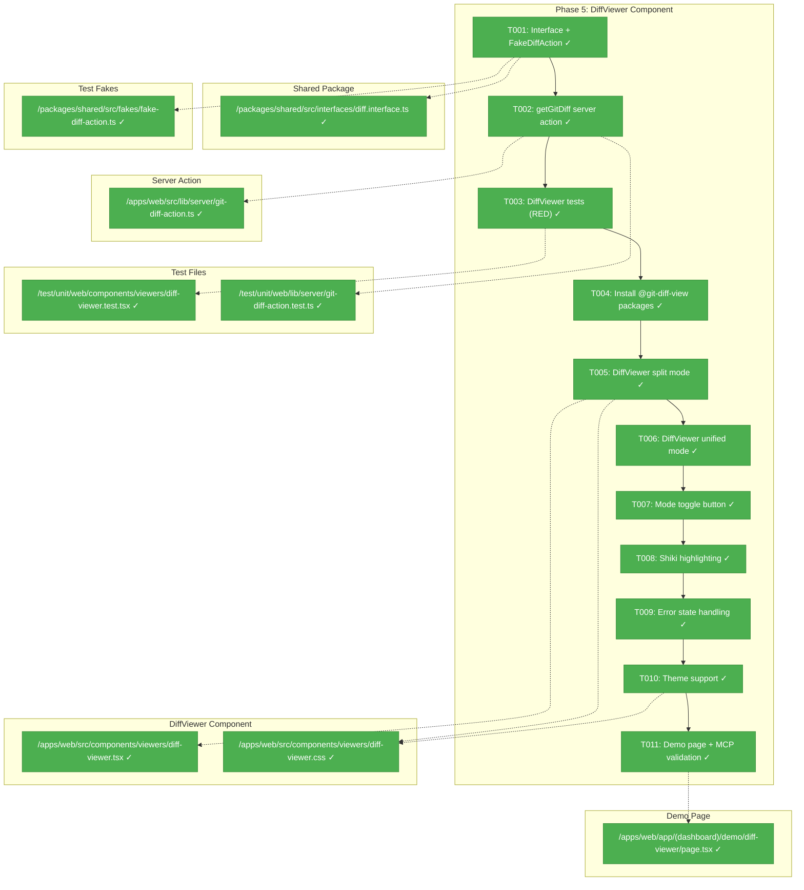
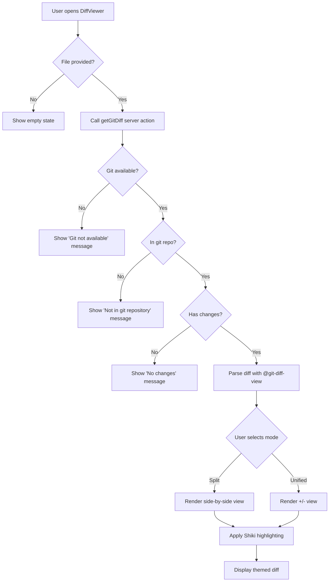
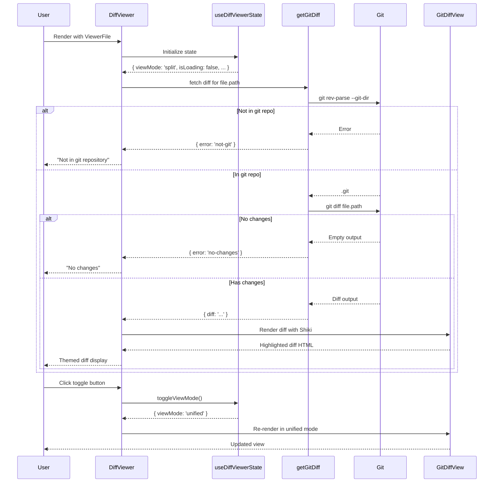

# Phase 5: DiffViewer Component – Tasks & Alignment Brief

**Spec**: [../web-extras-spec.md](../web-extras-spec.md)
**Plan**: [../web-extras-plan.md](../web-extras-plan.md)
**Date**: 2026-01-26

---

## Executive Briefing

### Purpose
This phase delivers the DiffViewer component that displays git diff output with GitHub-style formatting. It enables developers to see file changes directly in the Chainglass dashboard, completing the viewer component family alongside FileViewer and MarkdownViewer.

### What We're Building
A `DiffViewer` component that:
- Accepts the same `ViewerFile` interface as other viewers
- Fetches git diff via a server action (`getGitDiff`)
- Displays changes in split (side-by-side) or unified (+/-) view modes
- Uses Shiki for syntax highlighting (consistent with FileViewer)
- Handles edge cases: not in git, no changes, git not available

### User Value
Developers can view uncommitted file changes directly in the dashboard without switching to a terminal or external tool. This supports code review workflows and change visualization.

### Example
**Input**: `ViewerFile { path: "src/utils.ts", filename: "utils.ts", content: "..." }`
**Output**: Side-by-side diff showing:
```
- const x = 1;        | + const x = 2;
```

---

## Objectives & Scope

### Objective
Implement the DiffViewer component as specified in the plan with full TDD, leveraging the Shiki infrastructure from Phase 2 and following established viewer patterns from Phases 1-4.

### Behavior Checklist
- [x] AC-19: DiffViewer accepts ViewerFile input
- [x] AC-20: Runs git diff on file path (via getGitDiff server action)
- [x] AC-21: Split view with side-by-side display
- [x] AC-22: Unified view with +/- markers
- [x] AC-23: Toggle between modes
- [x] AC-24: Shiki syntax highlighting (@git-diff-view/shiki)
- [x] AC-25: Theme matches app mode
- [x] AC-26: "Not in git" message
- [x] AC-27: "No changes" message
- [x] AC-28: Virtual scrolling for large diffs (@git-diff-view handles this)

### Goals

- ✅ Create `IGitDiffService` interface and `FakeDiffAction` for testing
- ✅ Implement `getGitDiff` server action with error handling
- ✅ Build DiffViewer component with split and unified view modes
- ✅ Integrate @git-diff-view/react with @git-diff-view/shiki
- ✅ Handle all error states gracefully (not-git, no-changes, git-not-available)
- ✅ Match theme with application light/dark mode
- ✅ Add demo page for manual validation

### Non-Goals (Scope Boundaries)

- ❌ Inline editing of diff content (view-only component)
- ❌ Staging/unstaging changes (UI for `git add`)
- ❌ Commit creation from DiffViewer
- ❌ File browser integration (file selection handled elsewhere)
- ❌ Comparison between arbitrary commits (only working directory vs HEAD)
- ❌ Binary file diff support (text files only)
- ❌ Performance optimization for files >10,000 lines (@git-diff-view handles virtualization)

---

## Architecture Map

### Component Diagram
<!-- Status: grey=pending, orange=in-progress, green=completed, red=blocked -->
<!-- Updated by plan-6 during implementation -->



### Task-to-Component Mapping

<!-- Status: ⬜ Pending | 🟧 In Progress | ✅ Complete | 🔴 Blocked -->

| Task | Component(s) | Files | Status | Comment |
|------|-------------|-------|--------|---------|
| T001 | Interface, Fake | `/packages/shared/src/interfaces/diff.interface.ts`, `/packages/shared/src/fakes/fake-diff-action.ts` | ✅ Complete | Interface-first per constitution; fake for testing |
| T002 | Server Action | `/apps/web/src/lib/server/git-diff-action.ts` | ✅ Complete | Implements interface; handles git errors |
| T003 | Test Suite | `/test/unit/web/components/viewers/diff-viewer.test.tsx` | ✅ Complete | RED phase - tests written, fail as expected |
| T004 | Dependencies | `package.json` | ✅ Complete | @git-diff-view/react@0.0.36 + @git-diff-view/shiki@0.0.36 |
| T005 | DiffViewer | `/apps/web/src/components/viewers/diff-viewer.tsx` | ✅ Complete | Split view mode (default) |
| T006 | DiffViewer | `/apps/web/src/components/viewers/diff-viewer.tsx` | ✅ Complete | Unified view mode |
| T007 | DiffViewer | `/apps/web/src/components/viewers/diff-viewer.tsx` | ✅ Complete | Toggle button UI |
| T008 | Shiki Integration | `/apps/web/src/components/viewers/diff-viewer.tsx` | ✅ Complete | @git-diff-view/shiki config |
| T009 | Error States | `/apps/web/src/components/viewers/diff-viewer.tsx` | ✅ Complete | not-git, no-changes, git-not-available |
| T010 | Styling | `/apps/web/src/components/viewers/diff-viewer.css` | ✅ Complete | Theme switching CSS |
| T011 | Demo Page | `/apps/web/app/(dashboard)/demo/diff-viewer/page.tsx` | ✅ Complete | Manual validation + MCP |

---

## Tasks

| Status | ID | Task | CS | Type | Dependencies | Absolute Path(s) | Validation | Subtasks | Notes |
|--------|------|------|-----|------|--------------|------------------|------------|----------|-------|
| [x] | T001 | Create `DiffResult` interface and `FakeDiffAction` class | 2 | Setup | – | `/home/jak/substrate/008-web-extras/packages/shared/src/interfaces/diff.interface.ts`, `/home/jak/substrate/008-web-extras/test/fakes/fake-diff-action.ts`, `/home/jak/substrate/008-web-extras/packages/shared/src/interfaces/index.ts` | Interface exported; fake has setNotInGitRepo(), setNoChanges(), setDiff(), setGitNotAvailable() helpers | – | Interface-first per constitution |
| [x] | T002 | Implement `getGitDiff` server action + tests | 2 | Core | T001 | `/home/jak/substrate/008-web-extras/apps/web/src/actions/get-git-diff.ts`, `/home/jak/substrate/008-web-extras/test/unit/web/actions/get-git-diff.test.ts` | Tests pass for: git available, not in repo, no changes, git not available | – | Per Critical Discovery 06 |
| [x] | T003 | Write DiffViewer component tests (RED phase) | 2 | Test | T002 | `/home/jak/substrate/008-web-extras/test/unit/web/components/viewers/diff-viewer.test.tsx` | Tests fail as expected (component doesn't exist) | – | Tests cover AC-19 to AC-28 |
| [x] | T004 | Install @git-diff-view packages | 1 | Setup | T003 | `/home/jak/substrate/008-web-extras/apps/web/package.json`, `/home/jak/substrate/008-web-extras/pnpm-lock.yaml` | `pnpm install` succeeds; packages available for import | – | @git-diff-view/react, @git-diff-view/shiki |
| [x] | T005 | Implement DiffViewer with split mode (GREEN phase) | 2 | Core | T004 | `/home/jak/substrate/008-web-extras/apps/web/src/components/viewers/diff-viewer.tsx`, `/home/jak/substrate/008-web-extras/apps/web/src/components/viewers/diff-viewer.css`, `/home/jak/substrate/008-web-extras/apps/web/src/components/viewers/index.ts` | Split mode tests pass; side-by-side display renders | – | AC-21 |
| [x] | T006 | Add unified view mode | 2 | Core | T005 | `/home/jak/substrate/008-web-extras/apps/web/src/components/viewers/diff-viewer.tsx` | Unified mode tests pass; +/- markers display | – | AC-22 |
| [x] | T007 | Add mode toggle button with useDiffViewerState hook | 1 | Core | T006 | `/home/jak/substrate/008-web-extras/apps/web/src/components/viewers/diff-viewer.tsx` | Toggle button switches between split/unified; uses Phase 1 hook | – | AC-23 |
| [x] | T008 | Integrate Shiki highlighting via @git-diff-view/shiki | 2 | Core | T007 | `/home/jak/substrate/008-web-extras/apps/web/src/components/viewers/diff-viewer.tsx` | Diff code has syntax colors; consistent with FileViewer | – | AC-24 |
| [x] | T009 | Handle no-git and no-changes error states | 2 | Core | T008 | `/home/jak/substrate/008-web-extras/apps/web/src/components/viewers/diff-viewer.tsx` | Error messages display for each state; no crashes | – | AC-26, AC-27 |
| [x] | T010 | Add theme support CSS | 1 | Core | T009 | `/home/jak/substrate/008-web-extras/apps/web/src/components/viewers/diff-viewer.css` | Light/dark theme matches app via CSS variables | – | AC-25; follow Phase 2 pattern |
| [x] | T011 | Create demo page + MCP validation | 2 | Integration | T010 | `/home/jak/substrate/008-web-extras/apps/web/app/(dashboard)/demo/diff-viewer/page.tsx` | Demo at /demo/diff-viewer; MCP get_routes shows route; build passes | – | Per ADR-0005 |

---

## Alignment Brief

### Prior Phases Review

#### Phase-by-Phase Summary

**Phase 1: Headless Viewer Hooks** (Complete)
- Created foundational hook infrastructure for all viewers
- Established `ViewerFile` interface in shared package: `{ path, filename, content }`
- Implemented `useDiffViewerState` hook with: `viewMode`, `isLoading`, `error`, `diffData`, `toggleViewMode`, `setViewMode`, `setLoading`, `setError`, `setDiffData`
- Language detection utility supports 20+ extensions
- Pattern established: `createViewerStateBase()` shared utility for hook composition

**Phase 2: FileViewer Component** (Complete)
- Established Shiki server-side infrastructure in `/apps/web/src/lib/server/`
- Created dual-theme CSS variable pattern (`cssVariablePrefix: '--shiki'`)
- Two-tier testing strategy: real Shiki for processor tests, fixtures for component tests
- `server-only` guard pattern for keeping heavy dependencies server-side
- Bundle verification confirms Shiki 0B in client bundle

**Phase 3: MarkdownViewer Component** (Complete)
- Server/Client component composition pattern (MarkdownServer + MarkdownViewer)
- @shikijs/rehype integration for code fence highlighting
- Prose + Shiki CSS conflict resolution in markdown-viewer.css
- react-markdown with GFM support (tables, task lists, strikethrough)

**Phase 4: Mermaid Integration** (Complete)
- remark plugin pattern for AST-level transformations before Shiki
- Dynamic `import()` pattern for large libraries (~1.5MB Mermaid)
- `useId()` for unique IDs (sanitize colons for Mermaid)
- Theme-aware re-rendering (Mermaid can't use CSS variables)
- Loading state pattern prevents hydration mismatch

#### Cumulative Deliverables Available to Phase 5

**From Shared Package** (`@chainglass/shared`):
- `ViewerFile` interface: `{ path: string; filename: string; content: string }`
- `detectLanguage(filename: string): string` utility

**From Apps/Web Hooks** (`/apps/web/src/hooks/`):
- `useFileViewerState(file?: ViewerFile)` - base viewer state
- `useMarkdownViewerState(file?: ViewerFile)` - extends with mode toggle
- `useDiffViewerState(file?: ViewerFile)` - **READY FOR USE** - manages viewMode, diffData, isLoading, error

**From Apps/Web Lib** (`/apps/web/src/lib/server/`):
- `highlightCode(code: string, lang: string): Promise<string>` - Shiki highlighting
- Singleton highlighter pattern with caching

**From Apps/Web Components** (`/apps/web/src/components/viewers/`):
- `FileViewer` - code display with line numbers
- `MarkdownViewer` + `MarkdownServer` - markdown with preview
- `MermaidRenderer` - diagram rendering
- CSS patterns: `file-viewer.css`, `markdown-viewer.css`, `mermaid-renderer.css`

**From Test Fixtures** (`/test/fixtures/`):
- `highlighted-html-fixtures.ts` - pre-highlighted HTML for component tests

#### Pattern Evolution Across Phases

1. **Server-Side Processing**: Phase 2 established, Phase 3 refined with @shikijs/rehype
2. **CSS Theme Variables**: `--shiki-*` prefix used consistently in Phases 2-4
3. **Two-Tier Testing**: Real implementation unit tests, fixtures for component tests
4. **Dynamic Import**: For large bundles (Mermaid in Phase 4, @git-diff-view in Phase 5)
5. **Loading State Pattern**: Prevents hydration mismatch (Phase 4 MermaidRenderer)

#### Reusable Test Infrastructure

- `renderHook` from @testing-library/react for hook testing
- `act()` wrapper for state mutations
- Test Doc format for all tests (Why, Contract, Usage Notes, Quality Contribution, Worked Example)
- Fixtures pattern for pre-rendered content

### Critical Findings Affecting This Phase

#### High Discovery 06: DiffViewer Requires Git Availability Check
**From Plan § 3**

**Constraint**: Git binary may not be available in all deployment environments.

**Impact on Implementation**:
1. Server action must check git availability before running `git diff`
2. Three distinct error states: `not-git`, `no-changes`, `git-not-available`
3. Graceful UI for each error state (no crashes)

**Addressed by**: T002 (server action error handling), T009 (error state UI)

#### Pattern from Phase 2: Server-Only Guard
**Consideration**: @git-diff-view/shiki likely needs server-side processing like Shiki.

**Impact on Implementation**:
- May need to configure `serverExternalPackages` in next.config.ts
- Test the package to verify it doesn't bloat client bundle
- Use bundle analyzer to verify

**Addressed by**: T004 (package installation), T008 (Shiki integration)

### ADR Decision Constraints

**ADR-0005: Next.js MCP Developer Experience Loop**
- **Decision**: Use MCP for AI-assisted development validation
- **Constraint**: Demo page must be verified via `get_routes` MCP tool
- **Addressed by**: T011 (demo page with MCP validation)

### Invariants & Guardrails

| Category | Constraint | Verification |
|----------|------------|--------------|
| Performance | Client bundle increase ≤50KB (AC-49) | Bundle analyzer in T011 |
| Performance | Shiki stays server-side (AC-48) | Bundle analyzer in T011 |
| Security | Git commands escape file paths | T002 implementation |
| Accessibility | Proper ARIA labels for diff viewer | T005 implementation |
| Testing | Fakes-only policy (R-TEST-007) | Use FakeDiffAction, not vi.mock() |

### Inputs to Read

| File | Purpose |
|------|---------|
| `/home/jak/substrate/008-web-extras/apps/web/src/hooks/useDiffViewerState.ts` | Phase 1 hook to use |
| `/home/jak/substrate/008-web-extras/apps/web/src/lib/server/shiki-processor.ts` | Shiki pattern reference |
| `/home/jak/substrate/008-web-extras/apps/web/src/components/viewers/file-viewer.tsx` | Component pattern reference |
| `/home/jak/substrate/008-web-extras/apps/web/src/components/viewers/file-viewer.css` | CSS pattern reference |
| `/home/jak/substrate/008-web-extras/apps/web/next.config.ts` | For serverExternalPackages |

### Visual Alignment Aids

#### System Flow Diagram



#### Sequence Diagram



### Test Plan (Full TDD, Fakes-Only)

#### Test Categories

| Category | Tests | Fixtures | Expected Outputs |
|----------|-------|----------|------------------|
| **Server Action (T002)** | | | |
| Git available, has changes | `get-git-diff.test.ts` | Real git repo | `{ diff: '...', error: null }` |
| Not in git repo | `get-git-diff.test.ts` | Non-git directory | `{ diff: null, error: 'not-git' }` |
| No changes | `get-git-diff.test.ts` | Clean file | `{ diff: null, error: 'no-changes' }` |
| **Component (T003-T010)** | | | |
| Split view rendering | `diff-viewer.test.tsx` | `FakeDiffAction` | Split view visible |
| Unified view rendering | `diff-viewer.test.tsx` | `FakeDiffAction` | Unified view visible |
| Mode toggle | `diff-viewer.test.tsx` | `FakeDiffAction` | Mode switches on click |
| Not-git error | `diff-viewer.test.tsx` | `FakeDiffAction.setNotInGitRepo()` | Error message displayed |
| No-changes state | `diff-viewer.test.tsx` | `FakeDiffAction.setNoChanges()` | "No changes" message |
| Loading state | `diff-viewer.test.tsx` | `FakeDiffAction` (delay) | Loading indicator |
| Theme integration | `diff-viewer.test.tsx` | `FakeDiffAction` | CSS variables applied |
| Accessibility | `diff-viewer.test.tsx` | `FakeDiffAction` | ARIA labels present |

#### Test Fixtures Needed

1. **`/test/fakes/fake-diff-action.ts`** - FakeDiffAction class with:
   - `setNotInGitRepo()` - simulate not-git error
   - `setNoChanges()` - simulate no-changes state
   - `setDiff(diff: string)` - simulate successful diff
   - `setGitNotAvailable()` - simulate git binary missing
   - `getGitDiff(filePath: string): Promise<DiffResult>` - main method

2. **Sample diff content** (inline in test or fixture file):
```diff
--- a/src/utils.ts
+++ b/src/utils.ts
@@ -1,3 +1,3 @@
-export const x = 1;
+export const x = 2;
 export const y = 2;
```

### Step-by-Step Implementation Outline

1. **T001 - Interface + Fake** (CS-2)
   - Create `DiffResult` type: `{ diff: string | null; error: DiffError | null }`
   - Create `DiffError` type: `'not-git' | 'no-changes' | 'git-not-available'`
   - Create `IGitDiffService` interface with `getGitDiff` method
   - Implement `FakeDiffAction` class with test helpers
   - Export from shared package index

2. **T002 - Server Action** (CS-2)
   - Create `apps/web/src/actions/get-git-diff.ts`
   - Add `'use server'` directive
   - Check git availability: `which git`
   - Check in git repo: `git rev-parse --git-dir`
   - Run diff: `git diff "${filePath}"`
   - Escape file path to prevent command injection
   - Return appropriate `DiffResult`
   - Write unit tests with FakeDiffAction

3. **T003 - Tests RED Phase** (CS-2)
   - Write comprehensive test suite for DiffViewer
   - Cover all AC-19 to AC-28 acceptance criteria
   - Use FakeDiffAction for all tests
   - Tests should fail (component doesn't exist)

4. **T004 - Install Packages** (CS-1)
   - `pnpm add @git-diff-view/react @git-diff-view/shiki`
   - Verify imports work
   - Check for React 19 compatibility

5. **T005 - Split Mode** (CS-2)
   - Create `diff-viewer.tsx` with `'use client'`
   - Implement split view using @git-diff-view/react
   - Use `useDiffViewerState` hook from Phase 1
   - Create basic CSS file
   - Export from viewers/index.ts

6. **T006 - Unified Mode** (CS-2)
   - Add unified view option
   - Prop to @git-diff-view/react for view mode

7. **T007 - Toggle Button** (CS-1)
   - Add toggle button UI
   - Wire to `useDiffViewerState.toggleViewMode()`

8. **T008 - Shiki Highlighting** (CS-2)
   - Configure @git-diff-view/shiki
   - Use same themes as FileViewer (github-light, github-dark)
   - Apply CSS variable pattern

9. **T009 - Error States** (CS-2)
   - Render appropriate message for each error type
   - Style error states consistently with other viewers

10. **T010 - Theme CSS** (CS-1)
    - Add dark mode CSS rules
    - Use `--shiki-*` CSS variable pattern
    - Test theme switching

11. **T011 - Demo Page** (CS-2)
    - Create demo page at `/demo/diff-viewer`
    - Show sample diff
    - Include mode toggle
    - Verify with MCP `get_routes`
    - Run bundle analyzer

### Commands to Run

```bash
# Development
cd /home/jak/substrate/008-web-extras
pnpm install                     # After T004 package installation
pnpm dev                         # Start dev server

# Testing
just test                        # Run all tests
pnpm vitest run test/unit/web/actions/get-git-diff.test.ts  # T002 tests
pnpm vitest run test/unit/web/components/viewers/diff-viewer.test.tsx  # T003+ tests

# Validation
just fft                         # fix, format, test
just lint                        # Biome linter
just typecheck                   # TypeScript check
just build                       # Production build

# Bundle Analysis
ANALYZE=true pnpm --filter web build --webpack  # Check bundle sizes

# MCP Validation (T011)
# Use Next.js MCP via nextjs_index / nextjs_call tools
```

### Risks/Unknowns

| Risk | Severity | Mitigation |
|------|----------|------------|
| @git-diff-view React 19 compatibility | Medium | Test in T004 before proceeding; fallback to simpler diff display if needed |
| @git-diff-view/shiki bundle in client | Medium | Bundle analyzer verification in T011; may need server-only wrapper |
| Git command injection | High | Escape/validate file paths in T002; use shell quoting |
| Performance with large diffs | Low | @git-diff-view has built-in virtual scrolling (AC-28) |

### Ready Check

- [x] All prior phase deliverables available (Phase 1-4 complete)
- [x] useDiffViewerState hook implemented and tested (Phase 1)
- [x] Shiki infrastructure established (Phase 2)
- [x] CSS variable pattern documented (Phase 2)
- [x] Testing patterns clear (fakes-only, Test Doc format)
- [x] ADR constraints mapped: ADR-0005 → T011 (MCP validation)

---

## Phase Footnote Stubs

<!-- Footnotes will be added here by plan-6a-update-progress as implementation progresses -->

| Footnote | Date | Task | Change Description | Files Affected |
|----------|------|------|--------------------|----------------|
| | | | | |

---

## Evidence Artifacts

Implementation evidence will be written to:
- **Execution Log**: `/home/jak/substrate/008-web-extras/docs/plans/006-web-extras/tasks/phase-5-diffviewer-component/execution.log.md`
- **Test Results**: Vitest output from `just test`
- **Bundle Analysis**: Output from `ANALYZE=true pnpm build`
- **MCP Validation**: Screenshots or tool output from `nextjs_call`

---

## Discoveries & Learnings

_Populated during implementation by plan-6. Log anything of interest to your future self._

| Date | Task | Type | Discovery | Resolution | References |
|------|------|------|-----------|------------|------------|
| 2026-01-26 | T005 | gotcha | @git-diff-view uses Canvas API for text measurement | Mock `HTMLCanvasElement.prototype.getContext` in jsdom tests | execution.log#t005 |
| 2026-01-26 | T005 | gotcha | `data` prop with empty file contents doesn't parse git diff | Use `DiffFile.createInstance()` with full diff string | execution.log#post-fix |
| 2026-01-26 | T005 | insight | Correct @git-diff-view pattern: `DiffFile.createInstance()` → `initTheme()` → `init()` → `initSyntax()` → `buildSplitDiffLines()` | Use `diffFile` prop on `DiffView` | execution.log#post-fix |
| 2026-01-26 | T005 | gotcha | Async initialization requires `waitFor` in tests | Updated tests to await toggle button appearance | diff-viewer.test.tsx |

**Types**: `gotcha` | `research-needed` | `unexpected-behavior` | `workaround` | `decision` | `debt` | `insight`

**What to log**:
- Things that didn't work as expected
- External research that was required
- Implementation troubles and how they were resolved
- Gotchas and edge cases discovered
- Decisions made during implementation
- Technical debt introduced (and why)
- Insights that future phases should know about

_See also: `execution.log.md` for detailed narrative._

---

## Directory Layout

```
docs/plans/006-web-extras/
├── web-extras-spec.md
├── web-extras-plan.md
└── tasks/
    ├── phase-1-headless-viewer-hooks/
    │   ├── tasks.md
    │   └── execution.log.md
    ├── phase-2-fileviewer-component/
    │   ├── tasks.md
    │   └── execution.log.md
    ├── phase-3-markdownviewer-component/
    │   ├── tasks.md
    │   └── execution.log.md
    ├── phase-4-mermaid-integration/
    │   ├── tasks.md
    │   └── execution.log.md
    └── phase-5-diffviewer-component/
        ├── tasks.md          # This file
        └── execution.log.md  # Created by plan-6
```

---

## Critical Insights Discussion

**Session**: 2026-01-26
**Context**: Phase 5 DiffViewer Component Tasks Review
**Analyst**: AI Clarity Agent
**Reviewer**: Development Team
**Format**: Water Cooler Conversation (DYK Session)

### Insight 1: @git-diff-view/shiki and Server-Only Shiki Architecture

**Did you know**: Using @git-diff-view/shiki as planned would run Shiki on the client side, which appears to conflict with the server-only Shiki constraint established in Phase 2.

**Implications**:
- Phase 2 configured `serverExternalPackages` to keep Shiki (~905KB) out of client bundle
- @git-diff-view/react is a client component, so @git-diff-view/shiki runs in browser
- This could add significant bundle size to the client

**Options Considered**:
- Option A: Accept client-side Shiki via @git-diff-view/shiki - Keeps one syntax highlighting model
- Option B: Pre-highlight on server, pass HTML to client - Maintains server-only pattern but @git-diff-view/shiki doesn't accept pre-highlighted HTML
- Option C: Use @git-diff-view/lowlight (highlight.js) - Lighter bundle but introduces second highlighting system

**AI Recommendation**: Option C - Use @git-diff-view/lowlight
- Reasoning: Maintains server-only Shiki pattern, smaller client bundle, purpose-built for this use case

**Discussion Summary**:
User preference is architectural consistency over optimization. This is a low-volume app where bundle size is not critical. Deep research via Perplexity confirmed that:
1. `serverExternalPackages` controls server-side bundling only - client can still use Shiki
2. @git-diff-view/shiki is actively maintained with React 19 support
3. Dynamic import pattern defers Shiki loading until DiffViewer is needed
4. Dual theme support (github-light/github-dark) works via CSS variables
5. No changes needed to next.config.mjs - both server and client Shiki work simultaneously

**Decision**: **Option A - Use @git-diff-view/shiki with client-side Shiki**

**Rationale**:
- One syntax highlighting model (Shiki) across entire app
- One theme system, one set of language grammars
- Simpler maintenance than mixing Shiki + highlight.js
- Bundle size acceptable for low-volume application (~1.3MB gzipped, lazy-loaded)
- Research confirms pattern is well-supported and actively maintained

**Action Items**:
- [x] Research confirmed viability of client-side Shiki approach
- [ ] T005: Use `dynamic(..., { ssr: false })` pattern for DiffViewer
- [ ] T008: Configure @git-diff-view/shiki with dual themes matching FileViewer

**Affects**: T004 (package installation), T005 (component implementation), T008 (Shiki integration), T010 (theme CSS)

---

### Insight 2: Git Command Injection Security Implementation

**Did you know**: The plan mentions "escape file paths to prevent command injection" but doesn't specify HOW. Running shell commands with user-provided paths is a classic injection vector.

**Implications**:
- `git diff "${filePath}"` with malicious input could execute arbitrary commands
- Plan flags as "High severity" but mitigation is vague
- Need concrete implementation pattern

**Options Considered**:
- Option A: Shell escaping library (shell-quote) - Not in dependencies, not established pattern
- Option B: PathResolverAdapter validation - Already exists in @chainglass/shared, battle-tested
- Option C: execFile with array arguments - Node.js best practice, existing pattern in apps/cli

**AI Recommendation**: Combine Options B + C
- Reasoning: Defense in depth - path validation catches traversal, array args eliminate shell injection

**Discussion Summary**:
Verification found existing infrastructure: `PathResolverAdapter` in shared package and `spawn` with array args pattern in CLI. Combining both provides layered security.

**Decision**: **Options B + C combined - PathResolverAdapter + execFile array args**

**Implementation Pattern**:
```typescript
import { execFile } from 'node:child_process';
import { promisify } from 'node:util';
import { PathResolverAdapter, PathSecurityError } from '@chainglass/shared';

const execFileAsync = promisify(execFile);
const pathResolver = new PathResolverAdapter();

// 1. Validate path stays within project
const validatedPath = pathResolver.resolvePath(projectRoot, filePath);

// 2. Use array args - no shell interpretation
const { stdout } = await execFileAsync('git', ['diff', validatedPath], { cwd: projectRoot });
```

**Action Items**:
- [ ] T002: Import PathResolverAdapter from @chainglass/shared
- [ ] T002: Use execFile with array arguments (not exec with string)
- [ ] T002: Add PathSecurityError to DiffError type or handle separately

**Affects**: T002 (server action implementation)

---

### Insight 3: useDiffViewerState Hook Already Complete

**Did you know**: The `useDiffViewerState` hook from Phase 1 is a fully-featured, production-ready implementation - not a minimal stub.

**Implications**:
- All planned methods exist: viewMode, isLoading, error, diffData, toggleViewMode, setViewMode, setLoading, setError, setDiffData, setFile
- DiffError type already defined: `'not-git' | 'no-changes' | 'git-not-available' | null`
- 147 lines of implementation with 373 lines of tests
- No extension or modification needed for Phase 5

**Options Considered**:
- Option A: Use existing hook as-is - Complete and tested
- Option B: Extend hook - Unnecessary, no gaps
- Option C: Create new hook - Would duplicate work

**AI Recommendation**: Option A
- Reasoning: Hook is ready to use, well-tested, matches Phase 5 requirements exactly

**Discussion Summary**:
Verification confirmed the hook has complete API coverage. Phase 1 delivered exactly what Phase 5 needs.

**Decision**: **Option A - Use existing useDiffViewerState hook as-is**

**Action Items**:
- [x] Verified hook completeness via FlowSpace
- [ ] T007: Import and use useDiffViewerState directly (no modifications needed)

**Affects**: T005, T006, T007 (all use the hook)

---

### Insight 4: React 19 Compatibility Risk Management

**Did you know**: The project uses React 19.2.3 but @git-diff-view packages don't explicitly document React 19 support, creating moderate integration risk.

**Implications**:
- React 19 is relatively new; some libraries lag on peer dependency updates
- @git-diff-view/react is actively maintained (releases within 16 days)
- Ecosystem pattern shows many modern libraries now support `^19.0`
- Similar library (react-diff-viewer-continued) had React 19 issues but resolved them

**Options Considered**:
- Option A: Install @git-diff-view and test - Likely works, T004 validates
- Option B: Build custom diff renderer - Fallback using diff parsing library + MermaidRenderer pattern

**AI Recommendation**: Option A with B as last-resort fallback
- Reasoning: Active maintenance suggests compatibility; T004 is validation gate

**Discussion Summary**:
User strongly prefers Option A and wants to avoid custom renderer (Option B) if at all possible. Building a custom diff renderer would be significant work. Commit to making @git-diff-view work.

**Decision**: **Option A - Install and use @git-diff-view, invest effort to make it work**

**Risk Mitigation Strategy**:
1. T004: Install packages, verify no peer dependency errors
2. T004: Create minimal test render to validate React 19 compatibility
3. If issues arise: check GitHub issues, try `--legacy-peer-deps`, check for `@next` tag versions
4. Option B only if @git-diff-view is fundamentally incompatible (unlikely)

**Action Items**:
- [ ] T004: Validate React 19 compatibility immediately after install
- [ ] T004: Document any workarounds needed in execution.log.md

**Affects**: T004 (package installation validation)

---

### Insight 5: Props-Based Testing Pattern - FakeDiffAction Scope Clarified

**Did you know**: Existing viewer components receive data as props from parent Server Components - they don't call server actions internally. This changes the testing strategy.

**Implications**:
- FileViewer receives `highlightedHtml` as prop, doesn't call Shiki
- MarkdownViewer receives `preview` as prop from MarkdownServer
- Tests use fixtures (`TYPESCRIPT_HIGHLIGHTED_HTML`), not fake actions
- DiffViewer should follow the same pattern

**Options Considered**:
- Option A: Props-based injection - DiffViewer receives diffData as prop, tests use fixtures
- Option B: Context-based injection - Over-engineering, no viewer uses this
- Option C: FakeDiffAction for component tests - Misaligned with existing patterns

**AI Recommendation**: Option A
- Reasoning: Matches FileViewer/MarkdownViewer exactly, simpler testing

**Discussion Summary**:
Verification revealed established pattern: client components receive pre-computed data as props. FakeDiffAction is useful for server action unit tests (T002) but component tests (T003) should use fixtures.

**Decision**: **Option A - Props-based injection with fixture testing**

**Architecture Clarification**:
```
┌─────────────────────────┐     ┌──────────────────┐
│ Parent Server Component │────▶│ getGitDiff()     │
│ (e.g., DiffViewerPage)  │     │ Server Action    │
└───────────┬─────────────┘     └──────────────────┘
            │ passes diffData as prop
            ▼
┌─────────────────────────┐
│ DiffViewer              │
│ 'use client'            │
│ receives: { diffData }  │
└─────────────────────────┘
```

**Testing Strategy Update**:
- T002 tests: Use FakeDiffAction to test server action logic
- T003 tests: Use diff fixtures passed as props (like FileViewer tests)
- Create `test/fixtures/diff-fixtures.ts` with sample diff strings

**Action Items**:
- [ ] T001: FakeDiffAction for server action tests only
- [ ] T003: Create diff-fixtures.ts with sample diffs
- [ ] T005: DiffViewer receives diffData as prop, not via internal action call

**Affects**: T001 (scope clarification), T003 (test approach), T005 (component API)

---

## Session Summary

**Insights Surfaced**: 5 critical insights identified and discussed
**Decisions Made**: 5 decisions reached through collaborative discussion
**Action Items Created**: 12 follow-up tasks identified

**Key Decisions Recap**:
| # | Insight | Decision |
|---|---------|----------|
| 1 | Shiki architecture | Client-side Shiki via @git-diff-view/shiki (consistency over optimization) |
| 2 | Git command security | PathResolverAdapter + execFile array args (defense in depth) |
| 3 | useDiffViewerState hook | Use as-is (already complete from Phase 1) |
| 4 | React 19 compatibility | Install and make it work, avoid custom renderer |
| 5 | Testing pattern | Props-based injection with fixtures (matches FileViewer) |

**Shared Understanding Achieved**: ✓

**Confidence Level**: High - All major architectural decisions resolved, clear implementation path

**Next Steps**:
1. User provides "GO" to begin implementation
2. Run `/plan-6-implement-phase --phase 5`

---

*Tasks Version 1.5.0 - Updated 2026-01-26*
*Next Step: Await human GO, then run `/plan-6-implement-phase --phase 5`*
*Next Step: Await human GO, then run `/plan-6-implement-phase --phase 5`*
