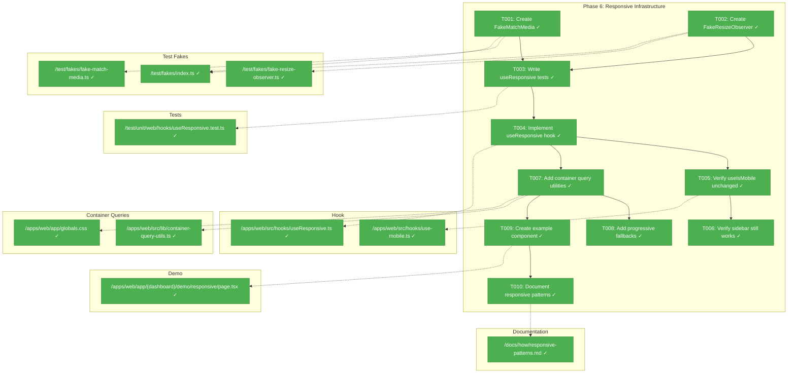
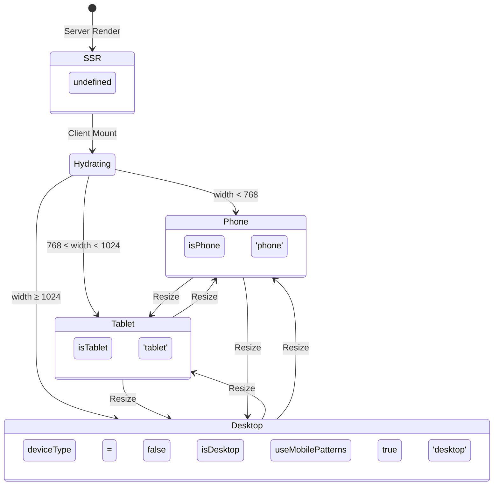
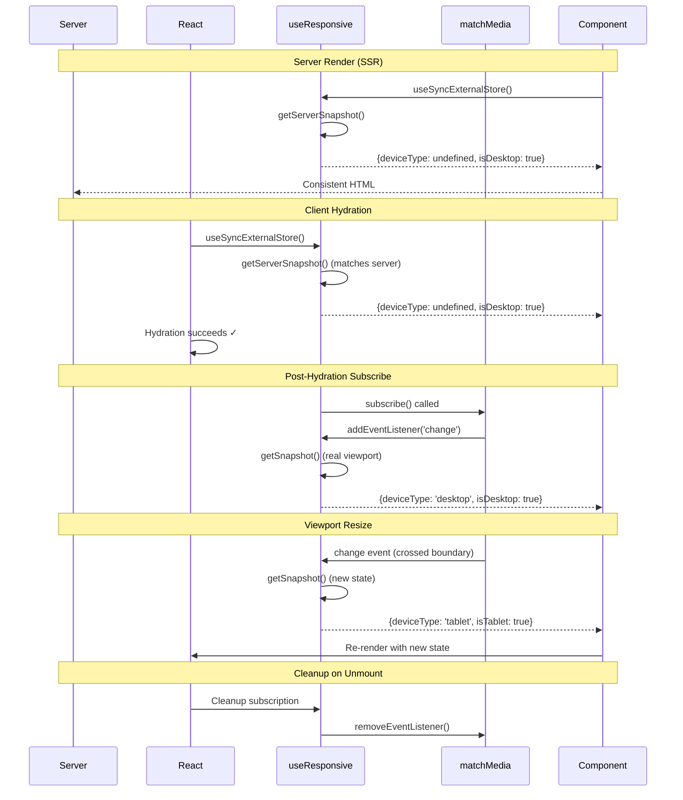

# Phase 6: Responsive Infrastructure – Tasks & Alignment Brief

**Spec**: [../../web-extras-spec.md](../../web-extras-spec.md)
**Plan**: [../../web-extras-plan.md](../../web-extras-plan.md)
**Date**: 2026-01-26

---

## Executive Briefing

### Purpose
This phase creates the foundational responsive infrastructure that enables three-tier device detection (phone/tablet/desktop) and container query patterns. This is the prerequisite for Phase 7's mobile navigation templates and enables all future responsive development across the Chainglass web application.

### What We're Building
A `useResponsive()` hook that:
- Detects viewport as phone (<768px), tablet (768-1023px), or desktop (≥1024px)
- Provides `useMobilePatterns` boolean that is `true` ONLY for phones (tablets use desktop patterns)
- Handles SSR safely with `undefined` initial state to prevent hydration mismatches
- Lives alongside (not replacing) the existing `useIsMobile()` hook

Plus container query utilities and documentation.

### User Value
Developers can build device-appropriate interfaces that adapt intelligently: phones get mobile navigation patterns, while tablets retain desktop experiences. Container queries enable component-level responsive design independent of viewport.

### Example
```typescript
const { isPhone, isTablet, isDesktop, useMobilePatterns, deviceType } = useResponsive();

// Phone (400px): isPhone=true, useMobilePatterns=true, deviceType='phone'
// Tablet (900px): isTablet=true, useMobilePatterns=false, deviceType='tablet'
// Desktop (1200px): isDesktop=true, useMobilePatterns=false, deviceType='desktop'
// SSR: all false, deviceType=undefined
```

---

## Objectives & Scope

### Objective
Implement three-tier responsive system per acceptance criteria AC-35 through AC-42, without modifying the existing `useIsMobile()` hook or `MOBILE_BREAKPOINT` constant.

### Behavior Checklist
- [x] AC-35: Three-tier breakpoint system (phone <768, tablet 768-1023, desktop ≥1024)
- [x] AC-36: useResponsive provides isPhone, isTablet, isDesktop, useMobilePatterns, deviceType
- [x] AC-36b: useResponsive uses `useSyncExternalStore` with explicit `getServerSnapshot` for SSR safety
- [x] AC-37: useMobilePatterns is true only for phones (tablets use desktop patterns)
- [x] AC-38: useIsMobile unchanged (backward compat)
- [x] AC-39: Breakpoint changes trigger re-renders (no "tearing" in concurrent mode)
- [x] AC-40: Container query utility available
- [x] AC-41: Container queries work independently of viewport
- [x] AC-42: Example component demonstrates pattern

### Goals

- ✅ Create `FakeMatchMedia` and `FakeResizeObserver` fakes in `test/fakes/`
- ✅ Create `useResponsive` hook with SSR-safe initialization
- ✅ Verify existing `useIsMobile` remains unchanged and all sidebar tests pass
- ✅ Add container query CSS utilities
- ✅ Create example container query component demonstrating patterns
- ✅ Document responsive patterns in `docs/how/`

### Non-Goals (Scope Boundaries)

- ❌ Modifying `MOBILE_BREAKPOINT` constant (CRITICAL: would break sidebar)
- ❌ Replacing `useIsMobile()` hook (new hook is additive)
- ❌ Implementing bottom tab bar navigation (Phase 7)
- ❌ Mobile-specific component variants (Phase 7)
- ❌ Touch gesture handling beyond basic tap targets (future)
- ❌ Offline/PWA responsive patterns (out of scope)
- ❌ Responsive image loading (out of scope)
- ❌ Server-side device detection (client-only pattern)

---

## Deep Research Findings

### Key Insight: Use `useSyncExternalStore` Instead of `useState` + `useEffect`

**Source**: Deep research via Perplexity (2026-01-26)

React 19's `useSyncExternalStore` is the recommended API for subscribing to external stores like `window.matchMedia`. It provides:

1. **Tearing Prevention**: Guarantees all components see the same viewport state in a single render pass during concurrent rendering
2. **Explicit SSR Handling**: The `getServerSnapshot` argument is called during both server rendering AND client hydration
3. **Cleaner Subscription Management**: React handles re-subscription only when the subscribe function changes

**Recommended Pattern**:
```typescript
import { useSyncExternalStore } from 'react';

export function useResponsive(): ResponsiveState {
  return useSyncExternalStore(
    subscribeToResponsiveChanges,  // Subscribe function (returns cleanup)
    getResponsiveSnapshot,          // Client snapshot (reads current state)
    getServerResponsiveSnapshot     // Server snapshot (SSR default)
  );
}

function getServerResponsiveSnapshot(): ResponsiveState {
  return {
    isPhone: false,
    isTablet: false,
    isDesktop: true,       // Default to desktop
    useMobilePatterns: false,
    deviceType: undefined   // Mark as server context
  };
}
```

### Why Multiple `matchMedia` Listeners Are Efficient

Unlike `resize` events that fire continuously (hundreds per second during drag), `matchMedia` fires only when conditions transition true↔false. **No debouncing needed**.

```typescript
// Each listener fires only on boundary transitions
const phoneQuery = window.matchMedia('(max-width: 767px)');
const tabletQuery = window.matchMedia('(min-width: 768px) and (max-width: 1023px)');
```

### FakeMatchMedia Implementation Requirements

The fake must implement the full `MediaQueryList` interface:
- Maintain independent state per query string
- Support both modern (`addEventListener`) and deprecated (`addListener`) APIs
- Evaluate `min-width`, `max-width`, and range queries
- Fire change events only when conditions transition

### Container Query Detection

```typescript
function supportsContainerQueries(): boolean {
  if (!CSS || !CSS.supports) return false;
  return CSS.supports('container-type: inline-size');
}
```

### Common Pitfalls to Avoid

| Pitfall | Consequence | Solution |
|---------|-------------|----------|
| Unstable subscribe function | Causes re-subscriptions every render | Define outside component or memoize |
| Missing listener cleanup | Memory leaks | Return cleanup from subscribe function |
| Direct window access during SSR | Server crash | Use `getServerSnapshot` pattern |
| Debouncing matchMedia | Unnecessary latency | matchMedia already fires only on transitions |
| Separate state per tier | Race conditions, inconsistent UI | Single state object or `useSyncExternalStore` |

---

## Architecture Map

### Component Diagram
<!-- Status: grey=pending, orange=in-progress, green=completed, red=blocked -->
<!-- Updated by plan-6 during implementation -->



### Task-to-Component Mapping

<!-- Status: ⬜ Pending | 🟧 In Progress | ✅ Complete | 🔴 Blocked -->

| Task | Component(s) | Files | Status | Comment |
|------|-------------|-------|--------|---------|
| T001 | FakeMatchMedia | /test/fakes/fake-match-media.ts, /test/fakes/index.ts | ✅ Complete | Fake for window.matchMedia testing |
| T002 | FakeResizeObserver | /test/fakes/fake-resize-observer.ts, /test/fakes/index.ts | ✅ Complete | Fake for container query testing |
| T003 | Test Suite | /test/unit/web/hooks/useResponsive.test.ts | ✅ Complete | RED phase: tests written before hook |
| T004 | useResponsive | /apps/web/src/hooks/useResponsive.ts | ✅ Complete | GREEN phase: useSyncExternalStore implementation |
| T005 | useIsMobile | /apps/web/src/hooks/use-mobile.ts | ✅ Complete | Verify unchanged, run existing tests |
| T006 | Sidebar | /apps/web/src/components/ui/sidebar.tsx | ✅ Complete | Manual verification of sidebar behavior |
| T007 | Container Utils | /apps/web/src/lib/container-query-utils.ts, /apps/web/app/globals.css | ✅ Complete | CSS utilities for @container |
| T008 | Fallbacks | /apps/web/src/lib/container-query-utils.ts | ✅ Complete | Media query fallbacks for old browsers |
| T009 | Example Component | /apps/web/app/(dashboard)/demo/responsive/page.tsx | ✅ Complete | Demo demonstrating all patterns |
| T010 | Documentation | /docs/how/responsive-patterns.md | ✅ Complete | Pattern documentation |

---

## Tasks

| Status | ID | Task | CS | Type | Dependencies | Absolute Path(s) | Validation | Subtasks | Notes |
|--------|------|-----------------------------------|-----|------|--------------|-------------------------------|-------------------------------|----------|----------------------|
| [x] | T001 | Create FakeMatchMedia fake class | 2 | Setup | – | /home/jak/substrate/008-web-extras/test/fakes/fake-match-media.ts, /home/jak/substrate/008-web-extras/test/fakes/index.ts | Exports FakeMatchMedia with matchMedia(), setWidth() methods; evaluates min-width/max-width queries | – | Per plan § 4 Testing Philosophy |
| [x] | T002 | Create FakeResizeObserver fake class | 2 | Setup | – | /home/jak/substrate/008-web-extras/test/fakes/fake-resize-observer.ts, /home/jak/substrate/008-web-extras/test/fakes/index.ts | Exports FakeResizeObserver with observe(), unobserve(), simulateResize() | – | For container query testing |
| [x] | T003 | Write failing tests for useResponsive hook | 2 | Test | T001, T002 | /home/jak/substrate/008-web-extras/test/unit/web/hooks/useResponsive.test.ts | Tests fail with "cannot find module" error; covers AC-35 through AC-39 | – | RED phase; uses FakeMatchMedia |
| [x] | T004 | Implement useResponsive hook with useSyncExternalStore | 3 | Core | T003 | /home/jak/substrate/008-web-extras/apps/web/src/hooks/useResponsive.ts | All T003 tests pass; SSR returns undefined deviceType; no tearing in concurrent mode | – | GREEN phase; useSyncExternalStore per research |
| [x] | T005 | Verify useIsMobile hook unchanged | 1 | Verification | T004 | /home/jak/substrate/008-web-extras/apps/web/src/hooks/use-mobile.ts | Existing tests pass; file diff shows no changes | – | AC-38: backward compat |
| [x] | T006 | Verify sidebar functionality preserved | 1 | Verification | T005 | /home/jak/substrate/008-web-extras/apps/web/src/components/ui/sidebar.tsx | Manual test: mobile/desktop sidebar toggle works correctly | – | CRITICAL: sidebar must not break |
| [x] | T007 | Add container query CSS utilities | 2 | Core | T004 | /home/jak/substrate/008-web-extras/apps/web/src/lib/container-query-utils.ts, /home/jak/substrate/008-web-extras/apps/web/app/globals.css | Container query classes available; @container works in CSS | – | AC-40 |
| [x] | T008 | Add progressive enhancement fallbacks | 2 | Core | T007 | /home/jak/substrate/008-web-extras/apps/web/src/lib/container-query-utils.ts | Media query fallback works; hasContainerQuerySupport() utility available | – | AC-41; per Discovery 09 |
| [x] | T009 | Create example container query component | 2 | Demo | T007 | /home/jak/substrate/008-web-extras/apps/web/app/(dashboard)/demo/responsive/page.tsx | Demo page at /demo/responsive shows all breakpoints and container query usage | – | AC-42 |
| [x] | T010 | Document responsive patterns in docs/how/ | 2 | Doc | T009 | /home/jak/substrate/008-web-extras/docs/how/responsive-patterns.md | Documentation covers useResponsive, container queries, examples | – | AC-47 |

---

## Alignment Brief

### Prior Phases Review

#### Cross-Phase Synthesis

**Phase-by-Phase Summary (Evolution)**:

1. **Phase 1 (Headless Viewer Hooks)**: Established the hook architecture pattern following `useBoardState`. Created `useFileViewerState`, `useMarkdownViewerState`, and `useDiffViewerState`. Key insight: hooks are pure state management, no theme tracking (theme is UI concern handled by components).

2. **Phase 2 (FileViewer Component)**: Implemented server-side Shiki syntax highlighting with dual-theme CSS variables. Established the "pre-highlighted HTML as prop" pattern for Server → Client component communication. Created the `apps/web/src/components/viewers/` directory structure.

3. **Phase 3 (MarkdownViewer Component)**: Added Server/Client component composition pattern (MarkdownServer + MarkdownViewer). Discovered that react-markdown custom components are synchronous - cannot await async server actions. Used @shikijs/rehype for code fence highlighting. Established MCP validation workflow during demo page development.

4. **Phase 4 (Mermaid Integration)**: Added Mermaid diagram rendering with dynamic import pattern for lazy loading. Established module-level singleton pattern for expensive libraries. Key discovery: Mermaid doesn't support CSS variable theming, requires re-render on theme change.

5. **Phase 5 (DiffViewer Component)**: Created interface-first design with `FakeDiffAction` for testing. Established defense-in-depth security pattern (PathResolverAdapter + execFile). Fixed memory leaks (DiffFile cleanup) and performance issues (Shiki singleton). Created props-based testing pattern for viewer components.

**Cumulative Deliverables Available to Phase 6**:

| Phase | Files | Purpose |
|-------|-------|---------|
| Phase 1 | `/apps/web/src/hooks/useFileViewerState.ts` | Hook pattern exemplar |
| Phase 1 | `/apps/web/src/hooks/use-mobile.ts` | MUST NOT MODIFY - sidebar depends on this |
| Phase 1 | `/packages/shared/src/lib/language-detection.ts` | Pure utility example in shared package |
| Phase 2 | `/apps/web/src/components/viewers/` | Component directory structure |
| Phase 5 | `/packages/shared/src/fakes/fake-diff-action.ts` | Fake class pattern for testing |
| All | `/test/fakes/` | Location for test fakes |

**Complete Dependency Tree**:

```
Phase 6 depends on:
├── Phase 1: Hook patterns (useFileViewerState, useCallback, useState patterns)
├── Phase 2: Component structure in apps/web/src/
├── Phase 5: Fake class pattern in test/fakes/ and @chainglass/shared
└── Existing: use-mobile.ts hook (READ ONLY - must not modify)
```

**Pattern Evolution**:
- Phase 1 → 5: Used `useState` + `useCallback` + `useEffect` patterns
- Phase 6: Upgrades to `useSyncExternalStore` for external subscriptions (React 19 best practice)
- Phase 5 → 6: Same fake class pattern for dependency injection in tests

**Recurring Issues to Address**:
- SSR hydration mismatches (Phases 2-5 all handled this with `undefined` initial state)
- Heavy library lazy loading (Phase 4 Mermaid, Phase 5 Shiki → Phase 6 must NOT import matchMedia at module level)

**Cross-Phase Learnings Applied**:
- Per Phase 1 DYK Insight #4: Hooks do not track theme - component handles via `useTheme()`
- Per Phase 5 FIX-002: Module-level singletons for expensive operations
- Per Phase 2: Two-render pattern for SSR safety

**Foundation for Current Phase**:
- `use-mobile.ts` at line 3 defines `MOBILE_BREAKPOINT = 768` - this MUST NOT change
- `sidebar.tsx` at line 64 calls `useIsMobile()` - new hook must be additive, not replacement
- `FakeEventSource` in `/test/fakes/` shows pattern for fake implementations

**Reusable Test Infrastructure from Prior Phases**:
- `test/fakes/fake-event-source.ts` - Example of fake class with setWidth-style simulation
- `test/fakes/fake-local-storage.ts` - Example of browser API fake
- `test/fixtures/highlighted-html-fixtures.ts` - Fixture pattern

**Architectural Continuity**:
- **NEW**: Use `useSyncExternalStore` for external subscriptions (React 19 best practice)
- Maintain: Cleanup in subscription return for event listeners
- Maintain: Fakes-only testing policy (no vi.mock)
- Avoid: Calling hooks from within hooks for "extension" (use shared utilities)
- Avoid: Modifying any existing hooks or constants
- Avoid: Debouncing matchMedia (already fires only on transitions)

### Critical Findings Affecting This Phase

#### 🚨 Critical Discovery 02: useResponsive Cannot Modify MOBILE_BREAKPOINT

**From Plan § 3**: Existing `useIsMobile()` uses hardcoded `MOBILE_BREAKPOINT = 768`. Sidebar depends on this exact value. Changing it breaks layout.

**Constrains**: T004 (hook implementation), T005 (verification)

**Requirement**: Create NEW hook alongside existing; new constants defined only in new file.

**Addressed by**: T004 creates separate file `/apps/web/src/hooks/useResponsive.ts` with its own constants.

#### 🚨 Critical Discovery 03: Hydration Mismatch with Responsive Hook

**From Plan § 3**: Server doesn't know viewport size. Client renders different layout than server during hydration.

**Constrains**: T004 (hook implementation)

**Requirement**: Use explicit SSR handling to prevent hydration mismatches.

**Addressed by**: T004 implements `useSyncExternalStore` with `getServerSnapshot` that returns consistent defaults (desktop-like with `deviceType: undefined`). React calls this during both SSR and hydration, ensuring matching output.

**Research Update**: The `useSyncExternalStore` API makes this explicit - the third argument (`getServerSnapshot`) is specifically designed for this use case and is called during server rendering and hydration.

#### Medium Discovery 09: Container Query Fallback Required

**From Plan § 3**: Container queries not supported in older browsers (Safari 15, etc.)

**Constrains**: T007, T008

**Requirement**: Progressive enhancement - media query fallback first, container query enhancement second.

**Addressed by**: T008 implements `hasContainerQuerySupport()` utility and media query fallbacks.

### ADR Decision Constraints

No ADRs directly affect Phase 6 implementation. ADR-0005 (Next.js MCP Developer Experience Loop) applies to MCP validation workflow used in T009 demo page development.

### Invariants & Guardrails

| Guard | Constraint | Verification |
|-------|-----------|--------------|
| MOBILE_BREAKPOINT | Must remain 768 in use-mobile.ts | T005: file diff shows no changes |
| Sidebar behavior | Mobile/desktop toggle must work | T006: manual verification |
| SSR safety | No hydration mismatch warnings | T004: hook returns undefined during SSR |
| Bundle size | useResponsive < 2KB | T004: verify with bundle analyzer if concerned |

### Visual Alignment Aids

#### System State Flow Diagram



#### Interaction Sequence Diagram (useSyncExternalStore Pattern)



### Test Plan (Full TDD - Fakes Only)

Per constitution R-TEST-007, use fake implementations instead of vi.mock().

#### Test Structure

| Test Name | Purpose | Fixture/Fake | Expected Output |
|-----------|---------|--------------|-----------------|
| should return undefined during SSR | AC-36b SSR safety | No matchMedia provided | `deviceType: undefined` |
| should detect phone viewport | AC-35, AC-37 phone detection | FakeMatchMedia at 400px | `isPhone: true, useMobilePatterns: true` |
| should detect tablet viewport | AC-35, AC-37 tablet detection | FakeMatchMedia at 900px | `isTablet: true, useMobilePatterns: false` |
| should detect desktop viewport | AC-35 desktop detection | FakeMatchMedia at 1200px | `isDesktop: true, useMobilePatterns: false` |
| should trigger re-render on viewport resize | AC-39 resize handling | FakeMatchMedia.setWidth() | State updates after resize |
| should cleanup listeners on unmount | Memory leak prevention | FakeMatchMedia, unmount hook | removeEventListener called |

#### Fake Implementations Required

1. **FakeMatchMedia** (`/test/fakes/fake-match-media.ts`):

```typescript
export class FakeMatchMedia {
  private mediaQueryStates: Record<string, boolean> = {};
  private listeners: Record<string, Set<(e: MediaQueryListEvent) => void>> = {};
  private currentWidth: number;

  constructor(initialWidth: number = 1024) {
    this.currentWidth = initialWidth;
  }

  matchMedia(query: string): MediaQueryList {
    if (!(query in this.mediaQueryStates)) {
      this.mediaQueryStates[query] = this.evaluateQuery(query);
      this.listeners[query] = new Set();
    }

    return {
      media: query,
      matches: this.mediaQueryStates[query],
      onchange: null,
      addEventListener: (type: string, listener: (e: MediaQueryListEvent) => void) => {
        if (type === 'change') this.listeners[query].add(listener);
      },
      removeEventListener: (type: string, listener: (e: MediaQueryListEvent) => void) => {
        if (type === 'change') this.listeners[query].delete(listener);
      },
      // Deprecated but needed for compatibility
      addListener: (listener: (e: MediaQueryListEvent) => void) => {
        this.listeners[query].add(listener);
      },
      removeListener: (listener: (e: MediaQueryListEvent) => void) => {
        this.listeners[query].delete(listener);
      },
      dispatchEvent: () => true,
    } as unknown as MediaQueryList;
  }

  setViewportWidth(width: number): void {
    this.currentWidth = width;
    const oldStates = { ...this.mediaQueryStates };

    // Re-evaluate all registered queries
    Object.keys(this.mediaQueryStates).forEach(query => {
      this.mediaQueryStates[query] = this.evaluateQuery(query);

      // Fire change event if state changed
      if (oldStates[query] !== this.mediaQueryStates[query]) {
        const event = { matches: this.mediaQueryStates[query], media: query } as MediaQueryListEvent;
        this.listeners[query].forEach(listener => listener(event));
      }
    });
  }

  private evaluateQuery(query: string): boolean {
    const maxMatch = query.match(/\(max-width:\s*(\d+)px\)/);
    const minMatch = query.match(/\(min-width:\s*(\d+)px\)/);

    if (maxMatch && minMatch) {
      // Range query: (min-width: X) and (max-width: Y)
      return this.currentWidth >= parseInt(minMatch[1]) && this.currentWidth <= parseInt(maxMatch[1]);
    } else if (maxMatch) {
      return this.currentWidth <= parseInt(maxMatch[1]);
    } else if (minMatch) {
      return this.currentWidth >= parseInt(minMatch[1]);
    }
    return true;
  }
}
```

2. **FakeResizeObserver** (`/test/fakes/fake-resize-observer.ts`):
   - `observe(element: Element): void` - Registers element for observation
   - `unobserve(element: Element): void` - Removes element from observation
   - `simulateResize(element: Element, width: number, height: number): void` - Fires resize callback

#### Example Test Implementation

```typescript
import { describe, it, expect, beforeEach, afterEach } from 'vitest';
import { renderHook, act, waitFor } from '@testing-library/react';
import { useResponsive } from '@/hooks/useResponsive';
import { FakeMatchMedia } from '@/test/fakes/fake-match-media';

describe('useResponsive', () => {
  let fakeMatchMedia: FakeMatchMedia;

  beforeEach(() => {
    fakeMatchMedia = new FakeMatchMedia(1920); // Start at desktop
    (window as any).matchMedia = (q: string) => fakeMatchMedia.matchMedia(q);
  });

  afterEach(() => {
    delete (window as any).matchMedia;
  });

  it('should detect phone viewport', () => {
    fakeMatchMedia.setViewportWidth(375);
    const { result } = renderHook(() => useResponsive());

    expect(result.current.isPhone).toBe(true);
    expect(result.current.useMobilePatterns).toBe(true);
    expect(result.current.deviceType).toBe('phone');
  });

  it('should detect tablet viewport (uses desktop patterns)', () => {
    fakeMatchMedia.setViewportWidth(800);
    const { result } = renderHook(() => useResponsive());

    expect(result.current.isTablet).toBe(true);
    expect(result.current.useMobilePatterns).toBe(false); // Critical!
    expect(result.current.deviceType).toBe('tablet');
  });

  it('should update on viewport resize', async () => {
    const { result } = renderHook(() => useResponsive());
    expect(result.current.deviceType).toBe('desktop');

    act(() => fakeMatchMedia.setViewportWidth(375));

    await waitFor(() => {
      expect(result.current.deviceType).toBe('phone');
    });
  });

  it('should handle breakpoint boundaries correctly', () => {
    // At exactly 768px = tablet (not phone)
    fakeMatchMedia.setViewportWidth(768);
    const { result: tablet } = renderHook(() => useResponsive());
    expect(tablet.current.isTablet).toBe(true);

    // At 767px = phone
    fakeMatchMedia.setViewportWidth(767);
    const { result: phone } = renderHook(() => useResponsive());
    expect(phone.current.isPhone).toBe(true);
  });
});
```

### Reference Implementation (from Research)

Based on deep research, here is the production-ready hook implementation:

```typescript
// apps/web/src/hooks/useResponsive.ts
'use client';

import { useSyncExternalStore } from 'react';

export type DeviceType = 'phone' | 'tablet' | 'desktop' | undefined;

export interface ResponsiveState {
  isPhone: boolean;
  isTablet: boolean;
  isDesktop: boolean;
  useMobilePatterns: boolean;
  deviceType: DeviceType;
}

// Breakpoints (768 matches existing useIsMobile)
export const PHONE_BREAKPOINT = 768;
export const TABLET_BREAKPOINT = 1024;

/**
 * Gets current viewport state. Pure function for getSnapshot.
 */
function getResponsiveSnapshot(): ResponsiveState {
  if (typeof window === 'undefined') {
    return getServerResponsiveSnapshot();
  }

  const width = window.innerWidth;
  const isPhone = width < PHONE_BREAKPOINT;
  const isTablet = width >= PHONE_BREAKPOINT && width < TABLET_BREAKPOINT;
  const isDesktop = width >= TABLET_BREAKPOINT;

  return {
    isPhone,
    isTablet,
    isDesktop,
    useMobilePatterns: isPhone, // Only phones get mobile patterns
    deviceType: isPhone ? 'phone' : isTablet ? 'tablet' : 'desktop'
  };
}

/**
 * Server-side snapshot for hydration safety.
 * Called during SSR and hydration to ensure matching output.
 */
function getServerResponsiveSnapshot(): ResponsiveState {
  return {
    isPhone: false,
    isTablet: false,
    isDesktop: true,        // Default to desktop
    useMobilePatterns: false,
    deviceType: undefined   // Marks as server/unknown context
  };
}

/**
 * Subscribes to viewport changes via matchMedia.
 * Returns cleanup function.
 */
function subscribeToResponsiveChanges(callback: () => void): () => void {
  const phoneQuery = window.matchMedia(`(max-width: ${PHONE_BREAKPOINT - 1}px)`);
  const tabletQuery = window.matchMedia(
    `(min-width: ${PHONE_BREAKPOINT}px) and (max-width: ${TABLET_BREAKPOINT - 1}px)`
  );

  const handleChange = () => callback();

  phoneQuery.addEventListener('change', handleChange);
  tabletQuery.addEventListener('change', handleChange);

  return () => {
    phoneQuery.removeEventListener('change', handleChange);
    tabletQuery.removeEventListener('change', handleChange);
  };
}

/**
 * Hook for three-tier responsive device detection.
 *
 * Uses useSyncExternalStore for:
 * - SSR hydration safety (explicit getServerSnapshot)
 * - Concurrent rendering consistency (no tearing)
 * - Efficient subscription management
 *
 * @example
 * const { deviceType, isPhone, useMobilePatterns } = useResponsive();
 * if (useMobilePatterns) return <MobileNav />;
 * return <DesktopNav />;
 */
export function useResponsive(): ResponsiveState {
  return useSyncExternalStore(
    subscribeToResponsiveChanges,
    getResponsiveSnapshot,
    getServerResponsiveSnapshot
  );
}
```

### Step-by-Step Implementation Outline

| Step | Task | Action | Validation |
|------|------|--------|------------|
| 1 | T001 | Create FakeMatchMedia class following FakeEventSource pattern | Unit test FakeMatchMedia directly |
| 2 | T002 | Create FakeResizeObserver class | Unit test FakeResizeObserver directly |
| 3 | T003 | Write 6+ tests for useResponsive using FakeMatchMedia | Tests fail with import error (RED) |
| 4 | T004 | Implement useResponsive.ts with SSR-safe pattern | All tests pass (GREEN) |
| 5 | T005 | Run existing sidebar tests; check use-mobile.ts unchanged | `pnpm test`, git diff shows no changes |
| 6 | T006 | Manual test: sidebar toggle at mobile/desktop sizes | Visual verification |
| 7 | T007 | Add container-query-utils.ts and @container CSS | Container queries work in CSS |
| 8 | T008 | Add hasContainerQuerySupport() and media query fallbacks | Feature detection utility works |
| 9 | T009 | Create /demo/responsive page showing all patterns | MCP: route registered, get_errors clean |
| 10 | T010 | Write docs/how/responsive-patterns.md | Documentation complete |

### Commands to Run

```bash
# Environment setup (if needed)
cd /home/jak/substrate/008-web-extras
nvm use  # Uses .nvmrc (Node 20.19+)

# Run all tests
pnpm vitest run

# Run specific hook tests
pnpm vitest run test/unit/web/hooks/useResponsive.test.ts

# Run existing sidebar/mobile tests to verify no regressions
pnpm vitest run --reporter=verbose | grep -i "mobile\|sidebar"

# Lint check
pnpm lint

# Type check
pnpm typecheck

# Build verification
pnpm build

# Quick pre-commit validation
just fft  # fix, format, test

# Full quality suite
just check
```

### Risks/Unknowns

| Risk | Severity | Likelihood | Mitigation |
|------|----------|------------|------------|
| Breaking sidebar with MOBILE_BREAKPOINT change | CRITICAL | Low (if followed) | T005/T006 verification; never modify use-mobile.ts |
| Hydration mismatch warnings | HIGH | **Low** (with useSyncExternalStore) | `getServerSnapshot` explicitly handles SSR; research confirms this eliminates mismatches |
| UI "tearing" during concurrent rendering | MEDIUM | **Low** (with useSyncExternalStore) | React 19's `useSyncExternalStore` guarantees atomic snapshots |
| Container query browser support | MEDIUM | Low | Progressive enhancement with media query fallbacks |
| matchMedia polyfill needed | LOW | Very Low | Universal browser support since 2015 |
| Subscribe function causing re-subscriptions | LOW | Low | Define subscribe function at module level (not inside hook) |

### Ready Check

- [x] ADR constraints mapped to tasks (IDs noted in Notes column) - N/A (no ADRs affect this phase)
- [x] Critical Discovery 02 addressed by T004, T005 (new hook, verify unchanged)
- [x] Critical Discovery 03 addressed by T004 (`useSyncExternalStore` with `getServerSnapshot`)
- [x] Medium Discovery 09 addressed by T008 (progressive enhancement)
- [x] Prior phase reviews completed (Phases 1-5 reviewed)
- [x] FakeMatchMedia pattern defined with full MediaQueryList interface implementation
- [x] `useIsMobile()` identified as READ-ONLY dependency
- [x] Deep research completed (Perplexity 2026-01-26) - `useSyncExternalStore` is recommended over `useState` + `useEffect`
- [x] Reference implementation provided with complete hook code
- [x] Test examples provided with FakeMatchMedia usage

---

## Phase Footnote Stubs

| Footnote | Task | File | Description |
|----------|------|------|-------------|
| | | | _To be populated by plan-6 during implementation_ |

---

## Evidence Artifacts

Implementation evidence will be written to:
- **Execution Log**: `./execution.log.md`
- **Test Results**: Console output captured in execution log
- **MCP Validation**: Route verification via `get_routes`, error checks via `get_errors`

---

## Discoveries & Learnings

_Populated during implementation by plan-6. Log anything of interest to your future self._

| Date | Task | Type | Discovery | Resolution | References |
|------|------|------|-----------|------------|------------|
| 2026-01-26 | T004 | gotcha | `useSyncExternalStore` requires referential equality for unchanged snapshots - returning new object each time causes infinite render loops | Cache snapshot at module level, only create new object when deviceType changes | log#task-t004 |

**Types**: `gotcha` | `research-needed` | `unexpected-behavior` | `workaround` | `decision` | `debt` | `insight`

**What to log**:
- Things that didn't work as expected
- External research that was required
- Implementation troubles and how they were resolved
- Gotchas and edge cases discovered
- Decisions made during implementation
- Technical debt introduced (and why)
- Insights that future phases should know about

_See also: `execution.log.md` for detailed narrative._

---

## Directory Structure

```
docs/plans/006-web-extras/
├── web-extras-plan.md
├── web-extras-spec.md
└── tasks/
    ├── phase-1-headless-viewer-hooks/
    │   ├── tasks.md
    │   └── execution.log.md
    ├── phase-2-fileviewer-component/
    │   ├── tasks.md
    │   ├── execution.log.md
    │   └── research-dossier.md
    ├── phase-3-markdownviewer-component/
    │   ├── tasks.md
    │   └── execution.log.md
    ├── phase-4-mermaid-integration/
    │   ├── tasks.md
    │   └── execution.log.md
    ├── phase-5-diffviewer-component/
    │   ├── tasks.md
    │   └── execution.log.md
    └── phase-6-responsive-infrastructure/
        ├── tasks.md            # This file
        └── execution.log.md    # Created by plan-6
```

---

*Tasks & Alignment Brief generated by plan-5-phase-tasks-and-brief*
*Next Step: Run `/plan-6-implement-phase --phase 6` after human GO*
