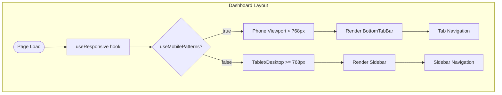
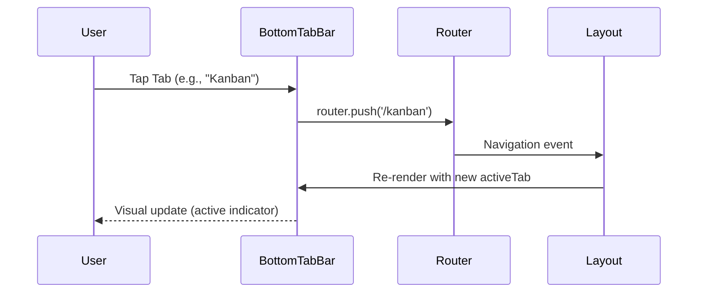

# Phase 7: Mobile Templates & Documentation – Tasks & Alignment Brief

**Spec**: [../../web-extras-spec.md](../../web-extras-spec.md)
**Plan**: [../../web-extras-plan.md](../../web-extras-plan.md)
**Date**: 2026-01-26

---

## Executive Briefing

### Purpose
This phase delivers the final responsive infrastructure piece: a mobile-optimized navigation component (BottomTabBar) and comprehensive documentation for all viewer patterns. This completes the 006-web-extras feature set, enabling phone users to navigate the dashboard while documenting the patterns established across all phases.

### What We're Building
A `BottomTabBar` component that:
- Renders at the bottom of the screen on phone-sized viewports only
- Provides tap navigation with 48px minimum touch targets
- Shows active state indication for the current route
- Replaces sidebar navigation on phones (sidebar remains for tablet/desktop)

Plus consolidated documentation covering:
- FileViewer, MarkdownViewer, DiffViewer usage patterns
- Responsive infrastructure (useResponsive, container queries)
- Integration examples and best practices

### User Value
Phone users can navigate the Chainglass dashboard without needing to access the sidebar, which is hidden on narrow viewports. Developers get clear documentation for using the viewer components and responsive patterns.

### Example
**Before (phone viewport)**: No visible navigation, sidebar is hidden
**After (phone viewport)**: Bottom tab bar with Home, Workflow, Kanban, etc. tabs visible at screen bottom

---

## Objectives & Scope

### Objective
Implement mobile navigation template (BottomTabBar) and comprehensive documentation per plan Phase 7 acceptance criteria AC-43 through AC-47.

### Behavior Checklist
- [x] AC-43: Mobile navigation uses bottom tab bar
- [x] AC-44: Tablet defaults to desktop patterns
- [x] AC-45: Navigation utilities support both paradigms
- [x] AC-46: Touch targets ≥48px
- [x] AC-47: Component variant pattern documented

### Goals

- ✅ Create BottomTabBar component for phone-only navigation
- ✅ Verify 48px minimum touch targets on all interactive elements
- ✅ Create navigation pattern utilities (phone vs desktop paradigm helpers)
- ✅ Document viewer patterns in docs/how/ (consolidate existing + add new)
- ✅ Document responsive patterns in docs/how/ (already partially done in Phase 6)
- ✅ Verify tablet uses sidebar (desktop patterns), not bottom tab bar

### Non-Goals (Scope Boundaries)

- ❌ Modifying existing useIsMobile or MOBILE_BREAKPOINT (Phase 6 constraint carries forward)
- ❌ Creating a new navigation context/provider (keep it simple, use existing router)
- ❌ Gesture navigation (swipe between tabs) - defer to future enhancement
- ❌ Animation library integration - use CSS transitions only
- ❌ Tab badge counts or notification indicators
- ❌ Persisting tab state beyond session
- ❌ Updating FileViewer/MarkdownViewer/DiffViewer components (complete)
- ❌ Performance optimization beyond touch targets

---

## Architecture Map

### Component Diagram

```mermaid
flowchart TD
    classDef pending fill:#9E9E9E,stroke:#757575,color:#fff
    classDef inprogress fill:#FF9800,stroke:#F57C00,color:#fff
    classDef completed fill:#4CAF50,stroke:#388E3C,color:#fff
    classDef blocked fill:#F44336,stroke:#D32F2F,color:#fff

    style Phase fill:#F5F5F5,stroke:#E0E0E0
    style Files fill:#F5F5F5,stroke:#E0E0E0
    style Existing fill:#E3F2FD,stroke:#90CAF9

    subgraph Phase["Phase 7: Mobile Templates & Documentation"]
        T001["T001: Write BottomTabBar tests ✓"]:::completed
        T002["T002: Implement BottomTabBar ✓"]:::completed
        T003["T003: Verify touch targets ✓"]:::completed
        T004["T004: Create nav pattern utilities ✓"]:::completed
        T005["T005: Document viewer patterns ✓"]:::completed
        T006["T006: Update responsive docs ✓"]:::completed
        T007["T007: Verify tablet uses sidebar ✓"]:::completed
        T008["T008: NavigationWrapper integration ✓"]:::completed

        T001 --> T002
        T002 --> T003
        T002 --> T004
        T003 --> T008
        T004 --> T008
        T005 --> T006
        T006 --> T008
        T007 --> T008
    end

    subgraph Files["New Files"]
        F1["/apps/web/src/components/navigation/bottom-tab-bar.tsx ✓"]:::completed
        F2["/apps/web/src/components/navigation/bottom-tab-bar.css"]:::pending
        F3["/apps/web/src/lib/navigation-utils.ts ✓"]:::completed
        F4["/docs/how/viewer-patterns.md ✓"]:::completed
        F5["/test/unit/web/components/navigation/bottom-tab-bar.test.tsx ✓"]:::completed
        F6["/apps/web/src/components/navigation-wrapper.tsx ✓"]:::completed
    end

    subgraph Existing["Existing Files to Update"]
        E1["/apps/web/src/components/dashboard-sidebar.tsx ✓"]:::completed
        E2["/apps/web/app/(dashboard)/layout.tsx ✓"]:::completed
        E3["/docs/how/responsive-patterns.md ✓"]:::completed
    end

    T001 -.-> F5
    T002 -.-> F1
    T002 -.-> F2
    T004 -.-> F3
    T005 -.-> F4
    T006 -.-> E3
    T007 -.-> E1
    T008 -.-> E2
    T008 -.-> F6
```

<!-- Status: grey=pending, orange=in-progress, green=completed, red=blocked -->
<!-- Updated by plan-6 during implementation -->



### Task-to-Component Mapping

<!-- Status: ⬜ Pending | 🟧 In Progress | ✅ Complete | 🔴 Blocked -->

| Task | Component(s) | Files | Status | Comment |
|------|-------------|-------|--------|---------|
| T001 | BottomTabBar Tests | /test/unit/web/components/navigation/bottom-tab-bar.test.tsx | ✅ Complete | RED phase - write failing tests first |
| T002 | BottomTabBar Component | /apps/web/src/components/navigation/bottom-tab-bar.tsx, .css | ✅ Complete | GREEN phase - implement to pass tests |
| T003 | Touch Targets | (verification only) | ✅ Complete | Verify 48px minimums via Tailwind classes |
| T004 | Navigation Data | /apps/web/src/lib/navigation-utils.ts | ✅ Complete | Centralize NAV_ITEMS and MOBILE_NAV_ITEMS |
| T005 | Viewer Docs | /docs/how/viewer-patterns.md | ✅ Complete | Consolidate viewer documentation |
| T006 | Responsive Docs | /docs/how/responsive-patterns.md | ✅ Complete | Add BottomTabBar documentation |
| T007 | Tablet Verification | /apps/web/src/components/dashboard-sidebar.tsx | ✅ Complete | Verify sidebar works on tablet |
| T008 | NavigationWrapper + Layout | /apps/web/src/components/navigation-wrapper.tsx, layout.tsx | ✅ Complete | Create NavigationWrapper, update layout to use it |

---

## Tasks

| Status | ID | Task | CS | Type | Dependencies | Absolute Path(s) | Validation | Subtasks | Notes |
|--------|------|----------------------------------|-----|------|--------------|-------------------------------|-------------------------------|----------|--------|
| [x] | T001 | Write failing tests for BottomTabBar component | 2 | Test | – | /home/jak/substrate/008-web-extras/test/unit/web/components/navigation/bottom-tab-bar.test.tsx | Tests fail with expected messages; cover: touch targets, active state, navigation, phone-only rendering, accessibility | – | RED phase; copy FakeMatchMedia pattern from test/unit/web/hooks/useResponsive.test.ts:26-59 (mock BOTH window.matchMedia AND window.innerWidth) |
| [x] | T002 | Implement BottomTabBar component to pass tests | 2 | Core | T001 | /home/jak/substrate/008-web-extras/apps/web/src/components/navigation/bottom-tab-bar.tsx, /home/jak/substrate/008-web-extras/apps/web/src/components/navigation/bottom-tab-bar.css, /home/jak/substrate/008-web-extras/apps/web/src/components/navigation/index.ts | All T001 tests pass; component renders correctly | – | GREEN phase; use MOBILE_NAV_ITEMS (3 core items only) |
| [x] | T003 | Verify 48px minimum touch targets on all interactive elements | 1 | Test | T002 | /home/jak/substrate/008-web-extras/test/unit/web/components/navigation/bottom-tab-bar.test.tsx | Tests verify Tailwind classes exist (min-h-12, min-w-12); jsdom cannot compute actual dimensions | – | AC-46; use toHaveClass() pattern |
| [x] | T004 | Create navigation data utilities | 1 | Core | – | /home/jak/substrate/008-web-extras/apps/web/src/lib/navigation-utils.ts | Exports: NAV_ITEMS (7 items for sidebar), MOBILE_NAV_ITEMS (3 core items for phone), NavigationMode type | – | AC-45; data centralization, no wrapper functions needed |
| [x] | T005 | Document viewer patterns (FileViewer, MarkdownViewer, DiffViewer) | 2 | Doc | – | /home/jak/substrate/008-web-extras/docs/how/viewer-patterns.md | Doc covers: usage, props, server/client patterns, code examples | – | |
| [x] | T006 | Update responsive patterns documentation with BottomTabBar | 2 | Doc | T002 | /home/jak/substrate/008-web-extras/docs/how/responsive-patterns.md | Doc includes: BottomTabBar usage, integration example | – | AC-47 |
| [x] | T007 | Verify tablet viewport uses sidebar (not BottomTabBar) | 1 | Test | T002 | /home/jak/substrate/008-web-extras/apps/web/src/components/dashboard-sidebar.tsx | Test at 900px viewport: sidebar visible, BottomTabBar hidden | – | AC-44 |
| [x] | T008 | Create NavigationWrapper and integrate into dashboard layout | 2 | Integration | T002, T004 | /home/jak/substrate/008-web-extras/apps/web/src/components/navigation-wrapper.tsx, /home/jak/substrate/008-web-extras/apps/web/app/(dashboard)/layout.tsx | MCP validation: layout works on phone viewport; sidebar NOT rendered on phone | – | Create NavigationWrapper that switches between DashboardShell (tablet/desktop) and phone layout with BottomTabBar |

---

## Alignment Brief

### Prior Phases Review

#### Phase-by-Phase Summary

**Phase 1: Headless Viewer Hooks** (Complete)
- Created ViewerFile interface in `@chainglass/shared`
- Implemented three headless hooks: `useFileViewerState`, `useMarkdownViewerState`, `useDiffViewerState`
- Created `detectLanguage()` utility with two-tier detection (special filenames + extensions)
- Established `createViewerStateBase()` shared utility pattern
- 78 tests passing

**Phase 2: FileViewer Component** (Complete)
- Created server-side Shiki processor at `/apps/web/src/lib/server/shiki-processor.ts`
- Implemented FileViewer component with CSS counter line numbers
- Established dual-theme CSS variable pattern (`--shiki-dark`)
- Added `server-only` guard pattern for build-time safety
- 44 new tests (162 total)

**Phase 3: MarkdownViewer Component** (Complete)
- Created two-component pattern: client MarkdownViewer + server MarkdownServer
- Integrated `@shikijs/rehype` for code fence highlighting
- Added `@tailwindcss/typography` for prose styling
- First use of Next.js 16 MCP tools for validation
- 19 new tests (1017 total)

**Phase 4: Mermaid Integration** (Complete)
- Created MermaidRenderer with useId() for SSR-safe unique IDs
- Implemented remarkMermaid plugin to intercept blocks before Shiki
- Discovered Mermaid cannot use CSS variables (requires hex colors)
- Dynamic import pattern for 1.5MB library
- 12 new tests (1029 total)

**Phase 5: DiffViewer Component** (Complete)
- Created FakeDiffAction in shared package for testing
- Implemented secure git-diff-action with PathResolverAdapter + execFile
- Used @git-diff-view/react with lazy-loaded Shiki
- Discovered DiffFile.createInstance() pattern for proper diff parsing
- 23 new tests

**Phase 6: Responsive Infrastructure** (Complete)
- Created useResponsive hook with useSyncExternalStore
- Discovered snapshot caching requirement to prevent infinite loops
- Created FakeMatchMedia and FakeResizeObserver test doubles
- Implemented container query CSS utilities with progressive enhancement fallbacks
- 21 new tests (1072 total)

#### Cumulative Deliverables

**Shared Package Exports** (`@chainglass/shared`):
- `ViewerFile` interface
- `detectLanguage()` utility
- `DiffResult`, `DiffError`, `IGitDiffService` types
- `FakeDiffAction` class

**Web App Hooks** (`/apps/web/src/hooks/`):
- `useFileViewerState(file?: ViewerFile)`
- `useMarkdownViewerState(file?: ViewerFile)`
- `useDiffViewerState(file?: ViewerFile)`
- `useResponsive()` - THREE-TIER DETECTION (phone/tablet/desktop)
- `useIsMobile()` - UNCHANGED (sidebar depends on it)

**Viewer Components** (`/apps/web/src/components/viewers/`):
- `FileViewer` - syntax highlighted code display
- `MarkdownViewer` - source/preview toggle
- `MarkdownServer` - async markdown rendering
- `MermaidRenderer` - diagram rendering
- `DiffViewer` - split/unified git diff display

**Server Utilities** (`/apps/web/src/lib/server/`):
- `highlightCode(code, lang)` - Shiki dual-theme processing
- `getGitDiff(filePath)` - secure git diff action

**Test Fakes** (`/test/fakes/`):
- `FakeMatchMedia` with `setViewportWidth()` helper
- `FakeResizeObserver` with `simulateResize()` helper
- Re-exports in `/test/fakes/index.ts`

#### Pattern Evolution

1. **Server/Client Separation**: Evolved from simple Shiki processor (Phase 2) to two-component pattern (Phase 3) to full async Server Component with client interactivity.

2. **Testing Strategy**: Consistent two-tier approach - real implementation for unit tests, fixtures for component tests. FakeMatchMedia pattern from Phase 6 ready for Phase 7.

3. **Dynamic Import Pattern**: Established for Mermaid (Phase 4) and Shiki (Phase 5) - lazy load heavy libraries.

4. **useSyncExternalStore Pattern**: Phase 6 established this as the React 19 best practice for browser API subscriptions.

#### Reusable Infrastructure for Phase 7

| Asset | Location | Phase 7 Usage |
|-------|----------|---------------|
| FakeMatchMedia | `/test/fakes/fake-match-media.ts` | Test BottomTabBar phone-only rendering |
| useResponsive | `/apps/web/src/hooks/useResponsive.ts` | `useMobilePatterns` determines nav mode |
| NAV_ITEMS | `/apps/web/src/components/dashboard-sidebar.tsx:34-42` | Reuse for BottomTabBar tabs |
| Test fixtures | `/test/fixtures/` | Follow established patterns |

#### Recurring Issues

1. **Snapshot Caching**: useSyncExternalStore requires referential equality - established in Phase 6, apply if needed.
2. **Biome Lint**: Consistent lint issues fixed with `pnpm biome check --write`.

### Critical Findings Affecting This Phase

None directly from Plan Section 3 affect Phase 7. However, carry forward:

- **Critical Discovery 02**: DO NOT modify `MOBILE_BREAKPOINT` in `use-mobile.ts`
- **Critical Discovery 03**: SSR hydration - handled by Phase 6's useResponsive hook

### ADR Decision Constraints

**ADR-0005: Next.js MCP Developer Experience Loop**
- Constrains: Validation workflow must use MCP tools
- Addressed by: T008 uses `nextjs_index` and `nextjs_call` for validation

### Invariants & Guardrails

- **Touch targets**: All interactive elements must be ≥48px (AC-46)
- **Tablet behavior**: Must NOT show BottomTabBar on tablet (AC-44)
- **Existing tests**: All 1072+ existing tests must continue passing

### Inputs to Read

| File | Purpose |
|------|---------|
| `/home/jak/substrate/008-web-extras/apps/web/src/components/dashboard-sidebar.tsx` | NAV_ITEMS array to reuse |
| `/home/jak/substrate/008-web-extras/apps/web/src/hooks/useResponsive.ts` | useMobilePatterns decision point |
| `/home/jak/substrate/008-web-extras/test/fakes/fake-match-media.ts` | Test double pattern |
| `/home/jak/substrate/008-web-extras/docs/how/responsive-patterns.md` | Existing docs to extend |

### Visual Alignment Aids

#### System Flow: Navigation Mode Selection



#### Sequence: BottomTabBar Navigation



### Test Plan (Full TDD Approach)

| Test Name | Fixture | Expected Output | Rationale |
|-----------|---------|-----------------|-----------|
| should render tab list on phone viewport | FakeMatchMedia(375) | tablist visible | AC-43 |
| should not render on tablet viewport | FakeMatchMedia(900) | no tablist | AC-44 |
| should not render on desktop viewport | FakeMatchMedia(1200) | no tablist | AC-44 |
| should have touch targets ≥48px | FakeMatchMedia(375) | tabs have min-h-12 min-w-12 classes | AC-46 |
| should show active state for current tab | FakeMatchMedia(375) | aria-selected="true" on active | UX |
| should navigate on tab press | userEvent.click | router.push called | Core |
| should have ARIA tablist role | FakeMatchMedia(375) | role="tablist" | A11y |
| should have ARIA tab roles | FakeMatchMedia(375) | role="tab" on each | A11y |
| should render core nav items as tabs | FakeMatchMedia(375) | 3 tabs (Home, Workflow, Kanban) | Core |
| should cleanup on unmount | renderHook + unmount | no listeners | Memory |

### Step-by-Step Implementation Outline

1. **T001 (RED)**: Create test file, import FakeMatchMedia, write 10+ failing tests
2. **T002 (GREEN)**: Create BottomTabBar component with CSS, pass all tests
3. **T003**: Add touch target verification tests, ensure 48px minimum
4. **T004**: Create navigation-utils.ts with helper functions
5. **T005**: Write viewer-patterns.md consolidating viewer documentation
6. **T006**: Update responsive-patterns.md with BottomTabBar section
7. **T007**: Add tablet viewport test verifying sidebar, not BottomTabBar
8. **T008**: Integrate BottomTabBar into layout.tsx, validate via MCP

### Commands to Run

```bash
# Environment setup (run from monorepo root)
pnpm install

# Test runner (run continuously during development)
pnpm test --watch

# Single test file
pnpm test test/unit/web/components/navigation/bottom-tab-bar.test.tsx

# Lint check
pnpm biome check apps/web/src/components/navigation/

# Type check
pnpm typecheck

# Development server (for MCP validation)
pnpm dev

# Pre-commit validation
just fft  # fix, format, test
```

### Risks/Unknowns

| Risk | Severity | Mitigation |
|------|----------|------------|
| CSS transitions may cause layout shift | Low | Use fixed positioning at bottom |
| NAV_ITEMS filtering for phone | RESOLVED | Filter to 3 core items (Home, Workflow, Kanban); demos excluded |
| Router mock complexity | Low | Use Next.js testing utilities |

### Ready Check

- [x] Prior phases reviewed (Phases 1-6 complete)
- [x] Critical findings noted (carry forward Discovery 02, 03)
- [x] ADR constraints mapped to tasks (T008 uses MCP validation - Per ADR-0005)
- [x] Test fixtures identified (FakeMatchMedia ready)
- [x] Implementation steps ordered
- [x] Stakeholder GO received (via DYK session 2026-01-26)

---

## Phase Footnote Stubs

_To be populated by plan-6 during implementation._

| Footnote | Date | Description | File:Line |
|----------|------|-------------|-----------|
| | | | |

---

## Evidence Artifacts

Implementation evidence will be written to:

- `execution.log.md` in this directory - detailed task-by-task narrative
- Test output captured in CI/local runs
- MCP validation screenshots (optional)

---

## Discoveries & Learnings

_Populated during implementation by plan-6. Log anything of interest to your future self._

| Date | Task | Type | Discovery | Resolution | References |
|------|------|------|-----------|------------|------------|
| | | | | | |

**Types**: `gotcha` | `research-needed` | `unexpected-behavior` | `workaround` | `decision` | `debt` | `insight`

**What to log**:
- Things that didn't work as expected
- External research that was required
- Implementation troubles and how they were resolved
- Gotchas and edge cases discovered
- Decisions made during implementation
- Technical debt introduced (and why)
- Insights that future phases should know about

_See also: `execution.log.md` for detailed narrative._

---

## Directory Layout

```
docs/plans/006-web-extras/
  ├── web-extras-spec.md
  ├── web-extras-plan.md
  └── tasks/
      ├── phase-1-headless-viewer-hooks/
      │   ├── tasks.md
      │   └── execution.log.md
      ├── phase-2-fileviewer-component/
      │   ├── tasks.md
      │   └── execution.log.md
      ├── phase-3-markdownviewer-component/
      │   ├── tasks.md
      │   └── execution.log.md
      ├── phase-4-mermaid-integration/
      │   ├── tasks.md
      │   └── execution.log.md
      ├── phase-5-diffviewer-component/
      │   ├── tasks.md
      │   └── execution.log.md
      ├── phase-6-responsive-infrastructure/
      │   ├── tasks.md
      │   └── execution.log.md
      └── phase-7-mobile-templates-documentation/  <-- Current
          ├── tasks.md
          └── execution.log.md  # Created by plan-6
```

---

## Critical Insights Discussion

**Session**: 2026-01-26
**Context**: Phase 7: Mobile Templates & Documentation - Tasks Dossier Review
**Analyst**: AI Clarity Agent
**Reviewer**: Development Team
**Format**: Water Cooler Conversation (5 Critical Insights)

### Insight 1: NAV_ITEMS Count vs Mobile Bottom Bar Constraints

**Did you know**: The tasks.md assumed all 7 NAV_ITEMS would render as tabs on phones, but this creates cramped 48px touch targets with only 39px margins on a 375px screen.

**Implications**:
- 7 tabs × 48px = 336px, leaving minimal breathing room
- Icons must be 100% self-explanatory (no labels fit)
- 4 of 7 items are demo pages, not core navigation

**Options Considered**:
- Option A: Show all 7 tabs (cramped but fits)
- Option B: Filter to 3 core items (Home, Workflow, Kanban)
- Option C: Add "More" menu tab with Sheet

**AI Recommendation**: Option B - Filter to 3 core items
- Reasoning: Clear semantic split between core nav and demos; better UX with proper spacing

**Discussion Summary**:
User confirmed demos are temporary and proper designs will come later. No need to show demo items on phone bottom bar.

**Decision**: Filter to 3 core navigation items (Home, Workflow, Kanban) for BottomTabBar

**Action Items**:
- [x] Update test expectation from 7 tabs to 3 tabs
- [x] Update T002 notes to use MOBILE_NAV_ITEMS
- [x] Mark NAV_ITEMS filtering risk as RESOLVED

**Affects**: T001, T002, Test Plan table, Risks table

---

### Insight 2: Layout Integration Requires NavigationWrapper Component

**Did you know**: T008 said "integrate into layout.tsx" but DashboardShell always renders sidebar. A paradigm switch (sidebar vs BottomTabBar) requires a decision component.

**Implications**:
- Current layout delegates to DashboardShell unconditionally
- Sidebar has mobile drawer mode but Phase 7 wants complete replacement
- Both components shouldn't render simultaneously

**Options Considered**:
- Option A: Inline conditional in layout (messy, both render)
- Option B: Create NavigationWrapper component (clean separation)
- Option C: CSS-only hide/show (both mount, waste)

**AI Recommendation**: Option B - NavigationWrapper
- Reasoning: Clean paradigm switch; sidebar doesn't render on phones; testable in isolation

**Discussion Summary**:
User agreed NavigationWrapper provides cleanest separation of navigation modes.

**Decision**: Create NavigationWrapper component that switches between DashboardShell (tablet/desktop) and phone layout with BottomTabBar

**Action Items**:
- [x] Expand T008 scope to include NavigationWrapper creation
- [x] Add navigation-wrapper.tsx to Architecture Map
- [x] Update Task-to-Component Mapping

**Affects**: T008, Architecture Map, Files section

---

### Insight 3: T004 Navigation Utilities - Data Over Functions

**Did you know**: T004 proposed wrapper functions like `shouldShowBottomNav()` but these just wrap `useResponsive().useMobilePatterns` - thin abstraction with little value.

**Implications**:
- Wrapper functions could confuse future developers ("which do I use?")
- Real value is centralizing NAV_ITEMS data needed by both components
- `useMobilePatterns` is already well-named

**Options Considered**:
- Option A: Skip T004 entirely (violates AC-45)
- Option B: Semantic wrappers + data (follows pattern but adds ceremony)
- Option C: Data centralization only (honest, practical)

**AI Recommendation**: Option C - Data centralization only
- Reasoning: Future devs should use `useResponsive().useMobilePatterns` directly; wrapper functions add ceremony without substance

**Discussion Summary**:
User asked if Option B was good practice for future developers. Honest answer: wrapper functions are marginal value; data centralization is the real need.

**Decision**: T004 focuses on data exports (NAV_ITEMS, MOBILE_NAV_ITEMS) not wrapper functions

**Action Items**:
- [x] Update T004 to "Create navigation data utilities"
- [x] Change validation to data exports
- [x] Reduce CS from 2 to 1

**Affects**: T004 scope, validation criteria, complexity score

---

### Insight 4: Testing Touch Targets in jsdom

**Did you know**: T003 claimed tests would verify "min-width/min-height >= 48px" but jsdom doesn't compute CSS layouts - `getComputedStyle()` returns authored values, not rendered dimensions.

**Implications**:
- jsdom is a DOM simulator without layout engine
- Existing tests use class verification, not computed styles
- Pattern already established in sidebar and file-viewer tests

**Options Considered**:
- Option A: Test CSS classes exist (min-h-12)
- Option B: Use inline styles with explicit values
- Option C: Define constants and test constants

**AI Recommendation**: Option A - Test CSS classes
- Reasoning: Matches established codebase pattern; jsdom handles class verification reliably

**Discussion Summary**:
User chose Option A. Reminder about TDD headless approach and MCP server for visual validation.

**Decision**: Test touch targets by verifying Tailwind classes exist (min-h-12, min-w-12)

**Action Items**:
- [x] Update T003 validation to specify class verification
- [x] Update test plan table with correct expected output

**Affects**: T003 validation, Test Plan table

---

### Insight 5: FakeMatchMedia Injection Pattern

**Did you know**: The test plan mentioned FakeMatchMedia but didn't specify the injection pattern. Phase 6 already solved this with a proven approach (21 tests passing).

**Implications**:
- Must mock BOTH window.matchMedia AND window.innerWidth
- Pattern exists at useResponsive.test.ts:26-59
- No need for dependency injection or context providers

**Options Considered**:
- Option A: Global window mock (proven in Phase 6)
- Option B: Pass matchMedia as prop (requires refactoring)
- Option C: ResponsiveProvider context (unnecessary complexity)

**AI Recommendation**: Option A - Copy Phase 6 pattern
- Reasoning: Battle-tested with 21 passing tests; simple beforeEach/afterEach setup

**Discussion Summary**:
User agreed to reference the Phase 6 pattern explicitly in T001 notes.

**Decision**: Reference useResponsive.test.ts:26-59 pattern in T001

**Action Items**:
- [x] Add explicit file:line reference to T001 notes

**Affects**: T001 notes

---

## Session Summary

**Insights Surfaced**: 5 critical insights identified and discussed
**Decisions Made**: 5 decisions reached through collaborative discussion
**Action Items Created**: 12 updates applied to tasks.md
**Areas Updated**:
- T001: Test pattern reference added
- T002: MOBILE_NAV_ITEMS note added
- T003: Class verification approach
- T004: Scope reduced to data centralization
- T008: NavigationWrapper added to scope
- Test Plan table: Updated expectations
- Risks table: NAV_ITEMS filtering resolved
- Architecture Map: Added navigation-wrapper.tsx

**Shared Understanding Achieved**: ✓

**Confidence Level**: High - All architectural decisions resolved, patterns proven in prior phases

**Next Steps**:
1. Mark Ready Check as complete
2. Run `/plan-6-implement-phase --phase 7` to begin implementation

**Notes**:
- Demo items will be replaced with proper designs later
- NavigationWrapper provides clean phone vs tablet/desktop separation
- Data centralization preferred over wrapper functions

---

*Tasks dossier generated 2026-01-26*
*DYK session completed 2026-01-26*
*Next Step: Stakeholder GO received, run `/plan-6-implement-phase --phase 7`*
