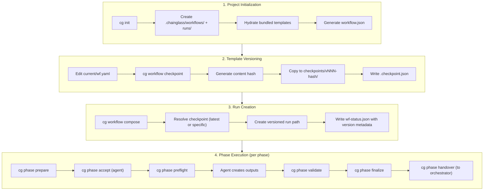

# Research Report: End-to-End Manual Test Harness for Workflow Management

**Generated**: 2026-01-25T04:15:00Z
**Research Query**: "Create a new subtask that extends upon the original manual test harness but ensures we start from scratch, hydrate using init, then go through an entire workflow with us as orchestrator and hand over to an agent for the agent bits"
**Mode**: Pre-Subtask Research
**FlowSpace**: Available
**Findings**: 65+ findings across 7 subagents

---

## Executive Summary

### What We Need to Build
A comprehensive end-to-end manual test harness that validates the **complete workflow lifecycle** from project initialization (`cg init`) through checkpoint creation, workflow composition, and full phase execution with agent handover.

### Business Purpose
Validate that the 007-manage-workflows feature set works correctly in a real-world scenario where:
1. A fresh project is initialized with `cg init`
2. Workflow templates are checkpointed and versioned
3. Runs are composed from checkpoints into versioned paths
4. Phase lifecycle (prepare → validate → finalize) executes correctly
5. Agent handover (accept → preflight → work → handover) functions properly

### Key Insights
1. **Existing Pattern is Proven**: The 003-wf-basics manual test harness with MODE-1-LEARNING and MODE-2-VALIDATION is the gold standard - we extend it, not replace it
2. **Init Creates Full Structure**: `cg init` creates `.chainglass/workflows/` and `.chainglass/runs/` with bundled starter templates
3. **Checkpoint-First Workflow**: Must checkpoint before compose - E034 error if no checkpoints exist
4. **Versioned Run Paths**: New structure is `.chainglass/runs/<slug>/<version>/run-YYYY-MM-DD-NNN/`
5. **15 Prior Learnings**: Critical gotchas and decisions from Phases 1-3 that affect testing

### Quick Stats
- **Components Analyzed**: ~50 files across workflow, CLI, and test packages
- **CLI Commands Involved**: 15+ (init, workflow list/info/checkpoint/restore/versions/compose, phase prepare/validate/finalize/accept/preflight/handover, message create/answer/list/read)
- **Prior Learnings**: 15 relevant discoveries from previous implementations
- **Error Codes**: E030, E033-E039 for workflow management; E001, E010-E012, E020, E031 for phases

---

## How the Complete Flow Works

### Entry Points

| Entry Point | Type | Purpose |
|------------|------|---------|
| `cg init` | CLI | Create project structure with starter templates |
| `cg workflow checkpoint <slug>` | CLI | Create versioned snapshot of current/ |
| `cg workflow compose <slug>` | CLI | Create run from checkpoint |
| `cg phase prepare <phase>` | CLI | Prepare phase inputs |
| `cg phase accept <phase>` | CLI | Agent accepts control |
| `cg phase validate <phase>` | CLI | Validate outputs |
| `cg phase finalize <phase>` | CLI | Extract parameters, complete phase |

### Complete Execution Flow



### Directory Structure Created

**After `cg init`:**
```
.chainglass/
├── workflows/
│   └── hello-workflow/
│       ├── workflow.json          # Metadata
│       └── current/               # Editable template
│           ├── wf.yaml
│           └── phases/gather/commands/main.md
└── runs/                          # Empty, ready for compose
```

**After `cg workflow checkpoint hello-workflow --comment "v1.0"`:**
```
.chainglass/workflows/hello-workflow/
├── workflow.json
├── current/                       # Still editable
│   └── ...
└── checkpoints/
    └── v001-abc12345/             # Immutable snapshot
        ├── .checkpoint.json       # {ordinal, hash, createdAt, comment}
        ├── wf.yaml
        └── phases/...
```

**After `cg workflow compose hello-workflow`:**
```
.chainglass/runs/
└── hello-workflow/                # Workflow slug
    └── v001-abc12345/             # Checkpoint version
        └── run-2026-01-25-001/    # Date-scoped run
            ├── wf.yaml
            ├── wf-run/wf-status.json  # Includes slug, version_hash
            └── phases/
                └── gather/
                    ├── wf-phase.yaml
                    ├── commands/main.md
                    └── run/
                        ├── inputs/
                        ├── outputs/
                        ├── wf-data/
                        └── messages/
```

---

## Implementation Details from Subagent Research

### IA: Init Command Implementation (10 findings)

**IA-01: IInitService Interface**
- Three methods: `init()`, `isInitialized()`, `getInitializationStatus()`
- Non-destructive by default (skip existing templates unless force=true)
- Error handling via result structure instead of throwing

**IA-02: InitService Execution Flow**
1. Phase 1: Create `.chainglass/workflows/` and `.chainglass/runs/`
2. Phase 2: Hydrate starter templates from bundled assets
3. Validate slug against `SLUG_PATTERN: /^[a-z][a-z0-9-]*$/` (security)
4. Generate workflow.json metadata for each template

**IA-05: Bundled Starter Template**
```
hello-workflow/
├── wf.yaml                    # Workflow definition
└── phases/gather/commands/main.md  # Phase instructions
```

### CP: Checkpoint & Versioning System (12 findings)

**CP-01: IWorkflowRegistry Interface**
- `list()`, `info()`, `checkpoint()`, `restore()`, `versions()`
- Error codes E030 (not found), E033-E039

**CP-03: Hash Generation**
1. Collect all files from `current/` recursively
2. Sort alphabetically by path (determinism - PL-01)
3. Concatenate as `path:content` pairs
4. SHA-256 hash, take first 8 characters

**CP-05: Checkpoint Creation Flow**
1. Validate current/wf.yaml exists (E036)
2. Generate content hash
3. Check for duplicates (E035 unless --force)
4. Get next ordinal (max+1 pattern - PL-09)
5. Create `checkpoints/v{NNN}-{hash}/`
6. Copy files recursively (excluding .git, node_modules, dist)
7. Write .checkpoint.json manifest

**CP-07: Restore Flow**
1. Validate workflow exists (E030)
2. Query versions list
3. Check versions not empty (E034)
4. Match version (short "v001" or full "v001-abc12345")
5. Delete current/ recursively
6. Copy checkpoint to current/

### WC: Workflow Compose (10 findings)

**WC-01: Compose Dispatcher**
- Detects slug vs path: if contains `/` or starts with `.` → path mode
- Slugs delegate to `composeFromRegistry()` (checkpoint flow)

**WC-04: Versioned Run Path (DYK-03)**
```
.chainglass/runs/<slug>/<version>/run-YYYY-MM-DD-NNN/
```
- Ordinal scoped per-version folder, not global

**WC-06: wf-status.json Extension**
```json
{
  "workflow": {
    "name": "Hello Workflow",
    "template_path": "...",
    "slug": "hello-workflow",
    "version_hash": "abc12345",
    "checkpoint_comment": "Initial release"
  }
}
```

### PL: Phase Lifecycle (10 findings)

**PL-02: Prepare Flow**
1. Check phase exists (E020)
2. Check prior phases finalized (E031)
3. Copy files from prior phase outputs
4. Resolve parameters to params.json
5. Update status to 'ready'

**PL-03: Validate Flow**
- `--check inputs`: Existence only
- `--check outputs`: Existence + non-empty + schema validation

**PL-04: Finalize Flow**
1. Parse output_parameters declarations
2. Extract values using dot-notation queries
3. Write output-params.json
4. Update state to 'complete'

**PL-07: Handover Commands**
- `accept()`: Agent takes control, sets facilitator='agent'
- `preflight()`: Validates inputs (requires accept first)
- `handover()`: Toggles facilitator, optional dueToError flag

### MT: Existing Manual Test Harness (10 findings)

**MT-01: Dual-Mode Architecture**
- MODE-1-LEARNING: Both roles played by humans
- MODE-2-VALIDATION: External agent uses only prompts

**MT-04: Phase Prompt Structure**
- `wf.md`: Universal workflow instructions
- `main.md`: Phase-specific instructions
- Prompts are self-contained for agents

**MT-07: Operational Scripts**
- 8 shell scripts automate orchestrator workflow
- Pattern: read state → execute → save state → next steps

**MT-08: check-state.sh**
- Parses wf-phase.json for state/facilitator
- Color-coded output for quick status assessment

### MH: Message & Handover (10 findings)

**MH-01: IMessageService**
- `create()`, `answer()`, `list()`, `read()`
- Messages stored as m-{id}.json in run/messages/

**MH-03: Message Types**
- single_choice, multi_choice, free_text, confirm
- Full schema validation with Zod

**MH-06: Facilitator Model**
- wf-phase.json tracks facilitator (agent|orchestrator)
- Status array is append-only audit trail

---

## Prior Learnings (15 Critical Discoveries)

### Must-Know Gotchas

| ID | Discovery | Type | Impact | Action |
|----|-----------|------|--------|--------|
| PL-01 | Hash determinism requires sorted paths | gotcha | CRITICAL | Verify same content = same hash |
| PL-02 | Recursive copy via IFileSystem only | gotcha | CRITICAL | Verify nested dirs copied |
| PL-03 | Registry injection to 7 sites | decision | HIGH | Container must inject correctly |
| PL-04 | Ambiguity guard for prefix matching | decision | MEDIUM | Test with multiple matches |
| PL-05 | Run ordinals scoped per-version | decision | HIGH | v001/run-001, v002/run-001 both valid |
| PL-06 | wf-status fields optional | decision | HIGH | Old runs still work |
| PL-07 | template_path vs version_hash | decision | MEDIUM | version_hash is checkpoint pointer |
| PL-08 | .checkpoint.json manifest | insight | HIGH | Required for version listing |
| PL-09 | Ordinal gaps with max+1 | insight | MEDIUM | Delete v002, next is v004 |
| PL-10 | E035 duplicate detection | decision | MEDIUM | Test --force override |
| PL-11 | Error codes E033-E039 | decision | MEDIUM | Avoid E031 collision |
| PL-12 | CLI container factory (ADR-0004) | architecture | HIGH | No direct instantiation |
| PL-13 | Fakes vs exemplars | architecture | HIGH | Unit=Fakes, E2E=real files |
| PL-14 | Three-part Fake pattern | pattern | MEDIUM | Preset/Inject/Inspect/Reset |
| PL-15 | current/ + checkpoints/ structure | structure | HIGH | Two-area model |

---

## Manual Test Harness Design

### Proposed Directory Structure

```
docs/plans/007-manage-workflows/manual-test/
├── MODE-1-FULL-E2E.md            # Complete E2E: init → checkpoint → compose → phases
├── MODE-2-AGENT-VALIDATION.md    # Agent-only test with handover
├── AGENT-STARTER-PROMPT.md       # Minimal prompt for external agent
├── check-state.sh                # Phase state verification
├── scripts/
│   ├── 00-clean-slate.sh         # Remove .chainglass/ entirely
│   ├── 01-init-project.sh        # cg init
│   ├── 02-verify-structure.sh    # ls -R .chainglass/
│   ├── 03-create-checkpoint.sh   # cg workflow checkpoint
│   ├── 04-compose-run.sh         # cg workflow compose
│   ├── 05-start-gather.sh        # prepare + accept + handover
│   ├── 06-complete-gather.sh     # validate + finalize
│   └── ...                       # Continue for all phases
├── simulated-agent-work/
│   └── gather/
│       ├── response.md           # Simulated agent output
│       └── ...
└── results/                      # Test run artifacts
```

### MODE-1-FULL-E2E: Complete End-to-End Test

**Purpose**: Validate the entire workflow management system from scratch

**Steps**:

1. **Clean Slate** (00-clean-slate.sh)
   ```bash
   rm -rf .chainglass/
   echo "✓ Removed .chainglass/"
   ```

2. **Initialize Project** (01-init-project.sh)
   ```bash
   cg init
   # Verify: .chainglass/workflows/hello-workflow/current/wf.yaml exists
   # Verify: .chainglass/runs/ directory created
   ```

3. **Verify Structure** (02-verify-structure.sh)
   ```bash
   cg workflow list
   # Expected: hello-workflow with 0 checkpoints

   cg workflow info hello-workflow
   # Expected: E034 or empty version history
   ```

4. **Create First Checkpoint** (03-create-checkpoint.sh)
   ```bash
   cg workflow checkpoint hello-workflow --comment "Initial release"
   # Verify: .chainglass/workflows/hello-workflow/checkpoints/v001-*/
   # Verify: .checkpoint.json has comment

   cg workflow versions hello-workflow
   # Expected: v001-* listed with comment
   ```

5. **Test Duplicate Detection**
   ```bash
   cg workflow checkpoint hello-workflow
   # Expected: E035 DUPLICATE_CONTENT error

   cg workflow checkpoint hello-workflow --force --comment "Force duplicate"
   # Expected: Success, v002-* created
   ```

6. **Compose Run from Checkpoint** (04-compose-run.sh)
   ```bash
   cg workflow compose hello-workflow --json
   # Capture: RUN_DIR from output
   # Verify: Path is .chainglass/runs/hello-workflow/v002-*/run-YYYY-MM-DD-001/
   # Verify: wf-status.json has slug, version_hash, checkpoint_comment
   ```

7. **Execute Phase Lifecycle** (05-start-gather.sh, 06-complete-gather.sh)
   ```bash
   # Prepare
   cg phase prepare gather --run-dir $RUN_DIR

   # Agent accepts control
   cg phase accept gather --run-dir $RUN_DIR

   # Agent preflight check
   cg phase preflight gather --run-dir $RUN_DIR

   # Handover to agent
   cg phase handover gather --run-dir $RUN_DIR --reason "Agent to create outputs"

   # === AGENT WORK HERE ===
   # (Copy simulated outputs or hand to real agent)

   # Validate outputs
   cg phase validate gather --run-dir $RUN_DIR --check outputs

   # Finalize
   cg phase finalize gather --run-dir $RUN_DIR
   ```

8. **Verify State Tracking**
   ```bash
   ./check-state.sh $RUN_DIR
   # Expected: gather=complete, process=pending, report=pending
   ```

### MODE-2-AGENT-VALIDATION: External Agent Test

**Purpose**: Validate that an external agent (Claude, GPT) can complete phases using ONLY the phase prompts

**Orchestrator Provides**:
```
You are executing a workflow phase.
Your working directory is: [RUN_DIR]/phases/gather/
Start by reading: commands/wf.md
This file tells you everything you need to know.
```

**Success Criteria**:
- Agent produces valid outputs without additional guidance
- Agent uses correct file paths and naming
- Agent calls validate and finalize correctly

---

## Error Codes Reference

### Workflow Management (E030, E033-E039)

| Code | Name | Trigger | Test Case |
|------|------|---------|-----------|
| E030 | WORKFLOW_NOT_FOUND | Invalid slug | `cg workflow info nonexistent` |
| E033 | VERSION_NOT_FOUND | Invalid checkpoint version | `cg workflow restore hello-wf v999` |
| E034 | NO_CHECKPOINT | Compose without checkpoint | `cg workflow compose` before checkpoint |
| E035 | DUPLICATE_CONTENT | Unchanged content | Checkpoint twice without edits |
| E036 | INVALID_TEMPLATE | Missing wf.yaml | Delete current/wf.yaml, checkpoint |
| E037 | DIR_READ_FAILED | Permission error | (Hard to test) |
| E038 | CHECKPOINT_FAILED | Copy failure | (Hard to test) |
| E039 | RESTORE_FAILED | Copy failure | (Hard to test) |

### Phase Operations (E001, E010-E012, E020, E031)

| Code | Name | Trigger | Test Case |
|------|------|---------|-----------|
| E001 | MISSING_INPUT | Required input file missing | Prepare without prior phase output |
| E010 | MISSING_OUTPUT | Output file doesn't exist | Finalize without creating outputs |
| E011 | EMPTY_OUTPUT | Output file empty | Create empty file, validate |
| E012 | SCHEMA_FAILURE | Invalid JSON | Create malformed JSON output |
| E020 | PHASE_NOT_FOUND | Invalid phase name | `cg phase prepare nonexistent` |
| E031 | PRIOR_NOT_FINALIZED | Dependency not complete | Prepare phase 2 before finalizing phase 1 |

---

## Test Checklist

### Init & Structure
- [ ] Clean slate (no .chainglass/)
- [ ] `cg init` creates correct structure
- [ ] `cg init --force` overwrites existing
- [ ] `cg workflow list` shows hello-workflow with 0 checkpoints
- [ ] workflow.json generated with correct metadata

### Checkpoint Operations
- [ ] `cg workflow checkpoint` creates v001-* with .checkpoint.json
- [ ] `cg workflow checkpoint` (again) returns E035
- [ ] `cg workflow checkpoint --force` creates v002-*
- [ ] `cg workflow checkpoint --comment "text"` records comment
- [ ] `cg workflow versions` shows both in descending order
- [ ] `cg workflow restore v001` copies to current/
- [ ] `cg workflow info` shows version history

### Compose & Run
- [ ] `cg workflow compose` creates versioned run path
- [ ] Path follows pattern: runs/<slug>/<version>/run-YYYY-MM-DD-NNN/
- [ ] wf-status.json has slug, version_hash, checkpoint_comment
- [ ] `cg workflow compose --checkpoint v001` uses specific version

### Phase Lifecycle
- [ ] `cg phase prepare gather` succeeds
- [ ] `cg phase accept gather` sets facilitator=agent
- [ ] `cg phase preflight gather` validates inputs
- [ ] `cg phase handover gather` toggles facilitator
- [ ] Agent can complete phase using only prompts
- [ ] `cg phase validate gather --check outputs` passes
- [ ] `cg phase finalize gather` extracts parameters
- [ ] Next phase prepare succeeds with prior phase outputs

### Error Handling
- [ ] E030: Invalid workflow slug
- [ ] E033: Invalid checkpoint version
- [ ] E034: Compose without checkpoint
- [ ] E035: Duplicate content (no --force)
- [ ] E020: Invalid phase name
- [ ] E031: Prior phase not finalized

---

## Recommendations

### For the Manual Test Subtask

1. **Start Clean**: Always begin with `rm -rf .chainglass/` to ensure reproducibility
2. **Use Scripts**: Create shell scripts for each step (copy 003-wf-basics pattern)
3. **Verify Paths**: After each operation, verify the expected directory structure
4. **Test Errors**: Include negative test cases for all error codes
5. **Save Artifacts**: Keep successful run artifacts in `results/` for reference

### Extension from 003-wf-basics

The new harness extends the original by adding:
1. **Init phase**: Clean slate → `cg init` → verify structure
2. **Checkpoint phase**: Create → verify → duplicate test → force
3. **Versioned compose**: Compose from specific checkpoint → verify versioned path
4. **Full audit**: Check wf-status.json has version metadata

---

## Next Steps

1. **Create Subtask Dossier**: Define tasks for implementing the manual test harness
2. **Implement Scripts**: Create shell scripts following the 003-wf-basics pattern
3. **Execute Test**: Run through complete flow manually
4. **Document Results**: Capture any discoveries for future reference

---

**Research Complete**: 2026-01-25T04:15:00Z
