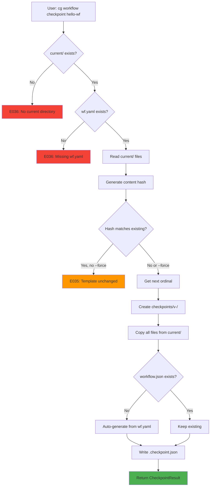
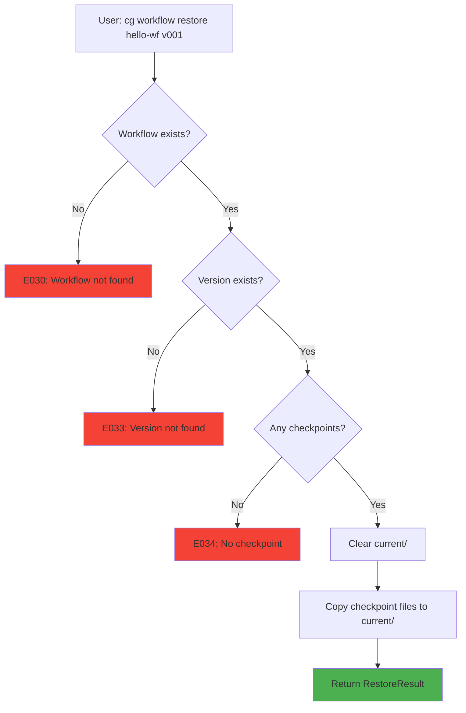
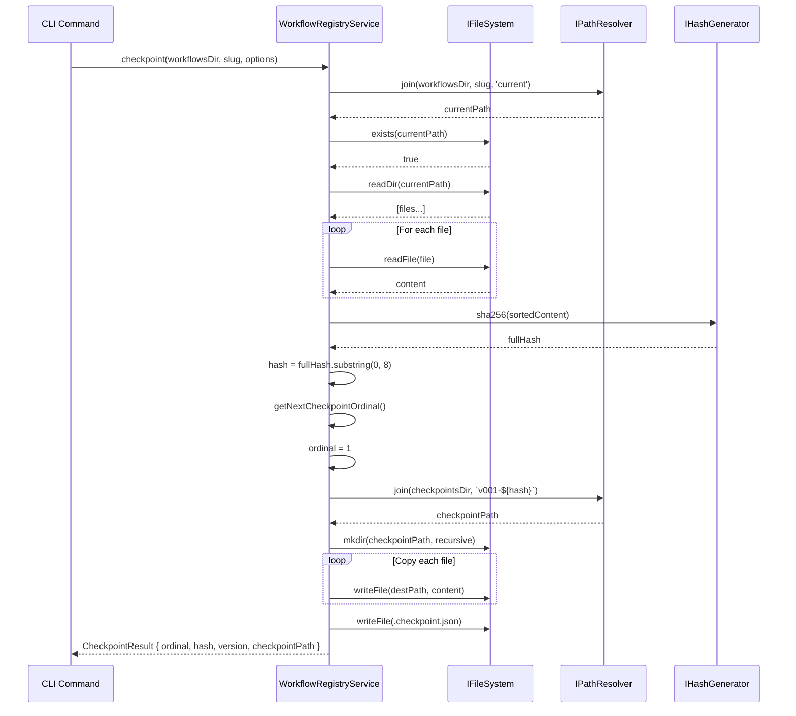

# Phase 2: Checkpoint & Versioning System – Tasks & Alignment Brief

**Spec**: [../../manage-workflows-spec.md](../../manage-workflows-spec.md)
**Plan**: [../../manage-workflows-plan.md](../../manage-workflows-plan.md)
**Date**: 2026-01-24
**Phase Slug**: `phase-2-checkpoint-versioning-system`

---

## Executive Briefing

### Purpose

This phase implements the checkpoint creation and restore operations that enable immutable workflow versioning. Once complete, users can save snapshots of their `current/` template at any point, creating versioned checkpoints that compose operations can reference. This is the critical link between editing workflows and running them.

### What We're Building

Three new methods for `IWorkflowRegistry` and `WorkflowRegistryService`:

1. **`checkpoint()`** - Creates an immutable snapshot of `current/` at `checkpoints/v<NNN>-<hash>/`
2. **`restore()`** - Copies a checkpoint back to `current/` for editing
3. **`versions()`** - Lists all checkpoints with metadata for a workflow

Plus supporting infrastructure:
- Ordinal generation with gap handling (v001, v002, ... even if some are deleted)
- Content hash generation (8-char SHA-256 prefix for uniqueness)
- Duplicate content detection (prevents checkpoints of unchanged templates)
- workflow.json auto-generation from wf.yaml metadata
- .checkpoint.json metadata files for each checkpoint

### User Value

Users can:
- Save workflow template versions before making breaking changes
- Roll back to previous versions when edits go wrong
- Track template evolution over time with comments
- Ensure runs always use immutable, reproducible template snapshots

### Example

**Before** (Phase 1):
```
.chainglass/workflows/hello-wf/
  workflow.json
  current/
    wf.yaml
    phases/
  checkpoints/      # Empty - no way to create checkpoints!
```

**After** (Phase 2):
```bash
$ cg workflow checkpoint hello-wf --comment "Initial release"
# Creates: checkpoints/v001-abc12345/
#   - All files from current/ copied
#   - .checkpoint.json with { ordinal: 1, hash: "abc12345", createdAt: "...", comment: "Initial release" }

$ cg workflow versions hello-wf
# v001-abc12345  2026-01-24T10:30:00Z  "Initial release"

$ cg workflow restore hello-wf v001
# Confirm? (y/N): y
# current/ now matches v001-abc12345/
```

---

## Objectives & Scope

### Objective

Implement checkpoint(), restore(), and versions() methods on IWorkflowRegistry as specified in the plan, with full TDD coverage and content-hash based atomicity (per Critical Discovery 02).

### Behavior Checklist (from Plan Acceptance Criteria)

- [ ] Ordinal generation: empty→1, [v001,v003,v004]→5 (max+1 with gaps)
- [ ] Content hash: 8-char SHA-256 prefix, deterministic
- [ ] Duplicate detection: E035 error with previous version reference
- [ ] workflow.json auto-generated if missing
- [ ] .checkpoint.json contains: ordinal, hash, created_at, comment
- [ ] Restore with confirmation prompt unless --force

### Goals

- ✅ Implement `getNextCheckpointOrdinal()` with gap handling
- ✅ Implement `generateCheckpointHash()` for deterministic content hashing
- ✅ Implement `checkpoint()` method with atomic copy pattern
- ✅ Implement duplicate content detection (E035)
- ✅ Implement workflow.json auto-generation from wf.yaml
- ✅ Implement `.checkpoint.json` creation with metadata
- ✅ Implement `restore()` method with current/ replacement
- ✅ Implement `versions()` method listing all checkpoints
- ✅ Extend `FakeWorkflowRegistry` with new method support
- ✅ Add contract tests for checkpoint/restore operations

### Non-Goals (Scope Boundaries)

- ❌ CLI command handlers (Phase 5)
- ❌ Output formatting for console/JSON (Phase 5)
- ❌ wf-status.json schema changes (Phase 3)
- ❌ compose() integration with checkpoints (Phase 3)
- ❌ Template bundling or `cg init` (Phase 4)
- ❌ MCP tool registration (explicitly excluded per G10)
- ❌ Delta/incremental checkpoints (full copy per checkpoint)
- ❌ Checkpoint pruning/deletion (future feature)
- ❌ Concurrent checkpoint protection (single-user assumption A3)

---

## Architecture Map

### Component Diagram

```mermaid
flowchart TD
    classDef pending fill:#9E9E9E,stroke:#757575,color:#fff
    classDef inprogress fill:#FF9800,stroke:#F57C00,color:#fff
    classDef completed fill:#4CAF50,stroke:#388E3C,color:#fff
    classDef blocked fill:#F44336,stroke:#D32F2F,color:#fff

    subgraph Phase2["Phase 2: Checkpoint & Versioning System"]
        T001["T001: Tests for ordinal generation ✓"]:::completed
        T002["T002: Tests for content hash ✓"]:::completed
        T003["T003: Tests for checkpoint creation ✓"]:::completed
        T004["T004: Tests for duplicate detection ✓"]:::completed
        T005["T005: Tests for workflow.json auto-gen ✓"]:::completed
        T006["T006: Tests for .checkpoint.json ✓"]:::completed
        T007["T007: Implement getNextCheckpointOrdinal ✓"]:::completed
        T008["T008: Implement generateCheckpointHash ✓"]:::completed
        T009["T009: Implement checkpoint() ✓"]:::completed
        T010["T010: Implement duplicate detection ✓"]:::completed
        T011["T011: Implement workflow.json auto-gen ✓"]:::completed
        T012["T012: Implement .checkpoint.json ✓"]:::completed
        T013["T013: Tests for restore() ✓"]:::completed
        T014["T014: Tests for versions() ✓"]:::completed
        T015["T015: Implement restore() ✓"]:::completed
        T016["T016: Implement versions() ✓"]:::completed
        T017["T017: Extend FakeWorkflowRegistry ✓"]:::completed
        T018["T018: Contract tests ✓"]:::completed

        T001 --> T007
        T002 --> T008
        T003 --> T009
        T004 --> T010
        T005 --> T011
        T006 --> T012
        T007 --> T009
        T008 --> T009
        T009 --> T010
        T009 --> T011
        T009 --> T012
        T013 --> T015
        T014 --> T016
        T015 --> T017
        T016 --> T017
        T017 --> T018
    end

    subgraph Interfaces["Interfaces (Modify)"]
        I1["/packages/workflow/src/interfaces/workflow-registry.interface.ts ✓"]:::completed
    end

    subgraph Services["Services (Modify)"]
        S1["/packages/workflow/src/services/workflow-registry.service.ts ✓"]:::completed
    end

    subgraph Fakes["Fakes (Modify)"]
        F1["/packages/workflow/src/fakes/fake-workflow-registry.ts ✓"]:::completed
    end

    subgraph Tests["Tests (Create)"]
        UT1["/test/unit/workflow/checkpoint.test.ts ✓"]:::completed
        UT2["/test/unit/workflow/restore.test.ts ✓"]:::completed
        UT3["/test/unit/workflow/versions.test.ts ✓"]:::completed
        CT1["/test/contracts/workflow-registry.contract.test.ts ✓"]:::completed
    end

    T001 -.-> UT1
    T002 -.-> UT1
    T003 -.-> UT1
    T004 -.-> UT1
    T005 -.-> UT1
    T006 -.-> UT1
    T007 -.-> S1
    T008 -.-> S1
    T009 -.-> S1
    T009 -.-> I1
    T010 -.-> S1
    T011 -.-> S1
    T012 -.-> S1
    T013 -.-> UT2
    T014 -.-> UT3
    T015 -.-> S1
    T015 -.-> I1
    T016 -.-> S1
    T016 -.-> I1
    T017 -.-> F1
    T018 -.-> CT1
```

<!-- Status: grey=pending, orange=in-progress, green=completed, red=blocked -->
<!-- Updated by plan-6 during implementation -->



### Task-to-Component Mapping

<!-- Status: ⬜ Pending | 🟧 In Progress | ✅ Complete | 🔴 Blocked -->

| Task | Component(s) | Files | Status | Comment |
|------|-------------|-------|--------|---------|
| T001 | Unit Tests | checkpoint.test.ts | ✅ Complete | Tests: empty→1, gaps→max+1 |
| T002 | Unit Tests | checkpoint.test.ts | ✅ Complete | Tests: wf.yaml + schemas hash |
| T003 | Unit Tests | checkpoint.test.ts | ✅ Complete | Tests: success, empty current, missing wf.yaml |
| T004 | Unit Tests | checkpoint.test.ts | ✅ Complete | Tests: same hash as existing, --force |
| T005 | Unit Tests | checkpoint.test.ts | ✅ Complete | Tests: missing, present, merge |
| T006 | Unit Tests | checkpoint.test.ts | ✅ Complete | Tests: ordinal, hash, created_at, comment |
| T007 | Service | workflow-registry.service.ts | ✅ Complete | Ordinal from max+1 with gaps |
| T008 | Service | workflow-registry.service.ts | ✅ Complete | SHA-256 of sorted file contents |
| T009 | Service + Interface | Both | ✅ Complete | Core checkpoint creation |
| T010 | Service | workflow-registry.service.ts | ✅ Complete | E035 on duplicate hash |
| T011 | Service | workflow-registry.service.ts | ✅ Complete | Auto-gen from wf.yaml name field |
| T012 | Service | workflow-registry.service.ts | ✅ Complete | JSON metadata file |
| T013 | Unit Tests | restore.test.ts | ✅ Complete | Tests: success, not found, no checkpoint |
| T014 | Unit Tests | versions.test.ts | ✅ Complete | Tests: list all, sorted by ordinal |
| T015 | Service + Interface | Both | ✅ Complete | Copy checkpoint to current |
| T016 | Service + Interface | Both | ✅ Complete | Return version history |
| T017 | Fake | fake-workflow-registry.ts | ✅ Complete | Add checkpoint/restore/versions |
| T018 | Contract Tests | workflow-registry.contract.test.ts | ✅ Complete | Same tests for Fake and Real |

---

## Tasks

| Status | ID | Task | CS | Type | Dependencies | Absolute Path(s) | Validation | Subtasks | Notes |
|--------|-----|------|----|------|--------------|------------------|------------|----------|-------|
| [x] | T001 | Write tests for ordinal generation | 2 | Test | – | /home/jak/substrate/007-manage-workflows/test/unit/workflow/checkpoint.test.ts | Tests: empty→1, [v001]→2, [v001,v002,v003]→4, [v001,v003,v004]→5 (gaps), [v005]→6 (skip) | – | TDD RED phase |
| [x] | T002 | Write tests for content hash generation | 2 | Test | – | /home/jak/substrate/007-manage-workflows/test/unit/workflow/checkpoint.test.ts | Tests: wf.yaml + schemas content, consistent hash, **sorted paths before hash**, **same hash regardless of readDir order** | – | Per CD02; test with different FakeFileSystem insertion orders |
| [x] | T003 | Write tests for checkpoint creation | 3 | Test | – | /home/jak/substrate/007-manage-workflows/test/unit/workflow/checkpoint.test.ts | Tests: success creates v001-<hash>/, empty current/ errors, missing wf.yaml errors E036, **nested dirs copied (phases/, commands/)** | – | Include nested dir fixtures |
| [x] | T004 | Write tests for duplicate content detection | 2 | Test | – | /home/jak/substrate/007-manage-workflows/test/unit/workflow/checkpoint.test.ts | Tests: same hash as existing returns E035, allows --force override | – | Per CD15 |
| [x] | T005 | Write tests for workflow.json auto-generation | 2 | Test | – | /home/jak/substrate/007-manage-workflows/test/unit/workflow/checkpoint.test.ts | Tests: missing workflow.json created, present preserved, merge from wf.yaml | – | Per CD03 |
| [x] | T006 | Write tests for .checkpoint.json metadata | 2 | Test | – | /home/jak/substrate/007-manage-workflows/test/unit/workflow/checkpoint.test.ts | Tests: ordinal (number), hash (string), created_at (ISO8601), comment (optional) | – | |
| [x] | T007 | Implement getNextCheckpointOrdinal() | 2 | Core | T001 | /home/jak/substrate/007-manage-workflows/packages/workflow/src/services/workflow-registry.service.ts | Tests from T001 pass; handles gaps with max+1 | – | Per HD05 |
| [x] | T008 | Implement generateCheckpointHash() | 2 | Core | T002 | /home/jak/substrate/007-manage-workflows/packages/workflow/src/services/workflow-registry.service.ts | Tests from T002 pass; sorts files for consistency; returns 8-char prefix | – | Use IHashGenerator |
| [x] | T009 | Implement checkpoint() method | 3 | Core | T003, T007, T008 | /home/jak/substrate/007-manage-workflows/packages/workflow/src/services/workflow-registry.service.ts, /home/jak/substrate/007-manage-workflows/packages/workflow/src/interfaces/workflow-registry.interface.ts | Tests from T003 pass; hash-first naming pattern; **copies all files INCLUDING nested subdirs via IFileSystem**; excludes .git/, node_modules/, dist/ | – | Per CD02 atomic; use copyDirectoryRecursive helper with IFileSystem adapter |
| [x] | T010 | Implement duplicate content detection | 2 | Core | T004, T009 | /home/jak/substrate/007-manage-workflows/packages/workflow/src/services/workflow-registry.service.ts | Tests from T004 pass; E035 error includes existing version | – | Per CD11 |
| [x] | T011 | Implement workflow.json auto-generation | 2 | Core | T005, T009 | /home/jak/substrate/007-manage-workflows/packages/workflow/src/services/workflow-registry.service.ts | Tests from T005 pass; extracts name from wf.yaml; sets created_at | – | Per CD03 |
| [x] | T012 | Implement .checkpoint.json creation | 2 | Core | T006, T009 | /home/jak/substrate/007-manage-workflows/packages/workflow/src/services/workflow-registry.service.ts | Tests from T006 pass; JSON with ordinal, hash, createdAt, comment | – | |
| [x] | T013 | Write tests for restore() method | 3 | Test | – | /home/jak/substrate/007-manage-workflows/test/unit/workflow/restore.test.ts | Tests: success copies to current/, E033 (VERSION_NOT_FOUND), E034 (NO_CHECKPOINT), **nested dirs restored (phases/, commands/)** | – | TDD RED phase; include nested dir fixtures |
| [x] | T014 | Write tests for versions() method | 2 | Test | – | /home/jak/substrate/007-manage-workflows/test/unit/workflow/versions.test.ts | Tests: lists all checkpoints, sorted by ordinal desc, includes metadata | – | TDD RED phase |
| [x] | T015 | Implement restore() method | 3 | Core | T013 | /home/jak/substrate/007-manage-workflows/packages/workflow/src/services/workflow-registry.service.ts, /home/jak/substrate/007-manage-workflows/packages/workflow/src/interfaces/workflow-registry.interface.ts | Tests from T013 pass; clears current/, **copies checkpoint files INCLUDING nested subdirs via IFileSystem** | – | No prompt at service layer; reuse copyDirectoryRecursive helper |
| [x] | T016 | Implement versions() method | 2 | Core | T014 | /home/jak/substrate/007-manage-workflows/packages/workflow/src/services/workflow-registry.service.ts, /home/jak/substrate/007-manage-workflows/packages/workflow/src/interfaces/workflow-registry.interface.ts | Tests from T014 pass; returns VersionsResult | – | Reuse getVersions() |
| [x] | T017 | Extend FakeWorkflowRegistry for new methods | 2 | Core | T015, T016 | /home/jak/substrate/007-manage-workflows/packages/workflow/src/fakes/fake-workflow-registry.ts | Fake supports checkpoint, restore, versions with call capture and presets | – | Follow existing pattern |
| [x] | T018 | Write contract tests for checkpoint/restore | 2 | Test | T017 | /home/jak/substrate/007-manage-workflows/test/contracts/workflow-registry.contract.test.ts | Same behavioral tests pass for Fake and Real implementations | – | Extend existing contract |

---

## Alignment Brief

### Prior Phases Review

#### Phase 1: Core IWorkflowRegistry Infrastructure (Completed 2026-01-24)

**Summary**: Phase 1 established the foundational infrastructure for workflow template management. It created the `IWorkflowRegistry` interface with `list()`, `info()`, and `getCheckpointDir()` methods, plus the supporting types, fakes, and DI integration.

**Deliverables Created**:

| Type | Path | Description |
|------|------|-------------|
| Interface | `/packages/workflow/src/interfaces/workflow-registry.interface.ts` | IWorkflowRegistry with list(), info(), getCheckpointDir() |
| Interface | `/packages/shared/src/interfaces/hash-generator.interface.ts` | IHashGenerator with sha256() |
| Service | `/packages/workflow/src/services/workflow-registry.service.ts` | WorkflowRegistryService + error codes E030, E033-E037 |
| Adapter | `/packages/shared/src/adapters/hash-generator.adapter.ts` | HashGeneratorAdapter using node:crypto |
| Fake | `/packages/workflow/src/fakes/fake-workflow-registry.ts` | FakeWorkflowRegistry with call capture |
| Fake | `/packages/shared/src/fakes/fake-hash-generator.ts` | FakeHashGenerator with presets |
| Schema | `/packages/shared/src/config/schemas/workflow-metadata.schema.ts` | WorkflowMetadataSchema (7 fields) |
| Types | `/packages/shared/src/interfaces/results/registry.types.ts` | ListResult, InfoResult, CheckpointResult, RestoreResult, VersionsResult, CheckpointInfo, WorkflowSummary, WorkflowInfo |
| DI | `/apps/cli/src/lib/container.ts` | CLI container factories |
| Tests | `/test/unit/shared/hash-generator.test.ts` | 8 tests |
| Tests | `/test/unit/workflow/registry-list.test.ts` | 9 tests |
| Tests | `/test/unit/workflow/registry-info.test.ts` | 6 tests |
| Tests | `/test/contracts/workflow-registry.contract.test.ts` | 10 tests |

**Lessons Learned**:
- ZodError uses `.issues` not `.errors` for accessing validation errors
- FakePathResolver needs `getJoinCalls()` for test verification that IPathResolver is used
- DoS protection (MAX_WORKFLOW_JSON_SIZE) should be added proactively

**Technical Discoveries**:
- Checkpoint pattern regex: `^v\d{3}-[a-f0-9]{8}$` (8-char hash suffix)
- WorkflowRegistryService reads checkpoint manifests but doesn't write them yet
- E037 (DIR_READ_FAILED) added beyond original plan for directory read errors

**Dependencies Exported for Phase 2**:
- `IWorkflowRegistry` interface to extend with checkpoint(), restore(), versions()
- `IHashGenerator` interface for content hashing
- `CheckpointResult`, `RestoreResult`, `VersionsResult` types already defined
- `CheckpointInfo` type for version metadata
- Error codes E033-E035 reserved for Phase 2 operations
- `getCheckpointDir()` helper for path construction
- `getVersions()` private method for reading checkpoint manifests (can be reused)

**Test Infrastructure**:
- Contract test pattern with `WorkflowRegistryTestContext`
- FakeWorkflowRegistry with three-part API (state setup, inspection, error injection)
- FakePathResolver with `getJoinCalls()` for path verification

**Technical Debt**:
- IHashGenerator not yet injected into WorkflowRegistryService constructor (Phase 2 must add)
- CheckpointManifest interface is local to service (could export if needed)

**Architectural Decisions**:
- useFactory pattern for production DI (per ADR-0004)
- Child container pattern for test isolation
- Graceful degradation in list() (skip invalid), explicit errors in info()
- Fakes-only testing (no vi.mock/jest.mock)

---

### Critical Findings Affecting This Phase

| Finding | Impact | How Addressed |
|---------|--------|---------------|
| **CD02**: IFileSystem lacks atomic rename | Critical | Hash-first naming: compute hash before writing, create folder with final name `v<NNN>-<hash>/`, write files directly, clean up on failure. Tasks T008, T009 |
| **HD05**: Ordinal generation must handle gaps | High | Use max(ordinals)+1 pattern from existing getNextRunOrdinal(). Task T007 |
| **CD03**: workflow.json lifecycle undefined | Critical | Auto-generate on first checkpoint from wf.yaml metadata. Task T011 |
| **HD07**: Services must use interfaces only | High | Add IHashGenerator to WorkflowRegistryService constructor. Task T008 |
| **HD08**: Result objects never throw | High | All errors in result.errors array. Tasks T009, T015, T016 |
| **MD10**: Path security via IPathResolver | Medium | All path operations use pathResolver.join(). All tasks |
| **MD11**: Hash collision detection | Medium | Before creating checkpoint, check if v*-<hash>/ exists. E035 error. Task T010 |
| **MD12**: Empty current/ handling | Medium | Validate wf.yaml exists before checkpoint. E036 if missing. Task T003, T009 |
| **LD15**: Unchanged template detection | Low | Compare hash to latest checkpoint, E035 with guidance. Task T010 |
| **DYK-01**: Recursive directory copy needed | High | IFileSystem lacks copyDirectory(); implement private `copyDirectoryRecursive()` helper using IFileSystem methods (readDir, stat, copyFile, mkdir). Exclude .git/, node_modules/, dist/. Tasks T009, T015 |
| **DYK-02**: Hash determinism requires sorting | High | readDir() order is OS-dependent; sort file paths alphabetically before concatenating content for hashing. Tests must verify same hash with different insertion orders. Tasks T002, T008 |

---

### ADR Decision Constraints

| ADR | Constraint | Affected Tasks |
|-----|-----------|----------------|
| **ADR-0002** | Exemplar-driven testing: use real exemplars from dev/examples/wf/, no generated mocks | T001-T006, T013-T014, T018 |
| **ADR-0004** | DI useFactory pattern: WorkflowRegistryService registration must use useFactory with constructor injection | T008 (add IHashGenerator to constructor) |

---

### Invariants & Guardrails

1. **Checkpoint Immutability**: Once created, checkpoint folders MUST NOT be modified
2. **Hash Determinism**: Same content MUST produce same hash (sorted file order)
3. **Ordinal Monotonicity**: Ordinals always increase (even with gaps)
4. **Atomic Creation**: No partial checkpoints - complete or nothing
5. **No Throws**: All errors returned via result.errors array

---

### Inputs to Read

| Purpose | Absolute Path |
|---------|---------------|
| Extend interface | /home/jak/substrate/007-manage-workflows/packages/workflow/src/interfaces/workflow-registry.interface.ts |
| Extend service | /home/jak/substrate/007-manage-workflows/packages/workflow/src/services/workflow-registry.service.ts |
| Extend fake | /home/jak/substrate/007-manage-workflows/packages/workflow/src/fakes/fake-workflow-registry.ts |
| Result types | /home/jak/substrate/007-manage-workflows/packages/shared/src/interfaces/results/registry.types.ts |
| IHashGenerator | /home/jak/substrate/007-manage-workflows/packages/shared/src/interfaces/hash-generator.interface.ts |
| Existing tests pattern | /home/jak/substrate/007-manage-workflows/test/unit/workflow/registry-list.test.ts |
| Contract test pattern | /home/jak/substrate/007-manage-workflows/test/contracts/workflow-registry.contract.test.ts |

---

### Visual Alignment Aids

#### Checkpoint Flow Diagram



#### Restore Flow Diagram



#### Sequence Diagram: Checkpoint Creation



---

### Test Plan (Full TDD)

**Mock Policy**: Fakes only, no mocking libraries (per spec)

#### Checkpoint Tests (checkpoint.test.ts)

| Test Name | Rationale | Fixtures | Expected Output |
|-----------|-----------|----------|-----------------|
| `should return ordinal 1 for empty checkpoints` | Base case | Empty checkpoints/ | ordinal: 1 |
| `should return ordinal 2 after v001` | Sequential | checkpoints/v001-abc12345/ | ordinal: 2 |
| `should return ordinal 5 with gaps [1,3,4]` | Gap handling | v001, v003, v004 | ordinal: 5 |
| `should generate consistent hash for same content` | Determinism | Same wf.yaml | Same 8-char hash |
| `should generate different hash for different content` | Uniqueness | Different wf.yaml | Different hash |
| `should create checkpoint with ordinal and hash` | Core success | valid current/ | CheckpointResult with v001-<hash> |
| `should error E036 when current/ missing` | Missing dir | No current/ | errors[0].code = 'E036' |
| `should error E036 when wf.yaml missing` | Invalid template | current/ without wf.yaml | errors[0].code = 'E036' |
| `should error E035 when content unchanged` | Duplicate | Same hash exists | errors[0].code = 'E035' |
| `should allow --force with duplicate content` | Force override | Same hash, force=true | Creates checkpoint |
| `should auto-generate workflow.json if missing` | Auto-gen | No workflow.json | workflow.json created |
| `should preserve existing workflow.json` | Preserve | Has workflow.json | Unchanged |
| `should create .checkpoint.json with metadata` | Metadata | Valid checkpoint | .checkpoint.json with ordinal, hash, createdAt |
| `should include comment in .checkpoint.json` | Comment | --comment "Release" | .checkpoint.json.comment = "Release" |

#### Restore Tests (restore.test.ts)

| Test Name | Rationale | Fixtures | Expected Output |
|-----------|-----------|----------|-----------------|
| `should copy checkpoint to current/` | Core success | v001-abc12345/ exists | current/ matches checkpoint |
| `should error E030 when workflow not found` | Not found | No workflow dir | errors[0].code = 'E030' |
| `should error E033 when version not found` | Bad version | No v002/ | errors[0].code = 'E033' |
| `should error E034 when no checkpoints exist` | No checkpoints | Empty checkpoints/ | errors[0].code = 'E034' |
| `should clear current/ before restore` | Clean restore | current/ has files | Old files removed |
| `should accept ordinal or full version name` | Flexible input | v001 or v001-abc12345 | Both work |

#### Versions Tests (versions.test.ts)

| Test Name | Rationale | Fixtures | Expected Output |
|-----------|-----------|----------|-----------------|
| `should return empty array when no checkpoints` | Empty case | Empty checkpoints/ | versions: [] |
| `should list all checkpoints` | Multi-version | v001, v002, v003 | 3 versions |
| `should sort by ordinal descending` | Newest first | v001, v003, v002 | [v003, v002, v001] |
| `should include checkpoint metadata` | Full info | v001 with .checkpoint.json | createdAt, comment included |
| `should error E030 when workflow not found` | Not found | No workflow | errors[0].code = 'E030' |

#### Contract Tests (extend existing)

| Test Name | Rationale |
|-----------|-----------|
| `checkpoint() should return CheckpointResult shape` | Contract conformance |
| `restore() should return RestoreResult shape` | Contract conformance |
| `versions() should return VersionsResult shape` | Contract conformance |
| `checkpoint() should error E036 for invalid template` | Error contract |
| `restore() should error E033 for missing version` | Error contract |

---

### Implementation Outline

1. **T001-T006**: Write all failing tests first (RED phase)
   - Create checkpoint.test.ts with ordinal, hash, creation, duplicate, workflow.json, metadata tests
   - Create restore.test.ts with success and error cases
   - Create versions.test.ts with listing tests
   - All tests should fail with "not a function" or similar

2. **T007**: Implement getNextCheckpointOrdinal()
   - Read checkpoints/ directory
   - Extract ordinals from v###-* pattern
   - Return max+1 or 1 if empty

3. **T008**: Implement generateCheckpointHash()
   - Inject IHashGenerator into WorkflowRegistryService constructor
   - Update container registrations
   - Read all files in current/, sort by path
   - Concatenate contents, hash with SHA-256
   - Return first 8 characters

4. **T009**: Implement checkpoint() method
   - Add to IWorkflowRegistry interface
   - Validate current/ and wf.yaml exist
   - Generate hash and ordinal
   - Check for duplicate (T010)
   - Create checkpoint folder
   - Copy all files
   - Create .checkpoint.json (T012)
   - Handle workflow.json (T011)

5. **T010-T012**: Implement supporting features
   - T010: Check existing checkpoints for matching hash → E035
   - T011: Read wf.yaml name, generate workflow.json if missing
   - T012: Write .checkpoint.json with ordinal, hash, createdAt, comment

6. **T013-T016**: Implement restore() and versions()
   - T15: Add restore() to interface and service
   - T16: Add versions() to interface (mostly reuse getVersions())

7. **T017**: Extend FakeWorkflowRegistry
   - Add CheckpointCall, RestoreCall, VersionsCall interfaces
   - Add setCheckpointResult(), setRestoreResult(), setVersionsResult()
   - Add getLastCheckpointCall(), etc.

8. **T018**: Extend contract tests
   - Add checkpoint/restore/versions to contract test matrix

---

### Commands to Run

```bash
# Environment setup
cd /home/jak/substrate/007-manage-workflows
pnpm install

# Run specific test file during development
npx vitest run test/unit/workflow/checkpoint.test.ts
npx vitest run test/unit/workflow/restore.test.ts
npx vitest run test/unit/workflow/versions.test.ts

# Run contract tests
npx vitest run test/contracts/workflow-registry.contract.test.ts

# Run all Phase 2 tests
npx vitest run test/unit/workflow/checkpoint.test.ts test/unit/workflow/restore.test.ts test/unit/workflow/versions.test.ts

# Type check
npx tsc --noEmit

# Lint
pnpm biome check .

# Full quality gate
just fft
```

---

### Risks & Unknowns

| Risk | Severity | Likelihood | Mitigation |
|------|----------|------------|------------|
| Hash collision (same content different hash) | Medium | Very Low | Use SHA-256, deterministic file ordering |
| Partial checkpoint on I/O failure | High | Low | Hash-first naming; check all files readable before creating folder |
| Large template causing memory issues | Medium | Low | Stream files if needed; warn on >10MB templates |
| IHashGenerator injection breaks existing tests | Medium | Medium | Update container registrations carefully; run all tests |

---

### Ready Check

- [x] Plan file read and understood
- [x] Phase 1 deliverables reviewed
- [x] Critical findings mapped to tasks
- [x] ADR constraints mapped to tasks (ADR-0002, ADR-0004)
- [x] Result types already defined (CheckpointResult, RestoreResult, VersionsResult)
- [x] Test plan covers all acceptance criteria
- [x] Implementation outline maps 1:1 to tasks
- [ ] **Await explicit GO/NO-GO from user**

---

## Phase Footnote Stubs

_Populated during implementation by plan-6a-update-progress._

| Footnote | Task | Description | Date |
|----------|------|-------------|------|
| | | | |

---

## Evidence Artifacts

| Artifact | Location | Purpose |
|----------|----------|---------|
| Execution Log | `./execution.log.md` | Detailed implementation narrative |
| Test Results | stdout from vitest | Pass/fail evidence |
| Type Check | stdout from tsc | Compilation verification |

---

## Discoveries & Learnings

_Populated during implementation by plan-6. Log anything of interest to your future self._

| Date | Task | Type | Discovery | Resolution | References |
|------|------|------|-----------|------------|------------|
| | | | | | |

**Types**: `gotcha` | `research-needed` | `unexpected-behavior` | `workaround` | `decision` | `debt` | `insight`

**What to log**:
- Things that didn't work as expected
- External research that was required
- Implementation troubles and how they were resolved
- Gotchas and edge cases discovered
- Decisions made during implementation
- Technical debt introduced (and why)
- Insights that future phases should know about

_See also: `execution.log.md` for detailed narrative._

---

## Directory Layout

```
docs/plans/007-manage-workflows/
  ├── manage-workflows-spec.md
  ├── manage-workflows-plan.md
  ├── reviews/
  │   ├── review.phase-1-core-iworkflowregistry-infrastructure.md
  │   └── fix-tasks.phase-1-core-iworkflowregistry-infrastructure.md
  └── tasks/
      ├── phase-1-core-iworkflowregistry-infrastructure/
      │   ├── tasks.md
      │   └── execution.log.md
      └── phase-2-checkpoint-versioning-system/
          ├── tasks.md           # This file
          └── execution.log.md   # Created by plan-6
```

---

*Tasks & Alignment Brief generated 2026-01-24 by plan-5-phase-tasks-and-brief*

---

## Critical Insights Discussion

**Session**: 2026-01-24
**Context**: Phase 2 Checkpoint & Versioning System Tasks Dossier
**Analyst**: AI Clarity Agent
**Reviewer**: Development Team
**Format**: Water Cooler Conversation (5 Critical Insights)

### Insight 1: Recursive Directory Copy Not Explicit in Tasks

**Did you know**: Task T009 says "copies all files" but doesn't explicitly mention nested subdirectories (phases/, commands/, schemas/), risking incomplete checkpoints.

**Implications**:
- Naive readDir + copyFile loop only copies top-level files
- Checkpoints would silently miss phase definitions
- Compose from incomplete checkpoint fails with confusing errors

**Options Considered**:
- Option A: Manual traversal with IFileSystem methods - Feasible
- Option B: Add copyDirectory() to IFileSystem - Not feasible for Phase 2 (cross-cutting)
- Option C: Private copyDirectoryRecursive helper using IFileSystem - Feasible

**AI Recommendation**: Option C
- Reasoning: Self-contained, uses injected adapters, includes file filtering for .git/node_modules/dist/

**Discussion Summary**: User confirmed Option C, emphasized that services must only access filesystem through adapters (IFileSystem), never directly.

**Decision**: Option C - Implement private `copyDirectoryRecursive()` helper using IFileSystem methods

**Action Items**:
- [x] Update T009 acceptance criteria for nested subdirs
- [x] Update T003 test fixtures for nested directories
- [x] Add DYK-01 to Critical Findings

**Affects**: T003, T009, T013, T015

---

### Insight 2: Hash Determinism Requires Explicit File Sorting

**Did you know**: readDir() returns entries in OS-dependent order; same template could produce different hashes on macOS vs Linux, breaking checkpoint deduplication.

**Implications**:
- CI/CD pipelines could produce different hashes than local dev
- Team members can't rely on "same hash = same content"
- Duplicate detection (E035) becomes unreliable

**Options Considered**:
- Option A: Sort file paths alphabetically before hashing - Feasible, recommended in T008
- Option B: Canonical JSON representation - Feasible but more complex
- Option C: Hash-of-hashes approach - Feasible but harder to debug

**AI Recommendation**: Option A
- Reasoning: Already specified in T008 ("sorts files for consistency"), simplest, debuggable

**Discussion Summary**: User confirmed Option A.

**Decision**: Option A - Sort file paths alphabetically before concatenating content for hash

**Action Items**:
- [x] Update T002 to test hash determinism across different readDir orders
- [x] Add DYK-02 to Critical Findings

**Affects**: T002, T008

---

### Insight 3: IHashGenerator Constructor Injection is Cross-Cutting

**Did you know**: Adding IHashGenerator to WorkflowRegistryService affects 6 files across 3 packages (service, 2 production containers, test container, tests).

**Implications**:
- Must update both production AND test containers
- Must ensure HASH_GENERATOR token registered before WORKFLOW_REGISTRY
- Tests directly instantiating service need updating

**Options Considered**:
- Option A: Add as 4th constructor parameter - Feasible, matches WorkflowService pattern
- Option B: Optional/lazy injection - Not feasible (violates codebase architecture)
- Option C: HashingService wrapper - Not feasible (unnecessary abstraction)

**AI Recommendation**: Option A
- Reasoning: Only viable option per codebase architecture, matches existing 4-param pattern

**Discussion Summary**: User confirmed Option A.

**Decision**: Option A - Add IHashGenerator as 4th constructor parameter

**Action Items**:
- Already captured in T008 notes

**Affects**: T008, container.ts files

---

### Insight 4: restore() is Destructive but Service Can't Prompt

**Did you know**: restore() permanently deletes current/ contents, but services are stateless transaction executors with no UI capability. Prompting must happen at CLI layer.

**Implications**:
- Service executes unconditionally - no protection at service layer
- CLI must prompt BEFORE calling service
- --force flag skips prompt (per AC-04a)

**Options Considered**:
- Option A: CLI prompts before calling service - Feasible, matches codebase pattern
- Option B: Service accepts confirmed parameter - Partial (unusual pattern)
- Option C: Service returns requiresConfirmation flag - Feasible but complex

**AI Recommendation**: Option A
- Reasoning: T015 already notes "No prompt at service layer", clean separation of concerns

**Discussion Summary**: User confirmed this is an upstream (CLI) concern, out of scope for Phase 2 service layer.

**Decision**: Option A - CLI handles prompt, service executes unconditionally (Phase 5 responsibility)

**Action Items**:
- None for Phase 2 - already correctly scoped

**Affects**: Phase 5 CLI commands

---

### Insight 5: FakeWorkflowRegistry Extension is Simpler Than It Looks

**Did you know**: Adding 3 methods to FakeWorkflowRegistry is mechanical work - FakePhaseService already proves the pattern scales to 6 methods at ~1,000 lines.

**Implications**:
- Current ~340 lines grows to ~550-600 lines
- Same 3-part pattern (state setup, error injection, inspection)
- No need for generic abstractions

**Options Considered**:
- Option A: Add methods incrementally following existing pattern - Feasible
- Option B: Generic call/response system - Not feasible (violates codebase style)
- Option C: Separate FakeCheckpointService - Not feasible (unnecessary split)

**AI Recommendation**: Option A
- Reasoning: Proven pattern, maintains consistency, T017 correctly scoped at CS-2

**Discussion Summary**: User confirmed Option A.

**Decision**: Option A - Incremental extension following 3-part pattern

**Action Items**:
- None - T017 already correctly specified

**Affects**: T017

---

## Session Summary

**Insights Surfaced**: 5 critical insights identified and discussed
**Decisions Made**: 5 decisions reached through collaborative discussion
**Action Items Created**: 6 task updates applied
**Areas Updated**:
- T002: Hash determinism test requirement
- T003: Nested directory fixtures
- T009: Recursive copy via IFileSystem + exclusions
- T013: Nested directory restore tests
- T015: Reuse copyDirectoryRecursive helper
- Critical Findings: Added DYK-01, DYK-02

**Shared Understanding Achieved**: ✓

**Confidence Level**: High - All key architectural decisions aligned with codebase patterns

**Next Steps**: Proceed with `/plan-6-implement-phase` to implement Phase 2

**Notes**: All insights verified against codebase using FlowSpace exploration. Key theme: maintain adapter-only filesystem access, follow established patterns.
