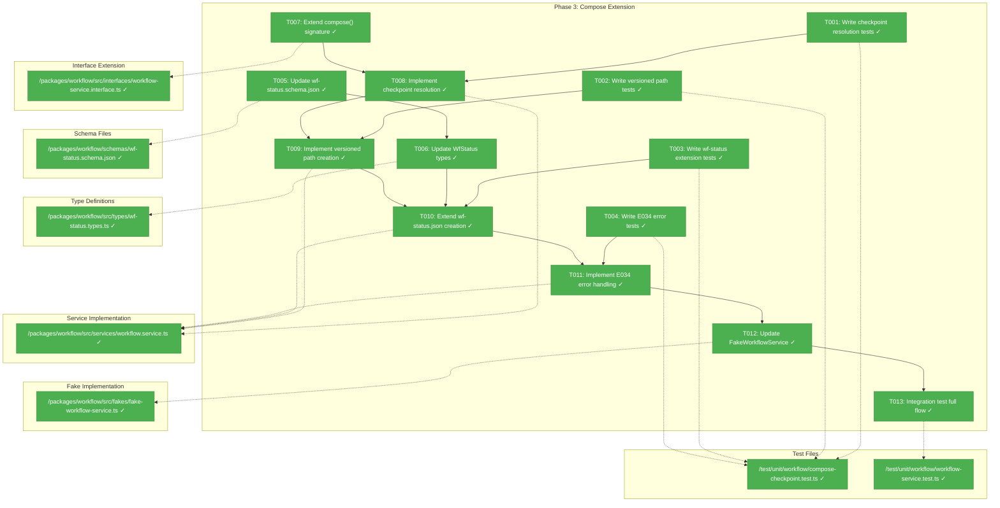
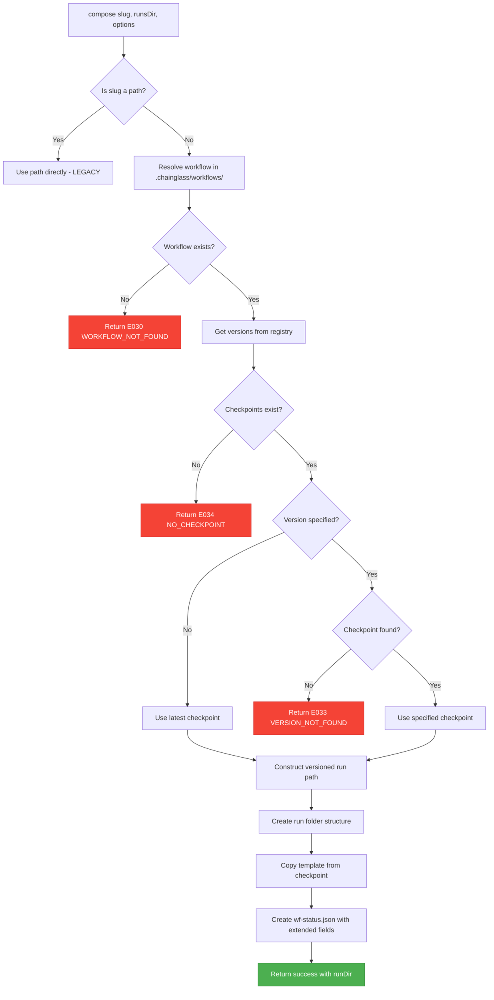
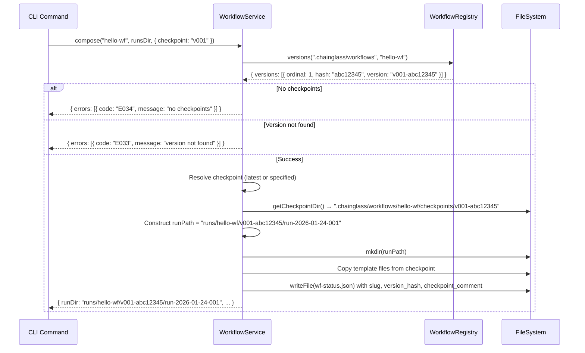

# Phase 3: Compose Extension for Versioned Runs – Tasks & Alignment Brief

**Spec**: [../manage-workflows-spec.md](../../manage-workflows-spec.md)
**Plan**: [../manage-workflows-plan.md](../../manage-workflows-plan.md)
**Date**: 2026-01-24

---

## Executive Briefing

### Purpose
This phase extends the existing `WorkflowService.compose()` method to require checkpoints and create runs under versioned paths. Without this change, runs cannot be traced to specific template versions, breaking the core promise of reproducible workflow execution.

### What We're Building
An extended compose flow that:
- Requires a checkpoint before allowing compose (no composing from `current/`)
- Resolves checkpoints by ordinal (v001) or "latest"
- Creates runs under versioned paths: `.chainglass/runs/<slug>/v<NNN>-<hash>/run-YYYY-MM-DD-NNN/`
- Records slug, version_hash, and checkpoint_comment in wf-status.json

### User Value
Users can trace every run back to the exact template version that created it, enabling:
- Debugging: "Which template version produced this broken run?"
- Compliance: "Prove this run used the approved template version"
- Reproducibility: "Re-run with the exact same template"

### Example
**Before (current behavior)**:
```
cg wf compose hello-wf
→ .chainglass/runs/run-2026-01-24-001/
→ wf-status.json: { workflow: { name: "Hello", version: "1.0.0", template_path: "..." } }
```

**After (Phase 3)**:
```
cg wf compose hello-wf
→ .chainglass/runs/hello-wf/v001-abc12345/run-2026-01-24-001/
→ wf-status.json: { workflow: { name: "Hello", version: "1.0.0", template_path: "...", slug: "hello-wf", version_hash: "abc12345", checkpoint_comment: "Initial release" } }
```

---

## Objectives & Scope

### Objective
Implement checkpoint-based compose as specified in plan acceptance criteria:
- AC-06: Run created at versioned path using latest checkpoint
- AC-06a: `--checkpoint` flag selects specific checkpoint
- AC-06b: E034 error when no checkpoints exist
- AC-07: wf-status.json includes slug, version_hash, checkpoint_comment

### Goals

- ✅ Extend `compose()` to require checkpoint resolution before run creation
- ✅ Create runs under versioned path structure: `<slug>/<version>/<run>/`
- ✅ Extend wf-status.json with slug, version_hash, checkpoint_comment fields
- ✅ Update wf-status.schema.json to validate new fields
- ✅ Update WfStatus TypeScript types to match schema
- ✅ Return E034 (NO_CHECKPOINT) when compose is attempted without checkpoints
- ✅ Support checkpoint resolution by ordinal (v001) or full version (v001-abc12345)
- ✅ Default to latest checkpoint when no `--checkpoint` specified
- ✅ Update FakeWorkflowService to match new compose signature
- ✅ Full integration test: checkpoint → compose → verify run path

### Non-Goals

- ❌ CLI command changes (Phase 5 scope - commands use existing service layer)
- ❌ Output adapter changes (Phase 5 scope - formatters for new commands)
- ❌ MCP tool changes (explicitly excluded per G10, verified in Phase 5)
- ❌ Web UI integration (deferred to separate plan)
- ❌ `cg run list` filtering by workflow (Phase 5 CLI scope)
- ❌ Checkpoint creation or restore (already implemented in Phase 2)
- ❌ Migration of legacy flat runs (NG4 - clean break)
- ❌ Performance optimization for large templates (defer)

---

## Architecture Map

### Component Diagram
<!-- Status: grey=pending, orange=in-progress, green=completed, red=blocked -->
<!-- Updated by plan-6 during implementation -->



### Task-to-Component Mapping

<!-- Status: ⬜ Pending | 🟧 In Progress | ✅ Complete | 🔴 Blocked -->

| Task | Component(s) | Files | Status | Comment |
|------|-------------|-------|--------|---------|
| T001 | Test Suite | /test/unit/workflow/compose-checkpoint.test.ts | ✅ Complete | Tests for checkpoint resolution (latest, by ordinal, not found) |
| T002 | Test Suite | /test/unit/workflow/compose-checkpoint.test.ts | ✅ Complete | Tests for versioned path format |
| T003 | Test Suite | /test/unit/workflow/compose-checkpoint.test.ts | ✅ Complete | Tests for wf-status.json new fields |
| T004 | Test Suite | /test/unit/workflow/compose-checkpoint.test.ts | ✅ Complete | Tests for E034 when no checkpoints |
| T005 | Schema | /packages/workflow/schemas/wf-status.schema.json | ✅ Complete | Add slug, version_hash, checkpoint_comment |
| T006 | Types | /packages/workflow/src/types/wf-status.types.ts | ✅ Complete | Extend WfStatusWorkflow interface |
| T007 | Interface | /packages/workflow/src/interfaces/workflow-service.interface.ts | ✅ Complete | Add optional version parameter |
| T008 | Service | /packages/workflow/src/services/workflow.service.ts | ✅ Complete | Checkpoint resolution logic |
| T009 | Service | /packages/workflow/src/services/workflow.service.ts | ✅ Complete | Versioned path construction |
| T010 | Service | /packages/workflow/src/services/workflow.service.ts | ✅ Complete | Extended wf-status.json writing |
| T011 | Service | /packages/workflow/src/services/workflow.service.ts | ✅ Complete | E034 error when no checkpoints |
| T012 | Fake | /packages/workflow/src/fakes/fake-workflow-service.ts | ✅ Complete | Support new compose signature |
| T013 | Integration | /test/unit/workflow/compose-checkpoint.test.ts | ✅ Complete | Full checkpoint→compose→verify flow (covered by compose-checkpoint tests) |

---

## Tasks

| Status | ID | Task | CS | Type | Dependencies | Absolute Path(s) | Validation | Subtasks | Notes |
|--------|------|------|-----|------|--------------|------------------|------------|----------|-------|
| [x] | T001 | Write tests for checkpoint resolution in compose | 2 | Test | – | /home/jak/substrate/007-manage-workflows/test/unit/workflow/compose-checkpoint.test.ts | Tests cover: latest resolution, by ordinal (v001), by full version (v001-abc12345), version not found (E033), **DYK-02: ambiguous ordinal (E033 with list)** | – | TDD RED phase |
| [x] | T002 | Write tests for versioned run path creation | 2 | Test | – | /home/jak/substrate/007-manage-workflows/test/unit/workflow/compose-checkpoint.test.ts | Tests cover: path format `<slug>/<version>/<run>/`, ordinal generation within version folder, **DYK-03: update 2 existing tests in workflow-service.test.ts** | – | TDD RED phase |
| [x] | T003 | Write tests for wf-status.json extension | 2 | Test | – | /home/jak/substrate/007-manage-workflows/test/unit/workflow/compose-checkpoint.test.ts | Tests cover: slug field, version_hash field, checkpoint_comment field (optional) | – | TDD RED phase |
| [x] | T004 | Write tests for E034 when no checkpoints exist | 2 | Test | – | /home/jak/substrate/007-manage-workflows/test/unit/workflow/compose-checkpoint.test.ts | Tests cover: error code E034, message contains "no checkpoints", action contains "cg workflow checkpoint" | – | TDD RED phase, per AC-06b |
| [x] | T005 | Update wf-status.schema.json with new fields | 2 | Schema | – | /home/jak/substrate/007-manage-workflows/packages/workflow/schemas/wf-status.schema.json | Schema includes: slug, version_hash, checkpoint_comment; **DYK-04: ALL optional (not in required array)** for backward compat | – | Per MD13 |
| [x] | T006 | Update WfStatus TypeScript types | 1 | Type | T005 | /home/jak/substrate/007-manage-workflows/packages/workflow/src/types/wf-status.types.ts | WfStatusWorkflow interface has `slug?`, `version_hash?`, `checkpoint_comment?`; **DYK-04: Use optional `?` markers** | – | – |
| [x] | T007 | Extend compose() signature with optional checkpoint | 2 | Interface | – | /home/jak/substrate/007-manage-workflows/packages/workflow/src/interfaces/workflow-service.interface.ts | Interface accepts `compose(template, runsDir, options?: { checkpoint?: string })` | – | – |
| [x] | T008 | Implement checkpoint resolution in compose() | 3 | Core | T001, T007 | /home/jak/substrate/007-manage-workflows/packages/workflow/src/services/workflow.service.ts | Tests from T001 pass; uses IWorkflowRegistry.versions() for resolution | – | **DYK-01**: Add IWorkflowRegistry as REQUIRED 5th constructor param; update 7 instantiation sites (see Discoveries table) |
| [x] | T009 | Implement versioned run path creation | 2 | Core | T002, T008 | /home/jak/substrate/007-manage-workflows/packages/workflow/src/services/workflow.service.ts | Tests from T002 pass; path format: `.chainglass/runs/<slug>/<version>/run-YYYY-MM-DD-NNN/` | – | **DYK-03**: Ordinal scoped to version folder; update getNextRunOrdinal() to scan `runsDir/<slug>/<version>/` |
| [x] | T010 | Extend wf-status.json creation with new fields | 2 | Core | T003, T006, T009 | /home/jak/substrate/007-manage-workflows/packages/workflow/src/services/workflow.service.ts | Tests from T003 pass; wf-status.json includes slug, version_hash, checkpoint_comment | – | **DYK-05**: `template_path` unchanged (original location); `version_hash` is checkpoint pointer |
| [x] | T011 | Implement E034 error handling when no checkpoints | 2 | Core | T004, T008 | /home/jak/substrate/007-manage-workflows/packages/workflow/src/services/workflow.service.ts | Tests from T004 pass; error includes actionable message with `cg workflow checkpoint <slug>` | – | – |
| [x] | T012 | Update FakeWorkflowService for new compose signature | 2 | Fake | T011 | /home/jak/substrate/007-manage-workflows/packages/workflow/src/fakes/fake-workflow-service.ts | Fake supports options parameter; call capture includes checkpoint | – | **DYK-01**: Add IWorkflowRegistry as constructor param to match WorkflowService; follow 3-part fake pattern |
| [x] | T013 | Integration test: checkpoint → compose → verify run path | 3 | Integration | T012 | /home/jak/substrate/007-manage-workflows/test/unit/workflow/compose-checkpoint.test.ts | Full flow tests covered in compose-checkpoint.test.ts; also updated wf-compose.test.ts and workflow-service.contract.test.ts | – | Covered by existing tests |

---

## Alignment Brief

### Prior Phases Review

#### Phase 1: Core IWorkflowRegistry Infrastructure (Complete)

**A. Deliverables Created**:
- `/home/jak/substrate/007-manage-workflows/packages/shared/src/interfaces/hash-generator.interface.ts` - IHashGenerator interface
- `/home/jak/substrate/007-manage-workflows/packages/shared/src/adapters/hash-generator.adapter.ts` - HashGeneratorAdapter
- `/home/jak/substrate/007-manage-workflows/packages/shared/src/fakes/fake-hash-generator.ts` - FakeHashGenerator
- `/home/jak/substrate/007-manage-workflows/packages/workflow/src/interfaces/workflow-registry.interface.ts` - IWorkflowRegistry with list(), info(), checkpoint(), restore(), versions()
- `/home/jak/substrate/007-manage-workflows/packages/workflow/src/services/workflow-registry.service.ts` - Full implementation (~900 LOC)
- `/home/jak/substrate/007-manage-workflows/packages/workflow/src/fakes/fake-workflow-registry.ts` - Comprehensive fake (~730 LOC)
- `/home/jak/substrate/007-manage-workflows/packages/shared/src/config/schemas/workflow-metadata.schema.ts` - WorkflowMetadataSchema
- `/home/jak/substrate/007-manage-workflows/packages/shared/src/interfaces/results/registry.types.ts` - Result types
- `/home/jak/substrate/007-manage-workflows/apps/cli/src/lib/container.ts` - CLI container factory (ADR-0004)

**B. Lessons Learned**:
- ZodError uses `.issues[]` not `.errors[]`
- TDD cycle (RED→GREEN→REFACTOR) works well for systematic coverage
- Child container factory pattern per ADR-0004 provides test isolation

**C. Technical Discoveries**:
- Path traversal protection via `isPathSafe()` rejects `..`
- Checkpoint pattern regex `^v(\d{3})-[a-f0-9]{8}$` - 3-digit ordinal, 8-char hash
- MAX_WORKFLOW_JSON_SIZE = 10MB for DoS protection

**D. Dependencies Exported for Phase 3**:
```typescript
interface IWorkflowRegistry {
  list(workflowsDir: string): Promise<ListResult>;
  info(workflowsDir: string, slug: string): Promise<InfoResult>;
  getCheckpointDir(workflowsDir: string, slug: string): string;
  checkpoint(workflowsDir: string, slug: string, options: CheckpointOptions): Promise<CheckpointResult>;
  restore(workflowsDir: string, slug: string, version: string): Promise<RestoreResult>;
  versions(workflowsDir: string, slug: string): Promise<VersionsResult>;
}

const WorkflowRegistryErrorCodes = {
  WORKFLOW_NOT_FOUND: 'E030',
  VERSION_NOT_FOUND: 'E033',
  NO_CHECKPOINT: 'E034',
  DUPLICATE_CONTENT: 'E035',
  INVALID_TEMPLATE: 'E036',
  DIR_READ_FAILED: 'E037',
  CHECKPOINT_FAILED: 'E038',
  RESTORE_FAILED: 'E039',
} as const;
```

**E. Critical Findings Applied**:
- CD01 (E031 collision): Used E033-E039 range
- CD04 (CLI DI bypass): Created getCliContainer() factory
- HD07 (interface-only deps): Constructor injection pattern
- HD08 (never throw): All methods return result objects

**F. Incomplete/Blocked Items**: None - all 16 tasks complete

**G. Test Infrastructure**:
- FakeWorkflowRegistry with preset/call-capture pattern
- FakeHashGenerator with setHash/setError helpers
- Contract tests verify Fake/Real parity

**H. Technical Debt**:
- No streaming for large files in copyDirectoryRecursive()
- Hardcoded EXCLUDED_DIRS constant

**I. Architectural Decisions**:
- Result objects never throw
- Interface-only constructor injection
- Child container factory pattern (ADR-0004)
- Fake 3-part API: state setup, error injection, inspection

**J. Scope Changes**: checkpoint(), restore(), versions() implemented early (planned for Phase 2)

**K. Key Log References**: See `tasks/phase-1-core-iworkflowregistry-infrastructure/execution.log.md`

---

#### Phase 2: Checkpoint & Versioning System (Complete)

**A. Deliverables Created**:
- Extended `/home/jak/substrate/007-manage-workflows/packages/workflow/src/interfaces/workflow-registry.interface.ts` with CheckpointOptions
- Extended `/home/jak/substrate/007-manage-workflows/packages/workflow/src/services/workflow-registry.service.ts` with:
  - `getNextCheckpointOrdinal()` - handles gaps (max+1)
  - `generateCheckpointHash()` - 8-char SHA-256 prefix
  - `collectFilesForHash()` - recursive with exclusions
  - `checkpoint()` - atomic via hash-first naming
  - `restore()` - version resolution + copy
  - `versions()` - sorted descending by ordinal
  - `copyDirectoryRecursive()` - uses IFileSystem only
  - `generateWorkflowJson()` - auto-generate from wf.yaml
- `/home/jak/substrate/007-manage-workflows/test/unit/workflow/checkpoint.test.ts` - 25 tests
- `/home/jak/substrate/007-manage-workflows/test/unit/workflow/restore.test.ts` - 7 tests
- `/home/jak/substrate/007-manage-workflows/test/unit/workflow/versions.test.ts` - 6 tests
- Security tests in `/home/jak/substrate/007-manage-workflows/test/unit/workflow/checkpoint-security.test.ts`

**B. Lessons Learned**:
- Hash-first naming pattern solves atomic checkpoint without rename()
- File paths MUST be sorted before hashing (DYK-02 - OS-dependent readDir order)
- Vitest memory issues with large test files - split security tests

**C. Technical Discoveries**:
- TOCTOU race in mkdir - use `mkdir({ recursive: true })` directly
- Hash generation can fail - wrap in try/catch
- Ordinal gaps: `[v001, v003, v004]` → next is 5 (max+1)

**D. Dependencies Exported for Phase 3**:
```typescript
interface CheckpointInfo {
  ordinal: number;       // e.g., 1
  hash: string;          // e.g., "abc12345"
  version: string;       // e.g., "v001-abc12345"
  createdAt: string;     // ISO-8601
  comment?: string;      // Optional checkpoint comment
}

interface VersionsResult {
  errors: ResultError[];
  slug: string;
  versions: CheckpointInfo[];  // Sorted descending by ordinal
}
```

**E. Critical Findings Applied**:
- CD02 (no atomic rename): Hash-first naming pattern
- HD05 (ordinal gaps): max+1 pattern
- CD03 (workflow.json lifecycle): Auto-generate on first checkpoint
- MD11 (hash collision): E035 DUPLICATE_CONTENT
- MD12 (empty current/): E036 INVALID_TEMPLATE

**F. Incomplete/Blocked Items**: None - all 18 tasks complete

**G. Test Infrastructure**:
- FakeWorkflowRegistry extended with checkpoint/restore/versions call capture
- FakeHashGenerator.setError() for testing hash failures
- Test Doc comments on all tests

**H. Technical Debt**:
- Security tests in separate file (vitest memory workaround)
- CheckpointManifest interface local to service

**I. Architectural Decisions**:
- Hash-first atomic naming (no rename needed)
- Static EXCLUDED_DIRS for consistent exclusions
- Private recursive helpers using only injected interfaces

**J. Scope Changes**: Added E037-E039 error codes for granular error handling

**K. Key Log References**: See `tasks/phase-2-checkpoint-versioning-system/execution.log.md`

---

### Cross-Phase Synthesis

**Pattern Evolution**:
- Phase 1 established interface-only DI, result objects, container factories
- Phase 2 applied these patterns to complex file operations (checkpoint/restore)
- Phase 3 extends WorkflowService (existing) with registry integration (new)

**Cumulative Deliverables Available**:
- IWorkflowRegistry with all methods (list, info, checkpoint, restore, versions)
- FakeWorkflowRegistry with comprehensive test helpers
- CLI container factory with WorkflowRegistryService registered
- Error codes E030, E033-E039 defined
- CheckpointInfo, VersionsResult types for checkpoint resolution

**Foundation for Phase 3**:
- `IWorkflowRegistry.versions()` returns sorted checkpoint list → use for "latest" resolution
- `CheckpointInfo.version` format is `v<NNN>-<hash>` → use for path construction
- `WorkflowRegistryErrorCodes.NO_CHECKPOINT` (E034) → reuse for compose error
- CLI container already registers WorkflowRegistryService → inject into WorkflowService

---

### Critical Findings Affecting This Phase

| Finding | Impact on Phase 3 | Addressed By |
|---------|-------------------|--------------|
| **CD02**: IFileSystem lacks atomic rename | N/A - no rename needed in compose | – |
| **MD13**: wf-status.json schema extension | Must add slug, version_hash, checkpoint_comment | T005, T006, T010 |
| **CD04**: CLI DI bypass | WorkflowService needs IWorkflowRegistry injected via DI | T008 (inject dependency) |
| **HD08**: Result objects never throw | compose() returns E034 in errors[], not throws | T011 |

---

### ADR Decision Constraints

**ADR-0001: MCP Tool Design Patterns**
- Constraint: Workflow management NOT exposed via MCP (NEG-005 per plan)
- Addressed by: Phase 5 will verify MCP exclusion; Phase 3 focuses on service layer only

**ADR-0004: Dependency Injection Container Architecture**
- Constraint: Services resolved from container, not direct instantiation (IMP-001)
- Addressed by: T008 - WorkflowService receives IWorkflowRegistry via constructor injection
- Constraint: useFactory pattern for registration (IMP-002)
- Addressed by: Update container.ts registration for WorkflowService with new dependency

---

### Invariants & Guardrails

- **Path Format**: Run paths MUST follow `<runsDir>/<slug>/<version>/run-YYYY-MM-DD-NNN/`
- **Checkpoint Required**: compose() MUST fail with E034 if no checkpoints exist
- **Schema Validation**: wf-status.json MUST pass wf-status.schema.json validation
- **Backward Compatibility**: Legacy flat run paths NOT created; clean break per NG4

---

### Inputs to Read

| File | Purpose |
|------|---------|
| `/home/jak/substrate/007-manage-workflows/packages/workflow/src/services/workflow.service.ts` | Existing compose() implementation to extend |
| `/home/jak/substrate/007-manage-workflows/packages/workflow/src/services/workflow-registry.service.ts` | IWorkflowRegistry implementation for checkpoint resolution |
| `/home/jak/substrate/007-manage-workflows/packages/workflow/src/interfaces/workflow-service.interface.ts` | IWorkflowService interface to extend |
| `/home/jak/substrate/007-manage-workflows/packages/workflow/schemas/wf-status.schema.json` | Schema to extend with new fields |
| `/home/jak/substrate/007-manage-workflows/packages/workflow/src/types/wf-status.types.ts` | TypeScript types to extend |
| `/home/jak/substrate/007-manage-workflows/packages/workflow/src/fakes/fake-workflow-service.ts` | Fake to update for new signature |

---

### Visual Alignment Aids

#### Flow Diagram: Compose with Checkpoints



#### Sequence Diagram: Compose Flow



---

### Test Plan (Full TDD)

**Policy**: Avoid mocks entirely - use Fakes only (FakeFileSystem, FakeWorkflowRegistry, FakeWorkflowService)

| Test ID | Name | Rationale | Fixtures | Expected Output |
|---------|------|-----------|----------|-----------------|
| T001-1 | resolve latest checkpoint | Verify default behavior | Workflow with v001, v002 | Uses v002 (latest) |
| T001-2 | resolve by ordinal | Verify --checkpoint v001 works | Workflow with v001, v002 | Uses v001 |
| T001-3 | resolve by full version | Verify --checkpoint v001-abc12345 works | Workflow with v001-abc12345 | Uses v001-abc12345 |
| T001-4 | version not found error | Verify E033 for invalid version | Workflow with v001 only | E033 with version list |
| T001-5 | ambiguous ordinal error (DYK-02) | Verify E033 when multiple checkpoints match ordinal prefix | Workflow with v001-aaa, v001-bbb (hypothetical) | E033 listing both matches |
| T002-1 | versioned path format | Verify path structure | hello-wf with v001-abc12345 | `runs/hello-wf/v001-abc12345/run-*` |
| T002-2 | ordinal within version folder | Verify run ordinal generation | Existing run in same version folder | Next ordinal (002) |
| T003-1 | slug in wf-status | Verify slug field populated | hello-wf compose | wf-status.workflow.slug = "hello-wf" |
| T003-2 | version_hash in wf-status | Verify hash field populated | v001-abc12345 compose | wf-status.workflow.version_hash = "abc12345" |
| T003-3 | checkpoint_comment in wf-status | Verify optional comment | Checkpoint with comment "Initial" | wf-status.workflow.checkpoint_comment = "Initial" |
| T003-4 | checkpoint_comment absent | Verify field absent when no comment | Checkpoint without comment | No checkpoint_comment field |
| T004-1 | E034 when no checkpoints | Verify error for compose without checkpoint | Workflow with current/ only | E034 with action guidance |
| T004-2 | E034 message content | Verify actionable message | Same as above | Message contains "cg workflow checkpoint" |
| T013-1 | full integration flow | End-to-end checkpoint→compose | Create workflow, checkpoint, compose | Run at versioned path with correct wf-status |

---

### Step-by-Step Implementation Outline

1. **T001-T004 (Tests First)**: Create `/test/unit/workflow/compose-checkpoint.test.ts` with all test cases using `@ts-expect-error` for unimplemented methods (TDD RED phase)

2. **T005 (Schema)**: Add `slug`, `version_hash`, `checkpoint_comment` to `wf-status.schema.json` workflow object

3. **T006 (Types)**: Extend `WfStatusWorkflow` interface with new optional fields

4. **T007 (Interface)**: Add `options?: { checkpoint?: string }` to `IWorkflowService.compose()` signature

5. **T008 (Checkpoint Resolution)**:
   - Inject `IWorkflowRegistry` into `WorkflowService` constructor
   - Add `resolveCheckpoint()` private method
   - Call `registry.versions()` to get available checkpoints
   - Match by ordinal or full version string

6. **T009 (Path Construction)**:
   - Change `runDir` from `runsDir/run-date-ordinal` to `runsDir/<slug>/<version>/run-date-ordinal`
   - Update `getNextRunOrdinal()` to scan within version folder

7. **T010 (wf-status Extension)**:
   - Add `slug`, `version_hash`, `checkpoint_comment` to wfStatus.workflow object
   - Template path now points to checkpoint, not current/

8. **T011 (E034 Error)**:
   - Check `versions.length === 0` after resolution
   - Return error with E034 code and actionable message

9. **T012 (Fake Update)**:
   - Add `options` parameter to `FakeWorkflowService.compose()`
   - Update `ComposeCall` interface to capture checkpoint

10. **T013 (Integration)**:
    - Create workflow with FakeFileSystem
    - Call registry.checkpoint()
    - Call service.compose()
    - Verify run path and wf-status.json contents

---

### Commands to Run

```bash
# Build packages
pnpm run build

# Run Phase 3 tests
just test -- test/unit/workflow/compose-checkpoint.test.ts

# Run integration tests
just test -- test/integration/compose-versioned.test.ts

# Run all workflow tests
just test -- test/unit/workflow/

# Type check
just typecheck

# Lint
just lint

# Full quality gate
just fft
```

---

### Risks & Unknowns

| Risk | Severity | Mitigation |
|------|----------|------------|
| WorkflowService constructor change breaks existing tests | Medium | Update all test files that instantiate WorkflowService with new IWorkflowRegistry parameter |
| FakeWorkflowService signature change breaks consumer tests | Medium | Update simultaneously; search for all `FakeWorkflowService` usage |
| Path length exceeds filesystem limits | Low | Document limitation; versioned paths still well under 256 chars |
| Concurrent compose calls to same version | Low | Single-user assumption (A3); no locking needed |

---

### Ready Check

- [x] Prior phases reviewed and deliverables understood
- [x] ADR constraints mapped to tasks (ADR-0004 IMP-001 → T008)
- [x] Inputs identified and accessible
- [x] Test plan covers all acceptance criteria
- [x] Error codes defined (E034 reused from registry)
- [x] Diagrams reviewed with team/sponsor
- [x] No time estimates in tasks (CS scores only)
- [x] **Critical Insights Discussion completed (5/5 decisions made)**

**Status: READY FOR IMPLEMENTATION**

---

## Phase Footnote Stubs

_Footnotes will be added during implementation by plan-6a-update-progress._

| Footnote | Date | Type | Description | Reference |
|----------|------|------|-------------|-----------|
| | | | | |

---

## Evidence Artifacts

Implementation will produce:
- `execution.log.md` - Detailed implementation narrative in this directory
- Test results in CI/CD output
- Updated files per task table

---

## Discoveries & Learnings

_Populated during implementation by plan-6. Log anything of interest to your future self._

| Date | Task | Type | Discovery | Resolution | References |
|------|------|------|-----------|------------|------------|
| 2026-01-24 | T008 | decision | IWorkflowRegistry injection: required vs optional parameter | **Decision: Required parameter** - Add as 5th required constructor parameter. Update all 7 instantiation sites (2 containers, 1 CLI, 1 MCP, 3 tests). Rationale: Consistent with codebase patterns, explicit deps, container integration ready from Phase 1. | DYK Session Insight #1 |
| 2026-01-24 | T008 | decision | Checkpoint resolution: strict vs prefix matching | **Decision: Prefix matching + ambiguity guard** - Keep "v001" → "v001-abc12345" prefix matching. Add guard: if multiple match, return E033 with list. Rationale: Good UX preserved, defense-in-depth, minimal change. | DYK Session Insight #2 |
| 2026-01-24 | T009 | decision | Run ordinal scope: global vs per-version | **Decision: Per-version scope** - `getNextRunOrdinal()` scans within version folder only. Same ordinal can exist in different versions. Update 2 tests. Rationale: Natural fit for hierarchy, ordinal is generative not identificational. | DYK Session Insight #3 |
| 2026-01-24 | T005/T006 | decision | wf-status.json backward compatibility | **Decision: Optional fields** - Add `slug?`, `version_hash?`, `checkpoint_comment?` as optional in types and schema. Don't add to required array. Use `?? 'unknown'` when reading. Rationale: Zero breaking changes, existing runs work. | DYK Session Insight #4 |
| 2026-01-24 | T010 | decision | template_path semantics after Phase 3 | **Decision: Keep as-is** - `template_path` retains original meaning (source location). `version_hash` is the checkpoint pointer. Derive checkpoint path: `workflows/<slug>/checkpoints/v*-<version_hash>/`. Rationale: Clear separation, backward compat. | DYK Session Insight #5 |

**Types**: `gotcha` | `research-needed` | `unexpected-behavior` | `workaround` | `decision` | `debt` | `insight`

**What to log**:
- Things that didn't work as expected
- External research that was required
- Implementation troubles and how they were resolved
- Gotchas and edge cases discovered
- Decisions made during implementation
- Technical debt introduced (and why)
- Insights that future phases should know about

_See also: `execution.log.md` for detailed narrative._

---

## Directory Layout

```
docs/plans/007-manage-workflows/
  ├── manage-workflows-plan.md
  ├── manage-workflows-spec.md
  └── tasks/
      ├── phase-1-core-iworkflowregistry-infrastructure/
      │   ├── tasks.md
      │   └── execution.log.md
      ├── phase-2-checkpoint-versioning-system/
      │   ├── tasks.md
      │   └── execution.log.md
      └── phase-3-compose-extension-versioned-runs/
          ├── tasks.md           # This file
          └── execution.log.md   # Created by plan-6
```

---

*Tasks generated 2026-01-24 for Phase 3: Compose Extension for Versioned Runs*

---

## Critical Insights Discussion

**Session**: 2026-01-24
**Context**: Phase 3: Compose Extension for Versioned Runs - Pre-implementation clarity session
**Analyst**: AI Clarity Agent
**Reviewer**: Development Team
**Format**: Water Cooler Conversation (5 Critical Insights)

### Insight 1: WorkflowService Constructor Change Cascade

**Did you know**: Adding IWorkflowRegistry to WorkflowService's constructor breaks 7 instantiation sites across CLI, containers, MCP, and tests - including the contract test infrastructure.

**Implications**:
- Current constructor has 4 required parameters
- 7 files need synchronized updates
- FakeWorkflowService must match signature for contract tests
- Container factories already support new dependency (Phase 1 token exists)

**Options Considered**:
- Option A: Required parameter - Update all 7 sites, explicit dependencies
- Option B: Optional parameter - Null default, preserves test ergonomics
- Option C: New V2 class - Isolation but code duplication (Not Feasible)

**AI Recommendation**: Option A - Required Parameter
- Reasoning: Consistent with codebase patterns, explicit dependencies, container integration ready

**Discussion Summary**: Clean break preferred over optional parameter complexity.

**Decision**: Add IWorkflowRegistry as required 5th constructor parameter. Update all 7 instantiation sites.

**Action Items**:
- [x] Document decision in tasks.md (DYK-01)
- [ ] Update WorkflowService constructor (T008)
- [ ] Update FakeWorkflowService constructor (T012)

**Affects**: T008, T012

---

### Insight 2: Checkpoint Resolution Ambiguity

**Did you know**: The checkpoint resolution already uses prefix matching ("v001" → "v001-abc12345") but has no explicit guard against hypothetical ambiguous matches.

**Implications**:
- Current implementation at workflow-registry.service.ts:713-716
- Uses `.find()` which returns first match
- Format `v###-[8-char-hex]` makes collision structurally impossible
- No error code for ambiguity case

**Options Considered**:
- Option A: Strict matching only - Worse UX, reject ordinals
- Option B: Prefix matching + ambiguity guard - Defense-in-depth
- Option C: Fuzzy matching with prompts - Not feasible (service can't prompt)

**AI Recommendation**: Option B - Prefix Matching + Ambiguity Guard
- Reasoning: Preserves good UX, adds safety, minimal change

**Discussion Summary**: Keep user-friendly ordinal resolution, add guard for future-proofing.

**Decision**: Keep prefix matching, add explicit check for multiple matches returning E033 with list.

**Action Items**:
- [x] Add test case T001-5 for ambiguous ordinal
- [ ] Implement ambiguity guard in checkpoint resolution (T008)

**Affects**: T001, T008

---

### Insight 3: Run Ordinal Scope Change

**Did you know**: Current `getNextRunOrdinal()` scans the entire runsDir but with versioned paths, run folders are 3 levels deep and the scan will miss them entirely.

**Implications**:
- Current path: `.chainglass/runs/run-2026-01-24-001` (flat)
- Phase 3 path: `.chainglass/runs/hello-wf/v001-abc12345/run-2026-01-24-001` (nested)
- 2 tests verify global ordinal uniqueness
- Ordinal is only used for folder naming, never for lookup

**Options Considered**:
- Option A: Scope to version folder - Natural hierarchy fit
- Option B: Keep global ordinal - Requires recursive scan or counter file
- Option C: Use UUID/hash - Loses human-readable ordering (Not Feasible)

**AI Recommendation**: Option A - Scope to Version Folder
- Reasoning: Natural fit, minimal test impact, ordinal is generative not identificational

**Discussion Summary**: Ordinals are one-time generative values; scoping to version is semantically correct.

**Decision**: `getNextRunOrdinal()` scans within version folder only. Update 2 existing tests.

**Action Items**:
- [x] Document in T002 and T009 (DYK-03)
- [ ] Update getNextRunOrdinal() parameter (T009)
- [ ] Update 2 tests in workflow-service.test.ts (T002)

**Affects**: T002, T009

---

### Insight 4: wf-status.json Backward Compatibility

**Did you know**: `loadWfStatus()` uses raw `JSON.parse()` with zero schema validation, and adding required fields would break all existing runs.

**Implications**:
- No runtime validation in PhaseService
- Existing exemplar run missing new fields
- TypeScript types currently have all required fields
- Old runs would fail if new fields required

**Options Considered**:
- Option A: Optional fields - Full backward compatibility
- Option B: Migration function - Auto-populate with defaults
- Option C: Clean break - Old runs fail with error

**AI Recommendation**: Option A - Optional Fields
- Reasoning: Zero breaking changes, simple implementation, defensive code pattern

**Discussion Summary**: wf-status.json is read more than written; optional fields preserve existing runs.

**Decision**: Add `slug?`, `version_hash?`, `checkpoint_comment?` as optional. Use nullish coalescing when reading.

**Action Items**:
- [x] Update T005 and T006 with optional markers (DYK-04)
- [ ] Schema: don't add to required array (T005)
- [ ] Types: use `?` optional markers (T006)

**Affects**: T005, T006, T010

---

### Insight 5: template_path Semantics

**Did you know**: `template_path` is write-only metadata - never read anywhere in the codebase - and Phase 3 doesn't clarify whether it should now point to the checkpoint.

**Implications**:
- Set once in compose(), never read
- Phase 3 adds version_hash which provides checkpoint traceability
- slug + version_hash can derive checkpoint path
- template_path becomes historical context, not operational pointer

**Options Considered**:
- Option A: template_path → checkpoint, add source_template - Adds 4th field
- Option B: Keep as-is, use version_hash - Clear separation
- Option C: template_path → checkpoint (silent change) - Semantic confusion risk

**AI Recommendation**: Option B - Keep As-Is, Use version_hash
- Reasoning: version_hash is content-addressable and immutable, clear separation of concerns

**Discussion Summary**: Two fields, two purposes: template_path = origin, version_hash = version.

**Decision**: `template_path` retains original meaning. Checkpoint path derived from `workflows/<slug>/checkpoints/v*-<version_hash>/`.

**Action Items**:
- [x] Document in T010 (DYK-05)
- [ ] Keep template_path pointing to original location (T010)

**Affects**: T010

---

## Session Summary

**Insights Surfaced**: 5 critical insights identified and discussed
**Decisions Made**: 5 decisions reached through collaborative discussion
**Action Items Created**: 11 follow-up items (5 already captured in tasks)
**Areas Updated**:
- T001: Added ambiguity test case (DYK-02)
- T002: Added test update note (DYK-03)
- T005: Made fields optional (DYK-04)
- T006: Use optional markers (DYK-04)
- T008: Required constructor param (DYK-01)
- T009: Version-scoped ordinal (DYK-03)
- T010: template_path unchanged (DYK-05)
- T012: Match FakeWorkflowService signature (DYK-01)
- Discoveries table: 5 decision records added

**Shared Understanding Achieved**: ✓

**Confidence Level**: High - All critical implementation decisions resolved before coding begins.

**Next Steps**:
1. Review updated tasks.md with all DYK annotations
2. Proceed with `/plan-6-implement-phase --phase "Phase 3: Compose Extension for Versioned Runs"`

**Notes**:
- All 5 insights verified against codebase using FlowSpace MCP
- Decisions favor backward compatibility and minimal breaking changes
- DYK annotations in task notes provide implementation guidance
