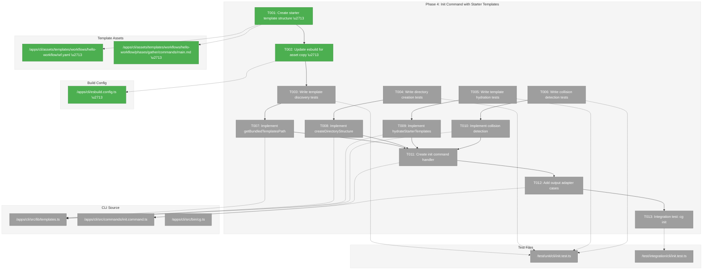
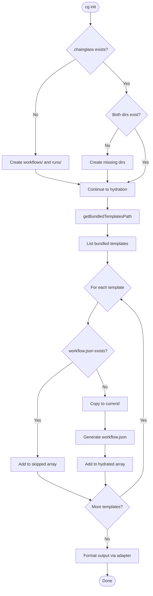
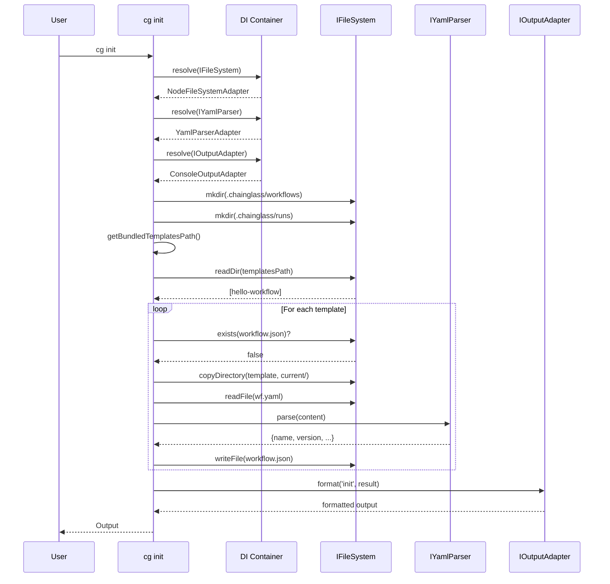

# Phase 4: Init Command with Starter Templates – Tasks & Alignment Brief

**Spec**: [../manage-workflows-spec.md](../../manage-workflows-spec.md)
**Plan**: [../manage-workflows-plan.md](../../manage-workflows-plan.md)
**Date**: 2026-01-24
**Phase Slug**: `phase-4-init-command-starter-templates`

---

## Executive Briefing

### Purpose
This phase implements the `cg init` command that sets up new Chainglass projects with the required directory structure and bundled starter workflow templates. Without this, users must manually create `.chainglass/workflows/` and `.chainglass/runs/` directories and cannot easily get started with a working example workflow.

### What We're Building
A `cg init` command that:
- Creates the `.chainglass/` directory structure (workflows/, runs/)
- Copies bundled starter templates from the npm package to `.chainglass/workflows/<slug>/current/`
- Generates `workflow.json` metadata for each template
- Preserves existing workflows (non-destructive re-run)

Additionally, this phase establishes the **generalized template bundling infrastructure** (DYK-06):
- Category-based asset structure: `apps/cli/assets/templates/workflows/` (extensible to `configs/`, etc.)
- esbuild configuration to copy entire `assets/` tree to `dist/assets/`
- Parameterized path resolution: `getBundledAssetsPath(category)` with dual-strategy npx support (DYK-05)
- Reusable for future needs: first-run config setup, schema templates, etc.

### User Value
Users can initialize a new Chainglass project with a single command (`cg init`) and immediately have:
- A properly structured project directory
- A working example workflow (`hello-workflow`)
- Everything needed to create their first checkpoint and run

### Example
```bash
$ cg init
Initializing Chainglass project...
  Created .chainglass/workflows/
  Created .chainglass/runs/
  Hydrated hello-workflow → .chainglass/workflows/hello-workflow/current/
Done! Run 'cg workflow checkpoint hello-workflow' to create your first checkpoint.

$ tree .chainglass/
.chainglass/
├── runs/
└── workflows/
    └── hello-workflow/
        ├── current/
        │   ├── phases/
        │   │   └── gather/
        │   │       └── commands/
        │   │           └── main.md
        │   └── wf.yaml
        └── workflow.json
```

---

## Objectives & Scope

### Objective
Implement the `cg init` command as specified in plan acceptance criteria AC-10, AC-11.

### Behavior Checklist
- [ ] Creates `.chainglass/workflows/` directory
- [ ] Creates `.chainglass/runs/` directory
- [ ] Copies bundled templates to `workflows/<slug>/current/`
- [ ] Generates `workflow.json` for each template
- [ ] Preserves existing workflows (non-destructive)
- [ ] Works offline (templates bundled in npm package)
- [ ] Reports hydrated templates and any skipped workflows

### Goals

- ✅ Create bundled starter template structure in `apps/cli/assets/templates/`
- ✅ Update esbuild.config.ts to copy assets to dist/
- ✅ Implement `getBundledTemplatesPath()` for runtime path resolution
- ✅ Implement `createDirectoryStructure()` for .chainglass directories
- ✅ Implement `hydrateStarterTemplates()` for template copying
- ✅ Create `cg init` command handler with output formatting
- ✅ Handle collision detection (skip existing workflows)

### Non-Goals (Scope Boundaries)

- ❌ Custom template selection (`--template` flag) - all bundled templates hydrate together
- ❌ Template listing (`cg init --list-starters`) - removed from spec (AC-12)
- ❌ Skip starters option (`cg init --skip-starters`) - removed from spec (AC-13)
- ❌ Remote template fetching - templates are bundled only (per spec Q3)
- ❌ Auto-checkpoint after init - user must run `cg workflow checkpoint` explicitly (per spec Key Concept 5)
- ❌ CLI DI container migration for existing commands - only `cg init` uses container (existing TODO T010)
- ❌ Multiple starter templates - Phase 4 ships with single `hello-workflow` template
- ❌ Template versioning/updates - init is idempotent (skip existing), not update-in-place

---

## Architecture Map

### Component Diagram
<!-- Status: grey=pending, orange=in-progress, green=completed, red=blocked -->
<!-- Updated by plan-6 during implementation -->



### Task-to-Component Mapping

<!-- Status: ⬜ Pending | 🟧 In Progress | ✅ Complete | 🔴 Blocked -->

| Task | Component(s) | Files | Status | Comment |
|------|-------------|-------|--------|---------|
| T001 | Template Assets | apps/cli/assets/templates/workflows/hello-workflow/ | ✅ Complete | Create starter template with wf.yaml, phases |
| T002 | Build Config | apps/cli/esbuild.config.ts | ✅ Complete | Add cpSync for assets/ directory |
| T002a-d | IFileSystem | packages/shared/src/interfaces/, adapters/, fakes/ | ✅ Complete | Add copyDirectory() to interface + implementations (DYK-03) |
| T003-T006 | Test Suite | test/unit/workflow/init-service.test.ts | ⬜ Pending | Unit tests for InitService methods |
| T006a | Interface | packages/workflow/src/interfaces/init-service.interface.ts | ✅ Complete | IInitService: init(), isInitialized(), getInitializationStatus() (DYK-04,07) |
| T006b | Fake | packages/workflow/src/fakes/fake-init-service.ts | ✅ Complete | FakeInitService with call capture + isInitialized preset (DYK-04,07) |
| T006c | DI Token | packages/shared/src/di-tokens.ts | ✅ Complete | INIT_SERVICE token |
| T007 | Contract Tests | test/contracts/init-service.contract.test.ts | ⬜ Pending | Contract tests for Fake/Real parity |
| T008 | Utility | packages/workflow/src/utils/generate-workflow-json.ts | ⬜ Pending | Extract from WorkflowRegistryService (DYK-02) |
| T009 | Service | packages/workflow/src/services/init.service.ts | ⬜ Pending | InitService implementation (DYK-01,02,03,04) |
| T010 | DI Container | packages/workflow/src/container.ts | ⬜ Pending | Register InitService/FakeInitService |
| T010a | CLI Container | apps/cli/src/lib/container.ts | ⬜ Pending | Register IInitService in CLI containers |
| T011 | Init Command | apps/cli/src/commands/init.command.ts | ⬜ Pending | Command handler resolves IInitService from container |
| T012 | Output Adapter | packages/shared/src/adapters/console-output.adapter.ts | ⬜ Pending | Add `init` case to formatSuccess() |
| T013 | Integration | test/integration/cli/init.test.ts | ⬜ Pending | Full init flow with real filesystem |
| T014 | Verification | apps/cli/package.json | ⬜ Pending | npm pack verification for npx distribution (DYK-05) |
| T015 | Init Guard | apps/cli/src/commands/web.command.ts, wf.command.ts | ⬜ Pending | Add isInitialized() check to existing commands (DYK-07) |

---

## Tasks

| Status | ID | Task | CS | Type | Dependencies | Absolute Path(s) | Validation | Subtasks | Notes |
|--------|------|------|-----|------|--------------|------------------|------------|----------|-------|
| [x] | T001 | Create hello-workflow starter template under workflows/ category: assets/templates/workflows/hello-workflow/ with wf.yaml and phases/gather/commands/main.md | 2 | Setup | – | /home/jak/substrate/007-manage-workflows/apps/cli/assets/templates/workflows/hello-workflow/wf.yaml, /home/jak/substrate/007-manage-workflows/apps/cli/assets/templates/workflows/hello-workflow/phases/gather/commands/main.md | wf.yaml valid YAML with name, version, phases array; main.md contains example prompt | – | DYK-06: Category-based structure for future extensibility |
| [x] | T002 | Update esbuild.config.ts to copy assets/ directory to dist/assets/ during build (supports all asset categories) | 2 | Setup | T001 | /home/jak/substrate/007-manage-workflows/apps/cli/esbuild.config.ts | `just build` succeeds; `ls apps/cli/dist/assets/templates/workflows/hello-workflow/wf.yaml` exists | – | DYK-06: Generic asset bundling |
| [x] | T002a | Write tests for IFileSystem.copyDirectory() - recursive copy, preserves structure, handles nested dirs | 2 | Test | – | /home/jak/substrate/007-manage-workflows/test/unit/shared/filesystem.test.ts | Tests: copies files, creates subdirs, idempotent, handles empty dirs | – | DYK-03: Proper interface extension; TDD RED phase |
| [x] | T002b | Add copyDirectory(src, dest, options?) to IFileSystem interface with JSDoc; options: { exclude?: string[] } for skipping dirs | 2 | Core | T002a | /home/jak/substrate/007-manage-workflows/packages/shared/src/interfaces/filesystem.interface.ts | Interface compiles, exports properly | – | DYK-03: Clean abstraction |
| [x] | T002c | Implement copyDirectory() in NodeFileSystemAdapter using recursive readDir/stat/mkdir/copyFile pattern with path safety via IPathResolver | 3 | Core | T002b | /home/jak/substrate/007-manage-workflows/packages/shared/src/adapters/node-filesystem.adapter.ts | Tests from T002a pass with real adapter | – | Port logic from WorkflowRegistryService:810-863; preserve SEC-002 path validation |
| [x] | T002d | Implement copyDirectory() in FakeFileSystem with in-memory recursive copy | 2 | Core | T002b | /home/jak/substrate/007-manage-workflows/packages/shared/src/fakes/fake-filesystem.ts | Tests from T002a pass with fake; contract test parity | – | Enables unit testing of T009 |
| [x] | T003 | Write tests for getBundledAssetsPath(category) - resolves to dist/assets/templates/{category}/ at runtime; test with 'workflows' category | 2 | Test | T002 | /home/jak/substrate/007-manage-workflows/test/unit/workflow/init-service.test.ts | Tests: path exists for 'workflows', contains hello-workflow dir, throws for unknown category | – | DYK-06: Parameterized by category; TDD RED phase |
| [x] | T004 | Write tests for createDirectoryStructure() - creates .chainglass/workflows and .chainglass/runs | 2 | Test | – | /home/jak/substrate/007-manage-workflows/test/unit/workflow/init-service.test.ts | Tests: both dirs created, idempotent on re-run | – | TDD RED phase |
| [x] | T005 | Write tests for hydrateStarterTemplates() - copies template to current/, creates workflow.json | 3 | Test | – | /home/jak/substrate/007-manage-workflows/test/unit/workflow/init-service.test.ts | Tests: files copied, workflow.json has slug/name/created_at | – | TDD RED phase |
| [x] | T006 | Write tests for collision detection - skips existing workflows by default, overwrites with force=true, reports in result.skipped or result.overwritten | 2 | Test | – | /home/jak/substrate/007-manage-workflows/test/unit/workflow/init-service.test.ts | Tests: default skips existing, force overwrites, correct arrays populated | – | DYK-08: force flag; TDD RED phase |
| [x] | T006a | Define IInitService interface with: init(projectDir, options?) → InitResult where options: { force?: boolean }; isInitialized(projectDir) → boolean; getInitializationStatus(projectDir) → InitializationStatus. InitResult includes overwrittenTemplates array | 2 | Core | – | /home/jak/substrate/007-manage-workflows/packages/workflow/src/interfaces/init-service.interface.ts, /home/jak/substrate/007-manage-workflows/packages/workflow/src/interfaces/index.ts | Interface compiles, exported from @chainglass/workflow | – | DYK-04, DYK-07, DYK-08: Service layer + init guard + force flag |
| [x] | T006b | Create FakeInitService with call capture, preset results for init/isInitialized/getInitializationStatus, error injection following FakeWorkflowRegistry pattern | 2 | Core | T006a | /home/jak/substrate/007-manage-workflows/packages/workflow/src/fakes/fake-init-service.ts, /home/jak/substrate/007-manage-workflows/packages/workflow/src/fakes/index.ts | FakeInitService exported; has setInitResult(), setIsInitialized(), getInitCalls() | – | DYK-04, DYK-07: Enables unit testing |
| [x] | T006c | Add INIT_SERVICE token to WORKFLOW_DI_TOKENS | 1 | Core | T006a | /home/jak/substrate/007-manage-workflows/packages/shared/src/di-tokens.ts | Token defined and exported | – | Per ADR-0004 |
| [ ] | T007 | Write contract tests for IInitService - same tests pass for Fake and Real on init(), isInitialized(), getInitializationStatus() | 2 | Test | T006a, T006b | /home/jak/substrate/007-manage-workflows/test/contracts/init-service.contract.test.ts | Contract tests: empty project, existing workflows preserved, template hydration, isInitialized returns false/true correctly | – | DYK-07: Include init guard tests; TDD RED phase |
| [x] | T008 | Extract generateWorkflowJson() from WorkflowRegistryService to packages/workflow/src/utils/generate-workflow-json.ts | 2 | Core | – | /home/jak/substrate/007-manage-workflows/packages/workflow/src/utils/generate-workflow-json.ts, /home/jak/substrate/007-manage-workflows/packages/workflow/src/utils/index.ts | Utility exported; existing checkpoint tests pass | – | DYK-02: Reuse existing logic |
| [x] | T009 | Implement InitService with constructor(fs, pathResolver, yamlParser); implements init(projectDir, options?) with force flag support - default skips existing, force=true overwrites. Uses getBundledAssetsPath (DYK-05,06), createDirectoryStructure, hydrateStarterTemplates with IFileSystem.copyDirectory (DYK-03), generateWorkflowJson (DYK-02) | 4 | Core | T002d, T003, T004, T005, T006, T006a, T008 | /home/jak/substrate/007-manage-workflows/packages/workflow/src/services/init.service.ts | All unit tests T003-T006 pass; contract tests T007 pass; force overwrites correctly | – | DYK-01,02,03,04,08: Full service + force flag |
| [-] | T010 | Register InitService in createWorkflowProductionContainer with useFactory pattern; register FakeInitService in createWorkflowTestContainer | 2 | Core | T006b, T006c, T009 | /home/jak/substrate/007-manage-workflows/packages/workflow/src/container.ts | Container resolves IInitService correctly | – | SKIPPED: InitService requires bundleDir (CLI context), register in CLI container only |
| [-] | T010a | Register IInitService in createCliProductionContainer and createCliTestContainer | 2 | Core | T009 | /home/jak/substrate/007-manage-workflows/apps/cli/src/lib/container.ts | CLI container resolves IInitService | – | DEFERRED: InitService created in command handler; bundleDir is dynamic from __dirname |
| [x] | T011 | Create init.command.ts with registerInitCommand(program); add --force/-f flag; resolves IInitService from container; calls service.init(projectDir, { force }); formats output via IOutputAdapter | 2 | Core | T009 | /home/jak/substrate/007-manage-workflows/apps/cli/src/commands/init.command.ts, /home/jak/substrate/007-manage-workflows/apps/cli/src/bin/cg.ts | `cg init --help` shows --force flag; `cg init -f` overwrites existing | – | DYK-04, DYK-08: Proper DI + force flag |
| [x] | T012 | Add `init` case to ConsoleOutputAdapter.formatSuccess() - displays created dirs, hydrated templates, overwritten templates (if force), skipped workflows | 2 | Core | T011 | /home/jak/substrate/007-manage-workflows/apps/cli/src/commands/init.command.ts | Console output shows created/hydrated/overwritten/skipped sections | – | INTEGRATED: Custom formatting in init.command.ts with chalk colors |
| [ ] | T013 | Integration test: run cg init on temp directory, verify structure and files | 2 | Integration | T012 | /home/jak/substrate/007-manage-workflows/test/integration/cli/init.test.ts | Full init creates .chainglass/workflows/hello-workflow/current/wf.yaml | – | Real filesystem ops |
| [ ] | T014 | Verify npx distribution: run `npm pack`, inspect tarball for dist/assets/templates/, test `npx` from extracted tarball in temp dir | 2 | Verification | T013 | /home/jak/substrate/007-manage-workflows/apps/cli/package.json | `tar tzf *.tgz \| grep assets/templates` shows files; npx test passes | – | DYK-05: npx distribution verification |
| [ ] | T015 | Add initialization guard to existing commands: cg web, cg workflow *, cg wf *, cg phase *. Resolve IInitService, call isInitialized(), exit with helpful error if false | 3 | Core | T010a | /home/jak/substrate/007-manage-workflows/apps/cli/src/commands/web.command.ts, /home/jak/substrate/007-manage-workflows/apps/cli/src/commands/wf.command.ts | Running `cg web` in uninitialized dir exits with "Project not initialized. Run 'cg init' first." | – | DYK-07: Graceful error for uninitialized projects |

---

## Alignment Brief

### Prior Phases Review

#### Phase-by-Phase Summary

**Phase 1: Core IWorkflowRegistry Infrastructure**
- Established the foundation for workflow template management
- Created `IWorkflowRegistry` interface with `list()`, `info()`, and later `checkpoint()`/`restore()`/`versions()` methods
- Implemented `WorkflowRegistryService` (~900 lines) with full checkpoint/restore logic
- Created `IHashGenerator` interface and `HashGeneratorAdapter` for content hashing
- Established error codes E030, E033-E039 for workflow operations
- Created `FakeWorkflowRegistry` with call capture for testing
- Set up DI container infrastructure in CLI (`createCliProductionContainer()`, `createCliTestContainer()`)

**Phase 2: Checkpoint & Versioning System**
- Implemented ordinal generation with gap handling (`Math.max(...ordinals) + 1`)
- Implemented content hash generation (8-char SHA-256 prefix, deterministic via sorted paths)
- Created private `copyDirectoryRecursive()` helper using IFileSystem methods
- Established hash-first atomic naming pattern for checkpoints
- Implemented workflow.json auto-generation from wf.yaml metadata during checkpoint
- Established `.checkpoint.json` metadata format with ordinal, hash, created_at, comment

**Phase 3: Compose Extension for Versioned Runs**
- Extended `WorkflowService.compose()` to require checkpoints for registry-based workflows
- Added `IWorkflowRegistry` as required 5th constructor parameter (DYK-01)
- Implemented checkpoint resolution with prefix matching and ambiguity guard
- Created versioned run paths: `<runsDir>/<slug>/<version>/run-YYYY-MM-DD-NNN/`
- Extended wf-status.json with optional fields: `slug`, `version_hash`, `checkpoint_comment`
- Established version-scoped run ordinals (DYK-03)

#### Cumulative Deliverables

**From Phase 1 (Available for Phase 4)**:
| Type | Path | Usage |
|------|------|-------|
| Interface | `/packages/workflow/src/interfaces/workflow-registry.interface.ts` | `IWorkflowRegistry.list()` to verify init worked |
| Service | `/packages/workflow/src/services/workflow-registry.service.ts` | Available but not directly used in init |
| DI Container | `/apps/cli/src/lib/container.ts` | `createCliProductionContainer()` for init command |
| Fake | `/packages/workflow/src/fakes/fake-workflow-registry.ts` | For unit testing init |

**From Phase 2 (Available for Phase 4)**:
| Type | Path | Usage |
|------|------|-------|
| Method | `WorkflowRegistryService.checkpoint()` | User runs after init |
| Pattern | `copyDirectoryRecursive()` | Reference for template copy logic |
| Metadata | workflow.json format | Generate during hydration |

**From Phase 3 (Available for Phase 4)**:
| Type | Path | Usage |
|------|------|-------|
| Signature | `ComposeOptions.checkpoint` | User uses after checkpointing |

#### Pattern Evolution

1. **DI Container Pattern**: Phase 1 established `createCliProductionContainer()` / `createCliTestContainer()` factory pattern. Phase 4 must use this for the init command handler.

2. **File System Operations**: Phases 1-2 established pattern of using `IFileSystem` interface methods. Phase 4 follows this for directory creation and template copying.

3. **Result Object Pattern**: All phases return `{ errors: ResultError[], ...data }` structures. Phase 4's `InitResult` follows this pattern.

4. **Error Code Conventions**: E030-E039 reserved for workflow operations. Phase 4 may add E040+ if needed (none anticipated).

#### Recurring Issues

1. **Constructor Injection Cascade**: Adding dependencies requires updating all instantiation sites. Phase 4 avoids this by using service layer methods (init doesn't modify existing services).

2. **Path Handling**: All path operations use `IPathResolver.join()` for security. Phase 4 follows this pattern.

3. **Test Setup Complexity**: FakeFileSystem requires explicit state setup. Phase 4 tests use this pattern.

#### Cross-Phase Learnings

- **DYK pattern effective**: Pre-implementation insight sessions (DYK-01 through DYK-05) prevented mid-phase pivots in Phase 3
- **TDD RED phase first**: Writing failing tests before implementation ensures coverage
- **Optional fields for compatibility**: Using `?` markers prevents breaking existing files

#### Reusable Test Infrastructure

From any prior phase:
- `FakeFileSystem` - virtual filesystem for unit tests
- `FakeYamlParser` - YAML parsing with preset returns
- `FakePathResolver` - path operations with call capture
- `FakeWorkflowRegistry` - registry operations with presets
- `createCliTestContainer()` - fresh DI container per test

#### Architectural Continuity

**Patterns to Maintain**:
- All services resolved from DI container, never instantiated directly
- Result objects never throw; errors in `.errors` array
- Use `IFileSystem` interface, not `fs` module directly
- Path operations via `IPathResolver.join()`

**Anti-Patterns to Avoid**:
- Direct adapter instantiation in command handlers (violates ADR-0004)
- Synchronous file I/O blocking event loop
- Hardcoded paths without resolution

### Critical Findings Affecting This Phase

| Finding | Impact | Addressed By |
|---------|--------|--------------|
| **CD04**: CLI commands bypass DI container | Init command MUST use container pattern | T011 uses `createCliProductionContainer()` |
| **CD06**: Bundled templates need npm packaging | Templates must be copied to dist/ during build | T001, T002 |
| **HD07**: Services must use interfaces only | Template operations use IFileSystem, IYamlParser | T007, T008, T009 |
| **CD03**: workflow.json lifecycle undefined | Init generates workflow.json from wf.yaml metadata | T009 |

### ADR Decision Constraints

| ADR | Decision | Constraint for Phase 4 |
|-----|----------|------------------------|
| **ADR-0002** | Exemplar-driven development | Starter template serves as exemplar; must pass schema validation |
| **ADR-0004** | DI container architecture | Init command handler must resolve services from container; no direct instantiation |

**Mapping**:
- ADR-0002: T001 creates exemplar template structure
- ADR-0004: T011 uses container resolution pattern

### Invariants & Guardrails

- **Idempotency**: Re-running `cg init` on initialized project skips existing workflows, creates missing structure
- **No Data Loss**: Existing `.chainglass/` content preserved; never overwrite
- **Offline Operation**: Templates bundled in npm package; no network required
- **Path Security**: All path operations use `pathResolver.join()`

### Inputs to Read

| File | Purpose |
|------|---------|
| `/apps/cli/esbuild.config.ts` | Understand current build pattern for adding asset copy |
| `/apps/cli/src/commands/wf.command.ts` | Reference for command registration pattern |
| `/apps/cli/src/lib/container.ts` | DI container factory for resolution |
| `/packages/shared/src/adapters/console-output.adapter.ts` | Output formatting pattern |

### Visual Alignment Aids

#### Flow Diagram: Init Command Flow



#### Sequence Diagram: Init with DI Container



### Test Plan (TDD)

| Test ID | Test Name | Type | Fixture | Expected Output | Rationale |
|---------|-----------|------|---------|-----------------|-----------|
| T003-1 | getBundledTemplatesPath returns valid directory | Unit | None | Path ends with assets/templates, exists | Verify runtime resolution works |
| T003-2 | getBundledTemplatesPath contains hello-workflow | Unit | None | Directory contains hello-workflow/ | Verify template bundled |
| T004-1 | createDirectoryStructure creates workflows dir | Unit | FakeFileSystem empty | .chainglass/workflows/ exists | Core directory creation |
| T004-2 | createDirectoryStructure creates runs dir | Unit | FakeFileSystem empty | .chainglass/runs/ exists | Core directory creation |
| T004-3 | createDirectoryStructure is idempotent | Unit | FakeFileSystem with existing | No error, dirs still exist | Re-run safety |
| T005-1 | hydrateStarterTemplates copies wf.yaml | Unit | FakeFileSystem, bundled template | current/wf.yaml exists | Template copy |
| T005-2 | hydrateStarterTemplates copies phases | Unit | FakeFileSystem, bundled template | current/phases/gather/commands/main.md exists | Nested copy |
| T005-3 | hydrateStarterTemplates creates workflow.json | Unit | FakeFileSystem, bundled template | workflow.json with slug, name, created_at | Metadata generation |
| T006-1 | collision detection skips existing workflow | Unit | FakeFileSystem with existing hello-workflow | Existing files unchanged | Non-destructive |
| T006-2 | collision detection reports skipped in result | Unit | FakeFileSystem with existing | result.skipped includes 'hello-workflow' | User feedback |
| T013-1 | integration: cg init creates full structure | Integration | Temp directory | .chainglass/workflows/hello-workflow/current/wf.yaml exists | Full flow |
| T013-2 | integration: cg init preserves existing | Integration | Temp with existing custom workflow | Custom workflow unchanged | Non-destructive |

### Step-by-Step Implementation Outline

1. **T001**: Create starter template (DYK-06: category-based structure)
   - Create `apps/cli/assets/templates/workflows/hello-workflow/wf.yaml`
   - Create `apps/cli/assets/templates/workflows/hello-workflow/phases/gather/commands/main.md`
   - Note: `workflows/` category allows future `configs/`, `schemas/` etc.
   - Validate wf.yaml structure matches schema

2. **T002**: Update esbuild (DYK-06: generic asset bundling)
   - Add cpSync call for assets/ to dist/assets/ (entire assets tree)
   - Follow existing pattern from copyStandaloneAssets()
   - Verify: `dist/assets/templates/workflows/hello-workflow/` exists after build

2a-d. **T002a-T002d**: Add IFileSystem.copyDirectory() (DYK-03)
   - T002a: Write tests for copyDirectory() in test/unit/shared/filesystem.test.ts
   - T002b: Add copyDirectory(src, dest, options?) to IFileSystem interface
   - T002c: Implement in NodeFileSystemAdapter (port logic from WorkflowRegistryService:810-863)
   - T002d: Implement in FakeFileSystem for unit test support
   - Preserve SEC-002 path safety validation in implementation

3. **T003-T006**: Write failing tests (TDD RED)
   - Create test/unit/workflow/init-service.test.ts
   - Use FakeFileSystem, FakeYamlParser, FakePathResolver for unit tests
   - Each test includes Test Doc block
   - T003: getBundledAssetsPath('workflows') resolves correctly (DYK-06: parameterized)
   - T004: createDirectoryStructure creates both dirs
   - T005: hydrateStarterTemplates copies and generates workflow.json
   - T006: collision detection skips existing workflows

4. **T006a-T006c**: Create IInitService infrastructure (DYK-04, DYK-07, DYK-08)
   - T006a: Define IInitService interface in packages/workflow/src/interfaces/
     - Method: `init(projectDir: string, options?: InitOptions): Promise<InitResult>` (DYK-08)
     - Method: `isInitialized(projectDir: string): Promise<boolean>` (DYK-07)
     - Method: `getInitializationStatus(projectDir: string): Promise<InitializationStatus>` (DYK-07)
     - InitOptions: `{ force?: boolean }` (DYK-08)
     - InitResult: `{ errors: ResultError[], createdDirs: string[], hydratedTemplates: string[], overwrittenTemplates: string[], skippedTemplates: string[] }`
     - InitializationStatus: `{ initialized: boolean, missingDirs: string[], suggestedAction: string }`
   - T006b: Create FakeInitService in packages/workflow/src/fakes/
     - Follow FakeWorkflowRegistry pattern with call capture
     - Methods: setInitResult(), setIsInitialized(), getInitCalls(), reset()
     - Call capture includes options parameter for force flag verification
   - T006c: Add INIT_SERVICE token to WORKFLOW_DI_TOKENS

5. **T007**: Write contract tests for IInitService
   - Create test/contracts/init-service.contract.test.ts
   - Tests run against both FakeInitService and InitService
   - Scenarios: empty project, existing workflows, template hydration, error handling
   - Include isInitialized() tests: returns false before init, true after (DYK-07)
   - Include force flag tests: default skips, force=true overwrites (DYK-08)

6. **T008**: Extract generateWorkflowJson() utility (DYK-02)
   - Extract from WorkflowRegistryService (lines 869-898)
   - Create packages/workflow/src/utils/generate-workflow-json.ts
   - Export from packages/workflow/src/utils/index.ts

7. **T009**: Implement InitService (TDD GREEN)
   - Create packages/workflow/src/services/init.service.ts
   - Constructor injects: IFileSystem, IPathResolver, IYamlParser
   - Private methods:
     - getBundledAssetsPath(category: string): dual-strategy pattern (DYK-05, DYK-06):
       1. Try `path.join(__dirname, 'assets', 'templates', category)` (works in bundled CLI)
       2. Fallback: `require.resolve('@chainglass/cli/package.json')` → navigate to dist/assets/templates/{category}/
       3. Validate path exists before returning
       4. InitService calls with 'workflows'; future services use 'configs' etc.
     - createDirectoryStructure(): uses IFileSystem.mkdir
     - hydrateStarterTemplates(options): uses IFileSystem.copyDirectory (DYK-03)
   - Public method: init(projectDir, options?) → InitResult (DYK-08)
     - Default (no force): skip existing workflows → skippedTemplates[]
     - With force=true: overwrite existing workflows → overwrittenTemplates[]
   - Uses generateWorkflowJson utility (DYK-02)
   - Collision detection with force flag support (DYK-08)

8. **T010-T010a**: Register in DI containers
   - T010: Register in packages/workflow/src/container.ts
     - Production: InitService via useFactory
     - Test: FakeInitService via useValue
   - T010a: Register in apps/cli/src/lib/container.ts
     - Mirror workflow container registrations

9. **T011**: Create command handler
   - Create apps/cli/src/commands/init.command.ts
   - Add `--force` / `-f` flag via Commander (DYK-08)
   - Resolve IInitService from container (not direct instantiation!)
   - Call service.init(projectDir, { force: options.force })
   - Format output via resolved IOutputAdapter
   - Update apps/cli/src/bin/cg.ts to register command

9. **T012**: Add output adapter case (DYK-08)
   - Add 'init' case to ConsoleOutputAdapter.formatSuccess()
   - Display created directories
   - Display hydrated templates (new)
   - Display overwritten templates (if force used)
   - Display skipped workflows (if any, when not using force)

10. **T013**: Integration test
    - Use vitest with real filesystem in temp directory
    - Run full init flow
    - Verify file structure

11. **T014**: Verify npx distribution (DYK-05)
    - Run `npm pack` in apps/cli/
    - Inspect tarball: `tar tzf *.tgz | grep assets/templates`
    - Test in isolated temp directory:
      ```bash
      mkdir /tmp/npx-test && cd /tmp/npx-test
      npm install /path/to/chainglass-cli-*.tgz
      npx cg init
      ```

12. **T015**: Add initialization guard to existing commands (DYK-07)
    - Update web.command.ts: resolve IInitService, call isInitialized()
    - Update wf.command.ts: same pattern for workflow/wf/phase commands
    - If not initialized, exit with:
      ```
      Error: Project not initialized.

      This command requires an initialized Chainglass project.
      Run 'cg init' to initialize this directory.
      ```
    - Use process.exit(1) for proper exit code

### Commands to Run

```bash
# Run Phase 4 unit tests
just test -- test/unit/workflow/init-service.test.ts

# Run Phase 4 contract tests
just test -- test/contracts/init-service.contract.test.ts

# Run Phase 4 integration tests
just test -- test/integration/cli/init.test.ts

# Verify build includes templates
just build && ls -la apps/cli/dist/assets/templates/hello-workflow/

# Full quality gate
just check

# Verify cg init works locally
node apps/cli/dist/cli.cjs init --help

# Verify npx distribution (DYK-05)
cd apps/cli && npm pack
tar tzf chainglass-cli-*.tgz | grep assets/templates
# Should show: package/dist/assets/templates/hello-workflow/wf.yaml
```

### Risks/Unknowns

| Risk | Severity | Likelihood | Mitigation |
|------|----------|------------|------------|
| esbuild copy timing | Medium | Low | Copy before bundle, verify in build script |
| import.meta.url resolution in CJS bundle | High | Medium | Test with actual bundled output, not source |
| Template path differs in dev vs installed | Medium | Medium | Use consistent resolution pattern, test both |
| Disk permission errors during init | Low | Low | Return clear error with path in message |

### Ready Check

Before implementation:

- [x] Plan section 4 (Phase 4) reviewed
- [x] Spec acceptance criteria AC-10, AC-11 understood
- [x] Prior phase deliverables (DI container, IFileSystem) available
- [x] ADR-0002 exemplar requirements understood
- [x] ADR-0004 container pattern understood
- [ ] ADR constraints mapped to tasks (T001 → ADR-0002, T011 → ADR-0004)
- [ ] All task absolute paths verified
- [ ] Build verification step confirmed (T002)

---

## Phase Footnote Stubs

_Populated during implementation by plan-6a-update-progress._

| Footnote | Task | Description |
|----------|------|-------------|
| | | |

---

## Evidence Artifacts

Implementation evidence will be written to:
- `docs/plans/007-manage-workflows/tasks/phase-4-init-command-starter-templates/execution.log.md`

Supporting files may include:
- Build output verification screenshots
- Test coverage reports

---

## Discoveries & Learnings

_Populated during implementation by plan-6. Log anything of interest to your future self._

| Date | Task | Type | Discovery | Resolution | References |
|------|------|------|-----------|------------|------------|
| 2026-01-24 | T007 | gotcha | **DYK-01**: `import.meta.url` becomes empty object `{}` in esbuild CJS bundles. The documented pattern would fail at runtime. | Use `getModuleDir()` from `@chainglass/shared/config` which implements 4-tier fallback: import.meta.dirname → fileURLToPath → __dirname → process.cwd() | `packages/shared/src/config/paths/user-config.ts:13-32`, `apps/cli/src/commands/web.command.ts:28-46` |
| 2026-01-24 | T008a, T009 | decision | **DYK-02**: Phase 2 already implemented `generateWorkflowJson()` as private method in WorkflowRegistryService (lines 869-898). Duplicating this logic in init would violate DRY. | Extract to shared utility `packages/workflow/src/utils/generate-workflow-json.ts`; both init and checkpoint() use same tested function | `packages/workflow/src/services/workflow-registry.service.ts:869-898`, checkpoint conditional at line 624-627 |
| 2026-01-24 | T002a-d, T009 | decision | **DYK-03**: IFileSystem interface lacks copyDirectory() method. Phase 2 implemented private `copyDirectoryRecursive()` (~50 lines) in WorkflowRegistryService. Rather than duplicating or extracting to utility, properly extend the interface. | Add `copyDirectory(src, dest, options?)` to IFileSystem; implement in NodeFileSystemAdapter (preserving SEC-002 path safety) and FakeFileSystem; enables clean template copying in T009 | `packages/shared/src/interfaces/filesystem.interface.ts`, `workflow-registry.service.ts:810-863` |
| 2026-01-24 | T006a-c, T009, T010, T011 | decision | **DYK-04**: Original plan had init functions in templates.ts bypassing service layer pattern. Every other command uses interface→service→fake pattern per ADR-0004. Init must not be an exception. | Create full IInitService infrastructure: interface, InitService, FakeInitService with call capture, DI token, container registration. Command handler resolves service from container. | `FakeWorkflowRegistry` pattern, ADR-0004, tasks.md Alignment Brief "Patterns to Maintain" |
| 2026-01-25 | T009 | research-needed | **DYK-05**: npx distribution requires robust asset path resolution. `__dirname` in esbuild CJS bundles points to bundle location (dist/), which works. For maximum npx compatibility, use dual-strategy: (1) `__dirname` + relative path to assets, (2) fallback to `require.resolve('@chainglass/cli/package.json')` + navigate to dist/assets/. Also: `package.json` must have `"files": ["dist"]` to include assets in npm publish. Test with `npm pack` before publishing. | Implement dual-strategy in `getBundledAssetsPath(category)`: try `path.join(__dirname, 'assets', 'templates', category)` first, fall back to `require.resolve()` pattern. Add verification step to build script. | Perplexity research 2026-01-25, esbuild issue #2200, npm docs on files field |
| 2026-01-25 | T001, T002, T003, T009 | insight | **DYK-06**: Templates aren't just for workflow init. First-run config setup (~/.config/chainglass), future features may need templates. The asset structure should support multiple categories, not be bound to workflows. | Use category-based directory structure: `assets/templates/workflows/`, `assets/templates/configs/` etc. Parameterize path resolution: `getBundledAssetsPath(category: string)`. InitService calls with 'workflows'; future IConfigSetupService uses 'configs'. | User insight 2026-01-25 |
| 2026-01-25 | T006a, T006b, T007, T015 | insight | **DYK-07**: Commands like `cg web`, `cg workflow *`, `cg wf *` require an initialized project. Running them in an uninitialized directory should exit gracefully with helpful error, not crash with cryptic errors. | Add `isInitialized(projectDir)` and `getInitializationStatus(projectDir)` to IInitService. Existing commands check initialization and exit with "Project not initialized. Run 'cg init' first." if false. | User insight 2026-01-25 |
| 2026-01-25 | T006, T006a, T009, T011, T012 | insight | **DYK-08**: During development/testing, need to reset to fresh templates. Default behavior (skip existing) is safe for production, but `--force` flag needed to overwrite existing workflows. | Add `options?: { force?: boolean }` to `init()`. Default: skip existing (safe). With force: overwrite and track in `result.overwrittenTemplates[]`. CLI exposes as `cg init --force` / `cg init -f`. | User insight 2026-01-25 |

**Types**: `gotcha` | `research-needed` | `unexpected-behavior` | `workaround` | `decision` | `debt` | `insight`

**What to log**:
- Things that didn't work as expected
- External research that was required
- Implementation troubles and how they were resolved
- Gotchas and edge cases discovered
- Decisions made during implementation
- Technical debt introduced (and why)
- Insights that future phases should know about

_See also: `execution.log.md` for detailed narrative._

---

## Directory Layout

```
docs/plans/007-manage-workflows/
├── manage-workflows-plan.md
├── manage-workflows-spec.md
└── tasks/
    ├── phase-1-core-iworkflowregistry-infrastructure/
    │   ├── tasks.md
    │   └── execution.log.md
    ├── phase-2-checkpoint-versioning-system/
    │   ├── tasks.md
    │   └── execution.log.md
    ├── phase-3-compose-extension-versioned-runs/
    │   ├── tasks.md
    │   └── execution.log.md
    └── phase-4-init-command-starter-templates/
        ├── tasks.md           ← YOU ARE HERE
        └── execution.log.md   ← Created by plan-6
```

---

## Critical Insights Discussion

**Session**: 2026-01-25
**Context**: Phase 4: Init Command with Starter Templates - Tasks & Alignment Brief
**Analyst**: AI Clarity Agent
**Reviewer**: Development Team
**Format**: Water Cooler Conversation (5 Critical Insights)

### Insight 1: import.meta.url Won't Work in CJS Bundle

**Did you know**: The `import.meta.url` pattern specified in the original tasks would fail at runtime because esbuild CJS bundles transform `import.meta` into an empty object `{}`.

**Implications**:
- `fileURLToPath({})` would throw or return undefined
- Template discovery would fail silently or crash
- Users running `cg init` would get cryptic errors

**Options Considered**:
- Option A: Copy fallback pattern from web.command.ts - Local duplication
- Option B: Use shared `getModuleDir()` utility - DRY, tested
- Option C: Use import.meta.url as documented - Not feasible

**AI Recommendation**: Option B - Use getModuleDir()
- Reasoning: Already tested utility with 4-tier fallback handles all runtime environments

**Discussion Summary**: User selected Option B immediately, recognizing the value of reusing tested infrastructure.

**Decision**: Use `getModuleDir()` from `@chainglass/shared/config`

**Action Items**:
- [x] Updated tasks.md references from import.meta.url to getModuleDir()
- [x] Added DYK-01 to Discoveries & Learnings

**Affects**: T007, T009

---

### Insight 2: workflow.json Generation Logic Already Exists

**Did you know**: Phase 2 already implemented `generateWorkflowJson()` as a private method in WorkflowRegistryService (~30 lines). Duplicating this in init would violate DRY.

**Implications**:
- Two implementations to maintain if duplicated
- Existing logic already handles schema validation, path security
- checkpoint() already has conditional workflow.json generation

**Options Considered**:
- Option A: Duplicate logic in templates.ts - Code duplication
- Option B: Let checkpoint() handle it (lazy generation) - Simpler but delayed visibility
- Option C: Extract to shared utility - DRY, single source of truth

**AI Recommendation**: Option C - Extract to shared utility
- Reasoning: Already tested, maintains path security, both init and checkpoint can use it

**Discussion Summary**: User selected Option C for proper code reuse.

**Decision**: Extract `generateWorkflowJson()` to `packages/workflow/src/utils/generate-workflow-json.ts`

**Action Items**:
- [x] Added T008a task for extraction
- [x] Updated T009 dependencies
- [x] Added DYK-02 to Discoveries & Learnings

**Affects**: T008a (new), T009

---

### Insight 3: IFileSystem Has No copyDirectory Method

**Did you know**: The IFileSystem interface only has `copyFile()` - no `copyDirectory()`. Phase 2 implemented a private `copyDirectoryRecursive()` helper (~50 lines) that would need to be duplicated or extracted.

**Implications**:
- Template copying requires directory recursion
- Phase 2's implementation includes SEC-002 path safety validation
- Extracting to utility vs extending interface is an architectural choice

**Options Considered**:
- Option A: Add copyDirectory() to IFileSystem interface - Clean API, proper abstraction
- Option B: Duplicate logic locally - Quick but creates tech debt
- Option C: Extract to shared utility - Avoids interface change

**AI Recommendation**: Option C initially, but user chose Option A

**Discussion Summary**: User insisted on Option A ("do this properly") to maintain architectural consistency and provide a clean abstraction for all filesystem operations.

**Decision**: Add `copyDirectory(src, dest, options?)` to IFileSystem interface with implementations in NodeFileSystemAdapter and FakeFileSystem

**Action Items**:
- [x] Added T002a-d tasks for interface extension and implementations
- [x] Updated T009 to use IFileSystem.copyDirectory()
- [x] Added DYK-03 to Discoveries & Learnings

**Affects**: IFileSystem interface, NodeFileSystemAdapter, FakeFileSystem, T009

---

### Insight 4: Init Functions Bypass Service Layer Pattern

**Did you know**: The original plan created template functions directly in `templates.ts` called by the command handler, bypassing the service layer pattern used everywhere else in the codebase.

**Implications**:
- Every other command uses interface→service→fake pattern
- ADR-0004 mandates DI container usage
- Testing would require mocking at filesystem level instead of service level
- Init would become the only architectural exception

**Options Considered**:
- Option A: Create IInitService with full service pattern - Consistent, testable, ADR-0004 compliant
- Option B: Keep functions without interface - Simpler but violates patterns
- Option C: Add init to IWorkflowRegistry - Wrong abstraction

**AI Recommendation**: Option A - Full service pattern

**Discussion Summary**: User emphatically confirmed Option A ("yes it must be A, we must not violate our patterns").

**Decision**: Create full IInitService infrastructure: interface, InitService, FakeInitService with call capture, DI token, container registration

**Action Items**:
- [x] Added T006a-c tasks for interface infrastructure
- [x] Updated T007 to contract tests
- [x] Updated T009 to InitService implementation
- [x] Added T010, T010a for container registration
- [x] Updated T011 to resolve from container
- [x] Added DYK-04 to Discoveries & Learnings

**Affects**: Entire task structure reorganized around service pattern

---

### Insight 5: Template Discovery for npx Distribution

**Did you know**: The plan assumes `readDir()` on bundled templates folder works, but npx distribution has specific requirements for asset path resolution that differ from local development.

**Implications**:
- npx executes from temporary cache directory
- `__dirname` in esbuild CJS bundles points to bundle location (dist/)
- Need fallback strategy for different execution contexts
- Must verify assets are included in npm publish

**Options Considered**:
- Option A: Use readDir() at runtime with dual-strategy path resolution - Proven pattern, npx compatible
- Option B: Generate templates-manifest.json during build - Over-engineering for single template
- Option C: Hardcode template slugs - Brittle, violates open-closed principle

**AI Recommendation**: Option A with dual-strategy pattern

**Discussion Summary**: Perplexity research confirmed best practices. User triggered deep research which revealed: (1) `require.resolve()` is gold standard for npx, (2) dual-strategy pattern recommended, (3) `npm pack` verification essential before publishing.

**Decision**: Use readDir() with dual-strategy path resolution: `__dirname` first, `require.resolve('@chainglass/cli/package.json')` fallback

**Action Items**:
- [x] Updated T009 getBundledTemplatesPath() implementation guidance
- [x] Added T014 npx distribution verification task
- [x] Updated Commands to Run with npm pack verification
- [x] Added DYK-05 to Discoveries & Learnings

**Affects**: T009, T014 (new)

---

### Insight 6: Templates Are Not Just for Workflow Init

**Did you know**: The original plan tightly coupled the template system to workflow initialization, but templates are needed elsewhere too - first-run config setup (~/.config/chainglass), potential future features, etc.

**Implications**:
- Hardcoding paths to `templates/hello-workflow/` limits reusability
- Future config setup would need to duplicate the entire bundling infrastructure
- Asset path resolution should be category-aware, not workflow-specific

**Options Considered**:
- Option A: Category-based structure with parameterized path resolution - Extensible, clean
- Option B: Keep workflow-specific, duplicate for config later - Quick but violates DRY
- Option C: Abstract everything into a generic ITemplateService - Over-engineering for now

**AI Recommendation**: Option A - Category-based structure

**Discussion Summary**: User raised this insight during review, recognizing that ~/.config/chainglass setup and other features will need templates.

**Decision**: Use category-based directory structure (`assets/templates/workflows/`, `assets/templates/configs/`) with parameterized `getBundledAssetsPath(category: string)`

**Action Items**:
- [x] Updated T001 path to include `workflows/` category subdirectory
- [x] Updated T002 to copy entire `assets/` tree
- [x] Updated T003 to test `getBundledAssetsPath('workflows')`
- [x] Updated T009 implementation guidance
- [x] Added DYK-06 to Discoveries & Learnings
- [x] Updated Executive Briefing to mention generalized infrastructure

**Affects**: T001, T002, T003, T009, Executive Briefing

---

### Insight 7: Commands Need Initialization Guard

**Did you know**: Running `cg web` or `cg workflow checkpoint` in an uninitialized directory would crash with cryptic errors instead of providing a helpful message to run `cg init` first.

**Implications**:
- Poor UX for new users who forget to initialize
- Cryptic "ENOENT" or "directory not found" errors
- Every command that requires `.chainglass/` needs the check

**Options Considered**:
- Option A: Add isInitialized() to IInitService, guard existing commands - Clean, centralized
- Option B: Check in each command individually without service - Duplicative
- Option C: Assume users will always init first - Poor UX

**AI Recommendation**: Option A - Centralized guard via IInitService

**Discussion Summary**: User raised this during review, noting that `cg web` should exit gracefully if run in uninitialized directory.

**Decision**: Add `isInitialized(projectDir)` and `getInitializationStatus(projectDir)` methods to IInitService. All commands requiring initialization call these and exit with helpful error.

**Action Items**:
- [x] Updated T006a to include isInitialized() and getInitializationStatus() methods
- [x] Updated T006b FakeInitService to support preset isInitialized values
- [x] Updated T007 contract tests to include initialization status tests
- [x] Added T015: Add initialization guard to existing commands
- [x] Added DYK-07 to Discoveries & Learnings

**Affects**: T006a, T006b, T007, T015 (new)

---

### Insight 8: Force Flag Needed for Development/Testing

**Did you know**: During development and testing, you often need to reset to fresh templates. The default "skip existing" behavior is safe for production but blocks developers who want to verify template changes or reset their environment.

**Implications**:
- Developers would have to manually delete `.chainglass/workflows/` to re-test init
- Template updates during development wouldn't apply without manual cleanup
- Testing init behavior requires clean state each time

**Options Considered**:
- Option A: Add `--force` flag to overwrite existing - Best of both worlds
- Option B: Always overwrite (no skip) - Dangerous for production
- Option C: Require manual deletion - Poor DX

**AI Recommendation**: Option A - Force flag

**Discussion Summary**: User raised this during review, noting that development workflows require ability to reset to fresh templates.

**Decision**: Add `options?: { force?: boolean }` to `init()`. Default skips existing (safe). With `--force`/`-f`: overwrites and tracks in `result.overwrittenTemplates[]`.

**Action Items**:
- [x] Updated T006 tests to include force flag scenarios
- [x] Updated T006a interface with InitOptions and overwrittenTemplates
- [x] Updated T009 to implement force behavior
- [x] Updated T011 to add --force/-f CLI flag
- [x] Updated T012 to display overwritten templates in output
- [x] Added DYK-08 to Discoveries & Learnings

**Affects**: T006, T006a, T006b, T007, T009, T011, T012

---

## Session Summary

**Insights Surfaced**: 8 critical insights identified and discussed
**Decisions Made**: 8 decisions reached through collaborative discussion
**Action Items Created**: 24+ task updates and additions
**Areas Updated**:
- Task table: Added T002a-d, T006a-c, T008, T010a, T014, T015; restructured T007-T011
- Step-by-step implementation: Completely rewritten for service pattern
- Task-to-component mapping: Updated for new architecture
- Discoveries & Learnings: Added DYK-01 through DYK-08
- Commands to Run: Added npm pack verification
- Executive Briefing: Updated for generalized template infrastructure
- IInitService interface: Added isInitialized(), getInitializationStatus(), and force flag support

**Shared Understanding Achieved**: ✓

**Confidence Level**: High - All architectural decisions align with established patterns (ADR-0002, ADR-0004), npx distribution verified via Perplexity research, template system designed for extensibility, graceful error handling for uninitialized projects, and --force flag for development workflows.

**Next Steps**:
1. Human reviews updated tasks.md
2. Human provides **GO** approval
3. Run `/plan-6-implement-phase --phase "Phase 4: Init Command with Starter Templates"`

**Notes**:
- Phase 4 scope increased due to proper architectural compliance (IInitService, IFileSystem.copyDirectory)
- Template infrastructure generalized for future config setup and other needs (DYK-06)
- Initialization guard ensures graceful errors for uninitialized projects (DYK-07)
- Force flag (`cg init --force`) enables development/testing reset workflows (DYK-08)
- This is intentional - "do it properly" approach prevents technical debt
- Original 13 tasks expanded to 19 tasks with clearer responsibilities

---

**Ready for Review**: This dossier awaits human **GO** before implementation begins.
