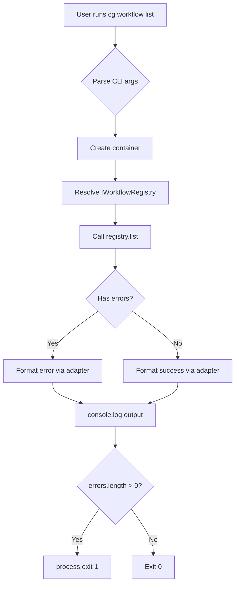
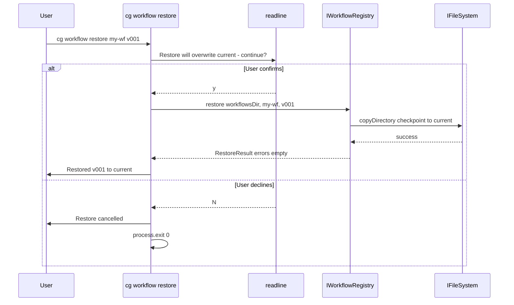

# Phase 5: CLI Commands – Tasks & Alignment Brief

**Spec**: [../../manage-workflows-spec.md](../../manage-workflows-spec.md)
**Plan**: [../../manage-workflows-plan.md](../../manage-workflows-plan.md)
**Date**: 2026-01-25

---

## Executive Briefing

### Purpose

This phase delivers the complete `cg workflow` CLI command suite that enables users to manage workflow templates from the command line. Without these commands, users cannot discover available workflows, create checkpoints before composing, restore previous versions, or view version history—making the checkpoint-based workflow system inaccessible.

### What We're Building

Six CLI subcommands under `cg workflow` (consolidating the old `cg wf` command):

| Command | Purpose |
|---------|---------|
| `cg workflow list` | Display table of all workflow templates with name, checkpoint count, description |
| `cg workflow info <slug>` | Show detailed info for a workflow including version history |
| `cg workflow checkpoint <slug>` | Create a checkpoint from current/ (required before compose) |
| `cg workflow restore <slug> <version>` | Restore a checkpoint to current/ for editing |
| `cg workflow versions <slug>` | List all checkpoints for a workflow |
| `cg workflow compose <slug>` | Create a new run from a checkpoint (moved from `cg wf compose`) |

The old `cg wf` command group is deprecated and removed in favor of the unified `cg workflow` command.

### User Value

Users can now:
1. **Discover** available workflow templates (`cg workflow list`)
2. **Inspect** workflow details and history (`cg workflow info`, `cg workflow versions`)
3. **Version** their templates before running (`cg workflow checkpoint`)
4. **Recover** previous template versions (`cg workflow restore`)
5. **Compose** from specific checkpoints (`cg workflow compose --checkpoint v001`)

### Example

```bash
# Initialize project (Phase 4)
$ cg init

# Create first checkpoint (required before compose)
$ cg workflow checkpoint hello-workflow --comment "Initial release"
✓ Checkpoint created: v001-abc12345

# List available workflows
$ cg workflow list
┌──────────────────┬──────────────────┬─────────────┬────────────────────────────┐
│ Slug             │ Name             │ Checkpoints │ Description                │
├──────────────────┼──────────────────┼─────────────┼────────────────────────────┤
│ hello-workflow   │ Hello Workflow   │ 1           │ A starter workflow         │
└──────────────────┴──────────────────┴─────────────┴────────────────────────────┘

# Compose a run from latest checkpoint
$ cg workflow compose hello-workflow
✓ Workflow 'hello-workflow' composed
  Run directory: .chainglass/runs/hello-workflow/v001-abc12345/run-2026-01-25-001/
```

---

## Objectives & Scope

### Objective

Implement all workflow management CLI commands as specified in the plan, ensuring consistent output formatting, proper DI container usage, and MCP tool exclusion compliance.

### Goals

- ✅ Implement `cg workflow list` command with table/JSON output
- ✅ Implement `cg workflow info <slug>` command with version history
- ✅ Implement `cg workflow checkpoint <slug>` with `--comment` and `--force` flags
- ✅ Implement `cg workflow restore <slug> <version>` with confirmation prompt and `--force`
- ✅ Implement `cg workflow versions <slug>` with sorted version list
- ✅ Move `cg wf compose` to `cg workflow compose` with `--checkpoint` flag
- ✅ Add ConsoleOutputAdapter cases for all 6 workflow commands
- ✅ Remove deprecated `cg wf` command group
- ✅ Verify MCP server does NOT expose workflow management tools (negative test)
- ✅ All commands use `getCliContainer()` per ADR-0004 (no direct adapter instantiation)

### Non-Goals (Scope Boundaries)

- ❌ Web UI integration (deferred to separate plan)
- ❌ `cg run list` command (AC-08, AC-09 - deferred, not in Phase 5 tasks)
- ❌ Init guard for existing commands (T015 from Phase 4 deferred)
- ❌ Template import/export features (not in spec)
- ❌ Workflow deletion command (not in spec)
- ❌ Interactive checkpoint selection (use explicit `--checkpoint` flag)
- ❌ MCP tools for workflow management (explicitly excluded per AC-21, ADR-0001 NEG-005)

---

## Architecture Map

### Component Diagram

```mermaid
flowchart TD
    classDef pending fill:#9E9E9E,stroke:#757575,color:#fff
    classDef inprogress fill:#FF9800,stroke:#F57C00,color:#fff
    classDef completed fill:#4CAF50,stroke:#388E3C,color:#fff
    classDef blocked fill:#F44336,stroke:#D32F2F,color:#fff

    style Phase fill:#F5F5F5,stroke:#E0E0E0
    style TestFiles fill:#F5F5F5,stroke:#E0E0E0
    style CommandFiles fill:#F5F5F5,stroke:#E0E0E0
    style AdapterFiles fill:#F5F5F5,stroke:#E0E0E0
    style OtherFiles fill:#F5F5F5,stroke:#E0E0E0

    subgraph Phase["Phase 5: CLI Commands"]
        T001["T001: Test workflow list ✓"]:::completed
        T002["T002: Test workflow info ✓"]:::completed
        T003["T003: Test workflow checkpoint ✓"]:::completed
        T004["T004: Test workflow restore ✓"]:::completed
        T005["T005: Test workflow versions ✓"]:::completed
        T006["T006: ConsoleOutputAdapter cases ✓"]:::completed
        T007["T007: JsonOutputAdapter verify ✓"]:::completed
        T008["T008: registerWorkflowCommands ✓"]:::completed
        T009["T009: handleWorkflowList ✓"]:::completed
        T010["T010: handleWorkflowInfo ✓"]:::completed
        T011["T011: handleWorkflowCheckpoint ✓"]:::completed
        T012["T012: handleWorkflowRestore ✓"]:::completed
        T013["T013: handleWorkflowVersions ✓"]:::completed
        T014["T014: Register in cg.ts ✓"]:::completed
        T015["T015: Move compose + delete wf.command.ts ✓"]:::completed
        T016["T016: CLI parser tests ✓"]:::completed
        T017["T017: MCP exclusion test ✓"]:::completed
        T018["T018: Manual acceptance testing ✓"]:::completed

        T001 --> T009
        T002 --> T010
        T003 --> T011
        T004 --> T012
        T005 --> T013
        T006 --> T008
        T007 --> T008
        T008 --> T014
        T009 --> T014
        T010 --> T014
        T011 --> T014
        T012 --> T014
        T013 --> T014
        T014 --> T015
        T015 --> T016
        T016 --> T017
        T017 --> T018
    end

    subgraph TestFiles["Test Files"]
        TF1["/test/unit/cli/workflow-command.test.ts ✓"]:::completed
        TF2["/test/integration/cli/workflow-cli.test.ts"]:::pending
        TF3["/test/unit/mcp-server/mcp-exclusion.test.ts"]:::pending
    end

    subgraph CommandFiles["Command Files"]
        CF1["/apps/cli/src/commands/workflow.command.ts ✓"]:::completed
        CF2["/apps/cli/src/commands/wf.command.ts (DELETE)"]:::blocked
        CF3["/apps/cli/src/commands/index.ts ✓"]:::completed
        CF4["/apps/cli/src/cg.ts ✓"]:::completed
    end

    subgraph AdapterFiles["Adapter Files"]
        AF1["/packages/shared/src/adapters/console-output.adapter.ts ✓"]:::completed
        AF2["/packages/shared/src/interfaces/results/registry.types.ts"]:::pending
    end

    subgraph OtherFiles["Other Files"]
        OF1["/apps/cli/src/lib/container.ts"]:::pending
    end

    T001 -.-> TF1
    T002 -.-> TF1
    T003 -.-> TF1
    T004 -.-> TF1
    T005 -.-> TF1
    T006 -.-> AF1
    T006 -.-> AF2
    T008 -.-> CF1
    T009 -.-> CF1
    T010 -.-> CF1
    T011 -.-> CF1
    T012 -.-> CF1
    T013 -.-> CF1
    T014 -.-> CF3
    T014 -.-> CF4
    T015 -.-> CF2
    T016 -.-> TF2
    T017 -.-> TF3
```

<!-- Status: grey=pending, orange=in-progress, green=completed, red=blocked -->
<!-- Updated by plan-6 during implementation -->



### Task-to-Component Mapping

<!-- Status: ⬜ Pending | 🟧 In Progress | ✅ Complete | 🔴 Blocked -->

| Task | Component(s) | Files | Status | Comment |
|------|-------------|-------|--------|---------|
| T001 | Test: workflow list | /test/unit/cli/workflow-command.test.ts | ✅ Complete | TDD RED: table output, JSON output, empty case |
| T002 | Test: workflow info | /test/unit/cli/workflow-command.test.ts | ✅ Complete | TDD RED: found, not found, version history |
| T003 | Test: workflow checkpoint | /test/unit/cli/workflow-command.test.ts | ✅ Complete | TDD RED: success, --comment, --force |
| T004 | Test: workflow restore | /test/unit/cli/workflow-command.test.ts | ✅ Complete | TDD RED: success, --force, prompt mock |
| T005 | Test: workflow versions | /test/unit/cli/workflow-command.test.ts | ✅ Complete | TDD RED: list versions, sort order |
| T006 | ConsoleOutputAdapter | /packages/shared/src/adapters/console-output.adapter.ts | ✅ Complete | Add workflow.* cases |
| T007 | JsonOutputAdapter | (verify existing) | ✅ Complete | Generic envelope handles all commands |
| T008 | registerWorkflowCommands | /apps/cli/src/commands/workflow.command.ts | ✅ Complete | New file with all 6 subcommands |
| T009 | handleWorkflowList | /apps/cli/src/commands/workflow.command.ts | ✅ Complete | GREEN: Tests from T001 pass |
| T010 | handleWorkflowInfo | /apps/cli/src/commands/workflow.command.ts | ✅ Complete | GREEN: Tests from T002 pass |
| T011 | handleWorkflowCheckpoint | /apps/cli/src/commands/workflow.command.ts | ✅ Complete | GREEN: Tests from T003 pass |
| T012 | handleWorkflowRestore | /apps/cli/src/commands/workflow.command.ts | ✅ Complete | GREEN: Tests from T004 pass; prompt logic |
| T013 | handleWorkflowVersions | /apps/cli/src/commands/workflow.command.ts | ✅ Complete | GREEN: Tests from T005 pass |
| T014 | CLI Registration | /apps/cli/src/commands/index.ts, /apps/cli/src/cg.ts | ✅ Complete | Export and register commands |
| T015 | Move compose to workflow | /apps/cli/src/commands/workflow.command.ts, wf.command.ts (delete) | ✅ Complete | Move compose to workflow group; delete wf.command.ts |
| T016 | CLI parser tests | /test/unit/cli/cli-parser.test.ts | ✅ Complete | Update for workflow command group |
| T017 | MCP exclusion test | /test/unit/mcp-server/workflow-exclusion.test.ts | ✅ Complete | Negative test per ADR-0001 NEG-005 |
| T018 | Manual acceptance | N/A (checklist in Commands section) | ✅ Complete | Human verification of all commands |

---

## Tasks

| Status | ID | Task | CS | Type | Dependencies | Absolute Path(s) | Validation | Subtasks | Notes |
|--------|------|------|----|------|--------------|------------------|------------|----------|-------|
| [x] | T001 | Write tests for workflow list command | 2 | Test | – | /home/jak/substrate/007-manage-workflows/test/unit/cli/workflow-command.test.ts | 3 tests: table output, JSON output, empty list | – | TDD RED phase |
| [x] | T002 | Write tests for workflow info command | 2 | Test | – | /home/jak/substrate/007-manage-workflows/test/unit/cli/workflow-command.test.ts | 3 tests: found, not found E030, version history display | – | TDD RED phase |
| [x] | T003 | Write tests for workflow checkpoint command | 2 | Test | – | /home/jak/substrate/007-manage-workflows/test/unit/cli/workflow-command.test.ts | 3 tests: success, --comment flag, --force flag (duplicate) | – | TDD RED phase |
| [x] | T004 | Write tests for workflow restore command | 2 | Test | – | /home/jak/substrate/007-manage-workflows/test/unit/cli/workflow-command.test.ts | 3 tests: success with --force, prompt decline exits, E033 version not found | – | TDD RED phase |
| [x] | T005 | Write tests for workflow versions command | 2 | Test | – | /home/jak/substrate/007-manage-workflows/test/unit/cli/workflow-command.test.ts | 2 tests: list versions descending, E030 workflow not found | – | TDD RED phase |
| [x] | T006 | Add ConsoleOutputAdapter cases for workflow commands | 3 | Core | – | /home/jak/substrate/007-manage-workflows/packages/shared/src/adapters/console-output.adapter.ts, /home/jak/substrate/007-manage-workflows/packages/shared/src/interfaces/results/registry.types.ts | workflow.list, workflow.info, workflow.checkpoint, workflow.restore, workflow.versions cases added | – | Follow existing pattern |
| [x] | T007 | Verify JsonOutputAdapter handles new commands | 1 | Core | – | /home/jak/substrate/007-manage-workflows/packages/shared/src/adapters/json-output.adapter.ts | Generic envelope pattern works; no changes needed if it already handles unknown commands | – | May be no-op |
| [x] | T008 | Implement registerWorkflowCommands() | 2 | Core | T006, T007 | /home/jak/substrate/007-manage-workflows/apps/cli/src/commands/workflow.command.ts | All 6 commands registered with options; help text accurate | – | New file |
| [x] | T009 | Implement handleWorkflowList() | 2 | Core | T001, T008 | /home/jak/substrate/007-manage-workflows/apps/cli/src/commands/workflow.command.ts | Tests from T001 pass; uses getCliContainer() | – | Per ADR-0004 |
| [x] | T010 | Implement handleWorkflowInfo() | 2 | Core | T002, T008 | /home/jak/substrate/007-manage-workflows/apps/cli/src/commands/workflow.command.ts | Tests from T002 pass | – | – |
| [x] | T011 | Implement handleWorkflowCheckpoint() | 2 | Core | T003, T008 | /home/jak/substrate/007-manage-workflows/apps/cli/src/commands/workflow.command.ts | Tests from T003 pass | – | – |
| [x] | T012 | Implement handleWorkflowRestore() | 3 | Core | T004, T008 | /home/jak/substrate/007-manage-workflows/apps/cli/src/commands/workflow.command.ts | Tests from T004 pass; prompts unless --force; declined exits cleanly | – | Use readline for prompt |
| [x] | T013 | Implement handleWorkflowVersions() | 2 | Core | T005, T008 | /home/jak/substrate/007-manage-workflows/apps/cli/src/commands/workflow.command.ts | Tests from T005 pass | – | – |
| [x] | T014 | Register workflow commands in cg.ts | 1 | Integration | T008-T013 | /home/jak/substrate/007-manage-workflows/apps/cli/src/commands/index.ts, /home/jak/substrate/007-manage-workflows/apps/cli/src/cg.ts | Commands appear in `cg --help` and `cg workflow --help` | – | Export from index.ts |
| [x] | T015 | Move compose to workflow group + delete wf.command.ts | 2 | Core | T014 | /home/jak/substrate/007-manage-workflows/apps/cli/src/commands/workflow.command.ts, /home/jak/substrate/007-manage-workflows/apps/cli/src/commands/wf.command.ts (DELETE), /home/jak/substrate/007-manage-workflows/apps/cli/src/commands/init.command.ts | compose lives in workflow.command.ts; wf.command.ts deleted; init.command.ts "Next steps" updated; --checkpoint flag works; uses getCliContainer() | – | Consolidates cg wf → cg workflow |
| [x] | T016 | Update CLI parser tests for workflow commands | 2 | Test | T015 | /home/jak/substrate/007-manage-workflows/test/unit/cli/cli-parser.test.ts | Tests verify `cg workflow` command group exists with subcommands | – | Update existing tests |
| [x] | T017 | Verify MCP tool exclusion (negative test) | 1 | Test | T014 | /home/jak/substrate/007-manage-workflows/test/unit/mcp-server/workflow-exclusion.test.ts | MCP server does NOT expose workflow_list, workflow_checkpoint, etc. | – | Per ADR-0001 NEG-005 |
| [x] | T018 | Manual acceptance testing | 2 | QA | T016 | N/A | All commands verified manually per checklist below | – | Human verification |

---

## Alignment Brief

### Prior Phases Review

#### Phase-by-Phase Summary

**Phase 1: Core IWorkflowRegistry Infrastructure** (commit 0d04b6d)
- Created `IWorkflowRegistry` interface with `list()`, `info()`, `getCheckpointDir()`, `checkpoint()`, `restore()`, `versions()` methods
- Implemented `WorkflowRegistryService` with error codes E030 (WORKFLOW_NOT_FOUND), E033-E039
- Created `FakeWorkflowRegistry` with call capture pattern (ListCall, InfoCall, CheckpointCall, RestoreCall, VersionsCall)
- Added `IHashGenerator` interface and `HashGeneratorAdapter` using node:crypto
- Registered `WORKFLOW_REGISTRY` token in DI container
- Created `createCliProductionContainer()` and `createCliTestContainer()` factories per ADR-0004
- **32 tests** in Phase 1

**Phase 2: Checkpoint & Versioning System** (commit 857e57b)
- Implemented `checkpoint()` with hash-first naming pattern (atomicity without rename)
- Implemented `restore()` with recursive directory copy
- Implemented `versions()` with descending sort by ordinal
- Added `generateWorkflowJson()` utility for auto-generating workflow.json
- Added `.checkpoint.json` metadata files with ordinal, hash, createdAt, comment
- Hash determinism via sorted file paths before concatenation (DYK-02)
- **44 new tests** (63 total including Phase 1)

**Phase 3: Compose Extension for Versioned Runs** (commit a82e24a)
- Extended `compose()` to accept `ComposeOptions` with optional `checkpoint` parameter
- Added `resolveCheckpoint()` method for ordinal/full version matching with ambiguity guard
- Run paths now use versioned structure: `<runsDir>/<slug>/<version>/run-YYYY-MM-DD-NNN/`
- Extended `wf-status.json` with optional fields: `slug`, `version_hash`, `checkpoint_comment`
- Updated schema `wf-status.schema.json` with new optional properties
- **13 new tests** (967 total across codebase)

**Phase 4: Init Command with Starter Templates** (commit current HEAD)
- Created `IInitService` interface with `init()`, `isInitialized()`, `getInitializationStatus()`
- Implemented `InitService` with template hydration and directory creation
- Added `cg init` command with `--force/-f` and `--json` flags
- Extended `IFileSystem` with `copyDirectory()` method
- Bundled `hello-workflow` template in `apps/cli/assets/templates/workflows/`
- Updated esbuild config with `copyBundledAssets()` plugin
- Security fixes: slug validation (SEC-01), error handling (SEC-02)
- **27 tests** for InitService

#### Cumulative Deliverables from All Prior Phases

**Interfaces Available** (for Phase 5 consumption):
| Interface | Package | Key Methods | Notes |
|-----------|---------|-------------|-------|
| `IWorkflowRegistry` | @chainglass/workflow | `list()`, `info()`, `checkpoint()`, `restore()`, `versions()` | Phase 5 CLI commands call these |
| `IWorkflowService` | @chainglass/workflow | `compose(slug, runsDir, options?)` | Phase 5 updates wf compose to use options.checkpoint |
| `IInitService` | @chainglass/workflow | `init()`, `isInitialized()` | Could be used for init guard (deferred) |
| `IOutputAdapter` | @chainglass/shared | `format(command, result)` | Phase 5 adds workflow.* cases |

**Result Types Available**:
| Type | Fields | Used By |
|------|--------|---------|
| `ListResult` | `errors`, `workflows: WorkflowSummary[]` | workflow list |
| `InfoResult` | `errors`, `workflow?: WorkflowInfo` | workflow info |
| `CheckpointResult` | `errors`, `ordinal`, `hash`, `version`, `checkpointPath`, `createdAt` | workflow checkpoint |
| `RestoreResult` | `errors`, `slug`, `version`, `currentPath` | workflow restore |
| `VersionsResult` | `errors`, `slug`, `versions: CheckpointInfo[]` | workflow versions |
| `ComposeResult` | `errors`, `runDir`, `template`, `phases[]` | wf compose (extended) |

**Error Codes for CLI Error Handling**:
| Code | Constant | Message Pattern | CLI Response |
|------|----------|-----------------|--------------|
| E030 | WORKFLOW_NOT_FOUND | "Workflow not found: {slug}" | Exit 1, show action |
| E033 | VERSION_NOT_FOUND | "Checkpoint version not found: {version}" | Exit 1, list available |
| E034 | NO_CHECKPOINT | "Workflow has no checkpoints" | Exit 1, suggest checkpoint cmd |
| E035 | DUPLICATE_CONTENT | "Template unchanged since {version}" | Exit 1 unless --force |
| E036 | INVALID_TEMPLATE | "Invalid template: missing wf.yaml" | Exit 1, show validation errors |

**DI Container Setup** (from Phase 1):
```typescript
// apps/cli/src/lib/container.ts
import { createCliProductionContainer, createCliTestContainer } from './container.js';

// Production usage:
const container = createCliProductionContainer();
const registry = container.resolve<IWorkflowRegistry>(WORKFLOW_DI_TOKENS.WORKFLOW_REGISTRY);
const workflowService = container.resolve<IWorkflowService>(WORKFLOW_DI_TOKENS.WORKFLOW_SERVICE);

// Test usage:
const testContainer = createCliTestContainer();
const fakeRegistry = testContainer.resolve<IWorkflowRegistry>(WORKFLOW_DI_TOKENS.WORKFLOW_REGISTRY);
```

**Fake Patterns Established**:
```typescript
// FakeWorkflowRegistry usage
const fakeRegistry = new FakeWorkflowRegistry();
fakeRegistry.setListResult(workflowsDir, { errors: [], workflows: [...] });
fakeRegistry.setInfoError(workflowsDir, slug, 'E030', 'Workflow not found');
const calls = fakeRegistry.getListCalls();
```

#### Pattern Evolution Across Phases

1. **TDD Discipline**: All phases followed RED-GREEN-REFACTOR strictly
2. **Result Pattern**: All operations return `{ errors: ResultError[], ...data }`, never throw
3. **Container Pattern**: Phase 1 established `createCliProductionContainer()` / `createCliTestContainer()` factories
4. **Fake Pattern**: Three-part API (state setup, error injection, call inspection) used consistently
5. **Hash-First Naming**: Phase 2 established atomic checkpoint creation without rename

#### Test Infrastructure Available

| Category | Files | Description |
|----------|-------|-------------|
| Unit Test Base | test/unit/cli/*.test.ts | CLI command testing patterns |
| Integration Base | test/integration/cli/*.test.ts | E2E CLI testing patterns |
| MCP Test Client | test/base/mcp-test.ts | `createTestClient()` for MCP E2E |
| FakeWorkflowRegistry | @chainglass/workflow | Full fake with presets and call capture |
| FakeInitService | @chainglass/workflow | Fake with static factory methods |

### Critical Findings Affecting This Phase

| Finding | Impact | How Addressed |
|---------|--------|---------------|
| **CD04: CLI DI bypass** | CLI commands must use `getCliContainer()` | T009-T015 use container resolution, not direct instantiation |
| **HD09: Output adapter dispatch** | New commands need ConsoleOutputAdapter cases | T006 adds workflow.* cases following existing pattern |
| **ADR-0001 NEG-005: MCP exclusion** | Workflow management tools NOT exposed via MCP | T017 writes negative test verifying exclusion |
| **ADR-0004 IMP-001: No direct instantiation** | Services must be resolved from containers | All handlers use `container.resolve<T>()` |

### ADR Decision Constraints

**ADR-0001: MCP Tool Design Patterns**
- **Decision**: MCP tools follow naming convention, description structure, annotations
- **Constraint for Phase 5**: Workflow management commands (list, info, checkpoint, restore, versions) must NOT be exposed as MCP tools
- **Addressed by**: T017 negative test verifies MCP server doesn't register these tools

**ADR-0004: Dependency Injection Container Architecture**
- **Decision**: Services resolved from containers, not instantiated directly
- **Constraint for Phase 5**: All CLI handlers must use `createCliProductionContainer()` and resolve services
- **Addressed by**: T009-T015 implementation uses container resolution; removes TODO (T010) from wf.command.ts

### Invariants & Guardrails

1. **Output consistency**: All commands support `--json` flag producing valid JSON envelope
2. **Exit codes**: Success = 0, Failure = 1 (when `result.errors.length > 0`)
3. **Prompt safety**: `restore` prompts before overwriting current/ unless `--force`
4. **DI compliance**: No `new WorkflowService(...)` or `new WorkflowRegistryService(...)` in command handlers

### Inputs to Read

| File | Purpose |
|------|---------|
| `/home/jak/substrate/007-manage-workflows/apps/cli/src/commands/init.command.ts` | Pattern for command implementation |
| `/home/jak/substrate/007-manage-workflows/apps/cli/src/commands/wf.command.ts` | Existing compose command (to be moved to workflow.command.ts, then deleted) |
| `/home/jak/substrate/007-manage-workflows/apps/cli/src/lib/container.ts` | DI container factories |
| `/home/jak/substrate/007-manage-workflows/packages/shared/src/adapters/console-output.adapter.ts` | Output adapter to extend |
| `/home/jak/substrate/007-manage-workflows/packages/workflow/src/interfaces/workflow-registry.interface.ts` | IWorkflowRegistry interface |
| `/home/jak/substrate/007-manage-workflows/packages/shared/src/interfaces/results/registry.types.ts` | Result types for CLI |

### Visual Alignment Aids

#### Flow Diagram: CLI Command Execution



#### Sequence Diagram: Restore with Prompt



### Test Plan (Full TDD)

#### Test File Structure

| File | Tests | Purpose |
|------|-------|---------|
| `test/unit/cli/workflow-command.test.ts` | 14 | Unit tests for all 6 workflow commands |
| `test/integration/cli/workflow-cli.test.ts` | 1 | E2E integration test |
| `test/unit/mcp-server/mcp-exclusion.test.ts` | 1 | MCP negative test |

#### Test Specifications

**T001: workflow list tests (3 tests)**
```typescript
describe('cg workflow list', () => {
  test('should display table of workflows', async () => {
    // Setup: FakeWorkflowRegistry with 2 workflows
    // Assert: output contains slug, name, checkpoint count
  });

  test('should display JSON output with --json flag', async () => {
    // Assert: valid JSON with success envelope
  });

  test('should show helpful message when no workflows', async () => {
    // Setup: empty registry
    // Assert: output contains guidance message
  });
});
```

**T002: workflow info tests (3 tests)**
```typescript
describe('cg workflow info', () => {
  test('should display workflow details', async () => {
    // Setup: FakeWorkflowRegistry with workflow + checkpoints
    // Assert: output contains name, description, version count
  });

  test('should show E030 error for unknown slug', async () => {
    // Setup: FakeWorkflowRegistry.setInfoError(E030)
    // Assert: error output, exit code 1
  });

  test('should display version history', async () => {
    // Assert: checkpoints listed with ordinal, hash, date
  });
});
```

**T003: workflow checkpoint tests (3 tests)**
```typescript
describe('cg workflow checkpoint', () => {
  test('should create checkpoint successfully', async () => {
    // Assert: success message with version
  });

  test('should include --comment in checkpoint', async () => {
    // Assert: FakeWorkflowRegistry.getLastCheckpointCall().options.comment
  });

  test('should allow --force to override duplicate detection', async () => {
    // Setup: first call returns E035
    // Assert: --force bypasses error
  });
});
```

**T004: workflow restore tests (3 tests)**
```typescript
describe('cg workflow restore', () => {
  test('should restore with --force flag', async () => {
    // Assert: no prompt, success message
  });

  test('should exit cleanly when user declines prompt', async () => {
    // Setup: mock readline to return 'n'
    // Assert: exit code 0, "cancelled" message
  });

  test('should show E033 for unknown version', async () => {
    // Setup: FakeWorkflowRegistry.setRestoreError(E033)
    // Assert: error with available versions
  });
});
```

**T005: workflow versions tests (2 tests)**
```typescript
describe('cg workflow versions', () => {
  test('should list versions in descending order', async () => {
    // Setup: registry with v001, v002, v003
    // Assert: v003 appears first
  });

  test('should show E030 for unknown workflow', async () => {
    // Assert: error output
  });
});
```

**T016: Integration test (1 test)**
```typescript
describe('CLI workflow E2E', () => {
  test('should complete full workflow lifecycle', async () => {
    // 1. cg init
    // 2. cg workflow checkpoint hello-workflow
    // 3. cg workflow compose hello-workflow
    // 4. cg workflow list
    // Assert: all succeed
  });
});
```

**T017: MCP exclusion test (1 test)**
```typescript
describe('MCP tool exclusion', () => {
  test('should NOT expose workflow management tools', async () => {
    // Setup: createTestClient()
    // Assert: listTools() does NOT contain workflow_list, workflow_checkpoint, etc.
  });
});
```

### Step-by-Step Implementation Outline

1. **T001-T005 (TDD RED)**: Write all failing tests in `workflow-command.test.ts`
2. **T006**: Add ConsoleOutputAdapter cases for workflow.* commands
3. **T007**: Verify JsonOutputAdapter handles new commands (likely no changes needed)
4. **T008**: Create `workflow.command.ts` with command registration skeleton
5. **T009-T013 (TDD GREEN)**: Implement handlers one by one until tests pass
6. **T014**: Register commands in index.ts and cg.ts
7. **T015**: Move compose to workflow.command.ts, add --checkpoint flag, delete wf.command.ts
8. **T016**: Write and run integration test
9. **T017**: Write MCP exclusion negative test
10. **T018**: Manual acceptance testing (run checklist in fresh temp dir)

### Commands to Run

```bash
# Run Phase 5 tests only
just test -- test/unit/cli/workflow-command.test.ts
just test -- test/integration/cli/workflow-cli.test.ts
just test -- test/unit/mcp-server/mcp-exclusion.test.ts

# Run all tests
just test

# Type check
just typecheck

# Lint
just lint

# Build
just build

# Full quality gate
just check

# Manual verification (build first)
pnpm -F @chainglass/cli build

### T018: Manual Acceptance Testing Checklist

Run these commands in a fresh temp directory and verify output:

```bash
# Setup
cd $(mktemp -d)
export PATH="/home/jak/substrate/007-manage-workflows/apps/cli/dist:$PATH"

# 1. Help text verification
cg --help                          # [ ] Shows 'workflow' command (not 'wf')
cg workflow --help                 # [ ] Shows all 6 subcommands with descriptions

# 2. Init and list (empty state)
cg init                            # [ ] Creates .chainglass/ structure
cg workflow list                   # [ ] Shows hello-workflow with 0 checkpoints
cg workflow list --json            # [ ] Valid JSON envelope

# 3. Checkpoint workflow
cg workflow checkpoint hello-workflow --comment "v1 release"
                                   # [ ] Success message with v001-xxxxxxxx
cg workflow list                   # [ ] Shows 1 checkpoint now
cg workflow versions hello-workflow
                                   # [ ] Shows v001 with comment and date

# 4. Compose from checkpoint
cg workflow compose hello-workflow # [ ] Creates run in versioned path
cg workflow compose hello-workflow --checkpoint v001
                                   # [ ] Works with explicit checkpoint
cg workflow compose hello-workflow --json
                                   # [ ] Valid JSON with runDir, template, phases

# 5. Info command
cg workflow info hello-workflow    # [ ] Shows name, description, versions
cg workflow info nonexistent       # [ ] E030 error with action guidance

# 6. Restore (with prompt)
cg workflow checkpoint hello-workflow --comment "v2"
                                   # [ ] Creates v002
cg workflow restore hello-workflow v001
                                   # [ ] Prompts "Restore will overwrite..."
                                   # [ ] Type 'n' - exits cleanly
cg workflow restore hello-workflow v001 --force
                                   # [ ] Restores without prompt

# 7. Error cases
cg workflow compose nonexistent    # [ ] E030 workflow not found
cg workflow checkpoint hello-workflow
                                   # [ ] E035 duplicate content (unless changed)
cg workflow restore hello-workflow v999
                                   # [ ] E033 version not found

# 8. Old command removed
cg wf compose hello-workflow       # [ ] Command not found / error
```
```

### Risks & Unknowns

| Risk | Severity | Likelihood | Mitigation |
|------|----------|------------|------------|
| Prompt testing complexity | Medium | Medium | Use dependency injection for readline or mock process.stdin |
| Output format consistency | Low | Low | Follow existing ConsoleOutputAdapter pattern exactly |
| MCP test client stability | Low | Low | Test client proven in existing tests |

### Ready Check

- [ ] ADR-0001 constraints mapped to tasks (T017 negative test)
- [ ] ADR-0004 constraints mapped to tasks (T009-T015 use container)
- [ ] All result types available from Phase 1-2
- [ ] FakeWorkflowRegistry supports all needed operations
- [ ] ConsoleOutputAdapter pattern understood
- [ ] DI container factories available

---

## Phase Footnote Stubs

**NOTE**: This section will be populated during implementation by plan-6.

| Ref | Description | Added By |
|-----|-------------|----------|
| | | |

---

## Evidence Artifacts

### Execution Log Location

All implementation progress will be recorded in:
`/home/jak/substrate/007-manage-workflows/docs/plans/007-manage-workflows/tasks/phase-5-cli-commands/execution.log.md`

### Supporting Files

- Test file: `/home/jak/substrate/007-manage-workflows/test/unit/cli/workflow-command.test.ts`
- Integration test: `/home/jak/substrate/007-manage-workflows/test/integration/cli/workflow-cli.test.ts`
- MCP exclusion test: `/home/jak/substrate/007-manage-workflows/test/unit/mcp-server/mcp-exclusion.test.ts`
- Command implementation: `/home/jak/substrate/007-manage-workflows/apps/cli/src/commands/workflow.command.ts`

---

## Discoveries & Learnings

_Populated during implementation by plan-6. Log anything of interest to your future self._

| Date | Task | Type | Discovery | Resolution | References |
|------|------|------|-----------|------------|------------|
| | | | | | |

**Types**: `gotcha` | `research-needed` | `unexpected-behavior` | `workaround` | `decision` | `debt` | `insight`

**What to log**:
- Things that didn't work as expected
- External research that was required
- Implementation troubles and how they were resolved
- Gotchas and edge cases discovered
- Decisions made during implementation
- Technical debt introduced (and why)
- Insights that future phases should know about

_See also: `execution.log.md` for detailed narrative._

---

## Directory Layout

```
docs/plans/007-manage-workflows/
  ├── manage-workflows-spec.md
  ├── manage-workflows-plan.md
  └── tasks/
      ├── phase-1-core-iworkflowregistry-infrastructure/
      │   ├── tasks.md
      │   └── execution.log.md
      ├── phase-2-checkpoint-versioning-system/
      │   ├── tasks.md
      │   └── execution.log.md
      ├── phase-3-compose-extension-versioned-runs/
      │   ├── tasks.md
      │   └── execution.log.md
      ├── phase-4-init-command-starter-templates/
      │   ├── tasks.md
      │   └── execution.log.md
      └── phase-5-cli-commands/
          ├── tasks.md                # This file
          └── execution.log.md        # Created by plan-6
```
